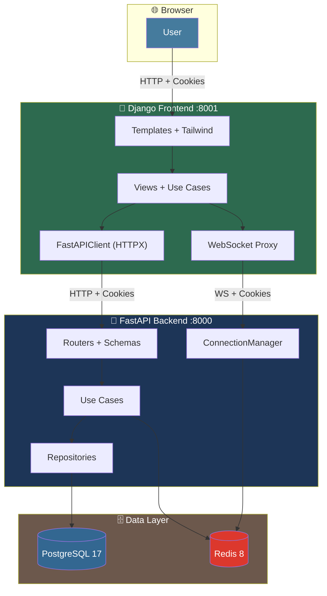

# 📁 โครงสร้างโฟลเดอร์ทั้งหมด 

## ทั้ง 3 ส่วน: FastAPI Backend + Django Frontend + Docker Stack

---

## 🌐 ภาพรวม Monorepo (Root)

```bash
  uv python pin 3.13
  Remove-Item -Recurse -Force .venv
  uv sync
  make migrate
  make dev
```

```bash
  make migrate
  make dev
```
```
project-root/                              # ← Root ของทั้งระบบ
│
├── fastapi-backend/                       # 🐍 ส่วนที่ 1: FastAPI (เดิม — ไม่แก้)
├── django-frontend/                       # 🎨 ส่วนที่ 2: Django BFF (ใหม่)
├── docs/                                  # 📘 เอกสารรวม + AI Prompts
├── scripts/                               # 🛠️ Scripts รวม
├── .gitignore                             # Git ignore รวม
├── .editorconfig                          # Editor config
├── docker-compose.yaml                    # 🐳 Stack รวม 2 ส่วน
├── .env                                   # Env รวม
├── .env.example                           # Env template
└── README.md                              # 📘 เอกสารหลัก
```

---

# 🐍 ส่วนที่ 1: FastAPI Backend  

```
fastapi-backend/
│
├── app/                                   # 📦 แอปพลิเคชันหลัก
│   │
│   ├── __init__.py
│   ├── app.py                             # Entry point — FastAPI()
│   ├── routes.py                          # Router registration
│   ├── middleware.py                      # Middleware registration
│   │
│   ├── core/                              # ⚙️ Cross-cutting concerns
│   │   ├── __init__.py
│   │   ├── settings.py                    # Settings (pydantic-settings)
│   │   ├── security.py                    # Nested JWT (JWS + JWE)
│   │   ├── database.py                    # SQLAlchemy async engine
│   │   ├── cache.py                       # Redis client
│   │   ├── logging.py                     # Loguru + orjson
│   │   ├── middleware.py                  # ResponseFormatting, LogRequest, DeviceId
│   │   └── exceptions.py                  # CoreException
│   │
│   └── modules/                           # 📚 9 modules (ตาม README)
│       │
│       ├── shared/                        # 🔗 Base types (ไม่ routed)
│       │   ├── domain/
│       │   │   ├── entities.py            # BaseEntity, DomainError, Pagination
│       │   │   ├── value_objects.py       # UNSET, Email, Name, Phone
│       │   │   └── enums.py               # Role, ResponseMessages, SortOrder
│       │   ├── application/
│       │   │   ├── use_cases.py           # SharedUseCases
│       │   │   ├── exceptions.py          # StandardException, DomainException
│       │   │   └── utils.py               # BRASILIA_TZ, resolve_client_ip
│       │   ├── infrastructure/
│       │   │   └── models.py              # Base, BaseModel
│       │   └── presentation/
│       │       ├── schemas.py             # StandardResponse, Pagination*
│       │       └── dependencies.py        # Cross-module factories
│       │
│       ├── authentication/                # 🔐 Login/Refresh/Logout
│       │   ├── domain/
│       │   │   ├── entities.py            # Authentication
│       │   │   ├── value_objects.py
│       │   │   └── enums.py
│       │   ├── application/
│       │   │   ├── interfaces.py          # ITokenService
│       │   │   ├── use_cases.py
│       │   │   ├── mappers.py
│       │   │   ├── exceptions.py
│       │   │   └── utils.py
│       │   ├── infrastructure/
│       │   │   ├── models.py              # Authentication, RefreshToken, AccessToken
│       │   │   ├── repositories.py
│       │   │   ├── caches.py
│       │   │   └── services.py            # TokenService
│       │   └── presentation/
│       │       ├── routers.py
│       │       ├── schemas.py
│       │       ├── docs.py
│       │       └── dependencies.py
│       │
│       ├── user/                          # 👤 Accounts + Roles
│       │   ├── domain/
│       │   ├── application/
│       │   ├── infrastructure/
│       │   └── presentation/
│       │
│       ├── key/                           # 🔑 API Keys (canonical)
│       │   ├── domain/
│       │   ├── application/
│       │   ├── infrastructure/
│       │   └── presentation/
│       │
│       ├── knowledge/                     # 📚 CRUD + Broadcast
│       │   ├── domain/
│       │   ├── application/
│       │   ├── infrastructure/
│       │   └── presentation/
│       │
│       ├── notification/                  # 🔔 Role fan-out
│       │   ├── domain/
│       │   ├── application/
│       │   ├── infrastructure/
│       │   └── presentation/
│       │
│       ├── websocket/                     # 🔌 Real-time
│       │   ├── application/
│       │   ├── infrastructure/
│       │   └── presentation/
│       │
│       ├── health/                        # ❤️ Liveness
│       │   └── presentation/
│       │
│       └── example/                       # 📝 Minimal reference
│           └── presentation/
│
├── migrations/                            # 🗄️ Alembic
│   ├── env.py                             # ⚠️ ต้อง import ทุก model
│   ├── script.py.mako
│   └── versions/                          # (empty)
│
├── scripts/                               # 🛠️ Utility scripts
│   ├── create_module.py
│   ├── generate_secret.py
│   ├── generate_fernet.py
│   ├── directory_tree.py
│   ├── websocket_test.html
│   └── asyncapi.yaml
│
├── secrets/keys/                          # 🔐 JWT keys (gitignored)
│   ├── signing-private.pem
│   ├── signing-public.pem
│   ├── encryption-private.pem
│   └── encryption-public.pem
│
├── test/                                  # 🧪 Tests
│   ├── core/
│   └── modules/
│       ├── authentication/
│       ├── example/
│       ├── health/
│       ├── key/
│       ├── knowledge/
│       ├── notifications/
│       ├── shared/
│       ├── user/
│       └── websocket/
│
├── docs/                                  # 📘 Postman + specs
│   └── postman_collection.json
│
├── .env.example
├── .gitignore
├── .python-version
├── alembic.ini
├── docker-compose.yaml                    # FastAPI stack (standalone)
├── Dockerfile
├── Makefile
├── pyproject.toml
├── requirements.txt
├── README.md
└── README-PTBR.md
```

---

# 🎨 ส่วนที่ 2: Django Frontend BFF  

```
django-frontend/
│
├── config/                                # ⚙️ Django Project
│   ├── __init__.py
│   ├── settings.py                        # Settings + INSTALLED_APPS + MIDDLEWARE
│   ├── urls.py                            # Root URLconf
│   ├── asgi.py                            # ASGI (Channels)
│   ├── wsgi.py                            # WSGI (fallback)
│   └── routing.py                         # WebSocket routing
│
├── apps/                                  # 📚 Django Apps
│   │
│   ├── shared/                            # 🔗 Base types
│   │   ├── __init__.py
│   │   ├── apps.py
│   │   ├── domain/
│   │   │   ├── __init__.py
│   │   │   ├── entities.py                # BaseEntity, DomainError, Pagination
│   │   │   ├── value_objects.py           # UNSET, Email, Name, Phone
│   │   │   └── enums.py                   # Role, ResponseMessages, SortOrder
│   │   ├── application/
│   │   │   ├── __init__.py
│   │   │   ├── use_cases.py               # SharedUseCases
│   │   │   ├── interfaces.py              # Protocols
│   │   │   ├── exceptions.py              # StandardException, DomainException
│   │   │   └── utils.py
│   │   ├── infrastructure/
│   │   │   ├── __init__.py
│   │   │   ├── fastapi_client.py          # HTTPX client (Core)
│   │   │   └── middleware.py              # FastAPISessionMiddleware
│   │   └── presentation/
│   │       ├── __init__.py
│   │       ├── context_processors.py      # user_context
│   │       └── dependencies.py            # Factories
│   │
│   ├── layout/                            # 🎨 Layout Components
│   │   ├── __init__.py
│   │   ├── apps.py
│   │   ├── presentation/
│   │   │   ├── __init__.py
│   │   │   ├── views.py
│   │   │   └── urls.py
│   │   └── templates/
│   │       └── layout/
│   │           ├── app_layout.html        # = AppLayoutComponent
│   │           ├── header.html            # = HeaderComponent
│   │           ├── sidebar.html           # = SidebarComponent
│   │           ├── footer.html            # = FooterComponent
│   │           └── layout_settings.html   # = LayoutSettingsComponent
│   │
│   ├── authentication/                    # 🔐 Auth Proxy
│   │   ├── __init__.py
│   │   ├── apps.py
│   │   ├── domain/
│   │   │   ├── __init__.py
│   │   │   └── entities.py
│   │   ├── application/
│   │   │   ├── __init__.py
│   │   │   ├── use_cases.py               # Login, Logout, Refresh
│   │   │   └── interfaces.py              # IAuthService
│   │   ├── infrastructure/
│   │   │   ├── __init__.py
│   │   │   └── fastapi_auth_client.py
│   │   └── presentation/
│   │       ├── __init__.py
│   │       ├── views.py
│   │       ├── urls.py
│   │       └── forms.py
│   │
│   ├── dashboard/                         # 🏠 Dashboard
│   │   ├── __init__.py
│   │   ├── apps.py
│   │   ├── application/
│   │   │   ├── __init__.py
│   │   │   └── use_cases.py
│   │   ├── infrastructure/
│   │   │   ├── __init__.py
│   │   │   └── fastapi_client.py
│   │   └── presentation/
│   │       ├── __init__.py
│   │       ├── views.py
│   │       └── urls.py
│   │
│   ├── user/                              # 👤 User Proxy
│   │   ├── __init__.py
│   │   ├── apps.py
│   │   ├── domain/
│   │   ├── application/
│   │   ├── infrastructure/
│   │   └── presentation/
│   │
│   ├── key/                               # 🔑 API Keys Proxy
│   │   ├── __init__.py
│   │   ├── apps.py
│   │   ├── domain/
│   │   │   ├── __init__.py
│   │   │   ├── entities.py                # Key entity
│   │   │   ├── value_objects.py           # KeySecret, KeyPrefix
│   │   │   └── enums.py                   # KeyStatus, KeyScope
│   │   ├── application/
│   │   │   ├── __init__.py
│   │   │   ├── use_cases.py               # KeyUseCases
│   │   │   ├── interfaces.py              # IKeyRepository, IKeyCache
│   │   │   ├── mappers.py                 # KeyMapper
│   │   │   └── exceptions.py              # KeyException
│   │   ├── infrastructure/
│   │   │   ├── __init__.py
│   │   │   └── fastapi_client.py          # KeyFastAPIClient
│   │   └── presentation/
│   │       ├── __init__.py
│   │       ├── views.py
│   │       ├── urls.py
│   │       └── forms.py
│   │
│   ├── knowledge/                         # 📚 Knowledge Proxy
│   │   ├── __init__.py
│   │   ├── apps.py
│   │   ├── domain/
│   │   ├── application/
│   │   ├── infrastructure/
│   │   └── presentation/
│   │
│   ├── notification/                      # 🔔 Notification Proxy
│   │   ├── __init__.py
│   │   ├── apps.py
│   │   ├── domain/
│   │   ├── application/
│   │   ├── infrastructure/
│   │   └── presentation/
│   │
│   ├── websocket/                         # 🔌 WebSocket Proxy
│   │   ├── __init__.py
│   │   ├── apps.py
│   │   ├── application/
│   │   │   ├── __init__.py
│   │   │   └── consumers.py               # NotificationProxyConsumer
│   │   ├── infrastructure/
│   │   │   ├── __init__.py
│   │   │   └── fastapi_ws_client.py
│   │   └── presentation/
│   │       ├── __init__.py
│   │       └── routing.py
│   │
│   └── core/                              # 🛠️ Core utilities
│       ├── __init__.py
│       ├── apps.py
│       ├── application/
│       │   ├── __init__.py
│       │   └── use_cases.py
│       ├── infrastructure/
│       │   ├── __init__.py
│       │   └── services.py
│       └── presentation/
│           ├── __init__.py
│           └── views.py                   # HealthView, ErrorViews
│
├── templates/                             # 🎨 Global Templates
│   │
│   ├── base.html                          # ← App Layout (extends)
│   │
│   ├── partials/                          # Layout partials
│   │   ├── header.html
│   │   ├── sidebar.html
│   │   ├── footer.html
│   │   ├── layout-settings.html
│   │   ├── page-header.html
│   │   ├── pagination.html
│   │   ├── messages.html
│   │   └── confirm-modal.html
│   │
│   ├── authentication/
│   │   ├── login.html
│   │   └── logout.html
│   │
│   ├── dashboard/
│   │   └── index.html
│   │
│   ├── user/
│   │   ├── me.html
│   │   └── list.html
│   │
│   ├── key/
│   │   ├── list.html
│   │   ├── detail.html
│   │   └── form.html
│   │
│   ├── knowledge/
│   │   ├── list.html
│   │   ├── detail.html
│   │   └── form.html
│   │
│   ├── notification/
│   │   └── list.html
│   │
│   └── errors/
│       ├── 400.html
│       ├── 403.html
│       ├── 404.html
│       └── 500.html
│
├── static/                                # 🎨 Static files
│   │
│   ├── css/
│   │   ├── tailwind.css                   # ← Tailwind source
│   │   ├── tailwind.output.css            # ← Build output
│   │   └── app.css                        # Custom overrides
│   │
│   ├── js/
│   │   ├── app.js                         # Alpine.js root
│   │   ├── header.js
│   │   ├── sidebar.js
│   │   ├── layout-settings.js
│   │   ├── websocket.js
│   │   └── api.js
│   │
│   └── img/
│       ├── logo.svg
│       ├── logo-dark.svg
│       └── favicon.ico
│
├── test/                                  # 🧪 Tests
│   ├── __init__.py
│   ├── conftest.py
│   ├── core/
│   └── modules/
│       ├── shared/
│       ├── layout/
│       ├── authentication/
│       ├── dashboard/
│       ├── user/
│       ├── key/
│       ├── knowledge/
│       ├── notification/
│       └── websocket/
│
├── .env                                   # Local env (gitignored)
├── .env.example
├── .gitignore
├── .editorconfig
├── Dockerfile                             # Django container
├── docker-compose.yaml                    # Django stack (standalone)
├── manage.py
├── requirements.txt
├── pyproject.toml
├── tailwind.config.js
├── postcss.config.js
└── README.md
```

---

# 📘 ส่วนที่ 3: Docs & AI Prompts (Root-level)

```
docs/
│
├── README.md                              # 📑 Index 68 modules
├── template_modules.md                    # 📘 Master template
├── Design.md                              # 🏗️ Architecture design
├── ERP-Part-1-2.md                        # 📗 ERP design doc
│
└── prompts/                               # 📄 1 module = 1 file
    │
    ├── layer-0-core/                      # (6 modules)
    │   ├── money.md
    │   ├── tenant_context.md
    │   ├── audit.md
    │   ├── idempotency.md
    │   ├── config.md
    │   └── events.md
    │
    ├── layer-1-foundation/                # (11 modules)
    │   ├── tenancy.md
    │   ├── authentication.md
    │   ├── user.md
    │   ├── employee.md
    │   ├── customer.md
    │   ├── supplier.md
    │   ├── product.md
    │   ├── pricing.md
    │   ├── key.md                         # ← ตัวอย่างเต็ม
    │   ├── knowledge.md
    │   └── notification.md
    │
    ├── layer-2-money-path/                # (7 modules)
    │   ├── order.md
    │   ├── invoice.md
    │   ├── ledger.md
    │   ├── payment.md
    │   ├── accounting_gateway.md
    │   ├── tax.md
    │   └── reconciliation.md
    │
    ├── layer-3-goods-path/                # (13 modules)
    │   ├── inventory.md
    │   ├── warehouse.md
    │   ├── lot.md
    │   ├── production.md
    │   ├── recipe.md
    │   ├── quality.md
    │   ├── waste.md
    │   ├── procurement.md
    │   ├── traceability.md
    │   ├── agriculture.md
    │   ├── crop.md
    │   ├── soil.md
    │   └── irrigation.md
    │
    ├── layer-4-operations/                # (13 modules)
    │   ├── transport.md
    │   ├── delivery.md
    │   ├── route.md
    │   ├── gps.md
    │   ├── retail.md
    │   ├── pos.md
    │   ├── shift.md
    │   ├── line_channel.md
    │   ├── promotion.md
    │   ├── loyalty.md
    │   ├── crm.md
    │   ├── campaign.md
    │   └── support.md
    │
    ├── layer-5-intelligence/              # (7 modules)
    │   ├── reporting.md
    │   ├── analytics.md
    │   ├── forecast.md                    # ← ตัวอย่างเต็ม
    │   ├── kpi.md
    │   ├── satisfaction.md
    │   ├── recommendation.md
    │   └── oee.md
    │
    ├── layer-6-monitoring/                # (8 modules)
    │   ├── iot.md
    │   ├── cctv.md
    │   ├── monitoring.md
    │   ├── backup.md
    │   ├── alerting.md
    │   ├── audit_viewer.md
    │   ├── maintenance.md
    │   └── energy.md
    │
    └── layer-7-templates/                 # (3 modules)
        ├── health.md
        ├── example.md
        └── blank.md
```

---

# 🐳 ส่วนที่ 4: Docker Stack รวม (Root-level)

```
project-root/
│
├── docker-compose.yaml                    # 🐳 Stack รวม 2 ส่วน
├── .env                                   # Env รวม
└── .env.example                           # Env template
```

### `docker-compose.yaml` (Root)

```yaml
name: "erp-iot-crm-iot"

services:
  # ═══════════════════════════════════════════════════════
  # 🐍 FastAPI Backend (เดิม — ไม่แก้)
  # ═══════════════════════════════════════════════════════
  api:
    build:
      context: ./fastapi-backend
      dockerfile: Dockerfile
    container_name: erp-iot-api
    depends_on:
      database:
        condition: service_healthy
      cache:
        condition: service_healthy
    expose:
      - "${APPLICATION_PORT}"
    networks:
      - erp-iot-network
    ports:
      - "${APPLICATION_PORT}:2000"
    restart: unless-stopped
    volumes:
      - ./fastapi-backend:/app
    environment:
      - APPLICATION_ENVIRONMENT=${APPLICATION_ENVIRONMENT}
      - POSTGRESQL_HOST=database
      - POSTGRESQL_PORT=5432
      - POSTGRESQL_DATABASE=${POSTGRESQL_DATABASE}
      - POSTGRESQL_USERNAME=${POSTGRESQL_USERNAME}
      - POSTGRESQL_PASSWORD=${POSTGRESQL_PASSWORD}
      - REDIS_HOST=cache
      - REDIS_PORT=6379
      - REDIS_PASSWORD=${REDIS_PASSWORD}

  # ═══════════════════════════════════════════════════════
  # 🎨 Django Frontend BFF (ใหม่)
  # ═══════════════════════════════════════════════════════
  frontend:
    build:
      context: ./django-frontend
      dockerfile: Dockerfile
    container_name: erp-iot-frontend
    depends_on:
      - api
    expose:
      - "${DJANGO_PORT}"
    networks:
      - erp-iot-network
    ports:
      - "${DJANGO_PORT}:8001"
    restart: unless-stopped
    volumes:
      - ./django-frontend:/app
    environment:
      - DJANGO_SECRET_KEY=${DJANGO_SECRET_KEY}
      - DJANGO_DEBUG=${DJANGO_DEBUG}
      - DJANGO_ALLOWED_HOSTS=${DJANGO_ALLOWED_HOSTS}
      - FASTAPI_BASE_URL=http://api:2000
      - FASTAPI_TIMEOUT=${FASTAPI_TIMEOUT}

  # ═══════════════════════════════════════════════════════
  # ⚡ Redis Cache
  # ═══════════════════════════════════════════════════════
  cache:
    image: "redis:8.6-alpine"
    container_name: erp-iot-cache
    command: >
      redis-server
      --requirepass "${REDIS_PASSWORD}"
      --appendonly yes
      --appendfsync everysec
      --maxmemory ${REDIS_MAX_MEMORY}
      --maxmemory-policy ${REDIS_MAX_MEMORY_POLICY}
      --databases ${REDIS_DATABASES}
    environment:
      - "REDIS_PASSWORD=${REDIS_PASSWORD}"
    expose:
      - "${REDIS_PORT}"
    healthcheck:
      test: [ "CMD-SHELL", "redis-cli -a \"$${REDIS_PASSWORD}\" --no-auth-warning ping | grep -q PONG" ]
      interval: 3s
      timeout: 5s
      retries: 20
      start_period: 5s
    networks:
      - erp-iot-network
    ports:
      - "${REDIS_PORT}:6379"
    restart: unless-stopped
    volumes:
      - redis_data:/data

  # ═══════════════════════════════════════════════════════
  # 🗄️ PostgreSQL
  # ═══════════════════════════════════════════════════════
  database:
    container_name: erp-iot-database
    image: "postgres:17-alpine"
    environment:
      - "POSTGRES_DB=${POSTGRESQL_DATABASE}"
      - "POSTGRES_USER=${POSTGRESQL_USERNAME}"
      - "POSTGRES_PASSWORD=${POSTGRESQL_PASSWORD}"
    expose:
      - "${POSTGRESQL_PORT}"
    healthcheck:
      test: [ "CMD-SHELL", "pg_isready -d \"$${POSTGRES_DB}\" -U \"$${POSTGRES_USER}\"" ]
      interval: 3s
      timeout: 5s
      retries: 20
      start_period: 5s
    networks:
      - erp-iot-network
    ports:
      - "${POSTGRESQL_PORT}:5432"
    restart: unless-stopped
    volumes:
      - postgres_data:/var/lib/postgresql/data/

  # ═══════════════════════════════════════════════════════
  # 🎛️ pgAdmin (optional)
  # ═══════════════════════════════════════════════════════
  database-admin:
    image: "dpage/pgadmin4:9.2"
    container_name: erp-iot-database-admin
    depends_on:
      database:
        condition: service_healthy
    environment:
      - "PGADMIN_DEFAULT_EMAIL=${PGADMIN_EMAIL}"
      - "PGADMIN_DEFAULT_PASSWORD=${PGADMIN_PASSWORD}"
    expose:
      - "${PGADMIN_PORT}"
    networks:
      - erp-iot-network
    ports:
      - "${PGADMIN_PORT}:80"
    restart: unless-stopped
    volumes:
      - pgadmin_data:/var/lib/pgadmin

  # ═══════════════════════════════════════════════════════
  # 🎛️ RedisInsight (optional)
  # ═══════════════════════════════════════════════════════
  cache-admin:
    image: "redis/redisinsight:3.4.2"
    container_name: erp-iot-cache-admin
    depends_on:
      cache:
        condition: service_healthy
    environment:
      - "RI_REDIS_HOST=cache"
      - "RI_REDIS_PORT=6379"
      - "RI_REDIS_USERNAME=${REDIS_USERNAME}"
      - "RI_REDIS_PASSWORD=${REDIS_PASSWORD}"
      - "RI_REDIS_ALIAS=${REDISINSIGHT_REDIS_ALIAS}"
    expose:
      - "${REDISINSIGHT_PORT}"
    networks:
      - erp-iot-network
    ports:
      - "${REDISINSIGHT_PORT}:5540"
    restart: unless-stopped
    volumes:
      - redisinsight_data:/data

volumes:
  postgres_data:
  pgadmin_data:
  redis_data:
  redisinsight_data:

networks:
  erp-iot-network:
    name: erp-iot-network
    driver: bridge
```

---

# 🔧 ส่วนที่ 5: Dockerfiles

### `fastapi-backend/Dockerfile`

```dockerfile
FROM python:3.14-slim

WORKDIR /app
COPY requirements.txt .

RUN pip install --no-cache-dir -r requirements.txt

COPY . .

EXPOSE 2000

CMD ["uvicorn", "app.app:app", "--host", "0.0.0.0", "--proxy-headers", "--port", "2000"]
```

### `django-frontend/Dockerfile`

```dockerfile
FROM python:3.14-slim

WORKDIR /app

# ติดตั้ง system dependencies
RUN apt-get update && apt-get install -y \
    nodejs npm \
    && rm -rf /var/lib/apt/lists/*

# ติดตั้ง Python dependencies
COPY requirements.txt .
RUN pip install --no-cache-dir -r requirements.txt

# ติดตั้ง Node dependencies (สำหรับ Tailwind build)
COPY package.json .
RUN npm install

# คัดลอก source code
COPY . .

# Build Tailwind CSS
RUN npm run build:css || echo "Tailwind build skipped"

# Collect static files
RUN python manage.py collectstatic --noinput || echo "collectstatic skipped"

EXPOSE 8001

CMD ["daphne", "-b", "0.0.0.0", "-p", "8001", "config.asgi:application"]
```

---

# 📊 Module Mapping (Django ↔ FastAPI)

| Django App | → | FastAPI Module | Endpoint |
|---|---|---|---|
| `shared` | → | `shared` | (base types) |
| `layout` | → | (N/A) | (UI only) |
| `authentication` | → | `authentication` | `/api/v1/authentication/` |
| `dashboard` | → | (composite) | (combines many) |
| `user` | → | `user` | `/api/v1/user/` |
| `key` | → | `key` | `/api/v1/key/` |
| `knowledge` | → | `knowledge` | `/api/v1/knowledge/` |
| `notification` | → | `notification` | `/api/v1/notification/` |
| `websocket` | → | `websocket` | `/api/v1/websocket/connect/` |
| `core` | → | `health` | `/health/` |

---

# 🌐 Dataflow Diagram



---

# 📋 สรุป

| ส่วน | Path | หน้าที่ | จำนวน |
|---|---|---|---|
| **🐍 FastAPI Backend** | `fastapi-backend/` | API-only (ไม่แก้) | 9 modules |
| **🎨 Django Frontend** | `django-frontend/` | BFF + Proxy + Render | 9 apps |
| **📘 Docs & AI Prompts** | `docs/` | เอกสาร + 68 prompts | 68 files |
| **🐳 Docker Stack** | `docker-compose.yaml` | Stack รวม | 6 services |
| **🛠️ Scripts** | `scripts/` | Utility scripts | 6 files |

---

# 🚀 Quick Start

```bash
# 1. Clone repo
git clone <repo-url>
cd project-root

# 2. Copy env
cp .env.example .env

# 3. รัน FastAPI stack (standalone)
cd fastapi-backend
make dependencies-up-silent
make dev
# → http://localhost:8000

# 4. รัน Django Frontend (standalone)
cd ../django-frontend
python -m venv .venv
source .venv/bin/activate
pip install -r requirements.txt
python manage.py runserver 8001
# → http://localhost:8001

# 5. หรือรันทั้ง stack (root)
cd ..
docker compose up --build
# → Django: http://localhost:8001
# → FastAPI: http://localhost:8000
# → pgAdmin: http://localhost:8080
# → RedisInsight: http://localhost:8081

 
```

---

**ผู้แต่ง:** Kongnakorn Jantakun
**อีเมล:** kongnakornjantakun@gmail.com
**เวอร์ชัน:** 2.0.0
**อัปเดต:** 2026-09-17
**สถานะ:** ✅ พร้อมใช้งาน
