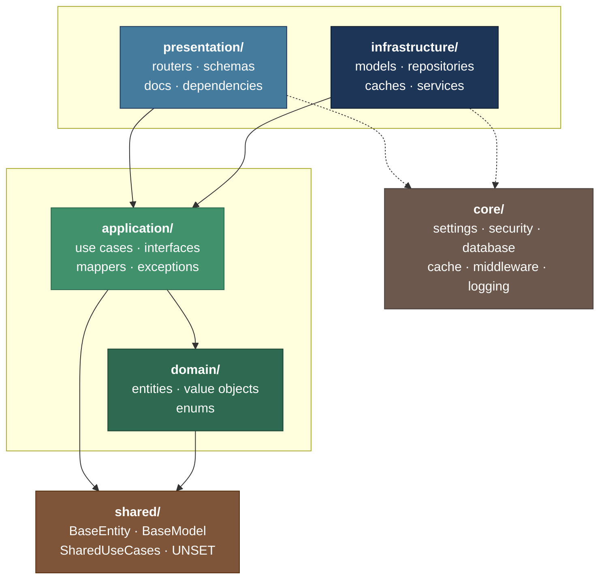
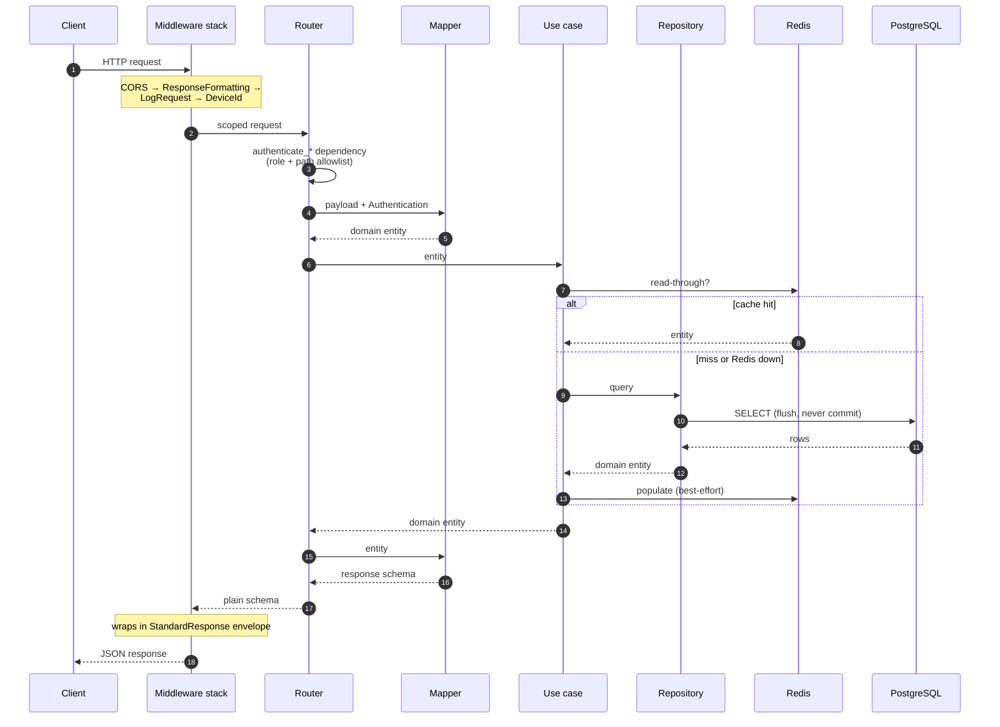
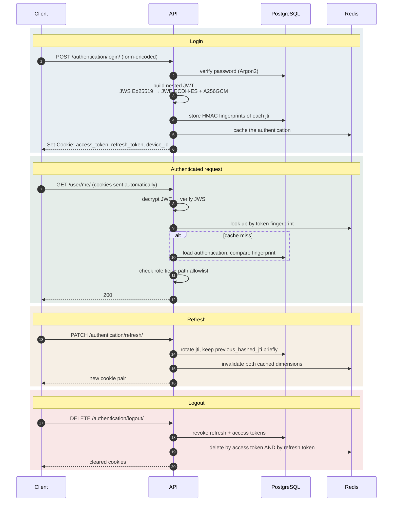
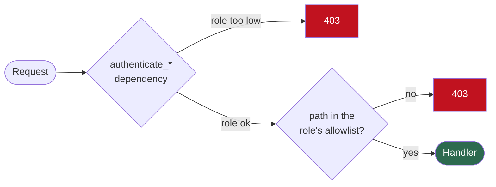
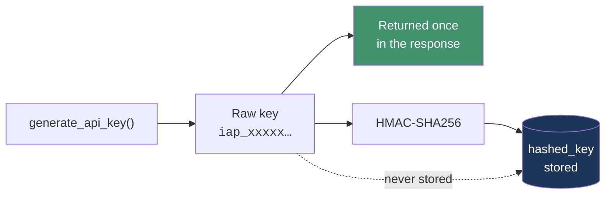
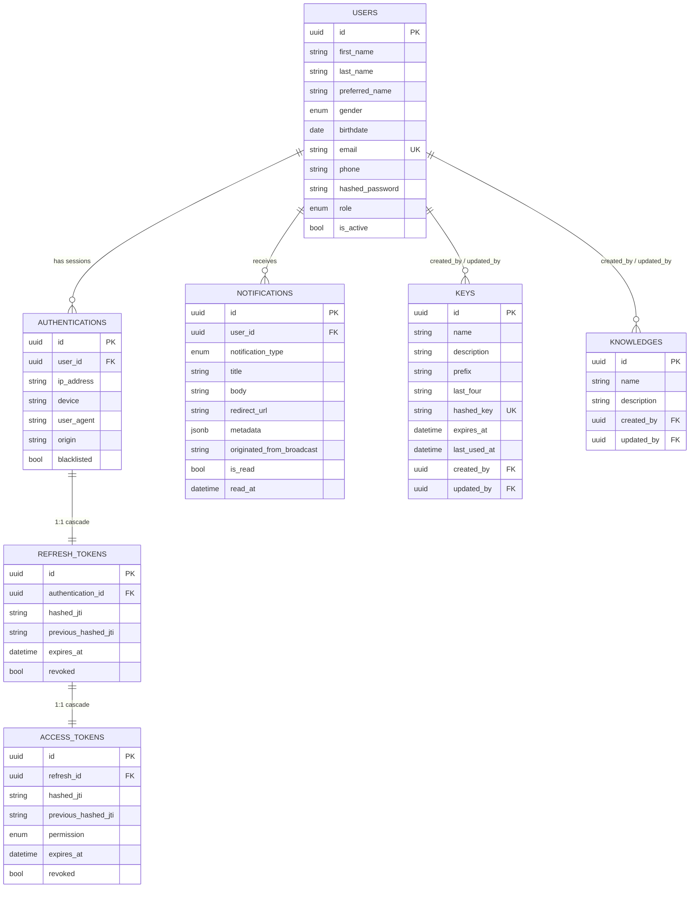
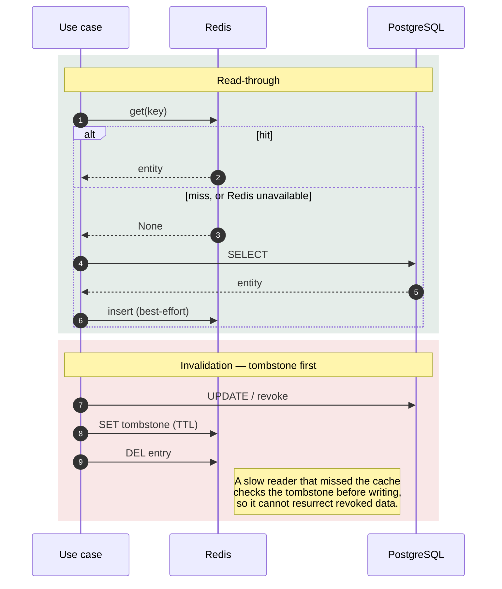
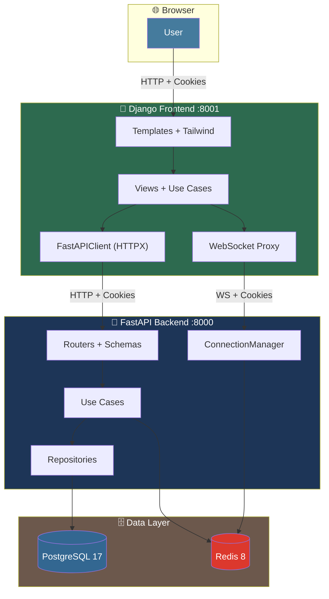

<div align="center">

# ERP-IoT

**A production-shaped Python backend template — Clean Architecture, Domain-Driven Design, and everything already wired.**

[](https://www.python.org/)
[](https://fastapi.tiangolo.com/)
[](https://docs.pydantic.dev/)
[](https://www.sqlalchemy.org/)
[](https://www.postgresql.org/)
[](https://redis.io/)
[](https://www.docker.com/)
[](https://docs.astral.sh/uv/)
[](https://docs.astral.sh/ruff/)
[](LICENSE)

[](https://github.com/kongnakornna/fastapi-clean-architecture-ddd-erp-iot/fastapi-clean-architecture-ddd-template/stargazers)
[](https://github.com/kongnakornna/fastapi-clean-architecture-ddd-erp-iot/fastapi-clean-architecture-ddd-template/network/members)
[](https://github.com/kongnakornna/fastapi-clean-architecture-ddd-erp-iot/fastapi-clean-architecture-ddd-template/issues)
[](https://github.com/kongnakornna/fastapi-clean-architecture-ddd-erp-iot/fastapi-clean-architecture-ddd-template/commits)

**English** · [Português](README-PTBR.md)

</div>

---

Most "clean architecture" templates give you empty folders and a diagram. This one gives you a
**working application**: cookie-based authentication with nested JWTs, API-key management with
rotation, role-based access control enforced twice over, Redis cache-aside with tombstone
invalidation, real-time WebSocket delivery, notifications with role fan-out, and a Docker stack
that migrates itself on boot.

Nine modules, twenty-three routes, seven tables — all following one consistent set of patterns you
can copy for the tenth module.

## Table of Contents

- [Why This Template](#why-this-template)
- [Quick Start](#quick-start)
- [Architecture](#architecture)
- [Modules](#modules)
- [API Reference](#api-reference)
- [Security](#security)
- [Data](#data)
- [Caching](#caching)
- [Development](#development)
- [Configuration](#configuration)
- [Known Limitations](#known-limitations)
- [Contributing](#contributing)
- [License](#license)

---

## Why This Template

| | Feature | What you actually get |
|---|---|---|
| 🏛️ | **Clean Architecture + DDD** | Four layers per module with enforced dependency direction. `domain/` imports no framework — ever. |
| 🔐 | **Authentication, done properly** | Nested JWT (JWS signed with Ed25519, wrapped in a JWE encrypted with ECDH-ES + A256GCM), delivered in HTTP-only cookies, with HMAC fingerprints stored server-side so tokens are revocable. |
| 🔑 | **API keys** | Full lifecycle — create, list, rotate, revoke. The raw key is returned exactly once and never stored. |
| 👥 | **Role-based access** | `admin` / `manager` / `user`, enforced by the dependency **and** by a path allowlist. Two independent gates. |
| ⚡ | **Redis cache-aside** | Namespaced and versioned keys, with tombstone invalidation that closes the revoked-credential race. Caches never raise — a Redis outage degrades to the database. |
| 🔔 | **Notifications** | Per-user and role-cascaded broadcast fan-out, dispatched over WebSocket best-effort after the write commits. |
| 🔌 | **WebSockets** | Authenticated channel with Origin validation, since CORS does not cover the handshake. |
| 📦 | **Self-migrating stack** | `docker compose up` gives you Postgres, Redis, pgAdmin and RedisInsight; the app runs Alembic to head on startup. |
| 📖 | **OpenAPI that means something** | Every endpoint documents its full error contract, not just the happy path. |

---

## Quick Start

### Prerequisites

| Tool | Version | Why |
|---|---|---|
| [Python](https://www.python.org/) | 3.14+ | Pinned in `.python-version` |
| [uv](https://docs.astral.sh/uv/) | latest | Dependency and virtualenv management |
| [Docker](https://www.docker.com/) + Compose | latest | Postgres, Redis, and the admin UIs |

### Five commands

```bash
# 1. Clone
git clone fastapi-clean-architecture-ddd-erp-iot
cd fastapi-clean-architecture-ddd-template
# 1.1 Install make
choco install make

# 2. Configure — every key in .env.example must have a value
cp .env.example .env

# 3. Install dependencies
uv sync

# 4. Start Postgres, Redis and the admin UIs
make dependencies-up-silent

# 5. Run the API (migrations apply automatically on boot)
make dev
```

> [!IMPORTANT]
> Step 2 is not optional. `Settings` declares most fields as **required**, so the app raises a
> `ValidationError` on startup if any key is left empty. See
> [Configuration](#configuration) for every key and a sensible value.

### What you get

| Service | URL | Notes |
|---|---|---|
| **API** | http://localhost:8000 | `APPLICATION_PORT` |
| **Swagger UI** | http://localhost:8000/docs | Disabled in `production` |
| **ReDoc** | http://localhost:8000/redoc | Disabled in `production` |
| **OpenAPI JSON** | http://localhost:8000/openapi.json | Disabled in `production` |
| **Health check** | http://localhost:8000/health/ | Public |
| **pgAdmin** | http://localhost:8080 | `PGADMIN_EMAIL` / `PGADMIN_PASSWORD` |
| **RedisInsight** | http://localhost:8081 | Pre-wired to the `cache` service |
| **Dev tools** | http://localhost:8000/devtools/ | `development` only — WebSocket test client, AsyncAPI docs |

### First request

An admin user is seeded from `SECURITY_ADMIN_EMAIL` / `SECURITY_ADMIN_PASSWORD`. Log in — note
that this endpoint takes **form-encoded** data, not JSON:

```bash
curl -X POST http://localhost:8000/api/v1/authentication/login/ \
  -H "Content-Type: application/x-www-form-urlencoded" \
  -d "username=$SECURITY_ADMIN_EMAIL&password=$SECURITY_ADMIN_PASSWORD" \
  -c cookies.txt

curl http://localhost:8000/api/v1/user/me/ -b cookies.txt
```

> [!TIP]
> A Postman collection covering every endpoint lives at
> [`docs/`](docs/). Import it, then fill in the `admin_email` and `admin_password`
> collection variables.

---

## Architecture

Every module is split into four layers. Dependencies point **inward only** — the domain knows
nothing about anything else.



| Layer | Directory | Contains | May import |
|---|---|---|---|
| **Domain** | `domain/` | `entities.py`, `value_objects.py`, `enums.py` | `shared` only. **No** FastAPI, SQLAlchemy, or Pydantic. |
| **Application** | `application/` | `use_cases.py`, `interfaces.py`, `mappers.py`, `exceptions.py`, `utils.py` | `domain`, `shared` |
| **Infrastructure** | `infrastructure/` | `models.py`, `repositories.py`, `caches.py`, `services.py` | `domain`, `application`, `core` |
| **Presentation** | `presentation/` | `routers.py`, `schemas.py`, `docs.py`, `dependencies.py` | everything below it |

The application layer depends on `typing.Protocol` contracts, never on concrete classes. That is
what makes a use case testable with an in-memory fake and lets you swap Postgres for anything
else without touching business logic.

<details>
<summary><b>The three error-handling shapes</b> — one per layer kind</summary>

<br/>

Getting this wrong is the most consequential mistake in the codebase, so it is worth stating
precisely.

**3-branch** — use cases and router handlers:

```python
except StandardException:
    raise
except DomainError as e:
    raise DomainException(e)
except Exception as e:
    logger.opt(exception=e).error("An error occurred in the create key endpoint.")
    raise KeyException()
```

**2-branch** — repositories and services. No `DomainError` branch: these layers never evaluate
domain rules.

```python
except StandardException:
    raise
except Exception as e:
    logger.opt(exception=e).error("An error occurred in the create key repository.")
    raise KeyException()
```

**Never-raise** — caches. Every method catches, logs, and returns `None`.

```python
except Exception as e:
    logger.opt(exception=e).error(
        "An error occurred in the get key by hashed key cache. Falling back to the database."
    )
    return None
```

> [!WARNING]
> `except StandardException` **must come first**. `StandardException` extends
> `HTTPException`, so any other ordering swallows every deliberate 404 and 409 into a 500.

A cache failure degrades to the database and must never fail a request — that is why the cache
shape has no re-raise branch at all.

</details>

<details>
<summary><b>Module anatomy</b> — every file and what belongs in it</summary>

<br/>

```text
app/modules/{module}/
├── domain/
│   ├── entities.py          Dataclasses extending BaseEntity; validation in __post_init__
│   ├── value_objects.py     Plain classes: _normalize → _validate → __str__ → __eq__
│   └── enums.py             Module enums, always (str, Enum)
├── application/
│   ├── interfaces.py        Protocol contracts: I{Entity}Repository / Cache / Service
│   ├── use_cases.py         One {Module}UseCases class; business rules live here
│   ├── mappers.py           # ENTITY / DTOS · # ENTITY / MODELS · # ENTITY / CACHE
│   ├── exceptions.py        Generic {Module}Exception + one per business rule
│   └── utils.py             Module-local helpers
├── infrastructure/
│   ├── models.py            SQLAlchemy models extending BaseModel
│   ├── repositories.py      Postgres{Entity}Repository — flush(), never commit()
│   ├── caches.py            Redis{Entity}Cache — namespaced, tombstoned, never raises
│   └── services.py          External or stateful systems behind a Protocol
└── presentation/
    ├── routers.py           Handlers: payload → mapper → use case → mapper → return
    ├── schemas.py           Pydantic v2 with full Field + ConfigDict
    ├── docs.py              router_docs + one {action}_docs per endpoint
    └── dependencies.py      Depends factories, returning the Protocol type
```

Empty files are normal. A module keeps the full skeleton even when a layer file is unused — an
empty `caches.py` means "this module does not cache", not "someone forgot a file".

`scripts/create_module.py` generates this exact tree.

</details>

### Request lifecycle



Handlers never build the response envelope — `ResponseFormattingMiddleware` does that. Handlers
never contain business logic — the use case does that. The body of every handler is exactly
`payload → mapper → use case → mapper → return`.

---

## Modules

```text
app/modules/
├── shared/           Base types every module builds on — not routed
├── authentication/   Login, refresh, logout; nested JWT issuance
├── user/             Internal accounts and roles
├── key/              API keys — the most complete module
├── knowledge/        CRUD + broadcast notification reference
├── notification/     Per-user and role fan-out
├── websocket/        Real-time delivery
├── health/           Liveness and Alembic version
└── example/          Minimal reference module, no persistence
```

| Module | Routes | Persistence | Cache | Service | Role |
|---|---|---|---|---|---|
| `authentication` | 3 | ✅ | ✅ | `ITokenService` | Session lifecycle, token rotation |
| `key` | 6 | ✅ | ✅ | `IKeyService` | **Canonical reference** — copy this one |
| `user` | 2 | ✅ | — | — | Accounts, roles, `/me` |
| `knowledge` | 4 | ✅ | partial | — | CRUD + broadcast notifications |
| `notification` | 2 | ✅ | — | — | Per-user + role-cascaded fan-out |
| `websocket` | 1 + WS | — | — | `IConnectionManagerService` | In-memory, single-process |
| `health` | 3 | `alembic_version` | — | — | Liveness, docs redirect, migration state |
| `example` | 1 | — | — | — | Minimal demo; no repository, no model |
| `shared` | — | base types | — | — | `BaseEntity`, `BaseModel`, `SharedUseCases` |

> [!TIP]
> When a pattern is ambiguous, read **`key`**. It is the only module exercising every layer:
> cache with tombstones, a service, full CRUD plus rotation, actor projections, and transient
> secret handling.

<details>
<summary><b>What lives in <code>shared</code></b></summary>

<br/>

| File | Exports |
|---|---|
| `domain/entities.py` | `BaseEntity`, `DomainError`, `DomainErrors`, `Pagination`, `PaginatedList` |
| `domain/value_objects.py` | `UNSET`, `RESOURCE_NAME_PATTERN`, `Email`, `Name`, `Phone` |
| `domain/enums.py` | `ApplicationEnvironment`, `CookieSameSite`, `ResponseMessages`, `Role`, `SortOrder` |
| `infrastructure/models.py` | `Base`, `BaseModel` |
| `application/exceptions.py` | `StandardException`, `DomainException`, `CoreException`, `OriginNotAllowedException` |
| `application/use_cases.py` | `SharedUseCases` — notifications and user lookups |
| `application/utils.py` | `BRASILIA_TZ`, `current_timestamp()`, `resolve_client_ip()` |
| `presentation/schemas.py` | `StandardResponse`, `PaginationParams`, `PaginationMeta`, `CreateResponse`, `UpdateResponse`, `DeleteResponse` |
| `presentation/dependencies.py` | Cross-module repository, cache, and `SharedUseCases` factories |

**Inherited fields — never redeclare these.**

`BaseModel` (ORM) provides `id` (UUID, `gen_random_uuid()`), `is_active` (soft-delete flag),
`created_at` and `updated_at` (Brasília timezone, DB-managed).

`BaseEntity` (domain) provides the same four plus `deactivate()`.

**The `UNSET` sentinel.** Partial updates need to distinguish "field omitted" from "field
explicitly set to null". `UNSET` is that distinction, and it flows through three places:

1. The entity defaults the field to `UNSET`.
2. The update mapper sets it from `payload.model_fields_set`.
3. The use case keeps the stored value wherever the incoming one `is UNSET`.

Always compare with `is` / `is not`, never `==`.

</details>

---

## API Reference

**22 HTTP routes + 1 WebSocket channel.** Every route is registered twice — with and without a
trailing slash — so both forms work; only the trailing-slash form appears in OpenAPI.

### Authentication

| Method | Path | Access | Description |
|---|---|---|---|
| `POST` | `/api/v1/authentication/login/` | 🌐 Public | Issues the cookie pair. **Form-encoded**, not JSON. |
| `PATCH` | `/api/v1/authentication/refresh/` | 👤 User | Rotates the refresh token and mints a new access token. |
| `DELETE` | `/api/v1/authentication/logout/` | 🌐 Public¹ | Revokes the session and clears cookies. |

### User

| Method | Path | Access | Description |
|---|---|---|---|
| `POST` | `/api/v1/user/` | 🌐 Public | Registers an account. Email must match `SECURITY_EMAIL_ALLOWED_DOMAINS`. |
| `GET` | `/api/v1/user/me/` | 👤 User | The authenticated user's profile. |

### API keys

| Method | Path | Access | Description |
|---|---|---|---|
| `POST` | `/api/v1/key/` | 🔴 Admin | Creates a key. **Returns the raw secret once.** |
| `GET` | `/api/v1/key/` | 🔴 Admin | Paginated list. |
| `GET` | `/api/v1/key/{id}/` | 🔴 Admin | One key with its creator and updater. |
| `PATCH` | `/api/v1/key/{id}/` | 🔴 Admin | Renames or re-describes. Partial. |
| `PATCH` | `/api/v1/key/{id}/rotate/` | 🔴 Admin | New secret, same record. **Returns the raw secret once.** |
| `DELETE` | `/api/v1/key/{id}/` | 🔴 Admin | Revokes (soft delete) and invalidates the cache. |

### Knowledge

| Method | Path | Access | Description |
|---|---|---|---|
| `POST` | `/api/v1/knowledge/` | 🟠 Manager | Creates and broadcasts a notification to managers. |
| `GET` | `/api/v1/knowledge/` | 🟠 Manager | Paginated list. |
| `PATCH` | `/api/v1/knowledge/{id}/` | 🟠 Manager | Partial update. |
| `DELETE` | `/api/v1/knowledge/{id}/` | 🟠 Manager | Soft delete. |

### Notification

| Method | Path | Access | Description |
|---|---|---|---|
| `GET` | `/api/v1/notification/` | 👤 User | The caller's notifications, paginated. |
| `PATCH` | `/api/v1/notification/{id}/` | 👤 User | Marks as read. |

### Health, WebSocket, Example

| Method | Path | Access | Description |
|---|---|---|---|
| `GET` | `/health/` | 🌐 Public | Liveness probe. |
| `GET` | `/` | ⚠️ | Intended to redirect to `/docs` — see [Known Limitations](#known-limitations). |
| `GET` | `/api/v1/alembic-version/` | 🔴 Admin | The applied migration revision. |
| `GET` | `/api/v1/websocket/connect/` | 🌐 Public | Documentation-only decoy; raises immediately. |
| `WS` | `/api/v1/websocket/connect/` | 👤 User | The real channel. Origin-validated. |
| `POST` | `/api/v1/example/` | 🌐 Public | Minimal reference endpoint. |

¹ `logout` sits in the public allowlist tier but still runs `authenticate_logout`, which tolerates
partially expired state so a stale session can always be cleaned up.

<details>
<summary><b>Response envelope</b> — every response has the same shape</summary>

<br/>

`ResponseFormattingMiddleware` wraps every JSON response. Handlers return a plain schema and never
construct this themselves.

```json
{
  "code": 200,
  "method": "GET",
  "path": "/api/v1/key/",
  "timestamp": "2026-07-31T12:34:56Z",
  "details": {
    "message": "Resource retrieved successfully",
    "data": { }
  }
}
```

| Field | Meaning |
|---|---|
| `code` | HTTP status code |
| `method` | HTTP method of the request |
| `path` | Request path |
| `timestamp` | ISO 8601, UTC |
| `details.message` | A `ResponseMessages` constant — never an ad-hoc string |
| `details.data` | The endpoint's payload, or `{"errors": ...}` on failure |

Swagger, ReDoc, and `text/event-stream` responses bypass the wrapper.

</details>

<details>
<summary><b>Pagination</b> — query parameters and metadata</summary>

<br/>

| Parameter | Type | Default | Constraint |
|---|---|---|---|
| `page` | int | `1` | ≥ 1 |
| `limit` | int | `20` | 1–100 |
| `sort_order` | enum | `desc` | `asc` \| `desc` |
| `sort_by` | enum | per module | Must be a real column |

```bash
curl "http://localhost:8000/api/v1/key/?page=1&limit=10&sort_by=updated_at&sort_order=desc" -b cookies.txt
```

Every list response carries a `pagination` block:

```json
{
  "total": 87,
  "page": 2,
  "limit": 20,
  "total_pages": 5,
  "has_next": true,
  "has_prev": true
}
```

The total is computed in the **same query** as the page, using a window function
(`func.count(...).over()`) — there is never a second `COUNT(*)` round trip.

> The HTTP layer says `limit`; the domain layer says `per_page`. The mappers translate at the
> boundary.

</details>

<details>
<summary><b>Error catalogue</b> — status codes and when they occur</summary>

<br/>

| Status | `ResponseMessages` | When |
|---|---|---|
| `400` | `VALIDATION_ERROR` | A domain rule failed — raised as `DomainException` |
| `400` | `BAD_REQUEST` | An update submitted no effective change |
| `401` | `UNAUTHORIZED_ERROR` | Credential missing, invalid, revoked, or expired |
| `403` | `AUTHORIZATION_ERROR` | Authenticated but not permitted, or the path is not in the caller's tier |
| `404` | `RESOURCE_NOT_FOUND` | Record does not exist or is soft-deleted |
| `405` | `METHOD_NOT_ALLOWED` | Method unsupported on that path |
| `409` | `CONFLICT` | Natural-key collision, e.g. a duplicate name |
| `422` | `VALIDATION_ERROR` | Pydantic rejected the payload before the handler ran |
| `500` | `INTERNAL_ERROR` | Unexpected failure — the module's generic exception |
| `502` | `BAD_GATEWAY` | Upstream dependency failed |
| `504` | `GATEWAY_TIMEOUT` | Upstream dependency timed out |

`400` and `422` are genuinely different: `422` is FastAPI rejecting the request shape before your
code runs; `400` is a business rule failing inside it.

Every error body carries `details.data.errors` — a string for one failure, a list when several
were collected at once (an entity reports **all** its validation failures in a single response,
not just the first).

</details>

<details>
<summary><b>WebSocket channel</b> — connecting and message shape</summary>

<br/>

**Endpoint:** `ws://localhost:8000/api/v1/websocket/connect/`

Authentication uses the same HTTP-only cookies as the REST API — the browser sends them
automatically on the upgrade. The `Origin` header is validated against
`SECURITY_ALLOW_ORIGINS`, because `CORSMiddleware` does **not** cover the WebSocket handshake.

Messages flow **server → client** only. Client frames are accepted and discarded, which makes them
usable as a keepalive.

```json
{
  "message_type": "notification",
  "body": {
    "id": "550e8400-e29b-41d4-a716-446655440000",
    "created_at": "2026-01-15T10:30:00Z",
    "notification_type": "knowledge_created",
    "title": "Knowledge base created",
    "body": "The knowledge base 'ML Fundamentals' was created successfully.",
    "redirect_url": "https://app.example.com,mycompany.com,gmail.com/knowledge/550e8400"
  }
}
```

Broadcasts apply a role cascade: `ADMIN` reaches admins, `MANAGER` reaches managers and admins,
`USER` reaches everyone.

A browser test client and the full AsyncAPI specification are served at `/devtools/` in
development — see `scripts/websocket_test.html` and `scripts/asyncapi.yaml`.

</details>

---

## Security

### Authentication flow



### Why nested JWTs

A plain signed JWT is readable by anyone holding it. This template signs **and** encrypts:

| Layer | Algorithm | Purpose |
|---|---|---|
| Inner **JWS** | Ed25519 | Proves authenticity and integrity |
| Outer **JWE** | ECDH-ES + A256GCM | Keeps claims opaque to the client |

Tokens travel in **HTTP-only cookies**, not `Authorization` headers, so JavaScript cannot read
them. An HMAC-SHA256 fingerprint of each token's `jti` is stored in the database — the token
itself never is — which makes tokens revocable and tampering detectable.

Key pairs load from PEM files under `secrets/keys/` and are generated on first boot when
`JWT_AUTO_GENERATE_KEYS` is true.

> [!CAUTION]
> `secrets/keys/*.pem` is gitignored for a reason. Generate fresh keys per environment and never
> commit them. Rotating a key requires a process restart — they are cached at startup.

### Roles and the two gates



Both gates must agree. This is deliberate: the dependency is easy to forget on a new handler, and
the allowlist is easy to forget on a new path. Requiring both means a mistake fails closed.

| Tier | Setting | Reaches |
|---|---|---|
| 🌐 Public | `SECURITY_NO_AUTH_PATHS` | Everyone, including anonymous |
| 👤 User | `SECURITY_USER_ALLOWED_PATHS` | Public + user |
| 🟠 Manager | `SECURITY_MANAGER_ALLOWED_PATHS` | User + manager |
| 🔴 Admin | `SECURITY_ADMIN_ALLOWED_PATHS` | Manager + admin |
| 🔑 API key | `SECURITY_API_KEY_ALLOWED_PATHS` | Independent tier — currently empty |

Tiers cascade, so each path is declared **once**, in the lowest tier that should reach it. Both
slash forms must be registered:

```python
(_path_rule("/api/v1/key/", "POST"),)
(_path_rule("/api/v1/key", "POST"),)
```

> [!WARNING]
> Forgetting the second form is the most common cause of "works in Swagger, 403 from the client".

### API keys

Fully implemented — the mechanism works, but `SECURITY_API_KEY_ALLOWED_PATHS` is empty, so no
endpoint currently accepts key authentication. Add paths there to enable it.



The record keeps a non-secret `prefix` and `last_four` for display, plus the hash for verification
(compared with `hmac.compare_digest`, in constant time). The raw key is returned **once**, on
creation and on rotation, and cannot be recovered afterwards.

---

## Data

### Entity relationships



Deleting a user **cascades** to their authentications and notifications, but is **restricted** by
any key or knowledge base they authored — audit trails must not lose their author.

Table names are prefixed from `APPLICATION_TABLE_PREFIX`, so with the default value the users
table is `erp_users`.

### Conventions

| Concept | Rule | Example |
|---|---|---|
| Table name | `{prefix}_{plural_snake}` | `..._keys` |
| Enum type | `{snake}_enum` | `role_enum` |
| Unique constraint | `uq_{plural}_{cols}` | `uq_keys_hashed_key` |
| Index | `ix_{plural}_{cols}` | `ix_keys_prefix` |
| Check constraint | `ck_{plural}_{rule}` | `ck_keys_single_owner` |
| Soft delete | `is_active = false` | never a physical `DELETE` |

> [!NOTE]
> PostgreSQL stores enum **member names** in uppercase (`ADMIN`, `KNOWLEDGE_CREATED`), not the
> lowercase Python values. This matters whenever you write raw SQL or a seed migration.

### Migrations

`migrations/versions/` ships **empty** — your first migration creates the whole schema for your
project. The application runs `alembic upgrade head` on startup, so a fresh stack migrates itself.

```bash
make migration m="create_my_entity_model"   # autogenerate
make migrate                                 # apply
```

> [!IMPORTANT]
> A new model must be imported in `migrations/env.py` and added to its `_ = [...]` list.
> Autogenerate only sees registered models — and worse, it emits a `drop_table` for a live table
> whose model it cannot see.

---

## Caching

Postgres is the source of truth. Redis is an accelerator you must be able to lose at any moment.



### The race the tombstone closes

Without it, this interleaving silently resurrects revoked data:

```text
reader:  cache miss ──► read from DB ──────────────► write snapshot to cache
writer:                    └─► revoke in DB ──► delete cache key
```

The reader's write lands *after* the writer's delete, and a revoked credential keeps
authenticating until its TTL expires. The protocol closes it in three steps: `delete` writes the
tombstone **before** removing the entry, `insert` checks for a tombstone **before** writing, and
tombstones outlive the longest plausible read-then-write window.

### Namespacing and versioning

```python
REDIS_NAMESPACE = f"{REDIS_KEY_PREFIX}:v{REDIS_CACHE_VERSION}"
```

Every key hangs off this namespace. **Bump `REDIS_CACHE_VERSION` whenever you change what gets
serialized** — the previous generation becomes unreachable and expires by TTL on its own. That is
the correct response to a payload-format change, not flushing the cache and not adding migration
logic to the deserializer.

| Setting | Default | Purpose |
|---|---|---|
| `REDIS_KEY_PREFIX` | project slug | Namespace root |
| `REDIS_CACHE_VERSION` | `1` | Generation counter |
| `REDIS_DEFAULT_TTL_SECONDS` | `3600` | Fallback TTL |
| `REDIS_SESSION_TTL_SECONDS` | `1800` | Authentication entries |
| `REDIS_TOMBSTONE_TTL_SECONDS` | `30` | How long repopulation stays suppressed |
| `REDIS_FLUSH_ON_STARTUP` | `True` | Wipe the namespace during startup |
| `REDIS_MAX_CONNECTIONS` | `50` | Pool size |

**The use case owns policy; the cache class only executes.** When to read through, when to
invalidate, and which TTL to use are business decisions, so they live in one reviewable place.

---

## Development

### Make targets

| Command | What it does |
|---|---|
| `make dev` | `uvicorn app.app:app --reload` |
| `make start` | Full Docker stack, build + follow logs |
| `make start-silent` | Full Docker stack, detached |
| `make stop` | Stop the stack |
| `make delete` | Stop and **remove volumes** — destroys data |
| `make dependencies-up` | Only Postgres, Redis, and the admin UIs, following logs |
| `make dependencies-up-silent` | Same, detached |
| `make dependencies-down` | Stop those services |
| `make logs` | Follow Compose logs |
| `make view-processes` | `docker ps -a` |
| `make migrate` | `alembic upgrade head` |
| `make migration m="..."` | `alembic revision --autogenerate` |
| `make lint` | `ruff check .` |
| `make format` | `ruff format .` |
| `make help` | List every target |

### Docker services

| Service | Image | Host port | Container port |
|---|---|---|---|
| `api` | built from `Dockerfile` | `${APPLICATION_PORT}` (8000) | 8000 |
| `database` | `postgres:17-alpine` | `${POSTGRESQL_PORT}` (5432) | 5432 |
| `database-admin` | `dpage/pgadmin4:9.2` | `${PGADMIN_PORT}` (8080) | 80 |
| `cache` | `redis:8.6-alpine` | `${REDIS_PORT}` (6379) | 6379 |
| `cache-admin` | `redis/redisinsight:3.4.2` | `${REDISINSIGHT_PORT}` (8081) | 5540 |

`api` waits on healthchecks for both `database` and `cache` before starting. Redis runs with AOF
persistence and an LRU eviction policy.

### Scripts

| Script | Purpose |
|---|---|
| `scripts/create_module.py` | Interactive generator for the four-layer module skeleton |
| `scripts/generate_secret.py` | A 32-byte hex secret for the HMAC fingerprint settings |
| `scripts/generate_fernet.py` | A Fernet key |
| `scripts/directory_tree.py` | Writes the project tree to `scripts/directory_tree.txt` |
| `scripts/websocket_test.html` | Browser WebSocket client — served at `/devtools/` in dev |
| `scripts/asyncapi.yaml` | AsyncAPI 2.6 spec for the WebSocket channel |

### Logging

Structured JSON to **stderr** via loguru, serialized with `orjson`. In development the output is
indented and syntax-highlighted; `stackprinter` renders rich tracebacks.

```json
{
  "timestamp": "2026-07-31T12:34:56.789012+00:00",
  "level": "INFO",
  "message": "Creating api key 'CI pipeline' in database.",
  "source": "repositories.py:create:31"
}
```

| Level | Used for |
|---|---|
| `DEBUG` | Use-case entry and exit; cache hits and misses |
| `INFO` | Repository calls, business decisions, and every raise of a business-rule exception |
| `WARNING` | Best-effort operations that failed harmlessly, e.g. a WebSocket dispatch |
| `ERROR` | Unexpected failures, always via `logger.opt(exception=e).error(...)` |
| `CRITICAL` | Reserved |

`LogRequestMiddleware` attaches a request id (length `LOGS_REQUEST_ID_LENGTH`) and timing headers
to every request.

> [!NOTE]
> `LOGS_PATH` is currently unused — no file sink is registered. Logs go to stderr only, which is
> the right default for containers. Add a `logger.add(...)` sink in `app/core/logging.py` if you
> want files.

### Testing

`test/` mirrors `app/modules/`, with a package per module. The policy is **unit-first**: drive use
cases through in-memory fakes of their Protocols, construct entities directly, and touch no real
database, Redis, or network.

```text
test/
├── core/
└── modules/
    ├── authentication/  example/  health/  key/
    ├── knowledge/  notifications/  shared/  user/  websocket/
```

> [!NOTE]
> pytest is **not yet a dependency** and the test packages are empty scaffolding. Install it with
> `uv add --dev pytest pytest-asyncio`, then add `[tool.pytest.ini_options]` with
> `asyncio_mode = "auto"` and `testpaths = ["test"]` to `pyproject.toml`.

---

## Configuration

Every setting is a typed field on `Settings` in `app/core/settings.py`, loaded from `.env` by
pydantic-settings. Access it through the `settings` singleton — never `os.environ`.

> [!IMPORTANT]
> Most fields are **required**. An empty value in `.env` raises a `ValidationError` naming the key
> at startup, which is deliberate: a silent default that differs between environments is far
> harder to debug than a boot failure.

<details>
<summary><b>Full configuration reference</b> — all 83 keys</summary>

<br/>

#### Application

| Key | Example                                       | Description |
|---|-----------------------------------------------|---|
| `APPLICATION_TITLE` | `ERPIoT` | OpenAPI title |
| `APPLICATION_SUMMARY` | *(text)*                                      | OpenAPI summary |
| `APPLICATION_DESCRIPTION` | *(markdown)*                                  | OpenAPI description |
| `APPLICATION_VERSION` | `3.0.0`                                       | OpenAPI version |
| `APPLICATION_CONTACT_NAME` | `Bruno Tanabe`                                | OpenAPI contact |
| `APPLICATION_CONTACT_URL` | *(url)*                                       | OpenAPI contact |
| `APPLICATION_CONTACT_EMAIL` | *(email)*                                     | OpenAPI contact |
| `APPLICATION_CONTACT_PHONE` | *(phone)*                                     | OpenAPI contact |
| `APPLICATION_PORT` | `8000`                                        | Host port |
| `APPLICATION_ENVIRONMENT` | `development`                                 | `development` \| `homolog` \| `production` |
| `APPLICATION_CONNECT_TIMEOUT_SECONDS` | `30`                                          | Connection timeout |
| `APPLICATION_URL` | `http://localhost:8000`                       | Public base URL |
| `APPLICATION_TABLE_PREFIX` | project slug                                  | Prefix on every table name |

#### API key

| Key | Example | Description |
|---|---|---|
| `API_KEY_PREFIX` | `iap` | Visible prefix on generated keys |
| `API_KEY_HASH_FINGERPRINT` | *(32-byte hex)* | HMAC secret — `scripts/generate_secret.py` |
| `API_KEY_ENTROPY_BYTES` | `32` | Randomness per generated key |

#### Auth schemes

| Key | Example | Description |
|---|---|---|
| `AUTH_BEARER_TOKEN_SCHEME_NAME` | `BearerAuth` | OpenAPI security scheme name |
| `AUTH_BEARER_TOKEN_SCHEME_DESCRIPTION` | *(text)* | OpenAPI description |
| `AUTH_API_KEY_NAME` | `X-API-Key` | Header carrying the API key |
| `AUTH_API_KEY_SCHEME_NAME` | `ApiKeyAuth` | OpenAPI security scheme name |
| `AUTH_API_KEY_DESCRIPTION` | *(text)* | OpenAPI description |

#### Cookies

| Key | Example | Description |
|---|---|---|
| `COOKIES_MAX_AGE_SECONDS` | `7776000` | Cookie lifetime (90 days) |
| `COOKIES_TOKEN_TYPE_KEY` | `token_type` | Token-type cookie name |
| `COOKIES_ACCESS_TOKEN_KEY` | `access_token` | Access-token cookie name |
| `COOKIES_ACCESS_TOKEN_PATH` | `/api/v1/` | Access-token cookie scope |
| `COOKIES_REFRESH_TOKEN_KEY` | `refresh_token` | Refresh-token cookie name |
| `COOKIES_REFRESH_TOKEN_PATH` | `/api/v1/authentication/refresh/` | Refresh cookie scope — sent only to the refresh endpoint |
| `COOKIES_DEVICE_KEY` | `device_id` | Device cookie name |
| `COOKIES_DOMAIN` | `localhost` | Cookie domain |
| `COOKIES_SAME_SITE` | `none` | `lax` \| `strict` \| `none` |

#### JWT

| Key | Example | Description |
|---|---|---|
| `JWT_ISSUER` | `http://localhost:8000` | `iss` claim |
| `JWT_AUDIENCE` | `api://…` | `aud` claim |
| `JWT_SIGNING_KEY_PASSWORD` | *(secret)* | Password for the signing private key |
| `JWT_ENCRYPTION_KEY_PASSWORD` | *(secret)* | Password for the encryption private key |
| `JWT_SIGNING_PRIVATE_KEY_PATH` | `secrets/keys/signing-private.pem` | Ed25519 private key |
| `JWT_SIGNING_PUBLIC_KEY_PATH` | `secrets/keys/signing-public.pem` | Ed25519 public key |
| `JWT_ENCRYPTION_PRIVATE_KEY_PATH` | `secrets/keys/encryption-private.pem` | X25519 private key |
| `JWT_ENCRYPTION_PUBLIC_KEY_PATH` | `secrets/keys/encryption-public.pem` | X25519 public key |
| `JWT_ACCESS_TOKEN_EXPIRE_MINUTES` | `30` | Access-token lifetime |
| `JWT_REFRESH_TOKEN_EXPIRE_DAYS` | `90` | Refresh-token lifetime |
| `JWT_HASH_FINGERPRINT` | *(32-byte hex)* | HMAC secret for `jti` fingerprints |
| `JWT_AUTO_GENERATE_KEYS` | `True` | Generate missing key pairs on first boot |
| `JWT_KEYS_DIR` | `secrets/keys` | Where key pairs live |

#### Logs

| Key | Example | Description |
|---|---|---|
| `LOGS_NAME` | project slug | Logger name |
| `LOGS_PATH` | `logs` | Reserved — no file sink is registered yet |
| `LOGS_LEVEL` | `INFO` | Minimum level |
| `LOGS_REQUEST_ID_LENGTH` | `8` | Request-id length |
| `LOGS_PYGMENTS_STYLE` | `monokai` | Highlight theme in development |

#### PostgreSQL

| Key | Example | Description |
|---|---|---|
| `POSTGRESQL_DATABASE` | project slug | Database name |
| `POSTGRESQL_USERNAME` | *(user)* | Database user |
| `POSTGRESQL_PASSWORD` | *(secret)* | Database password |
| `POSTGRESQL_HOST` | `localhost` | Use `database` from inside Compose |
| `POSTGRESQL_PORT` | `5432` | Database port |

#### pgAdmin *(Compose only)*

| Key | Example | Description |
|---|---|---|
| `PGADMIN_EMAIL` | *(email)* | pgAdmin login |
| `PGADMIN_PASSWORD` | *(secret)* | pgAdmin password |
| `PGADMIN_PORT` | `8080` | Host port |

#### Redis

| Key | Example | Description |
|---|---|---|
| `REDIS_HOST` | `localhost` | Use `cache` from inside Compose |
| `REDIS_PORT` | `6379` | Redis port |
| `REDIS_PASSWORD` | *(secret)* | Redis password |
| `REDIS_DB` | `0` | Database index |
| `REDIS_USERNAME` | `default` | ACL username |
| `REDIS_SSL` | `False` | `rediss://` when true |
| `REDIS_CONNECTION_TIMEOUT_SECONDS` | `10` | Connect timeout |
| `REDIS_SOCKET_TIMEOUT_SECONDS` | `5` | Socket timeout |
| `REDIS_DEFAULT_TTL_SECONDS` | `3600` | Default entry TTL |
| `REDIS_SESSION_TTL_SECONDS` | `1800` | Authentication entry TTL |
| `REDIS_TOMBSTONE_TTL_SECONDS` | `30` | Tombstone lifetime |
| `REDIS_KEY_PREFIX` | project slug | Namespace root |
| `REDIS_CACHE_VERSION` | `1` | Bump on payload-format change |
| `REDIS_FLUSH_ON_STARTUP` | `True` | Wipe the namespace at startup |
| `REDIS_MAX_CONNECTIONS` | `50` | Pool size |
| `REDIS_DATABASES` | `16` | *(Compose only)* |
| `REDIS_MAX_MEMORY` | `256mb` | *(Compose only)* |
| `REDIS_MAX_MEMORY_POLICY` | `allkeys-lru` | *(Compose only)* |

#### RedisInsight *(Compose only)*

| Key | Example | Description |
|---|---|---|
| `REDISINSIGHT_PORT` | `8081` | Host port |
| `REDISINSIGHT_REDIS_ALIAS` | *(name)* | Connection alias |

#### ngrok

| Key | Example | Description |
|---|---|---|
| `NGROK_AUTH_TOKEN` | *(token)* | Optional — starts a tunnel in `development` |

#### Security

| Key | Example | Description |
|---|---|---|
| `SECURITY_ALLOW_ORIGINS` | `["http://localhost:8000"]` | CORS **and** WebSocket origin allowlist |
| `SECURITY_ALLOW_HEADERS` | `["Accept","Authorization",…]` | CORS headers |
| `SECURITY_ALLOW_METHODS` | `["GET","POST",…]` | CORS methods |
| `SECURITY_EMAIL_ALLOWED_DOMAINS` | `["admin.com"]` | Registration domain allowlist; `[]` disables it |
| `SECURITY_ADMIN_EMAIL` | *(email)* | Seeded admin account |
| `SECURITY_ADMIN_PASSWORD` | *(secret)* | Seeded admin password |

</details>

<details>
<summary><b>Computed settings</b> — derived, not configured</summary>

<br/>

Sixteen values are computed from the keys above and must not be set directly:

| Property | Derived from |
|---|---|
| `APPLICATION_ENVIRONMENT_DEBUG` | `APPLICATION_ENVIRONMENT != production` |
| `COOKIES_ACCESS_TOKEN_MAX_AGE` | `JWT_ACCESS_TOKEN_EXPIRE_MINUTES × 60` |
| `COOKIES_REFRESH_TOKEN_MAX_AGE` | `JWT_REFRESH_TOKEN_EXPIRE_DAYS × 86400` |
| `POSTGRESQL_DATABASE_URL` / `_ASYNC_DATABASE_URL` | The `POSTGRESQL_*` group |
| `REDIS_URL` | The `REDIS_*` connection group |
| `REDIS_NAMESPACE` | `REDIS_KEY_PREFIX` + `REDIS_CACHE_VERSION` |
| `JWT_SIGNING_*_KEY`, `JWT_ENCRYPTION_*_KEY` | The PEM files on disk |
| `SECURITY_*_ALLOWED_PATHS` | The per-tier path rules |

Set the JWT expiry, not the cookie age — the cookie age follows.

</details>

---

## Known Limitations

Documented on purpose. These are conscious trade-offs or work in progress — not defects to
"clean up".

| Area | Current state | Impact |
|---|---|---|
| **WebSocket fan-out** | `ConnectionManager` holds connections in an in-memory dict on `app.state` | Delivery works within one process only. Multi-worker deployments need Redis pub/sub. |
| **`knowledge` caching** | `IKnowledgeCache` declares only `insert`, and the use case never calls it | The scaffolding is present but inactive. Follow `key` to complete it. |
| **API-key tier** | `SECURITY_API_KEY_ALLOWED_PATHS` is an empty tuple | Key authentication is fully implemented but no endpoint accepts it yet. |
| **Tests** | Packages exist, pytest is not a dependency | Run `uv add --dev pytest pytest-asyncio` to bootstrap. |
| **File logging** | `LOGS_PATH` is configured but no file sink is registered | Logs go to stderr only — correct for containers, surprising if you expect files. |
| **`GET /`** | Uses `no_authentication`, but `/` is absent from `SECURITY_NO_AUTH_PATHS` | The docs redirect returns **403**. Add `_path_rule("/", "GET")` to that tier to enable it. |

---

## Contributing

1. Fork and branch from `development`.
2. Follow the conventions — [Architecture](#architecture) documents every layer pattern, the three
   error-handling shapes, and the naming rules.
3. `make lint && make format` before committing.
4. Use [Conventional Commits](https://www.conventionalcommits.org/): `feat(key): add rotation endpoint`.
5. Open a pull request describing what changed and why.

New to the codebase? Read `app/modules/key/` end to end. It exercises every layer and every
pattern in a single module.

---

## License

Released under the [MIT License](LICENSE). © 2025 Bruno Tanabe.

<div align="center">

**Built by  KONGNAKORN JANTAKUN**

If this template saved you time, consider leaving a ⭐

</div>

# 📘 คู่มือสถาปัตยกรรมระบบ ERP + IoT สำหรับกลุ่มบริษัทอาหาร
## (อัปเดตจาก FastAPI Clean Architecture + DDD Template)

> **เอกสารฉบับสมบูรณ์** — ผสานสถาปัตยกรรมจาก **ERPIoT** เข้ากับ **ERP กลุ่มบริษัทอาหาร (Part 1-2)** และ **IoT ฟาร์มเห็ดอัจฉริยะ** เพื่อสร้างระบบ ERP + IoT แบบ Multi-company ที่รองรับทุกมิติธุรกิจอาหาร

---

## สารบัญ

1. [บทนิยาม](#1-บทนิยาม)
2. [บทหัวข้อ](#2-บทหัวข้อ)
3. [โครงสร้างการทำงาน](#3-โครงสร้างการทำงาน)
4. [วัตถุประสงค์](#4-วัตถุประสงค์)
5. [กลุ่มเป้าหมาย](#5-กลุ่มเป้าหมาย)
6. [ความรู้พื้นฐาน](#6-ความรู้พื้นฐาน)
7. [บทนำ](#7-บทนำ)
8. [โครงสร้างโฟลเดอร์ app/modules](#8-โครงสร้างโฟลเดอร์-appmodules)
9. [หลักการทำงาน (Concept)](#9-หลักการทำงาน-concept)
10. [Workflow และ Dataflow](#10-workflow-และ-dataflow)
11. [Case Study](#11-case-study)
12. [AI Prompt Template (template_modules.md)](#12-ai-prompt-template)
13. [AI Prompt ต่อ Module](#13-ai-prompt-ต่อ-module)
14. [Checklist Module](#14-checklist-module)
15. [Security Code](#15-security-code)
16. [Load Test](#16-load-test-development)
17. [สรุป](#17-สรุป)
18. [Git Flow / Code Review / CI-CD](#18-git-flow--code-review--cicd)
19. [Root Cause Analysis](#19-root-cause-analysis)

---

## 1. บทนิยาม

| คำศัพท์ | ความหมาย |
|---|---|
| **Clean Architecture** | สถาปัตยกรรมที่แยกชั้นโค้ดเป็น Domain, Application, Infrastructure, Presentation โดย dependencies ชี้เข้าด้านในเสมอ |
| **DDD (Domain-Driven Design)** | การออกแบบซอฟต์แวร์ตาม business domain จริง โดยใช้ Entity, Value Object, Aggregate, Domain Event |
| **Multi-company (Multi-tenant)** | ระบบเดียวรองรับหลายนิติบุคคล แยกข้อมูลด้วย Schema-per-Tenant |
| **Money Path** | เส้นทางเงิน: Order → Invoice → Ledger → Outbox → Cloud → Reconciliation |
| **Goods Path** | เส้นทางสินค้า: PO → Receive → Lot → Store → Issue → Produce → Ship → Sell |
| **Data Path** | เส้นทางข้อมูล: Sensor/RFID/GPS/POS → Kafka → Stream → OLAP → BI/KPI |
| **Idempotency** | คุณสมบัติที่ทำให้การเรียกซ้ำให้ผลลัพธ์เดิม ป้องกัน double-charge |
| **Outbox Pattern** | เขียน DB ก่อน แล้วค่อย sync กับระบบภายนอกผ่าน outbox table |
| **FEFO/FIFO** | First-Expired-First-Out / First-In-First-Out การหมุนสต็อก |
| **Traceability** | ความสามารถติดตามสินค้าตั้งแต่ฟาร์ม → โรงงาน → ร้านค้า → ลูกค้า |
| **Reconciliation** | การกระทบยอดระหว่างเงิน/สินค้ากับระบบบัญชี |
| **Saga Pattern** | จัดการ distributed transaction ด้วยลำดับ local transaction + compensating action |
| **Domain Event** | เหตุการณ์ในโดเมน เช่น InvoiceIssued, StockLow, BatchCompleted |
| **Value Object** | วัตถุที่ไม่มี identity เช่น Money, Email, Address |
| **Aggregate** | กลุ่มของ Entity ที่จัดการเป็นหน่วยเดียว |
| **MQTT** | โปรโตคอลส่งข้อความแบบ publish/subscribe เหมาะกับ IoT |
| **Digital Twin** | แบบจำลองเสมือนของโรงงาน/ฟาร์ม ใช้ทดลองก่อนใช้งานจริง |
| **KPI** | ตัวชี้วัดความสำเร็จ เช่น Gross margin, Waste %, NPS |
| **RCA** | Root Cause Analysis การวิเคราะห์หาสาเหตุรากของปัญหา |

---

## 2. บทหัวข้อ

### 2.1 โครงสร้างการทำงาน
ระบบแบ่งเป็น **8 Layers** ตาม ERP-Part-1-2:

| Layer | ชื่อ | Module |
|---|---|---|
| **0** | Core (cross-cutting) | money, tenant_context, audit, idempotency, config, events |
| **1** | Foundation | tenancy, authentication, user, employee, customer, supplier, product, pricing |
| **2** | Money Path | order, invoice, ledger, payment, accounting_gateway, tax, reconciliation |
| **3** | Goods Path | inventory, warehouse, lot, production, recipe, quality, waste, procurement, traceability |
| **4** | Operations | transport, delivery, route, gps, retail, pos, shift, line_channel, promotion, loyalty |
| **5** | Intelligence | reporting, analytics, forecast, kpi, satisfaction, recommendation |
| **6** | Monitoring & Sensing | iot, cctv, monitoring, backup, alerting, audit_viewer |
| **7** | Templates | health, example, blank |

### 2.2 วัตถุประสงค์
- สร้าง ERP กลาง (Multi-company) สำหรับกลุ่มบริษัทอาหาร
- รองรับ 3 เส้นทางหลัก: Money Path, Goods Path, Data Path
- เชื่อมต่อ IoT + Automation + AI สำหรับโรงงานแปรรูปและฟาร์ม
- มี Traceability ครบวงจร (QR/RFID/GPS)
- รายงานและ KPI ทุกระดับ (Daily → 5Y)
- ขยายไปบริษัทในเครือได้ (Multi-tenant)

### 2.3 กลุ่มเป้าหมาย
- เจ้าของกลุ่มบริษัทอาหาร
- ผู้จัดการโรงงาน/ร้านค้า/ขนส่ง
- ทีมบัญชี/การเงิน
- ทีมไอทีและนักพัฒนา
- นักวิเคราะห์ข้อมูล
- พนักงานหน้างาน (POS, โกดัง, ผลิต)

### 2.4 ความรู้พื้นฐาน
- Python 3.14+, FastAPI, Pydantic v2
- Clean Architecture + DDD
- PostgreSQL, Redis, Kafka
- MQTT, IoT protocols
- Machine Learning (LSTM, YOLO, XGBoost)
- Docker, CI/CD, Git Flow

### 2.5 เนื้อหาโดยย่อ
ระบบ ERP นี้ขยายจาก **ERPIoT** ซึ่งมี 9 modules, 23 routes, 7 tables โดยเพิ่ม **55 modules** ตาม ERP-Part-1-2 ครอบคลุมทุกมิติธุรกิจอาหาร ตั้งแต่เงิน สินค้า การผลิต ขนส่ง ร้านค้า Traceability วิเคราะห์ คน ลูกค้า KPI Config Audit

---

## 3. โครงสร้างการทำงาน

### 3.1 สถาปัตยกรรม 4 Layers (จาก Template)

```
┌─────────────────────────────────────────────────────────────┐
│                    PRESENTATION LAYER                        │
│  routers · schemas · docs · dependencies                    │
│  (payload → mapper → use case → mapper → return)           │
└──────────────────────────┬──────────────────────────────────┘
                           │
┌──────────────────────────▼──────────────────────────────────┐
│                    APPLICATION LAYER                         │
│  use_cases · interfaces (Protocol) · mappers · exceptions   │
│  (business rules live here)                                  │
└──────────────────────────┬──────────────────────────────────┘
                           │
┌──────────────────────────▼──────────────────────────────────┐
│                      DOMAIN LAYER                           │
│  entities · value_objects · enums · domain events           │
│  (imports shared only — NO framework)                       │
└──────────────────────────┬──────────────────────────────────┘
                           │
┌──────────────────────────▼──────────────────────────────────┐
│                  INFRASTRUCTURE LAYER                        │
│  models (SQLAlchemy) · repositories · caches · services     │
│  (flush() never commit())                                    │
└─────────────────────────────────────────────────────────────┘
```

### 3.2 โครงสร้าง Module (4 Layers × 4 ไฟล์)

```
app/modules/{module}/
├── domain/
│   ├── entities.py          # Dataclasses extending BaseEntity
│   ├── value_objects.py     # Plain classes: _normalize → _validate
│   └── enums.py             # (str, Enum)
├── application/
│   ├── interfaces.py        # Protocol contracts
│   ├── use_cases.py         # One {Module}UseCases class
│   ├── mappers.py           # ENTITY/DTOS · ENTITY/MODELS · ENTITY/CACHE
│   ├── exceptions.py        # {Module}Exception + one per rule
│   └── utils.py             # Module-local helpers
├── infrastructure/
│   ├── models.py            # SQLAlchemy extending BaseModel
│   ├── repositories.py      # Postgres{Entity}Repository — flush()
│   ├── caches.py            # Redis{Entity}Cache — never raises
│   └── services.py          # External systems behind Protocol
└── presentation/
    ├── routers.py           # payload → mapper → use case → mapper
    ├── schemas.py           # Pydantic v2 with full Field + ConfigDict
    ├── docs.py              # router_docs + {action}_docs
    └── dependencies.py      # Depends factories
```

### 3.3 3 Error-Handling Shapes

| Shape | ใช้ที่ | จำนวน Branch |
|---|---|---|
| **3-branch** | Use cases + router handlers | `StandardException → DomainException → Exception` |
| **2-branch** | Repositories + services | `StandardException → Exception` |
| **Never-raise** | Caches | catch → log → return `None` |

---

## 4. วัตถุประสงค์ (รายละเอียด)

1. **รวมศูนย์ข้อมูล** — 5 นิติบุคคล 3+ สาขา ใช้ ERP เดียว
2. **เงินนิ่ง** — Money recon discrepancy = 0, Invoice ไม่ซ้ำ, VAT ถูกต้อง
3. **สินค้านิ่ง** — Stock accuracy ≥ 99%, Lot traceability 100%
4. **Traceability** — Forward: lot → shipment → customer, Backward: customer → lot → supplier
5. **อัตโนมัติ** — Auto control พัดลม/พ่นหมอก/ไฟ ตามค่าเซ็นเซอร์
6. **คาดการณ์** — Demand forecast MAPE < 20%
7. **KPI** — ทุกระดับ (Company/Branch/Team/Individual)
8. **ขยายได้** — Multi-tenant สำหรับบริษัทในเครือ

---

## 5. กลุ่มเป้าหมาย (รายละเอียด)

| กลุ่ม | ความต้องการ | Module ที่ใช้ |
|---|---|---|
| เจ้าของ | ภาพรวมกำไร/ขาดทุน | reporting, analytics, kpi |
| ผู้จัดการโรงงาน | ผลิต, yield, waste | production, recipe, quality |
| ผู้จัดการร้าน | ขาย, สต็อก, shift | pos, retail, inventory |
| ทีมบัญชี | ใบกำกับ, ledger, VAT | invoice, ledger, tax |
| ทีมขนส่ง | เส้นทาง, GPS, POD | transport, route, gps |
| นักวิเคราะห์ | forecast, trend | forecast, analytics |
| พนักงาน | ทำงานประจำวัน | pos, shift, inventory |
| ลูกค้า B2B/B2C | สั่งซื้อ, ติดตาม | order, line_channel, loyalty |

---

## 6. ความรู้พื้นฐาน

| หัวข้อ | รายละเอียด | แหล่งเรียนรู้ |
|---|---|---|
| Python 3.14+ | Syntax, async/await, type hints | python.org |
| FastAPI | Routing, DI, middleware | fastapi.tiangolo.com |
| Pydantic v2 | Schema, validation | docs.pydantic.dev |
| SQLAlchemy 2.0 | ORM, async | sqlalchemy.org |
| Clean Architecture | Dependency inversion | Uncle Bob |
| DDD | Entity, VO, Aggregate | Eric Evans |
| PostgreSQL 17 | Schema, JSONB | postgresql.org |
| Redis 8 | Cache, pub/sub | redis.io |
| Kafka | Event streaming | kafka.apache.org |
| MQTT | IoT messaging | mqtt.org |

---

## 7. บทนำ

**ERPIoT** เป็น template ที่ไม่เหมือนใคร — ไม่ได้ให้แค่โฟลเดอร์ว่างกับ diagram แต่ให้ **working application** พร้อม cookie-based authentication ด้วย nested JWTs, API-key management with rotation, RBAC สองชั้น, Redis cache-aside with tombstone invalidation, WebSocket real-time, notifications with role fan-out และ Docker stack ที่ migrate ตัวเองบน boot มี **9 modules, 23 routes, 7 tables** — ทั้งหมดใช้ pattern เดียวกันที่คัดลอกไป module ที่ 10 ได้ทันที

**ERP-Part-1-2** ขยาย template นี้เป็น **55 modules** ครอบคลุมทุกมิติธุรกิจอาหาร ตั้งแต่ Money Path, Goods Path, Data Path พร้อม Traceability (QR/RFID/GPS), IoT, AI Forecast, KPI และ Multi-tenant roll-out

**IoT Design** เพิ่มชั้น **Data Acquisition → Connectivity → Data Platform → AI & Analytics → Automation & Control** สำหรับฟาร์มเห็ดอัจฉริยะ ด้วยเซ็นเซอร์ DHT22, MH-Z19B, กล้อง RGB/Thermal, MQTT, Kafka, InfluxDB, LSTM, YOLOv8, Reinforcement Learning

ระบบรวมนี้ตอบโจทย์ **กลุ่มบริษัทอาหาร** ที่ต้องการ ERP กลาง + IoT + AI ตั้งแต่ต้นน้ำ (ฟาร์ม) กลางน้ำ (โรงงานแปรรูป) ปลายน้ำ (ร้านค้า/ขนส่ง/ลูกค้า)

---

## 8. โครงสร้างโฟลเดอร์ app/modules

### 8.1 โครงสร้างเดิม (จาก Template)

```
app/modules/
├── shared/           # Base types: BaseEntity, BaseModel, SharedUseCases
├── authentication/   # Login, refresh, logout; nested JWT
├── user/             # Internal accounts and roles
├── key/              # API keys — canonical reference
├── knowledge/        # CRUD + broadcast notification
├── notification/     # Per-user and role fan-out
├── websocket/        # Real-time delivery
├── health/           # Liveness and Alembic version
└── example/          # Minimal reference module
```

### 8.2 โครงสร้างใหม่ (จาก ERP-Part-1-2) — 55 Modules

```
app/modules/
│
├── shared/                          # Base types (ไม่ routed)
│
├── LAYER 0: CORE (cross-cutting)
│   ├── money/                       # Decimal primitive, VAT
│   ├── tenant_context/              # Multi-company context
│   ├── audit/                       # Append-only log
│   ├── idempotency/                 # Retry-safe operations
│   ├── config/                      # VAT, waste%, pricing rules
│   ├── events/                      # Domain event bus
│   └── security/                    # Auth, RBAC
│
├── LAYER 1: FOUNDATION
│   ├── tenancy/                     # Multi-company provisioning
│   ├── authentication/              # Login, refresh, logout
│   ├── user/                        # Internal accounts
│   ├── employee/                    # Employees + shift
│   ├── customer/                    # B2B/B2C
│   ├── supplier/                    # Procurement
│   ├── product/                     # Products + barcode
│   └── pricing/                     # Multi-tier pricing
│
├── LAYER 2: MONEY PATH
│   ├── order/                       # Order origin
│   ├── invoice/                     # Invoice (หัวใจ)
│   ├── ledger/                      # Accounting
│   ├── payment/                     # Payment
│   ├── accounting_gateway/          # Cloud sync
│   ├── tax/                         # VAT, WHT
│   └── reconciliation/              # Audit engine
│
├── LAYER 3: GOODS PATH
│   ├── inventory/                   # Stock
│   ├── warehouse/                   # Warehouse
│   ├── lot/                         # Lot/Expiry
│   ├── production/                  # Production
│   ├── recipe/                      # Recipe/BOM
│   ├── quality/                     # QC
│   ├── waste/                       # Waste
│   ├── procurement/                 # PO, receive
│   └── traceability/                # QR/RFID
│
├── LAYER 4: OPERATIONS
│   ├── transport/                   # Shipment, carrier
│   ├── delivery/                    # POD, signature
│   ├── route/                       # Route planning
│   ├── gps/                         # Real-time tracking
│   ├── retail/                      # Store, branch
│   ├── pos/                         # Sale, return, void
│   ├── shift/                       # Shift, cash drawer
│   ├── line_channel/                # LINE webhook
│   ├── promotion/                   # Discount, bundle
│   └── loyalty/                     # Member, points
│
├── LAYER 5: INTELLIGENCE
│   ├── reporting/                   # D/W/M/Q/Y/3Y/5Y
│   ├── analytics/                   # Sales, customer, profit
│   ├── forecast/                    # Demand, production
│   ├── kpi/                         # Company/Branch/Team
│   ├── satisfaction/                # NPS, CSAT
│   └── recommendation/              # Recommender
│
├── LAYER 6: MONITORING & SENSING
│   ├── iot/                         # MQTT, temp/humidity
│   ├── cctv/                        # Camera footage
│   ├── monitoring/                  # Health, metrics
│   ├── backup/                      # Per-schema pg_dump
│   ├── alerting/                    # LINE, email
│   └── audit_viewer/                # Audit log viewer
│
└── LAYER 7: TEMPLATES
    ├── health/                      # Liveness
    ├── example/                     # Minimal demo
    └── blank/                       # Template
```

### 8.3 โครงสร้าง Module มาตรฐาน (4 Layers)

```
app/modules/{module}/
├── domain/
│   ├── entities.py          # Dataclasses extending BaseEntity
│   ├── value_objects.py     # Plain classes
│   └── enums.py             # (str, Enum)
├── application/
│   ├── interfaces.py        # Protocol contracts
│   ├── use_cases.py         # {Module}UseCases
│   ├── mappers.py           # ENTITY/DTOS · ENTITY/MODELS · ENTITY/CACHE
│   ├── exceptions.py        # {Module}Exception
│   └── utils.py             # Helpers
├── infrastructure/
│   ├── models.py            # SQLAlchemy extending BaseModel
│   ├── repositories.py      # Postgres{Entity}Repository — flush()
│   ├── caches.py            # Redis{Entity}Cache — never raises
│   └── services.py          # External systems
└── presentation/
    ├── routers.py           # payload → mapper → use case → mapper
    ├── schemas.py           # Pydantic v2
    ├── docs.py              # router_docs + {action}_docs
    └── dependencies.py      # Depends factories
```

---

## 9. หลักการทำงาน (Concept)

### 9.1 หลักการออกแบบ 12 ข้อ

```
[1]  Money is Domain Invariant — Decimal + transaction + read-back
[2]  Read-Back Verification — เขียนแล้วอ่านกลับมาเทียบก่อน commit
[3]  Idempotency Everywhere on Money/Goods Path
[4]  Append-Only Audit — INSERT เท่านั้น
[5]  Schema-Per-Tenant — แยกบริษัทในระดับ PostgreSQL schema
[6]  Outbox for External Sync — เขียน DB ก่อน sync cloud
[7]  Reversible Ledger — ห้ามลบ entry ต้อง reversal
[8]  Observable by Default — log + money/goods-path probe
[9]  Lot Traceability — ทุก lot ต้อง trace ได้ forward+backward
[10] FEFO/FIFO by Default — สต็อกต้องหมุนตามวันหมดอายุ/รับก่อน
[11] Event-Driven for Analytics — ใช้ Kafka/outbox สำหรับ BI/KPI
[12] Config over Code — VAT, waste%, pricing ต้อง config ไม่ hardcode
```

### 9.2 Cross-cutting Invariants

| Invariant | ขอบเขต | ตรวจโดย |
|---|---|---|
| Invoice total = sum(lines) + VAT | Money | Money VO + test |
| sum(debit) = sum(credit) | Ledger | Domain invariant |
| Stock in − Stock out = Stock on hand | Inventory | Reconciliation |
| Σ(lot.qty) = Σ(movement.qty) | Inventory | Reconciliation |
| Batch input = output + waste | Production | Yield check |
| Shipment contents = Invoice contents | Transport | Dispatch check |
| KPI actual = Σ(source events) | KPI | Aggregation check |
| ทุก action แตะเงิน/สต็อก → audit log | ทุก module | Middleware |

### 9.3 3 Error-Handling Shapes

```python
# ===== 3-branch: Use cases + router handlers =====
# 3-branch: ใช้ใน use cases และ router handlers
try:
    ...
except StandardException:
    raise  # ต้องมาก่อนเสมอ — StandardException extends HTTPException
except DomainError as e:
    raise DomainException(e)  # แปลง domain error เป็น HTTP error
except Exception as e:
    logger.opt(exception=e).error("An error occurred in the create key endpoint.")
    raise KeyException()

# ===== 2-branch: Repositories + services =====
# 2-branch: ใช้ใน repositories และ services (ไม่ประเมิน domain rules)
try:
    ...
except StandardException:
    raise
except Exception as e:
    logger.opt(exception=e).error("An error occurred in the create key repository.")
    raise KeyException()

# ===== Never-raise: Caches =====
# Never-raise: ใช้ใน caches (catch → log → return None)
try:
    ...
except Exception as e:
    logger.opt(exception=e).error(
        "An error occurred in the get key by hashed key cache. Falling back to the database."
    )
    return None
```

### 9.4 3 Error-Handling Shapes (ตาราง)

| Shape | ใช้ที่ | จำนวน Branch | หลักการ |
|---|---|---|---|
| **3-branch** | Use cases, routers | 3 | `StandardException → DomainError → Exception` |
| **2-branch** | Repositories, services | 2 | `StandardException → Exception` |
| **Never-raise** | Caches | 1 | catch → log → return `None` |

> ⚠️ **`except StandardException` ต้องมาก่อนเสมอ** เพราะ `StandardException` extends `HTTPException` — ถ้าเรียงผิดจะกลืน 404/409 เป็น 500

---

## 10. Workflow และ Dataflow

### 10.1 Money Path

```
┌─────────┐    ┌─────────┐    ┌─────────┐    ┌─────────┐    ┌─────────┐
│  Order  │───▶│ Invoice │───▶│ Ledger  │───▶│ Outbox  │───▶│ Cloud   │
└─────────┘    └─────────┘    └─────────┘    └─────────┘    └─────────┘
                                                                   │
                    ┌──────────────────────────────────────────────┘
                    ▼
             ┌──────────────┐
             │Reconciliation│
             └──────────────┘
```

**กติกา:** Idempotency · DB Transaction · Domain Invariant · Audit · Read-Back

### 10.2 Goods Path

```
┌─────┐   ┌─────────┐   ┌─────┐   ┌───────┐   ┌───────┐   ┌─────────┐   ┌──────┐   ┌──────┐
│ PO  │──▶│ Receive │──▶│ Lot │──▶│ Store │──▶│ Issue │──▶│ Produce │──▶│ Ship │──▶│ Sell │
└─────┘   └─────────┘   └─────┘   └───────┘   └───────┘   └─────────┘   └──────┘   └──────┘
```

**กติกา:** FEFO/FIFO · Lot traceability · Cold-chain · Cycle count

### 10.3 Data Path

```
┌──────────────────┐   ┌───────┐   ┌─────────────────┐   ┌───────┐   ┌────────┐
│Sensor/RFID/GPS/  │──▶│ Kafka │──▶│Stream Processor │──▶│ OLAP  │──▶│BI/KPI  │
│POS               │   └───────┘   │   (Flink)       │   └───────┘   └────────┘
└──────────────────┘               └─────────────────┘
```

**กติกา:** At-least-once · Dedup · Time-window · Late data handling

### 10.4 Dataflow Diagram (IoT + ERP Integration)

```
┌──────────┐   MQTT    ┌──────────┐   produce   ┌──────────┐
│ Sensors  │──────────▶│ Gateway  │────────────▶│  Kafka   │
│ (DHT22,  │           │ (RPi)    │             │  Topic   │
│  CO₂,pH) │           └──────────┘             └────┬─────┘
└──────────┘                                         │ consume
                                                     ▼
┌──────────┐   query   ┌──────────┐   write    ┌──────────┐
│Grafana/  │◀──────────│ InfluxDB │◀───────────│  Flink   │
│Dashboard │           │PostgreSQL│            │ Stream   │
└──────────┘           └────┬─────┘            └────┬─────┘
                            │                       │
                            ▼                       ▼
                     ┌──────────┐            ┌──────────┐
                     │ AI Model │───────────▶│ Actuator │
                     │ (LSTM,   │  control   │ (Fan,    │
                     │  YOLO)   │            │  Pump)   │
                     └────┬─────┘            └──────────┘
                          │
                          ▼
                   ┌──────────┐
                   │  ERP /   │
                   │ LINE API │
                   └──────────┘
```

### 10.5 Request Lifecycle (จาก Template)

```
Client
  │
  ▼
┌─────────────────────────────────────────────────────────────┐
│ Middleware Stack: CORS → ResponseFormatting → LogRequest →  │
│ DeviceId → scoped request                                   │
└──────────────────────────┬──────────────────────────────────┘
                           │
                           ▼
┌─────────────────────────────────────────────────────────────┐
│ Router: authenticate_* dependency (role + path allowlist)  │
│ → payload + Authentication                                  │
└──────────────────────────┬──────────────────────────────────┘
                           │
                           ▼
┌─────────────────────────────────────────────────────────────┐
│ Mapper: payload → domain entity                             │
└──────────────────────────┬──────────────────────────────────┘
                           │
                           ▼
┌─────────────────────────────────────────────────────────────┐
│ Use Case: business rules                                    │
│ → Cache read-through?                                       │
│   • Hit → return entity                                     │
│   • Miss/Redis down → Repo → DB → populate cache           │
└──────────────────────────┬──────────────────────────────────┘
                           │
                           ▼
┌─────────────────────────────────────────────────────────────┐
│ Mapper: entity → response schema                            │
│ → Middleware wraps in StandardResponse envelope            │
└──────────────────────────┬──────────────────────────────────┘
                           │
                           ▼
                        JSON Response
```

**หลักการสำคัญ:** Handlers never build the response envelope — `ResponseFormattingMiddleware` does that. Handlers never contain business logic — the use case does. Body of every handler is exactly `payload → mapper → use case → mapper → return`

---

## 11. Case Study

### 11.1 กรณีศึกษา: กลุ่มบริษัทอาหาร 5 นิติบุคคล

**ปัญหาเดิม:**
- แต่ละบริษัทใช้ระบบแยกกัน ข้อมูลไม่เชื่อม
- ใบกำกับซ้ำ, VAT ผิด, stock ไม่ตรง
- ไม่มี traceability เมื่อเกิดปัญหา
- รายงานต้องรวบรวม manual ใช้เวลา 3-5 วัน

**การแก้ไข:**

| Phase | เดือน | สิ่งที่ทำ |
|---|---|---|
| 0 | 0 | Recon 3 paths (Money/Goods/Data) |
| 1 | 1-2 | Stabilize Money & Goods |
| 2 | 3 | Harden + Traceability foundation |
| 3 | 4 | Handoff (bus factor ≥ 2) |
| 4 | 5-7 | Transport + Retail + LINE + IoT |
| 5 | 8-10 | Reporting + KPI + Forecast |
| 6 | 11-12 | Rollout to Affiliates |

**ผลลัพธ์:**

| KPI | ก่อน | หลัง | เปลี่ยนแปลง |
|---|---|---|---|
| Money recon discrepancy | 2-3% | 0% | -100% |
| Stock accuracy | 85% | 99% | +14% |
| รายงาน | 3-5 วัน | Real-time | ทันที |
| Traceability | ไม่มี | 100% | +100% |
| Bus factor | 1 | 2 | +100% |

### 11.2 กรณีศึกษา: ฟาร์มเห็ดนางรม จ.เชียงราย (IoT)

**ปัญหาเดิม:**
- อุณหภูมิ fluctuated 22-32°C
- ผลผลิตเสียหาย 25% จากโรค
- ต้นทุนไฟสูง ฿45,000/เดือน

**การแก้ไข:**
1. ติดตั้ง DHT22 12 จุด + MH-Z19B 4 จุด
2. Gateway Raspberry Pi + MQTT
3. AI LSTM พยากรณ์อุณหภูมิ 6 ชม.
4. Auto control พัดลม/พ่นหมอก
5. YOLOv8 ตรวจจับราขาว

**ผลลัพธ์ (6 เดือน):**

| KPI | ก่อน | หลัง | เปลี่ยนแปลง |
|---|---|---|---|
| ผลผลิต/เดือน | 800 kg | 1,050 kg | +31% |
| ของเสีย | 25% | 8% | -68% |
| ค่าไฟ | ฿45,000 | ฿34,000 | -24% |
| กำไรสุทธิ | ฿85,000 | ฿142,000 | +67% |

### 11.3 แนวทางแก้ไขปัญหาที่อาจเกิดขึ้น

| ปัญหา | สาเหตุ | แนวทาง |
|---|---|---|
| เงินไม่นิ่งเดือน 1 | แก้ bug ทำเงินเพี้ยน | หยุดทุกอย่าง, โฟกัส money path, เลื่อน goods path |
| Stock ไม่ตรง | ไม่มี recon | Goods recon + cycle count |
| Lot/expiry หลุด | ไม่มี FEFO | FEFO + alert |
| Invoice เลขซ้ำ | ไม่มี unique | SELECT FOR UPDATE + unique constraint |
| Cloud sync double-charge | ไม่มี outbox | Outbox + idempotency |
| Forecast แม่นต่ำ | ข้อมูลไม่พอ | Backtest + human override |
| Multi-tenant รั่ว | ไม่มี isolation test | Isolation test + RLS |

---

## 12. AI Prompt Template

### 12.1 ไฟล์ `docs/template_modules.md`

```markdown
# AI Prompt Template — สร้าง Module ใหม่ใน ERP + IoT

## ข้อมูล Module

| หัวข้อ | รายละเอียด |
|---|---|
| **ชื่อ Module** | `{module_name}` |
| **Layer** | `{layer_number}` (0-7) |
| **Priority** | `{priority}` (🔴/🟠/🟡/🟢) |
| **Phase** | `{phase}` (0-6) |
| **Dependencies** | `{list_of_modules}` |
| **Domain Concepts** | `{entities}, {value_objects}, {enums}` |

## Prompt Template

### สร้าง Module `{module_name}`

**บริบท:**
- ERP กลุ่มบริษัทอาหาร (Multi-company)
- Clean Architecture + DDD (4 layers)
- Python 3.14+, FastAPI, Pydantic v2, SQLAlchemy 2.0
- PostgreSQL 17 (schema-per-tenant), Redis 8, Kafka
- ทุก action แตะเงิน/สต็อก → audit log
- Money Path + Goods Path ต้อง idempotent

**ข้อกำหนด:**

1. **Domain Layer** (`domain/`)
   - `entities.py`: Dataclasses extending `BaseEntity`
   - `value_objects.py`: Plain classes with `_normalize → _validate → __str__ → __eq__`
   - `enums.py`: All enums as `(str, Enum)`
   - **ห้าม import framework ใดๆ**

2. **Application Layer** (`application/`)
   - `interfaces.py`: Protocol contracts (`I{Entity}Repository`, `I{Entity}Cache`, `I{Entity}Service`)
   - `use_cases.py`: One `{Module}UseCases` class with business rules
   - `mappers.py`: `# ENTITY/DTOS`, `# ENTITY/MODELS`, `# ENTITY/CACHE`
   - `exceptions.py`: `{Module}Exception` + one per business rule
   - `utils.py`: Module-local helpers

3. **Infrastructure Layer** (`infrastructure/`)
   - `models.py`: SQLAlchemy extending `BaseModel` (inherits id, is_active, created_at, updated_at)
   - `repositories.py`: `Postgres{Entity}Repository` — `flush()` never `commit()`
   - `caches.py`: `Redis{Entity}Cache` — namespaced, tombstoned, never raises
   - `services.py`: External systems behind Protocol

4. **Presentation Layer** (`presentation/`)
   - `routers.py`: `payload → mapper → use case → mapper → return`
   - `schemas.py`: Pydantic v2 with full `Field` + `ConfigDict`
   - `docs.py`: `router_docs` + one `{action}_docs` per endpoint
   - `dependencies.py`: `Depends` factories returning Protocol type

5. **Error Handling** (3 shapes)
   - Use cases + routers: 3-branch (`StandardException → DomainError → Exception`)
   - Repositories + services: 2-branch (`StandardException → Exception`)
   - Caches: never-raise (catch → log → return `None`)

6. **Invariants ที่ต้องรักษา:**
   - `{module_specific_invariants}`

7. **Domain Events:**
   - `{Module}Created`, `{Module}Updated`, `{Module}Deleted`
   - `{module_specific_events}`

8. **Tests:**
   - Unit test สำหรับ use cases (in-memory fakes)
   - Integration test สำหรับ repository
   - Property-based test สำหรับ invariants

**Output:**
- ไฟล์ครบ 16 ไฟล์ (4 layers × 4 ไฟล์)
- Comment 2 ภาษา (ไทย + English)
- พร้อมรันด้วย `uvicorn app.app:app --reload`
```

### 12.2 ตัวอย่าง AI Prompt สำหรับ Module `invoice`

```
สร้าง Module `invoice` ตาม template_modules.md

บริบท:
- Layer 2 (Money Path), Priority 🔴, Phase 1
- Dependencies: money, order, tax, ledger, audit, idempotency
- Domain: Invoice (entity), InvoiceLine (VO), InvoiceStatus (enum), VAT (VO)
- Invariants: total = sum(lines) + VAT, sum(debit) = sum(credit)
- Events: InvoiceIssued, InvoicePaid, InvoiceVoided

ใช้ 4 layers:
- domain/entities.py → Invoice (extends BaseEntity)
- application/use_cases.py → InvoiceUseCases (issue, pay, void)
- infrastructure/repositories.py → PostgresInvoiceRepository
- presentation/routers.py → POST /invoice/, GET /invoice/{id}/

Error handling: 3-branch ใน use cases, 2-branch ใน repos
Idempotency: ใช้ idempotency key ทุก money path
Read-back: หลัง create ให้ read กลับมา verify ก่อน return
```

---

## 13. AI Prompt ต่อ Module

### 13.1 Module: `money` (Layer 0, Core)

```
สร้าง Module `money` ตาม template_modules.md

บริบท:
- Layer 0 (Core), Priority 🔴, Phase 1
- Dependencies: ไม่มี (primitive module)
- Domain: Money (VO), Currency (enum), VAT (VO)
- Invariants: Decimal precision, sum(debit) = sum(credit)
- Events: MoneyAdded, MoneySubtracted

ใช้ 4 layers:
- domain/value_objects.py → Money (Decimal, currency, __add__, __sub__, __eq__)
- application/use_cases.py → MoneyUseCases (add, subtract, convert, calculate_vat)
- infrastructure/models.py → ไม่มี model (pure VO)
- presentation/schemas.py → MoneySchema (amount: Decimal, currency: str)

Error handling:
- money.py: 3-branch (validate, raise DomainError)
- caches.py: ไม่มี cache (pure computation)

Tests:
- Property-based: a + b == b + a (commutative)
- Property-based: (a + b) + c == a + (b + c) (associative)
- Property-based: a + 0 == a (identity)
- Unit: VAT calculation 7% for 100.00 = 7.00
```

### 13.2 Module: `invoice` (Layer 2, Money Path)

```
สร้าง Module `invoice` ตาม template_modules.md

บริบท:
- Layer 2 (Money Path), Priority 🔴, Phase 1
- Dependencies: money, order, tax, ledger, audit, idempotency
- Domain: Invoice (entity), InvoiceLine (VO), InvoiceStatus (enum)
- Invariants: total = sum(lines) + VAT, invoice_number unique
- Events: InvoiceIssued, InvoicePaid, InvoiceVoided

ใช้ 4 layers:
- domain/entities.py → Invoice (extends BaseEntity)
  - fields: id, invoice_number, customer_id, lines, subtotal, vat, total, status, issued_at
  - methods: issue(), pay(), void(), add_line()
  - validation in __post_init__
- domain/value_objects.py → InvoiceLine (product_id, qty, unit_price, amount), InvoiceNumber (format INV-YYYYMM-XXXX)
- domain/enums.py → InvoiceStatus (DRAFT, ISSUED, PAID, VOIDED, OVERDUE)

- application/interfaces.py → IInvoiceRepository, IInvoiceCache, IInvoiceService
- application/use_cases.py → InvoiceUseCases
  - create_invoice(payload) → validate → save → audit → event
  - issue_invoice(id) → validate status → generate number → save → outbox
  - pay_invoice(id, payment) → validate → update → ledger → event
  - void_invoice(id, reason) → validate → reversal → audit
- application/exceptions.py → InvoiceException, InvoiceNotFoundException, InvoiceAlreadyPaidException, InvoiceInvalidStatusException

- infrastructure/models.py → InvoiceModel (extends BaseModel)
  - table: {prefix}_invoices
  - unique: uq_invoices_invoice_number
  - index: ix_invoices_customer_id, ix_invoices_status
- infrastructure/repositories.py → PostgresInvoiceRepository
  - flush() never commit()
  - SELECT FOR UPDATE for number generation
- infrastructure/caches.py → RedisInvoiceCache
  - key: {namespace}:invoice:{id}
  - tombstone on update/delete

- presentation/routers.py
  - POST /api/v1/invoice/ → create
  - GET /api/v1/invoice/ → list (paginated)
  - GET /api/v1/invoice/{id}/ → detail
  - PATCH /api/v1/invoice/{id}/issue/ → issue
  - PATCH /api/v1/invoice/{id}/pay/ → pay
  - DELETE /api/v1/invoice/{id}/ → void (soft delete)
- presentation/schemas.py → InvoiceCreate, InvoiceUpdate, InvoiceResponse, InvoiceListResponse

Error handling: 3-branch ใน use cases, 2-branch ใน repos, never-raise ใน caches
Idempotency: ใช้ idempotency key ทุก create/pay
Read-back: หลัง create/issue ให้ read กลับมา verify

Tests:
- Unit: create_invoice with valid/invalid payload
- Unit: issue_invoice when status != DRAFT → raise
- Integration: concurrent invoice number generation
- Property-based: total always equals sum(lines) + VAT
- Chaos: kill worker → retry → idempotent
```

### 13.3 Module: `inventory` (Layer 3, Goods Path)

```
สร้าง Module `inventory` ตาม template_modules.md

บริบท:
- Layer 3 (Goods Path), Priority 🔴, Phase 1
- Dependencies: product, warehouse, lot, audit
- Domain: StockMovement (entity), StockBalance (VO), MovementType (enum)
- Invariants: Stock in − Stock out = Stock on hand, Σ(lot.qty) = Σ(movement.qty)
- Events: StockPosted, StockLow, StockAdjusted

ใช้ 4 layers:
- domain/entities.py → StockMovement (extends BaseEntity)
  - fields: id, product_id, warehouse_id, lot_id, type, qty, reference, created_at
  - methods: post(), reverse()
- domain/value_objects.py → StockBalance (product_id, warehouse_id, on_hand, reserved, available)
- domain/enums.py → MovementType (IN, OUT, ADJUST, TRANSFER, PRODUCE, CONSUME)

- application/use_cases.py → InventoryUseCases
  - post_movement(payload) → validate → update balance → audit → event
  - adjust_stock(payload) → validate → create adjustment → audit
  - transfer_stock(payload) → validate → out + in → audit
  - get_balance(product_id, warehouse_id) → cache-aside
- application/exceptions.py → InventoryException, InsufficientStockException

- infrastructure/models.py → StockMovementModel, StockBalanceModel
  - table: {prefix}_stock_movements, {prefix}_stock_balances
  - index: ix_movements_product_warehouse
- infrastructure/repositories.py → PostgresInventoryRepository
  - flush() never commit()

- presentation/routers.py
  - POST /api/v1/inventory/movement/ → post
  - GET /api/v1/inventory/balance/ → get balance
  - PATCH /api/v1/inventory/adjust/ → adjust
  - POST /api/v1/inventory/transfer/ → transfer

Error handling: 3-branch, 2-branch, never-raise
Reconciliation: Σmovement = balance

Tests:
- Unit: post IN + OUT → balance correct
- Unit: post OUT > balance → raise
- Integration: concurrent movements
- Property-based: Σmovement = balance
```

### 13.4 Module: `traceability` (Layer 3, Goods Path)

```
สร้าง Module `traceability` ตาม template_modules.md

บริบท:
- Layer 3 (Goods Path), Priority 🔴, Phase 2
- Dependencies: lot, inventory, transport, product
- Domain: TraceEvent (entity), TraceCode (VO), TraceDirection (enum)
- Invariants: Every lot traceable forward + backward
- Events: TraceEventRecorded, TraceCodeGenerated, TraceQueried

ใช้ 4 layers:
- domain/entities.py → TraceEvent (extends BaseEntity)
  - fields: id, trace_code, event_type, ref_id, ref_type, location, timestamp, metadata
  - methods: record()
- domain/value_objects.py → TraceCode (prefix + lot_id + hash)
- domain/enums.py → TraceEventType (HARVEST, RECEIVE, PRODUCE, PACK, SHIP, DELIVER, SELL), TraceDirection (FORWARD, BACKWARD)

- application/use_cases.py → TraceabilityUseCases
  - generate_code(lot_id) → create QR code → save → event
  - record_event(payload) → validate → save → index → event
  - forward_trace(code) → lot → shipments → customers
  - backward_trace(code) → customer → shipments → lot → supplier
- infrastructure/services.py → QRCodeService, RFIDService, ElasticsearchIndexService

- presentation/routers.py
  - POST /api/v1/traceability/generate/ → generate QR
  - GET /api/v1/traceability/forward/{code}/ → forward trace
  - GET /api/v1/traceability/backward/{code}/ → backward trace
  - GET /api/v1/traceability/{code}/ → full trace

Tests:
- Unit: forward_trace returns correct path
- Unit: backward_trace returns correct path
- Integration: end-to-end farm → factory → store → customer
- Property-based: every event has valid trace_code
```

### 13.5 Module: `iot` (Layer 6, Monitoring & Sensing)

```
สร้าง Module `iot` ตาม template_modules.md

บริบท:
- Layer 6 (Monitoring & Sensing), Priority 🟠, Phase 4
- Dependencies: monitoring, alerting, events
- Domain: SensorReading (entity), SensorType (enum), Threshold (VO)
- Invariants: Reading within valid range, Alert when threshold exceeded
- Events: SensorReadingReceived, ThresholdExceeded, SensorOffline

ใช้ 4 layers:
- domain/entities.py → SensorReading (extends BaseEntity)
  - fields: id, sensor_id, sensor_type, value, unit, timestamp, location
  - methods: validate(), is_out_of_range()
- domain/value_objects.py → Threshold (min, max, unit)
- domain/enums.py → SensorType (TEMPERATURE, HUMIDITY, CO2, LIGHT, PH, EC)

- application/interfaces.py → ISensorRepository, ISensorCache, IIoTService
- application/use_cases.py → IoTUseCases
  - ingest_reading(payload) → validate → save → check threshold → alert → event
  - get_latest(sensor_id) → cache-aside
  - get_range(sensor_id, from, to) → time-series query
  - check_thresholds(sensor_id) → evaluate rules → trigger alert
- infrastructure/services.py → MQTTService (subscribe/publish), InfluxDBService

- presentation/routers.py
  - POST /api/v1/iot/reading/ → ingest
  - GET /api/v1/iot/{sensor_id}/latest/ → get latest
  - GET /api/v1/iot/{sensor_id}/range/ → get range
  - GET /api/v1/iot/sensors/ → list sensors

Error handling: 3-branch, 2-branch, never-raise
MQTT: QoS 1, auto-reconnect, idempotent key

Tests:
- Unit: ingest valid reading → save + no alert
- Unit: ingest out-of-range → save + alert
- Integration: MQTT → use case → DB
- Load: 10,000 msg/s
```

### 13.6 Module: `forecast` (Layer 5, Intelligence)

```
สร้าง Module `forecast` ตาม template_modules.md

บริบท:
- Layer 5 (Intelligence), Priority 🟠, Phase 5
- Dependencies: analytics, reporting, production, inventory
- Domain: Forecast (entity), ForecastMethod (enum), ForecastResult (VO)
- Invariants: MAPE < 20%, Non-negative forecast
- Events: ForecastGenerated, ForecastUpdated, ForecastAccuracyDropped

ใช้ 4 layers:
- domain/entities.py → Forecast (extends BaseEntity)
  - fields: id, product_id, branch_id, forecast_date, predicted_qty, actual_qty, method, mape
- domain/value_objects.py → ForecastResult (predicted, actual, error, mape)
- domain/enums.py → ForecastMethod (LSTM, PROPHET, XGBOOST, ARIMA, ENSEMBLE)

- application/use_cases.py → ForecastUseCases
  - generate_forecast(product_id, branch_id, days) → load data → train/predict → save → event
  - update_actual(forecast_id, actual_qty) → calculate MAPE → update
  - get_forecast(product_id, branch_id) → cache-aside
  - backtest(product_id, days) → evaluate accuracy
- infrastructure/services.py → MLService (LSTM, Prophet, XGBoost), MLflowService

- presentation/routers.py
  - POST /api/v1/forecast/generate/ → generate
  - GET /api/v1/forecast/{product_id}/{branch_id}/ → get
  - PATCH /api/v1/forecast/{id}/actual/ → update actual
  - POST /api/v1/forecast/backtest/ → backtest

Tests:
- Unit: generate_forecast returns non-negative
- Unit: MAPE calculation correct
- Integration: retrain → predict → compare
- Property-based: MAPE >= 0
```

### 13.7 Module: `kpi` (Layer 5, Intelligence)

```
สร้าง Module `kpi` ตาม template_modules.md

บริบท:
- Layer 5 (Intelligence), Priority 🟠, Phase 5
- Dependencies: reporting, analytics, employee, satisfaction
- Domain: KPI (entity), KPITarget (VO), KPILevel (enum)
- Invariants: KPI actual = Σ(source events), Target >= 0
- Events: KPICalculated, KPITargetMissed, KPIAchieved

ใช้ 4 layers:
- domain/entities.py → KPI (extends BaseEntity)
  - fields: id, name, level, target, actual, period, owner_id, source_module
  - methods: calculate(), is_achieved()
- domain/value_objects.py → KPITarget (value, unit, period), KPIResult (actual, target, achievement_pct)
- domain/enums.py → KPILevel (COMPANY, BRANCH, TEAM, INDIVIDUAL)

- application/use_cases.py → KPIUseCases
  - define_kpi(payload) → validate → save → event
  - calculate_kpi(kpi_id) → aggregate source events → update actual → event
  - check_target(kpi_id) → compare → alert if missed
  - get_scorecard(level, owner_id) → aggregate all KPIs
- infrastructure/services.py → KPIAggregationService

- presentation/routers.py
  - POST /api/v1/kpi/ → define
  - GET /api/v1/kpi/ → list
  - GET /api/v1/kpi/{id}/ → detail
  - PATCH /api/v1/kpi/{id}/calculate/ → calculate
  - GET /api/v1/kpi/scorecard/ → scorecard

Tests:
- Unit: calculate KPI from source events
- Unit: achievement_pct calculation
- Integration: KPI cascade company → branch → team
```

### 13.8 Module: `pos` (Layer 4, Operations)

```
สร้าง Module `pos` ตาม template_modules.md

บริบท:
- Layer 4 (Operations), Priority 🟠, Phase 4
- Dependencies: retail, shift, pricing, promotion, loyalty, product, inventory
- Domain: POSSale (entity), POSLine (VO), PaymentMethod (enum)
- Invariants: Sale total = sum(lines) - discount + VAT, Cash drawer = sum(payments)
- Events: POSSaleCompleted, POSReturnProcessed, ShiftClosed

ใช้ 4 layers:
- domain/entities.py → POSSale (extends BaseEntity)
  - fields: id, shift_id, lines, subtotal, discount, vat, total, payment_method, status
  - methods: complete(), return_items(), void()
- domain/value_objects.py → POSLine (product_id, qty, unit_price, discount, amount)
- domain/enums.py → POSSaleStatus (OPEN, COMPLETED, VOIDED, RETURNED), PaymentMethod (CASH, CARD, QR, TRANSFER)

- application/use_cases.py → POSUseCases
  - create_sale(payload) → validate → save → update inventory → event
  - complete_sale(id, payment) → validate → payment → close → event
  - return_items(id, items) → validate → reversal → inventory → event
  - void_sale(id) → validate → reversal → audit
- infrastructure/services.py → ReceiptPrinterService, PaymentGatewayService

- presentation/routers.py
  - POST /api/v1/pos/sale/ → create
  - PATCH /api/v1/pos/sale/{id}/complete/ → complete
  - PATCH /api/v1/pos/sale/{id}/return/ → return
  - DELETE /api/v1/pos/sale/{id}/ → void
  - GET /api/v1/pos/sale/{id}/ → detail

Tests:
- Unit: create sale → total correct
- Unit: return → inventory restored
- Integration: offline mode → sync
- Property-based: total = sum(lines) - discount + VAT
```

### 13.9 Module: `production` (Layer 3, Goods Path)

```
สร้าง Module `production` ตาม template_modules.md

บริบท:
- Layer 3 (Goods Path), Priority 🔴, Phase 1
- Dependencies: recipe, inventory, lot, waste, quality, audit
- Domain: ProductionBatch (entity), BatchInput (VO), BatchOutput (VO)
- Invariants: Batch input = output + waste, Yield% within range
- Events: BatchStarted, BatchCompleted, BatchAborted, YieldRecorded

ใช้ 4 layers:
- domain/entities.py → ProductionBatch (extends BaseEntity)
  - fields: id, batch_number, recipe_id, inputs, outputs, waste, start_time, end_time, status
  - methods: start(), complete(), abort(), record_yield()
- domain/value_objects.py → BatchInput (product_id, lot_id, qty), BatchOutput (product_id, lot_id, qty, yield_pct)
- domain/enums.py → BatchStatus (PLANNED, IN_PROGRESS, COMPLETED, ABORTED)

- application/use_cases.py → ProductionUseCases
  - plan_batch(payload) → validate recipe → save → event
  - start_batch(id) → validate status → issue materials → event
  - complete_batch(id, outputs) → validate yield → receive output → waste → event
  - abort_batch(id, reason) → validate → return materials → waste
- infrastructure/services.py → YieldCalculatorService

- presentation/routers.py
  - POST /api/v1/production/batch/ → plan
  - PATCH /api/v1/production/batch/{id}/start/ → start
  - PATCH /api/v1/production/batch/{id}/complete/ → complete
  - PATCH /api/v1/production/batch/{id}/abort/ → abort
  - GET /api/v1/production/batch/{id}/ → detail

Tests:
- Unit: complete batch → yield = output / input
- Unit: yield < min → alert
- Integration: batch → inventory movement
- Property-based: input = output + waste
```

### 13.10 Module: `transport` (Layer 4, Operations)

```
สร้าง Module `transport` ตาม template_modules.md

บริบท:
- Layer 4 (Operations), Priority 🟠, Phase 4
- Dependencies: delivery, route, gps, invoice, inventory
- Domain: Shipment (entity), ShipmentItem (VO), ShipmentStatus (enum)
- Invariants: Shipment contents = Invoice contents, Cold-chain within range
- Events: ShipmentCreated, ShipmentDispatched, ShipmentArrived, TempExceeded

ใช้ 4 layers:
- domain/entities.py → Shipment (extends BaseEntity)
  - fields: id, shipment_number, invoice_id, items, carrier_id, route_id, status, dispatched_at, arrived_at
  - methods: dispatch(), arrive(), record_temp()
- domain/value_objects.py → ShipmentItem (product_id, lot_id, qty, temp_range)
- domain/enums.py → ShipmentStatus (PLANNED, LOADING, IN_TRANSIT, DELIVERED, CANCELLED)

- application/use_cases.py → TransportUseCases
  - create_shipment(payload) → validate → save → event
  - dispatch_shipment(id) → validate → load → event
  - arrive_shipment(id, pod) → validate → deliver → event
  - record_temperature(id, temp) → validate range → save → alert if exceeded
- infrastructure/services.py → GPSTrackingService, TemperatureLoggerService

- presentation/routers.py
  - POST /api/v1/transport/shipment/ → create
  - PATCH /api/v1/transport/shipment/{id}/dispatch/ → dispatch
  - PATCH /api/v1/transport/shipment/{id}/arrive/ → arrive
  - POST /api/v1/transport/shipment/{id}/temp/ → record temp
  - GET /api/v1/transport/shipment/{id}/ → detail

Tests:
- Unit: dispatch → status changed
- Unit: temp exceeded → alert
- Integration: shipment → invoice match
- Property-based: shipment contents = invoice contents
```

### 13.11 Module: `reporting` (Layer 5, Intelligence)

```
สร้าง Module `reporting` ตาม template_modules.md

บริบท:
- Layer 5 (Intelligence), Priority 🔴, Phase 5
- Dependencies: analytics, invoice, inventory, production, kpi
- Domain: Report (entity), ReportPeriod (enum), ReportType (enum)
- Invariants: Report data consistent across periods
- Events: ReportGenerated, ReportExported

ใช้ 4 layers:
- domain/entities.py → Report (extends BaseEntity)
  - fields: id, type, period, start_date, end_date, data, generated_at
- domain/value_objects.py → ReportPeriod (DAILY, WEEKLY, MONTHLY, QUARTERLY, YEARLY, Y3, Y5)
- domain/enums.py → ReportType (SALES, CASH, STOCK, P&L, VAT, KPI, PRODUCTION)

- application/use_cases.py → ReportingUseCases
  - generate_report(type, period, branch_id) → aggregate → save → event
  - export_report(id, format) → PDF/Excel → LINE notify
  - schedule_report(type, period, cron) → schedule
- infrastructure/services.py → PDFService, ExcelService, LINEChannelService

- presentation/routers.py
  - POST /api/v1/reporting/generate/ → generate
  - GET /api/v1/reporting/{id}/ → detail
  - GET /api/v1/reporting/{id}/export/ → export
  - POST /api/v1/reporting/schedule/ → schedule

Tests:
- Unit: generate daily report → correct totals
- Integration: materialized view refresh
- Performance: report < 5s for 1M records
```

### 13.12 Module: `line_channel` (Layer 4, Operations)

```
สร้าง Module `line_channel` ตาม template_modules.md

บริบท:
- Layer 4 (Operations), Priority 🟠, Phase 4
- Dependencies: order, customer, pricing, notification
- Domain: LINEOrder (entity), LINEUser (VO), LINEStatus (enum)
- Invariants: Order total = sum(items), LINE user mapped to customer
- Events: LINEOrderReceived, LINEOrderConfirmed, LINEOrderCancelled

ใช้ 4 layers:
- domain/entities.py → LINEOrder (extends BaseEntity)
  - fields: id, line_user_id, customer_id, items, total, status, raw_message
  - methods: confirm(), cancel()
- domain/value_objects.py → LINEUser (user_id, display_name, picture_url)
- domain/enums.py → LINEOrderStatus (RECEIVED, PARSED, CONFIRMED, CANCELLED)

- application/use_cases.py → LINEChannelUseCases
  - receive_webhook(payload) → verify signature → parse → save → event
  - parse_order(message) → NLP parse → create order
  - confirm_order(id) → validate → invoice → reply
  - reply_message(user_id, message) → LINE API
- infrastructure/services.py → LINEAPIService (webhook verify, reply, push)

- presentation/routers.py
  - POST /api/v1/line/webhook/ → receive
  - GET /api/v1/line/order/ → list
  - PATCH /api/v1/line/order/{id}/confirm/ → confirm

Tests:
- Unit: parse order from text
- Integration: webhook → order → invoice
- Security: verify LINE signature
```

### 13.13 Module: `reconciliation` (Layer 2, Money Path)

```
สร้าง Module `reconciliation` ตาม template_modules.md

บริบท:
- Layer 2 (Money Path), Priority 🔴, Phase 1
- Dependencies: invoice, ledger, payment, accounting_gateway, inventory
- Domain: ReconCheck (entity), ReconResult (VO), ReconStatus (enum)
- Invariants: Discrepancy = 0, All checks pass
- Events: ReconStarted, ReconPassed, ReconFailed, DiscrepancyDetected

ใช้ 4 layers:
- domain/entities.py → ReconCheck (extends BaseEntity)
  - fields: id, check_type, source, target, expected, actual, discrepancy, status, checked_at
- domain/value_objects.py → ReconResult (expected, actual, discrepancy, pass)
- domain/enums.py → ReconType (INVOICE_LEDGER, STOCK_MOVEMENT, LOT_BALANCE, BATCH_YIELD, CLOUD_SYNC)

- application/use_cases.py → ReconciliationUseCases
  - run_check(type) → query source + target → compare → save → event
  - run_all_checks() → run 5 checks → aggregate
  - resolve_discrepancy(id, note) → mark resolved → audit
- infrastructure/repositories.py → PostgresReconRepository

- presentation/routers.py
  - POST /api/v1/reconciliation/run/ → run check
  - GET /api/v1/reconciliation/ → list checks
  - GET /api/v1/reconciliation/{id}/ → detail
  - PATCH /api/v1/reconciliation/{id}/resolve/ → resolve

Tests:
- Unit: invoice_ledger check → discrepancy 0
- Unit: stock_movement check → discrepancy 0
- Integration: cloud sync idempotent
- Property-based: sum(debit) = sum(credit)
```

### 13.14 Module: `payment` (Layer 2, Money Path)

```
สร้าง Module `payment` ตาม template_modules.md

บริบท:
- Layer 2 (Money Path), Priority 🔴, Phase 2
- Dependencies: invoice, ledger, accounting_gateway, tax
- Domain: Payment (entity), PaymentMethod (enum), PaymentStatus (enum)
- Invariants: Payment amount = invoice balance, sum(payments) <= invoice total
- Events: PaymentReceived, PaymentMatched, PaymentVoided

ใช้ 4 layers:
- domain/entities.py → Payment (extends BaseEntity)
  - fields: id, payment_number, invoice_id, amount, method, reference, paid_at, status
  - methods: match(), void()
- domain/value_objects.py → PaymentReference (bank_ref, date, amount)
- domain/enums.py → PaymentMethod (CASH, TRANSFER, CHEQUE, CARD), PaymentStatus (PENDING, MATCHED, VOIDED, OVERPAID)

- application/use_cases.py → PaymentUseCases
  - record_payment(payload) → validate → match invoice → ledger → event
  - match_payment(id, invoice_id) → validate amount → update invoice
  - void_payment(id, reason) → validate → reversal → audit
- infrastructure/services.py → BankGatewayService, PaymentGatewayService

- presentation/routers.py
  - POST /api/v1/payment/ → record
  - PATCH /api/v1/payment/{id}/match/ → match
  - DELETE /api/v1/payment/{id}/ → void
  - GET /api/v1/payment/ → list

Tests:
- Unit: record payment → invoice status updated
- Unit: overpay → raise
- Integration: payment → ledger entry
- Property-based: sum(payments) <= invoice total
```

### 13.15 Module: `warehouse` (Layer 3, Goods Path)

```
สร้าง Module `warehouse` ตาม template_modules.md

บริบท:
- Layer 3 (Goods Path), Priority 🔴, Phase 1
- Dependencies: inventory, lot, product, audit
- Domain: Warehouse (entity), Location (VO), Bin (VO)
- Invariants: Location unique within warehouse, Bin unique within location
- Events: WarehouseCreated, LocationAdded, StockMoved, StockCounted

ใช้ 4 layers:
- domain/entities.py → Warehouse (extends BaseEntity)
  - fields: id, code, name, address, locations, is_active
  - methods: add_location(), remove_location()
- domain/value_objects.py → Location (code, name, bins), Bin (code, capacity, current)
- domain/enums.py → LocationType (RECEIVING, STORAGE, PICKING, SHIPPING, QUARANTINE)

- application/use_cases.py → WarehouseUseCases
  - create_warehouse(payload) → validate → save → event
  - add_location(warehouse_id, payload) → validate → save
  - move_stock(from_bin, to_bin, qty) → validate → inventory → event
  - cycle_count(warehouse_id) → snapshot → compare → adjust
- infrastructure/repositories.py → PostgresWarehouseRepository

- presentation/routers.py
  - POST /api/v1/warehouse/ → create
  - GET /api/v1/warehouse/ → list
  - POST /api/v1/warehouse/{id}/location/ → add location
  - POST /api/v1/warehouse/move/ → move stock
  - POST /api/v1/warehouse/{id}/count/ → cycle count

Tests:
- Unit: move stock → inventory updated
- Unit: cycle count → discrepancy detected
- Integration: warehouse → inventory balance
```

---

## 14. Checklist Module

| # | Module | Layer | Priority | Phase | สถานะ |
|---|---|---|---|---|---|
| 1 | money | 0 | 🔴 | 1 | ☐ |
| 2 | tenant_context | 0 | 🔴 | 1 | ☐ |
| 3 | audit | 0 | 🔴 | 1 | ☐ |
| 4 | idempotency | 0 | 🔴 | 1 | ☐ |
| 5 | config | 0 | 🔴 | 1 | ☐ |
| 6 | events | 0 | 🔴 | 1 | ☐ |
| 7 | tenancy | 1 | 🔴 | 1 | ☐ |
| 8 | authentication | 1 | 🔴 | 1 | ☐ |
| 9 | user | 1 | 🔴 | 1 | ☐ |
| 10 | employee | 1 | 🟠 | 1 | ☐ |
| 11 | customer | 1 | 🔴 | 1 | ☐ |
| 12 | supplier | 1 | 🟠 | 1 | ☐ |
| 13 | product | 1 | 🔴 | 1 | ☐ |
| 14 | pricing | 1 | 🔴 | 1 | ☐ |
| 15 | order | 2 | 🔴 | 1 | ☐ |
| 16 | invoice | 2 | 🔴 | 1 | ☐ |
| 17 | ledger | 2 | 🔴 | 1 | ☐ |
| 18 | payment | 2 | 🔴 | 2 | ☐ |
| 19 | accounting_gateway | 2 | 🔴 | 2 | ☐ |
| 20 | tax | 2 | 🔴 | 2 | ☐ |
| 21 | reconciliation | 2 | 🔴 | 1 | ☐ |
| 22 | inventory | 3 | 🔴 | 1 | ☐ |
| 23 | warehouse | 3 | 🔴 | 1 | ☐ |
| 24 | lot | 3 | 🔴 | 1 | ☐ |
| 25 | production | 3 | 🔴 | 1 | ☐ |
| 26 | recipe | 3 | 🟠 | 1 | ☐ |
| 27 | quality | 3 | 🟠 | 1 | ☐ |
| 28 | waste | 3 | 🟠 | 1 | ☐ |
| 29 | procurement | 3 | 🟠 | 1 | ☐ |
| 30 | traceability | 3 | 🔴 | 2 | ☐ |
| 31 | transport | 4 | 🟠 | 4 | ☐ |
| 32 | delivery | 4 | 🟠 | 4 | ☐ |
| 33 | route | 4 | 🟠 | 4 | ☐ |
| 34 | gps | 4 | 🟠 | 4 | ☐ |
| 35 | retail | 4 | 🟠 | 4 | ☐ |
| 36 | pos | 4 | 🟠 | 4 | ☐ |
| 37 | shift | 4 | 🟠 | 4 | ☐ |
| 38 | line_channel | 4 | 🟠 | 4 | ☐ |
| 39 | promotion | 4 | 🟡 | 4 | ☐ |
| 40 | loyalty | 4 | 🟡 | 4 | ☐ |
| 41 | reporting | 5 | 🔴 | 5 | ☐ |
| 42 | analytics | 5 | 🟠 | 5 | ☐ |
| 43 | forecast | 5 | 🟠 | 5 | ☐ |
| 44 | kpi | 5 | 🟠 | 5 | ☐ |
| 45 | satisfaction | 5 | 🟡 | 5 | ☐ |
| 46 | recommendation | 5 | 🟡 | 5 | ☐ |
| 47 | iot | 6 | 🟠 | 4 | ☐ |
| 48 | cctv | 6 | 🟡 | 4 | ☐ |
| 49 | monitoring | 6 | 🔴 | 1 | ☐ |
| 50 | backup | 6 | 🔴 | 1 | ☐ |
| 51 | alerting | 6 | 🟠 | 1 | ☐ |
| 52 | audit_viewer | 6 | 🟠 | 2 | ☐ |
| 53 | health | 7 | 🔴 | 1 | ☐ |
| 54 | example | 7 | 🟢 | 1 | ☐ |
| 55 | blank | 7 | 🟢 | 1 | ☐ |

---

## 15. Security Code

### 15.1 Nested JWT (จาก Template)

```python
# app/core/security.py
# JWT ถูกออกแบบเป็น 2 ชั้น: JWS (Ed25519) + JWE (ECDH-ES + A256GCM)
# JWT is nested: JWS (Ed25519) + JWE (ECDH-ES + A256GCM)

# Layer 1: Sign the claims with Ed25519
# ชั้นที่ 1: เซ็น claims ด้วย Ed25519
jws_token = jwt.encode(
    payload=claims, key=settings.JWT_SIGNING_PRIVATE_KEY, algorithm="EdDSA"
)

# Layer 2: Encrypt the JWS with ECDH-ES + A256GCM
# ชั้นที่ 2: เข้ารหัส JWS ด้วย ECDH-ES + A256GCM
jwe_token = jwe.encrypt(
    plaintext=jws_token,
    key=settings.JWT_ENCRYPTION_PUBLIC_KEY,
    algorithm="ECDH-ES",
    encryption="A256GCM",
)

# Store HMAC fingerprint of jti in DB (never the token itself)
# เก็บ HMAC fingerprint ของ jti ใน DB (ไม่เก็บ token เอง)
hashed_jti = hmac.new(
    settings.JWT_HASH_FINGERPRINT.encode(), jti.encode(), hashlib.sha256
).hexdigest()
```

### 15.2 Role-Based Access (2 Gates)

```python
# app/modules/authentication/presentation/dependencies.py

# Gate 1: Dependency — check role level
# Gate 1: Dependency — ตรวจสอบระดับ role
async def authenticate_admin(
    authentication: Authentication = Depends(authenticate_user),
):
    if authentication.user.role != Role.ADMIN:
        raise AuthorizationException()
    return authentication


# Gate 2: Path allowlist — enforced in middleware
# Gate 2: Path allowlist — บังคับใน middleware
SECURITY_ADMIN_ALLOWED_PATHS = (
    _path_rule("/api/v1/key/", "POST"),
    _path_rule("/api/v1/key", "POST"),
    _path_rule("/api/v1/key/{id}/", "GET"),
    # ...
)
```

### 15.3 API Key (HMAC + Constant-Time Compare)

```python
# app/modules/key/application/utils.py


def generate_api_key() -> tuple[str, str, str]:
    """Generate raw key, hash, and prefix."""
    # สร้าง raw key, hash, และ prefix
    raw = secrets.token_urlsafe(32)  # 32 bytes entropy
    raw_key = f"{settings.API_KEY_PREFIX}_{raw}"

    hashed = hmac.new(
        settings.API_KEY_HASH_FINGERPRINT.encode(), raw_key.encode(), hashlib.sha256
    ).hexdigest()

    prefix = raw_key[:8]
    last_four = raw_key[-4:]

    return raw_key, hashed, prefix, last_four


def verify_api_key(raw_key: str, hashed_key: str) -> bool:
    """Verify with constant-time comparison."""
    # ตรวจสอบด้วย constant-time comparison
    computed = hmac.new(
        settings.API_KEY_HASH_FINGERPRINT.encode(), raw_key.encode(), hashlib.sha256
    ).hexdigest()

    return hmac.compare_digest(computed, hashed_key)
```

### 15.4 Redis Cache with Tombstone

```python
# app/modules/key/infrastructure/caches.py


class RedisKeyCache:
    """Cache that never raises — degrades to database."""

    # Cache ที่ไม่ lanse exception — degrade ไป database

    async def get(self, key: str) -> Optional[KeyEntity]:
        try:
            data = await self.redis.get(f"{self.namespace}:{key}")
            return self._deserialize(data) if data else None
        except Exception as e:
            logger.opt(exception=e).error("Cache get failed. Falling back to database.")
            return None  # Never raise — always return None

    async def delete(self, key: str) -> None:
        try:
            # Write tombstone BEFORE delete
            # เขียน tombstone ก่อนลบ
            await self.redis.setex(
                f"{self.namespace}:tombstone:{key}",
                settings.REDIS_TOMBSTONE_TTL_SECONDS,
                "1",
            )
            await self.redis.delete(f"{self.namespace}:{key}")
        except Exception as e:
            logger.opt(exception=e).error("Cache delete failed.")

    async def insert(self, key: str, entity: KeyEntity) -> None:
        try:
            # Check tombstone BEFORE writing
            # ตรวจสอบ tombstone ก่อนเขียน
            tombstone = await self.redis.get(f"{self.namespace}:tombstone:{key}")
            if tombstone:
                return  # Suppress repopulation
            await self.redis.setex(
                f"{self.namespace}:{key}",
                settings.REDIS_DEFAULT_TTL_SECONDS,
                self._serialize(entity),
            )
        except Exception as e:
            logger.opt(exception=e).error("Cache insert failed.")
```

### 15.5 Security Checklist

| # | รายการ | สถานะ |
|---|---|---|
| 1 | HTTPS/TLS ทุก endpoint | ☐ |
| 2 | JWT nested (JWS + JWE) | ☐ |
| 3 | HTTP-only cookies | ☐ |
| 4 | HMAC fingerprint ของ jti | ☐ |
| 5 | RBAC 2 gates (role + path) | ☐ |
| 6 | API key rotation | ☐ |
| 7 | Constant-time compare | ☐ |
| 8 | Cache tombstone | ☐ |
| 9 | Rate limit (100 req/min/IP) | ☐ |
| 10 | Input sanitization | ☐ |
| 11 | Encrypt at rest (AES-256) | ☐ |
| 12 | MFA สำหรับ admin | ☐ |
| 13 | Secret ใน Vault/K8s Secret | ☐ |
| 14 | Audit log (append-only) | ☐ |
| 15 | PDPA consent | ☐ |

---

## 16. Load Test Development

### 16.1 Money Path Load Test

```python
# tests/load/test_money_path.py
import pytest
from httpx import AsyncClient


@pytest.mark.asyncio
async def test_invoice_throughput(client: AsyncClient):
    """Test 1,000 invoices/sec with idempotency."""
    # ทดสอบ 1,000 ใบกำกับ/วินาที ด้วย idempotency

    import time

    start = time.time()

    for i in range(1000):
        response = await client.post(
            "/api/v1/invoice/",
            json={
                "customer_id": f"cust-{i}",
                "lines": [{"product_id": "p1", "qty": 10, "unit_price": 100}],
            },
            headers={"Idempotency-Key": f"inv-{i}"},
        )
        assert response.status_code == 201

    elapsed = time.time() - start
    print(f"Created 1000 invoices in {elapsed:.2f}s")
```

### 16.2 MQTT Load Test

```go
// tests/load/sensor_load_test.go
package load

import (
	"testing"
	"time"
	mqtt "github.com/eclipse/paho.mqtt.golang"
)

func TestSensorThroughput(t *testing.T) {
	opts := mqtt.NewClientOptions().AddBroker("tcp://localhost:1888")
	c := mqtt.NewClient(opts)
	if token := c.Connect(); token.Wait() && token.Error() != nil {
		t.Fatalf("connect failed: %v", token.Error())
	}
	defer c.Disconnect(250)

	const total = 10000
	start := time.Now()
	for i := 0; i < total; i++ {
		payload := `{"id":"s1","type":"temperature","value":25.5}`
		c.Publish("farm/s1/sensor/temp", 1, false, payload)
	}
	elapsed := time.Since(start)
	t.Logf("published %d msgs in %v (%.0f msg/s)",
		total, elapsed, float64(total)/elapsed.Seconds())
}
```

### 16.3 Load Test Tools

| Tool | 用途 | คำสั่ง |
|---|---|---|
| **k6** | HTTP load test | `k6 run script.js` |
| **JMeter** | MQTT plugin | GUI + CLI |
| **Gatling** | Streaming | `gatling.sh` |
| **Vegeta** | Constant rate | `vegeta attack -rate=1000/s` |
| **Locust** | Python load test | `locust -f locustfile.py` |

### 16.4 Load Test Checklist

| # | รายการ | เป้าหมาย | สถานะ |
|---|---|---|---|
| 1 | Money Path throughput | 1,000 invoice/s | ☐ |
| 2 | Goods Path throughput | 10,000 movement/s | ☐ |
| 3 | MQTT ingest | 10,000 msg/s | ☐ |
| 4 | POS concurrent users | 100 users | ☐ |
| 5 | Report generation | < 5s for 1M records | ☐ |
| 6 | Cache hit rate | > 90% | ☐ |
| 7 | DB connection pool | 50 connections | ☐ |
| 8 | Redis memory | < 256MB | ☐ |
| 9 | Kafka lag | < 100 messages | ☐ |
| 10 | API p95 latency | < 200ms | ☐ |

---

## 17. สรุป

### 17.1 ประโยชน์ที่ได้รับ

- **รวมศูนย์** — 5 นิติบุคคล ใช้ ERP เดียว
- **เงินนิ่ง** — Money recon discrepancy = 0
- **สินค้านิ่ง** — Stock accuracy ≥ 99%
- **Traceability** — 100% forward + backward
- **อัตโนมัติ** — ลดแรงงาน, ทำงาน 24/7
- **คาดการณ์** — MAPE < 20%
- **รายงาน** — Real-time ทุกระดับ
- **ขยายได้** — Multi-tenant

### 17.2 ข้อควรระวัง

- เซ็นเซอร์ต้อง calibrate ทุก 6 เดือน
- Network ขาด → ต้องมี buffer ที่ Edge
- AI ต้อง retrain เมื่อสภาพเปลี่ยน
- PDPA: ข้อมูลเกษตรกรต้องขอ consent
- Schema migration พัง → ต้องมี backup ก่อน
- Cloud API เปลี่ยน → ต้องมี abstraction layer

### 17.3 ข้อดี

- Clean Architecture + DDD — maintainable
- 4 layers per module — testable
- Idempotency + Outbox — retry-safe
- Append-only audit — traceable
- Schema-per-tenant — isolated
- Cache with tombstone — race-free
- Event-driven — scalable

### 17.4 ข้อเสีย

- ต้นทุนเริ่มต้นสูง
- ต้องมีความรู้เทคนิค
- ขึ้นกับไฟฟ้า/เน็ต
- ใช้เวลา 12 เดือน
- ต้องมีคน 2 คน (bus factor ≥ 2)

### 17.5 ข้อห้าม

- ❌ ห้ามเปิด actuator โดยไม่มี safety interlock
- ❌ ห้ามเก็บ password แบบ plaintext
- ❌ ห้ามใช้ default credential
- ❌ ห้ามลบ ledger entry (ต้อง reversal)
- ❌ ห้าม hardcode VAT/waste%/pricing
- ❌ ห้าม sync cloud ก่อนเขียน DB (ต้อง outbox)
- ❌ ห้าม commit ใน repository (ต้อง flush เท่านั้น)
- ❌ ห้ามใช้ `except StandardException` หลัง `except Exception`

### 17.6 ตัวอย่างโค้ดที่รันได้จริง

```bash
# 1. Clone
git clone fastapi-clean-architecture-ddd-erp-iot
cd fastapi-clean-architecture-ddd-template

# 2. Configure
cp .env.example .env

# 3. Install
uv sync

# 4. Start dependencies
make dependencies-up-silent

# 5. Run API
make dev

# 6. Test
curl http://localhost:8000/health/

# 7. Login
curl -X POST http://localhost:8000/api/v1/authentication/login/ \
  -H "Content-Type: application/x-www-form-urlencoded" \
  -d "username=$SECURITY_ADMIN_EMAIL&password=$SECURITY_ADMIN_PASSWORD" \
  -c cookies.txt

# 8. Create invoice
curl -X POST http://localhost:8000/api/v1/invoice/ \
  -b cookies.txt \
  -H "Content-Type: application/json" \
  -H "Idempotency-Key: inv-001" \
  -d '{"customer_id":"c1","lines":[{"product_id":"p1","qty":10,"unit_price":100}]}'
```

---

## 18. Git Flow / Code Review / CI-CD

### 18.1 Git Flow

```
main ─────●────────────●──────────●───▶ (production)
           \          / \        /
            \        /   \      /
develop ─────●──●───●─────●────●─────▶ (staging)
              \    /
feature/x ─────●──●
```

| Branch | 用途 | หมายเหตุ |
|---|---|---|
| `main` | Production | Tag version |
| `develop` | Integration | Staging |
| `feature/*` | ฟีเจอร์ใหม่ | Merge เข้า develop |
| `hotfix/*` | แก้บั๊กฉุกเฉิน | Merge เข้า main + develop |
| `release/*` | เตรียมปล่อย | Merge เข้า main + develop |

### 18.2 Code Review / PR Checklist

- [ ] โค้ด build ผ่าน
- [ ] Test ผ่านทั้งหมด
- [ ] Coverage ไม่ลด (≥ 80%)
- [ ] ไม่มี hardcoded secret
- [ ] Comment 2 ภาษา (ไทย + English)
- [ ] อัปเดต docs
- [ ] มี 2 reviewer approve
- [ ] ผ่าน lint (`make lint`)
- [ ] ผ่าน format (`make format`)
- [ ] Idempotency ครบ (money/goods path)
- [ ] Audit log ครบ
- [ ] Error handling ถูก shape

### 18.3 CI/CD Pipeline

```yaml
# .github/workflows/ci.yml
name: CI/CD
on: [push, pull_request]

jobs:
  build:
    runs-on: ubuntu-latest
    steps:
      - uses: actions/checkout@v4
      - uses: actions/setup-python@v5
        with: { python-version: '3.14' }
      - uses: astral-sh/setup-uv@v5
      
      - name: Install dependencies
        run: uv sync --all-extras
      
      - name: Lint
        run: uv run ruff check .
      
      - name: Format check
        run: uv run ruff format --check .
      
      - name: Test
        run: uv run pytest -v --cov=app --cov-report=xml
      
      - name: Security scan
        run: uv run bandit -r app/
      
      - name: Build Docker
        run: docker build -t erp-iot:latest .

  deploy-staging:
    needs: build
    if: github.ref == 'refs/heads/develop'
    runs-on: ubuntu-latest
    steps:
      - run: echo "Deploy to staging"
      
  deploy-production:
    needs: build
    if: github.ref == 'refs/heads/main'
    runs-on: ubuntu-latest
    steps:
      - run: echo "Deploy to production"
```

---

## 19. Root Cause Analysis (RCA)

### 19.1 ขั้นตอนการทำ RCA

#### 19.1.1 ระบุปัญหา (Define the Problem)
> ตัวอย่าง: "Money recon discrepancy = 5 รายการ เมื่อวาน 14:00"

#### 19.1.2 รวบรวมข้อมูล (Collect Data)
- Invoice log
- Ledger entry
- Outbox queue
- Cloud sync response

#### 19.1.3 ระบุสาเหตุที่เป็นไปได้ (Identify Possible Causes)
- Bug ใน invoice calculation?
- Ledger entry ขาด?
- Outbox ไม่ sync?
- Cloud API timeout?
- Network ล่ม?

#### 19.1.4 หาสาเหตุหลัก (Find Root Cause) — 5 Whys

```
1. Why discrepancy? → Ledger entry ขาด 5 รายการ
2. Why ledger ขาด? → Outbox ไม่ได้ sync
3. Why outbox ไม่ sync? → Worker ตาย
4. Why worker ตาย? → Out of memory
5. Why OOM? → Memory leak ใน Kafka consumer + ไม่มี memory limit
```

**Root Cause:** Memory leak + ไม่มี memory limit

#### 19.1.5 วางแผนและแก้ไข (Implement Solution)
- แก้ memory leak ใน Kafka consumer
- ตั้ง memory limit
- เพิ่ม monitoring สำหรับ worker
- เพิ่ม retry with backoff

#### 19.1.6 ติดตามผล (Monitor)
- Alert เมื่อ outbox lag > 100
- Alert เมื่อ worker memory > 80%
- ตรวจ 30 วันว่าไม่เกิดซ้ำ

### 19.2 เทมเพลต RCA

```markdown
## RCA Report #001
- วันที่: 2026-09-17
- ปัญหา: Money recon discrepancy = 5 รายการ
- Impact: เงินไม่ตรง ฿50,000
- Root Cause: Memory leak + ไม่มี memory limit
- แก้ไข: แก้ leak + ตั้ง limit + monitoring
- ป้องกัน: Alert + retry with backoff
- สถานะ: ✅ ปิด
```

---

## 📌 สรุปสุดท้าย

สถาปัตยกรรมนี้ผสาน **FastAPI Clean Architecture + DDD Template** (9 modules, 23 routes, 7 tables) เข้ากับ **ERP กลุ่มบริษัทอาหาร 55 modules** และ **IoT ฟาร์มเห็ดอัจฉริยะ** ในรูปแบบ **4 Layers × 8 Module Layers** ใช้ **Python 3.14 + FastAPI + Pydantic v2 + SQLAlchemy 2.0** เป็นหลัก รองรับ 3 เส้นทางหลัก (Money/Goods/Data) พร้อม **Traceability, Idempotency, Outbox, Audit, Reconciliation** และกระบวนการ **Git Flow, CI/CD, RCA** ที่เป็นมาตรฐานสากล

---

> **ผู้แต่ง:** Kongnakorn Jantakun  
> **Email:** kongnakornjantakun@gmail.com  
> **อัปเดต:** 2026-09-17  
> **เวอร์ชัน:** 1.0.0  
> **สถานะ:** ✅ พร้อมใช้งาน

# 📁 โครงสร้างโฟลเดอร์ทั้งหมด (Folder Structure)

## ทั้ง 2 ส่วน: Django Frontend + FastAPI Backend

---

## 🌐 ภาพรวมการทำงานร่วมกัน (Monorepo)

```
project-root/                              # ← Root ของทั้งระบบ
│
├── fastapi-backend/                       # 🐍 ส่วนที่ 1: FastAPI (เดิม — ไม่แก้)
│   ├── app/
│   ├── migrations/
│   ├── scripts/
│   ├── secrets/keys/
│   ├── test/
│   ├── docs/
│   ├── .env.example
│   ├── Dockerfile
│   ├── docker-compose.yaml
│   ├── Makefile
│   ├── pyproject.toml
│   └── README.md
│
├── django-frontend/                       # 🎨 ส่วนที่ 2: Django BFF (ใหม่)
│   ├── config/
│   ├── apps/
│   ├── templates/
│   ├── static/
│   ├── docs/
│   ├── test/
│   ├── .env
│   ├── Dockerfile
│   ├── docker-compose.yaml
│   ├── manage.py
│   ├── requirements.txt
│   └── README_STR.md
│
├── docker-compose.yaml                    # 🐳 Stack รวม (optional)
├── .gitignore
├── .editorconfig
└── README.md                              # 📘 เอกสารรวม
```

---

# 🐍 ส่วนที่ 1: FastAPI Backend (เดิม — ไม่แก้)

```
fastapi-backend/
│
├── app/                                   # 📦 แอปพลิเคชันหลัก
│   │
│   ├── __init__.py
│   ├── app.py                             # Entry point — FastAPI()
│   │
│   ├── core/                              # ⚙️ Cross-cutting concerns
│   │   ├── __init__.py
│   │   ├── settings.py                    # Settings (pydantic-settings)
│   │   ├── security.py                    # Nested JWT (JWS + JWE)
│   │   ├── database.py                    # SQLAlchemy async engine
│   │   ├── cache.py                       # Redis client
│   │   ├── logging.py                     # Loguru + orjson
│   │   ├── middleware.py                  # ResponseFormatting, LogRequest, DeviceId
│   │   └── exceptions.py                  # CoreException
│   │
│   ├── modules/                           # 📚 9 modules (ตาม README)
│   │   │
│   │   ├── shared/                        # 🔗 Base types (ไม่ routed)
│   │   │   ├── __init__.py
│   │   │   ├── domain/
│   │   │   │   ├── __init__.py
│   │   │   │   ├── entities.py            # BaseEntity, DomainError, Pagination
│   │   │   │   ├── value_objects.py       # UNSET, Email, Name, Phone
│   │   │   │   └── enums.py               # Role, ResponseMessages, SortOrder
│   │   │   ├── application/
│   │   │   │   ├── __init__.py
│   │   │   │   ├── use_cases.py           # SharedUseCases
│   │   │   │   ├── exceptions.py          # StandardException, DomainException
│   │   │   │   └── utils.py               # BRASILIA_TZ, resolve_client_ip
│   │   │   ├── infrastructure/
│   │   │   │   ├── __init__.py
│   │   │   │   └── models.py              # Base, BaseModel
│   │   │   └── presentation/
│   │   │       ├── __init__.py
│   │   │       ├── schemas.py             # StandardResponse, Pagination*
│   │   │       └── dependencies.py        # Cross-module factories
│   │   │
│   │   ├── authentication/                # 🔐 Login/Refresh/Logout
│   │   │   ├── domain/
│   │   │   │   ├── entities.py            # Authentication
│   │   │   │   ├── value_objects.py
│   │   │   │   └── enums.py
│   │   │   ├── application/
│   │   │   │   ├── interfaces.py          # ITokenService
│   │   │   │   ├── use_cases.py           # AuthenticationUseCases
│   │   │   │   ├── mappers.py
│   │   │   │   ├── exceptions.py
│   │   │   │   └── utils.py
│   │   │   ├── infrastructure/
│   │   │   │   ├── models.py              # Authentication, RefreshToken, AccessToken
│   │   │   │   ├── repositories.py
│   │   │   │   ├── caches.py
│   │   │   │   └── services.py            # TokenService
│   │   │   └── presentation/
│   │   │       ├── routers.py
│   │   │       ├── schemas.py
│   │   │       ├── docs.py
│   │   │       └── dependencies.py
│   │   │
│   │   ├── user/                          # 👤 Accounts + Roles
│   │   │   ├── domain/
│   │   │   │   ├── entities.py            # User
│   │   │   │   ├── value_objects.py
│   │   │   │   └── enums.py               # Role, Gender
│   │   │   ├── application/
│   │   │   │   ├── interfaces.py
│   │   │   │   ├── use_cases.py
│   │   │   │   ├── mappers.py
│   │   │   │   └── exceptions.py
│   │   │   ├── infrastructure/
│   │   │   │   ├── models.py              # UserModel
│   │   │   │   └── repositories.py
│   │   │   └── presentation/
│   │   │       ├── routers.py
│   │   │       ├── schemas.py
│   │   │       ├── docs.py
│   │   │       └── dependencies.py
│   │   │
│   │   ├── key/                           # 🔑 API Keys (canonical reference)
│   │   │   ├── domain/
│   │   │   │   ├── entities.py            # Key
│   │   │   │   ├── value_objects.py       # KeySecret, KeyPrefix
│   │   │   │   └── enums.py               # KeyStatus, KeyScope
│   │   │   ├── application/
│   │   │   │   ├── interfaces.py          # IKeyRepository, IKeyCache, IKeyService
│   │   │   │   ├── use_cases.py           # KeyUseCases
│   │   │   │   ├── mappers.py
│   │   │   │   ├── exceptions.py
│   │   │   │   └── utils.py
│   │   │   ├── infrastructure/
│   │   │   │   ├── models.py              # KeyModel
│   │   │   │   ├── repositories.py        # PostgresKeyRepository
│   │   │   │   ├── caches.py              # RedisKeyCache
│   │   │   │   └── services.py            # KeyService
│   │   │   └── presentation/
│   │   │       ├── routers.py
│   │   │       ├── schemas.py
│   │   │       ├── docs.py
│   │   │       └── dependencies.py
│   │   │
│   │   ├── knowledge/                     # 📚 CRUD + Broadcast
│   │   │   ├── domain/
│   │   │   │   ├── entities.py            # Knowledge
│   │   │   │   ├── value_objects.py
│   │   │   │   └── enums.py
│   │   │   ├── application/
│   │   │   │   ├── interfaces.py
│   │   │   │   ├── use_cases.py
│   │   │   │   ├── mappers.py
│   │   │   │   └── exceptions.py
│   │   │   ├── infrastructure/
│   │   │   │   ├── models.py              # KnowledgeModel
│   │   │   │   ├── repositories.py
│   │   │   │   └── caches.py
│   │   │   └── presentation/
│   │   │       ├── routers.py
│   │   │       ├── schemas.py
│   │   │       ├── docs.py
│   │   │       └── dependencies.py
│   │   │
│   │   ├── notification/                  # 🔔 Role fan-out
│   │   │   ├── domain/
│   │   │   │   ├── entities.py            # Notification
│   │   │   │   ├── value_objects.py
│   │   │   │   └── enums.py               # NotificationType
│   │   │   ├── application/
│   │   │   │   ├── interfaces.py
│   │   │   │   ├── use_cases.py
│   │   │   │   ├── mappers.py
│   │   │   │   └── exceptions.py
│   │   │   ├── infrastructure/
│   │   │   │   ├── models.py              # NotificationModel
│   │   │   │   └── repositories.py
│   │   │   └── presentation/
│   │   │       ├── routers.py
│   │   │       ├── schemas.py
│   │   │       ├── docs.py
│   │   │       └── dependencies.py
│   │   │
│   │   ├── websocket/                     # 🔌 Real-time
│   │   │   ├── application/
│   │   │   │   ├── interfaces.py          # IConnectionManagerService
│   │   │   │   └── use_cases.py
│   │   │   ├── infrastructure/
│   │   │   │   └── services.py            # ConnectionManager
│   │   │   └── presentation/
│   │   │       ├── routers.py
│   │   │       ├── schemas.py
│   │   │       ├── docs.py
│   │   │       └── dependencies.py
│   │   │
│   │   ├── health/                        # ❤️ Liveness + Alembic version
│   │   │   ├── application/
│   │   │   ├── infrastructure/
│   │   │   └── presentation/
│   │   │       ├── routers.py
│   │   │       └── docs.py
│   │   │
│   │   └── example/                       # 📝 Minimal reference
│   │       ├── application/
│   │       ├── infrastructure/
│   │       └── presentation/
│   │           ├── routers.py
│   │           ├── schemas.py
│   │           └── docs.py
│   │
│   ├── routes.py                          # Router registration
│   └── middleware.py                      # Middleware registration
│
├── migrations/                            # 🗄️ Alembic
│   ├── env.py                             # ⚠️ ต้อง import ทุก model
│   ├── script.py.mako
│   └── versions/
│       └── (empty — ships empty)
│
├── scripts/                               # 🛠️ Utility scripts
│   ├── create_module.py                   # สร้าง module skeleton
│   ├── generate_secret.py                 # 32-byte hex secret
│   ├── generate_fernet.py                 # Fernet key
│   ├── directory_tree.py                  # เขียน tree
│   ├── websocket_test.html                # Browser WS client
│   └── asyncapi.yaml                      # AsyncAPI 2.6 spec
│
├── secrets/keys/                          # 🔐 JWT keys (gitignored)
│   ├── signing-private.pem
│   ├── signing-public.pem
│   ├── encryption-private.pem
│   └── encryption-public.pem
│
├── test/                                  # 🧪 Tests
│   ├── core/
│   └── modules/
│       ├── authentication/
│       ├── example/
│       ├── health/
│       ├── key/
│       ├── knowledge/
│       ├── notifications/
│       ├── shared/
│       ├── user/
│       └── websocket/
│
├── docs/                                  # 📘 Postman + specs
│   └── postman_collection.json
│
├── .env.example
├── .gitignore
├── .python-version
├── alembic.ini
├── docker-compose.yaml
├── Dockerfile
├── Makefile
├── pyproject.toml
├── requirements.txt
├── README.md
└── README-PTBR.md
```

---

# 🎨 ส่วนที่ 2: Django Frontend BFF (ใหม่)

```
django-frontend/
│
├── config/                                # ⚙️ Django Project
│   ├── __init__.py
│   ├── settings.py                        # Settings + INSTALLED_APPS + MIDDLEWARE
│   ├── urls.py                            # Root URLconf
│   ├── asgi.py                            # ASGI (Channels)
│   ├── wsgi.py                            # WSGI (fallback)
│   └── routing.py                         # WebSocket routing
│
├── apps/                                  # 📚 Django Apps (Modules)
│   │
│   ├── shared/                            # 🔗 Base types
│   │   ├── __init__.py
│   │   ├── apps.py
│   │   ├── domain/
│   │   │   ├── __init__.py
│   │   │   ├── entities.py                # BaseEntity, DomainError, Pagination
│   │   │   ├── value_objects.py           # UNSET, Email, Name, Phone
│   │   │   └── enums.py                   # Role, ResponseMessages, SortOrder
│   │   ├── application/
│   │   │   ├── __init__.py
│   │   │   ├── use_cases.py               # SharedUseCases
│   │   │   ├── interfaces.py              # Protocols
│   │   │   ├── exceptions.py              # StandardException, DomainException
│   │   │   └── utils.py                   # Helpers
│   │   ├── infrastructure/
│   │   │   ├── __init__.py
│   │   │   ├── fastapi_client.py          # HTTPX client (Core)
│   │   │   └── middleware.py              # FastAPISessionMiddleware
│   │   └── presentation/
│   │       ├── __init__.py
│   │       ├── context_processors.py      # user_context
│   │       └── dependencies.py            # Factories
│   │
│   ├── layout/                            # 🎨 Layout Components
│   │   ├── __init__.py
│   │   ├── apps.py
│   │   ├── presentation/
│   │   │   ├── __init__.py
│   │   │   ├── views.py                   # Layout partial views
│   │   │   └── urls.py                    # Layout URLs
│   │   └── templates/
│   │       └── layout/
│   │           ├── app_layout.html        # = AppLayoutComponent
│   │           ├── header.html            # = HeaderComponent
│   │           ├── sidebar.html           # = SidebarComponent
│   │           ├── footer.html            # = FooterComponent
│   │           └── layout_settings.html   # = LayoutSettingsComponent
│   │
│   ├── authentication/                    # 🔐 Auth Proxy
│   │   ├── __init__.py
│   │   ├── apps.py
│   │   ├── domain/
│   │   │   ├── __init__.py
│   │   │   └── entities.py                # Authentication entity
│   │   ├── application/
│   │   │   ├── __init__.py
│   │   │   ├── use_cases.py               # Login, Logout, Refresh
│   │   │   └── interfaces.py              # IAuthService
│   │   ├── infrastructure/
│   │   │   ├── __init__.py
│   │   │   └── fastapi_auth_client.py     # FastAPI auth client
│   │   └── presentation/
│   │       ├── __init__.py
│   │       ├── views.py                   # LoginView, LogoutView
│   │       ├── urls.py                    # Auth URLs
│   │       └── forms.py                   # LoginForm
│   │
│   ├── dashboard/                         # 🏠 Dashboard
│   │   ├── __init__.py
│   │   ├── apps.py
│   │   ├── application/
│   │   │   ├── __init__.py
│   │   │   └── use_cases.py               # DashboardUseCases
│   │   ├── infrastructure/
│   │   │   ├── __init__.py
│   │   │   └── fastapi_client.py          # FastAPI client
│   │   └── presentation/
│   │       ├── __init__.py
│   │       ├── views.py                   # DashboardView
│   │       └── urls.py                    # Dashboard URLs
│   │
│   ├── user/                              # 👤 User Proxy
│   │   ├── __init__.py
│   │   ├── apps.py
│   │   ├── domain/
│   │   │   ├── __init__.py
│   │   │   └── entities.py                # User entity
│   │   ├── application/
│   │   │   ├── __init__.py
│   │   │   ├── use_cases.py               # UserUseCases
│   │   │   └── interfaces.py              # IUserRepository
│   │   ├── infrastructure/
│   │   │   ├── __init__.py
│   │   │   └── fastapi_client.py          # FastAPI client
│   │   └── presentation/
│   │       ├── __init__.py
│   │       ├── views.py                   # ProfileView
│   │       ├── urls.py                    # User URLs
│   │       └── forms.py                   # UserForm
│   │
│   ├── key/                               # 🔑 API Keys Proxy
│   │   ├── __init__.py
│   │   ├── apps.py
│   │   ├── domain/
│   │   │   ├── __init__.py
│   │   │   ├── entities.py                # Key entity
│   │   │   ├── value_objects.py           # KeySecret, KeyPrefix
│   │   │   └── enums.py                   # KeyStatus, KeyScope
│   │   ├── application/
│   │   │   ├── __init__.py
│   │   │   ├── use_cases.py               # KeyUseCases
│   │   │   ├── interfaces.py              # IKeyRepository, IKeyCache
│   │   │   ├── mappers.py                 # KeyMapper
│   │   │   └── exceptions.py              # KeyException
│   │   ├── infrastructure/
│   │   │   ├── __init__.py
│   │   │   └── fastapi_client.py          # KeyFastAPIClient
│   │   └── presentation/
│   │       ├── __init__.py
│   │       ├── views.py                   # Key CRUD views
│   │       ├── urls.py                    # Key URLs
│   │       └── forms.py                   # KeyCreateForm, KeyUpdateForm
│   │
│   ├── knowledge/                         # 📚 Knowledge Proxy
│   │   ├── __init__.py
│   │   ├── apps.py
│   │   ├── domain/
│   │   │   ├── __init__.py
│   │   │   ├── entities.py                # Knowledge entity
│   │   │   └── enums.py                   # KnowledgeStatus
│   │   ├── application/
│   │   │   ├── __init__.py
│   │   │   ├── use_cases.py               # KnowledgeUseCases
│   │   │   ├── interfaces.py              # IKnowledgeRepository
│   │   │   ├── mappers.py                 # KnowledgeMapper
│   │   │   └── exceptions.py              # KnowledgeException
│   │   ├── infrastructure/
│   │   │   ├── __init__.py
│   │   │   └── fastapi_client.py          # KnowledgeFastAPIClient
│   │   └── presentation/
│   │       ├── __init__.py
│   │       ├── views.py                   # Knowledge CRUD views
│   │       ├── urls.py                    # Knowledge URLs
│   │       └── forms.py                   # KnowledgeForm
│   │
│   ├── notification/                      # 🔔 Notification Proxy
│   │   ├── __init__.py
│   │   ├── apps.py
│   │   ├── domain/
│   │   │   ├── __init__.py
│   │   │   ├── entities.py                # Notification entity
│   │   │   └── enums.py                   # NotificationType
│   │   ├── application/
│   │   │   ├── __init__.py
│   │   │   ├── use_cases.py               # NotificationUseCases
│   │   │   └── interfaces.py              # INotificationRepository
│   │   ├── infrastructure/
│   │   │   ├── __init__.py
│   │   │   └── fastapi_client.py          # NotificationFastAPIClient
│   │   └── presentation/
│   │       ├── __init__.py
│   │       ├── views.py                   # NotificationListView
│   │       └── urls.py                    # Notification URLs
│   │
│   ├── websocket/                         # 🔌 WebSocket Proxy
│   │   ├── __init__.py
│   │   ├── apps.py
│   │   ├── application/
│   │   │   ├── __init__.py
│   │   │   └── consumers.py               # NotificationProxyConsumer
│   │   ├── infrastructure/
│   │   │   ├── __init__.py
│   │   │   └── fastapi_ws_client.py       # FastAPI WS client
│   │   └── presentation/
│   │       ├── __init__.py
│   │       └── routing.py                 # WS routing
│   │
│   └── core/                              # 🛠️ Core utilities
│       ├── __init__.py
│       ├── apps.py
│       ├── application/
│       │   ├── __init__.py
│       │   └── use_cases.py
│       ├── infrastructure/
│       │   ├── __init__.py
│       │   └── services.py
│       └── presentation/
│           ├── __init__.py
│           └── views.py                   # HealthView, ErrorViews
│
├── templates/                             # 🎨 Global Templates
│   │
│   ├── base.html                          # ← App Layout (extends)
│   │
│   ├── partials/                          # Layout partials
│   │   ├── header.html                    # = HeaderComponent
│   │   ├── sidebar.html                   # = SidebarComponent
│   │   ├── footer.html                    # = FooterComponent
│   │   ├── layout-settings.html           # = LayoutSettingsComponent
│   │   ├── page-header.html               # = PageHeaderComponent
│   │   ├── pagination.html                # Reusable pagination
│   │   ├── messages.html                  # Django messages
│   │   └── confirm-modal.html             # Confirm dialog
│   │
│   ├── authentication/                    # 🔐 Auth pages
│   │   ├── login.html
│   │   └── logout.html
│   │
│   ├── dashboard/                         # 🏠 Dashboard pages
│   │   └── index.html
│   │
│   ├── user/                              # 👤 User pages
│   │   ├── me.html
│   │   └── list.html
│   │
│   ├── key/                               # 🔑 Key pages
│   │   ├── list.html
│   │   ├── detail.html
│   │   └── form.html
│   │
│   ├── knowledge/                         # 📚 Knowledge pages
│   │   ├── list.html
│   │   ├── detail.html
│   │   └── form.html
│   │
│   ├── notification/                      # 🔔 Notification pages
│   │   └── list.html
│   │
│   └── errors/                            # ⚠️ Error pages
│       ├── 400.html
│       ├── 403.html
│       ├── 404.html
│       └── 500.html
│
├── static/                                # 🎨 Static files
│   │
│   ├── css/
│   │   ├── tailwind.css                   # ← Tailwind source
│   │   ├── tailwind.output.css            # ← Build output
│   │   └── app.css                        # Custom overrides
│   │
│   ├── js/
│   │   ├── app.js                         # Alpine.js root
│   │   ├── header.js                      # Header logic
│   │   ├── sidebar.js                     # Sidebar logic
│   │   ├── layout-settings.js             # Settings logic
│   │   ├── websocket.js                   # WS client
│   │   └── api.js                         # Fetch helpers
│   │
│   └── img/
│       ├── logo.svg
│       ├── logo-dark.svg
│       └── favicon.ico
│
├── docs/                                  # 📘 AI Prompt Templates
│   │
│   ├── template_modules.md                # 📘 Master template
│   ├── README.md                          # 📑 Index 68 modules
│   │
│   └── prompts/                           # 📄 1 module = 1 file
│       │
│       ├── layer-0-core/                  # (6 modules)
│       │   ├── money.md
│       │   ├── tenant_context.md
│       │   ├── audit.md
│       │   ├── idempotency.md
│       │   ├── config.md
│       │   └── events.md
│       │
│       ├── layer-1-foundation/            # (11 modules)
│       │   ├── tenancy.md
│       │   ├── authentication.md
│       │   ├── user.md
│       │   ├── employee.md
│       │   ├── customer.md
│       │   ├── supplier.md
│       │   ├── product.md
│       │   ├── pricing.md
│       │   ├── key.md                     # ← ตัวอย่างเต็ม
│       │   ├── knowledge.md
│       │   └── notification.md
│       │
│       ├── layer-2-money-path/            # (7 modules)
│       │   ├── order.md
│       │   ├── invoice.md
│       │   ├── ledger.md
│       │   ├── payment.md
│       │   ├── accounting_gateway.md
│       │   ├── tax.md
│       │   └── reconciliation.md
│       │
│       ├── layer-3-goods-path/            # (13 modules)
│       │   ├── inventory.md
│       │   ├── warehouse.md
│       │   ├── lot.md
│       │   ├── production.md
│       │   ├── recipe.md
│       │   ├── quality.md
│       │   ├── waste.md
│       │   ├── procurement.md
│       │   ├── traceability.md
│       │   ├── agriculture.md
│       │   ├── crop.md
│       │   ├── soil.md
│       │   └── irrigation.md
│       │
│       ├── layer-4-operations/            # (13 modules)
│       │   ├── transport.md
│       │   ├── delivery.md
│       │   ├── route.md
│       │   ├── gps.md
│       │   ├── retail.md
│       │   ├── pos.md
│       │   ├── shift.md
│       │   ├── line_channel.md
│       │   ├── promotion.md
│       │   ├── loyalty.md
│       │   ├── crm.md
│       │   ├── campaign.md
│       │   └── support.md
│       │
│       ├── layer-5-intelligence/          # (7 modules)
│       │   ├── reporting.md
│       │   ├── analytics.md
│       │   ├── forecast.md                # ← ตัวอย่างเต็ม
│       │   ├── kpi.md
│       │   ├── satisfaction.md
│       │   ├── recommendation.md
│       │   └── oee.md
│       │
│       ├── layer-6-monitoring/            # (8 modules)
│       │   ├── iot.md
│       │   ├── cctv.md
│       │   ├── monitoring.md
│       │   ├── backup.md
│       │   ├── alerting.md
│       │   ├── audit_viewer.md
│       │   ├── maintenance.md
│       │   └── energy.md
│       │
│       └── layer-7-templates/             # (3 modules)
│           ├── health.md
│           ├── example.md
│           └── blank.md
│
├── test/                                  # 🧪 Tests
│   ├── __init__.py
│   ├── conftest.py                        # pytest fixtures
│   │
│   ├── core/
│   │   ├── test_middleware.py
│   │   └── test_fastapi_client.py
│   │
│   └── modules/
│       ├── shared/
│       ├── layout/
│       ├── authentication/
│       ├── dashboard/
│       ├── user/
│       ├── key/
│       ├── knowledge/
│       ├── notification/
│       └── websocket/
│
├── .env                                   # Local env (gitignored)
├── .env.example                           # Template
├── .gitignore
├── .editorconfig
├── Dockerfile                             # Django container
├── docker-compose.yaml                    # Django stack
├── manage.py                              # Django CLI
├── requirements.txt
├── pyproject.toml                         # ruff, pytest config
├── tailwind.config.js
├── postcss.config.js
└── README_STR.md                          # ← ไฟล์นี้
```

---

# 🐳 ส่วนที่ 3: Docker Stack รวม (optional)

```
project-root/
│
├── docker-compose.yaml                    # Stack รวมทั้ง 2 ส่วน
│
└── .env                                   # Env รวม
```

```yaml
# docker-compose.yaml (root)
version: "3.9"

services:
  # ═══════════════════════════════════════════════
  # 🐍 FastAPI Backend (เดิม)
  # ═══════════════════════════════════════════════
  fastapi:
    build: ./fastapi-backend
    container_name: fastapi-api
    ports:
      - "${FASTAPI_PORT:-8000}:8000"
    environment:
      - APPLICATION_ENVIRONMENT=production
      - POSTGRESQL_HOST=database
      - REDIS_HOST=cache
    depends_on:
      database:
        condition: service_healthy
      cache:
        condition: service_healthy
    networks:
      - app-network

  # ═══════════════════════════════════════════════
  # 🎨 Django Frontend BFF (ใหม่)
  # ═══════════════════════════════════════════════
  django:
    build: ./django-frontend
    container_name: django-bff
    ports:
      - "${DJANGO_PORT:-8001}:8001"
    environment:
      - FASTAPI_BASE_URL=http://fastapi:8000
      - DJANGO_SECRET_KEY=${DJANGO_SECRET_KEY}
      - DJANGO_DEBUG=False
    depends_on:
      - fastapi
    networks:
      - app-network

  # ═══════════════════════════════════════════════
  # 🗄️ PostgreSQL
  # ═══════════════════════════════════════════════
  database:
    image: postgres:17-alpine
    container_name: erp-database
    environment:
      - POSTGRES_USER=${POSTGRESQL_USERNAME}
      - POSTGRES_PASSWORD=${POSTGRESQL_PASSWORD}
      - POSTGRES_DB=${POSTGRESQL_DATABASE}
    ports:
      - "${POSTGRESQL_PORT:-5432}:5432"
    volumes:
      - postgres-data:/var/lib/postgresql/data
    healthcheck:
      test: ["CMD-SHELL", "pg_isready -U ${POSTGRESQL_USERNAME}"]
      interval: 5s
      retries: 5
    networks:
      - app-network

  # ═══════════════════════════════════════════════
  # ⚡ Redis
  # ═══════════════════════════════════════════════
  cache:
    image: redis:8.6-alpine
    container_name: erp-cache
    command: redis-server --appendonly yes --maxmemory 256mb --maxmemory-policy allkeys-lru
    ports:
      - "${REDIS_PORT:-6379}:6379"
    volumes:
      - redis-data:/data
    healthcheck:
      test: ["CMD", "redis-cli", "ping"]
      interval: 5s
      retries: 5
    networks:
      - app-network

  # ═══════════════════════════════════════════════
  # 🎛️ Admin UIs (optional)
  # ═══════════════════════════════════════════════
  database-admin:
    image: dpage/pgadmin4:9.2
    container_name: erp-pgadmin
    environment:
      - PGADMIN_DEFAULT_EMAIL=${PGADMIN_EMAIL}
      - PGADMIN_DEFAULT_PASSWORD=${PGADMIN_PASSWORD}
    ports:
      - "${PGADMIN_PORT:-8080}:80"
    depends_on:
      - database
    networks:
      - app-network

  cache-admin:
    image: redis/redisinsight:3.4.2
    container_name: erp-redisinsight
    ports:
      - "${REDISINSIGHT_PORT:-8081}:5540"
    depends_on:
      - cache
    networks:
      - app-network

volumes:
  postgres-data:
  redis-data:

networks:
  app-network:
    driver: bridge
```

---

# 📊 ภาพรวมการเชื่อมต่อ



---

# 📋 สรุปการแบ่งส่วน

| ส่วน | Path | จำนวน | หน้าที่ |
|---|---|---|---|
| **🐍 FastAPI Backend** | `fastapi-backend/` | 9 modules | API-only, ไม่แก้ |
| **🎨 Django Frontend** | `django-frontend/` | 9 apps + 68 docs | BFF, Proxy, Render |
| **🐳 Docker Stack** | `docker-compose.yaml` | 6 services | รวมทั้ง 2 ส่วน |
| **📘 Documentation** | `README_STR.md` | 1 | เอกสารรวม |

### Module Mapping (Django ↔ FastAPI)

| Django App | → | FastAPI Module | Endpoint |
|---|---|---|---|
| `authentication` | → | `authentication` | `/api/v1/authentication/` |
| `user` | → | `user` | `/api/v1/user/` |
| `key` | → | `key` | `/api/v1/key/` |
| `knowledge` | → | `knowledge` | `/api/v1/knowledge/` |
| `notification` | → | `notification` | `/api/v1/notification/` |
| `websocket` | → | `websocket` | `/api/v1/websocket/connect/` |
| `dashboard` | → | (composite) | (combines many) |
| `layout` | → | (N/A) | (UI only) |
| `shared` | → | `shared` | (base types) |

---

**ผู้แต่ง:** Kongnakorn Jantakun
**อีเมล:** kongnakornjantakun@gmail.com
**เวอร์ชัน:** 2.0.0
**อัปเดต:** 2026-09-17


```bash
c
```

```bash
  make migrate
  make dev
```
# http://localhost:8000/devtools/websocket_demo.html
# http://localhost:8000/devtools/websocket.html


```bash
  uv python pin 3.13
  Remove-Item -Recurse -Force .venv
  uv sync
  make migrate
  make dev
```

```bash 
  make migrate
  make dev
```

```bash
opencode --continue
```


# การเลือกใช้ Python (FastAPI) หรือ Go (Golang) สำหรับระบบ IoT

การเลือกเทคโนโลยีสำหรับระบบ IoT ไม่ได้ขึ้นอยู่กับว่าภาษาใด “ดีกว่า” แบบabsolute แต่ขึ้นอยู่กับว่าเทคโนโลยีนั้นถูกนำไปใช้ในส่วนใดของระบบ

โดยภาพรวม:

- **Go (Golang)** ได้เปรียบเรื่องประสิทธิภาพ ความเสถียร และการรองรับอุปกรณ์หรือการเชื่อมต่อจำนวนมาก
- **Python (FastAPI)** ได้เปรียบเรื่องความเร็วในการพัฒนา และการเชื่อมต่อกับระบบ AI, Data Analytics, Machine Learning และ Data Pipeline

---

## 📊 ตารางเปรียบเทียบในมุมมอง IoT

| ฟีเจอร์ / คุณสมบัติ | 🐍 Python (FastAPI) | 🐹 Go (Golang) |
|---|---|---|
| ความเร็วในการประมวลผล | ปานกลาง แม้ใช้ Async แต่ยังมีข้อจำกัดจาก GIL | สูงมาก ทำงานใกล้เคียง C/C++ |
| การรองรับ Concurrency | ใช้ Asyncio เหมาะกับ I/O bound แต่รับโหลดหนักได้ไม่เท่า Go | สูงมาก ใช้ Goroutines กินทรัพยากรน้อย |
| การใช้ทรัพยากร | ใช้ Memory ค่อนข้างสูง | ต่ำมาก คอมไพล์เป็น Binary ไฟล์เดียว |
| การรันบน Edge Device เช่น Raspberry Pi | ทำได้ แต่ช้ากว่าและกิน RAM มากกว่า | ดีเยี่ยม รันบนบอร์ดเล็กหรือ CPU ARM ได้อย่างประหยัด |
| ความเร็วในการพัฒนา | เร็วมาก เขียนโค้ดสั้น มี Auto Swagger | ปานกลาง ต้องเขียนโครงสร้างโค้ดมากกว่า |
| Ecosystem สำหรับ IoT | เด่นด้าน Data, AI, ML, Data Pipeline | เด่นด้าน Protocol, Concurrency, Network, Microservices |

---

## ⚙️ แนวทางเลือกใช้ตามสถาปัตยกรรม IoT

### 1. ฝั่ง Gateway / Edge Devices

**แนะนำ: Go (Golang) 🏆**

อุปกรณ์ Edge มักมีทรัพยากรจำกัด ทั้ง RAM น้อยและ CPU ต่ำ Go จึงเหมาะกว่ามาก เพราะสามารถคอมไพล์เป็น Single Binary แล้วนำไปรันได้ทันทีโดยไม่ต้องติดตั้ง Runtime เพิ่ม ช่วยประหยัด RAM และพลังงานได้ชัดเจนเมื่อเทียบกับ Python

### 2. ฝั่ง IoT Cloud / Data Ingestion Server

**แนะนำ: Go (Golang) 🏆**

เมื่อมีอุปกรณ์ IoT จำนวนหลักหมื่นถึงหลักแสนตัวส่งข้อมูลเข้ามาอย่างต่อเนื่องผ่าน MQTT หรือ WebSocket Go สามารถใช้ Goroutines รองรับการเชื่อมต่อจำนวนมหาศาลได้อย่างลื่นไหลและใช้ทรัพยากรต่ำ ในขณะที่ Python อาจต้องใช้ Server จำนวนมากกว่าเพื่อรับโหลดเท่ากัน

### 3. ฝั่ง IoT Dashboard / Data Analytics / AI

**แนะนำ: Python (FastAPI) 🏆**

ถ้าระบบเน้นการนำข้อมูลมาคำนวณ ทำสถิติ สร้างกราฟ หรือส่งต่อให้โมเดล AI/ML เช่น TensorFlow, PyTorch หรือ Pandas การใช้ Python FastAPI จะได้เปรียบมาก เพราะเชื่อมต่อกับเครื่องมือด้าน Data Science ได้ทันที อีกทั้ง FastAPI ยังสร้างเอกสาร API ผ่าน Swagger UI ให้อัตโนมัติ ช่วยให้ทีมพัฒนาต่อยอดได้เร็ว

---

## 💡 สรุปแบบฟันธง

**เลือก Go (Golang)**  
ถ้าโปรเจกต์เน้น High Performance, สเกลขนาดใหญ่, มีเซนเซอร์จำนวนมหาศาล, ต้องรับส่งข้อมูล Real-time ตลอดเวลา และต้องการความเสถียรของระบบเครือข่าย

**เลือก Python (FastAPI)**  
ถ้าต้องการทำ MVP ให้ส่งมอบเร็ว, ต้องนำข้อมูลไปทำ AI/Machine Learning ต่อ, หรือทีมพัฒนามีความคุ้นเคยกับ Python อยู่แล้ว

---

# Golang vs Arduino

ก่อนอื่นต้อง clarify ก่อนว่า **Go (Golang) กับ Arduino ไม่ได้อยู่ในระดับเดียวกันโดยตรง**

- **Go (Golang)** = ภาษาระดับสูง + Runtime สำหรับสร้างระบบ Network, Server, Cloud, Gateway, Microservices
- **Arduino** = แพลตฟอร์มไมโครคอนโทรลเลอร์ + ภาษา C/C++ แบบ Wiring สำหรับควบคุมฮาร์ดแวร์ อ่านเซนเซอร์ สั่งรีเลย์/มอเตอร์

ดังนั้นคำถามที่ถูกคือ **“จะใช้ Go หรือ Arduino ในส่วนไหนของระบบ”** มากกว่า “อันไหนดีกว่า”

---

## 📊 ตารางเปรียบเทียบ Go vs Arduino

| หัวข้อ | 🐹 Go (Golang) | 🔌 Arduino |
|---|---|---|
| ประเภท | ภาษา + Runtime สำหรับระบบทั่วไป/เซิร์ฟเวอร์ | แพลตฟอร์ม MCU + ภาษา C/C++ |
| เป้าหมายหลัก | Backend, Cloud, Gateway, Network, API | ควบคุมฮาร์ดแวร์, Sensor, Actuator |
| ทรัพยากรที่ใช้ | ต้องมี RAM/CPU พอควร, มี Garbage Collector | ใช้ RAM น้อยมาก เช่น Arduino Uno มี 2KB SRAM |
| Concurrency | Goroutines รองรับงานพร้อมกันจำนวนมาก | Loop เดียว, Interrupt, หรือ FreeRTOS บนบางบอร์ด |
| Real-time | ไม่ใช่ Hard Real-time | เหมาะกับ Real-time ระดับไมโครวินาที/มิลลิวินาที |
| Ecosystem | Network, Cloud, Database, MQTT, Microservices | Sensor, Shield, Library ฮาร์ดแวร์ |
| การรันบน MCU | ไม่ได้โดยตรง ยกเว้นใช้ TinyGo | ได้ทันที |
| ความเร็วพัฒนา | เหมาะกับโปรเจกต์ใหญ่ จัดการโค้ดง่าย | เหมาะกับโปรเจกต์ฮาร์ดแวร์ขนาดเล็ก |
| จุดเด่น | ประสิทธิภาพ, Concurrency, Network | ควบคุมฮาร์ดแวร์, ประหยัดไฟ, ต้นทุนต่ำ |
| จุดด้อย | กินทรัพยากรกว่า MCU ทั่วไป | จัดการโปรเจกต์ใหญ่ยาก, Concurrency จำกัด |

---

## ⚙️ แล้ว Go รันบน Arduino ได้ไหม?

ได้บางส่วนผ่าน **TinyGo** ซึ่งเป็น Go Compiler สำหรับไมโครคอนโทรลเลอร์

แต่มีข้อจำกัด:

- ไม่รองรับ Standard Library ของ Go ครบ
- ต้องใช้บอร์ดที่ TinyGo รองรับ เช่น ESP32, Arduino Nano 33 IoT, RP2040
- Binary อาจใหญ่กว่า C/C++ ปกติ
- Library ฮาร์ดแวร์ยังน้อยกว่า Arduino C++
- ยังมี Garbage Collector จึงไม่เหมาะกับ Hard Real-time

ถ้าต้องการเขียน Go บน MCU จริง ๆ ต้องเช็กบอร์ดและไลบรารีที่รองรับก่อน

---

## 🏗️ การใช้ในระบบ IoT

โดยทั่วไปมักใช้ร่วมกันแบบนี้:

```text
[Sensor Node] → Arduino อ่านค่าเซนเซอร์
       ↓
[Gateway] → Go รับข้อมูลผ่าน MQTT/WebSocket
       ↓
[Cloud/Backend] → Go หรือ Python ประมวลผล
       ↓
[Dashboard/AI] → Python
```

ตัวอย่าง:

- **Arduino** อ่านค่า DHT22, สั่งรีเลย์, อ่าน PIR Sensor
- ส่งค่าผ่าน MQTT ไปยัง **Go Gateway**
- **Go Server** รับ connection หมื่นตัวพร้อมกัน เขียนลง Database
- **Python** ดึงข้อมูลไปทำ AI/กราฟ

---

## 💡 สรุปแบบฟันธง

**เลือก Arduino**  
ถ้าต้องควบคุมฮาร์ดแวร์ อ่านเซนเซอร์ สั่งมอเตอร์/รีเลย์ ใช้พลังงานต่ำ และต้องการความแน่นอนแบบ Real-time

**เลือก Go (Golang)**  
ถ้าทำ Gateway, Server, Cloud, รับข้อมูลจากอุปกรณ์จำนวนมาก, จัดการ MQTT/WebSocket, Microservices

**ไม่ใช่คู่แข่งกันโดยตรง**  
แต่เป็นเทคโนโลยีคนละ Layer ที่ทำงานร่วมกันได้ดีที่สุด

 