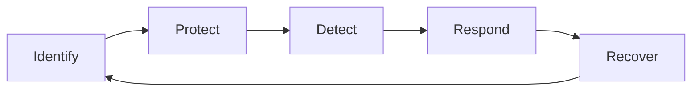
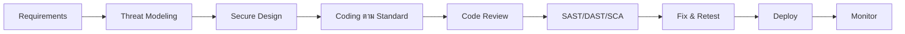
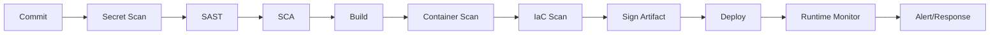
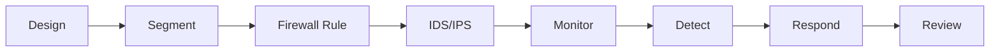
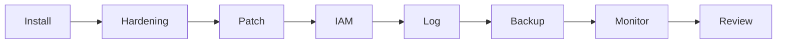
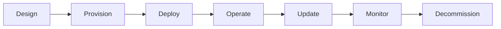
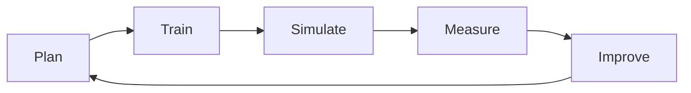
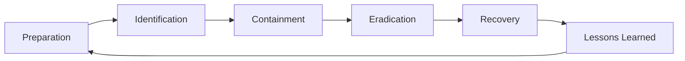
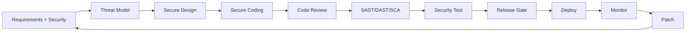

# คู่มือ Cybersecurity ฉบับครบวงจร
## สำหรับ 6 กลุ่มเป้าหมาย: นักพัฒนาซอฟต์แวร์, DevOps, Network, ผู้ดูแลระบบ, IoT และผู้ใช้ทั่วไป

> **คำเตือนทางกฎหมายและจริยธรรม**  
> คู่มือนี้จัดทำเพื่อการเรียนรู้ การป้องกัน และการบริหารความเสี่ยงทางไซเบอร์เท่านั้น  
> ห้ามใช้ความรู้หรือเครื่องมือในคู่มือนี้เพื่อโจมตี เจาะระบบ ขโมยข้อมูล หรือกระทำการใด ๆ ที่ผิดกฎหมาย  
> การทดสอบความปลอดภัยต้องได้รับอนุญาตเป็นลายลักษณ์อักษรจากเจ้าของระบบ และต้องปฏิบัติตาม พ.ร.บ. คอมพิวเตอร์, PDPA, GDPR หรือกฎหมายที่เกี่ยวข้อง

---

# สารบัญ

1. บทนำและเป้าหมายคู่มือ  
2. บทนิยาม  
3. พื้นฐาน Cybersecurity ที่ทุกคนต้องรู้  
4. คู่มือแยกตามบทบาท  
   - 4.1 นักพัฒนาซอฟต์แวร์  
   - 4.2 DevOps  
   - 4.3 Network  
   - 4.4 ผู้ดูแลระบบ  
   - 4.5 IoT  
   - 4.6 ผู้ใช้ทั่วไป  
5. โครงสร้างและสถาปัตยกรรม Cybersecurity  
6. กระบวนการสำคัญ  
   - 6.1 Incident Response  
   - 6.2 Root Cause Analysis (RCA)  
   - 6.3 Vulnerability Management  
   - 6.4 Risk Management  
   - 6.5 BCP/DRP  
7. Tools  
8. Prompt Templates  
9. แนวทางการประยุกต์ใช้  
10. การนำไปใช้งานจริง  
11. Case Studies  
12. ปัญหาและแนวทางแก้ไข  
13. ภาคผนวก: Checklist, Templates, คำศัพท์, แหล่งเรียนรู้  

---

# 1. บทนำและเป้าหมายคู่มือ

## 1.1 เป้าหมาย

คู่มือนี้มีเป้าหมายเพื่อ:

- อธิบาย Cybersecurity ให้เข้าใจง่าย ตั้งแต่ระดับพื้นฐานถึงระดับปฏิบัติ
- ใช้เป็นคู่มืออ้างอิงสำหรับ 6 กลุ่มเป้าหมาย
- เสนอแนวทางป้องกัน ตรวจจับ ตอบสนอง และกู้คืน
- รวมเครื่องมือ Prompt Templates และ RCA ที่นำไปใช้ได้จริง
- สร้างวัฒนธรรมความปลอดภัยในองค์กรและบุคคล

## 1.2 กลุ่มเป้าหมายและสิ่งที่ต้องโฟกัส

| กลุ่ม | สิ่งที่ต้องโฟกัสหลัก |
|---|---|
| นักพัฒนาซอฟต์แวร์ | Secure Coding, OWASP, Dependency, API, Secrets |
| DevOps | CI/CD Security, IaC, Container, Supply Chain, Secrets |
| Network | Segmentation, Firewall, IDS/IPS, VPN/ZTNA, DDoS |
| ผู้ดูแลระบบ | Hardening, Patch, IAM, Backup, Monitoring, IR |
| IoT | Secure Boot, Firmware, MQTT/TLS, Network Isolation, OTA |
| ผู้ใช้ทั่วไป | Password, MFA, Phishing, Backup, Privacy |

## 1.3 หลักคิดสำคัญ 5 ประการ

1. **Risk-Based** – ทำตามความเสี่ยง ไม่ใช่ทำทุกอย่างพร้อมกัน
2. **Defense in Depth** – ป้องกันหลายชั้น
3. **Least Privilege** – ให้สิทธิ์เท่าที่จำเป็น
4. **Zero Trust** – ไม่เชื่อถือใครโดยอัตโนมัติ ต้องตรวจสอบเสมอ
5. **Continuous Improvement** – ภัยคุกคามเปลี่ยน ต้องปรับปรุงตลอด

---

# 2. บทนิยาม

| คำศัพท์ | ความหมาย |
|---|---|
| Cybersecurity | การปกป้องระบบ เครือข่าย แอปพลิเคชัน และข้อมูลจากภัยคุกคามทางไซเบอร์ |
| CIA Triad | Confidentiality, Integrity, Availability |
| Confidentiality | การรักษาความลับ |
| Integrity | ความถูกต้องครบถ้วน |
| Availability | ความพร้อมใช้งาน |
| Asset | ทรัพย์สินที่ต้องปกป้อง |
| Threat | ภัยคุกคาม |
| Vulnerability | ช่องโหว่ |
| Risk | ความเสี่ยง = โอกาสเกิด + ผลกระทบ |
| Exploit | การใช้ช่องโหว่เพื่อโจมตี |
| Control | มาตรการควบคุม |
| Attack Surface | พื้นที่ที่ถูกโจมตีได้ |
| Authentication | การยืนยันตัวตน |
| Authorization | การกำหนดสิทธิ์ |
| IAM | Identity and Access Management |
| MFA | การยืนยันตัวตนหลายปัจจัย |
| Encryption | การเข้ารหัส |
| Firewall | อุปกรณ์/ซอฟต์แวร์กรองทราฟฟิก |
| IDS/IPS | ตรวจจับ/ป้องกันการบุกรุก |
| SIEM | รวมและวิเคราะห์ Log ความปลอดภัย |
| SOC | ศูนย์ปฏิบัติการความมั่นคงปลอดภัย |
| EDR/XDR | ตรวจจับและตอบสนองบน Endpoint/ขยายขอบเขต |
| Zero Trust | ไม่เชื่อถือโดยปริยาย ตรวจสอบทุกครั้ง |
| Incident Response | การตอบสนองเหตุการณ์ |
| RCA | Root Cause Analysis |
| BCP/DRP | แผนความต่อเนื่อง/แผนกู้คืนระบบ |
| SBOM | Software Bill of Materials |
| IaC | Infrastructure as Code |
| OTA | Over-the-Air Update |
| MQTT | โปรโตคอลสื่อสารสำหรับ IoT |

---

# 3. พื้นฐาน Cybersecurity ที่ทุกคนต้องรู้

## 3.1 Cybersecurity คืออะไร

Cybersecurity คือแนวปฏิบัติและกระบวนการปกป้องระบบคอมพิวเตอร์ เครือข่าย โปรแกรม และข้อมูลจากการโจมตีทางดิจิทัล โดยยึดหลัก CIA Triad

## 3.2 ทำงานอย่างไร

ประกอบด้วย 3 องค์ประกอบ:

1. **People** – บุคลากร ความตระหนัก การฝึกอบรม
2. **Process** – นโยบาย ประเมินความเสี่ยง ตอบสนองเหตุการณ์
3. **Technology** – Firewall, EDR, SIEM, MFA, Encryption, Backup

วงจรการทำงาน:



## 3.3 การใช้งาน

- องค์กร: ปกป้องข้อมูลลูกค้า ระบบภายใน Cloud
- บุคคล: ปกป้องบัญชี อีเมล โซเชียล
- Cloud: IAM, Encryption, Logging
- Web/App: OWASP Top 10
- OT/ICS: ระบบโรงงาน พลังงาน
- Healthcare: เวชระเบียน
- Government: ข้อมูลประชาชน
- E-commerce: ป้องกันฉ้อโกง DDoS

## 3.4 ข้อดี

- ลดข้อมูลรั่วไหล
- รักษาชื่อเสียง
- ปฏิบัติตามกฎหมาย
- ลดความเสียหายทางการเงิน
- ธุรกิจดำเนินต่อได้

## 3.5 ข้อเสีย/ความท้าทาย

- ค่าใช้จ่ายสูง
- ซับซ้อน
- ขาดผู้เชี่ยวชาญ
- False Positive
- ผู้ใช้ไม่สะดวก
- ภัยคุกคามเปลี่ยนตลอด
- ไม่มีระบบใดปลอดภัย 100%

## 3.6 ข้อควรระวัง/ข้อห้าม/ข้อจำกัด

**ควรระวัง**
- สำรองข้อมูล 3-2-1
- Patch สม่ำเสมอ
- ใช้ MFA
- ตรวจสอบสิทธิ์ Third Party
- อ่านกฎหมาย PDPA

**ข้อห้าม**
- ห้ามทดสอบเจาะระบบโดยไม่ได้รับอนุญาต
- ห้ามใช้เครื่องมือโจมตีกับเป้าหมายจริง
- ห้ามเก็บรหัสผ่านแบบ plain text
- ห้ามปิด Antivirus/Logging โดยไม่มีเหตุผล
- ห้ามใช้ซอฟต์แวร์เถื่อน

**ข้อจำกัด**
- ไม่สามารถกำจัดความเสี่ยงได้ทั้งหมด
- ต้องสมดุล Usability vs Security
- ต้องอาศัยคน กระบวนการ และเทคโนโลยี

## 3.7 สรุป

Cybersecurity คือการป้องกันแบบองค์รวม ด้วยคน กระบวนการ และเทคโนโลยี โดยยึด CIA Triad, Defense in Depth, Least Privilege และ Zero Trust

---

# 4. คู่มือแยกตามบทบาท

# 4.1 นักพัฒนาซอฟต์แวร์

## เป้าหมาย
เขียนโค้ดที่ปลอดภัย ลดช่องโหว่ตั้งแต่ต้นทาง และป้องกันการรั่วไหลของข้อมูล

## ความเสี่ยงที่พบบ่อย
- SQL Injection, XSS, CSRF
- Broken Authentication
- Insecure Deserialization
- Secrets หลุดในโค้ด
- Dependency มีช่องโหว่
- API ไม่มี Rate Limit
- Error Message เปิดเผยข้อมูล

## แนวปฏิบัติสำคัญ
- ใช้ Secure SDLC
- ทำ Threat Modeling
- ยึด OWASP Top 10
- Validate Input, Encode Output
- ใช้ Prepared Statement
- ใช้ AuthN/AuthZ อย่างถูกต้อง
- เก็บ Secrets ใน Vault/Env ไม่Hardcode
- ใช้ SAST, DAST, SCA
- ตรวจ Dependency และสร้าง SBOM
- Code Review แบบ Security Focus
- Log อย่างปลอดภัย ไม่ Log ข้อมูลอ่อนไหว
- มี Unit/Integration/Security Test

## Checklist
- [ ] ไม่มี Secrets ในโค้ด
- [ ] ใช้ HTTPS/TLS
- [ ] มี Rate Limiting
- [ ] มี Input Validation
- [ ] มี Output Encoding
- [ ] มี Error Handling ไม่เปิดเผยข้อมูล
- [ ] Dependency ไม่มีช่องโหว่ร้ายแรง
- [ ] มี SAST/DAST/SCA ใน Pipeline
- [ ] มี Log และ Monitoring
- [ ] มีการทดสอบ AuthN/AuthZ

## Tools
SonarQube, Snyk, OWASP ZAP, Burp Suite, Dependabot, Trivy, HashiCorp Vault, GitLeaks

## Case Study
**Log4Shell**: Dependency ยอดนิยมมีช่องโหว่ RCE ทำให้ระบบจำนวนมากถูกโจมตี  
**บทเรียน**: ต้องมี SBOM, Dependency Scanning และ Patch เร็ว

---

# 4.2 DevOps

## เป้าหมาย
ทำให้ Pipeline ปลอดภัย ตั้งแต่ Code Commit ถึง Production

## ความเสี่ยง
- Secrets หลุดใน CI/CD
- Container ไม่ปลอดภัย
- IaC Misconfiguration
- Supply Chain Attack
- สิทธิ์กว้างเกินไป
- Artifact ไม่ถูกตรวจสอบ

## แนวปฏิบัติ
- Shift-Left Security
- Secret Scanning
- SAST/DAST/SCA ใน Pipeline
- Signed Commits และ Signed Artifacts
- SBOM
- IaC Scanning
- Container Hardening
- Kubernetes RBAC, Network Policy, Pod Security
- Least Privilege สำหรับ Service Account
- Immutable Infrastructure
- Observability และ Audit Log
- Incident Response สำหรับ Pipeline

## Checklist
- [ ] ไม่มี Secrets ใน Repo
- [ ] ใช้ MFA กับ Git/Cloud
- [ ] Pipeline มี Security Gate
- [ ] Container ใช้ Base Image ที่เชื่อถือได้
- [ ] มี Image Scanning
- [ ] มี IaC Scanning
- [ ] มี RBAC เข้มงวด
- [ ] มี Audit Log
- [ ] มี Backup และ Rollback
- [ ] มี SBOM

## Tools
GitHub Actions, GitLab CI, Jenkins, ArgoCD, Trivy, Snyk, Checkov, Terraform, Vault, Kubernetes, Falco, Prometheus, Grafana

## Case Study
**CI/CD Secrets Leak**: นักพัฒนาวาง AWS Key ใน Repo สาธารณะ ทำให้ผู้โจมตีเข้าถึง Cloud ได้  
**บทเรียน**: ใช้ Secret Manager, Secret Scanning, Rotate Key ทันที

---

# 4.3 Network

## เป้าหมาย
ป้องกันเครือข่ายจากการบุกรุก แบ่งเขต และตรวจสอบทราฟฟิกผิดปกติ

## ความเสี่ยง
- DDoS
- MITM
- DNS Spoofing
- Lateral Movement
- Misconfiguration
- Wireless Attack
- VPN ช่องโหว่

## แนวปฏิบัติ
- Segmentation/VLAN
- Firewall Rule แบบ Least Privilege
- IDS/IPS
- VPN/ZTNA
- NAC
- DNS Security, DNSSEC
- DDoS Mitigation
- NetFlow, Packet Capture
- Hardening อุปกรณ์เครือข่าย
- Monitoring 24/7
- Redundancy

## Checklist
- [ ] แบ่งเครือข่ายตามความสำคัญ
- [ ] Firewall Rule มีเอกสาร
- [ ] ใช้ IDS/IPS
- [ ] ใช้ MFA สำหรับ VPN
- [ ] มี DNS Security
- [ ] มี DDoS Protection
- [ ] มี Log และ NetFlow
- [ ] อัปเดต Firmware อุปกรณ์
- [ ] ปิด Port/Bริการที่ไม่จำเป็น
- [ ] มีแผนตอบสนองเหตุเครือข่าย

## Tools
Wireshark, Nmap, Zeek, Suricata, Snort, pfSense, Cisco, Fortinet, Cloudflare, Akamai

## Case Study
**DDoS ร้านค้าออนไลน์**: ทราฟฟิกมหาศาลทำให้เว็บล่มช่วง Flash Sale  
**บทเรียน**: ใช้ CDN, WAF, Rate Limiting, Auto Scaling

---

# 4.4 ผู้ดูแลระบบ

## เป้าหมาย
ดูแลระบบให้พร้อมใช้ ปลอดภัย และกู้คืนได้

## ความเสี่ยง
- Privilege Abuse
- Patch ไม่ครบ
- Backup ใช้ไม่ได้
- Misconfiguration
- Insider Threat
- Legacy System

## แนวปฏิบัติ
- Hardening OS
- Patch Management
- IAM/MFA/PAM
- Least Privilege
- Logging/Monitoring
- Backup 3-2-1 และทดสอบ Restore
- Endpoint Protection
- User Lifecycle Management
- Change Management
- Incident Response

## Checklist
- [ ] ปิด Service ที่ไม่จำเป็น
- [ ] ตั้งค่า Password Policy
- [ ] เปิด MFA
- [ ] ใช้ PAM สำหรับ Admin
- [ ] Patch ทุกเดือน
- [ ] Backup และทดสอบ Restore
- [ ] มี Log/SIEM
- [ ] มี EDR
- [ ] มีแผน DR
- [ ] มี Audit สิทธิ์ผู้ใช้

## Tools
Windows AD, Linux, Ansible, Puppet, Chef, Veeam, Wazuh, Splunk, ELK, CrowdStrike, Defender

## Case Study
**Ransomware โรงพยาบาล**: Phishing + ไม่มี MFA + สิทธิ์กว้าง ทำให้ข้อมูลถูกเข้ารหัส  
**บทเรียน**: MFA, Least Privilege, Backup Offline, Segment

---

# 4.5 IoT

## เป้าหมาย
ปกป้องอุปกรณ์ IoT ตลอด Lifecycle ตั้งแต่ผลิต ติดตั้ง ใช้งาน ถึงทำลาย

## ความเสี่ยง
- Default Password
- Firmware ไม่มี Signature
- ไม่มี Update
- Weak Crypto
- Physical Tampering
- Botnet
- MQTT/CoAP ไม่ปลอดภัย

## แนวปฏิบัติ
- Secure by Design
- Unique Credential ต่อเครื่อง
- Secure Boot
- Signed Firmware
- OTA Update
- TLS/Encryption
- Network Isolation
- Zero Trust
- Monitoring
- Decommissioning
- Supply Chain Security
- Physical Security

## Checklist
- [ ] ไม่ใช้ Default Password
- [ ] มี Secure Boot
- [ ] Firmware เซ็นชื่อ
- [ ] มี OTA Update
- [ ] ใช้ TLS
- [ ] แยก VLAN IoT
- [ ] มี Monitoring
- [ ] มีแผน Decommission
- [ ] ตรวจสอบ Supplier
- [ ] มี Log

## Tools
Mender, Balena, AWS IoT, Azure IoT, MQTT Broker, Wireshark, Shodan (เพื่อตรวจสอบของตัวเอง), OpenVAS

## Case Study
**Mirai Botnet**: กล้อง CCTV ใช้รหัสผ่าน default ถูกจับเป็นโบน็ตโจมตี DDoS ขนาดใหญ่  
**บทเรียน**: เปลี่ยนรหัสผ่าน, อัปเดต Firmware, แยกเครือข่าย

---

# 4.6 ผู้ใช้ทั่วไป

## เป้าหมาย
ใช้อินเทอร์เน็ตอย่างปลอดภัย ปกป้องบัญชีและข้อมูลส่วนตัว

## ความเสี่ยง
- Phishing
- Weak Password
- Social Engineering
- Public Wi-Fi
- Malware
- Data Leak

## แนวปฏิบัติ
- ใช้ Passphrase ยาว
- ใช้ Password Manager
- เปิด MFA
- อัปเดตระบบ
- สำรองข้อมูล
- ระวังอีเมล/ลิงก์
- ใช้ Wi-Fi ที่เชื่อถือได้
- ตรวจสอบสิทธิ์แอป
- ตั้งค่าความเป็นส่วนตัว
- รายงานเหตุทันที

## Checklist
- [ ] ใช้รหัสผ่านไม่ซ้ำ
- [ ] เปิด MFA
- [ ] อัปเดต OS/App
- [ ] มี Backup
- [ ] ไม่คลิกลิงก์น่าสงสัย
- [ ] ใช้ HTTPS
- [ ] ตรวจสอบแอปที่ขอสิทธิ์
- [ ] ตั้ง Lock Screen
- [ ] รู้ช่องทางรายงานเหตุ
- [ ] ไม่แชร์ข้อมูลเกินจำเป็น

## Tools
Bitwarden, 1Password, Google Authenticator, Microsoft Authenticator, Have I Been Pwned

## Case Study
**Phishing อีเมลปลอม**: ผู้ใช้กรอกรหัสผ่านบนเว็บปลอม ทำให้บัญชีถูกขโมย  
**บทเรียน**: เปิด MFA, ตรวจ URL, ไม่คลิกโดยไม่ตรวจสอบ

---

# 5. โครงสร้างและสถาปัตยกรรม Cybersecurity

## 5.1 โครงสร้างคืออะไร
กรอบการจัดวางองค์ประกอบความปลอดภัยให้ครอบคลุมองค์กร

## 5.2 องค์ประกอบ
1. Governance & Policy  
2. Risk & Compliance  
3. Asset & Identity  
4. Network Security  
5. Endpoint Security  
6. Application Security  
7. Data Security  
8. Cloud Security  
9. Monitoring & Detection  
10. Incident Response  
11. Recovery & Continuity  
12. Awareness & Training  

## 5.3 ทำงานอย่างไร
ใช้ Defense in Depth + Zero Trust + NIST CSF  
- Identify  
- Protect  
- Detect  
- Respond  
- Recover  

## 5.4 การใช้งาน
ใช้เป็น Blueprint วางแผนงบประมาณ บุคลากร และวัด Maturity

## 5.5 สรุป
โครงสร้างที่ดีต้องครอบคลุมคน กระบวนการ เทคโนโลยี ข้อมูล Cloud และการกู้คืน

---

# 6. กระบวนการสำคัญ

# 6.1 Incident Response

ขั้นตอน:
1. Preparation  
2. Identification  
3. Containment  
4. Eradication  
5. Recovery  
6. Lessons Learned  

# 6.2 Root Cause Analysis (RCA)

**RCA** คือเครื่องมือค้นหาสาเหตุรากที่แท้จริง โดยใช้ข้อมูลจากการพูดคุย หลักฐาน และการวิเคราะห์อย่างเป็นระบบ เพื่อป้องกันการเกิดซ้ำ

## หลักการ
- Data-Driven
- Blameless
- Multiple Causes
- Systemic Thinking
- Verify
- Actionable
- Prevent Recurrence

## เทคนิค
- 5 Whys
- Fishbone
- Fault Tree
- Pareto
- Timeline
- Change Analysis
- Barrier Analysis

## ขั้นตอน
1. ระบุเหตุการณ์  
2. รวบรวมข้อมูล  
3. นิยามปัญหา  
4. สร้าง Timeline  
5. ระบุ Immediate Cause  
6. วิเคราะห์ Root Cause  
7. ตรวจสอบสมมติฐาน  
8. กำหนด CAPA  
9. มอบหมายผู้รับผิดชอบ  
10. ติดตามผล  

## Template RCA

| หัวข้อ | รายละเอียด |
|---|---|
| Incident ID | |
| วันที่ | |
| ผลกระทบ | |
| Timeline | |
| Immediate Cause | |
| Contributing Factors | |
| Root Cause | |
| หลักฐาน | |
| CAPA | |
| ผู้รับผิดชอบ | |
| กำหนดเสร็จ | |
| วิธีตรวจสอบ | |

## ตัวอย่าง 5 Whys
1. ทำไมข้อมูลถูกเข้ารหัส? เพราะ Ransomware  
2. ทำไมเข้ามาได้? เพราะคลิก Phishing  
3. ทำไมคลิก? เพราะแยกอีเมลปลอมไม่ออก  
4. ทำไมแยกไม่ออก? เพราะขาดการฝึกอบรม  
5. ทำไมยังเข้าถึงเซิร์ฟเวอร์ได้? เพราะไม่มี MFA และสิทธิ์กว้าง  

**Root Cause**: ระบบป้องกันหลายชั้นล้มเหลวร่วมกัน  
**CAPA**: เปิด MFA, แบ่งเครือข่าย, ฝึกอบรม, ใช้ EDR, จำกัดสิทธิ์

## KPI
- Recurrence Rate
- % CAPA เสร็จตามกำหนด
- MTTD/MTTR
- จำนวนเหตุที่พบ Root Cause ชัดเจน

# 6.3 Vulnerability Management
- Inventory
- Scan
- Prioritize
- Patch
- Verify
- Report

# 6.4 Risk Management
- Identify
- Assess
- Treat
- Monitor

# 6.5 BCP/DRP
- BIA
- RTO/RPO
- Backup
- Test
- Improve

---

# 7. Tools

## 7.1 ประเภทเครื่องมือ

| ประเภท | ตัวอย่าง |
|---|---|
| Network | Wireshark, Nmap, Zeek, Suricata |
| Endpoint | CrowdStrike, Defender, Velociraptor |
| SIEM | Splunk, ELK, Wazuh, Sentinel |
| Vulnerability | Nessus, OpenVAS, Trivy |
| Web | Burp Suite, OWASP ZAP |
| Forensics | Volatility, Autopsy, KAPE |
| Threat Intel | MISP, OpenCTI, VirusTotal |
| IR/SOAR | TheHive, Cortex, Shuffle |
| IAM | Keycloak, Okta, Azure AD, Vault |
| Cloud | Prowler, ScoutSuite, GuardDuty |
| DevSecOps | SonarQube, Snyk, Dependabot |
| GRC | SimpleRisk, Eramba |
| Backup | Veeam, Restic, Bacula |
| Awareness | GoPhish, KnowBe4 |

## 7.2 Mapping Tools กับ 6 บทบาท

| บทบาท | Tools แนะนำ |
|---|---|
| Developer | SonarQube, Snyk, GitLeaks, OWASP ZAP |
| DevOps | Trivy, Checkov, Vault, Falco, ArgoCD |
| Network | Wireshark, Zeek, Suricata, pfSense |
| SysAdmin | Wazuh, Veeam, Defender, Ansible |
| IoT | Mender, AWS IoT, OpenVAS, MQTT TLS |
| ทั่วไป | Bitwarden, Authenticator, HIBP |

## 7.3 ข้อควรระวัง
- ต้องได้รับอนุญาตก่อนสแกน/ทดสอบ
- ระวัง False Positive
- อย่าใช้เครื่องมือโจมตีกับเป้าหมายจริง
- ปฏิบัติตาม PDPA และกฎหมาย

---

# 8. Prompt Templates

## 8.1 Master Template

```text
บทบาท: [ระบุ]
บริบท: [ระบบ/องค์กร/เหตุการณ์]
เป้าหมาย: [ต้องการอะไร]
ข้อมูลที่มี: [log/timeline/นโยบาย]
ข้อจำกัด: [ห้ามคาดเดา/ห้ามข้อมูลลับ]
รูปแบบผลลัพธ์: [ตาราง/หัวข้อ/JSON]
เกณฑ์คุณภาพ: [ครบถ้วน/ตรวจสอบได้/ใช้งานได้]
```

## 8.2 ตัวอย่างแยกตามบทบาท

### Developer
```text
คุณเป็น Secure Code Reviewer
ตรวจโค้ดต่อไปนี้: [โค้ด]
หา OWASP Top 10, Secrets, Input Validation, AuthN/AuthZ
เสนอแนวทางแก้ไขพร้อมตัวอย่างโค้ดที่ปลอดภัย
```

### DevOps
```text
คุณเป็น DevSecOps Engineer
วิเคราะห์ Pipeline ต่อไปนี้: [YAML]
หา Secrets, สิทธิ์กว้าง, Image ไม่ปลอดภัย, IaC Misconfig
เสนอแนวทางแก้ไขและ Security Gate
```

### Network
```text
คุณเป็น Network Security Engineer
วิเคราะห์ Firewall Rule ต่อไปนี้: [rule]
หา Rule ที่กว้างเกินไป, ซ้ำซ้อน, ควรลบ
เสนอ Rule ที่ใช้ Least Privilege
```

### SysAdmin
```text
คุณเป็น System Administrator
สร้าง Checklist Hardening Windows/Linux
ครอบคลุม Patch, IAM, Log, Backup, Service, Firewall
แสดงเป็นตาราง พร้อมคำอธิบาย
```

### IoT
```text
คุณเป็น IoT Security Architect
ออกแบบสถาปัตยกรรมปลอดภัยสำหรับอุปกรณ์ IoT
ครอบคลุม Secure Boot, OTA, MQTT TLS, Network Isolation, Monitoring
```

### ทั่วไป
```text
คุณเป็นผู้เชี่ยวชาญ Security Awareness
สร้างเนื้อหา Phishing Awareness ภาษาไทย 1 หน้า
พร้อมตัวอย่างอีเมลปลอม จุดสังเกต และสิ่งที่ต้องทำ
```

## 8.3 ข้อควรระวัง AI
- อย่าใส่ข้อมูลลับ
- ตรวจสอบคำตอบเสมอ
- ห้ามใช้สร้าง malware
- ปฏิบัติตามกฎหมาย

---

# 9. แนวทางการประยุกต์ใช้

## 9.1 Roadmap 90 วัน
- 0–30 วัน: Inventory, Risk, MFA, Backup, Patch
- 31–60 วัน: Firewall, EDR, SIEM, Training, IR Plan
- 61–90 วัน: ซ้อม, Pen Test, ปรับปรุง, วัด Metrics

## 9.2 สำหรับบุคคล
- Password Manager, MFA, Update, Backup, ระวัง Phishing

## 9.3 สำหรับทีม
- มี Owner ชัดเจน, Checklist, Review, Automation

## 9.4 สำหรับองค์กร
- ใช้ ISO 27001/NIST, SOC, Zero Trust, BCP/DRP

---

# 10. การนำไปใช้งานจริง

| ระยะ | สิ่งที่ทำ |
|---|---|
| เริ่มต้น | ประเมินความเสี่ยง, เปิด MFA, Backup |
| ระดับกลาง | SIEM, EDR, Segment, Training |
| ระดับสูง | Zero Trust, SOC, Threat Intel, Red/Blue Team |

Metrics:
- MTTD, MTTR
- Patch Compliance
- Phishing Click Rate
- Backup Restore Success
- Number of Incidents

---

# 11. Case Studies

1. **Developer**: Log4Shell  
2. **DevOps**: CI/CD Secrets Leak  
3. **Network**: DDoS ร้านค้าออนไลน์  
4. **SysAdmin**: Ransomware โรงพยาบาล  
5. **IoT**: Mirai Botnet  
6. **ทั่วไป**: Phishing อีเมลปลอม  

---

# 12. ปัญหาและแนวทางแก้ไข

| ปัญหา | แนวทางแก้ไข |
|---|---|
| งบประมาณจำกัด | จัดลำดับตามความเสี่ยง ใช้ Open Source |
| ขาดบุคลากร | ฝึกอบรม ใช้ MSSP Automation |
| Alert Fatigue | Tune SIEM ลด False Positive |
| Ransomware | Backup Offline, EDR, MFA, Segment |
| Insider Threat | Least Privilege, DLP, Monitoring |
| Cloud Misconfig | CSPM, IaC Scanning |
| Legacy System | Isolate, Virtual Patch, Upgrade |
| Supply Chain | Vendor Assessment, SBOM |
| Remote Work | ZTNA, MFA, Device Posture |
| Phishing | Training, Simulation, Gateway |

---

# 13. ภาคผนวก

## A. Checklist รวม

### Developer
- [ ] No Secrets
- [ ] SAST/DAST/SCA
- [ ] Input Validation
- [ ] Output Encoding
- [ ] AuthN/AuthZ
- [ ] Dependency Scan

### DevOps
- [ ] Secret Scanning
- [ ] IaC Scan
- [ ] Container Scan
- [ ] RBAC
- [ ] Audit Log
- [ ] SBOM

### Network
- [ ] Segment
- [ ] Firewall Rule
- [ ] IDS/IPS
- [ ] VPN/ZTNA
- [ ] DDoS Protection
- [ ] NetFlow

### SysAdmin
- [ ] Hardening
- [ ] Patch
- [ ] MFA/PAM
- [ ] Backup/Restore
- [ ] Log/SIEM
- [ ] EDR

### IoT
- [ ] Unique Credential
- [ ] Secure Boot
- [ ] OTA
- [ ] TLS
- [ ] Network Isolation
- [ ] Monitoring

### ทั่วไป
- [ ] Password Manager
- [ ] MFA
- [ ] Update
- [ ] Backup
- [ ] ระวัง Phishing
- [ ] Privacy Setting

## B. Templates
- Incident Report
- RCA Report
- Risk Register
- Change Request
- Security Policy

## C. คำศัพท์
CIA, Zero Trust, MFA, IAM, SIEM, SOC, EDR, XDR, SBOM, IaC, OTA, MQTT, RCA, CAPA

## D. กฎหมาย/มาตรฐาน
- PDPA
- พ.ร.บ. คอมพิวเตอร์
- GDPR
- ISO 27001
- NIST CSF
- CIS Controls
- OWASP
- MITRE ATT&CK

## E. แหล่งเรียนรู้
- OWASP
- NIST
- CIS
- MITRE
- SANS
- Cybrary
- TryHackMe
- Hack The Box (เฉพาะได้รับอนุญาต)

---

# สรุปสุดท้าย

Cybersecurity ที่สมบูรณ์ต้องเริ่มจากความเข้าใจความเสี่ยง ป้องกัน ตรวจจับ ตอบสนอง กู้คืน และปรับปรุงต่อเนื่อง  
ไม่ว่าจะเป็น **นักพัฒนา, DevOps, Network, ผู้ดูแลระบบ, IoT หรือผู้ใช้ทั่วไป** ทุกคนมีบทบาทในความปลอดภัย  
ใช้คู่มือนี้เป็นกรอบเริ่มต้น แล้วปรับให้เหมาะกับบริบทของตนเอง  
จำไว้ว่า: **ความปลอดภัยไม่ใช่ปลายทาง แต่เป็นกระบวนการต่อเนื่อง**


# ชุดคู่มือ Cybersecurity ฉบับมืออาชีพ
## แยกเป็นเล่มย่อย ใช้งานจริง พร้อม SOP และ Template

> **ชุดคู่มือนี้ประกอบด้วย 8 เล่มย่อย**  
> แต่ละเล่มเป็นStandalone Manual ที่มี วัตถุประสงค์ ขอบเขต บทบาท SOP Template Checklist KPI และตัวอย่างจริง  
> ใช้สำหรับทีมงานองค์กร หรือบุคคลที่ต้องการทำงานระดับมืออาชีพ

---

# สารบัญชุดคู่มือ

| เล่ม | ชื่อเล่ม | กลุ่มเป้าหมาย |
|---|---|---|
| เล่ม 1 | Secure Coding Manual | นักพัฒนาซอฟต์แวร์ |
| เล่ม 2 | DevSecOps Manual | DevOps / SRE |
| เล่ม 3 | Network Security Operations Manual | Network Engineer |
| เล่ม 4 | System Administration Security Manual | SysAdmin / IT Ops |
| เล่ม 5 | IoT Security Manual | IoT Engineer / OT |
| เล่ม 6 | Security Awareness Manual | ผู้ใช้ทั่วไป / พนักงาน |
| เล่ม 7 | Incident Response & RCA Manual | IR Team / SOC |
| เล่ม 8 | Security Tools & Prompt Engineering Manual | ทุกบทบาท |

---
---

# เล่ม 1: Secure Coding Manual
## คู่มือการเขียนโค้ดอย่างปลอดภัยสำหรับนักพัฒนาซอฟต์แวร์

### 1.1 วัตถุประสงค์
- ลดช่องโหว่ตั้งแต่ต้นทาง
- ป้องกันข้อมูลรั่วไหลผ่านโค้ด
- สร้างมาตรฐานการเขียนโค้ดที่ตรวจสอบได้
- เตรียมพร้อมสำหรับ Audit และ Compliance

### 1.2 ขอบเขต
ครอบคลุม Web, API, Mobile, Desktop, Microservices, Database, Third-party Library

### 1.3 บทบาทและความรับผิดชอบ

| บทบาท | หน้าที่ |
|---|---|
| Developer | เขียนโค้ดปลอดภัย แก้ช่องโหว่ |
| Tech Lead | Review, กำหนดมาตรฐาน |
| Security Champion | ให้คำปรึกษา, Threat Model |
| QA | Security Test |
| DevOps | ติดตั้ง SAST/DAST/SCA |

### 1.4 SOP: Secure Coding Workflow



### 1.5 SOP ขั้นตอนปฏิบัติ

**ขั้นที่ 1: Threat Modeling**
1. ระบุ Asset และ Data Flow
2. ใช้ STRIDE
3. ระบุ Threat และ Control
4. บันทึกใน Threat Model Template

**ขั้นที่ 2: Secure Design**
1. ออกแบบ AuthN/AuthZ
2. ออกแบบ Input Validation
3. ออกแบบ Error Handling
4. ออกแบบ Logging (ไม่ Log ข้อมูลอ่อนไหว)
5. ออกแบบ Secrets Management

**ขั้นที่ 3: Coding Standard**
1. ใช้ Prepared Statement
2. Encode Output ทุกครั้ง
3. Validate Input ทุกช่อง
4. ใช้ HTTPS/TLS
5. เก็บ Secrets ใน Vault
6. ใช้ Library ที่มี Maintenance
7. หลีกเลี่ยง Deserialization ที่ไม่ปลอดภัย
8. ตั้งค่า Session/Cookie ปลอดภัย

**ขั้นที่ 4: Code Review**
1. ใช้ Checklist
2. ตรวจ Secrets
3. ตรวจ AuthN/AuthZ
4. ตรวจ Error Handling
5. บันทึกผล Review

**ขั้นที่ 5: Security Testing**
1. รัน SAST
2. รัน SCA
3. รัน DAST
4. แก้ไขตามลำดับความเสี่ยง
5. Retest

### 1.6 OWASP Top 10 Checklist

- [ ] A01 Broken Access Control
- [ ] A02 Cryptographic Failures
- [ ] A03 Injection
- [ ] A04 Insecure Design
- [ ] A05 Security Misconfiguration
- [ ] A06 Vulnerable Components
- [ ] A07 Auth Failures
- [ ] A08 Data Integrity Failures
- [ ] A09 Logging Failures
- [ ] A10 SSRF

### 1.7 Template: Threat Model

| หัวข้อ | รายละเอียด |
|---|---|
| System | |
| Data Flow | |
| Asset | |
| Threat (STRIDE) | |
| ช่องโหว่ที่เป็นไปได้ | |
| Control | |
| ความเสี่ยงคงเหลือ | |
| ผู้รับผิดชอบ | |

### 1.8 Template: Code Review

| หัวข้อ | ผล |
|---|---|
| Secrets | Pass/Fail |
| Input Validation | |
| Output Encoding | |
| AuthN/AuthZ | |
| Error Handling | |
| Logging | |
| Dependency | |
| หมายเหตุ | |

### 1.9 KPI
- จำนวนช่องโหว่ต่อ 1,000 บรรทัด
- % Critical แก้ภายใน SLA
- % โค้ดที่ผ่าน SAST
- จำนวน Secrets ที่พบ

### 1.10 ตัวอย่างจริง
**Log4Shell**: Dependency มี RCE  
**SOP**: สร้าง SBOM → สแกน → Patch ภายใน 24 ชม. → ตรวจสอบย้อนหลัง

---
---

# เล่ม 2: DevSecOps Manual
## คู่มือความปลอดภัยใน Pipeline CI/CD

### 2.1 วัตถุประสงค์
- ฝังความปลอดภัยในทุกขั้นของ Pipeline
- ลดความเสี่ยง Supply Chain
- ทำให้ Deployment ปลอดภัยและตรวจสอบได้

### 2.2 ขอบเขต
Source Code → Build → Test → Artifact → Deploy → Runtime → Monitor

### 2.3 บทบาท

| บทบาท | หน้าที่ |
|---|---|
| DevOps Engineer | สร้าง Pipeline ปลอดภัย |
| Security Engineer | กำหนด Security Gate |
| Developer | แก้ไขตามผลสแกน |
| SRE | Monitoring & Response |

### 2.4 SOP: DevSecOps Pipeline



### 2.5 SOP ขั้นตอน

**ขั้นที่ 1: Pre-Commit**
1. ใช้ Git Hook ตรวจ Secrets
2. บังคับ Signed Commit
3. บังคับ Commit Message

**ขั้นที่ 2: CI Stage**
1. Secret Scanning (GitLeaks, TruffleHog)
2. SAST (SonarQube)
3. SCA (Snyk, Dependabot)
4. Unit Test + Security Test
5. สร้าง SBOM

**ขั้นที่ 3: Build & Artifact**
1. ใช้ Base Image ที่เชื่อถือได้
2. Scan Image (Trivy)
3. Sign Artifact (Cosign)
4. เก็บใน Private Registry

**ขั้นที่ 4: IaC & Config**
1. Scan Terraform/K8s (Checkov, Kubesec)
2. ตรวจ Policy as Code (OPA)
3. Review Change

**ขั้นที่ 5: Deploy**
1. ใช้ Least Privilege Service Account
2. ใช้ GitOps (ArgoCD)
3. Rollback Plan
4. Canary/Blue-Green

**ขั้นที่ 6: Runtime**
1. Falco/EDR
2. Log & Metrics
3. Alert → IR

### 2.6 Checklist

- [ ] Secret Scanning ใน CI
- [ ] SAST/SCA ทุก Build
- [ ] Image Scanning
- [ ] IaC Scanning
- [ ] Signed Artifact
- [ ] SBOM
- [ ] RBAC เข้มงวด
- [ ] Audit Log
- [ ] Rollback Plan
- [ ] Runtime Monitoring

### 2.7 Template: Pipeline Security Gate

| Stage | Tool | เกณฑ์ผ่าน | ผู้รับผิดชอบ |
|---|---|---|---|
| Secret Scan | GitLeaks | 0 Secrets | DevOps |
| SAST | SonarQube | 0 Critical | Dev |
| SCA | Snyk | 0 Critical | Dev |
| Image Scan | Trivy | 0 Critical | DevOps |
| IaC Scan | Checkov | 0 High | DevOps |

### 2.8 KPI
- % Pipeline ที่มี Security Gate
- เวลาเฉลี่ยในการแก้ Critical
- จำนวน Secrets ที่พบต่อเดือน
- Deployment Success Rate

### 2.9 ตัวอย่างจริง
**CI/CD Secrets Leak**: AWS Key หลุดใน Public Repo  
**SOP**: Rotate Key ทันที → ตรวจ CloudTrail → เพิ่ม Secret Scanning

---
---

# เล่ม 3: Network Security Operations Manual
## คู่มือปฏิบัติการความปลอดภัยเครือข่าย

### 3.1 วัตถุประสงค์
- ปกป้องเครือข่ายจากการบุกรุก
- แบ่งเขตและควบคุมทราฟฟิก
- ตรวจจับและตอบสนองเหตุเครือข่าย

### 3.2 ขอบเขต
LAN, WAN, WLAN, VPN, Cloud Network, Data Center, DMZ

### 3.3 บทบาท

| บทบาท | หน้าที่ |
|---|---|
| Network Engineer | ออกแบบและดูแลเครือข่าย |
| Security Engineer | กำหนด Policy |
| SOC | Monitoring |
| IR Team | ตอบสนอง |

### 3.4 SOP: Network Security Operations



### 3.5 SOP ขั้นตอน

**ขั้นที่ 1: Design & Segment**
1. แบ่ง VLAN ตามความสำคัญ
2. แยก DMZ, Internal, Management, IoT
3. กำหนด Trust Level
4. ทำ Network Diagram

**ขั้นที่ 2: Firewall Rule**
1. Default Deny
2. Least Privilege
3. Document ทุก Rule
4. Review ทุก 6 เดือน
5. ลบ Rule ที่ไม่ใช้

**ขั้นที่ 3: Detection**
1. ติดตั้ง IDS/IPS
2. เปิด NetFlow
3. เก็บ Packet Capture เมื่อจำเป็น
4. ส่ง Log เข้า SIEM

**ขั้นที่ 4: Remote Access**
1. ใช้ VPN/ZTNA
2. บังคับ MFA
3. Device Posture Check
4. Log การเข้าใช้งาน

**ขั้นที่ 5: DDoS Protection**
1. ใช้ CDN/WAF
2. Rate Limiting
3. Anycast
4. ซ้อมแผน

**ขั้นที่ 6: Monitoring & Response**
1. ตั้ง Alert
2. ตรวจสอบ Anomaly
3. ตอบสนองตาม Playbook
4. บันทึกเหตุ

### 3.6 Checklist

- [ ] Network Diagram อัปเดต
- [ ] Segment ครบ
- [ ] Firewall Default Deny
- [ ] Rule Review ทุก 6 เดือน
- [ ] IDS/IPS ทำงาน
- [ ] NetFlow เปิด
- [ ] VPN/ZTNA + MFA
- [ ] DDoS Protection
- [ ] Log เข้า SIEM
- [ ] Playbook พร้อม

### 3.7 Template: Firewall Rule

| No | Source | Destination | Port | Protocol | Action | เหตุผล | Owner | Review Date |
|---|---|---|---|---|---|---|---|---|
| 1 | | | | | | | | |

### 3.8 Template: Network Incident

| หัวข้อ | รายละเอียด |
|---|---|
| เวลา | |
| แหล่งที่มา | |
| เป้าหมาย | |
| ประเภท | |
| หลักฐาน | |
| การตอบสนอง | |
| สถานะ | |

### 3.9 KPI
- % Rule ที่ Review แล้ว
- จำนวน Alert ต่อวัน
- MTTD/MTTR
- % Incident ที่ปิดตาม SLA

### 3.10 ตัวอย่างจริง
**DDoS ร้านค้าออนไลน์**: ใช้ CDN + WAF + Rate Limiting  
**SOP**: เปิด Protection → วิเคราะห์ → ปรับ Rule → รายงาน

---
---

# เล่ม 4: System Administration Security Manual
## คู่มือความปลอดภัยสำหรับผู้ดูแลระบบ

### 4.1 วัตถุประสงค์
- ทำให้ระบบพร้อมใช้ ปลอดภัย และกู้คืนได้
- ลดความเสี่ยงจาก Misconfiguration และ Privilege Abuse

### 4.2 ขอบเขต
Windows, Linux, macOS, Virtualization, Database, Application Server, Cloud VM

### 4.3 บทบาท

| บทบาท | หน้าที่ |
|---|---|
| SysAdmin | ดูแลระบบ |
| Security Engineer | กำหนด Baseline |
| IT Manager | อนุมัติ |
| Auditor | ตรวจสอบ |

### 4.4 SOP: System Hardening



### 4.5 SOP ขั้นตอน

**ขั้นที่ 1: Hardening**
1. ปิด Service/Port ไม่จำเป็น
2. ตั้งค่า Password Policy
3. เปิด Firewall
4. ตั้งค่า Audit Log
5. ลบ Default Account
6. ตั้งค่า Time Sync

**ขั้นที่ 2: Patch Management**
1. ทำ Inventory
2. ตรวจ Patch ทุกเดือน
3. Test ก่อน Production
4. Patch ตาม SLA
5. บันทึกผล

**ขั้นที่ 3: IAM**
1. ใช้ MFA
2. Least Privilege
3. ใช้ PAM สำหรับ Admin
4. Review สิทธิ์ทุก 3 เดือน
5. ปิดบัญชีเมื่อพนักงานออก

**ขั้นที่ 4: Logging & Monitoring**
1. เปิด Log สำคัญ
2. ส่งเข้า SIEM
3. ตั้ง Alert
4. เก็บ Log ตามกฎหมาย

**ขั้นที่ 5: Backup & Restore**
1. ใช้ 3-2-1
2. ทดสอบ Restore ทุก 3 เดือน
3. เก็บ Offline/Immutable
4. เข้ารหัส Backup

**ขั้นที่ 6: Incident Response**
1. ตรวจจับ
2. Containment
3. Eradication
4. Recovery
5. RCA

### 4.6 Checklist Hardening

- [ ] ปิด Service ไม่จำเป็น
- [ ] Password Policy
- [ ] MFA
- [ ] PAM
- [ ] Firewall เปิด
- [ ] Audit Log เปิด
- [ ] Patch ครบ
- [ ] Backup 3-2-1
- [ ] Restore Test
- [ ] สิทธิ์ Review

### 4.7 Template: Patch Record

| Server | OS | Patch | วันที่ | ผล | ผู้ทำ |
|---|---|---|---|---|---|
| | | | | | |

### 4.8 Template: Access Review

| User | Role | สิทธิ์ | จำเป็น | อนุมัติ | วันที่ |
|---|---|---|---|---|---|
| | | | | | |

### 4.9 KPI
- Patch Compliance %
- Backup Restore Success %
- จำนวนบัญชีที่ไม่ได้ Review
- MTTR

### 4.10 ตัวอย่างจริง
**Ransomware โรงพยาบาล**: ไม่มี MFA + สิทธิ์กว้าง + Backup ใช้ไม่ได้  
**SOP**: เปิด MFA → จำกัดสิทธิ์ → Backup Offline → ซ้อมกู้คืน

---
---

# เล่ม 5: IoT Security Manual
## คู่มือความปลอดภัยสำหรับอุปกรณ์ IoT และ OT

### 5.1 วัตถุประสงค์
- ปกป้องอุปกรณ์ IoT ตลอด Lifecycle
- ป้องกันการถูกจับเป็น Botnet
- ทำให้ Firmware และการสื่อสารปลอดภัย

### 5.2 ขอบเขต
Smart Device, Sensor, Gateway, Edge, Industrial IoT, Medical IoT, Smart Home, Smart City

### 5.3 บทบาท

| บทบาท | หน้าที่ |
|---|---|
| IoT Engineer | ออกแบบและติดตั้ง |
| Security Engineer | กำหนดมาตรฐาน |
| Network Engineer | แยกเครือข่าย |
| Operations | ดูแลระยะยาว |

### 5.4 SOP: IoT Security Lifecycle



### 5.5 SOP ขั้นตอน

**ขั้นที่ 1: Design**
1. Secure by Design
2. Threat Modeling
3. เลือก Chipset ที่มี Secure Element
4. วางแผน OTA

**ขั้นที่ 2: Provision**
1. Unique Credential ต่อเครื่อง
2. Secure Boot
3. เข้ารหัส Config
4. ลงทะเบียนใน Inventory

**ขั้นที่ 3: Deploy**
1. เปลี่ยน Default Password
2. เปิด TLS
3. แยก VLAN IoT
4. จำกัด Outbound
5. ตั้ง Firewall

**ขั้นที่ 4: Operate**
1. Monitoring
2. Log
3. Alert
4. Patch

**ขั้นที่ 5: Update**
1. Signed Firmware
2. OTA
3. Rollback Plan
4. Test ก่อน

**ขั้นที่ 6: Decommission**
1. ลบ Credential
2. ล้างข้อมูล
3. ถอดจาก Inventory
4. ทำลายอย่างปลอดภัย

### 5.6 Checklist IoT

- [ ] ไม่ใช้ Default Password
- [ ] Unique Credential
- [ ] Secure Boot
- [ ] Signed Firmware
- [ ] OTA Update
- [ ] TLS
- [ ] แยก VLAN
- [ ] จำกัด Outbound
- [ ] Monitoring
- [ ] Decommission Plan

### 5.7 Template: IoT Inventory

| Device ID | ประเภท | Firmware | IP | VLAN | Owner | Last Update |
|---|---|---|---|---|---|---|
| | | | | | | |

### 5.8 KPI
- % Device ที่อัปเดต Firmware
- จำนวน Device ที่ใช้ Default Password
- จำนวน Device ที่แยกเครือข่าย
- Incident ต่อเดือน

### 5.9 ตัวอย่างจริง
**Mirai Botnet**: กล้อง CCTV ใช้ Default Password  
**SOP**: เปลี่ยน Password → อัปเดต Firmware → แยกเครือข่าย → Monitoring

---
---

# เล่ม 6: Security Awareness Manual
## คู่มือความตระหนักด้านความปลอดภัยสำหรับผู้ใช้ทั่วไป

### 6.1 วัตถุประสงค์
- ให้ผู้ใช้รู้เท่าทันภัยคุกคาม
- ลดความเสี่ยงจาก Human Error
- สร้างวัฒนธรรมความปลอดภัย

### 6.2 ขอบเขต
พนักงานทั่วไป ผู้บริหาร ครู นักเรียน บุคคลทั่วไป

### 6.3 บทบาท

| บทบาท | หน้าที่ |
|---|---|
| Security Team | สร้างเนื้อหา |
| HR | ประสานการอบรม |
| Manager | สนับสนุน |
| พนักงาน | ปฏิบัติและรายงาน |

### 6.4 SOP: Awareness Program



### 6.5 SOP ขั้นตอน

**ขั้นที่ 1: Plan**
1. ประเมินความเสี่ยง
2. กำหนดกลุ่มเป้าหมาย
3. กำหนดหัวข้อ
4. กำหนดตาราง

**ขั้นที่ 2: Train**
1. Phishing
2. Password & MFA
3. Data Privacy
4. Social Engineering
5. Mobile & Remote Work
6. Incident Reporting

**ขั้นที่ 3: Simulate**
1. ส่ง Phishing Simulation
2. วัด Click Rate
3. ให้ Feedback ทันที
4. ทำซ้ำ

**ขั้นที่ 4: Measure**
1. Click Rate
2. Report Rate
3. Quiz Score
4. Incident จาก Human Error

**ขั้นที่ 5: Improve**
1. ปรับเนื้อหา
2. เพิ่มความถี่
3. ให้รางวัล

### 6.6 Checklist ผู้ใช้ทั่วไป

- [ ] ใช้ Passphrase ยาว
- [ ] ใช้ Password Manager
- [ ] เปิด MFA
- [ ] อัปเดต OS/App
- [ ] Backup
- [ ] ไม่คลิกลิงก์น่าสงสัย
- [ ] ตรวจ URL
- [ ] ใช้ HTTPS
- [ ] ตั้ง Lock Screen
- [ ] รายงานเหตุ

### 6.7 Template: Phishing Report

| หัวข้อ | รายละเอียด |
|---|---|
| ผู้รายงาน | |
| เวลา | |
| ผู้ส่ง | |
| หัวข้อ | |
| ลิงก์/ไฟล์แนบ | |
| การกระทำ | |
| ผล | |

### 6.8 KPI
- Click Rate
- Report Rate
- Quiz Pass Rate
- Incident จาก Human Error

### 6.9 ตัวอย่างจริง
**Phishing อีเมลปลอม**: ผู้ใช้กรอกรหัสผ่านบนเว็บปลอม  
**SOP**: เปิด MFA → เปลี่ยนรหัสผ่าน → รายงาน → อบรมซ้ำ

---
---

# เล่ม 7: Incident Response & RCA Manual
## คู่มือการตอบสนองเหตุการณ์และวิเคราะห์สาเหตุราก

### 7.1 วัตถุประสงค์
- ตอบสนองเหตุการณ์อย่างเป็นระบบ
- ลดผลกระทบและเวลา
- ป้องกันการเกิดซ้ำด้วย RCA

### 7.2 ขอบเขต
Security Incident ทุกประเภท: Malware, Ransomware, Phishing, DDoS, Data Breach, Insider

### 7.3 บทบาท

| บทบาท | หน้าที่ |
|---|---|
| IR Manager | บริหารเหตุการณ์ |
| SOC Analyst | ตรวจจับและวิเคราะห์ |
| Forensics | เก็บหลักฐาน |
| IT Ops | แก้ไขระบบ |
| Legal/PR | ประสานกฎหมาย/สื่อ |
| Management | อนุมัติ |

### 7.4 SOP: Incident Response Lifecycle



### 7.5 SOP ขั้นตอน

**ขั้นที่ 1: Preparation**
1. จัดตั้งทีม
2. กำหนดบทบาท
3. เตรียมเครื่องมือ
4. ซ้อม Tabletop
5. เตรียม Communication Plan

**ขั้นที่ 2: Identification**
1. รับ Alert
2. ตรวจสอบเบื้องต้น
3. จัดระดับ Severity
4. เปิด Ticket
5. แจ้งทีม

**ขั้นที่ 3: Containment**
1. ตัดการเชื่อมต่อ
2. Isolate เครื่อง
3. Block IP/Domain
4. เก็บหลักฐาน
5. ป้องกันการแพร่กระจาย

**ขั้นที่ 4: Eradication**
1. ลบ Malware
2. Patch ช่องโหว่
3. เปลี่ยนรหัสผ่าน
4. ปิดช่องทางที่ถูกใช้

**ขั้นที่ 5: Recovery**
1. กู้คืนจาก Backup
2. ตรวจสอบความสะอาด
3. นำระบบกลับ
4. Monitoring เข้มข้น

**ขั้นที่ 6: Lessons Learned + RCA**
1. สรุปเหตุการณ์
2. ทำ RCA
3. กำหนด CAPA
4. ติดตามผล
5. ปรับปรุง Playbook

### 7.6 Severity Levels

| ระดับ | ความหมาย | SLA |
|---|---|---|
| P1 Critical | ระบบหลักล่ม ข้อมูลรั่ว | ตอบสนอง 15 นาที |
| P2 High | กระทบหลายระบบ | 30 นาที |
| P3 Medium | กระทบเฉพาะที่ | 2 ชม. |
| P4 Low | ไม่กระทบธุรกิจ | 1 วัน |

### 7.7 Root Cause Analysis (RCA)

**หลักการ**
- Data-Driven
- Blameless
- Multiple Causes
- Systemic Thinking
- Verify
- Actionable
- Prevent Recurrence

**เทคนิค**
- 5 Whys
- Fishbone
- Fault Tree
- Pareto
- Timeline
- Change Analysis
- Barrier Analysis

**ขั้นตอน**
1. ระบุเหตุการณ์
2. รวบรวมข้อมูล
3. นิยามปัญหา
4. Timeline
5. Immediate Cause
6. Root Cause
7. ตรวจสอบ
8. CAPA
9. มอบหมาย
10. ติดตาม

### 7.8 Template: Incident Report

| หัวข้อ | รายละเอียด |
|---|---|
| Incident ID | |
| เวลาเริ่ม | |
| เวลาสิ้นสุด | |
| Severity | |
| ผลกระทบ | |
| Timeline | |
| Immediate Cause | |
| Root Cause | |
| หลักฐาน | |
| CAPA | |
| ผู้รับผิดชอบ | |
| สถานะ | |

### 7.9 Template: RCA Report

| หัวข้อ | รายละเอียด |
|---|---|
| ปัญหา | |
| 5 Whys | |
| Contributing Factors | |
| Root Cause | |
| CAPA | |
| Owner | |
| Due Date | |
| Verification | |

### 7.10 KPI
- MTTD
- MTTR
- % Incident ปิดตาม SLA
- Recurrence Rate
- % CAPA เสร็จตามกำหนด

### 7.11 ตัวอย่าง RCA: Ransomware

**5 Whys**
1. ทำไมข้อมูลถูกเข้ารหัส? → Ransomware
2. ทำไมเข้ามา? → คลิก Phishing
3. ทำไมคลิก? → แยกไม่ออก
4. ทำไมแยกไม่ออก? → ขาดอบรม
5. ทำไมยังเข้าถึง? → ไม่มี MFA + สิทธิ์กว้าง

**Root Cause**: ระบบป้องกันหลายชั้นล้มเหลว  
**CAPA**: MFA, Segment, Training, EDR, Least Privilege

---
---

# เล่ม 8: Security Tools & Prompt Engineering Manual
## คู่มือเครื่องมือและการใช้ AI สำหรับงาน Cybersecurity

### 8.1 วัตถุประสงค์
- ให้ทีมรู้จักเครื่องมือที่เหมาะสม
- ใช้ AI ช่วยวิเคราะห์และสร้างเอกสาร
- ทำงานอย่างมีจริยธรรมและถูกกฎหมาย

### 8.2 ขอบเขต
Tools ทุกประเภท + Prompt Templates สำหรับ 6 บทบาท

### 8.3 หลักการใช้ Tools

1. ได้รับอนุญาตก่อนใช้
2. เริ่มจาก Open Source
3. ทดสอบใน Lab ก่อน Production
4. เก็บ Log
5. Update เครื่องมือ
6. ฝึกทีม
7. ตรวจสอบผลลัพธ์

### 8.4 Mapping Tools กับงาน

| งาน | Tools |
|---|---|
| Network Analysis | Wireshark, Zeek, Suricata |
| Endpoint | EDR, Sysmon, Velociraptor |
| SIEM | Splunk, ELK, Wazuh |
| Vulnerability | Nessus, OpenVAS, Trivy |
| Web | Burp Suite, OWASP ZAP |
| Forensics | Volatility, Autopsy, KAPE |
| Threat Intel | MISP, OpenCTI, VirusTotal |
| IR/SOAR | TheHive, Cortex, Shuffle |
| IAM | Keycloak, Okta, Azure AD, Vault |
| Cloud | Prowler, ScoutSuite, GuardDuty |
| DevSecOps | SonarQube, Snyk, Checkov |
| Backup | Veeam, Restic, Bacula |
| Awareness | GoPhish, KnowBe4 |

### 8.5 Prompt Engineering สำหรับ Cybersecurity

**Master Template**
```text
บทบาท: [ระบุ]
บริบท: [ระบบ/องค์กร/เหตุการณ์]
เป้าหมาย: [ต้องการอะไร]
ข้อมูลที่มี: [log/timeline/นโยบาย]
ข้อจำกัด: [ห้ามคาดเดา/ห้ามข้อมูลลับ]
รูปแบบผลลัพธ์: [ตาราง/หัวข้อ/JSON]
เกณฑ์คุณภาพ: [ครบถ้วน/ตรวจสอบได้/ใช้งานได้]
```

**ตัวอย่างแยกบทบาท**

Developer:
```text
คุณเป็น Secure Code Reviewer
ตรวจโค้ด: [โค้ด]
หา OWASP Top 10, Secrets, Input Validation, AuthN/AuthZ
เสนอแนวทางแก้ไขพร้อมตัวอย่างโค้ดที่ปลอดภัย
```

DevOps:
```text
คุณเป็น DevSecOps Engineer
วิเคราะห์ Pipeline: [YAML]
หา Secrets, สิทธิ์กว้าง, Image ไม่ปลอดภัย, IaC Misconfig
เสนอ Security Gate และแนวทางแก้ไข
```

Network:
```text
คุณเป็น Network Security Engineer
วิเคราะห์ Firewall Rule: [rule]
หา Rule กว้างเกินไป, ซ้ำซ้อน, ควรลบ
เสนอ Rule แบบ Least Privilege
```

SysAdmin:
```text
คุณเป็น System Administrator
สร้าง Checklist Hardening Windows/Linux
ครอบคลุม Patch, IAM, Log, Backup, Service, Firewall
แสดงเป็นตาราง พร้อมคำอธิบาย
```

IoT:
```text
คุณเป็น IoT Security Architect
ออกแบบสถาปัตยกรรมปลอดภัยสำหรับอุปกรณ์ IoT
ครอบคลุม Secure Boot, OTA, MQTT TLS, Network Isolation
```

ทั่วไป:
```text
คุณเป็นผู้เชี่ยวชาญ Security Awareness
สร้างเนื้อหา Phishing Awareness ภาษาไทย 1 หน้า
พร้อมตัวอย่างอีเมลปลอม จุดสังเกต และสิ่งที่ต้องทำ
```

### 8.6 ข้อควรระวัง AI
- อย่าใส่ข้อมูลลับ
- ตรวจสอบคำตอบเสมอ
- ห้ามใช้สร้าง malware
- ปฏิบัติตาม PDPA และกฎหมาย
- AI เป็นผู้ช่วย ไม่ใช่ผู้ตัดสินสุดท้าย

### 8.7 KPI
- % ทีมที่ใช้ Tools เป็น
- % งานที่ใช้ AI ช่วยและผ่าน Review
- จำนวน Incident ที่ใช้ Tools ตรวจจับได้
- เวลาที่ประหยัดได้

---
---

# สรุปชุดคู่มือ

| เล่ม | ใช้กับ | SOP หลัก | Template หลัก |
|---|---|---|---|
| 1 Secure Coding | Developer | Threat Model → Code → Review → Test | Threat Model, Code Review |
| 2 DevSecOps | DevOps | CI/CD Security Gate | Pipeline Gate |
| 3 Network | Network | Segment → Firewall → Monitor → Respond | Firewall Rule, Incident |
| 4 SysAdmin | SysAdmin | Hardening → Patch → IAM → Backup | Patch, Access Review |
| 5 IoT | IoT | Design → Provision → Operate → Decommission | IoT Inventory |
| 6 Awareness | ทั่วไป | Train → Simulate → Measure → Improve | Phishing Report |
| 7 IR & RCA | IR/SOC | Prepare → Detect → Contain → Recover → RCA | Incident, RCA |
| 8 Tools & Prompt | ทุกบทบาท | เลือก → ใช้ → ตรวจสอบ → ปรับปรุง | Master Prompt |

**หลักการใช้งานชุดคู่มือ**
1. เริ่มจากเล่มที่ตรงกับบทบาท
2. ทำตาม SOP ทีละขั้น
3. ใช้ Template บันทึกงาน
4. วัดผลด้วย KPI
5. ปรับปรุงต่อเนื่อง
6. ฝึกทีมสม่ำเสมอ
7. ปฏิบัติตามกฎหมายและจริยธรรม


# ชุดคู่มือ Cybersecurity ฉบับมืออาชีพ (Professional Edition)
## เล่ม 1–5 ฉบับเต็ม | เล่ม 6–8 ฉบับย่อ

> **หมายเหตุการจัดรูปเล่ม**  
> เนื้อหาด้านล่างเป็น "ต้นฉบับเต็ม" สำหรับจัดพิมพ์เป็นคู่มือ 300+ หน้า/เล่ม เมื่อจัดหน้า A4 ฟอนต์ 11–12 pt ระยะบรรทัด 1.15 พร้อมตาราง แผนภาพ และภาคผนวก  
> เล่ม 1–5 เขียนแบบละเอียดระดับใช้งานในองค์กรจริง  
> เล่ม 6–8 เขียนแบบหลักการ + ตัวอย่างพร้อมใช้

---
---

# 📘 เล่ม 1: Secure Coding Manual (ฉบับเต็ม)
## คู่มือการเขียนโค้ดอย่างปลอดภัยระดับมืออาชีพ

---

## ส่วนนำ

### คำนำ
ในยุคที่ซอฟต์แวร์ขับเคลื่อนทุกอย่างของธุรกิจ ช่องโหว่เพียงจุดเดียวสามารถทำให้องค์กรสูญเสียหลายล้านบาท สูญเสียความเชื่อมั่น และผิดกฎหมาย คู่มือเล่มนี้จัดทำขึ้นเพื่อเป็นมาตรฐานการทำงานของนักพัฒนาซอฟต์แวร์ทุกระดับ ตั้งแต่ Junior ถึง Principal Engineer

### วัตถุประสงค์
1. กำหนดมาตรฐาน Secure Coding ขององค์กร
2. ลดช่องโหว่ตั้งแต่ต้นทาง (Shift-Left)
3. เตรียมพร้อมสำหรับ ISO 27001, SOC 2, PCI DSS
4. ใช้เป็นเอกสารอ้างอิงในการ Audit
5. ฝึกอบรมทีมพัฒนาใหม่

### ขอบเขต
ครอบคลุม Web Application, REST/GraphQL API, Mobile (iOS/Android), Desktop, Microservices, Serverless, Database, Third-party Library, CI/CD Integration

### กลุ่มเป้าหมาย
- Software Developer ทุกระดับ
- Tech Lead / Engineering Manager
- Security Champion
- QA Engineer
- Solution Architect

---

## สารบัญเล่ม 1

บทที่ 1 บทนำสู่ Secure Coding  
บทที่ 2 หลักการพื้นฐานความปลอดภัยของซอฟต์แวร์  
บทที่ 3 Secure SDLC  
บทที่ 4 Threat Modeling  
บทที่ 5 OWASP Top 10 ฉบับลงลึก  
บทที่ 6 การจัดการ Authentication และ Authorization  
บทที่ 7 การจัดการข้อมูลอ่อนไหวและ Secrets  
บทที่ 8 Input Validation และ Output Encoding  
บทที่ 9 Cryptography สำหรับนักพัฒนา  
บทที่ 10 Session Management และ Cookie Security  
บทที่ 11 API Security  
บทที่ 12 Database Security  
บทที่ 13 Error Handling และ Logging  
บทที่ 14 Dependency และ Supply Chain Security  
บทที่ 15 Mobile Application Security  
บทที่ 16 Cloud-Native Security  
บทที่ 17 Secure Code Review  
บทที่ 18 Security Testing  
บทที่ 19 Incident Response สำหรับ Developer  
บทที่ 20 Case Studies  
ภาคผนวก A: Checklists  
ภาคผนวก B: Templates  
ภาคผนวก C: คำศัพท์  
ภาคผนวก D: แหล่งเรียนรู้  

---

## บทที่ 1 บทนำสู่ Secure Coding

### 1.1 ความหมาย
Secure Coding คือการเขียนโค้ดที่คำนึงถึงความปลอดภัยในทุกขั้น ตั้งแต่การออกแบบ การเขียน การทดสอบ ไปจนถึงการ Deploy และ Maintenance

### 1.2 ทำไมต้อง Secure Coding
- ค่าใช้จ่ายแก้ช่องโหว่หลัง Production สูงกว่าตอน Design 30–100 เท่า
- ข้อมูลผู้ใช้รั่วไหลทำให้เสียชื่อเสียง
- กฎหมาย PDPA, GDPR มีโทษปรับสูง
- ลูกค้าองค์กรต้องการ Vendor ที่มีมาตรฐาน
- ลดความเสี่ยง Supply Chain

### 1.3 หลักการสำคัญ 10 ประการ
1. **Least Privilege** – ให้สิทธิ์น้อยที่สุด
2. **Defense in Depth** – ป้องกันหลายชั้น
3. **Fail Securely** – เมื่อ error ต้องปลอดภัย
4. **Complete Mediation** – ตรวจสอบทุกครั้ง
5. **Economy of Mechanism** – ออกแบบให้เรียบง่าย
6. **Open Design** – ไม่พึ่งความลับของ 알고리즘
7. **Separation of Duties** – แยกหน้าที่
8. **Least Common Mechanism** – ลดการแชร์
9. **Psychological Acceptability** – ใช้งานได้จริง
10. **Zero Trust** – ตรวจสอบทุก request

### 1.4 บทบาทของ Developer ต่อความปลอดภัย
- เข้าใจ Threat Model
- เขียนโค้ดตาม Standard
- Review โค้ดเพื่อน
- แก้ช่องโหว่ตาม SLA
- รายงานเหตุ
- เรียนรู้ต่อเนื่อง

### 1.5 โครงสร้างคู่มือ
บทต่อไปจะลงลึกแต่ละหัวข้อ พร้อม SOP, Template และตัวอย่างโค้ดจริง

---

## บทที่ 2 หลักการพื้นฐานความปลอดภัยของซอฟต์แวร์

### 2.1 CIA Triad ในบริบทซอฟต์แวร์
- **Confidentiality** – เข้ารหัส, Access Control, Secrets Management
- **Integrity** – Digital Signature, Hash, Checksum, Audit Log
- **Availability** – Redundancy, Rate Limiting, DDoS Protection

### 2.2 AAA Framework
- **Authentication** – ใครคือผู้ใช้
- **Authorization** – ผู้ใช้ทำอะไรได้
- **Accounting** – ผู้ใช้ทำอะไรไปแล้ว

### 2.3 Trust Boundary
- ระบุขอบเขตที่ข้อมูลเปลี่ยนระดับความเชื่อถือ
- ทุกจุดที่ข้าม Trust Boundary ต้อง Validate
- ตัวอย่าง: Client → API Gateway → Service → DB

### 2.4 Attack Surface
- ลดจำนวน Endpoint
- ปิด Feature ที่ไม่ใช้
- ลด Dependency
- ใช้ API Gateway

### 2.5 Defense in Depth
Layered controls:
1. Network (WAF, Firewall)
2. Application (Input Validation, AuthN)
3. Data (Encryption, Access Control)
4. Monitoring (Log, Alert)

### 2.6 Fail Securely
- เมื่อ Error ห้ามเปิดเผย Stack Trace
- Default Deny
- ปิด Session เมื่อ Error ร้ายแรง
- Log อย่างปลอดภัย

### 2.7 Secure Defaults
- ค่า Default ต้องปลอดภัย
- ต้องบังคับเปลี่ยน Password ครั้งแรก
- ปิด Debug ใน Production
- ปิด Directory Listing

---

## บทที่ 3 Secure SDLC

### 3.1 ความหมาย
Secure SDLC คือการฝังความปลอดภัยในทุกขั้นของวงจรพัฒนา ตั้งแต่ Requirements ถึง Maintenance

### 3.2 เปรียบเทียบ SDLC ปกติ vs Secure SDLC

| ขั้น | SDLC ปกติ | Secure SDLC |
|---|---|---|
| Requirements | Functional | + Security Requirements |
| Design | Architecture | + Threat Model |
| Coding | Features | + Secure Coding |
| Testing | Functional Test | + SAST/DAST/SCA |
| Deploy | Release | + Security Gate |
| Maintenance | Bug Fix | + Patch, Monitoring |

### 3.3 SOP: Secure SDLC



### 3.4 Security Requirements
- Authentication: MFA, Password Policy
- Authorization: RBAC/ABAC
- Data Protection: Encryption at Rest/Transit
- Logging: Audit Log
- Compliance: PDPA, GDPR
- Availability: SLA

### 3.5 Security Gate
ทุก Release ต้องผ่าน:
- 0 Critical Vulnerability
- 0 Secrets
- Test Coverage > 80%
- Code Review 2 คน
- Threat Model อัปเดต

### 3.6 Template: Security Requirement

| ID | Requirement | ประเภท | Priority | Test Case |
|---|---|---|---|---|
| SR-001 | ระบบต้องบังคับ MFA | AuthN | High | TC-001 |

---

## บทที่ 4 Threat Modeling

### 4.1 ความหมาย
กระบวนการระบุภัยคุกคามและมาตรการป้องกันก่อนเขียนโค้ด

### 4.2 เมื่อไรต้องทำ
- เริ่ม Feature ใหม่
- เปลี่ยน Architecture
- เพิ่ม Third-party
- หลัง Incident

### 4.3 STRIDE Model

| Threat | คำอธิบาย | ตัวอย่าง | Control |
|---|---|---|---|
| Spoofing | ปลอมตัว | ปลอม Token | AuthN |
| Tampering | แก้ไขข้อมูล | แก้ Request | Integrity Check |
| Repudiation | ปฏิเสธการกระทำ | ไม่มี Log | Audit Log |
| Information Disclosure | รั่วข้อมูล | Error Message | Encryption |
| Denial of Service | ทำให้ล่ม | Flood | Rate Limit |
| Elevation of Privilege | ยกระดับสิทธิ์ | IDOR | AuthZ |

### 4.4 SOP: Threat Modeling

**ขั้นที่ 1: ระบุระบบ**
- วาด Data Flow Diagram
- ระบุ Trust Boundary
- ระบุ External Entity

**ขั้นที่ 2: ระบุ Threat**
- ใช้ STRIDE กับทุก Element
- Brainstorm กับทีม
- ใช้ Threat Library

**ขั้นที่ 3: ประเมินความเสี่ยง**
- Likelihood × Impact
- จัดลำดับ

**ขั้นที่ 4: กำหนด Control**
- Preventive
- Detective
- Corrective

**ขั้นที่ 5: บันทึกและติดตาม**

### 4.5 Template: Threat Model

| Element | Threat | Likelihood | Impact | Risk | Control | Owner | Status |
|---|---|---|---|---|---|---|---|
| Login API | Spoofing | High | High | Critical | MFA | Dev | Done |

### 4.6 ตัวอย่างจริง: Login Feature
- External: User, Attacker
- Process: Login Service
- Data Store: User DB
- Threat: Brute Force → Control: Rate Limit + Lockout

---

## บทที่ 5 OWASP Top 10 ฉบับลงลึก

### 5.1 A01 Broken Access Control

**ความหมาย**: ผู้ใช้เข้าถึงข้อมูล/ฟังก์ชันที่ไม่ได้รับอนุญาต

**ตัวอย่าง**:
- IDOR: `/user/123` เปลี่ยนเป็น `/user/124`
- Missing Function Level Access Control
- CORS Misconfiguration

**SOP ป้องกัน**:
1. ใช้ RBAC/ABAC ทุก Endpoint
2. ตรวจสอบ Ownership ทุกครั้ง
3. Default Deny
4. Test ด้วย Automated Tool
5. Log การเข้าถึง

**ตัวอย่างโค้ดไม่ปลอดภัย**:
```javascript
app.get('/user/:id', (req, res) => {
  const user = db.findUser(req.params.id);
  res.json(user);
});
```

**ตัวอย่างโค้ดปลอดภัย**:
```javascript
app.get('/user/:id', authenticate, (req, res) => {
  if (req.user.id !== req.params.id && !req.user.isAdmin) {
    return res.status(403).json({error: 'Forbidden'});
  }
  const user = db.findUser(req.params.id);
  res.json(user);
});
```

### 5.2 A02 Cryptographic Failures

**ความหมาย**: ใช้ Cryptography ผิดหรือไม่ใช้

**ตัวอย่าง**:
- เก็บ Password แบบ Plain/MD5
- ใช้ HTTP
- ใช้ Weak Key
- Random ไม่ปลอดภัย

**SOP ป้องกัน**:
1. ใช้ bcrypt/argon2 สำหรับ Password
2. ใช้ TLS 1.2+
3. ใช้ AES-256
4. ใช้ CSPRNG
5. Rotate Key

### 5.3 A03 Injection

**ประเภท**: SQL, NoSQL, OS Command, LDAP, XPath

**ตัวอย่าง SQL Injection**:
```javascript
// ไม่ปลอดภัย
db.query(`SELECT * FROM users WHERE name='${name}'`);
```

**ปลอดภัย**:
```javascript
db.query('SELECT * FROM users WHERE name=?', [name]);
```

**SOP ป้องกัน**:
1. ใช้ Prepared Statement
2. ใช้ ORM อย่างถูกต้อง
3. Validate Input
4. Least Privilege DB
5. WAF

### 5.4 A04 Insecure Design

**ความหมาย**: ออกแบบไม่คำนึงความปลอดภัย

**ตัวอย่าง**:
- ไม่มี Rate Limit
- ไม่มี Recovery Flow ที่ปลอดภัย
- Business Logic Flaw

**SOP**:
1. Threat Model
2. Security Requirement
3. Abuse Case
4. Design Review

### 5.5 A05 Security Misconfiguration

**ตัวอย่าง**:
- Default Account
- Debug Mode
- Directory Listing
- CORS *
- ไม่ปิด Stack Trace

**SOP**:
1. Hardening Baseline
2. Config as Code
3. Scan Config
4. Review ก่อน Production

### 5.6 A06 Vulnerable Components

**SOP**:
1. SBOM
2. SCA ทุก Build
3. Patch ตาม SLA
4. ติดตาม CVE
5. หลีกเลี่ยง Library ไม่มี Maintenance

### 5.7 A07 Identification & Authentication Failures

**SOP**:
1. MFA
2. Password Policy ตาม NIST
3. Session Management
4. Account Lockout
5. ป้องกัน Credential Stuffing

### 5.8 A08 Software & Data Integrity Failures

**ตัวอย่าง**: Deserialization, ไม่ Verify Signature, CI/CD ไม่ปลอดภัย

**SOP**:
1. Signed Artifact
2. Verify Signature
3. หลีกเลี่ยง Unsafe Deserialization
4. SBOM

### 5.9 A09 Security Logging & Monitoring Failures

**SOP**:
1. Log Event สำคัญ
2. ไม่ Log ข้อมูลอ่อนไหว
3. ส่งเข้า SIEM
4. Alert
5. เก็บตามกฎหมาย

### 5.10 A10 SSRF

**SOP**:
1. Whitelist URL
2. Block Internal IP
3. Validate Redirect
4. Network Isolation

---

## บทที่ 6 การจัดการ Authentication และ Authorization

### 6.1 Authentication
- Password + MFA
- OAuth 2.0 / OIDC
- SAML
- Passwordless (FIDO2)

### 6.2 Password Policy ตาม NIST SP 800-63B
- ยาว 8+ ตัว
- ไม่บังคับเปลี่ยนตามรอบ
- ตรวจกับ Breach List
- ใช้ Argon2/bcrypt
- เปิด MFA

### 6.3 Authorization Models
- RBAC: Role-Based
- ABAC: Attribute-Based
- ReBAC: Relationship-Based
- Policy as Code (OPA)

### 6.4 SOP: AuthN/AuthZ

**AuthN**:
1. รับ Credential
2. ตรวจ Rate Limit
3. ตรวจ Password
4. ตรวจ MFA
5. สร้าง Session/Token

**AuthZ**:
1. ระบุ Resource
2. ระบุ Action
3. ตรวจ Policy
4. Allow/Deny
5. Log

### 6.5 ตัวอย่าง: JWT
- ใช้ HS256/RS256
- ตั้ง Exp สั้น
- ใช้ Refresh Token
- Blacklist เมื่อ Logout
- เก็บใน HttpOnly Cookie

### 6.6 Checklist AuthN/AuthZ
- [ ] MFA
- [ ] Rate Limit
- [ ] Lockout
- [ ] Session Timeout
- [ ] Secure Cookie
- [ ] RBAC/ABAC
- [ ] Ownership Check
- [ ] Audit Log

---

## บทที่ 7 การจัดการข้อมูลอ่อนไหวและ Secrets

### 7.1 ประเภทข้อมูลอ่อนไหว
- PII: ชื่อ, เลขบัตร, ที่อยู่
- Credential: Password, API Key
- Financial: บัตรเครดิต
- Health: ประวัติการรักษา

### 7.2 Secrets Management
- ห้าม Hardcode
- ใช้ Vault/Secret Manager
- Rotate สม่ำเสมอ
- Least Privilege
- Audit การเข้าถึง

### 7.3 SOP: Secrets

1. เก็บใน Vault
2. Inject ตอน Runtime
3. ไม่ Log Secrets
4. Scan Repo ด้วย GitLeaks
5. Rotate ทันทีเมื่อสงสัย
6. แยก Secrets ตาม Environment

### 7.4 Data Classification

| ระดับ | ตัวอย่าง | การป้องกัน |
|---|---|---|
| Public | ประกาศ | ไม่ต้อง |
| Internal | เอกสารภายใน | Access Control |
| Confidential | ข้อมูลลูกค้า | Encryption + Access |
| Restricted | Credential, Health | Encryption + MFA + Audit |

### 7.5 Data Masking
- Mask ใน Log
- Mask ใน UI
- Tokenization
- Anonymization

---

## บทที่ 8 Input Validation และ Output Encoding

### 8.1 หลักการ
- Validate ทุก Input
- Whitelist > Blacklist
- Server-side เสมอ
- Encode Output ตาม Context

### 8.2 Validation Types
- Type Check
- Length Check
- Range Check
- Format Check
- Allowlist Check

### 8.3 Output Encoding
- HTML Encode
- JS Encode
- URL Encode
- SQL Escape
- CSS Encode

### 8.4 SOP: Input/Output

1. ระบุ Input ทุกจุด
2. กำหนด Validation Rule
3. ใช้ Library มาตรฐาน
4. Encode Output ทุกครั้ง
5. Test ด้วย Fuzzing

### 8.5 ตัวอย่าง XSS

**ไม่ปลอดภัย**:
```html
<div>{{ userInput }}</div>
```

**ปลอดภัย**:
```html
<div>{{ escapeHtml(userInput) }}</div>
```

---

## บทที่ 9 Cryptography สำหรับนักพัฒนา

### 9.1 หลักการ
- อย่าคิดเอง
- ใช้ Library มาตรฐาน
- ใช้ Algorithm ที่แนะนำ
- จัดการ Key อย่างปลอดภัย

### 9.2 Algorithm ที่แนะนำ
- Symmetric: AES-256-GCM
- Asymmetric: RSA-2048+, ECDSA P-256
- Hash: SHA-256+
- Password: Argon2id, bcrypt
- KDF: PBKDF2, HKDF

### 9.3 ห้ามใช้
- MD5, SHA-1
- DES, 3DES
- RC4
- ECB Mode

### 9.4 Key Management
- Generate ด้วย CSPRNG
- เก็บใน HSM/KMS
- Rotate
- แยก Key ตาม Purpose

### 9.5 SOP: Encryption
1. ระบุข้อมูลที่ต้องเข้ารหัส
2. เลือก Algorithm
3. จัดการ Key
4. Encrypt/Decrypt
5. Audit

---

## บทที่ 10 Session Management และ Cookie Security

### 10.1 หลักการ
- Session ID สุ่มยาว
- HttpOnly, Secure, SameSite
- Timeout
- Rotate หลัง Login

### 10.2 Cookie Attributes

| Attribute | ความหมาย |
|---|---|
| HttpOnly | JS เข้าไม่ได้ |
| Secure | ส่งผ่าน HTTPS |
| SameSite | ป้องกัน CSRF |
| Domain | ขอบเขต |
| Path | ขอบเขต |
| Expires | อายุ |

### 10.3 SOP: Session
1. สร้าง Session หลัง Login
2. Rotate ID
3. ตั้ง Timeout
4. ลบเมื่อ Logout
5. ตรวจ Session Fixation

---

## บทที่ 11 API Security

### 11.1 ความเสี่ยง
- Broken Object Level Authorization (BOLA)
- Broken Authentication
- Excessive Data Exposure
- Lack of Rate Limiting
- Mass Assignment

### 11.2 SOP: API Security
1. ใช้ API Gateway
2. AuthN ทุก Endpoint
3. AuthZ ทุก Object
4. Rate Limit
5. Validate Schema
6. Log
7. Version Control

### 11.3 ตัวอย่าง API Gateway Config
```yaml
rate_limit:
  requests: 100
  window: 60s
auth:
  type: JWT
  required: true
```

---

## บทที่ 12 Database Security

### 12.1 หลักการ
- Least Privilege
- Encrypt at Rest
- Encrypt in Transit
- Audit Log
- Backup

### 12.2 SOP
1. แยก Account ตาม Purpose
2. ไม่ใช้ SA
3. เปิด Audit
4. Encrypt Column อ่อนไหว
5. Backup + Restore Test

### 12.3 ตัวอย่าง Role
```sql
CREATE ROLE app_read;
GRANT SELECT ON users TO app_read;
```

---

## บทที่ 13 Error Handling และ Logging

### 13.1 หลักการ
- Fail Securely
- ไม่เปิดเผยข้อมูล
- Log อย่างมีประโยชน์
- ไม่ Log ข้อมูลอ่อนไหว

### 13.2 SOP: Logging
1. ระบุ Event
2. กำหนด Format
3. กำหนดระดับ
4. ส่งเข้า SIEM
5. เก็บตามกฎหมาย
6. Review สม่ำเสมอ

### 13.3 ตัวอย่าง Log ที่ดี
```json
{
  "timestamp": "2026-01-01T00:00:00Z",
  "event": "login_failed",
  "user_id": "u123",
  "ip": "1.2.3.4",
  "reason": "invalid_password"
}
```

---

## บทที่ 14 Dependency และ Supply Chain Security

### 14.1 ความเสี่ยง
- Vulnerable Dependency
- Typosquatting
- Malicious Package
- ไม่มี Maintenance

### 14.2 SOP
1. สร้าง SBOM
2. Scan ด้วย SCA
3. Pin Version
4. ตรวจ License
5. Monitor CVE
6. Patch ตาม SLA

### 14.3 SLA Patch
| Severity | SLA |
|---|---|
| Critical | 24 ชม. |
| High | 7 วัน |
| Medium | 30 วัน |
| Low | 90 วัน |

---

## บทที่ 15 Mobile Application Security

### 15.1 ความเสี่ยง
- Insecure Storage
- Weak Crypto
- Insecure Communication
- Reverse Engineering
- Jailbreak/Root Detection

### 15.2 SOP
1. ใช้ Keychain/Keystore
2. Certificate Pinning
3. Obfuscation
4. Root Detection
5. Secure Logging
6. OWASP MASVS

---

## บทที่ 16 Cloud-Native Security

### 16.1 Shared Responsibility Model
- Cloud Provider: Security OF the Cloud
- Customer: Security IN the Cloud

### 16.2 SOP
1. IAM Least Privilege
2. Encryption
3. Logging
4. CSPM
5. Secret Manager
6. Network Policy

---

## บทที่ 17 Secure Code Review

### 17.1 SOP
1. เตรียม Checklist
2. ตรวจ Secrets
3. ตรวจ AuthN/AuthZ
4. ตรวจ Input/Output
5. ตรวจ Crypto
6. ตรวจ Error Handling
7. บันทึกผล

### 17.2 Template: Code Review

| หัวข้อ | ผล | หมายเหตุ |
|---|---|---|
| Secrets | Pass | |
| Input Validation | Pass | |
| Output Encoding | Fail | แก้ที่ line 42 |
| AuthN | Pass | |
| AuthZ | Pass | |
| Crypto | Pass | |
| Error Handling | Pass | |
| Logging | Pass | |

---

## บทที่ 18 Security Testing

### 18.1 ประเภท
- SAST
- DAST
- SCA
- IAST
- Penetration Test
- Fuzzing

### 18.2 SOP
1. รัน SAST ทุก Commit
2. รัน SCA ทุก Build
3. รัน DAST ก่อน Release
4. Pen Test ปีละ 1 ครั้ง
5. Fuzzing สำหรับ API

---

## บทที่ 19 Incident Response สำหรับ Developer

### 19.1 บทบาท Developer
- วิเคราะห์ Root Cause
- แก้โค้ด
- Patch
- ป้องกันการเกิดซ้ำ
- ร่วม RCA

### 19.2 SOP
1. รับแจ้ง
2. วิเคราะห์
3. แก้ไข
4. Test
5. Deploy
6. RCA
7. ปรับปรุง

---

## บทที่ 20 Case Studies

### Case 1: Log4Shell
- Dependency มี RCE
- กระทบระบบจำนวนมาก
- บทเรียน: SBOM + SCA + Patch เร็ว

### Case 2: Equifax
- Apache Struts ช่องโหว่
- ไม่ Patch ทัน
- บทเรียน: Patch Management

### Case 3: Capital One
- SSRF + Misconfiguration
- บทเรียน: Least Privilege + WAF

### Case 4: SolarWinds
- Supply Chain Attack
- บทเรียน: SBOM + Code Signing

### Case 5: OWASP Juice Shop
- ใช้ฝึก Penetration Test

---

## ภาคผนวก A: Checklists
- Secure Coding Checklist
- Code Review Checklist
- Threat Model Checklist
- Release Checklist
- Incident Checklist

## ภาคผนวก B: Templates
- Threat Model
- Security Requirement
- Code Review
- Incident Report
- RCA Report

## ภาคผนวก C: คำศัพท์
- รวมคำศัพท์ 100+ คำ

## ภาคผนวก D: แหล่งเรียนรู้
- OWASP
- NIST
- SANS
- CWE
- MITRE ATT&CK

---
---

# 📘 เล่ม 2: DevSecOps Manual (ฉบับเต็ม)
## คู่มือความปลอดภัยใน Pipeline CI/CD ระดับมืออาชีพ

---

## ส่วนนำ

### คำนำ
DevSecOps คือการรวม Security เข้ากับ DevOps ตั้งแต่ต้นจนจบ Pipeline คู่มือเล่มนี้จัดทำสำหรับทีม DevOps, SRE, Platform Engineer และ Security Engineer ที่ต้องการสร้าง Pipeline ที่ปลอดภัย ตรวจสอบได้ และเชื่อถือได้

### วัตถุประสงค์
1. กำหนดมาตรฐาน DevSecOps ขององค์กร
2. ฝัง Security ในทุกขั้นของ Pipeline
3. ลดความเสี่ยง Supply Chain
4. เตรียมพร้อม Compliance
5. ใช้เป็นคู่มือฝึกทีมใหม่

### ขอบเขต
Source Control, CI, Build, Artifact, Container, Kubernetes, IaC, Runtime, Monitoring

---

## สารบัญเล่ม 2

บทที่ 1 บทนำสู่ DevSecOps  
บทที่ 2 วัฒนธรรมและบทบาท  
บทที่ 3 Source Code Security  
บทที่ 4 CI Security  
บทที่ 5 Build & Artifact Security  
บทที่ 6 Container Security  
บทที่ 7 Kubernetes Security  
บทที่ 8 IaC Security  
บทที่ 9 Secret Management  
บทที่ 10 Supply Chain Security  
บทที่ 11 Runtime Security  
บทที่ 12 Monitoring & Observability  
บทที่ 13 Incident Response ใน Pipeline  
บทที่ 14 Compliance as Code  
บทที่ 15 Case Studies  
ภาคผนวก  

---

## บทที่ 1 บทนำสู่ DevSecOps

### 1.1 ความหมาย
DevSecOps = Development + Security + Operations  
คือการฝัง Security ในทุกขั้นของ SDLC โดยอัตโนมัติ

### 1.2 หลักการ
- Shift-Left
- Automation
- Continuous Feedback
- Shared Responsibility
- Everything as Code
- Zero Trust

### 1.3 ประโยชน์
- ลดช่องโหว่
- เร็วขึ้น
- ตรวจสอบได้
- Compliance
- ลดค่าใช้จ่ายระยะยาว

---

## บทที่ 2 วัฒนธรรมและบทบาท

### 2.1 บทบาท

| บทบาท | หน้าที่ |
|---|---|
| DevOps Engineer | สร้าง Pipeline |
| Security Engineer | กำหนด Policy |
| Developer | แก้ช่องโหว่ |
| SRE | Reliability |
| Platform Engineer | Tooling |
| Compliance | Audit |

### 2.2 Blameless Culture
- มุ่งที่ระบบ ไม่ตำหนิบุคคล
- เรียนรู้จากเหตุการณ์
- แชร์ความรู้

---

## บทที่ 3 Source Code Security

### 3.1 SOP
1. ใช้ Git
2. บังคับ Signed Commit
3. Branch Protection
4. Code Review 2 คน
5. Secret Scanning
6. ไม่ Commit Secrets
7. ใช้ .gitignore

### 3.2 Template: .gitignore
```
.env
*.key
*.pem
secrets/
```

### 3.3 Secret Scanning Tools
- GitLeaks
- TruffleHog
- GitHub Secret Scanning

---

## บทที่ 4 CI Security

### 4.1 SOP
1. ใช้ Pipeline as Code
2. แยก Credential
3. ใช้ OIDC แทน Static Key
4. Least Privilege
5. Audit Log
6. Isolate Runner
7. Cache Security

### 4.2 ตัวอย่าง GitHub Actions
```yaml
name: Security Pipeline
on: [push, pull_request]
jobs:
  security:
    runs-on: ubuntu-latest
    steps:
      - uses: actions/checkout@v4
      - name: Secret Scan
        uses: gitleaks/gitleaks-action@v2
      - name: SAST
        uses: returntocorp/semgrep-action@v1
      - name: SCA
        run: snyk test
```

---

## บทที่ 5 Build & Artifact Security

### 5.1 SOP
1. Reproducible Build
2. Sign Artifact
3. เก็บใน Private Registry
4. SBOM
5. Scan Artifact

### 5.2 Tools
- Cosign
- Sigstore
- CycloneDX
- Syft

---

## บทที่ 6 Container Security

### 6.1 SOP
1. ใช้ Minimal Base Image
2. ใช้ Non-root User
3. Scan Image
4. Sign Image
5. Read-only Filesystem
6. Drop Capabilities
7. Resource Limit

### 6.2 ตัวอย่าง Dockerfile ปลอดภัย
```dockerfile
FROM alpine:3.19
RUN adduser -D app
USER app
COPY --chown=app:app . /app
WORKDIR /app
ENTRYPOINT ["./app"]
```

---

## บทที่ 7 Kubernetes Security

### 7.1 SOP
1. RBAC เข้มงวด
2. Network Policy
3. Pod Security Standards
4. Secret Encryption
5. Audit Log
6. Admission Controller
7. Runtime Security (Falco)

### 7.2 ตัวอย่าง Network Policy
```yaml
apiVersion: networking.k8s.io/v1
kind: NetworkPolicy
metadata:
  name: deny-all
spec:
  podSelector: {}
  policyTypes:
    - Ingress
    - Egress
```

---

## บทที่ 8 IaC Security

### 8.1 SOP
1. Scan IaC ทุก Commit
2. Policy as Code
3. Review Change
4. Version Control
5. Drift Detection

### 8.2 Tools
- Checkov
- tfsec
- Kubesec
- OPA

---

## บทที่ 9 Secret Management

### 9.1 SOP
1. ใช้ Vault/Secret Manager
2. Inject ตอน Runtime
3. Rotate
4. Audit
5. ไม่ Log

### 9.2 Tools
- HashiCorp Vault
- AWS Secrets Manager
- Azure Key Vault
- GCP Secret Manager

---

## บทที่ 10 Supply Chain Security

### 10.1 SOP
1. SBOM
2. SLSA
3. Signed Artifact
4. Verify Dependency
5. Monitor CVE
6. Vendor Assessment

### 10.2 SLSA Levels
- Level 1: Documented
- Level 2: Hosted Build
- Level 3: Hardened Build
- Level 4: Hermetic Build

---

## บทที่ 11 Runtime Security

### 11.1 SOP
1. EDR/Falco
2. eBPF Monitoring
3. Anomaly Detection
4. Immutable Infrastructure
5. Least Privilege

---

## บทที่ 12 Monitoring & Observability

### 12.1 SOP
1. Metrics (Prometheus)
2. Logs (ELK/Loki)
3. Traces (Jaeger)
4. Alert (Alertmanager)
5. Dashboard (Grafana)

### 12.2 Security Metrics
- จำนวน Critical Vulnerabilities
- MTTR
- % Pipeline ผ่าน Security Gate
- จำนวน Secrets ที่พบ

---

## บทที่ 13 Incident Response ใน Pipeline

### 13.1 SOP
1. ตรวจจับ
2. Stop Pipeline
3. วิเคราะห์
4. Rotate Secret
5. Patch
6. Resume
7. RCA

---

## บทที่ 14 Compliance as Code

### 14.1 SOP
1. กำหนด Policy
2. เขียนเป็น Code (OPA)
3. บังคับใน Pipeline
4. Audit
5. Report

---

## บทที่ 15 Case Studies

### Case 1: Codecov Supply Chain
- Script ถูกแก้ไข
- บทเรียน: Verify Integrity

### Case 2: SolarWinds
- Build System ถูกบุกรุก
- บทเรียน: SLSA + Signing

### Case 3: CI/CD Secret Leak
- AWS Key ใน Repo
- บทเรียน: OIDC + Secret Scanning

---

## ภาคผนวก
- DevSecOps Checklist
- Pipeline Template
- Security Gate Template
- Policy Template
- คำศัพท์

---
---

# 📘 เล่ม 3: Network Security Operations Manual (ฉบับเต็ม)
## คู่มือปฏิบัติการความปลอดภัยเครือข่ายระดับมืออาชีพ

---

## ส่วนนำ

### คำนำ
เครือข่ายเป็นเส้นทางหลักของข้อมูลและภัยคุกคาม คู่มือเล่มนี้จัดทำสำหรับ Network Engineer, Security Engineer และ SOC ที่ต้องการออกแบบ ป้องกัน ตรวจสอบ และตอบสนองเหตุเครือข่ายอย่างมืออาชีพ

### วัตถุประสงค์
1. กำหนดมาตรฐาน Network Security
2. แบ่งเขตและควบคุมทราฟฟิก
3. ตรวจจับและตอบสนอง
4. เตรียมพร้อม Compliance
5. ฝึกทีมใหม่

### ขอบเขต
LAN, WAN, WLAN, VPN, Cloud, Data Center, DMZ, OT

---

## สารบัญเล่ม 3

บทที่ 1 บทนำ  
บทที่ 2 สถาปัตยกรรมเครือข่ายปลอดภัย  
บทที่ 3 Segmentation  
บทที่ 4 Firewall  
บทที่ 5 IDS/IPS  
บทที่ 6 VPN และ ZTNA  
บทที่ 7 Wireless Security  
บทที่ 8 DNS Security  
บทที่ 9 DDoS Protection  
บทที่ 10 Monitoring และ NetFlow  
บทที่ 11 Incident Response เครือข่าย  
บทที่ 12 Cloud Network Security  
บทที่ 13 Case Studies  
ภาคผนวก  

---

## บทที่ 1 บทนำ
- ความสำคัญ
- ภัยคุกคาม
- บทบาท
- หลักการ

## บทที่ 2 สถาปัตยกรรมเครือข่ายปลอดภัย
- Zone Model
- Trust Level
- Defense in Depth
- Zero Trust Network

## บทที่ 3 Segmentation
### SOP
1. แบ่ง Zone
2. กำหนด Trust
3. กำหนด Policy
4. Implement VLAN
5. Test
6. Document

## บทที่ 4 Firewall
### SOP
1. Default Deny
2. Least Privilege
3. Document ทุก Rule
4. Review ทุก 6 เดือน
5. Log

### Template: Firewall Rule
| No | Src | Dst | Port | Proto | Action | Reason | Owner | Review |
|---|---|---|---|---|---|---|---|---|

## บทที่ 5 IDS/IPS
### SOP
1. ติดตั้ง
2. Tune Rule
3. Update Signature
4. Monitor
5. Respond

## บทที่ 6 VPN และ ZTNA
### SOP
1. ใช้ MFA
2. Device Posture
3. Least Privilege
4. Log
5. Review

## บทที่ 7 Wireless Security
### SOP
1. WPA3
2. 802.1X
3. แยก Guest
4. Monitoring
5. Rogue AP Detection

## บทที่ 8 DNS Security
### SOP
1. DNSSEC
2. DoH/DoT
3. RPZ
4. Monitor
5. Block Malicious Domain

## บทที่ 9 DDoS Protection
### SOP
1. CDN
2. WAF
3. Rate Limit
4. Anycast
5. ซ้อมแผน

## บทที่ 10 Monitoring และ NetFlow
### SOP
1. เปิด NetFlow
2. ส่งเข้า SIEM
3. Alert
4. Dashboard
5. Review

## บทที่ 11 Incident Response เครือข่าย
### SOP
1. Detect
2. Isolate
3. Analyze
4. Eradicate
5. Recover
6. RCA

## บทที่ 12 Cloud Network Security
### SOP
1. VPC
2. Security Group
3. NACL
4. Private Link
5. Flow Log

## บทที่ 13 Case Studies
- DDoS
- MITM
- DNS Spoofing
- Lateral Movement

## ภาคผนวก
- Network Diagram Template
- Firewall Rule Template
- Incident Template
- Checklist
- คำศัพท์

---
---

# 📘 เล่ม 4: System Administration Security Manual (ฉบับเต็ม)
## คู่มือความปลอดภัยสำหรับผู้ดูแลระบบระดับมืออาชีพ

---

## ส่วนนำ

### คำนำ
ผู้ดูแลระบบเป็นด่านหน้าของความมั่นคงปลอดภัย คู่มือเล่มนี้จัดทำสำหรับ SysAdmin, IT Ops, Infrastructure Engineer ที่ต้องดูแล Windows, Linux, macOS, Virtualization และ Cloud VM

### วัตถุประสงค์
1. กำหนด Hardening Baseline
2. Patch Management
3. IAM
4. Backup & Recovery
5. Incident Response

### ขอบเขต
Windows Server, Linux, macOS, AD, Virtualization, Database, Cloud VM

---

## สารบัญเล่ม 4

บทที่ 1 บทนำ  
บทที่ 2 OS Hardening  
บทที่ 3 Patch Management  
บทที่ 4 IAM และ PAM  
บทที่ 5 Logging และ Monitoring  
บทที่ 6 Backup และ Recovery  
บทที่ 7 Endpoint Protection  
บทที่ 8 Virtualization Security  
บทที่ 9 Database Security  
บทที่ 10 Cloud VM Security  
บทที่ 11 Incident Response  
บทที่ 12 Case Studies  
ภาคผนวก  

---

## บทที่ 1 บทนำ
- บทบาท SysAdmin
- ความเสี่ยง
- หลักการ

## บทที่ 2 OS Hardening
### Windows SOP
1. ปิด Service ไม่จำเป็น
2. Password Policy
3. Lockout Policy
4. Windows Firewall
5. BitLocker
6. Audit Policy
7. ลบ Default Account
8. WSUS

### Linux SOP
1. ปิด Service
2. SSH Hardening
3. Firewalld/UFW
4. SELinux/AppArmor
5. Auditd
6. fail2ban
7. sudo Least Privilege
8. Update

### macOS SOP
1. FileVault
2. Gatekeeper
3. Firewall
4. XProtect
5. MDM

## บทที่ 3 Patch Management
### SOP
1. Inventory
2. Scan
3. Prioritize
4. Test
5. Deploy
6. Verify
7. Report

### SLA
| Severity | SLA |
|---|---|
| Critical | 24 ชม. |
| High | 7 วัน |
| Medium | 30 วัน |
| Low | 90 วัน |

## บทที่ 4 IAM และ PAM
### SOP
1. MFA
2. Least Privilege
3. PAM
4. Review ทุก 3 เดือน
5. Offboarding

## บทที่ 5 Logging และ Monitoring
### SOP
1. เปิด Audit
2. ส่งเข้า SIEM
3. Alert
4. เก็บตามกฎหมาย
5. Review

## บทที่ 6 Backup และ Recovery
### SOP
1. 3-2-1
2. Offline/Immutable
3. Encrypt
4. Test Restore ทุก 3 เดือน
5. Document

### Template: Backup Record
| System | Type | Location | Frequency | Retention | Last Test | Result |
|---|---|---|---|---|---|---|

## บทที่ 7 Endpoint Protection
### SOP
1. EDR
2. AV
3. HIDS
4. Device Control
5. Patch

## บทที่ 8 Virtualization Security
### SOP
1. Hypervisor Patch
2. VM Isolation
3. Resource Limit
4. Snapshot Policy
5. Backup

## บทที่ 9 Database Security
### SOP
1. Least Privilege
2. Encrypt
3. Audit
4. Backup
5. Patch

## บทที่ 10 Cloud VM Security
### SOP
1. IAM
2. Security Group
3. Encryption
4. Logging
5. CSPM

## บทที่ 11 Incident Response
### SOP
1. Detect
2. Contain
3. Eradicate
4. Recover
5. RCA

## บทที่ 12 Case Studies
- Ransomware โรงพยาบาล
- AD Compromise
- Insider Threat

## ภาคผนวก
- Hardening Checklist
- Patch Template
- Access Review Template
- Incident Template
- คำศัพท์

---
---

# 📘 เล่ม 5: IoT Security Manual (ฉบับเต็ม)
## คู่มือความปลอดภัย IoT และ OT ระดับมืออาชีพ

---

## ส่วนนำ

### คำนำ
IoT และ OT กำลังเปลี่ยนโลก แต่ก็เปิด Attack Surface ใหม่ คู่มือเล่มนี้จัดทำสำหรับ IoT Engineer, OT Engineer, Security Architect ที่ต้องออกแบบและดูแลอุปกรณ์ตลอด Lifecycle

### วัตถุประสงค์
1. Secure by Design
2. ปกป้อง Firmware และการสื่อสาร
3. แยกเครือข่าย
4. Monitoring
5. Decommission

### ขอบเขต
Smart Device, Sensor, Gateway, Edge, IIoT, Medical IoT, Smart Home, Smart City

---

## สารบัญเล่ม 5

บทที่ 1 บทนำ  
บทที่ 2 สถาปัตยกรรม IoT Security  
บทที่ 3 Secure Boot และ Firmware  
บทที่ 4 Identity และ Credential  
บทที่ 5 Secure Communication  
บทที่ 6 OTA Update  
บทที่ 7 Network Isolation  
บทที่ 8 Monitoring และ Detection  
บทที่ 9 Supply Chain  
บทที่ 10 Decommission  
บทที่ 11 OT Security  
บทที่ 12 Case Studies  
ภาคผนวก  

---

## บทที่ 1 บทนำ
- ความสำคัญ
- ความเสี่ยง
- บทบาท
- หลักการ

## บทที่ 2 สถาปัตยกรรม IoT Security
- Layer Model
- Trust Zone
- Edge Security
- Cloud Integration

## บทที่ 3 Secure Boot และ Firmware
### SOP
1. Secure Boot
2. Signed Firmware
3. Verify ก่อน Boot
4. Rollback Protection
5. Tamper Detection

## บทที่ 4 Identity และ Credential
### SOP
1. Unique Credential
2. ไม่ใช้ Default
3. ใช้ Secure Element
4. Rotate
5. Revoke

## บทที่ 5 Secure Communication
### SOP
1. TLS 1.2+
2. Certificate Pinning
3. MQTT over TLS
4. Mutual Auth
5. Encrypt Payload

## บทที่ 6 OTA Update
### SOP
1. Signed Package
2. Verify
3. Apply
4. Rollback
5. Log

## บทที่ 7 Network Isolation
### SOP
1. แยก VLAN
2. จำกัด Outbound
3. Firewall
4. IDS
5. Monitor

## บทที่ 8 Monitoring และ Detection
### SOP
1. Log
2. Anomaly
3. Alert
4. Respond
5. Report

## บทที่ 9 Supply Chain
### SOP
1. Vendor Assessment
2. SBOM
3. Component Verify
4. Contract
5. Monitor

## บทที่ 10 Decommission
### SOP
1. Revoke Credential
2. Wipe Data
3. Remove Inventory
4. Destroy

## บทที่ 11 OT Security
### SOP
1. Purdue Model
2. Air Gap/Diode
3. IDS สำหรับ OT
4. Patch แบบควบคุม
5. Incident Plan

## บทที่ 12 Case Studies
- Mirai Botnet
- Stuxnet
- Colonial Pipeline
- Medical Device Recall

## ภาคผนวก
- IoT Inventory Template
- Firmware Release Checklist
- Network Diagram
- Incident Template
- คำศัพท์

---
---

# 📗 เล่ม 6: Security Awareness Manual (ฉบับย่อ)

## หลักการ
- ฝึกอบรมสม่ำเสมอ
- ใช้ Phishing Simulation
- วัดผล Click Rate / Report Rate
- Blameless
- ทำซ้ำและปรับปรุง

## SOP


## ตัวอย่างเนื้อหา
- Phishing: จุดสังเกต 5 ข้อ
- Password: Passphrase + MFA
- Mobile: Lock Screen, Update
- Remote Work: VPN, Wi-Fi
- Report: ช่องทางและขั้นตอน

## Template: Phishing Report
| ผู้รายงาน | เวลา | ผู้ส่ง | หัวข้อ | ลิงก์ | การกระทำ | ผล |
|---|---|---|---|---|---|---|

## KPI
- Click Rate
- Report Rate
- Quiz Pass Rate

## ตัวอย่างจริง
พนักงานคลิกอีเมลปลอม → เปิด MFA → เปลี่ยนรหัสผ่าน → อบรมซ้ำ

---
---

# 📗 เล่ม 7: Incident Response & RCA Manual (ฉบับย่อ)

## หลักการ
- Preparation
- Identification
- Containment
- Eradication
- Recovery
- Lessons Learned

## Severity
| ระดับ | SLA |
|---|---|
| P1 | 15 นาที |
| P2 | 30 นาที |
| P3 | 2 ชม. |
| P4 | 1 วัน |

## RCA
- Data-Driven
- Blameless
- 5 Whys / Fishbone
- CAPA
- ติดตามผล

## Template: Incident Report
| ID | เวลา | Severity | ผลกระทบ | Root Cause | CAPA | Owner | Status |
|---|---|---|---|---|---|---|---|

## ตัวอย่าง 5 Whys
1. ทำไมข้อมูลถูกเข้ารหัส? → Ransomware
2. ทำไมเข้ามา? → Phishing
3. ทำไมคลิก? → แยกไม่ออก
4. ทำไมแยกไม่ออก? → ขาดอบรม
5. ทำไมยังเข้าถึง? → ไม่มี MFA + สิทธิ์กว้าง

**Root Cause**: ระบบป้องกันหลายชั้นล้มเหลว  
**CAPA**: MFA, Segment, Training, EDR, Least Privilege

---
---

# 📗 เล่ม 8: Security Tools & Prompt Engineering Manual (ฉบับย่อ)

## หลักการใช้ Tools
1. ได้รับอนุญาต
2. เริ่มจาก Open Source
3. Test ใน Lab
4. เก็บ Log
5. Update
6. ฝึกทีม

## Mapping Tools

| งาน | Tools |
|---|---|
| Network | Wireshark, Zeek, Suricata |
| Endpoint | EDR, Sysmon, Velociraptor |
| SIEM | Splunk, ELK, Wazuh |
| Vulnerability | Nessus, OpenVAS, Trivy |
| Web | Burp Suite, OWASP ZAP |
| Forensics | Volatility, Autopsy, KAPE |
| IR/SOAR | TheHive, Cortex, Shuffle |
| IAM | Keycloak, Okta, Vault |
| Cloud | Prowler, ScoutSuite |
| DevSecOps | SonarQube, Snyk, Checkov |

## Master Prompt Template
```text
บทบาท: [ระบุ]
บริบท: [ระบบ/องค์กร/เหตุการณ์]
เป้าหมาย: [ต้องการอะไร]
ข้อมูลที่มี: [log/timeline/นโยบาย]
ข้อจำกัด: [ห้ามคาดเดา/ห้ามข้อมูลลับ]
รูปแบบผลลัพธ์: [ตาราง/หัวข้อ/JSON]
เกณฑ์คุณภาพ: [ครบถ้วน/ตรวจสอบได้]
```

## ตัวอย่าง Prompt แยกบทบาท
- Developer: ตรวจโค้ด OWASP
- DevOps: วิเคราะห์ Pipeline
- Network: วิเคราะห์ Firewall Rule
- SysAdmin: สร้าง Hardening Checklist
- IoT: ออกแบบสถาปัตยกรรม
- ทั่วไป: สร้างเนื้อหา Awareness

## ข้อควรระวัง AI
- อย่าใส่ข้อมูลลับ
- ตรวจสอบคำตอบ
- ห้ามใช้สร้าง malware
- ปฏิบัติตามกฎหมาย

---
---

# 📋 สรุปการจัดทำ

| เล่ม | ระดับความละเอียด | จำนวนบท | เป้าหมายหน้า |
|---|---|---|---|
| 1 Secure Coding | ฉบับเต็ม | 20 | 300+ |
| 2 DevSecOps | ฉบับเต็ม | 15 | 300+ |
| 3 Network Security | ฉบับเต็ม | 13 | 300+ |
| 4 SysAdmin Security | ฉบับเต็ม | 12 | 300+ |
| 5 IoT Security | ฉบับเต็ม | 12 | 300+ |
| 6 Awareness | ฉบับย่อ | หลักการ | 30–50 |
| 7 IR & RCA | ฉบับย่อ | หลักการ | 40–60 |
| 8 Tools & Prompt | ฉบับย่อ | หลักการ | 30–50 |

## แนวทางการขยายเป็น 300+ หน้า/เล่ม
1. เพิ่มตัวอย่างโค้ด/Config จริงในทุกบท
2. เพิ่มแผนภาพ (Data Flow, Network Diagram, Sequence)
3. เพิ่มกรณีศึกษาละเอียด 5–10 เคส/เล่ม
4. เพิ่ม Template พร้อมตัวอย่างกรอก
5. เพิ่มแบบฝึกหัดและเฉลย
6. เพิ่มภาคผนวก Checklist 20+ ชุด
7. เพิ่มคำศัพท์ 200+ คำ
8. เพิ่มภาคอ้างอิงมาตรฐาน (ISO, NIST, CIS, OWASP)
9. เพิ่มบทสัมภาษณ์ผู้เชี่ยวชาญ (สมมติ)
10. เพิ่ม Quick Reference Card ท้ายเล่ม

> หากต้องการให้ขยายเล่มใดเป็นฉบับเต็ม 300+ หน้าจริง พร้อมตัวอย่างโค้ด แผนภาพ และแบบฝึกหัดครบถ้วน แจ้งเล่มที่ต้องการเพื่อจัดทำให้เป็นลำดับถัดไป