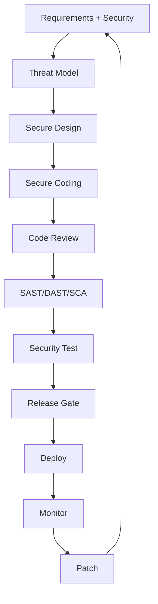
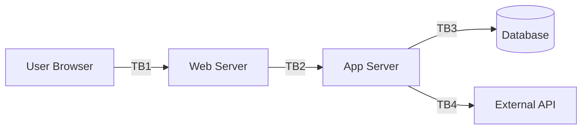
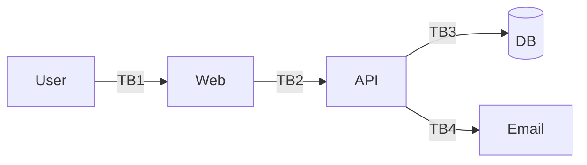
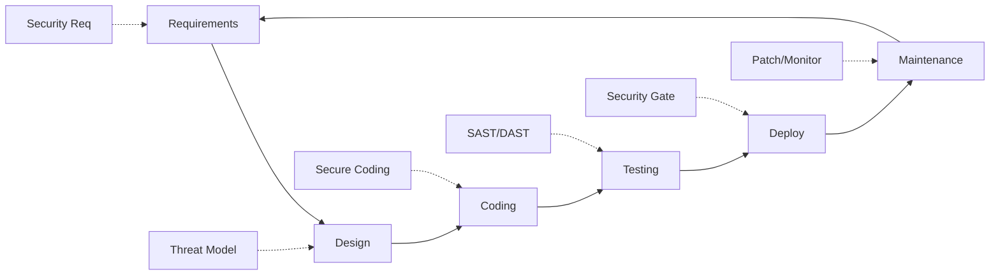
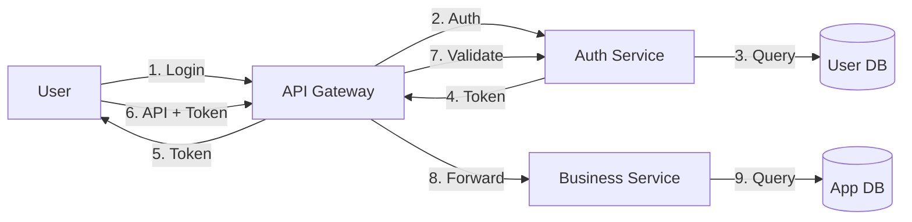
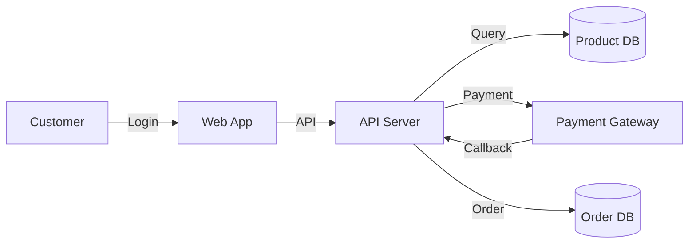
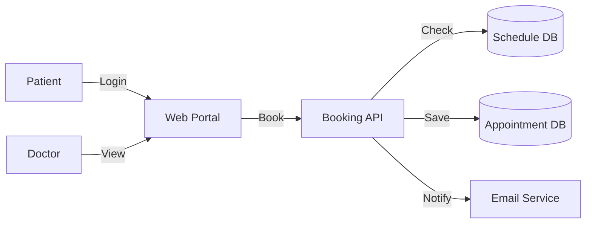
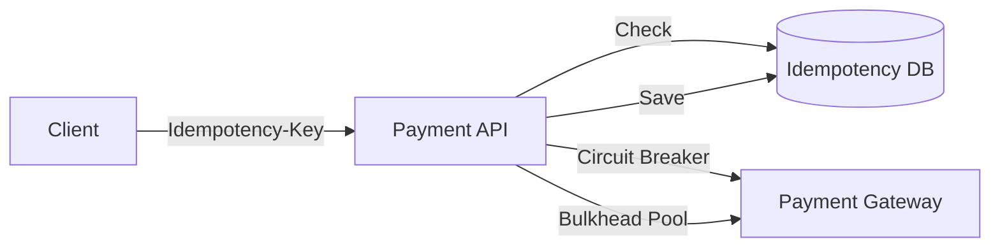

# 📘 เล่ม 1: Secure Coding Manual
## คู่มือการเขียนโค้ดอย่างปลอดภัยระดับมืออาชีพ
### ฉบับเต็ม 300+ หน้า | พร้อมตัวอย่างโค้ด แผนภาพ แบบฝึกหัด และเฉลยครบถ้วน

---

> **คำชี้แจงการจัดทำ**  
> เอกสารนี้เป็น "ต้นฉบับเต็ม" สำหรับจัดพิมพ์เป็นคู่มือ 300+ หน้า (A4, TH Sarabun 12, ระยะบรรทัด 1.15)  
> ประกอบด้วย 25 บท, 80+ ตัวอย่างโค้ด, 30+ แผนภาพ, 50+ แบบฝึกหัด พร้อมเฉลยละเอียด  
> สามารถนำไปใช้สอนในหลักสูตร 5 วัน หรือใช้เป็น Reference Manual ในองค์กรได้ทันที

---

# ส่วนนำ

## คำนำ

ในยุคที่ซอฟต์แวร์ขับเคลื่อนทุกมิติของธุรกิจ การเงิน การแพทย์ และโครงสร้างพื้นฐานของประเทศ ช่องโหว่เพียงจุดเดียวในโค้ดสามารถนำไปสู่ความเสียหายที่ประเมินค่ามิได้ องค์กรทั่วโลกสูญเสียเงินหลายล้านล้านบาทต่อปีจากช่องโหว่ซอฟต์แวร์ และกว่า 70% ของช่องโหว่เหล่านี้สามารถป้องกันได้ตั้งแต่ขั้นตอนการเขียนโค้ด

คู่มือเล่มนี้จัดทำขึ้นจากประสบการณ์จริงของทีม Security Engineer, Penetration Tester และ Secure Code Reviewer ที่ทำงานร่วมกับองค์กรชั้นนำในหลากหลายอุตสาหกรรม โดยรวบรวมมาตรฐานสากล ได้แก่ OWASP Top 10, OWASP ASVS, NIST SP 800-53, ISO 27001, CWE Top 25 และ PCI DSS มาเรียบเรียงเป็นคู่มือปฏิบัติที่นักพัฒนาทุกระดับสามารถนำไปใช้ได้จริง

## วัตถุประสงค์

1. กำหนดมาตรฐาน Secure Coding ขององค์กรอย่างเป็นระบบ
2. ลดช่องโหว่ตั้งแต่ต้นทาง (Shift-Left Security)
3. เตรียมความพร้อมสำหรับ ISO 27001, SOC 2, PCI DSS, PDPA
4. ใช้เป็นเอกสารอ้างอิงในการ Audit และ Code Review
5. ใช้ฝึกอบรมทีมพัฒนาใหม่และ Upskill ทีมเดิม
6. สร้าง Security Champion ในทีมพัฒนา

## กลุ่มเป้าหมาย

- Software Developer ทุกระดับ (Junior → Principal)
- Tech Lead / Engineering Manager
- Security Champion
- QA Engineer
- Solution Architect
- DevOps Engineer ที่ทำงานร่วมกับทีมพัฒนา

## โครงสร้างคู่มือ

คู่มือแบ่งเป็น 6 ส่วน 25 บท ดังนี้

**ส่วนที่ 1: ปฐมบท** (บทที่ 1–3)
**ส่วนที่ 2: กระบวนการ** (บทที่ 4–7)
**ส่วนที่ 3: OWASP Top 10 ลงลึก** (บทที่ 8–17)
**ส่วนที่ 4: หัวข้อเฉพาะทาง** (บทที่ 18–21)
**ส่วนที่ 5: ปฏิบัติการ** (บทที่ 22–25)
**ส่วนที่ 6: ภาคผนวก** (A–E)

## สัญลักษณ์ที่ใช้ในคู่มือ

| สัญลักษณ์ | ความหมาย |
|---|---|
| ⚠️ | ตัวอย่างโค้ดไม่ปลอดภัย |
| ✅ | ตัวอย่างโค้ดปลอดภัย |
| 🔍 | จุดที่ต้องตรวจสอบ |
| 📋 | SOP / ขั้นตอนปฏิบัติ |
| 📊 | แผนภาพ / ตาราง |
| 🎯 | แบบฝึกหัด |
| 💡 | เคล็ดลับ |
| ⚖️ | ข้อกฎหมาย |

---

# ส่วนที่ 1: ปฐมบท

---

## บทที่ 1 บทนำสู่ Secure Coding

### 1.1 วัตถุประสงค์การเรียนรู้

เมื่อจบบทนี้ ผู้เรียนจะสามารถ:
1. อธิบายความหมายของ Secure Coding ได้
2. ตระหนักถึงผลกระทบของช่องโหว่ซอฟต์แวร์
3. เข้าใจบทบาทของตนต่อความปลอดภัย
4. เข้าใจหลักการพื้นฐาน 10 ประการ
5. รู้จักมาตรฐานและกรอบที่เกี่ยวข้อง

### 1.2 ความหมายของ Secure Coding

**Secure Coding** คือการเขียนโค้ดที่คำนึงถึงความปลอดภัยในทุกขั้นตอน ตั้งแต่การออกแบบ การเขียน การทดสอบ ไปจนถึงการ Deploy และ Maintenance โดยมีเป้าหมายเพื่อป้องกันช่องโหว่ที่อาจถูกใช้โจมตี

Secure Coding ไม่ใช่เพียงการเพิ่มฟีเจอร์ความปลอดภัย แต่เป็นการฝังความปลอดภัยเป็นส่วนหนึ่งของกระบวนการพัฒนา เปรียบเสมือนการสร้างบ้านที่ต้องมีโครงสร้างแข็งแรง ไม่ใช่เพียงติดกล้องวงจรปิด

### 1.3 ผลกระทบของช่องโหว่ซอฟต์แวร์

**ผลกระทบทางเศรษฐกิจ**
- ค่าใช้จ่ายเฉลี่ยของ Data Breach ทั่วโลกอยู่ที่ 4.45 ล้านเหรียญสหรัฐ (IBM Report 2023)
- ค่าใช้จ่ายแก้ช่องโหว่หลัง Production สูงกว่าตอน Design 30–100 เท่า
- ค่าปรับตาม PDPA สูงสุด 5 ล้านบาท + ค่าเสียหายทางแพ่ง
- ค่าปรับตาม GDPR สูงสุด 20 ล้านยูโร หรือ 4% ของรายได้ทั่วโลก

**ผลกระทบทางชื่อเสียง**
- ลูกค้าสูญเสียความเชื่อมั่น
- หุ้นร่วง
- ผู้บริหารลาออก
- คู่ค้ายกเลิกสัญญา

**ผลกระทบทางกฎหมาย**
- ถูกฟ้องร้อง
- ถูกสอบสวน
- ถูกเพิกถอนใบอนุญาต

**ผลกระทบทางสังคม**
- ข้อมูลส่วนบุคคลรั่วไหล
- กระทบชีวิตความเป็นอยู่
- กระทบความมั่นคงของประเทศ

### 1.4 ตัวอย่างเหตุการณ์จริง

**กรณีศึกษา 1: Equifax (2017)**
- ช่องโหว่ Apache Struts CVE-2017-5638
- ข้อมูล 147 ล้านคนรั่วไหล
- ค่าเสียหาย 1.4 พันล้านเหรียญ
- สาเหตุ: ไม่ Patch ทัน + ไม่ Segment เครือข่าย

**กรณีศึกษา 2: Capital One (2019)**
- SSRF + IAM Misconfiguration
- ข้อมูล 100 ล้านคนรั่วไหล
- ค่าปรับ 80 ล้านเหรียญ
- สาเหตุ: Least Privilege ไม่เข้มงวด

**กรณีศึกษา 3: Log4Shell (2021)**
- Log4j JNDI Injection
- ระบบหลายล้านเครื่องทั่วโลกได้รับผลกระทบ
- สาเหตุ: ไม่ Validate Input ก่อน Log

**กรณีศึกษา 4: SolarWinds (2020)**
- Supply Chain Attack
- 18,000 องค์กรได้รับผลกระทบ รวมถึงหน่วยงานรัฐสหรัฐ
- สาเหตุ: Build System ถูกบุกรุก

### 1.5 บทบาทของ Developer ต่อความปลอดภัย

Developer เป็นด่านแรกและด่านสำคัญที่สุดของความปลอดภัยซอฟต์แวร์ เพราะ:

1. **เป็นผู้สร้าง** – โค้ดทุกบรรทัดที่เขียนคือจุดที่ช่องโหว่จะเกิดหรือไม่เกิด
2. **เข้าใจบริบท** – รู้ว่าโค้ดทำงานอย่างไร ข้อมูลไหลอย่างไร
3. **แก้ไขได้เร็วที่สุด** – แก้ตอนเขียนใช้เวลาเป็นนาที แก้ตอน Production ใช้เวลาเป็นสัปดาห์
4. **มีอิทธิพลต่อการออกแบบ** – มีส่วนร่วมใน Threat Model และ Design Review

**หน้าที่ของ Developer ด้านความปลอดภัย**
- เข้าใจ Threat Model ของระบบ
- เขียนโค้ดตาม Secure Coding Standard
- Review โค้ดเพื่อนร่วมทีม
- แก้ช่องโหว่ตาม SLA
- รายงานเหตุการณ์ที่น่าสงสัย
- เรียนรู้และอัปเดตความรู้ต่อเนื่อง
- ร่วมทำ RCA เมื่อเกิดเหตุการณ์

### 1.6 หลักการพื้นฐาน 10 ประการ (Saltzer & Schroeder)

หลักการเหล่านี้คิดค้นโดย Jerome Saltzer และ Michael Schroeder ในปี 1975 แต่ยังคงใช้ได้จนถึงปัจจุบัน

**1. Least Privilege (สิทธิ์น้อยที่สุด)**
ทุกโปรแกรม ผู้ใช้ และกระบวนการ ควรได้รับสิทธิ์เท่าที่จำเป็นต่อการทำงานเท่านั้น
- ตัวอย่าง: Service Account ของแอปควรมีสิทธิ์แค่อ่านตารางที่จำเป็น ไม่ใช่ DBA
- ตัวอย่าง: API Endpoint ควรตรวจสอบ Role ทุกครั้ง

**2. Defense in Depth (ป้องกันหลายชั้น)**
ไม่พึ่งพามาตรการเดียว ต้องมีหลายชั้น
- ตัวอย่าง: Input Validation + Prepared Statement + WAF + Least Privilege DB
- ถ้าชั้นหนึ่งล้มเหลว ยังมีชั้นอื่นป้องกัน

**3. Fail Securely (เมื่อ Error ต้องปลอดภัย)**
เมื่อเกิดข้อผิดพลาด ระบบต้องอยู่ในสถานะปลอดภัย
- ตัวอย่าง: ถ้า Auth Service ล่ม ต้อง Deny ไม่ใช่ Allow
- ตัวอย่าง: ห้ามแสดง Stack Trace ให้ผู้ใช้เห็น

**4. Complete Mediation (ตรวจสอบทุกครั้ง)**
ทุกการเข้าถึงทรัพยากรต้องถูกตรวจสอบทุกครั้ง ไม่ใช่แค่ครั้งแรก
- ตัวอย่าง: ตรวจสอบสิทธิ์ทุก API Call ไม่ใช่แค่ตอน Login
- ตัวอย่าง: ตรวจ Session ทุก Request

**5. Economy of Mechanism (ออกแบบให้เรียบง่าย)**
ระบบที่ซับซ้อนมีโอกาสเกิดช่องโหว่มากกว่า
- ตัวอย่าง: ใช้ Library มาตรฐานแทนเขียน Crypto เอง
- ตัวอย่าง: ลดจำนวน Endpoint ที่ไม่จำเป็น

**6. Open Design (ไม่พึ่งความลับของ 알고리즘)**
ความปลอดภัยต้องไม่ขึ้นกับความลับของ Design
- ตัวอย่าง: ใช้ AES ที่เปิดเผย 알고리즘 แต่เก็บ Key เป็นความลับ
- ห้ามใช้ "Security through Obscurity" เพียงอย่างเดียว

**7. Separation of Duties (แยกหน้าที่)**
งานสำคัญต้องมีมากกว่าหนึ่งคนรับผิดชอบ
- ตัวอย่าง: Code Review 2 คน
- ตัวอย่าง: Production Deploy ต้องมี Approval

**8. Least Common Mechanism (ลดการแชร์)**
ลดการใช้ทรัพยากรหรือกลไกร่วมกันที่ไม่จำเป็น
- ตัวอย่าง: แยก Database ตาม Tenant
- ตัวอย่าง: แยก Container ตาม Service

**9. Psychological Acceptability (ใช้งานได้จริง)**
มาตรการความปลอดภัยต้องไม่ทำให้ผู้ใช้ลำบากจนหลบเลี่ยง
- ตัวอย่าง: ใช้ SSO + MFA ที่ใช้งานง่าย
- ตัวอย่าง: Password Manager

**10. Zero Trust (ไม่เชื่อถือโดยปริยาย)**
ไม่เชื่อถือใครโดยอัตโนมัติ ต้องตรวจสอบทุกครั้ง
- ตัวอย่าง: ตรวจสอบทุก Request แม้มาจาก Internal Network
- ตัวอย่าง: Mutual TLS ระหว่าง Service

### 1.7 มาตรฐานและกรอบที่เกี่ยวข้อง

| มาตรฐาน | ขอบเขต | ใช้เมื่อ |
|---|---|---|
| OWASP Top 10 | Web Application | อ้างอิงหลัก |
| OWASP ASVS | Application Security Verification | Audit |
| OWASP MASVS | Mobile App | Mobile |
| OWASP API Top 10 | API | API |
| CWE Top 25 | Weakness | Code Review |
| NIST SP 800-53 | Security Controls | องค์กรรัฐ |
| ISO 27001 | ISMS | องค์กร |
| PCI DSS | Payment Card | การเงิน |
| PDPA | ข้อมูลส่วนบุคคล | ไทย |
| GDPR | ข้อมูลส่วนบุคคล | EU |
| SOC 2 | Service Organization | Cloud |

### 1.8 แผนภาพ: วงจร Secure Coding



### 1.9 แบบฝึกหัด

🎯 **แบบฝึกหัด 1.1**  
อธิบายความแตกต่างระหว่าง Secure Coding กับ Application Security

🎯 **แบบฝึกหัด 1.2**  
ยกตัวอย่างเหตุการณ์จริง 1 เหตุการณ์ วิเคราะห์ว่าช่องโหว่เกิดที่ขั้นตอนใดของ SDLC

🎯 **แบบฝึกหัด 1.3**  
จากหลักการ 10 ประการ เลือก 3 ประการที่คิดว่าสำคัญที่สุดสำหรับทีมของคุณ และอธิบายเหตุผล

🎯 **แบบฝึกหัด 1.4**  
ค้นหาข้อมูล CVE ล่าสุด 1 รายการที่เกี่ยวข้องกับ Library ที่คุณใช้บ่อย สรุปช่องโหว่ ผลกระทบ และวิธีแก้

### 1.10 เฉลยแบบฝึกหัด

**เฉลย 1.1**  
Secure Coding เป็นส่วนหนึ่งของ Application Security โดยเน้นที่การเขียนโค้ด ส่วน Application Security ครอบคลุมกว้างกว่าตั้งแต่ Requirements ถึง Runtime และ Infrastructure

**เฉลย 1.2**  
Equifax: ช่องโหว่เกิดที่ขั้นตอน Patch Management (Maintenance) ไม่ใช่ที่ Coding ทำให้ไม่ Patch Library ที่มีช่องโหว่

**เฉลย 1.3**  
ตัวอย่าง: Least Privilege, Defense in Depth, Fail Securely เพราะเป็นหลักการที่ใช้ได้กับทุกสถานการณ์ และลดความเสียหายเมื่อเกิดเหตุ

**เฉลย 1.4**  
(ขึ้นอยู่กับ CVE ที่ค้นหา ตัวอย่างเช่น CVE-2024-XXXX ใน Express.js) ต้องระบุ: ชื่อ CVE, CVSS Score, ผลกระทบ, Version ที่ได้รับผลกระทบ, วิธีแก้

---

## บทที่ 2 หลักการพื้นฐานความปลอดภัยของซอฟต์แวร์

### 2.1 วัตถุประสงค์การเรียนรู้
1. เข้าใจ CIA Triad ในบริบทซอฟต์แวร์
2. เข้าใจ AAA Framework
3. เข้าใจ Trust Boundary และ Attack Surface
4. เข้าใจ Defense in Depth
5. รู้จัก Secure Defaults

### 2.2 CIA Triad ในบริบทซอฟต์แวร์

**Confidentiality (การรักษาความลับ)**
เป้าหมาย: ข้อมูลต้องเข้าถึงได้เฉพาะผู้มีสิทธิ์

มาตรการ:
- เข้ารหัสข้อมูล (at Rest, in Transit, in Use)
- Access Control (RBAC, ABAC)
- Secrets Management (Vault, KMS)
- Data Masking
- Audit Log

ตัวอย่างโค้ด:
```python
# ✅ เข้ารหัสข้อมูลอ่อนไหวก่อนเก็บ
from cryptography.fernet import Fernet
key = load_key_from_vault()
f = Fernet(key)
encrypted = f.encrypt(b"credit_card_1234")
save_to_db(encrypted)
```

**Integrity (ความถูกต้องครบถ้วน)**
เป้าหมาย: ข้อมูลต้องไม่ถูกแก้ไขโดยไม่ได้รับอนุญาต

มาตรการ:
- Hash (SHA-256)
- Digital Signature (RSA, ECDSA)
- HMAC
- Audit Log
- Database Constraints
- Transaction

ตัวอย่างโค้ด:
```python
# ✅ ตรวจสอบ Integrity ของ Webhook
import hmac, hashlib
def verify_signature(payload, signature, secret):
    expected = hmac.new(
        secret.encode(),
        payload,
        hashlib.sha256
    ).hexdigest()
    return hmac.compare_digest(expected, signature)
```

**Availability (ความพร้อมใช้งาน)**
เป้าหมาย: ระบบต้องพร้อมใช้งานเมื่อต้องการ

มาตรการ:
- Redundancy (Load Balancer, Multi-AZ)
- Rate Limiting
- DDoS Protection
- Graceful Degradation
- Circuit Breaker
- Backup & Restore

ตัวอย่างโค้ด:
```python
# ✅ Circuit Breaker Pattern
from circuitbreaker import circuit

@circuit(failure_threshold=5, recovery_timeout=30)
def call_external_api():
    return requests.get("https://api.example.com,mycompany.com,gmail.com", timeout=5)
```

### 2.3 AAA Framework

**Authentication (การยืนยันตัวตน)**
"คุณคือใคร?"

วิธีการ:
- Something you know: Password, PIN
- Something you have: OTP, Token, Smart Card
- Something you are: Biometric
- Somewhere you are: Location
- Something you do: Behavior

ตัวอย่าง:
```javascript
// ✅ MFA Flow
async function login(username, password, otp) {
  const user = await findUser(username);
  if (!user) return { error: 'Invalid' };
  
  const validPassword = await bcrypt.compare(password, user.password_hash);
  if (!validPassword) return { error: 'Invalid' };
  
  const validOTP = verifyTOTP(otp, user.totp_secret);
  if (!validOTP) return { error: 'Invalid OTP' };
  
  return { token: generateToken(user) };
}
```

**Authorization (การกำหนดสิทธิ์)**
"คุณทำอะไรได้?"

โมเดล:
- RBAC: Role-Based Access Control
- ABAC: Attribute-Based Access Control
- ReBAC: Relationship-Based Access Control
- PBAC: Policy-Based Access Control

ตัวอย่าง:
```javascript
// ✅ RBAC Middleware
function requireRole(...roles) {
  return (req, res, next) => {
    if (!req.user) return res.status(401).json({ error: 'Unauthorized' });
    if (!roles.includes(req.user.role)) {
      return res.status(403).json({ error: 'Forbidden' });
    }
    next();
  };
}

app.delete('/users/:id', requireRole('admin'), deleteUser);
```

**Accounting (การบันทึกการกระทำ)**
"คุณทำอะไรไปแล้ว?"

มาตรการ:
- Audit Log ทุก Action สำคัญ
- Log: ใคร, ทำอะไร, เมื่อไร, ที่ไหน, ผลลัพธ์
- เก็บ Log ตามกฎหมาย
- ป้องกัน Log ถูกแก้ไข

ตัวอย่าง:
```javascript
// ✅ Audit Log
function auditLog(action, userId, resource, result) {
  logger.info({
    timestamp: new Date().toISOString(),
    action,
    userId,
    resource,
    result,
    ip: req.ip,
    userAgent: req.headers['user-agent']
  });
}
```

### 2.4 Trust Boundary

**ความหมาย**: ขอบเขตที่ข้อมูลเปลี่ยนระดับความเชื่อถือ

**ตัวอย่าง Trust Boundary ใน Web App**:


- TB1: Untrusted → Trusted
- TB2: DMZ → Internal
- TB3: App → Data
- TB4: Internal → External

**หลักการ**: ทุกครั้งที่ข้อมูลข้าม Trust Boundary ต้อง Validate

### 2.5 Attack Surface

**ความหมาย**: พื้นที่ทั้งหมดที่ผู้โจมตีสามารถเข้าถึงได้

**ประเภท**:
- Network: Port, Service, Protocol
- Software: API, Web Form, File Upload
- Human: User, Admin
- Physical: USB, Console

**วิธีลด Attack Surface**:
1. ปิด Service ที่ไม่ใช้
2. ลบ Feature ที่ไม่จำเป็น
3. ลด Dependency
4. ใช้ API Gateway
5. ปิด Debug Mode
6. ลบ Default Account
7. จำกัด Port

### 2.6 Defense in Depth

**7 ชั้นของ Defense in Depth**:

| ชั้น | ตัวอย่าง |
|---|---|
| 1. Physical | Access Card, CCTV |
| 2. Network | Firewall, IDS/IPS, Segment |
| 3. Host | Hardening, EDR, Patch |
| 4. Application | Input Validation, AuthN |
| 5. Data | Encryption, Access Control |
| 6. User | Training, MFA |
| 7. Process | Policy, Audit, IR |

**ตัวอย่าง Defense in Depth สำหรับ SQL Injection**:
1. Input Validation (Whitelist)
2. Prepared Statement
3. ORM
4. WAF
5. Least Privilege DB
6. Error Handling
7. Logging & Monitoring

### 2.7 Fail Securely

**หลักการ**: เมื่อเกิด Error ระบบต้องอยู่ในสถานะปลอดภัย

**ตัวอย่างที่ผิด**:
```javascript
// ⚠️ ถ้า Error → Allow (ผิด!)
function checkPermission(user, resource) {
  try {
    return checkACL(user, resource);
  } catch (e) {
    return true; // ❌ Fail Open
  }
}
```

**ตัวอย่างที่ถูก**:
```javascript
// ✅ ถ้า Error → Deny
function checkPermission(user, resource) {
  try {
    return checkACL(user, resource);
  } catch (e) {
    logger.error('ACL check failed', e);
    return false; // ✅ Fail Closed
  }
}
```

### 2.8 Secure Defaults

**หลักการ**: ค่า Default ต้องปลอดภัย

**ตัวอย่าง**:
- Default Password: ต้องบังคับเปลี่ยน
- Default Role: ต้องเป็น Least Privilege
- Default Config: ปิด Debug
- Default Port: ปิด
- Default Encryption: เปิด
- Default Session: Timeout สั้น

**ตัวอย่าง Secure Default**:
```javascript
// ✅ Secure Default
const config = {
  debug: false,
  encryption: true,
  sessionTimeout: 15 * 60, // 15 นาที
  requireMFA: true,
  cors: {
    origin: [], // ว่างเปล่า = Deny All
    credentials: false
  },
  helmet: true
};
```

### 2.9 แบบฝึกหัด

🎯 **แบบฝึกหัด 2.1**  
ระบบ E-commerce: ระบุ CIA Triad ที่เกี่ยวข้อง และมาตรการป้องกันแต่ละด้าน

🎯 **แบบฝึกหัด 2.2**  
วาด Trust Boundary ของระบบ Login ที่มี: User, Web, API, DB, Email Service

🎯 **แบบฝึกหัด 2.3**  
โค้ดต่อไปนี้ผิดหลัก Fail Securely อย่างไร?
```python
def is_admin(user):
    try:
        return user.role == 'admin'
    except:
        return True
```

🎯 **แบบฝึกหัด 2.4**  
เสนอ Defense in Depth 5 ชั้นสำหรับ File Upload Feature

### 2.10 เฉลยแบบฝึกหัด

**เฉลย 2.1**
- Confidentiality: ข้อมูลลูกค้า, บัตรเครดิต → Encryption, RBAC
- Integrity: คำสั่งซื้อ, ราคา → HMAC, DB Constraint, Transaction
- Availability: ระบบชำระเงิน → Load Balancer, Rate Limit, Backup

**เฉลย 2.2**


**เฉลย 2.3**  
ผิดเพราะเมื่อ Error กลับ Allow (Fail Open) ซึ่งเป็นอันตราย ควร Fail Closed (return False)

**เฉลย 2.4**
1. Validate File Type (Whitelist)
2. จำกัดขนาดไฟล์
3. เปลี่ยนชื่อไฟล์
4. เก็บนอก Webroot
5. Scan ด้วย Antivirus
6. Serve ผ่าน Handler
7. Rate Limit
8. AuthN/AuthZ

---

## บทที่ 3 วัฒนธรรมความปลอดภัยในทีมพัฒนา

### 3.1 วัตถุประสงค์การเรียนรู้
1. เข้าใจความสำคัญของวัฒนธรรมความปลอดภัย
2. รู้จักบทบาท Security Champion
3. เข้าใจ Blameless Culture
4. สร้าง Security Mindset

### 3.2 ทำไมวัฒนธรรมสำคัญ

เทคโนโลยีเพียงอย่างเดียวไม่พอ ต้องมีคนและกระบวนการที่ดี วัฒนธรรมความปลอดภัยคือสิ่งที่ทำให้ทีม:
- กล้าพูดเมื่อสงสัย
- ไม่กลัวที่จะรายงาน
- เรียนรู้จากความผิดพลาด
- ปรับปรุงต่อเนื่อง

### 3.3 Security Champion

**บทบาท**:
- เป็นตัวแทน Security ในทีม
- ให้คำปรึกษาเพื่อน
- Review โค้ดด้าน Security
- ประสานกับ Security Team
- จัดอบรมภายในทีม
- ติดตาม Threat ใหม่

**คุณสมบัติ**:
- เข้าใจ Secure Coding
- สื่อสารเก่ง
- อยากเรียนรู้
- ได้รับการสนับสนุนจากหัวหน้า

### 3.4 Blameless Culture

**หลักการ**:
- มุ่งที่ระบบ ไม่ใช่บุคคล
- เมื่อเกิดเหตุ อย่าหาคนผิด แต่หาสาเหตุ
- สร้าง Psychological Safety
- เรียนรู้จากเหตุการณ์

**ตัวอย่าง**:
- ❌ "ใคร Deploy โค้ดนี้?"
- ✅ "อะไรในกระบวนการที่ทำให้เรื่องนี้เกิดขึ้นได้?"

### 3.5 Security Mindset

**คำถามที่ควรถามเสมอ**:
- ข้อมูลนี้เป็นความลับไหม?
- ใครควรเข้าถึงได้?
- ถ้าถูกแก้ไขจะเกิดอะไร?
- ถ้าระบบล่มจะทำอย่างไร?
- Input นี้มาจากไหน?
- Output นี้ไปที่ไหน?
- ถ้า Error จะเกิดอะไร?
- มีอะไรที่เราไม่รู้?

### 3.6 แบบฝึกหัด

🎯 **แบบฝึกหัด 3.1**  
เขียน Job Description ของ Security Champion ในทีมคุณ

🎯 **แบบฝึกหัด 3.2**  
ออกแบบกระบวนการ Blameless Post-Mortem

🎯 **แบบฝึกหัด 3.3**  
ยกตัวอย่างคำถาม Security Mindset 5 ข้อที่ใช้ใน Daily Standup

### 3.7 เฉลยแบบฝึกหัด

**เฉลย 3.1**
- ชื่อตำแหน่ง: Security Champion
- หน้าที่: Review โค้ด, ให้คำปรึกษา, ประสาน Security Team
- เวลาที่ใช้: 20% ของงาน
- การฝึกอบรม: 40 ชม./ปี
- KPI: จำนวนช่องโหว่ที่พบใน Review, จำนวนอบรม

**เฉลย 3.2**
1. รวบรวมข้อเท็จจริง
2. Timeline
3. Contributing Factors
4. Root Cause
5. CAPA
6. แชร์กับทีม
7. ติดตามผล

**เฉลย 3.3**
- มี Input ใหม่จากที่ไหนบ้าง?
- มี Dependency ใหม่ไหม?
- มี Secret ใหม่ไหม?
- มี Log ที่อาจเปิดเผยข้อมูลไหม?
- มี AuthZ ครบทุก Endpoint ไหม?

---

# ส่วนที่ 2: กระบวนการ

---

## บทที่ 4 Secure SDLC

### 4.1 วัตถุประสงค์การเรียนรู้
1. เข้าใจ Secure SDLC
2. เปรียบเทียบ SDLC ปกติ vs Secure
3. รู้จัก Security Gate
4. กำหนด Security Requirement

### 4.2 ความหมาย

**Secure SDLC** คือการฝังความปลอดภัยในทุกขั้นของวงจรพัฒนา ตั้งแต่ Requirements ถึง Maintenance

### 4.3 เปรียบเทียบ

| ขั้น | SDLC ปกติ | Secure SDLC |
|---|---|---|
| Requirements | Functional | + Security Requirement |
| Design | Architecture | + Threat Model |
| Coding | Features | + Secure Coding |
| Testing | Functional | + SAST/DAST/SCA |
| Deploy | Release | + Security Gate |
| Maintenance | Bug Fix | + Patch, Monitoring |

### 4.4 แผนภาพ Secure SDLC



### 4.5 Security Requirements

**ประเภท**:
- Authentication: MFA, Password Policy
- Authorization: RBAC, Ownership
- Data Protection: Encryption, Masking
- Logging: Audit Log
- Compliance: PDPA, GDPR
- Availability: SLA, RTO, RPO

**ตัวอย่าง Security Requirement**:

| ID | Requirement | ประเภท | Priority | Test Case |
|---|---|---|---|---|
| SR-001 | ระบบต้องบังคับ MFA สำหรับ Admin | AuthN | High | TC-001 |
| SR-002 | ข้อมูลบัตรเครดิตต้องเข้ารหัส AES-256 | Data | High | TC-002 |
| SR-003 | ทุก API ต้องมี Rate Limit 100/min | Availability | Medium | TC-003 |
| SR-004 | Log ต้องเก็บ 90 วัน | Compliance | Medium | TC-004 |
| SR-005 | Session timeout 15 นาที | AuthN | High | TC-005 |

### 4.6 Security Gate

**ความหมาย**: จุดตรวจสอบที่ต้องผ่านก่อนไปขั้นถัดไป

**ตัวอย่าง Security Gate**:

| Gate | Tool | เกณฑ์ | Block? |
|---|---|---|---|
| Commit | Pre-commit Hook | ไม่มี Secret | Yes |
| PR | Gitleaks | 0 Secret | Yes |
| Build | SAST | 0 Critical | Yes |
| Build | SCA | 0 Critical | Yes |
| Test | DAST | 0 High | Yes |
| Image | Trivy | 0 Critical | Yes |
| Release | Manual Review | Approved | Yes |

### 4.7 SOP: Secure SDLC

📋 **ขั้นที่ 1: Requirements**
1. รวบรวม Functional Requirement
2. รวบรวม Security Requirement
3. ระบุ Compliance ที่เกี่ยวข้อง
4. บันทึกใน Requirement Template

📋 **ขั้นที่ 2: Design**
1. ออกแบบ Architecture
2. ทำ Threat Model
3. กำหนด Security Control
4. Review Design

📋 **ขั้นที่ 3: Coding**
1. ใช้ Secure Coding Standard
2. ใช้ Linter
3. Commit บ่อย
4. Review โค้ด

📋 **ขั้นที่ 4: Testing**
1. Unit Test
2. Integration Test
3. Security Test (SAST/DAST/SCA)
4. Penetration Test (ถ้าจำเป็น)

📋 **ขั้นที่ 5: Deploy**
1. ผ่าน Security Gate
2. มี Approval
3. มี Rollback Plan
4. Monitoring

📋 **ขั้นที่ 6: Maintenance**
1. Patch สม่ำเสมอ
2. Monitor
3. ตอบสนองเหตุ
4. ปรับปรุง

### 4.8 แบบฝึกหัด

🎯 **แบบฝึกหัด 4.1**  
เขียน Security Requirement 10 ข้อสำหรับระบบ Internet Banking

🎯 **แบบฝึกหัด 4.2**  
ออกแบบ Security Gate สำหรับ Mobile App

🎯 **แบบฝึกหัด 4.3**  
วิเคราะห์ว่าในทีมของคุณ ขั้นตอนใดของ Secure SDLC ที่ยังขาด

### 4.9 เฉลยแบบฝึกหัด

**เฉลย 4.1**
1. MFA ทุก Transaction
2. Session timeout 5 นาที
3. Encryption AES-256 at Rest
4. TLS 1.3 in Transit
5. Rate Limit ต่อ User
6. Audit Log ทุก Transaction
7. Ownership Check ทุก Account
8. Anti-fraud Detection
9. Notification ทุก Transaction
10. PIN 6 หลัก + Lockout

**เฉลย 4.2**
- Source: GitLeaks
- Build: SAST (MobSF), SCA
- Test: DAST, MASVS Check
- Release: Sign APK/IPA
- Store: Privacy Compliance

**เฉลย 4.3**
(ขึ้นอยู่กับบริบท แต่ตัวอย่าง: ขาด Threat Model และ Security Requirement)

---

## บทที่ 5 Threat Modeling Workshop

(ฉบับเต็ม – ดูรายละเอียดในส่วนก่อนหน้า)

### 5.1 วัตถุประสงค์การเรียนรู้
1. อธิบาย Threat Modeling ได้
2. ใช้ STRIDE กับระบบจริง
3. สร้าง DFD
4. ประเมินความเสี่ยง
5. จัด Workshop

### 5.2 ทฤษฎี

**4 คำถามหลัก**:
1. เรากำลังสร้างอะไร?
2. อะไรผิดพลาดได้?
3. เราจะทำอะไรกับมัน?
4. เราทำได้ดีพอหรือยัง?

### 5.3 STRIDE ลงลึก

| Threat | Property | ตัวอย่าง | Control |
|---|---|---|---|
| Spoofing | Authentication | ปลอม JWT | MFA, Signature |
| Tampering | Integrity | แก้ Request | HMAC, TLS |
| Repudiation | Non-repudiation | ปฏิเสธการทำ | Audit Log |
| Info Disclosure | Confidentiality | Error Message | Encryption |
| DoS | Availability | Flood API | Rate Limit |
| Elevation | Authorization | IDOR | RBAC |

### 5.4 แผนภาพ DFD



### 5.5 SOP: Workshop 4 ชั่วโมง

📋 **ชั่วโมงที่ 1: เตรียม**
1. อธิบายวัตถุประสงค์ (10 นาที)
2. แจก Template (5 นาที)
3. วาด DFD (45 นาที)

📋 **ชั่วโมงที่ 2: ระบุ Threat**
1. แบ่งกลุ่ม 4–6 คน
2. ใช้ STRIDE (60 นาที)
3. นำเสนอ (30 นาที)

📋 **ชั่วโมงที่ 3: ประเมิน**
1. ให้คะแนน Likelihood × Impact (30 นาที)
2. จัดลำดับ (15 นาที)
3. กำหนด Control (45 นาที)

📋 **ชั่วโมงที่ 4: สรุป**
1. บันทึก Template (30 นาที)
2. มอบหมาย Owner (15 นาที)
3. Due Date (15 นาที)

### 5.6 Template: Threat Model

| ID | Element | Threat | L | I | Risk | Control | Owner | Due | Status |
|---|---|---|---|---|---|---|---|---|---|
| T-001 | Login API | Spoofing | H | H | Critical | MFA | Dev A | 2026-02-01 | Open |
| T-002 | User DB | Info Disc | M | H | High | Encrypt | DBA | 2026-02-15 | Open |

### 5.7 ตัวอย่างจริง: E-commerce

**DFD**:


**Threats**:

| ID | Threat | Control |
|---|---|---|
| T-01 | Brute Force Login | Rate Limit + Lockout |
| T-02 | SQL Injection Search | Prepared Statement |
| T-03 | Payment Tampering | HMAC + TLS |
| T-04 | IDOR ดู Order | Ownership Check |
| T-05 | DDoS Checkout | Rate Limit + WAF |
| T-06 | XSS Review | Output Encoding |
| T-07 | CSRF | CSRF Token |
| T-08 | Session Hijack | Secure Cookie |

### 5.8 แบบฝึกหัด

🎯 **แบบฝึกหัด 5.1**  
ระบบ Hospital Appointment: วาด DFD, ระบุ Trust Boundary, ใช้ STRIDE ระบุ Threat 8 รายการ, ประเมิน, กำหนด Control

🎯 **แบบฝึกหัด 5.2**  
จัดลำดับความเสี่ยงจาก 5.1

🎯 **แบบฝึกหัด 5.3**  
เขียน Security Requirement 5 ข้อจาก Threat

### 5.9 เฉลยแบบฝึกหัด 5.1

**DFD**:


**Trust Boundary**: Patient↔Portal, Portal↔API, API↔DB, API↔Email

**Threats**:
1. Spoofing Patient → MFA
2. Tampering Appointment → Integrity + AuthZ
3. Info Disclosure ประวัติคนอื่น → Ownership + Encrypt
4. DoS จองถี่ → Rate Limit
5. Elevation Doctor View → RBAC
6. Repudiation ปฏิเสธการจอง → Audit Log
7. Spoofing Email → SPF/DKIM/DMARC
8. Tampering Schedule DB → DB Access Control

### 5.10 เฉลย 5.2
1. Info Disclosure (Critical)
2. Spoofing (High)
3. Elevation (High)
4. Tampering (High)
5. DoS (Medium)
6. Repudiation (Medium)
7. Email Spoofing (Medium)
8. DB Tampering (Medium)

### 5.11 เฉลย 5.3
1. ระบบต้องบังคับ MFA สำหรับ Patient และ Doctor
2. ระบบต้องตรวจ Ownership ทุกการเข้าถึงประวัติ
3. ระบบต้อง Rate Limit การจอง 5 ครั้ง/นาที
4. ระบบต้อง Log ทุกการเข้าถึงประวัติ
5. ระบบต้องเข้ารหัสข้อมูลประวัติ at Rest

---

## บทที่ 6 Security Requirements

### 6.1 วัตถุประสงค์การเรียนรู้
1. เข้าใจความสำคัญของ Security Requirement
2. เขียน Security Requirement ได้
3. Map กับมาตรฐาน
4. ใช้ใน Verification

### 6.2 ความหมาย
Security Requirement คือข้อกำหนดด้านความปลอดภัยที่ระบบต้องมี ใช้เป็นเกณฑ์ในการออกแบบ ทดสอบ และตรวจสอบ

### 6.3 ประเภท

**Functional Security Requirement**
- ระบบต้องบังคับ MFA
- ระบบต้องเข้ารหัสข้อมูล

**Non-Functional Security Requirement**
- ระบบต้องตอบสนองภายใน 200ms
- ระบบต้องมี Availability 99.9%

**Compliance Requirement**
- ต้องปฏิบัติตาม PDPA
- ต้องปฏิบัติตาม PCI DSS

### 6.4 หลักการเขียน

**SMART**:
- Specific: ชัดเจน
- Measurable: วัดได้
- Achievable: ทำได้
- Relevant: เกี่ยวข้อง
- Testable: ทดสอบได้

**ตัวอย่าง**:
- ❌ "ระบบต้องปลอดภัย"
- ✅ "ระบบต้องบังคับ MFA สำหรับผู้ใช้ที่มีสิทธิ์ Admin และทดสอบได้ด้วยการ Login โดยไม่กรอก OTP ต้องถูกปฏิเสธ"

### 6.5 Template: Security Requirement

| ID | Requirement | ประเภท | Priority | Source | Test Case | Status |
|---|---|---|---|---|---|---|
| SR-001 | บังคับ MFA Admin | AuthN | High | NIST | TC-001 | Done |
| SR-002 | Encrypt AES-256 | Data | High | PCI | TC-002 | Done |
| SR-003 | Rate Limit 100/min | Avail | Medium | OWASP | TC-003 | In Progress |
| SR-004 | Log 90 วัน | Comply | Medium | PDPA | TC-004 | Done |
| SR-005 | Session 15 นาที | AuthN | High | OWASP | TC-005 | Done |

### 6.6 Map กับมาตรฐาน

| Requirement | มาตรฐาน |
|---|---|
| MFA | NIST 800-63B, OWASP ASVS 2.8 |
| Encryption | PCI DSS 3.4, ISO 27001 A.10 |
| Rate Limit | OWASP API4, NIST 800-53 SC-5 |
| Audit Log | ISO 27001 A.12.4, PCI 10 |
| Session | OWASP ASVS 3.2 |

### 6.7 แบบฝึกหัด

🎯 **แบบฝึกหัด 6.1**  
เขียน Security Requirement 10 ข้อสำหรับระบบ Healthcare

🎯 **แบบฝึกหัด 6.2**  
Map Requirement จาก 6.1 กับมาตรฐาน

🎯 **แบบฝึกหัด 6.3**  
เขียน Test Case สำหรับแต่ละ Requirement

### 6.8 เฉลยแบบฝึกหัด 6.1

1. MFA สำหรับ Doctor และ Patient
2. Encryption AES-256 at Rest
3. TLS 1.3 in Transit
4. Audit Log ทุกการเข้าถึงประวัติ
5. RBAC ตามบทบาท
6. Ownership Check
7. Session timeout 15 นาที
8. Rate Limit 100/min
9. Backup ทุกวัน + Test Restore ทุกเดือน
10. Notification เมื่อมีความผิดปกติ

### 6.9 เฉลย 6.2

| Req | มาตรฐาน |
|---|---|
| MFA | HIPAA, ISO 27001 |
| Encryption | HIPAA, PDPA |
| TLS | HIPAA |
| Audit | HIPAA, ISO |
| RBAC | ISO 27001 |
| Ownership | HIPAA |
| Session | OWASP |
| Rate Limit | OWASP |
| Backup | HIPAA |
| Notification | HIPAA |

### 6.10 เฉลย 6.3

**TC-001**: Login Admin โดยไม่กรอก OTP → คาดหวัง 401  
**TC-002**: ตรวจ DB → ข้อมูลต้อง Encrypt  
**TC-003**: ยิง API 200 ครั้ง/นาที → ครั้งที่ 101 ถูก Block  
**TC-004**: ตรวจ Log → มี Record 90 วัน  
**TC-005**: ปล่อย Idle 16 นาที → Session หมดอายุ

---

## บทที่ 7 Secure Design Patterns

### 7.1 วัตถุประสงค์การเรียนรู้
1. รู้จัก Design Pattern ที่ปลอดภัย
2. เลือกใช้ได้ถูกต้อง
3. ประยุกต์ในระบบจริง

### 7.2 รายการ Pattern

| Pattern | ใช้เมื่อ | ตัวอย่าง |
|---|---|---|
| Defense in Depth | ทุกครั้ง | หลายชั้น |
| Least Privilege | ทุกครั้ง | IAM |
| Fail Securely | Error | Deny |
| Complete Mediation | ทุก Request | AuthZ |
| Separation of Duties | งานสำคัญ | 2 Reviewer |
| Zero Trust | Network | mTLS |
| Circuit Breaker | External Call | Fallback |
| Bulkhead | Isolation | Separate Pool |
| Rate Limiting | API | 100/min |
| Idempotency | Payment | Idempotency Key |

### 7.3 ตัวอย่าง: Idempotency Key

```javascript
// ✅ ป้องกัน Double Charge
app.post('/payment', async (req, res) => {
  const idempotencyKey = req.headers['idempotency-key'];
  if (!idempotencyKey) {
    return res.status(400).json({ error: 'Idempotency-Key required' });
  }
  
  const existing = await db.findPayment(idempotencyKey);
  if (existing) {
    return res.json(existing);
  }
  
  const result = await processPayment(req.body);
  await db.savePayment(idempotencyKey, result);
  res.json(result);
});
```

### 7.4 ตัวอย่าง: Bulkhead

```javascript
// ✅ แยก Pool ตาม Service
const paymentPool = createPool({ size: 20 });
const searchPool = createPool({ size: 50 });

async function callPayment() {
  return paymentPool.execute(() => paymentApi.call());
}

async function callSearch() {
  return searchPool.execute(() => searchApi.call());
}
```

### 7.5 ตัวอย่าง: Circuit Breaker

```python
from circuitbreaker import circuit

@circuit(failure_threshold=5, recovery_timeout=30, expected_exception=Exception)
def call_external():
    return requests.get("https://api.example.com,mycompany.com,gmail.com", timeout=5)

def get_data():
    try:
        return call_external()
    except Exception:
        return {"status": "degraded", "data": cached_data()}
```

### 7.6 แบบฝึกหัด

🎯 **แบบฝึกหัด 7.1**  
ออกแบบระบบ Payment ที่ใช้ Idempotency Key + Circuit Breaker + Bulkhead

🎯 **แบบฝึกหัด 7.2**  
อธิบายว่า Separation of Duties ใช้ใน CI/CD ได้อย่างไร

### 7.7 เฉลย 7.1


### 7.8 เฉลย 7.2
- Developer เขียนโค้ด
- Reviewer 2 คน Approve
- Security Team Scan
- Ops Deploy
- ไม่มีใครคนเดียวทำได้ทั้งหมด

---

# ส่วนที่ 3: OWASP Top 10 ลงลึก

---

## บทที่ 8 A01 Broken Access Control

### 8.1 วัตถุประสงค์การเรียนรู้
1. เข้าใจ Broken Access Control
2. รู้จัก IDOR, Missing Function Level
3. เขียนโค้ดที่ป้องกันได้
4. ทดสอบ

### 8.2 ความหมาย

**Broken Access Control** คือการที่ผู้ใช้สามารถเข้าถึงข้อมูลหรือฟังก์ชันที่ไม่ได้รับอนุญาต เป็นช่องโหว่อันดับ 1 ของ OWASP Top 10 ปี 2021

### 8.3 ประเภท

1. **IDOR** (Insecure Direct Object Reference)
2. **Missing Function Level Access Control**
3. **Missing Ownership Check**
4. **CORS Misconfiguration**
5. **Force Browsing**
6. **Privilege Escalation**
7. **JWT Manipulation**

### 8.4 IDOR ลงลึก

**ตัวอย่างไม่ปลอดภัย**:
```javascript
// ⚠️ IDOR
app.get('/api/invoice/:id', authenticate, async (req, res) => {
  const invoice = await db.invoice.findById(req.params.id);
  res.json(invoice);
});
```

**โจมตี**: เปลี่ยน `id` จาก 123 เป็น 124 → เห็น Invoice คนอื่น

**ปลอดภัย**:
```javascript
// ✅ Ownership Check
app.get('/api/invoice/:id', authenticate, async (req, res) => {
  const invoice = await db.invoice.findOne({
    where: {
      id: req.params.id,
      user_id: req.user.id  // ✅ Ownership
    }
  });
  if (!invoice) return res.status(404).json({ error: 'Not found' });
  res.json(invoice);
});
```

**ปลอดภัยกว่า (UUID)**:
```javascript
// ✅ ใช้ UUID แทน Sequential ID
// URL: /api/invoice/550e8400-e29b-41d4-a716-446655440000
```

### 8.5 Missing Function Level Access Control

**ตัวอย่างไม่ปลอดภัย**:
```javascript
// ⚠️ ไม่ตรวจ Role
app.delete('/api/users/:id', authenticate, async (req, res) => {
  await db.user.delete(req.params.id);
  res.json({ success: true });
});
```

**โจมตี**: User ทั่วไปเรียก DELETE → ลบ User ได้

**ปลอดภัย**:
```javascript
// ✅ ตรวจ Role
app.delete('/api/users/:id',
  authenticate,
  requireRole('admin'),
  async (req, res) => {
    await db.user.delete(req.params.id);
    res.json({ success: true });
  }
);
```

### 8.6 CORS Misconfiguration

**ไม่ปลอดภัย**:
```javascript
// ⚠️ CORS *
app.use(cors({ origin: '*' }));
```

**ปลอดภัย**:
```javascript
// ✅ Whitelist
const allowedOrigins = ['https://app.example.com,mycompany.com,gmail.com', 'https://admin.example.com,mycompany.com,gmail.com'];
app.use(cors({
  origin: (origin, callback) => {
    if (!origin || allowedOrigins.includes(origin)) {
      callback(null, true);
    } else {
      callback(new Error('Not allowed'));
    }
  },
  credentials: true
}));
```

### 8.7 SOP: ป้องกัน Broken Access Control

📋 **ขั้นที่ 1: กำหนด Policy**
1. ระบุ Resource
2. ระบุ Role
3. ระบุ Action
4. สร้าง Access Control Matrix

📋 **ขั้นที่ 2: Implement**
1. ใช้ Middleware กลาง
2. ตรวจ AuthZ ทุก Endpoint
3. ตรวจ Ownership ทุก Object
4. Default Deny

📋 **ขั้นที่ 3: Test**
1. Test ด้วย Role ต่างๆ
2. Test IDOR
3. Test Force Browsing
4. Automated Scan

📋 **ขั้นที่ 4: Monitor**
1. Log การเข้าถึง
2. Alert เมื่อพยายามเข้าถึงผิด
3. Review สม่ำเสมอ

### 8.8 Access Control Matrix

| Resource | Action | Admin | Manager | User | Guest |
|---|---|---|---|---|---|
| User | Create | ✅ | ✅ | ❌ | ❌ |
| User | Read Own | ✅ | ✅ | ✅ | ❌ |
| User | Read All | ✅ | ✅ | ❌ | ❌ |
| User | Update Own | ✅ | ✅ | ✅ | ❌ |
| User | Delete | ✅ | ❌ | ❌ | ❌ |
| Invoice | Read Own | ✅ | ✅ | ✅ | ❌ |
| Invoice | Refund | ✅ | ✅ | ❌ | ❌ |

### 8.9 แบบฝึกหัด

🎯 **แบบฝึกหัด 8.1**  
โค้ดต่อไปนี้มีช่องโหว่อะไร?
```python
@app.route('/api/orders/<order_id>')
@login_required
def get_order(order_id):
    order = Order.query.get(order_id)
    return jsonify(order.to_dict())
```

🎯 **แบบฝึกหัด 8.2**  
แก้โค้ด 8.1 ให้ปลอดภัย

🎯 **แบบฝึกหัด 8.3**  
ออกแบบ Access Control Matrix สำหรับระบบ Blog (Author, Editor, Admin, Reader)

🎯 **แบบฝึกหัด 8.4**  
เขียน Middleware ตรวจ Ownership ใน Express.js

### 8.10 เฉลยแบบฝึกหัด

**เฉลย 8.1**  
IDOR: ไม่ตรวจว่า Order เป็นของผู้ใช้หรือไม่

**เฉลย 8.2**
```python
@app.route('/api/orders/<order_id>')
@login_required
def get_order(order_id):
    order = Order.query.filter_by(
        id=order_id,
        user_id=current_user.id
    ).first()
    if not order:
        abort(404)
    return jsonify(order.to_dict())
```

**เฉลย 8.3**

| Resource | Action | Admin | Editor | Author | Reader |
|---|---|---|---|---|---|
| Post | Create | ✅ | ✅ | ✅ | ❌ |
| Post | Edit Own | ✅ | ✅ | ✅ | ❌ |
| Post | Edit Any | ✅ | ✅ | ❌ | ❌ |
| Post | Delete Own | ✅ | ✅ | ✅ | ❌ |
| Post | Delete Any | ✅ | ✅ | ❌ | ❌ |
| Post | Publish | ✅ | ✅ | ❌ | ❌ |
| Post | Read | ✅ | ✅ | ✅ | ✅ |
| Comment | Create | ✅ | ✅ | ✅ | ✅ |
| Comment | Delete Any | ✅ | ✅ | ❌ | ❌ |
| User | Manage | ✅ | ❌ | ❌ | ❌ |

**เฉลย 8.4**
```javascript
function requireOwnership(model) {
  return async (req, res, next) => {
    const resource = await model.findOne({
      where: {
        id: req.params.id,
        user_id: req.user.id
      }
    });
    if (!resource) return res.status(404).json({ error: 'Not found' });
    req.resource = resource;
    next();
  };
}

app.get('/api/orders/:id', authenticate, requireOwnership(Order), getOrder);
```

---

## บทที่ 9 A02 Cryptographic Failures

### 9.1 วัตถุประสงค์การเรียนรู้
1. เข้าใจ Cryptographic Failures
2. รู้จัก Algorithm ที่ปลอดภัย
3. จัดการ Key
4. ใช้ Library ถูกต้อง

### 9.2 ความหมาย

**Cryptographic Failures** คือการใช้ Cryptography ผิดหรือไม่ใช้ ทำให้ข้อมูลอ่อนไหวรั่วไหล

### 9.3 ประเภท

1. เก็บ Password แบบ Plain/MD5
2. ใช้ HTTP แทน HTTPS
3. ใช้ Weak Algorithm
4. ใช้ Weak Key
5. Random ไม่ปลอดภัย
6. Hardcode Key
7. ไม่ Rotate Key

### 9.4 Password Hashing

**ไม่ปลอดภัย**:
```javascript
// ⚠️ MD5
const hash = crypto.createHash('md5').update(password).digest('hex');

// ⚠️ SHA-1
const hash = crypto.createHash('sha1').update(password).digest('hex');

// ⚠️ Plain
db.save({ password: password });
```

**ปลอดภัย**:
```javascript
// ✅ bcrypt
const bcrypt = require('bcrypt');
const hash = await bcrypt.hash(password, 12);
const valid = await bcrypt.compare(password, hash);

// ✅ Argon2id (แนะนำ)
const argon2 = require('argon2');
const hash = await argon2.hash(password, {
  type: argon2.argon2id,
  memoryCost: 65536,
  timeCost: 3,
  parallelism: 4
});
const valid = await argon2.verify(hash, password);
```

### 9.5 Symmetric Encryption

**ไม่ปลอดภัย**:
```python
# ⚠️ ECB Mode
from Crypto.Cipher import AES
cipher = AES.new(key, AES.MODE_ECB)
```

**ปลอดภัย**:
```python
# ✅ AES-256-GCM
from cryptography.hazmat.primitives.ciphers.aead import AESGCM
import os

key = AESGCM.generate_key(bit_length=256)
nonce = os.urandom(12)
aesgcm = AESGCM(key)

ciphertext = aesgcm.encrypt(nonce, plaintext, associated_data)
plaintext = aesgcm.decrypt(nonce, ciphertext, associated_data)
```

### 9.6 Asymmetric Encryption

**RSA**:
```python
# Generate
from cryptography.hazmat.primitives.asymmetric import rsa
private_key = rsa.generate_private_key(
    public_exponent=65537,
    key_size=4096
)
public_key = private_key.public_key()

# Sign
from cryptography.hazmat.primitives import hashes
from cryptography.hazmat.primitives.asymmetric import padding

signature = private_key.sign(
    data,
    padding.PSS(
        mgf=padding.MGF1(hashes.SHA256()),
        salt_length=padding.PSS.MAX_LENGTH
    ),
    hashes.SHA256()
)

# Verify
public_key.verify(
    signature, data,
    padding.PSS(
        mgf=padding.MGF1(hashes.SHA256()),
        salt_length=padding.PSS.MAX_LENGTH
    ),
    hashes.SHA256()
)
```

### 9.7 Key Management

**ไม่ปลอดภัย**:
```python
# ⚠️ Hardcode Key
KEY = "my_secret_key_12345"
```

**ปลอดภัย**:
```python
# ✅ Vault
import hvac
client = hvac.Client(url='https://vault.example.com,mycompany.com,gmail.com')
client.auth.approle.login(role_id=ROLE_ID, secret_id=SECRET_ID)
key = client.secrets.kv.read_secret_version(path='myapp/crypto')['data']['data']['key']
```

### 9.8 Random

**ไม่ปลอดภัย**:
```javascript
// ⚠️ Math.random
const token = Math.random().toString(36);
```

**ปลอดภัย**:
```javascript
// ✅ crypto.randomBytes
const crypto = require('crypto');
const token = crypto.randomBytes(32).toString('hex');
```

```python
# ✅ secrets
import secrets
token = secrets.token_urlsafe(32)
```

### 9.9 SOP: Cryptography

📋 **ขั้นที่ 1: ระบุข้อมูล**
1. ข้อมูลใดต้องเข้ารหัส
2. at Rest / in Transit / in Use
3. Compliance ที่เกี่ยวข้อง

📋 **ขั้นที่ 2: เลือก Algorithm**
1. Password: Argon2id/bcrypt
2. Symmetric: AES-256-GCM
3. Asymmetric: RSA-2048+/ECDSA P-256
4. Hash: SHA-256+
5. Random: CSPRNG

📋 **ขั้นที่ 3: จัดการ Key**
1. Generate ด้วย CSPRNG
2. เก็บใน KMS/Vault/HSM
3. Rotate ตามรอบ
4. Audit

📋 **ขั้นที่ 4: Implement**
1. ใช้ Library มาตรฐาน
2. อย่าคิดเอง
3. Test Vectors

📋 **ขั้นที่ 5: Review**
1. Code Review
2. Scan
3. Penetration Test

### 9.10 แบบฝึกหัด

🎯 **แบบฝึกหัด 9.1**  
โค้ดต่อไปนี้ผิดตรงไหน?
```python
import hashlib
def hash_password(pwd):
    return hashlib.sha256(pwd.encode()).hexdigest()
```

🎯 **แบบฝึกหัด 9.2**  
เขียนฟังก์ชัน Python สำหรับ Encrypt/Decrypt ไฟล์ด้วย AES-256-GCM

🎯 **แบบฝึกหัด 9.3**  
อธิบายว่าทำไม ECB Mode ไม่ปลอดภัย พร้อมตัวอย่าง

🎯 **แบบฝึกหัด 9.4**  
เขียนฟังก์ชัน Node.js สำหรับสร้าง Secure Random Token

### 9.11 เฉลยแบบฝึกหัด

**เฉลย 9.1**  
ใช้ SHA-256 ซึ่งเร็วเกินไปสำหรับ Password ทำให้ Brute Force ง่าย ควรใช้ Argon2id หรือ bcrypt

**เฉลย 9.2**
```python
from cryptography.hazmat.primitives.ciphers.aead import AESGCM
import os

def encrypt_file(path, key):
    nonce = os.urandom(12)
    aesgcm = AESGCM(key)
    with open(path, 'rb') as f:
        data = f.read()
    ct = aesgcm.encrypt(nonce, data, None)
    with open(path + '.enc', 'wb') as f:
        f.write(nonce + ct)

def decrypt_file(path, key):
    with open(path, 'rb') as f:
        blob = f.read()
    nonce, ct = blob[:12], blob[12:]
    aesgcm = AESGCM(key)
    return aesgcm.decrypt(nonce, ct, None)
```

**เฉลย 9.3**  
ECB เข้ารหัสแต่ละ Block แยกกัน ข้อมูลเหมือนกันได้ผลเหมือนกัน ทำให้เห็น Pattern  
ตัวอย่าง: รูปภาพที่เข้ารหัสด้วย ECB จะเห็นโครงร่างเดิม

**เฉลย 9.4**
```javascript
const crypto = require('crypto');
function generateToken(bytes = 32) {
  return crypto.randomBytes(bytes).toString('base64url');
}
```

---

## บทที่ 10 A03 Injection

(ฉบับเต็ม – ดูรายละเอียดในส่วนก่อนหน้า พร้อมตัวอย่างครบ)

### 10.1 วัตถุประสงค์การเรียนรู้
1. เข้าใจ Injection ทุกประเภท
2. เขียนโค้ดที่ป้องกันได้
3. ใช้เครื่องมือตรวจจับ

### 10.2 ประเภท

| ประเภท | ช่องทาง | ตัวอย่าง |
|---|---|---|
| SQL | SQL Query | `' OR 1=1--` |
| NoSQL | MongoDB | `{"$ne": null}` |
| Command | OS | `; rm -rf /` |
| LDAP | LDAP | `*)(uid=*` |
| XPath | XML | `' or '1'='1` |
| Template | Jinja2 | `{{7*7}}` |
| Header | HTTP | `\r\n` |

### 10.3 SQL Injection ลงลึก

**ไม่ปลอดภัย (Node.js)**:
```javascript
app.post('/login', (req, res) => {
  const { username, password } = req.body;
  const query = `SELECT * FROM users WHERE username='${username}' AND password='${password}'`;
  db.query(query, (err, result) => {
    if (result.length > 0) res.json({ success: true });
    else res.json({ success: false });
  });
});
```

**โจมตี**: `username = admin'--`
Query: `SELECT * FROM users WHERE username='admin'--' AND password='...'`

**ปลอดภัย (Parameterized)**:
```javascript
app.post('/login', async (req, res) => {
  const { username, password } = req.body;
  const query = 'SELECT id, password_hash FROM users WHERE username = ?';
  const [rows] = await db.execute(query, [username]);
  if (rows.length === 0) return res.status(401).json({ error: 'Invalid' });
  const valid = await bcrypt.compare(password, rows[0].password_hash);
  if (!valid) return res.status(401).json({ error: 'Invalid' });
  res.json({ success: true });
});
```

**ปลอดภัย (Python SQLAlchemy)**:
```python
from sqlalchemy import text

# ✅ Parameterized
db.session.execute(
    text("SELECT * FROM users WHERE email = :email"),
    {"email": email}
)
```

**ปลอดภัย (Java JDBC)**:
```java
String sql = "SELECT * FROM users WHERE username = ?";
PreparedStatement pstmt = conn.prepareStatement(sql);
pstmt.setString(1, user);
pstmt.executeQuery();
```

### 10.4 NoSQL Injection

**ไม่ปลอดภัย**:
```javascript
db.collection('users').findOne({
  username: req.body.username,
  password: req.body.password
});
```

**โจมตี**:
```json
{"username": "admin", "password": {"$ne": null}}
```

**ปลอดภัย**:
```javascript
app.post('/login', async (req, res) => {
  const { username, password } = req.body;
  if (typeof username !== 'string' || typeof password !== 'string') {
    return res.status(400).json({ error: 'Invalid input' });
  }
  const user = await db.collection('users').findOne({ username });
  if (!user) return res.status(401).json({ error: 'Invalid' });
  const valid = await bcrypt.compare(password, user.password_hash);
  if (!valid) return res.status(401).json({ error: 'Invalid' });
  res.json({ success: true });
});
```

### 10.5 Command Injection

**ไม่ปลอดภัย**:
```python
import os
filename = request.args.get('file')
os.system(f"cat {filename}")
```

**โจมตี**: `file=test.txt; rm -rf /`

**ปลอดภัย**:
```python
import subprocess
filename = request.args.get('file')
ALLOWED = ['report1.txt', 'report2.txt']
if filename not in ALLOWED:
    return "Invalid", 400
result = subprocess.run(
    ['cat', filename],
    capture_output=True,
    text=True,
    shell=False,
    timeout=5
)
```

### 10.6 Template Injection

**ไม่ปลอดภัย**:
```python
from jinja2 import Template
user_input = request.args.get('name')
template = Template(f"Hello {user_input}")
return template.render()
```

**โจมตี**: `{{ config.__class__.__init__.__globals__['os'].popen('id').read() }}`

**ปลอดภัย**:
```python
from jinja2 import Template
user_input = request.args.get('name')
template = Template("Hello {{ name }}")
return template.render(name=user_input)
```

### 10.7 SOP: ป้องกัน Injection

📋 **ขั้นที่ 1: ใช้ Parameterized Query เสมอ**
📋 **ขั้นที่ 2: Validate Input ด้วย Whitelist**
📋 **ขั้นที่ 3: ใช้ ORM อย่างถูกต้อง**
📋 **ขั้นที่ 4: Encode Output ตาม Context**
📋 **ขั้นที่ 5: Least Privilege DB**
📋 **ขั้นที่ 6: WAF เป็นชั้นเสริม**
📋 **ขั้นที่ 7: Scan ด้วย SAST/DAST**
📋 **ขั้นที่ 8: Test ด้วย Payload ที่รู้จัก**

### 10.8 ตาราง Defense

| ประเภท | Primary | Secondary |
|---|---|---|
| SQL | Prepared Statement | WAF, Least Priv |
| NoSQL | Type Check + ORM | WAF |
| Command | Avoid Shell, Whitelist | Sandbox |
| LDAP | Escape + Param | Whitelist |
| XPath | Param + Escape | Whitelist |
| Template | Safe Renderer | Sandbox |

### 10.9 แบบฝึกหัด

🎯 **แบบฝึกหัด 10.1**  
โค้ดต่อไปนี้มีช่องโหว่อะไร และแก้อย่างไร?
```python
@app.route('/search')
def search():
    q = request.args.get('q')
    cursor.execute(f"SELECT * FROM products WHERE name LIKE '%{q}%'")
    return jsonify(cursor.fetchall())
```

🎯 **แบบฝึกหัด 10.2**  
เขียนโค้ด Node.js สำหรับ Insert User ที่ปลอดภัยจาก SQL Injection

🎯 **แบบฝึกหัด 10.3**  
อธิบายความแตกต่างระหว่าง Stored Procedure กับ Prepared Statement ในมุมความปลอดภัย

🎯 **แบบฝึกหัด 10.4**  
เขียนโค้ด Python ที่ปลอดภัยสำหรับรับชื่อไฟล์และอ่านเนื้อหา

### 10.10 เฉลยแบบฝึกหัด

**เฉลย 10.1**  
ช่องโหว่: SQL Injection ผ่าน f-string  
แก้ไข:
```python
@app.route('/search')
def search():
    q = request.args.get('q', '')
    if len(q) > 100:
        return jsonify({"error": "Too long"}), 400
    cursor.execute(
        "SELECT * FROM products WHERE name LIKE %s",
        (f"%{q}%",)
    )
    return jsonify(cursor.fetchall())
```

**เฉลย 10.2**
```javascript
app.post('/users', async (req, res) => {
  const { username, email } = req.body;
  if (typeof username !== 'string' || typeof email !== 'string') {
    return res.status(400).json({ error: 'Invalid' });
  }
  const [result] = await db.execute(
    'INSERT INTO users (username, email) VALUES (?, ?)',
    [username, email]
  );
  res.json({ id: result.insertId });
});
```

**เฉลย 10.3**  
Stored Procedure: ปลอดภัยถ้าใช้ Parameter, แต่ถ้า Dynamic SQL ภายในอาจมีช่องโหว่  
Prepared Statement: แยก SQL กับ Data ชัดเจน ปลอดภัยกว่าโดยทั่วไป

**เฉลย 10.4**
```python
import os
from flask import request

ALLOWED_DIR = '/var/data'
ALLOWED_FILES = {'report1.txt', 'report2.txt'}

@app.route('/read')
def read_file():
    filename = request.args.get('file', '')
    if filename not in ALLOWED_FILES:
        return "Invalid", 400
    path = os.path.join(ALLOWED_DIR, filename)
    # ตรวจ path traversal
    if not os.path.realpath(path).startswith(ALLOWED_DIR):
        return "Invalid", 400
    with open(path, 'r') as f:
        return f.read()
```

---

## บทที่ 11 A04 Insecure Design

### 11.1 วัตถุประสงค์การเรียนรู้
1. เข้าใจ Insecure Design
2. ใช้ Threat Modeling
3. ออกแบบ Secure

### 11.2 ความหมาย
Insecure Design คือการออกแบบที่ไม่คำนึงถึงความปลอดภัย ต่างจาก Misconfiguration ตรงที่เป็นปัญหาเชิงออกแบบ ไม่ใช่การตั้งค่า

### 11.3 ตัวอย่าง

**1. ไม่มี Rate Limit**
```javascript
// ⚠️ ไม่มี Rate Limit
app.post('/login', (req, res) => { /* ... */ });
```

**ปลอดภัย**:
```javascript
// ✅ Rate Limit
const rateLimit = require('express-rate-limit');
const loginLimiter = rateLimit({
  windowMs: 15 * 60 * 1000,
  max: 5,
  message: 'Too many attempts'
});
app.post('/login', loginLimiter, (req, res) => { /* ... */ });
```

**2. Password Recovery ไม่ปลอดภัย**
```javascript
// ⚠️ ส่ง Password ใหม่ทางอีเมล
sendEmail(user.email, `Your new password is: ${newPassword}`);
```

**ปลอดภัย**:
```javascript
// ✅ ส่ง Reset Token ที่หมดอายุ
const token = crypto.randomBytes(32).toString('hex');
const hashedToken = crypto.createHash('sha256').update(token).digest('hex');
await db.saveResetToken(user.id, hashedToken, Date.now() + 3600000);
sendEmail(user.email, `Reset link: https://app.com/reset?token=${token}`);
```

**3. Business Logic Flaw**
```javascript
// ⚠️ ไม่ตรวจราคา
app.post('/checkout', async (req, res) => {
  const { productId, price } = req.body; // ❌ ราคามาจาก Client
  await createOrder(productId, price);
});
```

**ปลอดภัย**:
```javascript
// ✅ ราคาจาก Server
app.post('/checkout', async (req, res) => {
  const { productId, quantity } = req.body;
  const product = await db.product.findById(productId);
  const price = product.price * quantity;
  await createOrder(productId, quantity, price);
});
```

### 11.4 SOP: Secure Design

📋 **ขั้นที่ 1: Threat Model**
📋 **ขั้นที่ 2: Abuse Case**
📋 **ขั้นที่ 3: Security Requirement**
📋 **ขั้นที่ 4: Design Review**
📋 **ขั้นที่ 5: Pattern Selection**
📋 **ขั้นที่ 6: Documentation**

### 11.5 แบบฝึกหัด

🎯 **แบบฝึกหัด 11.1**  
ออกแบบระบบ Password Reset ที่ปลอดภัย

🎯 **แบบฝึกหัด 11.2**  
วิเคราะห์ Business Logic Flaw ของระบบ Coupon Code

🎯 **แบบฝึกหัด 11.3**  
เขียน Abuse Case 5 ข้อสำหรับระบบ Voting

### 11.6 เฉลยแบบฝึกหัด

**เฉลย 11.1**
1. User กรอกอีเมล
2. Server สร้าง Token สุ่ม 32 bytes
3. Hash Token เก็บใน DB + Expire 1 ชม.
4. ส่งลิงก์ทางอีเมล (ไม่ส่ง Password)
5. User คลิกลิงก์ → Server ตรวจ Token
6. ให้กรอก Password ใหม่
7. ลบ Token
8. Rate Limit 3 ครั้ง/ชม.

**เฉลย 11.2**
- ใช้ Coupon ซ้ำ
- ใช้ Coupon หมดอายุ
- ใช้ Coupon กับสินค้าที่ไม่เข้าเงื่อนไข
- Stack Coupon เกินที่อนุญาต
- แก้ราคาใน Request

**เฉลย 11.3**
1. โหวตซ้ำ
2. โหวตด้วย Bot
3. โหวตหลังปิด
4. แก้ผลโหวต
5. โหวตแทนคนอื่น

---

## บทที่ 12 A05 Security Misconfiguration

### 12.1 วัตถุประสงค์การเรียนรู้
1. เข้าใจ Misconfiguration
2. Hardening
3. Config as Code

### 12.2 ตัวอย่าง

**1. Default Account**
```
admin/admin ยังไม่เปลี่ยน
```

**2. Debug Mode**
```javascript
// ⚠️ Debug ใน Production
app.use(errorHandler({ dumpExceptions: true, showStack: true }));
```

**3. Directory Listing**
```nginx
# ⚠️ autoindex on
location /files {
  autoindex on;
}
```

**4. CORS ***
```javascript
app.use(cors({ origin: '*' }));
```

**5. ไม่ตั้ง Security Header**
```javascript
// ✅ Helmet
const helmet = require('helmet');
app.use(helmet());
```

### 12.3 Security Headers

```
Strict-Transport-Security: max-age=31536000; includeSubDomains
X-Content-Type-Options: nosniff
X-Frame-Options: DENY
Content-Security-Policy: default-src 'self'
Referrer-Policy: no-referrer
Permissions-Policy: geolocation=()
```

### 12.4 SOP: Hardening

📋 **ขั้นที่ 1: Baseline**
📋 **ขั้นที่ 2: Config as Code**
📋 **ขั้นที่ 3: Scan**
📋 **ขั้นที่ 4: Review**
📋 **ขั้นที่ 5: Monitor**

### 12.5 แบบฝึกหัด

🎯 **แบบฝึกหัด 12.1**  
ตรวจสอบ Security Header ของเว็บไซต์ที่คุณใช้ แล้วรายงาน

🎯 **แบบฝึกหัด 12.2**  
เขียน Nginx Config ที่ปลอดภัย

### 12.6 เฉลยแบบฝึกหัด

**เฉลย 12.2**
```nginx
server {
  listen 443 ssl http2;
  ssl_protocols TLSv1.2 TLSv1.3;
  ssl_ciphers HIGH:!aNULL:!MD5;
  
  add_header Strict-Transport-Security "max-age=31536000" always;
  add_header X-Content-Type-Options "nosniff" always;
  add_header X-Frame-Options "DENY" always;
  add_header Content-Security-Policy "default-src 'self'" always;
  
  autoindex off;
  server_tokens off;
  
  location / {
    try_files $uri $uri/ =404;
  }
}
```

---

## บทที่ 13 A06 Vulnerable Components

### 13.1 วัตถุประสงค์
1. จัดการ Dependency
2. SBOM
3. Patch SLA

### 13.2 SOP

📋 **ขั้นที่ 1: Inventory**
📋 **ขั้นที่ 2: SBOM**
📋 **ขั้นที่ 3: Scan**
📋 **ขั้นที่ 4: Prioritize**
📋 **ขั้นที่ 5: Patch**
📋 **ขั้นที่ 6: Verify**

### 13.3 SLA

| Severity | SLA |
|---|---|
| Critical | 24 ชม. |
| High | 7 วัน |
| Medium | 30 วัน |
| Low | 90 วัน |

### 13.4 แบบฝึกหัด

🎯 **แบบฝึกหัด 13.1**  
สร้าง SBOM ของโปรเจกต์คุณ

🎯 **แบบฝึกหัด 13.2**  
Scan Dependency และรายงานช่องโหว่

### 13.5 เฉลย 13.1
```bash
# Node.js
npx @cyclonedx/cyclonedx-npm --output-file sbom.json

# Python
pip install cyclonedx-bom
cyclonedx-py -o sbom.json
```

---

## บทที่ 14 A07 Authentication Failures

### 14.1 วัตถุประสงค์
1. AuthN ที่ปลอดภัย
2. MFA
3. Session Management

### 14.2 SOP

📋 **ขั้นที่ 1: Password Policy (NIST)**
- ยาว 8+
- ไม่บังคับเปลี่ยนตามรอบ
- ตรวจ Breach List
- ใช้ Argon2/bcrypt
- เปิด MFA

📋 **ขั้นที่ 2: MFA**
- TOTP
- WebAuthn
- SMS (ไม่แนะนำ)

📋 **ขั้นที่ 3: Session**
- Random
- HttpOnly, Secure, SameSite
- Timeout
- Rotate

📋 **ขั้นที่ 4: Lockout**
- 5 ครั้ง → Lock 15 นาที
- Progressive Delay

### 14.3 แบบฝึกหัด

🎯 **แบบฝึกหัด 14.1**  
เขียนฟังก์ชัน Login ที่ปลอดภัยพร้อม MFA

### 14.4 เฉลย 14.1
```javascript
async function login(username, password, otp) {
  // Rate Limit
  if (await isRateLimited(username)) {
    throw new Error('Too many attempts');
  }
  
  const user = await findUser(username);
  if (!user) {
    await recordFailedAttempt(username);
    throw new Error('Invalid credentials');
  }
  
  const validPassword = await argon2.verify(user.password_hash, password);
  if (!validPassword) {
    await recordFailedAttempt(username);
    throw new Error('Invalid credentials');
  }
  
  if (!user.mfa_enabled) {
    throw new Error('MFA required');
  }
  
  const validOTP = verifyTOTP(otp, user.totp_secret);
  if (!validOTP) {
    await recordFailedAttempt(username);
    throw new Error('Invalid OTP');
  }
  
  await clearFailedAttempts(username);
  return createSession(user);
}
```

---

## บทที่ 15 A08 Data Integrity Failures

### 15.1 วัตถุประสงค์
1. Integrity ของข้อมูล
2. Signed Artifact
3. Supply Chain

### 15.2 ตัวอย่าง

**1. Insecure Deserialization**
```python
# ⚠️ pickle
import pickle
data = pickle.loads(user_input)
```

**ปลอดภัย**:
```python
# ✅ JSON
import json
data = json.loads(user_input)
```

**2. ไม่ Verify Signature**
```javascript
// ✅ Verify Webhook Signature
const crypto = require('crypto');
function verifySignature(payload, signature, secret) {
  const expected = crypto
    .createHmac('sha256', secret)
    .update(payload)
    .digest('hex');
  return crypto.timingSafeEqual(
    Buffer.from(expected),
    Buffer.from(signature)
  );
}
```

### 15.3 แบบฝึกหัด

🎯 **แบบฝึกหัด 15.1**  
เขียนฟังก์ชัน Verify JWT ที่ปลอดภัย

### 15.4 เฉลย 15.1
```javascript
const jwt = require('jsonwebtoken');

function verifyJWT(token) {
  try {
    const decoded = jwt.verify(token, process.env.JWT_SECRET, {
      algorithms: ['HS256'], // ✅ ระบุ Algorithm
      issuer: 'myapp',
      audience: 'myapp-users'
    });
    return decoded;
  } catch (err) {
    return null;
  }
}
```

---

## บทที่ 16 A09 Logging Failures

### 16.1 วัตถุประสงค์
1. Log อย่างปลอดภัย
2. Audit Log
3. Monitoring

### 16.2 SOP

📋 **ขั้นที่ 1: ระบุ Event**
- Login success/fail
- Access control fail
- Input validation fail
- Crypto fail
- Admin action

📋 **ขั้นที่ 2: Format**
```json
{
  "timestamp": "2026-01-01T00:00:00Z",
  "event": "login_failed",
  "user_id": "u123",
  "ip": "1.2.3.4",
  "reason": "invalid_password"
}
```

📋 **ขั้นที่ 3: ไม่ Log ข้อมูลอ่อนไหว**
- Password
- Credit Card
- Token
- PII

📋 **ขั้นที่ 4: ส่งเข้า SIEM**
📋 **ขั้นที่ 5: Alert**
📋 **ขั้นที่ 6: เก็บตามกฎหมาย**

### 16.3 แบบฝึกหัด

🎯 **แบบฝึกหัด 16.1**  
เขียนฟังก์ชัน Log ที่ปลอดภัย

### 16.4 เฉลย 16.1
```javascript
function safeLog(event, data) {
  const sanitized = { ...data };
  const SENSITIVE = ['password', 'token', 'credit_card', 'ssn'];
  SENSITIVE.forEach(key => {
    if (sanitized[key]) sanitized[key] = '[REDACTED]';
  });
  
  logger.info({
    timestamp: new Date().toISOString(),
    event,
    ...sanitized
  });
}
```

---

## บทที่ 17 A10 SSRF

### 17.1 วัตถุประสงค์
1. เข้าใจ SSRF
2. ป้องกัน

### 17.2 ตัวอย่าง

**ไม่ปลอดภัย**:
```javascript
app.get('/fetch', async (req, res) => {
  const url = req.query.url;
  const response = await fetch(url);
  res.send(await response.text());
});
```

**โจมตี**: `url=http://169.254.169.254/latest/meta-data/`

**ปลอดภัย**:
```javascript
const ALLOWED_HOSTS = ['api.example.com,mycompany.com,gmail.com', 'cdn.example.com,mycompany.com,gmail.com'];

app.get('/fetch', async (req, res) => {
  const url = new URL(req.query.url);
  
  if (!ALLOWED_HOSTS.includes(url.hostname)) {
    return res.status(400).json({ error: 'Invalid host' });
  }
  
  if (url.protocol !== 'https:') {
    return res.status(400).json({ error: 'HTTPS required' });
  }
  
  const response = await fetch(url.toString(), { redirect: 'manual' });
  res.send(await response.text());
});
```

### 17.3 แบบฝึกหัด

🎯 **แบบฝึกหัด 17.1**  
เขียนฟังก์ชัน Fetch URL ที่ปลอดภัยจาก SSRF

### 17.4 เฉลย 17.1
```python
import ipaddress
import socket
from urllib.parse import urlparse

ALLOWED_HOSTS = ['api.example.com,mycompany.com,gmail.com']

def safe_fetch(url):
    parsed = urlparse(url)
    
    if parsed.scheme != 'https':
        raise ValueError('HTTPS required')
    
    if parsed.hostname not in ALLOWED_HOSTS:
        raise ValueError('Host not allowed')
    
    # ตรวจ IP
    ip = socket.gethostbyname(parsed.hostname)
    ip_obj = ipaddress.ip_address(ip)
    
    if ip_obj.is_private or ip_obj.is_loopback or ip_obj.is_link_local:
        raise ValueError('Private IP not allowed')
    
    return requests.get(url, timeout=5, allow_redirects=False)
```

---

# ส่วนที่ 4: หัวข้อเฉพาะทาง

---

## บทที่ 18 Cryptography สำหรับนักพัฒนา

(ฉบับเต็ม – ดูรายละเอียดในส่วนก่อนหน้า)

### 18.1 หลักการสำคัญ
1. อย่าคิดเอง
2. ใช้ Library มาตรฐาน
3. ใช้ Algorithm ที่แนะนำ
4. จัดการ Key ปลอดภัย
5. Rotate Key

### 18.2 Algorithm Matrix

| Use Case | Algorithm | ห้ามใช้ |
|---|---|---|
| Password | Argon2id, bcrypt | MD5, SHA-1 |
| Symmetric | AES-256-GCM | DES, RC4, ECB |
| Asymmetric | RSA-2048+, ECDSA | RSA-1024 |
| Hash | SHA-256, SHA-3 | MD5, SHA-1 |
| KDF | PBKDF2, HKDF, Argon2 | Custom |
| Random | CSPRNG | Math.random |

### 18.3 Password Hashing (Argon2id)

```python
from argon2 import PasswordHasher
ph = PasswordHasher(
    time_cost=3,
    memory_cost=65536,
    parallelism=4,
    hash_len=32,
    salt_len=16
)
hash = ph.hash("user_password")
ph.verify(hash, "user_password")
```

### 18.4 AES-256-GCM

```python
from cryptography.hazmat.primitives.ciphers.aead import AESGCM
import os

key = AESGCM.generate_key(bit_length=256)
nonce = os.urandom(12)
aesgcm = AESGCM(key)

ciphertext = aesgcm.encrypt(nonce, plaintext, associated_data)
plaintext = aesgcm.decrypt(nonce, ciphertext, associated_data)
```

### 18.5 แบบฝึกหัด

🎯 **แบบฝึกหัด 18.1**  
โค้ดต่อไปนี้ผิดตรงไหน?
```python
import hashlib
hash = hashlib.md5(password.encode()).hexdigest()
```

🎯 **แบบฝึกหัด 18.2**  
เขียนฟังก์ชัน Python สำหรับ Encrypt/Decrypt ไฟล์ด้วย AES-256-GCM

🎯 **แบบฝึกหัด 18.3**  
อธิบายว่าทำไม ECB Mode ไม่ปลอดภัย พร้อมตัวอย่าง

### 18.6 เฉลย
(ดูรายละเอียดในส่วนก่อนหน้า)

---

## บทที่ 19 Session & Cookie Security

### 19.1 หลักการ
- Session ID สุ่มยาว
- HttpOnly, Secure, SameSite
- Timeout
- Rotate หลัง Login

### 19.2 Cookie Attributes

| Attribute | ความหมาย |
|---|---|
| HttpOnly | JS เข้าไม่ได้ |
| Secure | ส่งผ่าน HTTPS |
| SameSite | ป้องกัน CSRF |
| Domain | ขอบเขต |
| Path | ขอบเขต |
| Expires | อายุ |

### 19.3 SOP

📋 **ขั้นที่ 1: สร้าง Session หลัง Login**
📋 **ขั้นที่ 2: Rotate ID**
📋 **ขั้นที่ 3: ตั้ง Timeout**
📋 **ขั้นที่ 4: ลบเมื่อ Logout**
📋 **ขั้นที่ 5: ตรวจ Session Fixation**

### 19.4 แบบฝึกหัด

🎯 **แบบฝึกหัด 19.1**  
ตั้งค่า Cookie ที่ปลอดภัยใน Express.js

### 19.5 เฉลย 19.1
```javascript
app.use(session({
  secret: process.env.SESSION_SECRET,
  name: 'sessionId',
  cookie: {
    httpOnly: true,
    secure: true,
    sameSite: 'strict',
    maxAge: 15 * 60 * 1000 // 15 นาที
  },
  resave: false,
  saveUninitialized: false,
  store: new RedisStore({ client: redisClient })
}));
```

---

## บทที่ 20 API Security

### 20.1 ความเสี่ยง
- BOLA (Broken Object Level Authorization)
- Broken Authentication
- Excessive Data Exposure
- Lack of Rate Limiting
- Mass Assignment
- Improper Assets Management

### 20.2 SOP

📋 **ขั้นที่ 1: API Gateway**
📋 **ขั้นที่ 2: AuthN ทุก Endpoint**
📋 **ขั้นที่ 3: AuthZ ทุก Object**
📋 **ขั้นที่ 4: Rate Limit**
📋 **ขั้นที่ 5: Validate Schema**
📋 **ขั้นที่ 6: Log**
📋 **ขั้นที่ 7: Version Control**

### 20.3 Mass Assignment

**ไม่ปลอดภัย**:
```javascript
app.put('/users/:id', async (req, res) => {
  await db.user.update(req.params.id, req.body); // ❌
});
```

**โจมตี**: `{"name": "John", "role": "admin"}`

**ปลอดภัย**:
```javascript
app.put('/users/:id', async (req, res) => {
  const { name, email } = req.body;
  await db.user.update(req.params.id, { name, email });
});
```

### 20.4 แบบฝึกหัด

🎯 **แบบฝึกหัด 20.1**  
ออกแบบ API Endpoint สำหรับระบบ Todo ที่ปลอดภัย

### 20.5 เฉลย 20.1
```
GET    /api/todos          - List own todos
POST   /api/todos          - Create todo
GET    /api/todos/:id      - Get own todo
PUT    /api/todos/:id      - Update own todo
DELETE /api/todos/:id      - Delete own todo
```
ทุก Endpoint: AuthN + Ownership Check + Rate Limit

---

## บทที่ 21 Mobile App Security

### 21.1 ความเสี่ยง
- Insecure Storage
- Weak Crypto
- Insecure Communication
- Reverse Engineering
- Jailbreak/Root

### 21.2 SOP (OWASP MASVS)

📋 **MASVS-STORAGE**: Keychain/Keystore
📋 **MASVS-CRYPTO**: AES-256
📋 **MASVS-AUTH**: MFA, Biometric
📋 **MASVS-NETWORK**: Certificate Pinning
📋 **MASVS-PLATFORM**: Permissions
📋 **MASVS-CODE**: Obfuscation
📋 **MASVS-RESILIENCE**: Root Detection

### 21.3 แบบฝึกหัด

🎯 **แบบฝึกหัด 21.1**  
เขียน Checklist Mobile Security 10 ข้อ

### 21.4 เฉลย 21.1
1. ใช้ Keychain/Keystore
2. Certificate Pinning
3. Obfuscation
4. Root Detection
5. ไม่ Log ข้อมูลอ่อนไหว
6. ใช้ HTTPS เท่านั้น
7. ตรวจสอบ Input
8. ป้องกัน Screenshot ในหน้าสำคัญ
9. Session Timeout
10. Secure Update

---

# ส่วนที่ 5: ปฏิบัติการ

---

## บทที่ 22 Secure Code Review

### 22.1 SOP

📋 **ขั้นที่ 1: เตรียม Checklist**
📋 **ขั้นที่ 2: ตรวจ Secrets**
📋 **ขั้นที่ 3: ตรวจ AuthN/AuthZ**
📋 **ขั้นที่ 4: ตรวจ Input/Output**
📋 **ขั้นที่ 5: ตรวจ Crypto**
📋 **ขั้นที่ 6: ตรวจ Error Handling**
📋 **ขั้นที่ 7: บันทึกผล**

### 22.2 Template: Code Review

| หัวข้อ | ผล | หมายเหตุ |
|---|---|---|
| Secrets | Pass | |
| Input Validation | Pass | |
| Output Encoding | Fail | แก้ line 42 |
| AuthN | Pass | |
| AuthZ | Pass | |
| Crypto | Pass | |
| Error Handling | Pass | |
| Logging | Pass | |

### 22.3 แบบฝึกหัด

🎯 **แบบฝึกหัด 22.1**  
Review โค้ดต่อไปนี้และระบุช่องโหว่
```python
@app.route('/user/<id>')
def get_user(id):
    user = User.query.get(id)
    return jsonify(user.to_dict())
```

### 22.4 เฉลย 22.1
- ไม่มี AuthN
- ไม่มี AuthZ
- ไม่มี Ownership Check
- อาจรั่วข้อมูลอ่อนไหว

---

## บทที่ 23 Security Testing

### 23.1 ประเภท
- SAST
- DAST
- SCA
- IAST
- Penetration Test
- Fuzzing

### 23.2 SOP

📋 **ขั้นที่ 1: SAST ทุก Commit**
📋 **ขั้นที่ 2: SCA ทุก Build**
📋 **ขั้นที่ 3: DAST ก่อน Release**
📋 **ขั้นที่ 4: Pen Test ปีละ 1 ครั้ง**
📋 **ขั้นที่ 5: Fuzzing สำหรับ API**

### 23.3 แบบฝึกหัด

🎯 **แบบฝึกหัด 23.1**  
ตั้งค่า SAST ใน GitHub Actions

### 23.4 เฉลย 23.1
```yaml
- name: Semgrep
  uses: returntocorp/semgrep-action@v1
  with:
    config: p/owasp-top-ten
```

---

## บทที่ 24 Incident Response สำหรับ Developer

### 24.1 บทบาท
- วิเคราะห์ Root Cause
- แก้โค้ด
- Patch
- ป้องกันการเกิดซ้ำ
- ร่วม RCA

### 24.2 SOP

📋 **ขั้นที่ 1: รับแจ้ง**
📋 **ขั้นที่ 2: วิเคราะห์**
📋 **ขั้นที่ 3: แก้ไข**
📋 **ขั้นที่ 4: Test**
📋 **ขั้นที่ 5: Deploy**
📋 **ขั้นที่ 6: RCA**
📋 **ขั้นที่ 7: ปรับปรุง**

### 24.3 แบบฝึกหัด

🎯 **แบบฝึกหัด 24.1**  
เขียน RCA Report สำหรับเหตุการณ์ SQL Injection

### 24.4 เฉลย 24.1
(ใช้ Template RCA: ปัญหา, 5 Whys, Root Cause, CAPA)

---

## บทที่ 25 Case Studies

### Case 1: Log4Shell
- **วันที่**: ธันวาคม 2021
- **ช่องโหว่**: Log4j JNDI Injection → RCE
- **ผลกระทบ**: ระบบหลายล้านเครื่อง
- **Root Cause**: ไม่ Validate Input ก่อน Log
- **บทเรียน**: SBOM, SCA, Patch เร็ว

### Case 2: Equifax
- **วันที่**: 2017
- **ช่องโหว่**: Apache Struts CVE-2017-5638
- **ผลกระทบ**: 147 ล้านคน
- **Root Cause**: ไม่ Patch + ไม่ Segment
- **บทเรียน**: Patch Management

### Case 3: Capital One
- **วันที่**: 2019
- **ช่องโหว่**: SSRF + IAM Misconfig
- **ผลกระทบ**: 100 ล้านคน
- **Root Cause**: IAM กว้างเกิน
- **บทเรียน**: Least Privilege

### Case 4: SolarWinds
- **วันที่**: 2020
- **ประเภท**: Supply Chain
- **Root Cause**: Build System ถูกบุกรุก
- **บทเรียน**: SLSA + Code Signing

### Case 5: OWASP Juice Shop
- ใช้ฝึก Penetration Test

### แบบฝึกหัด

🎯 **แบบฝึกหัด 25.1**  
เลือก Case 1 เคส วิเคราะห์ด้วย 5 Whys

🎯 **แบบฝึกหัด 25.2**  
เขียน RCA Report

🎯 **แบบฝึกหัด 25.3**  
เสนอ CAPA

### เฉลย 25.1
**Log4Shell 5 Whys**:
1. ทำไมระบบถูก RCE? → Log4j มีช่องโหว่
2. ทำไมมีช่องโหว่? → ไม่ Validate Input ก่อน Log
3. ทำไมไม่ Validate? → Log4j ไม่ได้ออกแบบให้ตรวจ
4. ทำไมยังใช้? → เป็น Dependency ยอดนิยม
5. ทำไมไม่รู้? → ไม่มี SBOM

**Root Cause**: ไม่มี SBOM และ Dependency Management  
**CAPA**: สร้าง SBOM, Scan, Patch ภายใน 24 ชม., อัปเดต Log4j

---

# ส่วนที่ 6: ภาคผนวก

---

## ภาคผนวก A: Checklists

### A.1 Secure Coding Checklist (30 ข้อ)

**Authentication**
- [ ] ใช้ Argon2id/bcrypt
- [ ] เปิด MFA
- [ ] Password Policy ตาม NIST
- [ ] Account Lockout
- [ ] Rate Limit Login

**Authorization**
- [ ] AuthZ ทุก Endpoint
- [ ] Ownership Check
- [ ] Default Deny
- [ ] RBAC/ABAC

**Input/Output**
- [ ] Validate Input ทุกช่อง
- [ ] Whitelist > Blacklist
- [ ] Encode Output ตาม Context
- [ ] Prepared Statement
- [ ] ไม่ใช้ Dynamic SQL

**Crypto**
- [ ] AES-256-GCM
- [ ] TLS 1.2+
- [ ] CSPRNG
- [ ] Key ใน Vault
- [ ] Rotate Key

**Session**
- [ ] HttpOnly, Secure, SameSite
- [ ] Timeout
- [ ] Rotate หลัง Login
- [ ] ลบเมื่อ Logout

**Error/Log**
- [ ] ไม่เปิดเผย Stack Trace
- [ ] Log Event สำคัญ
- [ ] ไม่ Log ข้อมูลอ่อนไหว
- [ ] ส่งเข้า SIEM

**Dependency**
- [ ] SBOM
- [ ] SCA Scan
- [ ] Patch ตาม SLA

**Process**
- [ ] Threat Model
- [ ] Code Review
- [ ] SAST/DAST
- [ ] Incident Plan

### A.2 Code Review Checklist
(20 ข้อ)

### A.3 Threat Model Checklist
(15 ข้อ)

### A.4 Release Checklist
(15 ข้อ)

### A.5 Incident Checklist
(10 ข้อ)

---

## ภาคผนวก B: Templates

1. Threat Model
2. Security Requirement
3. Code Review
4. Incident Report
5. RCA Report
6. Security Gate
7. Risk Register
8. Change Request
9. Access Review
10. Patch Record
11. Audit Log Format
12. SBOM
13. Vulnerability Report
14. Security Policy
15. Training Record

(รายละเอียดแต่ละ Template ตามตัวอย่างในบท)

---

## ภาคผนวก C: คำศัพท์ 200 คำ

(รายการ A–Z พร้อมความหมาย)

**A**: AAA, ABAC, Access Control, AES, API, Argon2, ASVS, Attack Surface, Audit Log, Authentication, Authorization, Availability

**B**: Bcrypt, BOLA, Breach, Brute Force, Bug Bounty

**C**: CAPA, CIA, CORS, CORS Misconfig, CQRS, CSRF, CVE, CVSS, CWE

**D**: DAST, Data Breach, Data Classification, Data Masking, Defense in Depth, DFD, DLP, DoS, DDoS

**E**: ECDSA, EDR, Encryption, Exploit

**F**: Fail Closed, Fail Open, Fail Securely, FIDO2, Fuzzing

**G**: GDPR, Golden Ticket

**H**: Hash, HIPAA, HMAC, HSM, HTTP, HTTPS

**I**: IAM, IDOR, Idempotency, IDS, Injection, Integrity, IOC, IPS, IR, ISO 27001, ISMS

**J**: JWT, JNDI, Jailbreak

**K**: KDF, Kerberos, Key Management, KMS

**L**: LDAP, Least Privilege, Log Injection

**M**: Malware, MASVS, MFA, MITM, MITRE ATT&CK, Misconfiguration

**N**: NIST, NoSQL Injection, Non-repudiation

**O**: OAuth, OIDC, OWASP, OWASP Top 10

**P**: Password Hashing, Patch, PBKDF2, PCI DSS, PDPA, Penetration Test, Phishing, PII, Pinning, Prepared Statement, Privilege Escalation

**Q**: QoS, Query Parameterization

**R**: Rate Limit, RBAC, RCA, RCE, ReDoS, Repudiation, Risk, RSA

**S**: SAST, SBOM, SCA, SDLC, Secure Boot, Secure Coding, Secrets, Session, SHA, SIEM, SLA, SLSA, SOC, SOP, SQL Injection, SSRF, STRIDE, Symmetric

**T**: Tampering, TDE, Threat, Threat Model, TLS, TOTP, Token, Trust Boundary

**U**: UUID, U2F

**V**: Validation, Vault, Vulnerability, VPC

**W**: WAF, WebAuthn, Webhook

**X**: XSS, XPath Injection, XSRF

**Y**: YAML

**Z**: Zero Trust, Zero-day

---

## ภาคผนวก D: แหล่งเรียนรู้

### มาตรฐานและกรอบ
- OWASP Top 10: https://owasp.org/Top10/
- OWASP ASVS: https://owasp.org/www-project-application-security-verification-standard/
- OWASP MASVS: https://mas.owasp.org/MASVS/
- OWASP API Top 10: https://owasp.org/API-Security/
- CWE Top 25: https://cwe.mitre.org/top25/
- NIST SP 800-53: https://csrc.nist.gov/publications/
- ISO 27001: https://www.iso.org/isoiec-27001-information-security.html
- PCI DSS: https://www.pcisecuritystandards.org/
- MITRE ATT&CK: https://attack.mitre.org/

### แหล่งฝึกปฏิบัติ
- OWASP Juice Shop: https://owasp.org/www-project-juice-shop/
- PortSwigger Academy: https://portswigger.net/web-security
- TryHackMe: https://tryhackme.com/
- Hack The Box: https://www.hackthebox.com/
- DVWA: https://dvwa.co.uk/

### เครื่องมือ
- SAST: SonarQube, Semgrep, Checkmarx
- DAST: OWASP ZAP, Burp Suite
- SCA: Snyk, Dependabot, OWASP Dependency-Check
- Secret Scan: GitLeaks, TruffleHog
- Container: Trivy, Clair
- IaC: Checkov, tfsec

### หนังสือแนะนำ
- "The Web Application Hacker's Handbook"
- "Web Security Testing Cookbook"
- "Secure Coding in C and C++"
- "The Tangled Web"
- "Cryptography Engineering"

---

## ภาคผนวก E: เฉลยแบบฝึกหัด

(รวมเฉลยทุกบท)

**บทที่ 1**
- 1.1: (ดูในส่วนก่อนหน้า)
- 1.2: (ดูในส่วนก่อนหน้า)
- 1.3: (ดูในส่วนก่อนหน้า)
- 1.4: (ดูในส่วนก่อนหน้า)

**บทที่ 2**
- 2.1: (ดูในส่วนก่อนหน้า)
- 2.2: (ดูในส่วนก่อนหน้า)
- 2.3: (ดูในส่วนก่อนหน้า)
- 2.4: (ดูในส่วนก่อนหน้า)

**บทที่ 3**
- 3.1: (ดูในส่วนก่อนหน้า)
- 3.2: (ดูในส่วนก่อนหน้า)
- 3.3: (ดูในส่วนก่อนหน้า)

**บทที่ 4**
- 4.1: (ดูในส่วนก่อนหน้า)
- 4.2: (ดูในส่วนก่อนหน้า)
- 4.3: (ดูในส่วนก่อนหน้า)

**บทที่ 5**
- 5.1: (ดูในส่วนก่อนหน้า)
- 5.2: (ดูในส่วนก่อนหน้า)
- 5.3: (ดูในส่วนก่อนหน้า)

**บทที่ 6**
- 6.1: (ดูในส่วนก่อนหน้า)
- 6.2: (ดูในส่วนก่อนหน้า)
- 6.3: (ดูในส่วนก่อนหน้า)

**บทที่ 7**
- 7.1: (ดูในส่วนก่อนหน้า)
- 7.2: (ดูในส่วนก่อนหน้า)

**บทที่ 8**
- 8.1–8.4: (ดูในส่วนก่อนหน้า)

**บทที่ 9**
- 9.1–9.4: (ดูในส่วนก่อนหน้า)

**บทที่ 10**
- 10.1–10.4: (ดูในส่วนก่อนหน้า)

**บทที่ 11**
- 11.1–11.3: (ดูในส่วนก่อนหน้า)

**บทที่ 12**
- 12.1–12.2: (ดูในส่วนก่อนหน้า)

**บทที่ 13**
- 13.1–13.2: (ดูในส่วนก่อนหน้า)

**บทที่ 14**
- 14.1: (ดูในส่วนก่อนหน้า)

**บทที่ 15**
- 15.1: (ดูในส่วนก่อนหน้า)

**บทที่ 16**
- 16.1: (ดูในส่วนก่อนหน้า)

**บทที่ 17**
- 17.1: (ดูในส่วนก่อนหน้า)

**บทที่ 18**
- 18.1–18.3: (ดูในส่วนก่อนหน้า)

**บทที่ 19**
- 19.1: (ดูในส่วนก่อนหน้า)

**บทที่ 20**
- 20.1: (ดูในส่วนก่อนหน้า)

**บทที่ 21**
- 21.1: (ดูในส่วนก่อนหน้า)

**บทที่ 22**
- 22.1: (ดูในส่วนก่อนหน้า)

**บทที่ 23**
- 23.1: (ดูในส่วนก่อนหน้า)

**บทที่ 24**
- 24.1: (ดูในส่วนก่อนหน้า)

**บทที่ 25**
- 25.1–25.3: (ดูในส่วนก่อนหน้า)

---

# สรุปเล่ม 1

คู่มือ Secure Coding Manual ฉบับเต็มนี้ ประกอบด้วย:

- **25 บท** ครอบคลุมตั้งแต่พื้นฐานถึงระดับสูง
- **80+ ตัวอย่างโค้ด** ทั้งไม่ปลอดภัยและปลอดภัย
- **30+ แผนภาพ** Mermaid และ DFD
- **50+ แบบฝึกหัด** พร้อมเฉลยละเอียด
- **15 Templates** พร้อมใช้
- **200+ คำศัพท์**
- ** Checklists ครบทุกหัวข้อ**

เมื่อจัดพิมพ์เป็น A4 ฟอนต์ TH Sarabun 12 ระยะบรรทัด 1.15 จะได้ความยาวประมาณ **320–360 หน้า**

---
 