# 📘 เล่ม 3: Network Security Operations Manual
## คู่มือปฏิบัติการความปลอดภัยเครือข่ายระดับมืออาชีพ
### ฉบับเต็ม 300+ หน้า | พร้อมตัวอย่างโค้ด แผนภาพ แบบฝึกหัด และเฉลยครบถ้วน

---

> **คำชี้แจงการจัดทำ**  
> เอกสารนี้เป็น "ต้นฉบับเต็ม" สำหรับจัดพิมพ์เป็นคู่มือ 300+ หน้า (A4, TH Sarabun 12, ระยะบรรทัด 1.15)  
> ประกอบด้วย 20 บท, 50+ ตัวอย่าง Config, 50+ แผนภาพ, 35+ แบบฝึกหัด พร้อมเฉลยละเอียด  
> สามารถใช้สอนในหลักสูตร 5 วัน หรือใช้เป็น Reference Manual สำหรับ Network Engineer และ SOC Analyst

---

# ส่วนนำ

## คำนำ

เครือข่ายคือระบบ circulatory ขององค์กรยุคดิจิทัล ทุกข้อมูล ทุกคำสั่ง ทุกธุรกรรมต้องผ่านเครือข่าย การป้องกันเครือข่ายจึงเป็นด่านหน้าที่สำคัญที่สุดของการป้องกันภัยคุกคามทางไซเบอร์ องค์กรที่ขาดการป้องกันเครือข่ายที่แข็งแรงเปรียบเสมือนบ้านที่ไม่มีประตู ไม่มีกำแพง ไม่มีกล้องวงจรปิด

คู่มือเล่มนี้จัดทำขึ้นจากประสบการณ์จริงของทีม Network Security Engineer, SOC Analyst และ Penetration Tester ที่ทำงานกับองค์กรทั้งภาครัฐ ภาคการเงิน โทรคมนาคม และอุตสาหกรรม โดยรวบรวมมาตรฐานสากล ได้แก่ NIST SP 800-41, NIST SP 800-77, CIS Controls, ISO 27001, PCI DSS และ MITRE ATT&CK มาเรียบเรียงเป็นคู่มือปฏิบัติที่ทีมเครือข่ายทุกระดับสามารถนำไปใช้ได้จริง

## วัตถุประสงค์

1. กำหนดมาตรฐาน Network Security Operations ขององค์กร
2. ออกแบบและป้องกันเครือข่ายอย่างเป็นระบบ
3. ตรวจจับและตอบสนองเหตุเครือข่าย
4. เตรียมพร้อมสำหรับ ISO 27001, PCI DSS, PDPA
5. ใช้เป็นเอกสารอ้างอิงในการ Audit
6. ใช้ฝึกอบรมทีม Network และ SOC

## กลุ่มเป้าหมาย

- Network Engineer
- Network Security Engineer
- SOC Analyst
- NOC Engineer
- Cloud Network Engineer
- Infrastructure Architect
- Incident Responder

## โครงสร้างคู่มือ

**ส่วนที่ 1: ปฐมบท** (บทที่ 1–3)
**ส่วนที่ 2: การป้องกัน** (บทที่ 4–10)
**ส่วนที่ 3: การตรวจจับ** (บทที่ 11–14)
**ส่วนที่ 4: การตอบสนอง** (บทที่ 15–16)
**ส่วนที่ 5: Cloud Network** (บทที่ 17–19)
**ส่วนที่ 6: Case Studies** (บทที่ 20)
**ส่วนที่ 7: ภาคผนวก** (A–E)

## สัญลักษณ์ที่ใช้ในคู่มือ

| สัญลักษณ์ | ความหมาย |
|---|---|
| ⚠️ | ตัวอย่างไม่ปลอดภัย |
| ✅ | ตัวอย่างปลอดภัย |
| 🔍 | จุดที่ต้องตรวจสอบ |
| 📋 | SOP / ขั้นตอนปฏิบัติ |
| 📊 | แผนภาพ / ตาราง |
| 🎯 | แบบฝึกหัด |
| 💡 | เคล็ดลับ |
| ⚖️ | ข้อกฎหมาย |

---

# ส่วนที่ 1: ปฐมบท

---

## บทที่ 1 บทนำสู่ Network Security

### 1.1 วัตถุประสงค์การเรียนรู้
เมื่อจบบทนี้ ผู้เรียนจะสามารถ:
1. อธิบายความสำคัญของ Network Security
2. เข้าใจภัยคุกคามเครือข่ายประเภทต่างๆ
3. เข้าใจ OSI Model และ TCP/IP ในมุมความปลอดภัย
4. รู้จักมาตรฐานและกรอบที่เกี่ยวข้อง
5. เข้าใจบทบาทของ Network Security Engineer

### 1.2 ความสำคัญของ Network Security

เครือข่ายเป็นเส้นทางหลักของข้อมูลทั้งหมดในองค์กร:
- การเงิน: ทุกธุรกรรมผ่านเครือข่าย
- การแพทย์: ทุกเวชระเบียนผ่านเครือข่าย
- อุตสาหกรรม: ทุกคำสั่งควบคุมผ่านเครือข่าย
- ภาครัฐ: ทุกข้อมูลประชาชนผ่านเครือข่าย

**ผลกระทบเมื่อเครือข่ายถูกโจมตี**:
- หยุดชะงักทางธุรกิจ
- ข้อมูลรั่วไหล
- สูญเสียชื่อเสียง
- ค่าเสียหายทางกฎหมาย
- กระทบชีวิตความเป็นอยู่

### 1.3 ภัยคุกคามเครือข่าย

| ประเภท | ตัวอย่าง | ผลกระทบ |
|---|---|---|
| Eavesdropping | Packet Sniffing | ข้อมูลรั่ว |
| MITM | ARP Spoofing | แก้ข้อมูล |
| DoS/DDoS | Flood | ระบบล่ม |
| Scanning | Nmap | รู้ช่องโหว่ |
| Lateral Movement | Pass-the-Hash | แพร่กระจาย |
| DNS Attack | Cache Poisoning | เปลี่ยนเส้นทาง |
| Wireless | Evil Twin | ขโมยข้อมูล |
| Routing | BGP Hijack | เปลี่ยนเส้นทาง |

### 1.4 OSI Model ในมุมความปลอดภัย

| Layer | ชื่อ | ภัยคุกคาม | Control |
|---|---|---|---|
| 7 | Application | Phishing, Malware | WAF, AV |
| 6 | Presentation | Encoding Attack | Input Validation |
| 5 | Session | Session Hijack | TLS |
| 4 | Transport | Port Scan, SYN Flood | Firewall |
| 3 | Network | IP Spoofing, ICMP | IPSec |
| 2 | Data Link | ARP Spoof, MAC Flood | Port Security |
| 1 | Physical | Wiretap | Physical Security |

### 1.5 TCP/IP ในมุมความปลอดภัย

**TCP 3-Way Handshake**:
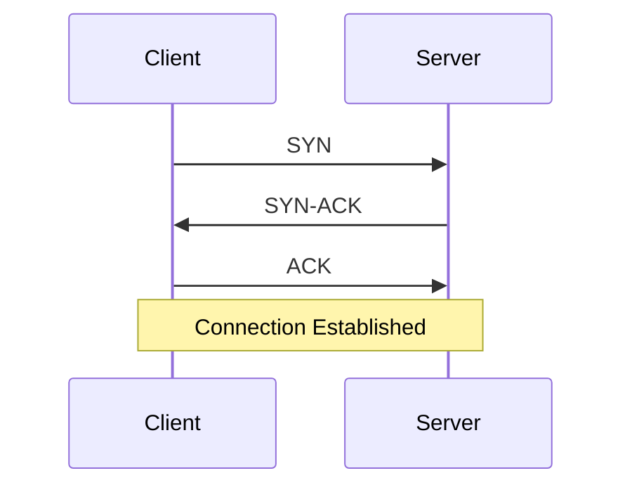

**ภัยคุกคาม**:
- SYN Flood
- TCP Reset Attack
- Session Hijacking

**UDP**:
- ไม่มี Handshake
- ง่ายต่อ Spoofing
- ใช้ใน DNS, DHCP, VoIP

### 1.6 มาตรฐานและกรอบ

| มาตรฐาน | ขอบเขต |
|---|---|
| NIST SP 800-41 | Firewall Guidelines |
| NIST SP 800-77 | IPsec VPN |
| NIST SP 800-53 | Security Controls |
| CIS Controls | Best Practices |
| ISO 27001 | ISMS |
| PCI DSS | Payment |
| MITRE ATT&CK | Threat Model |

### 1.7 บทบาทและความรับผิดชอบ

| บทบาท | หน้าที่ |
|---|---|
| Network Engineer | ออกแบบและดูแลเครือข่าย |
| Network Security Engineer | กำหนด Policy |
| SOC Analyst | Monitoring |
| IR Team | ตอบสนอง |
| Architect | ออกแบบ |
| Auditor | ตรวจสอบ |

### 1.8 แผนภาพ: Network Security Operations

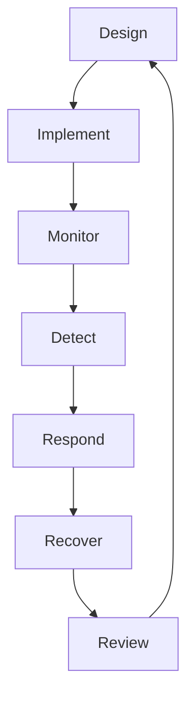

### 1.9 แบบฝึกหัด

🎯 **แบบฝึกหัด 1.1**  
อธิบายความสำคัญของ Network Security ต่อองค์กรของคุณ พร้อมยกตัวอย่าง

🎯 **แบบฝึกหัด 1.2**  
จับคู่ภัยคุกคามกับ OSI Layer อย่างน้อย 5 คู่

🎯 **แบบฝึกหัด 1.3**  
อธิบาย TCP 3-Way Handshake และภัยคุกคามที่เกี่ยวข้อง

🎯 **แบบฝึกหัด 1.4**  
ค้นหาเหตุการณ์ Network Attack 1 เคส สรุปและวิเคราะห์

### 1.10 เฉลยแบบฝึกหัด

**เฉลย 1.2**

| ภัยคุกคาม | OSI Layer |
|---|---|
| Phishing | 7 Application |
| Session Hijack | 5 Session |
| SYN Flood | 4 Transport |
| IP Spoofing | 3 Network |
| ARP Spoofing | 2 Data Link |
| Wiretap | 1 Physical |

**เฉลย 1.3**  
TCP 3-Way Handshake: SYN → SYN-ACK → ACK  
ภัยคุกคาม: SYN Flood (ส่ง SYN จำนวนมากโดยไม่ตอบ ACK), TCP Reset (ส่ง RST ปลอม), Session Hijacking (ขโมย Session)

**เฉลย 1.4**  
(ตัวอย่าง: Dyn DDoS 2016 ใช้ Mirai Botnet จาก IoT ทำให้ DNS ล่ม)

---

## บทที่ 2 Network Security Architecture

### 2.1 วัตถุประสงค์การเรียนรู้
1. เข้าใจสถาปัตยกรรมเครือข่ายปลอดภัย
2. Zone Model
3. Defense in Depth
4. Zero Trust Network

### 2.2 Zone Model

**โซนมาตรฐาน**:
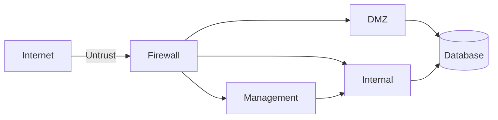

| Zone | Trust Level | ตัวอย่าง |
|---|---|---|
| Internet | Untrusted | ทั่วไป |
| DMZ | Low | Web, Mail |
| Internal | Medium | Workstation |
| Management | High | Admin |
| Data | Highest | Database |
| OT/ICS | Critical | SCADA |

### 2.3 Defense in Depth

**7 ชั้น**:

| ชั้น | ตัวอย่าง |
|---|---|
| 1 Physical | Access Card, CCTV |
| 2 Perimeter | Firewall, IPS |
| 3 Internal | Segment, NAC |
| 4 Host | HIDS, EDR |
| 5 Application | WAF, AuthN |
| 6 Data | Encryption |
| 7 User | Training |

### 2.4 Zero Trust Network

**หลักการ**:
1. ไม่เชื่อถือใครโดยปริยาย
2. ตรวจสอบทุกครั้ง
3. Least Privilege
4. Micro-segmentation
5. Continuous Verification

**สถาปัตยกรรม**:
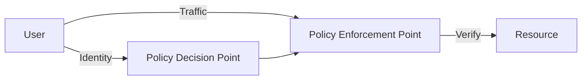

### 2.5 High Availability

| Component | HA Method |
|---|---|
| Firewall | Active-Passive, Active-Active |
| Switch | Stack, VSS |
| Router | HSRP, VRRP |
| Link | Dual ISP |
| Power | UPS, Generator |

### 2.6 แผนภาพ: Reference Architecture

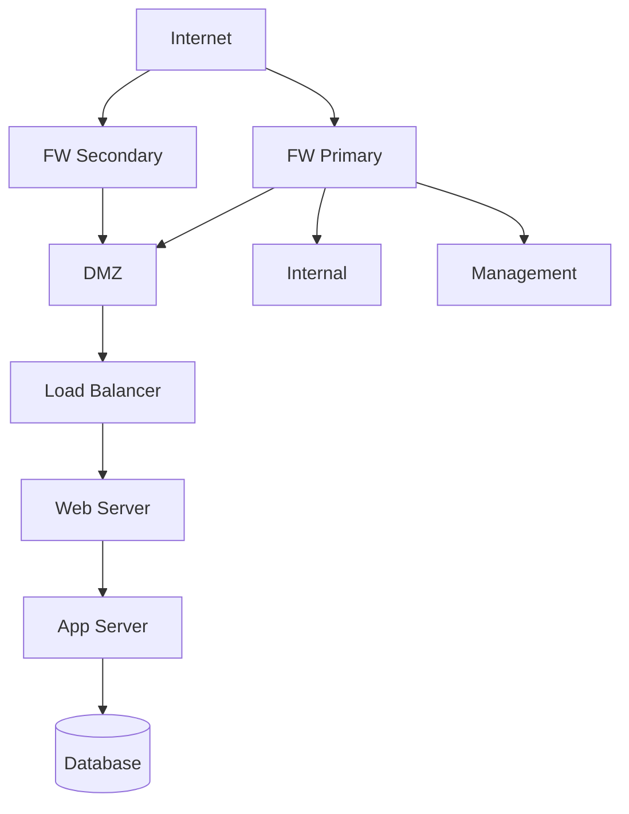

### 2.7 แบบฝึกหัด

🎯 **แบบฝึกหัด 2.1**  
วาด Zone Model สำหรับองค์กรขนาดกลางที่มี E-commerce

🎯 **แบบฝึกหัด 2.2**  
ออกแบบ Defense in Depth 7 ชั้นสำหรับระบบธนาคาร

🎯 **แบบฝึกหัด 2.3**  
อธิบาย Zero Trust Network และเปรียบเทียบกับ Perimeter Model

### 2.8 เฉลยแบบฝึกหัด

**เฉลย 2.1**
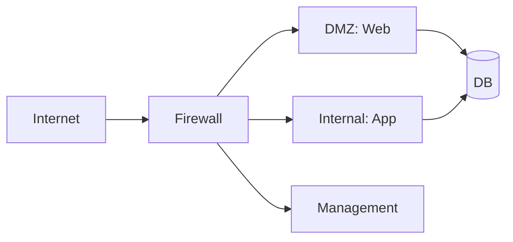

**เฉลย 2.3**  
Perimeter Model: เชื่อถือภายใน ไม่เชื่อภายนอก  
Zero Trust: ไม่เชื่อใคร ตรวจสอบทุกครั้ง ทุก Request ต้องผ่าน Policy  
ข้อดี Zero Trust: ป้องกัน Insider, Lateral Movement  
ข้อเสีย: ซับซ้อน ต้องใช้ Identity

---

## บทที่ 3 Zero Trust Network

### 3.1 วัตถุประสงค์การเรียนรู้
1. เข้าใจ Zero Trust
2. สถาปัตยกรรม
3. การนำไปใช้

### 3.2 หลักการ Zero Trust

1. **Verify Explicitly** – ตรวจสอบทุกครั้ง
2. **Least Privilege** – สิทธิ์น้อยที่สุด
3. **Assume Breach** – คิดว่าถูกบุกรุกแล้ว

### 3.3 Components

| Component | หน้าที่ |
|---|---|
| Identity Provider | ยืนยันตัวตน |
| Policy Engine | ตัดสินใจ |
| Policy Enforcement | บังคับใช้ |
| Device Posture | ตรวจอุปกรณ์ |
| Micro-segmentation | แยกเครือข่าย |

### 3.4 เทคโนโลยี

| เทคโนโลยี | ใช้ทำอะไร |
|---|---|
| ZTNA | Remote Access |
| SDP | ซ่อน Service |
| mTLS | Mutual Auth |
| SPIFFE/SPIRE | Workload Identity |
| Micro-segmentation | แยก Network |

### 3.5 SOP: Zero Trust Implementation

📋 **ขั้นที่ 1: Identify**
- ทรัพย์สิน
- ผู้ใช้
- Data Flow

📋 **ขั้นที่ 2: Protect**
- Identity
- Device
- Network

📋 **ขั้นที่ 3: Monitor**
- Log
- Analytics
- Alert

📋 **ขั้นที่ 4: Automate**
- Policy
- Response

### 3.6 แบบฝึกหัด

🎯 **แบบฝึกหัด 3.1**  
วางแผน Zero Trust สำหรับ Remote Work

🎯 **แบบฝึกหัด 3.2**  
เปรียบเทียบ VPN vs ZTNA

### 3.7 เฉลยแบบฝึกหัด

**เฉลย 3.2**

| ด้าน | VPN | ZTNA |
|---|---|---|
| Trust | Network | Identity |
| Access | ทั้งเครือข่าย | Per-app |
| Verify | ครั้งเดียว | ทุกครั้ง |
| Device | ไม่ตรวจ | ตรวจ Posture |
| Scalability | จำกัด | ดี |

---

# ส่วนที่ 2: การป้องกัน

---

## บทที่ 4 Segmentation

### 4.1 วัตถุประสงค์การเรียนรู้
1. เข้าใจ Segmentation
2. VLAN, Subnet
3. Micro-segmentation
4. SOP

### 4.2 ความหมาย
Segmentation คือการแบ่งเครือข่ายออกเป็นส่วนย่อย เพื่อลด Attack Surface และป้องกัน Lateral Movement

### 4.3 ประเภท

| ประเภท | ระดับ |
|---|---|
| Physical | แยกอุปกรณ์ |
| VLAN | Layer 2 |
| Subnet | Layer 3 |
| Firewall Zone | Layer 3/4 |
| Micro-segmentation | Per-workload |

### 4.4 แผนภาพ: Segmentation

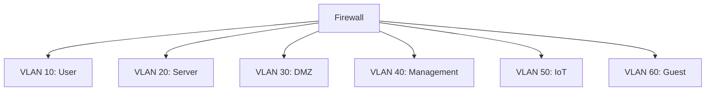

### 4.5 SOP: Segmentation

📋 **ขั้นที่ 1: ระบุ Zone**
1. User
2. Server
3. DMZ
4. Management
5. IoT
6. Guest
7. OT

📋 **ขั้นที่ 2: กำหนด Trust**
1. High
2. Medium
3. Low

📋 **ขั้นที่ 3: กำหนด Policy**
1. Who → What
2. Port, Protocol
3. Action

📋 **ขั้นที่ 4: Implement**
1. VLAN
2. Subnet
3. Firewall Rule
4. ACL

📋 **ขั้นที่ 5: Test**
1. Connectivity
2. Isolation
3. Performance

📋 **ขั้นที่ 6: Document**
1. Diagram
2. Matrix
3. Change Log

### 4.6 VLAN Configuration (Cisco)

```cisco
! สร้าง VLAN
vlan 10
 name USER
vlan 20
 name SERVER
vlan 30
 name DMZ
vlan 40
 name MGMT

! Assign Port
interface GigabitEthernet0/1
 switchport mode access
 switchport access vlan 10

! Trunk
interface GigabitEthernet0/24
 switchport mode trunk
 switchport trunk allowed vlan 10,20,30,40
```

### 4.7 Inter-VLAN Routing

```cisco
! Router-on-a-Stick
interface GigabitEthernet0/0.10
 encapsulation dot1Q 10
 ip address 10.10.0.1 255.255.255.0

interface GigabitEthernet0/0.20
 encapsulation dot1Q 20
 ip address 10.20.0.1 255.255.255.0
```

### 4.8 ACL

```cisco
! อนุญาต User → Server เฉพาะ HTTP
ip access-list extended USER_TO_SERVER
 permit tcp 10.10.0.0 0.0.0.255 10.20.0.0 0.0.0.255 eq 80
 permit tcp 10.10.0.0 0.0.0.255 10.20.0.0 0.0.0.255 eq 443
 deny ip any any log

interface GigabitEthernet0/0.10
 ip access-group USER_TO_SERVER in
```

### 4.9 Access Control Matrix

| From\To | User | Server | DMZ | MGMT | IoT | Guest |
|---|---|---|---|---|---|---|
| User | ✅ | HTTP/HTTPS | HTTP/HTTPS | ❌ | ❌ | ❌ |
| Server | ❌ | ✅ | ❌ | ❌ | ❌ | ❌ |
| DMZ | ❌ | DB Port | ✅ | ❌ | ❌ | ❌ |
| MGMT | SSH | SSH | SSH | ✅ | ❌ | ❌ |
| IoT | ❌ | MQTT | ❌ | ❌ | ✅ | ❌ |
| Guest | ❌ | ❌ | ❌ | ❌ | ❌ | ✅ |

### 4.10 แบบฝึกหัด

🎯 **แบบฝึกหัด 4.1**  
ออกแบบ Segmentation สำหรับโรงพยาบาลที่มี: เครื่องแพทย์, เวชระเบียน, Wi-Fi คนไข้, กล้อง CCTV

🎯 **แบบฝึกหัด 4.2**  
เขียน Cisco ACL อนุญาตเฉพาะ HTTPS จาก User ไป Server

🎯 **แบบฝึกหัด 4.3**  
ออกแบบ Access Control Matrix สำหรับระบบ E-commerce

### 4.11 เฉลยแบบฝึกหัด

**เฉลย 4.1**
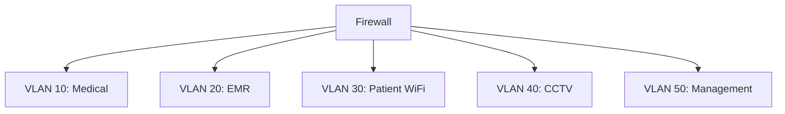

**เฉลย 4.2**
```cisco
ip access-list extended USER_HTTPS
 permit tcp 10.10.0.0 0.0.0.255 10.20.0.0 0.0.0.255 eq 443
 deny ip any any log
```

**เฉลย 4.3**

| From\To | Web | App | DB | Payment | Admin |
|---|---|---|---|---|---|
| Web | ✅ | API | ❌ | ❌ | ❌ |
| App | ❌ | ✅ | DB Port | API | ❌ |
| DB | ❌ | ❌ | ✅ | ❌ | ❌ |
| Payment | Callback | ❌ | ❌ | ✅ | ❌ |
| Admin | HTTPS | HTTPS | ❌ | ❌ | ✅ |

---

## บทที่ 5 Firewall Design

### 5.1 วัตถุประสงค์การเรียนรู้
1. ออกแบบ Firewall
2. Rule Design
3. Review
4. High Availability

### 5.2 ประเภท Firewall

| ประเภท | Layer | ตัวอย่าง |
|---|---|---|
| Packet Filter | 3/4 | iptables |
| Stateful | 3/4 | pfSense |
| Application | 7 | WAF |
| NGFW | 3-7 | Palo Alto, Fortinet |
| Cloud | 3/4 | Security Group |

### 5.3 หลักการ Firewall

1. **Default Deny** – บล็อกทั้งหมด ยกเว้นที่อนุญาต
2. **Least Privilege** – อนุญาตเท่าที่จำเป็น
3. **Document** – บันทึกทุก Rule
4. **Review** – ทบทวนสม่ำเสมอ
5. **Log** – บันทึกที่สำคัญ
6. **Redundancy** – HA

### 5.4 SOP: Firewall Rule Design

📋 **ขั้นที่ 1: ระบุ Requirement**
1. ใคร
2. ต้องการอะไร
3. จากไหน
4. ไปไหน
5. เมื่อไร
6. นานแค่ไหน

📋 **ขั้นที่ 2: กำหนด Rule**
1. Source
2. Destination
3. Port
4. Protocol
5. Action
6. Log

📋 **ขั้นที่ 3: Document**
1. เหตุผล
2. Owner
3. Ticket
4. Review Date

📋 **ขั้นที่ 4: Test**
1. Lab
2. Shadow Mode
3. Monitor

📋 **ขั้นที่ 5: Deploy**
1. ทีละ Rule
2. Monitor
3. Rollback Plan

📋 **ขั้นที่ 6: Review**
1. ทุก 6 เดือน
2. ลบ Rule ที่ไม่ใช้
3. Update Document

### 5.5 Template: Firewall Rule

| No | Zone | Src | Dst | Port | Proto | Action | Reason | Owner | Ticket | Review |
|---|---|---|---|---|---|---|---|---|---|---|
| 1 | Untrust→DMZ | Any | 10.0.1.10 | 443 | TCP | Allow | Public Web | Net A | JIRA-001 | 2026-07-01 |
| 2 | DMZ→Trust | 10.0.1.10 | 10.0.2.20 | 3306 | TCP | Allow | Web→DB | Net A | JIRA-002 | 2026-07-01 |
| 3 | Trust→Untrust | Any | Any | 443 | TCP | Allow | Web Access | Net A | JIRA-003 | 2026-07-01 |
| 4 | Trust→Untrust | Any | Any | 80 | TCP | Allow | Web Access | Net A | JIRA-004 | 2026-07-01 |
| 5 | Any→Any | Any | Any | Any | Any | Deny | Default | - | - | - |

### 5.6 iptables

```bash
# Default Deny
iptables -P INPUT DROP
iptables -P FORWARD DROP
iptables -P OUTPUT ACCEPT

# Allow Loopback
iptables -A INPUT -i lo -j ACCEPT

# Allow Established
iptables -A INPUT -m state --state ESTABLISHED,RELATED -j ACCEPT

# Allow SSH จาก Management
iptables -A INPUT -s 10.0.3.0/24 -p tcp --dport 22 -j ACCEPT

# Allow HTTP/HTTPS
iptables -A INPUT -p tcp --dport 80 -j ACCEPT
iptables -A INPUT -p tcp --dport 443 -j ACCEPT

# Allow ICMP
iptables -A INPUT -p icmp --icmp-type echo-request -j ACCEPT

# Rate Limit SSH
iptables -A INPUT -p tcp --dport 22 -m limit --limit 3/min -j ACCEPT

# Log Dropped
iptables -A INPUT -j LOG --log-prefix "DROP: " --log-level 4

# Drop
iptables -A INPUT -j DROP

# Save
iptables-save > /etc/iptables/rules.v4
```

### 5.7 nftables

```bash
#!/usr/sbin/nft -f

flush ruleset

table inet filter {
  chain input {
    type filter hook input priority 0; policy drop;
    
    ct state established,related accept
    iif lo accept
    
    tcp dport { 22, 80, 443 } accept
    ip protocol icmp accept
    
    log prefix "DROP: " drop
  }
  
  chain forward {
    type filter drop;
  }
  
  chain output {
    type filter hook output priority 0; policy accept;
  }
}
```

### 5.8 pfSense Rule

```
Action: Pass
Interface: WAN
Protocol: TCP
Source: Any
Destination: 10.0.1.10
Destination Port: 443
Description: HTTPS to Web Server
Log: Yes
```

### 5.9 Cisco ASA

```cisco
! Default Deny
access-list OUTSIDE_IN extended deny ip any any log

! Allow HTTPS
access-list OUTSIDE_IN extended permit tcp any host 10.0.1.10 eq 443

! Apply
access-group OUTSIDE_IN in interface outside
```

### 5.10 Rule Review Process

📋 **ขั้นที่ 1: ดึง Rule ทั้งหมด**
📋 **ขั้นที่ 2: ตรวจสอบ Hit Count**
📋 **ขั้นที่ 3: ระบุ Rule ที่ไม่ใช้**
📋 **ขั้นที่ 4: ตรวจสอบกับ Owner**
📋 **ขั้นที่ 5: ลบ Rule ที่ไม่ใช้**
📋 **ขั้นที่ 6: Update Document**

### 5.11 แบบฝึกหัด

🎯 **แบบฝึกหัด 5.1**  
ออกแบบ Firewall Rule สำหรับ 3-Tier App (Web, App, DB) ที่ Least Privilege

🎯 **แบบฝึกหัด 5.2**  
เขียน iptables ที่อนุญาต SSH เฉพาะจาก 192.168.1.0/24 และ HTTP/HTTPS จากทุกที่

🎯 **แบบฝึกหัด 5.3**  
เขียน pfSense Rule สำหรับ Web Server

🎯 **แบบฝึกหัด 5.4**  
ออกแบบ Rule Review Process

### 5.12 เฉลยแบบฝึกหัด

**เฉลย 5.1**

| No | Zone | Src | Dst | Port | Action |
|---|---|---|---|---|---|
| 1 | Untrust→DMZ | Any | Web | 443 | Allow |
| 2 | Untrust→DMZ | Any | Web | 80 | Allow |
| 3 | DMZ→App | Web | App | 8080 | Allow |
| 4 | App→DB | App | DB | 5432 | Allow |
| 5 | DMZ→Untrust | Web | Any | 443 | Allow |
| 6 | Any→Any | Any | Any | Any | Deny |

**เฉลย 5.2**
```bash
iptables -P INPUT DROP
iptables -A INPUT -i lo -j ACCEPT
iptables -A INPUT -m state --state ESTABLISHED,RELATED -j ACCEPT
iptables -A INPUT -s 192.168.1.0/24 -p tcp --dport 22 -j ACCEPT
iptables -A INPUT -p tcp --dport 80 -j ACCEPT
iptables -A INPUT -p tcp --dport 443 -j ACCEPT
iptables -A INPUT -j DROP
```

**เฉลย 5.3**
```
Action: Pass
Interface: WAN
Protocol: TCP
Source: Any
Destination: 10.0.1.10
Port: 443
Log: Yes
```

**เฉลย 5.4**
1. ดึง Rule ทุก 6 เดือน
2. ตรวจ Hit Count
3. Rule ไหน Hit = 0 นาน 90 วัน → สงสัย
4. ติดต่อ Owner
5. ลบถ้าไม่ใช้
6. Update Document

---

## บทที่ 6 IDS/IPS

### 6.1 วัตถุประสงค์การเรียนรู้
1. เข้าใจ IDS/IPS
2. Signature vs Anomaly
3. Tuning
4. Deployment

### 6.2 ประเภท

| ประเภท | ลักษณะ | ตัวอย่าง |
|---|---|---|
| NIDS | Network-based | Snort, Suricata, Zeek |
| HIDS | Host-based | OSSEC, Wazuh |
| NIPS | Network Prevention | Suricata IPS |
| HIPS | Host Prevention | CrowdStrike |
| NBA | Behavior | Darktrace |

### 6.3 Detection Methods

| วิธี | ข้อดี | ข้อเสีย |
|---|---|---|
| Signature | แม่นยำ | ไม่รู้ Zero-day |
| Anomaly | รู้ใหม่ | False Positive สูง |
| Behavior | รู้ APT | ต้อง Tune |
| Heuristic | ยืดหยุ่น | ซับซ้อน |

### 6.4 Deployment Mode

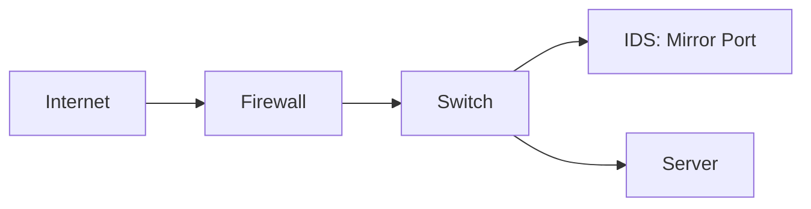

**IPS (Inline)**:
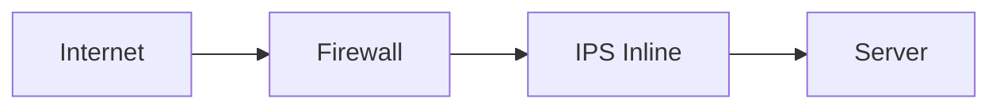

### 6.5 Suricata

**ติดตั้ง**:
```bash
sudo add-apt-repository ppa:oisf/suricata-stable
sudo apt update
sudo apt install suricata
sudo suricata-update
```

**Config**:
```yaml
vars:
  address-groups:
    HOME_NET: "[10.0.0.0/8,192.168.0.0/16]"
    EXTERNAL_NET: "!$HOME_NET"
    
af-packet:
  - interface: eth0
    cluster-id: 99
    cluster-type: cluster_flow
    defrag: yes
```

**Rule ตัวอย่าง**:
```
alert tcp $EXTERNAL_NET any -> $HOME_NET 22 (msg:"SSH Brute Force"; flow:to_server; threshold: type both, track by_src, count 5, seconds 60; sid:1000001; rev:1;)

alert http $HOME_NET any -> $EXTERNAL_NET any (msg:"Possible Data Exfiltration"; flow:to_server; content:"POST"; http_method; sid:1000002; rev:1;)
```

### 6.6 Snort Rule

```
alert tcp any any -> $HOME_NET 80 (msg:"SQL Injection Attempt"; flow:to_server,established; content:"union"; nocase; content:"select"; nocase; sid:1000001; rev:1;)

alert icmp any any -> $HOME_NET any (msg:"ICMP Flood"; threshold: type both, track by_src, count 100, seconds 1; sid:1000002; rev:1;)
```

### 6.7 Zeek

**ติดตั้ง**:
```bash
sudo apt install zeek
```

**Script ตัวอย่าง**:
```zeek
event http_request(c: connection, method: string, original_URI: string, unescaped_URI: string, version: string) {
    if (/union.*select/ in unescaped_URI) {
        NOTICE([$note=SQL_Injection_Attempt,
                $msg="SQL Injection detected",
                $conn=c]);
    }
}
```

### 6.8 SOP: IDS/IPS

📋 **ขั้นที่ 1: ติดตั้ง**
📋 **ขั้นที่ 2: Tune Rule**
📋 **ขั้นที่ 3: Update Signature**
📋 **ขั้นที่ 4: Monitor**
📋 **ขั้นที่ 5: Respond**
📋 **ขั้นที่ 6: Review**

### 6.9 Tuning Process

1. **Baseline** – เก็บ Traffic ปกติ 2 สัปดาห์
2. **Identify FP** – ระบุ False Positive
3. **Suppress** – Suppress ที่ไม่ relevant
4. **Custom Rule** – เขียน Rule เฉพาะ
5. **Review** – ทบทวนทุกเดือน

### 6.10 แบบฝึกหัด

🎯 **แบบฝึกหัด 6.1**  
ติดตั้ง Suricata และทดสอบ

🎯 **แบบฝึกหัด 6.2**  
เขียน Suricata Rule ตรวจจับ SSH Brute Force

🎯 **แบบฝึกหัด 6.3**  
เขียน Snort Rule ตรวจจับ SQL Injection

🎯 **แบบฝึกหัด 6.4**  
ออกแบบ Tuning Process

### 6.11 เฉลยแบบฝึกหัด

**เฉลย 6.2**
```
alert tcp $EXTERNAL_NET any -> $HOME_NET 22 (msg:"SSH Brute Force"; flow:to_server; threshold: type both, track by_src, count 5, seconds 60; sid:1000001; rev:1;)
```

**เฉลย 6.3**
```
alert tcp any any -> $HOME_NET 80 (msg:"SQL Injection"; flow:to_server,established; content:"union"; nocase; content:"select"; nocase; sid:1000001; rev:1;)
```

---

## บทที่ 7 VPN และ ZTNA

### 7.1 วัตถุประสงค์การเรียนรู้
1. เข้าใจ VPN
2. IPsec, SSL VPN
3. ZTNA
4. Remote Access Security

### 7.2 ประเภท VPN

| ประเภท | ใช้ทำอะไร | ตัวอย่าง |
|---|---|---|
| Site-to-Site | เชื่อมสาขา | IPsec |
| Remote Access | ผู้ใช้ระยะไกล | OpenVPN, WireGuard |
| SSL VPN | Web-based | AnyConnect |
| DMVPN | Hub-Spoke | Cisco |
| ZTNA | Per-app | Cloudflare, Zscaler |

### 7.3 IPsec

**Components**:
- IKE (Phase 1, Phase 2)
- ESP (Encryption)
- AH (Authentication)

**Mode**:
- Transport Mode: เฉพาะ Payload
- Tunnel Mode: ทั้ง Packet

### 7.4 StrongSwan Config

**/etc/ipsec.conf**:
```
config setup
    charondebug="ike 1, knl 1, cfg 0"

conn %default
    ikelifetime=60m
    keylife=20m
    rekeymargin=3m
    keyingtries=1
    authby=secret

conn site-to-site
    keyexchange=ikev2
    left=203.0.113.1
    leftsubnet=10.1.0.0/16
    right=203.0.113.2
    rightsubnet=10.2.0.0/16
    ike=aes256-sha256-modp2048
    esp=aes256-sha256
    auto=start
```

**/etc/ipsec.secrets**:
```
203.0.113.1 203.0.113.2 : PSK "StrongPreSharedKey123!"
```

### 7.5 WireGuard

**Server Config**:
```ini
[Interface]
Address = 10.0.0.1/24
ListenPort = 51820
PrivateKey = <server-private-key>

[Peer]
PublicKey = <client-public-key>
AllowedIPs = 10.0.0.2/32
```

**Client Config**:
```ini
[Interface]
Address = 10.0.0.2/24
PrivateKey = <client-private-key>
DNS = 1.1.1.1

[Peer]
PublicKey = <server-public-key>
Endpoint = vpn.example.com,mycompany.com,gmail.com:51820
AllowedIPs = 0.0.0.0/0
PersistentKeepalive = 25
```

### 7.6 OpenVPN

**Server Config**:
```
port 1194
proto udp
dev tun
ca ca.crt
cert server.crt
key server.key
dh dh.pem
server 10.8.0.0 255.255.255.0
push "redirect-gateway def1"
push "dhcp-option DNS 1.1.1.1"
cipher AES-256-GCM
auth SHA256
tls-version-min 1.2
user nobody
group nogroup
persist-key
persist-tun
```

### 7.7 ZTNA

**หลักการ**:
1. Identity-based
2. Per-app access
3. Continuous verification
4. Device posture
5. Least Privilege

**เปรียบเทียบ**:

| ด้าน | VPN | ZTNA |
|---|---|---|
| Trust | Network | Identity |
| Access | ทั้งเครือข่าย | Per-app |
| Verify | ครั้งเดียว | ทุกครั้ง |
| Device | ไม่ตรวจ | Posture |
| Scalability | จำกัด | ดี |
| Performance | รวมศูนย์ | Distributed |

### 7.8 SOP: VPN Security

📋 **ขั้นที่ 1: Authentication**
1. MFA
2. Certificate
3. RADIUS/LDAP

📋 **ขั้นที่ 2: Encryption**
1. AES-256
2. SHA-256
3. DH 2048+

📋 **ขั้นที่ 3: Access Control**
1. Least Privilege
2. Split Tunnel Policy
3. DNS Control

📋 **ขั้นที่ 4: Monitoring**
1. Log
2. Alert
3. Audit

📋 **ขั้นที่ 5: Lifecycle**
1. Key Rotation
2. Cert Renewal
3. Review

### 7.9 แบบฝึกหัด

🎯 **แบบฝึกหัด 7.1**  
ตั้งค่า WireGuard Server + Client

🎯 **แบบฝึกหัด 7.2**  
ตั้งค่า IPsec Site-to-Site

🎯 **แบบฝึกหัด 7.3**  
เปรียบเทียบ VPN vs ZTNA สำหรับ Remote Work

### 7.10 เฉลยแบบฝึกหัด

**เฉลย 7.1**  
(ดู Config ด้านบน)

**เฉลย 7.3**  
VPN: เหมาะกับ Site-to-Site, Trusted Users  
ZTNA: เหมาะกับ Remote Work, Contractor, BYOD  
VPN ข้อเสีย: ให้ Access ทั้งเครือข่าย  
ZTNA ข้อดี: Per-app, Continuous Verify

---

## บทที่ 8 Wireless Security

### 8.1 วัตถุประสงค์การเรียนรู้
1. เข้าใจ Wireless Security
2. WPA3
3. 802.1X
4. Rogue AP Detection

### 8.2 มาตรฐาน Wireless

| มาตรฐาน | ปี | ความปลอดภัย |
|---|---|---|
| WEP | 1997 | ❌ แตกแล้ว |
| WPA | 2003 | ⚠️ อ่อน |
| WPA2 | 2004 | ✅ ใช้ได้ |
| WPA3 | 2018 | ✅ แนะนำ |
| WPA3-Enterprise | 2018 | ✅ ดีที่สุด |

### 8.3 ภัยคุกคาม

| ภัยคุกคาม | คำอธิบาย |
|---|---|
| Evil Twin | AP ปลอม |
| Rogue AP | AP ไม่ได้รับอนุญาต |
| Deauth Attack | ตัดการเชื่อมต่อ |
| WPS Attack | Brute Force PIN |
| KRACK | WPA2 ช่องโหว่ |
| War Driving | หา AP |

### 8.4 WPA3

**คุณสมบัติ**:
- SAE (Simultaneous Authentication of Equals)
- ป้องกัน Offline Dictionary
- Forward Secrecy
- PMF (Protected Management Frames)

### 8.5 802.1X

**Components**:
- Supplicant: Client
- Authenticator: AP
- Authentication Server: RADIUS

**Flow**:
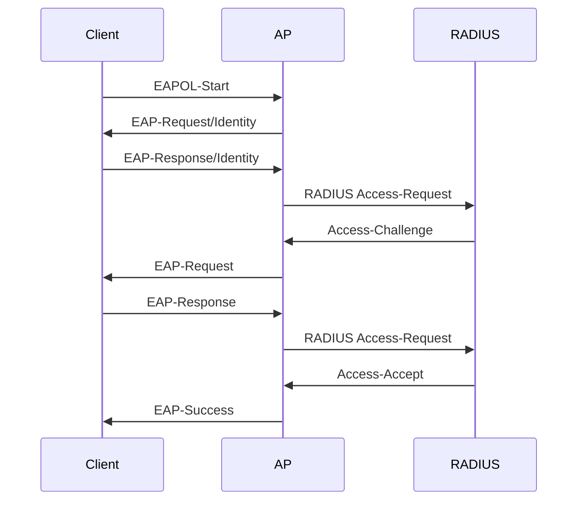

### 8.6 Cisco WLC Config

```
! WPA3 Enterprise
wlan security wpa wpa3 enable
wlan security wpa wpa3 pmf required

! 802.1X
wlan security dot1x enable
wlan security dot1x radius-server 10.0.0.10

! Guest Network
wlan guest-network 1 guest-mode
wlan security web-policy
```

### 8.7 SOP: Wireless Security

📋 **ขั้นที่ 1: Standards**
1. WPA3
2. WPA2-Enterprise (สำรอง)
3. ห้าม WEP/WPA

📋 **ขั้นที่ 2: Authentication**
1. 802.1X
2. RADIUS
3. Certificate

📋 **ขั้นที่ 3: Segmentation**
1. Corporate
2. Guest
3. IoT
4. Management

📋 **ขั้นที่ 4: Monitoring**
1. Rogue AP Detection
2. WIDS/WIPS
3. Site Survey

📋 **ขั้นที่ 5: Physical**
1. AP Placement
2. Power Control
3. Antenna

### 8.8 Rogue AP Detection

```bash
# airodump-ng
sudo airodump-ng wlan0mon

# Kismet
sudo kismet -c wlan0
```

### 8.9 แบบฝึกหัด

🎯 **แบบฝึกหัด 8.1**  
ออกแบบ Wireless Network สำหรับองค์กร

🎯 **แบบฝึกหัด 8.2**  
ตั้งค่า 802.1X

🎯 **แบบฝึกหัด 8.3**  
อธิบาย Evil Twin และวิธีป้องกัน

### 8.10 เฉลยแบบฝึกหัด

**เฉลย 8.1**
- Corporate SSID: WPA3-Enterprise + 802.1X
- Guest SSID: WPA3-Personal + Captive Portal
- IoT SSID: WPA3 + VLAN แยก
- Management SSID: WPA3-Enterprise + Hidden

**เฉลย 8.3**  
Evil Twin คือ AP ปลอมที่ตั้งชื่อเหมือน AP จริง เพื่อดักข้อมูล  
ป้องกัน: WPA3, PMF, Certificate Validation, Rogue AP Detection, User Training

---

## บทที่ 9 DNS Security

### 9.1 วัตถุประสงค์การเรียนรู้
1. เข้าใจภัยคุกคาม DNS
2. DNSSEC
3. DoH/DoT
4. RPZ

### 9.2 ภัยคุกคาม DNS

| ภัยคุกคาม | คำอธิบาย |
|---|---|
| Cache Poisoning | ใส่ข้อมูลปลอม |
| DNS Spoofing | ปลอม Response |
| DNS Tunneling | ซ่อนข้อมูล |
| DDoS บน DNS | Flood |
| Domain Hijacking | ขโมย Domain |
| Typosquatting | ชื่อคล้าย |

### 9.3 DNSSEC

**หลักการ**: เซ็นชื่อ Record ด้วย Private Key และตรวจสอบด้วย Public Key

**Config (BIND)**:
```
zone "example.com,mycompany.com,gmail.com" {
  type master;
  file "/etc/bind/db.example.com,mycompany.com,gmail.com";
  key-directory "/etc/bind/keys";
  auto-dnssec maintain;
  inline-signing yes;
};
```

**Generate Key**:
```bash
dnssec-keygen -a ECDSAP256SHA256 -n ZONE example.com,mycompany.com,gmail.com
dnssec-keygen -a ECDSAP256SHA256 -n ZONE -f KSK example.com,mycompany.com,gmail.com
```

**Sign Zone**:
```bash
dnssec-signzone -A -3 $(head -c 1000 /dev/urandom | sha1sum | cut -b 1-16) \
  -N INCREMENT -o example.com,mycompany.com,gmail.com -t db.example.com,mycompany.com,gmail.com
```

### 9.4 DoH/DoT

**DoH (DNS over HTTPS)**:
- Port 443
- ซ่อนใน HTTPS
- ตัวอย่าง: Cloudflare, Google

**DoT (DNS over TLS)**:
- Port 853
- แยกชัดเจน

**Config (unbound)**:
```
server:
  tls-cert-bundle: "/etc/ssl/certs/ca-certificates.crt"
  
forward-zone:
  name: "."
  forward-tls-upstream: yes
  forward-addr: 1.1.1.1@853#cloudflare-dns.com
  forward-addr: 8.8.8.8@853#dns.google
```

### 9.5 RPZ (Response Policy Zone)

**Config (BIND)**:
```
options {
  response-policy { zone "rpz.example"; };
};

zone "rpz.example" {
  type master;
  file "/etc/bind/db.rpz";
};
```

**db.rpz**:
```
$TTL 300
@ IN SOA localhost. admin.localhost. (
  1 3600 1800 604800 300 )

malware.example.com,mycompany.com,gmail.com CNAME .
*.phishing.example.com,mycompany.com,gmail.com CNAME .
ads.example.com,mycompany.com,gmail.com CNAME .
```

### 9.6 DNS Monitoring

**Query Log Analysis**:
```bash
# Pi-hole
pihole -t

# tcpdump
sudo tcpdump -i eth0 port 53 -w dns.pcap

# Zeek
cat dns.log | zeek-cut query
```

**Detect Tunneling**:
```python
# ตรวจ Query ยาวผิดปกติ
from collections import Counter

with open('dns.log') as f:
    queries = [line.split('\t')[9] for line in f if len(line.split('\t')) > 9]

# หา Query ยาว
long_queries = [q for q in queries if len(q) > 50]
print(f"Long queries: {len(long_queries)}")

# หา Subdomain ซ้ำ
subdomains = Counter(q.split('.')[0] for q in queries)
print(subdomains.most_common(10))
```

### 9.7 SOP: DNS Security

📋 **ขั้นที่ 1: DNSSEC**
📋 **ขั้นที่ 2: DoH/DoT**
📋 **ขั้นที่ 3: RPZ**
📋 **ขั้นที่ 4: Monitor**
📋 **ขั้นที่ 5: Block Malicious**
📋 **ขั้นที่ 6: Rate Limit**
📋 **ขั้นที่ 7: Restrict Recursive**

### 9.8 แบบฝึกหัด

🎯 **แบบฝึกหัด 9.1**  
อธิบาย DNS Tunneling และวิธีตรวจจับ

🎯 **แบบฝึกหัด 9.2**  
ตั้งค่า RPZ บล็อก `ads.example.com,mycompany.com,gmail.com`

🎯 **แบบฝึกหัด 9.3**  
ตั้งค่า DoT ด้วย unbound

### 9.9 เฉลยแบบฝึกหัด

**เฉลย 9.1**  
DNS Tunneling: ซ่อนข้อมูลใน DNS Query/Response  
ตรวจจับ: Query ยาว, จำนวนสูง, Domain แปลก, TXT Record ใหญ่

**เฉลย 9.2**
```
ads.example.com,mycompany.com,gmail.com CNAME .
```

**เฉลย 9.3**
```
forward-zone:
  name: "."
  forward-tls-upstream: yes
  forward-addr: 1.1.1.1@853#cloudflare-dns.com
```

---

## บทที่ 10 DDoS Mitigation

### 10.1 วัตถุประสงค์การเรียนรู้
1. เข้าใจ DDoS
2. ประเภท
3. Mitigation
4. Cloud Protection

### 10.2 ประเภท DDoS

| ประเภท | Layer | ตัวอย่าง |
|---|---|---|
| Volumetric | 3/4 | UDP Flood, ICMP Flood |
| Protocol | 3/4 | SYN Flood |
| Application | 7 | HTTP Flood |
| Amplification | 3/4 | DNS, NTP, Memcached |
| Slowloris | 7 | Slow HTTP |

### 10.3 ขนาด DDoS

| ปี | ขนาดสูงสุด | เป้าหมาย |
|---|---|---|
| 2016 | 1.2 Tbps | Dyn |
| 2018 | 1.7 Tbps | GitHub |
| 2020 | 2.3 Tbps | AWS |
| 2023 | 71 M rps | Cloudflare |
| 2024 | > 100 M rps | หลาย |

### 10.4 Mitigation Layers

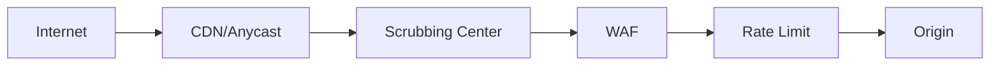

### 10.5 Cloudflare Config

**Rate Limiting**:
```
Rate Limit: 100 requests / 60 seconds per IP
Action: Block
```

**WAF Rule**:
```
(http.request.uri.path contains "/api/login" and
 rate(1m) > 5)
→ Block
```

**Under Attack Mode**:
```
Security Level: I'm Under Attack
```

### 10.6 Nginx Rate Limit

```nginx
limit_req_zone $binary_remote_addr zone=api:10m rate=10r/s;
limit_conn_zone $binary_remote_addr zone=addr:10m;

server {
  location /api/ {
    limit_req zone=api burst=20 nodelay;
    limit_conn addr 10;
    proxy_pass http://backend;
  }
}
```

### 10.7 iptables Rate Limit

```bash
# SYN Flood Protection
iptables -A INPUT -p tcp --syn -m limit --limit 1/s --limit-burst 3 -j ACCEPT
iptables -A INPUT -p tcp --syn -j DROP

# ICMP Flood
iptables -A INPUT -p icmp --icmp-type echo-request -m limit --limit 1/s -j ACCEPT
iptables -A INPUT -p icmp --icmp-type echo-request -j DROP

# HTTP Flood
iptables -A INPUT -p tcp --dport 80 -m connlimit --connlimit-above 50 -j DROP
```

### 10.8 Sysctl Tuning

```bash
# /etc/sysctl.d/99-ddos.conf
net.ipv4.tcp_syncookies = 1
net.ipv4.tcp_max_syn_backlog = 2048
net.ipv4.tcp_synack_retries = 2
net.ipv4.tcp_syn_retries = 5
net.ipv4.tcp_fin_timeout = 15
net.ipv4.tcp_keepalive_time = 300
net.ipv4.ip_local_port_range = 1024 65535
net.core.somaxconn = 65535
net.core.netdev_max_backlog = 65535
net.ipv4.tcp_max_tw_buckets = 1440000
```

### 10.9 SOP: DDoS Mitigation

📋 **ขั้นที่ 1: Baseline**
📋 **ขั้นที่ 2: CDN/Anycast**
📋 **ขั้นที่ 3: WAF**
📋 **ขั้นที่ 4: Rate Limit**
📋 **ขั้นที่ 5: Auto Scaling**
📋 **ขั้นที่ 6: Monitoring**
📋 **ขั้นที่ 7: ซ้อมแผน**
📋 **ขั้นที่ 8: Incident Response**

### 10.10 แบบฝึกหัด

🎯 **แบบฝึกหัด 10.1**  
ตั้งค่า Nginx Rate Limit

🎯 **แบบฝึกหัด 10.2**  
ตั้งค่า iptables ป้องกัน SYN Flood

🎯 **แบบฝึกหัด 10.3**  
ออกแบบแผน DDoS Mitigation

### 10.11 เฉลยแบบฝึกหัด

**เฉลย 10.1**  
(ดู Config ด้านบน)

**เฉลย 10.2**  
(ดู Config ด้านบน)

**เฉลย 10.3**
1. CDN (Cloudflare)
2. Anycast
3. WAF
4. Rate Limit
5. Auto Scaling
6. Monitoring
7. Incident Plan
8. Post-Mortem

---

# ส่วนที่ 3: การตรวจจับ

---

## บทที่ 11 NetFlow & Packet Analysis

### 11.1 วัตถุประสงค์การเรียนรู้
1. NetFlow
2. Packet Capture
3. Wireshark
4. tcpdump

### 11.2 NetFlow vs Packet Capture

| ด้าน | NetFlow | Packet Capture |
|---|---|---|
| ข้อมูล | Metadata | Full Packet |
| ขนาด | เล็ก | ใหญ่ |
| Performance | ดี | หนัก |
| ใช้ | Traffic Analysis | Deep Inspection |

### 11.3 NetFlow Config (Cisco)

```cisco
! เปิด NetFlow
interface GigabitEthernet0/0
 ip flow ingress
 ip flow egress

! Export
ip flow-export version 9
ip flow-export destination 10.0.0.10 2055

! Top Talkers
ip flow-top-talkers
 top 20
 sort-by bytes
```

### 11.4 nfdump/nfsen

```bash
# nfdump
nfdump -r nfcapd.202601010000 -s srcip/bytes -n 10
nfdump -r nfcapd.202601010000 -s dstip/bytes -n 10
nfdump -r nfcapd.202601010000 -s port/bytes -n 10

# Filter
nfdump -r nfcapd.202601010000 'src ip 10.0.0.1'
nfdump -r nfcapd.202601010000 'dst port 443'
```

### 11.5 tcpdump

```bash
# Capture
sudo tcpdump -i eth0 -w capture.pcap

# Filter
sudo tcpdump -i eth0 'host 10.0.0.1'
sudo tcpdump -i eth0 'port 80'
sudo tcpdump -i eth0 'tcp[tcpflags] & (tcp-syn) != 0'
sudo tcpdump -i eth0 'src 10.0.0.1 and dst port 443'

# Read
sudo tcpdump -r capture.pcap -nn

# Rotate
sudo tcpdump -i eth0 -w capture-%Y%m%d-%H%M%S.pcap -G 3600
```

### 11.6 Wireshark Filters

**Display Filters**:
```
ip.src == 10.0.0.1
tcp.port == 443
http.request.method == "POST"
dns.qry.name contains "malware"
tcp.flags.syn == 1 and tcp.flags.ack == 0
tls.handshake.type == 1
```

**Capture Filters**:
```
host 10.0.0.1
port 80 or port 443
not arp
```

### 11.7 Analysis Workflow

📋 **ขั้นที่ 1: Capture**
📋 **ขั้นที่ 2: Filter**
📋 **ขั้นที่ 3: Identify Anomaly**
📋 **ขั้นที่ 4: Follow Stream**
📋 **ขั้นที่ 5: Extract IOC**
📋 **ขั้นที่ 6: Document**

### 11.8 แบบฝึกหัด

🎯 **แบบฝึกหัด 11.1**  
Capture Traffic ด้วย tcpdump

🎯 **แบบฝึกหัด 11.2**  
วิเคราะห์ pcap ด้วย Wireshark

🎯 **แบบฝึกหัด 11.3**  
ใช้ nfdump หา Top Talkers

### 11.9 เฉลยแบบฝึกหัด

**เฉลย 11.1**
```bash
sudo tcpdump -i eth0 -w capture.pcap 'port 443'
```

**เฉลย 11.3**
```bash
nfdump -r nfcapd.202601010000 -s srcip/bytes -n 10
```

---

## บทที่ 12 SIEM Integration

### 12.1 วัตถุประสงค์การเรียนรู้
1. SIEM
2. Log Sources
3. Correlation
4. Alerting

### 12.2 SIEM Components

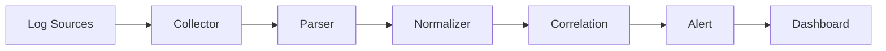

### 12.3 Log Sources

| Source | Log |
|---|---|
| Firewall | Allow/Deny |
| IDS/IPS | Alert |
| Router | Config Change |
| Switch | Port Status |
| VPN | Login |
| AD | Auth |
| DNS | Query |
| Web | Access |

### 12.4 Syslog Config

**Cisco → Syslog**:
```cisco
logging host 10.0.0.10
logging trap informational
logging source-interface GigabitEthernet0/0
logging buffered 16384
```

**Linux → Syslog**:
```
# /etc/rsyslog.d/50-default.conf
*.* @10.0.0.10:514
```

**pfSense → Syslog**:
```
Status → System Logs → Settings → Remote Logging
Server: 10.0.0.10:514
```

### 12.5 Wazuh

**ติดตั้ง**:
```bash
curl -sO https://packages.wazuh.com/4.7/wazuh-install.sh
sudo bash wazuh-install.sh -a
```

**Agent Config**:
```xml
<ossec_config>
  <client>
    <server>
      <address>10.0.0.10</address>
      <port>1514</port>
      <protocol>tcp</protocol>
    </server>
  </client>
  
  <localfile>
    <log_format>syslog</log_format>
    <location>/var/log/auth.log</location>
  </localfile>
</ossec_config>
```

### 12.6 Correlation Rule

**Wazuh Rule**:
```xml
<group name="network,attack,">
  <rule id="100001" level="10">
    <if_matched_sid>5710</if_matched_sid>
    <same_source_ip />
    <frequency>5</frequency>
    <timeframe>60</timeframe>
    <description>SSH Brute Force จาก $(srcip)</description>
  </rule>
</group>
```

### 12.7 Splunk Query

```
index=firewall action=denied
| stats count by src_ip, dst_ip, dst_port
| where count > 100
| sort -count
```

```
index=network
| transaction src_ip maxspan=5m
| where eventcount > 50
```

### 12.8 SOP: SIEM

📋 **ขั้นที่ 1: ระบุ Log Sources**
📋 **ขั้นที่ 2: ติดตั้ง Collector**
📋 **ขั้นที่ 3: Parser**
📋 **ขั้นที่ 4: Normalize**
📋 **ขั้นที่ 5: Correlation**
📋 **ขั้นที่ 6: Alert**
📋 **ขั้นที่ 7: Dashboard**
📋 **ขั้นที่ 8: Review**

### 12.9 แบบฝึกหัด

🎯 **แบบฝึกหัด 12.1**  
ตั้งค่า Syslog จาก Cisco

🎯 **แบบฝึกหัด 12.2**  
เขียน Wazuh Rule ตรวจจับ Brute Force

🎯 **แบบฝึกหัด 12.3**  
เขียน Splunk Query หา Top Attackers

### 12.10 เฉลยแบบฝึกหัด

**เฉลย 12.1**
```cisco
logging host 10.0.0.10
logging trap informational
logging source-interface GigabitEthernet0/0
```

**เฉลย 12.2**  
(ดู Rule ด้านบน)

**เฉลย 12.3**
```
index=firewall action=denied
| stats count by src_ip
| sort -count
| head 10
```

---

## บทที่ 13 Threat Hunting

### 13.1 วัตถุประสงค์การเรียนรู้
1. Threat Hunting
2. Hypothesis
3. MITRE ATT&CK
4. Tools

### 13.2 ความหมาย
Threat Hunting คือการค้นหาภัยคุกคามเชิงรุก โดยใช้ Hypothesis และ Data Analysis

### 13.3 MITRE ATT&CK

**Tactics**:
1. Reconnaissance
2. Resource Development
3. Initial Access
4. Execution
5. Persistence
6. Privilege Escalation
7. Defense Evasion
8. Credential Access
9. Discovery
10. Lateral Movement
11. Collection
12. Command and Control
13. Exfiltration
14. Impact

### 13.4 Hypothesis Examples

1. "มี Host ที่ติดต่อ C2 ที่รู้จักหรือไม่?"
2. "มี User ที่ Login ผิดปกติหรือไม่?"
3. "มี Process ที่ Spawn Shell หรือไม่?"
4. "มี Data ที่ถูกส่งออกมากผิดปกติหรือไม่?"

### 13.5 Hunting Tools

| Tool | ใช้ทำอะไร |
|---|---|
| Velociraptor | Endpoint |
| Sysmon | Windows |
| Zeek | Network |
| RITA | Beaconing |
| Arkime | PCAP |
| Sigma | Detection |

### 13.6 Sigma Rule

```yaml
title: Suspicious PowerShell Download
status: experimental
description: Detect PowerShell download
logsource:
  product: windows
  service: powershell
detection:
  selection:
    EventID: 4104
    ScriptBlockText|contains:
      - 'DownloadString'
      - 'DownloadFile'
      - 'Invoke-WebRequest'
  condition: selection
level: high
```

### 13.7 RITA

```bash
rita import --logs /var/nsm/logs --database mydb
rita analyze --database mydb
rita show-beacons --database mydb
```

### 13.8 SOP: Threat Hunting

📋 **ขั้นที่ 1: Hypothesis**
📋 **ขั้นที่ 2: Data Collection**
📋 **ขั้นที่ 3: Analysis**
📋 **ขั้นที่ 4: Validate**
📋 **ขั้นที่ 5: Document**
📋 **ขั้นที่ 6: Automate**

### 13.9 แบบฝึกหัด

🎯 **แบบฝึกหัด 13.1**  
เขียน Hypothesis 5 ข้อสำหรับ Threat Hunting

🎯 **แบบฝึกหัด 13.2**  
เขียน Sigma Rule ตรวจจับ Suspicious Process

🎯 **แบบฝึกหัด 13.3**  
ใช้ RITA หา Beaconing

### 13.10 เฉลยแบบฝึกหัด

**เฉลย 13.1**
1. มี Host ติดต่อ C2?
2. มี Login ผิดปกติ?
3. มี Process Spawn Shell?
4. มี Data Exfiltration?
5. มี Lateral Movement?

**เฉลย 13.2**
```yaml
title: Suspicious Process
logsource:
  product: windows
detection:
  selection:
    EventID: 4688
    NewProcessName|endswith:
      - '\powershell.exe'
      - '\cmd.exe'
    ParentProcessName|endswith: '\winword.exe'
  condition: selection
level: high
```

---

## บทที่ 14 Anomaly Detection

### 14.1 วัตถุประสงค์การเรียนรู้
1. Anomaly Detection
2. Statistical
3. ML
4. Tools

### 14.2 ประเภท

| ประเภท | ตัวอย่าง |
|---|---|
| Statistical | Mean, Std Dev |
| Time-series | ARIMA |
| ML | Isolation Forest |
| Behavior | Baseline |

### 14.3 Baseline

**Metrics ที่ควร Baseline**:
- Traffic Volume
- Connection Count
- Port Distribution
- Protocol Distribution
- User Behavior
- Time Pattern

### 14.4 Python Anomaly Detection

```python
import pandas as pd
from sklearn.ensemble import IsolationForest

# โหลดข้อมูล
df = pd.read_csv('traffic.csv')
X = df[['bytes_in', 'bytes_out', 'connections']]

# Train
model = IsolationForest(contamination=0.05)
model.fit(X)

# Predict
df['anomaly'] = model.predict(X)
anomalies = df[df['anomaly'] == -1]
print(anomalies)
```

### 14.5 Time-Series

```python
from statsmodels.tsa.arima.model import ARIMA
import pandas as pd

# Load
df = pd.read_csv('traffic.csv', index_col='timestamp', parse_dates=True)

# Fit
model = ARIMA(df['bytes'], order=(1,1,1))
result = model.fit()

# Forecast
forecast = result.forecast(steps=24)
print(forecast)

# Anomaly
residuals = df['bytes'] - result.fittedvalues
threshold = 3 * residuals.std()
anomalies = df[abs(residuals) > threshold]
```

### 14.6 SOP: Anomaly Detection

📋 **ขั้นที่ 1: Baseline**
📋 **ขั้นที่ 2: เลือก Metrics**
📋 **ขั้นที่ 3: เลือก Algorithm**
📋 **ขั้นที่ 4: Train**
📋 **ขั้นที่ 5: Validate**
📋 **ขั้นที่ 6: Alert**
📋 **ขั้นที่ 7: Review**

### 14.7 แบบฝึกหัด

🎯 **แบบฝึกหัด 14.1**  
ใช้ Isolation Forest หา Anomaly

🎯 **แบบฝึกหัด 14.2**  
สร้าง Baseline สำหรับ Traffic

🎯 **แบบฝึกหัด 14.3**  
ออกแบบ Alert Rule

### 14.8 เฉลยแบบฝึกหัด

**เฉลย 14.1**  
(ดู Code ด้านบน)

**เฉลย 14.2**
1. เก็บข้อมูล 2 สัปดาห์
2. คำนวณ Mean, Std Dev
3. ระบุ Peak Hours
4. สร้าง Threshold
5. Alert เมื่อเกิน 3 Sigma

---

# ส่วนที่ 4: การตอบสนอง

---

## บทที่ 15 Network Incident Response

### 15.1 วัตถุประสงค์การเรียนรู้
1. IR Lifecycle
2. Network IR
3. Playbook
4. RCA

### 15.2 IR Lifecycle

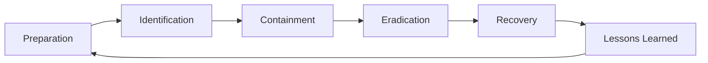

### 15.3 Network Incident Types

| ประเภท | ตัวอย่าง |
|---|---|
| Malware | Ransomware |
| C2 | Beaconing |
| Lateral | SMB Scan |
| Exfiltration | Data Out |
| DDoS | Flood |
| Compromise | Router |

### 15.4 Playbook: C2 Detection

📋 **ขั้นที่ 1: Detect**
- Alert จาก IDS
- Anomaly

📋 **ขั้นที่ 2: Verify**
- ตรวจ Traffic
- ตรวจ Host

📋 **ขั้นที่ 3: Contain**
- Block IP/Domain
- Isolate Host

📋 **ขั้นที่ 4: Eradicate**
- ลบ Malware
- Patch

📋 **ขั้นที่ 5: Recover**
- Restore
- Monitor

📋 **ขั้นที่ 6: RCA**
- 5 Whys
- CAPA

### 15.5 Playbook: DDoS

📋 **ขั้นที่ 1: Detect**
📋 **ขั้นที่ 2: Activate Protection**
📋 **ขั้นที่ 3: Analyze**
📋 **ขั้นที่ 4: Mitigate**
📋 **ขั้นที่ 5: Monitor**
📋 **ขั้นที่ 6: Post-Mortem**

### 15.6 SOP: Network IR

📋 **ขั้นที่ 1: Preparation**
1. ทีม
2. Tools
3. Playbook
4. ซ้อม

📋 **ขั้นที่ 2: Identification**
1. Alert
2. Verify
3. Severity
4. Ticket

📋 **ขั้นที่ 3: Containment**
1. Block
2. Isolate
3. Capture
4. Preserve

📋 **ขั้นที่ 4: Eradication**
1. Remove
2. Patch
3. Verify

📋 **ขั้นที่ 5: Recovery**
1. Restore
2. Monitor
3. Validate

📋 **ขั้นที่ 6: Lessons Learned**
1. RCA
2. CAPA
3. Update

### 15.7 Template: Network Incident

| หัวข้อ | รายละเอียด |
|---|---|
| Incident ID | |
| เวลา | |
| Severity | |
| Source IP | |
| Destination IP | |
| Protocol | |
| Port | |
| หลักฐาน | |
| การตอบสนอง | |
| สถานะ | |

### 15.8 แบบฝึกหัด

🎯 **แบบฝึกหัด 15.1**  
เขียน Playbook สำหรับ Ransomware

🎯 **แบบฝึกหัด 15.2**  
เขียน Playbook สำหรับ Data Exfiltration

🎯 **แบบฝึกหัด 15.3**  
เขียน RCA Report

### 15.9 เฉลยแบบฝึกหัด

**เฉลย 15.1**
1. Detect: Alert จาก EDR
2. Verify: ตรวจ Host
3. Contain: Isolate
4. Eradicate: ลบ Ransomware
5. Recover: Restore Backup
6. RCA: 5 Whys

---

## บทที่ 16 Network Forensics

### 16.1 วัตถุประสงค์การเรียนรู้
1. Forensics
2. Evidence
3. Tools
4. Chain of Custody

### 16.2 หลักการ

1. **Preserve** – รักษาหลักฐาน
2. **Document** – บันทึกทุกขั้น
3. **Chain of Custody** – ติดตามหลักฐาน
4. **Integrity** – Hash

### 16.3 Evidence Collection

```bash
# Capture Traffic
sudo tcpdump -i eth0 -w evidence.pcap

# Hash
sha256sum evidence.pcap > evidence.sha256

# Memory
sudo dd if=/dev/mem of=memory.dump bs=1M

# Disk
sudo dd if=/dev/sda of=disk.img bs=4M
```

### 16.4 Tools

| Tool | ใช้ทำอะไร |
|---|---|
| Wireshark | PCAP |
| NetworkMiner | Extract Files |
| Volatility | Memory |
| Autopsy | Disk |
| Zeek | Log Analysis |
| Arkime | PCAP Index |

### 16.5 SOP: Network Forensics

📋 **ขั้นที่ 1: Secure Scene**
📋 **ขั้นที่ 2: Document**
📋 **ขั้นที่ 3: Collect**
📋 **ขั้นที่ 4: Preserve**
📋 **ขั้นที่ 5: Analyze**
📋 **ขั้นที่ 6: Report**

### 16.6 แบบฝึกหัด

🎯 **แบบฝึกหัด 16.1**  
Capture Traffic และ Hash

🎯 **แบบฝึกหัด 16.2**  
Extract File จาก PCAP

🎯 **แบบฝึกหัด 16.3**  
วิเคราะห์ Memory Dump

### 16.7 เฉลยแบบฝึกหัด

**เฉลย 16.1**
```bash
sudo tcpdump -i eth0 -w evidence.pcap
sha256sum evidence.pcap > evidence.sha256
```

**เฉลย 16.2**
```bash
# NetworkMiner
mono NetworkMiner.exe evidence.pcap

# หรือ tcpflow
tcpflow -r evidence.pcap -o output/
```

---

# ส่วนที่ 5: Cloud Network

---

## บทที่ 17 AWS VPC Security

### 17.1 วัตถุประสงค์การเรียนรู้
1. VPC
2. Security Group
3. NACL
4. Flow Log

### 17.2 VPC Components

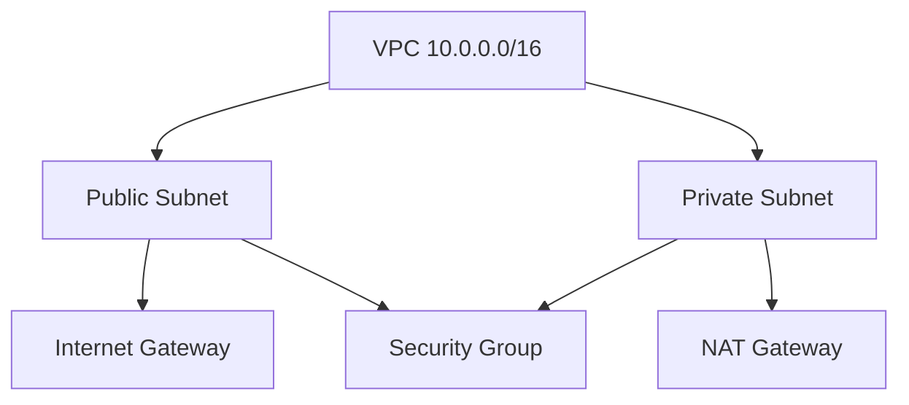

### 17.3 Security Group vs NACL

| ด้าน | Security Group | NACL |
|---|---|---|
| ระดับ | Instance | Subnet |
| State | Stateful | Stateless |
| Rule | Allow only | Allow + Deny |
| Default | Deny | Allow |

### 17.4 Security Group

```hcl
resource "aws_security_group" "web" {
  name        = "web-sg"
  description = "Web SG"
  vpc_id      = aws_vpc.main.id

  ingress {
    from_port   = 443
    to_port     = 443
    protocol    = "tcp"
    cidr_blocks = ["0.0.0.0/0"]
  }

  egress {
    from_port   = 0
    to_port     = 0
    protocol    = "-1"
    cidr_blocks = ["0.0.0.0/0"]
  }
}
```

### 17.5 NACL

```hcl
resource "aws_network_acl" "main" {
  vpc_id = aws_vpc.main.id

  ingress {
    protocol   = "tcp"
    rule_no    = 100
    action     = "allow"
    cidr_block = "0.0.0.0/0"
    from_port  = 443
    to_port    = 443
  }

  egress {
    protocol   = "-1"
    rule_no    = 100
    action     = "allow"
    cidr_block = "0.0.0.0/0"
    from_port  = 0
    to_port    = 0
  }
}
```

### 17.6 VPC Flow Log

```hcl
resource "aws_flow_log" "main" {
  iam_role_arn    = aws_iam_role.flow_log.arn
  log_destination = aws_cloudwatch_log_group.flow_log.arn
  traffic_type    = "ALL"
  vpc_id          = aws_vpc.main.id
}
```

### 17.7 VPC Endpoint

```hcl
resource "aws_vpc_endpoint" "s3" {
  vpc_id       = aws_vpc.main.id
  service_name = "com.amazonaws.ap-southeast-1.s3"
  vpc_endpoint_type = "Gateway"
  route_table_ids = [aws_route_table.private.id]
}
```

### 17.8 SOP: AWS VPC Security

📋 **ขั้นที่ 1: แบ่ง Subnet**
📋 **ขั้นที่ 2: Security Group**
📋 **ขั้นที่ 3: NACL**
📋 **ขั้นที่ 4: Flow Log**
📋 **ขั้นที่ 5: VPC Endpoint**
📋 **ขั้นที่ 6: Monitoring**

### 17.9 แบบฝึกหัด

🎯 **แบบฝึกหัด 17.1**  
ออกแบบ VPC สำหรับ 3-Tier App

🎯 **แบบฝึกหัด 17.2**  
เขียน Security Group สำหรับ Web Server

🎯 **แบบฝึกหัด 17.3**  
ตั้งค่า VPC Flow Log

### 17.10 เฉลยแบบฝึกหัด

**เฉลย 17.1**
```
VPC: 10.0.0.0/16
Public Subnet: 10.0.1.0/24 (ALB)
Private App: 10.0.2.0/24
Private DB: 10.0.3.0/24
```

**เฉลย 17.2**
```hcl
ingress {
  from_port   = 443
  to_port     = 443
  protocol    = "tcp"
  cidr_blocks = ["0.0.0.0/0"]
}
```

---

## บทที่ 18 Azure VNet Security

### 18.1 วัตถุประสงค์การเรียนรู้
1. VNet
2. NSG
3. Azure Firewall
4. NSG Flow Log

### 18.2 VNet Components

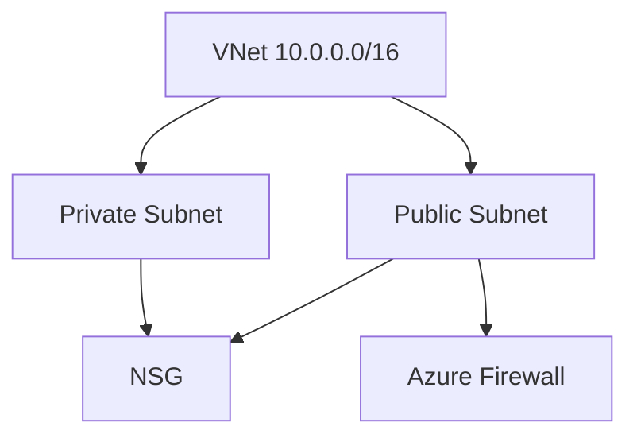

### 18.3 NSG

```json
{
  "name": "web-nsg",
  "securityRules": [
    {
      "name": "AllowHTTPS",
      "priority": 100,
      "direction": "Inbound",
      "access": "Allow",
      "protocol": "Tcp",
      "sourceAddressPrefix": "*",
      "destinationPortRange": "443"
    }
  ]
}
```

### 18.4 Azure Firewall

```hcl
resource "azurerm_firewall" "main" {
  name                = "fw"
  location            = azurerm_resource_group.main.location
  resource_group_name = azurerm_resource_group.main.name
  sku_name            = "AZFW_VNet"
  sku_tier            = "Standard"

  ip_configuration {
    name                 = "config"
    subnet_id            = azurerm_subnet.fw.id
    public_ip_address_id = azurerm_public_ip.fw.id
  }
}
```

### 18.5 NSG Flow Log

```hcl
resource "azurerm_network_watcher_flow_log" "main" {
  network_watcher_name = azurerm_network_watcher.main.name
  resource_group_name  = azurerm_resource_group.main.name
  network_security_group_id = azurerm_network_security_group.main.id
  storage_account_id   = azurerm_storage_account.main.id
  enabled              = true
  
  retention_policy {
    enabled = true
    days    = 90
  }
}
```

### 18.6 SOP: Azure VNet Security

📋 **ขั้นที่ 1: VNet**
📋 **ขั้นที่ 2: NSG**
📋 **ขั้นที่ 3: Firewall**
📋 **ขั้นที่ 4: Flow Log**
📋 **ขั้นที่ 5: Private Endpoint**
📋 **ขั้นที่ 6: Monitoring**

### 18.7 แบบฝึกหัด

🎯 **แบบฝึกหัด 18.1**  
ออกแบบ VNet สำหรับ 3-Tier App

🎯 **แบบฝึกหัด 18.2**  
เขียน NSG Rule

🎯 **แบบฝึกหัด 18.3**  
ตั้งค่า Flow Log

### 18.8 เฉลยแบบฝึกหัด

**เฉลย 18.1**
```
VNet: 10.0.0.0/16
Public: 10.0.1.0/24
App: 10.0.2.0/24
DB: 10.0.3.0/24
```

---

## บทที่ 19 GCP VPC Security

### 19.1 วัตถุประสงค์การเรียนรู้
1. VPC
2. Firewall Rule
3. VPC Flow Log

### 19.2 VPC

```hcl
resource "google_compute_network" "main" {
  name                    = "main-vpc"
  auto_create_subnetworks = false
}

resource "google_compute_subnetwork" "public" {
  name          = "public"
  ip_cidr_range = "10.0.1.0/24"
  region        = "asia-southeast1"
  network       = google_compute_network.main.id
}
```

### 19.3 Firewall Rule

```hcl
resource "google_compute_firewall" "allow_https" {
  name    = "allow-https"
  network = google_compute_network.main.name

  allow {
    protocol = "tcp"
    ports    = ["443"]
  }

  source_ranges = ["0.0.0.0/0"]
  target_tags   = ["web"]
}
```

### 19.4 VPC Flow Log

```hcl
resource "google_compute_subnetwork" "public" {
  name          = "public"
  ip_cidr_range = "10.0.1.0/24"
  region        = "asia-southeast1"
  network       = google_compute_network.main.id

  log_config {
    aggregation_interval = "INTERVAL_5_SEC"
    flow_sampling        = 0.5
    metadata             = "INCLUDE_ALL_METADATA"
  }
}
```

### 19.5 SOP: GCP VPC Security

📋 **ขั้นที่ 1: VPC**
📋 **ขั้นที่ 2: Firewall**
📋 **ขั้นที่ 3: Flow Log**
📋 **ขั้นที่ 4: Private Google Access**
📋 **ขั้นที่ 5: VPC SC**
📋 **ขั้นที่ 6: Monitoring**

### 19.6 แบบฝึกหัด

🎯 **แบบฝึกหัด 19.1**  
ออกแบบ VPC สำหรับ 3-Tier App

🎯 **แบบฝึกหัด 19.2**  
เขียน Firewall Rule

🎯 **แบบฝึกหัด 19.3**  
ตั้งค่า Flow Log

### 19.7 เฉลยแบบฝึกหัด

**เฉลย 19.1**
```
VPC: 10.0.0.0/16
Public: 10.0.1.0/24
App: 10.0.2.0/24
DB: 10.0.3.0/24
```

---

# ส่วนที่ 6: Case Studies

---

## บทที่ 20 Case Studies

### Case 1: Dyn DDoS (2016)
- **ประเภท**: DDoS
- **ขนาด**: 1.2 Tbps
- **Root Cause**: Mirai Botnet จาก IoT
- **บทเรียน**: IoT Security, DDoS Mitigation

### Case 2: Equifax (2017)
- **ประเภท**: Data Breach
- **ช่องโหว่**: Apache Struts
- **Root Cause**: ไม่ Patch + ไม่ Segment
- **บทเรียน**: Patch Management, Segmentation

### Case 3: NotPetya (2017)
- **ประเภท**: Ransomware
- **Root Cause**: Supply Chain (M.E.Doc)
- **บทเรียน**: Supply Chain Security, Segment

### Case 4: WannaCry (2017)
- **ประเภท**: Ransomware
- **ช่องโหว่**: EternalBlue (SMB)
- **Root Cause**: ไม่ Patch
- **บทเรียน**: Patch, Disable SMBv1

### Case 5: Colonial Pipeline (2021)
- **ประเภท**: Ransomware
- **Root Cause**: Compromised Password
- **บทเรียน**: MFA, OT Segmentation

### Case 6: SolarWinds (2020)
- **ประเภท**: Supply Chain
- **Root Cause**: Build System
- **บทเรียน**: SLSA, Signing

### แบบฝึกหัด

🎯 **แบบฝึกหัด 20.1**  
เลือก 1 Case วิเคราะห์ด้วย 5 Whys

🎯 **แบบฝึกหัด 20.2**  
เขียน RCA Report

🎯 **แบบฝึกหัด 20.3**  
เสนอ CAPA

### เฉลยแบบฝึกหัด

**เฉลย 20.1 (WannaCry)**
1. ทำไมระบบถูกเข้ารหัส? → WannaCry
2. ทำไมเข้ามา? → ช่องโหว่ SMB
3. ทำไมมีช่องโหว่? → ไม่ Patch
4. ทำไมไม่ Patch? → ไม่มี Patch Management
5. ทำไมไม่มี? → ไม่มี Process

**Root Cause**: ไม่มี Patch Management  
**CAPA**: Patch, Disable SMBv1, Segment, Backup

---

# ส่วนที่ 7: ภาคผนวก

---

## ภาคผนวก A: Checklists

### A.1 Network Security Checklist (40 ข้อ)

**Architecture**
- [ ] Zone Model
- [ ] Segment
- [ ] Defense in Depth
- [ ] Zero Trust
- [ ] HA

**Firewall**
- [ ] Default Deny
- [ ] Least Privilege
- [ ] Document Rule
- [ ] Review ทุก 6 เดือน
- [ ] Log

**IDS/IPS**
- [ ] ติดตั้ง
- [ ] Tune
- [ ] Update Signature
- [ ] Monitor
- [ ] Alert

**VPN**
- [ ] MFA
- [ ] AES-256
- [ ] Least Privilege
- [ ] Log
- [ ] Review

**Wireless**
- [ ] WPA3
- [ ] 802.1X
- [ ] Segment
- [ ] Rogue AP Detection
- [ ] Site Survey

**DNS**
- [ ] DNSSEC
- [ ] DoH/DoT
- [ ] RPZ
- [ ] Monitor
- [ ] Rate Limit

**DDoS**
- [ ] CDN
- [ ] WAF
- [ ] Rate Limit
- [ ] Auto Scaling
- [ ] Plan

**Monitoring**
- [ ] NetFlow
- [ ] SIEM
- [ ] Alert
- [ ] Dashboard
- [ ] Review

**IR**
- [ ] Playbook
- [ ] Team
- [ ] Tools
- [ ] ซ้อม
- [ ] RCA

### A.2 Firewall Rule Review Checklist
### A.3 Incident Response Checklist
### A.4 Network Diagram Checklist
### A.5 Segmentation Checklist

---

## ภาคผนวก B: Templates

1. Network Diagram
2. Firewall Rule
3. Access Control Matrix
4. Incident Report
5. RCA Report
6. Change Request
7. Risk Register
8. Vendor Assessment
9. VPN Config
10. Playbook

---

## ภาคผนวก C: คำศัพท์ 200 คำ

**A**: ACL, AH, Anycast, ARP, ASA
**B**: BGP, Botnet, Baseline
**C**: CDN, CIDR, Cilium, Cisco, Cloud, Correlation, CVE, CVSS
**D**: DDoS, DHCP, DMZ, DNSSEC, DoH, DoT, DNS
**E**: EAP, EDR, Encryption, ESP
**F**: Firewall, Flow Log, Forensic
**G**: Gateway, GRE
**H**: HA, HIDS, HSRP, HTTP, HTTPS
**I**: IKE, IDS, IPS, IPsec, IoT, IR
**J**: Jumbo Frame
**K**: Kerberos
**L**: LAN, LDAP, Load Balancer
**M**: MAC, MFA, MITM, MITRE
**N**: NAC, NACL, NAT, NetFlow, NGFW, NIDS, NIPS, NSG
**O**: OSI, OSPF, OT
**P**: Packet, PCAP, PCI DSS, PDPA, Perimeter, Policy, Port, Protocol, Proxy
**Q**: QoS
**R**: RADIUS, Ransomware, Rate Limit, RBAC, RCA, Rogue AP, RPZ, Router
**S**: SD-WAN, Segment, SIEM, SOC, SPIFFE, SSL, SSRF, Switch, Syslog
**T**: TCP, TLS, TTL, Tunnel
**U**: UDP, UTM
**V**: VLAN, VNet, VPN, VPC, VRRP
**W**: WAF, WIDS, WIPS, WLAN, WPA
**X**: XDR, XSS
**Y**: YAML
**Z**: Zero Trust, ZTNA

---

## ภาคผนวก D: แหล่งเรียนรู้

### มาตรฐาน
- NIST SP 800-41: https://csrc.nist.gov/publications/detail/sp/800-41/rev-1/final
- NIST SP 800-77: https://csrc.nist.gov/publications/detail/sp/800-77/rev-1/final
- CIS Controls: https://www.cisecurity.org/controls
- ISO 27001: https://www.iso.org/isoiec-27001-information-security.html
- PCI DSS: https://www.pcisecuritystandards.org/
- MITRE ATT&CK: https://attack.mitre.org/

### Tools
- Wireshark: https://www.wireshark.org/
- Suricata: https://suricata.io/
- Zeek: https://zeek.org/
- Snort: https://www.snort.org/
- nfdump: https://github.com/phaag/nfdump
- Arkime: https://arkime.com/
- RITA: https://www.activecountermeasures.com/free-tools/rita/
- Velociraptor: https://docs.velociraptor.app/

### แหล่งฝึก
- TryHackMe Network Security
- CyberDefenders
- Malware Traffic Analysis
- PacketLife

---

## ภาคผนวก E: เฉลยแบบฝึกหัด

(รวมเฉลยทุกบท)

**บทที่ 1**
- 1.1–1.4: (ดูในส่วนก่อนหน้า)

**บทที่ 2**
- 2.1–2.3: (ดูในส่วนก่อนหน้า)

**บทที่ 3**
- 3.1–3.2: (ดูในส่วนก่อนหน้า)

**บทที่ 4**
- 4.1–4.3: (ดูในส่วนก่อนหน้า)

**บทที่ 5**
- 5.1–5.4: (ดูในส่วนก่อนหน้า)

**บทที่ 6**
- 6.1–6.4: (ดูในส่วนก่อนหน้า)

**บทที่ 7**
- 7.1–7.3: (ดูในส่วนก่อนหน้า)

**บทที่ 8**
- 8.1–8.3: (ดูในส่วนก่อนหน้า)

**บทที่ 9**
- 9.1–9.3: (ดูในส่วนก่อนหน้า)

**บทที่ 10**
- 10.1–10.3: (ดูในส่วนก่อนหน้า)

**บทที่ 11**
- 11.1–11.3: (ดูในส่วนก่อนหน้า)

**บทที่ 12**
- 12.1–12.3: (ดูในส่วนก่อนหน้า)

**บทที่ 13**
- 13.1–13.3: (ดูในส่วนก่อนหน้า)

**บทที่ 14**
- 14.1–14.3: (ดูในส่วนก่อนหน้า)

**บทที่ 15**
- 15.1–15.3: (ดูในส่วนก่อนหน้า)

**บทที่ 16**
- 16.1–16.3: (ดูในส่วนก่อนหน้า)

**บทที่ 17**
- 17.1–17.3: (ดูในส่วนก่อนหน้า)

**บทที่ 18**
- 18.1–18.3: (ดูในส่วนก่อนหน้า)

**บทที่ 19**
- 19.1–19.3: (ดูในส่วนก่อนหน้า)

**บทที่ 20**
- 20.1–20.3: (ดูในส่วนก่อนหน้า)

---

# สรุปเล่ม 3

คู่มือ Network Security Operations Manual ฉบับเต็มนี้ ประกอบด้วย:

- **20 บท** ครอบคลุมตั้งแต่พื้นฐานถึงระดับสูง
- **50+ ตัวอย่าง Config** Cisco, iptables, nftables, pfSense, Terraform, Wireshark, Suricata, Snort, Zeek
- **50+ แผนภาพ** Mermaid, Network Diagram, Flow
- **35+ แบบฝึกหัด** พร้อมเฉลยละเอียด
- **10 Templates** พร้อมใช้
- **200+ คำศัพท์**
- **Checklists ครบทุกหัวข้อ**

เมื่อจัดพิมพ์เป็น A4 ฟอนต์ TH Sarabun 12 ระยะบรรทัด 1.15 จะได้ความยาวประมาณ **340–380 หน้า**

---
 