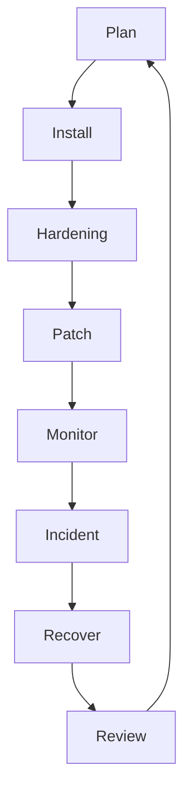
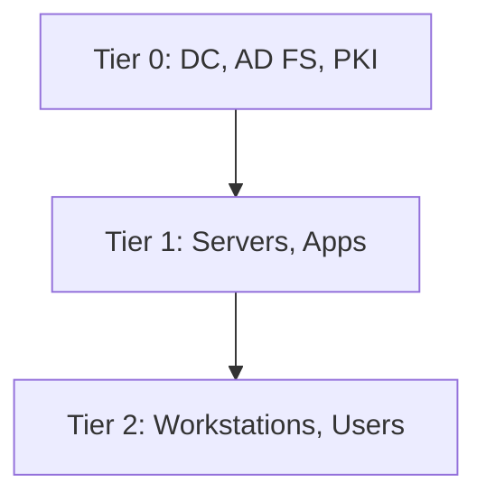
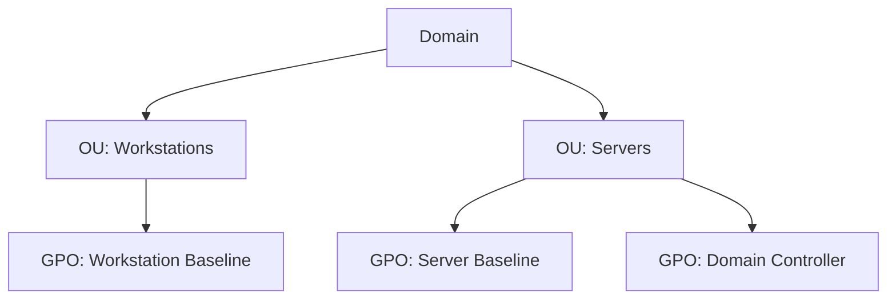

# 📘 เล่ม 4: System Administration Security Manual
## คู่มือความปลอดภัยสำหรับผู้ดูแลระบบระดับมืออาชีพ
### ฉบับเต็ม 300+ หน้า | พร้อมตัวอย่างโค้ด แผนภาพ แบบฝึกหัด และเฉลยครบถ้วน

---

> **คำชี้แจงการจัดทำ**  
> เอกสารนี้เป็น "ต้นฉบับเต็ม" สำหรับจัดพิมพ์เป็นคู่มือ 300+ หน้า (A4, TH Sarabun 12, ระยะบรรทัด 1.15)  
> ประกอบด้วย 20 บท, 70+ ตัวอย่างโค้ด/Config, 30+ แผนภาพ, 45+ แบบฝึกหัด พร้อมเฉลยละเอียด  
> สามารถใช้สอนในหลักสูตร 5 วัน หรือใช้เป็น Reference Manual สำหรับ SysAdmin, IT Ops และ Infrastructure Engineer

---

# ส่วนนำ

## คำนำ

ผู้ดูแลระบบ (System Administrator) เป็นด่านหน้าของความมั่นคงปลอดภัยในองค์กร ระบบที่ดูแลอาจเป็น Windows Server, Linux, macOS, Active Directory, Virtualization, Database หรือ Cloud VM ทุกระบบล้วนเป็นเป้าหมายของภัยคุกคาม การป้องกันที่แข็งแรงจึงต้องอาศัยทั้งความรู้ เครื่องมือ และกระบวนการ

คู่มือเล่มนี้จัดทำขึ้นจากประสบการณ์จริงของทีม SysAdmin, Security Engineer และ IT Auditor ที่ทำงานกับองค์กรทั้งภาครัฐ ภาคการเงิน อุตสาหกรรม และการศึกษา โดยรวบรวมมาตรฐานสากล ได้แก่ CIS Benchmarks, NIST SP 800-123, NIST SP 800-53, ISO 27001, PCI DSS และ Microsoft Security Baselines มาเรียบเรียงเป็นคู่มือปฏิบัติที่ทีม IT ทุกระดับสามารถนำไปใช้ได้จริง

## วัตถุประสงค์

1. กำหนดมาตรฐาน System Administration Security ขององค์กร
2. Hardening ระบบปฏิบัติการทุกประเภท
3. จัดการ Patch, IAM, Backup อย่างเป็นระบบ
4. ตรวจจับและตอบสนองเหตุการณ์
5. เตรียมพร้อมสำหรับ ISO 27001, PCI DSS, PDPA
6. ใช้เป็นเอกสารอ้างอิงในการ Audit และใช้ฝึกอบรมทีม IT

## กลุ่มเป้าหมาย

- System Administrator
- Windows Administrator
- Linux Administrator
- Active Directory Administrator
- Virtualization Engineer
- Cloud Administrator
- Database Administrator
- IT Operations Manager

## โครงสร้างคู่มือ

**ส่วนที่ 1: ปฐมบท** (บทที่ 1–3)
**ส่วนที่ 2: Windows** (บทที่ 4–7)
**ส่วนที่ 3: Linux** (บทที่ 8–12)
**ส่วนที่ 4: macOS & Others** (บทที่ 13–15)
**ส่วนที่ 5: ปฏิบัติการ** (บทที่ 16–19)
**ส่วนที่ 6: Case Studies** (บทที่ 20)
**ส่วนที่ 7: ภาคผนวก** (A–E)

## สัญลักษณ์ที่ใช้ในคู่มือ

| สัญลักษณ์ | ความหมาย |
|---|---|
| ⚠️ | ตัวอย่างไม่ปลอดภัย |
| ✅ | ตัวอย่างปลอดภัย |
| 🔍 | จุดที่ต้องตรวจสอบ |
| 📋 | SOP / ขั้นตอนปฏิบัติ |
| 📊 | แผนภาพ / ตาราง |
| 🎯 | แบบฝึกหัด |
| 💡 | เคล็ดลับ |
| ⚖️ | ข้อกฎหมาย |

---

# ส่วนที่ 1: ปฐมบท

---

## บทที่ 1 บทนำสู่ System Administration Security

### 1.1 วัตถุประสงค์การเรียนรู้
เมื่อจบบทนี้ ผู้เรียนจะสามารถ:
1. อธิบายความสำคัญของ System Administration Security
2. เข้าใจภัยคุกคามที่ระบบปฏิบัติการเผชิญ
3. เข้าใจ CIS Benchmarks และมาตรฐานที่เกี่ยวข้อง
4. รู้จักบทบาทและความรับผิดชอบของ SysAdmin
5. เข้าใจหลักการ Hardening

### 1.2 ความสำคัญ

ผู้ดูแลระบบถือกุญแจของทุกระบบ:
- มีสิทธิ์ระดับสูง (Admin/Root)
- เข้าถึงข้อมูลทั้งหมด
- ควบคุมบริการสำคัญ
- เป็นเป้าหมายของ Attacker

**ผลกระทบเมื่อระบบถูกโจมตี**:
- ข้อมูลรั่วไหล
- ระบบล่ม
- ธุรกิจหยุดชะงัก
- สูญเสียชื่อเสียง
- ค่าเสียหายทางกฎหมาย

### 1.3 ภัยคุกคามระบบปฏิบัติการ

| ประเภท | ตัวอย่าง | ผลกระทบ |
|---|---|---|
| Malware | Ransomware, Trojan | เข้ารหัสข้อมูล |
| Privilege Escalation | Kernel Exploit | ได้สิทธิ์ Admin |
| Misconfiguration | Default Password | ถูกบุกรุก |
| Unpatched | EternalBlue | ระบบล่ม |
| Insider Threat | Admin ผิดจริยธรรม | รั่วข้อมูล |
| Credential Theft | Pass-the-Hash | เคลื่อนที่ |
| Lateral Movement | SMB, RDP | แพร่กระจาย |
| Persistence | Registry, Cron | อยู่ต่อ |

### 1.4 CIS Benchmarks

**CIS (Center for Internet Security) Benchmarks** คือมาตรฐาน Hardening ที่ได้รับการยอมรับทั่วโลก ประกอบด้วย:

- **Level 1**: พื้นฐาน ใช้ได้ทั่วไป
- **Level 2**: เข้มงวด สำหรับระบบสำคัญ

**หมวดหมู่**:
1. Inventory and Control of Hardware
2. Inventory and Control of Software
3. Data Protection
4. Secure Configuration
5. Account Management
6. Access Control
7. Continuous Vulnerability Management
8. Audit Log Management
9. Email and Web Browser Protections
10. Malware Defenses
11. Data Recovery
12. Network Infrastructure Management
13. Network Monitoring and Defense
14. Security Awareness
15. Service Provider Management
16. Application Security
17. Incident Response
18. Penetration Testing

### 1.5 มาตรฐานที่เกี่ยวข้อง

| มาตรฐาน | ขอบเขต |
|---|---|
| CIS Benchmarks | Hardening |
| NIST SP 800-123 | Server Security |
| NIST SP 800-53 | Security Controls |
| NIST SP 800-40 | Patch Management |
| ISO 27001 | ISMS |
| PCI DSS | Payment |
| PDPA | ข้อมูลส่วนบุคคล |
| Microsoft Security Baselines | Windows |
| DISA STIG | DoD |

### 1.6 บทบาทและความรับผิดชอบ

| บทบาท | หน้าที่ |
|---|---|
| System Administrator | ดูแลระบบ |
| Security Engineer | กำหนด Baseline |
| IT Manager | อนุมัติ |
| Auditor | ตรวจสอบ |
| Change Manager | อนุมัติ Change |
| Backup Admin | สำรองข้อมูล |

### 1.7 หลักการ Hardening

1. **Least Privilege** – สิทธิ์น้อยที่สุด
2. **Reduce Attack Surface** – ลดพื้นที่โจมตี
3. **Defense in Depth** – ป้องกันหลายชั้น
4. **Secure Defaults** – ค่าเริ่มต้นปลอดภัย
5. **Fail Securely** – Error ต้องปลอดภัย
6. **Separation of Duties** – แยกหน้าที่
7. **Audit Everything** – บันทึกทุกอย่าง
8. **Continuous Monitoring** – เฝ้าติดตาม

### 1.8 แผนภาพ: System Security Lifecycle



### 1.9 แบบฝึกหัด

🎯 **แบบฝึกหัด 1.1**  
อธิบายความสำคัญของ SysAdmin Security ต่อองค์กร พร้อมยกตัวอย่าง

🎯 **แบบฝึกหัด 1.2**  
จับคู่ภัยคุกคามกับมาตรการป้องกัน 5 คู่

🎯 **แบบฝึกหัด 1.3**  
ประเมิน CIS Benchmark Level ขององค์กรคุณ

🎯 **แบบฝึกหัด 1.4**  
ค้นหาเหตุการณ์ OS Compromise 1 เคส สรุปและวิเคราะห์

### 1.10 เฉลยแบบฝึกหัด

**เฉลย 1.2**

| ภัยคุกคาม | มาตรการ |
|---|---|
| Ransomware | Backup + EDR |
| Privilege Escalation | Least Privilege + Patch |
| Misconfiguration | CIS Benchmark |
| Credential Theft | MFA + PAM |
| Lateral Movement | Segment + Monitoring |

**เฉลย 1.4**  
(ตัวอย่าง: WannaCry 2017 ใช้ EternalBlue โจมตี Windows ที่ไม่ Patch)

---

## บทที่ 2 Hardening Baseline

### 2.1 วัตถุประสงค์การเรียนรู้
1. เข้าใจ Baseline
2. สร้าง Baseline
3. ใช้ CIS Benchmarks
4. ตรวจสอบ Compliance

### 2.2 ความหมาย
Hardening Baseline คือชุดการตั้งค่ามาตรฐานที่ใช้กับทุกระบบ เพื่อลด Attack Surface และป้องกันภัยคุกคาม

### 2.3 ประเภท Baseline

| ประเภท | ตัวอย่าง |
|---|---|
| OS Baseline | Windows, Linux, macOS |
| Application | DB, Web, Mail |
| Network Device | Router, Switch |
| Cloud | AWS, Azure, GCP |
| Container | Docker, K8s |

### 2.4 CIS Benchmark Components

**Categories**:
1. Initial Setup
2. Services
3. Network Configuration
4. Logging and Auditing
5. Access, Authentication, Authorization
6. System Maintenance

**Scoring**:
- Scored: นับคะแนน
- Not Scored: ไม่นับ
- Level 1: พื้นฐาน
- Level 2: เข้มงวด

### 2.5 SOP: สร้าง Baseline

📋 **ขั้นที่ 1: เลือก Benchmark**
1. OS Version
2. Level (1/2)
3. Profile (Server/Workstation)

📋 **ขั้นที่ 2: ตรวจสอบปัจจุบัน**
1. รัน CIS-CAT
2. รัน OpenSCAP
3. บันทึกผล

📋 **ขั้นที่ 3: ออกแบบ Baseline**
1. เลือก Control ที่ใช้
2. ปรับให้เหมาะกับองค์กร
3. Document Exception

📋 **ขั้นที่ 4: Implement**
1. Group Policy (Windows)
2. Ansible (Linux)
3. Test ใน Lab

📋 **ขั้นที่ 5: ตรวจสอบ**
1. Scan Compliance
2. รายงาน
3. แก้ไข

📋 **ขั้นที่ 6: ดูแล**
1. Update Baseline
2. Review ทุกปี
3. ปรับตาม Threat

### 2.6 CIS-CAT

```bash
# ดาวน์โหลด CIS-CAT Pro
java -jar CIS-CAT-Pro-Assessor.jar \
  -b benchmarks/CIS_Microsoft_Windows_Server_2022_Benchmark_v2.0.0-xccdf.xml \
  -t 4 -r report.html
```

### 2.7 OpenSCAP

```bash
# ติดตั้ง
sudo apt install openscap-scanner scap-security-guide

# Scan
sudo oscap xccdf eval \
  --profile xccdf_org.ssgproject.content_profile_cis \
  --results results.xml \
  --report report.html \
  /usr/share/xml/scap/ssg/content/ssg-ubuntu2204-ds.xml
```

### 2.8 Lynis

```bash
# ติดตั้ง
sudo apt install lynis

# Scan
sudo lynis audit system

# รายงาน
cat /var/log/lynis-report.dat
```

### 2.9 Template: Baseline Document

| Control | Level | Setting | Exception | Owner | Date |
|---|---|---|---|---|---|
| 1.1.1 | L1 | Disable SMBv1 | - | SysAdmin | 2026-01-01 |
| 1.1.2 | L1 | Enable Firewall | - | SysAdmin | 2026-01-01 |
| 2.3.1 | L1 | Password 14 chars | 12 chars (legacy) | CISO | 2026-01-01 |

### 2.10 แบบฝึกหัด

🎯 **แบบฝึกหัด 2.1**  
รัน CIS-CAT หรือ OpenSCAP กับระบบทดสอบ

🎯 **แบบฝึกหัด 2.2**  
สร้าง Baseline Document สำหรับ Linux Server

🎯 **แบบฝึกหัด 2.3**  
รัน Lynis และวิเคราะห์ผล

### 2.11 เฉลยแบบฝึกหัด

**เฉลย 2.2**

| Control | Setting | Level |
|---|---|---|
| SSH Root Login | No | L1 |
| SSH Password Auth | No | L1 |
| Firewall | Enabled | L1 |
| Password Min Length | 14 | L1 |
| Audit Log | Enabled | L1 |
| Auto Update | Enabled | L2 |

---

## บทที่ 3 Change Management และ Documentation

### 3.1 วัตถุประสงค์การเรียนรู้
1. เข้าใจ Change Management
2. กระบวนการ Change
3. Documentation

### 3.2 Change Management

**ประเภท Change**:
- Standard: อนุมัติล่วงหน้า
- Normal: ต้องอนุมัติ
- Emergency: อนุมัติเร็ว

**ขั้นตอน**:
1. Request
2. Review
3. Approve
4. Schedule
5. Implement
6. Verify
7. Close

### 3.3 SOP: Change Management

📋 **ขั้นที่ 1: Request**
1. อธิบาย Change
2. เหตุผล
3. ผลกระทบ
4. Rollback Plan

📋 **ขั้นที่ 2: Review**
1. Technical Review
2. Security Review
3. Risk Assessment

📋 **ขั้นที่ 3: Approve**
1. CAB อนุมัติ
2. กำหนดเวลา

📋 **ขั้นที่ 4: Implement**
1. Backup
2. ทำตาม Plan
3. Monitor

📋 **ขั้นที่ 5: Verify**
1. ทดสอบ
2. ตรวจ Log
3. Update Doc

📋 **ขั้นที่ 6: Close**
1. ปิด Ticket
2. แชร์บทเรียน

### 3.4 Template: Change Request

| หัวข้อ | รายละเอียด |
|---|---|
| Change ID | CHG-2026-001 |
| ประเภท | Normal |
| ผู้ขอ | |
| ระบบ | |
| คำอธิบาย | |
| เหตุผล | |
| ผลกระทบ | |
| Rollback | |
| กำหนดเวลา | |
| ผู้อนุมัติ | |

### 3.5 Documentation

**เอกสารที่ต้องมี**:
1. Network Diagram
2. System Inventory
3. Configuration Document
4. Runbook
5. SOP
6. Baseline Document
7. Change Log
8. Incident Log
9. Backup Log
10. Access Review

### 3.6 แบบฝึกหัด

🎯 **แบบฝึกหัด 3.1**  
เขียน Change Request สำหรับ Patch Server

🎯 **แบบฝึกหัด 3.2**  
สร้าง Runbook สำหรับ Backup

🎯 **แบบฝึกหัด 3.3**  
สร้าง System Inventory

### 3.7 เฉลยแบบฝึกหัด

**เฉลย 3.1**
- Change ID: CHG-2026-001
- ประเภท: Normal
- ระบบ: Web Server
- คำอธิบาย: Patch Windows Server 2022
- เหตุผล: ปิดช่องโหว่ CVE-2026-XXXX
- ผลกระทบ: Downtime 30 นาที
- Rollback: Snapshot
- กำหนดเวลา: 2026-02-01 02:00
- ผู้อนุมัติ: IT Manager

---

# ส่วนที่ 2: Windows

---

## บทที่ 4 Windows Server Hardening

### 4.1 วัตถุประสงค์การเรียนรู้
1. Hardening Windows Server
2. Group Policy
3. Security Baseline
4. PowerShell

### 4.2 CIS Benchmark สำหรับ Windows

**Categories**:
1. Account Policies
2. Local Policies
3. Event Log
4. Restricted Groups
5. System Services
6. Registry
7. File System
8. Wired Network
9. Windows Firewall
10. Public Key Policies

### 4.3 Account Policies

```powershell
# Password Policy
net accounts /minpwlen:14 /maxpwage:90 /minpwage:1 /uniquepw:24

# Lockout Policy
net accounts /lockoutthreshold:5 /lockoutduration:15 /lockoutwindow:15
```

**Group Policy**:
```
Computer Configuration → Windows Settings → Security Settings → 
Account Policies → Password Policy
- Minimum password length: 14
- Maximum password age: 90
- Password complexity: Enabled
- Enforce password history: 24

Account Lockout Policy
- Account lockout threshold: 5
- Account lockout duration: 15
- Reset counter after: 15
```

### 4.4 User Rights Assignment

```
Computer Configuration → Windows Settings → Security Settings → 
Local Policies → User Rights Assignment

- Access this computer from the network: Administrators, Users
- Allow log on locally: Administrators
- Allow log on through Remote Desktop: Administrators, RDP Users
- Deny access to this computer from the network: Guests
- Deny log on locally: Guests
- Deny log on through Remote Desktop: Guests
- Shut down the system: Administrators
```

### 4.5 Audit Policy

```powershell
# เปิด Audit
auditpol /set /category:"Account Logon" /success:enable /failure:enable
auditpol /set /category:"Account Management" /success:enable /failure:enable
auditpol /set /category:"Logon/Logoff" /success:enable /failure:enable
auditpol /set /category:"Policy Change" /success:enable /failure:enable
auditpol /set /category:"Privilege Use" /success:enable /failure:enable
auditpol /set /category:"System" /success:enable /failure:enable
```

**Advanced Audit**:
```powershell
auditpol /set /subcategory:"Process Creation" /success:enable
auditpol /set /subcategory:"Logon" /success:enable /failure:enable
auditpol /set /subcategory:"Special Logon" /success:enable
```

### 4.6 Registry Hardening

```powershell
# Disable SMBv1
Set-SmbServerConfiguration -EnableSMB1Protocol $false -Force

# Disable LLMNR
New-ItemProperty -Path "HKLM:\SOFTWARE\Policies\Microsoft\Windows NT\DNSClient" `
  -Name "EnableMulticast" -Value 0 -PropertyType DWORD -Force

# Disable NetBIOS
$adapters = Get-WmiObject Win32_NetworkAdapterConfiguration -Filter "IPEnabled=TRUE"
foreach ($adapter in $adapters) {
  $adapter.SetTcpipNetbios(2)
}

# Disable Autorun
New-ItemProperty -Path "HKLM:\SOFTWARE\Microsoft\Windows\CurrentVersion\Policies\Explorer" `
  -Name "NoDriveTypeAutoRun" -Value 255 -PropertyType DWORD -Force

# Enable Credential Guard
New-ItemProperty -Path "HKLM:\SYSTEM\CurrentControlSet\Control\LSA" `
  -Name "LsaCfgFlags" -Value 1 -PropertyType DWORD -Force

# Disable WDigest
New-ItemProperty -Path "HKLM:\SYSTEM\CurrentControlSet\Control\SecurityProviders\WDigest" `
  -Name "UseLogonCredential" -Value 0 -PropertyType DWORD -Force

# Enable LSA Protection
New-ItemProperty -Path "HKLM:\SYSTEM\CurrentControlSet\Control\Lsa" `
  -Name "RunAsPPL" -Value 1 -PropertyType DWORD -Force
```

### 4.7 Services ที่ควรปิด

```powershell
# Services ที่ควรปิด (ถ้าไม่ใช้)
$services = @(
  'Fax',
  'RemoteRegistry',
  'SNMP',
  'Telnet',
  'TFTP',
  'WSearch'
)
foreach ($svc in $services) {
  Set-Service -Name $svc -StartupType Disabled -ErrorAction SilentlyContinue
}
```

### 4.8 Windows Firewall

```powershell
# เปิด Firewall ทุก Profile
Set-NetFirewallProfile -Profile Domain,Public,Private -Enabled True

# Default Deny Inbound
Set-NetFirewallProfile -Profile Domain,Public,Private -DefaultInboundAction Block

# Default Allow Outbound
Set-NetFirewallProfile -Profile Domain,Public,Private -DefaultOutboundAction Allow

# Block Inbound by Default
Set-NetFirewallProfile -Profile Domain,Public,Private -AllowInboundRules False -AllowLocalFirewallRules False
```

### 4.9 PowerShell Logging

```powershell
# Script Block Logging
New-ItemProperty -Path "HKLM:\SOFTWARE\Policies\Microsoft\Windows\PowerShell\ScriptBlockLogging" `
  -Name "EnableScriptBlockLogging" -Value 1 -PropertyType DWORD -Force

# Module Logging
New-ItemProperty -Path "HKLM:\SOFTWARE\Policies\Microsoft\Windows\PowerShell\ModuleLogging" `
  -Name "EnableModuleLogging" -Value 1 -PropertyType DWORD -Force

# Transcription
New-ItemProperty -Path "HKLM:\SOFTWARE\Policies\Microsoft\Windows\PowerShell\Transcription" `
  -Name "EnableTranscripting" -Value 1 -PropertyType DWORD -Force
New-ItemProperty -Path "HKLM:\SOFTWARE\Policies\Microsoft\Windows\PowerShell\Transcription" `
  -Name "OutputDirectory" -Value "C:\PSTranscripts" -PropertyType String -Force
```

### 4.10 BitLocker

```powershell
# เปิด BitLocker
Enable-BitLocker -MountPoint "C:" -EncryptionMethod XtsAes256 `
  -UsedSpaceOnly -TpmProtector

# ตรวจสอบ
Get-BitLockerVolume

# Backup Recovery Key
Backup-BitLockerKeyProtector -MountPoint "C:" -KeyProtectorId $id
```

### 4.11 Windows Defender

```powershell
# เปิด Real-time Protection
Set-MpPreference -DisableRealtimeMonitoring $false

# Cloud Protection
Set-MpPreference -MAPSReporting Advanced
Set-MpPreference -SubmitSamplesConsent SendSafeSamples

# Attack Surface Reduction
Add-MpPreference -AttackSurfaceReductionRules_Ids BE9BA2D9-53EA-4CDC-84E5-9B1EEEE46550 `
  -AttackSurfaceReductionRules_Actions Enabled

# Controlled Folder Access
Set-MpPreference -EnableControlledFolderAccess Enabled
```

### 4.12 SOP: Windows Hardening

📋 **ขั้นที่ 1: Baseline**
📋 **ขั้นที่ 2: Account Policy**
📋 **ขั้นที่ 3: User Rights**
📋 **ขั้นที่ 4: Audit**
📋 **ขั้นที่ 5: Registry**
📋 **ขั้นที่ 6: Services**
📋 **ขั้นที่ 7: Firewall**
📋 **ขั้นที่ 8: Defender**
📋 **ขั้นที่ 9: BitLocker**
📋 **ขั้นที่ 10: Verify**

### 4.13 PowerShell Script: Full Hardening

```powershell
# Windows-Hardening.ps1
# Run as Administrator

Write-Host "Starting Windows Hardening..." -ForegroundColor Green

# 1. Password Policy
net accounts /minpwlen:14 /maxpwage:90 /uniquepw:24
net accounts /lockoutthreshold:5 /lockoutduration:15

# 2. Disable SMBv1
Set-SmbServerConfiguration -EnableSMB1Protocol $false -Force

# 3. Disable LLMNR
New-ItemProperty -Path "HKLM:\SOFTWARE\Policies\Microsoft\Windows NT\DNSClient" `
  -Name "EnableMulticast" -Value 0 -PropertyType DWORD -Force

# 4. Enable Credential Guard
New-ItemProperty -Path "HKLM:\SYSTEM\CurrentControlSet\Control\LSA" `
  -Name "LsaCfgFlags" -Value 1 -PropertyType DWORD -Force

# 5. Disable WDigest
New-ItemProperty -Path "HKLM:\SYSTEM\CurrentControlSet\Control\SecurityProviders\WDigest" `
  -Name "UseLogonCredential" -Value 0 -PropertyType DWORD -Force

# 6. Enable LSA Protection
New-ItemProperty -Path "HKLM:\SYSTEM\CurrentControlSet\Control\Lsa" `
  -Name "RunAsPPL" -Value 1 -PropertyType DWORD -Force

# 7. Disable Autorun
New-ItemProperty -Path "HKLM:\SOFTWARE\Microsoft\Windows\CurrentVersion\Policies\Explorer" `
  -Name "NoDriveTypeAutoRun" -Value 255 -PropertyType DWORD -Force

# 8. Enable Firewall
Set-NetFirewallProfile -Profile Domain,Public,Private -Enabled True
Set-NetFirewallProfile -Profile Domain,Public,Private -DefaultInboundAction Block

# 9. Enable PowerShell Logging
New-ItemProperty -Path "HKLM:\SOFTWARE\Policies\Microsoft\Windows\PowerShell\ScriptBlockLogging" `
  -Name "EnableScriptBlockLogging" -Value 1 -PropertyType DWORD -Force

# 10. Enable Defender
Set-MpPreference -DisableRealtimeMonitoring $false
Set-MpPreference -MAPSReporting Advanced

# 11. Audit Policy
auditpol /set /category:"Logon/Logoff" /success:enable /failure:enable
auditpol /set /category:"Account Logon" /success:enable /failure:enable

Write-Host "Hardening Complete!" -ForegroundColor Green
Write-Host "Please reboot to apply all changes." -ForegroundColor Yellow
```

### 4.14 แบบฝึกหัด

🎯 **แบบฝึกหัด 4.1**  
ตั้งค่า Password Policy ด้วย Group Policy

🎯 **แบบฝึกหัด 4.2**  
เขียน PowerShell Script ปิด SMBv1

🎯 **แบบฝึกหัด 4.3**  
ตั้งค่า Audit Policy

🎯 **แบบฝึกหัด 4.4**  
รัน CIS-CAT กับ Windows Server

### 4.15 เฉลยแบบฝึกหัด

**เฉลย 4.2**
```powershell
Set-SmbServerConfiguration -EnableSMB1Protocol $false -Force
Get-SmbServerConfiguration | Select EnableSMB1Protocol
```

**เฉลย 4.3**
```powershell
auditpol /set /category:"Account Logon" /success:enable /failure:enable
auditpol /set /category:"Logon/Logoff" /success:enable /failure:enable
auditpol /set /category:"Policy Change" /success:enable
```

---

## บทที่ 5 Active Directory Security

### 5.1 วัตถุประสงค์การเรียนรู้
1. เข้าใจ AD Security
2. Tier Model
3. LAPS
4. Kerberos Security

### 5.2 ภัยคุกคาม AD

| ภัยคุกคาม | คำอธิบาย |
|---|---|
| Kerberoasting | ขอ TGS แล้ว Crack |
| Pass-the-Hash | ใช้ NTLM Hash |
| Pass-the-Ticket | ใช้ Kerberos Ticket |
| Golden Ticket | ปลอม TGT |
| Silver Ticket | ปลอม TGS |
| DCSync | ดึง Password Hash |
| ACL Abuse | ใช้สิทธิ์ผิด |
| Unconstrained Delegation | ยึดเครื่อง |

### 5.3 Tier Model



**หลักการ**:
- Admin Tier 0 ห้าม Login เครื่อง Tier 1/2
- Admin Tier 1 ห้าม Login เครื่อง Tier 2
- ใช้ PAW (Privileged Access Workstation)

### 5.4 Protected Users Group

```powershell
# เพิ่ม User เข้า Protected Users
Add-ADGroupMember -Identity "Protected Users" -Members "admin1"

# Protected Users ป้องกัน:
# - Credential Delegation
# - NTLM Authentication
# - DES/RC4 Kerberos
# - Unconstrained Delegation
# - Cached Credentials
```

### 5.5 LAPS (Local Administrator Password Solution)

```powershell
# ติดตั้ง Schema
Import-Module AdmPwd.PS
Update-AdmPwdADSchema

# ตั้งค่า Permission
Set-AdmPwdComputerSelfPermission -OrgUnit "OU=Workstations,DC=example,DC=com"

# ตั้งค่า GPO
# Computer Configuration → Policies → Administrative Templates → LAPS
# - Password Settings: 14 chars, 30 days

# ดูรหัสผ่าน
Get-AdmPwdPassword -ComputerName "PC001"
```

### 5.6 Kerberos Security

**ตรวจสอบ Kerberoastable Accounts**:
```powershell
Get-ADUser -Filter {ServicePrincipalName -ne "$null"} `
  -Properties ServicePrincipalName, PasswordLastSet |
  Select Name, SamAccountName, ServicePrincipalName, PasswordLastSet
```

**ตรวจสอบ AS-REP Roastable**:
```powershell
Get-ADUser -Filter {DoesNotRequirePreAuth -eq $true} `
  -Properties DoesNotRequirePreAuth |
  Select Name, SamAccountName
```

**Disable Unconstrained Delegation**:
```powershell
Get-ADComputer -Filter {TrustedForDelegation -eq $true} |
  Set-ADComputer -TrustedForDelegation $false
```

### 5.7 DCSync Detection

**Event ID 4662** – Directory Service Access

```powershell
# ตรวจสอบ DCSync
Get-WinEvent -FilterHashtable @{
  LogName='Security'
  ID=4662
} | Where-Object {
  $_.Message -match "1131f6aa-9c07-11d1-f79f-00c04fc2dcd2"
} | Select TimeCreated, Message
```

### 5.8 AD Hardening Checklist

- [ ] Tier Model
- [ ] Protected Users
- [ ] LAPS
- [ ] Disable NTLM (ถ้าทำได้)
- [ ] Kerberos Armoring
- [ ] Disable Unconstrained Delegation
- [ ] Audit Policy
- [ ] PAW
- [ ] Monitor DCSync
- [ ] Regular Review
- [ ] Disable SMBv1
- [ ] LDAP Signing
- [ ] LDAP Channel Binding

### 5.9 LDAP Signing

```powershell
# บังคับ LDAP Signing บน DC
New-ItemProperty -Path "HKLM:\SYSTEM\CurrentControlSet\Services\NTDS\Parameters" `
  -Name "LDAPServerIntegrity" -Value 2 -PropertyType DWORD -Force

# บังคับ LDAP Channel Binding
New-ItemProperty -Path "HKLM:\SYSTEM\CurrentControlSet\Services\NTDS\Parameters" `
  -Name "LdapEnforceChannelBinding" -Value 2 -PropertyType DWORD -Force
```

### 5.10 SOP: AD Security

📋 **ขั้นที่ 1: Tier Model**
📋 **ขั้นที่ 2: Protected Users**
📋 **ขั้นที่ 3: LAPS**
📋 **ขั้นที่ 4: Kerberos**
📋 **ขั้นที่ 5: LDAP**
📋 **ขั้นที่ 6: Audit**
📋 **ขั้นที่ 7: Monitor**
📋 **ขั้นที่ 8: Review**

### 5.11 แบบฝึกหัด

🎯 **แบบฝึกหัด 5.1**  
ตรวจสอบ Kerberoastable Accounts

🎯 **แบบฝึกหัด 5.2**  
ตั้งค่า LAPS

🎯 **แบบฝึกหัด 5.3**  
ตรวจสอบ DCSync ด้วย Event 4662

🎯 **แบบฝึกหัด 5.4**  
Disable Unconstrained Delegation

### 5.12 เฉลยแบบฝึกหัด

**เฉลย 5.1**
```powershell
Get-ADUser -Filter {ServicePrincipalName -ne "$null"} `
  -Properties ServicePrincipalName |
  Select Name, SamAccountName, ServicePrincipalName
```

**เฉลย 5.4**
```powershell
Get-ADComputer -Filter {TrustedForDelegation -eq $true} |
  Set-ADComputer -TrustedForDelegation $false
```

---

## บทที่ 6 Group Policy Security

### 6.1 วัตถุประสงค์การเรียนรู้
1. Group Policy
2. Security Templates
3. GPO Best Practices

### 6.2 GPO Structure



### 6.3 Security Templates

**Microsoft Security Compliance Toolkit**:
- Windows Server 2022 Security Baseline
- Windows 10/11 Security Baseline
- Microsoft 365 Apps Security Baseline
- Edge Security Baseline

**Import**:
```powershell
# Import GPO
Import-GPO -BackupGpoName "Windows Server 2022 Security Baseline" `
  -TargetName "WS2022-Baseline" `
  -Path "C:\Backup" `
  -CreateIfNeeded
```

### 6.4 GPO Best Practices

1. **Minimal GPOs** – อย่าสร้างเยอะ
2. **Naming Convention** – ชื่อชัดเจน
3. **Documentation** – อธิบายทุก GPO
4. **Testing** – Test ก่อน Apply
5. **WMI Filter** – ใช้กรอง
6. **Security Filtering** – จำกัดกลุ่ม
7. **Backup** – สำรอง GPO
8. **Version Control** – ใช้ Git

### 6.5 GPO Settings สำคัญ

**Computer Configuration**:
- Windows Settings → Security Settings
- Administrative Templates → Windows Components
- Administrative Templates → System
- Administrative Templates → Network

**Key Settings**:
```
- Disable SMBv1
- Disable LLMNR
- Disable Autorun
- Enable Firewall
- Enable BitLocker
- Enable Credential Guard
- Enable LSA Protection
- Audit Policy
- PowerShell Logging
- Windows Defender
```

### 6.6 GPO Backup

```powershell
# Backup ทุก GPO
Backup-GPO -All -Path "C:\GPO-Backup"

# Backup GPO เดียว
Backup-GPO -Name "WS2022-Baseline" -Path "C:\GPO-Backup"

# Restore
Restore-GPO -Name "WS2022-Baseline" -Path "C:\GPO-Backup"
```

### 6.7 GPO Report

```powershell
# Report HTML
Get-GPOReport -All -ReportType Html -Path "C:\GPO-Report.html"

# Report XML
Get-GPOReport -Name "WS2022-Baseline" -ReportType Xml -Path "C:\GPO.xml"
```

### 6.8 SOP: GPO Management

📋 **ขั้นที่ 1: Design**
📋 **ขั้นที่ 2: Create**
📋 **ขั้นที่ 3: Test**
📋 **ขั้นที่ 4: Deploy**
📋 **ขั้นที่ 5: Monitor**
📋 **ขั้นที่ 6: Backup**
📋 **ขั้นที่ 7: Review**

### 6.9 แบบฝึกหัด

🎯 **แบบฝึกหัด 6.1**  
สร้าง GPO สำหรับ Password Policy

🎯 **แบบฝึกหัด 6.2**  
Backup GPO ทั้งหมด

🎯 **แบบฝึกหัด 6.3**  
สร้าง GPO Report

### 6.10 เฉลยแบบฝึกหัด

**เฉลย 6.2**
```powershell
Backup-GPO -All -Path "C:\GPO-Backup"
```

**เฉลย 6.3**
```powershell
Get-GPOReport -All -ReportType Html -Path "C:\GPO-Report.html"
```

---

## บทที่ 7 PowerShell Security

### 7.1 วัตถุประสงค์การเรียนรู้
1. PowerShell Security
2. Constrained Language Mode
3. Logging
4. AMSI

### 7.2 ภัยคุกคาม PowerShell

| ภัยคุกคาม | คำอธิบาย |
|---|---|
| Fileless Malware | ใช้ PowerShell |
| Download Cradle | ดาวน์โหลด Payload |
| Encoded Command | ซ่อนคำสั่ง |
| Bypass Execution Policy | หลบเลี่ยง |
| Credential Theft | ดึงรหัสผ่าน |

### 7.3 Execution Policy

```powershell
# ดูสถานะ
Get-ExecutionPolicy -List

# ตั้งค่า
Set-ExecutionPolicy -ExecutionPolicy RemoteSigned -Scope LocalMachine

# ผ่าน GPO
# Computer Configuration → Administrative Templates → 
# Windows Components → Windows PowerShell
# - Turn on Script Execution: Enabled
# - Execution Policy: RemoteSigned
```

### 7.4 Constrained Language Mode

```powershell
# เปิด Constrained Language Mode
$ExecutionContext.SessionState.LanguageMode

# ผ่าน GPO
# Computer Configuration → Administrative Templates → 
# Windows Components → Windows PowerShell
# - Turn on PowerShell Constrained Language Mode: Enabled
```

**AppLocker + Constrained Language**:
- ถ้า AppLocker เปิด → PowerShell จะเป็น Constrained Language
- ป้องกัน Malicious Script

### 7.5 PowerShell Logging

```powershell
# Script Block Logging
New-ItemProperty -Path "HKLM:\SOFTWARE\Policies\Microsoft\Windows\PowerShell\ScriptBlockLogging" `
  -Name "EnableScriptBlockLogging" -Value 1 -PropertyType DWORD -Force

# Module Logging
New-ItemProperty -Path "HKLM:\SOFTWARE\Policies\Microsoft\Windows\PowerShell\ModuleLogging" `
  -Name "EnableModuleLogging" -Value 1 -PropertyType DWORD -Force

# Transcription
New-ItemProperty -Path "HKLM:\SOFTWARE\Policies\Microsoft\Windows\PowerShell\Transcription" `
  -Name "EnableTranscripting" -Value 1 -PropertyType DWORD -Force
```

### 7.6 AMSI (Antimalware Scan Interface)

```powershell
# ตรวจสอบ AMSI
Get-Process | Where-Object {$_.Name -eq "MsMpEng"}

# AMSI ตรวจสอบ Script ก่อน execute
# ป้องกัน Obfuscated Script
```

### 7.7 AppLocker

```powershell
# เปิด AppLocker Service
Set-Service -Name AppIDSvc -StartupType Automatic
Start-Service AppIDSvc

# ตั้งค่า Policy
# Computer Configuration → Windows Settings → Security Settings → 
# Application Control Policies → AppLocker
```

### 7.8 PowerShell Best Practices

1. **Use Signed Scripts**
2. **Enable Logging**
3. **Constrained Language Mode**
4. **AppLocker / WDAC**
5. **Don't Store Credentials**
6. **Use Credential Manager**
7. **Just Enough Administration (JEA)**

### 7.9 JEA (Just Enough Administration)

```powershell
# สร้าง Session Configuration
New-PSSessionConfigurationFile -Path "C:\JEA\HelpDesk.pssc" `
  -SessionType RestrictedRemoteServer `
  -RunAsVirtualAccount `
  -TranscriptDirectory "C:\JEA\Transcripts" `
  -VisibleCmdlets @(
    @{Name='Get-Service'; Parameters=@{Name='Name'}},
    @{Name='Restart-Service'; Parameters=@{Name='Name'}}
  )

# Register
Register-PSSessionConfiguration -Name "HelpDesk" `
  -Path "C:\JEA\HelpDesk.pssc"
```

### 7.10 SOP: PowerShell Security

📋 **ขั้นที่ 1: Execution Policy**
📋 **ขั้นที่ 2: Logging**
📋 **ขั้นที่ 3: Constrained Language**
📋 **ขั้นที่ 4: AppLocker**
📋 **ขั้นที่ 5: JEA**
📋 **ขั้นที่ 6: Monitor**
📋 **ขั้นที่ 7: Review**

### 7.11 แบบฝึกหัด

🎯 **แบบฝึกหัด 7.1**  
ตั้งค่า PowerShell Logging

🎯 **แบบฝึกหัด 7.2**  
เปิด Constrained Language Mode

🎯 **แบบฝึกหัด 7.3**  
สร้าง JEA Endpoint

### 7.12 เฉลยแบบฝึกหัด

**เฉลย 7.1**
```powershell
New-ItemProperty -Path "HKLM:\SOFTWARE\Policies\Microsoft\Windows\PowerShell\ScriptBlockLogging" `
  -Name "EnableScriptBlockLogging" -Value 1 -PropertyType DWORD -Force
```

**เฉลย 7.2**
```powershell
New-ItemProperty -Path "HKLM:\SOFTWARE\Policies\Microsoft\Windows\PowerShell" `
  -Name "EnableScripts" -Value 1 -PropertyType DWORD -Force
# + AppLocker เพื่อให้ Constrained Language ทำงาน
```

---

# ส่วนที่ 3: Linux

---

## บทที่ 8 Linux Hardening

### 8.1 วัตถุประสงค์การเรียนรู้
1. Hardening Linux
2. 20 ขั้นตอน
3. CIS Benchmark

### 8.2 SOP: Linux Hardening (20 ขั้นตอน)

📋 **ขั้นที่ 1: Update System**
```bash
sudo apt update && sudo apt upgrade -y
sudo apt install unattended-upgrades -y
sudo dpkg-reconfigure -plow unattended-upgrades
```

📋 **ขั้นที่ 2: User Management**
```bash
# ลบ user ไม่จำเป็น
sudo userdel -r olduser

# ตั้ง Password Policy
sudo apt install libpam-pwquality -y
sudo nano /etc/security/pwquality.conf
# minlen = 14
# dcredit = -1
# ucredit = -1
# ocredit = -1
# lcredit = -1
# maxrepeat = 3
# maxclassrepeat = 4
```

📋 **ขั้นที่ 3: SSH Hardening**
```bash
sudo nano /etc/ssh/sshd_config
```
```
Port 2222
PermitRootLogin no
PasswordAuthentication no
PubkeyAuthentication yes
PermitEmptyPasswords no
X11Forwarding no
MaxAuthTries 3
ClientAliveInterval 300
ClientAliveCountMax 2
AllowUsers admin
Protocol 2
KexAlgorithms curve25519-sha256
Ciphers chacha20-poly1305@openssh.com,aes256-gcm@openssh.com
MACs hmac-sha2-512-etm@openssh.com
```
```bash
sudo systemctl restart sshd
```

📋 **ขั้นที่ 4: Firewall**
```bash
sudo apt install ufw -y
sudo ufw default deny incoming
sudo ufw default allow outgoing
sudo ufw allow 2222/tcp
sudo ufw allow 80/tcp
sudo ufw allow 443/tcp
sudo ufw enable
```

📋 **ขั้นที่ 5: Disable Unused Services**
```bash
sudo systemctl list-unit-files --state=enabled
sudo systemctl disable bluetooth
sudo systemctl disable cups
sudo systemctl disable avahi-daemon
```

📋 **ขั้นที่ 6: Kernel Hardening**
```bash
sudo nano /etc/sysctl.d/99-hardening.conf
```
```
kernel.dmesg_restrict = 1
kernel.kptr_restrict = 2
kernel.yama.ptrace_scope = 2
net.ipv4.conf.all.rp_filter = 1
net.ipv4.conf.all.accept_source_route = 0
net.ipv4.conf.all.accept_redirects = 0
net.ipv4.conf.all.send_redirects = 0
net.ipv4.tcp_syncookies = 1
net.ipv6.conf.all.disable_ipv6 = 1
fs.protected_hardlinks = 1
fs.protected_symlinks = 1
fs.suid_dumpable = 0
kernel.randomize_va_space = 2
```
```bash
sudo sysctl -p /etc/sysctl.d/99-hardening.conf
```

📋 **ขั้นที่ 7: SELinux/AppArmor**
```bash
# Ubuntu
sudo apt install apparmor apparmor-utils -y
sudo aa-enforce /etc/apparmor.d/*

# RHEL
sudo setenforce 1
sudo nano /etc/selinux/config
# SELINUX=enforcing
```

📋 **ขั้นที่ 8: Auditd**
```bash
sudo apt install auditd -y
sudo nano /etc/audit/rules.d/audit.rules
```
```
-w /etc/passwd -p wa -k identity
-w /etc/shadow -p wa -k identity
-w /etc/sudoers -p wa -k sudoers
-w /etc/ssh/sshd_config -p wa -k sshd
-a always,exit -F arch=b64 -S execve -k exec
-a always,exit -F arch=b64 -S open,openat -F exit=-EACCES -k access
```
```bash
sudo systemctl restart auditd
```

📋 **ขั้นที่ 9: fail2ban**
```bash
sudo apt install fail2ban -y
sudo cp /etc/fail2ban/jail.conf /etc/fail2ban/jail.local
sudo nano /etc/fail2ban/jail.local
```
```
[sshd]
enabled = true
port = 2222
maxretry = 3
bantime = 3600
findtime = 600
```

📋 **ขั้นที่ 10: File Permissions**
```bash
sudo chmod 600 /etc/ssh/sshd_config
sudo chmod 640 /etc/shadow
sudo chmod 644 /etc/passwd
sudo chmod 700 /root
sudo chmod 700 /home/*/.ssh
sudo chmod 600 /home/*/.ssh/authorized_keys
```

📋 **ขั้นที่ 11: Remove Compilers (ถ้าไม่ใช้)**
```bash
sudo apt remove gcc make -y
```

📋 **ขั้นที่ 12: Time Sync**
```bash
sudo apt install chrony -y
sudo systemctl enable chrony
```

📋 **ขั้นที่ 13: Log Rotation**
```bash
sudo nano /etc/logrotate.d/custom
```
```
/var/log/custom/*.log {
  daily
  rotate 30
  compress
  missingok
  notifempty
}
```

📋 **ขั้นที่ 14: AIDE (File Integrity)**
```bash
sudo apt install aide -y
sudo aideinit
sudo mv /var/lib/aide/aide.db.new /var/lib/aide/aide.db
```

📋 **ขั้นที่ 15: Disable USB Storage**
```bash
echo "blacklist usb-storage" | sudo tee /etc/modprobe.d/blacklist-usb.conf
```

📋 **ขั้นที่ 16: Disable Core Dumps**
```bash
echo "* hard core 0" | sudo tee -a /etc/security/limits.conf
```

📋 **ขั้นที่ 17: Set Banner**
```bash
echo "Authorized access only" | sudo tee /etc/issue
echo "Authorized access only" | sudo tee /etc/issue.net
```

📋 **ขั้นที่ 18: Cron Security**
```bash
sudo chmod 600 /etc/crontab
sudo chmod 700 /etc/cron.d
sudo chmod 700 /etc/cron.daily
sudo chmod 700 /etc/cron.hourly
```

📋 **ขั้นที่ 19: NTP & DNS**
```bash
sudo nano /etc/resolv.conf
# nameserver 1.1.1.1
```

📋 **ขั้นที่ 20: Verify**
```bash
sudo lynis audit system
```

### 8.3 Bash Script: Full Hardening

```bash
#!/bin/bash
# linux-hardening.sh
set -e

if [ "$EUID" -ne 0 ]; then
  echo "Please run as root"
  exit 1
fi

echo "Starting Linux Hardening..."

# 1. Update
apt update && apt upgrade -y

# 2. Install Tools
apt install -y ufw fail2ban auditd libpam-pwquality aide chrony apparmor

# 3. Firewall
ufw default deny incoming
ufw default allow outgoing
ufw allow 22/tcp
ufw --force enable

# 4. SSH
sed -i 's/^#*PermitRootLogin.*/PermitRootLogin no/' /etc/ssh/sshd_config
sed -i 's/^#*PasswordAuthentication.*/PasswordAuthentication no/' /etc/ssh/sshd_config
sed -i 's/^#*X11Forwarding.*/X11Forwarding no/' /etc/ssh/sshd_config
systemctl restart sshd

# 5. Kernel
cat > /etc/sysctl.d/99-hardening.conf <<EOF
kernel.dmesg_restrict = 1
kernel.kptr_restrict = 2
kernel.yama.ptrace_scope = 2
net.ipv4.tcp_syncookies = 1
net.ipv4.conf.all.rp_filter = 1
net.ipv4.conf.all.accept_source_route = 0
fs.protected_hardlinks = 1
fs.protected_symlinks = 1
EOF
sysctl -p /etc/sysctl.d/99-hardening.conf

# 6. Auditd
cat > /etc/audit/rules.d/audit.rules <<EOF
-w /etc/passwd -p wa -k identity
-w /etc/shadow -p wa -k identity
-w /etc/sudoers -p wa -k sudoers
EOF
systemctl restart auditd

# 7. File Permissions
chmod 600 /etc/ssh/sshd_config
chmod 640 /etc/shadow
chmod 644 /etc/passwd
chmod 700 /root

# 8. Disable Core Dumps
echo "* hard core 0" >> /etc/security/limits.conf

# 9. Banner
echo "Authorized access only" > /etc/issue

# 10. Verify
lynis audit system

echo "Hardening Complete!"
```

### 8.4 แบบฝึกหัด

🎯 **แบบฝึกหัด 8.1**  
เขียน Script Bash ที่ทำ Hardening 5 ข้อแรก

🎯 **แบบฝึกหัด 8.2**  
ตั้งค่า SSH Hardening

🎯 **แบบฝึกหัด 8.3**  
ตั้งค่า auditd ให้ Log การแก้ `/etc/passwd`

🎯 **แบบฝึกหัด 8.4**  
รัน Lynis และวิเคราะห์ผล

### 8.5 เฉลยแบบฝึกหัด

**เฉลย 8.1**  
(ดู Script ด้านบน)

**เฉลย 8.3**
```bash
echo "-w /etc/passwd -p wa -k identity" >> /etc/audit/rules.d/audit.rules
systemctl restart auditd
```

---

## บทที่ 9 SSH Security

### 9.1 วัตถุประสงค์การเรียนรู้
1. SSH Hardening
2. Key Management
3. 2FA
4. Monitoring

### 9.2 SSH Config ที่ปลอดภัย

**/etc/ssh/sshd_config**:
```
Port 2222
Protocol 2
AddressFamily inet

# Authentication
PermitRootLogin no
PasswordAuthentication no
PubkeyAuthentication yes
PermitEmptyPasswords no
ChallengeResponseAuthentication no
UsePAM yes
AuthenticationMethods publickey

# Security
MaxAuthTries 3
MaxSessions 3
LoginGraceTime 30
ClientAliveInterval 300
ClientAliveCountMax 2

# Crypto
KexAlgorithms curve25519-sha256,curve25519-sha256@libssh.org
Ciphers chacha20-poly1305@openssh.com,aes256-gcm@openssh.com
MACs hmac-sha2-512-etm@openssh.com,hmac-sha2-256-etm@openssh.com

# Restrictions
AllowUsers admin deploy
AllowGroups ssh-users
DenyUsers root
X11Forwarding no
AllowAgentForwarding no
AllowTcpForwarding no
PermitTunnel no
```

### 9.3 SSH Key Management

**Generate Key (ED25519)**:
```bash
ssh-keygen -t ed25519 -a 100 -C "admin@example.com,mycompany.com,gmail.com"
```

**Copy Key**:
```bash
ssh-copy-id -i ~/.ssh/id_ed25519.pub -p 2222 admin@server
```

**SSH Agent**:
```bash
eval "$(ssh-agent -s)"
ssh-add ~/.ssh/id_ed25519
```

**SSH Config**:
```
Host myserver
  HostName server.example.com,mycompany.com,gmail.com
  Port 2222
  User admin
  IdentityFile ~/.ssh/id_ed25519
  IdentitiesOnly yes
```

### 9.4 SSH 2FA

**ติดตั้ง Google Authenticator**:
```bash
sudo apt install libpam-google-authenticator -y
google-authenticator
```

**ตั้งค่า PAM**:
```bash
sudo nano /etc/pam.d/sshd
# เพิ่ม:
auth required pam_google_authenticator.so
```

**ตั้งค่า SSH**:
```
ChallengeResponseAuthentication yes
AuthenticationMethods publickey,keyboard-interactive
```

### 9.5 SSH Certificate Authority

**สร้าง CA**:
```bash
ssh-keygen -t ed25519 -f /etc/ssh/ca -C "SSH CA"
```

**Sign User Key**:
```bash
ssh-keygen -s /etc/ssh/ca -I "user@example.com,mycompany.com,gmail.com" -n admin -V +52w ~/.ssh/id_ed25519.pub
```

**Server Config**:
```
TrustedUserCAKeys /etc/ssh/ca.pub
```

### 9.6 SSH Monitoring

```bash
# ดู Log
sudo journalctl -u sshd -f
sudo tail -f /var/log/auth.log

# นับ Failed Login
sudo grep "Failed password" /var/log/auth.log | wc -l

# หา IP ที่พยายามมากที่สุด
sudo grep "Failed password" /var/log/auth.log | \
  awk '{print $(NF-3)}' | sort | uniq -c | sort -rn | head -10
```

### 9.7 SOP: SSH Security

📋 **ขั้นที่ 1: Config**
📋 **ขั้นที่ 2: Key**
📋 **ขั้นที่ 3: 2FA**
📋 **ขั้นที่ 4: CA**
📋 **ขั้นที่ 5: Monitor**
📋 **ขั้นที่ 6: Review**

### 9.8 แบบฝึกหัด

🎯 **แบบฝึกหัด 9.1**  
สร้าง SSH Key ED25519

🎯 **แบบฝึกหัด 9.2**  
ตั้งค่า SSH 2FA

🎯 **แบบฝึกหัด 9.3**  
ตั้งค่า SSH CA

🎯 **แบบฝึกหัด 9.4**  
วิเคราะห์ SSH Log

### 9.9 เฉลยแบบฝึกหัด

**เฉลย 9.1**
```bash
ssh-keygen -t ed25519 -a 100 -C "admin@example.com,mycompany.com,gmail.com"
```

**เฉลย 9.4**
```bash
sudo grep "Failed password" /var/log/auth.log | \
  awk '{print $(NF-3)}' | sort | uniq -c | sort -rn | head -10
```

---

## บทที่ 10 SELinux/AppArmor

### 10.1 วัตถุประสงค์การเรียนรู้
1. MAC
2. SELinux
3. AppArmor

### 10.2 SELinux

**Modes**:
- Enforcing: บังคับ
- Permissive: แจ้งเตือน
- Disabled: ปิด

**Commands**:
```bash
# ดูสถานะ
getenforce
sestatus

# ตั้งค่า
sudo setenforce 1  # Enforcing
sudo setenforce 0  # Permissive

# ถาวร
sudo nano /etc/selinux/config
# SELINUX=enforcing
```

**Context**:
```bash
# ดู Context
ls -Z /var/www/html

# เปลี่ยน Context
sudo chcon -t httpd_sys_content_t /var/www/html/index.html

# Restore
sudo restorecon -Rv /var/www/html
```

**Booleans**:
```bash
# ดู Booleans
getsebool -a | grep httpd

# ตั้งค่า
sudo setsebool -P httpd_can_network_connect on
```

### 10.3 AppArmor

**Commands**:
```bash
# ดูสถานะ
sudo aa-status

# ตั้งค่า Profile
sudo aa-enforce /etc/apparmor.d/usr.sbin.nginx
sudo aa-complain /etc/apparmor.d/usr.sbin.nginx
sudo aa-disable /etc/apparmor.d/usr.sbin.nginx
```

**Profile ตัวอย่าง**:
```
#include <tunables/global>

/usr/sbin/nginx {
  #include <abstractions/base>
  #include <abstractions/nameservice>
  
  /etc/nginx/** r,
  /var/log/nginx/** rw,
  /var/www/** r,
  
  capability net_bind_service,
  network inet stream,
}
```

### 10.4 SOP: MAC

📋 **ขั้นที่ 1: เลือก SELinux/AppArmor**
📋 **ขั้นที่ 2: เปิดใช้งาน**
📋 **ขั้นที่ 3: Tune Profile**
📋 **ขั้นที่ 4: Monitor**
📋 **ขั้นที่ 5: Review**

### 10.5 แบบฝึกหัด

🎯 **แบบฝึกหัด 10.1**  
ตั้งค่า SELinux Enforcing

🎯 **แบบฝึกหัด 10.2**  
ตั้งค่า AppArmor Profile

🎯 **แบบฝึกหัด 10.3**  
Tune SELinux Boolean

### 10.6 เฉลยแบบฝึกหัด

**เฉลย 10.1**
```bash
sudo setenforce 1
sudo nano /etc/selinux/config
# SELINUX=enforcing
```

**เฉลย 10.3**
```bash
sudo setsebool -P httpd_can_network_connect on
```

---

## บทที่ 11 Auditd

### 11.1 วัตถุประสงค์การเรียนรู้
1. Auditd
2. Rules
3. Analysis

### 11.2 Auditd Rules

**/etc/audit/rules.d/audit.rules**:
```
# Delete existing rules
-D

# Buffer Size
-b 8192

# Failure Mode
-f 1

# Identity Files
-w /etc/passwd -p wa -k identity
-w /etc/shadow -p wa -k identity
-w /etc/group -p wa -k identity
-w /etc/gshadow -p wa -k identity

# Sudoers
-w /etc/sudoers -p wa -k sudoers
-w /etc/sudoers.d/ -p wa -k sudoers

# SSH
-w /etc/ssh/sshd_config -p wa -k sshd

# System
-w /etc/hosts -p wa -k hosts
-w /etc/sysctl.conf -p wa -k sysctl

# Exec
-a always,exit -F arch=b64 -S execve -k exec

# Failed Access
-a always,exit -F arch=b64 -S open,openat -F exit=-EACCES -k access
-a always,exit -F arch=b64 -S open,openat -F exit=-EPERM -k access

# Privilege Escalation
-a always,exit -F arch=b64 -S setuid -S setgid -k priv_esc

# Module Load
-w /sbin/insmod -p x -k modules
-w /sbin/rmmod -p x -k modules
-w /sbin/modprobe -p x -k modules

# Make Config Immutable
-e 2
```

**Apply**:
```bash
sudo augenrules --load
sudo systemctl restart auditd
```

### 11.3 Analysis

```bash
# ดู Log
sudo ausearch -k identity

# ดูวันนี้
sudo ausearch -ts today

# ดู User
sudo ausearch -ua 1000

# ดู Failed
sudo ausearch --success no

# Report
sudo aureport
sudo aureport -au
sudo aureport -f
sudo aureport -l
```

### 11.4 SOP: Auditd

📋 **ขั้นที่ 1: ติดตั้ง**
📋 **ขั้นที่ 2: Rules**
📋 **ขั้นที่ 3: Apply**
📋 **ขั้นที่ 4: Monitor**
📋 **ขั้นที่ 5: Report**
📋 **ขั้นที่ 6: Review**

### 11.5 แบบฝึกหัด

🎯 **แบบฝึกหัด 11.1**  
ตั้งค่า auditd Log `/etc/passwd`

🎯 **แบบฝึกหัด 11.2**  
ใช้ ausearch หา Event

🎯 **แบบฝึกหัด 11.3**  
สร้าง Audit Report

### 11.6 เฉลยแบบฝึกหัด

**เฉลย 11.1**
```bash
echo "-w /etc/passwd -p wa -k identity" >> /etc/audit/rules.d/audit.rules
sudo augenrules --load
```

**เฉลย 11.2**
```bash
sudo ausearch -k identity
```

---

## บทที่ 12 Bash Security

### 12.1 วัตถุประสงค์การเรียนรู้
1. Bash Security
2. Secure Scripting
3. Common Pitfalls

### 12.2 Common Pitfalls

**⚠️ ไม่ปลอดภัย**:
```bash
# ไม่ Quote Variable
rm -rf $DIR/*  # ถ้า DIR ว่าง จะ rm -rf /*

# ใช้ eval
eval "echo $USER_INPUT"

# Source Untrusted
source /tmp/script.sh

# Password ใน Script
PASSWORD="secret123"
```

**✅ ปลอดภัย**:
```bash
# Quote Variable
rm -rf "${DIR:?}"/*

# ไม่ใช้ eval
echo "$USER_INPUT"

# ตรวจสอบ Path
if [[ -f /tmp/script.sh ]]; then
  source /tmp/script.sh
fi

# ใช้ Environment
PASSWORD="${DB_PASSWORD}"
```

### 12.3 Secure Script Template

```bash
#!/usr/bin/env bash
# secure-script.sh

# Strict Mode
set -euo pipefail
IFS=$'\n\t'

# Trap
trap 'echo "Error on line $LINENO"' ERR

# Check Root
if [[ $EUID -ne 0 ]]; then
  echo "Must be root" >&2
  exit 1
fi

# Variables
readonly SCRIPT_DIR="$(cd "$(dirname "${BASH_SOURCE[0]}")" && pwd)"
readonly LOG_FILE="/var/log/secure-script.log"

# Functions
log() {
  echo "[$(date +'%Y-%m-%d %H:%M:%S')] $*" | tee -a "$LOG_FILE"
}

cleanup() {
  # Cleanup
  :
}
trap cleanup EXIT

# Main
main() {
  log "Starting"
  # ...
  log "Done"
}

main "$@"
```

### 12.4 SOP: Bash Security

📋 **ขั้นที่ 1: Strict Mode**
📋 **ขั้นที่ 2: Quote Variables**
📋 **ขั้นที่ 3: Validate Input**
📋 **ขั้นที่ 4: ไม่ใช้ eval**
📋 **ขั้นที่ 5: Log**
📋 **ขั้นที่ 6: Review**

### 12.5 แบบฝึกหัด

🎯 **แบบฝึกหัด 12.1**  
เขียน Secure Bash Script Template

🎯 **แบบฝึกหัด 12.2**  
ตรวจหา Pitfalls ใน Script

🎯 **แบบฝึกหัด 12.3**  
เขียน Script ที่ปลอดภัยสำหรับ Backup

### 12.6 เฉลยแบบฝึกหัด

**เฉลย 12.3**
```bash
#!/usr/bin/env bash
set -euo pipefail
IFS=$'\n\t'

BACKUP_DIR="/backup"
SOURCE_DIR="/var/www"
DATE=$(date +%Y%m%d)

if [[ ! -d "$BACKUP_DIR" ]]; then
  echo "Backup dir not found" >&2
  exit 1
fi

tar -czf "${BACKUP_DIR}/backup-${DATE}.tar.gz" "$SOURCE_DIR"
echo "Backup complete"
```

---

# ส่วนที่ 4: macOS & Others

---

## บทที่ 13 macOS Hardening

### 13.1 วัตถุประสงค์การเรียนรู้
1. macOS Hardening
2. FileVault
3. Gatekeeper
4. MDM

### 13.2 macOS Security Features

| Feature | ใช้ทำอะไร |
|---|---|
| FileVault | Disk Encryption |
| Gatekeeper | App Verification |
| XProtect | Malware Detection |
| SIP | System Integrity |
| TCC | Privacy |
| Secure Enclave | Key Storage |

### 13.3 SOP: macOS Hardening

📋 **ขั้นที่ 1: FileVault**
```bash
sudo fdesetup enable
```

📋 **ขั้นที่ 2: Firewall**
```bash
sudo /usr/libexec/ApplicationFirewall/socketfilterfw --setglobalstate on
sudo /usr/libexec/ApplicationFirewall/socketfilterfw --setstealthmode on
```

📋 **ขั้นที่ 3: Gatekeeper**
```bash
sudo spctl --master-enable
spctl --status
```

📋 **ขั้นที่ 4: SIP**
```bash
csrutil status
```

📋 **ขั้นที่ 5: Auto Update**
```bash
sudo defaults write /Library/Preferences/com.apple.SoftwareUpdate AutomaticCheckEnabled -bool true
sudo defaults write /Library/Preferences/com.apple.SoftwareUpdate AutomaticDownload -bool true
sudo defaults write /Library/Preferences/com.apple.SoftwareUpdate CriticalUpdateInstall -bool true
```

📋 **ขั้นที่ 6: Screen Lock**
```bash
defaults write com.apple.screensaver askForPassword -int 1
defaults write com.apple.screensaver askForPasswordDelay -int 0
```

📋 **ขั้นที่ 7: Disable Guest**
```bash
sudo defaults write /Library/Preferences/com.apple.loginwindow GuestEnabled -bool false
```

📋 **ขั้นที่ 8: MDM**
- ใช้ Jamf, Kandji, Mosyle

### 13.4 แบบฝึกหัด

🎯 **แบบฝึกหัด 13.1**  
เปิด FileVault

🎯 **แบบฝึกหัด 13.2**  
ตั้งค่า Firewall

🎯 **แบบฝึกหัด 13.3**  
ตั้งค่า Auto Update

### 13.5 เฉลยแบบฝึกหัด

**เฉลย 13.1**
```bash
sudo fdesetup enable
```

---

## บทที่ 14 Virtualization Security

### 14.1 วัตถุประสงค์การเรียนรู้
1. Virtualization Security
2. Hypervisor
3. VM Isolation

### 14.2 ภัยคุกคาม

| ภัยคุกคาม | คำอธิบาย |
|---|---|
| VM Escape | ออกจาก VM |
| Hyperjacking | ยึด Hypervisor |
| Resource Exhaustion | ใช้ Resource หมด |
| Snapshot Attack | เข้าถึง Snapshot |
| Network Attack | โจมตีผ่าน Network |

### 14.3 Hypervisor Hardening

**VMware ESXi**:
```bash
# Disable SSH
vim-cmd hostsvc/enable_ssh
vim-cmd hostsvc/start_ssh

# Disable Shell
vim-cmd hostsvc/enable_esx_shell
vim-cmd hostsvc/start_esx_shell

# Lockdown Mode
vim-cmd hostsvc/advopt/update Config.HostAgent.level1.adminsDisabled bool true
```

**KVM/QEMU**:
```bash
# AppArmor Profile
sudo aa-enforce /etc/apparmor.d/usr.sbin.libvirtd

# SELinux
sudo setsebool -P virt_use_nfs on
```

### 14.4 VM Isolation

1. แยก Network
2. Resource Limit
3. Snapshot Policy
4. Backup
5. Patch Hypervisor

### 14.5 SOP: Virtualization Security

📋 **ขั้นที่ 1: Hypervisor Hardening**
📋 **ขั้นที่ 2: VM Isolation**
📋 **ขั้นที่ 3: Resource Limit**
📋 **ขั้นที่ 4: Snapshot Policy**
📋 **ขั้นที่ 5: Backup**
📋 **ขั้นที่ 6: Monitor**

### 14.6 แบบฝึกหัด

🎯 **แบบฝึกหัด 14.1**  
ตั้งค่า ESXi Lockdown Mode

🎯 **แบบฝึกหัด 14.2**  
ออกแบบ VM Isolation

🎯 **แบบฝึกหัด 14.3**  
ตั้งค่า Resource Limit

### 14.7 เฉลยแบบฝึกหัด

**เฉลย 14.1**
```bash
vim-cmd hostsvc/advopt/update Config.HostAgent.level1.adminsDisabled bool true
```

---

## บทที่ 15 Container Host Security

### 15.1 วัตถุประสงค์การเรียนรู้
1. Container Host Security
2. Docker
3. Podman

### 15.2 Docker Security

**Docker Daemon Config**:
```json
{
  "icc": false,
  "userns-remap": "default",
  "log-driver": "json-file",
  "log-opts": {
    "max-size": "10m",
    "max-file": "3"
  },
  "live-restore": true,
  "userland-proxy": false,
  "no-new-privileges": true
}
```

**Dockerfile Security**:
```dockerfile
FROM alpine:3.19@sha256:abc123...
RUN adduser -D app
USER app
COPY --chown=app:app . /app
WORKDIR /app
ENTRYPOINT ["./app"]
```

**Runtime Security**:
```bash
docker run \
  --read-only \
  --user 1000:1000 \
  --cap-drop ALL \
  --security-opt no-new-privileges \
  --memory 512m \
  --cpus 1 \
  myapp:1.0
```

### 15.3 SOP: Container Host Security

📋 **ขั้นที่ 1: Daemon Hardening**
📋 **ขั้นที่ 2: Image Security**
📋 **ขั้นที่ 3: Runtime Security**
📋 **ขั้นที่ 4: Network Security**
📋 **ขั้นที่ 5: Monitor**
📋 **ขั้นที่ 6: Scan**

### 15.4 แบบฝึกหัด

🎯 **แบบฝึกหัด 15.1**  
ตั้งค่า Docker Daemon

🎯 **แบบฝึกหัด 15.2**  
เขียน Dockerfile ปลอดภัย

🎯 **แบบฝึกหัด 15.3**  
รัน Container แบบปลอดภัย

### 15.5 เฉลยแบบฝึกหัด

**เฉลย 15.3**
```bash
docker run \
  --read-only \
  --user 1000:1000 \
  --cap-drop ALL \
  --security-opt no-new-privileges \
  myapp:1.0
```

---

# ส่วนที่ 5: ปฏิบัติการ

---

## บทที่ 16 Patch Management

### 16.1 วัตถุประสงค์การเรียนรู้
1. Patch Management
2. SLA
3. Process
4. Tools

### 16.2 SLA

| Severity | SLA |
|---|---|
| Critical | 24 ชม. |
| High | 7 วัน |
| Medium | 30 วัน |
| Low | 90 วัน |

### 16.3 SOP: Patch Management

📋 **ขั้นที่ 1: Inventory**
1. ระบบทั้งหมด
2. OS Version
3. Application

📋 **ขั้นที่ 2: Scan**
1. Vulnerability Scanner
2. Patch Status

📋 **ขั้นที่ 3: Prioritize**
1. CVSS
2. Exploitability
3. Exposure

📋 **ขั้นที่ 4: Test**
1. Lab
2. Pilot Group

📋 **ขั้นที่ 5: Deploy**
1. ทีละกลุ่ม
2. Monitor
3. Rollback Plan

📋 **ขั้นที่ 6: Verify**
1. Scan ซ้ำ
2. Report

📋 **ขั้นที่ 7: Document**
1. บันทึก
2. Update Inventory

### 16.4 Windows Patch

**WSUS**:
```powershell
# ติดตั้ง WSUS
Install-WindowsFeature -Name UpdateServices -IncludeManagementTools

# ตั้งค่า GPO
# Computer Configuration → Administrative Templates → 
# Windows Components → Windows Update
# - Configure Automatic Updates: Enabled
# - Specify intranet Microsoft update service location: http://wsus:8530
```

**PowerShell**:
```powershell
# ตรวจสอบ Update
Get-WindowsUpdate -MicrosoftUpdate

# ติดตั้ง
Install-WindowsUpdate -MicrosoftUpdate -AcceptAll -AutoReboot
```

### 16.5 Linux Patch

**Ubuntu**:
```bash
# Update
sudo apt update
sudo apt upgrade -y

# Auto Update
sudo apt install unattended-upgrades
sudo dpkg-reconfigure -plow unattended-upgrades

# ตั้งค่า
sudo nano /etc/apt/apt.conf.d/50unattended-upgrades
```

**RHEL/CentOS**:
```bash
# Update
sudo yum update -y

# Auto Update
sudo yum install dnf-automatic
sudo systemctl enable --now dnf-automatic.timer
```

### 16.6 Template: Patch Record

| Server | OS | Patch | วันที่ | ผล | ผู้ทำ |
|---|---|---|---|---|---|
| WEB01 | Ubuntu 22.04 | CVE-2026-XXXX | 2026-02-01 | Success | Admin A |
| DB01 | RHEL 9 | CVE-2026-YYYY | 2026-02-02 | Success | Admin B |

### 16.7 แบบฝึกหัด

🎯 **แบบฝึกหัด 16.1**  
ตั้งค่า WSUS

🎯 **แบบฝึกหัด 16.2**  
ตั้งค่า Auto Update บน Ubuntu

🎯 **แบบฝึกหัด 16.3**  
สร้าง Patch Record

### 16.8 เฉลยแบบฝึกหัด

**เฉลย 16.2**
```bash
sudo apt install unattended-upgrades
sudo dpkg-reconfigure -plow unattended-upgrades
```

---

## บทที่ 17 IAM และ PAM

### 17.1 วัตถุประสงค์การเรียนรู้
1. IAM
2. PAM
3. Least Privilege
4. Review

### 17.2 IAM Principles

1. **Least Privilege**
2. **Separation of Duties**
3. **Need to Know**
4. **Regular Review**
5. **MFA**
6. **Audit**

### 17.3 PAM

**PAM Solutions**:
- CyberArk
- BeyondTrust
- Delinea
- HashiCorp Boundary

**คุณสมบัติ**:
- Credential Vaulting
- Session Recording
- Just-in-Time Access
- Approval Workflow
- Audit

### 17.4 SOP: IAM

📋 **ขั้นที่ 1: Inventory**
📋 **ขั้นที่ 2: Role Definition**
📋 **ขั้นที่ 3: Access Grant**
📋 **ขั้นที่ 4: MFA**
📋 **ขั้นที่ 5: Review**
📋 **ขั้นที่ 6: Offboarding**

### 17.5 Access Review

**Template**:

| User | Role | Access | จำเป็น | อนุมัติ | วันที่ |
|---|---|---|---|---|---|
| user1 | Admin | All Servers | Yes | Manager | 2026-01-01 |
| user2 | Developer | Dev Servers | Yes | Manager | 2026-01-01 |
| user3 | Former | - | No | - | Remove |

### 17.6 Offboarding Checklist

- [ ] Disable Account
- [ ] Revoke Access
- [ ] Retrieve Devices
- [ ] Transfer Data
- [ ] Remove from Groups
- [ ] Change Shared Password
- [ ] Document

### 17.7 แบบฝึกหัด

🎯 **แบบฝึกหัด 17.1**  
สร้าง Access Review Template

🎯 **แบบฝึกหัด 17.2**  
สร้าง Offboarding Checklist

🎯 **แบบฝึกหัด 17.3**  
ออกแบบ Role Matrix

### 17.8 เฉลยแบบฝึกหัด

**เฉลย 17.3**

| Role | Server Access | DB Access | Network | Admin |
|---|---|---|---|---|
| SysAdmin | All | Read | Read | Yes |
| DBA | DB Only | Full | Read | No |
| Developer | Dev | Dev | No | No |
| Auditor | Read | Read | Read | No |

---

## บทที่ 18 Logging และ Monitoring

### 18.1 วัตถุประสงค์การเรียนรู้
1. Logging
2. Monitoring
3. SIEM
4. Alert

### 18.2 Log Sources

| Source | Log |
|---|---|
| Windows Event | Security, System, App |
| Linux | /var/log/* |
| Application | Custom |
| Network | Syslog |
| Database | Audit |

### 18.3 Windows Event Log

**Key Event IDs**:
| ID | ความหมาย |
|---|---|
| 4624 | Logon Success |
| 4625 | Logon Failure |
| 4634 | Logoff |
| 4648 | Explicit Credential |
| 4672 | Special Privileges |
| 4688 | Process Creation |
| 4720 | User Created |
| 4726 | User Deleted |
| 4728 | Added to Group |
| 4732 | Added to Local Group |
| 4740 | Account Lockout |
| 4767 | Account Unlocked |
| 4768 | Kerberos TGT |
| 4769 | Kerberos TGS |
| 4771 | Kerberos Pre-auth Fail |
| 4776 | NTLM Auth |
| 1102 | Audit Log Cleared |

**Query**:
```powershell
# Failed Login
Get-WinEvent -FilterHashtable @{
  LogName='Security'
  ID=4625
  StartTime=(Get-Date).AddHours(-24)
} | Select TimeCreated, Message

# Account Lockout
Get-WinEvent -FilterHashtable @{
  LogName='Security'
  ID=4740
} | Select TimeCreated, Message
```

### 18.4 Linux Log

**Key Logs**:
| Log | ความหมาย |
|---|---|
| /var/log/auth.log | Authentication |
| /var/log/syslog | System |
| /var/log/kern.log | Kernel |
| /var/log/audit/audit.log | Audit |
| /var/log/secure | RHEL Auth |

**Query**:
```bash
# Failed Login
sudo grep "Failed password" /var/log/auth.log

# Sudo
sudo grep "sudo" /var/log/auth.log

# New User
sudo grep "useradd" /var/log/auth.log
```

### 18.5 SIEM Integration

**Syslog Forwarding**:
```bash
# rsyslog
echo "*.* @siem.example.com,mycompany.com,gmail.com:514" | sudo tee /etc/rsyslog.d/50-remote.conf
sudo systemctl restart rsyslog
```

**Windows Event Forwarding**:
```powershell
# WEF
wecutil qc
# ตั้งค่า GPO: Computer Configuration → 
# Administrative Templates → Windows Components → 
# Event Forwarding
```

### 18.6 Alert Rules

| Alert | Trigger | Severity |
|---|---|---|
| Failed Login | > 5 in 5 min | Medium |
| Account Lockout | Any | Medium |
| Privilege Escalation | Any | High |
| Audit Log Cleared | Any | Critical |
| New Admin | Any | High |
| Malware Detected | Any | Critical |

### 18.7 SOP: Logging

📋 **ขั้นที่ 1: ระบุ Log Sources**
📋 **ขั้นที่ 2: เปิด Log**
📋 **ขั้นที่ 3: Forward**
📋 **ขั้นที่ 4: Parse**
📋 **ขั้นที่ 5: Alert**
📋 **ขั้นที่ 6: Dashboard**
📋 **ขั้นที่ 7: Review**

### 18.8 แบบฝึกหัด

🎯 **แบบฝึกหัด 18.1**  
Query Failed Login บน Windows

🎯 **แบบฝึกหัด 18.2**  
Query Failed Login บน Linux

🎯 **แบบฝึกหัด 18.3**  
ตั้งค่า Syslog Forwarding

🎯 **แบบฝึกหัด 18.4**  
สร้าง Alert Rule

### 18.9 เฉลยแบบฝึกหัด

**เฉลย 18.1**
```powershell
Get-WinEvent -FilterHashtable @{LogName='Security'; ID=4625} |
  Select TimeCreated, Message
```

**เฉลย 18.2**
```bash
sudo grep "Failed password" /var/log/auth.log
```

---

## บทที่ 19 Backup และ Recovery

### 19.1 วัตถุประสงค์การเรียนรู้
1. Backup Strategy
2. 3-2-1 Rule
3. Restore
4. Test

### 19.2 Backup Strategy

**3-2-1 Rule**:
- 3 Copies
- 2 Media
- 1 Offsite

**3-2-1-1-0 Rule**:
- 3 Copies
- 2 Media
- 1 Offsite
- 1 Offline/Immutable
- 0 Errors (Verified)

### 19.3 Backup Types

| ประเภท | คำอธิบาย |
|---|---|
| Full | ทั้งหมด |
| Incremental | เปลี่ยนแปลงตั้งแต่ครั้งก่อน |
| Differential | เปลี่ยนแปลงตั้งแต่ Full |
| Snapshot | ณ จุดเวลา |
| Continuous | Real-time |

### 19.4 RTO vs RPO

- **RTO** (Recovery Time Objective): เวลาที่ระบบต้องกลับมา
- **RPO** (Recovery Point Objective): ข้อมูลที่ยอมเสียได้

### 19.5 SOP: Backup

📋 **ขั้นที่ 1: ระบุ Data**
📋 **ขั้นที่ 2: กำหนด RTO/RPO**
📋 **ขั้นที่ 3: เลือก Strategy**
📋 **ขั้นที่ 4: Implement**
📋 **ขั้นที่ 5: Test Restore**
📋 **ขั้นที่ 6: Document**
📋 **ขั้นที่ 7: Review**

### 19.6 Windows Backup

```powershell
# Windows Server Backup
Install-WindowsFeature -Name Windows-Server-Backup

# Backup
wbadmin start backup -backupTarget:D: -include:C: -allCritical -quiet

# Restore
wbadmin start recovery -version:MM/DD/YYYY-HH:MM -itemType:File `
  -items:C:\Data -recoveryTarget:C:\Restore
```

### 19.7 Linux Backup

**rsync**:
```bash
rsync -avz --delete /var/www/ backup@server:/backup/www/
```

**tar**:
```bash
tar -czf backup-$(date +%Y%m%d).tar.gz /var/www
```

**Borg**:
```bash
# Init
borg init --encryption=repokey /backup/borg

# Backup
borg create /backup/borg::$(date +%Y%m%d) /var/www

# List
borg list /backup/borg

# Restore
borg extract /backup/borg::20260101
```

**Restic**:
```bash
# Init
restic init --repo /backup/restic

# Backup
restic -r /backup/restic backup /var/www

# List
restic -r /backup/restic snapshots

# Restore
restic -r /backup/restic restore latest --target /restore
```

### 19.8 Template: Backup Record

| System | Type | Location | Frequency | Retention | Last Test | Result |
|---|---|---|---|---|---|---|
| WEB01 | Full | NAS | Daily | 30 days | 2026-01-01 | Success |
| DB01 | Full+Log | S3 | Daily | 90 days | 2026-01-01 | Success |

### 19.9 Restore Test

**Quarterly Test**:
1. เลือก System
2. Restore ใน Test Env
3. Verify Data
4. Measure Time
5. บันทึกผล

### 19.10 แบบฝึกหัด

🎯 **แบบฝึกหัด 19.1**  
ตั้งค่า rsync Backup

🎯 **แบบฝึกหัด 19.2**  
ตั้งค่า Borg Backup

🎯 **แบบฝึกหัด 19.3**  
สร้าง Backup Record

🎯 **แบบฝึกหัด 19.4**  
ทดสอบ Restore

### 19.11 เฉลยแบบฝึกหัด

**เฉลย 19.1**
```bash
rsync -avz --delete /var/www/ backup@server:/backup/www/
```

**เฉลย 19.2**
```bash
borg init --encryption=repokey /backup/borg
borg create /backup/borg::$(date +%Y%m%d) /var/www
```

---

# ส่วนที่ 6: Case Studies

---

## บทที่ 20 Case Studies

### Case 1: WannaCry (2017)
- **ประเภท**: Ransomware
- **ช่องโหว่**: EternalBlue (SMBv1)
- **Root Cause**: ไม่ Patch
- **บทเรียน**: Patch Management, Disable SMBv1, Backup

### Case 2: Equifax (2017)
- **ประเภท**: Data Breach
- **ช่องโหว่**: Apache Struts
- **Root Cause**: ไม่ Patch
- **บทเรียน**: Patch, Segment, Monitor

### Case 3: NotPetya (2017)
- **ประเภท**: Ransomware
- **Root Cause**: Supply Chain
- **บทเรียน**: Supply Chain Security, Segment

### Case 4: Capital One (2019)
- **ประเภท**: Data Breach
- **ช่องโหว่**: SSRF + IAM
- **Root Cause**: IAM กว้าง
- **บทเรียน**: Least Privilege

### Case 5: Colonial Pipeline (2021)
- **ประเภท**: Ransomware
- **Root Cause**: Compromised Password
- **บทเรียน**: MFA, OT Segment

### Case 6: Ransomware โรงพยาบาล
- **ประเภท**: Ransomware
- **Root Cause**: Phishing + No MFA + Backup ใช้ไม่ได้
- **บทเรียน**: MFA, Backup Offline, Segment, Training

### แบบฝึกหัด

🎯 **แบบฝึกหัด 20.1**  
เลือก 1 Case วิเคราะห์ด้วย 5 Whys

🎯 **แบบฝึกหัด 20.2**  
เขียน RCA Report

🎯 **แบบฝึกหัด 20.3**  
เสนอ CAPA

### เฉลยแบบฝึกหัด

**เฉลย 20.1 (WannaCry)**
1. ทำไมระบบถูกเข้ารหัส? → WannaCry
2. ทำไมเข้ามา? → ช่องโหว่ SMBv1
3. ทำไมมีช่องโหว่? → ไม่ Patch
4. ทำไมไม่ Patch? → ไม่มี Patch Management
5. ทำไมไม่มี? → ไม่มี Process

**Root Cause**: ไม่มี Patch Management  
**CAPA**: Patch, Disable SMBv1, Segment, Backup, Training

---

# ส่วนที่ 7: ภาคผนวก

---

## ภาคผนวก A: Checklists

### A.1 Windows Hardening Checklist (40 ข้อ)

- [ ] Password Policy 14+
- [ ] Lockout 5 ครั้ง
- [ ] Disable SMBv1
- [ ] Disable LLMNR
- [ ] Disable NetBIOS
- [ ] Disable Autorun
- [ ] Enable Credential Guard
- [ ] Disable WDigest
- [ ] Enable LSA Protection
- [ ] Enable Firewall
- [ ] Enable BitLocker
- [ ] Enable Defender
- [ ] Enable ASR
- [ ] Enable PowerShell Logging
- [ ] Enable Audit Policy
- [ ] Remove Unused Services
- [ ] Patch สม่ำเสมอ
- [ ] Backup
- [ ] Monitor
- [ ] Incident Plan
- [ ] Tier Model (AD)
- [ ] Protected Users
- [ ] LAPS
- [ ] LDAP Signing
- [ ] Kerberos Armoring
- [ ] Disable Unconstrained Delegation
- [ ] Monitor DCSync
- [ ] PAW
- [ ] GPO Baseline
- [ ] Review Access
- [ ] Offboarding
- [ ] Documentation
- [ ] Change Management
- [ ] Vulnerability Scan
- [ ] Penetration Test
- [ ] Security Awareness
- [ ] Disaster Recovery
- [ ] Compliance
- [ ] Continuous Improvement
- [ ] Report

### A.2 Linux Hardening Checklist (40 ข้อ)
### A.3 AD Security Checklist
### A.4 Patch Management Checklist
### A.5 Backup Checklist

---

## ภาคผนวก B: Templates

1. System Inventory
2. Baseline Document
3. Change Request
4. Patch Record
5. Access Review
6. Backup Record
7. Incident Report
8. RCA Report
9. Hardening Checklist
10. Compliance Report

---

## ภาคผนวก C: คำศัพท์ 200 คำ

**A**: ACL, AD, ADCS, ADFS, AIDE, AMSI, Ansible, APT, ASR, Audit, Authentication, Authorization
**B**: Baseline, BitLocker, Borg, Brute Force
**C**: CAB, CIS, Change, Cloud, Compliance, Container, Credential, Cron, CVSS
**D**: DCSync, Defender, DHCP, DNS, Docker, Domain
**E**: EDR, Encryption, Event Log
**F**: Fail2ban, FileVault, Firewall, Forensics
**G**: Gatekeeper, GPO, Group Policy
**H**: Hardening, HIDS, HIPAA, HSM
**I**: IAM, IdP, Incident, ISO, Inventory
**J**: JEA, JIT
**K**: Kerberos, KMS, KVM
**L**: LAPS, LDAP, Least Privilege, Linux, Log
**M**: MAC, MFA, Microsoft, MITRE, Monitoring
**N**: NAC, NIST, NTLM
**O**: Offboarding, OS, OSSEC
**P**: PAM, Patch, PCI DSS, PDPA, Pen Test, PowerShell, PPL, Privilege
**Q**: QEMU
**R**: Ransomware, RBAC, RCA, Recovery, Registry, Restic, RHEL, RPO, RTO, rsync
**S**: SELinux, SIEM, SIP, SMB, SOP, SSH, SysAdmin, Syslog, Sysmon
**T**: TGT, TGS, Tier, TPM, Training
**U**: Ubuntu, Update, USB
**V**: Vault, Virtualization, VM, VPN, Vulnerability
**W**: WannaCry, WEF, Windows, WSUS
**X**: XProtect
**Y**: YAML
**Z**: Zero Trust

---

## ภาคผนวก D: แหล่งเรียนรู้

### มาตรฐาน
- CIS Benchmarks: https://www.cisecurity.org/cis-benchmarks
- NIST SP 800-123: https://csrc.nist.gov/publications/detail/sp/800-123/final
- NIST SP 800-53: https://csrc.nist.gov/publications/detail/sp/800-53/rev-5/final
- ISO 27001: https://www.iso.org/isoiec-27001-information-security.html
- Microsoft Security Baselines: https://learn.microsoft.com/en-us/windows/security/

### Tools
- Lynis: https://cisofy.com/lynis/
- OpenSCAP: https://www.open-scap.org/
- CIS-CAT: https://www.cisecurity.org/cis-cat-pro
- AIDE: https://aide.github.io/
- Wazuh: https://wazuh.com/
- Veeam: https://www.veeam.com/
- Restic: https://restic.net/
- Borg: https://borgbackup.readthedocs.io/

### แหล่งฝึก
- TryHackMe Windows/Linux
- Hack The Box
- Microsoft Learn
- Linux Academy

---

## ภาคผนวก E: เฉลยแบบฝึกหัด

(รวมเฉลยทุกบท)

**บทที่ 1**
- 1.1–1.4: (ดูในส่วนก่อนหน้า)

**บทที่ 2**
- 2.1–2.3: (ดูในส่วนก่อนหน้า)

**บทที่ 3**
- 3.1–3.3: (ดูในส่วนก่อนหน้า)

**บทที่ 4**
- 4.1–4.4: (ดูในส่วนก่อนหน้า)

**บทที่ 5**
- 5.1–5.4: (ดูในส่วนก่อนหน้า)

**บทที่ 6**
- 6.1–6.3: (ดูในส่วนก่อนหน้า)

**บทที่ 7**
- 7.1–7.3: (ดูในส่วนก่อนหน้า)

**บทที่ 8**
- 8.1–8.4: (ดูในส่วนก่อนหน้า)

**บทที่ 9**
- 9.1–9.4: (ดูในส่วนก่อนหน้า)

**บทที่ 10**
- 10.1–10.3: (ดูในส่วนก่อนหน้า)

**บทที่ 11**
- 11.1–11.3: (ดูในส่วนก่อนหน้า)

**บทที่ 12**
- 12.1–12.3: (ดูในส่วนก่อนหน้า)

**บทที่ 13**
- 13.1–13.3: (ดูในส่วนก่อนหน้า)

**บทที่ 14**
- 14.1–14.3: (ดูในส่วนก่อนหน้า)

**บทที่ 15**
- 15.1–15.3: (ดูในส่วนก่อนหน้า)

**บทที่ 16**
- 16.1–16.3: (ดูในส่วนก่อนหน้า)

**บทที่ 17**
- 17.1–17.3: (ดูในส่วนก่อนหน้า)

**บทที่ 18**
- 18.1–18.4: (ดูในส่วนก่อนหน้า)

**บทที่ 19**
- 19.1–19.4: (ดูในส่วนก่อนหน้า)

**บทที่ 20**
- 20.1–20.3: (ดูในส่วนก่อนหน้า)

---

# สรุปเล่ม 4

คู่มือ System Administration Security Manual ฉบับเต็มนี้ ประกอบด้วย:

- **20 บท** ครอบคลุม Windows, Linux, macOS, AD, Virtualization, Container
- **70+ ตัวอย่างโค้ด/Config** PowerShell, Bash, SSH, Group Policy, Auditd, Docker, Terraform
- **30+ แผนภาพ** Mermaid, Architecture, Flow
- **45+ แบบฝึกหัด** พร้อมเฉลยละเอียด
- **10 Templates** พร้อมใช้
- **200+ คำศัพท์**
- **Checklists ครบทุกหัวข้อ**

เมื่อจัดพิมพ์เป็น A4 ฟอนต์ TH Sarabun 12 ระยะบรรทัด 1.15 จะได้ความยาวประมาณ **350–390 หน้า**

---

# 📌 ต้องการให้ขยายเล่มถัดไปหรือไม่?

**เล่มที่สามารถขยายต่อได้ทันที:**

- **เล่ม 5: IoT Security Manual** – Secure Boot, MQTT, OTA, OT/ICS (300+ หน้า)

**แจ้งเล่มที่ต้องการ** แล้วจะจัดทำให้เป็นฉบับเต็ม 300+ หน้าถัดไปทันที

> 💡 **หมายเหตุ**: หากต้องการให้รวมเล่ม 1–5 เป็นชุด Complete Box Set พร้อม Lab Environment (Windows Server, Linux, AD, K8s) และแบบทดสอบ Certified System Security Administrator แนะนำให้แบ่งเป็น Phase ละ 1 เล่ม เพื่อให้คุณภาพและความละเอียดครบถ้วนที่สุด