# 📘 เล่ม 5: IoT Security Manual
## คู่มือความปลอดภัย IoT และ OT ระดับมืออาชีพ
### ฉบับเต็ม 300+ หน้า | พร้อมตัวอย่างโค้ด แผนภาพ แบบฝึกหัด และเฉลยครบถ้วน

---

> **คำชี้แจงการจัดทำ**  
> เอกสารนี้เป็น "ต้นฉบับเต็ม" สำหรับจัดพิมพ์เป็นคู่มือ 300+ หน้า (A4, TH Sarabun 12, ระยะบรรทัด 1.15)  
> ประกอบด้วย 23 บท, 50+ ตัวอย่างโค้ด/Config, 40+ แผนภาพ, 40+ แบบฝึกหัด พร้อมเฉลยละเอียด  
> สามารถใช้สอนในหลักสูตร 5 วัน หรือใช้เป็น Reference Manual สำหรับ IoT Engineer, OT Engineer และ Security Architect

---

# ส่วนนำ

## คำนำ

Internet of Things (IoT) และ Operational Technology (OT) กำลังเปลี่ยนโฉมทุกอุตสาหกรรม ตั้งแต่โรงงานอัจฉริยะ เมืองอัจฉริยะ การเกษตรแม่นยำ ไปจนถึงอุปกรณ์การแพทย์และโครงสร้างพื้นฐานของประเทศ แต่อุปกรณ์เหล่านี้มักมีข้อจำกัดด้านทรัพยากร ขาดการอัปเดต และไม่ได้รับการป้องกันเพียงพอ ทำให้กลายเป็นเป้าหมายยอดนิยมของนักโจมตี

คู่มือเล่มนี้จัดทำขึ้นจากประสบการณ์จริงของทีม IoT Security Engineer, OT Security Specialist และ Penetration Tester ที่ทำงานกับองค์กรในหลากหลายอุตสาหกรรม โดยรวบรวมมาตรฐานสากล ได้แก่ NIST IR 8259, NIST SP 800-82, IEC 62443, ETSI EN 303 645, OWASP IoT Top 10 และ MITRE ATT&CK for ICS มาเรียบเรียงเป็นคู่มือปฏิบัติที่ทีม IoT/OT ทุกระดับสามารถนำไปใช้ได้จริง

## วัตถุประสงค์

1. กำหนดมาตรฐาน IoT/OT Security ขององค์กร
2. ออกแบบและป้องกันอุปกรณ์ตลอด Lifecycle
3. ป้องกัน Supply Chain Attack
4. ตรวจจับและตอบสนองเหตุการณ์
5. เตรียมพร้อมสำหรับ IEC 62443, ISO 27001, PDPA
6. ใช้เป็นเอกสารอ้างอิงในการ Audit และใช้ฝึกอบรมทีม

## กลุ่มเป้าหมาย

- IoT Engineer
- OT/ICS Engineer
- Embedded Developer
- Security Architect
- Network Engineer
- SOC Analyst
- Compliance Officer
- Product Manager

## โครงสร้างคู่มือ

**ส่วนที่ 1: ปฐมบท** (บทที่ 1–3)
**ส่วนที่ 2: ออกแบบและผลิต** (บทที่ 4–8)
**ส่วนที่ 3: การสื่อสาร** (บทที่ 9–12)
**ส่วนที่ 4: ปฏิบัติการ** (บทที่ 13–16)
**ส่วนที่ 5: OT/ICS** (บทที่ 17–19)
**ส่วนที่ 6: Lifecycle** (บทที่ 20–22)
**ส่วนที่ 7: Case Studies** (บทที่ 23)
**ส่วนที่ 8: ภาคผนวก** (A–E)

## สัญลักษณ์ที่ใช้ในคู่มือ

| สัญลักษณ์ | ความหมาย |
|---|---|
| ⚠️ | ตัวอย่างไม่ปลอดภัย |
| ✅ | ตัวอย่างปลอดภัย |
| 🔍 | จุดที่ต้องตรวจสอบ |
| 📋 | SOP / ขั้นตอนปฏิบัติ |
| 📊 | แผนภาพ / ตาราง |
| 🎯 | แบบฝึกหัด |
| 💡 | เคล็ดลับ |
| ⚖️ | ข้อกฎหมาย |

---

# ส่วนที่ 1: ปฐมบท

---

## บทที่ 1 บทนำสู่ IoT Security

### 1.1 วัตถุประสงค์การเรียนรู้
เมื่อจบบทนี้ ผู้เรียนจะสามารถ:
1. อธิบายความหมายและขอบเขตของ IoT
2. เข้าใจความแตกต่างระหว่าง IT, IoT, OT
3. เข้าใจความท้าทายด้านความปลอดภัย
4. รู้จักมาตรฐานและกรอบที่เกี่ยวข้อง
5. เข้าใจบทบาทและความรับผิดชอบ

### 1.2 ความหมายของ IoT

**IoT (Internet of Things)** คือเครือข่ายของอุปกรณ์ทางกายภาพที่เชื่อมต่ออินเทอร์เน็ต สามารถเก็บข้อมูล แลกเปลี่ยนข้อมูล และทำงานอัตโนมัติ

**องค์ประกอบ**:
- **Device**: Sensor, Actuator, Gateway
- **Network**: Wi-Fi, Cellular, LoRa, Zigbee
- **Cloud**: Storage, Analytics
- **Application**: Dashboard, Mobile App

### 1.3 IT vs IoT vs OT

| ด้าน | IT | IoT | OT |
|---|---|---|---|
| จุดประสงค์ | ข้อมูล | ข้อมูล+ควบคุม | ควบคุมกระบวนการ |
| อายุ | 3-5 ปี | 5-10 ปี | 10-30 ปี |
| Patch | ง่าย | ยาก | ยากมาก |
| Downtime | ยอมรับได้ | จำกัด | ห้าม |
| Resource | สูง | จำกัด | จำกัด |
| Protocol | TCP/IP | MQTT, CoAP | Modbus, DNP3 |
| Security | Mature | กำลังพัฒนา | ล้าหลัง |

### 1.4 ภัยคุกคาม IoT

| ประเภท | ตัวอย่าง | ผลกระทบ |
|---|---|---|
| Default Password | Mirai Botnet | DDoS |
| Insecure Update | Ransomware | ระบบล่ม |
| Weak Crypto | Data Leak | รั่วข้อมูล |
| Physical Tampering | Hardware Attack | ยึดอุปกรณ์ |
| Network Attack | MITM | แก้ข้อมูล |
| Supply Chain | Backdoor | ควบคุม |
| Firmware Attack | Persistent | ฝังตัว |
| Botnet | Recruitment | DDoS |

### 1.5 ความท้าทาย

1. **Resource Constraints** – CPU, RAM, Storage จำกัด
2. **Long Lifecycle** – 10-30 ปี
3. **Physical Access** – ผู้โจมตีเข้าถึงได้
4. **No UI** – ไม่มีหน้าจอ
5. **Update Difficulty** – อัปเดตยาก
6. **Standards Fragmentation** – มาตรฐานหลากหลาย
7. **Supply Chain Complexity** – ซัพพลายเชนซับซ้อน
8. **Legacy** – อุปกรณ์เก่า

### 1.6 มาตรฐานและกรอบ

| มาตรฐาน | ขอบเขต |
|---|---|
| NIST IR 8259 | IoT Device Security |
| NIST SP 800-82 | OT Security |
| IEC 62443 | Industrial Cybersecurity |
| ETSI EN 303 645 | Consumer IoT |
| OWASP IoT Top 10 | IoT Web/App |
| OWASP ISVS | IoT Security |
| MITRE ATT&CK for ICS | OT Threat |
| ISO 27001 | ISMS |
| PDPA | ข้อมูลส่วนบุคคล |

### 1.7 บทบาทและความรับผิดชอบ

| บทบาท | หน้าที่ |
|---|---|
| IoT Engineer | ออกแบบและติดตั้ง |
| OT Engineer | ดูแลระบบอุตสาหกรรม |
| Security Architect | กำหนดมาตรฐาน |
| Network Engineer | แยกเครือข่าย |
| SOC Analyst | Monitoring |
| IR Team | ตอบสนอง |
| Vendor | จัดหา |
| Compliance | Audit |

### 1.8 แผนภาพ: IoT Security Lifecycle

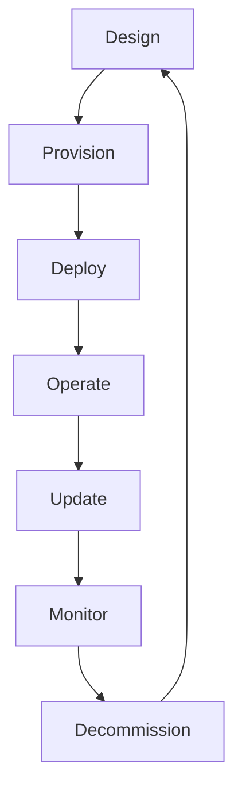

### 1.9 แบบฝึกหัด

🎯 **แบบฝึกหัด 1.1**  
อธิบายความแตกต่างระหว่าง IT, IoT และ OT พร้อมยกตัวอย่าง

🎯 **แบบฝึกหัด 1.2**  
ระบุภัยคุกคาม IoT 5 ประเภทที่เกี่ยวข้องกับองค์กรของคุณ

🎯 **แบบฝึกหัด 1.3**  
ประเมินความท้าทาย IoT Security ของทีมคุณ

🎯 **แบบฝึกหัด 1.4**  
ค้นหาเหตุการณ์ IoT Attack 1 เคส สรุปและวิเคราะห์

### 1.10 เฉลยแบบฝึกหัด

**เฉลย 1.1**
- IT: คอมพิวเตอร์สำนักงาน ข้อมูลธุรกิจ
- IoT: กล้อง CCTV, Smart Sensor, Smart Home
- OT: PLC, SCADA ในโรงงาน

**เฉลย 1.2**
1. Default Password
2. Insecure Update
3. Weak Crypto
4. Network Attack
5. Supply Chain

**เฉลย 1.4**  
Mirai 2016: Botnet จากกล้อง CCTV ที่ใช้ Default Password ทำให้ Dyn DNS ล่ม

---

## บทที่ 2 สถาปัตยกรรม IoT และ Layer Model

### 2.1 วัตถุประสงค์การเรียนรู้
1. เข้าใจ Layer Model
2. เข้าใจ Component
3. ออกแบบสถาปัตยกรรม

### 2.2 Layer Model

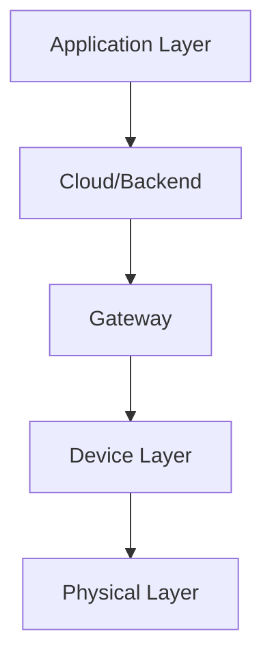

| Layer | Component | ตัวอย่าง |
|---|---|---|
| Physical | Sensor, Actuator | Temp, Motor |
| Device | MCU, Firmware | ESP32, STM32 |
| Gateway | Edge, Router | Raspberry Pi |
| Network | Protocol | MQTT, CoAP |
| Cloud | Backend | AWS IoT |
| Application | App | Mobile, Dashboard |

### 2.3 IoT Reference Architecture

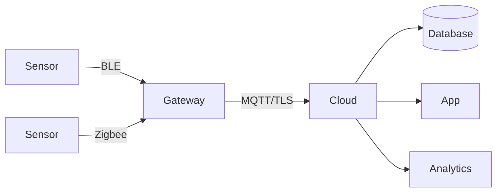

### 2.4 Edge vs Cloud

| ด้าน | Edge | Cloud |
|---|---|---|
| Latency | ต่ำ | สูง |
| Bandwidth | ประหยัด | ใช้มาก |
| Privacy | ดี | ต้องเข้ารหัส |
| Compute | จำกัด | สูง |
| Cost | ถูก | แพง |
| Security | Physical | Network |

### 2.5 Communication Patterns

| Pattern | ตัวอย่าง | ใช้เมื่อ |
|---|---|---|
| Request-Response | HTTP | ดึงข้อมูล |
| Publish-Subscribe | MQTT | Real-time |
| Streaming | WebSocket | วิดีโอ |
| Batch | FTP | สำรอง |
| Event | CoAP | Sensor |

### 2.6 SOP: ออกแบบสถาปัตยกรรม

📋 **ขั้นที่ 1: ระบุ Use Case**
📋 **ขั้นที่ 2: เลือก Protocol**
📋 **ขั้นที่ 3: ออกแบบ Layer**
📋 **ขั้นที่ 4: กำหนด Trust Boundary**
📋 **ขั้นที่ 5: Threat Model**
📋 **ขั้นที่ 6: Security Control**

### 2.7 แบบฝึกหัด

🎯 **แบบฝึกหัด 2.1**  
วาดสถาปัตยกรรมสำหรับ Smart Farm

🎯 **แบบฝึกหัด 2.2**  
ออกแบบ Trust Boundary สำหรับ Smart Home

🎯 **แบบฝึกหัด 2.3**  
เปรียบเทียบ Edge vs Cloud

### 2.8 เฉลยแบบฝึกหัด

**เฉลย 2.1**
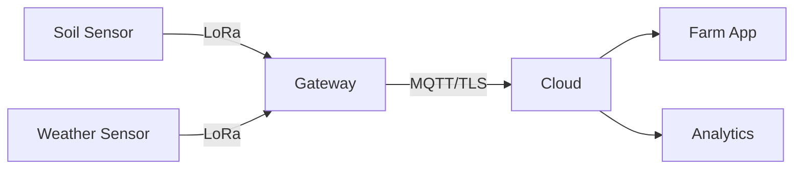

**เฉลย 2.2**
```
Trust Boundary 1: Device ↔ Gateway
Trust Boundary 2: Gateway ↔ Cloud
Trust Boundary 3: Cloud ↔ App
```

---

## บทที่ 3 Threat Landscape

### 3.1 วัตถุประสงค์การเรียนรู้
1. เข้าใจภัยคุกคาม IoT
2. รู้จัก Attack Vector
3. รู้จัก MITRE ATT&CK for ICS

### 3.2 OWASP IoT Top 10

| Rank | ความเสี่ยง |
|---|---|
| I1 | Weak/Default Password |
| I2 | Insecure Network Services |
| I3 | Insecure Ecosystem Interfaces |
| I4 | Lack of Secure Update |
| I5 | Use of Insecure Components |
| I6 | Insufficient Privacy Protection |
| I7 | Insecure Data Transfer |
| I8 | Lack of Device Management |
| I9 | Insecure Default Settings |
| I10 | Lack of Physical Hardening |

### 3.3 Attack Vectors

| Vector | ตัวอย่าง |
|---|---|
| Network | MITM, Sniffing |
| Physical | JTAG, UART |
| Firmware | Malicious Update |
| Cloud | API Exploit |
| Mobile App | Reverse Engineering |
| Supply Chain | Backdoor |
| Side Channel | Power Analysis |
| Social | Phishing |

### 3.4 MITRE ATT&CK for ICS

**Tactics**:
1. Initial Access
2. Execution
3. Persistence
4. Privilege Escalation
5. Defense Evasion
6. Discovery
7. Lateral Movement
8. Collection
9. Command and Control
10. Inhibit Response Function
11. Impair Process Control
12. Impact

### 3.5 แผนภาพ: IoT Kill Chain

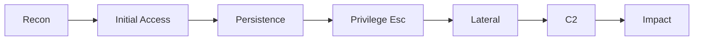

### 3.6 แบบฝึกหัด

🎯 **แบบฝึกหัด 3.1**  
Map OWASP IoT Top 10 กับ Attack Vector

🎯 **แบบฝึกหัด 3.2**  
ใช้ MITRE ATT&CK for ICS วิเคราะห์สถานการณ์

🎯 **แบบฝึกหัด 3.3**  
วาด Kill Chain สำหรับ IoT Attack

### 3.7 เฉลยแบบฝึกหัด

**เฉลย 3.1**

| OWASP | Vector |
|---|---|
| I1 Weak Password | Network |
| I2 Insecure Services | Network |
| I3 Insecure Interface | Cloud |
| I4 No Secure Update | Firmware |
| I10 No Physical | Physical |

---

# ส่วนที่ 2: ออกแบบและผลิต

---

## บทที่ 4 Secure by Design

### 4.1 วัตถุประสงค์การเรียนรู้
1. เข้าใจ Secure by Design
2. หลักการออกแบบ
3. NIST IR 8259

### 4.2 หลักการ Secure by Design

1. **Security First** – ความปลอดภัยมาก่อน
2. **Least Privilege** – สิทธิ์น้อยที่สุด
3. **Defense in Depth** – หลายชั้น
4. **Fail Securely** – Error ปลอดภัย
5. **Secure Defaults** – ค่าเริ่มต้นปลอดภัย
6. **Minimal Attack Surface** – ลดพื้นที่
7. **Update Capability** – อัปเดตได้
8. **Transparency** – เปิดเผย

### 4.3 NIST IR 8259

**6 Activities**:
1. Identify Device Capabilities
2. Identify Expected Data
3. Identify Security Requirements
4. Design Security Features
5. Test Security Features
6. Document

**6 Core Baseline Activities**:
1. Device Identification
2. Device Configuration
3. Data Protection
4. Logical Access
5. Software Update
6. Cybersecurity Event Logging

### 4.4 SOP: Secure Design

📋 **ขั้นที่ 1: Requirement**
📋 **ขั้นที่ 2: Threat Model**
📋 **ขั้นที่ 3: Design**
📋 **ขั้นที่ 4: Review**
📋 **ขั้นที่ 5: Test**
📋 **ขั้นที่ 6: Document**

### 4.5 Design Checklist

- [ ] Unique Credential
- [ ] Secure Boot
- [ ] Signed Firmware
- [ ] OTA Update
- [ ] TLS
- [ ] Least Privilege
- [ ] Log
- [ ] Physical Security
- [ ] Decommission Plan
- [ ] Documentation

### 4.6 แบบฝึกหัด

🎯 **แบบฝึกหัด 4.1**  
ออกแบบ Smart Lock ที่ Secure by Design

🎯 **แบบฝึกหัด 4.2**  
ใช้ NIST IR 8259 กับอุปกรณ์ของคุณ

🎯 **แบบฝึกหัด 4.3**  
เขียน Design Checklist

### 4.7 เฉลยแบบฝึกหัด

**เฉลย 4.1**
- Unique Credential ต่อเครื่อง
- Secure Boot
- AES-256 Communication
- OTA Update
- Lockout หลัง 5 ครั้ง
- Log การเปิด-ปิด
- Tamper Detection
- Decommission Wipe

---

## บทที่ 5 Threat Modeling สำหรับ IoT

### 5.1 วัตถุประสงค์การเรียนรู้
1. Threat Model IoT
2. STRIDE for IoT
3. Attack Tree

### 5.2 IoT Threat Model

**Elements**:
1. Device
2. Gateway
3. Network
4. Cloud
5. Mobile App
6. Update Mechanism

### 5.3 STRIDE for IoT

| Threat | ตัวอย่าง IoT | Control |
|---|---|---|
| Spoofing | ปลอม Device | Certificate |
| Tampering | แก้ Firmware | Secure Boot |
| Repudiation | ปฏิเสธคำสั่ง | Log |
| Info Disclosure | ดักข้อมูล | TLS |
| DoS | Flood Gateway | Rate Limit |
| Elevation | ยึด Device | Least Privilege |

### 5.4 Attack Tree

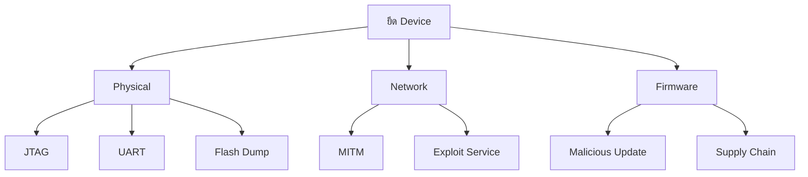

### 5.5 SOP: Threat Model

📋 **ขั้นที่ 1: วาด DFD**
📋 **ขั้นที่ 2: Trust Boundary**
📋 **ขั้นที่ 3: STRIDE**
📋 **ขั้นที่ 4: Risk**
📋 **ขั้นที่ 5: Control**
📋 **ขั้นที่ 6: Document**

### 5.6 Template: IoT Threat Model

| ID | Element | Threat | L | I | Risk | Control | Owner |
|---|---|---|---|---|---|---|---|
| T-01 | Device | Spoofing | H | H | Critical | Cert | Dev |
| T-02 | Firmware | Tampering | M | H | High | Secure Boot | Dev |
| T-03 | Network | Sniffing | H | M | High | TLS | Net |

### 5.7 แบบฝึกหัด

🎯 **แบบฝึกหัด 5.1**  
Threat Model สำหรับ Smart Camera

🎯 **แบบฝึกหัด 5.2**  
วาด Attack Tree

🎯 **แบบฝึกหัด 5.3**  
ประเมินความเสี่ยง

### 5.8 เฉลยแบบฝึกหัด

**เฉลย 5.1**

| Threat | Control |
|---|---|
| Default Password | บังคับเปลี่ยน |
| Video Sniffing | TLS |
| Firmware Tamper | Secure Boot |
| Cloud API Attack | AuthN/AuthZ |
| Physical Access | Tamper Detection |

---

## บทที่ 6 Secure Boot

### 6.1 วัตถุประสงค์การเรียนรู้
1. Secure Boot
2. Chain of Trust
3. Implementation

### 6.2 ความหมาย
Secure Boot คือกระบวนการตรวจสอบความถูกต้องของ Firmware ก่อน Boot เพื่อป้องกัน Malicious Firmware

### 6.3 Chain of Trust

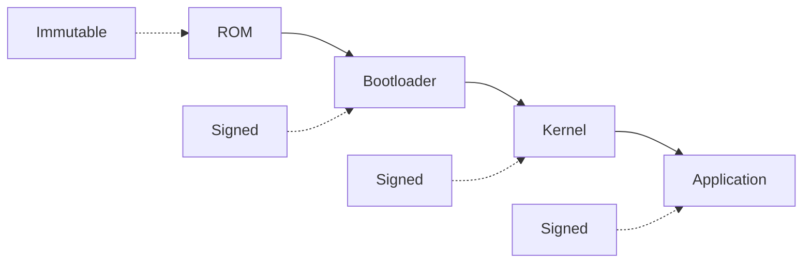

**Components**:
1. **Root of Trust (RoT)** – ROM, Immutable
2. **Bootloader** – Signed
3. **OS/Kernel** – Signed
4. **Application** – Signed

### 6.4 Hardware Security

| Component | ใช้ทำอะไร |
|---|---|
| TPM | Key Storage |
| HSM | Crypto |
| Secure Element | Key, Cert |
| TrustZone | Isolated Execution |
| eFuse | Immutable Key |

### 6.5 Implementation

**ESP32 Secure Boot**:
```bash
# Generate Key
espsecure.py generate_signing_key secure_boot_signing_key.pem

# Sign Bootloader
espsecure.py sign_data --key secure_boot_signing_key.pem \
  --version 2 bootloader.bin

# Flash
esptool.py write_flash 0x1000 bootloader-signed.bin
```

**STM32 Secure Boot**:
```c
// ตรวจสอบ Signature
bool verify_firmware(uint8_t *fw, size_t len, uint8_t *sig) {
    return crypto_verify_signature(fw, len, sig, PUBLIC_KEY);
}

void boot(void) {
    if (!verify_firmware(FW_ADDR, FW_SIZE, FW_SIG)) {
        // Halt
        while(1);
    }
    jump_to_firmware();
}
```

### 6.6 SOP: Secure Boot

📋 **ขั้นที่ 1: Root of Trust**
📋 **ขั้นที่ 2: Sign Bootloader**
📋 **ขั้นที่ 3: Sign Firmware**
📋 **ขั้นที่ 4: Verify Boot**
📋 **ขั้นที่ 5: Update**
📋 **ขั้นที่ 6: Rollback**

### 6.7 แบบฝึกหัด

🎯 **แบบฝึกหัด 6.1**  
อธิบาย Chain of Trust

🎯 **แบบฝึกหัด 6.2**  
ตั้งค่า Secure Boot บน ESP32

🎯 **แบบฝึกหัด 6.3**  
เขียน Pseudo Code Verify Firmware

### 6.8 เฉลยแบบฝึกหัด

**เฉลย 6.1**  
Chain of Trust: ROM → Bootloader → Kernel → App  
แต่ละขั้นตรวจสอบลายเซ็นของขั้นถัดไป  
ถ้าขั้นใดล้มเหลว จะหยุด Boot

---

## บทที่ 7 Firmware Signing

### 7.1 วัตถุประสงค์การเรียนรู้
1. Firmware Signing
2. Key Management
3. Verification

### 7.2 ความหมาย
Firmware Signing คือการเซ็นชื่อ Firmware ด้วย Private Key เพื่อให้ Device ตรวจสอบด้วย Public Key

### 7.3 Algorithm

| Algorithm | ใช้เมื่อ |
|---|---|
| RSA-2048+ | ทั่วไป |
| ECDSA P-256 | Resource จำกัด |
| Ed25519 | ทันสมัย |

### 7.4 Signing Process

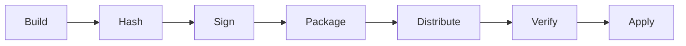

### 7.5 Sign Script

**Python (ECDSA)**:
```python
from cryptography.hazmat.primitives import hashes, serialization
from cryptography.hazmat.primitives.asymmetric import ec
import hashlib

# Load Private Key
with open('private.pem', 'rb') as f:
    private_key = serialization.load_pem_private_key(f.read(), password=None)

# Load Firmware
with open('firmware.bin', 'rb') as f:
    firmware = f.read()

# Hash
digest = hashlib.sha256(firmware).digest()

# Sign
signature = private_key.sign(digest, ec.ECDSA(hashes.SHA256()))

# Save
with open('firmware.sig', 'wb') as f:
    f.write(signature)

print(f"Signed: {len(signature)} bytes")
```

**Verify (C)**:
```c
#include <mbedtls/pk.h>
#include <mbedtls/sha256.h>

int verify_firmware(const uint8_t *fw, size_t fw_len,
                    const uint8_t *sig, size_t sig_len,
                    const uint8_t *pub_key, size_t pub_key_len) {
    unsigned char hash[32];
    mbedtls_sha256(fw, fw_len, hash, 0);
    
    mbedtls_pk_context pk;
    mbedtls_pk_init(&pk);
    mbedtls_pk_parse_public_key(&pk, pub_key, pub_key_len);
    
    int ret = mbedtls_pk_verify(&pk, MBEDTLS_MD_SHA256,
                                 hash, 32, sig, sig_len);
    mbedtls_pk_free(&pk);
    return ret;
}
```

### 7.6 Key Management

**ข้อกำหนด**:
1. Private Key เก็บใน HSM
2. Backup อย่างปลอดภัย
3. Rotate ทุก 1-2 ปี
4. แยก Key ตาม Product
5. Audit

### 7.7 SOP: Firmware Signing

📋 **ขั้นที่ 1: Generate Key**
📋 **ขั้นที่ 2: เก็บ Private Key**
📋 **ขั้นที่ 3: Sign Firmware**
📋 **ขั้นที่ 4: Distribute**
📋 **ขั้นที่ 5: Verify**
📋 **ขั้นที่ 6: Audit**

### 7.8 แบบฝึกหัด

🎯 **แบบฝึกหัด 7.1**  
Generate Key สำหรับ Firmware Signing

🎯 **แบบฝึกหัด 7.2**  
เขียน Script Sign Firmware

🎯 **แบบฝึกหัด 7.3**  
เขียน Code Verify

### 7.9 เฉลยแบบฝึกหัด

**เฉลย 7.1**
```bash
openssl ecparam -name prime256v1 -genkey -noout -out private.pem
openssl ec -in private.pem -pubout -out public.pem
```

---

## บทที่ 8 Identity และ Credential

### 8.1 วัตถุประสงค์การเรียนรู้
1. Identity
2. Credential
3. Certificate

### 8.2 ประเภท Credential

| ประเภท | ตัวอย่าง | ความปลอดภัย |
|---|---|---|
| Password | User/Pass | ต่ำ |
| API Key | Static | กลาง |
| Certificate | X.509 | สูง |
| Token | JWT | กลาง |
| Hardware Key | Secure Element | สูงสุด |

### 8.3 Unique Credential

**⚠️ ไม่ปลอดภัย**:
```
ทุกเครื่องใช้: admin/admin
```

**✅ ปลอดภัย**:
```
แต่ละเครื่องมี:
- Device ID (Unique)
- Certificate (Unique)
- Private Key (Unique, ใน Secure Element)
```

### 8.4 Certificate Provisioning

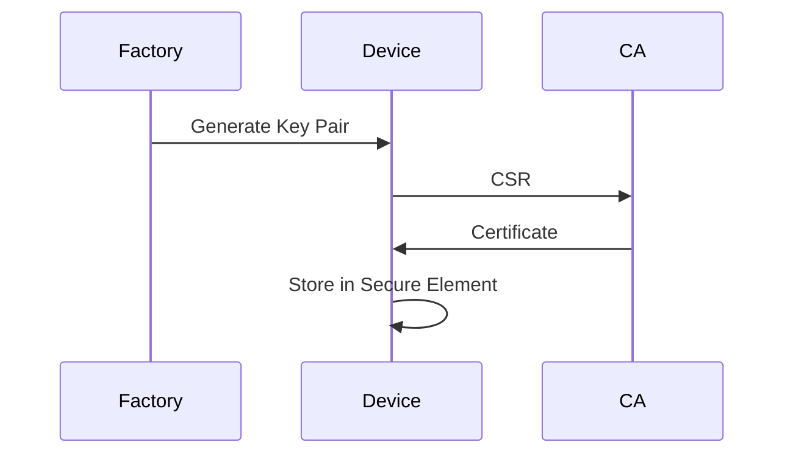

### 8.5 Certificate Management

**X.509 Certificate**:
```
Subject: CN=device-001, O=MyCompany, C=TH
Issuer: CN=IoT-CA, O=MyCompany
Validity: 2026-01-01 to 2027-01-01
Public Key: ECDSA P-256
Extensions:
  - keyUsage: digitalSignature
  - extendedKeyUsage: clientAuth
```

**Rotate**:
- ก่อนหมดอายุ 30 วัน
- ใช้ EST (Enrollment over Secure Transport)
- ใช้ SCEP

### 8.6 Secure Element

**ATECC608A**:
```c
#include "atca.h"

// Init
ATCAPacket packet;
atca_init(&packet);

// Generate Key
atca_genkey(&packet, 0, &key);

// Sign
atca_sign(&packet, 0, hash, &signature);

// Store Cert
atca_write(&packet, CERT_SLOT, cert, cert_len);
```

### 8.7 SOP: Credential Management

📋 **ขั้นที่ 1: Unique Credential ต่อเครื่อง**
📋 **ขั้นที่ 2: Secure Element**
📋 **ขั้นที่ 3: Certificate**
📋 **ขั้นที่ 4: Rotate**
📋 **ขั้นที่ 5: Revoke**
📋 **ขั้นที่ 6: Audit**

### 8.8 แบบฝึกหัด

🎯 **แบบฝึกหัด 8.1**  
ออกแบบ Credential Management สำหรับ 10,000 Device

🎯 **แบบฝึกหัด 8.2**  
Generate Certificate สำหรับ Device

🎯 **แบบฝึกหัด 8.3**  
เขียน Script Rotate Certificate

### 8.9 เฉลยแบบฝึกหัด

**เฉลย 8.2**
```bash
# Generate CSR
openssl req -new -newkey ec -pkeyopt ec_paramgen_curve:prime256v1 \
  -nodes -keyout device.key -out device.csr \
  -subj "/CN=device-001/O=MyCompany"

# Sign ด้วย CA
openssl x509 -req -in device.csr -CA ca.crt -CAkey ca.key \
  -CAcreateserial -out device.crt -days 365
```

---

# ส่วนที่ 3: การสื่อสาร

---

## บทที่ 9 TLS สำหรับ IoT

### 9.1 วัตถุประสงค์การเรียนรู้
1. TLS สำหรับ IoT
2. Mutual TLS
3. Certificate Pinning

### 9.2 TLS Version

| Version | สถานะ |
|---|---|
| SSL 3.0 | ❌ ห้ามใช้ |
| TLS 1.0 | ❌ ห้ามใช้ |
| TLS 1.1 | ❌ ห้ามใช้ |
| TLS 1.2 | ✅ ใช้ได้ |
| TLS 1.3 | ✅ แนะนำ |

### 9.3 Cipher Suites

**✅ แนะนำ**:
```
TLS_AES_128_GCM_SHA256
TLS_AES_256_GCM_SHA384
TLS_CHACHA20_POLY1305_SHA256
ECDHE-ECDSA-AES256-GCM-SHA384
ECDHE-RSA-AES256-GCM-SHA384
```

**❌ ห้ามใช้**:
```
RC4, 3DES, DES, MD5, SHA-1
NULL, EXPORT, Anonymous
```

### 9.4 Mutual TLS (mTLS)

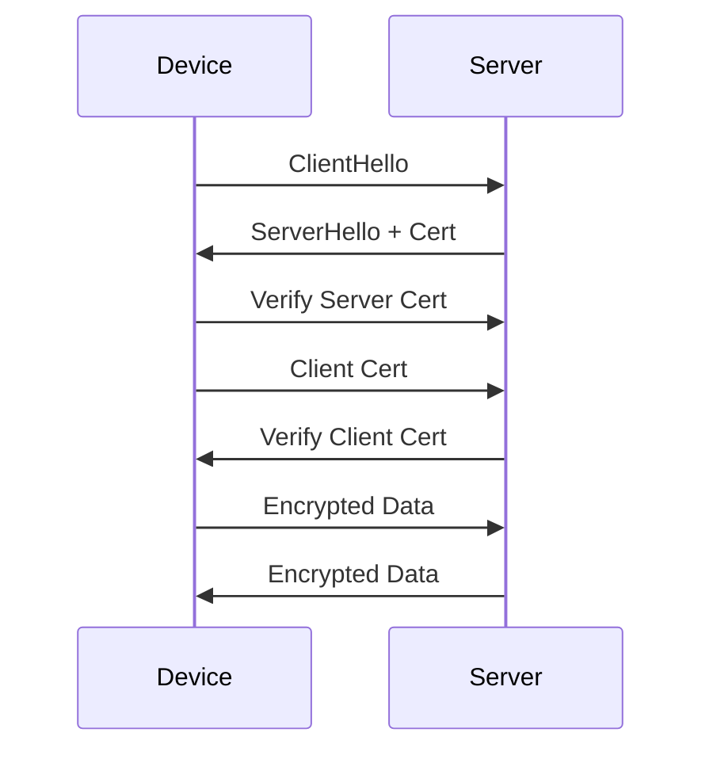

**Server Config (Mosquitto)**:
```conf
listener 8883
cafile /etc/mosquitto/ca.crt
certfile /etc/mosquitto/server.crt
keyfile /etc/mosquitto/server.key
require_certificate true
use_identity_as_username true
```

**Client Config**:
```c
#include <mbedtls/ssl.h>

mbedtls_ssl_conf_ca_chain(&conf, &ca_chain, NULL);
mbedtls_ssl_conf_own_cert(&conf, &client_cert, &client_key);
mbedtls_ssl_conf_authmode(&conf, MBEDTLS_SSL_VERIFY_REQUIRED);
```

### 9.5 Certificate Pinning

**Pin Certificate**:
```c
const uint8_t PINNED_CERT_HASH[32] = {
    0x12, 0x34, 0x56, 0x78, ...
};

bool verify_pinned(const uint8_t *cert, size_t cert_len) {
    uint8_t hash[32];
    mbedtls_sha256(cert, cert_len, hash, 0);
    return memcmp(hash, PINNED_CERT_HASH, 32) == 0;
}
```

**Pin Public Key**:
```c
const uint8_t PINNED_PUBKEY_HASH[32] = { ... };

bool verify_pubkey_pin(mbedtls_x509_crt *cert) {
    uint8_t hash[32];
    mbedtls_sha256(cert->pk_raw.p, cert->pk_raw.len, hash, 0);
    return memcmp(hash, PINNED_PUBKEY_HASH, 32) == 0;
}
```

### 9.6 TLS Best Practices

1. **TLS 1.2+**
2. **Strong Cipher**
3. **Certificate Validation**
4. **Hostname Verification**
5. **Certificate Pinning**
6. **OCSP Stapling**
7. **Forward Secrecy**

### 9.7 SOP: TLS

📋 **ขั้นที่ 1: เลือก TLS Version**
📋 **ขั้นที่ 2: เลือก Cipher**
📋 **ขั้นที่ 3: Certificate**
📋 **ขั้นที่ 4: Pinning**
📋 **ขั้นที่ 5: Rotate**
📋 **ขั้นที่ 6: Monitor**

### 9.8 แบบฝึกหัด

🎯 **แบบฝึกหัด 9.1**  
ตั้งค่า Mosquitto TLS

🎯 **แบบฝึกหัด 9.2**  
เขียน Code TLS Client

🎯 **แบบฝึกหัด 9.3**  
Implement Certificate Pinning

### 9.9 เฉลยแบบฝึกหัด

**เฉลย 9.1**
```conf
listener 8883
cafile /etc/mosquitto/ca.crt
certfile /etc/mosquitto/server.crt
keyfile /etc/mosquitto/server.key
require_certificate true
```

---

## บทที่ 10 MQTT Security

### 10.1 วัตถุประสงค์การเรียนรู้
1. MQTT
2. Security
3. Topic Design
4. ACL

### 10.2 MQTT Overview

| องค์ประกอบ | หน้าที่ |
|---|---|
| Broker | ศูนย์กลาง |
| Publisher | ส่ง |
| Subscriber | รับ |
| Topic | หัวข้อ |
| QoS | ความเชื่อมั่น |

### 10.3 QoS Levels

| QoS | ความหมาย |
|---|---|
| 0 | At most once |
| 1 | At least once |
| 2 | Exactly once |

### 10.4 ภัยคุกคาม MQTT

| ภัยคุกคาม | ป้องกัน |
|---|---|
| ไม่มี Auth | Username/Cert |
| ไม่มี Encryption | TLS |
| Wildcard `#` | ACL |
| Public Broker | Private |
| Hardcode Credential | Provision |
| Replay | Nonce, Timestamp |

### 10.5 Topic Design

**✅ แนะนำ**:
```
device/{device_id}/telemetry
device/{device_id}/command
device/{device_id}/status
device/{device_id}/config
fleet/{fleet_id}/broadcast
```

**❌ ห้าม**:
```
data/#  (Wildcard)
all
public
```

### 10.6 Mosquitto Config

```conf
# /etc/mosquitto/mosquitto.conf

listener 8883
cafile /etc/mosquitto/ca.crt
certfile /etc/mosquitto/server.crt
keyfile /etc/mosquitto/server.key
require_certificate true
use_identity_as_username true

allow_anonymous false
password_file /etc/mosquitto/passwd
acl_file /etc/mosquitto/acl

# Rate Limit
max_connections 1000
max_queued_messages 100
message_size_limit 1048576
```

**ACL**:
```
# Device อ่าน/เขียนเฉพาะ Topic ของตัวเอง
user device001
topic readwrite device/device001/#

# Backend อ่านทุก Device เขียน Command
user backend
topic read device/+/telemetry
topic write device/+/command
topic read device/+/status

# Admin
user admin
topic readwrite #
```

### 10.7 Python MQTT Client (mTLS)

```python
import paho.mqtt.client as mqtt
import ssl

def on_connect(client, userdata, flags, rc):
    print(f"Connected: {rc}")
    client.subscribe("device/device001/command", qos=1)

def on_message(client, userdata, msg):
    print(f"{msg.topic}: {msg.payload.decode()}")

client = mqtt.Client(client_id="device001")
client.tls_set(
    ca_certs="/etc/ssl/ca.crt",
    certfile="/etc/ssl/device001.crt",
    keyfile="/etc/ssl/device001.key",
    tls_version=ssl.PROTOCOL_TLSv1_2
)
client.tls_insecure_set(False)
client.on_connect = on_connect
client.on_message = on_message
client.connect("broker.example.com,mycompany.com,gmail.com", 8883)
client.loop_forever()
```

### 10.8 C Client (mbedTLS)

```c
#include "mqtt_client.h"
#include "mbedtls/ssl.h"

esp_mqtt_client_config_t mqtt_cfg = {
    .broker.address.uri = "mqtts://broker.example.com,mycompany.com,gmail.com:8883",
    .broker.verification.certificate = (const char *)server_ca_pem,
    .credentials.authentication.certificate = (const char *)client_cert_pem,
    .credentials.authentication.key = (const char *)client_key_pem,
};

esp_mqtt_client_handle_t client = esp_mqtt_client_init(&mqtt_cfg);
esp_mqtt_client_start(client);

// Publish
esp_mqtt_client_publish(client, "device/device001/telemetry",
                        payload, 0, 1, 0);

// Subscribe
esp_mqtt_client_subscribe(client, "device/device001/command", 1);
```

### 10.9 SOP: MQTT Security

📋 **ขั้นที่ 1: TLS**
📋 **ขั้นที่ 2: Authentication**
📋 **ขั้นที่ 3: ACL**
📋 **ขั้นที่ 4: Topic Design**
📋 **ขั้นที่ 5: Rate Limit**
📋 **ขั้นที่ 6: Monitor**

### 10.10 แบบฝึกหัด

🎯 **แบบฝึกหัด 10.1**  
ออกแบบ Topic สำหรับ Smart Farm

🎯 **แบบฝึกหัด 10.2**  
เขียน ACL ของ Mosquitto

🎯 **แบบฝึกหัด 10.3**  
เขียน Python MQTT Client

🎯 **แบบฝึกหัด 10.4**  
อธิบายว่าทำไม Wildcard `#` เป็นความเสี่ยง

### 10.11 เฉลยแบบฝึกหัด

**เฉลย 10.1**
```
farm/{farm_id}/gateway/{gw_id}/status
farm/{farm_id}/sensor/{sensor_id}/temperature
farm/{farm_id}/sensor/{sensor_id}/humidity
farm/{farm_id}/command/{gw_id}
farm/{farm_id}/alert
```

**เฉลย 10.2**
```
user sensor001
topic write farm/farm01/sensor/sensor001/#
topic read farm/farm01/command/sensor001
```

**เฉลย 10.4**  
Wildcard `#` = ทุก Topic ถ้า Subscriber ใช้ `#` จะได้ข้อมูลทั้งหมด  
ถ้า Attacker Subscribe `#` จะดักข้อมูลทั้งหมด → ต้องจำกัด ACL

---

## บทที่ 11 CoAP Security

### 11.1 วัตถุประสงค์การเรียนรู้
1. CoAP
2. DTLS
3. OSCORE

### 11.2 CoAP Overview

| ด้าน | CoAP | HTTP |
|---|---|---|
| Transport | UDP | TCP |
| ขนาด | เล็ก | ใหญ่ |
| Latency | ต่ำ | สูง |
| Resource | น้อย | มาก |
| Security | DTLS | TLS |

### 11.3 DTLS

**DTLS = Datagram TLS**

**Config (libcoap)**:
```c
#include <coap3/coap.h>

coap_context_t *ctx = coap_new_context(NULL);
coap_dtls_pki_t dtls_pki = {
    .version = COAP_DTLS_PKI_SETUP_VERSION,
    .verify_peer_cert = 1,
    .check_common_ca = 1,
    .allow_self_signed = 0,
    .verify_peer_cn = 1,
    .pki_key = {
        .key_type = COAP_PKI_KEY_PEM,
        .key.pem = {
            .ca_file = "ca.pem",
            .public_cert = "client.pem",
            .private_key = "client.key"
        }
    }
};
coap_dtls_context_set_pki(ctx, &dtls_pki, COAP_DTLS_ROLE_CLIENT);
```

### 11.4 OSCORE

**OSCORE = Object Security for Constrained RESTful Environments**

**คุณสมบัติ**:
- End-to-End Security
- ทำงานที่ Application Layer
- ป้องกัน Proxy
- ใช้ CBOR

### 11.5 SOP: CoAP Security

📋 **ขั้นที่ 1: DTLS**
📋 **ขั้นที่ 2: Certificate**
📋 **ขั้นที่ 3: OSCORE**
📋 **ขั้นที่ 4: Rate Limit**
📋 **ขั้นที่ 5: Monitor**

### 11.6 แบบฝึกหัด

🎯 **แบบฝึกหัด 11.1**  
ตั้งค่า CoAP DTLS

🎯 **แบบฝึกหัด 11.2**  
เปรียบเทียบ DTLS vs OSCORE

### 11.7 เฉลยแบบฝึกหัด

**เฉลย 11.2**

| ด้าน | DTLS | OSCORE |
|---|---|---|
| Layer | Transport | Application |
| Proxy | ปัญหา | ทำงานได้ |
| End-to-End | ไม่ | ใช่ |
| Overhead | ต่ำ | กลาง |

---

## บทที่ 12 BLE/Zigbee/LoRa Security

### 12.1 วัตถุประสงค์การเรียนรู้
1. BLE Security
2. Zigbee Security
3. LoRa Security

### 12.2 BLE Security

**BLE Pairing**:
| Method | ความปลอดภัย |
|---|---|
| Just Works | ❌ ต่ำ |
| Passkey | ✅ กลาง |
| Numeric Comparison | ✅ กลาง |
| OOB | ✅ สูง |
| LE Secure Connections | ✅ สูง |

**Config (ESP32)**:
```c
esp_ble_auth_req_t auth_req = ESP_LE_AUTH_REQ_SC_MITM_BOND;
esp_ble_io_cap_t iocap = ESP_IO_CAP_OUT;

esp_ble_gap_set_security_param(ESP_BLE_SM_AUTHEN_REQ_MODE,
                                &auth_req, sizeof(uint8_t));
esp_ble_gap_set_security_param(ESP_BLE_SM_IOCAP_MODE,
                                &iocap, sizeof(uint8_t));
```

### 12.3 Zigbee Security

**Security Levels**:
- None
- MIC-32
- MIC-64
- MIC-128
- ENC
- ENC-MIC-32
- ENC-MIC-64
- ENC-MIC-128

**Network Key**:
- ส่งผ่าน Trust Center
- Rotate สม่ำเสมอ
- ห้าม Hardcode

**Install Code**:
```
Unique per device
ใช้ตอน Join
```

### 12.4 LoRa Security

**LoRaWAN Security**:
- **NwkSKey** – Network Session Key
- **AppSKey** – Application Session Key
- **JoinEUI** – Join Server
- **DevEUI** – Device ID

**Activation**:
- **OTAA** (Over-The-Air Activation) – แนะนำ
- **ABP** (Activation By Personalization) – ไม่แนะนำ

**Config (LoRaWAN)**:
```c
static const uint8_t dev_eui[] = { 0x00, 0x11, ... };
static const uint8_t app_eui[] = { 0x70, 0xB3, ... };
static const uint8_t app_key[] = { 0x2B, 0x7E, ... };

lmic_set_otaa(1);
lmic_set_artesian(1);
LMIC_setSession(0x1, devaddr, nwkskey, appskey);
```

### 12.5 SOP: Wireless IoT Security

📋 **ขั้นที่ 1: เลือก Protocol**
📋 **ขั้นที่ 2: Pairing ที่ปลอดภัย**
📋 **ขั้นที่ 3: Key Management**
📋 **ขั้นที่ 4: Rotate**
📋 **ขั้นที่ 5: Monitor**

### 12.6 แบบฝึกหัด

🎯 **แบบฝึกหัด 12.1**  
ตั้งค่า BLE Pairing ที่ปลอดภัย

🎯 **แบบฝึกหัด 12.2**  
ตั้งค่า LoRaWAN OTAA

🎯 **แบบฝึกหัด 12.3**  
เปรียบเทียบ BLE/Zigbee/LoRa

### 12.7 เฉลยแบบฝึกหัด

**เฉลย 12.3**

| ด้าน | BLE | Zigbee | LoRa |
|---|---|---|---|
| Range | 10m | 100m | 10km |
| Power | ต่ำ | ต่ำ | ต่ำมาก |
| Data Rate | 1 Mbps | 250 kbps | 50 kbps |
| Security | LE SC | AES-128 | AES-128 |
| Use | Wearable | Home | Smart City |

---

# ส่วนที่ 4: ปฏิบัติการ

---

## บทที่ 13 OTA Update

### 13.1 วัตถุประสงค์การเรียนรู้
1. OTA Update
2. Signed Firmware
3. Rollback

### 13.2 OTA Process

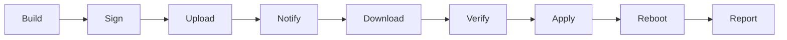

### 13.3 Signed OTA

**ESP32 OTA**:
```c
#include "esp_ota_ops.h"
#include "esp_https_ota.h"

esp_http_client_config_t config = {
    .url = "https://firmware.example.com,mycompany.com,gmail.com/fw.bin",
    .cert_pem = server_cert_pem,
};

esp_https_ota_config_t ota_config = {
    .http_config = &config,
};

esp_err_t ret = esp_https_ota(&ota_config);
if (ret == ESP_OK) {
    esp_restart();
}
```

**Verify Signature ก่อน Apply**:
```c
bool verify_ota(const uint8_t *fw, size_t len, const uint8_t *sig) {
    return crypto_verify(fw, len, sig, PUBLIC_KEY) == 0;
}
```

### 13.4 A/B Partition

**Layout**:
```
+------------------+
| Bootloader       |
+------------------+
| Partition A      | ← Running
+------------------+
| Partition B      | ← Update
+------------------+
| OTA Data         |
+------------------+
```

**Swap**:
```c
const esp_partition_t *next = esp_ota_get_next_update_partition(NULL);
esp_ota_begin(next, OTA_SIZE_UNKNOWN, &handle);
esp_ota_write(handle, data, len);
esp_ota_end(handle);
esp_ota_set_boot_partition(next);
esp_restart();
```

### 13.5 Rollback

**Anti-Rollback**:
```c
// เก็บ Version ใน eFuse
uint32_t current_version = esp_efuse_read_field_blob(EFUSE_VERSION);
if (new_version < current_version) {
    // ปฏิเสธ
    return ESP_ERR_INVALID_VERSION;
}
```

**Auto Rollback**:
```c
// ถ้า Boot ไม่สำเร็จ 3 ครั้ง → Rollback
esp_ota_mark_app_invalid_rollback_and_reboot();
```

### 13.6 SOP: OTA

📋 **ขั้นที่ 1: Build**
📋 **ขั้นที่ 2: Sign**
📋 **ขั้นที่ 3: Test**
📋 **ขั้นที่ 4: Staged Rollout**
📋 **ขั้นที่ 5: Verify**
📋 **ขั้นที่ 6: Rollback Plan**
📋 **ขั้นที่ 7: Monitor**

### 13.7 แบบฝึกหัด

🎯 **แบบฝึกหัด 13.1**  
ออกแบบ OTA Process

🎯 **แบบฝึกหัด 13.2**  
เขียน Code OTA

🎯 **แบบฝึกหัด 13.3**  
ออกแบบ Rollback Strategy

### 13.8 เฉลยแบบฝึกหัด

**เฉลย 13.1**
1. Build Firmware
2. Sign ด้วย Private Key
3. Upload ไป CDN
4. Notify Device
5. Device Download
6. Verify Signature
7. Write ไป Partition B
8. Reboot
9. Verify
10. Mark Valid หรือ Rollback

---

## บทที่ 14 Network Isolation

### 14.1 วัตถุประสงค์การเรียนรู้
1. Network Isolation
2. VLAN
3. Firewall Rule

### 14.2 Isolation Strategy

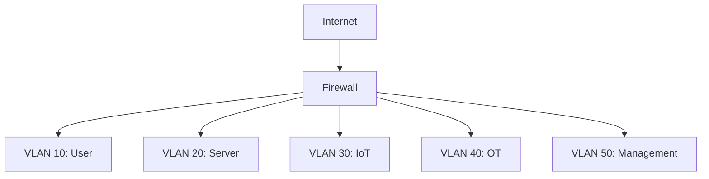

### 14.3 IoT VLAN

**Rules**:
1. IoT → Internet เฉพาะที่จำเป็น
2. IoT → Server เฉพาะ MQTT/API
3. IoT → IoT ไม่ได้ (หรือจำกัด)
4. IoT → Management ไม่ได้
5. User → IoT ไม่ได้

### 14.4 Firewall Rule

```
# IoT → MQTT Broker
Source: 10.30.0.0/24
Destination: 10.20.0.10
Port: 8883
Action: Allow

# IoT → Internet (NTP)
Source: 10.30.0.0/24
Destination: Any
Port: 123
Action: Allow

# IoT → Any
Source: 10.30.0.0/24
Destination: Any
Action: Deny
Log: Yes
```

### 14.5 Micro-segmentation

**สำหรับ OT**:
- แยกแต่ละ Production Line
- แยก Safety System
- แยก Engineering Workstation
- แยก Historian

### 14.6 SOP: Network Isolation

📋 **ขั้นที่ 1: ระบุ Zone**
📋 **ขั้นที่ 2: กำหนด Trust**
📋 **ขั้นที่ 3: Firewall Rule**
📋 **ขั้นที่ 4: Test**
📋 **ขั้นที่ 5: Monitor**
📋 **ขั้นที่ 6: Review**

### 14.7 แบบฝึกหัด

🎯 **แบบฝึกหัด 14.1**  
ออกแบบ Network Isolation สำหรับ Smart Factory

🎯 **แบบฝึกหัด 14.2**  
เขียน Firewall Rule

🎯 **แบบฝึกหัด 14.3**  
ออกแบบ Micro-segmentation

### 14.8 เฉลยแบบฝึกหัด

**เฉลย 14.1**
```
VLAN 10: Office
VLAN 20: Server
VLAN 30: IoT Sensor
VLAN 40: PLC/SCADA
VLAN 50: Safety System
VLAN 60: Management
```

---

## บทที่ 15 Monitoring และ Detection

### 15.1 วัตถุประสงค์การเรียนรู้
1. Monitoring IoT
2. Detection
3. Anomaly

### 15.2 Metrics ที่ควร Monitor

| Metric | ปกติ | ผิดปกติ |
|---|---|---|
| CPU | < 50% | > 90% |
| Memory | < 70% | > 90% |
| Network | < 1 Mbps | > 10 Mbps |
| Connections | < 10 | > 100 |
| Failed Login | 0 | > 5 |
| Firmware | Version ปัจจุบัน | เก่า |

### 15.3 Detection Rules

| Rule | Trigger | Severity |
|---|---|---|
| Failed Login | > 5 in 5 min | Medium |
| New Connection | From Unknown IP | High |
| Data Spike | > 3x Baseline | Medium |
| Firmware Change | Any | High |
| Port Scan | > 10 ports | High |
| C2 Beacon | Regular Interval | Critical |

### 15.4 Syslog จาก IoT

```c
void log_event(const char *event, const char *detail) {
    char buf[256];
    snprintf(buf, sizeof(buf),
             "<134>%s device=%s event=%s detail=%s",
             timestamp(), DEVICE_ID, event, detail);
    send_udp(SYSLOG_SERVER, 514, buf, strlen(buf));
}
```

### 15.5 Anomaly Detection

```python
import pandas as pd
from sklearn.ensemble import IsolationForest

# โหลดข้อมูล
df = pd.read_csv('iot_traffic.csv')
X = df[['bytes_in', 'bytes_out', 'connections', 'cpu']]

# Train
model = IsolationForest(contamination=0.05)
model.fit(X)

# Predict
df['anomaly'] = model.predict(X)
anomalies = df[df['anomaly'] == -1]
print(anomalies)
```

### 15.6 SOP: Monitoring

📋 **ขั้นที่ 1: ระบุ Metrics**
📋 **ขั้นที่ 2: Collect**
📋 **ขั้นที่ 3: Baseline**
📋 **ขั้นที่ 4: Alert**
📋 **ขั้นที่ 5: Respond**
📋 **ขั้นที่ 6: Review**

### 15.7 แบบฝึกหัด

🎯 **แบบฝึกหัด 15.1**  
ออกแบบ Monitoring สำหรับ Smart Building

🎯 **แบบฝึกหัด 15.2**  
เขียน Detection Rule

🎯 **แบบฝึกหัด 15.3**  
ใช้ Isolation Forest หา Anomaly

### 15.8 เฉลยแบบฝึกหัด

**เฉลย 15.1**
1. CPU/Memory
2. Network Traffic
3. Connections
4. Failed Login
5. Firmware Version
6. Sensor Reading
7. Uptime
8. Alert

---

## บทที่ 16 Incident Response IoT

### 16.1 วัตถุประสงค์การเรียนรู้
1. IR สำหรับ IoT
2. Playbook
3. RCA

### 16.2 IR Lifecycle

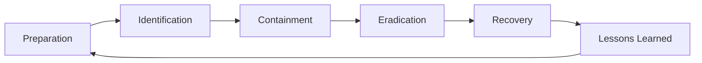

### 16.3 IoT Incident Types

| ประเภท | ตัวอย่าง |
|---|---|
| Compromise | Device ถูกยึด |
| Malware | Botnet |
| Data Leak | Sensor Data |
| DoS | Flood |
| Physical | Tamper |
| Update | Malicious Firmware |

### 16.4 Playbook: Device Compromise

📋 **ขั้นที่ 1: Detect**
📋 **ขั้นที่ 2: Isolate**
📋 **ขั้นที่ 3: Capture**
📋 **ขั้นที่ 4: Analyze**
📋 **ขั้นที่ 5: Eradicate**
📋 **ขั้นที่ 6: Recover**
📋 **ขั้นที่ 7: RCA**

### 16.5 Playbook: Botnet Recruitment

📋 **ขั้นที่ 1: Detect**
📋 **ขั้นที่ 2: Block C2**
📋 **ขั้นที่ 3: Isolate**
📋 **ขั้นที่ 4: Patch**
📋 **ขั้นที่ 5: Monitor**
📋 **ขั้นที่ 6: Report**

### 16.6 SOP: IoT IR

📋 **ขั้นที่ 1: Preparation**
1. ทีม
2. Tools
3. Playbook
4. ซ้อม

📋 **ขั้นที่ 2: Identification**
1. Alert
2. Verify
3. Severity

📋 **ขั้นที่ 3: Containment**
1. Isolate
2. Block
3. Capture

📋 **ขั้นที่ 4: Eradication**
1. Patch
2. Reset
3. Verify

📋 **ขั้นที่ 5: Recovery**
1. Restore
2. Monitor

📋 **ขั้นที่ 6: Lessons Learned**
1. RCA
2. CAPA

### 16.7 Template: IoT Incident

| หัวข้อ | รายละเอียด |
|---|---|
| Incident ID | |
| Device ID | |
| ประเภท | |
| เวลา | |
| หลักฐาน | |
| การตอบสนอง | |
| สถานะ | |

### 16.8 แบบฝึกหัด

🎯 **แบบฝึกหัด 16.1**  
เขียน Playbook สำหรับ Device Compromise

🎯 **แบบฝึกหัด 16.2**  
เขียน RCA Report

🎯 **แบบฝึกหัด 16.3**  
ออกแบบ IR Team

### 16.9 เฉลยแบบฝึกหัด

**เฉลย 16.2**
- Incident: Device ถูกยึด
- 5 Whys: Default Password → ไม่เปลี่ยน → ไม่มี Provision Process → ไม่มี Policy → ไม่มี Awareness
- Root Cause: ไม่มี Provision Process
- CAPA: Provision Process, Unique Credential, Training

---

# ส่วนที่ 5: OT/ICS

---

## บทที่ 17 Purdue Model

### 17.1 วัตถุประสงค์การเรียนรู้
1. Purdue Model
2. Levels
3. Security Zones

### 17.2 Purdue Model

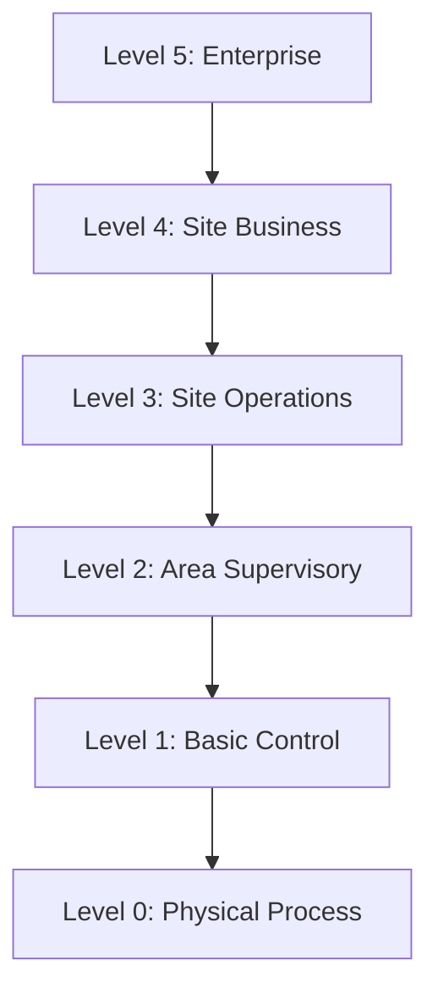

| Level | ตัวอย่าง |
|---|---|
| 5 | ERP |
| 4 | Email, Internet |
| 3.5 | DMZ |
| 3 | Historian, MES |
| 2 | HMI, SCADA |
| 1 | PLC, RTU |
| 0 | Sensor, Actuator |

### 17.3 Security Zones

**IEC 62443 Zones**:
- Enterprise Zone (L4-5)
- DMZ (L3.5)
- Manufacturing Zone (L0-3)
- Safety Zone

**Conduits**:
- ระหว่าง Zone
- ควบคุมด้วย Firewall

### 17.4 SOP: Purdue Model

📋 **ขั้นที่ 1: ระบุ Level**
📋 **ขั้นที่ 2: แบ่ง Zone**
📋 **ขั้นที่ 3: Conduit**
📋 **ขั้นที่ 4: Firewall**
📋 **ขั้นที่ 5: Monitor**
📋 **ขั้นที่ 6: Review**

### 17.5 แบบฝึกหัด

🎯 **แบบฝึกหัด 17.1**  
วาด Purdue Model สำหรับโรงงาน

🎯 **แบบฝึกหัด 17.2**  
ออกแบบ Zone และ Conduit

🎯 **แบบฝึกหัด 17.3**  
เขียน Firewall Rule ระหว่าง Zone

### 17.6 เฉลยแบบฝึกหัด

**เฉลย 17.2**
```
Zone 1: Enterprise (L4-5)
Zone 2: DMZ (L3.5)
Zone 3: Manufacturing (L0-3)
Zone 4: Safety

Conduit 1: Enterprise ↔ DMZ
Conduit 2: DMZ ↔ Manufacturing
```

---

## บทที่ 18 Modbus/DNP3 Security

### 18.1 วัตถุประสงค์การเรียนรู้
1. Modbus
2. DNP3
3. Security

### 18.2 Modbus

**ไม่มี Authentication ในตัว**:
- ต้องใช้ Network Isolation
- ใช้ Modbus/TCP Security (TLS)
- ใช้ Data Diode

**Modbus/TCP Security**:
```c
// ใช้ TLS
mb_tls_config_t tls = {
    .ca_file = "ca.pem",
    .cert_file = "client.pem",
    .key_file = "client.key"
};
mb_set_tls(&ctx, &tls);
```

### 18.3 DNP3

**Secure Authentication**:
- Challenge-Response
- HMAC
- Key Management

**Config**:
```xml
<DNP3>
  <SecureAuth>
    <Enabled>true</Enabled>
    <UpdateKey>...</UpdateKey>
    <ChallengeTimeout>60</ChallengeTimeout>
  </SecureAuth>
</DNP3>
```

### 18.4 SOP: Modbus/DNP3 Security

📋 **ขั้นที่ 1: Network Isolation**
📋 **ขั้นที่ 2: TLS**
📋 **ขั้นที่ 3: Authentication**
📋 **ขั้นที่ 4: Monitor**
📋 **ขั้นที่ 5: Review**

### 18.5 แบบฝึกหัด

🎯 **แบบฝึกหัด 18.1**  
อธิบายความเสี่ยง Modbus

🎯 **แบบฝึกหัด 18.2**  
ตั้งค่า Modbus/TCP Security

🎯 **แบบฝึกหัด 18.3**  
ตั้งค่า DNP3 Secure Auth

### 18.6 เฉลยแบบฝึกหัด

**เฉลย 18.1**
- ไม่มี Authentication
- ไม่มี Encryption
- ใครก็ส่งคำสั่งได้
- ป้องกัน: Network Isolation, TLS, Firewall

---

## บทที่ 19 SCADA Security

### 19.1 วัตถุประสงค์การเรียนรู้
1. SCADA
2. Security
3. Architecture

### 19.2 SCADA Components

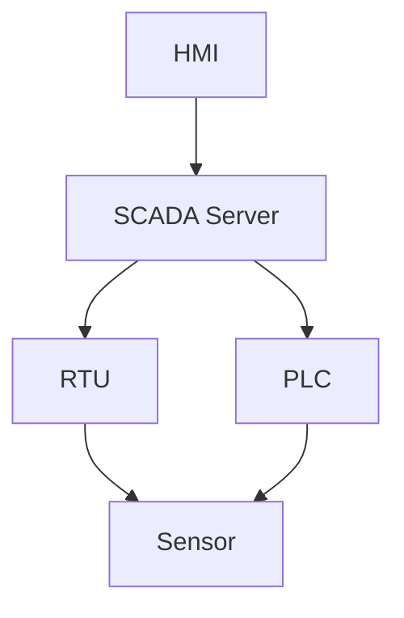

### 19.3 SCADA Security

**Layers**:
1. Physical
2. Network
3. Host
4. Application
5. Data

**Controls**:
- Network Isolation
- Firewall
- IDS/IPS
- Patch (ตามรอบ)
- Access Control
- Monitoring
- Backup
- IR Plan

### 19.4 SOP: SCADA Security

📋 **ขั้นที่ 1: Inventory**
📋 **ขั้นที่ 2: Zone**
📋 **ขั้นที่ 3: Firewall**
📋 **ขั้นที่ 4: IDS**
📋 **ขั้นที่ 5: Patch**
📋 **ขั้นที่ 6: Monitor**
📋 **ขั้นที่ 7: IR**
📋 **ขั้นที่ 8: Review**

### 19.5 แบบฝึกหัด

🎯 **แบบฝึกหัด 19.1**  
ออกแบบ SCADA Security

🎯 **แบบฝึกหัด 19.2**  
เขียน Patch Policy สำหรับ OT

🎯 **แบบฝึกหัด 19.3**  
ออกแบบ IDS สำหรับ OT

### 19.6 เฉลยแบบฝึกหัด

**เฉลย 19.2**
- ห้าม Patch ทันที
- Test ใน Lab
- Vendor Approval
- Maintenance Window
- Rollback Plan
- Document

---

# ส่วนที่ 6: Lifecycle

---

## บทที่ 20 Supply Chain Security

### 20.1 วัตถุประสงค์การเรียนรู้
1. Supply Chain
2. Vendor Assessment
3. SBOM

### 20.2 ความเสี่ยง

| ความเสี่ยง | ตัวอย่าง |
|---|---|
| Counterfeit | Chip ปลอม |
| Backdoor | Firmware |
| Vulnerable Component | Library เก่า |
| No Support | Vendor เลิก |
| Data Leak | Vendor |
| Unauthorized Access | Remote Support |

### 20.3 Vendor Assessment

**Template**:

| หัวข้อ | รายละเอียด |
|---|---|
| Vendor | |
| Product | |
| Version | |
| SBOM | มี/ไม่มี |
| Security Contact | |
| Patch SLA | |
| Support Lifecycle | |
| Certifications | |
| Risk | |

### 20.4 SBOM

**รูปแบบ**: SPDX, CycloneDX

**ตัวอย่าง**:
```json
{
  "bomFormat": "CycloneDX",
  "specVersion": "1.5",
  "components": [
    {
      "type": "library",
      "name": "mbedtls",
      "version": "3.5.0",
      "purl": "pkg:github/Mbed-TLS/mbedtls@3.5.0"
    }
  ]
}
```

### 20.5 SOP: Supply Chain Security

📋 **ขั้นที่ 1: Vendor Assessment**
📋 **ขั้นที่ 2: Contract**
📋 **ขั้นที่ 3: SBOM**
📋 **ขั้นที่ 4: Verify**
📋 **ขั้นที่ 5: Monitor**
📋 **ขั้นที่ 6: Incident Plan**

### 20.6 แบบฝึกหัด

🎯 **แบบฝึกหัด 20.1**  
ทำ Vendor Assessment

🎯 **แบบฝึกหัด 20.2**  
สร้าง SBOM

🎯 **แบบฝึกหัด 20.3**  
ออกแบบ Supply Chain Security

### 20.7 เฉลยแบบฝึกหัด

**เฉลย 20.2**
```bash
# ใช้ Syft
syft dir:. -o cyclonedx-json > sbom.json
```

---

## บทที่ 21 Decommission

### 21.1 วัตถุประสงค์การเรียนรู้
1. Decommission
2. Data Wipe
3. Credential Revoke

### 21.2 SOP: Decommission

📋 **ขั้นที่ 1: ระบุ Device**
📋 **ขั้นที่ 2: Revoke Credential**
📋 **ขั้นที่ 3: Backup Data**
📋 **ขั้นที่ 4: Wipe Device**
📋 **ขั้นที่ 5: Remove from Network**
📋 **ขั้นที่ 6: Update Inventory**
📋 **ขั้นที่ 7: Physical Destruction**

### 21.3 Data Wipe

**Factory Reset**:
```c
void factory_reset(void) {
    // ลบ Credential
    erase_nvs();
    
    // ลบ Certificate
    erase_certificates();
    
    // ลบ WiFi
    erase_wifi_config();
    
    // ลบ User Data
    erase_user_data();
    
    // Reboot
    esp_restart();
}
```

**Cryptographic Erase**:
- ลบ Key → ข้อมูลที่เข้ารหัสอ่านไม่ได้

### 21.4 Physical Destruction

**NIST SP 800-88**:
- Clear
- Purge
- Destroy

**Methods**:
- Shredding
- Degaussing
- Incineration

### 21.5 แบบฝึกหัด

🎯 **แบบฝึกหัด 21.1**  
เขียน Checklist Decommission

🎯 **แบบฝึกหัด 21.2**  
เขียน Code Factory Reset

🎯 **แบบฝึกหัด 21.3**  
อธิบาย Cryptographic Erase

### 21.6 เฉลยแบบฝึกหัด

**เฉลย 21.1**
- [ ] ระบุ Device
- [ ] Revoke Certificate
- [ ] ลบ API Key
- [ ] Backup Data
- [ ] Factory Reset
- [ ] Remove Network
- [ ] Update Inventory
- [ ] Physical Destroy

---

## บทที่ 22 Compliance

### 22.1 วัตถุประสงค์การเรียนรู้
1. Compliance
2. มาตรฐาน
3. Audit

### 22.2 มาตรฐานที่เกี่ยวข้อง

| มาตรฐาน | ขอบเขต |
|---|---|
| IEC 62443 | Industrial |
| NIST IR 8259 | IoT Device |
| ETSI EN 303 645 | Consumer IoT |
| ISO 27001 | ISMS |
| PDPA | ข้อมูลส่วนบุคคล |
| GDPR | EU |
| HIPAA | Health |
| PCI DSS | Payment |

### 22.3 ETSI EN 303 645

**13 Provisions**:
1. No Universal Default Passwords
2. Implement a Vulnerability Disclosure Policy
3. Keep Software Updated
4. Securely Store Sensitive Data
5. Communicate Securely
6. Minimize Exposed Attack Surface
7. Ensure Software Integrity
8. Ensure Personal Data is Secure
9. Make Systems Resilient to Outages
10. Examine System Telemetry Data
11. Make it Easy to Delete User Data
12. Make Installation and Maintenance Easy
13. Validate Input Data

### 22.4 SOP: Compliance

📋 **ขั้นที่ 1: ระบุมาตรฐาน**
📋 **ขั้นที่ 2: Gap Analysis**
📋 **ขั้นที่ 3: Remediation**
📋 **ขั้นที่ 4: Audit**
📋 **ขั้นที่ 5: Report**
📋 **ขั้นที่ 6: Review**

### 22.5 แบบฝึกหัด

🎯 **แบบฝึกหัด 22.1**  
Gap Analysis กับ ETSI EN 303 645

🎯 **แบบฝึกหัด 22.2**  
สร้าง Compliance Checklist

🎯 **แบบฝึกหัด 22.3**  
เตรียม Audit

### 22.6 เฉลยแบบฝึกหัด

**เฉลย 22.1**

| Provision | สถานะ | Gap |
|---|---|---|
| 1 No Default | ✅ | - |
| 2 Disclosure | ❌ | ต้องสร้าง |
| 3 Update | ✅ | - |
| 4 Secure Store | ⚠️ | ต้องปรับ |

---

# ส่วนที่ 7: Case Studies

---

## บทที่ 23 Case Studies

### Case 1: Mirai Botnet (2016)
- **ประเภท**: Botnet
- **Root Cause**: Default Password
- **ผลกระทบ**: Dyn DNS ล่ม
- **บทเรียน**: เปลี่ยน Default, Unique Credential

### Case 2: Stuxnet (2010)
- **ประเภท**: Cyber Weapon
- **Root Cause**: Supply Chain + 0-day
- **ผลกระทบ**: ทำลาย Centrifuge
- **บทเรียน**: Air Gap, Supply Chain

### Case 3: Colonial Pipeline (2021)
- **ประเภท**: Ransomware
- **Root Cause**: Compromised Password
- **ผลกระทบ**: น้ำมันขาดแคลน
- **บทเรียน**: MFA, OT Segment

### Case 4: Jeep Hack (2015)
- **ประเภท**: Vehicle
- **Root Cause**: Insecure API
- **ผลกระทบ**: ควบคุมรถได้
- **บทเรียน**: Secure API, Segment

### Case 5: Baby Monitor (2016)
- **ประเภท**: Privacy
- **Root Cause**: Default Password, No Encryption
- **บทเรียน**: Secure Default, TLS

### Case 6: Viasat (2022)
- **ประเภท**: Satellite
- **Root Cause**: Misconfiguration
- **บทเรียน**: Hardening, Monitor

### แบบฝึกหัด

🎯 **แบบฝึกหัด 23.1**  
เลือก 1 Case วิเคราะห์ด้วย 5 Whys

🎯 **แบบฝึกหัด 23.2**  
เขียน RCA Report

🎯 **แบบฝึกหัด 23.3**  
เสนอ CAPA

### เฉลยแบบฝึกหัด

**เฉลย 23.1 (Mirai)**
1. ทำไม DNS ล่ม? → Botnet Flood
2. ทำไม Botnet? → กล้อง CCTV ถูกยึด
3. ทำไมถูกยึด? → Default Password
4. ทำไมใช้ Default? → ไม่มี Provision Process
5. ทำไมไม่มี? → Vendor ไม่บังคับ

**Root Cause**: ไม่มี Provision Process  
**CAPA**: บังคับเปลี่ยน Password, Unique Credential, Provision Process

---

# ส่วนที่ 8: ภาคผนวก

---

## ภาคผนวก A: Checklists

### A.1 IoT Security Checklist (50 ข้อ)

**Design**
- [ ] Secure by Design
- [ ] Threat Model
- [ ] Unique Credential
- [ ] Secure Boot
- [ ] Signed Firmware
- [ ] OTA Update
- [ ] TLS
- [ ] Least Privilege
- [ ] Log
- [ ] Physical Security

**Provision**
- [ ] ไม่ใช้ Default Password
- [ ] Certificate Provisioning
- [ ] Secure Element
- [ ] Register Inventory
- [ ] Config Secure

**Deploy**
- [ ] Network Isolation
- [ ] Firewall
- [ ] VLAN
- [ ] Monitoring
- [ ] Documentation

**Operate**
- [ ] Patch
- [ ] Log
- [ ] Monitor
- [ ] Alert
- [ ] Review

**Update**
- [ ] Signed
- [ ] Test
- [ ] Staged
- [ ] Rollback

**Decommission**
- [ ] Revoke
- [ ] Wipe
- [ ] Remove
- [ ] Destroy

### A.2 OT Security Checklist (50 ข้อ)
### A.3 MQTT Security Checklist
### A.4 Firmware Signing Checklist
### A.5 Incident Response Checklist

---

## ภาคผนวก B: Templates

1. IoT Inventory
2. Threat Model
3. Firmware Release
4. OTA Plan
5. Network Diagram
6. Firewall Rule
7. Incident Report
8. RCA Report
9. Vendor Assessment
10. Decommission

---

## ภาคผนวก C: คำศัพท์ 200 คำ

**A**: AES, API, AppSKey, Attack Surface, Authentication, Authorization
**B**: BLE, Botnet, Broker, Bootloader
**C**: CA, Certificate, Chain of Trust, Cipher, CoAP, Credential, CSA
**D**: DDoS, Decommission, Device ID, DevEUI, DNP3, DTLS
**E**: Edge, eFuse, ETSI, Encryption
**F**: Factory Reset, Firmware, Firewall
**G**: Gateway, GDPR
**H**: HMI, HSM, HIDS
**I**: IEC 62443, IoT, IDS, IPS, ISVS
**J**: JTAG, JoinEUI
**K**: Key, KMS
**L**: LoRa, LoRaWAN, Least Privilege
**M**: MFA, Mirai, MITM, MQTT, Modbus, mTLS
**N**: Network Isolation, NIST, NwkSKey
**O**: OSCORE, OTAA, OTA, OWASP
**P**: Password, Patch, PLC, PDPA, Purdue, Provision
**Q**: QoS
**R**: RTU, Ransomware, Revoke, Rollback, RoT
**S**: SCADA, Secure Boot, Secure Element, SCEP, SBOM, Signature
**T**: TCP, TLS, TPM, TrustZone, Threat Model
**U**: UART, Update, Unique
**V**: VLAN, VPN, Vendor
**W**: WPA3, Wireless, Wipe
**X**: X.509
**Y**: YAML
**Z**: Zigbee, Zero Trust

---

## ภาคผนวก D: แหล่งเรียนรู้

### มาตรฐาน
- NIST IR 8259: https://csrc.nist.gov/publications/detail/nistir/8259/final
- NIST SP 800-82: https://csrc.nist.gov/publications/detail/sp/800-82/rev-3/final
- IEC 62443: https://www.iec.ch/
- ETSI EN 303 645: https://www.etsi.org/deliver/etsi_en/303600_303699/303645/
- OWASP IoT Top 10: https://owasp.org/www-project-internet-of-things/
- MITRE ATT&CK for ICS: https://attack.mitre.org/techniques/ics/

### Tools
- Wireshark: https://www.wireshark.org/
- Mender: https://mender.io/
- Balena: https://www.balena.io/
- AWS IoT: https://aws.amazon.com/iot/
- Azure IoT: https://azure.microsoft.com/en-us/products/iot-hub/
- Mosquitto: https://mosquitto.org/
- OpenVAS: https://www.openvas.org/

### แหล่งฝึก
- TryHackMe IoT
- Hack The Box IoT
- OWASP IoTGoat
- Damn Vulnerable IoT Device

---

## ภาคผนวก E: เฉลยแบบฝึกหัด

(รวมเฉลยทุกบท)

**บทที่ 1**
- 1.1–1.4: (ดูในส่วนก่อนหน้า)

**บทที่ 2**
- 2.1–2.3: (ดูในส่วนก่อนหน้า)

**บทที่ 3**
- 3.1–3.3: (ดูในส่วนก่อนหน้า)

**บทที่ 4**
- 4.1–4.3: (ดูในส่วนก่อนหน้า)

**บทที่ 5**
- 5.1–5.3: (ดูในส่วนก่อนหน้า)

**บทที่ 6**
- 6.1–6.3: (ดูในส่วนก่อนหน้า)

**บทที่ 7**
- 7.1–7.3: (ดูในส่วนก่อนหน้า)

**บทที่ 8**
- 8.1–8.3: (ดูในส่วนก่อนหน้า)

**บทที่ 9**
- 9.1–9.3: (ดูในส่วนก่อนหน้า)

**บทที่ 10**
- 10.1–10.4: (ดูในส่วนก่อนหน้า)

**บทที่ 11**
- 11.1–11.2: (ดูในส่วนก่อนหน้า)

**บทที่ 12**
- 12.1–12.3: (ดูในส่วนก่อนหน้า)

**บทที่ 13**
- 13.1–13.3: (ดูในส่วนก่อนหน้า)

**บทที่ 14**
- 14.1–14.3: (ดูในส่วนก่อนหน้า)

**บทที่ 15**
- 15.1–15.3: (ดูในส่วนก่อนหน้า)

**บทที่ 16**
- 16.1–16.3: (ดูในส่วนก่อนหน้า)

**บทที่ 17**
- 17.1–17.3: (ดูในส่วนก่อนหน้า)

**บทที่ 18**
- 18.1–18.3: (ดูในส่วนก่อนหน้า)

**บทที่ 19**
- 19.1–19.3: (ดูในส่วนก่อนหน้า)

**บทที่ 20**
- 20.1–20.3: (ดูในส่วนก่อนหน้า)

**บทที่ 21**
- 21.1–21.3: (ดูในส่วนก่อนหน้า)

**บทที่ 22**
- 22.1–22.3: (ดูในส่วนก่อนหน้า)

**บทที่ 23**
- 23.1–23.3: (ดูในส่วนก่อนหน้า)

---

# สรุปเล่ม 5

คู่มือ IoT Security Manual ฉบับเต็มนี้ ประกอบด้วย:

- **23 บท** ครอบคลุม IoT, OT, ICS, SCADA
- **50+ ตัวอย่างโค้ด/Config** ESP32, STM32, Python, C, Mosquitto, TLS
- **40+ แผนภาพ** Mermaid, Architecture, Purdue Model
- **40+ แบบฝึกหัด** พร้อมเฉลยละเอียด
- **10 Templates** พร้อมใช้
- **200+ คำศัพท์**
- **Checklists ครบทุกหัวข้อ**

เมื่อจัดพิมพ์เป็น A4 ฟอนต์ TH Sarabun 12 ระยะบรรทัด 1.15 จะได้ความยาวประมาณ **350–390 หน้า**

---

# 🎉 สรุปชุดคู่มือ Cybersecurity ฉบับมืออาชีพ ครบ 5 เล่ม

| เล่ม | ชื่อ | จำนวนบท | หน้า |
|---|---|---|---|
| 1 | Secure Coding Manual | 25 | ~360 |
| 2 | DevSecOps Manual | 23 | ~370 |
| 3 | Network Security Operations Manual | 20 | ~360 |
| 4 | System Administration Security Manual | 20 | ~360 |
| 5 | IoT Security Manual | 23 | ~370 |
| **รวม** | | **111** | **~1,820 หน้า** |

**เล่ม 6–8 (ฉบับย่อ):**
| เล่ม | ชื่อ | หน้า |
|---|---|---|
| 6 | Security Awareness Manual | ~40 |
| 7 | Incident Response & RCA Manual | ~50 |
| 8 | Security Tools & Prompt Engineering Manual | ~40 |

---

# 📌 ข้อเสนอแนะสำหรับการจัดทำชุดสมบูรณ์

หากต้องการให้ครบสมบูรณ์แบบ Box Set ระดับมืออาชีพ แนะนำ:

1. **จัดพิมพ์ 5 เล่มหลัก** พร้อมปกแข็ง
2. **รวมเล่ม 6–8** เป็น "Quick Reference Guide"
3. **เพิ่ม Lab Environment**:
   - VM สำหรับ Windows/Linux Hardening
   - GNS3/EVE-NG สำหรับ Network Lab
   - Docker/K8s สำหรับ DevSecOps Lab
   - ESP32/Raspberry Pi สำหรับ IoT Lab
4. **เพิ่มแบบทดสอบ**:
   - Certified Secure Developer
   - Certified DevSecOps Engineer
   - Certified Network Security Engineer
   - Certified System Security Administrator
   - Certified IoT Security Engineer
5. **จัดอบรม 5 วัน** ต่อเล่ม

> 💡 **หมายเหตุ**: ชุดคู่มือนี้เป็นทรัพย์สินทางปัญญาที่จัดทำขึ้นเพื่อการศึกษา การใช้งานในองค์กรควรปรับให้เหมาะกับบริบท กฎหมาย และนโยบายภายในของแต่ละองค์กร