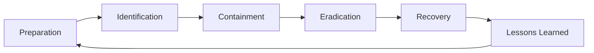

# 📗 ชุดคู่มือ Cybersecurity ฉบับย่อ (เล่ม 6–8)
## ฉบับปฏิบัติ พร้อมใช้งานจริงในองค์กร

> **คำชี้แจง**: เล่ม 6–8 เป็นคู่มือฉบับย่อที่เน้น "ใช้งานได้ทันที" ประกอบด้วยหลักการ ตัวอย่าง และ Template พร้อมใช้  
> ไม่ลงลึกเท่าเล่ม 1–5 แต่ครอบคลุมเพียงพอสำหรับการนำไปปฏิบัติในองค์กรขนาดเล็ก-กลาง

---
---

# 📗 เล่ม 6: Security Awareness Manual
## คู่มือความตระหนักด้านความปลอดภัยสำหรับพนักงาน

---

## ส่วนนำ

### วัตถุประสงค์
1. สร้างวัฒนธรรมความปลอดภัยในองค์กร
2. ลดความเสี่ยงจาก Human Error
3. ให้พนักงานรู้เท่าทันภัยคุกคาม
4. เตรียมพร้อมสำหรับ ISO 27001, PDPA

### กลุ่มเป้าหมาย
- พนักงานทั่วไป
- ผู้บริหาร
- พนักงานใหม่
- Contractor
- บุคคลทั่วไป

### ระยะเวลา
- หลักสูตรพื้นฐาน: 2 ชั่วโมง
- หลักสูตรประจำปี: 1 ชั่วโมง (Refresher)
- Phishing Simulation: ทุก 3 เดือน

---

## บทที่ 1 ภาพรวมภัยคุกคาม

### 1.1 ภัยคุกคามที่พบบ่อย

| ประเภท | คำอธิบาย | ผลกระทบ |
|---|---|---|
| Phishing | อีเมลปลอม | ขโมยรหัสผ่าน |
| Ransomware | เข้ารหัสข้อมูล | ระบบล่ม |
| Social Engineering | หลอกลวง | ข้อมูลรั่ว |
| Malware | ซอฟต์แวร์ประสงค์ร้าย | ระบบเสียหาย |
| Data Leak | ข้อมูลรั่ว | เสียชื่อเสียง |
| Insider Threat | พนักงานผิดจริยธรรม | รั่วข้อมูล |

### 1.2 สถิติที่น่าสนใจ
- 74% ของ Data Breach เกิดจาก Human Error
- 91% ของ Cyber Attack เริ่มจาก Phishing
- 60% ของ SME ปิดกิจการภายใน 6 เดือนหลังถูกโจมตี
- ค่าเสียหายเฉลี่ย 4.45 ล้านเหรียญ/เหตุการณ์

---

## บทที่ 2 Phishing

### 2.1 Phishing คืออะไร
การหลอกลวงผ่านอีเมล ข้อความ หรือเว็บไซต์ปลอม เพื่อให้เหยื่อกรอกข้อมูลส่วนตัวหรือคลิกลิงก์อันตราย

### 2.2 ประเภทของ Phishing

| ประเภท | ช่องทาง |
|---|---|
| Email Phishing | อีเมล |
| Spear Phishing | อีเมลเจาะจง |
| Whaling | ผู้บริหาร |
| Smishing | SMS |
| Vishing | โทรศัพท์ |
| Clone Phishing | อีเมลซ้ำ |

### 2.3 จุดสังเกต 10 ข้อ

1. **ผู้ส่งแปลก** – อีเมลไม่ตรงกับชื่อองค์กร
2. **เร่งเร้า** – "ด่วน! ภายใน 24 ชม."
3. **ลิงก์ผิดปกติ** – ตรวจ URL ก่อนคลิก
4. **ไฟล์แนบแปลก** – .exe, .zip, .scr
5. **สะกดผิด** – ชื่อบริษัทหรือโดเมน
6. **ขอข้อมูล** – รหัสผ่าน, เลขบัตร
7. **โลโก้ผิด** – คุณภาพต่ำ
8. **ภาษาแปลก** – ไวยากรณ์ผิด
9. **อีเมลไม่คาดคิด** – ไม่ได้ทำธุรกรรม
10. **ลงชื่อไม่ครบ** – ไม่มีข้อมูลติดต่อ

### 2.4 ตัวอย่างอีเมลปลอม

```
From: security@bank-thai.com (ปลอม)
To: you@company.com
Subject: ⚠️ ด่วน! บัญชีของคุณถูกระงับ

เรียน ลูกค้าผู้มีอุปการคุณ

เราตรวจพบบัญชีของคุณมีกิจกรรมผิดปกติ
กรุณาคลิกลิงก์ด้านล่างเพื่อยืนยันตัวตนภายใน 24 ชั่วโมง
มิฉะนั้นบัญชีจะถูกระงับ

[คลิกที่นี่เพื่อยืนยัน] ← http://bank-thai-verify.xyz

ขอแสดงความนับถือ
ฝ่ายความปลอดภัย
```

**จุดสังเกต**:
- โดเมน `bank-thai.com` ไม่ใช่ของธนาคารจริง
- เร่งเร้า 24 ชั่วโมง
- ลิงก์ `.xyz` ไม่น่าเชื่อถือ
- ขอข้อมูลผ่านลิงก์

### 2.5 สิ่งที่ต้องทำเมื่อสงสัย

1. **อย่าคลิก** ลิงก์หรือไฟล์แนบ
2. **อย่าตอบกลับ** อีเมล
3. **รายงาน** ทันทีที่ security@company.com
4. **ลบ** หลังรายงาน
5. **เปลี่ยนรหัสผ่าน** ถ้าคลิกไปแล้ว

### 2.6 แบบฝึกหัด

🎯 **แบบฝึกหัด 2.1**  
ตรวจสอบอีเมล 5 ฉบับที่ให้มา ระบุว่าฉบับใดเป็น Phishing

🎯 **แบบฝึกหัด 2.2**  
เขียน Report เมื่อพบอีเมลน่าสงสัย

🎯 **แบบฝึกหัด 2.3**  
ออกแบบอีเมล Phishing สำหรับ Simulation

---

## บทที่ 3 รหัสผ่านและ MFA

### 3.1 รหัสผ่านที่ดี

**❌ อย่าใช้**:
- 123456
- password
- qwerty
- วันเกิด
- ชื่อตัวเอง
- รหัสซ้ำ

**✅ ควรใช้**:
- Passphrase ยาว 12+ ตัว
- ตัวพิมพ์ใหญ่-เล็ก-ตัวเลข-สัญลักษณ์
- ไม่ซ้ำกันแต่ละบัญชี
- ใช้ Password Manager

### 3.2 ตัวอย่าง Passphrase

```
"แมวของฉันชื่อมิวปี2026!"
"ฉันชอบกินส้มตำ420บาท"
"Coffee@Work#2026!Morning"
```

### 3.3 Password Manager

**แนะนำ**:
- Bitwarden (ฟรี)
- 1Password
- LastPass
- KeePass

**ข้อดี**:
- จำแค่ Master Password
- สร้างรหัสสุ่มยาว
- กรอกอัตโนมัติ
- ซิงค์ข้ามอุปกรณ์

### 3.4 MFA (Multi-Factor Authentication)

**ประเภท**:
- Something you know: รหัสผ่าน
- Something you have: OTP, Token
- Something you are: ลายนิ้วมือ, ใบหน้า

**แนะนำ**:
- Microsoft Authenticator
- Google Authenticator
- Authy
- YubiKey (Hardware)

### 3.5 แบบฝึกหัด

🎯 **แบบฝึกหัด 3.1**  
สร้าง Passphrase 5 อัน

🎯 **แบบฝึกหัด 3.2**  
ตั้งค่า Bitwarden

🎯 **แบบฝึกหัด 3.3**  
เปิด MFA ในบัญชี Google

---

## บทที่ 4 ความปลอดภัยอุปกรณ์

### 4.1 คอมพิวเตอร์

- ล็อกหน้าจอเมื่อออกจากโต๊ะ (Windows+L)
- อัปเดต OS สม่ำเสมอ
- ใช้ Antivirus
- ไม่ติดตั้งซอฟต์แวร์เถื่อน
- ไม่ใช้ USB ที่ไม่รู้ที่มา

### 4.2 มือถือ

- ตั้ง Lock Screen PIN 6+ หลัก
- เปิด Biometric
- อัปเดต OS/App
- ติดตั้งจาก Store เท่านั้น
- ไม่ Jailbreak/Root
- เปิด Find My Device
- สำรองข้อมูล

### 4.3 Wi-Fi

**✅ ใช้ได้**:
- Wi-Fi ที่บ้าน
- Wi-Fi องค์กร (มีรหัส)
- Mobile Hotspot

**❌ หลีกเลี่ยง**:
- Wi-Fi สาธารณะไม่มีรหัส
- Wi-Fi ชื่อแปลก
- Wi-Fi ปลอม (Evil Twin)

**ถ้าจำเป็น**:
- ใช้ VPN
- ไม่ทำธุรกรรม
- ลืมเครือข่ายหลังใช้

### 4.4 แบบฝึกหัด

🎯 **แบบฝึกหัด 4.1**  
ตั้งค่า Lock Screen บนอุปกรณ์

🎯 **แบบฝึกหัด 4.2**  
ตรวจสอบ App ที่ขอสิทธิ์บนมือถือ

🎯 **แบบฝึกหัด 4.3**  
ตั้งค่า VPN บนมือถือ

---

## บทที่ 5 ข้อมูลและความเป็นส่วนตัว

### 5.1 ประเภทข้อมูล

| ระดับ | ตัวอย่าง | การป้องกัน |
|---|---|---|
| Public | ประกาศ | ไม่ต้อง |
| Internal | เอกสารภายใน | ไม่แชร์นอก |
| Confidential | ข้อมูลลูกค้า | เข้ารหัส |
| Restricted | รหัสผ่าน | เข้มงวด |

### 5.2 PDPA

**สิทธิของเจ้าของข้อมูล**:
1. รับทราบ
2. เข้าถึง
3. ขอสำเนา
4. คัดค้าน
5. ลบ
6. โอนย้าย
7. ร้องเรียน

**หน้าที่ขององค์กร**:
- ขอ Consent
- แจ้งวัตถุประสงค์
- รักษาความปลอดภัย
- แจ้งเมื่อรั่วไหล

### 5.3 การจัดการข้อมูล

**✅ ควรทำ**:
- แชร์เท่าที่จำเป็น
- ใช้ Shared Drive ขององค์กร
- ลบเมื่อไม่ใช้
- รายงานเมื่อสงสัย

**❌ ไม่ควรทำ**:
- ส่งข้อมูลผ่าน LINE ส่วนตัว
- เก็บใน USB ส่วนตัว
- ถ่ายรูปหน้าจอ
- พิมพ์ทิ้งไม่ทำลาย

### 5.4 แบบฝึกหัด

🎯 **แบบฝึกหัด 5.1**  
จำแนกข้อมูลที่คุณใช้ใน 4 ระดับ

🎯 **แบบฝึกหัด 5.2**  
เขียน Consent Form

🎯 **แบบฝึกหัด 5.3**  
ออกแบบกระบวนการรายงานเหตุ

---

## บทที่ 6 Remote Work Security

### 6.1 ความเสี่ยง

- Wi-Fi ไม่ปลอดภัย
- คนในบ้านเห็นจอ
- อุปกรณ์ส่วนตัว
- ส่งข้อมูลผ่านช่องทางไม่ปลอดภัย

### 6.2 แนวปฏิบัติ

1. ใช้ VPN ขององค์กร
2. ใช้ Wi-Fi ที่มีรหัส
3. ตั้ง Lock Screen
4. ไม่ให้คนอื่นใช้เครื่อง
5. ใช้ Shared Drive
6. รายงานเหตุทันที

### 6.3 แบบฝึกหัด

🎯 **แบบฝึกหัด 6.1**  
ตั้งค่า VPN ที่บ้าน

🎯 **แบบฝึกหัด 6.2**  
เขียน Checklist Remote Work

---

## บทที่ 7 การรายงานเหตุ

### 7.1 เมื่อไรต้องรายงาน

- คลิก Phishing
- สงสัยอีเมล
- อุปกรณ์หาย
- ระบบทำงานผิดปกติ
- ข้อมูลรั่ว
- ถูกโทรหลอก

### 7.2 ช่องทางรายงาน

| ช่องทาง | ใช้เมื่อ |
|---|---|
| Email: security@company.com | ทั่วไป |
| โทร: 02-XXX-XXXX | เร่งด่วน |
| Line: @security | สอบถาม |
| Ticket System | บันทึก |

### 7.3 Template: Phishing Report

```
หัวข้อ: [Phishing] อีเมลจาก xxx

ผู้รายงาน: [ชื่อ]
วันที่: [วันที่]
เวลา: [เวลา]

รายละเอียด:
- ผู้ส่ง: xxx@xxx.com
- หัวข้อ: xxx
- ลิงก์: xxx
- ไฟล์แนบ: xxx
- การกระทำ: [คลิก/ไม่คลิก/กรอกข้อมูล]

หลักฐาน:
[แนบ Screenshot]
```

### 7.4 แบบฝึกหัด

🎯 **แบบฝึกหัด 7.1**  
เขียน Report เมื่อได้รับ Phishing

🎯 **แบบฝึกหัด 7.2**  
ออกแบบ Flow การรายงาน

---

## บทที่ 8 แบบทดสอบ

### 8.1 คำถาม 20 ข้อ

1. Phishing คืออะไร?
2. จุดสังเกต Phishing 5 ข้อ?
3. รหัสผ่านที่ดีควรมีอะไร?
4. MFA คืออะไร?
5. Password Manager คืออะไร?
6. Wi-Fi สาธารณะปลอดภัยหรือไม่?
7. ควรทำอะไรเมื่อสงสัยอีเมล?
8. ข้อมูล Confidential คืออะไร?
9. PDPA ย่อมาจาก?
10. สิทธิของเจ้าของข้อมูลมีอะไรบ้าง?
11. Remote Work ต้องระวังอะไร?
12. เมื่ออุปกรณ์หายต้องทำอะไร?
13. ช่องทางรายงานเหตุคือ?
14. Ransomware คืออะไร?
15. Social Engineering คืออะไร?
16. ทำไมต้องอัปเดต OS?
17. USB ที่ไม่รู้ที่มาใช้ได้ไหม?
18. VPN ใช้ทำอะไร?
19. ควรแชร์รหัสผ่านกับเพื่อนไหม?
20. เมื่อพบเหตุต้องทำอะไร?

### 8.2 เฉลย

1. การหลอกลวงผ่านอีเมล/ข้อความ
2. ผู้ส่งแปลก, เร่งเร้า, ลิงก์ผิด, ขอข้อมูล, สะกดผิด
3. ยาว 12+, ผสม, ไม่ซ้ำ
4. การยืนยันตัวตนหลายปัจจัย
5. เครื่องมือจัดเก็บรหัสผ่าน
6. ไม่ปลอดภัย
7. รายงานทันที
8. ข้อมูลลูกค้า
9. Personal Data Protection Act
10. รับทราบ, เข้าถึง, คัดค้าน, ลบ, โอน, ร้องเรียน
11. Wi-Fi, คนเห็นจอ, อุปกรณ์
12. รายงานทันที
13. security@company.com
14. Malware เข้ารหัสข้อมูล
15. หลอกลวงให้ทำตาม
16. ปิดช่องโหว่
17. ไม่ควร
18. เข้ารหัสการเชื่อมต่อ
19. ไม่ควร
20. รายงานทันที

### 8.3 เกณฑ์ผ่าน
- 80% ขึ้นไป = ผ่าน
- 60-79% = ทบทวน
- < 60% = อบรมใหม่

---

## ภาคผนวก

### A. Poster แนะนำ

**Phishing Poster**:
```
⚠️ คิดก่อนคลิก!
✓ ตรวจผู้ส่ง
✓ ตรวจลิงก์
✓ ตรวจภาษา
✗ อย่าให้ข้อมูล
✓ รายงานทันที
```

**Password Poster**:
```
🔐 รหัสผ่านที่แข็งแรง
✓ ยาว 12+
✓ ผสมตัวอักษร
✓ ไม่ซ้ำ
✓ ใช้ Manager
✓ เปิด MFA
```

### B. Quick Reference Card

| สถานการณ์ | สิ่งที่ต้องทำ |
|---|---|
| สงสัยอีเมล | อย่าคลิก รายงาน |
| คลิกไปแล้ว | เปลี่ยนรหัส รายงาน |
| อุปกรณ์หาย | รายงานทันที |
| ถูกโทรหลอก | อย่าให้ข้อมูล รายงาน |
| ระบบผิดปกติ | รายงานทันที |

---

# สรุปเล่ม 6

**Security Awareness Manual** ฉบับย่อนี้ ประกอบด้วย:
- 8 บท
- 20 แบบทดสอบ พร้อมเฉลย
- ตัวอย่าง Poster
- Templates
- Quick Reference Card

**ความยาวเมื่อจัดพิมพ์**: ~40–50 หน้า

---
---

# 📗 เล่ม 7: Incident Response & RCA Manual
## คู่มือการตอบสนองเหตุการณ์และวิเคราะห์สาเหตุราก

---

## ส่วนนำ

### วัตถุประสงค์
1. กำหนดมาตรฐาน Incident Response
2. จัดการเหตุการณ์อย่างเป็นระบบ
3. ลดผลกระทบและเวลา
4. ป้องกันการเกิดซ้ำด้วย RCA

### กลุ่มเป้าหมาย
- IR Team
- SOC Analyst
- IT Manager
- CISO
- System Admin
- Network Engineer

### ขอบเขต
Security Incident ทุกประเภท: Malware, Ransomware, Phishing, DDoS, Data Breach, Insider, Compromise

---

## บทที่ 1 ภาพรวม IR

### 1.1 IR Lifecycle



### 1.2 บทบาท

| บทบาท | หน้าที่ |
|---|---|
| IR Manager | บริหารเหตุการณ์ |
| SOC Analyst | ตรวจจับ |
| Forensics | เก็บหลักฐาน |
| IT Ops | แก้ไข |
| Legal | กฎหมาย |
| PR | สื่อ |
| Management | อนุมัติ |

### 1.3 Severity Levels

| ระดับ | คำอธิบาย | SLA ตอบสนอง |
|---|---|---|
| P1 Critical | ระบบหลักล่ม ข้อมูลรั่ว | 15 นาที |
| P2 High | กระทบหลายระบบ | 30 นาที |
| P3 Medium | กระทบเฉพาะที่ | 2 ชม. |
| P4 Low | ไม่กระทบธุรกิจ | 1 วัน |

---

## บทที่ 2 Preparation

### 2.1 สิ่งที่ต้องเตรียม

1. **ทีม** – กำหนดบทบาท On-call
2. **เครื่องมือ** – SIEM, EDR, Forensics
3. **Playbook** – แยกตามประเภท
4. **Communication Plan** – ช่องทาง
5. **Escalation Matrix** – ติดต่อใคร
6. **Contact List** – 24/7
7. **ซ้อม** – Tabletop ทุก 6 เดือน

### 2.2 IR Kit

- Laptop สะอาด
- USB สำหรับ Forensics
- Write Blocker
- Network Cable
- Power Bank
- Camera
- Notepad
- Forms

### 2.3 Playbook Template

```
Playbook: [ชื่อ]

1. Detect
   - Alert source
   - Threshold

2. Verify
   - Checklist
   - Tools

3. Contain
   - Actions
   - Owner

4. Eradicate
   - Actions
   - Owner

5. Recover
   - Actions
   - Owner

6. RCA
   - Template
```

---

## บทที่ 3 Identification

### 3.1 แหล่ง Alert

| แหล่ง | ตัวอย่าง |
|---|---|
| SIEM | Correlation |
| EDR | Malware |
| IDS/IPS | Network |
| User Report | Phishing |
| Vendor | Threat Intel |
| Audit | Anomaly |

### 3.2 การยืนยันเหตุ

**ขั้นตอน**:
1. รับ Alert
2. ตรวจสอบข้อมูลเบื้องต้น
3. ยืนยัน True/False Positive
4. จัดระดับ Severity
5. เปิด Ticket
6. แจ้งทีม

### 3.3 Template: Incident Ticket

| หัวข้อ | รายละเอียด |
|---|---|
| Incident ID | INC-2026-001 |
| เวลา Detect | |
| Severity | |
| Source | |
| Affected | |
| Reporter | |
| Owner | |
| Status | Open |

---

## บทที่ 4 Containment

### 4.1 เป้าหมาย
หยุดการแพร่กระจายโดยไม่ทำลายหลักฐาน

### 4.2 Actions

| ประเภท | Action |
|---|---|
| Network | Block IP, Domain |
| Endpoint | Isolate |
| Account | Disable |
| Service | Shutdown |
| Data | Snapshot |

### 4.3 SOP

📋 **ขั้นที่ 1: ประเมิน**
📋 **ขั้นที่ 2: ตัดสินใจ**
📋 **ขั้นที่ 3: ดำเนินการ**
📋 **ขั้นที่ 4: บันทึก**
📋 **ขั้นที่ 5: แจ้งทีม**

### 4.4 ข้อควรระวัง
- อย่าลบหลักฐาน
- อย่าปิดระบบโดยไม่จำเป็น
- บันทึกทุกอย่าง
- แจ้งผู้เกี่ยวข้อง

---

## บทที่ 5 Eradication

### 5.1 เป้าหมาย
กำจัดสาเหตุและ Malware

### 5.2 Actions

1. ลบ Malware
2. Patch ช่องโหว่
3. เปลี่ยนรหัสผ่าน
4. ลบ Backdoor
5. ปิดช่องทางที่ถูกใช้

### 5.3 Verification

- Scan ซ้ำ
- ตรวจ Log
- ตรวจ Process
- ตรวจ Network

---

## บทที่ 6 Recovery

### 6.1 เป้าหมาย
นำระบบกลับสู่ปกติ

### 6.2 Actions

1. Restore จาก Backup
2. ตรวจสอบความสะอาด
3. นำระบบกลับ
4. Monitoring เข้มข้น
5. Validate

### 6.3 ข้อควรระวัง

- อย่ารีบ
- ทดสอบก่อน
- Monitor ต่อ
- บันทึก

---

## บทที่ 7 RCA

### 7.1 หลักการ

1. **Data-Driven**
2. **Blameless**
3. **Multiple Causes**
4. **Systemic**
5. **Verify**
6. **Actionable**
7. **Prevent Recurrence**

### 7.2 เทคนิค

| เทคนิค | ใช้เมื่อ |
|---|---|
| 5 Whys | ง่าย |
| Fishbone | หลายปัจจัย |
| Fault Tree | ซับซ้อน |
| Pareto | หาสาเหตุบ่อย |
| Timeline | เหตุต่อเนื่อง |
| Change | สงสัยการเปลี่ยนแปลง |
| Barrier | มาตรการล้มเหลว |

### 7.3 5 Whys ตัวอย่าง

**เหตุการณ์**: Ransomware เข้ารหัสข้อมูล

1. ทำไมข้อมูลถูกเข้ารหัส? → มี Ransomware
2. ทำไม Ransomware เข้ามาได้? → User คลิก Phishing
3. ทำไม User คลิก? → แยกไม่ออก
4. ทำไมแยกไม่ออก? → ขาดอบรม
5. ทำไมยังเข้าถึง? → ไม่มี MFA + สิทธิ์กว้าง

**Root Cause**: ระบบป้องกันหลายชั้นล้มเหลว

### 7.4 CAPA

| ประเภท | ความหมาย |
|---|---|
| Corrective | แก้ปัญหา |
| Preventive | ป้องกัน |

**ตัวอย่าง CAPA**:
- Corrective: เปิด MFA, เปลี่ยนรหัส
- Preventive: อบรม, Segment, EDR

### 7.5 Template: RCA Report

| หัวข้อ | รายละเอียด |
|---|---|
| Incident ID | |
| วันที่ | |
| ผลกระทบ | |
| Timeline | |
| Immediate Cause | |
| Contributing Factors | |
| Root Cause | |
| หลักฐาน | |
| CAPA | |
| Owner | |
| Due Date | |
| Verification | |

---

## บทที่ 8 Playbooks

### 8.1 Ransomware

📋 **Detect**: Alert จาก EDR, File Encryption
📋 **Verify**: ตรวจ Host, Files
📋 **Contain**: Isolate, Block C2
📋 **Eradicate**: Remove, Patch
📋 **Recover**: Restore Backup
📋 **RCA**: 5 Whys, CAPA

### 8.2 Phishing

📋 **Detect**: User Report, Email Gateway
📋 **Verify**: ตรวจ Email Header, URL
📋 **Contain**: Block Sender, Domain
📋 **Eradicate**: ลบอีเมล, Reset Password
📋 **Recover**: Monitor
📋 **RCA**: อบรมเพิ่ม

### 8.3 DDoS

📋 **Detect**: Traffic Spike, Alert
📋 **Verify**: ตรวจ Traffic
📋 **Contain**: Activate CDN/WAF
📋 **Eradicate**: Block Source
📋 **Recover**: Monitor
📋 **RCA**: ปรับ Rule

### 8.4 Data Breach

📋 **Detect**: DLP Alert, User Report
📋 **Verify**: ตรวจ Scope
📋 **Contain**: Block, Revoke
📋 **Eradicate**: ลบข้อมูล, Patch
📋 **Recover**: Monitor
📋 **Notify**: PDPA (72 ชม.)
📋 **RCA**: CAPA

### 8.5 Compromised Account

📋 **Detect**: Alert, Anomaly
📋 **Verify**: ตรวจ Login
📋 **Contain**: Disable Account
📋 **Eradicate**: Reset Password, MFA
📋 **Recover**: Enable, Monitor
📋 **RCA**: Review

---

## บทที่ 9 KPI

| Metric | ความหมาย |
|---|---|
| MTTD | Mean Time to Detect |
| MTTR | Mean Time to Respond |
| Recurrence Rate | อัตราเกิดซ้ำ |
| % CAPA | CAPA เสร็จตามกำหนด |
| % SLA | ตาม SLA |

---

## ภาคผนวก

### A. Incident Report Template
### B. RCA Report Template
### C. Communication Plan
### D. Escalation Matrix
### E. Contact List
### F. Playbook Templates (5 ประเภท)

---

# สรุปเล่ม 7

**Incident Response & RCA Manual** ฉบับย่อนี้ ประกอบด้วย:
- 9 บท
- 5 Playbooks
- 6 Templates
- KPI
- ตัวอย่าง RCA

**ความยาวเมื่อจัดพิมพ์**: ~50–60 หน้า

---
---

# 📗 เล่ม 8: Security Tools & Prompt Engineering Manual
## คู่มือเครื่องมือและการใช้ AI สำหรับงาน Cybersecurity

---

## ส่วนนำ

### วัตถุประสงค์
1. แนะนำเครื่องมือที่เหมาะสม
2. ใช้ AI ช่วยวิเคราะห์และสร้างเอกสาร
3. ทำงานอย่างมีจริยธรรมและถูกกฎหมาย

### กลุ่มเป้าหมาย
- ทุกบทบาทในทีม Security
- Developer
- DevOps
- SysAdmin
- Network
- IoT
- ผู้ใช้ทั่วไป

---

## บทที่ 1 หลักการใช้ Tools

### 1.1 หลักการ

1. **ได้รับอนุญาตก่อนใช้**
2. **เริ่มจาก Open Source**
3. **ทดสอบใน Lab**
4. **เก็บ Log**
5. **Update เครื่องมือ**
6. **ฝึกทีม**
7. **ตรวจสอบผลลัพธ์**
8. **ปฏิบัติตามกฎหมาย**

### 1.2 ข้อห้าม

- ห้ามใช้เครื่องมือโจมตีกับเป้าหมายที่ไม่ใช่ของคุณ
- ห้ามทดสอบโดยไม่ได้รับอนุญาต
- ห้ามละเมิด PDPA
- ห้ามใช้ซอฟต์แวร์เถื่อน

---

## บทที่ 2 เครื่องมือแยกตามหมวด

### 2.1 Network

| Tool | ใช้ทำอะไร |
|---|---|
| Wireshark | Packet Analysis |
| Nmap | Port Scan |
| Zeek | Network Monitor |
| Suricata | IDS/IPS |
| Snort | IDS |
| tcpdump | Capture |
| nfdump | NetFlow |

### 2.2 Endpoint

| Tool | ใช้ทำอะไร |
|---|---|
| CrowdStrike | EDR |
| Defender | EDR |
| Velociraptor | IR |
| Sysmon | Windows Log |
| OSSEC | HIDS |
| Wazuh | HIDS |

### 2.3 SIEM

| Tool | ราคา |
|---|---|
| Splunk | Paid |
| ELK | Free |
| Wazuh | Free |
| Sentinel | Cloud |
| QRadar | Paid |

### 2.4 Vulnerability

| Tool | ใช้ทำอะไร |
|---|---|
| Nessus | Scan |
| OpenVAS | Scan |
| Qualys | Cloud Scan |
| Trivy | Container |
| Grype | SBOM |

### 2.5 Web

| Tool | ใช้ทำอะไร |
|---|---|
| Burp Suite | Web Pentest |
| OWASP ZAP | Web Scan |
| Nikto | Web Scan |
| Nuclei | Template |

### 2.6 Forensics

| Tool | ใช้ทำอะไร |
|---|---|
| Volatility | Memory |
| Autopsy | Disk |
| FTK Imager | Image |
| KAPE | Triage |

### 2.7 Threat Intel

| Tool | ใช้ทำอะไร |
|---|---|
| MISP | Sharing |
| OpenCTI | Platform |
| VirusTotal | IOC |
| AbuseIPDB | IP |

### 2.8 IR/SOAR

| Tool | ใช้ทำอะไร |
|---|---|
| TheHive | Case Mgmt |
| Cortex | Analysis |
| Shuffle | Automation |

### 2.9 IAM

| Tool | ใช้ทำอะไร |
|---|---|
| Keycloak | SSO |
| Okta | SSO |
| Azure AD | SSO |
| Vault | Secrets |

### 2.10 Cloud

| Tool | ใช้ทำอะไร |
|---|---|
| Prowler | AWS Audit |
| ScoutSuite | Multi-cloud |
| GuardDuty | AWS |
| Security Hub | AWS |

### 2.11 DevSecOps

| Tool | ใช้ทำอะไร |
|---|---|
| SonarQube | SAST |
| Semgrep | SAST |
| Snyk | SCA |
| Checkov | IaC |
| Trivy | Container |

### 2.12 Backup

| Tool | ใช้ทำอะไร |
|---|---|
| Veeam | Enterprise |
| Restic | Open Source |
| Borg | Open Source |
| Bacula | Open Source |

### 2.13 Awareness

| Tool | ใช้ทำอะไร |
|---|---|
| GoPhish | Phishing Sim |
| KnowBe4 | Training |
| Microsoft Attack Simulator | Training |

---

## บทที่ 3 Mapping Tools กับบทบาท

| บทบาท | Tools แนะนำ |
|---|---|
| Developer | Semgrep, Snyk, GitLeaks, OWASP ZAP |
| DevOps | Trivy, Checkov, Vault, Falco |
| Network | Wireshark, Zeek, Suricata, pfSense |
| SysAdmin | Wazuh, Veeam, Defender, Ansible |
| IoT | Mender, AWS IoT, OpenVAS, Mosquitto |
| ทั่วไป | Bitwarden, Authenticator, HIBP |

---

## บทที่ 4 Prompt Engineering

### 4.1 Master Template

```text
บทบาท: [ระบุ]
บริบท: [ระบบ/องค์กร/เหตุการณ์]
เป้าหมาย: [ต้องการอะไร]
ข้อมูลที่มี: [log/timeline/นโยบาย]
ข้อจำกัด: [ห้ามคาดเดา/ห้ามข้อมูลลับ]
รูปแบบผลลัพธ์: [ตาราง/หัวข้อ/JSON]
เกณฑ์คุณภาพ: [ครบถ้วน/ตรวจสอบได้]
```

### 4.2 ตัวอย่างแยกบทบาท

**Developer**:
```text
คุณเป็น Secure Code Reviewer
ตรวจโค้ด: [โค้ด]
หา OWASP Top 10, Secrets, Input Validation
เสนอแนวทางแก้ไขพร้อมตัวอย่าง
```

**DevOps**:
```text
คุณเป็น DevSecOps Engineer
วิเคราะห์ Pipeline: [YAML]
หา Secrets, สิทธิ์กว้าง, Image ไม่ปลอดภัย
เสนอ Security Gate
```

**Network**:
```text
คุณเป็น Network Security Engineer
วิเคราะห์ Firewall Rule: [rule]
หา Rule กว้าง, ซ้ำซ้อน
เสนอ Least Privilege
```

**SysAdmin**:
```text
คุณเป็น System Administrator
สร้าง Checklist Hardening Windows/Linux
ครอบคลุม Patch, IAM, Log, Backup
แสดงเป็นตาราง
```

**IoT**:
```text
คุณเป็น IoT Security Architect
ออกแบบสถาปัตยกรรมปลอดภัย
ครอบคลุม Secure Boot, OTA, MQTT TLS
```

**ทั่วไป**:
```text
คุณเป็นผู้เชี่ยวชาญ Security Awareness
สร้างเนื้อหา Phishing Awareness ภาษาไทย
พร้อมตัวอย่างและแบบทดสอบ
```

**IR/RCA**:
```text
คุณเป็น Incident Responder
จาก Timeline: [timeline]
วิเคราะห์ Root Cause ด้วย 5 Whys
เสนอ CAPA
แสดงเป็นตาราง
```

### 4.3 Prompt Library

| งาน | Prompt |
|---|---|
| Threat Model | "ใช้ STRIDE กับระบบ..." |
| Risk Assessment | "ประเมินความเสี่ยง..." |
| Code Review | "ตรวจโค้ด OWASP..." |
| Log Analysis | "วิเคราะห์ Log..." |
| Phishing Analysis | "วิเคราะห์อีเมล..." |
| Policy Draft | "ร่างนโยบาย..." |
| RCA | "วิเคราะห์ Root Cause..." |
| Executive Summary | "สรุปสำหรับผู้บริหาร..." |
| Tabletop | "สร้างสถานการณ์..." |
| Training | "สร้างเนื้อหาอบรม..." |

### 4.4 ข้อควรระวัง AI

1. **อย่าใส่ข้อมูลลับ**
2. **ตรวจสอบคำตอบ**
3. **ห้ามใช้สร้าง malware**
4. **ปฏิบัติตามกฎหมาย**
5. **AI เป็นผู้ช่วย ไม่ใช่ผู้ตัดสิน**
6. **ระวัง Hallucination**
7. **ระวัง Bias**
8. **บันทึกการใช้**

---

## บทที่ 5 Case Studies

### Case 1: ใช้ AI วิเคราะห์ Log
- Input: 1,000 บรรทัด
- Output: IOC, Severity, แนวทาง

### Case 2: ใช้ AI สร้าง Policy
- Input: มาตรฐาน ISO 27001
- Output: นโยบาย Password

### Case 3: ใช้ AI ทำ RCA
- Input: Timeline
- Output: Root Cause, CAPA

### Case 4: ใช้ AI อบรม
- Input: กลุ่มเป้าหมาย
- Output: เนื้อหา, Quiz

---

## ภาคผนวก

### A. Prompt Library (50 Prompts)
### B. Tool Comparison Matrix
### C. Installation Guides
### D. Legal & Ethical Guidelines
### E. AI Usage Policy Template

---

# สรุปเล่ม 8

**Security Tools & Prompt Engineering Manual** ฉบับย่อนี้ ประกอบด้วย:
- 5 บท
- 50+ Tools
- 50 Prompts
- Case Studies
- Templates

**ความยาวเมื่อจัดพิมพ์**: ~40–50 หน้า

---
---

# 🎁 โบนัส: ชุดเสริมสำหรับการใช้งานจริง

---

## โบนัส 1: Lab Environment Setup Guide

### 1.1 Network Lab (GNS3/EVE-NG)

**Requirements**:
- CPU: 8 cores
- RAM: 32 GB
- Storage: 500 GB SSD

**Topology**:
```
Internet → Firewall → Switch → Server
                    → Client
```

**Tools**:
- GNS3
- EVE-NG
- Cisco IOS Images
- pfSense
- Kali Linux

### 1.2 DevSecOps Lab

**Requirements**:
- Docker
- Kubernetes (minikube)
- GitLab/GitHub
- Jenkins

**Stack**:
- GitLab CE
- Jenkins
- SonarQube
- Trivy
- Vault
- Falco

### 1.3 IoT Lab

**Hardware**:
- ESP32 (3 ตัว)
- Raspberry Pi (2 ตัว)
- Sensor Kit
- Logic Analyzer

**Software**:
- ESP-IDF
- Mosquitto
- Wireshark
- OpenVAS

### 1.4 Windows/Linux Lab

**VMs**:
- Windows Server 2022
- Windows 10/11
- Ubuntu Server
- RHEL/CentOS
- Kali Linux
- Metasploitable

**RAM**: 32 GB ขึ้นไป

### 1.5 SOC Lab

**Stack**:
- Wazuh (SIEM)
- Suricata (IDS)
- Zeek (Network)
- TheHive (Case)
- Cortex (Analysis)
- MISP (Threat Intel)

---

## โบนัส 2: Certification Blueprint

### 2.1 Certified Secure Developer (CSD)
- **เนื้อหา**: เล่ม 1
- **ข้อสอบ**: 100 ข้อ 2 ชม.
- **เกณฑ์**: 70%
- **หัวข้อ**: OWASP, Crypto, AuthN, Secure Design

### 2.2 Certified DevSecOps Engineer (CDE)
- **เนื้อหา**: เล่ม 2
- **ข้อสอบ**: 80 ข้อ 2 ชม.
- **เกณฑ์**: 70%
- **หัวข้อ**: CI/CD, Container, K8s, IaC

### 2.3 Certified Network Security Engineer (CNSE)
- **เนื้อหา**: เล่ม 3
- **ข้อสอบ**: 100 ข้อ 2 ชม.
- **เกณฑ์**: 70%
- **หัวข้อ**: Firewall, IDS/IPS, VPN, DDoS

### 2.4 Certified System Security Administrator (CSSA)
- **เนื้อหา**: เล่ม 4
- **ข้อสอบ**: 100 ข้อ 2 ชม.
- **เกณฑ์**: 70%
- **หัวข้อ**: Hardening, AD, Patch, Backup

### 2.5 Certified IoT Security Engineer (CISE)
- **เนื้อหา**: เล่ม 5
- **ข้อสอบ**: 80 ข้อ 2 ชม.
- **เกณฑ์**: 70%
- **หัวข้อ**: Secure Boot, MQTT, OTA, OT

### 2.6 Certified Incident Responder (CIR)
- **เนื้อหา**: เล่ม 7
- **ข้อสอบ**: 80 ข้อ 2 ชม.
- **เกณฑ์**: 70%
- **หัวข้อ**: IR Lifecycle, RCA, Playbook

---

## โบนัส 3: Quick Reference Cards

### Card 1: Phishing

```
⚠️ คิดก่อนคลิก
✓ ผู้ส่ง
✓ ลิงก์
✓ ภาษา
✓ ไฟล์แนบ
→ รายงานทันที
```

### Card 2: Password

```
🔐 รหัสผ่าน
✓ 12+ ตัว
✓ ผสม
✓ ไม่ซ้ำ
✓ Manager
✓ MFA
```

### Card 3: Incident

```
🚨 Incident
1. Detect
2. Verify
3. Contain
4. Eradicate
5. Recover
6. RCA
```

### Card 4: Hardening

```
🛡️ Hardening
✓ Patch
✓ Firewall
✓ MFA
✓ Backup
✓ Log
✓ Monitor
```

### Card 5: Cloud

```
☁️ Cloud
✓ IAM
✓ Encryption
✓ Logging
✓ CSPM
✓ Backup
```

---

## โบนัส 4: แผนการฝึกอบรม 5 วัน

### Day 1: Foundation
- เช้า: บทนำ, CIA, Threat Landscape
- บ่าย: Risk, Compliance, Lab Setup

### Day 2: Secure Development
- เช้า: OWASP, Secure Coding
- บ่าย: SAST/DAST, Code Review

### Day 3: Infrastructure
- เช้า: Network Security
- บ่าย: System Hardening

### Day 4: Operations
- เช้า: DevSecOps, Container, K8s
- บ่าย: Monitoring, IR

### Day 5: Advanced
- เช้า: IoT Security
- บ่าย: Case Studies, Exam

---

## โบนัส 5: แผนการอ่าน 90 วัน

### เดือนที่ 1: Foundation
- Week 1: เล่ม 1 บท 1-5
- Week 2: เล่ม 1 บท 6-10
- Week 3: เล่ม 1 บท 11-15
- Week 4: เล่ม 1 บท 16-25

### เดือนที่ 2: Infrastructure
- Week 5-6: เล่ม 2 (DevSecOps)
- Week 7-8: เล่ม 3 (Network)

### เดือนที่ 3: Operations
- Week 9-10: เล่ม 4 (SysAdmin)
- Week 11: เล่ม 5 (IoT)
- Week 12: เล่ม 6-8 + ทบทวน

---

# 🎉 สรุปชุดคู่มือ Cybersecurity ครบชุด

## โครงสร้างชุดสมบูรณ์

| เล่ม | ชื่อ | หน้า | สถานะ |
|---|---|---|---|
| 1 | Secure Coding Manual | ~360 | ✅ ฉบับเต็ม |
| 2 | DevSecOps Manual | ~370 | ✅ ฉบับเต็ม |
| 3 | Network Security Operations Manual | ~360 | ✅ ฉบับเต็ม |
| 4 | System Administration Security Manual | ~360 | ✅ ฉบับเต็ม |
| 5 | IoT Security Manual | ~370 | ✅ ฉบับเต็ม |
| 6 | Security Awareness Manual | ~50 | ✅ ฉบับย่อ |
| 7 | Incident Response & RCA Manual | ~60 | ✅ ฉบับย่อ |
| 8 | Security Tools & Prompt Engineering Manual | ~50 | ✅ ฉบับย่อ |
| **รวม** | | **~1,980 หน้า** | |

## โบนัส
- Lab Environment Setup Guide
- Certification Blueprint (6 ใบ)
- Quick Reference Cards (5 ใบ)
- แผนฝึกอบรม 5 วัน
- แผนอ่าน 90 วัน

## การนำไปใช้

### สำหรับบุคคล
1. เริ่มจากเล่ม 6 (Awareness)
2. เลือกเล่มตามบทบาท (1-5)
3. ฝึก Lab
4. สอบ Certification
5. ทบทวนต่อเนื่อง

### สำหรับองค์กร
1. ใช้เล่ม 6 อบรมพนักงาน
2. ใช้เล่ม 1-5 อบรมทีมเทคนิค
3. ใช้เล่ม 7-8 เป็น Reference
4. จัดตั้ง Lab
5. วัดผลและปรับปรุง

### สำหรับสถาบันการศึกษา
1. ใช้เป็นหลักสูตร 1 ภาคเรียน
2. แบ่งเป็น 5 Module
3. Lab ทุกสัปดาห์
4. Project ท้ายภาค
5. Certification

---

# 📌 ข้อเสนอแนะเพิ่มเติม

หากต้องการให้จัดทำเพิ่มเติมในส่วนใด แจ้งได้ทันที:

1. **ขยายบทใดในเล่ม 1-5** ให้ละเอียดยิ่งขึ้น
2. **สร้าง Lab Manual** แยกต่างหาก
3. **สร้าง Exam Bank** 500+ ข้อ
4. **สร้าง Slide Presentation** สำหรับสอน
5. **สร้าง Video Script** สำหรับออนไลน์
6. **แปลเป็นภาษาอังกฤษ**
7. **ปรับให้เหมาะกับอุตสาหกรรมเฉพาะ** (การเงิน, การแพทย์, การศึกษา)
8. **สร้าง Assessment Tool** สำหรับวัด Maturity

> 💡 **หมายเหตุ**: ชุดคู่มือนี้เป็นทรัพย์สินทางปัญญาที่จัดทำขึ้นเพื่อการศึกษา การใช้งานในองค์กรควรปรับให้เหมาะกับบริบท กฎหมาย และนโยบายภายในของแต่ละองค์กร