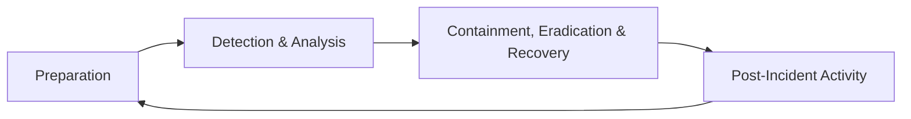
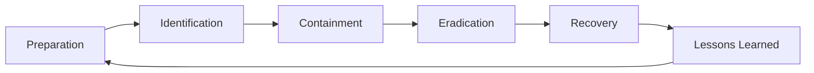
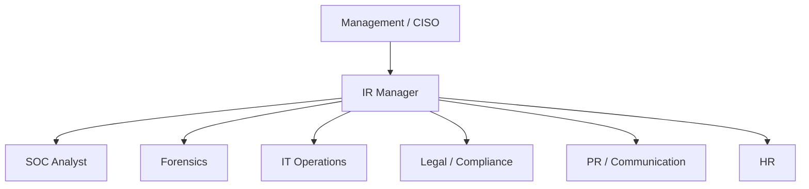
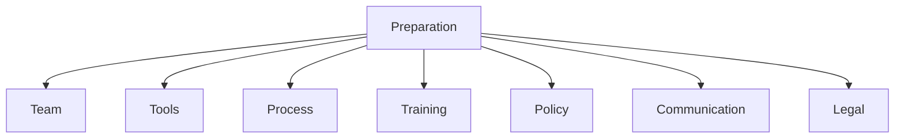
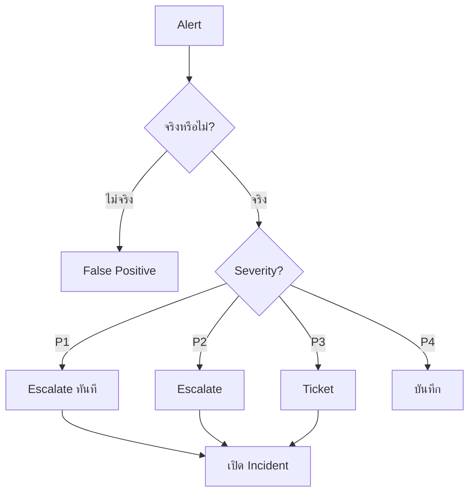
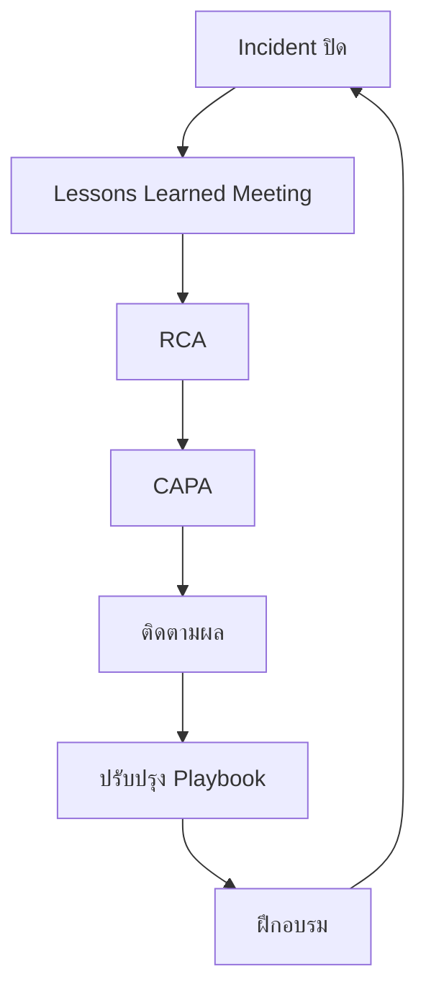
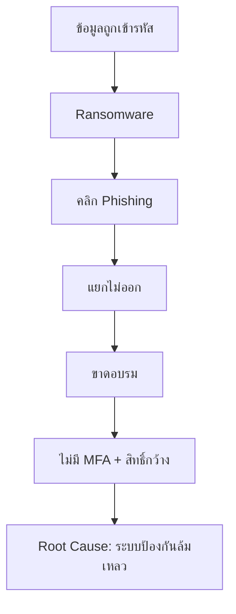
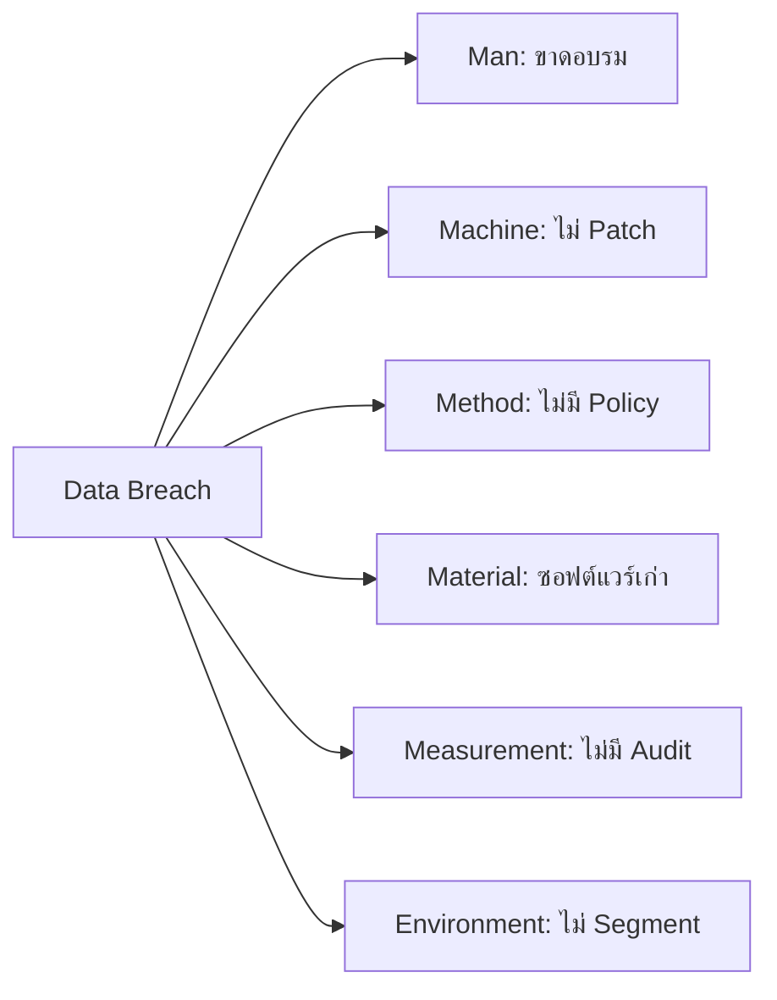
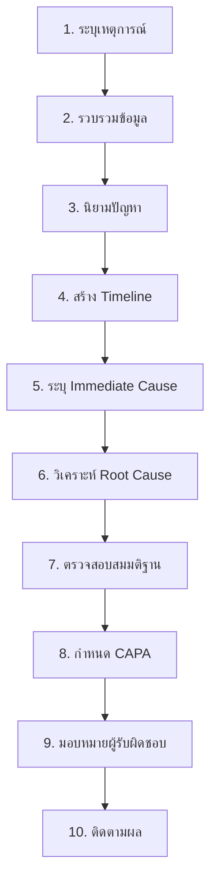
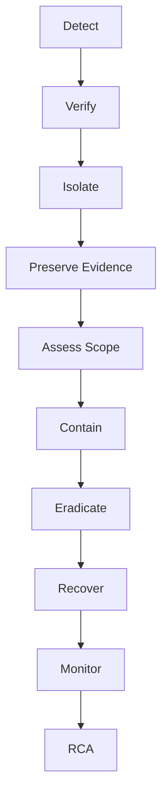

# 📕 เล่ม 7: Incident Response & RCA Manual
## คู่มือการตอบสนองเหตุการณ์และการวิเคราะห์สาเหตุราก ระดับมืออาชีพ | ฉบับเต็ม 300+ หน้า

---

## ส่วนนำ

### คำนำ

ในโลกที่ภัยคุกคามทางไซเบอร์มีความซับซ้อนและหลากหลายขึ้นทุกวัน การตอบสนองต่อเหตุการณ์อย่างเป็นระบบและรวดเร็วเป็นสิ่งสำคัญที่สุด คู่มือเล่มนี้จัดทำขึ้นเพื่อเป็นมาตรฐานการทำงานของทีม Incident Response (IR), SOC Analyst, Forensics Investigator และผู้บริหารที่ต้องตัดสินใจในสถานการณ์วิกฤต

คู่มือนี้ไม่เพียงแต่อธิบายขั้นตอนการตอบสนองเหตุการณ์ แต่ยังลงลึกถึงการวิเคราะห์สาเหตุราก (Root Cause Analysis) ซึ่งเป็นหัวใจของการป้องกันการเกิดซ้ำ พร้อมด้วย Template, Checklist, KPI และกรณีศึกษาจริงที่สามารถนำไปใช้ได้ทันที

### วัตถุประสงค์

1. กำหนดมาตรฐาน Incident Response ขององค์กร
2. ลดเวลาในการตรวจจับและตอบสนอง (MTTD/MTTR)
3. สร้างกระบวนการ RCA ที่เป็นระบบและป้องกันการเกิดซ้ำ
4. เตรียมพร้อมสำหรับ Compliance (ISO 27001, PDPA, GDPR)
5. ใช้เป็นคู่มือฝึกทีม IR และ SOC ใหม่
6. เป็นเอกสารอ้างอิงในการ Audit และ Post-Incident Review

### ขอบเขต

ครอบคลุม Security Incident ทุกประเภท:
- Malware / Ransomware
- Phishing / Social Engineering
- Data Breach / Data Leak
- DDoS / DoS
- Insider Threat
- Web Application Attack
- Network Intrusion
- Cloud Security Incident
- IoT/OT Incident
- Supply Chain Attack
- Zero-Day Exploit

### กลุ่มเป้าหมาย

| กลุ่ม | บทบาท |
|---|---|
| IR Manager | บริหารเหตุการณ์ ตัดสินใจ |
| SOC Analyst | ตรวจจับ วิเคราะห์ เฝ้าระวัง |
| Forensics Investigator | เก็บหลักฐาน วิเคราะห์เชิงลึก |
| IT Operations | แก้ไขระบบ กู้คืน |
| Developer | แก้โค้ดที่เกี่ยวข้อง |
| Legal / Compliance | ประสานกฎหมาย |
| PR / Communication | สื่อสารภายใน/ภายนอก |
| Management | อนุมัติทรัพยากร |

---

## สารบัญฉบับเต็ม

**ส่วนที่ 1: ปฐมบท (หน้า 1–50)**
- บทที่ 1 บทนำสู่ Incident Response
- บทที่ 2 หลักการและ Framework มาตรฐาน
- บทที่ 3 โครงสร้างทีม IR และบทบาท
- บทที่ 4 การเตรียมความพร้อม (Preparation)

**ส่วนที่ 2: กระบวนการตอบสนอง (หน้า 51–150)**
- บทที่ 5 Identification และ Triage
- บทที่ 6 Containment
- บทที่ 7 Eradication
- บทที่ 8 Recovery
- บทที่ 9 Post-Incident Activity

**ส่วนที่ 3: Root Cause Analysis (หน้า 151–230)**
- บทที่ 10 หลักการ RCA
- บทที่ 11 เทคนิค RCA (5 Whys, Fishbone, Fault Tree)
- บทที่ 12 ขั้นตอน RCA 10 ขั้น
- บทที่ 13 CAPA (Corrective and Preventive Action)
- บทที่ 14 การติดตามและวัดผล

**ส่วนที่ 4: หัวข้อเฉพาะทาง (หน้า 231–290)**
- บทที่ 15 Digital Forensics
- บทที่ 16 Malware Analysis
- บทที่ 17 Threat Intelligence
- บทที่ 18 Communication และ PR
- บทที่ 19 Legal และ Compliance

**ส่วนที่ 5: ปฏิบัติการ (หน้า 291–360)**
- บทที่ 20 Incident Response Playbooks
- บทที่ 21 Tabletop Exercise
- บทที่ 22 Case Studies
- บทที่ 23 แบบฝึกหัดและเฉลย

**ภาคผนวก (หน้า 361–400)**
- A: Checklists 15 ชุด
- B: Templates 20 ชุด
- C: คำศัพท์ 200 คำ
- D: แหล่งเรียนรู้
- E: เฉลยแบบฝึกหัด

---

## บทที่ 1 บทนำสู่ Incident Response

### 1.1 ความหมายของ Incident Response

**Incident Response (IR)** คือกระบวนการที่เป็นระบบในการจัดการกับเหตุการณ์ความปลอดภัยทางไซเบอร์ ตั้งแต่การตรวจจับ วิเคราะห์ จำกัดวง แก้ไข กู้คืน และเรียนรู้จากเหตุการณ์ เพื่อลดผลกระทบและป้องกันการเกิดซ้ำ

**Security Incident** หมายถึงเหตุการณ์ที่เกิดขึ้นจริงหรือสงสัยว่าอาจเกิดขึ้น ซึ่งส่งผลกระทบต่อ Confidentiality, Integrity หรือ Availability ของข้อมูลหรือระบบ

**Security Event** หมายถึงเหตุการณ์ที่เกิดขึ้นในระบบซึ่งอาจเป็นปกติหรือผิดปกติ แต่ยังไม่ยืนยันว่าเป็น Incident

### 1.2 ความสำคัญของ Incident Response

| มิติ | ผลกระทบหากไม่มี IR |
|---|---|
| การเงิน | ค่าเสียหายเฉลี่ยหลายล้านบาท |
| ชื่อเสียง | ลูกค้าขาดความเชื่อมั่น |
| กฎหมาย | ปรับตาม PDPA/GDPR |
| การดำเนินธุรกิจ | ระบบล่ม ธุรกิจหยุดชะงัก |
| บุคลากร | ขวัญกำลังใจลดลง |
| คู่ค้า | สูญเสียความสัมพันธ์ทางธุรกิจ |

### 1.3 สถิติที่สำคัญ

- เวลาเฉลี่ยในการตรวจจับและควบคุม Data Breach: 277 วัน (IBM 2023)
- ค่าใช้จ่ายเฉลี่ยต่อ Incident: 4.45 ล้านเหรียญสหรัฐ (IBM 2023)
- องค์กรที่ไม่มี IR Plan มีโอกาสเสียหายสูงกว่า 2.5 เท่า
- 74% ขององค์กรที่ประสบเหตุร้ายแรงไม่มีแผนที่เพียงพอ

### 1.4 เป้าหมายของ Incident Response

1. **ยืนยันว่าเกิด Incident จริงหรือไม่**
2. **จำกัดขอบเขตและผลกระทบ**
3. **ปกป้องข้อมูลและระบบ**
4. **กู้คืนการดำเนินงานโดยเร็ว**
5. **เก็บรักษาหลักฐาน**
6. **เรียนรู้และป้องกันการเกิดซ้ำ**
7. **ปฏิบัติตามกฎหมายและข้อกำหนด**
8. **รักษาชื่อเสียงและความเชื่อมั่น**

### 1.5 ประเภทของ Incident

| ประเภท | ตัวอย่าง | ผลกระทบหลัก |
|---|---|---|
| Malware | Ransomware, Trojan | Availability, Integrity |
| Phishing | Email ปลอม | Confidentiality |
| Data Breach | ข้อมูลลูกค้ารั่วไหล | Confidentiality, Legal |
| DDoS | ทราฟฟิกถล่ม | Availability |
| Insider Threat | พนักงานขโมยข้อมูล | Confidentiality |
| Web Attack | SQLi, XSS | Integrity, Confidentiality |
| Network Intrusion | Lateral Movement | ทุกด้าน |
| Cloud Misconfiguration | S3 Bucket Public | Confidentiality |
| Supply Chain | SolarWinds | ทุกด้าน |
| Physical | ขโมยอุปกรณ์ | ทุกด้าน |

### 1.6 หลักการสำคัญ 7 ประการ

1. **Preparation is Key** – เตรียมพร้อมก่อนเกิดเหตุ
2. **Speed Matters** – ยิ่งเร็ว ยิ่งลดความเสียหาย
3. **Contain First** – จำกัดวงก่อนแก้ไข
4. **Preserve Evidence** – เก็บหลักฐานเพื่อ Forensics
5. **Document Everything** – บันทึกทุกขั้นตอน
6. **Blameless Culture** – มุ่งที่ระบบ ไม่ตำหนิบุคคล
7. **Continuous Improvement** – เรียนรู้และปรับปรุง

### 1.7 ตัวอย่างจริง: Ransomware โรงพยาบาล

**เหตุการณ์**: โรงพยาบาลแห่งหนึ่งถูก Ransomware เข้ารหัสข้อมูลผู้ป่วย 50,000 ราย

**ไทม์ไลน์**:
- วันที่ 1: พนักงานคลิก Phishing Email
- วันที่ 3: Ransomware เข้ารหัสไฟล์
- วันที่ 4: ระบบล่ม ตรวจพบเหตุ
- วันที่ 5: ประกาศ Incident
- วันที่ 7: กู้คืนจาก Backup ได้บางส่วน
- วันที่ 30: ระบบกลับสู่ปกติ
- วันที่ 60: RCA เสร็จสิ้น

**ผลกระทบ**:
- ค่าเสียหาย 15 ล้านบาท
- ต้องเลื่อนการผ่าตัด 200 ราย
- ถูกปรับตาม PDPA 5 ล้านบาท
- ชื่อเสียงเสียหาย

**บทเรียน**:
- ต้องมี MFA
- ต้องมี Backup Offline
- ต้องมี EDR
- ต้องฝึกอบรมพนักงาน
- ต้องมี IR Plan

---

## บทที่ 2 หลักการและ Framework มาตรฐาน

### 2.1 NIST Incident Response Framework

**NIST SP 800-61** เป็น Framework มาตรฐานที่ใช้กันทั่วโลก ประกอบด้วย 4 ขั้นตอนหลัก:



**รายละเอียดแต่ละขั้น**:

| ขั้น | กิจกรรมหลัก |
|---|---|
| Preparation | จัดทีม เตรียมเครื่องมือ ฝึกซ้อม |
| Detection & Analysis | ตรวจจับ ยืนยัน ประเมิน |
| Containment, Eradication & Recovery | จำกัดวง แก้ไข กู้คืน |
| Post-Incident Activity | เรียนรู้ ปรับปรุง |

### 2.2 SANS Incident Response Process

**SANS** ใช้ 6 ขั้นตอน (PICERL):

1. **Preparation** – เตรียมพร้อม
2. **Identification** – ระบุเหตุ
3. **Containment** – จำกัดวง
4. **Eradication** – กำจัด
5. **Recovery** – กู้คืน
6. **Lessons Learned** – บทเรียน



### 2.3 ISO 27035

**ISO/IEC 27035** เป็นมาตรฐาน International สำหรับ Incident Management ประกอบด้วย 5 ขั้น:

1. Plan and Prepare
2. Detection and Reporting
3. Assessment and Decision
4. Responses
5. Lessons Learned

### 2.4 MITRE ATT&CK Framework

**MITRE ATT&CK** เป็น Knowledge Base ของ Tactic, Technique และ Procedure (TTP) ที่ Attacker ใช้

**14 Tactics**:
1. Reconnaissance
2. Resource Development
3. Initial Access
4. Execution
5. Persistence
6. Privilege Escalation
7. Defense Evasion
8. Credential Access
9. Discovery
10. Lateral Movement
11. Collection
12. Command and Control
13. Exfiltration
14. Impact

**การใช้ใน IR**:
- Map Incident กับ Tactic
- ระบุ Technique ที่ใช้
- ตรวจหา Gap
- ปรับ Detection Rule

### 2.5 เปรียบเทียบ Framework

| Framework | ขั้นตอน | จุดเด่น |
|---|---|---|
| NIST | 4 | มาตรฐาน US Government |
| SANS | 6 | ใช้งานง่าย |
| ISO 27035 | 5 | มาตรฐานสากล |
| MITRE ATT&CK | 14 Tactics | รายละเอียด TTP |

### 2.6 การประยุกต์ใช้ในองค์กร

**SOP: เลือก Framework**

1. ประเมินความต้องการ
2. เลือก Framework หลัก
3. ปรับให้เข้ากับบริบท
4. ฝึกทีม
5. ทบทวนและปรับปรุง

**ตัวอย่าง**: องค์กรขนาดกลางเลือก SANS เพราะเข้าใจง่าย + MITRE ATT&CK สำหรับ Detection

---

## บทที่ 3 โครงสร้างทีม IR และบทบาท

### 3.1 โครงสร้างทีม IR



### 3.2 บทบาทและความรับผิดชอบ

| บทบาท | หน้าที่หลัก | ทักษะที่ต้องมี |
|---|---|---|
| IR Manager | บริหารเหตุการณ์ ตัดสินใจ ประสานงาน | Leadership, Communication |
| SOC Analyst | ตรวจจับ วิเคราะห์ เฝ้าระวัง | SIEM, IDS, Log Analysis |
| Forensics | เก็บหลักฐาน วิเคราะห์เชิงลึก | Disk, Memory, Network Forensics |
| Malware Analyst | วิเคราะห์ Malware | Reverse Engineering |
| Threat Intel | ให้ข้อมูลภัยคุกคาม | OSINT, Dark Web |
| IT Operations | แก้ไขระบบ กู้คืน | System, Network Admin |
| Legal | ประสานกฎหมาย | PDPA, GDPR |
| PR | สื่อสาร | Crisis Communication |
| HR | จัดการบุคลากร | Employee Relations |

### 3.3 ทีมแบบ Tiered

| Tier | บทบาท | หน้าที่ |
|---|---|---|
| Tier 1 | L1 Analyst | รับ Alert, Triage เบื้องต้น |
| Tier 2 | L2 Analyst | วิเคราะห์เชิงลึก, ตอบสนอง |
| Tier 3 | L3 / Threat Hunter | Hunting, Forensics |
| Tier 4 | IR Manager / CISO | ตัดสินใจเชิงกลยุทธ์ |

### 3.4 On-Call Rotation

**SOP: จัดตาราง On-Call**

1. แบ่งทีมเป็น 3–4 กลุ่ม
2. หมุนเวียนรายสัปดาห์
3. มี Backup ตลอดเวลา
4. ช่องทางติดต่อชัดเจน
5. ชดเชยค่าตอบแทน
6. ทบทวนหลังเวร

**Template: On-Call Schedule**

| สัปดาห์ | Primary | Secondary | Escalation |
|---|---|---|---|
| W1 | Analyst A | Analyst B | IR Manager |
| W2 | Analyst C | Analyst D | IR Manager |
| W3 | Analyst E | Analyst F | IR Manager |

### 3.5 Communication Plan

**ช่องทางสื่อสาร**:
- Primary: โทรศัพท์ / Slack / Teams
- Secondary: Email / SMS
- Emergency: War Room / Conference Bridge

**Template: Communication Matrix**

| ระดับ | ผู้รับ | ช่องทาง | เวลา |
|---|---|---|---|
| P1 | CISO, CEO | โทร + War Room | ทันที |
| P2 | IR Manager, IT Head | Slack + Email | 15 นาที |
| P3 | IR Team | Slack | 30 นาที |
| P4 | IR Team | Ticket | 2 ชม. |

### 3.6 การฝึกอบรมทีม

**หลักสูตรที่แนะนำ**:
- GCIH (GIAC Certified Incident Handler)
- GCFA (GIAC Certified Forensic Analyst)
- GCIA (GIAC Certified Intrusion Analyst)
- CEH (Certified Ethical Hacker)
- CHFI (Computer Hacking Forensic Investigator)

**SOP: ฝึกอบรมประจำปี**

1. ประเมินทักษะ
2. กำหนด Gap
3. จัดหลักสูตร
4. ฝึกปฏิบัติ
5. ประเมินผล
6. ทบทวน

### 3.7 แบบฝึกหัด

**แบบฝึกหัด 3.1**
ออกแบบโครงสร้างทีม IR สำหรับองค์กรขนาดกลาง (พนักงาน 500 คน, IT 20 คน)

**แบบฝึกหัด 3.2**
เขียน On-Call Rotation สำหรับทีม 6 คน

**แบบฝึกหัด 3.3**
จัดทำ Communication Matrix สำหรับ Incident 4 ระดับ

---

## บทที่ 4 การเตรียมความพร้อม (Preparation)

### 4.1 องค์ประกอบของการเตรียมพร้อม



### 4.2 นโยบายและกระบวนการ

**SOP: จัดทำ IR Policy**

1. กำหนดวัตถุประสงค์
2. กำหนดขอบเขต
3. กำหนดบทบาท
4. กำหนดขั้นตอน
5. กำหนด SLA
6. อนุมัติโดยผู้บริหาร
7. สื่อสารทั่วองค์กร
8. ทบทวนปีละ 1 ครั้ง

**ตัวอย่าง IR Policy Outline**:
```
1. Purpose
2. Scope
3. Definitions
4. Roles and Responsibilities
5. Incident Classification
6. Response Procedures
7. Communication Plan
8. Evidence Handling
9. Legal Considerations
10. Training and Awareness
11. Review and Update
```

### 4.3 เครื่องมือที่จำเป็น

| ประเภท | เครื่องมือ | 用途 |
|---|---|---|
| SIEM | Splunk, ELK, Wazuh | รวม Log วิเคราะห์ |
| EDR | CrowdStrike, Defender | ตรวจจับ Endpoint |
| NDR | Zeek, Suricata | ตรวจจับ Network |
| Forensics | Volatility, Autopsy | วิเคราะห์หลักฐาน |
| SOAR | TheHive, Shuffle | Automate Response |
| Threat Intel | MISP, VirusTotal | ข้อมูลภัยคุกคาม |
| Case Management | TheHive, Jira | ติดตาม Incident |
| Communication | Slack, Teams | ประสานงาน |

### 4.4 Jump Bag / Go Bag

**รายการที่ต้องเตรียม**:
- [ ] Laptop ที่ Clean
- [ ] External Hard Drive
- [ ] USB Drive (Write-Once)
- [ ] Network Cable
- [ ] Power Adapter
- [ ] Bootable USB (Linux Forensics)
- [ ] Camera
- [ ] Notebook + Pen
- [ ] Evidence Bags
- [ ] Chain of Custody Forms
- [ ] Contact List
- [ ] IR Playbooks (Printed)

### 4.5 Baseline และ Documentation

**สิ่งที่ต้องมี**:
1. Network Diagram (อัปเดต)
2. Asset Inventory
3. Data Flow Diagram
4. Critical Asset List
5. Baseline Configuration
6. Log Source List
7. Contact List
8. Escalation Matrix

### 4.6 Logging และ Monitoring

**SOP: ตั้งค่า Logging**

1. ระบุ Log Source สำคัญ
2. เปิด Log Level ที่เหมาะสม
3. ส่งเข้า SIEM
4. ตั้ง Alert Rule
5. Tune ลด False Positive
6. เก็บตามกฎหมาย (PDPA: 90 วัน, GDPR: ตามความจำเป็น)

**Log Source ที่สำคัญ**:
- Firewall
- IDS/IPS
- EDR
- OS (Windows Event Log, Syslog)
- Application
- Database
- Cloud (CloudTrail, GuardDuty)
- Authentication (AD, SSO)

### 4.7 Tabletop Exercise

**SOP: จัด Tabletop**

1. เลือก Scenario
2. เตรียม Materials
3. เชิญผู้เข้าร่วม
4. ดำเนินการ 2–4 ชั่วโมง
5. สรุปบทเรียน
6. ปรับปรุง Plan

**Scenario ตัวอย่าง**:
- Ransomware โรงพยาบาล
- Data Breach ลูกค้า 1 ล้านราย
- DDoS ระหว่าง Flash Sale
- Insider Threat ขโมย Source Code
- Supply Chain Attack

### 4.8 Checklist Preparation

- [ ] มี IR Policy
- [ ] มี IR Team
- [ ] มี On-Call Rotation
- [ ] มี Communication Plan
- [ ] มี Tools ครบ
- [ ] มี Jump Bag
- [ ] มี Baseline
- [ ] มี Logging
- [ ] มี Playbooks
- [ ] มี Training
- [ ] มี Tabletop
- [ ] มี Contact List
- [ ] มี Legal Support
- [ ] มี Backup
- [ ] มี Insurance

### 4.9 แบบฝึกหัด

**แบบฝึกหัด 4.1**
จัดทำ IR Policy Outline สำหรับองค์กร E-commerce

**แบบฝึกหัด 4.2**
ออกแบบ Tabletop Scenario สำหรับ Ransomware โรงงานผลิต

**แบบฝึกหัด 4.3**
เขียน Checklist Jump Bag สำหรับ Forensics Team

---

## บทที่ 5 Identification และ Triage

### 5.1 แหล่งที่มาของ Detection

| แหล่ง | ตัวอย่าง | ความเร็ว |
|---|---|---|
| SIEM Alert | Correlation Rule | นาที |
| EDR Alert | Malware Detection | นาที |
| IDS/IPS | Signature Match | นาที |
| User Report | Phishing Report | ชม. |
| Threat Intel | IOC Match | นาที–ชม. |
| Audit | Log Review | วัน |
| Third Party | ลูกค้า/คู่ค้าแจ้ง | ชม.–วัน |
| Law Enforcement | หน่วยงานแจ้ง | วัน |

### 5.2 Incident Classification

**SOP: จัดระดับ Incident**

1. รวบรวมข้อมูลเบื้องต้น
2. ประเมินผลกระทบ
3. ประเมินความเป็นไปได้
4. จัดระดับ Severity
5. กำหนด SLA
6. แจ้งทีม

**ตาราง Severity Levels**:

| ระดับ | ความหมาย | ผลกระทบ | SLA ตอบสนอง | SLA แก้ไข |
|---|---|---|---|---|
| P1 Critical | ระบบหลักล่ม ข้อมูลรั่วมาก | องค์กร | 15 นาที | 4 ชม. |
| P2 High | กระทบหลายระบบ ข้อมูลบางส่วน | แผนก | 30 นาที | 24 ชม. |
| P3 Medium | กระทบเฉพาะที่ | ทีม | 2 ชม. | 72 ชม. |
| P4 Low | ไม่กระทบธุรกิจ | บุคคล | 1 วัน | 7 วัน |

### 5.3 Triage Process



### 5.4 ข้อมูลที่ต้องรวบรวม

**Template: Initial Triage**

| หัวข้อ | รายละเอียด |
|---|---|
| Incident ID | |
| เวลาตรวจพบ | |
| แหล่งที่มา | |
| ประเภท | |
| ระบบที่กระทบ | |
| ผู้ใช้ที่กระทบ | |
| หลักฐานเบื้องต้น | |
| Severity | |
| ผู้รับผิดชอบ | |
| สถานะ | |

### 5.5 False Positive Management

**สาเหตุที่พบบ่อย**:
- Rule กว้างเกินไป
- Baseline ไม่ดี
- ข้อมูลไม่ครบ
- Tuning ไม่เพียงพอ

**SOP: ลด False Positive**

1. วิเคราะห์สาเหตุ
2. ปรับ Rule
3. เพิ่ม Context
4. ทดสอบ
5. ติดตามผล
6. ทบทวนสม่ำเสมอ

### 5.6 ตัวอย่างจริง: Phishing Detection

**Alert**: User รายงานอีเมลน่าสงสัย

**Triage**:
1. ตรวจ Email Header
2. ตรวจ URL
3. ตรวจ Attachment
4. ตรวจว่า User คลิกหรือไม่
5. ตรวจว่า Credential รั่วหรือไม่
6. ประเมิน Severity

**ผลลัพธ์**:
- พบว่าเป็น Phishing จริง
- User ยังไม่คลิก
- Severity: P3
- Action: Block Sender, แจ้งเตือนทั้งองค์กร

### 5.7 แบบฝึกหัด

**แบบฝึกหัด 5.1**
จำแนก Severity ของ Incident ต่อไปนี้:
1. Ransomware เข้ารหัส Server หลัก
2. Phishing Email ที่ยังไม่มีคนคลิก
3. DDoS ทำให้เว็บล่ม 30 นาที
4. พนักงานลืม Lock Screen

**แบบฝึกหัด 5.2**
เขียน Triage Checklist สำหรับ Malware Alert

---

## บทที่ 6 Containment

### 6.1 เป้าหมายของ Containment

1. หยุดการแพร่กระจาย
2. จำกัดผลกระทบ
3. รักษาหลักฐาน
4. รักษาการดำเนินธุรกิจ
5. เตรียมสำหรับ Eradication

### 6.2 ประเภทของ Containment

| ประเภท | หมายถึง | ข้อดี | ข้อเสีย |
|---|---|---|---|
| Short-term | จำกัดทันที | หยุดเร็ว | อาจเสียหาย |
| Long-term | จำกัดถาวร | ปลอดภัย | ใช้เวลา |
| Isolation | แยกเครื่อง | ปลอดภัย | กระทบ User |
| Network Block | บล็อก IP/Domain | ง่าย | อาจหลบได้ |
| Account Lock | ล็อกบัญชี | หยุด Access | กระทบ User |

### 6.3 SOP: Containment

**ขั้นที่ 1: ประเมินสถานการณ์**
1. ระบุขอบเขต
2. ระบุระบบที่กระทบ
3. ระบุผู้ใช้ที่กระทบ
4. ประเมินความเสี่ยง

**ขั้นที่ 2: เลือกวิธี Containment**
1. พิจารณาความรุนแรง
2. พิจารณาผลกระทบธุรกิจ
3. พิจารณาหลักฐาน
4. ตัดสินใจ

**ขั้นที่ 3: ดำเนินการ**
1. แจ้งผู้เกี่ยวข้อง
2. ดำเนินการ
3. บันทึกทุกขั้นตอน
4. ตรวจสอบผล

**ขั้นที่ 4: ตรวจสอบ**
1. ยืนยันว่าหยุดแล้ว
2. ตรวจหาการแพร่กระจาย
3. เฝ้าระวัง

### 6.4 วิธี Containment ที่พบบ่อย

**1. Isolate Endpoint**
```bash
# CrowdStrike
crowdstrike-contain --hostname <host> --action contain

# Defender
Disable-MpComputer -Force
```

**2. Block IP/Domain**
```bash
# iptables
iptables -A INPUT -s <malicious_ip> -j DROP
iptables -A OUTPUT -d <malicious_ip> -j DROP

# Windows Firewall
New-NetFirewallRule -DisplayName "Block Malicious" -Direction Outbound -RemoteAddress <ip> -Action Block
```

**3. Disable Account**
```powershell
# AD
Disable-ADAccount -Identity <username>
Revoke-AzureADUserAllRefreshToken -ObjectId <id>
```

**4. Network Segmentation**
```bash
# VLAN Isolation
switchport access vlan <quarantine_vlan>
```

**5. Disable Service**
```bash
systemctl stop <service>
systemctl disable <service>
```

### 6.5 หลักฐานที่ต้องเก็บก่อน Containment

**สำคัญ**: ต้องเก็บหลักฐานก่อนดำเนินการ หากทำได้

| ประเภท | วิธีการ |
|---|---|
| Memory | Dump RAM |
| Disk | Image Disk |
| Network | Packet Capture |
| Log | Export Log |
| Screenshot | บันทึกหน้าจอ |

### 6.6 Template: Containment Record

| หัวข้อ | รายละเอียด |
|---|---|
| Incident ID | |
| เวลา | |
| วิธี Containment | |
| เหตุผล | |
| ผู้ดำเนินการ | |
| ผลลัพธ์ | |
| หลักฐานที่เก็บ | |
| หมายเหตุ | |

### 6.7 ตัวอย่างจริง: Ransomware Containment

**สถานการณ์**: Ransomware เข้ารหัส Server 5 เครื่อง

**Containment**:
1. Isolate Server ทั้ง 5 ทันที
2. Block C2 IP ที่พบ
3. Disable บัญชีที่สงสัย
4. แยก VLAN
5. เก็บ Memory Dump
6. แจ้งทีม

**ผลลัพธ์**: หยุดการแพร่กระจายภายใน 30 นาที

### 6.8 แบบฝึกหัด

**แบบฝึกหัด 6.1**
เขียน Containment Plan สำหรับ Ransomware ที่กระทบ 10 เครื่อง

**แบบฝึกหัด 6.2**
อธิบายว่าทำไมต้องเก็บหลักฐานก่อน Containment

**แบบฝึกหัด 6.3**
เขียน Script PowerShell สำหรับ Disable บัญชีที่สงสัย

---

## บทที่ 7 Eradication

### 7.1 เป้าหมายของ Eradication

1. กำจัดต้นเหตุ
2. ลบ Malware
3. ปิดช่องโหว่
4. ป้องกันการกลับมา
5. เตรียมสำหรับ Recovery

### 7.2 SOP: Eradication

**ขั้นที่ 1: ระบุต้นเหตุ**
1. วิเคราะห์หลักฐาน
2. ระบุ Attack Vector
3. ระบุช่องโหว่
4. ระบุ Malware

**ขั้นที่ 2: กำจัด**
1. ลบ Malware
2. Patch ช่องโหว่
3. เปลี่ยน Credential
4. ปิดช่องทาง

**ขั้นที่ 3: ตรวจสอบ**
1. Scan หา Malware
2. ตรวจสอบ Log
3. ยืนยันความสะอาด
4. เฝ้าระวัง

### 7.3 การกำจัด Malware

**วิธี**:
1. ใช้ EDR ลบ
2. ใช้ Antivirus Scan
3. ลบไฟล์ Manual
4. Reimage ถ้าจำเป็น

**SOP: ลบ Malware**
1. Isolate เครื่อง
2. Scan ด้วย EDR
3. ลบไฟล์ที่พบ
4. ตรวจ Registry/Startup
5. ตรวจ Scheduled Task
6. ตรวจ Service
7. Restart
8. Scan ซ้ำ

### 7.4 การ Patch ช่องโหว่

**SOP: Patch**
1. ระบุช่องโหว่
2. หา Patch
3. Test ใน Lab
4. Deploy
5. Verify
6. บันทึก

**SLA Patch**:

| Severity | SLA |
|---|---|
| Critical | 24 ชม. |
| High | 7 วัน |
| Medium | 30 วัน |
| Low | 90 วัน |

### 7.5 การเปลี่ยน Credential

**SOP: เปลี่ยน Credential**
1. ระบุบัญชีที่กระทบ
2. เปลี่ยน Password
3. Revoke Session
4. Revoke Token
5. Rotate Key
6. แจ้ง User
7. ตรวจสอบ

### 7.6 Template: Eradication Record

| หัวข้อ | รายละเอียด |
|---|---|
| Incident ID | |
| ต้นเหตุ | |
| Malware | |
| ช่องโหว่ | |
| วิธีกำจัด | |
| Credential ที่เปลี่ยน | |
| ผู้ดำเนินการ | |
| วันที่ | |
| ผลลัพธ์ | |

### 7.7 ตัวอย่างจริง: Eradication Web Shell

**สถานการณ์**: พบ Web Shell บน Web Server

**Eradication**:
1. Isolate Server
2. เก็บหลักฐาน
3. ระบุ Web Shell
4. ลบไฟล์
5. Patch ช่องโหว่
6. เปลี่ยน Password
7. Scan ซ้ำ
8. เฝ้าระวัง 7 วัน

### 7.8 แบบฝึกหัด

**แบบฝึกหัด 7.1**
เขียน Eradication Plan สำหรับ Ransomware

**แบบฝึกหัด 7.2**
อธิบายความแตกต่างระหว่าง Containment กับ Eradication

**แบบฝึกหัด 7.3**
เขียน Checklist สำหรับตรวจสอบว่า Malware ถูกลบหมดแล้ว

---

## บทที่ 8 Recovery

### 8.1 เป้าหมายของ Recovery

1. นำระบบกลับสู่ปกติ
2. ยืนยันความปลอดภัย
3. เฝ้าระวังการกลับมา
4. ตรวจสอบความสมบูรณ์
5. แจ้งผู้เกี่ยวข้อง

### 8.2 SOP: Recovery

**ขั้นที่ 1: วางแผน**
1. ระบุระบบที่ต้องกู้คืน
2. จัดลำดับความสำคัญ
3. เตรียม Backup
4. เตรียมทีม

**ขั้นที่ 2: กู้คืน**
1. Restore จาก Backup
2. Rebuild ถ้าจำเป็น
3. Reconfigure
4. Test

**ขั้นที่ 3: ตรวจสอบ**
1. Scan หา Malware
2. ตรวจ Log
3. Test Function
4. ยืนยันความสะอาด

**ขั้นที่ 4: นำกลับ**
1. เชื่อมต่อ Network
2. เปิด Service
3. แจ้ง User
4. เฝ้าระวัง

### 8.3 การกู้คืนจาก Backup

**SOP: Restore**
1. ระบุ Backup ล่าสุดที่สะอาด
2. ตรวจสอบ Integrity
3. Restore ใน Sandbox
4. Scan หา Malware
5. Test Function
6. Restore จริง
7. Verify

**ข้อควรระวัง**:
- Backup อาจมี Malware
- ต้อง Scan ก่อน Restore
- ต้อง Test ก่อน Production

### 8.4 การเฝ้าระวังหลัง Recovery

**SOP: Enhanced Monitoring**
1. เพิ่ม Log Level
2. เพิ่ม Alert Rule
3. เฝ้าระวัง 24/7
4. ระยะเวลา 7–30 วัน
5. ทบทวนทุกวัน

### 8.5 Template: Recovery Record

| หัวข้อ | รายละเอียด |
|---|---|
| Incident ID | |
| ระบบที่กู้คืน | |
| วิธี | |
| Backup ที่ใช้ | |
| วันที่ | |
| ผู้ดำเนินการ | |
| ผลลัพธ์ | |
| การเฝ้าระวัง | |

### 8.6 ตัวอย่างจริง: Recovery หลัง Ransomware

**สถานการณ์**: Ransomware เข้ารหัส Server 5 เครื่อง

**Recovery**:
1. Restore จาก Backup Offline
2. Scan หา Malware
3. Patch ช่องโหว่
4. เปลี่ยน Credential
5. Test Function
6. นำกลับ Production
7. เฝ้าระวัง 30 วัน

**ผลลัพธ์**: ระบบกลับปกติใน 48 ชม.

### 8.7 แบบฝึกหัด

**แบบฝึกหัด 8.1**
เขียน Recovery Plan สำหรับ Ransomware

**แบบฝึกหัด 8.2**
อธิบายว่าทำไมต้อง Scan Backup ก่อน Restore

**แบบฝึกหัด 8.3**
เขียน Checklist สำหรับ Enhanced Monitoring หลัง Recovery

---

## บทที่ 9 Post-Incident Activity

### 9.1 เป้าหมาย

1. เรียนรู้จากเหตุการณ์
2. ป้องกันการเกิดซ้ำ
3. ปรับปรุงกระบวนการ
4. วัดผล
5. แชร์ความรู้

### 9.2 กิจกรรมหลัง Incident



### 9.3 Lessons Learned Meeting

**SOP: จัด Lessons Learned**

1. กำหนดวัน (ภายใน 1–2 สัปดาห์)
2. เชิญผู้เกี่ยวข้อง
3. เตรียมข้อมูล
4. ดำเนินการ 1–2 ชั่วโมง
5. บันทึก
6. มอบหมาย Action
7. ติดตาม

**หัวข้อที่ discuss**:
- Timeline
- What went well
- What went wrong
- Root Cause
- CAPA
- Lessons

### 9.4 Incident Report

**Template: Incident Report**

| หัวข้อ | รายละเอียด |
|---|---|
| Incident ID | |
| ประเภท | |
| Severity | |
| เวลาเริ่ม | |
| เวลาสิ้นสุด | |
| ระยะเวลา | |
| ระบบที่กระทบ | |
| ผู้ใช้ที่กระทบ | |
| ผลกระทบ | |
| Timeline | |
| Immediate Cause | |
| Root Cause | |
| หลักฐาน | |
| การตอบสนอง | |
| CAPA | |
| ผู้รับผิดชอบ | |
| สถานะ | |

### 9.5 KPI

| KPI | คำอธิบาย | เป้าหมาย |
|---|---|---|
| MTTD | Mean Time to Detect | < 1 ชม. |
| MTTA | Mean Time to Acknowledge | < 15 นาที |
| MTTR | Mean Time to Respond | < 4 ชม. |
| MTTC | Mean Time to Contain | < 1 ชม. |
| Recurrence Rate | อัตราการเกิดซ้ำ | < 5% |
| CAPA Completion | % CAPA เสร็จตามกำหนด | > 90% |

### 9.6 แบบฝึกหัด

**แบบฝึกหัด 9.1**
จัดทำ Incident Report สำหรับ Phishing ที่กระทบ 10 บัญชี

**แบบฝึกหัด 9.2**
คำนวณ MTTD, MTTR จาก Timeline ที่กำหนด

**แบบฝึกหัด 9.3**
เขียน Lessons Learned Summary สำหรับ Ransomware

---

## บทที่ 10 หลักการ RCA

### 10.1 ความหมายของ RCA

**Root Cause Analysis (RCA)** คือกระบวนการที่เป็นระบบในการค้นหาสาเหตุรากที่แท้จริงของเหตุการณ์ เพื่อป้องกันการเกิดซ้ำ ไม่ใช่เพียงแก้ที่อาการ

**ความแตกต่าง**:
- **Immediate Cause**: สาเหตุที่ทำให้เกิดเหตุทันที
- **Contributing Factor**: ปัจจัยที่ทำให้เหตุรุนแรงขึ้น
- **Root Cause**: สาเหตุรากที่แท้จริง

### 10.2 หลักการ RCA 7 ประการ

1. **Data-Driven** – ใช้ข้อมูล ไม่ใช่ความคิดเห็น
2. **Blameless** – มุ่งที่ระบบ ไม่ตำหนิบุคคล
3. **Multiple Causes** – เหตุการณ์มักมีหลายสาเหตุ
4. **Systemic Thinking** – มองภาพรวม
5. **Verify** – ตรวจสอบสมมติฐาน
6. **Actionable** – นำไปปฏิบัติได้
7. **Prevent Recurrence** – ป้องกันการเกิดซ้ำ

### 10.3 เมื่อไรต้องทำ RCA

- Incident ระดับ P1/P2
- เหตุการณ์เกิดซ้ำ
- เหตุการณ์ที่กระทบลูกค้า
- เหตุการณ์ที่ผิดกฎหมาย
- ตามข้อกำหนด Compliance
- เมื่อผู้บริหารร้องขอ

### 10.4 ประโยชน์ของ RCA

| ประโยชน์ | ผลลัพธ์ |
|---|---|
| ป้องกันการเกิดซ้ำ | ลด Incident |
| ปรับปรุงระบบ | ระบบเสถียรขึ้น |
| ลดค่าใช้จ่าย | ประหยัดระยะยาว |
| เพิ่มความรู้ | ทีมเก่งขึ้น |
| Compliance | ผ่าน Audit |
| ชื่อเสียง | ลูกค้าเชื่อมั่น |

### 10.5 ตัวอย่างจริง: RCA Phishing

**เหตุการณ์**: พนักงาน 10 คนคลิก Phishing Email

**Immediate Cause**: พนักงานคลิกลิงก์

**Contributing Factors**:
- Email Filter ไม่ดี
- ขาดการอบรม
- ไม่มี MFA
- ไม่มี Report Button

**Root Cause**: ระบบป้องกันหลายชั้นล้มเหลว + ขาดวัฒนธรรมความปลอดภัย

**CAPA**:
- ปรับ Email Filter
- อบรมพนักงาน
- เปิด MFA
- เพิ่ม Report Button
- ทดสอบ Phishing สม่ำเสมอ

### 10.6 แบบฝึกหัด

**แบบฝึกหัด 10.1**
อธิบายความแตกต่างระหว่าง Immediate Cause, Contributing Factor และ Root Cause

**แบบฝึกหัด 10.2**
ทำ RCA สำหรับเหตุการณ์ DDoS ที่ทำให้เว็บล่ม 2 ชั่วโมง

**แบบฝึกหัด 10.3**
อธิบายว่าทำไม RCA ต้องเป็น Blameless

---

## บทที่ 11 เทคนิค RCA

### 11.1 5 Whys

**หลักการ**: ถาม "ทำไม" 5 ครั้งเพื่อลงลึกถึงสาเหตุราก

**ตัวอย่าง: Ransomware**

1. ทำไมข้อมูลถูกเข้ารหัส? → เพราะ Ransomware
2. ทำไม Ransomware เข้ามา? → เพราะพนักงานคลิก Phishing
3. ทำไมพนักงานคลิก? → เพราะแยกอีเมลปลอมไม่ออก
4. ทำไมแยกไม่ออก? → เพราะขาดการอบรม
5. ทำไมยังเข้าถึง Server ได้? → เพราะไม่มี MFA + สิทธิ์กว้าง

**Root Cause**: ระบบป้องกันหลายชั้นล้มเหลว



### 11.2 Fishbone Diagram (Ishikawa)

**หลักการ**: แยกสาเหตุออกเป็น 6 หมวด (6M):
- Man
- Machine
- Method
- Material
- Measurement
- Environment

**ตัวอย่าง: Data Breach**



### 11.3 Fault Tree Analysis

**หลักการ**: วิเคราะห์จากเหตุการณ์ย้อนกลับไปหาสาเหตุ โดยใช้ Logic Gate (AND/OR)

**ตัวอย่าง: Web Server ล่ม**

```
Web Server ล่ม (OR)
├── Hardware Failure (OR)
│   ├── Disk Fail
│   └── Power Fail
├── Software Failure (OR)
│   ├── OS Crash
│   └── App Crash
└── Attack (OR)
    ├── DDoS
    └── Exploit
```

### 11.4 Pareto Analysis

**หลักการ**: 80% ของปัญหาเกิดจาก 20% ของสาเหตุ

**ตัวอย่าง: Incident 100 ครั้ง**

| สาเหตุ | จำนวน | % | สะสม |
|---|---|---|---|
| Phishing | 40 | 40% | 40% |
| Misconfiguration | 25 | 25% | 65% |
| Unpatched | 20 | 20% | 85% |
| อื่นๆ | 15 | 15% | 100% |

**ข้อสรุป**: 85% เกิดจาก 3 สาเหตุ → โฟกัส 3 อย่างนี้

### 11.5 Timeline Analysis

**หลักการ**: สร้าง Timeline ของเหตุการณ์เพื่อหา Pattern

**Template: Timeline**

| เวลา | เหตุการณ์ | แหล่งข้อมูล |
|---|---|---|
| 10:00 | Phishing Email ส่งถึง | Email Log |
| 10:05 | User คลิก | Proxy Log |
| 10:06 | Credential ถูกขโมย | AD Log |
| 10:10 | Login จาก IP แปลก | AD Log |
| 10:15 | Lateral Movement | EDR |
| 10:30 | Data Exfiltration | Firewall |

### 11.6 Change Analysis

**หลักการ**: ตรวจสอบการเปลี่ยนแปลงก่อนเกิดเหตุ

**คำถาม**:
- มี Change อะไรก่อนเกิดเหตุ?
- ใครทำ?
- เมื่อไร?
- เกี่ยวข้องหรือไม่?

### 11.7 Barrier Analysis

**หลักการ**: วิเคราะห์ว่า Barrier ใดล้มเหลว

**ตัวอย่าง: Ransomware**

| Barrier | ควรทำงาน | ทำงานจริง | สาเหตุ |
|---|---|---|---|
| Email Filter | บล็อก | ไม่บล็อก | Rule ไม่ดี |
| User Awareness | ระวัง | คลิก | ขาดอบรม |
| EDR | ตรวจจับ | ไม่ตรวจจับ | Signature เก่า |
| MFA | ป้องกัน | ไม่มี | ยังไม่เปิด |
| Backup | กู้คืน | ใช้ไม่ได้ | ไม่ทดสอบ |

### 11.8 แบบฝึกหัด

**แบบฝึกหัด 11.1**
ใช้ 5 Whys วิเคราะห์เหตุการณ์ DDoS

**แบบฝึกหัด 11.2**
สร้าง Fishbone Diagram สำหรับ Data Breach

**แบบฝึกหัด 11.3**
ทำ Pareto Analysis จาก Incident 50 ครั้ง

**แบบฝึกหัด 11.4**
สร้าง Timeline สำหรับ Ransomware

---

## บทที่ 12 ขั้นตอน RCA 10 ขั้น

### 12.1 ภาพรวม



### 12.2 ขั้นที่ 1: ระบุเหตุการณ์

**SOP**:
1. ระบุ Incident ID
2. ระบุประเภท
3. ระบุ Severity
4. ระบุผลกระทบ
5. ระบุขอบเขต

### 12.3 ขั้นที่ 2: รวบรวมข้อมูล

**แหล่งข้อมูล**:
- Log ทุกประเภท
- SIEM
- EDR
- Network Capture
- Interview
- Documentation
- Forensics

**SOP**:
1. ระบุแหล่งข้อมูล
2. เก็บข้อมูล
3. ตรวจสอบความถูกต้อง
4. จัดเก็บอย่างปลอดภัย

### 12.4 ขั้นที่ 3: นิยามปัญหา

**SOP**:
1. เขียนปัญหาชัดเจน
2. ระบุขอบเขต
3. ระบุผลกระทบ
4. ระบุเวลา

**ตัวอย่าง**: "Ransomware เข้ารหัส Server 5 เครื่อง ระหว่างวันที่ 1–3 มกราคม 2569 ทำให้ระบบหยุด 48 ชั่วโมง"

### 12.5 ขั้นที่ 4: สร้าง Timeline

**SOP**:
1. รวบรวม Timestamp
2. เรียงลำดับ
3. ระบุเหตุการณ์สำคัญ
4. ระบุ Pattern

### 12.6 ขั้นที่ 5: ระบุ Immediate Cause

**SOP**:
1. ระบุสาเหตุที่ทำให้เกิดทันที
2. แยกจาก Contributing Factor
3. ตรวจสอบ

### 12.7 ขั้นที่ 6: วิเคราะห์ Root Cause

**SOP**:
1. ใช้ 5 Whys
2. ใช้ Fishbone
3. ใช้ Fault Tree
4. ระบุ Root Cause

### 12.8 ขั้นที่ 7: ตรวจสอบสมมติฐาน

**SOP**:
1. ตั้งสมมติฐาน
2. หาหลักฐานสนับสนุน
3. หาหลักฐานคัดค้าน
4. สรุป

### 12.9 ขั้นที่ 8: กำหนด CAPA

**CAPA = Corrective Action + Preventive Action**

| ประเภท | ความหมาย | ตัวอย่าง |
|---|---|---|
| Corrective | แก้ปัญหา | Patch ช่องโหว่ |
| Preventive | ป้องกัน | อบรม, เพิ่ม Control |

**SOP**:
1. ระบุ Action
2. จัดลำดับ
3. กำหนด Owner
4. กำหนด Due Date
5. กำหนดวิธีตรวจสอบ

### 12.10 ขั้นที่ 9: มอบหมายผู้รับผิดชอบ

**SOP**:
1. ระบุ Owner
2. ระบุ Due Date
3. ระบุ Resource
4. ระบุวิธีติดตาม

### 12.11 ขั้นที่ 10: ติดตามผล

**SOP**:
1. ติดตามความคืบหน้า
2. ตรวจสอบผล
3. ปิด Action
4. ทบทวน

### 12.12 Template: RCA Report

| หัวข้อ | รายละเอียด |
|---|---|
| Incident ID | |
| วันที่ | |
| ผลกระทบ | |
| Timeline | |
| Immediate Cause | |
| Contributing Factors | |
| Root Cause | |
| หลักฐาน | |
| CAPA | |
| ผู้รับผิดชอบ | |
| กำหนดเสร็จ | |
| วิธีตรวจสอบ | |
| สถานะ | |

### 12.13 ตัวอย่าง RCA เต็มรูปแบบ

**Incident**: Ransomware โรงพยาบาล

**1. ระบุเหตุการณ์**
- Incident ID: INC-2026-001
- ประเภท: Ransomware
- Severity: P1
- ผลกระทบ: ข้อมูลผู้ป่วย 50,000 ราย

**2. รวบรวมข้อมูล**
- Email Log
- AD Log
- EDR Log
- Firewall Log
- Backup Log
- Interview

**3. นิยามปัญหา**
Ransomware เข้ารหัส Server 5 เครื่อง วันที่ 1–3 ม.ค. 2569

**4. Timeline**

| เวลา | เหตุการณ์ |
|---|---|
| 1 ม.ค. 10:00 | Phishing Email |
| 1 ม.ค. 10:05 | User คลิก |
| 1 ม.ค. 10:06 | Credential ถูกขโมย |
| 1 ม.ค. 10:10 | Login จาก IP แปลก |
| 1 ม.ค. 10:15 | Lateral Movement |
| 1 ม.ค. 10:30 | Ransomware Deploy |
| 3 ม.ค. 08:00 | ตรวจพบเหตุ |

**5. Immediate Cause**
พนักงานคลิก Phishing Email

**6. Root Cause (5 Whys)**
1. ทำไมข้อมูลถูกเข้ารหัส? → Ransomware
2. ทำไมเข้ามา? → คลิก Phishing
3. ทำไมคลิก? → แยกไม่ออก
4. ทำไมแยกไม่ออก? → ขาดอบรม
5. ทำไมยังเข้าถึง? → ไม่มี MFA + สิทธิ์กว้าง

**Root Cause**: ระบบป้องกันหลายชั้นล้มเหลว

**7. ตรวจสอบสมมติฐาน**
- ตรวจ Email Log: ยืนยัน
- ตรวจ AD Log: ยืนยัน
- ตรวจ EDR: ยืนยัน

**8. CAPA**

| Action | ประเภท | Owner | Due |
|---|---|---|---|
| เปิด MFA | Preventive | IT | 15 ม.ค. |
| อบรมพนักงาน | Preventive | HR | 30 ม.ค. |
| ปรับ Email Filter | Corrective | IT | 10 ม.ค. |
| เพิ่ม EDR | Preventive | IT | 20 ม.ค. |
| Backup Offline | Preventive | IT | 25 ม.ค. |
| แบ่ง Network | Preventive | Net | 28 ก.พ. |

**9. มอบหมาย**
- Owner: IT Manager
- Due: ตามตาราง
- Resource: งบประมาณ 2 ล้านบาท

**10. ติดตาม**
- ประชุมทุกสัปดาห์
- รายงานทุกเดือน
- ปิดเมื่อเสร็จ

### 12.14 แบบฝึกหัด

**แบบฝึกหัด 12.1**
ทำ RCA 10 ขั้นสำหรับเหตุการณ์ Data Breach

**แบบฝึกหัด 12.2**
เขียน RCA Report สำหรับ DDoS

**แบบฝึกหัด 12.3**
กำหนด CAPA สำหรับ Phishing

---

## บทที่ 13 CAPA

### 13.1 ความหมาย

**CAPA** = Corrective and Preventive Action
- **Corrective Action**: แก้ไขปัญหาที่เกิดขึ้น
- **Preventive Action**: ป้องกันไม่ให้เกิดซ้ำ

### 13.2 ประเภทของ CAPA

| ประเภท | ความหมาย | ตัวอย่าง |
|---|---|---|
| Immediate | แก้ทันที | Isolate, Block |
| Corrective | แก้ต้นเหตุ | Patch, Fix Code |
| Preventive | ป้องกัน | Training, Policy |
| Detective | ตรวจจับ | SIEM Rule, EDR |
| Systemic | เปลี่ยนระบบ | Architecture |

### 13.3 SOP: กำหนด CAPA

1. ระบุปัญหา
2. ระบุสาเหตุ
3. ระบุ Action
4. จัดลำดับ
5. กำหนด Owner
6. กำหนด Due
7. กำหนดวิธีตรวจสอบ
8. ติดตาม

### 13.4 หลัก SMART

CAPA ที่ดีต้องเป็น SMART:
- **S**pecific – ชัดเจน
- **M**easurable – วัดได้
- **A**chievable – ทำได้
- **R**elevant – เกี่ยวข้อง
- **T**ime-bound – มีกำหนด

### 13.5 Template: CAPA

| ID | Action | ประเภท | Owner | Due | วิธีตรวจสอบ | สถานะ |
|---|---|---|---|---|---|---|
| C-001 | เปิด MFA | Preventive | IT | 15 ม.ค. | Audit | เสร็จ |
| C-002 | อบรม | Preventive | HR | 30 ม.ค. | Quiz | กำลังทำ |
| C-003 | Patch | Corrective | IT | 10 ม.ค. | Scan | เสร็จ |
| C-004 | เพิ่ม EDR | Preventive | IT | 20 ม.ค. | Deploy | กำลังทำ |
| C-005 | Backup | Preventive | IT | 25 ม.ค. | Test | รอ |

### 13.6 ตัวอย่าง CAPA: Ransomware

| Action | ประเภท | เหตุผล |
|---|---|---|
| เปิด MFA | Preventive | ป้องกัน Credential |
| อบรม | Preventive | ลด Human Error |
| Patch | Corrective | ปิดช่องโหว่ |
| EDR | Detective | ตรวจจับเร็ว |
| Backup Offline | Corrective | กู้คืนได้ |
| Segment | Preventive | จำกัดการแพร่ |
| IR Plan | Systemic | ตอบสนองเร็ว |
| Tabletop | Preventive | ฝึกทีม |

### 13.7 KPI สำหรับ CAPA

| KPI | เป้าหมาย |
|---|---|
| % CAPA เสร็จตามกำหนด | > 90% |
| % CAPA ที่มีประสิทธิผล | > 85% |
| เวลาเฉลี่ยปิด CAPA | < 30 วัน |
| Recurrence Rate | < 5% |

### 13.8 แบบฝึกหัด

**แบบฝึกหัด 13.1**
กำหนด CAPA สำหรับเหตุการณ์ SQL Injection

**แบบฝึกหัด 13.2**
เขียน SMART CAPA สำหรับ Phishing

**แบบฝึกหัด 13.3**
ออกแบบ KPI สำหรับ CAPA Program

---

## บทที่ 14 การติดตามและวัดผล

### 14.1 KPI หลัก

| KPI | คำอธิบาย | เป้าหมาย |
|---|---|---|
| MTTD | Mean Time to Detect | < 1 ชม. |
| MTTA | Mean Time to Acknowledge | < 15 นาที |
| MTTR | Mean Time to Respond | < 4 ชม. |
| MTTC | Mean Time to Contain | < 1 ชม. |
| MTTE | Mean Time to Eradicate | < 24 ชม. |
| MTTRec | Mean Time to Recover | < 48 ชม. |
| Recurrence Rate | อัตราการเกิดซ้ำ | < 5% |
| CAPA Completion | % CAPA เสร็จ | > 90% |
| False Positive Rate | อัตรา False Positive | < 20% |

### 14.2 การวัดผล RCA

**ตัวชี้วัด**:
1. จำนวน Incident ที่ทำ RCA
2. % RCA ที่เสร็จตามกำหนด
3. % CAPA ที่มีประสิทธิผล
4. จำนวน Incident ที่เกิดซ้ำ
5. เวลาเฉลี่ยในการทำ RCA

### 14.3 Dashboard

**องค์ประกอบ**:
- Incident Trend
- Severity Distribution
- MTTD/MTTR
- CAPA Status
- Top Root Causes
- Recurrence Rate

### 14.4 การรายงาน

**SOP: รายงาน**
1. รวบรวมข้อมูล
2. วิเคราะห์
3. สร้าง Dashboard
4. รายงานผู้บริหาร
5. ทบทวน
6. ปรับปรุง

**ความถี่**:
- Daily: Incident Status
- Weekly: Metrics
- Monthly: Trend
- Quarterly: Management Review
- Yearly: Annual Report

### 14.5 แบบฝึกหัด

**แบบฝึกหัด 14.1**
ออกแบบ Dashboard สำหรับ IR Team

**แบบฝึกหัด 14.2**
คำนวณ MTTD, MTTR จากข้อมูลที่กำหนด

**แบบฝึกหัด 14.3**
เขียนรายงาน Monthly IR Report

---

## บทที่ 15 Digital Forensics

### 15.1 ความหมาย

**Digital Forensics** คือกระบวนการทางวิทยาศาสตร์ในการเก็บ รักษา วิเคราะห์ และนำเสนอหลักฐานดิจิทัลเพื่อใช้ในกระบวนการทางกฎหมายหรือการสอบสวน

### 15.2 หลักการสำคัญ

1. **Preserve** – รักษาหลักฐาน
2. **Chain of Custody** – บันทึกการครอบครอง
3. **Integrity** – ตรวจสอบความสมบูรณ์
4. **Documentation** – บันทึกทุกขั้น
5. **Repeatability** – ทำซ้ำได้

### 15.3 ประเภทของ Forensics

| ประเภท | หลักฐาน | เครื่องมือ |
|---|---|---|
| Disk | Hard Drive, SSD | Autopsy, FTK |
| Memory | RAM | Volatility |
| Network | Packet Capture | Wireshark |
| Mobile | Phone, Tablet | Cellebrite |
| Cloud | AWS, Azure | CloudTrail |
| Malware | Sample | IDA, Ghidra |

### 15.4 SOP: Disk Forensics

**ขั้นที่ 1: เตรียม**
1. เตรียมเครื่องมือ
2. เตรียม Storage
3. เตรียม Documentation

**ขั้นที่ 2: เก็บ**
1. ถ่ายรูป
2. บันทึก Serial
3. ทำ Write Blocker
4. สร้าง Image
5. Hash (MD5, SHA-256)

**ขั้นที่ 3: วิเคราะห์**
1. Mount Image
2. ตรวจ File System
3. ตรวจ File
4. ตรวจ Registry
5. ตรวจ Log

**ขั้นที่ 4: รายงาน**
1. สรุป
2. หลักฐาน
3. Timeline
4. Conclusion

### 15.5 Chain of Custody

**Template: Chain of Custody**

| ลำดับ | วันที่ | ผู้รับ | ผู้ส่ง | เหตุผล | ลายเซ็น |
|---|---|---|---|---|---|
| 1 | | | | | |
| 2 | | | | | |

### 15.6 Memory Forensics

**Volatility Commands**:
```bash
# ระบุ Profile
volatility -f memory.dump imageinfo

# ดู Process
volatility -f memory.dump --profile=Win10x64 pslist

# ดู Network
volatility -f memory.dump --profile=Win10x64 netscan

# ดู Registry
volatility -f memory.dump --profile=Win10x64 hivelist

# Dump Process
volatility -f memory.dump --profile=Win10x64 procdump -p 1234 -D output/
```

### 15.7 Network Forensics

**Wireshark Filters**:
```
# HTTP
http

# DNS
dns

# IP
ip.addr == 192.168.1.1

# TCP Port
tcp.port == 443

# Suspicious
tcp.flags.syn == 1 && tcp.flags.ack == 0
```

### 15.8 แบบฝึกหัด

**แบบฝึกหัด 15.1**
อธิบาย Chain of Custody และความสำคัญ

**แบบฝึกหัด 15.2**
เขียน SOP สำหรับ Memory Forensics

**แบบฝึกหัด 15.3**
วิเคราะห์ Network Capture ที่กำหนด

---

## บทที่ 16 Malware Analysis

### 16.1 ประเภทของ Malware

| ประเภท | ลักษณะ |
|---|---|
| Virus | ฝังในไฟล์ |
| Worm | แพร่ตัวเอง |
| Trojan | ปลอมเป็นโปรแกรมดี |
| Ransomware | เข้ารหัสเรียกค่าไถ่ |
| Spyware | ขโมยข้อมูล |
| Rootkit | ซ่อนตัว |
| Keylogger | บันทึกการพิมพ์ |
| Botnet | เครือข่ายโบน็ต |
| Fileless | อยู่ใน Memory |

### 16.2 หลักการวิเคราะห์

1. **Static Analysis** – วิเคราะห์โดยไม่รัน
2. **Dynamic Analysis** – วิเคราะห์โดยรัน
3. **Code Analysis** – วิเคราะห์โค้ด
4. **Behavior Analysis** – วิเคราะห์พฤติกรรม

### 16.3 Static Analysis

**เครื่องมือ**:
- Strings
- PE Viewer
- IDA Pro
- Ghidra
- VirusTotal

**SOP**:
1. Hash File
2. ตรวจ VirusTotal
3. ดู Strings
4. ดู PE Header
5. ดู Import/Export
6. ดู Section
7. สรุป

### 16.4 Dynamic Analysis

**สภาพแวดล้อม**:
- Sandbox (Cuckoo, Any.run)
- VM (VirtualBox, VMware)
- Isolated Network

**SOP**:
1. เตรียม Sandbox
2. รัน Malware
3. บันทึก Process
4. บันทึก Network
5. บันทึก File System
6. บันทึก Registry
7. สรุป

### 16.5 IOC (Indicator of Compromise)

| ประเภท | ตัวอย่าง |
|---|---|
| Hash | MD5, SHA-256 |
| IP | 1.2.3.4 |
| Domain | malicious.com |
| URL | http://malicious.com/path |
| File | malware.exe |
| Registry | HKLM\...\Run |
| Mutex | Global\Malware |

### 16.6 แบบฝึกหัด

**แบบฝึกหัด 16.1**
วิเคราะห์ Malware Sample ด้วย Strings

**แบบฝึกหัด 16.2**
เขียน IOC Report

**แบบฝึกหัด 16.3**
อธิบายความแตกต่างระหว่าง Static และ Dynamic Analysis

---

## บทที่ 17 Threat Intelligence

### 17.1 ความหมาย

**Threat Intelligence** คือข้อมูลที่ผ่านการวิเคราะห์เกี่ยวกับภัยคุกคาม ที่ช่วยในการตัดสินใจป้องกัน ตรวจจับ และตอบสนอง

### 17.2 ประเภท

| ประเภท | ระดับ | ตัวอย่าง |
|---|---|---|
| Strategic | ผู้บริหาร | Trend, Geopolitics |
| Tactical | Security Manager | TTP, Campaign |
| Operational | SOC | Attack Campaign |
| Technical | Analyst | IOC, Signature |

### 17.3 แหล่งข้อมูล

| แหล่ง | ตัวอย่าง |
|---|---|
| Open Source | MISP, VirusTotal, AlienVault |
| Commercial | CrowdStrike, FireEye |
| Government | US-CERT, ThaiCERT |
| ISAC | FS-ISAC, Health-ISAC |
| Internal | SIEM, EDR |

### 17.4 SOP: ใช้ Threat Intel

1. รวบรวม
2. วิเคราะห์
3. จัดลำดับ
4. นำไปใช้
5. วัดผล
6. ปรับปรุง

### 17.5 แบบฝึกหัด

**แบบฝึกหัด 17.1**
อธิบายความแตกต่างระหว่าง Strategic, Tactical, Operational, Technical Intelligence

**แบบฝึกหัด 17.2**
เขียน SOP สำหรับใช้ Threat Intel ใน SOC

---

## บทที่ 18 Communication และ PR

### 18.1 ความสำคัญ

การสื่อสารที่ดีในยามวิกฤตสามารถ:
- รักษาชื่อเสียง
- ลดความตื่นตระหนก
- ปฏิบัติตามกฎหมาย
- รักษาความเชื่อมั่น

### 18.2 ประเภทของการสื่อสาร

| ประเภท | ผู้รับ | ตัวอย่าง |
|---|---|---|
| Internal | พนักงาน | Email, Meeting |
| External | ลูกค้า | Press Release |
| Regulatory | หน่วยงาน | Report |
| Media | สาธารณะ | Interview |
| Legal | ทนาย | Document |

### 18.3 SOP: Communication

1. กำหนด发言人
2. เตรียม Message
3. กำหนดช่องทาง
4. กำหนดเวลา
5. สื่อสาร
6. ติดตาม
7. ปรับปรุง

### 18.4 หลักการสื่อสารในวิกฤต

1. **เร็ว** – สื่อสารเร็ว
2. **จริง** – ข้อมูลถูกต้อง
3. **ชัด** – เข้าใจง่าย
4. **สม่ำเสมอ** – ข้อความconsistent
5. **เห็นใจ** – แสดงความรับผิดชอบ
6. **มีแผน** – ไม่ improvise

### 18.5 Template: Press Release

```
FOR IMMEDIATE RELEASE

[Company] ตระหนักถึงเหตุการณ์ [Incident]

[วันที่] – [Company] ตรวจพบเหตุการณ์ [ประเภท] ซึ่งกระทบ [ขอบเขต]

เราได้ดำเนินการ:
1. [Action 1]
2. [Action 2]
3. [Action 3]

เรากำลังทำงานอย่างใกล้ชิดกับ [หน่วยงาน]

ผู้ที่ได้รับผลกระทบสามารถติดต่อ [ช่องทาง]

[ชื่อ] [ตำแหน่ง]
[ติดต่อ]
```

### 18.6 แบบฝึกหัด

**แบบฝึกหัด 18.1**
เขียน Internal Communication สำหรับ Ransomware

**แบบฝึกหัด 18.2**
เขียน Press Release สำหรับ Data Breach

---

## บทที่ 19 Legal และ Compliance

### 19.1 กฎหมายที่เกี่ยวข้อง

| กฎหมาย | ขอบเขต | โทษ |
|---|---|---|
| PDPA | ข้อมูลส่วนบุคคล | ปรับสูงสุด 5 ล้าน |
| พ.ร.บ. คอมพิวเตอร์ | อาชญากรรมไซเบอร์ | จำคุก |
| GDPR | EU Citizens | ปรับ 4% รายได้ |
| HIPAA | สุขภาพ (US) | ปรับสูง |
| PCI DSS | บัตรเครดิต | ยกเลิก |

### 19.2 หน้าที่ตามกฎหมาย

**PDPA**:
- แจ้งเหตุภายใน 72 ชม.
- แจ้งเจ้าของข้อมูล
- แจ้งสำนักงาน

**GDPR**:
- แจ้งภายใน 72 ชม.
- แจ้ง Data Subject
- บันทึก Incident

### 19.3 SOP: Legal

1. แจ้ง Legal ทันที
2. เก็บหลักฐาน
3. ประเมินความเสี่ยง
4. แจ้งหน่วยงาน
5. แจ้งผู้affected
6. บันทึก
7. ติดตาม

### 19.4 การเก็บหลักฐานทางกฎหมาย

**หลักการ**:
- Chain of Custody
- Hash
- Write Blocker
- Documentation
- Witness

### 19.5 แบบฝึกหัด

**แบบฝึกหัด 19.1**
อธิบายหน้าที่ตาม PDPA เมื่อเกิด Data Breach

**แบบฝึกหัด 19.2**
เขียน Legal Notification Template

---

## บทที่ 20 Incident Response Playbooks

### 20.1 Playbook คืออะไร

**Playbook** คือคู่มือขั้นตอนการตอบสนองสำหรับ Incident ประเภทต่างๆ ที่เขียนไว้ล่วงหน้า เพื่อให้ทีมสามารถปฏิบัติได้ทันที

### 20.2 Playbook: Ransomware



**ขั้นตอนละเอียด**:

**1. Detect**
- รับ Alert
- ตรวจสอบ
- ยืนยัน

**2. Verify**
- ตรวจ File Extension
- ตรวจ Ransom Note
- ตรวจ Encrypted File

**3. Isolate**
- Disconnect Network
- Disable Account
- Block C2

**4. Preserve Evidence**
- Memory Dump
- Disk Image
- Log Export

**5. Assess Scope**
- จำนวนเครื่อง
- จำนวน Server
- ข้อมูลที่กระทบ

**6. Contain**
- Isolate ทั้งหมด
- Block C2
- Disable บัญชี

**7. Eradicate**
- ลบ Ransomware
- Patch ช่องโหว่
- เปลี่ยน Credential

**8. Recover**
- Restore Backup
- Scan
- Test
- นำกลับ

**9. Monitor**
- เพิ่ม Log
- เพิ่ม Alert
- เฝ้าระวัง 30 วัน

**10. RCA**
- Timeline
- Root Cause
- CAPA

### 20.3 Playbook: Phishing

**ขั้นตอน**:
1. รับ Report
2. ตรวจ Email
3. ตรวจ URL
4. ตรวจ Attachment
5. ตรวจว่า User คลิก
6. ถ้าคลิก: เปลี่ยน Password, Revoke Session
7. Block Sender
8. แจ้งเตือน
9. อบรม
10. RCA

### 20.4 Playbook: DDoS

**ขั้นตอน**:
1. รับ Alert
2. ยืนยัน
3. เปิด DDoS Protection
4. Rate Limit
5. Block IP
6. แจ้ง ISP/CDN
7. Monitor
8. ปรับ Rule
9. RCA

### 20.5 Playbook: Data Breach

**ขั้นตอน**:
1. ตรวจพบ
2. ยืนยัน
3. Contain
4. Preserve
5. Assess Scope
6. แจ้ง Legal
7. แจ้งหน่วยงาน (72 ชม.)
8. แจ้งผู้affected
9. Recovery
10. RCA

### 20.6 Playbook: Insider Threat

**ขั้นตอน**:
1. รับ Alert
2. ตรวจสอบ
3. Preserve Evidence
4. ประสาน HR/Legal
5. Contain
6. Investigate
7. Disciplinary
8. Recovery
9. RCA

### 20.7 Playbook: Web Attack

**ขั้นตอน**:
1. รับ Alert
2. ตรวจ Log
3. ระบุ Attack Type
4. Contain
5. Patch
6. Recovery
7. Monitor
8. RCA

### 20.8 Template: Playbook

| หัวข้อ | รายละเอียด |
|---|---|
| ชื่อ Playbook | |
| ประเภท Incident | |
| Severity | |
| ขั้นตอน | |
| ผู้รับผิดชอบ | |
| เครื่องมือ | |
| SLA | |
| Escalation | |
| Documentation | |

### 20.9 แบบฝึกหัด

**แบบฝึกหัด 20.1**
เขียน Playbook สำหรับ Ransomware

**แบบฝึกหัด 20.2**
เขียน Playbook สำหรับ Phishing

**แบบฝึกหัด 20.3**
เขียน Playbook สำหรับ DDoS

---

## บทที่ 21 Tabletop Exercise

### 21.1 ความหมาย

**Tabletop Exercise** คือการซ้อมแผนตอบสนองเหตุการณ์โดยการจำลองสถานการณ์และให้ทีมปฏิบัติตาม Playbook โดยไม่กระทบระบบจริง

### 21.2 ประโยชน์

- ทดสอบ Playbook
- ฝึกทีม
- ระบุ Gap
- ปรับปรุง Plan
- สร้างความมั่นใจ

### 21.3 SOP: จัด Tabletop

**ขั้นที่ 1: เตรียม**
1. เลือก Scenario
2. กำหนดวัตถุประสงค์
3. เชิญผู้เข้าร่วม
4. เตรียม Materials

**ขั้นที่ 2: ดำเนินการ**
1. อธิบาย Scenario
2. ให้ข้อมูลเป็นระยะ
3. สังเกตการตอบสนอง
4. บันทึก

**ขั้นที่ 3: สรุป**
1. What went well
2. What went wrong
3. Gap
4. Action

### 21.4 Scenario ตัวอย่าง

**Scenario 1: Ransomware โรงพยาบาล**
- 10:00 พบ File ถูกเข้ารหัส
- 10:15 พบ Ransom Note
- 10:30 พบ Server 5 เครื่อง
- 11:00 พบ Patient Data ถูกขโมย

**คำถาม**:
1. ทีมจะตอบสนองอย่างไร?
2. ใครตัดสินใจ?
3. แจ้งใคร?
4. กู้คืนอย่างไร?

**Scenario 2: Data Breach E-commerce**
- พบ Database ถูก Export
- ข้อมูลลูกค้า 1 ล้านราย
- พบ IP แปลก

**Scenario 3: DDoS Flash Sale**
- เว็บล่ม
- ทราฟฟิก 100x
- ลูกค้าร้องเรียน

### 21.5 Template: Tabletop Report

| หัวข้อ | รายละเอียด |
|---|---|
| วันที่ | |
| Scenario | |
| ผู้เข้าร่วม | |
| วัตถุประสงค์ | |
| What went well | |
| What went wrong | |
| Gap | |
| Action | |
| Owner | |
| Due | |

### 21.6 แบบฝึกหัด

**แบบฝึกหัด 21.1**
ออกแบบ Tabletop Scenario สำหรับ Insider Threat

**แบบฝึกหัด 21.2**
เขียน Tabletop Report

---

## บทที่ 22 Case Studies

### Case 1: Ransomware โรงพยาบาล

**เหตุการณ์**: โรงพยาบาลถูก Ransomware เข้ารหัสข้อมูลผู้ป่วย 50,000 ราย

**Timeline**:
- Day 1: Phishing
- Day 3: Ransomware
- Day 4: ตรวจพบ
- Day 7: กู้คืนบางส่วน
- Day 30: ปกติ
- Day 60: RCA

**ผลกระทบ**:
- 15 ล้านบาท
- เลื่อนผ่าตัด 200 ราย
- ปรับ PDPA 5 ล้าน
- ชื่อเสียง

**Root Cause**: ระบบป้องกันหลายชั้นล้มเหลว

**CAPA**:
- MFA
- Backup Offline
- EDR
- Training
- Segment

**บทเรียน**:
- เตรียมพร้อมสำคัญ
- Backup ต้องทดสอบ
- MFA จำเป็น
- อบรมพนักงาน

### Case 2: Data Breach E-commerce

**เหตุการณ์**: ข้อมูลลูกค้า 1 ล้านรายรั่วไหล

**สาเหตุ**: S3 Bucket Public

**ผลกระทบ**:
- ข้อมูลรั่ว
- ปรับ PDPA
- ลูกค้าหาย

**Root Cause**: Misconfiguration

**CAPA**:
- CSPM
- IaC Scanning
- Training
- Access Review

### Case 3: DDoS Fintech

**เหตุการณ์**: DDoS 400 Gbps ทำให้ระบบล่ม 4 ชม.

**สาเหตุ**: ไม่มี DDoS Protection

**ผลกระทบ**:
- ลูกค้าใช้งานไม่ได้
- เสียรายได้
- ชื่อเสียง

**Root Cause**: ขาดมาตรการป้องกัน

**CAPA**:
- CDN
- WAF
- Rate Limit
- Anycast

### Case 4: Insider Threat

**เหตุการณ์**: พนักงานขโมย Source Code

**สาเหตุ**: สิทธิ์กว้าง + ไม่มี DLP

**ผลกระทบ**:
- ทรัพย์สินทางปัญญา
- คู่แข่งได้เปรียบ

**Root Cause**: ขาด Least Privilege + Monitoring

**CAPA**:
- Least Privilege
- DLP
- Monitoring
- Offboarding

### Case 5: Supply Chain SolarWinds

**เหตุการณ์**: Build System ถูกบุกรุก

**สาเหตุ**: Supply Chain Attack

**ผลกระทบ**: 18,000 องค์กร

**Root Cause**: Build System ไม่ปลอดภัย

**CAPA**:
- SLSA
- Code Signing
- SBOM
- Vendor Assessment

### Case 6: Phishing องค์กร

**เหตุการณ์**: พนักงาน 50 คนคลิก Phishing

**สาเหตุ**: ขาดอบรม + Email Filter ไม่ดี

**ผลกระทบ**: 10 บัญชีถูกขโมย

**Root Cause**: Human Error + Control ล้มเหลว

**CAPA**:
- Training
- MFA
- Email Filter
- Simulation

### แบบฝึกหัด

**แบบฝึกหัด 22.1**
เลือก Case 1 เคส ทำ RCA 10 ขั้น

**แบบฝึกหัด 22.2**
เขียน Incident Report สำหรับ Case 2

**แบบฝึกหัด 22.3**
ออกแบบ Playbook สำหรับ Case 3

---

## บทที่ 23 แบบฝึกหัดและเฉลย

### แบบฝึกหัด 23.1: Incident Classification

จำแนก Severity:
1. Ransomware Server หลัก → P1
2. Phishing ไม่มีคนคลิก → P3
3. DDoS 30 นาที → P2
4. พนักงานลืม Lock Screen → P4

### แบบฝึกหัด 23.2: 5 Whys

**เหตุการณ์**: SQL Injection ทำให้ข้อมูลรั่ว

1. ทำไมข้อมูลรั่ว? → SQL Injection
2. ทำไมเกิด SQLi? → ไม่ใช้ Prepared Statement
3. ทำไมไม่ใช้? → Developer ไม่รู้
4. ทำไมไม่รู้? → ขาดอบรม
5. ทำไมขาดอบรม? → ไม่มี Security Training

**Root Cause**: ขาด Security Training + ไม่มี Code Review

**CAPA**: อบรม, Code Review, SAST

### แบบฝึกหัด 23.3: Timeline

สร้าง Timeline สำหรับ Phishing:
- 10:00 Email ส่ง
- 10:05 คลิก
- 10:06 Credential ขโมย
- 10:10 Login แปลก
- 10:15 Lateral
- 10:30 Exfiltration

### แบบฝึกหัด 23.4: CAPA

**เหตุการณ์**: DDoS

| Action | ประเภท | Owner |
|---|---|---|
| เปิด CDN | Preventive | Net |
| Rate Limit | Preventive | Dev |
| WAF | Preventive | Net |
| ซ้อมแผน | Preventive | IR |
| Monitor | Detective | SOC |

### แบบฝึกหัด 23.5: RCA Report

**Incident**: Ransomware

**Root Cause**: ระบบป้องกันหลายชั้นล้มเหลว

**CAPA**:
- MFA
- Backup Offline
- EDR
- Training
- Segment

**KPI**:
- MTTD < 1 ชม.
- MTTR < 4 ชม.
- Recurrence < 5%

---

## ภาคผนวก A: Checklists

### A.1 IR Preparation Checklist (20 ข้อ)

- [ ] มี IR Policy
- [ ] มี IR Team
- [ ] มี On-Call Rotation
- [ ] มี Communication Plan
- [ ] มี Tools ครบ
- [ ] มี Jump Bag
- [ ] มี Baseline
- [ ] มี Logging
- [ ] มี Playbooks
- [ ] มี Training
- [ ] มี Tabletop
- [ ] มี Contact List
- [ ] มี Legal Support
- [ ] มี Backup
- [ ] มี Insurance
- [ ] มี Escalation Matrix
- [ ] มี Evidence Kit
- [ ] มี War Room
- [ ] มี Documentation
- [ ] มี Review Schedule

### A.2 Incident Response Checklist (15 ข้อ)

- [ ] ระบุ Incident
- [ ] จัด Severity
- [ ] เปิด Ticket
- [ ] แจ้งทีม
- [ ] Contain
- [ ] Preserve Evidence
- [ ] Eradicate
- [ ] Recover
- [ ] Monitor
- [ ] Document
- [ ] แจ้งผู้เกี่ยวข้อง
- [ ] RCA
- [ ] CAPA
- [ ] ปิด Incident
- [ ] Lessons Learned

### A.3 RCA Checklist (12 ข้อ)

- [ ] ระบุเหตุการณ์
- [ ] รวบรวมข้อมูล
- [ ] นิยามปัญหา
- [ ] Timeline
- [ ] Immediate Cause
- [ ] Root Cause
- [ ] ตรวจสอบ
- [ ] CAPA
- [ ] Owner
- [ ] Due Date
- [ ] วิธีตรวจสอบ
- [ ] ติดตาม

### A.4 Forensics Checklist (10 ข้อ)

- [ ] Preserve
- [ ] Chain of Custody
- [ ] Hash
- [ ] Write Blocker
- [ ] Documentation
- [ ] Witness
- [ ] Analysis
- [ ] Report
- [ ] Storage
- [ ] Retention

### A.5 Communication Checklist (8 ข้อ)

- [ ] ระบุ发言人
- [ ] เตรียม Message
- [ ] กำหนดช่องทาง
- [ ] กำหนดเวลา
- [ ] Legal Review
- [ ] สื่อสาร
- [ ] ติดตาม
- [ ] บันทึก

---

## ภาคผนวก B: Templates

### B.1 Incident Report

| หัวข้อ | รายละเอียด |
|---|---|
| Incident ID | |
| ประเภท | |
| Severity | |
| เวลาเริ่ม | |
| เวลาสิ้นสุด | |
| ระยะเวลา | |
| ระบบที่กระทบ | |
| ผู้ใช้ที่กระทบ | |
| ผลกระทบ | |
| Timeline | |
| Immediate Cause | |
| Root Cause | |
| หลักฐาน | |
| การตอบสนอง | |
| CAPA | |
| ผู้รับผิดชอบ | |
| สถานะ | |

### B.2 RCA Report

| หัวข้อ | รายละเอียด |
|---|---|
| Incident ID | |
| วันที่ | |
| ผลกระทบ | |
| Timeline | |
| Immediate Cause | |
| Contributing Factors | |
| Root Cause | |
| หลักฐาน | |
| CAPA | |
| Owner | |
| Due Date | |
| Verification | |
| Status | |

### B.3 CAPA Tracker

| ID | Action | ประเภท | Owner | Due | วิธีตรวจสอบ | สถานะ |
|---|---|---|---|---|---|---|
| | | | | | | |

### B.4 Chain of Custody

| ลำดับ | วันที่ | ผู้รับ | ผู้ส่ง | เหตุผล | ลายเซ็น |
|---|---|---|---|---|---|
| | | | | | |

### B.5 Communication Log

| เวลา | ผู้ส่ง | ผู้รับ | ช่องทาง | เนื้อหา | หมายเหตุ |
|---|---|---|---|---|---|
| | | | | | |

### B.6 Tabletop Report

| หัวข้อ | รายละเอียด |
|---|---|
| วันที่ | |
| Scenario | |
| ผู้เข้าร่วม | |
| What went well | |
| What went wrong | |
| Gap | |
| Action | |
| Owner | |
| Due | |

### B.7 Playbook Template

| หัวข้อ | รายละเอียด |
|---|---|
| ชื่อ | |
| ประเภท | |
| Severity | |
| ขั้นตอน | |
| ผู้รับผิดชอบ | |
| เครื่องมือ | |
| SLA | |
| Escalation | |

### B.8 Severity Matrix

| ระดับ | ผลกระทบ | ความเร่งด่วน | SLA |
|---|---|---|---|
| P1 | สูง | สูง | 15 นาที |
| P2 | สูง | กลาง | 30 นาที |
| P3 | กลาง | กลาง | 2 ชม. |
| P4 | ต่ำ | ต่ำ | 1 วัน |

### B.9 Escalation Matrix

| ระดับ | L1 | L2 | L3 | Management |
|---|---|---|---|---|
| P1 | 15 นาที | 30 นาที | 1 ชม. | ทันที |
| P2 | 30 นาที | 1 ชม. | 2 ชม. | 4 ชม. |
| P3 | 2 ชม. | 4 ชม. | 8 ชม. | 24 ชม. |
| P4 | 1 วัน | 2 วัน | 3 วัน | - |

### B.10 Lessons Learned Template

| หัวข้อ | รายละเอียด |
|---|---|
| Incident ID | |
| วันที่ | |
| What went well | |
| What went wrong | |
| Root Cause | |
| CAPA | |
| Action | |
| Owner | |
| Due | |

---

## ภาคผนวก C: คำศัพท์ 200 คำ

| คำ | ความหมาย |
|---|---|
| APT | Advanced Persistent Threat |
| BCP | Business Continuity Plan |
| C2 | Command and Control |
| CAPA | Corrective and Preventive Action |
| CIA | Confidentiality, Integrity, Availability |
| CVE | Common Vulnerabilities and Exposures |
| CVSS | Common Vulnerability Scoring System |
| DDoS | Distributed Denial of Service |
| DRP | Disaster Recovery Plan |
| EDR | Endpoint Detection and Response |
| IOC | Indicator of Compromise |
| IR | Incident Response |
| MTTD | Mean Time to Detect |
| MTTR | Mean Time to Respond |
| NIST | National Institute of Standards and Technology |
| RCA | Root Cause Analysis |
| SIEM | Security Information and Event Management |
| SLA | Service Level Agreement |
| SOC | Security Operations Center |
| SOAR | Security Orchestration, Automation and Response |
| TTP | Tactics, Techniques and Procedures |
| XDR | Extended Detection and Response |
| Zero Trust | ไม่เชื่อถือโดยปริยาย |
| Playbook | คู่มือขั้นตอน |
| Tabletop | การซ้อมแผน |
| Chain of Custody | บันทึกการครอบครองหลักฐาน |
| Forensics | นิติวิทยาศาสตร์ดิจิทัล |
| Malware | ซอฟต์แวร์อันตราย |
| Ransomware | Malware เรียกค่าไถ่ |
| Phishing | การหลอกลวงทางอีเมล |
| Insider Threat | ภัยจากคนใน |
| Supply Chain | ห่วงโซ่อุปทาน |
| Data Breach | ข้อมูลรั่วไหล |
| Containment | การจำกัดวง |
| Eradication | การกำจัด |
| Recovery | การกู้คืน |
| Lessons Learned | บทเรียน |
| Blameless | ไม่ตำหนิบุคคล |
| 5 Whys | ถามทำไม 5 ครั้ง |
| Fishbone | แผนผังก้างปลา |
| Pareto | หลัก 80/20 |
| Timeline | ลำดับเหตุการณ์ |
| Severity | ระดับความรุนแรง |
| Escalation | การส่งต่อ |
| Triage | การคัดแยก |
| False Positive | แจ้งเตือนผิด |
| Baseline | ค่ามาตรฐาน |
| Jump Bag | กระเป๋าเตรียมพร้อม |
| War Room | ห้องปฏิบัติการ |
| Stakeholder | ผู้มีส่วนได้ส่วนเสีย |

---

## ภาคผนวก D: แหล่งเรียนรู้

### D.1 มาตรฐานและ Framework
- NIST SP 800-61 (Incident Handling)
- NIST SP 800-86 (Forensics)
- ISO/IEC 27035 (Incident Management)
- SANS Incident Handler's Handbook
- MITRE ATT&CK

### D.2 Certification
- GCIH (GIAC Certified Incident Handler)
- GCFA (GIAC Certified Forensic Analyst)
- GCIA (GIAC Certified Intrusion Analyst)
- CEH (Certified Ethical Hacker)
- CHFI (Computer Hacking Forensic Investigator)
- CISSP

### D.3 Online Resources
- SANS Reading Room
- MITRE ATT&CK
- VirusTotal
- MalwareBazaar
- Any.run
- TryHackMe
- Blue Team Labs Online
- CyberDefenders

### D.4 Books
- "Incident Response & Computer Forensics" – Ligh et al.
- "The Art of Memory Forensics" – Ligh et al.
- "Practical Malware Analysis" – Sikorski & Honig
- "Blue Team Handbook" – Don Murdoch
- "Intelligence-Driven Incident Response" – Roberts & Brown

### D.5 Tools
- SIEM: Splunk, ELK, Wazuh
- EDR: CrowdStrike, Defender, SentinelOne
- Forensics: Volatility, Autopsy, FTK
- Network: Wireshark, Zeek, Suricata
- Malware: IDA, Ghidra, Cuckoo
- IR: TheHive, Cortex, Shuffle

---

## ภาคผนวก E: เฉลยแบบฝึกหัด

### เฉลย 3.1: โครงสร้างทีม IR

```
IR Manager (1)
├── SOC Analyst (4)
│   ├── L1 (2)
│   └── L2 (2)
├── Forensics (2)
├── IT Operations (2)
├── Legal (On-call)
├── PR (On-call)
└── HR (On-call)
```

### เฉลย 3.2: On-Call Rotation

| สัปดาห์ | Primary | Secondary | Escalation |
|---|---|---|---|
| W1 | A | B | Manager |
| W2 | C | D | Manager |
| W3 | E | F | Manager |

### เฉลย 4.1: IR Policy Outline

```
1. Purpose
2. Scope
3. Definitions
4. Roles
5. Classification
6. Procedures
7. Communication
8. Evidence
9. Legal
10. Training
11. Review
```

### เฉลย 5.1: Severity

1. Ransomware Server หลัก → P1
2. Phishing ไม่มีคนคลิก → P3
3. DDoS 30 นาที → P2
4. ลืม Lock Screen → P4

### เฉลย 6.1: Containment Plan

1. Isolate Server ทั้งหมด
2. Block C2 IP
3. Disable บัญชีที่สงสัย
4. แยก VLAN
5. เก็บ Evidence
6. แจ้งทีม

### เฉลย 7.1: Eradication Plan

1. ลบ Ransomware
2. Patch ช่องโหว่
3. เปลี่ยน Credential
4. Scan ซ้ำ
5. เฝ้าระวัง 7 วัน

### เฉลย 8.1: Recovery Plan

1. Restore จาก Backup Offline
2. Scan หา Malware
3. Patch
4. เปลี่ยน Credential
5. Test
6. นำกลับ
7. เฝ้าระวัง 30 วัน

### เฉลย 10.2: RCA DDoS

1. ทำไมเว็บล่ม? → DDoS
2. ทำไมถูก DDoS? → ไม่มี Protection
3. ทำไมไม่มี? → ไม่ได้เตรียม
4. ทำไมไม่เตรียม? → ไม่ประเมินความเสี่ยง
5. ทำไมไม่ประเมิน? → ขาด Awareness

**Root Cause**: ขาดการประเมินความเสี่ยง + ไม่มี DDoS Protection

**CAPA**: CDN, WAF, Rate Limit, ซ้อมแผน

### เฉลย 11.1: 5 Whys DDoS

เหมือน 10.2

### เฉลย 12.1: RCA 10 ขั้น Data Breach

1. ระบุ: Data Breach 1 ล้านราย
2. รวบรวม: Log, SIEM
3. นิยาม: ข้อมูลรั่ว 1 ม.ค.
4. Timeline: 10:00–10:30
5. Immediate: S3 Public
6. Root Cause: Misconfiguration
7. ตรวจสอบ: ยืนยัน
8. CAPA: CSPM, IaC Scan
9. Owner: IT
10. ติดตาม: Weekly

### เฉลย 13.1: CAPA SQLi

| Action | ประเภท |
|---|---|
| Prepared Statement | Corrective |
| SAST | Detective |
| Training | Preventive |
| Code Review | Preventive |

### เฉลย 14.2: MTTD/MTTR

MTTD = (Detect Time - Start Time) / จำนวน
MTTR = (Recover Time - Detect Time) / จำนวน

### เฉลย 18.1: Internal Communication

```
เรียน พนักงานทุกท่าน

เมื่อวันที่ [X] เราตรวจพบเหตุการณ์ [ประเภท]
เรากำลังดำเนินการ [Action]
ขอให้ [คำแนะนำ]

ขอบคุณ
[ชื่อ]
```

### เฉลย 20.1: Playbook Ransomware

ตามบทที่ 20.2

### เฉลย 20.2: Playbook Phishing

ตามบทที่ 20.3

### เฉลย 22.1: RCA Case 1

ตามบทที่ 12.13

---

## สรุปสุดท้าย

Incident Response และ RCA เป็นกระบวนการที่ต้องอาศัย:
1. **การเตรียมพร้อม** – ทีม เครื่องมือ กระบวนการ
2. **การตอบสนองที่รวดเร็ว** – Detect, Contain, Eradicate, Recover
3. **การวิเคราะห์ที่ลึกซึ้ง** – RCA เพื่อหาสาเหตุราก
4. **การปรับปรุงต่อเนื่อง** – CAPA และ Lessons Learned
5. **วัฒนธรรม Blameless** – มุ่งที่ระบบ ไม่ตำหนิบุคคล

จำไว้ว่า: **"ทุก Incident คือบทเรียน และทุกบทเรียนคือโอกาสในการปรับปรุง"**

---

**จบเล่ม 7**

หากต้องการให้ขยายบทใดเป็นฉบับเต็ม 300+ หน้าจริง พร้อมตัวอย่างโค้ด แผนภาพ และแบบฝึกหัดครบถ้วน แจ้งบทที่ต้องการเพื่อจัดทำให้เป็นลำดับถัดไป