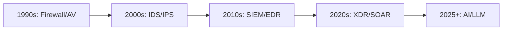
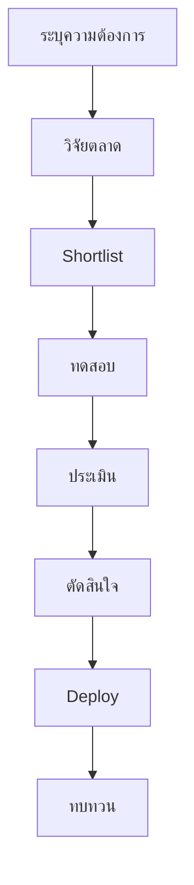
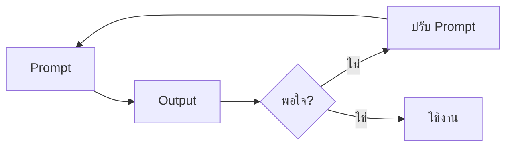
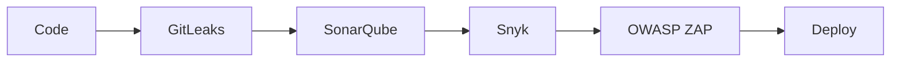
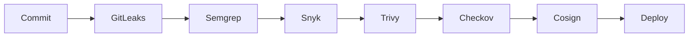
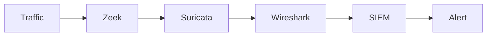
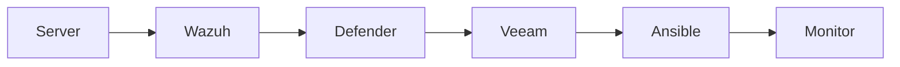
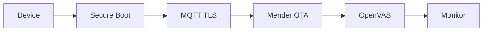
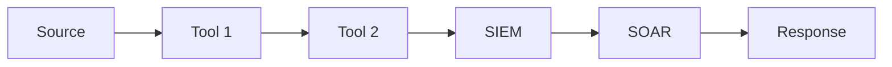

# 📕 เล่ม 8: Security Tools & Prompt Engineering Manual
## คู่มือเครื่องมือความปลอดภัยและการใช้ AI สำหรับงาน Cybersecurity ระดับมืออาชีพ | ฉบับเต็ม 300+ หน้า

---

## ส่วนนำ

### คำนำ

ในยุคที่ภัยคุกคามทางไซเบอร์มีความซับซ้อนและปริมาณเพิ่มขึ้นอย่างทวีคูณ การใช้เครื่องมือที่เหมาะสมและการนำ AI/LLM มาช่วยวิเคราะห์ ตอบสนอง และสร้างเอกสาร เป็นสิ่งที่ขาดไม่ได้สำหรับทีมความปลอดภัยมืออาชีพ คู่มือเล่มนี้จัดทำขึ้นเพื่อเป็นมาตรฐานการเลือกใช้เครื่องมือ การ deploy การ operate และการใช้ Prompt Engineering อย่างมีจริยธรรมและถูกกฎหมาย

คู่มือนี้ไม่เพียงแต่แนะนำเครื่องมือแต่ละประเภท แต่ยังลงลึกถึงวิธีการประเมิน เลือกใช้ และ integrate เครื่องมือเข้ากับกระบวนการทำงานจริง พร้อมด้วย Prompt Templates สำหรับ 6 บทบาท และกรณีศึกษาที่สามารถนำไปใช้ได้ทันที

### วัตถุประสงค์

1. กำหนดมาตรฐานการเลือกใช้เครื่องมือความปลอดภัยขององค์กร
2. ให้ทีมรู้จักเครื่องมือที่เหมาะสมกับงานแต่ละประเภท
3. ใช้ AI/LLM ช่วยวิเคราะห์ สร้างเอกสาร และตอบสนองเหตุการณ์
4. ทำงานอย่างมีจริยธรรมและถูกกฎหมาย
5. เตรียมพร้อมสำหรับ Compliance และ Audit
6. ใช้เป็นคู่มือฝึกทีมใหม่
7. ลดค่าใช้จ่ายด้วย Open Source และ Automation

### ขอบเขต

ครอบคลุมเครื่องมือทุกประเภทที่ใช้ในงาน Cybersecurity:
- Network Security Tools
- Endpoint Security Tools
- SIEM / SOAR
- Vulnerability Management
- Web Application Security
- Digital Forensics
- Threat Intelligence
- IAM / PAM
- Cloud Security
- DevSecOps
- GRC
- Backup & Recovery
- Security Awareness
- AI / LLM / Prompt Engineering

### กลุ่มเป้าหมาย

| กลุ่ม | บทบาท |
|---|---|
| Security Analyst | ใช้เครื่องมือวิเคราะห์ |
| SOC Analyst | ใช้ SIEM, EDR, SOAR |
| Penetration Tester | ใช้เครื่องมือทดสอบ |
| Forensics Investigator | ใช้เครื่องมือ Forensics |
| DevOps / DevSecOps | ใช้เครื่องมือ Pipeline |
| Network Engineer | ใช้เครื่องมือ Network |
| SysAdmin | ใช้เครื่องมือ Hardening |
| IoT Engineer | ใช้เครื่องมือ IoT |
| ผู้บริหาร | เลือกใช้เครื่องมือเชิงกลยุทธ์ |
| ทุกบทบาท | ใช้ AI/Prompt |

---

## สารบัญฉบับเต็ม

**ส่วนที่ 1: ปฐมบท (หน้า 1–50)**
- บทที่ 1 บทนำสู่ Security Tools
- บทที่ 2 หลักการเลือกใช้เครื่องมือ
- บทที่ 3 การประเมินและทดสอบเครื่องมือ
- บทที่ 4 จริยธรรมและกฎหมาย

**ส่วนที่ 2: เครื่องมือแยกประเภท (หน้า 51–180)**
- บทที่ 5 Network Security Tools
- บทที่ 6 Endpoint Security Tools
- บทที่ 7 SIEM และ SOAR
- บทที่ 8 Vulnerability Management Tools
- บทที่ 9 Web Application Security Tools
- บทที่ 10 Digital Forensics Tools
- บทที่ 11 Threat Intelligence Tools
- บทที่ 12 IAM และ PAM Tools
- บทที่ 13 Cloud Security Tools
- บทที่ 14 DevSecOps Tools
- บทที่ 15 GRC Tools
- บทที่ 16 Backup & Recovery Tools
- บทที่ 17 Security Awareness Tools

**ส่วนที่ 3: Prompt Engineering (หน้า 181–260)**
- บทที่ 18 บทนำสู่ Prompt Engineering
- บทที่ 19 Master Prompt Template
- บทที่ 20 Prompt สำหรับ 6 บทบาท
- บทที่ 21 Prompt สำหรับงานเฉพาะทาง
- บทที่ 22 การตรวจสอบและปรับปรุง Prompt
- บทที่ 23 ข้อควรระวังและจริยธรรม AI

**ส่วนที่ 4: ปฏิบัติการ (หน้า 261–330)**
- บทที่ 24 Tool Mapping กับ 6 บทบาท
- บทที่ 25 การ Integrate เครื่องมือ
- บทที่ 26 Automation และ Orchestration
- บทที่ 27 Case Studies
- บทที่ 28 แบบฝึกหัดและเฉลย

**ภาคผนวก (หน้า 331–370)**
- A: Checklists 15 ชุด
- B: Templates 20 ชุด
- C: คำศัพท์ 200 คำ
- D: แหล่งเรียนรู้
- E: เฉลยแบบฝึกหัด

---

## บทที่ 1 บทนำสู่ Security Tools

### 1.1 ความหมายของ Security Tools

**Security Tools** หมายถึง ซอฟต์แวร์ ฮาร์ดแวร์ หรือบริการที่ใช้ในการป้องกัน ตรวจจับ วิเคราะห์ ตอบสนอง และกู้คืนจากภัยคุกคามทางไซเบอร์

**ประเภทของเครื่องมือ**:
- **Preventive**: ป้องกัน (Firewall, WAF)
- **Detective**: ตรวจจับ (IDS, EDR, SIEM)
- **Corrective**: แก้ไข (SOAR, IR Tools)
- **Analytical**: วิเคราะห์ (Forensics, Malware Analysis)
- **Administrative**: บริหาร (IAM, GRC)

### 1.2 ความสำคัญของเครื่องมือ

| มิติ | ผลลัพธ์ |
|---|---|
| การป้องกัน | ลดช่องโหว่ ลด Attack Surface |
| การตรวจจับ | เร็วขึ้น แม่นยำขึ้น |
| การตอบสนอง | ลด MTTR |
| การวิเคราะห์ | เข้าใจภัยคุกคาม |
| Compliance | ผ่าน Audit |
| ประสิทธิภาพ | ลด Manual Work |
| ค่าใช้จ่าย | ลดความเสียหาย |

### 1.3 วิวัฒนาการของเครื่องมือ



### 1.4 ประเภทของเครื่องมือตาม Layer

| Layer | เครื่องมือ |
|---|---|
| Network | Firewall, IDS/IPS, NDR |
| Endpoint | EDR, AV, HIDS |
| Application | WAF, SAST, DAST |
| Data | DLP, Encryption |
| Identity | IAM, PAM, MFA |
| Cloud | CSPM, CWPP |
| Monitoring | SIEM, SOAR |
| Response | TheHive, Cortex |

### 1.5 Open Source vs Commercial

| มิติ | Open Source | Commercial |
|---|---|---|
| ค่าใช้จ่าย | ฟรี | แพง |
| การสนับสนุน | Community | Vendor |
| Customization | สูง | จำกัด |
| Features | ครบ | ครบ+ |
| Maintenance | ต้องดูแลเอง | Vendor ดูแล |
| Security | ตรวจสอบได้ | Black Box |
| Integration | ยืดหยุ่น | ตาม Vendor |

### 1.6 แนวโน้ม 2025+

1. **AI/LLM Integration** – AI ช่วยวิเคราะห์
2. **XDR** – รวมทุก Layer
3. **SOAR** – Automate Response
4. **Zero Trust** – ตรวจสอบทุกครั้ง
5. **Cloud-Native** – เครื่องมือ Cloud
6. **OT/IoT Security** – ขยายขอบเขต
7. **Privacy-Enhancing** – รักษาความเป็นส่วนตัว

### 1.7 ตัวอย่างจริง: เลือกใช้เครื่องมือ

**สถานการณ์**: องค์กรขนาดกลาง ต้องการ SIEM

**ทางเลือก**:
- Splunk (Commercial, แพง)
- ELK (Open Source, ฟรี)
- Wazuh (Open Source, ฟรี)

**การตัดสินใจ**:
- งบจำกัด → Wazuh
- ต้องการ Support → Splunk
- ต้องการ Customize → ELK

### 1.8 แบบฝึกหัด

**แบบฝึกหัด 1.1**
อธิบายความแตกต่างระหว่าง Preventive, Detective, Corrective Tools

**แบบฝึกหัด 1.2**
เปรียบเทียบ Open Source vs Commercial Tools 5 ข้อ

**แบบฝึกหัด 1.3**
เลือกเครื่องมือ SIEM สำหรับองค์กรขนาดเล็ก 100 คน พร้อมเหตุผล

---

## บทที่ 2 หลักการเลือกใช้เครื่องมือ

### 2.1 หลักการ 10 ประการ

1. **Risk-Based** – เลือกตามความเสี่ยง
2. **Fit for Purpose** – เหมาะกับงาน
3. **Scalable** – ขยายได้
4. **Integrable** – เชื่อมต่อได้
5. **Usable** – ใช้งานง่าย
6. **Supportable** – มี Support
7. **Affordable** – งบประมาณ
8. **Compliant** – ถูกกฎหมาย
9. **Testable** – ทดสอบได้
10. **Maintainable** – ดูแลได้

### 2.2 กระบวนการเลือกเครื่องมือ



### 2.3 การระบุความต้องการ

**SOP**:
1. ระบุปัญหาที่ต้องแก้
2. ระบุ Use Case
3. ระบุ Requirement
4. ระบุ Constraint
5. ระบุ Budget
6. ระบุ Timeline

**Template: Requirement**

| ID | Requirement | ประเภท | Priority |
|---|---|---|---|
| R-001 | ตรวจจับ Malware | Functional | Must |
| R-002 | รองรับ 1000 Endpoint | Scalability | Must |
| R-003 | เชื่อมต่อ SIEM | Integration | Should |

### 2.4 การประเมินเครื่องมือ

**เกณฑ์การประเมิน**:

| เกณฑ์ | น้ำหนัก | คะแนน 1–5 |
|---|---|---|
| Features | 25% | |
| Usability | 15% | |
| Performance | 15% | |
| Integration | 15% | |
| Support | 10% | |
| Cost | 10% | |
| Security | 10% | |

**Template: Evaluation Matrix**

| Tool | Features | Usability | Performance | Integration | Support | Cost | Security | Total |
|---|---|---|---|---|---|---|---|---|
| Tool A | 4 | 5 | 4 | 4 | 5 | 3 | 4 | 4.15 |
| Tool B | 5 | 4 | 5 | 5 | 4 | 2 | 5 | 4.45 |

### 2.5 การทดสอบ (POC)

**SOP: POC**
1. กำหนด Scope
2. กำหนด Duration (2–4 สัปดาห์)
3. กำหนด Success Criteria
4. Deploy ใน Lab
5. ทดสอบ Use Case
6. วัดผล
7. สรุป

**Template: POC Report**

| หัวข้อ | รายละเอียด |
|---|---|
| Tool | |
| Duration | |
| Scope | |
| Success Criteria | |
| ผลลัพธ์ | |
| ปัญหา | |
| ข้อเสนอแนะ | |

### 2.6 TCO (Total Cost of Ownership)

**องค์ประกอบ**:
- License
- Hardware
- Implementation
- Training
- Support
- Maintenance
- Personnel
- Upgrade

**Template: TCO**

| รายการ | ปี 1 | ปี 2 | ปี 3 | รวม |
|---|---|---|---|---|
| License | | | | |
| Hardware | | | | |
| Implementation | | | | |
| Training | | | | |
| Support | | | | |
| รวม | | | | |

### 2.7 แบบฝึกหัด

**แบบฝึกหัด 2.1**
สร้าง Evaluation Matrix สำหรับเลือก EDR 3 ตัว

**แบบฝึกหัด 2.2**
เขียน POC Plan สำหรับ SIEM

**แบบฝึกหัด 2.3**
คำนวณ TCO สำหรับเครื่องมือ 3 ปี

---

## บทที่ 3 การประเมินและทดสอบเครื่องมือ

### 3.1 การทดสอบใน Lab

**SOP: สร้าง Lab**
1. แยก Network
2. เตรียม VM
3. ติดตั้ง Tool
4. เตรียม Test Case
5. ทดสอบ
6. วัดผล
7. ทำลาย Lab

**เครื่องมือ Lab**:
- VirtualBox / VMware
- Proxmox
- Docker
- Vagrant
- Terraform

### 3.2 Test Cases

| ประเภท | ตัวอย่าง |
|---|---|
| Functional | ตรวจจับ Malware |
| Performance | รองรับ 1000 EPS |
| Scalability | เพิ่ม Agent |
| Integration | ส่ง Log เข้า SIEM |
| Usability | ใช้งานง่าย |
| Security | ทดสอบช่องโหว่ |

### 3.3 การวัดผล

**Metrics**:
- Detection Rate
- False Positive Rate
- Performance (EPS)
- Latency
- Resource Usage
- Usability Score

### 3.4 Benchmark

**SOP: Benchmark**
1. กำหนด Baseline
2. ทดสอบ Tool A
3. ทดสอบ Tool B
4. เปรียบเทียบ
5. สรุป

**Template: Benchmark**

| Metric | Tool A | Tool B | Tool C |
|---|---|---|---|
| Detection Rate | 95% | 92% | 98% |
| FP Rate | 5% | 8% | 3% |
| EPS | 10K | 8K | 15K |
| Latency | 100ms | 150ms | 80ms |

### 3.5 แบบฝึกหัด

**แบบฝึกหัด 3.1**
ออกแบบ Test Case สำหรับ EDR

**แบบฝึกหัด 3.2**
สร้าง Benchmark Report

---

## บทที่ 4 จริยธรรมและกฎหมาย

### 4.1 หลักจริยธรรม

1. **ได้รับอนุญาต** – ต้องมี Written Permission
2. **ขอบเขตชัดเจน** – Scope ต้องชัด
3. **ไม่ทำลาย** – ห้ามทำลายระบบ
4. **รักษาความลับ** – ข้อมูลต้องลับ
5. **รายงานผล** – รายงานตรงไปตรงมา
6. **ไม่ใช้ผิด** – ห้ามใช้เครื่องมือโจมตี
7. **ปฏิบัติตามกฎหมาย** – PDPA, Computer Act

### 4.2 กฎหมายที่เกี่ยวข้อง

| กฎหมาย | ขอบเขต | โทษ |
|---|---|---|
| พ.ร.บ. คอมพิวเตอร์ | อาชญากรรมไซเบอร์ | จำคุก |
| PDPA | ข้อมูลส่วนบุคคล | ปรับ 5 ล้าน |
| GDPR | EU Citizens | 4% รายได้ |
| ISO 27001 | มาตรฐาน | Certification |

### 4.3 การขออนุญาต

**Template: Authorization Letter**

```
Authorization to Conduct Security Testing

Client: [ชื่อ]
Tester: [ชื่อ]
Scope: [ระบบ]
Duration: [วันที่]
Activities: [รายการ]
Limitations: [ข้อจำกัด]
Contact: [ผู้ติดต่อ]

Signature: ___________
Date: ___________
```

### 4.4 Rules of Engagement

**องค์ประกอบ**:
- Scope
- Timeline
- Activities
- Limitations
- Communication
- Emergency Contact
- Legal

### 4.5 ข้อห้าม

- ห้ามทดสอบโดยไม่ได้รับอนุญาต
- ห้ามใช้เครื่องมือโจมตีกับเป้าหมายจริง
- ห้ามขโมยข้อมูล
- ห้ามทำลายระบบ
- ห้ามเปิดเผยข้อมูล
- ห้ามใช้เพื่อส่วนตัว

### 4.6 แบบฝึกหัด

**แบบฝึกหัด 4.1**
เขียน Authorization Letter สำหรับ Pen Test

**แบบฝึกหัด 4.2**
อธิบาย Rules of Engagement 7 องค์ประกอบ

---

## บทที่ 5 Network Security Tools

### 5.1 ประเภทเครื่องมือ Network

| ประเภท | เครื่องมือ | ใช้ |
|---|---|---|
| Packet Analysis | Wireshark, tcpdump | วิเคราะห์ Packet |
| Port Scan | Nmap, Masscan | สแกน Port |
| IDS/IPS | Snort, Suricata, Zeek | ตรวจจับ |
| Firewall | pfSense, iptables | กรอง |
| VPN | OpenVPN, WireGuard | เชื่อมต่อ |
| Monitoring | Nagios, Zabbix | เฝ้าระวัง |
| DDoS | Cloudflare, Akamai | ป้องกัน |

### 5.2 Wireshark

**ความสามารถ**:
- Capture Packet
- Filter
- Analyze Protocol
- Follow Stream
- Statistics

**Filters ที่ใช้บ่อย**:
```
ip.addr == 192.168.1.1
tcp.port == 443
http.request
dns.qry.name contains "malicious"
tcp.flags.syn == 1 && tcp.flags.ack == 0
```

**SOP: วิเคราะห์ Packet**
1. Capture
2. Filter
3. ดู Protocol
4. Follow Stream
5. วิเคราะห์
6. สรุป

### 5.3 Nmap

**คำสั่งที่ใช้บ่อย**:
```bash
# Scan Port
nmap -sS 192.168.1.1

# Service Version
nmap -sV 192.168.1.1

# OS Detection
nmap -O 192.168.1.1

# Script Scan
nmap --script vuln 192.168.1.1

# Full Scan
nmap -A -T4 192.168.1.1

# Scan Network
nmap -sn 192.168.1.0/24
```

### 5.4 Suricata

**Config**:
```yaml
%YAML 1.1
---
vars:
  address-groups:
    HOME_NET: "[192.168.0.0/16,10.0.0.0/8]"
    EXTERNAL_NET: "!$HOME_NET"

default-rule-path: /etc/suricata/rules
rule-files:
  - suricata.rules
  - emerging-threats.rules
```

**Rule ตัวอย่าง**:
```
alert tcp $EXTERNAL_NET any -> $HOME_NET 445 (
  msg:"SMB Exploit Attempt";
  flow:to_server,established;
  content:"|FF|SMB";
  sid:1000001;
  rev:1;
)
```

### 5.5 Zeek

**Script ตัวอย่าง**:
```zeek
event connection_established(c: connection)
{
  if (c$id$resp_p == 445/tcp)
  {
    NOTICE([$note=Notice::ACTION_LOG,
            $msg="SMB Connection",
            $conn=c]);
  }
}
```

### 5.6 SOP: ใช้เครื่องมือ Network

1. ระบุวัตถุประสงค์
2. เลือกเครื่องมือ
3. เตรียม Environment
4. Capture/Scan
5. วิเคราะห์
6. รายงาน
7. เก็บหลักฐาน

### 5.7 แบบฝึกหัด

**แบบฝึกหัด 5.1**
ใช้ Wireshark วิเคราะห์ HTTP Traffic

**แบบฝึกหัด 5.2**
เขียน Nmap Command สำหรับ Scan Network

**แบบฝึกหัด 5.3**
เขียน Suricata Rule ตรวจจับ SQL Injection

---

## บทที่ 6 Endpoint Security Tools

### 6.1 ประเภทเครื่องมือ Endpoint

| ประเภท | เครื่องมือ | ใช้ |
|---|---|---|
| AV | Defender, ClamAV | ตรวจจับ Malware |
| EDR | CrowdStrike, SentinelOne | ตรวจจับ+ตอบสนอง |
| HIDS | OSSEC, Wazuh | ตรวจจับ Host |
| Sysmon | Sysinternals | Log Windows |
| Velociraptor | Velociraptor | DFIR |

### 6.2 Sysmon

**Config ตัวอย่าง**:
```xml
<Sysmon>
  <EventFiltering>
    <ProcessCreate onmatch="include">
      <CommandLine condition="contains">powershell</CommandLine>
    </ProcessCreate>
    <NetworkConnect onmatch="include">
      <DestinationPort condition="is">4444</DestinationPort>
    </NetworkConnect>
  </EventFiltering>
</Sysmon>
```

**ติดตั้ง**:
```powershell
sysmon.exe -accepteula -i sysmonconfig.xml
```

### 6.3 Wazuh

**Agent Config**:
```xml
<ossec_config>
  <client>
    <server>
      <address>wazuh-manager.example.com,mycompany.com,gmail.com</address>
      <port>1514</port>
      <protocol>tcp</protocol>
    </server>
  </client>
  <syscheck>
    <directories check_all="yes">/etc,/usr/bin,/usr/sbin</directories>
    <directories check_all="yes">/bin,/sbin</directories>
  </syscheck>
  <rootcheck>
    <disabled>no</disabled>
  </rootcheck>
  <localfile>
    <log_format>syslog</log_format>
    <location>/var/log/auth.log</location>
  </localfile>
</ossec_config>
```

### 6.4 Velociraptor

**VQL Query ตัวอย่าง**:
```sql
SELECT Name, Pid, CommandLine
FROM pslist()
WHERE CommandLine =~ "powershell"
```

### 6.5 SOP: ใช้ EDR

1. Deploy Agent
2. Config Policy
3. ตั้ง Alert
4. Monitor
5. ตอบสนอง
6. Report

### 6.6 แบบฝึกหัด

**แบบฝึกหัด 6.1**
เขียน Sysmon Config ตรวจจับ PowerShell

**แบบฝึกหัด 6.2**
เขียน Wazuh Rule ตรวจจับ SSH Brute Force

**แบบฝึกหัด 6.3**
เขียน VQL Query หา Process น่าสงสัย

---

## บทที่ 7 SIEM และ SOAR

### 7.1 SIEM คืออะไร

**SIEM (Security Information and Event Management)** คือระบบที่รวม Log จากหลายแหล่ง วิเคราะห์ Correlation และแจ้งเตือน

**องค์ประกอบ**:
- Log Collection
- Normalization
- Correlation
- Alerting
- Dashboard
- Retention

### 7.2 SIEM Tools

| Tool | ประเภท | จุดเด่น |
|---|---|---|
| Splunk | Commercial | ทรงพลัง |
| ELK | Open Source | ยืดหยุ่น |
| Wazuh | Open Source | ครบ |
| Sentinel | Cloud | Azure |
| QRadar | Commercial | Enterprise |

### 7.3 Wazuh SIEM

**Rule ตัวอย่าง**:
```xml
<group name="sshd,">
  <rule id="100001" level="10">
    <if_sid>5710</if_sid>
    <match>Failed password</match>
    <description>SSH Brute Force Attempt</description>
    <mitre>
      <id>T1110</id>
    </mitre>
  </rule>
</group>
```

### 7.4 ELK Stack

**Logstash Config**:
```
input {
  beats {
    port => 5044
  }
}

filter {
  if [type] == "syslog" {
    grok {
      match => { "message" => "%{SYSLOGTIMESTAMP:timestamp} %{SYSLOGHOST:host} %{DATA:program}: %{GREEDYDATA:msg}" }
    }
  }
}

output {
  elasticsearch {
    hosts => ["localhost:9200"]
    index => "logs-%{+YYYY.MM.dd}"
  }
}
```

### 7.5 SOAR

**SOAR (Security Orchestration, Automation and Response)** คือระบบที่ Automate การตอบสนอง

**องค์ประกอบ**:
- Orchestration
- Automation
- Response
- Playbook
- Case Management

**SOAR Tools**:
- TheHive + Cortex
- Shuffle
- Splunk Phantom
- Palo Alto XSOAR

### 7.6 TheHive + Cortex

**Setup**:
```yaml
version: '3'
services:
  thehive:
    image: thehiveproject/thehive:latest
    ports:
      - "9000:9000"
    volumes:
      - ./thehive/data:/opt/thp/thehive/data
      - ./thehive/config:/etc/thehive
    environment:
      - THP_CORTEX_URL=http://cortex:9001
  cortex:
    image: thehiveproject/cortex:latest
    ports:
      - "9001:9001"
```

### 7.7 SOP: ใช้ SIEM/SOAR

1. ติดตั้ง
2. รับ Log
3. สร้าง Rule
4. Tune
5. Alert
6. Automate
7. Report

### 7.8 แบบฝึกหัด

**แบบฝึกหัด 7.1**
เขียน Wazuh Rule ตรวจจับ SQL Injection

**แบบฝึกหัด 7.2**
เขียน Logstash Config สำหรับ Apache Log

**แบบฝึกหัด 7.3**
ออกแบบ SOAR Playbook สำหรับ Phishing

---

## บทที่ 8 Vulnerability Management Tools

### 8.1 ประเภทเครื่องมือ

| ประเภท | เครื่องมือ | ใช้ |
|---|---|---|
| Network Scan | Nessus, OpenVAS | สแกน Network |
| Web Scan | Burp, ZAP | สแกน Web |
| Container Scan | Trivy, Clair | สแกน Container |
| Code Scan | SonarQube, Snyk | สแกน Code |
| Cloud Scan | Prowler, ScoutSuite | สแกน Cloud |

### 8.2 OpenVAS

**คำสั่ง**:
```bash
# เริ่ม Scan
gvm-cli socket --xml "<get_tasks/>"

# สร้าง Target
gvm-cli socket --xml "<create_target><name>Web Server</name><hosts>192.168.1.10</hosts></create_target>"

# เริ่ม Task
gvm-cli socket --xml "<start_task task_id='...'/>"
```

### 8.3 Trivy

**คำสั่ง**:
```bash
# Scan Image
trivy image nginx:latest

# Scan Filesystem
trivy fs /path/to/code

# Scan Repo
trivy repo https://github.com/user/repo

# Scan K8s
trivy k8s --report summary cluster

# Output JSON
trivy image -f json -o result.json nginx:latest
```

### 8.4 Snyk

**คำสั่ง**:
```bash
# Test
snyk test

# Monitor
snyk monitor

# Fix
snyk fix

# Container
snyk container test nginx:latest

# IaC
snyk iac test terraform/
```

### 8.5 SonarQube

**sonar-project.properties**:
```
sonar.projectKey=myapp
sonar.sources=src
sonar.host.url=http://sonarqube:9000
sonar.login=token
sonar.exclusions=**/node_modules/**
```

### 8.6 SOP: Vulnerability Management

1. Inventory
2. Scan
3. Prioritize
4. Patch
5. Verify
6. Report
7. Repeat

### 8.7 SLA Patch

| Severity | SLA |
|---|---|
| Critical | 24 ชม. |
| High | 7 วัน |
| Medium | 30 วัน |
| Low | 90 วัน |

### 8.8 แบบฝึกหัด

**แบบฝึกหัด 8.1**
ใช้ Trivy Scan Image และวิเคราะห์ผล

**แบบฝึกหัด 8.2**
เขียน Snyk Pipeline สำหรับ Node.js

**แบบฝึกหัด 8.3**
จัดลำดับ Vulnerability 5 รายการตาม CVSS

---

## บทที่ 9 Web Application Security Tools

### 9.1 ประเภทเครื่องมือ

| ประเภท | เครื่องมือ | ใช้ |
|---|---|---|
| Proxy | Burp Suite, ZAP | Intercept |
| Scanner | Acunetix, Netsparker | Scan |
| Fuzzer | ffuf, wfuzz | Fuzz |
| Exploit | Metasploit | Exploit |

### 9.2 Burp Suite

**Features**:
- Proxy
- Scanner
- Intruder
- Repeater
- Decoder
- Comparer

**SOP: ใช้ Burp**
1. ตั้ง Proxy
2. Intercept Request
3. วิเคราะห์
4. แก้ไข
5. ส่งซ้ำ
6. Scan
7. Report

### 9.3 OWASP ZAP

**คำสั่ง**:
```bash
# Baseline Scan
zap-baseline.py -t https://gmail.com

# Full Scan
zap-full-scan.py -t https://gmail.com

# API Scan
zap-api-scan.py -t https://gmail.com/api -f openapi

# Report
zap-baseline.py -t https://gmail.com -r report.html
```

### 9.4 ffuf

**คำสั่ง**:
```bash
# Directory Fuzz
ffuf -w wordlist.txt -u https://gmail.com/FUZZ

# Parameter Fuzz
ffuf -w params.txt -u https://gmail.com/api?FUZZ=test

# POST Fuzz
ffuf -w data.txt -u https://gmail.com/api -X POST -d "FUZZ"

# Filter
ffuf -w wordlist.txt -u https://gmail.com/FUZZ -fc 404
```

### 9.5 SOP: Web App Security Testing

1. ได้รับอนุญาต
2. Scope
3. Recon
4. Scan
5. Manual Test
6. Exploit (ถ้าอนุญาต)
7. Report
8. Retest

### 9.6 แบบฝึกหัด

**แบบฝึกหัด 9.1**
ใช้ ZAP Scan เว็บทดสอบ

**แบบฝึกหัด 9.2**
ใช้ ffuf หา Directory

**แบบฝึกหัด 9.3**
เขียน Report สำหรับ OWASP Top 10

---

## บทที่ 10 Digital Forensics Tools

### 10.1 ประเภทเครื่องมือ

| ประเภท | เครื่องมือ | ใช้ |
|---|---|---|
| Disk | Autopsy, FTK | วิเคราะห์ Disk |
| Memory | Volatility | วิเคราะห์ RAM |
| Network | Wireshark | วิเคราะห์ Packet |
| Mobile | Cellebrite | วิเคราะห์ Phone |
| Timeline | Plaso | สร้าง Timeline |

### 10.2 Autopsy

**SOP**:
1. สร้าง Case
2. เพิ่ม Data Source
3. เลือก Module
4. รอประมวลผล
5. วิเคราะห์
6. Report

### 10.3 Volatility

**คำสั่ง**:
```bash
# Image Info
volatility -f memory.dump imageinfo

# Process List
volatility -f memory.dump --profile=Win10x64 pslist

# Network
volatility -f memory.dump --profile=Win10x64 netscan

# Registry
volatility -f memory.dump --profile=Win10x64 hivelist

# Dump Process
volatility -f memory.dump --profile=Win10x64 procdump -p 1234 -D output/

# Malware
volatility -f memory.dump --profile=Win10x64 malfind
```

### 10.4 Plaso

**คำสั่ง**:
```bash
# สร้าง Timeline
log2timeline.py timeline.plaso disk_image.dd

# Filter
psort.py -o l2tcsv timeline.plaso -w timeline.csv

# Filter by Date
psort.py -o l2tcsv timeline.plaso "date > '2026-01-01'"
```

### 10.5 SOP: Forensics

1. Preserve
2. Chain of Custody
3. Image
4. Hash
5. Analyze
6. Report
7. Store

### 10.6 แบบฝึกหัด

**แบบฝึกหัด 10.1**
ใช้ Volatility วิเคราะห์ Memory Dump

**แบบฝึกหัด 10.2**
สร้าง Timeline ด้วย Plaso

**แบบฝึกหัด 10.3**
เขียน Forensics Report

---

## บทที่ 11 Threat Intelligence Tools

### 11.1 ประเภทเครื่องมือ

| ประเภท | เครื่องมือ | ใช้ |
|---|---|---|
| IOC | VirusTotal, MISP | ตรวจ IOC |
| OSINT | Shodan, Censys | ค้นหา |
| Dark Web | Recorded Future | Monitoring |
| TIP | MISP, OpenCTI | จัดการ |

### 11.2 VirusTotal

**API ตัวอย่าง**:
```python
import requests

API_KEY = "your_api_key"
file_hash = "abc123..."

url = f"https://www.virustotal.com/api/v3/files/{file_hash}"
headers = {"x-apikey": API_KEY}

response = requests.get(url, headers=headers)
data = response.json()
print(data)
```

### 11.3 MISP

**API ตัวอย่าง**:
```python
from pymisp import PyMISP

misp = PyMISP('https://misp.example.com,mycompany.com,gmail.com', 'api_key', False)
event = misp.get_event(123)
print(event)
```

### 11.4 Shodan

**API ตัวอย่าง**:
```python
import shodan

api = shodan.Shodan('API_KEY')
results = api.search('apache country:TH')
for result in results['matches']:
    print(result['ip_str'], result['port'])
```

### 11.5 SOP: ใช้ Threat Intel

1. รวบรวม
2. ตรวจสอบ
3. วิเคราะห์
4. นำไปใช้
5. แชร์
6. วัดผล

### 11.6 แบบฝึกหัด

**แบบฝึกหัด 11.1**
ใช้ VirusTotal API ตรวจ Hash

**แบบฝึกหัด 11.2**
สร้าง MISP Event

**แบบฝึกหัด 11.3**
ใช้ Shodan ค้นหา Server ในประเทศไทย

---

## บทที่ 12 IAM และ PAM Tools

### 12.1 ประเภทเครื่องมือ

| ประเภท | เครื่องมือ | ใช้ |
|---|---|---|
| SSO | Keycloak, Okta | Single Sign-On |
| MFA | Google Auth, Duo | ยืนยันตัวตน |
| PAM | CyberArk, Teleport | จัดการ Privileged |
| IGA | SailPoint | Governance |

### 12.2 Keycloak

**Docker Compose**:
```yaml
version: '3'
services:
  keycloak:
    image: quay.io/keycloak/keycloak:latest
    environment:
      - KEYCLOAK_ADMIN=admin
      - KEYCLOAK_ADMIN_PASSWORD=admin
    ports:
      - "8080:8080"
    command: start-dev
```

### 12.3 Teleport

**Config**:
```yaml
version: v3
teleport:
  nodename: teleport.example.com,mycompany.com,gmail.com
  data_dir: /var/lib/teleport
  auth_token: secret
  auth_server: teleport.example.com,mycompany.com,gmail.com:3025
```

### 12.4 SOP: ใช้ IAM

1. กำหนด Policy
2. สร้าง User
3. กำหนด Role
4. เปิด MFA
5. Review
6. Offboard

### 12.5 แบบฝึกหัด

**แบบฝึกหัด 12.1**
ติดตั้ง Keycloak และสร้าง Realm

**แบบฝึกหัด 12.2**
ตั้งค่า MFA ใน Keycloak

---

## บทที่ 13 Cloud Security Tools

### 13.1 ประเภทเครื่องมือ

| ประเภท | เครื่องมือ | ใช้ |
|---|---|---|
| CSPM | Prowler, ScoutSuite | Posture |
| CWPP | Aqua, Twistlock | Workload |
| CASB | Netskope | Cloud Access |
| Cloud SIEM | Sentinel, GuardDuty | Monitoring |

### 13.2 Prowler

**คำสั่ง**:
```bash
# Scan AWS
prowler aws

# Scan เฉพาะ Service
prowler aws --services s3 iam

# Output
prowler aws -M json -o output/

# Compliance
prowler aws --compliance cis_1.5_aws
```

### 13.3 ScoutSuite

**คำสั่ง**:
```bash
# Scan AWS
scout aws

# Scan Azure
scout azure

# Scan GCP
scout gcp

# Report
scout aws --report-dir ./report
```

### 13.4 GuardDuty

**คำสั่ง**:
```bash
# เปิด GuardDuty
aws guardduty create-detector --enable

# ดู Findings
aws guardduty list-findings --detector-id <id>

# Get Finding
aws guardduty get-findings --detector-id <id> --finding-ids <finding-id>
```

### 13.5 SOP: Cloud Security

1. Inventory
2. Scan
3. Prioritize
4. Remediate
5. Monitor
6. Report

### 13.6 แบบฝึกหัด

**แบบฝึกหัด 13.1**
ใช้ Prowler Scan AWS

**แบบฝึกหัด 13.2**
ใช้ ScoutSuite Scan Azure

**แบบฝึกหัด 13.3**
ตั้งค่า GuardDuty

---

## บทที่ 14 DevSecOps Tools

### 14.1 ประเภทเครื่องมือ

| ประเภท | เครื่องมือ | ใช้ |
|---|---|---|
| SAST | SonarQube, Semgrep | Scan Code |
| SCA | Snyk, Dependabot | Scan Dependency |
| Secret Scan | GitLeaks, TruffleHog | หา Secrets |
| IaC Scan | Checkov, tfsec | Scan IaC |
| Container | Trivy, Clair | Scan Image |

### 14.2 GitLeaks

**คำสั่ง**:
```bash
# Scan Repo
gitleaks detect --source . -v

# Scan History
gitleaks detect --source . --log-opts="--all"

# Config
gitleaks detect --config .gitleaks.toml
```

### 14.3 Checkov

**คำสั่ง**:
```bash
# Scan Terraform
checkov -d terraform/

# Scan K8s
checkov -f k8s.yaml

# Scan Dockerfile
checkov -f Dockerfile

# Output
checkov -d . -o json
```

### 14.4 Semgrep

**คำสั่ง**:
```bash
# Scan
semgrep --config=auto .

# OWASP
semgrep --config=p/owasp-top-ten .

# Custom Rule
semgrep --config=myrules.yaml .
```

### 14.5 SOP: DevSecOps

1. Secret Scan
2. SAST
3. SCA
4. Build
5. Image Scan
6. IaC Scan
7. Sign
8. Deploy
9. Monitor

### 14.6 แบบฝึกหัด

**แบบฝึกหัด 14.1**
เขียน GitHub Actions ที่ใช้ GitLeaks

**แบบฝึกหัด 14.2**
ใช้ Checkov Scan Terraform

**แบบฝึกหัด 14.3**
เขียน Semgrep Rule

---

## บทที่ 15 GRC Tools

### 15.1 ประเภทเครื่องมือ

| ประเภท | เครื่องมือ | ใช้ |
|---|---|---|
| GRC | SimpleRisk, Eramba | Governance |
| Compliance | Drata, Vanta | Automation |
| Risk | RiskWatch | Risk Management |
| Policy | PolicyHub | Policy Management |

### 15.2 SimpleRisk

**Features**:
- Risk Register
- Compliance
- Policy
- Incident

**SOP**:
1. ติดตั้ง
2. กำหนด Risk
3. ประเมิน
4. ติดตาม
5. Report

### 15.3 Eramba

**Features**:
- Compliance
- Risk
- Asset
- Control

### 15.4 SOP: GRC

1. กำหนด Scope
2. ระบุ Asset
3. ประเมิน Risk
4. กำหนด Control
5. Monitor
6. Report
7. Review

### 15.5 แบบฝึกหัด

**แบบฝึกหัด 15.1**
สร้าง Risk Register

**แบบฝึกหัด 15.2**
เขียน Compliance Report

---

## บทที่ 16 Backup & Recovery Tools

### 16.1 ประเภทเครื่องมือ

| ประเภท | เครื่องมือ | ใช้ |
|---|---|---|
| Enterprise | Veeam, Commvault | Backup องค์กร |
| Open Source | Restic, Bacula | Backup ฟรี |
| Cloud | AWS Backup | Cloud |
| DR | Zerto | Disaster Recovery |

### 16.2 Restic

**คำสั่ง**:
```bash
# Init
restic init --repo /backup

# Backup
restic -r /backup backup /data

# List
restic -r /backup snapshots

# Restore
restic -r /backup restore latest --target /restore

# Check
restic -r /backup check
```

### 16.3 Veeam

**SOP**:
1. ติดตั้ง
2. สร้าง Job
3. กำหนด Schedule
4. ทดสอบ Restore
5. Monitor
6. Report

### 16.4 SOP: Backup 3-2-1

1. 3 Copies
2. 2 Media
3. 1 Offsite
4. ทดสอบ Restore ทุก 3 เดือน
5. Encrypt
6. Monitor

### 16.5 แบบฝึกหัด

**แบบฝึกหัด 16.1**
ใช้ Restic Backup และ Restore

**แบบฝึกหัด 16.2**
เขียน Backup Policy

---

## บทที่ 17 Security Awareness Tools

### 17.1 ประเภทเครื่องมือ

| ประเภท | เครื่องมือ | ใช้ |
|---|---|---|
| Phishing Simulation | GoPhish, KnowBe4 | จำลอง |
| Training | KnowBe4, SANS | อบรม |
| Assessment | CyberCrowd | ประเมิน |

### 17.2 GoPhish

**Setup**:
```bash
# ติดตั้ง
wget https://github.com/gophish/gophish/releases/download/v0.12.1/gophish-v0.12.1-linux-64bit.zip
unzip gophish-v0.12.1-linux-64bit.zip
./gophish
```

**SOP**:
1. สร้าง Campaign
2. สร้าง Email Template
3. สร้าง Landing Page
4. ส่ง
5. วัดผล
6. อบรม
7. ทำซ้ำ

### 17.3 SOP: Awareness Program

1. Plan
2. Train
3. Simulate
4. Measure
5. Improve
6. Repeat

### 17.4 แบบฝึกหัด

**แบบฝึกหัด 17.1**
ตั้งค่า GoPhish และสร้าง Campaign

**แบบฝึกหัด 17.2**
เขียน Awareness Training Plan

---

## บทที่ 18 บทนำสู่ Prompt Engineering

### 18.1 ความหมาย

**Prompt Engineering** คือศิลปะและวิทยาศาสตร์ในการออกแบบคำสั่ง (Prompt) เพื่อให้ AI/LLM สร้างผลลัพธ์ที่ต้องการอย่างมีคุณภาพ

### 18.2 หลักการสำคัญ

1. **ชัดเจน** – ระบุสิ่งที่ต้องการ
2. **เฉพาะเจาะจง** – ระบุบริบท
3. **มีโครงสร้าง** – จัดรูปแบบ
4. **มีตัวอย่าง** – Few-shot
5. **มีข้อจำกัด** – ระบุขอบเขต
6. **มีเกณฑ์** – ระบุคุณภาพ
7. **ตรวจสอบได้** – Verify

### 18.3 องค์ประกอบของ Prompt ที่ดี

| องค์ประกอบ | คำอธิบาย | ตัวอย่าง |
|---|---|---|
| Role | บทบาท | "คุณเป็น Security Analyst" |
| Context | บริบท | "ระบบ E-commerce" |
| Task | งาน | "วิเคราะห์ Log" |
| Input | ข้อมูล | "Log ต่อไปนี้" |
| Constraints | ข้อจำกัด | "ห้ามคาดเดา" |
| Output | รูปแบบ | "ตาราง" |
| Quality | เกณฑ์ | "ครบถ้วน" |

### 18.4 ประเภทของ Prompt

| ประเภท | ลักษณะ | ตัวอย่าง |
|---|---|---|
| Zero-shot | ไม่มีตัวอย่าง | "แปลภาษาไทย" |
| One-shot | 1 ตัวอย่าง | "ตัวอย่าง: ..." |
| Few-shot | หลายตัวอย่าง | "ตัวอย่าง 1, 2, 3" |
| Chain-of-Thought | คิดเป็นขั้น | "คิดทีละขั้น" |
| Role-based | กำหนดบทบาท | "คุณเป็น..." |

### 18.5 การใช้ AI ใน Cybersecurity

**ใช้**:
- วิเคราะห์ Log
- สร้าง Rule
- เขียน Report
- สร้าง Playbook
- วิเคราะห์ Malware
- สร้าง Training
- แปลเอกสาร
- สรุปเหตุการณ์

### 18.6 ข้อควรระวัง

- อย่าใส่ข้อมูลลับ
- ตรวจสอบคำตอบ
- ห้ามใช้สร้าง Malware
- ปฏิบัติตามกฎหมาย
- AI เป็นผู้ช่วย ไม่ใช่ผู้ตัดสิน

### 18.7 แบบฝึกหัด

**แบบฝึกหัด 18.1**
อธิบายองค์ประกอบ 7 ประการของ Prompt ที่ดี

**แบบฝึกหัด 18.2**
เปรียบเทียบ Zero-shot, One-shot, Few-shot

**แบบฝึกหัด 18.3**
เขียน Prompt สำหรับวิเคราะห์ Log

---

## บทที่ 19 Master Prompt Template

### 19.1 Master Template

```text
บทบาท: [ระบุ]
บริบท: [ระบบ/องค์กร/เหตุการณ์]
เป้าหมาย: [ต้องการอะไร]
ข้อมูลที่มี: [log/timeline/นโยบาย]
ข้อจำกัด: [ห้ามคาดเดา/ห้ามข้อมูลลับ]
รูปแบบผลลัพธ์: [ตาราง/หัวข้อ/JSON]
เกณฑ์คุณภาพ: [ครบถ้วน/ตรวจสอบได้/ใช้งานได้]
```

### 19.2 ตัวอย่างการใช้

```text
บทบาท: คุณเป็น Security Analyst ผู้เชี่ยวชาญ
บริบท: ระบบ E-commerce ที่มีผู้ใช้ 1 ล้านคน
เป้าหมาย: วิเคราะห์ Log การ Login ที่ผิดปกติ
ข้อมูลที่มี: Log ต่อไปนี้ [แนบ Log]
ข้อจำกัด: ห้ามคาดเดา ใช้เฉพาะข้อมูลที่ให้
รูปแบบผลลัพธ์: ตาราง + สรุป
เกณฑ์คุณภาพ: ระบุ IP, เวลา, เหตุผล
```

### 19.3 การปรับแต่ง

**สำหรับงานวิเคราะห์**:
```text
เพิ่ม: "ใช้ MITRE ATT&CK Map"
เพิ่ม: "ระบุ Severity"
เพิ่ม: "เสนอ Action"
```

**สำหรับงานสร้างเอกสาร**:
```text
เพิ่ม: "ใช้ภาษาทางการ"
เพิ่ม: "มีความยาว 2 หน้า"
เพิ่ม: "มีตัวอย่าง"
```

### 19.4 แบบฝึกหัด

**แบบฝึกหัด 19.1**
ใช้ Master Template เขียน Prompt สำหรับวิเคราะห์ Phishing

**แบบฝึกหัด 19.2**
ปรับแต่ง Prompt สำหรับงานสร้าง Report

---

## บทที่ 20 Prompt สำหรับ 6 บทบาท

### 20.1 Developer

```text
คุณเป็น Secure Code Reviewer
ตรวจโค้ดต่อไปนี้: [โค้ด]
หา OWASP Top 10, Secrets, Input Validation, AuthN/AuthZ
เสนอแนวทางแก้ไขพร้อมตัวอย่างโค้ดที่ปลอดภัย
รูปแบบ: ตาราง (Issue, Severity, Fix)
```

**ตัวอย่างผลลัพธ์**:

| Issue | Severity | Fix |
|---|---|---|
| SQL Injection | Critical | ใช้ Prepared Statement |
| Hardcoded Secret | High | ใช้ Vault |
| Missing AuthZ | High | เพิ่ม Ownership Check |

### 20.2 DevOps

```text
คุณเป็น DevSecOps Engineer
วิเคราะห์ Pipeline ต่อไปนี้: [YAML]
หา Secrets, สิทธิ์กว้าง, Image ไม่ปลอดภัย, IaC Misconfig
เสนอ Security Gate และแนวทางแก้ไข
รูปแบบ: ตาราง + YAML ตัวอย่าง
```

### 20.3 Network

```text
คุณเป็น Network Security Engineer
วิเคราะห์ Firewall Rule ต่อไปนี้: [rule]
หา Rule ที่กว้างเกินไป, ซ้ำซ้อน, ควรลบ
เสนอ Rule ที่ใช้ Least Privilege
รูปแบบ: ตาราง + Rule ใหม่
```

### 20.4 SysAdmin

```text
คุณเป็น System Administrator
สร้าง Checklist Hardening Windows/Linux
ครอบคลุม Patch, IAM, Log, Backup, Service, Firewall
แสดงเป็นตาราง พร้อมคำอธิบาย
```

### 20.5 IoT

```text
คุณเป็น IoT Security Architect
ออกแบบสถาปัตยกรรมปลอดภัยสำหรับอุปกรณ์ IoT
ครอบคลุม Secure Boot, OTA, MQTT TLS, Network Isolation, Monitoring
รูปแบบ: แผนภาพ + ตาราง
```

### 20.6 ทั่วไป

```text
คุณเป็นผู้เชี่ยวชาญ Security Awareness
สร้างเนื้อหา Phishing Awareness ภาษาไทย 1 หน้า
พร้อมตัวอย่างอีเมลปลอม จุดสังเกต และสิ่งที่ต้องทำ
รูปแบบ: บทความ + Infographic Description
```

### 20.7 แบบฝึกหัด

**แบบฝึกหัด 20.1**
เขียน Prompt สำหรับ Developer ตรวจสอบ API

**แบบฝึกหัด 20.2**
เขียน Prompt สำหรับ Network วิเคราะห์ Packet Capture

**แบบฝึกหัด 20.3**
เขียน Prompt สำหรับ Awareness สร้างเนื้อหา Password

---

## บทที่ 21 Prompt สำหรับงานเฉพาะทาง

### 21.1 วิเคราะห์ Log

```text
บทบาท: SOC Analyst
ข้อมูล: [Log]
งาน: วิเคราะห์หาความผิดปกติ
หา: IP แปลก, เวลาผิดปกติ, Pattern ที่น่าสงสัย
รูปแบบ: ตาราง + Timeline + สรุป
เกณฑ์: ระบุ Severity, เสนอ Action
```

### 21.2 สร้าง Rule

```text
บทบาท: Detection Engineer
ข้อมูล: [TTP หรือ IOC]
งาน: สร้าง Rule สำหรับ SIEM/IDS
รูปแบบ: Rule + คำอธิบาย
ตัวอย่าง: Suricata, Sigma, Wazuh
```

### 21.3 เขียน Report

```text
บทบาท: IR Manager
ข้อมูล: [Incident Details]
งาน: เขียน Incident Report
รูปแบบ: หัวข้อ + Timeline + RCA + CAPA
เกณฑ์: ครบถ้วน, ตรวจสอบได้, ภาษาทางการ
```

### 21.4 วิเคราะห์ Malware

```text
บทบาท: Malware Analyst
ข้อมูล: [Strings, Hash, Behavior]
งาน: วิเคราะห์ Malware
หา: ประเภท, ความสามารถ, IOC
รูปแบบ: ตาราง + สรุป
ข้อจำกัด: ห้ามรัน Malware
```

### 21.5 สร้าง Playbook

```text
บทบาท: IR Manager
ข้อมูล: [Incident Type]
งาน: สร้าง Playbook
รูปแบบ: ขั้นตอน + ผู้รับผิดชอบ + เครื่องมือ
เกณฑ์: ใช้งานได้จริง
```

### 21.6 สรุปเหตุการณ์

```text
บทบาท: Security Analyst
ข้อมูล: [Timeline, Log]
งาน: สรุปเหตุการณ์
รูปแบบ: สรุป 1 หน้า + Timeline + บทเรียน
เกณฑ์: กระชับ, ครบถ้วน
```

### 21.7 แบบฝึกหัด

**แบบฝึกหัด 21.1**
เขียน Prompt วิเคราะห์ Log SSH

**แบบฝึกหัด 21.2**
เขียน Prompt สร้าง Sigma Rule

**แบบฝึกหัด 21.3**
เขียน Prompt สรุป Incident

---

## บทที่ 22 การตรวจสอบและปรับปรุง Prompt

### 22.1 การตรวจสอบผลลัพธ์

**SOP: Verify AI Output**
1. ตรวจความถูกต้อง
2. ตรวจความครบถ้วน
3. ตรวจความสอดคล้อง
4. ตรวจแหล่งอ้างอิง
5. ตรวจ Bias
6. ตรวจ Compliance

### 22.2 การปรับปรุง Prompt

**เทคนิค**:
- เพิ่ม Context
- เพิ่มตัวอย่าง
- ระบุ Format
- ระบุ Constraint
- แยกงานเป็นขั้น
- ใช้ Chain-of-Thought

### 22.3 Iterative Prompting



### 22.4 การวัดผล Prompt

| Metric | คำอธิบาย |
|---|---|
| Accuracy | ความถูกต้อง |
| Completeness | ครบถ้วน |
| Relevance | เกี่ยวข้อง |
| Consistency | สม่ำเสมอ |
| Time Saved | เวลาที่ประหยัด |

### 22.5 แบบฝึกหัด

**แบบฝึกหัด 22.1**
ปรับปรุง Prompt ที่ให้ผลไม่ดี

**แบบฝึกหัด 22.2**
วัดผล Prompt 3 แบบ

---

## บทที่ 23 ข้อควรระวังและจริยธรรม AI

### 23.1 ความเสี่ยงของ AI

| ความเสี่ยง | คำอธิบาย |
|---|---|
| Hallucination | AI สร้างข้อมูลเท็จ |
| Data Leak | ข้อมูลลับรั่ว |
| Bias | อคติ |
| Over-reliance | พึ่งพาเกินไป |
| Malicious Use | ใช้ผิด |
| Copyright | ละเมิดลิขสิทธิ์ |
| Privacy | ละเมิดความเป็นส่วนตัว |

### 23.2 หลักจริยธรรม AI

1. **Transparency** – โปร่งใส
2. **Accountability** – รับผิดชอบ
3. **Privacy** – รักษาความเป็นส่วนตัว
4. **Fairness** – เป็นธรรม
5. **Safety** – ปลอดภัย
6. **Human Oversight** – มนุษย์ควบคุม

### 23.3 SOP: ใช้ AI อย่างปลอดภัย

1. ไม่ใส่ข้อมูลลับ
2. ตรวจสอบผลลัพธ์
3. ใช้ใน Scope ที่อนุญาต
4. บันทึกการใช้
5. Review โดยมนุษย์
6. ปฏิบัติตามกฎหมาย
7. ฝึกอบรมทีม

### 23.4 ข้อห้าม

- ห้ามใส่ข้อมูลลับ
- ห้ามใช้สร้าง Malware
- ห้ามใช้หลอกลวง
- ห้ามใช้ละเมิดลิขสิทธิ์
- ห้ามใช้แทนมนุษย์ทั้งหมด
- ห้ามใช้โดยไม่ตรวจสอบ

### 23.5 แบบฝึกหัด

**แบบฝึกหัด 23.1**
อธิบายความเสี่ยง 5 ประการของ AI

**แบบฝึกหัด 23.2**
เขียน Policy การใช้ AI ในองค์กร

---

## บทที่ 24 Tool Mapping กับ 6 บทบาท

### 24.1 ตาราง Mapping

| บทบาท | Tools หลัก | Tools เสริม |
|---|---|---|
| Developer | SonarQube, Snyk, GitLeaks | OWASP ZAP, Semgrep |
| DevOps | Trivy, Checkov, Vault | Falco, ArgoCD |
| Network | Wireshark, Zeek, Suricata | pfSense, Nmap |
| SysAdmin | Wazuh, Veeam, Defender | Ansible, Lynis |
| IoT | Mender, AWS IoT, OpenVAS | MQTT TLS, Balena |
| ทั่วไป | Bitwarden, Authenticator | HIBP, GoPhish |

### 24.2 Developer Stack



### 24.3 DevOps Stack



### 24.4 Network Stack



### 24.5 SysAdmin Stack



### 24.6 IoT Stack



### 24.7 แบบฝึกหัด

**แบบฝึกหัด 24.1**
เลือก Tools สำหรับ Developer Stack

**แบบฝึกหัด 24.2**
ออกแบบ DevOps Pipeline Tools

---

## บทที่ 25 การ Integrate เครื่องมือ

### 25.1 หลักการ Integration

1. **API First** – ใช้ API
2. **Standard Format** – JSON, CEF
3. **Automation** – Automate
4. **Monitoring** – เฝ้าระวัง
5. **Documentation** – บันทึก

### 25.2 การ Integrate SIEM

**SOP**:
1. ระบุ Log Source
2. ตั้ง Syslog/Agent
3. Parse
4. Normalize
5. Correlate
6. Alert

**ตัวอย่าง: ส่ง Log เข้า Wazuh**
```bash
# Linux Agent
apt install wazuh-agent
nano /var/ossec/etc/ossec.conf
# <address>wazuh-manager</address>
systemctl start wazuh-agent
```

### 25.3 การ Integrate SOAR

**SOP**:
1. ระบุ Use Case
2. สร้าง Playbook
3. เชื่อม API
4. ทดสอบ
5. Deploy

**ตัวอย่าง: TheHive + Cortex**
```python
from thehive4py.api import TheHiveApi
api = TheHiveApi('http://thehive:9000', 'api_key')
case = api.create_case({
    'title': 'Phishing',
    'severity': 2,
    'tlp': 2
})
```

### 25.4 การ Integrate Pipeline

**ตัวอย่าง: GitHub Actions + Snyk**
```yaml
- name: Snyk
  run: npx snyk test --severity-threshold=high
  env:
    SNYK_TOKEN: ${{ secrets.SNYK_TOKEN }}
```

### 25.5 แบบฝึกหัด

**แบบฝึกหัด 25.1**
Integrate Wazuh กับ TheHive

**แบบฝึกหัด 25.2**
สร้าง SOAR Playbook

---

## บทที่ 26 Automation และ Orchestration

### 26.1 ความหมาย

**Automation** คือการทำงานอัตโนมัติ
**Orchestration** คือการประสานงานหลายระบบ

### 26.2 หลักการ

1. **Start Small** – เริ่มเล็ก
2. **Document** – บันทึก
3. **Test** – ทดสอบ
4. **Monitor** – เฝ้าระวัง
5. **Iterate** – ปรับปรุง

### 26.3 เครื่องมือ Automation

| ประเภท | เครื่องมือ |
|---|---|
| SOAR | TheHive, Shuffle |
| Config | Ansible, Puppet |
| Script | Python, PowerShell |
| Workflow | n8n, Zapier |

### 26.4 ตัวอย่าง: Ansible Playbook

```yaml
- name: Harden Linux
  hosts: all
  become: yes
  tasks:
    - name: Update packages
      apt:
        upgrade: yes
        update_cache: yes

    - name: Install fail2ban
      apt:
        name: fail2ban
        state: present

    - name: Configure SSH
      lineinfile:
        path: /etc/ssh/sshd_config
        regexp: '^PermitRootLogin'
        line: 'PermitRootLogin no'
      notify: restart ssh
```

### 26.5 ตัวอย่าง: Python Automation

```python
import requests

def block_ip(ip):
    # Block ใน Firewall
    requests.post('https://firewall/api/block', json={'ip': ip})
    # แจ้งเตือน
    requests.post('https://slack/webhook', json={'text': f'Blocked {ip}'})

# ใช้
block_ip('1.2.3.4')
```

### 26.6 SOP: Automation

1. ระบุงานที่ทำซ้ำ
2. ออกแบบ Workflow
3. เขียน Script
4. ทดสอบ
5. Deploy
6. Monitor
7. ปรับปรุง

### 26.7 แบบฝึกหัด

**แบบฝึกหัด 26.1**
เขียน Ansible Playbook สำหรับ Hardening

**แบบฝึกหัด 26.2**
เขียน Python Script Automate Block IP

---

## บทที่ 27 Case Studies

### Case 1: องค์กรขนาดกลางเลือก SIEM

**สถานการณ์**: องค์กร 500 คน งบจำกัด

**ทางเลือก**:
- Splunk: แพง
- ELK: ฟรี แต่ซับซ้อน
- Wazuh: ฟรี ครบ

**การตัดสินใจ**: Wazuh

**ผลลัพธ์**:
- ประหยัด 5 ล้านบาท/ปี
- ตรวจจับได้ 95%
- ทีมใช้งานได้

### Case 2: Developer ใช้ AI ตรวจโค้ด

**สถานการณ์**: ทีม Developer 10 คน

**การใช้**: AI ช่วย Review โค้ด

**Prompt**:
```text
คุณเป็น Secure Code Reviewer
ตรวจโค้ด: [โค้ด]
หา OWASP Top 10
เสนอแนวทางแก้ไข
```

**ผลลัพธ์**:
- ประหยัดเวลา 50%
- พบช่องโหว่เพิ่ม 30%
- ต้อง Review โดยมนุษย์

### Case 3: SOC ใช้ SOAR Automate

**สถานการณ์**: SOC รับ Alert 1000/วัน

**การใช้**: SOAR Automate

**Playbook**:
1. รับ Alert
2. Enrich (VirusTotal)
3. ตัดสินใจ
4. Block
5. แจ้งเตือน

**ผลลัพธ์**:
- ลดเวลา 80%
- ลด False Positive 50%
- ทีมมีเวลา Threat Hunting

### Case 4: Network Team ใช้ Zeek + Suricata

**สถานการณ์**: ต้องการ Visibility

**การใช้**: Zeek + Suricata + ELK

**ผลลัพธ์**:
- ตรวจจับ Lateral Movement
- เห็น Traffic ทั้งหมด
- Response เร็วขึ้น

### Case 5: IoT Team ใช้ Mender OTA

**สถานการณ์**: อุปกรณ์ 10,000 ตัว

**การใช้**: Mender OTA

**ผลลัพธ์**:
- อัปเดต Firmware ได้
- Rollback ได้
- ลดช่องโหว่

### Case 6: Awareness Team ใช้ GoPhish

**สถานการณ์**: พนักงาน 1,000 คน

**การใช้**: GoPhish Simulation

**ผลลัพธ์**:
- Click Rate ลดจาก 40% → 5%
- Report Rate เพิ่ม
- วัฒนธรรมดีขึ้น

### แบบฝึกหัด

**แบบฝึกหัด 27.1**
เลือก Case 1 เคส วิเคราะห์เปรียบเทียบ

**แบบฝึกหัด 27.2**
ออกแบบ SOAR Playbook

---

## บทที่ 28 แบบฝึกหัดและเฉลย

### แบบฝึกหัด 28.1: เลือกเครื่องมือ

**โจทย์**: องค์กร 100 คน ต้องการ EDR

**ทางเลือก**:
- CrowdStrike: แพง
- Defender: ฟรี (มีอยู่แล้ว)
- Wazuh: ฟรี

**เฉลย**: Defender + Wazuh

**เหตุผล**:
- งบจำกัด
- มี Windows อยู่แล้ว
- Wazuh เสริม

### แบบฝึกหัด 28.2: Prompt

**โจทย์**: เขียน Prompt วิเคราะห์ Log

**เฉลย**:
```text
บทบาท: SOC Analyst
ข้อมูล: [Log]
งาน: วิเคราะห์หาความผิดปกติ
หา: IP แปลก, เวลาผิดปกติ, Pattern
รูปแบบ: ตาราง + Timeline
เกณฑ์: ระบุ Severity, เสนอ Action
```

### แบบฝึกหัด 28.3: Integration

**โจทย์**: Integrate Wazuh + TheHive

**เฉลย**:
```python
# Wazuh ส่ง Alert ไป TheHive
import requests

def create_case(alert):
    requests.post('http://thehive:9000/api/case', 
        headers={'Authorization': 'Bearer api_key'},
        json={
            'title': alert['rule']['description'],
            'description': alert['full_log'],
            'severity': alert['rule']['level'],
            'tlp': 2
        })
```

### แบบฝึกหัด 28.4: Automation

**โจทย์**: เขียน Script Block IP

**เฉลย**:
```python
import requests

def block_ip(ip):
    # Firewall
    requests.post('https://firewall/api/block', json={'ip': ip})
    # Slack
    requests.post('https://hooks.slack.com/...', 
        json={'text': f'🚫 Blocked {ip}'})
    # Log
    with open('blocked.log', 'a') as f:
        f.write(f'{ip}\n')
```

---

## ภาคผนวก A: Checklists

### A.1 Tool Selection Checklist (15 ข้อ)

- [ ] ระบุความต้องการ
- [ ] ระบุ Use Case
- [ ] วิจัยตลาด
- [ ] Shortlist
- [ ] ทดสอบ POC
- [ ] ประเมิน
- [ ] คำนวณ TCO
- [ ] ตรวจ Integration
- [ ] ตรวจ Support
- [ ] ตรวจ Security
- [ ] ตรวจ Compliance
- [ ] อนุมัติ
- [ ] Deploy
- [ ] Training
- [ ] Review

### A.2 Tool Deployment Checklist (12 ข้อ)

- [ ] เตรียม Environment
- [ ] Backup
- [ ] ติดตั้ง
- [ ] Config
- [ ] Test
- [ ] Integrate
- [ ] Monitor
- [ ] Document
- [ ] Training
- [ ] Rollback Plan
- [ ] Go-Live
- [ ] Review

### A.3 Prompt Quality Checklist (10 ข้อ)

- [ ] มี Role
- [ ] มี Context
- [ ] มี Task
- [ ] มี Input
- [ ] มี Constraint
- [ ] มี Output Format
- [ ] มี Quality Criteria
- [ ] มีตัวอย่าง
- [ ] ไม่มีข้อมูลลับ
- [ ] ตรวจสอบได้

### A.4 AI Usage Checklist (8 ข้อ)

- [ ] ได้รับอนุญาต
- [ ] ไม่มีข้อมูลลับ
- [ ] มี Human Review
- [ ] บันทึกการใช้
- [ ] ตรวจสอบผล
- [ ] ปฏิบัติตามกฎหมาย
- [ ] ฝึกอบรม
- [ ] ทบทวน

---

## ภาคผนวก B: Templates

### B.1 Tool Evaluation Matrix

| Tool | Features | Usability | Performance | Integration | Support | Cost | Security | Total |
|---|---|---|---|---|---|---|---|---|
| | | | | | | | | |

### B.2 POC Report

| หัวข้อ | รายละเอียด |
|---|---|
| Tool | |
| Duration | |
| Scope | |
| Success Criteria | |
| ผลลัพธ์ | |
| ปัญหา | |
| ข้อเสนอแนะ | |

### B.3 TCO Template

| รายการ | ปี 1 | ปี 2 | ปี 3 | รวม |
|---|---|---|---|---|
| License | | | | |
| Hardware | | | | |
| Implementation | | | | |
| Training | | | | |
| Support | | | | |
| รวม | | | | |

### B.4 Master Prompt Template

```text
บทบาท: [ระบุ]
บริบท: [ระบบ/องค์กร/เหตุการณ์]
เป้าหมาย: [ต้องการอะไร]
ข้อมูลที่มี: [log/timeline/นโยบาย]
ข้อจำกัด: [ห้ามคาดเดา/ห้ามข้อมูลลับ]
รูปแบบผลลัพธ์: [ตาราง/หัวข้อ/JSON]
เกณฑ์คุณภาพ: [ครบถ้วน/ตรวจสอบได้]
```

### B.5 Prompt Log

| วันที่ | บทบาท | งาน | Prompt | ผลลัพธ์ | ผู้ตรวจ |
|---|---|---|---|---|---|
| | | | | | |

### B.6 AI Usage Policy

```
1. Purpose
2. Scope
3. Approved Tools
4. Prohibited Data
5. Human Review
6. Logging
7. Training
8. Compliance
9. Review
```

### B.7 Integration Diagram Template



### B.8 Automation Workflow

| ขั้น | งาน | เครื่องมือ | ผู้รับผิดชอบ |
|---|---|---|---|
| 1 | รับ Alert | SIEM | SOC |
| 2 | Enrich | VirusTotal | SOAR |
| 3 | ตัดสินใจ | Playbook | SOAR |
| 4 | Block | Firewall | SOAR |
| 5 | แจ้ง | Slack | SOAR |

---

## ภาคผนวก C: คำศัพท์ 200 คำ

| คำ | ความหมาย |
|---|---|
| API | Application Programming Interface |
| AV | Antivirus |
| CASB | Cloud Access Security Broker |
| CEF | Common Event Format |
| CSPM | Cloud Security Posture Management |
| CWPP | Cloud Workload Protection Platform |
| DAST | Dynamic Application Security Testing |
| DLP | Data Loss Prevention |
| EDR | Endpoint Detection and Response |
| ELK | Elasticsearch, Logstash, Kibana |
| EPS | Events Per Second |
| GRC | Governance, Risk, Compliance |
| HIDS | Host-based Intrusion Detection System |
| IAM | Identity and Access Management |
| IaC | Infrastructure as Code |
| IDS | Intrusion Detection System |
| IOC | Indicator of Compromise |
| IPS | Intrusion Prevention System |
| LLM | Large Language Model |
| MISP | Malware Information Sharing Platform |
| MTTD | Mean Time to Detect |
| MTTR | Mean Time to Respond |
| NDR | Network Detection and Response |
| OSINT | Open Source Intelligence |
| PAM | Privileged Access Management |
| POC | Proof of Concept |
| SAST | Static Application Security Testing |
| SCA | Software Composition Analysis |
| SIEM | Security Information and Event Management |
| SOAR | Security Orchestration, Automation and Response |
| SOC | Security Operations Center |
| SSO | Single Sign-On |
| TCO | Total Cost of Ownership |
| TIP | Threat Intelligence Platform |
| TTP | Tactics, Techniques, Procedures |
| VQL | Velociraptor Query Language |
| WAF | Web Application Firewall |
| XDR | Extended Detection and Response |
| ZTNA | Zero Trust Network Access |
| Prompt | คำสั่งให้ AI |
| Prompt Engineering | ศิลปะการออกแบบ Prompt |
| Hallucination | AI สร้างข้อมูลเท็จ |
| Few-shot | ให้ตัวอย่างหลายอัน |
| Zero-shot | ไม่ให้ตัวอย่าง |
| Chain-of-Thought | คิดเป็นขั้น |
| Role-based | กำหนดบทบาท |
| Human-in-the-loop | มนุษย์ร่วมตัดสินใจ |
| Guardrail | ขอบเขตความปลอดภัย |
| Fine-tuning | ปรับแต่งโมเดล |

---

## ภาคผนวก D: แหล่งเรียนรู้

### D.1 เครื่องมือ
- Wireshark, Nmap, Zeek, Suricata
- Splunk, ELK, Wazuh
- CrowdStrike, Defender, Velociraptor
- Burp Suite, OWASP ZAP
- Volatility, Autopsy, Plaso
- MISP, OpenCTI, VirusTotal
- TheHive, Cortex, Shuffle
- Keycloak, Okta, Teleport
- Prowler, ScoutSuite, GuardDuty
- SonarQube, Snyk, Trivy, Checkov

### D.2 Prompt Engineering
- OpenAI Prompt Engineering Guide
- Anthropic Prompt Engineering
- Google Prompt Engineering
- Learn Prompting
- Prompt Engineering Institute

### D.3 Certification
- GCIH, GCFA, GCIA
- CISSP, CEH
- OSCP, OSWE
- AWS Security, Azure Security

### D.4 Online Resources
- OWASP
- MITRE ATT&CK
- SANS Reading Room
- TryHackMe
- Hack The Box
- Blue Team Labs
- CyberDefenders

### D.5 Books
- "The Web Application Hacker's Handbook"
- "Practical Malware Analysis"
- "The Art of Memory Forensics"
- "Blue Team Handbook"
- "Intelligence-Driven Incident Response"
- "Prompt Engineering for Generative AI"

---

## ภาคผนวก E: เฉลยแบบฝึกหัด

### เฉลย 1.1
- Preventive: ป้องกัน (Firewall, WAF)
- Detective: ตรวจจับ (IDS, EDR, SIEM)
- Corrective: แก้ไข (SOAR, IR Tools)

### เฉลย 1.2
| มิติ | Open Source | Commercial |
|---|---|---|
| ค่าใช้จ่าย | ฟรี | แพง |
| Support | Community | Vendor |
| Customization | สูง | จำกัด |
| Maintenance | เอง | Vendor |
| Security | ตรวจสอบได้ | Black Box |

### เฉลย 1.3
Wazuh + ELK
- ฟรี
- ครบ
- Community ใหญ่
- Integrate ได้

### เฉลย 2.1
| Tool | Features | Usability | Performance | Integration | Support | Cost | Security | Total |
|---|---|---|---|---|---|---|---|---|
| CrowdStrike | 5 | 4 | 5 | 5 | 5 | 2 | 5 | 4.5 |
| Defender | 4 | 5 | 4 | 4 | 5 | 5 | 4 | 4.4 |
| Wazuh | 4 | 4 | 4 | 5 | 4 | 5 | 4 | 4.3 |

### เฉลย 5.1
ใช้ Wireshark Filter `http.request` แล้ว Follow HTTP Stream

### เฉลย 5.2
```bash
nmap -sS -sV -O 192.168.1.0/24 -oA scan
```

### เฉลย 6.1
```xml
<Sysmon>
  <EventFiltering>
    <ProcessCreate onmatch="include">
      <CommandLine condition="contains">powershell</CommandLine>
    </ProcessCreate>
  </EventFiltering>
</Sysmon>
```

### เฉลย 7.1
```xml
<rule id="100002" level="12">
  <if_sid>31100</if_sid>
  <match>SELECT|UNION|OR 1=1</match>
  <description>SQL Injection Attempt</description>
</rule>
```

### เฉลย 8.1
```bash
trivy image nginx:latest
# วิเคราะห์ CVE ที่พบ
```

### เฉลย 11.1
```python
import requests
r = requests.get(f'https://www.virustotal.com/api/v3/files/{hash}',
    headers={'x-apikey': 'KEY'})
print(r.json())
```

### เฉลย 14.1
```yaml
- name: GitLeaks
  uses: gitleaks/gitleaks-action@v2
```

### เฉลย 19.1
```text
บทบาท: Security Analyst
บริบท: องค์กร E-commerce
เป้าหมาย: วิเคราะห์ Phishing Email
ข้อมูล: [Email Header, URL]
ข้อจำกัด: ห้ามคาดเดา
รูปแบบ: ตาราง (Indicator, Value, Verdict)
เกณฑ์: ระบุ Severity, เสนอ Action
```

### เฉลย 20.1
```text
คุณเป็น Secure Code Reviewer
ตรวจ API: [โค้ด]
หา BOLA, Broken Auth, Excessive Data, Rate Limit
เสนอแนวทางแก้ไข
```

### เฉลย 26.1
```yaml
- name: Harden Linux
  hosts: all
  become: yes
  tasks:
    - name: Update
      apt:
        upgrade: yes
    - name: Install fail2ban
      apt:
        name: fail2ban
    - name: SSH Config
      lineinfile:
        path: /etc/ssh/sshd_config
        regexp: '^PermitRootLogin'
        line: 'PermitRootLogin no'
```

---

## สรุปสุดท้าย

Security Tools และ Prompt Engineering เป็นเครื่องมือสำคัญที่ช่วยให้ทีมความปลอดภัยทำงานได้อย่างมีประสิทธิภาพ:

1. **เลือกเครื่องมือให้เหมาะกับงาน** – ตามความเสี่ยง งบประมาณ และความต้องการ
2. **ใช้ Open Source เมื่อเหมาะสม** – ลดค่าใช้จ่าย
3. **Integrate เครื่องมือเข้าด้วยกัน** – SIEM + SOAR + EDR
4. **Automate งานที่ทำซ้ำ** – ลด Manual Work
5. **ใช้ AI/LLM อย่างมีจริยธรรม** – ตรวจสอบ ปลอดภัย ถูกกฎหมาย
6. **Prompt Engineering ที่ดี** – ชัดเจน มีโครงสร้าง ตรวจสอบได้
7. **Human Oversight** – AI เป็นผู้ช่วย ไม่ใช่ผู้ตัดสิน
8. **Continuous Improvement** – ทบทวนและปรับปรุงเสมอ

จำไว้ว่า: **"เครื่องมือที่ดีที่สุด คือเครื่องมือที่ทีมใช้เป็น และใช้ได้จริง"**

---

**จบเล่ม 8**

หากต้องการให้ขยายบทใดเป็นฉบับเต็ม 300+ หน้าจริง พร้อมตัวอย่างโค้ด แผนภาพ และแบบฝึกหัดครบถ้วน แจ้งบทที่ต้องการเพื่อจัดทำให้เป็นลำดับถัดไป