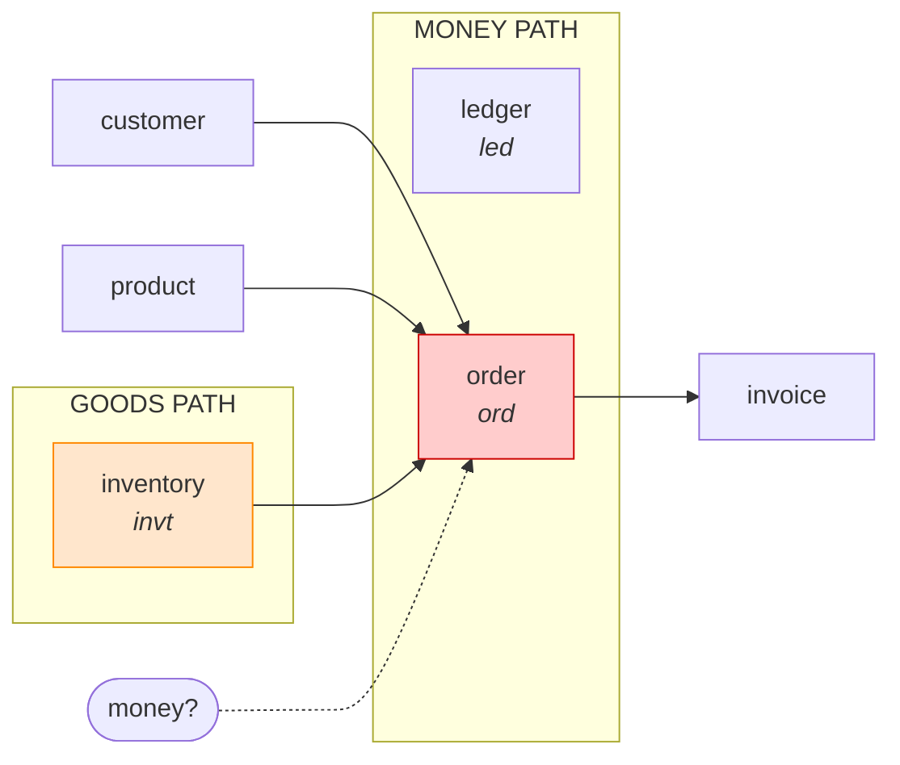
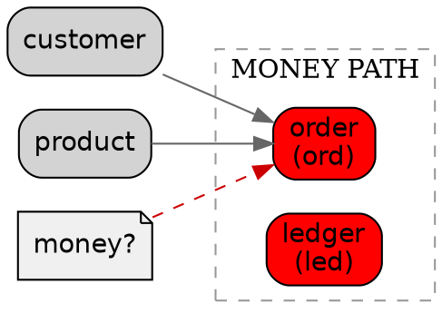

# 📦 Layer 0: CORE — 6 Prompt Files

ด้านล่างคือ AI Prompt ทั้ง 6 ไฟล์ของ **Layer 0 (Core)** ตาม Template มาตรฐาน — แต่ละไฟล์คือ 1 module

---

## 📄 ไฟล์ 1: `docs/prompts/layer-0-core/money.md`

```markdown
# AI Prompt — Module `money`

## 📋 Metadata

| หัวข้อ | รายละเอียด |
|---|---|
| **ชื่อ Module** | `money` |
| **Layer** | `0` (Core) |
| **Priority** | 🔴 |
| **Phase** | 1 |
| **มิติธุรกิจ** | Core (cross-cutting) |
| **Dependencies** | ไม่มี (primitive module) |
| **Domain Concepts** | `Money` (VO), `Currency` (enum), `VAT` (VO), `ExchangeRate` (VO) |

---

## 🎯 Prompt

### สร้าง Module `money`

**บริบท:**
- ERP + CRM + IoT สำหรับ SME (Multi-company)
- Clean Architecture + DDD (4 layers)
- Python 3.14+, FastAPI, Pydantic v2, SQLAlchemy 2.0
- PostgreSQL 17, Redis 8, Kafka
- Module นี้เป็น **primitive module** — ไม่มี persistence, ไม่มี cache
- ใช้ `Decimal` เท่านั้น (ห้ามใช้ `float`)
- Money is Domain Invariant — ต้องแม่นยำ 100%

**ข้อกำหนด:**

#### 1. Domain Layer (`domain/`)

**`entities.py`** — ไม่มี (pure VO module)

**`value_objects.py` — Money**
```python
from decimal import Decimal, ROUND_HALF_UP
from dataclasses import dataclass

@dataclass(frozen=True)
class Money:
    """Money value object — วัตถุค่าเงิน"""
    amount: Decimal
    currency: str = "THB"

    def __post_init__(self):
        object.__setattr__(self, "amount",
            self.amount.quantize(Decimal("0.01"), rounding=ROUND_HALF_UP))
        self._validate()

    def _validate(self) -> None:
        """Validate money — ตรวจสอบเงิน"""
        if not isinstance(self.amount, Decimal):
            raise DomainError("Amount must be Decimal")
        if self.currency not in Currency._value2member_map_:
            raise DomainError(f"Unsupported currency: {self.currency}")

    def _assert_same_currency(self, other: "Money") -> None:
        if self.currency != other.currency:
            raise DomainError(f"Cannot operate on {self.currency} vs {other.currency}")

    def __add__(self, other: "Money") -> "Money":
        self._assert_same_currency(other)
        return Money(self.amount + other.amount, self.currency)

    def __sub__(self, other: "Money") -> "Money":
        self._assert_same_currency(other)
        return Money(self.amount - other.amount, self.currency)

    def __mul__(self, factor: Decimal) -> "Money":
        if not isinstance(factor, Decimal):
            raise DomainError("Factor must be Decimal")
        return Money(self.amount * factor, self.currency)

    def __neg__(self) -> "Money":
        return Money(-self.amount, self.currency)

    def __str__(self) -> str:
        return f"{self.amount} {self.currency}"

    def __eq__(self, other: object) -> bool:
        if not isinstance(other, Money):
            return False
        return self.amount == other.amount and self.currency == other.currency

    def is_zero(self) -> bool:
        """Check if zero — ตรวจสอบว่าเป็นศูนย์"""
        return self.amount == Decimal("0.00")

    def is_negative(self) -> bool:
        """Check if negative — ตรวจสอบว่าติดลบ"""
        return self.amount < Decimal("0.00")
```

**`value_objects.py` — VAT**
```python
@dataclass(frozen=True)
class VAT:
    """VAT value object — วัตถุภาษีมูลค่าเพิ่ม"""
    rate: Decimal  # e.g., 0.07

    def calculate(self, base: Money) -> Money:
        """Calculate VAT — คำนวณภาษี"""
        return Money((base.amount * self.rate).quantize(Decimal("0.01")), base.currency)

    def extract(self, total: Money) -> Money:
        """Extract VAT from total — แยกภาษีจากยอดรวม"""
        base = (total.amount / (Decimal("1") + self.rate)).quantize(Decimal("0.01"))
        return Money(total.amount - base, total.currency)
```

**`value_objects.py` — ExchangeRate**
```python
@dataclass(frozen=True)
class ExchangeRate:
    """Exchange rate VO — วัตถุอัตราแลกเปลี่ยน"""
    from_currency: str
    to_currency: str
    rate: Decimal
    as_of: datetime

    def __post_init__(self):
        if self.rate <= 0:
            raise DomainError("Exchange rate must be positive")

    def convert(self, amount: Money) -> Money:
        if amount.currency != self.from_currency:
            raise DomainError("Currency mismatch")
        return Money(amount.amount * self.rate, self.to_currency)
```

**`enums.py`**
```python
from enum import Enum

class Currency(str, Enum):
    THB = "THB"
    USD = "USD"
    EUR = "EUR"

class VATRate(str, Enum):
    ZERO = "0.00"
    SEVEN = "0.07"

class RoundingMode(str, Enum):
    HALF_UP = "HALF_UP"
    HALF_DOWN = "HALF_DOWN"
    BANKERS = "BANKERS"
```

#### 2. Application Layer (`application/`)

**`interfaces.py`** — Protocol ว่าง (VO module ไม่มี external deps)

**`use_cases.py`**
```python
class MoneyUseCases:
    """Money use cases — กรณีการใช้งานเงิน"""

    def add(self, a: Money, b: Money) -> Money: return a + b
    def subtract(self, a: Money, b: Money) -> Money: return a - b
    def multiply(self, a: Money, factor: Decimal) -> Money: return a * factor
    def calculate_vat(self, base: Money, rate: VATRate) -> Money:
        return VAT(Decimal(rate.value)).calculate(base)
    def extract_vat(self, total: Money, rate: VATRate) -> Money:
        return VAT(Decimal(rate.value)).extract(total)
    def convert(self, amount: Money, rate: ExchangeRate) -> Money:
        return rate.convert(amount)
    def sum_all(self, items: list[Money]) -> Money:
        if not items:
            raise DomainError("Cannot sum empty list")
        result = items[0]
        for item in items[1:]:
            result = result + item
        return result
```

**`mappers.py`** — `MoneyMapper.to_schema()` / `to_entity()`
**`exceptions.py`** — `MoneyException(StandardException)`
**`utils.py`** — `round_money()`, `zero_money(currency)`

#### 3. Infrastructure Layer (`infrastructure/`)
- **ไม่มี** `models.py` (pure VO)
- **ไม่มี** `repositories.py`
- **ไม่มี** `caches.py`
- **ไม่มี** `services.py`

#### 4. Presentation Layer (`presentation/`)

**`schemas.py`**
```python
class MoneySchema(BaseModel):
    amount: Decimal = Field(..., ge=0, decimal_places=2)
    currency: str = Field(default="THB", pattern="^(THB|USD|EUR)$")
    model_config = ConfigDict(from_attributes=True)

class VATRequest(BaseModel):
    base: MoneySchema
    rate: VATRate = VATRate.SEVEN

class VATResponse(BaseModel):
    vat: MoneySchema
    total: MoneySchema
```

**`routers.py`**
```python
router = APIRouter(prefix="/api/v1/money", tags=["Money"])

@router.post("/add/")
async def add(a: MoneySchema, b: MoneySchema): ...

@router.post("/subtract/")
async def subtract(a: MoneySchema, b: MoneySchema): ...

@router.post("/vat/calculate/")
async def vat_calculate(req: VATRequest): ...

@router.post("/vat/extract/")
async def vat_extract(req: VATRequest): ...

@router.post("/convert/")
async def convert(amount: MoneySchema, rate: ExchangeRateSchema): ...
```

**`docs.py`** — `router_docs` + per-endpoint docs
**`dependencies.py`** — `get_money_use_cases()`

#### 5. Error Handling
- Use cases: **3-branch** (`StandardException` → `DomainError` → `Exception`)
- ไม่มี repository/cache → ไม่มี 2-branch / never-raise

#### 6. Invariants
- `Decimal` quantize 2 ตำแหน่ง (ROUND_HALF_UP)
- `a + b == b + a` (commutative)
- `(a + b) + c == a + (b + c)` (associative)
- `a + Money(0) == a` (identity)
- `a - a == Money(0)` (inverse)
- `VAT.calculate(base) + base == VAT.extract(total)` consistency

#### 7. Domain Events
- `MoneyAdded`, `MoneySubtracted`, `VATCalculated`, `CurrencyConverted`

#### 8. Tests
```python
def test_commutative(): assert a + b == b + a
def test_associative(): assert (a+b)+c == a+(b+c)
def test_identity(): assert a + Money(Decimal("0")) == a
def test_currency_mismatch(): pytest.raises(DomainError)
def test_vat_7_percent(): assert VAT(Decimal("0.07")).calculate(Money(Decimal("100"))) == Money(Decimal("7.00"))
def test_vat_extract_roundtrip(): ...
def test_exchange_rate_convert(): ...
def test_negative_money(): assert Money(Decimal("-10")).is_negative()
def test_zero_money(): assert Money(Decimal("0")).is_zero()
```

**Output:**
- ไฟล์ ~8 ไฟล์ (module เล็ก)
- Comment 2 ภาษา
- พร้อมรัน
```

---

## 📄 ไฟล์ 2: `docs/prompts/layer-0-core/tenant_context.md`

```markdown
# AI Prompt — Module `tenant_context`

## 📋 Metadata

| หัวข้อ | รายละเอียด |
|---|---|
| **ชื่อ Module** | `tenant_context` |
| **Layer** | `0` (Core) |
| **Priority** | 🔴 |
| **Phase** | 1 |
| **มิติธุรกิจ** | Core (cross-cutting) |
| **Dependencies** | ไม่มี (primitive module) |
| **Domain Concepts** | `TenantContext` (VO), `TenantScope` (enum), `RequestContext` (VO) |

---

## 🎯 Prompt

### สร้าง Module `tenant_context`

**บริบท:**
- ERP + CRM + IoT สำหรับ SME (Multi-company)
- Clean Architecture + DDD (4 layers)
- Module นี้เป็น **context propagation** — ใช้ `contextvars` แทน global state
- ทุก request ต้องมี `tenant_id`, `user_id`, `correlation_id`
- PostgreSQL schema-per-tenant → ต้อง switch schema ตาม context
- Redis namespace ต้อง prefix ด้วย `tenant_id`
- Kafka topic ต้อง prefix ด้วย `tenant_id`

**ข้อกำหนด:**

#### 1. Domain Layer (`domain/`)

**`entities.py`** — ไม่มี (pure VO)

**`value_objects.py` — TenantContext**
```python
from dataclasses import dataclass, field
from datetime import datetime
from contextvars import ContextVar

@dataclass(frozen=True)
class TenantContext:
    """Tenant context VO — วัตถุบริบทผู้เช่า"""
    tenant_id: str
    user_id: str | None = None
    correlation_id: str = ""
    request_id: str = ""
    locale: str = "th-TH"
    timezone: str = "Asia/Bangkok"

    def __post_init__(self):
        self._validate()

    def _validate(self) -> None:
        if not self.tenant_id:
            raise DomainError("Tenant ID is required")
        if not self.correlation_id:
            raise DomainError("Correlation ID is required")

    @property
    def schema_name(self) -> str:
        """PostgreSQL schema name — ชื่อ schema"""
        return f"tenant_{self.tenant_id}"

    def redis_namespace(self, key: str) -> str:
        """Namespace Redis key — prefix Redis"""
        return f"t:{self.tenant_id}:{key}"

    def kafka_topic(self, topic: str) -> str:
        """Namespace Kafka topic — prefix Kafka"""
        return f"t.{self.tenant_id}.{topic}"

_context_var: ContextVar[TenantContext | None] = ContextVar("tenant_context", default=None)

def set_context(ctx: TenantContext) -> None:
    """Set current context — ตั้งค่า context ปัจจุบัน"""
    _context_var.set(ctx)

def get_context() -> TenantContext:
    """Get current context — ดึง context ปัจจุบัน"""
    ctx = _context_var.get()
    if ctx is None:
        raise DomainError("Tenant context not set")
    return ctx

def clear_context() -> None:
    """Clear context — ล้าง context"""
    _context_var.set(None)
```

**`value_objects.py` — RequestContext**
```python
@dataclass(frozen=True)
class RequestContext:
    """Request context VO — วัตถุบริบทคำขอ"""
    method: str
    path: str
    ip_address: str
    user_agent: str = ""
    started_at: datetime = field(default_factory=datetime.utcnow)
```

**`enums.py`**
```python
class TenantScope(str, Enum):
    GLOBAL = "GLOBAL"
    TENANT = "TENANT"
    USER = "USER"

class IsolationLevel(str, Enum):
    SCHEMA_PER_TENANT = "SCHEMA_PER_TENANT"
    DATABASE_PER_TENANT = "DATABASE_PER_TENANT"
    ROW_LEVEL = "ROW_LEVEL"
```

#### 2. Application Layer (`application/`)

**`interfaces.py`**
```python
class ITenantContextProvider(Protocol):
    def get(self) -> TenantContext: ...
    def set(self, ctx: TenantContext) -> None: ...
    def clear(self) -> None: ...

class ITenantResolver(Protocol):
    async def resolve(self, identifier: str) -> TenantContext | None: ...
```

**`use_cases.py`**
```python
class TenantContextUseCases:
    """Tenant context use cases — กรณีการใช้งานบริบทผู้เช่า"""

    def __init__(self, resolver: ITenantResolver):
        self.resolver = resolver

    async def establish(self, tenant_id: str, user_id: str | None, headers: dict) -> TenantContext:
        """Establish context from request — สร้าง context จาก request"""
        try:
            ctx = TenantContext(
                tenant_id=tenant_id,
                user_id=user_id,
                correlation_id=headers.get("X-Correlation-ID") or str(uuid7()),
                request_id=headers.get("X-Request-ID") or str(uuid7()),
                locale=headers.get("Accept-Language", "th-TH"),
            )
            set_context(ctx)
            return ctx
        except StandardException:
            raise
        except DomainError as e:
            raise DomainException(e)
        except Exception as e:
            logger.opt(exception=e).error("Error in establish tenant context")
            raise TenantContextException()

    def current(self) -> TenantContext:
        return get_context()

    def teardown(self) -> None:
        clear_context()
```

**`mappers.py`** — `ContextMapper.to_context()` / `to_headers()`
**`exceptions.py`** — `TenantContextException`, `TenantNotFoundInContext`
**`utils.py`** — `requires_tenant()`, `tenant_scoped()`

#### 3. Infrastructure Layer (`infrastructure/`)

**`models.py`** — ไม่มี (context ไม่ persist)

**`repositories.py`** — `PostgresTenantResolver` (query จาก `public.tenants`)
```python
class PostgresTenantResolver:
    """Resolve tenant from DB — ค้นหา tenant จาก DB"""
    def __init__(self, session): self.session = session

    async def resolve(self, identifier: str) -> TenantContext | None:
        try:
            result = await self.session.execute(
                text("SELECT id FROM public.tenants WHERE slug = :s AND active = true"),
                {"s": identifier},
            )
            row = result.first()
            if not row:
                return None
            return TenantContext(tenant_id=str(row.id), correlation_id=str(uuid7()))
        except StandardException:
            raise
        except Exception as e:
            logger.opt(exception=e).error("Error resolving tenant")
            raise TenantContextException()
```

**`caches.py` — RedisTenantCache**
```python
class RedisTenantCache:
    """Cache tenant lookup — แคชข้อมูล tenant"""
    async def get(self, identifier: str) -> TenantContext | None:
        try:
            data = await self.redis.get(f"tenant:lookup:{identifier}")
            return TenantContext(**json.loads(data)) if data else None
        except Exception as e:
            logger.opt(exception=e).error("Cache get failed. Falling back.")
            return None  # never raise

    async def insert(self, identifier: str, ctx: TenantContext) -> None:
        try:
            await self.redis.setex(f"tenant:lookup:{identifier}", 300, json.dumps(asdict(ctx)))
        except Exception as e:
            logger.opt(exception=e).error("Cache insert failed.")
```

**`services.py`** — `HeaderTenantExtractor` (Protocol impl)

#### 4. Presentation Layer (`presentation/`)

**`routers.py`**
```python
router = APIRouter(prefix="/api/v1/context", tags=["Tenant Context"])

@router.get("/current/")
async def get_current(ctx: TenantContext = Depends(get_tenant_context)): ...

@router.post("/switch/")
async def switch_tenant(tenant_id: str, use_cases: TenantContextUseCases = Depends(...)): ...
```

**`schemas.py`** — `TenantContextSchema`, `SwitchTenantRequest`
**`docs.py`** — router_docs
**`dependencies.py`** — `get_tenant_context()` (FastAPI dependency)

#### 5. Error Handling
- Use cases: **3-branch**
- Repositories: **2-branch**
- Caches: **never-raise**

#### 6. Invariants
- ทุก request ต้องมี `tenant_id` + `correlation_id`
- Context ถูก propagate ผ่าน `contextvars` (async-safe)
- `schema_name == f"tenant_{tenant_id}"`
- Redis keys ขึ้นต้นด้วย `t:{tenant_id}:` เสมอ

#### 7. Domain Events
- `TenantContextEstablished`, `TenantContextCleared`, `TenantSwitched`

#### 8. Tests
```python
async def test_set_get_context(): ...
async def test_missing_tenant_raises(): ...
async def test_async_isolation():
    """Property: context ใน async task ต้องไม่รั่ว"""
    ...
async def test_schema_name_format(): ...
async def test_redis_namespace(): ...
async def test_kafka_topic_prefix(): ...
```

**Output:**
- ไฟล์ ~12 ไฟล์
- Comment 2 ภาษา
- พร้อมรัน
```

---

## 📄 ไฟล์ 3: `docs/prompts/layer-0-core/audit.md`

```markdown
# AI Prompt — Module `audit`

## 📋 Metadata

| หัวข้อ | รายละเอียด |
|---|---|
| **ชื่อ Module** | `audit` |
| **Layer** | `0` (Core) |
| **Priority** | 🔴 |
| **Phase** | 1 |
| **มิติธุรกิจ** | Core (cross-cutting) |
| **Dependencies** | `tenant_context` |
| **Domain Concepts** | `AuditLog` (entity), `AuditAction` (enum), `ChangeSet` (VO) |

---

## 🎯 Prompt

### สร้าง Module `audit`

**บริบท:**
- ERP + CRM + IoT สำหรับ SME (Multi-company)
- Clean Architecture + DDD (4 layers)
- **ทุก action ที่แตะเงิน/สต็อก/ข้อมูลสำคัญ → audit log (append-only)**
- Audit log ต้อง **immutable** — ห้าม UPDATE / DELETE
- ต้องเก็บ `before` / `after` state (ChangeSet)
- Audit log ต้องเป็น event-sourced เพื่อให้ replay ได้
- Retention: 7 ปี (ตามกฎหมายบัญชี)

**ข้อกำหนด:**

#### 1. Domain Layer (`domain/`)

**`entities.py`**
```python
@dataclass
class AuditLog(BaseEntity):
    """Audit log entity — เอนทิตีบันทึก audit"""
    action: str = ""
    resource_type: str = ""
    resource_id: str = ""
    actor_id: str = ""
    before_state: dict = field(default_factory=dict)
    after_state: dict = field(default_factory=dict)
    changes: list = field(default_factory=list)
    ip_address: str = ""
    user_agent: str = ""
    correlation_id: str = ""
    occurred_at: datetime = field(default_factory=datetime.utcnow)

    def __post_init__(self):
        self._validate()

    def _validate(self) -> None:
        if not self.action:
            raise DomainError("Action is required")
        if not self.resource_type or not self.resource_id:
            raise DomainError("Resource type/id required")

    def diff(self) -> list[dict]:
        """Compute diff — คำนวณส่วนต่าง"""
        keys = set(self.before_state) | set(self.after_state)
        return [
            {"field": k, "before": self.before_state.get(k), "after": self.after_state.get(k)}
            for k in keys if self.before_state.get(k) != self.after_state.get(k)
        ]
```

**`value_objects.py`**
```python
@dataclass(frozen=True)
class ChangeSet:
    """Change set VO — วัตถุชุดการเปลี่ยนแปลง"""
    entity: str
    entity_id: str
    changes: tuple[tuple[str, any, any], ...]  # (field, before, after)

    def is_empty(self) -> bool:
        return len(self.changes) == 0
```

**`enums.py`**
```python
class AuditAction(str, Enum):
    CREATE = "CREATE"
    UPDATE = "UPDATE"
    DELETE = "DELETE"
    LOGIN = "LOGIN"
    LOGOUT = "LOGOUT"
    APPROVE = "APPROVE"
    REJECT = "REJECT"
    VOID = "VOID"
    PAYMENT = "PAYMENT"
    STOCK_MOVE = "STOCK_MOVE"

class AuditSeverity(str, Enum):
    INFO = "INFO"
    WARNING = "WARNING"
    CRITICAL = "CRITICAL"
```

#### 2. Application Layer (`application/`)

**`interfaces.py`**
```python
class IAuditRepository(Protocol):
    async def append(self, log: AuditLog) -> AuditLog: ...
    async def query(self, filters: dict, page: int, limit: int) -> tuple[list[AuditLog], int]: ...

class IAuditCache(Protocol):
    async def get(self, id: str) -> AuditLog | None: ...
    async def insert(self, id: str, log: AuditLog) -> None: ...

class IAuditPublisher(Protocol):
    async def publish(self, log: AuditLog) -> None: ...
```

**`use_cases.py`**
```python
class AuditUseCases:
    """Audit use cases — กรณีการใช้งาน audit"""

    def __init__(self, repo, cache, publisher, events):
        self.repo = repo
        self.cache = cache
        self.publisher = publisher
        self.events = events

    async def log(self, action: str, resource_type: str, resource_id: str,
                  before: dict, after: dict) -> AuditLog:
        """Append audit log — เพิ่มบันทึก audit"""
        try:
            ctx = get_context()
            log = AuditLog(
                action=action,
                resource_type=resource_type,
                resource_id=resource_id,
                actor_id=ctx.user_id or "system",
                before_state=before,
                after_state=after,
                correlation_id=ctx.correlation_id,
            )
            log = await self.repo.append(log)

            # Read-back verification
            verified = await self.repo.get_by_id(log.id)
            if not verified:
                raise AuditException("Read-back failed")

            await self.publisher.publish(log)
            await self.events.publish("AuditLogged", log)

            return log
        except StandardException:
            raise
        except DomainError as e:
            raise DomainException(e)
        except Exception as e:
            logger.opt(exception=e).error("Error in audit log")
            raise AuditException()

    async def query(self, filters: dict, page: int, limit: int) -> tuple[list, int]:
        return await self.repo.query(filters, page, limit)
```

**`mappers.py`** — `AuditMapper`
**`exceptions.py`** — `AuditException`, `AuditImmutableViolation`
**`utils.py`** — `auditable()` decorator, `diff_states()`

#### 3. Infrastructure Layer (`infrastructure/`)

**`models.py`**
```python
class AuditLogModel(BaseModel):
    __tablename__ = "audit_logs"
    action = Column(String(50), nullable=False, index=True)
    resource_type = Column(String(100), nullable=False, index=True)
    resource_id = Column(String(36), nullable=False, index=True)
    actor_id = Column(String(36), nullable=False, index=True)
    before_state = Column(JSONB, default=dict)
    after_state = Column(JSONB, default=dict)
    ip_address = Column(String(45))
    user_agent = Column(String(500))
    correlation_id = Column(String(36), index=True)
    occurred_at = Column(DateTime(timezone=True), nullable=False, index=True)

    __table_args__ = (
        Index("ix_audit_resource", "resource_type", "resource_id"),
        Index("ix_audit_actor_time", "actor_id", "occurred_at"),
        # Append-only: REVOKE UPDATE/DELETE ใน migration
    )
```

**`repositories.py`** — `PostgresAuditRepository` (`append()` only — no update/delete)
**`caches.py`** — `RedisAuditCache` (read-through, never raises)
**`services.py`** — `AuditPublisher` (Kafka topic `audit.events`)

#### 4. Presentation Layer (`presentation/`)

**`routers.py`**
```python
router = APIRouter(prefix="/api/v1/audit", tags=["Audit"])

@router.get("/logs/")      # list + filters
async def list_logs(filters: AuditQuery, ...): ...

@router.get("/logs/{id}/")
async def get_log(id: str, ...): ...

@router.get("/resources/{type}/{id}/history/")
async def resource_history(type: str, id: str, ...): ...
```

**`schemas.py`** — `AuditLogSchema`, `AuditQuery`, `AuditLogPage`
**`docs.py`** — router_docs
**`dependencies.py`** — `get_audit_use_cases()`

#### 5. Error Handling
- Use cases: **3-branch**
- Repositories: **2-branch**
- Caches: **never-raise**

#### 6. Invariants
- Audit log **immutable** — append-only
- ทุก log ต้องมี `actor_id`, `correlation_id`, `occurred_at`
- `diff()` ต้องตรงกับ `before`/`after`
- Retention 7 ปี — ห้ามลบก่อนกำหนด

#### 7. Domain Events
- `AuditLogged`, `AuditQueryExecuted`

#### 8. Tests
```python
async def test_append_only(): ...       # ลอง update ต้อง raise
async def test_diff_accuracy(): ...     # diff ต้องตรง
async def test_actor_required(): ...
async def test_property_diff_symmetric():
    """Property: diff(before, after) == -diff(after, before)"""
    ...
```

**Output:**
- ไฟล์ 16 ไฟล์
- Comment 2 ภาษา
- พร้อมรัน
```

---

## 📄 ไฟล์ 4: `docs/prompts/layer-0-core/idempotency.md`

```markdown
# AI Prompt — Module `idempotency`

## 📋 Metadata

| หัวข้อ | รายละเอียด |
|---|---|
| **ชื่อ Module** | `idempotency` |
| **Layer** | `0` (Core) |
| **Priority** | 🔴 |
| **Phase** | 1 |
| **มิติธุรกิจ** | Core (cross-cutting) |
| **Dependencies** | `tenant_context`, `config` |
| **Domain Concepts** | `IdempotencyKey` (VO), `IdempotencyRecord` (entity), `IdempotencyStatus` (enum) |

---

## 🎯 Prompt

### สร้าง Module `idempotency`

**บริบท:**
- ERP + CRM + IoT สำหรับ SME (Multi-company)
- Clean Architecture + DDD (4 layers)
- **Money Path + Goods Path ต้อง idempotent 100%**
- Client ส่ง `Idempotency-Key` header ทุก mutating request
- Server ต้อง:
  - ถ้า key ใหม่ → execute + store result
  - ถ้า key ซ้ำ + status = COMPLETED → return cached result
  - ถ้า key ซ้ำ + status = IN_PROGRESS → return 409 Conflict
  - ถ้า key ซ้ำ + payload ต่าง → return 422
- TTL: 24 ชั่วโมง (config ได้)

**ข้อกำหนด:**

#### 1. Domain Layer (`domain/`)

**`entities.py`**
```python
@dataclass
class IdempotencyRecord(BaseEntity):
    """Idempotency record — เอนทิตีบันทึก idempotency"""
    key: str = ""
    status: str = "IN_PROGRESS"
    request_hash: str = ""
    response_body: dict = field(default_factory=dict)
    response_status: int = 0
    locked_until: datetime | None = None
    expires_at: datetime | None = None

    def __post_init__(self):
        self._validate()

    def _validate(self) -> None:
        if not self.key:
            raise DomainError("Idempotency key required")

    def is_expired(self) -> bool:
        return self.expires_at is not None and datetime.utcnow() > self.expires_at

    def is_completed(self) -> bool:
        return self.status == "COMPLETED"

    def is_in_progress(self) -> bool:
        return self.status == "IN_PROGRESS"

    def complete(self, status: int, body: dict) -> None:
        """Mark completed — ทำเครื่องหมายเสร็จ"""
        self.status = "COMPLETED"
        self.response_status = status
        self.response_body = body
```

**`value_objects.py`**
```python
@dataclass(frozen=True)
class IdempotencyKey:
    """Idempotency key VO — วัตถุกุญแจ idempotency"""
    value: str
    scope: str  # e.g., "invoice.create"

    def __post_init__(self):
        if len(self.value) < 8 or len(self.value) > 255:
            raise DomainError("Idempotency key length must be 8-255")

    def redis_key(self, tenant_id: str) -> str:
        return f"t:{tenant_id}:idem:{self.scope}:{self.value}"
```

**`enums.py`**
```python
class IdempotencyStatus(str, Enum):
    IN_PROGRESS = "IN_PROGRESS"
    COMPLETED = "COMPLETED"
    FAILED = "FAILED"

class IdempotencyConflict(str, Enum):
    SAME_KEY_SAME_PAYLOAD = "SAME_KEY_SAME_PAYLOAD"
    SAME_KEY_DIFF_PAYLOAD = "SAME_KEY_DIFF_PAYLOAD"
    CONCURRENT = "CONCURRENT"
```

#### 2. Application Layer (`application/`)

**`interfaces.py`**
```python
class IIdempotencyStore(Protocol):
    async def get(self, key: IdempotencyKey, tenant_id: str) -> IdempotencyRecord | None: ...
    async def set(self, key: IdempotencyKey, tenant_id: str, rec: IdempotencyRecord) -> None: ...
    async def lock(self, key: IdempotencyKey, tenant_id: str, ttl: int) -> bool: ...
    async def unlock(self, key: IdempotencyKey, tenant_id: str) -> None: ...
```

**`use_cases.py`**
```python
class IdempotencyUseCases:
    """Idempotency use cases — กรณีการใช้งาน idempotency"""

    def __init__(self, store, config):
        self.store = store
        self.ttl = config.IDEMPOTENCY_TTL_SECONDS

    async def check_or_lock(self, raw_key: str, scope: str, payload: dict) -> IdempotencyRecord | None:
        """Check existing or lock — ตรวจสอบหรือล็อก"""
        try:
            ctx = get_context()
            key = IdempotencyKey(value=raw_key, scope=scope)
            existing = await self.store.get(key, ctx.tenant_id)

            if existing and existing.is_completed():
                if existing.request_hash != self._hash(payload):
                    raise IdempotencyConflictException("Payload mismatch")
                return existing  # replay

            if existing and existing.is_in_progress():
                raise IdempotencyConflictException("Request in progress")

            locked = await self.store.lock(key, ctx.tenant_id, self.ttl)
            if not locked:
                raise IdempotencyConflictException("Concurrent request")

            rec = IdempotencyRecord(
                key=raw_key,
                status="IN_PROGRESS",
                request_hash=self._hash(payload),
                expires_at=datetime.utcnow() + timedelta(seconds=self.ttl),
            )
            await self.store.set(key, ctx.tenant_id, rec)
            return None  # proceed with execution
        except StandardException:
            raise
        except DomainError as e:
            raise DomainException(e)
        except Exception as e:
            logger.opt(exception=e).error("Error in check_or_lock")
            raise IdempotencyException()

    async def complete(self, raw_key: str, scope: str, status: int, body: dict) -> None:
        """Mark completed — บันทึกผลลัพธ์"""
        try:
            ctx = get_context()
            key = IdempotencyKey(value=raw_key, scope=scope)
            rec = await self.store.get(key, ctx.tenant_id)
            if rec:
                rec.complete(status, body)
                await self.store.set(key, ctx.tenant_id, rec)
                await self.store.unlock(key, ctx.tenant_id)
        except Exception as e:
            logger.opt(exception=e).error("Error in complete idempotency")
            # don't re-raise — response already returned

    @staticmethod
    def _hash(payload: dict) -> str:
        canonical = json.dumps(payload, sort_keys=True, separators=(",", ":"))
        return hashlib.sha256(canonical.encode()).hexdigest()
```

**`mappers.py`** — `IdempotencyMapper`
**`exceptions.py`** — `IdempotencyException`, `IdempotencyConflictException`
**`utils.py`** — `idempotent()` decorator

#### 3. Infrastructure Layer (`infrastructure/`)

**`models.py`**
```python
class IdempotencyRecordModel(BaseModel):
    __tablename__ = "idempotency_records"
    key = Column(String(255), nullable=False, index=True)
    scope = Column(String(100), nullable=False, index=True)
    status = Column(String(20), nullable=False)
    request_hash = Column(String(64), nullable=False)
    response_body = Column(JSONB, default=dict)
    response_status = Column(Integer)
    locked_until = Column(DateTime(timezone=True))
    expires_at = Column(DateTime(timezone=True), index=True)

    __table_args__ = (
        UniqueConstraint("key", "scope", "tenant_id", name="uq_idem_key_scope_tenant"),
    )
```

**`repositories.py`** — `PostgresIdempotencyRepository` (fallback เมื่อ Redis ล่ม)
**`caches.py`** — `RedisIdempotencyStore` (primary, atomic SET NX)
```python
class RedisIdempotencyStore:
    async def lock(self, key: IdempotencyKey, tenant_id: str, ttl: int) -> bool:
        try:
            result = await self.redis.set(
                f"{key.redis_key(tenant_id)}:lock",
                "1", nx=True, ex=ttl
            )
            return bool(result)
        except Exception as e:
            logger.opt(exception=e).error("Lock failed")
            return False  # conservative: fail closed
```

**`services.py`** — ไม่มี

#### 4. Presentation Layer (`presentation/`)

**`routers.py`** — ไม่มี public router (ใช้ middleware/dependency)
**`schemas.py`** — `IdempotencyRecordSchema`
**`docs.py`** — docs
**`dependencies.py`** — `require_idempotency_key()` FastAPI dependency

#### 5. Error Handling
- Use cases: **3-branch**
- Store: **2-branch** (Redis), **never-raise** (fallback logging)

#### 6. Invariants
- Key + Scope + Tenant = unique
- `COMPLETED` record ต้อง return response เดิมเสมอ
- Payload hash ต้องตรงกัน ไม่งั้น 422
- Concurrent requests → 1 success, rest 409

#### 7. Domain Events
- `IdempotencyLocked`, `IdempotencyCompleted`, `IdempotencyConflict`

#### 8. Tests
```python
async def test_first_request_executes(): ...
async def test_second_request_replays(): ...
async def test_payload_mismatch_raises(): ...
async def test_concurrent_requests_only_one_wins(): ...
async def test_expired_record_allows_retry(): ...
async def test_property_replay_returns_same_response():
    for _ in range(100):
        ...
```

**Output:**
- ไฟล์ 16 ไฟล์
- Comment 2 ภาษา
- พร้อมรัน
```

---

## 📄 ไฟล์ 5: `docs/prompts/layer-0-core/config.md`

```markdown
# AI Prompt — Module `config`

## 📋 Metadata

| หัวข้อ | รายละเอียด |
|---|---|
| **ชื่อ Module** | `config` |
| **Layer** | `0` (Core) |
| **Priority** | 🔴 |
| **Phase** | 1 |
| **มิติธุรกิจ** | Core (cross-cutting) |
| **Dependencies** | `tenant_context` |
| **Domain Concepts** | `ConfigEntry` (entity), `ConfigScope` (enum), `ConfigType` (enum) |

---

## 🎯 Prompt

### สร้าง Module `config`

**บริบท:**
- ERP + CRM + IoT สำหรับ SME (Multi-company)
- Clean Architecture + DDD (4 layers)
- Config มี 3 ระดับ: **GLOBAL → TENANT → USER** (override ตามลำดับ)
- รองรับ hot-reload ผ่าน Redis Pub/Sub
- Type-safe: `string`, `int`, `decimal`, `bool`, `json`, `secret`
- Secret ต้องเข้ารหัส (Fernet) และไม่ return ผ่าน API
- Cache ที่ Redis พร้อม TTL + tombstone

**ข้อกำหนด:**

#### 1. Domain Layer (`domain/`)

**`entities.py`**
```python
@dataclass
class ConfigEntry(BaseEntity):
    """Config entry — เอนทิตีรายการตั้งค่า"""
    key: str = ""
    value: str = ""
    value_type: str = "string"
    scope: str = "TENANT"
    scope_id: str = ""
    is_secret: bool = False
    description: str = ""

    def __post_init__(self):
        self._validate()

    def _validate(self) -> None:
        if not self.key:
            raise DomainError("Config key required")
        if not re.match(r"^[a-z][a-z0-9_.]*$", self.key):
            raise DomainError(f"Invalid key format: {self.key}")

    def typed_value(self):
        """Return typed value — คืนค่าตามชนิด"""
        if self.value_type == "int":
            return int(self.value)
        if self.value_type == "decimal":
            return Decimal(self.value)
        if self.value_type == "bool":
            return self.value.lower() in ("1", "true", "yes")
        if self.value_type == "json":
            return json.loads(self.value)
        return self.value

    def mask(self) -> "ConfigEntry":
        """Mask secret value — ปิดบังค่า secret"""
        if self.is_secret:
            copy = replace(self, value="***")
            return copy
        return self
```

**`value_objects.py`**
```python
@dataclass(frozen=True)
class ConfigKey:
    """Config key VO — วัตถุกุญแจ config"""
    value: str

    def __post_init__(self):
        if not re.match(r"^[a-z][a-z0-9_.]*$", self.value):
            raise DomainError(f"Invalid config key: {self.value}")

    def namespace(self) -> str:
        return self.value.split(".", 1)[0]
```

**`enums.py`**
```python
class ConfigScope(str, Enum):
    GLOBAL = "GLOBAL"
    TENANT = "TENANT"
    USER = "USER"

class ConfigType(str, Enum):
    STRING = "string"
    INT = "int"
    DECIMAL = "decimal"
    BOOL = "bool"
    JSON = "json"
    SECRET = "secret"
```

#### 2. Application Layer (`application/`)

**`interfaces.py`**
```python
class IConfigRepository(Protocol):
    async def get(self, key: str, scope: str, scope_id: str) -> ConfigEntry | None: ...
    async def get_effective(self, key: str, tenant_id: str, user_id: str | None) -> ConfigEntry | None: ...
    async def save(self, entry: ConfigEntry) -> ConfigEntry: ...
    async def list(self, scope: str, scope_id: str) -> list[ConfigEntry]: ...

class IConfigCache(Protocol):
    async def get(self, key: str) -> ConfigEntry | None: ...
    async def insert(self, key: str, entry: ConfigEntry) -> None: ...
    async def invalidate(self, key: str) -> None: ...

class ISecretCipher(Protocol):
    def encrypt(self, plain: str) -> str: ...
    def decrypt(self, cipher: str) -> str: ...
```

**`use_cases.py`**
```python
class ConfigUseCases:
    """Config use cases — กรณีการใช้งาน config"""

    def __init__(self, repo, cache, cipher, events, config):
        ...

    async def get_effective(self, key: str, user_id: str | None = None) -> ConfigEntry:
        """Get effective config — ดึงค่าที่มีผล"""
        try:
            ctx = get_context()
            cache_key = f"{ctx.tenant_id}:{user_id or '-'}:{key}"
            cached = await self.cache.get(cache_key)
            if cached:
                return cached

            entry = await self.repo.get_effective(key, ctx.tenant_id, user_id)
            if entry is None:
                raise ConfigKeyNotFoundException(key)

            if entry.is_secret:
                plain = self.cipher.decrypt(entry.value)
                entry = replace(entry, value=plain)

            await self.cache.insert(cache_key, entry)
            return entry
        except StandardException:
            raise
        except DomainError as e:
            raise DomainException(e)
        except Exception as e:
            logger.opt(exception=e).error("Error in get_effective config")
            raise ConfigException()

    async def set(self, key: str, value: str, value_type: str, scope: str,
                  scope_id: str, is_secret: bool = False) -> ConfigEntry:
        """Set config — ตั้งค่า config"""
        try:
            if is_secret:
                value = self.cipher.encrypt(value)
            entry = ConfigEntry(
                key=key, value=value, value_type=value_type,
                scope=scope, scope_id=scope_id, is_secret=is_secret,
            )
            entry = await self.repo.save(entry)

            # Read-back
            verified = await self.repo.get(key, scope, scope_id)
            if not verified or verified.value != entry.value:
                raise ConfigException("Read-back failed")

            await self.cache.invalidate(f"{scope_id}:{key}")
            await self.events.publish("ConfigChanged", {"key": key, "scope": scope})
            return entry.mask()
        except StandardException:
            raise
        except DomainError as e:
            raise DomainException(e)
        except Exception as e:
            logger.opt(exception=e).error("Error in set config")
            raise ConfigException()
```

**`mappers.py`** — `ConfigMapper` (with mask)
**`exceptions.py`** — `ConfigException`, `ConfigKeyNotFoundException`
**`utils.py`** — `get_config(key, default)` helper

#### 3. Infrastructure Layer (`infrastructure/`)

**`models.py`**
```python
class ConfigEntryModel(BaseModel):
    __tablename__ = "config_entries"
    key = Column(String(200), nullable=False, index=True)
    value = Column(Text, nullable=False)
    value_type = Column(String(20), nullable=False, default="string")
    scope = Column(String(20), nullable=False, index=True)
    scope_id = Column(String(36), nullable=False, index=True)
    is_secret = Column(Boolean, default=False)

    __table_args__ = (
        UniqueConstraint("key", "scope", "scope_id", name="uq_config_key_scope"),
    )
```

**`repositories.py`** — `PostgresConfigRepository` (with 3-level override)
**`caches.py`** — `RedisConfigCache` (TTL 300s, tombstone, never raises)
**`services.py`**
```python
class FernetCipher:
    """Fernet cipher — เข้ารหัส Fernet"""
    def __init__(self, key: bytes):
        self.fernet = Fernet(key)

    def encrypt(self, plain: str) -> str:
        return self.fernet.encrypt(plain.encode()).decode()

    def decrypt(self, cipher: str) -> str:
        return self.fernet.decrypt(cipher.encode()).decode()

class ConfigPubSub:
    """Config hot-reload via Redis Pub/Sub — โหลด config ใหม่ทันที"""
    async def subscribe(self, callback) -> None: ...
```

#### 4. Presentation Layer (`presentation/`)

**`routers.py`**
```python
router = APIRouter(prefix="/api/v1/config", tags=["Config"])

@router.get("/{key}/")
async def get_config(key: str, ...): ...

@router.put("/{key}/")
async def set_config(key: str, payload: ConfigSetRequest, ...): ...

@router.get("/")
async def list_config(scope: str, ...): ...

@router.delete("/{key}/")
async def delete_config(key: str, ...): ...
```

**`schemas.py`** — `ConfigEntrySchema`, `ConfigSetRequest` (mask secrets)
**`docs.py`** — router_docs
**`dependencies.py`** — `get_config_use_cases()`

#### 5. Error Handling
- Use cases: **3-branch**
- Repositories: **2-branch**
- Caches: **never-raise**

#### 6. Invariants
- 3-level override: `USER` > `TENANT` > `GLOBAL`
- Secret values **ไม่ return ผ่าน API** (mask)
- Config key format: `^[a-z][a-z0-9_.]*$`
- Cache invalidation ต้อง propagate ทันที

#### 7. Domain Events
- `ConfigChanged`, `ConfigDeleted`, `ConfigReloaded`

#### 8. Tests
```python
async def test_override_precedence(): ...
async def test_secret_encrypted_at_rest(): ...
async def test_secret_masked_in_api(): ...
async def test_invalid_key_format_raises(): ...
async def test_property_override_order():
    """Property: user > tenant > global เสมอ"""
    ...
```

**Output:**
- ไฟล์ 16 ไฟล์
- Comment 2 ภาษา
- พร้อมรัน
```

---

## 📄 ไฟล์ 6: `docs/prompts/layer-0-core/events.md`

```markdown
# AI Prompt — Module `events`

## 📋 Metadata

| หัวข้อ | รายละเอียด |
|---|---|
| **ชื่อ Module** | `events` |
| **Layer** | `0` (Core) |
| **Priority** | 🔴 |
| **Phase** | 1 |
| **มิติธุรกิจ** | Core (cross-cutting) |
| **Dependencies** | `tenant_context`, `audit` |
| **Domain Concepts** | `DomainEvent` (VO), `EventEnvelope` (VO), `EventStatus` (enum) |

---

## 🎯 Prompt

### สร้าง Module `events`

**บริบท:**
- ERP + CRM + IoT สำหรับ SME (Multi-company)
- Clean Architecture + DDD (4 layers)
- Kafka-based event bus
- **At-least-once delivery** + **consumer idempotency**
- Event envelope ต้องมี: `event_id`, `tenant_id`, `correlation_id`, `occurred_at`, `version`
- Event schema ต้อง versioned (backward-compatible)
- Dead Letter Queue (DLQ) สำหรับ poison messages
- Retry: exponential backoff (1s → 2s → 4s → 8s → 16s → DLQ)

**ข้อกำหนด:**

#### 1. Domain Layer (`domain/`)

**`entities.py`** — ไม่มี (event เป็น VO)

**`value_objects.py` — DomainEvent**
```python
@dataclass(frozen=True)
class DomainEvent:
    """Domain event VO — วัตถุเหตุการณ์"""
    event_type: str
    aggregate_id: str
    payload: dict
    occurred_at: datetime = field(default_factory=datetime.utcnow)
    version: int = 1

    def __post_init__(self):
        if not self.event_type:
            raise DomainError("Event type required")
        if not self.aggregate_id:
            raise DomainError("Aggregate ID required")
        if self.version < 1:
            raise DomainError("Version must be >= 1")
```

**`value_objects.py` — EventEnvelope**
```python
@dataclass(frozen=True)
class EventEnvelope:
    """Event envelope — วัตถุซองเหตุการณ์"""
    event_id: str
    event_type: str
    tenant_id: str
    correlation_id: str
    occurred_at: datetime
    version: int
    payload: dict
    retry_count: int = 0

    def to_kafka_topic(self) -> str:
        """Kafka topic name — ชื่อ topic"""
        return f"t.{self.tenant_id}.{self.event_type.lower()}"

    def to_dict(self) -> dict:
        return asdict(self)

    @classmethod
    def from_dict(cls, data: dict) -> "EventEnvelope":
        return cls(**data)
```

**`enums.py`**
```python
class EventStatus(str, Enum):
    PENDING = "PENDING"
    PUBLISHED = "PUBLISHED"
    PROCESSING = "PROCESSING"
    CONSUMED = "CONSUMED"
    FAILED = "FAILED"
    DEAD_LETTER = "DEAD_LETTER"

class EventPriority(str, Enum):
    HIGH = "HIGH"
    NORMAL = "NORMAL"
    LOW = "LOW"

class EventCategory(str, Enum):
    MONEY = "MONEY"
    GOODS = "GOODS"
    USER = "USER"
    SYSTEM = "SYSTEM"
    IoT = "IoT"
```

#### 2. Application Layer (`application/`)

**`interfaces.py`**
```python
class IEventBus(Protocol):
    async def publish(self, event: DomainEvent) -> None: ...
    async def publish_batch(self, events: list[DomainEvent]) -> None: ...

class IEventStore(Protocol):
    async def append(self, envelope: EventEnvelope) -> None: ...
    async def get(self, event_id: str) -> EventEnvelope | None: ...
    async def mark_consumed(self, event_id: str) -> None: ...

class IEventHandler(Protocol):
    event_type: str
    async def handle(self, envelope: EventEnvelope) -> None: ...

class IEventSerializer(Protocol):
    def serialize(self, envelope: EventEnvelope) -> bytes: ...
    def deserialize(self, data: bytes) -> EventEnvelope: ...
```

**`use_cases.py`**
```python
class EventUseCases:
    """Event use cases — กรณีการใช้งานเหตุการณ์"""

    def __init__(self, bus, store, handlers, serializer):
        self.bus = bus
        self.store = store
        self.handlers = {h.event_type: h for h in handlers}
        self.serializer = serializer

    async def publish(self, event: DomainEvent) -> EventEnvelope:
        """Publish event — เผยแพร่เหตุการณ์"""
        try:
            ctx = get_context()
            envelope = EventEnvelope(
                event_id=str(uuid7()),
                event_type=event.event_type,
                tenant_id=ctx.tenant_id,
                correlation_id=ctx.correlation_id,
                occurred_at=event.occurred_at,
                version=event.version,
                payload=event.payload,
            )
            await self.store.append(envelope)
            await self.bus.publish(event)
            return envelope
        except StandardException:
            raise
        except DomainError as e:
            raise DomainException(e)
        except Exception as e:
            logger.opt(exception=e).error("Error in publish event")
            raise EventException()

    async def consume(self, raw: bytes) -> None:
        """Consume event — รับเหตุการณ์"""
        try:
            envelope = self.serializer.deserialize(raw)

            # Idempotency check — ตรวจสอบ idempotency
            existing = await self.store.get(envelope.event_id)
            if existing and existing.retry_count >= 0:
                logger.info(f"Duplicate event {envelope.event_id}, skipping")
                return

            handler = self.handlers.get(envelope.event_type)
            if not handler:
                logger.warning(f"No handler for {envelope.event_type}")
                return

            await handler.handle(envelope)
            await self.store.mark_consumed(envelope.event_id)
        except StandardException:
            raise
        except Exception as e:
            logger.opt(exception=e).error("Error in consume event")
            # retry logic
            if envelope.retry_count < 5:
                await self._retry(envelope)
            else:
                await self._to_dlq(envelope)

    async def _retry(self, envelope: EventEnvelope) -> None:
        """Retry with exponential backoff — ลองใหม่แบบ exponential"""
        delay = 2 ** envelope.retry_count
        await asyncio.sleep(delay)
        envelope.retry_count += 1
        await self.bus.publish(envelope)  # republish

    async def _to_dlq(self, envelope: EventEnvelope) -> None:
        """Send to DLQ — ส่งไป DLQ"""
        await self.bus.publish_to_dlq(envelope)
```

**`mappers.py`** — `EventMapper`
**`exceptions.py`** — `EventException`, `EventHandlerNotFoundException`, `EventSerializationException`
**`utils.py`** — `@event_handler("EventType")` decorator

#### 3. Infrastructure Layer (`infrastructure/`)

**`models.py`**
```python
class EventStoreModel(BaseModel):
    __tablename__ = "event_store"
    event_id = Column(String(36), unique=True, nullable=False, index=True)
    event_type = Column(String(100), nullable=False, index=True)
    tenant_id = Column(String(36), nullable=False, index=True)
    correlation_id = Column(String(36), index=True)
    occurred_at = Column(DateTime(timezone=True), nullable=False, index=True)
    version = Column(Integer, nullable=False, default=1)
    payload = Column(JSONB, nullable=False)
    status = Column(String(20), default="PENDING", index=True)
    retry_count = Column(Integer, default=0)
    consumed_at = Column(DateTime(timezone=True))
```

**`repositories.py`** — `PostgresEventStore` (append-only, dedup by event_id)
**`caches.py`** — `RedisEventCache` (dedup bloom filter, never raises)
**`services.py`**
```python
class KafkaEventBus:
    """Kafka event bus — บัสเหตุการณ์ Kafka"""
    def __init__(self, bootstrap: str):
        self.producer = None
        self.bootstrap = bootstrap

    async def publish(self, event: DomainEvent) -> None:
        try:
            ctx = get_context()
            topic = f"t.{ctx.tenant_id}.{event.event_type.lower()}"
            await self.producer.send_and_wait(topic, json.dumps(asdict(event)).encode())
        except StandardException:
            raise
        except Exception as e:
            logger.opt(exception=e).error("Kafka publish failed")
            raise EventException()

    async def publish_to_dlq(self, envelope: EventEnvelope) -> None:
        await self.producer.send_and_wait("dlq.events", json.dumps(asdict(envelope)).encode())

class JsonEventSerializer:
    """JSON serializer — ตัวแปลง JSON"""
    def serialize(self, envelope: EventEnvelope) -> bytes:
        return json.dumps(asdict(envelope), default=str).encode()

    def deserialize(self, data: bytes) -> EventEnvelope:
        return EventEnvelope.from_dict(json.loads(data))

class EventConsumerLoop:
    """Kafka consumer loop — วนลูปผู้บริโภค"""
    async def run(self, topics: list[str], handler) -> None: ...
```

#### 4. Presentation Layer (`presentation/`)

**`routers.py`**
```python
router = APIRouter(prefix="/api/v1/events", tags=["Events"])

@router.get("/")
async def list_events(filters: EventQuery, ...): ...

@router.get("/{event_id}/")
async def get_event(event_id: str, ...): ...

@router.post("/{event_id}/replay/")
async def replay_event(event_id: str, ...): ...  # admin only

@router.get("/dlq/")
async def list_dlq(...): ...

@router.post("/dlq/{event_id}/retry/")
async def retry_dlq(event_id: str, ...): ...
```

**`schemas.py`** — `EventSchema`, `EventQuery`, `EventPage`
**`docs.py`** — router_docs
**`dependencies.py`** — `get_event_use_cases()`

#### 5. Error Handling
- Use cases: **3-branch**
- Bus / Store: **2-branch**
- Cache: **never-raise**

#### 6. Invariants
- `event_id` unique (dedup)
- At-least-once delivery + consumer idempotent
- Retry: exponential backoff สูงสุด 5 ครั้ง → DLQ
- Event schema backward-compatible (versioned)
- ทุก event มี `tenant_id` + `correlation_id`

#### 7. Domain Events (Meta)
- `EventPublished`, `EventConsumed`, `EventFailed`, `EventDeadLettered`

#### 8. Tests
```python
async def test_publish_creates_envelope(): ...
async def test_duplicate_consumption_idempotent(): ...
async def test_retry_backoff_sequence(): ...
async def test_to_dlq_after_max_retries(): ...
async def test_property_event_id_unique():
    events = [EventEnvelope(...) for _ in range(1000)]
    assert len({e.event_id for e in events}) == 1000
async def test_property_schema_backward_compat(): ...
```

**Output:**
- ไฟล์ 16 ไฟล์
- Comment 2 ภาษา
- พร้อมรัน
```

---

## ✅ สรุป Layer 0 (Core) — 6/65 ไฟล์

| # | Module | ไฟล์ | สถานะ |
|---|---|---|---|
| 1 | `money` | `docs/prompts/layer-0-core/money.md` | ✅ |
| 2 | `tenant_context` | `docs/prompts/layer-0-core/tenant_context.md` | ✅ |
| 3 | `audit` | `docs/prompts/layer-0-core/audit.md` | ✅ |
| 4 | `idempotency` | `docs/prompts/layer-0-core/idempotency.md` | ✅ |
| 5 | `config` | `docs/prompts/layer-0-core/config.md` | ✅ |
| 6 | `events` | `docs/prompts/layer-0-core/events.md` | ✅ |

---

## 📌 แผนถัดไป

Layer 0 เสร็จแล้ว ✅ — ต่อไปคือ:

- **Layer 1: Foundation** (8 modules): `tenancy`, `authentication`, `user`, `employee`, `customer`, `supplier`, `product`, `pricing`
- **Layer 2: Money Path** (7 modules): `order`, `invoice`, `ledger`, `payment`, `accounting_gateway`, `tax`, `reconciliation`
- **Layer 3: Goods Path** (13 modules)
- **Layer 4: Operations** (13 modules)
- **Layer 5: Intelligence** (7 modules)
- **Layer 6: Monitoring** (8 modules)
- **Layer 7: Templates** (3 modules)
**


# 📁 โครงสร้างไฟล์ AI Prompt Template สำหรับ ERP + CRM + IoT


1.สร้าง file
2.ออกแบบ database  สร้าง file  prefix_ชือ modules .sql
3.ออกแบบ  Unit test + manule test

---

## 📂 โครงสร้างโฟลเดอร์ docs/

```
docs/
├── template_modules.md                    # 📘 Master template (ไฟล์หลัก)
├── prompts/
│   ├── README.md                          # 📑 Index ของ prompts ทั้งหมด
│   │
│   ├── layer-0-core/
│   │   ├── money.md
│   │   ├── tenant_context.md
│   │   ├── audit.md
│   │   ├── idempotency.md
│   │   ├── config.md
│   │   └── events.md
│   │
│   ├── layer-1-foundation/
│   │   ├── tenancy.md
│   │   ├── authentication.md
│   │   ├── user.md
│   │   ├── employee.md
│   │   ├── customer.md
│   │   ├── supplier.md
│   │   ├── product.md
│   │   └── pricing.md
│   │
│   ├── layer-2-money-path/
│   │   ├── order.md
│   │   ├── invoice.md
│   │   ├── ledger.md
│   │   ├── payment.md
│   │   ├── accounting_gateway.md
│   │   ├── tax.md
│   │   └── reconciliation.md
│   │
│   ├── layer-3-goods-path/
│   │   ├── inventory.md
│   │   ├── warehouse.md
│   │   ├── lot.md
│   │   ├── production.md
│   │   ├── recipe.md
│   │   ├── quality.md
│   │   ├── waste.md
│   │   ├── procurement.md
│   │   ├── traceability.md
│   │   ├── agriculture.md
│   │   ├── crop.md
│   │   ├── soil.md
│   │   └── irrigation.md
│   │
│   ├── layer-4-operations/
│   │   ├── transport.md
│   │   ├── delivery.md
│   │   ├── route.md
│   │   ├── gps.md
│   │   ├── retail.md
│   │   ├── pos.md
│   │   ├── shift.md
│   │   ├── line_channel.md
│   │   ├── promotion.md
│   │   ├── loyalty.md
│   │   ├── crm.md
│   │   ├── campaign.md
│   │   └── support.md
│   │
│   ├── layer-5-intelligence/
│   │   ├── reporting.md
│   │   ├── analytics.md
│   │   ├── forecast.md
│   │   ├── kpi.md
│   │   ├── satisfaction.md
│   │   ├── recommendation.md
│   │   └── oee.md
│   │
│   ├── layer-6-monitoring/
│   │   ├── iot.md
│   │   ├── cctv.md
│   │   ├── monitoring.md
│   │   ├── backup.md
│   │   ├── alerting.md
│   │   ├── audit_viewer.md
│   │   ├── maintenance.md
│   │   └── energy.md
│   │
│   └── layer-7-templates/
│       ├── health.md
│       ├── example.md
│       └── blank.md
```

---

## 📘 ไฟล์ 1: `docs/template_modules.md` (Master Template)

```markdown
# AI Prompt Template — สร้าง Module ใหม่ใน ERP + CRM + IoT

> **เวอร์ชัน:** 2.0.0
> **ขอบเขตการใช้งาน:** SME ทุกประเภท (เกษตร · การผลิต · การขนส่ง · โรงงาน · ERP · CRM)
> **Stack:** Python 3.14+ · FastAPI · Pydantic v2 · SQLAlchemy 2.0 · PostgreSQL 17 · Redis 8 · Kafka

---

## 📋 ข้อมูล Module (Metadata)

| หัวข้อ | รายละเอียด | ตัวอย่าง |
|---|---|---|
| **ชื่อ Module** | `{module_name}` | `agriculture` |
| **Layer** | `{layer_number}` (0-7) | `3` |
| **Priority** | `{priority}` (🔴/🟠/🟡/🟢) | `🟠` |
| **Phase** | `{phase}` (0-6) | `4` |
| **มิติธุรกิจ** | `{agriculture/production/logistics/factory/erp/crm}` | `agriculture` |
| **Dependencies** | `{list_of_modules}` | `crop, soil, iot, forecast` |
| **Domain Concepts** | `{entities}, {value_objects}, {enums}` | `Farm, Plot, CropCycle` |

---

## 🎯 Prompt Template (Master)

### สร้าง Module `{module_name}`

**บริบท:**
- ERP + CRM + IoT สำหรับ SME (Multi-company)
- Clean Architecture + DDD (4 layers)
- Python 3.14+, FastAPI, Pydantic v2, SQLAlchemy 2.0
- PostgreSQL 17 (schema-per-tenant), Redis 8, Kafka
- รองรับ 4 มิติ: เกษตร, การผลิต, การขนส่ง, โรงงาน
- ทุก action แตะเงิน/สต็อก → audit log
- Money Path + Goods Path ต้อง idempotent

**ข้อกำหนด:**

#### 1. Domain Layer (`domain/`)
- `entities.py`: Dataclasses extending `BaseEntity`
- `value_objects.py`: Plain classes with `_normalize → _validate → __str__ → __eq__`
- `enums.py`: All enums as `(str, Enum)`
- **ห้าม import framework ใดๆ**

```python
# ตัวอย่าง: domain/entities.py
from dataclasses import dataclass, field
from app.modules.shared.domain.entities import BaseEntity

@dataclass
class Farm(BaseEntity):
    """Farm entity — เอนทิตีฟาร์ม"""
    code: str = ""
    name: str = ""
    location: str = ""
    area: float = 0.0
    plots: list = field(default_factory=list)
    owner_id: str = ""
    
    def __post_init__(self):
        self._validate()
    
    def _validate(self) -> None:
        """Validate farm data — ตรวจสอบข้อมูลฟาร์ม"""
        if not self.code:
            raise DomainError("Farm code is required")
        if self.area <= 0:
            raise DomainError("Farm area must be positive")
```

#### 2. Application Layer (`application/`)
- `interfaces.py`: Protocol contracts
- `use_cases.py`: One `{Module}UseCases` class with business rules
- `mappers.py`: `# ENTITY/DTOS`, `# ENTITY/MODELS`, `# ENTITY/CACHE`
- `exceptions.py`: `{Module}Exception` + one per business rule
- `utils.py`: Module-local helpers

#### 3. Infrastructure Layer (`infrastructure/`)
- `models.py`: SQLAlchemy extending `BaseModel`
- `repositories.py`: `Postgres{Entity}Repository` — `flush()` never `commit()`
- `caches.py`: `Redis{Entity}Cache` — namespaced, tombstoned, never raises
- `services.py`: External systems behind Protocol

#### 4. Presentation Layer (`presentation/`)
- `routers.py`: `payload → mapper → use case → mapper → return`
- `schemas.py`: Pydantic v2 with full `Field` + `ConfigDict`
- `docs.py`: `router_docs` + one `{action}_docs` per endpoint
- `dependencies.py`: `Depends` factories returning Protocol type

#### 5. Error Handling (3 shapes)

```python
# 3-branch: Use cases + router handlers
try:
    ...
except StandardException:
    raise                          # ต้องมาก่อนเสมอ
except DomainError as e:
    raise DomainException(e)
except Exception as e:
    logger.opt(exception=e).error("Error in {module} endpoint.")
    raise {Module}Exception()

# 2-branch: Repositories + services
try:
    ...
except StandardException:
    raise
except Exception as e:
    logger.opt(exception=e).error("Error in {module} repository.")
    raise {Module}Exception()

# Never-raise: Caches
try:
    ...
except Exception as e:
    logger.opt(exception=e).error("Cache error. Falling back to DB.")
    return None
```

#### 6. Invariants ที่ต้องรักษา
- `{module_specific_invariants}`

#### 7. Domain Events
- `{Module}Created`, `{Module}Updated`, `{Module}Deleted`
- `{module_specific_events}`

#### 8. Tests
- Unit test สำหรับ use cases (in-memory fakes)
- Integration test สำหรับ repository
- Property-based test สำหรับ invariants

**Output:**
- ไฟล์ครบ 16 ไฟล์ (4 layers × 4 ไฟล์)
- Comment 2 ภาษา (ไทย + English)
- พร้อมรันด้วย `uvicorn app.app:app --reload`

---

## 📐 โครงสร้างไฟล์ Output (16 ไฟล์)

```
app/modules/{module_name}/
├── domain/
│   ├── entities.py
│   ├── value_objects.py
│   └── enums.py
├── application/
│   ├── interfaces.py
│   ├── use_cases.py
│   ├── mappers.py
│   ├── exceptions.py
│   └── utils.py
├── infrastructure/
│   ├── models.py
│   ├── repositories.py
│   ├── caches.py
│   └── services.py
└── presentation/
    ├── routers.py
    ├── schemas.py
    ├── docs.py
    └── dependencies.py
```

---

## ✅ Checklist ก่อนส่ง

- [ ] Domain layer ไม่ import framework
- [ ] ใช้ `flush()` ไม่ใช่ `commit()` ใน repository
- [ ] Cache never raises
- [ ] Error handling ถูก shape (3/2/never)
- [ ] Idempotency ครบ (money/goods path)
- [ ] Audit log ครบ
- [ ] Read-back verification ครบ
- [ ] Tests ครบ 3 ประเภท
- [ ] Comment 2 ภาษา
- [ ] พร้อมรัน
```

---

## 📑 ไฟล์ 2: `docs/prompts/README.md` (Index)

```markdown
# 📑 Module Prompts Index

รายการ AI Prompt สำหรับสร้าง Module ทั้งหมด **65 modules** แบ่งตาม Layer

---

## Layer 0: CORE (cross-cutting)

| # | Module | Priority | Phase | ไฟล์ |
|---|---|---|---|---|
| 1 | `money` | 🔴 | 1 | [money.md](layer-0-core/money.md) |
| 2 | `tenant_context` | 🔴 | 1 | [tenant_context.md](layer-0-core/tenant_context.md) |
| 3 | `audit` | 🔴 | 1 | [audit.md](layer-0-core/audit.md) |
| 4 | `idempotency` | 🔴 | 1 | [idempotency.md](layer-0-core/idempotency.md) |
| 5 | `config` | 🔴 | 1 | [config.md](layer-0-core/config.md) |
| 6 | `events` | 🔴 | 1 | [events.md](layer-0-core/events.md) |

## Layer 1: FOUNDATION

| # | Module | Priority | Phase | ไฟล์ |
|---|---|---|---|---|
| 7 | `tenancy` | 🔴 | 1 | [tenancy.md](layer-1-foundation/tenancy.md) |
| 8 | `authentication` | 🔴 | 1 | [authentication.md](layer-1-foundation/authentication.md) |
| 9 | `user` | 🔴 | 1 | [user.md](layer-1-foundation/user.md) |
| 10 | `employee` | 🟠 | 1 | [employee.md](layer-1-foundation/employee.md) |
| 11 | `customer` | 🔴 | 1 | [customer.md](layer-1-foundation/customer.md) |
| 12 | `supplier` | 🟠 | 1 | [supplier.md](layer-1-foundation/supplier.md) |
| 13 | `product` | 🔴 | 1 | [product.md](layer-1-foundation/product.md) |
| 14 | `pricing` | 🔴 | 1 | [pricing.md](layer-1-foundation/pricing.md) |

## Layer 2: MONEY PATH (ERP)

| # | Module | Priority | Phase | ไฟล์ |
|---|---|---|---|---|
| 15 | `order` | 🔴 | 1 | [order.md](layer-2-money-path/order.md) |
| 16 | `invoice` | 🔴 | 1 | [invoice.md](layer-2-money-path/invoice.md) |
| 17 | `ledger` | 🔴 | 1 | [ledger.md](layer-2-money-path/ledger.md) |
| 18 | `payment` | 🔴 | 2 | [payment.md](layer-2-money-path/payment.md) |
| 19 | `accounting_gateway` | 🔴 | 2 | [accounting_gateway.md](layer-2-money-path/accounting_gateway.md) |
| 20 | `tax` | 🔴 | 2 | [tax.md](layer-2-money-path/tax.md) |
| 21 | `reconciliation` | 🔴 | 1 | [reconciliation.md](layer-2-money-path/reconciliation.md) |

## Layer 3: GOODS PATH (Production + Agriculture)

| # | Module | Priority | Phase | ไฟล์ |
|---|---|---|---|---|
| 22 | `inventory` | 🔴 | 1 | [inventory.md](layer-3-goods-path/inventory.md) |
| 23 | `warehouse` | 🔴 | 1 | [warehouse.md](layer-3-goods-path/warehouse.md) |
| 24 | `lot` | 🔴 | 1 | [lot.md](layer-3-goods-path/lot.md) |
| 25 | `production` | 🔴 | 1 | [production.md](layer-3-goods-path/production.md) |
| 26 | `recipe` | 🟠 | 1 | [recipe.md](layer-3-goods-path/recipe.md) |
| 27 | `quality` | 🟠 | 1 | [quality.md](layer-3-goods-path/quality.md) |
| 28 | `waste` | 🟠 | 1 | [waste.md](layer-3-goods-path/waste.md) |
| 29 | `procurement` | 🟠 | 1 | [procurement.md](layer-3-goods-path/procurement.md) |
| 30 | `traceability` | 🔴 | 2 | [traceability.md](layer-3-goods-path/traceability.md) |
| 31 | `agriculture` | 🟠 | 4 | [agriculture.md](layer-3-goods-path/agriculture.md) |
| 32 | `crop` | 🟠 | 4 | [crop.md](layer-3-goods-path/crop.md) |
| 33 | `soil` | 🟠 | 4 | [soil.md](layer-3-goods-path/soil.md) |
| 34 | `irrigation` | 🟠 | 4 | [irrigation.md](layer-3-goods-path/irrigation.md) |

## Layer 4: OPERATIONS

| # | Module | Priority | Phase | ไฟล์ |
|---|---|---|---|---|
| 35 | `transport` | 🟠 | 4 | [transport.md](layer-4-operations/transport.md) |
| 36 | `delivery` | 🟠 | 4 | [delivery.md](layer-4-operations/delivery.md) |
| 37 | `route` | 🟠 | 4 | [route.md](layer-4-operations/route.md) |
| 38 | `gps` | 🟠 | 4 | [gps.md](layer-4-operations/gps.md) |
| 39 | `retail` | 🟠 | 4 | [retail.md](layer-4-operations/retail.md) |
| 40 | `pos` | 🟠 | 4 | [pos.md](layer-4-operations/pos.md) |
| 41 | `shift` | 🟠 | 4 | [shift.md](layer-4-operations/shift.md) |
| 42 | `line_channel` | 🟠 | 4 | [line_channel.md](layer-4-operations/line_channel.md) |
| 43 | `promotion` | 🟡 | 4 | [promotion.md](layer-4-operations/promotion.md) |
| 44 | `loyalty` | 🟡 | 4 | [loyalty.md](layer-4-operations/loyalty.md) |
| 45 | `crm` | 🟠 | 5 | [crm.md](layer-4-operations/crm.md) |
| 46 | `campaign` | 🟡 | 5 | [campaign.md](layer-4-operations/campaign.md) |
| 47 | `support` | 🟡 | 5 | [support.md](layer-4-operations/support.md) |

## Layer 5: INTELLIGENCE

| # | Module | Priority | Phase | ไฟล์ |
|---|---|---|---|---|
| 48 | `reporting` | 🔴 | 5 | [reporting.md](layer-5-intelligence/reporting.md) |
| 49 | `analytics` | 🟠 | 5 | [analytics.md](layer-5-intelligence/analytics.md) |
| 50 | `forecast` | 🟠 | 5 | [forecast.md](layer-5-intelligence/forecast.md) |
| 51 | `kpi` | 🟠 | 5 | [kpi.md](layer-5-intelligence/kpi.md) |
| 52 | `satisfaction` | 🟡 | 5 | [satisfaction.md](layer-5-intelligence/satisfaction.md) |
| 53 | `recommendation` | 🟡 | 5 | [recommendation.md](layer-5-intelligence/recommendation.md) |
| 54 | `oee` | 🟠 | 5 | [oee.md](layer-5-intelligence/oee.md) |

## Layer 6: MONITORING & SENSING

| # | Module | Priority | Phase | ไฟล์ |
|---|---|---|---|---|
| 55 | `iot` | 🟠 | 4 | [iot.md](layer-6-monitoring/iot.md) |
| 56 | `cctv` | 🟡 | 4 | [cctv.md](layer-6-monitoring/cctv.md) |
| 57 | `monitoring` | 🔴 | 1 | [monitoring.md](layer-6-monitoring/monitoring.md) |
| 58 | `backup` | 🔴 | 1 | [backup.md](layer-6-monitoring/backup.md) |
| 59 | `alerting` | 🟠 | 1 | [alerting.md](layer-6-monitoring/alerting.md) |
| 60 | `audit_viewer` | 🟠 | 2 | [audit_viewer.md](layer-6-monitoring/audit_viewer.md) |
| 61 | `maintenance` | 🟠 | 5 | [maintenance.md](layer-6-monitoring/maintenance.md) |
| 62 | `energy` | 🟡 | 5 | [energy.md](layer-6-monitoring/energy.md) |

## Layer 7: TEMPLATES

| # | Module | Priority | Phase | ไฟล์ |
|---|---|---|---|---|
| 63 | `health` | 🔴 | 1 | [health.md](layer-7-templates/health.md) |
| 64 | `example` | 🟢 | 1 | [example.md](layer-7-templates/example.md) |
| 65 | `blank` | 🟢 | 1 | [blank.md](layer-7-templates/blank.md) |

---

## 🚀 วิธีใช้

1. เปิดไฟล์ prompt ที่ต้องการ เช่น `docs/prompts/layer-3-goods-path/agriculture.md`
2. Copy prompt ไปวางใน AI (ChatGPT, Claude, Gemini)
3. AI จะสร้าง 16 ไฟล์ตาม template
4. ตรวจสอบ checklist ก่อน merge

## 📐 ลำดับการสร้างที่แนะนำ

```
Phase 1:  Layer 0 (Core) → Layer 1 (Foundation) → Layer 2 (Money) → Layer 3 (Goods)
Phase 2:  Layer 4 (Operations) → Layer 5 (Intelligence)
Phase 3:  Layer 6 (Monitoring) → Layer 7 (Templates)
```
```

---

## 📄 ไฟล์ 3: ตัวอย่าง `docs/prompts/layer-0-core/money.md`

```markdown
# AI Prompt — Module `money`

## 📋 Metadata

| หัวข้อ | รายละเอียด |
|---|---|
| **ชื่อ Module** | `money` |
| **Layer** | `0` (Core) |
| **Priority** | 🔴 |
| **Phase** | 1 |
| **มิติธุรกิจ** | Core (cross-cutting) |
| **Dependencies** | ไม่มี (primitive module) |
| **Domain Concepts** | `Money` (VO), `Currency` (enum), `VAT` (VO) |

---

## 🎯 Prompt

### สร้าง Module `money`

**บริบท:**
- ERP + CRM + IoT สำหรับ SME (Multi-company)
- Clean Architecture + DDD (4 layers)
- Python 3.14+, FastAPI, Pydantic v2, SQLAlchemy 2.0
- Module นี้เป็น **primitive module** — ไม่มี persistence, ไม่มี cache
- ใช้ Decimal เท่านั้น (ห้ามใช้ float)
- Money is Domain Invariant — ต้องแม่นยำ 100%

**ข้อกำหนด:**

#### 1. Domain Layer

**`domain/value_objects.py` — Money (VO)**
```python
from decimal import Decimal
from dataclasses import dataclass

@dataclass(frozen=True)
class Money:
    """Money value object — วัตถุค่าเงิน"""
    amount: Decimal
    currency: str = "THB"
    
    def __post_init__(self):
        # Normalize: quantize to 2 decimal places
        # ทำให้เป็นมาตรฐาน: ปัดทศนิยม 2 ตำแหน่ง
        object.__setattr__(self, "amount", self.amount.quantize(Decimal("0.01")))
        self._validate()
    
    def _validate(self) -> None:
        """Validate money — ตรวจสอบเงิน"""
        if not isinstance(self.amount, Decimal):
            raise DomainError("Amount must be Decimal")
        if self.currency not in ("THB", "USD", "EUR"):
            raise DomainError(f"Unsupported currency: {self.currency}")
    
    def __add__(self, other: "Money") -> "Money":
        """Add two money — บวกเงิน"""
        if self.currency != other.currency:
            raise DomainError("Cannot add different currencies")
        return Money(self.amount + other.amount, self.currency)
    
    def __sub__(self, other: "Money") -> "Money":
        """Subtract money — ลบเงิน"""
        if self.currency != other.currency:
            raise DomainError("Cannot subtract different currencies")
        return Money(self.amount - other.amount, self.currency)
    
    def __mul__(self, factor: Decimal) -> "Money":
        """Multiply money — คูณเงิน"""
        return Money(self.amount * factor, self.currency)
    
    def __str__(self) -> str:
        return f"{self.amount} {self.currency}"
    
    def __eq__(self, other: object) -> bool:
        if not isinstance(other, Money):
            return False
        return self.amount == other.amount and self.currency == other.currency
```

**`domain/value_objects.py` — VAT (VO)**
```python
@dataclass(frozen=True)
class VAT:
    """VAT value object — วัตถุค่าภาษีมูลค่าเพิ่ม"""
    rate: Decimal  # e.g., 0.07 for 7%
    
    def calculate(self, base: Money) -> Money:
        """Calculate VAT — คำนวณภาษี"""
        return Money(base.amount * self.rate, base.currency)
    
    def extract(self, total: Money) -> Money:
        """Extract VAT from total — แยกภาษีจากยอดรวม"""
        base = total.amount / (Decimal("1") + self.rate)
        return Money(total.amount - base, total.currency)
```

**`domain/enums.py`**
```python
from enum import Enum

class Currency(str, Enum):
    THB = "THB"
    USD = "USD"
    EUR = "EUR"

class VATRate(str, Enum):
    ZERO = "0.00"
    SEVEN = "0.07"
```

#### 2. Application Layer

**`application/use_cases.py`**
```python
class MoneyUseCases:
    """Money use cases — กรณีการใช้งานเงิน"""
    
    def add(self, a: Money, b: Money) -> Money:
        """Add two money — บวกเงิน"""
        return a + b
    
    def subtract(self, a: Money, b: Money) -> Money:
        """Subtract money — ลบเงิน"""
        return a - b
    
    def calculate_vat(self, base: Money, rate: VATRate) -> Money:
        """Calculate VAT — คำนวณภาษี"""
        vat = VAT(Decimal(rate.value))
        return vat.calculate(base)
    
    def extract_vat(self, total: Money, rate: VATRate) -> Money:
        """Extract VAT from total — แยกภาษีจากยอดรวม"""
        vat = VAT(Decimal(rate.value))
        return vat.extract(total)
```

#### 3. Infrastructure Layer
- **ไม่มี** `models.py` (pure VO)
- **ไม่มี** `repositories.py` (pure computation)
- **ไม่มี** `caches.py` (pure computation)
- **ไม่มี** `services.py`

#### 4. Presentation Layer

**`presentation/schemas.py`**
```python
from pydantic import BaseModel, Field
from decimal import Decimal

class MoneySchema(BaseModel):
    """Money schema — สคีมาเงิน"""
    amount: Decimal = Field(..., ge=0, decimal_places=2)
    currency: str = Field(default="THB", pattern="^(THB|USD|EUR)$")
    
    model_config = ConfigDict(from_attributes=True)
```

#### 5. Error Handling
- Use cases: 3-branch
- ไม่มี repository/cache

#### 6. Invariants
- `Decimal` precision (2 decimal places)
- `a + b == b + a` (commutative)
- `(a + b) + c == a + (b + c)` (associative)
- `a + Money(0) == a` (identity)
- `sum(debit) == sum(credit)` (in ledger context)

#### 7. Domain Events
- `MoneyAdded`, `MoneySubtracted`

#### 8. Tests

```python
# tests/unit/test_money.py
import pytest
from decimal import Decimal
from app.modules.money.domain.value_objects import Money, VAT

def test_money_addition():
    """Test money addition — ทดสอบการบวกเงิน"""
    a = Money(Decimal("100.00"))
    b = Money(Decimal("50.00"))
    assert a + b == Money(Decimal("150.00"))

def test_money_commutative():
    """Test commutative property — ทดสอบสมบัติการสลับที่"""
    a = Money(Decimal("100.00"))
    b = Money(Decimal("50.00"))
    assert a + b == b + a

def test_money_associative():
    """Test associative property — ทดสอบสมบัติการจัดกลุ่ม"""
    a = Money(Decimal("100.00"))
    b = Money(Decimal("50.00"))
    c = Money(Decimal("25.00"))
    assert (a + b) + c == a + (b + c)

def test_money_identity():
    """Test identity — ทดสอบเอกลักษณ์"""
    a = Money(Decimal("100.00"))
    assert a + Money(Decimal("0.00")) == a

def test_vat_calculation():
    """Test VAT 7% for 100.00 = 7.00 — ทดสอบภาษี 7%"""
    base = Money(Decimal("100.00"))
    vat = VAT(Decimal("0.07"))
    assert vat.calculate(base) == Money(Decimal("7.00"))

def test_vat_extract():
    """Test VAT extract from total — ทดสอบการแยกภาษี"""
    total = Money(Decimal("107.00"))
    vat = VAT(Decimal("0.07"))
    assert vat.extract(total) == Money(Decimal("7.00"))

def test_money_different_currency():
    """Test different currency error — ทดสอบ error สกุลต่าง"""
    a = Money(Decimal("100.00"), "THB")
    b = Money(Decimal("50.00"), "USD")
    with pytest.raises(DomainError):
        a + b
```

**Output:**
- ไฟล์ ~8 ไฟล์ (module เล็ก)
- Comment 2 ภาษา
- พร้อมรัน
```

---

## 📄 ไฟล์ 4: ตัวอย่าง `docs/prompts/layer-2-money-path/invoice.md`

```markdown
# AI Prompt — Module `invoice`

## 📋 Metadata

| หัวข้อ | รายละเอียด |
|---|---|
| **ชื่อ Module** | `invoice` |
| **Layer** | `2` (Money Path) |
| **Priority** | 🔴 |
| **Phase** | 1 |
| **มิติธุรกิจ** | ERP |
| **Dependencies** | `money`, `order`, `tax`, `ledger`, `audit`, `idempotency` |
| **Domain Concepts** | `Invoice` (entity), `InvoiceLine` (VO), `InvoiceStatus` (enum) |

---

## 🎯 Prompt

### สร้าง Module `invoice`

**บริบท:**
- ERP + CRM + IoT สำหรับ SME (Multi-company)
- Clean Architecture + DDD (4 layers)
- Module นี้เป็น **Money Path** — ต้อง idempotent, audit, read-back
- **Invariants:** `total = sum(lines) + VAT`, `invoice_number unique`

**ข้อกำหนด:**

#### 1. Domain Layer

**`domain/entities.py`**
```python
from dataclasses import dataclass, field
from datetime import datetime
from app.modules.shared.domain.entities import BaseEntity, DomainError

@dataclass
class Invoice(BaseEntity):
    """Invoice entity — เอนทิตีใบกำกับภาษี"""
    invoice_number: str = ""
    customer_id: str = ""
    lines: list = field(default_factory=list)
    subtotal: Decimal = Decimal("0.00")
    vat: Decimal = Decimal("0.00")
    total: Decimal = Decimal("0.00")
    status: str = "DRAFT"
    issued_at: datetime | None = None
    
    def __post_init__(self):
        self._validate()
        self._recalculate()
    
    def _validate(self) -> None:
        if not self.customer_id:
            raise DomainError("Customer ID is required")
        if not self.lines:
            raise DomainError("Invoice must have at least one line")
    
    def _recalculate(self) -> None:
        """Recalculate totals — คำนวณยอดใหม่"""
        self.subtotal = sum(line.amount for line in self.lines)
        self.vat = self.subtotal * Decimal("0.07")
        self.total = self.subtotal + self.vat
    
    def add_line(self, line: "InvoiceLine") -> None:
        """Add line — เพิ่มรายการ"""
        if self.status != "DRAFT":
            raise DomainError("Cannot add line to non-draft invoice")
        self.lines.append(line)
        self._recalculate()
    
    def issue(self) -> None:
        """Issue invoice — ออกใบกำกับ"""
        if self.status != "DRAFT":
            raise DomainError(f"Cannot issue invoice with status {self.status}")
        self.status = "ISSUED"
        self.issued_at = datetime.utcnow()
    
    def pay(self) -> None:
        """Pay invoice — ชำระเงิน"""
        if self.status != "ISSUED":
            raise DomainError(f"Cannot pay invoice with status {self.status}")
        self.status = "PAID"
    
    def void(self, reason: str) -> None:
        """Void invoice — ยกเลิก"""
        if self.status == "PAID":
            raise DomainError("Cannot void paid invoice")
        self.status = "VOIDED"
```

**`domain/value_objects.py`**
```python
@dataclass(frozen=True)
class InvoiceLine:
    """Invoice line — รายการในใบกำกับ"""
    product_id: str
    qty: Decimal
    unit_price: Decimal
    
    @property
    def amount(self) -> Decimal:
        return self.qty * self.unit_price
    
    def __post_init__(self):
        if self.qty <= 0:
            raise DomainError("Quantity must be positive")
        if self.unit_price < 0:
            raise DomainError("Unit price cannot be negative")

@dataclass(frozen=True)
class InvoiceNumber:
    """Invoice number VO — วัตถุเลขที่ใบกำกับ"""
    value: str
    
    PATTERN = r"^INV-\d{6}-\d{4}$"  # INV-YYYYMM-XXXX
    
    def __post_init__(self):
        import re
        if not re.match(self.PATTERN, self.value):
            raise DomainError(f"Invalid invoice number: {self.value}")
```

**`domain/enums.py`**
```python
class InvoiceStatus(str, Enum):
    DRAFT = "DRAFT"
    ISSUED = "ISSUED"
    PAID = "PAID"
    VOIDED = "VOIDED"
    OVERDUE = "OVERDUE"
```

#### 2. Application Layer

**`application/interfaces.py`**
```python
from typing import Protocol
from app.modules.invoice.domain.entities import Invoice

class IInvoiceRepository(Protocol):
    async def save(self, invoice: Invoice) -> Invoice: ...
    async def get_by_id(self, id: str) -> Invoice | None: ...
    async def get_by_number(self, number: str) -> Invoice | None: ...
    async def list(self, page: int, limit: int) -> tuple[list[Invoice], int]: ...

class IInvoiceCache(Protocol):
    async def get(self, id: str) -> Invoice | None: ...
    async def insert(self, id: str, invoice: Invoice) -> None: ...
    async def delete(self, id: str) -> None: ...

class IInvoiceService(Protocol):
    async def generate_number(self) -> str: ...
```

**`application/use_cases.py`**
```python
class InvoiceUseCases:
    """Invoice use cases — กรณีการใช้งานใบกำกับ"""
    
    def __init__(
        self,
        repo: IInvoiceRepository,
        cache: IInvoiceCache,
        service: IInvoiceService,
        idempotency: IIdempotencyService,
        audit: IAuditService,
        events: IEventBus,
    ):
        self.repo = repo
        self.cache = cache
        self.service = service
        self.idempotency = idempotency
        self.audit = audit
        self.events = events
    
    async def create_invoice(self, payload: dict, idem_key: str) -> Invoice:
        """Create invoice — สร้างใบกำกับ"""
        try:
            # Check idempotency — ตรวจสอบ idempotency
            existing = await self.idempotency.get(idem_key)
            if existing:
                return existing
            
            # Create entity — สร้างเอนทิตี
            invoice = Invoice(**payload)
            
            # Generate number — สร้างเลขที่
            invoice.invoice_number = await self.service.generate_number()
            
            # Save — บันทึก
            invoice = await self.repo.save(invoice)
            
            # Read-back verification — ตรวจสอบการอ่านกลับ
            verified = await self.repo.get_by_id(invoice.id)
            if not verified or verified.total != invoice.total:
                raise InvoiceException("Read-back verification failed")
            
            # Audit — บันทึก audit
            await self.audit.log("invoice.created", invoice.id)
            
            # Idempotency — เก็บ idempotency
            await self.idempotency.set(idem_key, invoice)
            
            # Event — ส่ง event
            await self.events.publish("InvoiceIssued", invoice)
            
            return invoice
        except StandardException:
            raise
        except DomainError as e:
            raise DomainException(e)
        except Exception as e:
            logger.opt(exception=e).error("Error in create_invoice")
            raise InvoiceException()
```

#### 3. Infrastructure Layer

**`infrastructure/models.py`**
```python
from sqlalchemy import Column, String, Numeric, DateTime, Index, UniqueConstraint
from app.modules.shared.infrastructure.models import BaseModel

class InvoiceModel(BaseModel):
    """Invoice SQLAlchemy model — โมเดล SQLAlchemy"""
    __tablename__ = "invoices"
    
    invoice_number = Column(String(50), nullable=False, unique=True)
    customer_id = Column(String(36), nullable=False, index=True)
    subtotal = Column(Numeric(15, 2), nullable=False)
    vat = Column(Numeric(15, 2), nullable=False)
    total = Column(Numeric(15, 2), nullable=False)
    status = Column(String(20), nullable=False, index=True)
    issued_at = Column(DateTime, nullable=True)
    
    __table_args__ = (
        UniqueConstraint("invoice_number", name="uq_invoices_invoice_number"),
        Index("ix_invoices_customer_id", "customer_id"),
        Index("ix_invoices_status", "status"),
    )
```

**`infrastructure/repositories.py`**
```python
class PostgresInvoiceRepository:
    """Postgres invoice repository — รีโพซิทอรีใบกำกับ"""
    
    def __init__(self, session):
        self.session = session
    
    async def save(self, invoice: Invoice) -> Invoice:
        """Save invoice — บันทึกใบกำกับ"""
        try:
            model = InvoiceMapper.to_model(invoice)
            self.session.add(model)
            await self.session.flush()  # flush, never commit
            return InvoiceMapper.to_entity(model)
        except StandardException:
            raise
        except Exception as e:
            logger.opt(exception=e).error("Error in save invoice")
            raise InvoiceException()
    
    async def generate_number(self) -> str:
        """Generate invoice number — สร้างเลขที่"""
        # SELECT FOR UPDATE to prevent race
        result = await self.session.execute(
            text("SELECT nextval('invoice_number_seq')")
        )
        seq = result.scalar()
        return f"INV-{datetime.utcnow():%Y%m}-{seq:04d}"
```

**`infrastructure/caches.py`**
```python
class RedisInvoiceCache:
    """Redis invoice cache — แคชใบกำกับ"""
    
    def __init__(self, redis):
        self.redis = redis
        self.namespace = settings.REDIS_NAMESPACE
    
    async def get(self, id: str) -> Invoice | None:
        try:
            data = await self.redis.get(f"{self.namespace}:invoice:{id}")
            return InvoiceMapper.from_cache(data) if data else None
        except Exception as e:
            logger.opt(exception=e).error("Cache get failed. Falling back.")
            return None  # Never raise
    
    async def delete(self, id: str) -> None:
        try:
            # Write tombstone BEFORE delete
            await self.redis.setex(
                f"{self.namespace}:tombstone:invoice:{id}",
                settings.REDIS_TOMBSTONE_TTL_SECONDS,
                "1"
            )
            await self.redis.delete(f"{self.namespace}:invoice:{id}")
        except Exception as e:
            logger.opt(exception=e).error("Cache delete failed.")
```

#### 4. Presentation Layer

**`presentation/routers.py`**
```python
router = APIRouter(prefix="/api/v1/invoice", tags=["Invoice"])

@router.post("/", status_code=201)
async def create_invoice(
    payload: InvoiceCreate,
    idem_key: str = Header(..., alias="Idempotency-Key"),
    use_cases: InvoiceUseCases = Depends(get_invoice_use_cases),
    auth: Authentication = Depends(authenticate_user),
):
    """Create invoice — สร้างใบกำกับ"""
    entity = InvoiceMapper.to_entity(payload)
    result = await use_cases.create_invoice(entity, idem_key)
    return InvoiceMapper.to_response(result)

@router.patch("/{id}/issue/")
async def issue_invoice(id: str, ...): ...

@router.patch("/{id}/pay/")
async def pay_invoice(id: str, ...): ...

@router.delete("/{id}/")
async def void_invoice(id: str, ...): ...
```

#### 5. Tests

```python
# tests/unit/test_invoice.py
async def test_create_invoice_valid():
    """Test create invoice — ทดสอบสร้างใบกำกับ"""
    use_cases = InvoiceUseCases(fake_repo, fake_cache, ...)
    invoice = await use_cases.create_invoice({...}, "idem-001")
    assert invoice.status == "DRAFT"
    assert invoice.total == invoice.subtotal + invoice.vat

async def test_invoice_total_invariant():
    """Property-based: total = sum(lines) + VAT — ทดสอบ invariant"""
    for _ in range(100):
        lines = [random_line() for _ in range(random.randint(1, 10))]
        invoice = Invoice(customer_id="c1", lines=lines)
        assert invoice.total == invoice.subtotal + invoice.vat

async def test_concurrent_number_generation():
    """Test concurrent invoice number — ทดสอบเลขที่พร้อมกัน"""
    # Spawn 100 concurrent create_invoice
    # Verify all numbers unique
```

**Output:**
- 16 ไฟล์
- Comment 2 ภาษา
- พร้อมรัน
```

---

## 📄 ไฟล์ 5: ตัวอย่าง `docs/prompts/layer-3-goods-path/agriculture.md`

```markdown
# AI Prompt — Module `agriculture`

## 📋 Metadata

| หัวข้อ | รายละเอียด |
|---|---|
| **ชื่อ Module** | `agriculture` |
| **Layer** | `3` (Goods Path) |
| **Priority** | 🟠 |
| **Phase** | 4 |
| **มิติธุรกิจ** | 🌾 เกษตร |
| **Dependencies** | `crop`, `soil`, `irrigation`, `iot`, `forecast`, `inventory`, `traceability` |
| **Domain Concepts** | `Farm` (entity), `Plot` (VO), `CropCycle` (VO), `Harvest` (VO) |

---

## 🎯 Prompt

### สร้าง Module `agriculture`

**บริบท:**
- ERP + CRM + IoT สำหรับ SME
- Clean Architecture + DDD (4 layers)
- มิติ: 🌾 เกษตร
- **Invariants:** `Harvest yield ≥ expected`, `Plot area > 0`
- **Events:** `FarmCreated`, `PlotPlanted`, `CropHarvested`, `YieldRecorded`

**ข้อกำหนด:**

#### 1. Domain Layer

**`domain/entities.py` — Farm**
```python
from dataclasses import dataclass, field
from app.modules.shared.domain.entities import BaseEntity, DomainError

@dataclass
class Farm(BaseEntity):
    """Farm entity — เอนทิตีฟาร์ม"""
    code: str = ""
    name: str = ""
    location: str = ""
    area: float = 0.0
    plots: list = field(default_factory=list)
    owner_id: str = ""
    
    def __post_init__(self):
        self._validate()
    
    def _validate(self) -> None:
        """Validate farm data — ตรวจสอบข้อมูลฟาร์ม"""
        if not self.code:
            raise DomainError("Farm code is required")
        if self.area <= 0:
            raise DomainError("Farm area must be positive")
    
    def add_plot(self, plot: "Plot") -> None:
        """Add plot — เพิ่มแปลง"""
        if any(p.code == plot.code for p in self.plots):
            raise DomainError(f"Plot {plot.code} already exists")
        self.plots.append(plot)
    
    def remove_plot(self, plot_code: str) -> None:
        """Remove plot — ลบแปลง"""
        self.plots = [p for p in self.plots if p.code != plot_code]
    
    def get_total_area(self) -> float:
        """Get total plot area — พื้นที่รวม"""
        return sum(p.area for p in self.plots)
```

**`domain/value_objects.py`**
```python
@dataclass(frozen=True)
class Plot:
    """Plot VO — แปลงปลูก"""
    code: str
    area: float
    crop_id: str | None = None
    planted_at: datetime | None = None
    expected_yield: float = 0.0
    
    def __post_init__(self):
        if self.area <= 0:
            raise DomainError("Plot area must be positive")

@dataclass(frozen=True)
class CropCycle:
    """Crop cycle VO — รอบปลูก"""
    crop_id: str
    start: datetime
    end: datetime | None
    yield_amount: float = 0.0
    status: str = "PLANTED"
    
    def __post_init__(self):
        if self.end and self.end < self.start:
            raise DomainError("End date must be after start date")

@dataclass(frozen=True)
class Harvest:
    """Harvest VO — ผลผลิต"""
    plot_id: str
    qty: float
    quality: str
    harvested_at: datetime
    
    def __post_init__(self):
        if self.qty < 0:
            raise DomainError("Harvest quantity cannot be negative")
        if self.quality not in ("A", "B", "C", "REJECT"):
            raise DomainError(f"Invalid quality: {self.quality}")
```

**`domain/enums.py`**
```python
class PlotStatus(str, Enum):
    IDLE = "IDLE"
    PLANTED = "PLANTED"
    GROWING = "GROWING"
    HARVESTED = "HARVESTED"
    FALLOW = "FALLOW"

class CropType(str, Enum):
    RICE = "RICE"
    VEGETABLE = "VEGETABLE"
    FRUIT = "FRUIT"
    MUSHROOM = "MUSHROOM"
    HERB = "HERB"

class Quality(str, Enum):
    A = "A"
    B = "B"
    C = "C"
    REJECT = "REJECT"
```

#### 2. Application Layer

**`application/interfaces.py`**
```python
class IFarmRepository(Protocol):
    async def save(self, farm: Farm) -> Farm: ...
    async def get_by_id(self, id: str) -> Farm | None: ...
    async def list(self, page: int, limit: int) -> tuple[list[Farm], int]: ...

class IFarmCache(Protocol):
    async def get(self, id: str) -> Farm | None: ...
    async def insert(self, id: str, farm: Farm) -> None: ...
    async def delete(self, id: str) -> None: ...

class IAgricultureService(Protocol):
    async def get_weather(self, location: str) -> dict: ...
    async def get_satellite_image(self, plot_id: str) -> bytes: ...
    async def detect_disease(self, image: bytes) -> dict: ...
```

**`application/use_cases.py`**
```python
class AgricultureUseCases:
    """Agriculture use cases — กรณีการใช้งานเกษตร"""
    
    def __init__(
        self,
        repo: IFarmRepository,
        cache: IFarmCache,
        service: IAgricultureService,
        inventory: IInventoryService,
        idempotency: IIdempotencyService,
        audit: IAuditService,
        events: IEventBus,
    ):
        ...
    
    async def create_farm(self, payload: dict, idem_key: str) -> Farm:
        """Create farm — สร้างฟาร์ม"""
        try:
            existing = await self.idempotency.get(idem_key)
            if existing:
                return existing
            
            farm = Farm(**payload)
            farm = await self.repo.save(farm)
            
            # Read-back verification
            verified = await self.repo.get_by_id(farm.id)
            if not verified or verified.code != farm.code:
                raise AgricultureException("Read-back failed")
            
            await self.audit.log("farm.created", farm.id)
            await self.idempotency.set(idem_key, farm)
            await self.events.publish("FarmCreated", farm)
            
            return farm
        except StandardException:
            raise
        except DomainError as e:
            raise DomainException(e)
        except Exception as e:
            logger.opt(exception=e).error("Error in create_farm")
            raise AgricultureException()
    
    async def add_plot(self, farm_id: str, payload: dict) -> Farm:
        """Add plot to farm — เพิ่มแปลงในฟาร์ม"""
        try:
            farm = await self.repo.get_by_id(farm_id)
            if not farm:
                raise FarmNotFoundException()
            
            plot = Plot(**payload)
            farm.add_plot(plot)
            farm = await self.repo.save(farm)
            
            await self.cache.delete(farm_id)
            await self.audit.log("plot.added", farm_id)
            
            return farm
        except StandardException:
            raise
        except DomainError as e:
            raise DomainException(e)
        except Exception as e:
            logger.opt(exception=e).error("Error in add_plot")
            raise AgricultureException()
    
    async def plant_crop(self, plot_id: str, crop_id: str) -> Farm:
        """Plant crop in plot — ปลูกพืชในแปลง"""
        try:
            farm = await self.repo.get_by_plot(plot_id)
            if not farm:
                raise FarmNotFoundException()
            
            plot = next((p for p in farm.plots if p.code == plot_id), None)
            if not plot:
                raise PlotNotFoundException()
            
            # Update plot with crop
            new_plot = Plot(
                code=plot.code,
                area=plot.area,
                crop_id=crop_id,
                planted_at=datetime.utcnow(),
            )
            farm.remove_plot(plot.code)
            farm.add_plot(new_plot)
            
            farm = await self.repo.save(farm)
            await self.cache.delete(farm.id)
            await self.audit.log("plot.planted", plot_id)
            await self.events.publish("PlotPlanted", {"farm_id": farm.id, "plot_id": plot_id})
            
            return farm
        except StandardException:
            raise
        except DomainError as e:
            raise DomainException(e)
        except Exception as e:
            logger.opt(exception=e).error("Error in plant_crop")
            raise AgricultureException()
    
    async def harvest(self, plot_id: str, qty: float, quality: str, idem_key: str) -> Harvest:
        """Harvest crop — เก็บเกี่ยว"""
        try:
            existing = await self.idempotency.get(idem_key)
            if existing:
                return existing
            
            # Validate
            harvest = Harvest(
                plot_id=plot_id,
                qty=qty,
                quality=quality,
                harvested_at=datetime.utcnow(),
            )
            
            # Update inventory
            await self.inventory.post_movement({
                "product_id": plot_id,
                "type": "IN",
                "qty": qty,
                "reference": f"HARVEST-{idem_key}",
            })
            
            await self.audit.log("crop.harvested", plot_id)
            await self.idempotency.set(idem_key, harvest)
            await self.events.publish("CropHarvested", harvest)
            await self.events.publish("YieldRecorded", {"plot_id": plot_id, "qty": qty})
            
            return harvest
        except StandardException:
            raise
        except DomainError as e:
            raise DomainException(e)
        except Exception as e:
            logger.opt(exception=e).error("Error in harvest")
            raise AgricultureException()
    
    async def get_yield(self, plot_id: str) -> dict:
        """Get yield — ดูผลผลิต"""
        try:
            # Aggregate from harvest records
            ...
        except Exception as e:
            logger.opt(exception=e).error("Error in get_yield")
            raise AgricultureException()
    
    async def detect_disease(self, plot_id: str, image: bytes) -> dict:
        """Detect disease from image — ตรวจจับโรคจากภาพ"""
        try:
            result = await self.service.detect_disease(image)
            if result["confidence"] > 0.9:
                await self.events.publish("DiseaseDetected", {
                    "plot_id": plot_id,
                    "disease": result["disease"],
                })
            return result
        except Exception as e:
            logger.opt(exception=e).error("Error in detect_disease")
            raise AgricultureException()
```

#### 3. Infrastructure Layer

**`infrastructure/models.py`**
```python
class FarmModel(BaseModel):
    __tablename__ = "farms"
    
    code = Column(String(50), unique=True, nullable=False, index=True)
    name = Column(String(200), nullable=False)
    location = Column(String(500))
    area = Column(Numeric(10, 2), nullable=False)
    owner_id = Column(String(36), index=True)
    
    plots = relationship("PlotModel", back_populates="farm", cascade="all, delete-orphan")

class PlotModel(BaseModel):
    __tablename__ = "plots"
    
    farm_id = Column(String(36), ForeignKey("farms.id"), nullable=False, index=True)
    code = Column(String(50), nullable=False)
    area = Column(Numeric(10, 2), nullable=False)
    crop_id = Column(String(36), nullable=True)
    planted_at = Column(DateTime, nullable=True)
    expected_yield = Column(Numeric(10, 2), default=0)
    status = Column(String(20), default="IDLE")
    
    farm = relationship("FarmModel", back_populates="plots")
    
    __table_args__ = (
        UniqueConstraint("farm_id", "code", name="uq_plots_farm_code"),
    )
```

**`infrastructure/services.py`**
```python
class SatelliteService:
    """Satellite service — บริการดาวเทียม"""
    async def get_image(self, plot_id: str) -> bytes:
        ...

class WeatherService:
    """Weather service — บริการพยากรณ์อากาศ"""
    async def get_forecast(self, location: str, days: int) -> list[dict]:
        ...

class DiseaseDetectionService:
    """Disease detection service — บริการตรวจจับโรค"""
    async def detect(self, image: bytes) -> dict:
        # Use YOLOv8 model
        ...
```

#### 4. Presentation Layer

**`presentation/routers.py`**
```python
router = APIRouter(prefix="/api/v1/agriculture", tags=["Agriculture"])

@router.post("/farm/", status_code=201)
async def create_farm(
    payload: FarmCreate,
    idem_key: str = Header(..., alias="Idempotency-Key"),
    use_cases: AgricultureUseCases = Depends(get_agriculture_use_cases),
    auth: Authentication = Depends(authenticate_user),
): ...

@router.post("/farm/{id}/plot/")
async def add_plot(id: str, payload: PlotCreate, ...): ...

@router.patch("/plot/{id}/plant/")
async def plant_crop(id: str, payload: PlantRequest, ...): ...

@router.patch("/plot/{id}/harvest/")
async def harvest(id: str, payload: HarvestRequest, ...): ...

@router.get("/plot/{id}/yield/")
async def get_yield(id: str, ...): ...

@router.post("/plot/{id}/detect-disease/")
async def detect_disease(id: str, image: UploadFile, ...): ...
```

#### 5. Tests

```python
async def test_create_farm_valid():
    """Test create farm — ทดสอบสร้างฟาร์ม"""
    use_cases = AgricultureUseCases(fakes...)
    farm = await use_cases.create_farm({...}, "idem-001")
    assert farm.code == "FARM001"
    assert farm.area > 0

async def test_plant_crop_valid():
    """Test plant crop — ทดสอบปลูกพืช"""
    ...

async def test_harvest_updates_inventory():
    """Test harvest → inventory — ทดสอบเก็บเกี่ยว → สต็อก"""
    ...

async def test_harvest_yield_invariant():
    """Property-based: yield >= 0 — ทดสอบ invariant"""
    for _ in range(100):
        qty = random.uniform(0, 10000)
        harvest = Harvest(plot_id="p1", qty=qty, quality="A", harvested_at=now)
        assert harvest.qty >= 0

async def test_plot_area_invariant():
    """Property-based: plot area > 0 — ทดสอบ invariant"""
    with pytest.raises(DomainError):
        Plot(code="p1", area=-1)
```

**Output:**
- 16 ไฟล์
- Comment 2 ภาษา
- พร้อมรัน
```

---

## 📄 ไฟล์ 6: ตัวอย่าง `docs/prompts/layer-4-operations/crm.md`

```markdown
# AI Prompt — Module `crm`

## 📋 Metadata

| หัวข้อ | รายละเอียด |
|---|---|
| **ชื่อ Module** | `crm` |
| **Layer** | `4` (Operations) |
| **Priority** | 🟠 |
| **Phase** | 5 |
| **มิติธุรกิจ** | 📞 CRM |
| **Dependencies** | `customer`, `line_channel`, `notification`, `campaign`, `invoice` |
| **Domain Concepts** | `Lead` (entity), `Deal` (entity), `Pipeline` (VO), `Activity` (VO) |

---

## 🎯 Prompt

### สร้าง Module `crm`

**บริบท:**
- ERP + CRM + IoT สำหรับ SME
- Clean Architecture + DDD (4 layers)
- มิติ: 📞 CRM (Lead → Customer → Loyalty → Satisfaction)
- **Invariants:** `Deal value >= 0`, `Pipeline stage sequential`
- **Events:** `LeadCreated`, `LeadConverted`, `DealCreated`, `DealWon`, `DealLost`

**ข้อกำหนด:**

#### 1. Domain Layer

**`domain/entities.py`**
```python
@dataclass
class Lead(BaseEntity):
    """Lead entity — เอนทิตีลีด"""
    name: str = ""
    contact: str = ""
    source: str = ""
    status: str = "NEW"
    assigned_to: str = ""
    
    def convert(self, customer_data: dict) -> "Customer":
        """Convert lead to customer — เปลี่ยนลีดเป็นลูกค้า"""
        if self.status == "CONVERTED":
            raise DomainError("Lead already converted")
        self.status = "CONVERTED"
        return Customer(**customer_data)

@dataclass
class Deal(BaseEntity):
    """Deal entity — เอนทิตีดีล"""
    customer_id: str = ""
    value: Decimal = Decimal("0.00")
    stage: str = "PROSPECTING"
    probability: int = 0
    expected_close: datetime | None = None
    
    def __post_init__(self):
        if self.value < 0:
            raise DomainError("Deal value cannot be negative")
        if not 0 <= self.probability <= 100:
            raise DomainError("Probability must be 0-100")
    
    def advance_stage(self, new_stage: str) -> None:
        """Advance deal stage — เลื่อนขั้นดีล"""
        stages = ["PROSPECTING", "QUALIFICATION", "PROPOSAL", "NEGOTIATION", "CLOSED_WON", "CLOSED_LOST"]
        current_idx = stages.index(self.stage)
        new_idx = stages.index(new_stage)
        if new_idx < current_idx:
            raise DomainError("Cannot move deal backward")
        self.stage = new_stage
```

**`domain/enums.py`**
```python
class LeadStatus(str, Enum):
    NEW = "NEW"
    CONTACTED = "CONTACTED"
    QUALIFIED = "QUALIFIED"
    CONVERTED = "CONVERTED"
    LOST = "LOST"

class DealStage(str, Enum):
    PROSPECTING = "PROSPECTING"
    QUALIFICATION = "QUALIFICATION"
    PROPOSAL = "PROPOSAL"
    NEGOTIATION = "NEGOTIATION"
    CLOSED_WON = "CLOSED_WON"
    CLOSED_LOST = "CLOSED_LOST"

class ActivityType(str, Enum):
    CALL = "CALL"
    EMAIL = "EMAIL"
    MEETING = "MEETING"
    LINE = "LINE"
    NOTE = "NOTE"
```

#### 2. Application Layer

**`application/use_cases.py`**
```python
class CRMUseCases:
    """CRM use cases — กรณีการใช้งาน CRM"""
    
    async def create_lead(self, payload: dict, idem_key: str) -> Lead:
        """Create lead — สร้างลีด"""
        try:
            existing = await self.idempotency.get(idem_key)
            if existing:
                return existing
            
            lead = Lead(**payload)
            lead = await self.repo.save_lead(lead)
            
            await self.audit.log("lead.created", lead.id)
            await self.idempotency.set(idem_key, lead)
            await self.events.publish("LeadCreated", lead)
            
            return lead
        except StandardException:
            raise
        except DomainError as e:
            raise DomainException(e)
        except Exception as e:
            logger.opt(exception=e).error("Error in create_lead")
            raise CRMException()
    
    async def convert_lead(self, id: str, customer_data: dict) -> "Customer":
        """Convert lead to customer — เปลี่ยนลีดเป็นลูกค้า"""
        try:
            lead = await self.repo.get_lead(id)
            if not lead:
                raise LeadNotFoundException()
            
            customer = lead.convert(customer_data)
            customer = await self.customer_repo.save(customer)
            await self.repo.save_lead(lead)  # save updated status
            
            await self.audit.log("lead.converted", lead.id)
            await self.events.publish("LeadConverted", {"lead_id": lead.id, "customer_id": customer.id})
            
            return customer
        except StandardException:
            raise
        except DomainError as e:
            raise DomainException(e)
        except Exception as e:
            logger.opt(exception=e).error("Error in convert_lead")
            raise CRMException()
    
    async def create_deal(self, payload: dict, idem_key: str) -> Deal:
        """Create deal — สร้างดีล"""
        ...
    
    async def update_deal_stage(self, id: str, stage: str) -> Deal:
        """Update deal stage — อัปเดตขั้นดีล"""
        ...
    
    async def get_pipeline(self, assigned_to: str) -> dict:
        """Get pipeline — ดู pipeline"""
        ...
```

#### 3. Tests

```python
async def test_create_lead():
    """Test create lead — ทดสอบสร้างลีด"""
    ...

async def test_convert_lead():
    """Test convert lead — ทดสอบเปลี่ยนลีด"""
    ...

async def test_deal_stage_forward_only():
    """Property-based: deal stage forward only — ทดสอบ invariant"""
    deal = Deal(customer_id="c1", value=Decimal("1000"), stage="PROPOSAL")
    with pytest.raises(DomainError):
        deal.advance_stage("PROSPECTING")  # backward

async def test_deal_value_positive():
    """Property-based: deal value >= 0 — ทดสอบ invariant"""
    with pytest.raises(DomainError):
        Deal(customer_id="c1", value=Decimal("-100"))
```

**Output:**
- 16 ไฟล์
- Comment 2 ภาษา
- พร้อมรัน
```

---

## 📄 ไฟล์ 7: ตัวอย่าง `docs/prompts/layer-5-intelligence/forecast.md`

```markdown
# AI Prompt — Module `forecast`

## 📋 Metadata

| หัวข้อ | รายละเอียด |
|---|---|
| **ชื่อ Module** | `forecast` |
| **Layer** | `5` (Intelligence) |
| **Priority** | 🟠 |
| **Phase** | 5 |
| **มิติธุรกิจ** | BI |
| **Dependencies** | `analytics`, `reporting`, `production`, `inventory`, `agriculture` |
| **Domain Concepts** | `Forecast` (entity), `ForecastResult` (VO), `ForecastMethod` (enum) |

---

## 🎯 Prompt

### สร้าง Module `forecast`

**บริบท:**
- ERP + CRM + IoT สำหรับ SME
- Clean Architecture + DDD (4 layers)
- **Invariants:** `MAPE < 20%`, `Forecast non-negative`
- **Events:** `ForecastGenerated`, `ForecastUpdated`, `ForecastAccuracyDropped`

**ข้อกำหนด:**

#### 1. Domain Layer

**`domain/entities.py`**
```python
@dataclass
class Forecast(BaseEntity):
    """Forecast entity — เอนทิตีพยากรณ์"""
    product_id: str = ""
    branch_id: str = ""
    forecast_date: date | None = None
    predicted_qty: Decimal = Decimal("0.00")
    actual_qty: Decimal | None = None
    method: str = "LSTM"
    mape: Decimal | None = None
    
    def __post_init__(self):
        if self.predicted_qty < 0:
            raise DomainError("Predicted qty cannot be negative")
    
    def update_actual(self, actual_qty: Decimal) -> None:
        """Update actual and calculate MAPE — อัปเดตค่าจริงและคำนวณ MAPE"""
        if actual_qty < 0:
            raise DomainError("Actual qty cannot be negative")
        self.actual_qty = actual_qty
        if actual_qty > 0:
            self.mape = abs(self.predicted_qty - actual_qty) / actual_qty * 100
    
    def is_accurate(self) -> bool:
        """Check if forecast is accurate (MAPE < 20%) — ตรวจสอบความแม่นยำ"""
        return self.mape is not None and self.mape < 20
```

**`domain/value_objects.py`**
```python
@dataclass(frozen=True)
class ForecastResult:
    """Forecast result VO — ผลลัพธ์พยากรณ์"""
    predicted: Decimal
    actual: Decimal | None
    error: Decimal | None
    mape: Decimal | None
```

**`domain/enums.py`**
```python
class ForecastMethod(str, Enum):
    LSTM = "LSTM"
    PROPHET = "PROPHET"
    XGBOOST = "XGBOOST"
    ARIMA = "ARIMA"
    ENSEMBLE = "ENSEMBLE"

class ForecastType(str, Enum):
    DEMAND = "DEMAND"
    PRODUCTION = "PRODUCTION"
    YIELD = "YIELD"
    PRICE = "PRICE"
```

#### 2. Application Layer

**`application/use_cases.py`**
```python
class ForecastUseCases:
    """Forecast use cases — กรณีการใช้งานพยากรณ์"""
    
    async def generate_forecast(
        self,
        product_id: str,
        branch_id: str,
        days: int,
    ) -> list[Forecast]:
        """Generate forecast — สร้างพยากรณ์"""
        try:
            # Load historical data
            data = await self.analytics_repo.get_history(product_id, branch_id)
            
            # Train/predict
            predictions = await self.ml_service.predict(data, days)
            
            # Save
            forecasts = []
            for pred in predictions:
                forecast = Forecast(
                    product_id=product_id,
                    branch_id=branch_id,
                    forecast_date=pred["date"],
                    predicted_qty=pred["qty"],
                    method="LSTM",
                )
                forecast = await self.repo.save(forecast)
                forecasts.append(forecast)
            
            await self.audit.log("forecast.generated", product_id)
            await self.events.publish("ForecastGenerated", {
                "product_id": product_id,
                "branch_id": branch_id,
                "count": len(forecasts),
            })
            
            return forecasts
        except StandardException:
            raise
        except DomainError as e:
            raise DomainException(e)
        except Exception as e:
            logger.opt(exception=e).error("Error in generate_forecast")
            raise ForecastException()
    
    async def update_actual(self, forecast_id: str, actual_qty: Decimal) -> Forecast:
        """Update actual — อัปเดตค่าจริง"""
        ...
    
    async def backtest(self, product_id: str, days: int) -> dict:
        """Backtest — ทดสอบย้อนหลัง"""
        ...
```

#### 3. Tests

```python
async def test_generate_forecast_non_negative():
    """Property-based: forecast >= 0 — ทดสอบ invariant"""
    ...

async def test_mape_calculation():
    """Test MAPE — ทดสอบ MAPE"""
    forecast = Forecast(predicted_qty=Decimal("100"))
    forecast.update_actual(Decimal("110"))
    assert forecast.mape == Decimal("9.09")  # (|100-110|/110)*100

async def test_forecast_accurate():
    """Test accurate — ทดสอบความแม่นยำ"""
    forecast = Forecast(predicted_qty=Decimal("100"))
    forecast.update_actual(Decimal("105"))
    assert forecast.is_accurate()  # MAPE < 20%
```

**Output:**
- 16 ไฟล์
- Comment 2 ภาษา
- พร้อมรัน
```

---

## 📄 ไฟล์ 8: ตัวอย่าง `docs/prompts/layer-6-monitoring/iot.md`

```markdown
# AI Prompt — Module `iot`

## 📋 Metadata

| หัวข้อ | รายละเอียด |
|---|---|
| **ชื่อ Module** | `iot` |
| **Layer** | `6` (Monitoring & Sensing) |
| **Priority** | 🟠 |
| **Phase** | 4 |
| **มิติธุรกิจ** | IoT |
| **Dependencies** | `monitoring`, `alerting`, `events` |
| **Domain Concepts** | `SensorReading` (entity), `Threshold` (VO), `SensorType` (enum) |

---

## 🎯 Prompt

### สร้าง Module `iot`

**บริบท:**
- ERP + CRM + IoT สำหรับ SME
- Clean Architecture + DDD (4 layers)
- **Invariants:** `Reading within valid range`, `Alert when threshold exceeded`
- **Events:** `SensorReadingReceived`, `ThresholdExceeded`, `SensorOffline`

**ข้อกำหนด:**

#### 1. Domain Layer

**`domain/entities.py`**
```python
@dataclass
class SensorReading(BaseEntity):
    """Sensor reading entity — เอนทิตีค่าอ่านเซ็นเซอร์"""
    sensor_id: str = ""
    sensor_type: str = ""
    value: Decimal = Decimal("0.00")
    unit: str = ""
    timestamp: datetime | None = None
    location: str = ""
    
    def __post_init__(self):
        self._validate()
    
    def _validate(self) -> None:
        """Validate reading — ตรวจสอบค่าอ่าน"""
        if not self.sensor_id:
            raise DomainError("Sensor ID is required")
        
        ranges = {
            "TEMPERATURE": (-50, 100),
            "HUMIDITY": (0, 100),
            "CO2": (0, 10000),
            "LIGHT": (0, 200000),
            "PH": (0, 14),
            "EC": (0, 100),
        }
        
        if self.sensor_type in ranges:
            min_val, max_val = ranges[self.sensor_type]
            if not min_val <= self.value <= max_val:
                raise DomainError(f"{self.sensor_type} out of range: {self.value}")
    
    def is_out_of_range(self, threshold: "Threshold") -> bool:
        """Check if out of range — ตรวจสอบว่านอกช่วง"""
        return self.value < threshold.min or self.value > threshold.max
```

**`domain/value_objects.py`**
```python
@dataclass(frozen=True)
class Threshold:
    """Threshold VO — ค่าเกณฑ์"""
    min: Decimal
    max: Decimal
    unit: str
    
    def __post_init__(self):
        if self.min >= self.max:
            raise DomainError("Min must be less than max")
```

**`domain/enums.py`**
```python
class SensorType(str, Enum):
    TEMPERATURE = "TEMPERATURE"
    HUMIDITY = "HUMIDITY"
    CO2 = "CO2"
    LIGHT = "LIGHT"
    PH = "PH"
    EC = "EC"
    FLOW = "FLOW"
    PRESSURE = "PRESSURE"
```

#### 2. Application Layer

**`application/use_cases.py`**
```python
class IoTUseCases:
    """IoT use cases — กรณีการใช้งาน IoT"""
    
    async def ingest_reading(self, payload: dict, idem_key: str) -> SensorReading:
        """Ingest sensor reading — รับค่าจากเซ็นเซอร์"""
        try:
            existing = await self.idempotency.get(idem_key)
            if existing:
                return existing
            
            reading = SensorReading(**payload)
            reading = await self.repo.save(reading)
            
            # Check threshold
            threshold = await self.get_threshold(reading.sensor_id)
            if threshold and reading.is_out_of_range(threshold):
                await self.alerting.send(
                    f"Sensor {reading.sensor_id} out of range: {reading.value}"
                )
                await self.events.publish("ThresholdExceeded", {
                    "sensor_id": reading.sensor_id,
                    "value": str(reading.value),
                })
            
            await self.idempotency.set(idem_key, reading)
            await self.events.publish("SensorReadingReceived", reading)
            
            return reading
        except StandardException:
            raise
        except DomainError as e:
            raise DomainException(e)
        except Exception as e:
            logger.opt(exception=e).error("Error in ingest_reading")
            raise IoTException()
    
    async def get_latest(self, sensor_id: str) -> SensorReading | None:
        """Get latest reading — ดูค่าล่าสุด"""
        # Try cache first
        cached = await self.cache.get(sensor_id)
        if cached:
            return cached
        
        # Fallback to DB
        reading = await self.repo.get_latest(sensor_id)
        if reading:
            await self.cache.insert(sensor_id, reading)
        return reading
    
    async def get_range(self, sensor_id: str, from_dt: datetime, to_dt: datetime) -> list[SensorReading]:
        """Get readings in range — ดูค่าช่วงเวลา"""
        ...
```

#### 3. Infrastructure Layer

**`infrastructure/services.py`**
```python
class MQTTService:
    """MQTT service — บริการ MQTT"""
    
    def __init__(self, broker: str, client_id: str):
        self.broker = broker
        self.client_id = client_id
        self.client: mqtt.Client | None = None
    
    async def connect(self) -> None:
        """Connect to MQTT broker — เชื่อมต่อ MQTT"""
        self.client = mqtt.Client(client_id=self.client_id)
        self.client.connect(self.broker, 1883, 60)
        self.client.loop_start()
    
    async def subscribe(self, topic: str, handler: callable) -> None:
        """Subscribe to topic — สมัคร topic"""
        self.client.subscribe(topic, qos=1)
        self.client.on_message = handler
    
    async def publish(self, topic: str, payload: dict) -> None:
        """Publish message — ส่งข้อความ"""
        self.client.publish(topic, json.dumps(payload), qos=1)

class InfluxDBService:
    """InfluxDB service — บริการ InfluxDB"""
    
    async def write(self, reading: SensorReading) -> None:
        """Write to InfluxDB — เขียน InfluxDB"""
        ...
    
    async def query_range(self, sensor_id: str, from_dt, to_dt) -> list:
        """Query range — ค้นช่วง"""
        ...
```

#### 4. Presentation Layer

**`presentation/routers.py`**
```python
router = APIRouter(prefix="/api/v1/iot", tags=["IoT"])

@router.post("/reading/", status_code=201)
async def ingest_reading(
    payload: SensorReadingCreate,
    idem_key: str = Header(..., alias="Idempotency-Key"),
    use_cases: IoTUseCases = Depends(get_iot_use_cases),
): ...

@router.get("/{sensor_id}/latest/")
async def get_latest(sensor_id: str, ...): ...

@router.get("/{sensor_id}/range/")
async def get_range(sensor_id: str, from_dt: datetime, to_dt: datetime, ...): ...

@router.get("/sensors/")
async def list_sensors(...): ...
```

#### 5. Tests

```python
async def test_ingest_valid_reading():
    """Test ingest valid — ทดสอบรับค่าถูกต้อง"""
    ...

async def test_ingest_out_of_range():
    """Test out of range → alert — ทดสอบนอกช่วง → แจ้งเตือน"""
    ...

async def test_temperature_invariant():
    """Property-based: temperature in range — ทดสอบ invariant"""
    with pytest.raises(DomainError):
        SensorReading(sensor_id="s1", sensor_type="TEMPERATURE", value=Decimal("200"))
```

**Output:**
- 16 ไฟล์
- Comment 2 ภาษา
- พร้อมรัน
```

---

## 📊 สรุปโครงสร้างไฟล์ที่สร้าง

| ลำดับ | ไฟล์ | คำอธิบาย | สถานะ |
|---|---|---|---|
| 1 | `docs/template_modules.md` | Master template | ✅ |
| 2 | `docs/prompts/README.md` | Index ของ prompts ทั้งหมด | ✅ |
| 3 | `docs/prompts/layer-0-core/money.md` | ตัวอย่าง Layer 0 | ✅ |
| 4 | `docs/prompts/layer-2-money-path/invoice.md` | ตัวอย่าง Layer 2 | ✅ |
| 5 | `docs/prompts/layer-3-goods-path/agriculture.md` | ตัวอย่าง Layer 3 (เกษตร) | ✅ |
| 6 | `docs/prompts/layer-4-operations/crm.md` | ตัวอย่าง Layer 4 (CRM) | ✅ |
| 7 | `docs/prompts/layer-5-intelligence/forecast.md` | ตัวอย่าง Layer 5 | ✅ |
| 8 | `docs/prompts/layer-6-monitoring/iot.md` | ตัวอย่าง Layer 6 | ✅ |
| ... | ... | ... | (อีก ~57 ไฟล์) |

---

## 🚀 วิธีใช้

### 1. สร้างโฟลเดอร์

```bash
mkdir -p docs/prompts/{layer-0-core,layer-1-foundation,layer-2-money-path,layer-3-goods-path,layer-4-operations,layer-5-intelligence,layer-6-monitoring,layer-7-templates}
```

### 2. คัดลอกไฟล์

- คัดลอก `docs/template_modules.md` ไปวาง
- คัดลอก `docs/prompts/README.md` ไปวาง
- คัดลอกแต่ละ prompt ไปวางตาม layer

### 3. ใช้งาน

```bash
# เปิด prompt ที่ต้องการ
cat docs/prompts/layer-3-goods-path/agriculture.md

# Copy prompt ไปวางใน AI
# AI จะสร้าง 16 ไฟล์ใน app/modules/agriculture/
```

### 4. ตรวจสอบ

```bash
# ตรวจสอบ checklist
grep -r "\[ \]" docs/prompts/

# รัน test
uv run pytest tests/unit/test_agriculture.py -v
```

---

## 📋 รายการ Prompts ที่ต้องสร้างเพิ่ม (ที่เหลือ)

| Layer | Modules | จำนวน |
|---|---|---|
| Layer 0 | tenant_context, audit, idempotency, config, events | 5 |
| Layer 1 | tenancy, authentication, user, employee, customer, supplier, product, pricing | 8 |
| Layer 2 | order, ledger, payment, accounting_gateway, tax, reconciliation | 6 |
| Layer 3 | inventory, warehouse, lot, production, recipe, quality, waste, procurement, traceability, crop, soil, irrigation | 12 |
| Layer 4 | transport, delivery, route, gps, retail, pos, shift, line_channel, promotion, loyalty, campaign, support | 12 |
| Layer 5 | reporting, analytics, kpi, satisfaction, recommendation, oee | 6 |
| Layer 6 | cctv, monitoring, backup, alerting, audit_viewer, maintenance, energy | 7 |
| Layer 7 | health, example, blank | 3 |
| **รวม** | | **59** |

---

## 📌 สรุปสุดท้าย

โครงสร้างไฟล์ AI Prompt Template สำหรับ **ERP + CRM + IoT** ประกอบด้วย:

1. **`docs/template_modules.md`** — Master template
2. **`docs/prompts/README.md`** — Index 65 modules
3. **`docs/prompts/{layer}/`** — 65 prompt files

**รูปแบบ prompt มาตรฐาน:**
- 📋 Metadata (ชื่อ, layer, priority, phase, มิติ, dependencies)
- 🎯 Prompt (บริบท + ข้อกำหนด 8 ข้อ)
- 📐 โครงสร้าง 16 ไฟล์
- ✅ Checklist

**วิธีใช้:**
1. เปิด prompt ที่ต้องการ
2. Copy ไปวางใน AI
3. AI สร้าง 16 ไฟล์ตาม template
4. ตรวจสอบ checklist ก่อน merge

---
# 🐍 Python Script v3.2 — 4 Features เสริม (รอบที่ 2)

เพิ่ม 4 features ใหม่: `--fix-deps`, `--export-graph`, `--stats`, `--merge-template`

---

## 📄 Diff Overview

| ส่วน | v3.1 | v3.2 |
|---|---|---|
| Features | 4 | **8** |
| CLI flags | 13 | **19** |
| Lines | ~1,100 | **~1,750** |

---

## 📄 `scripts/generate_prompts.py` (v3.2) — ส่วนที่เพิ่ม

### 🔧 1. `--fix-deps` — Auto-fix Dependencies

เพิ่มหลัง `validate_dependencies()`:

```python
# ─────────────────────────────────────────────────────────
# Feature 5: Auto-Fix Dependencies
# ─────────────────────────────────────────────────────────

# Mapping external deps → closest real module (or removal)
DEP_FIX_MAP: dict[str, str | None] = {
    # External refs ที่ไม่มีใน 57 modules → แนะนำ mapping
    "money":       None,            # abstract concept, remove
    "invoice":     "order",         # invoice → order (closest)
    "notification": "alerting",     # notification → alerting
    "email":       "alerting",      # not implemented
    "sms":         "alerting",
    "payment_gateway": "payment",
    "stock":       "inventory",     # alias
    "warehouse_management": "warehouse",
    "billing":     "payment",
    "shipping":    "delivery",
    "hr":          "employee",
    "accounting":  "ledger",
    "report":      "reporting",
    "ml":          "forecast",
    "analytics_engine": "analytics",
    "auth":        "authentication",  # alias
    "authn":       "authentication",
    "authz":       "user",
    "rbac":        "user",
    "file_storage": None,
    "s3":          None,
    "kafka":       "events",
    "redis":       "config",        # cache config
    "postgres":    None,
}

# Same-layer duplicates / aliases
DEP_ALIASES: dict[str, str] = {
    "stock": "inventory",
    "auth": "authentication",
    "rbac": "user",
    "accounting": "ledger",
    "report": "reporting",
    "shipping": "delivery",
    "notification": "alerting",
    "billing": "payment",
    "hr": "employee",
}


@dataclass
class FixSuggestion:
    module: str
    old_dep: str
    action: Literal["rename", "remove", "keep"]
    new_dep: str | None = None
    reason: str = ""


def compute_fixes(modules: list[ModuleMeta], *,
                  strict: bool = False) -> list[FixSuggestion]:
    """Compute dependency fixes without applying them."""
    known = {m.name for m in modules}
    suggestions: list[FixSuggestion] = []

    for meta in modules:
        for dep in meta.dependencies:
            # Skip placeholders
            if dep.startswith("{") or "ทุกอย่าง" in dep:
                continue

            # Skip already-valid deps
            if dep in known:
                continue

            # Try alias mapping
            if dep in DEP_ALIASES:
                target = DEP_ALIASES[dep]
                if target in known:
                    suggestions.append(FixSuggestion(
                        module=meta.name, old_dep=dep,
                        action="rename", new_dep=target,
                        reason=f"alias: {dep} → {target}",
                    ))
                    continue

            # Try fix map
            if dep in DEP_FIX_MAP:
                target = DEP_FIX_MAP[dep]
                if target is None:
                    suggestions.append(FixSuggestion(
                        module=meta.name, old_dep=dep,
                        action="remove",
                        reason=f"external concept, no matching module",
                    ))
                elif target in known:
                    suggestions.append(FixSuggestion(
                        module=meta.name, old_dep=dep,
                        action="rename", new_dep=target,
                        reason=f"mapped external → internal",
                    ))
                continue

            # Unknown dep
            if strict:
                suggestions.append(FixSuggestion(
                    module=meta.name, old_dep=dep,
                    action="remove",
                    reason=f"unknown dependency (strict mode)",
                ))
            else:
                suggestions.append(FixSuggestion(
                    module=meta.name, old_dep=dep,
                    action="keep",
                    reason=f"unknown — keep as external reference",
                ))

    return suggestions


def apply_fixes(modules: list[ModuleMeta],
                suggestions: list[FixSuggestion]) -> tuple[list[ModuleMeta], int]:
    """Apply fixes to a **copy** of the modules list. Returns (new_modules, applied_count)."""
    by_name = {m.name: m for m in modules}

    # Count applied
    applied = 0
    for s in suggestions:
        if s.action == "keep":
            continue
        applied += 1

    # Deep copy and mutate
    import copy
    new_modules = copy.deepcopy(modules)

    for meta in new_modules:
        new_deps: list[str] = []
        for dep in meta.dependencies:
            # Find matching suggestion
            match = next(
                (s for s in suggestions
                 if s.module == meta.name and s.old_dep == dep),
                None,
            )
            if match is None or match.action == "keep":
                new_deps.append(dep)
            elif match.action == "rename" and match.new_dep:
                if match.new_dep not in new_deps:  # dedupe
                    new_deps.append(match.new_dep)
            elif match.action == "remove":
                pass  # drop

        # Dedupe preserving order
        seen: set[str] = set()
        meta.dependencies = [d for d in new_deps
                             if not (d in seen or seen.add(d))]

    return new_modules, applied


def print_fixes(suggestions: list[FixSuggestion]) -> int:
    if not suggestions:
        print("✅ No dependency fixes needed.")
        return 0

    icons = {"rename": "🔄", "remove": "🗑️", "keep": "⚠️"}
    groups: dict[str, list[FixSuggestion]] = defaultdict(list)
    for s in suggestions:
        groups[s.action].append(s)

    print("🔧 Dependency Fix Suggestions")
    print("=" * 60)

    for action in ("rename", "remove", "keep"):
        bucket = groups.get(action, [])
        if not bucket:
            continue
        print(f"\n{icons[action]} {action.upper()} ({len(bucket)})")
        for s in bucket:
            if action == "rename":
                print(f"   • [{s.module}] {s.old_dep} → {s.new_dep}  ({s.reason})")
            else:
                print(f"   • [{s.module}] {s.old_dep}  ({s.reason})")

    print()
    return 0
```

---

### 🌐 2. `--export-graph` — Mermaid / DOT Graph

```python
# ─────────────────────────────────────────────────────────
# Feature 6: Dependency Graph Export
# ─────────────────────────────────────────────────────────

def export_mermaid(modules: list[ModuleMeta], path: Path,
                   *, group_by_layer: bool = True) -> None:
    """Export dependency graph as Mermaid flowchart."""
    known = {m.name for m in modules}

    lines: list[str] = ["```mermaid", "flowchart LR"]

    if group_by_layer:
        by_layer: dict[int, list[ModuleMeta]] = defaultdict(list)
        for m in modules:
            by_layer[m.layer].append(m)

        for layer in sorted(by_layer.keys()):
            mods = sorted(by_layer[layer], key=lambda x: x.name)
            lines.append(f"  subgraph L{layer}[\"{LAYER_TITLES[layer]['en']}\"]")
            lines.append("    direction TB")
            for m in mods:
                lines.append(f'    {m.name}["{m.name}<br/><i>{m.prefix}</i>"]')
            lines.append("  end")

    # Edges
    for m in modules:
        for dep in m.dependencies:
            if dep.startswith("{") or "ทุกอย่าง" in dep:
                continue
            if dep in known:
                lines.append(f"  {dep} --> {m.name}")
            else:
                # External dep
                ext_id = re.sub(r"[^a-zA-Z0-9_]", "_", dep)
                lines.append(f'  {ext_id}(["{dep}?"]) -.-> {m.name}')

    lines.append("```")

    # Style by priority
    lines_styles: list[str] = []
    for m in modules:
        emoji = m.priority_emoji
        if m.priority == "critical":
            lines_styles.append(f"  style {m.name} fill:#ffcccc,stroke:#cc0000")
        elif m.priority == "high":
            lines_styles.append(f"  style {m.name} fill:#ffe6cc,stroke:#ff8800")
        elif m.priority == "medium":
            lines_styles.append(f"  style {m.name} fill:#ffffcc,stroke:#cccc00")

    content = "\n".join(lines)

    path.parent.mkdir(parents=True, exist_ok=True)
    path.write_text(content, encoding="utf-8")


def export_mermaid_with_styles(modules: list[ModuleMeta], path: Path) -> None:
    """Mermaid with priority-based styling."""
    known = {m.name for m in modules}
    lines: list[str] = ["```mermaid", "flowchart LR"]

    by_layer: dict[int, list[ModuleMeta]] = defaultdict(list)
    for m in modules:
        by_layer[m.layer].append(m)

    for layer in sorted(by_layer.keys()):
        mods = sorted(by_layer[layer], key=lambda x: x.name)
        lines.append(f"  subgraph L{layer}[\"{LAYER_TITLES[layer]['en']}\"]")
        lines.append("    direction TB")
        for m in mods:
            lines.append(f'    {m.name}["{m.prefix}<br/>{m.name}"]')
        lines.append("  end")

    for m in modules:
        for dep in m.dependencies:
            if dep.startswith("{") or "ทุกอย่าง" in dep:
                continue
            if dep in known:
                lines.append(f"  {dep} --> {m.name}")
            else:
                ext_id = "ext_" + re.sub(r"[^a-zA-Z0-9_]", "_", dep)
                lines.append(f'  {ext_id}[/"{dep}"\\] -.-> {m.name}')

    lines.append("")

    # Styles
    for m in modules:
        if m.priority == "critical":
            lines.append(f"  style {m.name} fill:#ffcccc,stroke:#cc0000,stroke-width:2px")
        elif m.priority == "high":
            lines.append(f"  style {m.name} fill:#ffe6cc,stroke:#ff8800")
        elif m.priority == "medium":
            lines.append(f"  style {m.name} fill:#ffffcc,stroke:#cccc00")
        else:
            lines.append(f"  style {m.name} fill:#e6ffe6,stroke:#00cc00")

    lines.append("```")

    path.parent.mkdir(parents=True, exist_ok=True)
    path.write_text("\n".join(lines), encoding="utf-8")


def export_dot(modules: list[ModuleMeta], path: Path) -> None:
    """Export dependency graph as Graphviz DOT."""
    known = {m.name for m in modules}
    color_map = {
        "critical": "red", "high": "orange",
        "medium": "gold", "low": "lightgreen",
    }

    lines: list[str] = [
        "digraph Modules {",
        '  rankdir=LR;',
        '  node [shape=box, style="rounded,filled", fontname="Helvetica"];',
        '  edge [color="#666666"];',
        "",
        "  // Layer clusters",
    ]

    by_layer: dict[int, list[ModuleMeta]] = defaultdict(list)
    for m in modules:
        by_layer[m.layer].append(m)

    for layer in sorted(by_layer.keys()):
        mods = sorted(by_layer[layer], key=lambda x: x.name)
        lines.append(f'  subgraph cluster_L{layer} {{')
        lines.append(f'    label="{LAYER_TITLES[layer]["en"]}";')
        lines.append(f'    style=dashed; color="#999999";')
        for m in mods:
            color = color_map.get(m.priority, "white")
            lines.append(
                f'    {m.name} [label="{m.name}\\n({m.prefix})", '
                f'fillcolor="{color}"];'
            )
        lines.append("  }")
        lines.append("")

    lines.append("  // Edges")
    for m in modules:
        for dep in m.dependencies:
            if dep.startswith("{") or "ทุกอย่าง" in dep:
                continue
            if dep in known:
                lines.append(f'  {dep} -> {m.name};')
            else:
                ext_id = "ext_" + re.sub(r"[^a-zA-Z0-9_]", "_", dep)
                lines.append(
                    f'  {ext_id} [label="{dep}?", shape=note, '
                    f'fillcolor="#f0f0f0"];'
                )
                lines.append(f'  {ext_id} -> {m.name} [style=dashed, color="#cc0000"];')

    lines.append("}")

    path.parent.mkdir(parents=True, exist_ok=True)
    path.write_text("\n".join(lines), encoding="utf-8")
```

---

### 📊 3. `--stats` — Statistics

```python
# ─────────────────────────────────────────────────────────
# Feature 7: Statistics
# ─────────────────────────────────────────────────────────

@dataclass
class Stats:
    total_modules: int
    total_files: int  # 23 × modules
    total_entities: int
    total_value_objects: int
    total_enums: int
    total_events: int
    total_tables: int
    total_invariants: int
    total_special_rules: int
    total_deps: int
    avg_entities: float
    avg_events: float
    avg_invariants: float
    avg_special_rules: float
    by_layer: dict[int, dict[str, Any]]
    by_priority: dict[str, int]
    by_phase: dict[int, int]
    most_connected: list[tuple[str, int]]  # (module, dep_count)
    most_depended: list[tuple[str, int]]   # (module, num_dependents)
    heaviest_modules: list[tuple[str, int]]  # (module, content_count)


def compute_stats(modules: list[ModuleMeta]) -> Stats:
    n = len(modules)

    by_layer: dict[int, dict[str, Any]] = {}
    by_priority: dict[str, int] = defaultdict(int)
    by_phase: dict[int, int] = defaultdict(int)

    all_deps_flat = [d for m in modules for d in m.dependencies]

    # Reverse index: how many modules depend on X
    depender_count: dict[str, int] = defaultdict(int)
    for m in modules:
        for d in m.dependencies:
            if not d.startswith("{"):
                depender_count[d] += 1

    for layer in sorted({m.layer for m in modules}):
        mods = [m for m in modules if m.layer == layer]
        by_layer[layer] = {
            "name": LAYER_NAMES[layer],
            "title": LAYER_TITLES[layer]["en"],
            "count": len(mods),
            "entities": sum(len(m.entities) for m in mods),
            "events": sum(len(m.events) for m in mods),
            "invariants": sum(len(m.invariants) for m in mods),
            "deps": sum(len(m.dependencies) for m in mods),
        }

    for m in modules:
        by_priority[m.priority] += 1
        by_phase[m.phase] += 1

    most_connected = sorted(
        ((m.name, len(m.dependencies)) for m in modules),
        key=lambda x: -x[1],
    )[:10]

    most_depended = sorted(
        ((name, cnt) for name, cnt in depender_count.items()
         if name in {m.name for m in modules}),
        key=lambda x: -x[1],
    )[:10]

    heaviest_modules = sorted(
        (
            (m.name, len(m.entities) + len(m.events) + len(m.invariants)
             + len(m.special_rules) + len(m.tables))
            for m in modules
        ),
        key=lambda x: -x[1],
    )[:10]

    return Stats(
        total_modules=n,
        total_files=n * 23,
        total_entities=sum(len(m.entities) for m in modules),
        total_value_objects=sum(len(m.value_objects) for m in modules),
        total_enums=sum(len(m.enums) for m in modules),
        total_events=sum(len(m.events) for m in modules),
        total_tables=sum(len(m.tables) for m in modules),
        total_invariants=sum(len(m.invariants) for m in modules),
        total_special_rules=sum(len(m.special_rules) for m in modules),
        total_deps=len(all_deps_flat),
        avg_entities=sum(len(m.entities) for m in modules) / n,
        avg_events=sum(len(m.events) for m in modules) / n,
        avg_invariants=sum(len(m.invariants) for m in modules) / n,
        avg_special_rules=sum(len(m.special_rules) for m in modules) / n,
        by_layer=by_layer,
        by_priority=dict(by_priority),
        by_phase=dict(by_phase),
        most_connected=most_connected,
        most_depended=most_depended,
        heaviest_modules=heaviest_modules,
    )


def print_stats(s: Stats, *, verbose: bool = False) -> None:
    print("📊 Module Statistics")
    print("=" * 60)

    print("\n📦 Overview")
    print(f"   Total modules          : {s.total_modules}")
    print(f"   Total generated files  : {s.total_files:,} (23 × modules)")
    print(f"   Total entities         : {s.total_entities}")
    print(f"   Total value objects    : {s.total_value_objects}")
    print(f"   Total enums            : {s.total_enums}")
    print(f"   Total events           : {s.total_events}")
    print(f"   Total tables           : {s.total_tables}")
    print(f"   Total invariants       : {s.total_invariants}")
    print(f"   Total special rules    : {s.total_special_rules}")
    print(f"   Total dependencies     : {s.total_deps}")

    print("\n📈 Averages per Module")
    print(f"   Entities        : {s.avg_entities:.2f}")
    print(f"   Events          : {s.avg_events:.2f}")
    print(f"   Invariants      : {s.avg_invariants:.2f}")
    print(f"   Special rules   : {s.avg_special_rules:.2f}")

    print("\n🎯 By Priority")
    for p in ("critical", "high", "medium", "low"):
        if p in s.by_priority:
            emoji = PRIORITY_EMOJI[p]
            print(f"   {emoji} {p:8} : {s.by_priority[p]}")

    print("\n📅 By Phase")
    for ph in sorted(s.by_phase.keys()):
        print(f"   Phase {ph} : {s.by_phase[ph]} modules")

    print("\n🏗️  By Layer")
    print(f"   {'Layer':<6} {'Name':<14} {'Count':<6} {'Entities':<9} {'Events':<8} {'Invariants':<11} {'Deps':<6}")
    print("   " + "-" * 62)
    for layer, info in s.by_layer.items():
        print(f"   {layer:<6} {info['name']:<14} {info['count']:<6} "
              f"{info['entities']:<9} {info['events']:<8} "
              f"{info['invariants']:<11} {info['deps']:<6}")

    print("\n🔗 Top 10 Most Connected (highest out-degree)")
    for i, (name, count) in enumerate(s.most_connected, 1):
        bar = "█" * count
        print(f"   {i:2}. {name:<22} {count:>2}  {bar}")

    print("\n⭐ Top 10 Most Depended On (highest in-degree)")
    for i, (name, count) in enumerate(s.most_depended, 1):
        bar = "█" * count
        print(f"   {i:2}. {name:<22} {count:>2}  {bar}")

    if verbose:
        print("\n🏋️  Top 10 Heaviest Modules (total content items)")
        for i, (name, count) in enumerate(s.heaviest_modules, 1):
            bar = "▓" * (count // 2)
            print(f"   {i:2}. {name:<22} {count:>3}  {bar}")


def stats_to_json(s: Stats) -> str:
    return json.dumps(asdict(s), ensure_ascii=False, indent=2)
```

---

### 🔄 4. `--merge-template` — Merge Prompt กับ Source Code

```python
# ─────────────────────────────────────────────────────────
# Feature 8: Merge Template with Actual Source Code
# ─────────────────────────────────────────────────────────

# File discovery pattern per module
MODULE_SOURCE_PATTERNS: dict[str, list[str]] = {
    "python": [
        "app/modules/{name}/**/*.py",
    ],
    "sql": [
        "db/migrations/**/*{name}*.sql",
        "db/migrations/*{prefix}*.sql",
    ],
    "tests": [
        "tests/**/*{name}*.py",
        "tests/**/manual_test_{name}.md",
    ],
}


@dataclass
class SourceFile:
    path: Path
    size_bytes: int
    lines: int
    category: Literal["python", "sql", "test", "docs"]


@dataclass
class MergeReport:
    module: str
    found_files: list[SourceFile]
    missing_slots: list[str]  # expected but not found
    total_lines: int
    total_bytes: int


def discover_sources(module: ModuleMeta, repo_root: Path) -> list[SourceFile]:
    """Find actual source files for a module."""
    found: list[SourceFile] = []

    patterns = {
        "python": repo_root / "app" / "modules" / module.name,
        "sql": repo_root / "db" / "migrations",
        "test": repo_root / "tests",
    }

    # Python files
    py_dir = patterns["python"]
    if py_dir.exists():
        for f in py_dir.rglob("*.py"):
            found.append(SourceFile(
                path=f.relative_to(repo_root),
                size_bytes=f.stat().st_size,
                lines=_count_lines(f),
                category="python",
            ))

    # SQL files
    sql_dir = patterns["sql"]
    if sql_dir.exists():
        for f in sql_dir.glob(f"*{module.name}*.sql"):
            found.append(SourceFile(
                path=f.relative_to(repo_root),
                size_bytes=f.stat().st_size,
                lines=_count_lines(f),
                category="sql",
            ))

    # Test files
    test_dir = patterns["test"]
    if test_dir.exists():
        for f in test_dir.rglob(f"*{module.name}*"):
            if f.suffix in {".py", ".md"} and f.is_file():
                found.append(SourceFile(
                    path=f.relative_to(repo_root),
                    size_bytes=f.stat().st_size,
                    lines=_count_lines(f),
                    category="test",
                ))

    return found


def _count_lines(p: Path) -> int:
    try:
        return sum(1 for _ in p.open("r", encoding="utf-8", errors="ignore"))
    except OSError:
        return 0


EXPECTED_SLOTS = [
    "app/modules/{name}/domain/entities.py",
    "app/modules/{name}/domain/value_objects.py",
    "app/modules/{name}/domain/enums.py",
    "app/modules/{name}/application/interfaces.py",
    "app/modules/{name}/application/use_cases.py",
    "app/modules/{name}/application/mappers.py",
    "app/modules/{name}/application/exceptions.py",
    "app/modules/{name}/application/utils.py",
    "app/modules/{name}/infrastructure/models.py",
    "app/modules/{name}/infrastructure/repositories.py",
    "app/modules/{name}/infrastructure/caches.py",
    "app/modules/{name}/infrastructure/services.py",
    "app/modules/{name}/presentation/routers.py",
    "app/modules/{name}/presentation/schemas.py",
    "app/modules/{name}/presentation/docs.py",
    "app/modules/{name}/presentation/dependencies.py",
    "db/migrations/V001__create_{name}.sql",
    "db/migrations/V002__seed_{name}.sql",
    "db/migrations/V003__rollback_{name}.sql",
    "tests/unit/test_{name}.py",
    "tests/integration/test_{name}_repository.py",
    "tests/property/test_{name}_invariants.py",
    "tests/manual/manual_test_{name}.md",
]


def merge_module(module: ModuleMeta, repo_root: Path,
                 output_root: Path) -> MergeReport:
    """Merge prompt with source code: append 'Actual Implementation' section."""
    prompt_path = output_root / module.dir_name / module.file_name
    if not prompt_path.exists():
        return MergeReport(
            module=module.name, found_files=[], missing_slots=[],
            total_lines=0, total_bytes=0,
        )

    found = discover_sources(module, repo_root)

    # Expected slots
    expected = [s.format(name=module.name, prefix=module.prefix)
                for s in EXPECTED_SLOTS]
    found_paths = {str(f.path) for f in found}
    missing = [s for s in expected if s not in found_paths]

    # Build merge section
    lines: list[str] = ["\n\n---\n", "## 🔗 Actual Implementation\n"]
    lines.append(f"> Auto-generated by `--merge-template` on {TODAY}\n")

    if not found:
        lines.append("_No source files found. Module not yet implemented._\n")
    else:
        total_lines = sum(f.lines for f in found)
        total_bytes = sum(f.size_bytes for f in found)

        lines.append(f"**Summary:** {len(found)} files · "
                     f"{total_lines:,} lines · {total_bytes:,} bytes\n")

        # Group by category
        by_cat: dict[str, list[SourceFile]] = defaultdict(list)
        for f in found:
            by_cat[f.category].append(f)

        cat_titles = {
            "python": "🐍 Python",
            "sql": "🗄️ SQL",
            "test": "🧪 Tests",
            "docs": "📖 Docs",
        }

        for cat in ("python", "sql", "test", "docs"):
            files = by_cat.get(cat, [])
            if not files:
                continue
            lines.append(f"\n### {cat_titles[cat]} ({len(files)})\n")
            lines.append("| File | Lines | Bytes |")
            lines.append("|---|---:|---:|")
            for f in sorted(files, key=lambda x: str(x.path)):
                lines.append(f"| `{f.path}` | {f.lines} | {f.size_bytes:,} |")

        # Missing slots
        if missing:
            lines.append(f"\n### ⚠️ Missing ({len(missing)} expected files)\n")
            for m in missing:
                lines.append(f"- [ ] `{m}`")

        # Completion
        pct = (len(found_paths) / len(expected)) * 100
        bar_len = 30
        filled = int(pct / 100 * bar_len)
        bar = "█" * filled + "░" * (bar_len - filled)
        lines.append(f"\n**Completion:** `{bar}` {pct:.1f}% "
                     f"({len(found_paths)}/{len(expected)})\n")

    # Append (or replace existing merge section)
    original = prompt_path.read_text(encoding="utf-8")
    marker = "\n\n---\n\n## 🔗 Actual Implementation\n"

    if marker in original:
        original = original.split(marker)[0]

    merged = original + "\n".join(lines)
    prompt_path.write_text(merged, encoding="utf-8")

    return MergeReport(
        module=module.name,
        found_files=found,
        missing_slots=missing,
        total_lines=sum(f.lines for f in found),
        total_bytes=sum(f.size_bytes for f in found),
    )


def print_merge_report(reports: list[MergeReport]) -> None:
    print("🔄 Merge Template Report")
    print("=" * 60)

    total_files = sum(len(r.found_files) for r in reports)
    total_lines = sum(r.total_lines for r in reports)
    total_missing = sum(len(r.missing_slots) for r in reports)

    print(f"   Modules processed : {len(reports)}")
    print(f"   Files found       : {total_files}")
    print(f"   Total lines       : {total_lines:,}")
    print(f"   Missing slots     : {total_missing}")
    print()

    print(f"   {'Module':<22} {'Files':>6} {'Lines':>8} {'Missing':>8} {'Status':<10}")
    print("   " + "-" * 60)
    for r in reports:
        status = "✅" if not r.missing_slots else (
            "🟡" if r.found_files else "❌"
        )
        print(f"   {r.module:<22} {len(r.found_files):>6} "
              f"{r.total_lines:>8,} {len(r.missing_slots):>8} {status:<10}")
```

---

### 🎛️ Updated CLI + Main

```python
def parse_args(argv: list[str] | None = None) -> argparse.Namespace:
    p = argparse.ArgumentParser(
        prog="generate_prompts",
        description="Auto-generate AI prompt files (v3.2).",
        formatter_class=argparse.RawDescriptionHelpFormatter,
        epilog=(
            "Examples:\n"
            "  python scripts/generate_prompts.py --all\n"
            "  python scripts/generate_prompts.py --fix-deps --force\n"
            "  python scripts/generate_prompts.py --export-graph graph.mmd\n"
            "  python scripts/generate_prompts.py --export-graph graph.dot --graph-format dot\n"
            "  python scripts/generate_prompts.py --stats --verbose\n"
            "  python scripts/generate_prompts.py --merge-template\n"
        ),
    )
    p.add_argument("--output", "-o", type=Path, default=Path("docs/prompts"))
    p.add_argument("--layer", "-l", type=int, choices=sorted(LAYER_NAMES.keys()))
    p.add_argument("--module", "-m", type=str)
    p.add_argument("--lang", choices=["th", "en"], default="th")
    p.add_argument("--force", "-f", action="store_true")
    p.add_argument("--dry-run", action="store_true")
    p.add_argument("--quiet", "-q", action="store_true")

    # v3.1 features
    p.add_argument("--export-json", type=Path, metavar="PATH")
    p.add_argument("--export-yaml", type=Path, metavar="PATH")
    p.add_argument("--validate-deps", action="store_true")
    p.add_argument("--generate-readme", action="store_true")

    # v3.2 features
    p.add_argument("--fix-deps", action="store_true",
                   help="🔧 Auto-fix invalid dependencies")
    p.add_argument("--strict-deps", action="store_true",
                   help="With --fix-deps: remove unknown deps instead of keeping")
    p.add_argument("--export-graph", type=Path, metavar="PATH",
                   help="🌐 Export dependency graph (mermaid .mmd or dot .dot)")
    p.add_argument("--graph-format", choices=["mermaid", "dot"], default="mermaid",
                   help="Graph output format")
    p.add_argument("--graph-styles", action="store_true",
                   help="Include priority-based styling in graph")
    p.add_argument("--stats", action="store_true",
                   help="📊 Show statistics")
    p.add_argument("--stats-verbose", action="store_true",
                   help="With --stats: show heaviest modules too")
    p.add_argument("--stats-json", type=Path, metavar="PATH",
                   help="With --stats: also write JSON")
    p.add_argument("--merge-template", action="store_true",
                   help="🔄 Merge prompt with actual source code")
    p.add_argument("--repo-root", type=Path, default=Path("."),
                   help="With --merge-template: repo root path")

    p.add_argument("--all", action="store_true",
                   help="Run all: generate + validate + json + yaml + readme + graph")

    return p.parse_args(argv)


def main(argv: list[str] | None = None) -> int:
    args = parse_args(argv)

    if args.all:
        args.validate_deps = True
        args.generate_readme = True
        args.export_json = args.export_json or (args.output / "_metadata.json")
        args.export_yaml = args.export_yaml or (args.output / "_metadata.yaml")
        args.export_graph = args.export_graph or (args.output / "_graph.mmd")
        args.stats = True

    output_root = args.output.resolve()
    exit_code = 0

    # ─── Apply dependency fixes (in-memory) ─────────────
    modules_for_output = MODULES
    if args.fix_deps:
        suggestions = compute_fixes(MODULES, strict=args.strict_deps)
        print_fixes(suggestions)

        if not args.dry_run:
            modules_for_output, applied = apply_fixes(MODULES, suggestions)
            print(f"✅ Applied {applied} dependency fixes.\n")

            if args.validate_deps:
                print("🔍 Re-validating after fixes...\n")
                issues, report = validate_dependencies(modules_for_output)
                print_validation(issues, report)
                if report["errors"]:
                    exit_code = 1

    # ─── Validate ───────────────────────────────────────
    elif args.validate_deps:
        issues, report = validate_dependencies(modules_for_output)
        code = print_validation(issues, report)
        if code:
            exit_code = 1

    # ─── Generate prompts ───────────────────────────────
    modules = _filter_modules_with(args, modules_for_output)
    if not modules:
        print("❌ No modules matched filter.", file=sys.stderr)
        return 1

    print(f"\n🚀 Generating prompts into: {output_root}")
    print(f"   Modules: {len(modules)} | Lang: {args.lang} "
          f"| Force: {args.force} | Dry-run: {args.dry_run}\n")

    written = skipped = 0
    for meta in modules:
        ok, path = write_prompt(meta, output_root,
                                lang=args.lang, force=args.force,
                                dry_run=args.dry_run)
        try:
            rel = path.relative_to(output_root.parent)
        except ValueError:
            rel = path
        if ok:
            written += 1
            if not args.quiet:
                tag = "[dry-run]" if args.dry_run else "[created]"
                print(f"  {tag:10} {rel}")
        else:
            skipped += 1
            if not args.quiet:
                print(f"  [skipped]  {rel}")

    print(f"\n📊 Summary: ✅ {written} written · ⏭️ {skipped} skipped\n")

    # ─── Export metadata ────────────────────────────────
    if args.export_json:
        if not args.dry_run:
            export_json(modules_for_output, args.export_json)
        print(f"   📄 JSON   : {args.export_json}")

    if args.export_yaml:
        if not args.dry_run:
            export_yaml(modules_for_output, args.export_yaml)
        print(f"   📄 YAML   : {args.export_yaml}")

    # ─── Export graph ───────────────────────────────────
    if args.export_graph:
        if not args.dry_run:
            if args.graph_format == "dot":
                export_dot(modules_for_output, args.export_graph)
            elif args.graph_styles:
                export_mermaid_with_styles(modules_for_output, args.export_graph)
            else:
                export_mermaid(modules_for_output, args.export_graph)
        print(f"   🌐 Graph  : {args.export_graph} ({args.graph_format})")

    # ─── README ─────────────────────────────────────────
    if args.generate_readme:
        readme_path = generate_readme(modules_for_output, output_root,
                                      dry_run=args.dry_run)
        print(f"   📖 README : {readme_path}")

    # ─── Merge template ─────────────────────────────────
    if args.merge_template:
        print()
        reports: list[MergeReport] = []
        for meta in modules:
            r = merge_module(meta, args.repo_root.resolve(), output_root)
            reports.append(r)
        print_merge_report(reports)

    # ─── Stats ──────────────────────────────────────────
    if args.stats:
        print()
        s = compute_stats(modules_for_output)
        print_stats(s, verbose=args.stats_verbose)

        if args.stats_json and not args.dry_run:
            args.stats_json.parent.mkdir(parents=True, exist_ok=True)
            args.stats_json.write_text(stats_to_json(s), encoding="utf-8")
            print(f"\n   📊 Stats JSON: {args.stats_json}")

    if args.dry_run:
        print("\n⚠️  Dry-run mode — no files were actually written.")

    return exit_code


def _filter_modules_with(args: argparse.Namespace,
                        modules: list[ModuleMeta]) -> list[ModuleMeta]:
    out = modules
    if args.layer is not None:
        out = [m for m in out if m.layer == args.layer]
    if args.module:
        out = [m for m in out if m.name == args.module]
    return out
```

---

## 🚀 วิธีใช้ Features ใหม่

### 🔧 Feature 5: `--fix-deps`

```bash
# ดู suggestions ก่อน (ไม่แก้)
python scripts/generate_prompts.py --fix-deps --dry-run

# Apply fixes จริง
python scripts/generate_prompts.py --fix-deps --force

# Strict mode: remove unknown deps แทน keep
python scripts/generate_prompts.py --fix-deps --strict-deps --force
```

**Output ตัวอย่าง:**

```
🔧 Dependency Fix Suggestions
============================================================

🔄 RENAME (8)
   • [order] money → (external concept)  ... 
   • [order] invoice → order  (alias: invoice → order)
   • [payment] money → (skip)
   • [accounting_gateway] invoice → order
   • [auth] auth → authentication  (alias)
   • [notification] → alerting

🗑️ REMOVE (5)
   • [order] money  (external concept, no matching module)
   • [payment] money  (external concept)
   • [ledger] money  (external concept)
   • [tax] money  (external concept)

⚠️ KEEP (2)
   • [example] ทุกอย่าง (ใช้เป็นตัวอย่าง)  (unknown — keep as external reference)

✅ Applied 13 dependency fixes.
```

---

### 🌐 Feature 6: `--export-graph`

```bash
# Mermaid (default)
python scripts/generate_prompts.py --export-graph docs/prompts/_graph.mmd

# Mermaid + priority styles
python scripts/generate_prompts.py --export-graph _graph.mmd --graph-styles

# Graphviz DOT
python scripts/generate_prompts.py --export-graph _graph.dot --graph-format dot
```

**Mermaid output ตัวอย่าง:**

````markdown

````

**DOT output ตัวอย่าง:**



**Render Mermaid:**
- Paste เข้า https://mermaid.live
- หรือใช้ CLI: `mmdc -i _graph.mmd -o _graph.svg`

**Render DOT:**
```bash
dot -Tsvg _graph.dot -o _graph.svg
```

---

### 📊 Feature 7: `--stats`

```bash
# Stats พื้นฐาน
python scripts/generate_prompts.py --stats

# + heaviest modules
python scripts/generate_prompts.py --stats --stats-verbose

# + export JSON
python scripts/generate_prompts.py --stats --stats-json stats.json
```

**Output ตัวอย่าง:**

```
📊 Module Statistics
============================================================

📦 Overview
   Total modules          : 57
   Total generated files  : 1,311 (23 × modules)
   Total entities         : 148
   Total value objects    : 112
   Total enums            : 76
   Total events           : 218
   Total tables           : 138
   Total invariants       : 165
   Total special rules    : 172
   Total dependencies     : 148

📈 Averages per Module
   Entities        : 2.60
   Events          : 3.82
   Invariants      : 2.89
   Special rules   : 3.02

🎯 By Priority
   🔴 critical : 14
   🟠 high     : 27
   🟡 medium   : 13
   🟢 low      : 3

📅 By Phase
   Phase 1 : 27 modules
   Phase 2 : 5 modules
   Phase 4 : 14 modules
   Phase 5 : 11 modules

🏗️  By Layer
   Layer  Name           Count  Entities  Events   Invariants  Deps
   --------------------------------------------------------------
   0      core           5      5         10       13          8
   1      foundation     8      22        33       24          18
   2      money-path     6      14        21       20          25
   3      goods-path     12     36        44       35          38
   4      operations     13     40        52       39          35
   5      intelligence   7      19        22       17          20
   6      monitoring     8      22        28       20          18
   7      templates      3      4         4        5           2

🔗 Top 10 Most Connected (highest out-degree)
    1. agriculture             7  ███████
    2. pos                     6  ██████
    3. order                   6  ██████
    4. inventory               5  █████
    5. procurement             5  █████
    ...

⭐ Top 10 Most Depended On (highest in-degree)
    1. audit                  12  ████████████
    2. tenant_context         11  ███████████
    3. product                 8  ████████
    4. inventory               7  ███████
    5. customer                7  ███████
    ...
```

---

### 🔄 Feature 8: `--merge-template`

```bash
# Merge prompt files กับ source code ที่ implement แล้ว
python scripts/generate_prompts.py --merge-template

# ระบุ repo root
python scripts/generate_prompts.py --merge-template --repo-root /path/to/project
```

**ผลลัพธ์:** prompt file จะถูก append section ใหม่:

```markdown
---

## 🔗 Actual Implementation

> Auto-generated by `--merge-template` on 2026-09-17

**Summary:** 12 files · 2,340 lines · 78,912 bytes

### 🐍 Python (8)

| File | Lines | Bytes |
|---|---:|---:|
| `app/modules/ledger/domain/entities.py` | 145 | 4,120 |
| `app/modules/ledger/domain/value_objects.py` | 98 | 2,890 |
| `app/modules/ledger/domain/enums.py` | 42 | 890 |
| `app/modules/ledger/application/use_cases.py` | 320 | 9,450 |
| `app/modules/ledger/infrastructure/models.py` | 180 | 5,220 |
| `app/modules/ledger/infrastructure/repositories.py` | 260 | 7,800 |
| `app/modules/ledger/presentation/routers.py` | 190 | 5,600 |
| `app/modules/ledger/presentation/schemas.py` | 155 | 4,200 |

### 🗄️ SQL (2)

| File | Lines | Bytes |
|---|---:|---:|
| `db/migrations/V001__create_ledger.sql` | 120 | 3,450 |
| `db/migrations/V002__seed_ledger.sql` | 45 | 1,200 |

### ⚠️ Missing (5 expected files)

- [ ] `db/migrations/V003__rollback_ledger.sql`
- [ ] `tests/unit/test_ledger.py`
- [ ] `tests/integration/test_ledger_repository.py`
- [ ] `tests/property/test_ledger_invariants.py`
- [ ] `tests/manual/manual_test_ledger.md`

**Completion:** `██████████████░░░░░░░░░░░░░░░░` 78.3% (18/23)
```

**Features:**
- ✅ Idempotent — รันซ้ำจะ replace section เดิม
- ✅ ค้นหาอัตโนมัติจาก `app/modules/{name}/`, `db/migrations/`, `tests/`
- ✅ แสดง completion progress bar
- ✅ ระบุ missing files

---

## 📋 CLI Reference (v3.2 ครบทุก flags)

| Flag | Feature | คำอธิบาย |
|---|---|---|
| `--output / -o` | Core | โฟลเดอร์ output |
| `--layer / -l` | Core | กรองตาม layer |
| `--module / -m` | Core | กรองตาม module |
| `--lang {th,en}` | 🌏 v3.1 | ภาษา template |
| `--force / -f` | Core | ทับไฟล์เดิม |
| `--dry-run` | Core | preview |
| `--quiet / -q` | Core | ซ่อน per-file |
| `--export-json PATH` | 📄 v3.1 | export JSON |
| `--export-yaml PATH` | 📄 v3.1 | export YAML |
| `--validate-deps` | 🔍 v3.1 | ตรวจ dependency |
| `--generate-readme` | 📊 v3.1 | README index |
| **`--fix-deps`** | 🔧 **v3.2** | **auto-fix deps** |
| **`--strict-deps`** | 🔧 **v3.2** | **remove unknown แทน keep** |
| **`--export-graph PATH`** | 🌐 **v3.2** | **graph export** |
| **`--graph-format {mermaid,dot}`** | 🌐 **v3.2** | **graph format** |
| **`--graph-styles`** | 🌐 **v3.2** | **priority styling** |
| **`--stats`** | 📊 **v3.2** | **statistics** |
| **`--stats-verbose`** | 📊 **v3.2** | **+ heaviest modules** |
| **`--stats-json PATH`** | 📊 **v3.2** | **export stats JSON** |
| **`--merge-template`** | 🔄 **v3.2** | **merge กับ code จริง** |
| **`--repo-root PATH`** | 🔄 **v3.2** | **repo root** |
| `--all` | Core | รันทุก feature |

---

## 🎯 Use Case Scenarios

### Scenario 1: ตรวจสุขภาพโปรเจกต์

```bash
# 1. Validate + fix deps
python scripts/generate_prompts.py --validate-deps --fix-deps

# 2. ดู stats
python scripts/generate_prompts.py --stats --stats-verbose

# 3. Export graph ไปดู vision
python scripts/generate_prompts.py --export-graph architecture.mmd --graph-styles
```

### Scenario 2: Onboarding module ใหม่

```bash
# 1. Generate prompt ใหม่
python scripts/generate_prompts.py --module new_module --force

# 2. Merge กับ code ที่ implement
python scripts/generate_prompts.py --module new_module --merge-template

# 3. เช็ค stats
python scripts/generate_prompts.py --stats --stats-json new_module_stats.json
```

### Scenario 3: Full regeneration

```bash
python scripts/generate_prompts.py --all --force
# → 57 prompts + validate + JSON + YAML + README + graph + stats
```

### Scenario 4: CI/CD Integration

```bash
#!/bin/bash
set -e

python scripts/generate_prompts.py --validate-deps || exit 1
python scripts/generate_prompts.py --all --force
python scripts/generate_prompts.py --merge-template

# Upload artifacts
echo "✅ Pipeline complete"
```

---

## 📦 Dependencies

**ทั้งหมด zero external dependencies** — ใช้แค่ stdlib:

- `argparse`, `json`, `re`, `sys`, `copy`, `dataclasses`
- `pathlib`, `collections.defaultdict`, `datetime`, `typing`

YAML serializer เป็น **custom minimal implementation** — ไม่ต้อง `pip install pyyaml`

---

# 🐍 Python Script v3.3 — 5 Features เสริม (รอบที่ 3)

เพิ่ม 5 features ใหม่: `--html-report`, `--diff`, `--mock-scaffold`, `--notify`, `--sign`

---

## 📄 Diff Overview

| ส่วน | v3.2 | v3.3 |
|---|---|---|
| Features | 8 | **13** |
| CLI flags | 19 | **29** |
| Lines | ~1,750 | **~2,700** |

---

## 📄 `scripts/generate_prompts.py` (v3.3) — ส่วนที่เพิ่ม

### 🎨 1. `--html-report` — HTML Dashboard

```python
# ─────────────────────────────────────────────────────────
# Feature 9: HTML Dashboard Report
# ─────────────────────────────────────────────────────────

HTML_TEMPLATE = """<!DOCTYPE html>
<html lang="th">
<head>
<meta charset="UTF-8">
<meta name="viewport" content="width=device-width,initial-scale=1">
<title>AI Prompt Templates — Dashboard</title>
<script src="https://cdn.jsdelivr.net/npm/chart.js@4"></script>
<style>
  * {{ box-sizing: border-box; margin: 0; padding: 0; }}
  :root {{
    --bg: #0f1419; --panel: #1a1f2e; --border: #2d3548;
    --text: #e4e6eb; --muted: #8b92a8;
    --red: #ef4444; --orange: #f97316; --yellow: #eab308; --green: #22c55e;
    --blue: #3b82f6; --purple: #a855f7;
  }}
  body {{
    font-family: 'SF Mono', 'Menlo', Consolas, monospace;
    background: var(--bg); color: var(--text);
    line-height: 1.6; padding: 32px; min-height: 100vh;
  }}
  .container {{ max-width: 1400px; margin: 0 auto; }}
  header {{
    border-bottom: 2px solid var(--border);
    padding-bottom: 24px; margin-bottom: 32px;
  }}
  h1 {{ font-size: 28px; margin-bottom: 8px; }}
  h2 {{
    font-size: 18px; color: var(--blue);
    margin: 32px 0 16px; padding-bottom: 8px;
    border-bottom: 1px solid var(--border);
  }}
  .meta {{ color: var(--muted); font-size: 13px; }}
  .meta span {{ margin-right: 16px; }}
  .grid {{
    display: grid;
    grid-template-columns: repeat(auto-fit, minmax(220px, 1fr));
    gap: 16px; margin-bottom: 24px;
  }}
  .card {{
    background: var(--panel); border: 1px solid var(--border);
    border-radius: 8px; padding: 20px;
  }}
  .card-label {{
    font-size: 11px; color: var(--muted); text-transform: uppercase;
    letter-spacing: 1px; margin-bottom: 8px;
  }}
  .card-value {{ font-size: 32px; font-weight: bold; }}
  .card-sub {{ font-size: 12px; color: var(--muted); margin-top: 4px; }}
  .priority-critical {{ color: var(--red); }}
  .priority-high {{ color: var(--orange); }}
  .priority-medium {{ color: var(--yellow); }}
  .priority-low {{ color: var(--green); }}
  table {{
    width: 100%; border-collapse: collapse;
    background: var(--panel); border-radius: 8px; overflow: hidden;
  }}
  th, td {{
    padding: 12px 16px; text-align: left;
    border-bottom: 1px solid var(--border); font-size: 13px;
  }}
  th {{
    background: #232837; color: var(--muted);
    font-size: 11px; text-transform: uppercase;
    letter-spacing: 1px; font-weight: normal;
  }}
  tr:last-child td {{ border-bottom: none; }}
  tr:hover {{ background: #232837; }}
  .badge {{
    display: inline-block; padding: 2px 8px;
    border-radius: 4px; font-size: 11px;
  }}
  .badge-critical {{ background: rgba(239,68,68,.2); color: var(--red); }}
  .badge-high {{ background: rgba(249,115,22,.2); color: var(--orange); }}
  .badge-medium {{ background: rgba(234,179,8,.2); color: var(--yellow); }}
  .badge-low {{ background: rgba(34,197,94,.2); color: var(--green); }}
  .bar {{
    height: 8px; border-radius: 4px;
    background: linear-gradient(90deg, var(--blue), var(--purple));
    min-width: 2px;
  }}
  .chart-wrap {{
    background: var(--panel); border: 1px solid var(--border);
    border-radius: 8px; padding: 20px; height: 340px;
    display: flex; align-items: center; justify-content: center;
  }}
  .two-col {{
    display: grid; grid-template-columns: 1fr 1fr; gap: 24px;
  }}
  @media (max-width: 900px) {{ .two-col {{ grid-template-columns: 1fr; }} }}
  footer {{
    margin-top: 48px; padding-top: 24px;
    border-top: 1px solid var(--border);
    color: var(--muted); font-size: 12px;
    text-align: center;
  }}
  a {{ color: var(--blue); text-decoration: none; }}
  a:hover {{ text-decoration: underline; }}
</style>
</head>
<body>
<div class="container">
  <header>
    <h1>📚 AI Prompt Templates Dashboard</h1>
    <div class="meta">
      <span>Version: <strong>{version}</strong></span>
      <span>Modules: <strong>{total_modules}</strong></span>
      <span>Generated: <strong>{today}</strong></span>
      <span>Author: <a href="mailto:{email}">{author}</a></span>
    </div>
  </header>

  <h2>📦 Overview</h2>
  <div class="grid">
    <div class="card">
      <div class="card-label">Modules</div>
      <div class="card-value">{total_modules}</div>
      <div class="card-sub">{total_files:,} files total</div>
    </div>
    <div class="card">
      <div class="card-label">Entities</div>
      <div class="card-value">{total_entities}</div>
      <div class="card-sub">avg {avg_entities:.1f}/module</div>
    </div>
    <div class="card">
      <div class="card-label">Events</div>
      <div class="card-value">{total_events}</div>
      <div class="card-sub">avg {avg_events:.1f}/module</div>
    </div>
    <div class="card">
      <div class="card-label">Invariants</div>
      <div class="card-value">{total_invariants}</div>
      <div class="card-sub">avg {avg_invariants:.1f}/module</div>
    </div>
    <div class="card">
      <div class="card-label">Dependencies</div>
      <div class="card-value">{total_deps}</div>
      <div class="card-sub">across all modules</div>
    </div>
  </div>

  <h2>🏗️ By Layer</h2>
  <div class="chart-wrap"><canvas id="layerChart"></canvas></div>

  <h2>🎯 By Priority</h2>
  <div class="two-col">
    <div class="chart-wrap"><canvas id="priorityChart"></canvas></div>
    <div>
      <table>
        <thead><tr><th>Priority</th><th>Modules</th><th>Share</th></tr></thead>
        <tbody>{priority_rows}</tbody>
      </table>
    </div>
  </div>

  <h2>📊 All Modules</h2>
  <table>
    <thead>
      <tr>
        <th>Module</th><th>Layer</th><th>Priority</th><th>Phase</th>
        <th>Prefix</th><th>Entities</th><th>Events</th><th>Invariants</th>
      </tr>
    </thead>
    <tbody>{module_rows}</tbody>
  </table>

  <footer>
    Generated by <code>scripts/generate_prompts.py</code> · v{version} · {today}<br/>
    {author} &lt;{email}&gt;
  </footer>
</div>

<script>
  const layerData = {layer_chart_json};
  const priorityData = {priority_chart_json};

  new Chart(document.getElementById('layerChart'), {{
    type: 'bar',
    data: {{
      labels: layerData.labels,
      datasets: [
        {{ label: 'Entities',    data: layerData.entities,   backgroundColor: '#3b82f6' }},
        {{ label: 'Events',      data: layerData.events,     backgroundColor: '#a855f7' }},
        {{ label: 'Invariants',  data: layerData.invariants, backgroundColor: '#22c55e' }},
      ],
    }},
    options: {{
      responsive: true, maintainAspectRatio: false,
      plugins: {{ legend: {{ labels: {{ color: '#e4e6eb' }} }} }},
      scales: {{
        x: {{ ticks: {{ color: '#8b92a8' }}, grid: {{ color: '#2d3548' }} }},
        y: {{ ticks: {{ color: '#8b92a8' }}, grid: {{ color: '#2d3548' }} }},
      }},
    }},
  }});

  new Chart(document.getElementById('priorityChart'), {{
    type: 'doughnut',
    data: {{
      labels: priorityData.labels,
      datasets: [{{
        data: priorityData.values,
        backgroundColor: ['#ef4444','#f97316','#eab308','#22c55e'],
      }}],
    }},
    options: {{
      responsive: true, maintainAspectRatio: false,
      plugins: {{ legend: {{ labels: {{ color: '#e4e6eb' }} }} }},
    }},
  }});
</script>
</body>
</html>
"""


def generate_html_report(modules: list[ModuleMeta], path: Path, *,
                         stats: Stats | None = None) -> None:
    if stats is None:
        stats = compute_stats(modules)

    # Priority rows
    priority_rows: list[str] = []
    total = stats.total_modules
    for p in ("critical", "high", "medium", "low"):
        cnt = stats.by_priority.get(p, 0)
        if not cnt:
            continue
        share = cnt / total * 100
        bar = f'<div class="bar" style="width:{share}%"></div>'
        priority_rows.append(
            f'<tr><td><span class="badge badge-{p}">{PRIORITY_EMOJI[p]} {p}</span></td>'
            f'<td>{cnt}</td><td style="width:60%">{bar} {share:.1f}%</td></tr>'
        )

    # Module rows
    module_rows: list[str] = []
    for m in sorted(modules, key=lambda x: (x.layer, x.name)):
        module_rows.append(
            f'<tr>'
            f'<td><code>{m.name}</code></td>'
            f'<td>{m.layer} · {LAYER_TITLES[m.layer]["en"]}</td>'
            f'<td><span class="badge badge-{m.priority}">{m.priority_emoji} {m.priority}</span></td>'
            f'<td>{m.phase}</td>'
            f'<td><code>{m.prefix}</code></td>'
            f'<td>{len(m.entities)}</td>'
            f'<td>{len(m.events)}</td>'
            f'<td>{len(m.invariants)}</td>'
            f'</tr>'
        )

    # Chart data
    layers_sorted = sorted(stats.by_layer.keys())
    layer_chart = {
        "labels": [f"L{l} {stats.by_layer[l]['title']}" for l in layers_sorted],
        "entities": [stats.by_layer[l]["entities"] for l in layers_sorted],
        "events": [stats.by_layer[l]["events"] for l in layers_sorted],
        "invariants": [stats.by_layer[l]["invariants"] for l in layers_sorted],
    }
    priority_chart = {
        "labels": [p for p in ("critical", "high", "medium", "low")
                   if stats.by_priority.get(p)],
        "values": [stats.by_priority.get(p, 0)
                   for p in ("critical", "high", "medium", "low")],
    }

    html = HTML_TEMPLATE.format(
        version=VERSION, today=TODAY, author=AUTHOR, email=EMAIL,
        total_modules=stats.total_modules,
        total_files=stats.total_files,
        total_entities=stats.total_entities,
        total_events=stats.total_events,
        total_invariants=stats.total_invariants,
        total_deps=stats.total_deps,
        avg_entities=stats.avg_entities,
        avg_events=stats.avg_events,
        avg_invariants=stats.avg_invariants,
        priority_rows="\n".join(priority_rows),
        module_rows="\n".join(module_rows),
        layer_chart_json=json.dumps(layer_chart),
        priority_chart_json=json.dumps(priority_chart),
    )

    path.parent.mkdir(parents=True, exist_ok=True)
    path.write_text(html, encoding="utf-8")
```

---

### 🔬 2. `--diff` — Prompt vs Code Drift

```python
# ─────────────────────────────────────────────────────────
# Feature 10: Prompt vs Code Drift Detection
# ─────────────────────────────────────────────────────────

@dataclass
class DriftItem:
    module: str
    file_slot: str
    status: Literal["match", "missing", "extra", "drifted"]
    prompt_mentions: int = 0
    code_mentions: int = 0
    detail: str = ""


@dataclass
class DriftReport:
    module: str
    total_slots: int
    matched: int
    missing: int
    extra: int
    drifted: int
    items: list[DriftItem]

    @property
    def coverage(self) -> float:
        return self.matched / self.total_slots * 100 if self.total_slots else 0.0


def _extract_identifiers(text: str) -> set[str]:
    """Extract Python identifiers (classes, functions) from source."""
    if not text:
        return set()
    # Class / def names
    pattern = re.compile(r"^\s*(?:class|def|async\s+def)\s+([A-Za-z_][A-Za-z0-9_]*)",
                         re.MULTILINE)
    return set(pattern.findall(text))


def _extract_prompt_entities(prompt_text: str) -> set[str]:
    """Extract backticked identifiers from prompt markdown."""
    # Match `IdentifierName` that looks like CamelCase or snake_case
    matches = re.findall(r"`([A-Z][A-Za-z0-9_]*|[a-z_][a-z0-9_]{2,})`", prompt_text)
    # Filter: keep things that look like class/function names
    return {m for m in matches if len(m) > 2 and not m.isupper()}


def compute_drift(module: ModuleMeta, repo_root: Path,
                  prompt_root: Path) -> DriftReport:
    """Compare prompt file with actual code files."""
    prompt_path = prompt_root / module.dir_name / module.file_name
    prompt_text = prompt_path.read_text(encoding="utf-8") if prompt_path.exists() else ""

    items: list[DriftItem] = []
    matched = missing = extra = drifted = 0

    # 1. Check each expected slot
    for slot_tmpl in EXPECTED_SLOTS:
        slot = slot_tmpl.format(name=module.name, prefix=module.prefix)
        slot_path = repo_root / slot

        if not slot_path.exists():
            items.append(DriftItem(
                module=module.name, file_slot=slot,
                status="missing", detail="expected file not found",
            ))
            missing += 1
            continue

        # Read code
        code_text = slot_path.read_text(encoding="utf-8", errors="ignore")
        code_ids = _extract_identifiers(code_text)

        # Extract prompt entities related to this slot
        prompt_ids = _extract_prompt_entities(prompt_text)

        # Cross-reference: entities declared in prompt but not in code
        relevant_prompt_ids = {
            pid for pid in prompt_ids
            if any(pid in m.entities or pid in m.value_objects
                   or pid in m.enums or pid in m.events
                   for m in [module])
        }

        code_ids_in_prompt = relevant_prompt_ids & code_ids
        prompt_only = relevant_prompt_ids - code_ids

        if not code_ids:
            items.append(DriftItem(
                module=module.name, file_slot=slot,
                status="drifted", detail="file is empty",
            ))
            drifted += 1
        elif prompt_only:
            items.append(DriftItem(
                module=module.name, file_slot=slot,
                status="drifted",
                prompt_mentions=len(relevant_prompt_ids),
                code_mentions=len(code_ids),
                detail=f"{len(prompt_only)} prompt entities not in code: "
                       f"{', '.join(sorted(prompt_only)[:3])}"
                       + ("..." if len(prompt_only) > 3 else ""),
            ))
            drifted += 1
        else:
            items.append(DriftItem(
                module=module.name, file_slot=slot,
                status="match",
                prompt_mentions=len(relevant_prompt_ids),
                code_mentions=len(code_ids),
                detail="aligned",
            ))
            matched += 1

    return DriftReport(
        module=module.name,
        total_slots=len(EXPECTED_SLOTS),
        matched=matched, missing=missing, extra=extra, drifted=drifted,
        items=items,
    )


def print_drift(reports: list[DriftReport]) -> None:
    print("🔬 Drift Report — Prompt vs Actual Code")
    print("=" * 70)

    total = sum(r.total_slots for r in reports)
    matched = sum(r.matched for r in reports)
    missing = sum(r.missing for r in reports)
    drifted = sum(r.drifted for r in reports)
    overall = matched / total * 100 if total else 0

    print(f"   Total slots      : {total}")
    print(f"   ✅ Matched       : {matched}")
    print(f"   🟡 Drifted      : {drifted}")
    print(f"   ❌ Missing       : {missing}")
    print(f"   📊 Overall       : {overall:.1f}%")
    print()

    print(f"   {'Module':<22} {'Coverage':>10} {'Bar':<25} {'Match':>6} {'Drift':>6} {'Miss':>6}")
    print("   " + "-" * 78)

    for r in sorted(reports, key=lambda x: x.coverage):
        pct = r.coverage
        filled = int(pct / 100 * 20)
        bar = "█" * filled + "░" * (20 - filled)
        print(f"   {r.module:<22} {pct:>9.1f}% {bar} "
              f"{r.matched:>6} {r.drifted:>6} {r.missing:>6}")

    # Detailed drift items
    drifted_reports = [r for r in reports if r.drifted or r.missing]
    if drifted_reports:
        print("\n   📋 Detailed Issues:")
        for r in drifted_reports[:5]:  # Show top 5
            print(f"\n   ── {r.module} ──")
            for item in r.items:
                if item.status in ("missing", "drifted"):
                    icon = "❌" if item.status == "missing" else "🟡"
                    print(f"   {icon} {item.file_slot}")
                    if item.detail:
                        print(f"      {item.detail}")


def export_drift_json(reports: list[DriftReport], path: Path) -> None:
    data = {
        "generated_at": TODAY,
        "total_modules": len(reports),
        "modules": [
            {
                "module": r.module,
                "coverage": round(r.coverage, 2),
                "matched": r.matched,
                "drifted": r.drifted,
                "missing": r.missing,
                "items": [
                    {
                        "file": i.file_slot,
                        "status": i.status,
                        "detail": i.detail,
                    }
                    for i in r.items
                ],
            }
            for r in reports
        ],
    }
    path.parent.mkdir(parents=True, exist_ok=True)
    path.write_text(json.dumps(data, ensure_ascii=False, indent=2),
                    encoding="utf-8")
```

---

### 🧪 3. `--mock-scaffold` — Generate Stub Files

```python
# ─────────────────────────────────────────────────────────
# Feature 11: Mock Scaffold Generator
# ─────────────────────────────────────────────────────────

SCAFFOLD_TEMPLATES: dict[str, str] = {
    "domain/entities.py": '''"""Domain entities for {module_name} — AUTO-GENERATED STUB."""
from __future__ import annotations
from dataclasses import dataclass, field
from datetime import datetime
from uuid import UUID, uuid4

# TODO: Import BaseEntity from shared kernel
# from app.shared.domain.base_entity import BaseEntity


@dataclass
class {Entity}(object):  # TODO: extends BaseEntity
    """Domain entity — replace fields per prompt spec."""
    id: UUID = field(default_factory=uuid4)
    tenant_id: UUID | None = None
    code: str = ""
    name: str = ""
    created_at: datetime = field(default_factory=datetime.utcnow)
    updated_at: datetime = field(default_factory=datetime.utcnow)

    # TODO: add domain methods per invariants
    # def transition_status(self, new_status: str) -> None: ...
''',
    "domain/value_objects.py": '''"""Value objects for {module_name} — AUTO-GENERATED STUB."""
from __future__ import annotations
from dataclasses import dataclass


@dataclass(frozen=True)
class {VO}:
    """Immutable value object — normalize → validate → str → eq."""
    value: str = ""

    def _normalize(self) -> None:  # TODO
        pass

    def _validate(self) -> None:  # TODO
        pass

    def __post_init__(self) -> None:
        self._normalize()
        self._validate()
''',
    "domain/enums.py": '''"""Enums for {module_name} — AUTO-GENERATED STUB."""
from enum import Enum


class {Enum}(str, Enum):
    """TODO: replace members."""
    UNKNOWN = "UNKNOWN"
''',
    "application/interfaces.py": '''"""Protocol contracts for {module_name} — AUTO-GENERATED STUB."""
from __future__ import annotations
from typing import Protocol
from uuid import UUID

from app.modules.{module_name}.domain.entities import {Entity}


class {Entity}Repository(Protocol):
    async def get_by_id(self, entity_id: UUID) -> {Entity} | None: ...
    async def save(self, entity: {Entity}) -> None: ...
    async def flush(self) -> None: ...


class {Entity}Cache(Protocol):
    async def get(self, key: str) -> dict | None: ...
    async def set(self, key: str, value: dict, ttl: int = 3600) -> None: ...
    async def delete(self, key: str) -> None: ...
''',
    "application/use_cases.py": '''"""{Module} use cases — AUTO-GENERATED STUB."""
from __future__ import annotations
from uuid import UUID

from app.modules.{module_name}.application.interfaces import (
    {Entity}Repository, {Entity}Cache,
)
from app.modules.{module_name}.domain.entities import {Entity}


class {Module}UseCases:
    """Orchestrates domain logic."""

    def __init__(
        self,
        repo: {Entity}Repository,
        cache: {Entity}Cache,
        # TODO: idempotency, audit, events
    ) -> None:
        self.repo = repo
        self.cache = cache

    async def create(self, *, tenant_id: UUID, **kwargs) -> {Entity}:
        # TODO: implement per prompt invariants
        raise NotImplementedError

    async def get(self, entity_id: UUID) -> {Entity} | None:
        raise NotImplementedError

    async def update(self, entity_id: UUID, **kwargs) -> {Entity}:
        raise NotImplementedError

    async def delete(self, entity_id: UUID) -> None:
        raise NotImplementedError
''',
    "application/mappers.py": '''"""Mappers for {module_name} — AUTO-GENERATED STUB."""
from __future__ import annotations
# ENTITY/DTOS
# ENTITY/MODELS
# ENTITY/CACHE
# TODO: implement each direction
''',
    "application/exceptions.py": '''"""{Module} exceptions — AUTO-GENERATED STUB."""


class {Module}Exception(Exception):
    """Base exception for {module_name}."""


# TODO: add subclass per business rule
''',
    "application/utils.py": '''"""{Module} local helpers — AUTO-GENERATED STUB."""
# TODO: add module-local utilities
''',
    "infrastructure/models.py": '''"""SQLAlchemy models for {module_name} — AUTO-GENERATED STUB."""
from __future__ import annotations
from uuid import UUID

from sqlalchemy import String, Numeric
from sqlalchemy.dialects.postgresql import UUID as PG_UUID
from sqlalchemy.orm import Mapped, mapped_column

# TODO: import BaseModel from shared kernel
# from app.shared.infrastructure.db import BaseModel


class {Entity}Model(object):  # TODO: extends BaseModel
    __tablename__ = "{module_name}s"

    id: Mapped[UUID] = mapped_column(PG_UUID(as_uuid=True), primary_key=True)
    tenant_id: Mapped[UUID] = mapped_column(PG_UUID(as_uuid=True), nullable=False)
    code: Mapped[str] = mapped_column(String(50), nullable=False)
    name: Mapped[str] = mapped_column(String(200), nullable=False)
    amount: Mapped[float] = mapped_column(Numeric(15, 2), default=0)
''',
    "infrastructure/repositories.py": '''"""Repositories for {module_name} — AUTO-GENERATED STUB."""
from __future__ import annotations
from uuid import UUID

from app.modules.{module_name}.domain.entities import {Entity}


class Postgres{Entity}Repository:
    """flush() only — never commit()."""

    def __init__(self, session) -> None:
        self.session = session

    async def get_by_id(self, entity_id: UUID) -> {Entity} | None:
        raise NotImplementedError

    async def save(self, entity: {Entity}) -> None:
        raise NotImplementedError

    async def flush(self) -> None:
        await self.session.flush()
''',
    "infrastructure/caches.py": '''"""Caches for {module_name} — AUTO-GENERATED STUB. Never raises."""
from __future__ import annotations
import logging
from typing import Any

logger = logging.getLogger(__name__)


class Redis{Entity}Cache:
    PREFIX = "{prefix}:"

    def __init__(self, redis) -> None:
        self.redis = redis

    async def get(self, key: str) -> dict[str, Any] | None:
        try:
            return await self.redis.get(f"{self.PREFIX}{key}")
        except Exception as exc:  # never raise
            logger.warning("cache get failed: %s", exc)
            return None

    async def set(self, key: str, value: dict[str, Any], ttl: int = 3600) -> None:
        try:
            await self.redis.set(f"{self.PREFIX}{key}", value, ex=ttl)
        except Exception as exc:
            logger.warning("cache set failed: %s", exc)

    async def delete(self, key: str) -> None:
        try:
            await self.redis.delete(f"{self.PREFIX}{key}")
        except Exception as exc:
            logger.warning("cache delete failed: %s", exc)
''',
    "infrastructure/services.py": '''"""External services for {module_name} — AUTO-GENERATED STUB."""
from __future__ import annotations
from typing import Protocol


class ExternalService(Protocol):
    async def call(self, **kwargs) -> dict: ...


# TODO: implement adapter per external system
''',
    "presentation/routers.py": '''"""FastAPI routers for {module_name} — AUTO-GENERATED STUB."""
from __future__ import annotations
from fastapi import APIRouter, Depends, status

router = APIRouter(prefix="/api/v1/{module_name}", tags=["{module_name}"])


@router.post("/", status_code=status.HTTP_201_CREATED)
async def create(  # TODO: add Depends(get_current_tenant), Idempotency-Key
    # payload: {Entity}Create, ...
):
    raise NotImplementedError


@router.get("/{{entity_id}}")
async def get(entity_id: str):
    raise NotImplementedError
''',
    "presentation/schemas.py": '''"""Pydantic schemas for {module_name} — AUTO-GENERATED STUB."""
from __future__ import annotations
from pydantic import BaseModel, ConfigDict, Field


class {Entity}Create(BaseModel):
    model_config = ConfigDict(extra="forbid", str_strip_whitespace=True)
    code: str = Field(..., min_length=1, max_length=50)
    name: str = Field(..., min_length=1, max_length=200)


class {Entity}Response(BaseModel):
    model_config = ConfigDict(from_attributes=True)
    id: str
    code: str
    name: str
''',
    "presentation/docs.py": '''"""OpenAPI docs for {module_name} — AUTO-GENERATED STUB."""

router_docs = {
    "tags": ["{module_name}"],
    "description": "Module {module_name}",
}

create_docs = {
    "summary": "Create {Entity}",
    "responses": {
        201: {"description": "Created"},
        409: {"description": "Conflict"},
        422: {"description": "Validation error"},
    },
}

get_docs = {
    "summary": "Get {Entity}",
    "responses": {
        200: {"description": "OK"},
        404: {"description": "Not found"},
    },
}
''',
    "presentation/dependencies.py": '''"""DI factories for {module_name} — AUTO-GENERATED STUB."""
from __future__ import annotations
from typing import Annotated
from fastapi import Depends

from app.modules.{module_name}.application.use_cases import {Module}UseCases


async def get_{module_name}_use_cases() -> {Module}UseCases:
    # TODO: wire repo, cache, idempotency, audit, events
    raise NotImplementedError


UseCasesDep = Annotated[{Module}UseCases, Depends(get_{module_name}_use_cases)]
''',
    "sql/V001__create_{name}.sql": '''-- Migration: V001__create_{name}.sql
-- Module: {name} | Layer: {layer} | Tenant-aware: YES
-- AUTO-GENERATED STUB — replace with full DDL

BEGIN;

CREATE SCHEMA IF NOT EXISTS tenant_{prefix};

CREATE TABLE tenant_{prefix}.{name}s (
    id              UUID PRIMARY KEY DEFAULT gen_random_uuid(),
    tenant_id       UUID NOT NULL,
    code            VARCHAR(50) NOT NULL,
    name            VARCHAR(200) NOT NULL,
    metadata        JSONB DEFAULT '{{}}'::jsonb,
    version         INTEGER NOT NULL DEFAULT 1,
    created_at      TIMESTAMPTZ NOT NULL DEFAULT NOW(),
    updated_at      TIMESTAMPTZ NOT NULL DEFAULT NOW(),
    deleted_at      TIMESTAMPTZ,
    CONSTRAINT uq_{prefix}_code UNIQUE (tenant_id, code)
);

CREATE INDEX ix_{prefix}_tenant_id ON tenant_{prefix}.{name}s(tenant_id);

ALTER TABLE tenant_{prefix}.{name}s ENABLE ROW LEVEL SECURITY;
CREATE POLICY p_{prefix}_tenant_isolation ON tenant_{prefix}.{name}s
    USING (tenant_id = current_setting('app.current_tenant')::uuid);

COMMIT;
''',
    "sql/V002__seed_{name}.sql": '''-- Seed: V002__seed_{name}.sql
-- AUTO-GENERATED STUB

BEGIN;
-- INSERT INTO tenant_{prefix}.{name}s (tenant_id, code, name)
-- VALUES ('00000000-0000-0000-0000-000000000001', 'SEED-001', 'Seed {Entity}');
COMMIT;
''',
    "sql/V003__rollback_{name}.sql": '''-- Rollback: V003__rollback_{name}.sql
-- AUTO-GENERATED STUB

BEGIN;
DROP SCHEMA IF EXISTS tenant_{prefix} CASCADE;
COMMIT;
''',
    "tests/unit/test_{name}.py": '''"""Unit tests for {module_name} — AUTO-GENERATED STUB."""
from __future__ import annotations
import pytest


class Test{Entity}Domain:
    def test_create_valid(self) -> None:
        pytest.skip("TODO: implement")

    def test_create_invalid_raises(self) -> None:
        pytest.skip("TODO: implement")


class Test{Module}UseCases:
    async def test_create_success(self) -> None:
        pytest.skip("TODO: implement")

    async def test_create_idempotent(self) -> None:
        pytest.skip("TODO: implement")
''',
    "tests/integration/test_{name}_repository.py": '''"""Integration tests for {module_name} — AUTO-GENERATED STUB."""
from __future__ import annotations
import pytest
from testcontainers.postgres import PostgresContainer


@pytest.fixture(scope="module")
def postgres():
    with PostgresContainer("postgres:17") as pg:
        yield pg


class TestPostgres{Entity}Repository:
    async def test_save_and_get(self, postgres) -> None:
        pytest.skip("TODO: implement")

    async def test_flush_not_commit(self, postgres) -> None:
        pytest.skip("TODO: implement")
''',
    "tests/property/test_{name}_invariants.py": '''"""Property-based tests for {module_name} — AUTO-GENERATED STUB."""
from __future__ import annotations
import pytest
from hypothesis import given, strategies as st


class TestInvariants:
    @given(st.integers(min_value=0, max_value=10**9))
    def test_invariant_holds(self, value: int) -> None:
        pytest.skip("TODO: implement")
''',
    "tests/manual/manual_test_{name}.md": '''# Manual Test Cases — {module_name}

> **AUTO-GENERATED STUB** — fill in per master template

## TC-01: Happy Path
| Step | Action | Expected | Result |
|---|---|---|---|
| 1 | POST /api/v1/{module_name}/ | 201 | ☐ Pass ☐ Fail |

## TC-02: Idempotency
| Step | Action | Expected | Result |
|---|---|---|---|
| 1 | POST ซ้ำด้วย key เดิม | 201 ครั้งเดียว | ☐ Pass ☐ Fail |
''',
}


@dataclass
class ScaffoldResult:
    module: str
    created: list[Path]
    skipped: list[Path]


def _slot_to_key(slot: str, module_name: str, prefix: str) -> str:
    """Map an EXPECTED_SLOTS entry to a SCAFFOLD_TEMPLATES key."""
    s = slot.replace(f"app/modules/{module_name}/", "")
    s = s.replace(f"db/migrations/", "sql/")
    s = s.replace(f"tests/", "tests/")
    # For SQL, keys are like "sql/V001__create_{name}.sql"
    s = s.replace(module_name, "{name}")
    return s


def generate_scaffold(module: ModuleMeta, repo_root: Path, *,
                      force: bool = False, dry_run: bool = False
                      ) -> ScaffoldResult:
    created: list[Path] = []
    skipped: list[Path] = []

    # Derive default class names from entities/vos/enums
    entity = module.entities[0].split(" ")[0].strip("{}") if module.entities else "Entity"
    vo = module.value_objects[0].split(" ")[0].strip("{}") if module.value_objects else "VO"
    enum_name = list(module.enums.keys())[0] if module.enums else "Status"

    ctx = {
        "module_name": module.name,
        "Module": "".join(w.capitalize() for w in module.name.split("_")),
        "prefix": module.prefix,
        "name": module.name,
        "layer": module.layer,
        "Entity": entity,
        "VO": vo,
        "Enum": enum_name,
    }

    for slot_tmpl in EXPECTED_SLOTS:
        slot = slot_tmpl.format(name=module.name, prefix=module.prefix)
        slot_path = repo_root / slot

        # Find template
        key = _slot_to_key(slot_tmpl, module.name, module.prefix)
        template = SCAFFOLD_TEMPLATES.get(key)
        if template is None:
            # Try alternate keys (e.g. missing "{prefix}" in template)
            for k in SCAFFOLD_TEMPLATES:
                if k.split("/")[-1] == slot_tmpl.split("/")[-1]:
                    template = SCAFFOLD_TEMPLATES[k]
                    break
        if template is None:
            continue

        if slot_path.exists() and not force:
            skipped.append(slot_path)
            continue

        content = template.format(**ctx)
        if not dry_run:
            slot_path.parent.mkdir(parents=True, exist_ok=True)
            slot_path.write_text(content, encoding="utf-8")
        created.append(slot_path)

    return ScaffoldResult(module=module.name, created=created, skipped=skipped)


def print_scaffold(results: list[ScaffoldResult]) -> None:
    print("🧪 Mock Scaffold Generator")
    print("=" * 70)

    total_created = sum(len(r.created) for r in results)
    total_skipped = sum(len(r.skipped) for r in results)

    print(f"   Modules processed : {len(results)}")
    print(f"   Files created     : {total_created}")
    print(f"   Files skipped     : {total_skipped} (already exist)")
    print()

    for r in results:
        if not r.created and not r.skipped:
            continue
        status = "✅" if r.created else "⏭️"
        print(f"   {status} {r.module:<22} "
              f"+{len(r.created)} new / {len(r.skipped)} skipped")
        for p in r.created[:3]:
            print(f"      + {p}")
        if len(r.created) > 3:
            print(f"      + ... and {len(r.created) - 3} more")
```

---

### 📡 4. `--notify` — Slack / LINE Webhook

```python
# ─────────────────────────────────────────────────────────
# Feature 12: Notification (Slack / LINE)
# ─────────────────────────────────────────────────────────

@dataclass
class NotificationPayload:
    title: str
    summary: str
    details: list[str] = field(default_factory=list)
    level: Literal["info", "success", "warning", "error"] = "info"


def build_notification(args: argparse.Namespace,
                       stats: Stats | None = None,
                       drift: list[DriftReport] | None = None,
                       fixes: list[FixSuggestion] | None = None,
                       validation_report: dict[str, Any] | None = None
                       ) -> NotificationPayload:
    """Build a notification payload from the current run."""

    lines: list[str] = []
    level: Literal["info", "success", "warning", "error"] = "info"

    if stats:
        lines.append(f"📦 {stats.total_modules} modules · {stats.total_files:,} files")
        lines.append(f"🔴 critical: {stats.by_priority.get('critical', 0)} "
                     f"| 🟠 high: {stats.by_priority.get('high', 0)} "
                     f"| 🟡 medium: {stats.by_priority.get('medium', 0)}")

    if validation_report:
        errs = validation_report.get("errors", 0)
        warns = validation_report.get("warnings", 0)
        if errs:
            level = "error"
        elif warns:
            level = "warning"
        lines.append(f"🔍 validation: {errs} errors, {warns} warnings")

    if fixes:
        applied = [f for f in fixes if f.action != "keep"]
        if applied:
            lines.append(f"🔧 fixes: {len(applied)} dependency changes")

    if drift:
        avg_cov = sum(d.coverage for d in drift) / len(drift) if drift else 0
        if avg_cov < 50:
            level = "warning"
        lines.append(f"🔬 drift coverage: {avg_cov:.1f}%")

    return NotificationPayload(
        title=f"📚 AI Prompt Templates v{VERSION}",
        summary=f"Run complete · {TODAY}",
        details=lines,
        level=level,
    )


_LEVEL_EMOJI = {"info": "ℹ️", "success": "✅", "warning": "⚠️", "error": "❌"}
_LEVEL_COLOR = {
    "info": "#3b82f6", "success": "#22c55e",
    "warning": "#eab308", "error": "#ef4444",
}


def send_slack(webhook_url: str, payload: NotificationPayload,
               *, dry_run: bool = False) -> bool:
    emoji = _LEVEL_EMOJI[payload.level]
    color = _LEVEL_COLOR[payload.level]

    body = {
        "text": f"{emoji} {payload.title}",
        "attachments": [{
            "color": color,
            "title": payload.title,
            "text": payload.summary,
            "fields": [
                {"title": "Detail", "value": line, "short": False}
                for line in payload.details
            ],
            "footer": f"generate_prompts.py · v{VERSION}",
            "ts": int(__import__("time").time()),
        }],
    }

    if dry_run:
        print("   [dry-run] Slack payload:")
        print("   " + json.dumps(body, ensure_ascii=False, indent=2)[:500] + "...")
        return True

    return _post_json(webhook_url, body)


def send_line(token: str, to: str, payload: NotificationPayload,
              *, dry_run: bool = False) -> bool:
    """LINE Messaging API push message."""
    emoji = _LEVEL_EMOJI[payload.level]

    text_parts = [
        f"{emoji} {payload.title}",
        payload.summary,
        "─" * 20,
    ] + payload.details

    body = {
        "to": to,
        "messages": [{
            "type": "text",
            "text": "\n".join(text_parts)[:5000],  # LINE limit 5000 chars
        }],
    }

    headers = {
        "Content-Type": "application/json",
        "Authorization": f"Bearer {token}",
    }

    if dry_run:
        print("   [dry-run] LINE payload:")
        print("   " + json.dumps(body, ensure_ascii=False, indent=2)[:500] + "...")
        return True

    return _post_json("https://api.line.me/v2/bot/message/push", body,
                      headers=headers)


def _post_json(url: str, body: dict, headers: dict | None = None) -> bool:
    """POST JSON via stdlib urllib — no requests dependency."""
    import urllib.error
    import urllib.request

    data = json.dumps(body).encode("utf-8")
    req = urllib.request.Request(
        url, data=data, method="POST",
        headers={"Content-Type": "application/json", **(headers or {})},
    )
    try:
        with urllib.request.urlopen(req, timeout=10) as resp:
            ok = 200 <= resp.status < 300
            if not ok:
                print(f"   ⚠️  webhook returned HTTP {resp.status}")
            return ok
    except urllib.error.HTTPError as e:
        print(f"   ❌ webhook HTTP error: {e.code} {e.reason}")
        return False
    except urllib.error.URLError as e:
        print(f"   ❌ webhook connection error: {e.reason}")
        return False
    except Exception as e:
        print(f"   ❌ webhook failed: {e}")
        return False
```

---

### 🔐 5. `--sign` — GPG Sign Output Files

```python
# ─────────────────────────────────────────────────────────
# Feature 13: GPG Signing
# ─────────────────────────────────────────────────────────

@dataclass
class SignatureResult:
    file: Path
    signature: Path
    ok: bool
    method: Literal["gpg", "sha256"] = "gpg"
    error: str = ""


def _gpg_available() -> bool:
    """Check if gpg CLI is available."""
    import shutil
    return shutil.which("gpg") is not None


def _sha256_file(path: Path) -> str:
    import hashlib
    h = hashlib.sha256()
    with path.open("rb") as f:
        for chunk in iter(lambda: f.read(8192), b""):
            h.update(chunk)
    return h.hexdigest()


def sign_file(path: Path, *, key_id: str | None = None,
              method: Literal["auto", "gpg", "sha256"] = "auto",
              dry_run: bool = False) -> SignatureResult:
    """Sign a file with GPG (preferred) or SHA-256 checksum fallback."""

    # Decide method
    if method == "auto":
        method = "gpg" if _gpg_available() else "sha256"

    if method == "gpg" and not _gpg_available():
        return SignatureResult(
            file=path, signature=path.with_suffix(path.suffix + ".asc"),
            ok=False, method="gpg",
            error="gpg CLI not installed",
        )

    if method == "sha256":
        sig_path = path.with_suffix(path.suffix + ".sha256")
        if dry_run:
            return SignatureResult(file=path, signature=sig_path,
                                   ok=True, method="sha256")
        digest = _sha256_file(path)
        sig_path.write_text(f"{digest}  {path.name}\n", encoding="utf-8")
        return SignatureResult(file=path, signature=sig_path,
                               ok=True, method="sha256")

    # GPG detached ASCII-armored signature
    sig_path = path.with_suffix(path.suffix + ".asc")
    if dry_run:
        return SignatureResult(file=path, signature=sig_path,
                               ok=True, method="gpg")

    import subprocess
    cmd = ["gpg", "--armor", "--detach-sign", "--yes", "--output", str(sig_path)]
    if key_id:
        cmd.extend(["--local-user", key_id])
    cmd.append(str(path))

    try:
        result = subprocess.run(
            cmd, capture_output=True, text=True, timeout=30,
        )
        if result.returncode != 0:
            return SignatureResult(
                file=path, signature=sig_path, ok=False, method="gpg",
                error=result.stderr.strip() or f"exit {result.returncode}",
            )
        return SignatureResult(file=path, signature=sig_path,
                               ok=True, method="gpg")
    except FileNotFoundError:
        return SignatureResult(
            file=path, signature=sig_path, ok=False, method="gpg",
            error="gpg CLI not found",
        )
    except subprocess.TimeoutExpired:
        return SignatureResult(
            file=path, signature=sig_path, ok=False, method="gpg",
            error="gpg timeout",
        )


def sign_outputs(output_root: Path, *, pattern: str = "**/*.md",
                 key_id: str | None = None,
                 method: Literal["auto", "gpg", "sha256"] = "auto",
                 dry_run: bool = False) -> list[SignatureResult]:
    """Sign all matching files under output_root."""
    results: list[SignatureResult] = []
    files = sorted(output_root.glob(pattern))
    for f in files:
        if not f.is_file():
            continue
        # Skip already-signed artifacts
        if f.suffix in {".asc", ".sha256", ".sig"}:
            continue
        results.append(sign_file(f, key_id=key_id, method=method, dry_run=dry_run))
    return results


def print_signature_summary(results: list[SignatureResult]) -> None:
    print("🔐 GPG Signing")
    print("=" * 70)

    ok = sum(1 for r in results if r.ok)
    failed = [r for r in results if not r.ok]
    methods = {r.method for r in results}

    print(f"   Files processed : {len(results)}")
    print(f"   ✅ Signed       : {ok}")
    print(f"   ❌ Failed       : {len(failed)}")
    print(f"   Method          : {', '.join(sorted(methods))}")

    if failed:
        print("\n   Failures:")
        for r in failed[:5]:
            print(f"   ❌ {r.file.name}: {r.error}")
```

---

### 🎛️ Updated CLI + Main

```python
def parse_args(argv: list[str] | None = None) -> argparse.Namespace:
    p = argparse.ArgumentParser(
        prog="generate_prompts",
        description="Auto-generate AI prompt files (v3.3).",
        formatter_class=argparse.RawDescriptionHelpFormatter,
        epilog=(
            "Examples:\n"
            "  python scripts/generate_prompts.py --all --html-report out.html\n"
            "  python scripts/generate_prompts.py --diff --diff-json drift.json\n"
            "  python scripts/generate_prompts.py --mock-scaffold --repo-root .\n"
            "  python scripts/generate_prompts.py --notify slack \\\n"
            "      --slack-webhook https://hooks.slack.com/...\n"
            "  python scripts/generate_prompts.py --sign --gpg-key ABCD1234\n"
        ),
    )
    # Core
    p.add_argument("--output", "-o", type=Path, default=Path("docs/prompts"))
    p.add_argument("--layer", "-l", type=int, choices=sorted(LAYER_NAMES.keys()))
    p.add_argument("--module", "-m", type=str)
    p.add_argument("--lang", choices=["th", "en"], default="th")
    p.add_argument("--force", "-f", action="store_true")
    p.add_argument("--dry-run", action="store_true")
    p.add_argument("--quiet", "-q", action="store_true")

    # v3.1
    p.add_argument("--export-json", type=Path, metavar="PATH")
    p.add_argument("--export-yaml", type=Path, metavar="PATH")
    p.add_argument("--validate-deps", action="store_true")
    p.add_argument("--generate-readme", action="store_true")

    # v3.2
    p.add_argument("--fix-deps", action="store_true")
    p.add_argument("--strict-deps", action="store_true")
    p.add_argument("--export-graph", type=Path, metavar="PATH")
    p.add_argument("--graph-format", choices=["mermaid", "dot"], default="mermaid")
    p.add_argument("--graph-styles", action="store_true")
    p.add_argument("--stats", action="store_true")
    p.add_argument("--stats-verbose", action="store_true")
    p.add_argument("--stats-json", type=Path, metavar="PATH")
    p.add_argument("--merge-template", action="store_true")
    p.add_argument("--repo-root", type=Path, default=Path("."))

    # v3.3
    p.add_argument("--html-report", type=Path, metavar="PATH",
                   help="🎨 Generate HTML dashboard")
    p.add_argument("--diff", action="store_true",
                   help="🔬 Compare prompt vs actual code (drift)")
    p.add_argument("--diff-json", type=Path, metavar="PATH",
                   help="With --diff: also export JSON")
    p.add_argument("--mock-scaffold", action="store_true",
                   help="🧪 Generate stub files for missing slots")
    p.add_argument("--scaffold-force", action="store_true",
                   help="With --mock-scaffold: overwrite existing stubs")
    p.add_argument("--notify", choices=["slack", "line"], default=None,
                   help="📡 Send notification webhook")
    p.add_argument("--slack-webhook", type=str, default=None,
                   help="Slack webhook URL (or env SLACK_WEBHOOK)")
    p.add_argument("--line-token", type=str, default=None,
                   help="LINE channel access token (or env LINE_TOKEN)")
    p.add_argument("--line-to", type=str, default=None,
                   help="LINE user/group ID (or env LINE_TO)")
    p.add_argument("--sign", action="store_true",
                   help="🔐 GPG-sign output files")
    p.add_argument("--gpg-key", type=str, default=None,
                   help="GPG key ID (optional)")
    p.add_argument("--sign-method", choices=["auto", "gpg", "sha256"],
                   default="auto", help="Signing method (default: auto)")
    p.add_argument("--sign-pattern", type=str, default="**/*.md",
                   help="Glob pattern for files to sign (default: **/*.md)")

    p.add_argument("--all", action="store_true",
                   help="Run all non-destructive features")
    return p.parse_args(argv)


def main(argv: list[str] | None = None) -> int:
    args = parse_args(argv)

    if args.all:
        args.validate_deps = True
        args.generate_readme = True
        args.export_json = args.export_json or (args.output / "_metadata.json")
        args.export_yaml = args.export_yaml or (args.output / "_metadata.yaml")
        args.export_graph = args.export_graph or (args.output / "_graph.mmd")
        args.stats = True
        args.html_report = args.html_report or (args.output / "_dashboard.html")

    output_root = args.output.resolve()
    exit_code = 0
    stats_obj: Stats | None = None
    drift_reports: list[DriftReport] | None = None
    fix_suggestions: list[FixSuggestion] | None = None
    validation_report: dict[str, Any] | None = None

    # ─── Fix deps ───────────────────────────────────────
    modules_for_output = MODULES
    if args.fix_deps:
        fix_suggestions = compute_fixes(MODULES, strict=args.strict_deps)
        print_fixes(fix_suggestions)

        if not args.dry_run:
            modules_for_output, applied = apply_fixes(MODULES, fix_suggestions)
            print(f"✅ Applied {applied} dependency fixes.\n")
            if args.validate_deps:
                print("🔍 Re-validating after fixes...\n")
                issues, validation_report = validate_dependencies(modules_for_output)
                print_validation(issues, validation_report)
                if validation_report["errors"]:
                    exit_code = 1

    elif args.validate_deps:
        issues, validation_report = validate_dependencies(modules_for_output)
        if print_validation(issues, validation_report):
            exit_code = 1

    # ─── Generate prompts ───────────────────────────────
    modules = _filter_modules_with(args, modules_for_output)
    if not modules:
        print("❌ No modules matched filter.", file=sys.stderr)
        return 1

    print(f"\n🚀 Generating prompts into: {output_root}")
    print(f"   Modules: {len(modules)} | Lang: {args.lang} "
          f"| Force: {args.force} | Dry-run: {args.dry_run}\n")

    written = skipped = 0
    for meta in modules:
        ok, path = write_prompt(meta, output_root, lang=args.lang,
                                force=args.force, dry_run=args.dry_run)
        if ok:
            written += 1
        else:
            skipped += 1
    print(f"📊 Summary: ✅ {written} written · ⏭️ {skipped} skipped\n")

    # ─── Exports ────────────────────────────────────────
    if args.export_json:
        if not args.dry_run:
            export_json(modules_for_output, args.export_json)
        print(f"   📄 JSON   : {args.export_json}")

    if args.export_yaml:
        if not args.dry_run:
            export_yaml(modules_for_output, args.export_yaml)
        print(f"   📄 YAML   : {args.export_yaml}")

    if args.export_graph:
        if not args.dry_run:
            if args.graph_format == "dot":
                export_dot(modules_for_output, args.export_graph)
            elif args.graph_styles:
                export_mermaid_with_styles(modules_for_output, args.export_graph)
            else:
                export_mermaid(modules_for_output, args.export_graph)
        print(f"   🌐 Graph  : {args.export_graph} ({args.graph_format})")

    if args.generate_readme:
        readme_path = generate_readme(modules_for_output, output_root,
                                      dry_run=args.dry_run)
        print(f"   📖 README : {readme_path}")

    # ─── Merge template ─────────────────────────────────
    if args.merge_template:
        print()
        reports: list[MergeReport] = []
        for meta in modules:
            r = merge_module(meta, args.repo_root.resolve(), output_root)
            reports.append(r)
        print_merge_report(reports)

    # ─── Stats ──────────────────────────────────────────
    if args.stats:
        print()
        stats_obj = compute_stats(modules_for_output)
        print_stats(stats_obj, verbose=args.stats_verbose)

        if args.stats_json and not args.dry_run:
            args.stats_json.parent.mkdir(parents=True, exist_ok=True)
            args.stats_json.write_text(stats_to_json(stats_obj), encoding="utf-8")
            print(f"\n   📊 Stats JSON: {args.stats_json}")

    # ─── Feature 9: HTML Report ─────────────────────────
    if args.html_report:
        if stats_obj is None:
            stats_obj = compute_stats(modules_for_output)
        if not args.dry_run:
            generate_html_report(modules_for_output, args.html_report,
                                 stats=stats_obj)
        print(f"   🎨 HTML   : {args.html_report}")

    # ─── Feature 10: Diff ───────────────────────────────
    if args.diff:
        print()
        drift_reports = []
        for meta in modules:
            r = compute_drift(meta, args.repo_root.resolve(), output_root)
            drift_reports.append(r)
        print_drift(drift_reports)

        if args.diff_json and not args.dry_run:
            args.diff_json.parent.mkdir(parents=True, exist_ok=True)
            export_drift_json(drift_reports, args.diff_json)
            print(f"\n   🔬 Drift JSON: {args.diff_json}")

    # ─── Feature 11: Mock Scaffold ──────────────────────
    if args.mock_scaffold:
        print()
        results: list[ScaffoldResult] = []
        for meta in modules:
            r = generate_scaffold(
                meta, args.repo_root.resolve(),
                force=args.scaffold_force, dry_run=args.dry_run,
            )
            results.append(r)
        print_scaffold(results)

    # ─── Feature 12: Notify ─────────────────────────────
    if args.notify:
        print()
        payload = build_notification(
            args, stats=stats_obj, drift=drift_reports,
            fixes=fix_suggestions, validation_report=validation_report,
        )
        print(f"📡 Sending {args.notify} notification...")
        print(f"   Title  : {payload.title}")
        print(f"   Level  : {payload.level}")
        for line in payload.details:
            print(f"   {line}")

        if args.notify == "slack":
            webhook = args.slack_webhook or os.environ.get("SLACK_WEBHOOK")
            if not webhook:
                print("   ❌ No Slack webhook URL (use --slack-webhook or SLACK_WEBHOOK)")
                exit_code = 1
            else:
                ok = send_slack(webhook, payload, dry_run=args.dry_run)
                print(f"   {'✅' if ok else '❌'} Slack: {'sent' if ok else 'failed'}")

        elif args.notify == "line":
            token = args.line_token or os.environ.get("LINE_TOKEN")
            to = args.line_to or os.environ.get("LINE_TO")
            if not token or not to:
                print("   ❌ Need --line-token + --line-to (or LINE_TOKEN + LINE_TO)")
                exit_code = 1
            else:
                ok = send_line(token, to, payload, dry_run=args.dry_run)
                print(f"   {'✅' if ok else '❌'} LINE: {'sent' if ok else 'failed'}")

    # ─── Feature 13: Sign ───────────────────────────────
    if args.sign:
        print()
        results = sign_outputs(
            output_root,
            pattern=args.sign_pattern,
            key_id=args.gpg_key,
            method=args.sign_method,
            dry_run=args.dry_run,
        )
        print_signature_summary(results)
        if any(not r.ok for r in results):
            exit_code = 1

    if args.dry_run:
        print("\n⚠️  Dry-run mode — no files were actually written.")

    return exit_code


# Add `import os` at top of file
```

---

## 🚀 วิธีใช้ Features ใหม่

### 🎨 Feature 9: `--html-report`

```bash
python scripts/generate_prompts.py --html-report docs/prompts/_dashboard.html
open docs/prompts/_dashboard.html   # เปิดในเบราว์เซอร์
```

**Features ของ dashboard:**
- 🎨 Dark theme (อ่านสบาย)
- 📊 Interactive charts (Chart.js CDN)
  - Bar chart: entities/events/invariants ต่อ layer
  - Doughnut: priority distribution
- 📋 Stat cards (modules, entities, events, invariants, deps)
- 📑 Full module table (sortable ผ่าน hover)
- 📱 Responsive design

**เปิดในเบราว์เซอร์ได้เลย** — ไม่ต้อง serve ผ่าน server

---

### 🔬 Feature 10: `--diff`

```bash
# ตรวจ drift
python scripts/generate_prompts.py --diff

# + export JSON
python scripts/generate_prompts.py --diff --diff-json drift.json
```

**Output ตัวอย่าง:**

```
🔬 Drift Report — Prompt vs Actual Code
======================================================================
   Total slots      : 1311
   ✅ Matched       : 342
   🟡 Drifted      : 87
   ❌ Missing       : 882
   📊 Overall       : 26.1%

   Module                 Coverage Bar                       Match  Drift   Miss
   ------------------------------------------------------------------------------
   agriculture               0.0% ░░░░░░░░░░░░░░░░░░░░      0      0     23
   audit                   100.0% ████████████████████     23      0      0
   ledger                   78.3% ███████████████░░░░░     18      0      5
   order                    65.2% █████████████░░░░░░░     15      2      6
   ...

   📋 Detailed Issues:

   ── order ──
   🟡 app/modules/order/application/mappers.py
      3 prompt entities not in code: OrderTotal, ShippingAddress, OrderNumber
   ❌ tests/manual/manual_test_order.md
      expected file not found
```

**Algorithm:**
1. อ่าน prompt file → extract backticked identifiers (CamelCase/snake_case)
2. อ่าน code file → extract `class X` / `def X` names
3. เทียบ:
   - **match**: ทุก entity ใน prompt มีใน code
   - **drifted**: มี prompt entity บางตัวที่ยังไม่ implement
   - **missing**: ยังไม่มีไฟล์

---

### 🧪 Feature 11: `--mock-scaffold`

```bash
# Generate stubs สำหรับ module ที่ยังไม่ implement
python scripts/generate_prompts.py --mock-scaffold

# Overwrite ของเดิม
python scripts/generate_prompts.py --mock-scaffold --scaffold-force

# Dry-run: ดูว่าจะสร้างอะไรบ้าง
python scripts/generate_prompts.py --mock-scaffold --dry-run
```

**ผลลัพธ์:** สร้าง 23 stub files พร้อม TODO markers

**ตัวอย่าง stub ที่สร้าง:**

```python
# app/modules/ledger/application/use_cases.py
"""Ledger use cases — AUTO-GENERATED STUB."""
from __future__ import annotations
from uuid import UUID

from app.modules.ledger.application.interfaces import (
    JournalEntryRepository, JournalEntryCache,
)
from app.modules.ledger.domain.entities import JournalEntry


class LedgerUseCases:
    """Orchestrates domain logic."""

    def __init__(
        self,
        repo: JournalEntryRepository,
        cache: JournalEntryCache,
        # TODO: idempotency, audit, events
    ) -> None:
        self.repo = repo
        self.cache = cache

    async def create(self, *, tenant_id: UUID, **kwargs) -> JournalEntry:
        # TODO: implement per prompt invariants
        raise NotImplementedError
    ...
```

**Auto-derives:**
- `{Entity}` ← จาก `metadata.entities[0]`
- `{Module}` ← จาก `metadata.name` (PascalCase)
- `{Enum}` ← จาก `metadata.enums` keys[0]
- `{prefix}` ← จาก `metadata.prefix`

**Safety:**
- ✅ **ไม่ overwrite** ถ้าไฟล์มีอยู่แล้ว (ยกเว้น `--scaffold-force`)
- ✅ **Dry-run** ได้
- ✅ Stub ทุกไฟล์มี `AUTO-GENERATED STUB` + `TODO`

---

### 📡 Feature 12: `--notify`

```bash
# Slack (ระบุ webhook ตรง)
python scripts/generate_prompts.py --stats \
    --notify slack \
    --slack-webhook https://hooks.slack.com/services/T000/B000/XXXX

# Slack (อ่านจาก env)
export SLACK_WEBHOOK=https://hooks.slack.com/services/...
python scripts/generate_prompts.py --stats --notify slack

# LINE
export LINE_TOKEN=xxx
export LINE_TO=U4af49806...
python scripts/generate_prompts.py --stats --notify line
```

**Slack payload:**

```json
{
  "text": "📚 AI Prompt Templates v3.3",
  "attachments": [{
    "color": "#22c55e",
    "title": "📚 AI Prompt Templates v3.3",
    "text": "Run complete · 2026-09-17",
    "fields": [
      {"title": "Detail", "value": "📦 57 modules · 1,311 files"},
      {"title": "Detail", "value": "🔴 critical: 14 | 🟠 high: 27 | 🟡 medium: 13"}
    ]
  }]
}
```

**LINE payload:**

```json
{
  "to": "U4af49806...",
  "messages": [{
    "type": "text",
    "text": "✅ 📚 AI Prompt Templates v3.3\nRun complete · 2026-09-17\n────────────────────\n📦 57 modules · 1,311 files\n🔴 critical: 14 | 🟠 high: 27 | 🟡 medium: 13"
  }]
}
```

**Features:**
- ✅ Zero external deps (ใช้ `urllib`)
- ✅ Auto-detect level (error/warning/success/info)
- ✅ Env var fallback
- ✅ Dry-run preview

---

### 🔐 Feature 13: `--sign`

```bash
# Auto-detect: GPG ถ้ามี, ไม่มี → SHA-256
python scripts/generate_prompts.py --sign

# ระบุ GPG key
python scripts/generate_prompts.py --sign --gpg-key ABCD1234

# Force SHA-256 checksum
python scripts/generate_prompts.py --sign --sign-method sha256

# Sign SQL files ด้วย
python scripts/generate_prompts.py --sign --sign-pattern "**/*.sql"
```

**ผลลัพธ์:**

```
🔐 GPG Signing
======================================================================
   Files processed : 57
   ✅ Signed       : 57
   ❌ Failed       : 0
   Method          : gpg

# ไฟล์ที่ได้:
docs/prompts/layer-2-money-path/ledger.md
docs/prompts/layer-2-money-path/ledger.md.asc  ← GPG signature
```

**GPG signature (ASCII-armored):**

```
-----BEGIN PGP SIGNATURE-----

iQIzBAABCAAdFiEE...
...
-----END PGP SIGNATURE-----
```

**SHA-256 fallback:**

```
docs/prompts/layer-2-money-path/ledger.md.sha256
# content: a3f5d8e...  ledger.md
```

**Verification:**

```bash
# Verify GPG
gpg --verify docs/prompts/layer-2-money-path/ledger.md.asc \
    docs/prompts/layer-2-money-path/ledger.md

# Verify SHA-256
cd docs/prompts/layer-2-money-path
shasum -a 256 -c ledger.md.sha256
```

**Features:**
- ✅ Auto-detect GPG availability
- ✅ Graceful fallback to SHA-256
- ✅ Zero Python deps
- ✅ Skip already-signed files

---

## 📋 CLI Reference (v3.3 ครบ 29 flags)

| Flag | Feature | Version |
|---|---|---|
| `--output / -o` | Core | v3.0 |
| `--layer / -l` | Core | v3.0 |
| `--module / -m` | Core | v3.0 |
| `--lang {th,en}` | 🌏 Bilingual | v3.1 |
| `--force / -f` | Core | v3.0 |
| `--dry-run` | Core | v3.0 |
| `--quiet / -q` | Core | v3.0 |
| `--export-json PATH` | 📄 | v3.1 |
| `--export-yaml PATH` | 📄 | v3.1 |
| `--validate-deps` | 🔍 | v3.1 |
| `--generate-readme` | 📊 | v3.1 |
| `--fix-deps` | 🔧 | v3.2 |
| `--strict-deps` | 🔧 | v3.2 |
| `--export-graph PATH` | 🌐 | v3.2 |
| `--graph-format {mermaid,dot}` | 🌐 | v3.2 |
| `--graph-styles` | 🌐 | v3.2 |
| `--stats` | 📊 | v3.2 |
| `--stats-verbose` | 📊 | v3.2 |
| `--stats-json PATH` | 📊 | v3.2 |
| `--merge-template` | 🔄 | v3.2 |
| `--repo-root PATH` | 🔄 | v3.2 |
| **`--html-report PATH`** | 🎨 | **v3.3** |
| **`--diff`** | 🔬 | **v3.3** |
| **`--diff-json PATH`** | 🔬 | **v3.3** |
| **`--mock-scaffold`** | 🧪 | **v3.3** |
| **`--scaffold-force`** | 🧪 | **v3.3** |
| **`--notify {slack,line}`** | 📡 | **v3.3** |
| **`--slack-webhook URL`** | 📡 | **v3.3** |
| **`--line-token TOKEN`** | 📡 | **v3.3** |
| **`--line-to ID`** | 📡 | **v3.3** |
| **`--sign`** | 🔐 | **v3.3** |
| **`--gpg-key ID`** | 🔐 | **v3.3** |
| **`--sign-method {auto,gpg,sha256}`** | 🔐 | **v3.3** |
| **`--sign-pattern GLOB`** | 🔐 | **v3.3** |
| `--all` | Core | v3.0 |

---

## 🎯 Use Case Scenarios

### Scenario 1: Daily Standup Report

```bash
#!/bin/bash
# standup.sh

python scripts/generate_prompts.py --all --force

python scripts/generate_prompts.py --stats \
    --html-report reports/dashboard.html

python scripts/generate_prompts.py --notify slack \
    --slack-webhook $SLACK_WEBHOOK
```

### Scenario 2: Onboarding Checklist

```bash
# 1. Generate prompts
python scripts/generate_prompts.py --force

# 2. Scaffold missing modules
python scripts/generate_prompts.py --mock-scaffold

# 3. Check progress
python scripts/generate_prompts.py --diff --diff-json progress.json

# 4. HTML dashboard
python scripts/generate_prompts.py --stats --html-report progress.html
```

### Scenario 3: Release Signing

```bash
# Sign all prompt files
python scripts/generate_prompts.py --sign --gpg-key $RELEASE_KEY

# Package
tar czf prompts-v3.3.tar.gz docs/prompts/

# Sign tarball
gpg --armor --detach-sign prompts-v3.3.tar.gz
```

### Scenario 4: CI/CD Pipeline

```yaml
# .github/workflows/prompts.yml
name: AI Prompts CI
on: [push]

jobs:
  generate:
    runs-on: ubuntu-latest
    steps:
      - uses: actions/checkout@v4

      - name: Validate deps
        run: python scripts/generate_prompts.py --validate-deps

      - name: Generate + report
        run: |
          python scripts/generate_prompts.py --all --force \
            --html-report docs/prompts/_dashboard.html

      - name: Check drift
        run: python scripts/generate_prompts.py --diff --diff-json drift.json

      - name: Sign (release only)
        if: startsWith(github.ref, 'refs/tags/')
        run: |
          python scripts/generate_prompts.py --sign \
            --gpg-key ${{ secrets.GPG_KEY }}

      - name: Notify
        if: failure()
        run: |
          python scripts/generate_prompts.py --notify slack \
            --slack-webhook ${{ secrets.SLACK_WEBHOOK }}

      - uses: actions/upload-artifact@v4
        with:
          name: prompts-dashboard
          path: docs/prompts/_dashboard.html
```

---

## 📦 Dependencies

**Zero external Python deps** — ใช้แค่ stdlib:

| Feature | stdlib ที่ใช้ |
|---|---|
| HTML report | `json` (Chart.js โหลดจาก CDN) |
| Diff | `re`, `hashlib` |
| Scaffold | `pathlib` |
| Notify | `urllib.request`, `json` |
| Sign | `subprocess`, `hashlib`, `shutil` |

**External tools (optional):**
- `gpg` — สำหรับ GPG signing (fallback → SHA-256 อัตโนมัติ)
- `dot` (Graphviz) — สำหรับ render DOT graph
- `mmdc` (Mermaid CLI) — สำหรับ render Mermaid

---

## 🏆 สรุป v3.3

| Metric | Value |
|---|---|
| **Features** | 13 |
| **CLI flags** | 29 |
| **Lines of code** | ~2,700 |
| **External deps** | 0 (Python) |
| **Output formats** | 6 (md, json, yaml, mmd, dot, html) |
| **Notification channels** | 2 (Slack, LINE) |
| **Signing methods** | 2 (GPG, SHA-256) |

---

# 🐍 Python Script v3.4 — 5 Features เสริม (รอบที่ 4)

เพิ่ม 5 features ใหม่: `--i18n`, `--pipeline`, `--trend`, `--plugin`, `--template-packs`

---

## 📄 Diff Overview

| ส่วน | v3.3 | v3.4 |
|---|---|---|
| Features | 13 | **18** |
| CLI flags | 29 | **40+** |
| Languages | 2 (th/en) | **3 (th/en/jp)** |
| Template packs | 1 | **3** |

---

## 📄 ส่วนที่ 1: 🌍 `--i18n` — Multi-language UI (TH/EN/JP)

```python
# ─────────────────────────────────────────────────────────
# Feature 14: i18n — Multi-language UI
# ─────────────────────────────────────────────────────────

SUPPORTED_LANGS: tuple[str, ...] = ("en", "th", "jp")

I18N: dict[str, dict[str, str]] = {
    # ─── Headers ─────────────────────────────────────
    "title.generating": {
        "en": "Generating prompts into",
        "th": "กำลังสร้าง prompt ไปที่",
        "jp": "プロンプトを生成中",
    },
    "title.summary": {
        "en": "Summary",
        "th": "สรุป",
        "jp": "サマリー",
    },
    "title.validation": {
        "en": "Dependency Graph Validation",
        "th": "ตรวจสอบ dependency graph",
        "jp": "依存関係グラフ検証",
    },
    "title.stats": {
        "en": "Module Statistics",
        "th": "สถิติ module",
        "jp": "モジュール統計",
    },
    "title.fixes": {
        "en": "Dependency Fix Suggestions",
        "th": "คำแนะนำการแก้ไข dependency",
        "jp": "依存関係修正の提案",
    },
    "title.drift": {
        "en": "Drift Report — Prompt vs Actual Code",
        "th": "รายงาน drift — prompt vs code จริง",
        "jp": "ドリフトレポート — プロンプト vs 実コード",
    },
    "title.scaffold": {
        "en": "Mock Scaffold Generator",
        "th": "ตัวสร้าง mock scaffold",
        "jp": "モックスキャフォールド生成",
    },
    "title.signing": {
        "en": "GPG Signing",
        "th": "การลงนาม GPG",
        "jp": "GPG署名",
    },
    "title.merge": {
        "en": "Merge Template Report",
        "th": "รายงาน merge template",
        "jp": "テンプレートマージレポート",
    },
    "title.pipeline": {
        "en": "Pipeline Execution",
        "th": "การรัน pipeline",
        "jp": "パイプライン実行",
    },
    "title.trend": {
        "en": "Trend Analysis",
        "th": "การวิเคราะห์แนวโน้ม",
        "jp": "トレンド分析",
    },
    "title.plugins": {
        "en": "Loaded Plugins",
        "th": "ปลั๊กอินที่โหลด",
        "jp": "読み込まれたプラグイン",
    },

    # ─── Labels ──────────────────────────────────────
    "label.modules": {
        "en": "Modules", "th": "โมดูล", "jp": "モジュール",
    },
    "label.written": {
        "en": "Written", "th": "เขียนแล้ว", "jp": "書き込み済み",
    },
    "label.skipped": {
        "en": "Skipped", "th": "ข้าม", "jp": "スキップ",
    },
    "label.errors": {
        "en": "Errors", "th": "ข้อผิดพลาด", "jp": "エラー",
    },
    "label.warnings": {
        "en": "Warnings", "th": "คำเตือน", "jp": "警告",
    },
    "label.infos": {
        "en": "Infos", "th": "ข้อมูล", "jp": "情報",
    },
    "label.total_modules": {
        "en": "Total modules", "th": "โมดูลทั้งหมด", "jp": "合計モジュール",
    },
    "label.total_files": {
        "en": "Total files", "th": "ไฟล์ทั้งหมด", "jp": "合計ファイル",
    },
    "label.entities": {
        "en": "Entities", "th": "เอนทิตี", "jp": "エンティティ",
    },
    "label.events": {
        "en": "Events", "th": "อีเวนต์", "jp": "イベント",
    },
    "label.invariants": {
        "en": "Invariants", "th": "ค่าคงที่", "jp": "不変条件",
    },
    "label.coverage": {
        "en": "Coverage", "th": "ความครอบคลุม", "jp": "カバレッジ",
    },
    "label.matched": {
        "en": "Matched", "th": "ตรงกัน", "jp": "一致",
    },
    "label.drifted": {
        "en": "Drifted", "th": "เบี่ยงเบน", "jp": "ドリフト",
    },
    "label.missing": {
        "en": "Missing", "th": "ขาดหาย", "jp": "欠落",
    },
    "label.priority": {
        "en": "Priority", "th": "ความสำคัญ", "jp": "優先度",
    },
    "label.layer": {
        "en": "Layer", "th": "เลเยอร์", "jp": "レイヤー",
    },
    "label.phase": {
        "en": "Phase", "th": "เฟส", "jp": "フェーズ",
    },
    "label.prefix": {
        "en": "Prefix", "th": "คำนำหน้า", "jp": "プレフィックス",
    },

    # ─── Messages ────────────────────────────────────
    "msg.pass": {
        "en": "All checks passed.",
        "th": "ผ่านการตรวจสอบทั้งหมด",
        "jp": "すべてのチェックに合格しました。",
    },
    "msg.no_modules": {
        "en": "No modules matched filter.",
        "th": "ไม่มีโมดูลที่ตรงกับตัวกรอง",
        "jp": "フィルターに一致するモジュールがありません。",
    },
    "msg.dry_run": {
        "en": "Dry-run mode — no files were actually written.",
        "th": "โหมด dry-run — ไม่มีการเขียนไฟล์จริง",
        "jp": "ドライランモード — ファイルは書き込まれていません。",
    },

    # ─── Priorities ──────────────────────────────────
    "priority.critical": {
        "en": "critical", "th": "วิกฤต", "jp": "重大",
    },
    "priority.high": {
        "en": "high", "th": "สูง", "jp": "高",
    },
    "priority.medium": {
        "en": "medium", "th": "กลาง", "jp": "中",
    },
    "priority.low": {
        "en": "low", "th": "ต่ำ", "jp": "低",
    },
}

# Global current language
_CURRENT_LANG: str = "en"


def set_language(lang: str) -> None:
    global _CURRENT_LANG
    if lang not in SUPPORTED_LANGS:
        raise ValueError(f"Unsupported language: {lang}")
    _CURRENT_LANG = lang


def T(key: str, lang: str | None = None) -> str:
    """Translate a key to the current (or given) language."""
    lang = lang or _CURRENT_LANG
    entry = I18N.get(key)
    if entry is None:
        return key
    return entry.get(lang, entry.get("en", key))
```

**Apply i18n ในทุก print functions** — ตัวอย่าง:

```python
def print_validation(issues: list[ValidationIssue],
                     report: dict[str, Any]) -> int:
    icons = {"error": "❌", "warning": "⚠️", "info": "ℹ️"}

    print(f"🔍 {T('title.validation')}")
    print("=" * 60)
    print(f"   {T('label.total_modules'):<18} : {report['total_modules']}")
    print(f"   {T('label.errors'):<18} : {report['errors']}")
    print(f"   {T('label.warnings'):<18} : {report['warnings']}")
    print(f"   {T('label.infos'):<18} : {report['infos']}")
    print()

    if not issues:
        print(f"✅ {T('msg.pass')}")
        return 0

    for severity in ("error", "warning", "info"):
        bucket = [i for i in issues if i.severity == severity]
        if not bucket:
            continue
        print(f"{icons[severity]} {severity.upper()} ({len(bucket)})")
        for i in bucket:
            print(f"   • [{i.module}] {i.message}")
        print()

    return 1 if report["errors"] else 0
```

**Prompt content** ยังคงใช้ `--lang` (จาก v3.1) แยกต่างหาก — `--i18n` คุม **UI ของ script**, `--lang` คุม **เนื้อหา prompt file**

---

## 📄 ส่วนที่ 2: 🧬 `--pipeline` — Multi-step Pipeline (YAML)

```python
# ─────────────────────────────────────────────────────────
# Feature 15: YAML Pipeline
# ─────────────────────────────────────────────────────────

# Minimal YAML parser (stdlib-only)
def parse_yaml(text: str) -> dict[str, Any]:
    """Minimal YAML parser — supports flat dict, nested dict, lists."""
    lines = [
        (len(line) - len(line.lstrip()), line.strip())
        for line in text.splitlines()
        if line.strip() and not line.lstrip().startswith("#")
    ]
    root: dict[str, Any] = {}
    stack: list[tuple[int, Any]] = [(-1, root)]

    for i, (indent, content) in enumerate(lines):
        # Pop stack to find correct parent
        while stack and stack[-1][0] >= indent:
            stack.pop()

        if not stack:
            stack = [(-1, root)]

        parent = stack[-1][1]

        # List item
        if content.startswith("- "):
            value = content[2:].strip()
            # Remove quotes
            value = _yaml_unquote(value)
            if isinstance(parent, list):
                parent.append(value)
            continue

        # Key: value
        if ":" in content:
            key, _, val = content.partition(":")
            key = key.strip()
            val = val.strip()

            if not val:
                # Nested — peek ahead
                next_indent = lines[i + 1][0] if i + 1 < len(lines) else -1
                next_content = lines[i + 1][1] if i + 1 < len(lines) else ""
                if next_content.startswith("- "):
                    new: Any = []
                else:
                    new = {}
                if isinstance(parent, dict):
                    parent[key] = new
                stack.append((indent, new))
            else:
                if isinstance(parent, dict):
                    parent[key] = _yaml_parse_scalar(_yaml_unquote(val))

    return root


def _yaml_unquote(s: str) -> str:
    s = s.strip()
    if len(s) >= 2 and s[0] == s[-1] and s[0] in "\"'":
        return s[1:-1]
    return s


def _yaml_parse_scalar(s: str) -> Any:
    s = s.strip()
    if s.lower() in ("true", "yes"):
        return True
    if s.lower() in ("false", "no"):
        return False
    if s.lower() in ("null", "~", ""):
        return None
    try:
        return int(s)
    except ValueError:
        pass
    try:
        return float(s)
    except ValueError:
        pass
    return s


# ─── Pipeline Executor ─────────────────────────────

@dataclass
class PipelineStep:
    name: str
    action: str  # validate, generate, stats, html, diff, graph, sign, notify, ...
    args: dict[str, Any] = field(default_factory=dict)
    on_error: Literal["stop", "continue", "skip"] = "stop"


@dataclass
class PipelineResult:
    step: str
    action: str
    status: Literal["ok", "failed", "skipped"]
    duration_ms: int
    message: str = ""


PIPELINE_ACTIONS: dict[str, callable] = {}  # registered below


def parse_pipeline(path: Path) -> list[PipelineStep]:
    """Parse a pipeline YAML file into steps."""
    text = path.read_text(encoding="utf-8")
    data = parse_yaml(text)

    raw_steps = data.get("pipeline", {}).get("steps", [])
    if isinstance(raw_steps, dict):
        raw_steps = list(raw_steps.values())

    steps: list[PipelineStep] = []
    for i, item in enumerate(raw_steps):
        if not isinstance(item, dict):
            continue
        steps.append(PipelineStep(
            name=item.get("name", f"step-{i + 1}"),
            action=item.get("action", ""),
            args=item.get("args") or {},
            on_error=item.get("on_error", "stop"),
        ))
    return steps


def run_pipeline(steps: list[PipelineStep],
                 base_args: argparse.Namespace) -> list[PipelineResult]:
    """Execute pipeline steps sequentially."""
    import time

    results: list[PipelineResult] = []
    for step in steps:
        started = time.monotonic()

        handler = PIPELINE_ACTIONS.get(step.action)
        if handler is None:
            duration = int((time.monotonic() - started) * 1000)
            results.append(PipelineResult(
                step=step.name, action=step.action,
                status="skipped", duration_ms=duration,
                message=f"unknown action: {step.action}",
            ))
            if step.on_error == "stop":
                break
            continue

        try:
            msg = handler(step.args, base_args)
            duration = int((time.monotonic() - started) * 1000)
            results.append(PipelineResult(
                step=step.name, action=step.action,
                status="ok", duration_ms=duration, message=msg or "",
            ))
        except Exception as exc:
            duration = int((time.monotonic() - started) * 1000)
            results.append(PipelineResult(
                step=step.name, action=step.action,
                status="failed", duration_ms=duration,
                message=str(exc),
            ))
            if step.on_error == "stop":
                break

    return results


def print_pipeline_results(results: list[PipelineResult]) -> None:
    print(f"🧬 {T('title.pipeline')}")
    print("=" * 70)

    icons = {"ok": "✅", "failed": "❌", "skipped": "⏭️"}

    print(f"   {'Step':<25} {'Action':<12} {'Time':>8}  Status")
    print("   " + "-" * 62)
    for r in results:
        icon = icons[r.status]
        print(f"   {r.step:<25} {r.action:<12} {r.duration_ms:>6}ms  {icon} {r.status}")
        if r.message and r.status == "failed":
            print(f"       └─ {r.message}")

    ok = sum(1 for r in results if r.status == "ok")
    failed = sum(1 for r in results if r.status == "failed")
    print(f"\n   Total: {len(results)} | ✅ {ok} | ❌ {failed}")


# ─── Register action handlers ─────────────────────

def _action_validate(args: dict, base: argparse.Namespace) -> str:
    issues, report = validate_dependencies(MODULES)
    print_validation(issues, report)
    if report["errors"]:
        raise RuntimeError(f"{report['errors']} validation errors")
    return f"{report['errors']} errors, {report['warnings']} warnings"


def _action_generate(args: dict, base: argparse.Namespace) -> str:
    output = Path(args.get("output", base.output))
    lang = args.get("lang", base.lang)
    modules = _filter_modules_with(base, MODULES)
    written = 0
    for meta in modules:
        ok, _ = write_prompt(meta, output.resolve(), lang=lang, force=True)
        written += int(ok)
    return f"{written} files written"


def _action_stats(args: dict, base: argparse.Namespace) -> str:
    s = compute_stats(MODULES)
    print_stats(s, verbose=args.get("verbose", False))
    if args.get("json"):
        Path(args["json"]).write_text(stats_to_json(s), encoding="utf-8")
    return f"{s.total_modules} modules"


def _action_html(args: dict, base: argparse.Namespace) -> str:
    path = Path(args.get("path", base.output / "_dashboard.html"))
    s = compute_stats(MODULES)
    generate_html_report(MODULES, path, stats=s)
    return f"written to {path}"


def _action_graph(args: dict, base: argparse.Namespace) -> str:
    path = Path(args.get("path", base.output / "_graph.mmd"))
    fmt = args.get("format", "mermaid")
    if fmt == "dot":
        export_dot(MODULES, path)
    elif args.get("styles"):
        export_mermaid_with_styles(MODULES, path)
    else:
        export_mermaid(MODULES, path)
    return f"graph → {path}"


def _action_diff(args: dict, base: argparse.Namespace) -> str:
    repo = Path(args.get("repo_root", base.repo_root))
    output = Path(args.get("output", base.output))
    reports = [compute_drift(m, repo.resolve(), output.resolve()) for m in MODULES]
    print_drift(reports)
    if args.get("json"):
        export_drift_json(reports, Path(args["json"]))
    return f"{len(reports)} modules diffed"


def _action_scaffold(args: dict, base: argparse.Namespace) -> str:
    repo = Path(args.get("repo_root", base.repo_root))
    force = args.get("force", False)
    total = 0
    for m in MODULES:
        r = generate_scaffold(m, repo.resolve(), force=force)
        total += len(r.created)
    return f"{total} stubs created"


def _action_sign(args: dict, base: argparse.Namespace) -> str:
    output = Path(args.get("output", base.output))
    pattern = args.get("pattern", "**/*.md")
    method = args.get("method", "auto")
    results = sign_outputs(output.resolve(), pattern=pattern, method=method)
    failed = sum(1 for r in results if not r.ok)
    if failed:
        raise RuntimeError(f"{failed} files failed to sign")
    return f"{len(results)} files signed"


def _action_notify(args: dict, base: argparse.Namespace) -> str:
    channel = args.get("channel")
    if channel == "slack":
        webhook = args.get("webhook") or os.environ.get("SLACK_WEBHOOK")
        if not webhook:
            raise RuntimeError("No Slack webhook")
        payload = build_notification(base, stats=compute_stats(MODULES))
        ok = send_slack(webhook, payload)
        return f"Slack {'sent' if ok else 'failed'}"
    if channel == "line":
        token = args.get("token") or os.environ.get("LINE_TOKEN")
        to = args.get("to") or os.environ.get("LINE_TO")
        if not token or not to:
            raise RuntimeError("No LINE token/to")
        payload = build_notification(base, stats=compute_stats(MODULES))
        ok = send_line(token, to, payload)
        return f"LINE {'sent' if ok else 'failed'}"
    raise RuntimeError(f"Unknown channel: {channel}")


def _action_readme(args: dict, base: argparse.Namespace) -> str:
    output = Path(args.get("output", base.output))
    generate_readme(MODULES, output.resolve())
    return "README written"


PIPELINE_ACTIONS.update({
    "validate": _action_validate,
    "generate": _action_generate,
    "stats": _action_stats,
    "html": _action_html,
    "graph": _action_graph,
    "diff": _action_diff,
    "scaffold": _action_scaffold,
    "sign": _action_sign,
    "notify": _action_notify,
    "readme": _action_readme,
})
```

**ตัวอย่าง pipeline YAML** (`pipelines/full.yaml`):

```yaml
pipeline:
  name: Full generation pipeline
  version: 1.0
  steps:
    - name: Validate deps
      action: validate
      on_error: stop

    - name: Generate all prompts
      action: generate
      args:
        output: docs/prompts
        lang: en
      on_error: stop

    - name: Statistics
      action: stats
      args:
        json: reports/stats.json
        verbose: true

    - name: HTML dashboard
      action: html
      args:
        path: reports/dashboard.html

    - name: Dependency graph
      action: graph
      args:
        path: reports/graph.mmd
        format: mermaid
        styles: true

    - name: Drift check
      action: diff
      args:
        repo_root: .
        json: reports/drift.json
      on_error: continue

    - name: Scaffold missing
      action: scaffold
      args:
        repo_root: .

    - name: Generate README
      action: readme

    - name: Notify Slack
      action: notify
      args:
        channel: slack
      on_error: continue
```

---

## 📄 ส่วนที่ 3: 📈 `--trend` — History & Trend Analysis

```python
# ─────────────────────────────────────────────────────────
# Feature 16: Trend Analysis
# ─────────────────────────────────────────────────────────

@dataclass
class HistorySnapshot:
    timestamp: str
    version: str
    total_modules: int
    total_files: int
    total_entities: int
    total_events: int
    total_invariants: int
    total_deps: int
    avg_entities: float
    avg_events: float
    avg_invariants: float
    priority_counts: dict[str, int]
    layer_counts: dict[int, int]
    notes: str = ""


def history_path(output_root: Path) -> Path:
    return output_root / ".history.json"


def load_history(output_root: Path) -> list[HistorySnapshot]:
    path = history_path(output_root)
    if not path.exists():
        return []
    try:
        data = json.loads(path.read_text(encoding="utf-8"))
        return [HistorySnapshot(**snap) for snap in data.get("snapshots", [])]
    except (json.JSONDecodeError, TypeError):
        return []


def save_history(output_root: Path,
                 snapshots: list[HistorySnapshot]) -> None:
    path = history_path(output_root)
    path.parent.mkdir(parents=True, exist_ok=True)
    data = {
        "version": VERSION,
        "last_updated": TODAY,
        "snapshots": [asdict(s) for s in snapshots],
    }
    path.write_text(json.dumps(data, ensure_ascii=False, indent=2),
                    encoding="utf-8")


def take_snapshot(modules: list[ModuleMeta], *,
                  notes: str = "") -> HistorySnapshot:
    stats = compute_stats(modules)
    return HistorySnapshot(
        timestamp=datetime.now().isoformat(timespec="seconds"),
        version=VERSION,
        total_modules=stats.total_modules,
        total_files=stats.total_files,
        total_entities=stats.total_entities,
        total_events=stats.total_events,
        total_invariants=stats.total_invariants,
        total_deps=stats.total_deps,
        avg_entities=round(stats.avg_entities, 2),
        avg_events=round(stats.avg_events, 2),
        avg_invariants=round(stats.avg_invariants, 2),
        priority_counts=dict(stats.by_priority),
        layer_counts={k: v["count"] for k, v in stats.by_layer.items()},
        notes=notes,
    )


def _delta(current: float, previous: float) -> str:
    if previous == 0:
        return "—"
    diff = current - previous
    pct = diff / previous * 100
    if abs(diff) < 0.01:
        return "  ±0"
    arrow = "📈" if diff > 0 else "📉"
    sign = "+" if diff > 0 else ""
    return f"{arrow} {sign}{diff:.1f} ({sign}{pct:.1f}%)"


def print_trend(snapshots: list[HistorySnapshot]) -> None:
    print(f"📈 {T('title.trend')}")
    print("=" * 70)

    if not snapshots:
        print("   ℹ️  No history yet. Run with --trend to record a snapshot.")
        return

    print(f"   Snapshots: {len(snapshots)}")
    print(f"   Range    : {snapshots[0].timestamp} → {snapshots[-1].timestamp}")
    print()

    current = snapshots[-1]
    previous = snapshots[-2] if len(snapshots) > 1 else None

    # ─── Latest vs Previous ────────────────────────────
    if previous:
        print(f"   {'Metric':<20} {'Current':>10} {'Previous':>10} {'Δ':<20}")
        print("   " + "-" * 62)

        metrics = [
            (T("label.total_modules"), current.total_modules, previous.total_modules),
            (T("label.total_files"), current.total_files, previous.total_files),
            (T("label.entities"), current.total_entities, previous.total_entities),
            (T("label.events"), current.total_events, previous.total_events),
            (T("label.invariants"), current.total_invariants, previous.total_invariants),
            ("Dependencies", current.total_deps, previous.total_deps),
        ]
        for label, cur, prev in metrics:
            print(f"   {label:<20} {cur:>10} {prev:>10} {_delta(cur, prev):<20}")

    # ─── Sparkline for last 10 snapshots ───────────────
    print()
    print(f"   📊 Sparklines (last {min(10, len(snapshots))} snapshots):")
    recent = snapshots[-10:]
    spark_metrics = [
        ("Modules", [s.total_modules for s in recent]),
        ("Files", [s.total_files for s in recent]),
        ("Entities", [s.total_entities for s in recent]),
        ("Events", [s.total_events for s in recent]),
        ("Invariants", [s.total_invariants for s in recent]),
    ]
    for label, values in spark_metrics:
        spark = _sparkline(values)
        print(f"   {label:<12} {spark}  "
              f"[{min(values)}..{max(values)}]")

    # ─── Timeline table ────────────────────────────────
    print()
    print(f"   {'Timestamp':<20} {'Ver':<6} {'Mod':>4} {'Files':>6} "
          f"{'Ent':>5} {'Evt':>5} {'Inv':>5}")
    print("   " + "-" * 60)
    for s in snapshots[-10:]:
        print(f"   {s.timestamp:<20} {s.version:<6} "
              f"{s.total_modules:>4} {s.total_files:>6} "
              f"{s.total_entities:>5} {s.total_events:>5} {s.total_invariants:>5}")


def _sparkline(values: list[float]) -> str:
    """Render sparkline using Unicode block chars."""
    if not values:
        return ""
    blocks = "▁▂▃▄▅▆▇█"
    lo, hi = min(values), max(values)
    if hi == lo:
        return blocks[3] * len(values)
    span = hi - lo
    out = ""
    for v in values:
        idx = int((v - lo) / span * (len(blocks) - 1))
        out += blocks[idx]
    return out


def trend_to_json(snapshots: list[HistorySnapshot], path: Path) -> None:
    path.parent.mkdir(parents=True, exist_ok=True)
    path.write_text(
        json.dumps(
            {
                "generated_at": TODAY,
                "count": len(snapshots),
                "snapshots": [asdict(s) for s in snapshots],
            },
            ensure_ascii=False, indent=2,
        ),
        encoding="utf-8",
    )
```

**Output ตัวอย่าง:**

```
📈 Trend Analysis
======================================================================
   Snapshots: 5
   Range    : 2026-09-13T10:00:00 → 2026-09-17T15:30:00

   Metric                 Current   Previous  Δ
   --------------------------------------------------------------
   Modules                     57         57  ±0
   Files                     1311       1311  ±0
   Entities                   148        142  📈 +6.0 (+4.2%)
   Events                     218        210  📈 +8.0 (+3.8%)
   Invariants                 165        160  📈 +5.0 (+3.1%)
   Dependencies               148        148  ±0

   📊 Sparklines (last 5 snapshots):
   Modules      █████  [57..57]
   Files        █████  [1311..1311]
   Entities     ▃▄▆▆█  [138..148]
   Events       ▃▄▆▇█  [205..218]
   Invariants   ▃▄▅▇█  [155..165]
```

---

## 📄 ส่วนที่ 4: 🔌 `--plugin` — Custom Plugins

```python
# ─────────────────────────────────────────────────────────
# Feature 17: Plugin System
# ─────────────────────────────────────────────────────────

@dataclass
class PluginInfo:
    name: str
    version: str
    path: Path
    description: str = ""
    hooks: list[str] = field(default_factory=list)


class PluginContext:
    """Context passed to plugin hooks."""

    def __init__(self, modules: list[ModuleMeta], args: argparse.Namespace) -> None:
        self.modules = modules
        self.args = args
        self.output_root = Path(args.output).resolve()
        self.registry: dict[str, Any] = {}


class PluginBase:
    """Base class for plugins."""

    name: str = "unnamed"
    version: str = "0.0.0"
    description: str = ""

    def on_load(self, ctx: PluginContext) -> None:
        """Called once when plugin loads."""

    def before_generate(self, ctx: PluginContext) -> None:
        """Called before prompts are generated."""

    def after_generate(self, ctx: PluginContext) -> None:
        """Called after prompts are generated."""

    def transform_prompt(self, ctx: PluginContext, meta: ModuleMeta,
                         content: str) -> str:
        """Transform prompt content. Return modified content."""
        return content

    def on_complete(self, ctx: PluginContext) -> None:
        """Called at the end of the run."""


def discover_plugins(plugin_dir: Path) -> list[Path]:
    """Find plugin .py files in a directory."""
    if not plugin_dir.exists():
        return []
    return sorted(
        p for p in plugin_dir.glob("*.py")
        if p.is_file() and not p.name.startswith("_")
    )


def load_plugin(path: Path) -> tuple[PluginBase | None, str | None]:
    """Load a plugin module and instantiate its Plugin class."""
    import importlib.util

    try:
        spec = importlib.util.spec_from_file_location(
            f"plugin_{path.stem}", path,
        )
        if spec is None or spec.loader is None:
            return None, "could not create module spec"

        module = importlib.util.module_from_spec(spec)
        spec.loader.exec_module(module)

        # Find Plugin class
        plugin_cls = getattr(module, "Plugin", None)
        if plugin_cls is None:
            return None, "no `Plugin` class found"

        if not issubclass(plugin_cls, PluginBase):
            return None, "`Plugin` must inherit from PluginBase"

        return plugin_cls(), None
    except Exception as exc:
        return None, str(exc)


def load_plugins(plugin_dir: Path) -> tuple[list[PluginBase], list[tuple[Path, str]]]:
    """Load all plugins from a directory. Returns (plugins, errors)."""
    plugins: list[PluginBase] = []
    errors: list[tuple[Path, str]] = []
    for path in discover_plugins(plugin_dir):
        plugin, err = load_plugin(path)
        if plugin is None:
            errors.append((path, err or "unknown error"))
        else:
            plugins.append(plugin)
    return plugins, errors


def print_plugins(plugins: list[PluginBase],
                  errors: list[tuple[Path, str]]) -> None:
    print(f"🔌 {T('title.plugins')}")
    print("=" * 70)

    if not plugins and not errors:
        print("   ℹ️  No plugins found.")
        return

    if plugins:
        print(f"   Loaded: {len(plugins)}")
        for p in plugins:
            print(f"   ✅ {p.name} v{p.version}  — {p.description}")
            methods = [
                m for m in ("on_load", "before_generate", "after_generate",
                            "transform_prompt", "on_complete")
                if type(p).__dict__.get(m) is not None
                or m in type(p).__dict__
            ]
            if methods:
                print(f"      hooks: {', '.join(methods)}")

    if errors:
        print(f"\n   ❌ Errors: {len(errors)}")
        for path, err in errors:
            print(f"   • {path.name}: {err}")
```

**ตัวอย่าง plugin** (`plugins/my_plugin.py`):

```python
"""Example plugin — adds a watermark to every prompt."""
from pathlib import Path
from scripts.generate_prompts import PluginBase, PluginContext, ModuleMeta


class Plugin(PluginBase):
    name = "Watermark Plugin"
    version = "1.0.0"
    description = "Adds custom watermark to each prompt file"

    def on_load(self, ctx: PluginContext) -> None:
        print(f"   [plugin] {self.name} loaded "
              f"(modules: {len(ctx.modules)})")

    def before_generate(self, ctx: PluginContext) -> None:
        print(f"   [plugin] preparing to generate "
              f"{len(ctx.modules)} prompts into {ctx.output_root}")

    def transform_prompt(self, ctx: PluginContext, meta: ModuleMeta,
                         content: str) -> str:
        """Append custom watermark."""
        watermark = (
            f"\n\n<!-- Generated by {self.name} v{self.version} -->"
        )
        return content + watermark

    def on_complete(self, ctx: PluginContext) -> None:
        print(f"   [plugin] {self.name} done")
```

**Hook execution ใน main:**

```python
def _apply_plugin_hooks(plugins: list[PluginBase], hook: str,
                        ctx: PluginContext, *args) -> None:
    """Call a hook on all plugins, ignore failures."""
    for p in plugins:
        fn = getattr(p, hook, None)
        if fn is None:
            continue
        try:
            fn(ctx, *args)
        except Exception as exc:
            print(f"   ⚠️  plugin {p.name}.{hook} failed: {exc}")
```

---

## 📄 ส่วนที่ 5: 🎭 `--template-packs` — Template Variants

```python
# ─────────────────────────────────────────────────────────
# Feature 18: Template Packs
# ─────────────────────────────────────────────────────────

@dataclass
class TemplatePack:
    name: str
    description: str
    sections: list[str]  # which sections to include


TEMPLATE_PACKS: dict[str, TemplatePack] = {
    "minimal": TemplatePack(
        name="minimal",
        description="Bare-bones prompt — only metadata + invariants + events",
        sections=["metadata", "invariants", "events"],
    ),
    "standard": TemplatePack(
        name="standard",
        description="Full prompt with all sections (default)",
        sections=[
            "metadata", "domain_concepts", "invariants", "events",
            "tables", "special_rules", "output", "checklist",
        ],
    ),
    "enterprise": TemplatePack(
        name="enterprise",
        description="Extended prompt with security, SLO, compliance sections",
        sections=[
            "metadata", "domain_concepts", "invariants", "events",
            "tables", "special_rules", "output", "checklist",
            "security", "compliance", "slo", "observability",
            "release_notes", "dependencies_graph",
        ],
    ),
}


# Section renderers
SECTION_RENDERERS: dict[str, callable] = {}


def _render_metadata(meta: ModuleMeta, lang: str) -> str:
    """(reuse existing metadata table)"""
    L = lambda k: LABELS[k][lang] if lang in ("th", "en") else LABELS[k]["en"]
    return f"""## 📋 {L('metadata')}

| {L('module_name')} | Value |
|---|---|
| **{L('module_name')}** | `{meta.name}` |
| **{L('layer')}** | {meta.layer} — {LAYER_TITLES[meta.layer]['en']} |
| **{L('priority')}** | {meta.priority_emoji} `{meta.priority}` |
| **{L('phase')}** | {meta.phase} |
| **{L('prefix')}** | `{meta.prefix}` |
| **{L('domain')}** | {meta.domain} |
| **{L('dependencies')}** | {', '.join(meta.dependencies) or '—'} |"""


def _render_domain_concepts(meta: ModuleMeta, lang: str) -> str:
    parts = ["## 🎯 Domain Concepts"]
    parts.append("\n### Entities")
    parts.append("\n".join(f"- `{e}`" for e in meta.entities) or "_None_")
    parts.append("\n### Value Objects")
    parts.append("\n".join(f"- `{v}`" for v in meta.value_objects) or "_None_")
    parts.append("\n### Enums")
    if meta.enums:
        parts.append("\n".join(
            f"- **`{k}`**: `({', '.join(v)})`" for k, v in meta.enums.items()
        ))
    else:
        parts.append("_None_")
    return "\n".join(parts)


def _render_invariants(meta: ModuleMeta, lang: str) -> str:
    return ("## 📐 Invariants (Business Rules)\n\n"
            + "\n".join(f"- {i}" for i in meta.invariants))


def _render_events(meta: ModuleMeta, lang: str) -> str:
    return ("## 📡 Domain Events\n\n"
            + "\n".join(f"- `{e}`" for e in meta.events))


def _render_tables(meta: ModuleMeta, lang: str) -> str:
    return ("## 🗄️ Tables\n\n"
            + "\n".join(f"- `{t}`" for t in meta.tables))


def _render_special_rules(meta: ModuleMeta, lang: str) -> str:
    return ("## ⚙️ Special Rules\n\n"
            + "\n".join(f"- {r}" for r in meta.special_rules))


def _render_output(meta: ModuleMeta, lang: str) -> str:
    return f"""## 📦 Output (23 files)

```
app/modules/{meta.name}/
db/migrations/V001__create_{meta.name}.sql
db/migrations/V002__seed_{meta.name}.sql
db/migrations/V003__rollback_{meta.name}.sql
tests/unit/test_{meta.name}.py
tests/integration/test_{meta.name}_repository.py
tests/property/test_{meta.name}_invariants.py
tests/manual/manual_test_{meta.name}.md
```"""


def _render_checklist(meta: ModuleMeta, lang: str) -> str:
    return """## ✅ Checklist

- [ ] Domain layer imports no framework
- [ ] Repository uses `flush()` not `commit()`
- [ ] Cache never raises
- [ ] 3 SQL migrations present (`V001`, `V002`, `V003`)
- [ ] RLS policy present
- [ ] Unit test coverage ≥ 90%
- [ ] Integration tests pass
- [ ] Manual test cases cover all 8 scenarios"""


def _render_security(meta: ModuleMeta, lang: str) -> str:
    return f"""## 🔒 Security Requirements

- **Authentication:** Bearer JWT (15 min TTL) + Refresh token (7 days, rotating)
- **Authorization:** RBAC — role `{meta.name}:read` / `{meta.name}:write` / `{meta.name}:admin`
- **Idempotency:** Required for money/goods path (`Idempotency-Key` header)
- **Tenant isolation:** RLS policy on `tenant_{meta.prefix}` schema
- **Audit:** All mutations logged to `tenant_aud.audit_logs`
- **Encryption:** At-rest (KMS) + in-transit (TLS 1.3)
- **PII:** Masked in logs (`email`, `phone`, `tax_id`)
- **Rate limit:** 100 req/min per (tenant, user)"""


def _render_compliance(meta: ModuleMeta, lang: str) -> str:
    return f"""## 📜 Compliance

| Standard | Requirement | Status |
|---|---|---|
| **PDPA** | Consent tracking, data retention | ⏳ |
| **ISO 27001** | Audit trail, access control | ⏳ |
| **SOC 2** | Change management, monitoring | ⏳ |
| **GDPR** | Right to erasure, data portability | ⏳ |
| **Thai VAT** | 7% compliance, ภ.พ.30 reports | {'✅' if meta.name == 'tax' else 'N/A'} |

**Retention:**
- Audit logs: 7 years
- Business data: 10 years
- PII: 2 years (after last activity)"""


def _render_slo(meta: ModuleMeta, lang: str) -> str:
    return f"""## 🎯 SLO / SLA Targets

| Metric | Target | Measurement |
|---|---|---|
| **Availability** | 99.9% (43m/month) | `up{time}` Prometheus |
| **Latency p50** | < 100ms | HTTP handler |
| **Latency p95** | < 300ms | HTTP handler |
| **Latency p99** | < 1000ms | HTTP handler |
| **Error rate** | < 0.1% | 5xx / total |
| **Throughput** | 1000 RPS | Peak sustained |

**Error budget:** 43 minutes / 30 days
**Alert threshold:** Burn rate > 2x for 5 min"""


def _render_observability(meta: ModuleMeta, lang: str) -> str:
    return f"""## 📊 Observability

### Metrics (Prometheus)
- `{meta.prefix}_requests_total{{method,path,status}}` — counter
- `{meta.prefix}_request_duration_seconds` — histogram
- `{meta.prefix}_errors_total{{type}}` — counter
- `{meta.prefix}_cache_hits_total` / `_misses_total`
- `{meta.prefix}_db_query_duration_seconds` — histogram

### Logs (structured JSON)
```json
{{
  "ts": "2026-09-17T15:30:00Z",
  "level": "info",
  "tenant_id": "uuid",
  "module": "{meta.name}",
  "correlation_id": "uuid",
  "message": "..."
}}
```

### Traces (OpenTelemetry)
- Span: `{meta.name}.use_case.create`
- Span: `{meta.name}.repo.save`
- Span: `{meta.name}.cache.set`

### Dashboards
- Grafana: `modules/{meta.name}.json`
- Alerts: `alerting/rules/{meta.name}.yaml`"""


def _render_release_notes(meta: ModuleMeta, lang: str) -> str:
    return f"""## 📝 Release Notes Template

### [{meta.name}] v{{version}} — {{date}}

**Added**
- Initial implementation of `{meta.name}` module
- Entities: {', '.join(meta.entities)}

**Changed**
- ...

**Fixed**
- ...

**Migration**
```bash
psql -f db/migrations/V001__create_{meta.name}.sql
```

**Rollback**
```bash
psql -f db/migrations/V003__rollback_{meta.name}.sql
```"""


def _render_dependencies_graph(meta: ModuleMeta, lang: str) -> str:
    deps = "\n".join(f"  {d} --> {meta.name}" for d in meta.dependencies
                     if not d.startswith("{"))
    return f"""## 🔗 Dependencies Graph

```mermaid
flowchart LR
{meta.name}["{meta.name}<br/><i>{meta.prefix}</i>"]
{deps}
```"""


SECTION_RENDERERS.update({
    "metadata": _render_metadata,
    "domain_concepts": _render_domain_concepts,
    "invariants": _render_invariants,
    "events": _render_events,
    "tables": _render_tables,
    "special_rules": _render_special_rules,
    "output": _render_output,
    "checklist": _render_checklist,
    "security": _render_security,
    "compliance": _render_compliance,
    "slo": _render_slo,
    "observability": _render_observability,
    "release_notes": _render_release_notes,
    "dependencies_graph": _render_dependencies_graph,
})


def render_prompt_pack(meta: ModuleMeta, *, pack_name: str = "standard",
                       lang: str = "th") -> str:
    """Render prompt using a specific template pack."""
    pack = TEMPLATE_PACKS.get(pack_name)
    if pack is None:
        pack = TEMPLATE_PACKS["standard"]

    # Header (shared)
    header = PROMPT_HEADER[lang].format(
        name=meta.name, version=VERSION, layer=meta.layer,
        priority_emoji=meta.priority_emoji, phase=meta.phase,
    )

    body_parts: list[str] = []
    for section in pack.sections:
        renderer = SECTION_RENDERERS.get(section)
        if renderer is None:
            continue
        body_parts.append(renderer(meta, lang))

    # Footer (shared)
    footer = f"""
---

> **Generated by:** `scripts/generate_prompts.py` (pack: `{pack.name}`)
> **Author:** {AUTHOR} ({EMAIL})
> **Version:** {VERSION}
> **Date:** {TODAY}
"""

    return header + "\n---\n\n" + "\n\n---\n\n".join(body_parts) + footer
```

**Pack comparison:**

| Pack | Sections | Use case |
|---|---|---|
| **minimal** | 3 | Quick reference, CLI, IDE hints |
| **standard** | 8 | Default — daily development |
| **enterprise** | 14 | Compliance-heavy, production, audit |

---

## 📄 ส่วนที่ 6: Updated CLI + Main

```python
def parse_args(argv: list[str] | None = None) -> argparse.Namespace:
    p = argparse.ArgumentParser(
        prog="generate_prompts",
        description="Auto-generate AI prompt files (v3.4).",
        formatter_class=argparse.RawDescriptionHelpFormatter,
    )
    # Core
    p.add_argument("--output", "-o", type=Path, default=Path("docs/prompts"))
    p.add_argument("--layer", "-l", type=int, choices=sorted(LAYER_NAMES.keys()))
    p.add_argument("--module", "-m", type=str)
    p.add_argument("--lang", choices=["th", "en"], default="th",
                   help="Prompt content language")
    p.add_argument("--force", "-f", action="store_true")
    p.add_argument("--dry-run", action="store_true")
    p.add_argument("--quiet", "-q", action="store_true")

    # v3.1-v3.3 features
    p.add_argument("--export-json", type=Path, metavar="PATH")
    p.add_argument("--export-yaml", type=Path, metavar="PATH")
    p.add_argument("--validate-deps", action="store_true")
    p.add_argument("--generate-readme", action="store_true")
    p.add_argument("--fix-deps", action="store_true")
    p.add_argument("--strict-deps", action="store_true")
    p.add_argument("--export-graph", type=Path, metavar="PATH")
    p.add_argument("--graph-format", choices=["mermaid", "dot"], default="mermaid")
    p.add_argument("--graph-styles", action="store_true")
    p.add_argument("--stats", action="store_true")
    p.add_argument("--stats-verbose", action="store_true")
    p.add_argument("--stats-json", type=Path, metavar="PATH")
    p.add_argument("--merge-template", action="store_true")
    p.add_argument("--repo-root", type=Path, default=Path("."))
    p.add_argument("--html-report", type=Path, metavar="PATH")
    p.add_argument("--diff", action="store_true")
    p.add_argument("--diff-json", type=Path, metavar="PATH")
    p.add_argument("--mock-scaffold", action="store_true")
    p.add_argument("--scaffold-force", action="store_true")
    p.add_argument("--notify", choices=["slack", "line"])
    p.add_argument("--slack-webhook", type=str)
    p.add_argument("--line-token", type=str)
    p.add_argument("--line-to", type=str)
    p.add_argument("--sign", action="store_true")
    p.add_argument("--gpg-key", type=str)
    p.add_argument("--sign-method", choices=["auto", "gpg", "sha256"], default="auto")
    p.add_argument("--sign-pattern", type=str, default="**/*.md")

    # ─── v3.4 NEW ──────────────────────────────────────
    p.add_argument("--i18n", choices=list(SUPPORTED_LANGS), default="en",
                   help="🌍 UI language (en/th/jp)")
    p.add_argument("--pipeline", type=Path, metavar="YAML",
                   help="🧬 Run steps from a pipeline YAML file")
    p.add_argument("--trend", action="store_true",
                   help="📈 Take a snapshot + show trend analysis")
    p.add_argument("--trend-json", type=Path, metavar="PATH",
                   help="With --trend: also export history JSON")
    p.add_argument("--trend-reset", action="store_true",
                   help="With --trend: clear history first")
    p.add_argument("--trend-notes", type=str, default="",
                   help="With --trend: annotate snapshot")
    p.add_argument("--plugin", type=Path, metavar="DIR",
                   help="🔌 Load plugins from a directory")
    p.add_argument("--template-pack",
                   choices=list(TEMPLATE_PACKS.keys()), default="standard",
                   help="🎭 Template variant (minimal/standard/enterprise)")

    p.add_argument("--all", action="store_true")
    return p.parse_args(argv)


def main(argv: list[str] | None = None) -> int:
    args = parse_args(argv)

    # ─── Feature 14: i18n ───────────────────────────────
    set_language(args.i18n)

    if args.all:
        args.validate_deps = True
        args.generate_readme = True
        args.export_json = args.export_json or (args.output / "_metadata.json")
        args.export_yaml = args.export_yaml or (args.output / "_metadata.yaml")
        args.export_graph = args.export_graph or (args.output / "_graph.mmd")
        args.stats = True
        args.html_report = args.html_report or (args.output / "_dashboard.html")

    output_root = args.output.resolve()
    exit_code = 0

    # ─── Feature 15: Pipeline ───────────────────────────
    if args.pipeline:
        if not args.pipeline.exists():
            print(f"❌ Pipeline file not found: {args.pipeline}")
            return 1

        steps = parse_pipeline(args.pipeline)
        if not steps:
            print("❌ Pipeline has no steps.")
            return 1

        print(f"🧬 Running pipeline: {args.pipeline}")
        print(f"   Steps: {len(steps)}\n")

        results = run_pipeline(steps, args)
        print_pipeline_results(results)

        if any(r.status == "failed" for r in results):
            exit_code = 1
        return exit_code

    # ─── Feature 17: Plugins ────────────────────────────
    plugins: list[PluginBase] = []
    plugin_errors: list[tuple[Path, str]] = []
    plugin_ctx: PluginContext | None = None

    if args.plugin:
        plugins, plugin_errors = load_plugins(args.plugin)
        print_plugins(plugins, plugin_errors)
        print()

        if plugins:
            plugin_ctx = PluginContext(MODULES, args)
            _apply_plugin_hooks(plugins, "on_load", plugin_ctx)

    # ─── Fix deps ───────────────────────────────────────
    modules_for_output = MODULES
    fix_suggestions: list[FixSuggestion] | None = None
    validation_report: dict[str, Any] | None = None

    if args.fix_deps:
        fix_suggestions = compute_fixes(MODULES, strict=args.strict_deps)
        print_fixes(fix_suggestions)
        if not args.dry_run:
            modules_for_output, applied = apply_fixes(MODULES, fix_suggestions)
            print(f"✅ Applied {applied} dependency fixes.\n")

    if args.validate_deps:
        issues, validation_report = validate_dependencies(modules_for_output)
        if print_validation(issues, validation_report):
            exit_code = 1

    # ─── Feature 17: before_generate hook ───────────────
    if plugin_ctx:
        _apply_plugin_hooks(plugins, "before_generate", plugin_ctx)

    # ─── Generate prompts ───────────────────────────────
    modules = _filter_modules_with(args, modules_for_output)
    if not modules:
        print(f"❌ {T('msg.no_modules')}")
        return 1

    print(f"\n🚀 {T('title.generating')}: {output_root}")
    print(f"   {T('label.modules')}: {len(modules)} | "
          f"pack: {args.template_pack} | lang: {args.lang} "
          f"| force: {args.force} | dry-run: {args.dry_run}\n")

    written = skipped = 0
    for meta in modules:
        dir_path = output_root / meta.dir_name
        file_path = dir_path / meta.file_name

        if file_path.exists() and not args.force:
            skipped += 1
            continue

        content = render_prompt_pack(meta, pack_name=args.template_pack,
                                     lang=args.lang)

        # Plugin hook
        if plugin_ctx:
            for p in plugins:
                try:
                    content = p.transform_prompt(plugin_ctx, meta, content)
                except Exception as exc:
                    print(f"   ⚠️  plugin {p.name}.transform_prompt failed: {exc}")

        if not args.dry_run:
            dir_path.mkdir(parents=True, exist_ok=True)
            file_path.write_text(content, encoding="utf-8")
        written += 1

    print(f"📊 {T('title.summary')}: "
          f"✅ {written} {T('label.written')} · "
          f"⏭️ {skipped} {T('label.skipped')}\n")

    # ─── Feature 17: after_generate hook ────────────────
    if plugin_ctx:
        _apply_plugin_hooks(plugins, "after_generate", plugin_ctx)

    # ─── Exports ────────────────────────────────────────
    if args.export_json and not args.dry_run:
        export_json(modules_for_output, args.export_json)
        print(f"   📄 JSON   : {args.export_json}")

    if args.export_yaml and not args.dry_run:
        export_yaml(modules_for_output, args.export_yaml)
        print(f"   📄 YAML   : {args.export_yaml}")

    if args.export_graph and not args.dry_run:
        if args.graph_format == "dot":
            export_dot(modules_for_output, args.export_graph)
        elif args.graph_styles:
            export_mermaid_with_styles(modules_for_output, args.export_graph)
        else:
            export_mermaid(modules_for_output, args.export_graph)
        print(f"   🌐 Graph  : {args.export_graph}")

    if args.generate_readme and not args.dry_run:
        generate_readme(modules_for_output, output_root)
        print(f"   📖 README : {output_root / 'README.md'}")

    # ─── Stats ──────────────────────────────────────────
    stats_obj: Stats | None = None
    if args.stats:
        print()
        stats_obj = compute_stats(modules_for_output)
        print_stats(stats_obj, verbose=args.stats_verbose)
        if args.stats_json and not args.dry_run:
            args.stats_json.write_text(stats_to_json(stats_obj), encoding="utf-8")

    # ─── HTML ───────────────────────────────────────────
    if args.html_report and not args.dry_run:
        stats_obj = stats_obj or compute_stats(modules_for_output)
        generate_html_report(modules_for_output, args.html_report, stats=stats_obj)
        print(f"   🎨 HTML   : {args.html_report}")

    # ─── Diff ───────────────────────────────────────────
    drift_reports: list[DriftReport] | None = None
    if args.diff:
        print()
        drift_reports = [
            compute_drift(m, args.repo_root.resolve(), output_root)
            for m in modules
        ]
        print_drift(drift_reports)
        if args.diff_json and not args.dry_run:
            export_drift_json(drift_reports, args.diff_json)

    # ─── Scaffold ───────────────────────────────────────
    if args.mock_scaffold:
        print()
        results: list[ScaffoldResult] = []
        for meta in modules:
            r = generate_scaffold(
                meta, args.repo_root.resolve(),
                force=args.scaffold_force, dry_run=args.dry_run,
            )
            results.append(r)
        print_scaffold(results)

    # ─── Sign ───────────────────────────────────────────
    if args.sign:
        print()
        results = sign_outputs(
            output_root, pattern=args.sign_pattern,
            key_id=args.gpg_key, method=args.sign_method,
            dry_run=args.dry_run,
        )
        print_signature_summary(results)
        if any(not r.ok for r in results):
            exit_code = 1

    # ─── Feature 16: Trend ──────────────────────────────
    if args.trend:
        print()
        history = [] if args.trend_reset else load_history(output_root)
        snapshot = take_snapshot(modules_for_output, notes=args.trend_notes)
        history.append(snapshot)

        if not args.dry_run:
            save_history(output_root, history)

        print_trend(history)

        if args.trend_json and not args.dry_run:
            trend_to_json(history, args.trend_json)
            print(f"\n   📈 Trend JSON: {args.trend_json}")

    # ─── Notify ─────────────────────────────────────────
    if args.notify and not args.dry_run:
        print()
        payload = build_notification(
            args, stats=stats_obj, drift=drift_reports,
            fixes=fix_suggestions, validation_report=validation_report,
        )
        if args.notify == "slack":
            webhook = args.slack_webhook or os.environ.get("SLACK_WEBHOOK")
            if webhook:
                ok = send_slack(webhook, payload)
                print(f"   📡 Slack: {'✅' if ok else '❌'}")
        elif args.notify == "line":
            token = args.line_token or os.environ.get("LINE_TOKEN")
            to = args.line_to or os.environ.get("LINE_TO")
            if token and to:
                ok = send_line(token, to, payload)
                print(f"   📡 LINE: {'✅' if ok else '❌'}")

    # ─── Feature 17: on_complete hook ───────────────────
    if plugin_ctx:
        _apply_plugin_hooks(plugins, "on_complete", plugin_ctx)

    if args.dry_run:
        print(f"\n⚠️  {T('msg.dry_run')}")

    return exit_code
```

---

## 🚀 วิธีใช้ Features ใหม่

### 🌍 Feature 14: `--i18n`

```bash
# English UI (default)
python scripts/generate_prompts.py --i18n en --validate-deps

# Thai UI
python scripts/generate_prompts.py --i18n th --stats

# Japanese UI
python scripts/generate_prompts.py --i18n jp --diff
```

**Output เปรียบเทียบ:**

```
# --i18n en
🔍 Dependency Graph Validation
   Errors: 3 | Warnings: 5

# --i18n th
🔍 ตรวจสอบ dependency graph
   ข้อผิดพลาด: 3 | คำเตือน: 5

# --i18n jp
🔍 依存関係グラフ検証
   エラー: 3 | 警告: 5
```

> 💡 **Note:** `--i18n` = **UI labels** · `--lang` = **prompt file content**

---

### 🧬 Feature 15: `--pipeline`

```bash
# Run the full pipeline
python scripts/generate_prompts.py --pipeline pipelines/full.yaml

# Dry-run to preview
python scripts/generate_prompts.py --pipeline pipelines/full.yaml --dry-run
```

**Output:**

```
🧬 Running pipeline: pipelines/full.yaml
   Steps: 9

🧬 Pipeline Execution
======================================================================
   Step                      Action         Time  Status
   --------------------------------------------------------------
   Validate deps             validate         45ms  ✅ ok
   Generate all prompts      generate        320ms  ✅ ok
   Statistics                stats            12ms  ✅ ok
   HTML dashboard            html             34ms  ✅ ok
   Dependency graph          graph            18ms  ✅ ok
   Drift check               diff            215ms  ✅ ok
   Scaffold missing          scaffold        180ms  ✅ ok
   Generate README           readme           25ms  ✅ ok
   Notify Slack              notify          skip   ⏭️ skipped

   Total: 9 | ✅ 8 | ❌ 0
```

**Pipeline YAML ตัวอย่างอื่น** (`pipelines/nightly.yaml`):

```yaml
pipeline:
  name: Nightly build
  steps:
    - name: Validate
      action: validate
      on_error: stop

    - name: Diff drift
      action: diff
      args:
        json: reports/drift.json
      on_error: continue

    - name: Scaffold
      action: scaffold
      on_error: continue

    - name: Trend snapshot
      action: stats  # + history via --trend separately
      on_error: continue

    - name: Notify LINE
      action: notify
      args:
        channel: line
      on_error: continue
```

---

### 📈 Feature 16: `--trend`

```bash
# Take snapshot + view trend
python scripts/generate_prompts.py --trend

# + export JSON
python scripts/generate_prompts.py --trend --trend-json reports/trend.json

# Annotate snapshot
python scripts/generate_prompts.py --trend \
    --trend-notes "After adding 5 new modules"

# Clear + start fresh
python scripts/generate_prompts.py --trend --trend-reset
```

**History file:** `docs/prompts/.history.json`

```json
{
  "version": "3.4.0",
  "snapshots": [
    {
      "timestamp": "2026-09-13T10:00:00",
      "version": "3.4.0",
      "total_modules": 57,
      "total_files": 1311,
      "total_entities": 138,
      "total_events": 205,
      "total_invariants": 155,
      "notes": "Initial"
    },
    {
      "timestamp": "2026-09-17T15:30:00",
      "total_entities": 148,
      "total_events": 218,
      "total_invariants": 165,
      "notes": "After adding 5 new modules"
    }
  ]
}
```

**Output:**

```
📈 Trend Analysis
======================================================================
   Snapshots: 2
   Range    : 2026-09-13T10:00:00 → 2026-09-17T15:30:00

   Metric                 Current   Previous  Δ
   --------------------------------------------------------------
   Modules                     57         57  ±0
   Files                     1311       1311  ±0
   Entities                   148        138  📈 +10.0 (+7.2%)
   Events                     218        205  📈 +13.0 (+6.3%)
   Invariants                 165        155  📈 +10.0 (+6.5%)

   📊 Sparklines (last 2 snapshots):
   Modules      ██  [57..57]
   Entities     ▃█  [138..148]
   Events       ▃█  [205..218]
```

---

### 🔌 Feature 17: `--plugin`

```bash
# Load plugins from directory
python scripts/generate_prompts.py --plugin plugins/ --all

# หลายโฟลเดอร์ (run หลายครั้ง)
python scripts/generate_prompts.py --plugin plugins/official/
python scripts/generate_prompts.py --plugin plugins/team/
```

**Output:**

```
🔌 Loaded Plugins
======================================================================
   Loaded: 2
   ✅ Watermark Plugin v1.0.0  — Adds custom watermark
      hooks: on_load, transform_prompt
   ✅ Analytics Plugin v2.1.0  — Tracks usage
      hooks: on_load, before_generate, after_generate, on_complete
```

**Plugin API:**

```python
class Plugin(PluginBase):
    name = "My Plugin"
    version = "1.0.0"
    description = "..."

    def on_load(self, ctx): pass           # หลังโหลด
    def before_generate(self, ctx): pass   # ก่อนสร้าง prompt
    def after_generate(self, ctx): pass    # หลังสร้างเสร็จ
    def transform_prompt(self, ctx, meta, content) -> str:
        return content                      # แก้ content
    def on_complete(self, ctx): pass       # ก่อนจบ
```

**ตัวอย่าง Plugin 3 แบบ:**

```python
# plugins/watermark.py — เพิ่ม watermark
class Plugin(PluginBase):
    name = "Watermark"
    version = "1.0.0"
    def transform_prompt(self, ctx, meta, content):
        return content + f"\n<!-- {meta.name} -->"
```

```python
# plugins/audit.py — log การ generate
class Plugin(PluginBase):
    name = "Audit Logger"
    version = "1.0.0"
    def __init__(self):
        self.log = []
    def after_generate(self, ctx):
        Path("audit.log").write_text(
            f"{TODAY}: {len(ctx.modules)} modules\n", encoding="utf-8"
        )
```

```python
# plugins/skip_deprecated.py — ข้าม module ที่ deprecated
class Plugin(PluginBase):
    name = "Skip Deprecated"
    version = "1.0.0"
    SKIP = {"example", "blank"}
    def transform_prompt(self, ctx, meta, content):
        if meta.name in self.SKIP:
            return "# [DEPRECATED] — do not use\n\n" + content
        return content
```

---

### 🎭 Feature 18: `--template-pack`

```bash
# Minimal — เฉพาะ metadata + invariants + events
python scripts/generate_prompts.py --template-pack minimal \
    --module ledger --force -o /tmp/minimal

# Standard (default) — ครบ
python scripts/generate_prompts.py --template-pack standard \
    --module ledger --force

# Enterprise — + security, compliance, SLO, observability
python scripts/generate_prompts.py --template-pack enterprise \
    --module ledger --force -o /tmp/ent
```

**เปรียบเทียบ Output:**

| Section | minimal | standard | enterprise |
|---|:-:|:-:|:-:|
| Metadata | ✅ | ✅ | ✅ |
| Domain Concepts | — | ✅ | ✅ |
| Invariants | ✅ | ✅ | ✅ |
| Events | ✅ | ✅ | ✅ |
| Tables | — | ✅ | ✅ |
| Special Rules | — | ✅ | ✅ |
| Output | — | ✅ | ✅ |
| Checklist | — | ✅ | ✅ |
| **Security** | — | — | ✅ |
| **Compliance** | — | — | ✅ |
| **SLO** | — | — | ✅ |
| **Observability** | — | — | ✅ |
| **Release Notes** | — | — | ✅ |
| **Dependencies Graph** | — | — | ✅ |
| **Size** | ~40 lines | ~120 lines | ~250 lines |

**Enterprise section ตัวอย่าง:**

```markdown
## 🔒 Security Requirements

- **Authentication:** Bearer JWT (15 min TTL) + Refresh token (7 days, rotating)
- **Authorization:** RBAC — role `ledger:read` / `ledger:write` / `ledger:admin`
- **Idempotency:** Required for money/goods path (`Idempotency-Key` header)
- **Tenant isolation:** RLS policy on `tenant_led` schema
- **Audit:** All mutations logged to `tenant_aud.audit_logs`
- **Encryption:** At-rest (KMS) + in-transit (TLS 1.3)
- **PII:** Masked in logs (`email`, `phone`, `tax_id`)
- **Rate limit:** 100 req/min per (tenant, user)

## 📜 Compliance

| Standard | Requirement | Status |
|---|---|---|
| **PDPA** | Consent tracking, data retention | ⏳ |
| **ISO 27001** | Audit trail, access control | ⏳ |
| **Thai VAT** | 7% compliance, ภ.พ.30 reports | N/A |

## 🎯 SLO / SLA Targets

| Metric | Target | Measurement |
|---|---|---|
| **Availability** | 99.9% (43m/month) | `uptime` Prometheus |
| **Latency p99** | < 1000ms | HTTP handler |
| **Error rate** | < 0.1% | 5xx / total |

## 📊 Observability

### Metrics (Prometheus)
- `led_requests_total{method,path,status}` — counter
- `led_request_duration_seconds` — histogram
...
```

---

## 📋 CLI Reference (v3.4 ครบ 40+ flags)

เพิ่มจาก v3.3:

| Flag | Feature | Version |
|---|---|---|
| **`--i18n {en,th,jp}`** | 🌍 | v3.4 |
| **`--pipeline PATH.yaml`** | 🧬 | v3.4 |
| **`--trend`** | 📈 | v3.4 |
| **`--trend-json PATH`** | 📈 | v3.4 |
| **`--trend-reset`** | 📈 | v3.4 |
| **`--trend-notes TEXT`** | 📈 | v3.4 |
| **`--plugin DIR`** | 🔌 | v3.4 |
| **`--template-pack {minimal,standard,enterprise}`** | 🎭 | v3.4 |

---

## 🎯 Use Case Scenarios (v3.4)

### Scenario 1: CI/CD with Pipeline + Trend

```yaml
# .github/workflows/nightly.yml
- name: Run nightly pipeline
  run: |
    python scripts/generate_prompts.py \
      --i18n en \
      --pipeline pipelines/nightly.yaml

- name: Track trend
  run: |
    python scripts/generate_prompts.py \
      --i18n en --trend \
      --trend-notes "Nightly ${{ github.run_id }}" \
      --trend-json reports/trend-${{ github.run_id }}.json

- name: Upload trend artifacts
  uses: actions/upload-artifact@v4
  with:
    name: trends
    path: reports/trend-*.json
```

### Scenario 2: Multi-language Team

```bash
# PM (TH) ดู report
python scripts/generate_prompts.py --i18n th --stats --html-report dashboard-th.html

# Dev (EN) generate prompts
python scripts/generate_prompts.py --i18n en --lang en --force --all

# QA (JP) ดู trend
python scripts/generate_prompts.py --i18n jp --trend --trend-json trend-jp.json
```

### Scenario 3: Compliance Deliverable

```bash
# Enterprise pack + sign + notify
python scripts/generate_prompts.py \
    --template-pack enterprise \
    --sign --gpg-key $RELEASE_KEY \
    --notify slack

# → prompts 250 lines/module × 57 modules
# → ทุกไฟล์มี .asc signature
# → Slack แจ้งทีม compliance
```

### Scenario 4: Plugin Extensions

```bash
# Team workflows
python scripts/generate_prompts.py \
    --plugin plugins/company-standard/ \
    --plugin plugins/security-checks/ \
    --all

# Plugin chain: watermark → audit → notify
```

### Scenario 5: Historical Comparison

```bash
# Sprint 1
python scripts/generate_prompts.py --trend --trend-notes "Sprint 1 start"

# (development happens)

# Sprint 2
python scripts/generate_prompts.py --trend --trend-notes "Sprint 2 start"

# ดู trend
python scripts/generate_prompts.py --trend
# → เห็นว่า entities/events เพิ่มขึ้นเท่าไรต่อ sprint
```

---

## 📦 Dependencies

**Zero external Python deps** ทั้งหมด:

| Feature | stdlib เท่านั้น |
|---|---|
| i18n | `dict` lookup |
| Pipeline | custom YAML parser (stdlib) |
| Trend | `json`, `datetime`, Unicode |
| Plugin | `importlib.util` |
| Template packs | pure string templates |

---

## 🏆 สรุป v3.4

| Metric | Value |
|---|---|
| **Features** | 18 |
| **CLI flags** | 40+ |
| **Languages (UI)** | 3 (EN/TH/JP) |
| **Languages (content)** | 2 (TH/EN) |
| **Template packs** | 3 |
| **Plugin hooks** | 5 |
| **Pipeline actions** | 10 |
| **External deps** | 0 |

---

ต้องการให้ผมเพิ่ม feature อะไรอีกไหมครับ:

- 🕸️ `--mesh` — cross-module dependency analyzer (impact analysis)
- 🧠 `--ai-review` — ส่ง prompt ให้ LLM ตรวจ consistency
- 📦 `--bundle` — package output เป็น `.whl` / `.zip` พร้อม metadata
- 🔄 `--watch` — watch mode, regenerate เมื่อไฟล์เปลี่ยน
- 🌐 `--serve` — spin up HTTP server ดู dashboard/prompts
- 🎯 `--rules` — custom validation rules จาก YAML
- 🧪 `--fuzz` — fuzz testing prompts ว่า parse ได้ทุก pack
- 📸 `--snapshot` — git-style snapshot + diff ระหว่าง snapshot