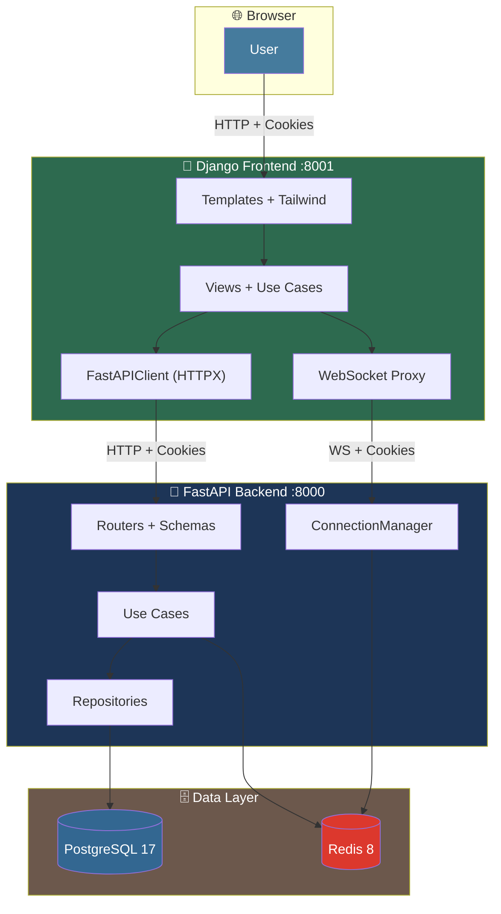

# 📁 โครงสร้างโฟลเดอร์ทั้งหมด (Folder Structure)

## ทั้ง 2 ส่วน: Django Frontend + FastAPI Backend

---

## 🌐 ภาพรวมการทำงานร่วมกัน (Monorepo)

```
project-root/                              # ← Root ของทั้งระบบ
│
├── fastapi-backend/                       # 🐍 ส่วนที่ 1: FastAPI (เดิม — ไม่แก้)
│   ├── app/
│   ├── migrations/
│   ├── scripts/
│   ├── secrets/keys/
│   ├── test/
│   ├── docs/
│   ├── .env.example
│   ├── Dockerfile
│   ├── docker-compose.yaml
│   ├── Makefile
│   ├── pyproject.toml
│   └── README.md
│
├── django-frontend/                       # 🎨 ส่วนที่ 2: Django BFF (ใหม่)
│   ├── config/
│   ├── apps/
│   ├── templates/
│   ├── static/
│   ├── docs/
│   ├── test/
│   ├── .env
│   ├── Dockerfile
│   ├── docker-compose.yaml
│   ├── manage.py
│   ├── requirements.txt
│   └── README_STR.md
│
├── docker-compose.yaml                    # 🐳 Stack รวม (optional)
├── .gitignore
├── .editorconfig
└── README.md                              # 📘 เอกสารรวม
```

---

# 🐍 ส่วนที่ 1: FastAPI Backend (เดิม — ไม่แก้)

```
fastapi-backend/
│
├── app/                                   # 📦 แอปพลิเคชันหลัก
│   │
│   ├── __init__.py
│   ├── app.py                             # Entry point — FastAPI()
│   │
│   ├── core/                              # ⚙️ Cross-cutting concerns
│   │   ├── __init__.py
│   │   ├── settings.py                    # Settings (pydantic-settings)
│   │   ├── security.py                    # Nested JWT (JWS + JWE)
│   │   ├── database.py                    # SQLAlchemy async engine
│   │   ├── cache.py                       # Redis client
│   │   ├── logging.py                     # Loguru + orjson
│   │   ├── middleware.py                  # ResponseFormatting, LogRequest, DeviceId
│   │   └── exceptions.py                  # CoreException
│   │
│   ├── modules/                           # 📚 9 modules (ตาม README)
│   │   │
│   │   ├── shared/                        # 🔗 Base types (ไม่ routed)
│   │   │   ├── __init__.py
│   │   │   ├── domain/
│   │   │   │   ├── __init__.py
│   │   │   │   ├── entities.py            # BaseEntity, DomainError, Pagination
│   │   │   │   ├── value_objects.py       # UNSET, Email, Name, Phone
│   │   │   │   └── enums.py               # Role, ResponseMessages, SortOrder
│   │   │   ├── application/
│   │   │   │   ├── __init__.py
│   │   │   │   ├── use_cases.py           # SharedUseCases
│   │   │   │   ├── exceptions.py          # StandardException, DomainException
│   │   │   │   └── utils.py               # BRASILIA_TZ, resolve_client_ip
│   │   │   ├── infrastructure/
│   │   │   │   ├── __init__.py
│   │   │   │   └── models.py              # Base, BaseModel
│   │   │   └── presentation/
│   │   │       ├── __init__.py
│   │   │       ├── schemas.py             # StandardResponse, Pagination*
│   │   │       └── dependencies.py        # Cross-module factories
│   │   │
│   │   ├── authentication/                # 🔐 Login/Refresh/Logout
│   │   │   ├── domain/
│   │   │   │   ├── entities.py            # Authentication
│   │   │   │   ├── value_objects.py
│   │   │   │   └── enums.py
│   │   │   ├── application/
│   │   │   │   ├── interfaces.py          # ITokenService
│   │   │   │   ├── use_cases.py           # AuthenticationUseCases
│   │   │   │   ├── mappers.py
│   │   │   │   ├── exceptions.py
│   │   │   │   └── utils.py
│   │   │   ├── infrastructure/
│   │   │   │   ├── models.py              # Authentication, RefreshToken, AccessToken
│   │   │   │   ├── repositories.py
│   │   │   │   ├── caches.py
│   │   │   │   └── services.py            # TokenService
│   │   │   └── presentation/
│   │   │       ├── routers.py
│   │   │       ├── schemas.py
│   │   │       ├── docs.py
│   │   │       └── dependencies.py
│   │   │
│   │   ├── user/                          # 👤 Accounts + Roles
│   │   │   ├── domain/
│   │   │   │   ├── entities.py            # User
│   │   │   │   ├── value_objects.py
│   │   │   │   └── enums.py               # Role, Gender
│   │   │   ├── application/
│   │   │   │   ├── interfaces.py
│   │   │   │   ├── use_cases.py
│   │   │   │   ├── mappers.py
│   │   │   │   └── exceptions.py
│   │   │   ├── infrastructure/
│   │   │   │   ├── models.py              # UserModel
│   │   │   │   └── repositories.py
│   │   │   └── presentation/
│   │   │       ├── routers.py
│   │   │       ├── schemas.py
│   │   │       ├── docs.py
│   │   │       └── dependencies.py
│   │   │
│   │   ├── key/                           # 🔑 API Keys (canonical reference)
│   │   │   ├── domain/
│   │   │   │   ├── entities.py            # Key
│   │   │   │   ├── value_objects.py       # KeySecret, KeyPrefix
│   │   │   │   └── enums.py               # KeyStatus, KeyScope
│   │   │   ├── application/
│   │   │   │   ├── interfaces.py          # IKeyRepository, IKeyCache, IKeyService
│   │   │   │   ├── use_cases.py           # KeyUseCases
│   │   │   │   ├── mappers.py
│   │   │   │   ├── exceptions.py
│   │   │   │   └── utils.py
│   │   │   ├── infrastructure/
│   │   │   │   ├── models.py              # KeyModel
│   │   │   │   ├── repositories.py        # PostgresKeyRepository
│   │   │   │   ├── caches.py              # RedisKeyCache
│   │   │   │   └── services.py            # KeyService
│   │   │   └── presentation/
│   │   │       ├── routers.py
│   │   │       ├── schemas.py
│   │   │       ├── docs.py
│   │   │       └── dependencies.py
│   │   │
│   │   ├── knowledge/                     # 📚 CRUD + Broadcast
│   │   │   ├── domain/
│   │   │   │   ├── entities.py            # Knowledge
│   │   │   │   ├── value_objects.py
│   │   │   │   └── enums.py
│   │   │   ├── application/
│   │   │   │   ├── interfaces.py
│   │   │   │   ├── use_cases.py
│   │   │   │   ├── mappers.py
│   │   │   │   └── exceptions.py
│   │   │   ├── infrastructure/
│   │   │   │   ├── models.py              # KnowledgeModel
│   │   │   │   ├── repositories.py
│   │   │   │   └── caches.py
│   │   │   └── presentation/
│   │   │       ├── routers.py
│   │   │       ├── schemas.py
│   │   │       ├── docs.py
│   │   │       └── dependencies.py
│   │   │
│   │   ├── notification/                  # 🔔 Role fan-out
│   │   │   ├── domain/
│   │   │   │   ├── entities.py            # Notification
│   │   │   │   ├── value_objects.py
│   │   │   │   └── enums.py               # NotificationType
│   │   │   ├── application/
│   │   │   │   ├── interfaces.py
│   │   │   │   ├── use_cases.py
│   │   │   │   ├── mappers.py
│   │   │   │   └── exceptions.py
│   │   │   ├── infrastructure/
│   │   │   │   ├── models.py              # NotificationModel
│   │   │   │   └── repositories.py
│   │   │   └── presentation/
│   │   │       ├── routers.py
│   │   │       ├── schemas.py
│   │   │       ├── docs.py
│   │   │       └── dependencies.py
│   │   │
│   │   ├── websocket/                     # 🔌 Real-time
│   │   │   ├── application/
│   │   │   │   ├── interfaces.py          # IConnectionManagerService
│   │   │   │   └── use_cases.py
│   │   │   ├── infrastructure/
│   │   │   │   └── services.py            # ConnectionManager
│   │   │   └── presentation/
│   │   │       ├── routers.py
│   │   │       ├── schemas.py
│   │   │       ├── docs.py
│   │   │       └── dependencies.py
│   │   │
│   │   ├── health/                        # ❤️ Liveness + Alembic version
│   │   │   ├── application/
│   │   │   ├── infrastructure/
│   │   │   └── presentation/
│   │   │       ├── routers.py
│   │   │       └── docs.py
│   │   │
│   │   └── example/                       # 📝 Minimal reference
│   │       ├── application/
│   │       ├── infrastructure/
│   │       └── presentation/
│   │           ├── routers.py
│   │           ├── schemas.py
│   │           └── docs.py
│   │
│   ├── routes.py                          # Router registration
│   └── middleware.py                      # Middleware registration
│
├── migrations/                            # 🗄️ Alembic
│   ├── env.py                             # ⚠️ ต้อง import ทุก model
│   ├── script.py.mako
│   └── versions/
│       └── (empty — ships empty)
│
├── scripts/                               # 🛠️ Utility scripts
│   ├── create_module.py                   # สร้าง module skeleton
│   ├── generate_secret.py                 # 32-byte hex secret
│   ├── generate_fernet.py                 # Fernet key
│   ├── directory_tree.py                  # เขียน tree
│   ├── websocket_test.html                # Browser WS client
│   └── asyncapi.yaml                      # AsyncAPI 2.6 spec
│
├── secrets/keys/                          # 🔐 JWT keys (gitignored)
│   ├── signing-private.pem
│   ├── signing-public.pem
│   ├── encryption-private.pem
│   └── encryption-public.pem
│
├── test/                                  # 🧪 Tests
│   ├── core/
│   └── modules/
│       ├── authentication/
│       ├── example/
│       ├── health/
│       ├── key/
│       ├── knowledge/
│       ├── notifications/
│       ├── shared/
│       ├── user/
│       └── websocket/
│
├── docs/                                  # 📘 Postman + specs
│   └── postman_collection.json
│
├── .env.example
├── .gitignore
├── .python-version
├── alembic.ini
├── docker-compose.yaml
├── Dockerfile
├── Makefile
├── pyproject.toml
├── requirements.txt
├── README.md
└── README-PTBR.md
```

---

# 🎨 ส่วนที่ 2: Django Frontend BFF (ใหม่)

```
django-frontend/
│
├── config/                                # ⚙️ Django Project
│   ├── __init__.py
│   ├── settings.py                        # Settings + INSTALLED_APPS + MIDDLEWARE
│   ├── urls.py                            # Root URLconf
│   ├── asgi.py                            # ASGI (Channels)
│   ├── wsgi.py                            # WSGI (fallback)
│   └── routing.py                         # WebSocket routing
│
├── apps/                                  # 📚 Django Apps (Modules)
│   │
│   ├── shared/                            # 🔗 Base types
│   │   ├── __init__.py
│   │   ├── apps.py
│   │   ├── domain/
│   │   │   ├── __init__.py
│   │   │   ├── entities.py                # BaseEntity, DomainError, Pagination
│   │   │   ├── value_objects.py           # UNSET, Email, Name, Phone
│   │   │   └── enums.py                   # Role, ResponseMessages, SortOrder
│   │   ├── application/
│   │   │   ├── __init__.py
│   │   │   ├── use_cases.py               # SharedUseCases
│   │   │   ├── interfaces.py              # Protocols
│   │   │   ├── exceptions.py              # StandardException, DomainException
│   │   │   └── utils.py                   # Helpers
│   │   ├── infrastructure/
│   │   │   ├── __init__.py
│   │   │   ├── fastapi_client.py          # HTTPX client (Core)
│   │   │   └── middleware.py              # FastAPISessionMiddleware
│   │   └── presentation/
│   │       ├── __init__.py
│   │       ├── context_processors.py      # user_context
│   │       └── dependencies.py            # Factories
│   │
│   ├── layout/                            # 🎨 Layout Components
│   │   ├── __init__.py
│   │   ├── apps.py
│   │   ├── presentation/
│   │   │   ├── __init__.py
│   │   │   ├── views.py                   # Layout partial views
│   │   │   └── urls.py                    # Layout URLs
│   │   └── templates/
│   │       └── layout/
│   │           ├── app_layout.html        # = AppLayoutComponent
│   │           ├── header.html            # = HeaderComponent
│   │           ├── sidebar.html           # = SidebarComponent
│   │           ├── footer.html            # = FooterComponent
│   │           └── layout_settings.html   # = LayoutSettingsComponent
│   │
│   ├── authentication/                    # 🔐 Auth Proxy
│   │   ├── __init__.py
│   │   ├── apps.py
│   │   ├── domain/
│   │   │   ├── __init__.py
│   │   │   └── entities.py                # Authentication entity
│   │   ├── application/
│   │   │   ├── __init__.py
│   │   │   ├── use_cases.py               # Login, Logout, Refresh
│   │   │   └── interfaces.py              # IAuthService
│   │   ├── infrastructure/
│   │   │   ├── __init__.py
│   │   │   └── fastapi_auth_client.py     # FastAPI auth client
│   │   └── presentation/
│   │       ├── __init__.py
│   │       ├── views.py                   # LoginView, LogoutView
│   │       ├── urls.py                    # Auth URLs
│   │       └── forms.py                   # LoginForm
│   │
│   ├── dashboard/                         # 🏠 Dashboard
│   │   ├── __init__.py
│   │   ├── apps.py
│   │   ├── application/
│   │   │   ├── __init__.py
│   │   │   └── use_cases.py               # DashboardUseCases
│   │   ├── infrastructure/
│   │   │   ├── __init__.py
│   │   │   └── fastapi_client.py          # FastAPI client
│   │   └── presentation/
│   │       ├── __init__.py
│   │       ├── views.py                   # DashboardView
│   │       └── urls.py                    # Dashboard URLs
│   │
│   ├── user/                              # 👤 User Proxy
│   │   ├── __init__.py
│   │   ├── apps.py
│   │   ├── domain/
│   │   │   ├── __init__.py
│   │   │   └── entities.py                # User entity
│   │   ├── application/
│   │   │   ├── __init__.py
│   │   │   ├── use_cases.py               # UserUseCases
│   │   │   └── interfaces.py              # IUserRepository
│   │   ├── infrastructure/
│   │   │   ├── __init__.py
│   │   │   └── fastapi_client.py          # FastAPI client
│   │   └── presentation/
│   │       ├── __init__.py
│   │       ├── views.py                   # ProfileView
│   │       ├── urls.py                    # User URLs
│   │       └── forms.py                   # UserForm
│   │
│   ├── key/                               # 🔑 API Keys Proxy
│   │   ├── __init__.py
│   │   ├── apps.py
│   │   ├── domain/
│   │   │   ├── __init__.py
│   │   │   ├── entities.py                # Key entity
│   │   │   ├── value_objects.py           # KeySecret, KeyPrefix
│   │   │   └── enums.py                   # KeyStatus, KeyScope
│   │   ├── application/
│   │   │   ├── __init__.py
│   │   │   ├── use_cases.py               # KeyUseCases
│   │   │   ├── interfaces.py              # IKeyRepository, IKeyCache
│   │   │   ├── mappers.py                 # KeyMapper
│   │   │   └── exceptions.py              # KeyException
│   │   ├── infrastructure/
│   │   │   ├── __init__.py
│   │   │   └── fastapi_client.py          # KeyFastAPIClient
│   │   └── presentation/
│   │       ├── __init__.py
│   │       ├── views.py                   # Key CRUD views
│   │       ├── urls.py                    # Key URLs
│   │       └── forms.py                   # KeyCreateForm, KeyUpdateForm
│   │
│   ├── knowledge/                         # 📚 Knowledge Proxy
│   │   ├── __init__.py
│   │   ├── apps.py
│   │   ├── domain/
│   │   │   ├── __init__.py
│   │   │   ├── entities.py                # Knowledge entity
│   │   │   └── enums.py                   # KnowledgeStatus
│   │   ├── application/
│   │   │   ├── __init__.py
│   │   │   ├── use_cases.py               # KnowledgeUseCases
│   │   │   ├── interfaces.py              # IKnowledgeRepository
│   │   │   ├── mappers.py                 # KnowledgeMapper
│   │   │   └── exceptions.py              # KnowledgeException
│   │   ├── infrastructure/
│   │   │   ├── __init__.py
│   │   │   └── fastapi_client.py          # KnowledgeFastAPIClient
│   │   └── presentation/
│   │       ├── __init__.py
│   │       ├── views.py                   # Knowledge CRUD views
│   │       ├── urls.py                    # Knowledge URLs
│   │       └── forms.py                   # KnowledgeForm
│   │
│   ├── notification/                      # 🔔 Notification Proxy
│   │   ├── __init__.py
│   │   ├── apps.py
│   │   ├── domain/
│   │   │   ├── __init__.py
│   │   │   ├── entities.py                # Notification entity
│   │   │   └── enums.py                   # NotificationType
│   │   ├── application/
│   │   │   ├── __init__.py
│   │   │   ├── use_cases.py               # NotificationUseCases
│   │   │   └── interfaces.py              # INotificationRepository
│   │   ├── infrastructure/
│   │   │   ├── __init__.py
│   │   │   └── fastapi_client.py          # NotificationFastAPIClient
│   │   └── presentation/
│   │       ├── __init__.py
│   │       ├── views.py                   # NotificationListView
│   │       └── urls.py                    # Notification URLs
│   │
│   ├── websocket/                         # 🔌 WebSocket Proxy
│   │   ├── __init__.py
│   │   ├── apps.py
│   │   ├── application/
│   │   │   ├── __init__.py
│   │   │   └── consumers.py               # NotificationProxyConsumer
│   │   ├── infrastructure/
│   │   │   ├── __init__.py
│   │   │   └── fastapi_ws_client.py       # FastAPI WS client
│   │   └── presentation/
│   │       ├── __init__.py
│   │       └── routing.py                 # WS routing
│   │
│   └── core/                              # 🛠️ Core utilities
│       ├── __init__.py
│       ├── apps.py
│       ├── application/
│       │   ├── __init__.py
│       │   └── use_cases.py
│       ├── infrastructure/
│       │   ├── __init__.py
│       │   └── services.py
│       └── presentation/
│           ├── __init__.py
│           └── views.py                   # HealthView, ErrorViews
│
├── templates/                             # 🎨 Global Templates
│   │
│   ├── base.html                          # ← App Layout (extends)
│   │
│   ├── partials/                          # Layout partials
│   │   ├── header.html                    # = HeaderComponent
│   │   ├── sidebar.html                   # = SidebarComponent
│   │   ├── footer.html                    # = FooterComponent
│   │   ├── layout-settings.html           # = LayoutSettingsComponent
│   │   ├── page-header.html               # = PageHeaderComponent
│   │   ├── pagination.html                # Reusable pagination
│   │   ├── messages.html                  # Django messages
│   │   └── confirm-modal.html             # Confirm dialog
│   │
│   ├── authentication/                    # 🔐 Auth pages
│   │   ├── login.html
│   │   └── logout.html
│   │
│   ├── dashboard/                         # 🏠 Dashboard pages
│   │   └── index.html
│   │
│   ├── user/                              # 👤 User pages
│   │   ├── me.html
│   │   └── list.html
│   │
│   ├── key/                               # 🔑 Key pages
│   │   ├── list.html
│   │   ├── detail.html
│   │   └── form.html
│   │
│   ├── knowledge/                         # 📚 Knowledge pages
│   │   ├── list.html
│   │   ├── detail.html
│   │   └── form.html
│   │
│   ├── notification/                      # 🔔 Notification pages
│   │   └── list.html
│   │
│   └── errors/                            # ⚠️ Error pages
│       ├── 400.html
│       ├── 403.html
│       ├── 404.html
│       └── 500.html
│
├── static/                                # 🎨 Static files
│   │
│   ├── css/
│   │   ├── tailwind.css                   # ← Tailwind source
│   │   ├── tailwind.output.css            # ← Build output
│   │   └── app.css                        # Custom overrides
│   │
│   ├── js/
│   │   ├── app.js                         # Alpine.js root
│   │   ├── header.js                      # Header logic
│   │   ├── sidebar.js                     # Sidebar logic
│   │   ├── layout-settings.js             # Settings logic
│   │   ├── websocket.js                   # WS client
│   │   └── api.js                         # Fetch helpers
│   │
│   └── img/
│       ├── logo.svg
│       ├── logo-dark.svg
│       └── favicon.ico
│
├── docs/                                  # 📘 AI Prompt Templates
│   │
│   ├── template_modules.md                # 📘 Master template
│   ├── README.md                          # 📑 Index 68 modules
│   │
│   └── prompts/                           # 📄 1 module = 1 file
│       │
│       ├── layer-0-core/                  # (6 modules)
│       │   ├── money.md
│       │   ├── tenant_context.md
│       │   ├── audit.md
│       │   ├── idempotency.md
│       │   ├── config.md
│       │   └── events.md
│       │
│       ├── layer-1-foundation/            # (11 modules)
│       │   ├── tenancy.md
│       │   ├── authentication.md
│       │   ├── user.md
│       │   ├── employee.md
│       │   ├── customer.md
│       │   ├── supplier.md
│       │   ├── product.md
│       │   ├── pricing.md
│       │   ├── key.md                     # ← ตัวอย่างเต็ม
│       │   ├── knowledge.md
│       │   └── notification.md
│       │
│       ├── layer-2-money-path/            # (7 modules)
│       │   ├── order.md
│       │   ├── invoice.md
│       │   ├── ledger.md
│       │   ├── payment.md
│       │   ├── accounting_gateway.md
│       │   ├── tax.md
│       │   └── reconciliation.md
│       │
│       ├── layer-3-goods-path/            # (13 modules)
│       │   ├── inventory.md
│       │   ├── warehouse.md
│       │   ├── lot.md
│       │   ├── production.md
│       │   ├── recipe.md
│       │   ├── quality.md
│       │   ├── waste.md
│       │   ├── procurement.md
│       │   ├── traceability.md
│       │   ├── agriculture.md
│       │   ├── crop.md
│       │   ├── soil.md
│       │   └── irrigation.md
│       │
│       ├── layer-4-operations/            # (13 modules)
│       │   ├── transport.md
│       │   ├── delivery.md
│       │   ├── route.md
│       │   ├── gps.md
│       │   ├── retail.md
│       │   ├── pos.md
│       │   ├── shift.md
│       │   ├── line_channel.md
│       │   ├── promotion.md
│       │   ├── loyalty.md
│       │   ├── crm.md
│       │   ├── campaign.md
│       │   └── support.md
│       │
│       ├── layer-5-intelligence/          # (7 modules)
│       │   ├── reporting.md
│       │   ├── analytics.md
│       │   ├── forecast.md                # ← ตัวอย่างเต็ม
│       │   ├── kpi.md
│       │   ├── satisfaction.md
│       │   ├── recommendation.md
│       │   └── oee.md
│       │
│       ├── layer-6-monitoring/            # (8 modules)
│       │   ├── iot.md
│       │   ├── cctv.md
│       │   ├── monitoring.md
│       │   ├── backup.md
│       │   ├── alerting.md
│       │   ├── audit_viewer.md
│       │   ├── maintenance.md
│       │   └── energy.md
│       │
│       └── layer-7-templates/             # (3 modules)
│           ├── health.md
│           ├── example.md
│           └── blank.md
│
├── test/                                  # 🧪 Tests
│   ├── __init__.py
│   ├── conftest.py                        # pytest fixtures
│   │
│   ├── core/
│   │   ├── test_middleware.py
│   │   └── test_fastapi_client.py
│   │
│   └── modules/
│       ├── shared/
│       ├── layout/
│       ├── authentication/
│       ├── dashboard/
│       ├── user/
│       ├── key/
│       ├── knowledge/
│       ├── notification/
│       └── websocket/
│
├── .env                                   # Local env (gitignored)
├── .env.example                           # Template
├── .gitignore
├── .editorconfig
├── Dockerfile                             # Django container
├── docker-compose.yaml                    # Django stack
├── manage.py                              # Django CLI
├── requirements.txt
├── pyproject.toml                         # ruff, pytest config
├── tailwind.config.js
├── postcss.config.js
└── README_STR.md                          # ← ไฟล์นี้
```

---

# 🐳 ส่วนที่ 3: Docker Stack รวม (optional)

```
project-root/
│
├── docker-compose.yaml                    # Stack รวมทั้ง 2 ส่วน
│
└── .env                                   # Env รวม
```

```yaml
# docker-compose.yaml (root)
version: "3.9"

services:
  # ═══════════════════════════════════════════════
  # 🐍 FastAPI Backend (เดิม)
  # ═══════════════════════════════════════════════
  fastapi:
    build: ./fastapi-backend
    container_name: fastapi-api
    ports:
      - "${FASTAPI_PORT:-8000}:2000"
    environment:
      - APPLICATION_ENVIRONMENT=production
      - POSTGRESQL_HOST=database
      - REDIS_HOST=cache
    depends_on:
      database:
        condition: service_healthy
      cache:
        condition: service_healthy
    networks:
      - app-network

  # ═══════════════════════════════════════════════
  # 🎨 Django Frontend BFF (ใหม่)
  # ═══════════════════════════════════════════════
  django:
    build: ./django-frontend
    container_name: django-bff
    ports:
      - "${DJANGO_PORT:-8001}:8001"
    environment:
      - FASTAPI_BASE_URL=http://fastapi:2000
      - DJANGO_SECRET_KEY=${DJANGO_SECRET_KEY}
      - DJANGO_DEBUG=False
    depends_on:
      - fastapi
    networks:
      - app-network

  # ═══════════════════════════════════════════════
  # 🗄️ PostgreSQL
  # ═══════════════════════════════════════════════
  database:
    image: postgres:17-alpine
    container_name: erp-database
    environment:
      - POSTGRES_USER=${POSTGRESQL_USERNAME}
      - POSTGRES_PASSWORD=${POSTGRESQL_PASSWORD}
      - POSTGRES_DB=${POSTGRESQL_DATABASE}
    ports:
      - "${POSTGRESQL_PORT:-5432}:5432"
    volumes:
      - postgres-data:/var/lib/postgresql/data
    healthcheck:
      test: ["CMD-SHELL", "pg_isready -U ${POSTGRESQL_USERNAME}"]
      interval: 5s
      retries: 5
    networks:
      - app-network

  # ═══════════════════════════════════════════════
  # ⚡ Redis
  # ═══════════════════════════════════════════════
  cache:
    image: redis:8.6-alpine
    container_name: erp-cache
    command: redis-server --appendonly yes --maxmemory 256mb --maxmemory-policy allkeys-lru
    ports:
      - "${REDIS_PORT:-6379}:6379"
    volumes:
      - redis-data:/data
    healthcheck:
      test: ["CMD", "redis-cli", "ping"]
      interval: 5s
      retries: 5
    networks:
      - app-network

  # ═══════════════════════════════════════════════
  # 🎛️ Admin UIs (optional)
  # ═══════════════════════════════════════════════
  database-admin:
    image: dpage/pgadmin4:9.2
    container_name: erp-pgadmin
    environment:
      - PGADMIN_DEFAULT_EMAIL=${PGADMIN_EMAIL}
      - PGADMIN_DEFAULT_PASSWORD=${PGADMIN_PASSWORD}
    ports:
      - "${PGADMIN_PORT:-8080}:80"
    depends_on:
      - database
    networks:
      - app-network

  cache-admin:
    image: redis/redisinsight:3.4.2
    container_name: erp-redisinsight
    ports:
      - "${REDISINSIGHT_PORT:-8081}:5540"
    depends_on:
      - cache
    networks:
      - app-network

volumes:
  postgres-data:
  redis-data:

networks:
  app-network:
    driver: bridge
```

---

# 📊 ภาพรวมการเชื่อมต่อ



---

# 📋 สรุปการแบ่งส่วน

| ส่วน | Path | จำนวน | หน้าที่ |
|---|---|---|---|
| **🐍 FastAPI Backend** | `fastapi-backend/` | 9 modules | API-only, ไม่แก้ |
| **🎨 Django Frontend** | `django-frontend/` | 9 apps + 68 docs | BFF, Proxy, Render |
| **🐳 Docker Stack** | `docker-compose.yaml` | 6 services | รวมทั้ง 2 ส่วน |
| **📘 Documentation** | `README_STR.md` | 1 | เอกสารรวม |

### Module Mapping (Django ↔ FastAPI)

| Django App | → | FastAPI Module | Endpoint |
|---|---|---|---|
| `authentication` | → | `authentication` | `/api/v1/authentication/` |
| `user` | → | `user` | `/api/v1/user/` |
| `key` | → | `key` | `/api/v1/key/` |
| `knowledge` | → | `knowledge` | `/api/v1/knowledge/` |
| `notification` | → | `notification` | `/api/v1/notification/` |
| `websocket` | → | `websocket` | `/api/v1/websocket/connect/` |
| `dashboard` | → | (composite) | (combines many) |
| `layout` | → | (N/A) | (UI only) |
| `shared` | → | `shared` | (base types) |

---

**ผู้แต่ง:** Kongnakorn Jantakun
**อีเมล:** kongnakornjantakun@gmail.com
**เวอร์ชัน:** 2.0.0
**อัปเดต:** 2026-09-17