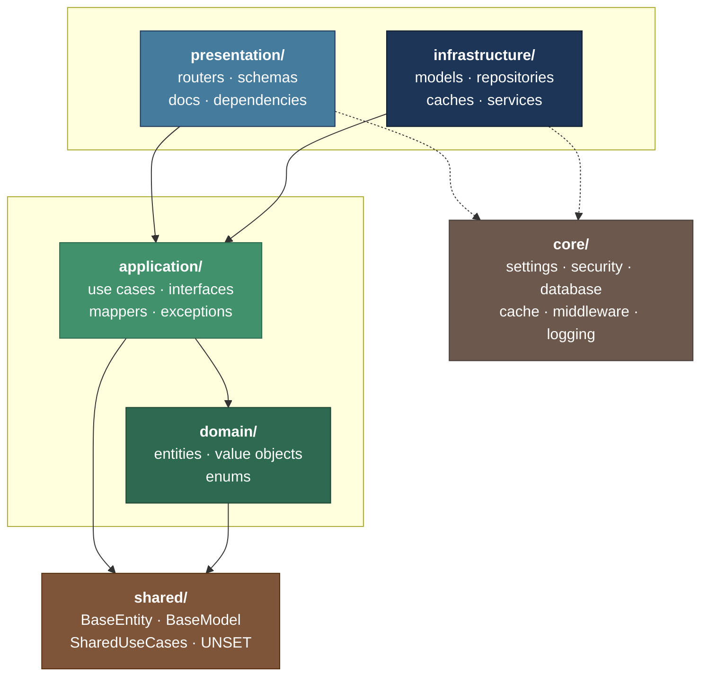
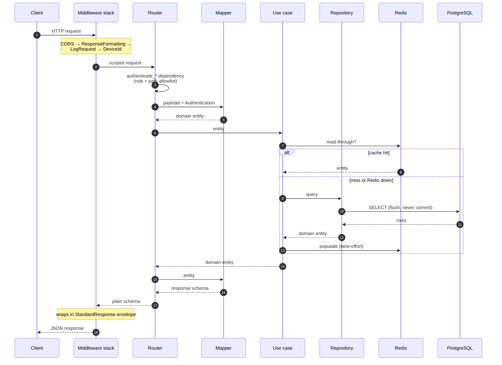
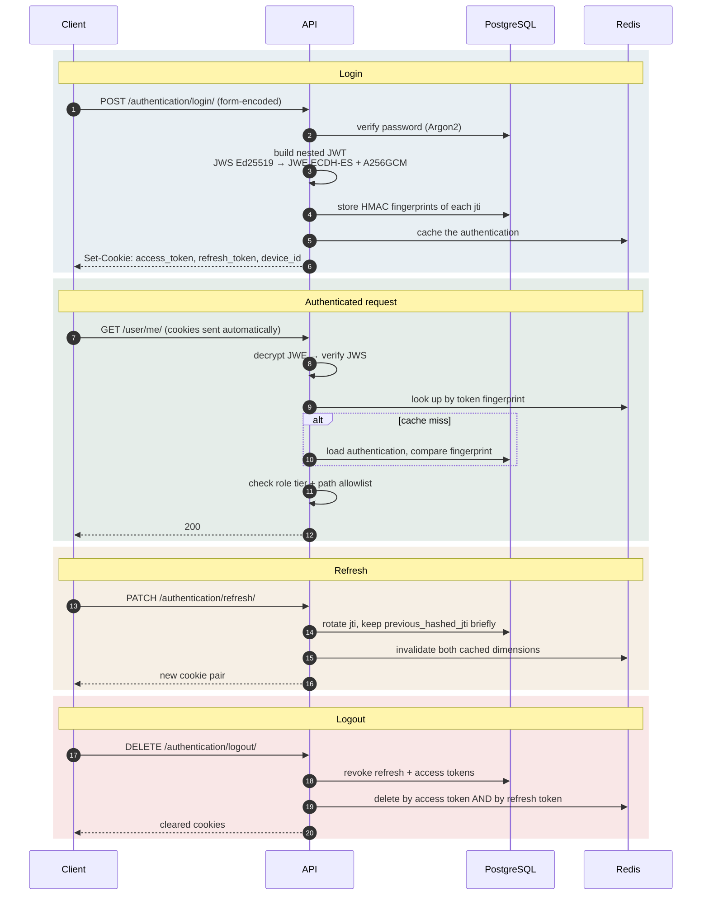
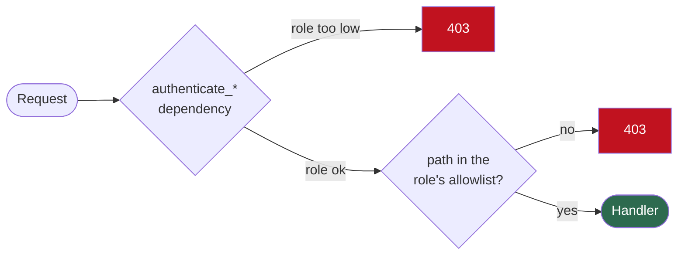
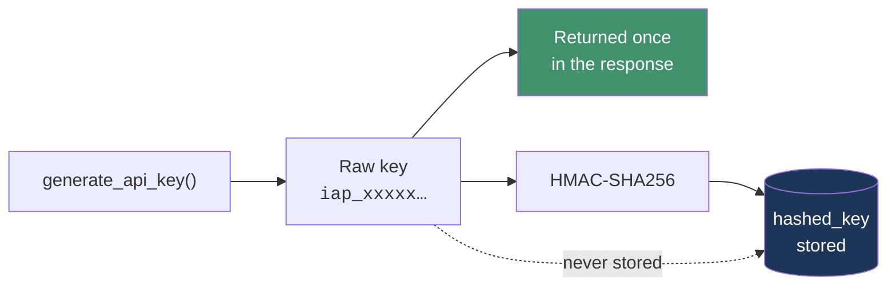
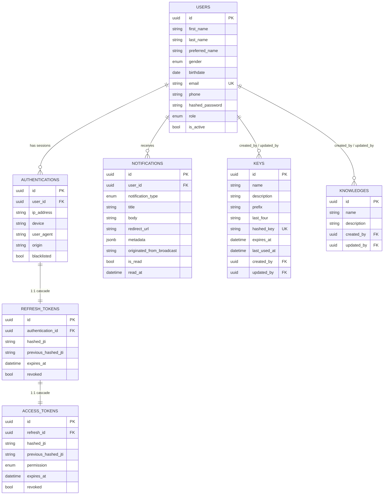
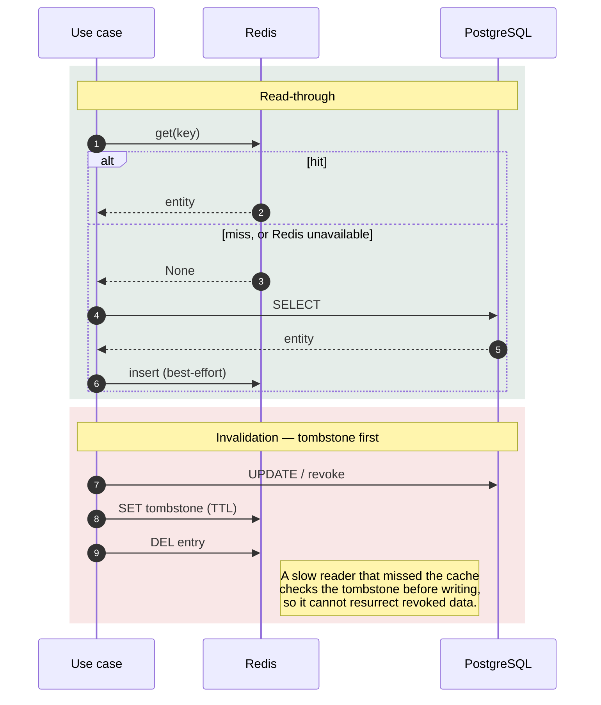

<div align="center">

# FastAPI Clean Architecture and DDD Template

**A production-shaped Python backend template — Clean Architecture, Domain-Driven Design, and everything already wired.**

[](https://www.python.org/)
[](https://fastapi.tiangolo.com/)
[](https://docs.pydantic.dev/)
[](https://www.sqlalchemy.org/)
[](https://www.postgresql.org/)
[](https://redis.io/)
[](https://www.docker.com/)
[](https://docs.astral.sh/uv/)
[](https://docs.astral.sh/ruff/)
[](LICENSE)

[](https://github.com/kongnakornna/fastapi-clean-architecture-ddd-erp-iot/fastapi-clean-architecture-ddd-template/stargazers)
[](https://github.com/kongnakornna/fastapi-clean-architecture-ddd-erp-iot/fastapi-clean-architecture-ddd-template/network/members)
[](https://github.com/kongnakornna/fastapi-clean-architecture-ddd-erp-iot/fastapi-clean-architecture-ddd-template/issues)
[](https://github.com/kongnakornna/fastapi-clean-architecture-ddd-erp-iot/fastapi-clean-architecture-ddd-template/commits)

**English** · [Português](README-PTBR.md)

</div>

---

Most "clean architecture" templates give you empty folders and a diagram. This one gives you a
**working application**: cookie-based authentication with nested JWTs, API-key management with
rotation, role-based access control enforced twice over, Redis cache-aside with tombstone
invalidation, real-time WebSocket delivery, notifications with role fan-out, and a Docker stack
that migrates itself on boot.

Nine modules, twenty-three routes, seven tables — all following one consistent set of patterns you
can copy for the tenth module.

## Table of Contents

- [Why This Template](#why-this-template)
- [Quick Start](#quick-start)
- [Architecture](#architecture)
- [Modules](#modules)
- [API Reference](#api-reference)
- [Security](#security)
- [Data](#data)
- [Caching](#caching)
- [Development](#development)
- [Configuration](#configuration)
- [Known Limitations](#known-limitations)
- [Contributing](#contributing)
- [License](#license)

---

## Why This Template

| | Feature | What you actually get |
|---|---|---|
| 🏛️ | **Clean Architecture + DDD** | Four layers per module with enforced dependency direction. `domain/` imports no framework — ever. |
| 🔐 | **Authentication, done properly** | Nested JWT (JWS signed with Ed25519, wrapped in a JWE encrypted with ECDH-ES + A256GCM), delivered in HTTP-only cookies, with HMAC fingerprints stored server-side so tokens are revocable. |
| 🔑 | **API keys** | Full lifecycle — create, list, rotate, revoke. The raw key is returned exactly once and never stored. |
| 👥 | **Role-based access** | `admin` / `manager` / `user`, enforced by the dependency **and** by a path allowlist. Two independent gates. |
| ⚡ | **Redis cache-aside** | Namespaced and versioned keys, with tombstone invalidation that closes the revoked-credential race. Caches never raise — a Redis outage degrades to the database. |
| 🔔 | **Notifications** | Per-user and role-cascaded broadcast fan-out, dispatched over WebSocket best-effort after the write commits. |
| 🔌 | **WebSockets** | Authenticated channel with Origin validation, since CORS does not cover the handshake. |
| 📦 | **Self-migrating stack** | `docker compose up` gives you Postgres, Redis, pgAdmin and RedisInsight; the app runs Alembic to head on startup. |
| 📖 | **OpenAPI that means something** | Every endpoint documents its full error contract, not just the happy path. |

---

## Quick Start

### Prerequisites

| Tool | Version | Why |
|---|---|---|
| [Python](https://www.python.org/) | 3.14+ | Pinned in `.python-version` |
| [uv](https://docs.astral.sh/uv/) | latest | Dependency and virtualenv management |
| [Docker](https://www.docker.com/) + Compose | latest | Postgres, Redis, and the admin UIs |

### Five commands

```bash
# 1. Clone
git clone fastapi-clean-architecture-ddd-erp-iot
cd fastapi-clean-architecture-ddd-template

# 2. Configure — every key in .env.example must have a value
cp .env.example .env

# 3. Install dependencies
uv sync

# 4. Start Postgres, Redis and the admin UIs
make dependencies-up-silent

# 5. Run the API (migrations apply automatically on boot)
make dev
```

> [!IMPORTANT]
> Step 2 is not optional. `Settings` declares most fields as **required**, so the app raises a
> `ValidationError` on startup if any key is left empty. See
> [Configuration](#configuration) for every key and a sensible value.

### What you get

| Service | URL | Notes |
|---|---|---|
| **API** | http://localhost:8000 | `APPLICATION_PORT` |
| **Swagger UI** | http://localhost:8000/docs | Disabled in `production` |
| **ReDoc** | http://localhost:8000/redoc | Disabled in `production` |
| **OpenAPI JSON** | http://localhost:8000/openapi.json | Disabled in `production` |
| **Health check** | http://localhost:8000/health/ | Public |
| **pgAdmin** | http://localhost:8080 | `PGADMIN_EMAIL` / `PGADMIN_PASSWORD` |
| **RedisInsight** | http://localhost:8081 | Pre-wired to the `cache` service |
| **Dev tools** | http://localhost:8000/devtools/ | `development` only — WebSocket test client, AsyncAPI docs |

### First request

An admin user is seeded from `SECURITY_ADMIN_EMAIL` / `SECURITY_ADMIN_PASSWORD`. Log in — note
that this endpoint takes **form-encoded** data, not JSON:

```bash
curl -X POST http://localhost:8000/api/v1/authentication/login/ \
  -H "Content-Type: application/x-www-form-urlencoded" \
  -d "username=$SECURITY_ADMIN_EMAIL&password=$SECURITY_ADMIN_PASSWORD" \
  -c cookies.txt

curl http://localhost:8000/api/v1/user/me/ -b cookies.txt
```

> [!TIP]
> A Postman collection covering every endpoint lives at
> [`docs/`](docs/). Import it, then fill in the `admin_email` and `admin_password`
> collection variables.

---

## Architecture

Every module is split into four layers. Dependencies point **inward only** — the domain knows
nothing about anything else.



| Layer | Directory | Contains | May import |
|---|---|---|---|
| **Domain** | `domain/` | `entities.py`, `value_objects.py`, `enums.py` | `shared` only. **No** FastAPI, SQLAlchemy, or Pydantic. |
| **Application** | `application/` | `use_cases.py`, `interfaces.py`, `mappers.py`, `exceptions.py`, `utils.py` | `domain`, `shared` |
| **Infrastructure** | `infrastructure/` | `models.py`, `repositories.py`, `caches.py`, `services.py` | `domain`, `application`, `core` |
| **Presentation** | `presentation/` | `routers.py`, `schemas.py`, `docs.py`, `dependencies.py` | everything below it |

The application layer depends on `typing.Protocol` contracts, never on concrete classes. That is
what makes a use case testable with an in-memory fake and lets you swap Postgres for anything
else without touching business logic.

<details>
<summary><b>The three error-handling shapes</b> — one per layer kind</summary>

<br/>

Getting this wrong is the most consequential mistake in the codebase, so it is worth stating
precisely.

**3-branch** — use cases and router handlers:

```python
except StandardException:
    raise
except DomainError as e:
    raise DomainException(e)
except Exception as e:
    logger.opt(exception=e).error("An error occurred in the create key endpoint.")
    raise KeyException()
```

**2-branch** — repositories and services. No `DomainError` branch: these layers never evaluate
domain rules.

```python
except StandardException:
    raise
except Exception as e:
    logger.opt(exception=e).error("An error occurred in the create key repository.")
    raise KeyException()
```

**Never-raise** — caches. Every method catches, logs, and returns `None`.

```python
except Exception as e:
    logger.opt(exception=e).error(
        "An error occurred in the get key by hashed key cache. Falling back to the database."
    )
    return None
```

> [!WARNING]
> `except StandardException` **must come first**. `StandardException` extends
> `HTTPException`, so any other ordering swallows every deliberate 404 and 409 into a 500.

A cache failure degrades to the database and must never fail a request — that is why the cache
shape has no re-raise branch at all.

</details>

<details>
<summary><b>Module anatomy</b> — every file and what belongs in it</summary>

<br/>

```text
app/modules/{module}/
├── domain/
│   ├── entities.py          Dataclasses extending BaseEntity; validation in __post_init__
│   ├── value_objects.py     Plain classes: _normalize → _validate → __str__ → __eq__
│   └── enums.py             Module enums, always (str, Enum)
├── application/
│   ├── interfaces.py        Protocol contracts: I{Entity}Repository / Cache / Service
│   ├── use_cases.py         One {Module}UseCases class; business rules live here
│   ├── mappers.py           # ENTITY / DTOS · # ENTITY / MODELS · # ENTITY / CACHE
│   ├── exceptions.py        Generic {Module}Exception + one per business rule
│   └── utils.py             Module-local helpers
├── infrastructure/
│   ├── models.py            SQLAlchemy models extending BaseModel
│   ├── repositories.py      Postgres{Entity}Repository — flush(), never commit()
│   ├── caches.py            Redis{Entity}Cache — namespaced, tombstoned, never raises
│   └── services.py          External or stateful systems behind a Protocol
└── presentation/
    ├── routers.py           Handlers: payload → mapper → use case → mapper → return
    ├── schemas.py           Pydantic v2 with full Field + ConfigDict
    ├── docs.py              router_docs + one {action}_docs per endpoint
    └── dependencies.py      Depends factories, returning the Protocol type
```

Empty files are normal. A module keeps the full skeleton even when a layer file is unused — an
empty `caches.py` means "this module does not cache", not "someone forgot a file".

`scripts/create_module.py` generates this exact tree.

</details>

### Request lifecycle



Handlers never build the response envelope — `ResponseFormattingMiddleware` does that. Handlers
never contain business logic — the use case does that. The body of every handler is exactly
`payload → mapper → use case → mapper → return`.

---

## Modules

```text
app/modules/
├── shared/           Base types every module builds on — not routed
├── authentication/   Login, refresh, logout; nested JWT issuance
├── user/             Internal accounts and roles
├── key/              API keys — the most complete module
├── knowledge/        CRUD + broadcast notification reference
├── notification/     Per-user and role fan-out
├── websocket/        Real-time delivery
├── health/           Liveness and Alembic version
└── example/          Minimal reference module, no persistence
```

| Module | Routes | Persistence | Cache | Service | Role |
|---|---|---|---|---|---|
| `authentication` | 3 | ✅ | ✅ | `ITokenService` | Session lifecycle, token rotation |
| `key` | 6 | ✅ | ✅ | `IKeyService` | **Canonical reference** — copy this one |
| `user` | 2 | ✅ | — | — | Accounts, roles, `/me` |
| `knowledge` | 4 | ✅ | partial | — | CRUD + broadcast notifications |
| `notification` | 2 | ✅ | — | — | Per-user + role-cascaded fan-out |
| `websocket` | 1 + WS | — | — | `IConnectionManagerService` | In-memory, single-process |
| `health` | 3 | `alembic_version` | — | — | Liveness, docs redirect, migration state |
| `example` | 1 | — | — | — | Minimal demo; no repository, no model |
| `shared` | — | base types | — | — | `BaseEntity`, `BaseModel`, `SharedUseCases` |

> [!TIP]
> When a pattern is ambiguous, read **`key`**. It is the only module exercising every layer:
> cache with tombstones, a service, full CRUD plus rotation, actor projections, and transient
> secret handling.

<details>
<summary><b>What lives in <code>shared</code></b></summary>

<br/>

| File | Exports |
|---|---|
| `domain/entities.py` | `BaseEntity`, `DomainError`, `DomainErrors`, `Pagination`, `PaginatedList` |
| `domain/value_objects.py` | `UNSET`, `RESOURCE_NAME_PATTERN`, `Email`, `Name`, `Phone` |
| `domain/enums.py` | `ApplicationEnvironment`, `CookieSameSite`, `ResponseMessages`, `Role`, `SortOrder` |
| `infrastructure/models.py` | `Base`, `BaseModel` |
| `application/exceptions.py` | `StandardException`, `DomainException`, `CoreException`, `OriginNotAllowedException` |
| `application/use_cases.py` | `SharedUseCases` — notifications and user lookups |
| `application/utils.py` | `BRASILIA_TZ`, `current_timestamp()`, `resolve_client_ip()` |
| `presentation/schemas.py` | `StandardResponse`, `PaginationParams`, `PaginationMeta`, `CreateResponse`, `UpdateResponse`, `DeleteResponse` |
| `presentation/dependencies.py` | Cross-module repository, cache, and `SharedUseCases` factories |

**Inherited fields — never redeclare these.**

`BaseModel` (ORM) provides `id` (UUID, `gen_random_uuid()`), `is_active` (soft-delete flag),
`created_at` and `updated_at` (Brasília timezone, DB-managed).

`BaseEntity` (domain) provides the same four plus `deactivate()`.

**The `UNSET` sentinel.** Partial updates need to distinguish "field omitted" from "field
explicitly set to null". `UNSET` is that distinction, and it flows through three places:

1. The entity defaults the field to `UNSET`.
2. The update mapper sets it from `payload.model_fields_set`.
3. The use case keeps the stored value wherever the incoming one `is UNSET`.

Always compare with `is` / `is not`, never `==`.

</details>

---

## API Reference

**22 HTTP routes + 1 WebSocket channel.** Every route is registered twice — with and without a
trailing slash — so both forms work; only the trailing-slash form appears in OpenAPI.

### Authentication

| Method | Path | Access | Description |
|---|---|---|---|
| `POST` | `/api/v1/authentication/login/` | 🌐 Public | Issues the cookie pair. **Form-encoded**, not JSON. |
| `PATCH` | `/api/v1/authentication/refresh/` | 👤 User | Rotates the refresh token and mints a new access token. |
| `DELETE` | `/api/v1/authentication/logout/` | 🌐 Public¹ | Revokes the session and clears cookies. |

### User

| Method | Path | Access | Description |
|---|---|---|---|
| `POST` | `/api/v1/user/` | 🌐 Public | Registers an account. Email must match `SECURITY_EMAIL_ALLOWED_DOMAINS`. |
| `GET` | `/api/v1/user/me/` | 👤 User | The authenticated user's profile. |

### API keys

| Method | Path | Access | Description |
|---|---|---|---|
| `POST` | `/api/v1/key/` | 🔴 Admin | Creates a key. **Returns the raw secret once.** |
| `GET` | `/api/v1/key/` | 🔴 Admin | Paginated list. |
| `GET` | `/api/v1/key/{id}/` | 🔴 Admin | One key with its creator and updater. |
| `PATCH` | `/api/v1/key/{id}/` | 🔴 Admin | Renames or re-describes. Partial. |
| `PATCH` | `/api/v1/key/{id}/rotate/` | 🔴 Admin | New secret, same record. **Returns the raw secret once.** |
| `DELETE` | `/api/v1/key/{id}/` | 🔴 Admin | Revokes (soft delete) and invalidates the cache. |

### Knowledge

| Method | Path | Access | Description |
|---|---|---|---|
| `POST` | `/api/v1/knowledge/` | 🟠 Manager | Creates and broadcasts a notification to managers. |
| `GET` | `/api/v1/knowledge/` | 🟠 Manager | Paginated list. |
| `PATCH` | `/api/v1/knowledge/{id}/` | 🟠 Manager | Partial update. |
| `DELETE` | `/api/v1/knowledge/{id}/` | 🟠 Manager | Soft delete. |

### Notification

| Method | Path | Access | Description |
|---|---|---|---|
| `GET` | `/api/v1/notification/` | 👤 User | The caller's notifications, paginated. |
| `PATCH` | `/api/v1/notification/{id}/` | 👤 User | Marks as read. |

### Health, WebSocket, Example

| Method | Path | Access | Description |
|---|---|---|---|
| `GET` | `/health/` | 🌐 Public | Liveness probe. |
| `GET` | `/` | ⚠️ | Intended to redirect to `/docs` — see [Known Limitations](#known-limitations). |
| `GET` | `/api/v1/alembic-version/` | 🔴 Admin | The applied migration revision. |
| `GET` | `/api/v1/websocket/connect/` | 🌐 Public | Documentation-only decoy; raises immediately. |
| `WS` | `/api/v1/websocket/connect/` | 👤 User | The real channel. Origin-validated. |
| `POST` | `/api/v1/example/` | 🌐 Public | Minimal reference endpoint. |

¹ `logout` sits in the public allowlist tier but still runs `authenticate_logout`, which tolerates
partially expired state so a stale session can always be cleaned up.

<details>
<summary><b>Response envelope</b> — every response has the same shape</summary>

<br/>

`ResponseFormattingMiddleware` wraps every JSON response. Handlers return a plain schema and never
construct this themselves.

```json
{
  "code": 200,
  "method": "GET",
  "path": "/api/v1/key/",
  "timestamp": "2026-07-31T12:34:56Z",
  "details": {
    "message": "Resource retrieved successfully",
    "data": { }
  }
}
```

| Field | Meaning |
|---|---|
| `code` | HTTP status code |
| `method` | HTTP method of the request |
| `path` | Request path |
| `timestamp` | ISO 8601, UTC |
| `details.message` | A `ResponseMessages` constant — never an ad-hoc string |
| `details.data` | The endpoint's payload, or `{"errors": ...}` on failure |

Swagger, ReDoc, and `text/event-stream` responses bypass the wrapper.

</details>

<details>
<summary><b>Pagination</b> — query parameters and metadata</summary>

<br/>

| Parameter | Type | Default | Constraint |
|---|---|---|---|
| `page` | int | `1` | ≥ 1 |
| `limit` | int | `20` | 1–100 |
| `sort_order` | enum | `desc` | `asc` \| `desc` |
| `sort_by` | enum | per module | Must be a real column |

```bash
curl "http://localhost:8000/api/v1/key/?page=1&limit=10&sort_by=updated_at&sort_order=desc" -b cookies.txt
```

Every list response carries a `pagination` block:

```json
{
  "total": 87,
  "page": 2,
  "limit": 20,
  "total_pages": 5,
  "has_next": true,
  "has_prev": true
}
```

The total is computed in the **same query** as the page, using a window function
(`func.count(...).over()`) — there is never a second `COUNT(*)` round trip.

> The HTTP layer says `limit`; the domain layer says `per_page`. The mappers translate at the
> boundary.

</details>

<details>
<summary><b>Error catalogue</b> — status codes and when they occur</summary>

<br/>

| Status | `ResponseMessages` | When |
|---|---|---|
| `400` | `VALIDATION_ERROR` | A domain rule failed — raised as `DomainException` |
| `400` | `BAD_REQUEST` | An update submitted no effective change |
| `401` | `UNAUTHORIZED_ERROR` | Credential missing, invalid, revoked, or expired |
| `403` | `AUTHORIZATION_ERROR` | Authenticated but not permitted, or the path is not in the caller's tier |
| `404` | `RESOURCE_NOT_FOUND` | Record does not exist or is soft-deleted |
| `405` | `METHOD_NOT_ALLOWED` | Method unsupported on that path |
| `409` | `CONFLICT` | Natural-key collision, e.g. a duplicate name |
| `422` | `VALIDATION_ERROR` | Pydantic rejected the payload before the handler ran |
| `500` | `INTERNAL_ERROR` | Unexpected failure — the module's generic exception |
| `502` | `BAD_GATEWAY` | Upstream dependency failed |
| `504` | `GATEWAY_TIMEOUT` | Upstream dependency timed out |

`400` and `422` are genuinely different: `422` is FastAPI rejecting the request shape before your
code runs; `400` is a business rule failing inside it.

Every error body carries `details.data.errors` — a string for one failure, a list when several
were collected at once (an entity reports **all** its validation failures in a single response,
not just the first).

</details>

<details>
<summary><b>WebSocket channel</b> — connecting and message shape</summary>

<br/>

**Endpoint:** `ws://localhost:8000/api/v1/websocket/connect/`

Authentication uses the same HTTP-only cookies as the REST API — the browser sends them
automatically on the upgrade. The `Origin` header is validated against
`SECURITY_ALLOW_ORIGINS`, because `CORSMiddleware` does **not** cover the WebSocket handshake.

Messages flow **server → client** only. Client frames are accepted and discarded, which makes them
usable as a keepalive.

```json
{
  "message_type": "notification",
  "body": {
    "id": "550e8400-e29b-41d4-a716-446655440000",
    "created_at": "2026-01-15T10:30:00Z",
    "notification_type": "knowledge_created",
    "title": "Knowledge base created",
    "body": "The knowledge base 'ML Fundamentals' was created successfully.",
    "redirect_url": "https://app.example.com,mycompany.com,gmail.com/knowledge/550e8400"
  }
}
```

Broadcasts apply a role cascade: `ADMIN` reaches admins, `MANAGER` reaches managers and admins,
`USER` reaches everyone.

A browser test client and the full AsyncAPI specification are served at `/devtools/` in
development — see `scripts/websocket_test.html` and `scripts/asyncapi.yaml`.

</details>

---

## Security

### Authentication flow



### Why nested JWTs

A plain signed JWT is readable by anyone holding it. This template signs **and** encrypts:

| Layer | Algorithm | Purpose |
|---|---|---|
| Inner **JWS** | Ed25519 | Proves authenticity and integrity |
| Outer **JWE** | ECDH-ES + A256GCM | Keeps claims opaque to the client |

Tokens travel in **HTTP-only cookies**, not `Authorization` headers, so JavaScript cannot read
them. An HMAC-SHA256 fingerprint of each token's `jti` is stored in the database — the token
itself never is — which makes tokens revocable and tampering detectable.

Key pairs load from PEM files under `secrets/keys/` and are generated on first boot when
`JWT_AUTO_GENERATE_KEYS` is true.

> [!CAUTION]
> `secrets/keys/*.pem` is gitignored for a reason. Generate fresh keys per environment and never
> commit them. Rotating a key requires a process restart — they are cached at startup.

### Roles and the two gates



Both gates must agree. This is deliberate: the dependency is easy to forget on a new handler, and
the allowlist is easy to forget on a new path. Requiring both means a mistake fails closed.

| Tier | Setting | Reaches |
|---|---|---|
| 🌐 Public | `SECURITY_NO_AUTH_PATHS` | Everyone, including anonymous |
| 👤 User | `SECURITY_USER_ALLOWED_PATHS` | Public + user |
| 🟠 Manager | `SECURITY_MANAGER_ALLOWED_PATHS` | User + manager |
| 🔴 Admin | `SECURITY_ADMIN_ALLOWED_PATHS` | Manager + admin |
| 🔑 API key | `SECURITY_API_KEY_ALLOWED_PATHS` | Independent tier — currently empty |

Tiers cascade, so each path is declared **once**, in the lowest tier that should reach it. Both
slash forms must be registered:

```python
(_path_rule("/api/v1/key/", "POST"),)
(_path_rule("/api/v1/key", "POST"),)
```

> [!WARNING]
> Forgetting the second form is the most common cause of "works in Swagger, 403 from the client".

### API keys

Fully implemented — the mechanism works, but `SECURITY_API_KEY_ALLOWED_PATHS` is empty, so no
endpoint currently accepts key authentication. Add paths there to enable it.



The record keeps a non-secret `prefix` and `last_four` for display, plus the hash for verification
(compared with `hmac.compare_digest`, in constant time). The raw key is returned **once**, on
creation and on rotation, and cannot be recovered afterwards.

---

## Data

### Entity relationships



Deleting a user **cascades** to their authentications and notifications, but is **restricted** by
any key or knowledge base they authored — audit trails must not lose their author.

Table names are prefixed from `APPLICATION_TABLE_PREFIX`, so with the default value the users
table is `erp_users`.

### Conventions

| Concept | Rule | Example |
|---|---|---|
| Table name | `{prefix}_{plural_snake}` | `..._keys` |
| Enum type | `{snake}_enum` | `role_enum` |
| Unique constraint | `uq_{plural}_{cols}` | `uq_keys_hashed_key` |
| Index | `ix_{plural}_{cols}` | `ix_keys_prefix` |
| Check constraint | `ck_{plural}_{rule}` | `ck_keys_single_owner` |
| Soft delete | `is_active = false` | never a physical `DELETE` |

> [!NOTE]
> PostgreSQL stores enum **member names** in uppercase (`ADMIN`, `KNOWLEDGE_CREATED`), not the
> lowercase Python values. This matters whenever you write raw SQL or a seed migration.

### Migrations

`migrations/versions/` ships **empty** — your first migration creates the whole schema for your
project. The application runs `alembic upgrade head` on startup, so a fresh stack migrates itself.

```bash
make migration m="create_my_entity_model"   # autogenerate
make migrate                                 # apply
```

> [!IMPORTANT]
> A new model must be imported in `migrations/env.py` and added to its `_ = [...]` list.
> Autogenerate only sees registered models — and worse, it emits a `drop_table` for a live table
> whose model it cannot see.

---

## Caching

Postgres is the source of truth. Redis is an accelerator you must be able to lose at any moment.



### The race the tombstone closes

Without it, this interleaving silently resurrects revoked data:

```text
reader:  cache miss ──► read from DB ──────────────► write snapshot to cache
writer:                    └─► revoke in DB ──► delete cache key
```

The reader's write lands *after* the writer's delete, and a revoked credential keeps
authenticating until its TTL expires. The protocol closes it in three steps: `delete` writes the
tombstone **before** removing the entry, `insert` checks for a tombstone **before** writing, and
tombstones outlive the longest plausible read-then-write window.

### Namespacing and versioning

```python
REDIS_NAMESPACE = f"{REDIS_KEY_PREFIX}:v{REDIS_CACHE_VERSION}"
```

Every key hangs off this namespace. **Bump `REDIS_CACHE_VERSION` whenever you change what gets
serialized** — the previous generation becomes unreachable and expires by TTL on its own. That is
the correct response to a payload-format change, not flushing the cache and not adding migration
logic to the deserializer.

| Setting | Default | Purpose |
|---|---|---|
| `REDIS_KEY_PREFIX` | project slug | Namespace root |
| `REDIS_CACHE_VERSION` | `1` | Generation counter |
| `REDIS_DEFAULT_TTL_SECONDS` | `3600` | Fallback TTL |
| `REDIS_SESSION_TTL_SECONDS` | `1800` | Authentication entries |
| `REDIS_TOMBSTONE_TTL_SECONDS` | `30` | How long repopulation stays suppressed |
| `REDIS_FLUSH_ON_STARTUP` | `True` | Wipe the namespace during startup |
| `REDIS_MAX_CONNECTIONS` | `50` | Pool size |

**The use case owns policy; the cache class only executes.** When to read through, when to
invalidate, and which TTL to use are business decisions, so they live in one reviewable place.

---

## Development

### Make targets

| Command | What it does |
|---|---|
| `make dev` | `uvicorn app.app:app --reload` |
| `make start` | Full Docker stack, build + follow logs |
| `make start-silent` | Full Docker stack, detached |
| `make stop` | Stop the stack |
| `make delete` | Stop and **remove volumes** — destroys data |
| `make dependencies-up` | Only Postgres, Redis, and the admin UIs, following logs |
| `make dependencies-up-silent` | Same, detached |
| `make dependencies-down` | Stop those services |
| `make logs` | Follow Compose logs |
| `make view-processes` | `docker ps -a` |
| `make migrate` | `alembic upgrade head` |
| `make migration m="..."` | `alembic revision --autogenerate` |
| `make lint` | `ruff check .` |
| `make format` | `ruff format .` |
| `make help` | List every target |

### Docker services

| Service | Image | Host port | Container port |
|---|---|---|---|
| `api` | built from `Dockerfile` | `${APPLICATION_PORT}` (8000) | 2000 |
| `database` | `postgres:17-alpine` | `${POSTGRESQL_PORT}` (5432) | 5432 |
| `database-admin` | `dpage/pgadmin4:9.2` | `${PGADMIN_PORT}` (8080) | 80 |
| `cache` | `redis:8.6-alpine` | `${REDIS_PORT}` (6379) | 6379 |
| `cache-admin` | `redis/redisinsight:3.4.2` | `${REDISINSIGHT_PORT}` (8081) | 5540 |

`api` waits on healthchecks for both `database` and `cache` before starting. Redis runs with AOF
persistence and an LRU eviction policy.

### Scripts

| Script | Purpose |
|---|---|
| `scripts/create_module.py` | Interactive generator for the four-layer module skeleton |
| `scripts/generate_secret.py` | A 32-byte hex secret for the HMAC fingerprint settings |
| `scripts/generate_fernet.py` | A Fernet key |
| `scripts/directory_tree.py` | Writes the project tree to `scripts/directory_tree.txt` |
| `scripts/websocket_test.html` | Browser WebSocket client — served at `/devtools/` in dev |
| `scripts/asyncapi.yaml` | AsyncAPI 2.6 spec for the WebSocket channel |

### Logging

Structured JSON to **stderr** via loguru, serialized with `orjson`. In development the output is
indented and syntax-highlighted; `stackprinter` renders rich tracebacks.

```json
{
  "timestamp": "2026-07-31T12:34:56.789012+00:00",
  "level": "INFO",
  "message": "Creating api key 'CI pipeline' in database.",
  "source": "repositories.py:create:31"
}
```

| Level | Used for |
|---|---|
| `DEBUG` | Use-case entry and exit; cache hits and misses |
| `INFO` | Repository calls, business decisions, and every raise of a business-rule exception |
| `WARNING` | Best-effort operations that failed harmlessly, e.g. a WebSocket dispatch |
| `ERROR` | Unexpected failures, always via `logger.opt(exception=e).error(...)` |
| `CRITICAL` | Reserved |

`LogRequestMiddleware` attaches a request id (length `LOGS_REQUEST_ID_LENGTH`) and timing headers
to every request.

> [!NOTE]
> `LOGS_PATH` is currently unused — no file sink is registered. Logs go to stderr only, which is
> the right default for containers. Add a `logger.add(...)` sink in `app/core/logging.py` if you
> want files.

### Testing

`test/` mirrors `app/modules/`, with a package per module. The policy is **unit-first**: drive use
cases through in-memory fakes of their Protocols, construct entities directly, and touch no real
database, Redis, or network.

```text
test/
├── core/
└── modules/
    ├── authentication/  example/  health/  key/
    ├── knowledge/  notifications/  shared/  user/  websocket/
```

> [!NOTE]
> pytest is **not yet a dependency** and the test packages are empty scaffolding. Install it with
> `uv add --dev pytest pytest-asyncio`, then add `[tool.pytest.ini_options]` with
> `asyncio_mode = "auto"` and `testpaths = ["test"]` to `pyproject.toml`.

---

## Configuration

Every setting is a typed field on `Settings` in `app/core/settings.py`, loaded from `.env` by
pydantic-settings. Access it through the `settings` singleton — never `os.environ`.

> [!IMPORTANT]
> Most fields are **required**. An empty value in `.env` raises a `ValidationError` naming the key
> at startup, which is deliberate: a silent default that differs between environments is far
> harder to debug than a boot failure.

<details>
<summary><b>Full configuration reference</b> — all 83 keys</summary>

<br/>

#### Application

| Key | Example                                       | Description |
|---|-----------------------------------------------|---|
| `APPLICATION_TITLE` | `FastAPI Clean Architecture and DDD Template` | OpenAPI title |
| `APPLICATION_SUMMARY` | *(text)*                                      | OpenAPI summary |
| `APPLICATION_DESCRIPTION` | *(markdown)*                                  | OpenAPI description |
| `APPLICATION_VERSION` | `3.0.0`                                       | OpenAPI version |
| `APPLICATION_CONTACT_NAME` | `Bruno Tanabe`                                | OpenAPI contact |
| `APPLICATION_CONTACT_URL` | *(url)*                                       | OpenAPI contact |
| `APPLICATION_CONTACT_EMAIL` | *(email)*                                     | OpenAPI contact |
| `APPLICATION_CONTACT_PHONE` | *(phone)*                                     | OpenAPI contact |
| `APPLICATION_PORT` | `8000`                                        | Host port |
| `APPLICATION_ENVIRONMENT` | `development`                                 | `development` \| `homolog` \| `production` |
| `APPLICATION_CONNECT_TIMEOUT_SECONDS` | `30`                                          | Connection timeout |
| `APPLICATION_URL` | `http://localhost:8000`                       | Public base URL |
| `APPLICATION_TABLE_PREFIX` | project slug                                  | Prefix on every table name |

#### API key

| Key | Example | Description |
|---|---|---|
| `API_KEY_PREFIX` | `iap` | Visible prefix on generated keys |
| `API_KEY_HASH_FINGERPRINT` | *(32-byte hex)* | HMAC secret — `scripts/generate_secret.py` |
| `API_KEY_ENTROPY_BYTES` | `32` | Randomness per generated key |

#### Auth schemes

| Key | Example | Description |
|---|---|---|
| `AUTH_BEARER_TOKEN_SCHEME_NAME` | `BearerAuth` | OpenAPI security scheme name |
| `AUTH_BEARER_TOKEN_SCHEME_DESCRIPTION` | *(text)* | OpenAPI description |
| `AUTH_API_KEY_NAME` | `X-API-Key` | Header carrying the API key |
| `AUTH_API_KEY_SCHEME_NAME` | `ApiKeyAuth` | OpenAPI security scheme name |
| `AUTH_API_KEY_DESCRIPTION` | *(text)* | OpenAPI description |

#### Cookies

| Key | Example | Description |
|---|---|---|
| `COOKIES_MAX_AGE_SECONDS` | `7776000` | Cookie lifetime (90 days) |
| `COOKIES_TOKEN_TYPE_KEY` | `token_type` | Token-type cookie name |
| `COOKIES_ACCESS_TOKEN_KEY` | `access_token` | Access-token cookie name |
| `COOKIES_ACCESS_TOKEN_PATH` | `/api/v1/` | Access-token cookie scope |
| `COOKIES_REFRESH_TOKEN_KEY` | `refresh_token` | Refresh-token cookie name |
| `COOKIES_REFRESH_TOKEN_PATH` | `/api/v1/authentication/refresh/` | Refresh cookie scope — sent only to the refresh endpoint |
| `COOKIES_DEVICE_KEY` | `device_id` | Device cookie name |
| `COOKIES_DOMAIN` | `localhost` | Cookie domain |
| `COOKIES_SAME_SITE` | `none` | `lax` \| `strict` \| `none` |

#### JWT

| Key | Example | Description |
|---|---|---|
| `JWT_ISSUER` | `http://localhost:8000` | `iss` claim |
| `JWT_AUDIENCE` | `api://…` | `aud` claim |
| `JWT_SIGNING_KEY_PASSWORD` | *(secret)* | Password for the signing private key |
| `JWT_ENCRYPTION_KEY_PASSWORD` | *(secret)* | Password for the encryption private key |
| `JWT_SIGNING_PRIVATE_KEY_PATH` | `secrets/keys/signing-private.pem` | Ed25519 private key |
| `JWT_SIGNING_PUBLIC_KEY_PATH` | `secrets/keys/signing-public.pem` | Ed25519 public key |
| `JWT_ENCRYPTION_PRIVATE_KEY_PATH` | `secrets/keys/encryption-private.pem` | X25519 private key |
| `JWT_ENCRYPTION_PUBLIC_KEY_PATH` | `secrets/keys/encryption-public.pem` | X25519 public key |
| `JWT_ACCESS_TOKEN_EXPIRE_MINUTES` | `30` | Access-token lifetime |
| `JWT_REFRESH_TOKEN_EXPIRE_DAYS` | `90` | Refresh-token lifetime |
| `JWT_HASH_FINGERPRINT` | *(32-byte hex)* | HMAC secret for `jti` fingerprints |
| `JWT_AUTO_GENERATE_KEYS` | `True` | Generate missing key pairs on first boot |
| `JWT_KEYS_DIR` | `secrets/keys` | Where key pairs live |

#### Logs

| Key | Example | Description |
|---|---|---|
| `LOGS_NAME` | project slug | Logger name |
| `LOGS_PATH` | `logs` | Reserved — no file sink is registered yet |
| `LOGS_LEVEL` | `INFO` | Minimum level |
| `LOGS_REQUEST_ID_LENGTH` | `8` | Request-id length |
| `LOGS_PYGMENTS_STYLE` | `monokai` | Highlight theme in development |

#### PostgreSQL

| Key | Example | Description |
|---|---|---|
| `POSTGRESQL_DATABASE` | project slug | Database name |
| `POSTGRESQL_USERNAME` | *(user)* | Database user |
| `POSTGRESQL_PASSWORD` | *(secret)* | Database password |
| `POSTGRESQL_HOST` | `localhost` | Use `database` from inside Compose |
| `POSTGRESQL_PORT` | `5432` | Database port |

#### pgAdmin *(Compose only)*

| Key | Example | Description |
|---|---|---|
| `PGADMIN_EMAIL` | *(email)* | pgAdmin login |
| `PGADMIN_PASSWORD` | *(secret)* | pgAdmin password |
| `PGADMIN_PORT` | `8080` | Host port |

#### Redis

| Key | Example | Description |
|---|---|---|
| `REDIS_HOST` | `localhost` | Use `cache` from inside Compose |
| `REDIS_PORT` | `6379` | Redis port |
| `REDIS_PASSWORD` | *(secret)* | Redis password |
| `REDIS_DB` | `0` | Database index |
| `REDIS_USERNAME` | `default` | ACL username |
| `REDIS_SSL` | `False` | `rediss://` when true |
| `REDIS_CONNECTION_TIMEOUT_SECONDS` | `10` | Connect timeout |
| `REDIS_SOCKET_TIMEOUT_SECONDS` | `5` | Socket timeout |
| `REDIS_DEFAULT_TTL_SECONDS` | `3600` | Default entry TTL |
| `REDIS_SESSION_TTL_SECONDS` | `1800` | Authentication entry TTL |
| `REDIS_TOMBSTONE_TTL_SECONDS` | `30` | Tombstone lifetime |
| `REDIS_KEY_PREFIX` | project slug | Namespace root |
| `REDIS_CACHE_VERSION` | `1` | Bump on payload-format change |
| `REDIS_FLUSH_ON_STARTUP` | `True` | Wipe the namespace at startup |
| `REDIS_MAX_CONNECTIONS` | `50` | Pool size |
| `REDIS_DATABASES` | `16` | *(Compose only)* |
| `REDIS_MAX_MEMORY` | `256mb` | *(Compose only)* |
| `REDIS_MAX_MEMORY_POLICY` | `allkeys-lru` | *(Compose only)* |

#### RedisInsight *(Compose only)*

| Key | Example | Description |
|---|---|---|
| `REDISINSIGHT_PORT` | `8081` | Host port |
| `REDISINSIGHT_REDIS_ALIAS` | *(name)* | Connection alias |

#### ngrok

| Key | Example | Description |
|---|---|---|
| `NGROK_AUTH_TOKEN` | *(token)* | Optional — starts a tunnel in `development` |

#### Security

| Key | Example | Description |
|---|---|---|
| `SECURITY_ALLOW_ORIGINS` | `["http://localhost:2000"]` | CORS **and** WebSocket origin allowlist |
| `SECURITY_ALLOW_HEADERS` | `["Accept","Authorization",…]` | CORS headers |
| `SECURITY_ALLOW_METHODS` | `["GET","POST",…]` | CORS methods |
| `SECURITY_EMAIL_ALLOWED_DOMAINS` | `["admin.com"]` | Registration domain allowlist; `[]` disables it |
| `SECURITY_ADMIN_EMAIL` | *(email)* | Seeded admin account |
| `SECURITY_ADMIN_PASSWORD` | *(secret)* | Seeded admin password |

</details>

<details>
<summary><b>Computed settings</b> — derived, not configured</summary>

<br/>

Sixteen values are computed from the keys above and must not be set directly:

| Property | Derived from |
|---|---|
| `APPLICATION_ENVIRONMENT_DEBUG` | `APPLICATION_ENVIRONMENT != production` |
| `COOKIES_ACCESS_TOKEN_MAX_AGE` | `JWT_ACCESS_TOKEN_EXPIRE_MINUTES × 60` |
| `COOKIES_REFRESH_TOKEN_MAX_AGE` | `JWT_REFRESH_TOKEN_EXPIRE_DAYS × 86400` |
| `POSTGRESQL_DATABASE_URL` / `_ASYNC_DATABASE_URL` | The `POSTGRESQL_*` group |
| `REDIS_URL` | The `REDIS_*` connection group |
| `REDIS_NAMESPACE` | `REDIS_KEY_PREFIX` + `REDIS_CACHE_VERSION` |
| `JWT_SIGNING_*_KEY`, `JWT_ENCRYPTION_*_KEY` | The PEM files on disk |
| `SECURITY_*_ALLOWED_PATHS` | The per-tier path rules |

Set the JWT expiry, not the cookie age — the cookie age follows.

</details>

---

## Known Limitations

Documented on purpose. These are conscious trade-offs or work in progress — not defects to
"clean up".

| Area | Current state | Impact |
|---|---|---|
| **WebSocket fan-out** | `ConnectionManager` holds connections in an in-memory dict on `app.state` | Delivery works within one process only. Multi-worker deployments need Redis pub/sub. |
| **`knowledge` caching** | `IKnowledgeCache` declares only `insert`, and the use case never calls it | The scaffolding is present but inactive. Follow `key` to complete it. |
| **API-key tier** | `SECURITY_API_KEY_ALLOWED_PATHS` is an empty tuple | Key authentication is fully implemented but no endpoint accepts it yet. |
| **Tests** | Packages exist, pytest is not a dependency | Run `uv add --dev pytest pytest-asyncio` to bootstrap. |
| **File logging** | `LOGS_PATH` is configured but no file sink is registered | Logs go to stderr only — correct for containers, surprising if you expect files. |
| **`GET /`** | Uses `no_authentication`, but `/` is absent from `SECURITY_NO_AUTH_PATHS` | The docs redirect returns **403**. Add `_path_rule("/", "GET")` to that tier to enable it. |

---

## Contributing

1. Fork and branch from `development`.
2. Follow the conventions — [Architecture](#architecture) documents every layer pattern, the three
   error-handling shapes, and the naming rules.
3. `make lint && make format` before committing.
4. Use [Conventional Commits](https://www.conventionalcommits.org/): `feat(key): add rotation endpoint`.
5. Open a pull request describing what changed and why.

New to the codebase? Read `app/modules/key/` end to end. It exercises every layer and every
pattern in a single module.

---

## License

Released under the [MIT License](LICENSE). © 2025 Bruno Tanabe.

<div align="center">

**Built by [Bruno Tanabe](https://github.com/kongnakornna/fastapi-clean-architecture-ddd-erp-iot)**

If this template saved you time, consider leaving a ⭐

</div>
