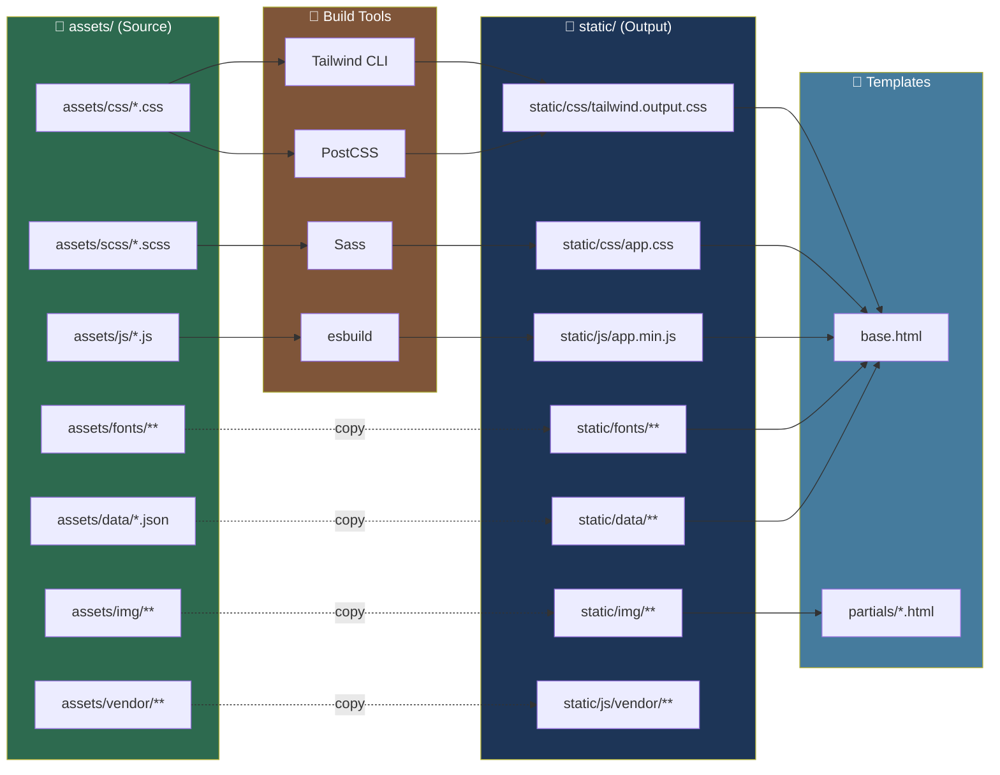

# 📁 โครงสร้าง `django-frontend/` (ปรับใหม่ — เพิ่ม `assets/`)

## ตาม Path จริง: `fastapi-clean-architecture-ddd-erp-iot\django-frontend\`

---

## 🌐 ภาพรวม Monorepo (Root)

```
fastapi-clean-architecture-ddd-erp-iot\
│
├── fastapi-backend/                       # 🐍 ส่วนที่ 1: FastAPI (เดิม — ไม่แก้)
├── django-frontend/                       # 🎨 ส่วนที่ 2: Django BFF (ใหม่)
├── docs/                                  # 📘 เอกสารรวม + AI Prompts
├── scripts/                               # 🛠️ Scripts รวม
├── .gitignore
├── .editorconfig
├── docker-compose.yaml                    # 🐳 Stack รวม 2 ส่วน
├── .env
├── .env.example
└── README.md
```

---

# 🎨 ส่วนที่ 2: Django Frontend BFF (ปรับใหม่ — มี `assets/`)

```
django-frontend/
│
├── config/                                # ⚙️ Django Project
│   ├── __init__.py
│   ├── settings.py                        # Settings + INSTALLED_APPS + MIDDLEWARE
│   ├── urls.py                            # Root URLconf
│   ├── asgi.py                            # ASGI (Channels)
│   ├── wsgi.py                            # WSGI (fallback)
│   └── routing.py                         # WebSocket routing
│
├── apps/                                  # 📚 Django Apps
│   │
│   ├── shared/                            # 🔗 Base types
│   │   ├── __init__.py
│   │   ├── apps.py
│   │   ├── domain/
│   │   │   ├── __init__.py
│   │   │   ├── entities.py                # BaseEntity, DomainError, Pagination
│   │   │   ├── value_objects.py           # UNSET, Email, Name, Phone
│   │   │   └── enums.py                   # Role, ResponseMessages, SortOrder
│   │   ├── application/
│   │   │   ├── __init__.py
│   │   │   ├── use_cases.py               # SharedUseCases
│   │   │   ├── interfaces.py              # Protocols
│   │   │   ├── exceptions.py              # StandardException, DomainException
│   │   │   └── utils.py
│   │   ├── infrastructure/
│   │   │   ├── __init__.py
│   │   │   ├── fastapi_client.py          # HTTPX client (Core)
│   │   │   └── middleware.py              # FastAPISessionMiddleware
│   │   └── presentation/
│   │       ├── __init__.py
│   │       ├── context_processors.py      # user_context
│   │       └── dependencies.py            # Factories
│   │
│   ├── layout/                            # 🎨 Layout Components
│   │   ├── __init__.py
│   │   ├── apps.py
│   │   ├── presentation/
│   │   │   ├── __init__.py
│   │   │   ├── views.py
│   │   │   └── urls.py
│   │   └── templates/
│   │       └── layout/
│   │           ├── app_layout.html        # = AppLayoutComponent
│   │           ├── header.html            # = HeaderComponent
│   │           ├── sidebar.html           # = SidebarComponent
│   │           ├── footer.html            # = FooterComponent
│   │           └── layout_settings.html   # = LayoutSettingsComponent
│   │
│   ├── authentication/                    # 🔐 Auth Proxy
│   │   ├── __init__.py
│   │   ├── apps.py
│   │   ├── domain/
│   │   │   ├── __init__.py
│   │   │   └── entities.py
│   │   ├── application/
│   │   │   ├── __init__.py
│   │   │   ├── use_cases.py               # Login, Logout, Refresh
│   │   │   └── interfaces.py              # IAuthService
│   │   ├── infrastructure/
│   │   │   ├── __init__.py
│   │   │   └── fastapi_auth_client.py
│   │   └── presentation/
│   │       ├── __init__.py
│   │       ├── views.py
│   │       ├── urls.py
│   │       └── forms.py
│   │
│   ├── dashboard/                         # 🏠 Dashboard
│   │   ├── __init__.py
│   │   ├── apps.py
│   │   ├── application/
│   │   │   ├── __init__.py
│   │   │   └── use_cases.py
│   │   ├── infrastructure/
│   │   │   ├── __init__.py
│   │   │   └── fastapi_client.py
│   │   └── presentation/
│   │       ├── __init__.py
│   │       ├── views.py
│   │       └── urls.py
│   │
│   ├── user/                              # 👤 User Proxy
│   │   ├── __init__.py
│   │   ├── apps.py
│   │   ├── domain/
│   │   ├── application/
│   │   ├── infrastructure/
│   │   └── presentation/
│   │
│   ├── key/                               # 🔑 API Keys Proxy
│   │   ├── __init__.py
│   │   ├── apps.py
│   │   ├── domain/
│   │   ├── application/
│   │   ├── infrastructure/
│   │   └── presentation/
│   │
│   ├── knowledge/                         # 📚 Knowledge Proxy
│   │   ├── __init__.py
│   │   ├── apps.py
│   │   ├── domain/
│   │   ├── application/
│   │   ├── infrastructure/
│   │   └── presentation/
│   │
│   ├── notification/                      # 🔔 Notification Proxy
│   │   ├── __init__.py
│   │   ├── apps.py
│   │   ├── domain/
│   │   ├── application/
│   │   ├── infrastructure/
│   │   └── presentation/
│   │
│   ├── websocket/                         # 🔌 WebSocket Proxy
│   │   ├── __init__.py
│   │   ├── apps.py
│   │   ├── application/
│   │   │   ├── __init__.py
│   │   │   └── consumers.py
│   │   ├── infrastructure/
│   │   │   ├── __init__.py
│   │   │   └── fastapi_ws_client.py
│   │   └── presentation/
│   │       ├── __init__.py
│   │       └── routing.py
│   │
│   └── core/                              # 🛠️ Core utilities
│       ├── __init__.py
│       ├── apps.py
│       ├── application/
│       ├── infrastructure/
│       └── presentation/
│
├── assets/                                # 🎨 Source Assets (NEW!)
│   │
│   ├── css/                               # 🎨 CSS Source files
│   │   ├── tailwind.css                   # ← Tailwind entry (@tailwind directives)
│   │   ├── base.css                       # Base styles + reset
│   │   ├── components.css                 # Component styles
│   │   ├── utilities.css                  # Utility overrides
│   │   ├── layout.css                     # Layout-specific
│   │   ├── header.css                     # Header styles
│   │   ├── sidebar.css                    # Sidebar styles
│   │   ├── footer.css                     # Footer styles
│   │   ├── forms.css                      # Form styles
│   │   ├── tables.css                     # Table styles
│   │   ├── animations.css                 # Keyframe animations
│   │   └── print.css                      # Print styles
│   │
│   ├── scss/                              # 🎨 SCSS Source files (optional)
│   │   ├── main.scss                      # Main SCSS entry
│   │   ├── _variables.scss                # SCSS variables
│   │   ├── _mixins.scss                   # SCSS mixins
│   │   ├── _functions.scss                # SCSS functions
│   │   ├── _typography.scss               # Typography
│   │   ├── _colors.scss                   # Color palette
│   │   ├── _spacing.scss                  # Spacing system
│   │   ├── _breakpoints.scss              # Responsive breakpoints
│   │   ├── _dark-mode.scss                # Dark mode overrides
│   │   ├── components/
│   │   │   ├── _button.scss
│   │   │   ├── _card.scss
│   │   │   ├── _modal.scss
│   │   │   ├── _dropdown.scss
│   │   │   ├── _table.scss
│   │   │   ├── _form.scss
│   │   │   ├── _badge.scss
│   │   │   ├── _alert.scss
│   │   │   ├── _tabs.scss
│   │   │   ├── _tooltip.scss
│   │   │   └── _pagination.scss
│   │   └── pages/
│   │       ├── _login.scss
│   │       ├── _dashboard.scss
│   │       └── _layout.scss
│   │
│   ├── js/                                # 🎨 JavaScript Source files
│   │   ├── app.js                         # Alpine.js root
│   │   ├── header.js                      # Header logic
│   │   ├── sidebar.js                     # Sidebar logic
│   │   ├── layout-settings.js             # Settings logic
│   │   ├── websocket.js                   # WS client
│   │   ├── api.js                         # Fetch helpers
│   │   ├── auth.js                        # Auth helpers
│   │   ├── theme.js                       # Theme switcher
│   │   ├── notifications.js               # Notification handler
│   │   ├── forms.js                       # Form helpers
│   │   ├── tables.js                      # Table helpers
│   │   ├── modals.js                      # Modal helpers
│   │   ├── toast.js                       # Toast notifications
│   │   ├── clipboard.js                   # Copy helpers
│   │   ├── datepicker.js                  # Date picker
│   │   ├── charts.js                      # Chart helpers
│   │   └── utils.js                       # Common utilities
│   │
│   ├── img/                               # 🖼️ Images
│   │   ├── logo.svg                       # Main logo (SVG)
│   │   ├── logo-dark.svg                  # Dark mode logo
│   │   ├── logo-icon.svg                  # Icon only
│   │   ├── favicon.ico                    # Favicon
│   │   ├── favicon-16.png
│   │   ├── favicon-32.png
│   │   ├── apple-touch-icon.png
│   │   ├── og-image.png                   # Open Graph
│   │   ├── hero-bg.svg
│   │   ├── empty-state.svg
│   │   ├── 404.svg
│   │   ├── 500.svg
│   │   └── icons/                         # Icon set
│   │       ├── tabler-sprite.svg          # Tabler sprite
│   │       ├── custom-sprite.svg          # Custom sprite
│   │       ├── dashboard.svg
│   │       ├── users.svg
│   │       ├── key.svg
│   │       ├── bell.svg
│   │       ├── settings.svg
│   │       ├── logout.svg
│   │       ├── search.svg
│   │       ├── plus.svg
│   │       ├── edit.svg
│   │       ├── trash.svg
│   │       ├── check.svg
│   │       ├── close.svg
│   │       ├── chevron-down.svg
│   │       ├── chevron-right.svg
│   │       ├── menu.svg
│   │       ├── sun.svg
│   │       ├── moon.svg
│   │       ├── fullscreen.svg
│   │       └── user.svg
│   │
│   ├── fonts/                             # 🔤 Fonts
│   │   ├── inter/
│   │   │   ├── Inter-Regular.woff2
│   │   │   ├── Inter-Medium.woff2
│   │   │   ├── Inter-SemiBold.woff2
│   │   │   └── Inter-Bold.woff2
│   │   ├── sarabun/
│   │   │   ├── Sarabun-Regular.woff2
│   │   │   ├── Sarabun-Medium.woff2
│   │   │   ├── Sarabun-SemiBold.woff2
│   │   │   └── Sarabun-Bold.woff2
│   │   └── jetbrains-mono/
│   │       ├── JetBrainsMono-Regular.woff2
│   │       └── JetBrainsMono-Bold.woff2
│   │
│   ├── data/                              # 📊 JSON Data
│   │   ├── menu.json                      # Sidebar menu structure
│   │   ├── nav.json                       # Header nav structure
│   │   ├── icons.json                     # Icon registry
│   │   ├── i18n/                          # Translations
│   │   │   ├── th.json                    # Thai
│   │   │   ├── en.json                    # English
│   │   │   └── zh.json                    # Chinese
│   │   ├── theme.json                     # Theme presets
│   │   ├── charts-config.json             # Chart defaults
│   │   └── countries.json                 # Country list
│   │
│   ├── vendor/                            # 📦 3rd-party assets (local)
│   │   ├── alpine/                        # Alpine.js
│   │   │   └── alpine.min.js
│   │   ├── htmx/                          # HTMX
│   │   │   └── htmx.min.js
│   │   ├── tabler-icons/                  # Tabler Icons
│   │   │   └── tabler-sprite.svg
│   │   └── chartjs/                       # Chart.js
│   │       └── chart.min.js
│   │
│   └── README.md                          # 📘 Asset documentation
│
├── templates/                             # 🎨 Django Templates
│   │
│   ├── base.html                          # ← App Layout (extends)
│   │
│   ├── partials/
│   │   ├── header.html
│   │   ├── sidebar.html
│   │   ├── footer.html
│   │   ├── layout-settings.html
│   │   ├── page-header.html
│   │   ├── pagination.html
│   │   ├── messages.html
│   │   └── confirm-modal.html
│   │
│   ├── authentication/
│   │   ├── login.html
│   │   └── logout.html
│   │
│   ├── dashboard/
│   │   └── index.html
│   │
│   ├── user/
│   │   ├── me.html
│   │   └── list.html
│   │
│   ├── key/
│   │   ├── list.html
│   │   ├── detail.html
│   │   └── form.html
│   │
│   ├── knowledge/
│   │   ├── list.html
│   │   ├── detail.html
│   │   └── form.html
│   │
│   ├── notification/
│   │   └── list.html
│   │
│   └── errors/
│       ├── 400.html
│       ├── 403.html
│       ├── 404.html
│       └── 500.html
│
├── static/                                # 🎨 Static files (BUILD OUTPUT)
│   │
│   ├── css/                               # ← Compiled from assets/css + assets/scss
│   │   ├── tailwind.output.css
│   │   ├── app.min.css
│   │   └── app.min.css.map
│   │
│   ├── js/                                # ← Compiled from assets/js
│   │   ├── app.min.js
│   │   ├── app.min.js.map
│   │   └── vendor/
│   │       ├── alpine.min.js
│   │       └── htmx.min.js
│   │
│   ├── img/                               # ← Copied from assets/img
│   │   ├── logo.svg
│   │   ├── favicon.ico
│   │   └── icons/
│   │       └── tabler-sprite.svg
│   │
│   ├── fonts/                             # ← Copied from assets/fonts
│   │   ├── inter/
│   │   └── sarabun/
│   │
│   └── data/                              # ← Copied from assets/data
│       └── menu.json
│
├── test/                                  # 🧪 Tests
│   ├── __init__.py
│   ├── conftest.py
│   ├── core/
│   └── modules/
│       ├── shared/
│       ├── layout/
│       ├── authentication/
│       ├── dashboard/
│       ├── user/
│       ├── key/
│       ├── knowledge/
│       ├── notification/
│       └── websocket/
│
├── .env                                   # Local env (gitignored)
├── .env.example
├── .gitignore
├── .editorconfig
├── Dockerfile                             # Django container
├── docker-compose.yaml                    # Django stack (standalone)
├── manage.py
├── requirements.txt
├── pyproject.toml
├── package.json                           # Node deps (Tailwind, PostCSS)
├── package-lock.json
├── tailwind.config.js                     # ← ชี้ไป assets/
├── postcss.config.js
└── README.md
```

---

# 🔧 การตั้งค่า Config Files

### `tailwind.config.js` (ชี้ไป `assets/`)

```javascript
/** @type {import('tailwindcss').Config} */
module.exports = {
  content: [
    // Django templates
    "./templates/**/*.html",
    "./apps/**/templates/**/*.html",
    // JavaScript
    "./assets/js/**/*.js",
    // Components
    "./apps/**/presentation/**/*.py",
  ],
  theme: {
    extend: {
      colors: {
        primary: {
          50:  '#eff6ff',
          100: '#dbeafe',
          500: '#3b82f6',
          600: '#2563eb',
          700: '#1d4ed8',
          900: '#1e3a8a',
        },
      },
      fontFamily: {
        sans: ['Inter', 'Sarabun', 'sans-serif'],
        mono: ['JetBrains Mono', 'monospace'],
      },
    },
  },
  plugins: [
    require('@tailwindcss/forms'),
    require('@tailwindcss/typography'),
    require('@tailwindcss/aspect-ratio'),
  ],
  darkMode: 'class',
}
```

### `postcss.config.js`

```javascript
module.exports = {
  plugins: {
    'postcss-import': {},
    'tailwindcss/nesting': {},
    tailwindcss: {},
    autoprefixer: {},
    ...(process.env.NODE_ENV === 'production'
      ? { cssnano: {} }
      : {}
    ),
  },
}
```

### `package.json`

```json
{
  "name": "django-frontend",
  "version": "2.0.0",
  "private": true,
  "scripts": {
    "dev": "npm run watch:css & npm run watch:js",
    "build": "npm run build:css && npm run build:js",
    "build:css": "postcss assets/css/tailwind.css -o static/css/tailwind.output.css",
    "build:css:prod": "NODE_ENV=production postcss assets/css/tailwind.css -o static/css/tailwind.output.css",
    "build:js": "esbuild assets/js/app.js --bundle --minify --outfile=static/js/app.min.js",
    "build:scss": "sass assets/scss/main.scss static/css/app.css",
    "watch:css": "postcss assets/css/tailwind.css -o static/css/tailwind.output.css --watch",
    "watch:js": "esbuild assets/js/app.js --bundle --outfile=static/js/app.min.js --watch",
    "watch:scss": "sass --watch assets/scss/main.scss:static/css/app.css"
  },
  "devDependencies": {
    "@tailwindcss/forms": "^0.5.7",
    "@tailwindcss/typography": "^0.5.10",
    "@tailwindcss/aspect-ratio": "^0.4.2",
    "autoprefixer": "^10.4.17",
    "cssnano": "^6.0.3",
    "esbuild": "^0.20.0",
    "postcss": "^8.4.35",
    "postcss-cli": "^11.0.0",
    "postcss-import": "^16.0.0",
    "sass": "^1.71.0",
    "tailwindcss": "^3.4.1"
  }
}
```

### `config/settings.py` (Static files)

```python
from pathlib import Path

BASE_DIR = Path(__file__).resolve().parent.parent

# ═══════════════════════════════════════════════
# 📁 Static Files
# ═══════════════════════════════════════════════
STATIC_URL = "/static/"
STATIC_ROOT = BASE_DIR / "staticfiles"      # collectstatic target

STATICFILES_DIRS = [
    BASE_DIR / "static",                     # Build output
]

# ═══════════════════════════════════════════════
# 📁 Media Files (uploads)
# ═══════════════════════════════════════════════
MEDIA_URL = "/media/"
MEDIA_ROOT = BASE_DIR / "media"

# ═══════════════════════════════════════════════
# 📁 Templates
# ═══════════════════════════════════════════════
TEMPLATES = [{
    "BACKEND": "django.template.backends.django.DjangoTemplates",
    "DIRS": [
        BASE_DIR / "templates",              # Global templates
        BASE_DIR / "apps" / "layout" / "templates",  # Layout templates
    ],
    "APP_DIRS": True,
    "OPTIONS": {
        "context_processors": [
            "django.template.context_processors.request",
            "django.template.context_processors.static",
            "django.template.context_processors.media",
            "apps.shared.presentation.context_processors.user_context",
        ],
    },
}]

# ═══════════════════════════════════════════════
# 📁 FastAPI Backend
# ═══════════════════════════════════════════════
FASTAPI_BASE_URL = os.getenv("FASTAPI_BASE_URL", "http://localhost:8000")
FASTAPI_TIMEOUT = int(os.getenv("FASTAPI_TIMEOUT", "30"))
```

---

# 🎨 การใช้งาน Assets ใน Templates

### `templates/base.html`

```django

<!DOCTYPE html>
<html lang="th" class="h-full" x-data="appShell()" x-init="init()">
<head>
  <meta charset="UTF-8">
  <meta name="viewport" content="width=device-width, initial-scale=1">
  <title>Dashboard</title>

  {# ═══════════════════════════════════════════════ #}
  {# 🖼️ Favicon & Icons                            #}
  {# ═══════════════════════════════════════════════ #}
  <link rel="icon" type="image/x-icon" href="">
  <link rel="apple-touch-icon" href="">

  {# ═══════════════════════════════════════════════ #}
  {# 🔤 Preload Fonts                             #}
  {# ═══════════════════════════════════════════════ #}
  <link rel="preload" href="" as="font" type="font/woff2" crossorigin>
  <link rel="preload" href="" as="font" type="font/woff2" crossorigin>

  {# ═══════════════════════════════════════════════ #}
  {# 🎨 Stylesheets                                 #}
  {# ═══════════════════════════════════════════════ #}
  <link rel="stylesheet" href="">
  <link rel="stylesheet" href="">
  

  {# ═══════════════════════════════════════════════ #}
  {# 📊 JSON Data (optional)                       #}
  {# ═══════════════════════════════════════════════ #}
  <script id="menu-data" type="application/json">
    
  </script>
</head>
<body class="h-full bg-gray-50 dark:bg-gray-900 text-gray-900 dark:text-gray-100">
  <a href="#content" class="sr-only focus:not-sr-only focus:absolute focus:p-4 focus:bg-blue-600 focus:text-white">
    ข้ามไปยังเนื้อหา
  </a>

  <div class="min-h-screen flex flex-col">
    {# = HeaderComponent #}
    

    {# = PageHeaderComponent #}
    

    {# = Main content #}
    <main id="content" class="flex-1 container mx-auto px-4 py-6">
      
    </main>

    {# = FooterComponent #}
    
  </div>

  {# = SidebarComponent #}
  

  {# = LayoutSettingsComponent #}
  

  {# ═══════════════════════════════════════════════ #}
  {# 📦 Vendor Scripts                             #}
  {# ═══════════════════════════════════════════════ #}
  <script defer src=""></script>
  <script src=""></script>

  {# ═══════════════════════════════════════════════ #}
  {# 🎨 App Scripts                                 #}
  {# ═══════════════════════════════════════════════ #}
  <script src=""></script>
  
</body>
</html>
```

---

# 🔨 Build Commands

```bash
# ═══════════════════════════════════════════════
# 📦 ติดตั้ง dependencies
# ═══════════════════════════════════════════════
cd django-frontend
npm install
pip install -r requirements.txt

# ═══════════════════════════════════════════════
# 🔨 Build CSS + JS (ครั้งเดียว)
# ═══════════════════════════════════════════════
npm run build
# → static/css/tailwind.output.css
# → static/css/app.css
# → static/js/app.min.js

# ═══════════════════════════════════════════════
# 👀 Watch mode (development)
# ═══════════════════════════════════════════════
npm run dev
# → Watch CSS + JS changes

# ═══════════════════════════════════════════════
# 🏭 Production build (minified)
# ═══════════════════════════════════════════════
npm run build:css:prod
npm run build:js

# ═══════════════════════════════════════════════
# 🚀 รัน Django
# ═══════════════════════════════════════════════
python manage.py collectstatic --noinput
python manage.py runserver 8001
```

---

# 📊 การไหลของ Assets



---

# 📋 สรุป Assets

| โฟลเดอร์ | ไฟล์ | หน้าที่ | Build Tool |
|---|---|---|---|
| **`assets/css/`** | `.css` | CSS Source | Tailwind + PostCSS |
| **`assets/scss/`** | `.scss` | SCSS Source | Sass |
| **`assets/js/`** | `.js` | JavaScript Source | esbuild |
| **`assets/img/`** | `.svg`, `.png`, `.ico` | Images | Copy |
| **`assets/fonts/`** | `.woff2`, `.ttf` | Fonts | Copy |
| **`assets/data/`** | `.json` | JSON Data | Copy |
| **`assets/vendor/`** | `.js`, `.svg` | 3rd-party | Copy |

---

# 🎯 ข้อดีของการแยก `assets/`

| ข้อดี | รายละเอียด |
|---|---|
| **Clear separation** | Source ≠ Output — ไม่ปนกัน |
| **Git-friendly** | `assets/` commit, `static/` gitignore |
| **Build pipeline** | ควบคุม build ได้ชัดเจน |
| **Multiple formats** | CSS + SCSS + JS ทำงานร่วมกัน |
| **Cache-busting** | Build output มี hash ได้ |
| **Performance** | Minify + Tree-shake เฉพาะ production |
| **Debugging** | Source maps แยกจาก source |

---

# 🚫 `.gitignore` (Root)

```gitignore
# ═══════════════════════════════════════════════
# 🐍 Python
# ═══════════════════════════════════════════════
__pycache__/
*.py[cod]
*.egg-info/
.venv/
venv/
.pytest_cache/
.ruff_cache/

# ═══════════════════════════════════════════════
# 🎨 Django
# ═══════════════════════════════════════════════
django-frontend/staticfiles/
django-frontend/media/
django-frontend/db.sqlite3

# ═══════════════════════════════════════════════
# 🎨 Build Output (static/ ใน Django)
# ═══════════════════════════════════════════════
django-frontend/static/css/*.min.css
django-frontend/static/css/*.map
django-frontend/static/js/*.min.js
django-frontend/static/js/*.map

# ═══════════════════════════════════════════════
# 📦 Node
# ═══════════════════════════════════════════════
node_modules/
npm-debug.log*
yarn-error.log*

# ═══════════════════════════════════════════════
# 🔐 Secrets
# ═══════════════════════════════════════════════
.env
*.pem
fastapi-backend/secrets/keys/*.pem

# ═══════════════════════════════════════════════
# 🐳 Docker
# ═══════════════════════════════════════════════
.docker/
docker-compose.override.yaml

# ═══════════════════════════════════════════════
# 💻 IDE
# ═══════════════════════════════════════════════
.vscode/
.idea/
*.swp
.DS_Store
```

---

**ผู้แต่ง:** Kongnakorn Jantakun
**อีเมล:** kongnakornjantakun@gmail.com
**เวอร์ชัน:** 2.1.0
**อัปเดต:** 2026-09-17
**สถานะ:** ✅ พร้อมใช้งาน