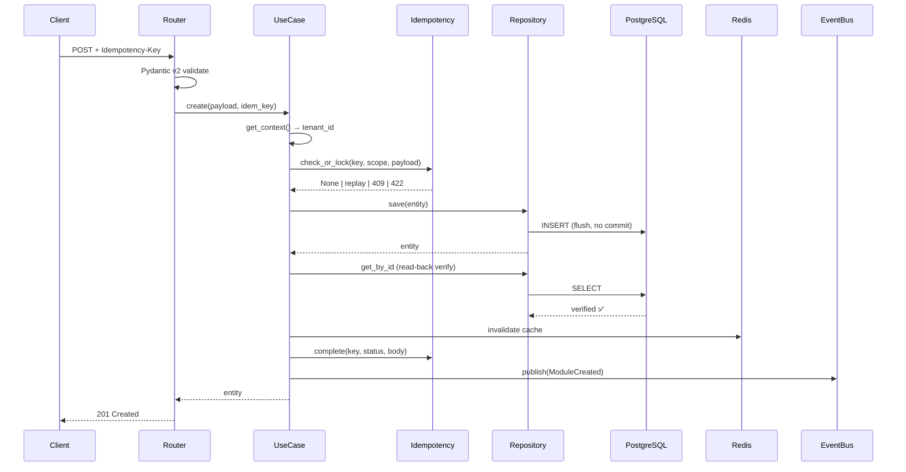
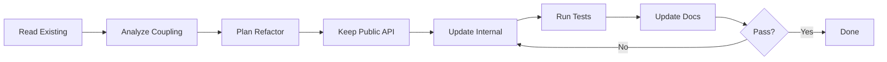

# 03 — Task Templates A–G

> 7 ประเภทงาน · เลือกใช้ตาม task type · ทุก template ใช้ Global Constraints ร่วม

---

## 📋 สารบัญ

| Template | ชื่อ | ใช้เมื่อ |
|---|---|---|
| [A](#template-a) | CREATE_NEW | สร้าง module ใหม่ |
| [B](#template-b) | REFACTOR | ปรับปรุงโค้ดเดิม |
| [C](#template-c) | EXTEND | เพิ่ม feature |
| [D](#template-d) | BUGFIX | แก้ bug |
| [E](#template-e) | SECURITY_AUDIT | ตรวจความปลอดภัย |
| [F](#template-f) | PERF_TEST | ทดสอบประสิทธิภาพ |
| [G](#template-g) | DOCUMENTATION | เขียน docs |

---

## 🎯 TEMPLATE A: CREATE_NEW {#template-a}

### 01. รายละเอียด

| หัวข้อ | ค่า |
|---|---|
| **Task Type** | `CREATE_NEW` |
| **Module** | `[module]` |
| **Layer** | `[0-Core / 1-Foundation / 2-Money / 3-Goods / 4-Ops / 5-Intel / 6-Monitor / 7-Template]` |
| **Stack** | `[FastAPI / Django / Both]` |
| **Priority** | `🔴 / 🟠 / 🟡` |
| **Phase** | `[1-6]` |
| **Prefix** | `[3 chars]` |
| **Dependencies** | `[module list]` |
| **Tables** | `tenant_{tid}.[table]` |
| **Endpoints** | `/api/v1/[module]/` |
| **Events** | `[ModuleCreated, ModuleUpdated, ...]` |

### 02. หลักการทำงาน

X คือ aggregate root ที่มี invariants:
- `amount >= 0`
- `code` unique ต่อ tenant
- state transitions: ACTIVE ↔ INACTIVE → ARCHIVED (terminal)
- soft delete: `deleted_at` set ไม่ลบจริง

### 03. ข้อกำหนด

**FR:**
- สร้าง/อ่าน/แก้/ลบ (soft)
- ระบุ tenant
- audit log
- emit events

**NFR:**
- p95 < 200ms
- RLS enforced
- Idempotency
- Coverage ≥ 85%

### 04. เป้าหมาย

Deliver: module production-ready พร้อม deploy

### 05. ขอบเขต

**In:** CRUD + search + events
**Out:** integration กับระบบอื่น (phase ถัดไป)

### 06. โครงสร้าง Folder + ไฟล์

```
app/modules/{module}/
├── domain/
│   ├── __init__.py
│   ├── entities.py
│   ├── value_objects.py
│   ├── enums.py
│   ├── events.py
│   └── exceptions.py
├── application/
│   ├── __init__.py
│   ├── interfaces.py
│   ├── use_cases.py
│   ├── mappers.py
│   ├── exceptions.py
│   └── utils.py
├── infrastructure/
│   ├── __init__.py
│   ├── models.py
│   ├── repositories.py
│   ├── caches.py
│   └── services.py
├── presentation/
│   ├── __init__.py
│   ├── routers.py
│   ├── schemas.py
│   ├── docs.py
│   └── dependencies.py
└── __init__.py

db/migrations/
├── V001__create_{module}.sql
├── V002__seed_{module}.sql
└── V003__rollback_{module}.sql

tests/
├── conftest.py
├── unit/test_{module}.py
├── unit/test_{module}_use_cases.py
├── integration/test_{module}_repository.py
├── property/test_{module}_invariants.py
└── manual/manual_test_{module}.md

docs/
├── README_{module}.md
└── API_{module}.md

app/routes.py              (แก้)
migrations/env.py          (แก้)
```

### 07. Workflow



### 08. Affected Areas

| ไฟล์ | Action |
|---|---|
| `app/modules/{module}/**` | new (23 ไฟล์) |
| `db/migrations/V00{1,2,3}__*.sql` | new (3 ไฟล์) |
| `tests/**` | new (5 ไฟล์) |
| `docs/{README,API}_{module}.md` | new (2 ไฟล์) |
| `app/routes.py` | edit (เพิ่ม include_router) |
| `migrations/env.py` | edit (เพิ่ม import model) |

### 09. รายการกระบวนการทำงาน

ตาม sequence ใน §07 — 10 ขั้น

### 10. Performance Considerations

| ประเด็น | แนวทาง |
|---|---|
| Read 1 entity | PK lookup + RLS → < 5ms |
| List 100 | partial index → < 50ms |
| Create | 1 INSERT + 1 SELECT → < 30ms |
| Cache hit | Redis → < 3ms |

### 11. TDD Plan

1. **RED**: เขียน test entities + use case (mock ports) → fail
2. **GREEN**: implement domain + application → pass
3. **REFACTOR**: extract VO, split use cases
4. **RED**: integration test (real DB + RLS) → fail
5. **GREEN**: implement infrastructure → pass
6. **RED**: property test → fail
7. **GREEN**: แก้ invariant → pass
8. **Manual**: 8 scenarios

### 12. ข้อห้าม

```markdown
❌ import framework ใน domain/
❌ commit() ใน Repository (ใช้ flush())
❌ raise ใน Cache (never-raise)
❌ float กับเงิน/สต็อก
❌ hardcode secret
❌ UPDATE/DELETE ใน audit/event store
❌ query ข้าม tenant
❌ ลบ migration V001-V003 ที่ commit แล้ว
❌ CREATE TABLE IF NOT EXISTS ใน migration หลัก
❌ print() — ใช้ structlog
❌ mock สิ่งที่ตัวเองเป็นเจ้าของ
```

### 13. ข้อควรระวัง

- Race บน unique code → `ON CONFLICT`
- Timezone → `TIMESTAMPTZ` เท่านั้น
- RLS → `set_config` ก่อน query
- Decimal → quantize `0.01`
- Cache stampede → single-flight
- Kafka at-least-once → idempotent consumer

### 14. ข้อดี

- Testable · Framework-agnostic · Multi-tenant · Audit-ready · Type-safe

### 15. ข้อเสีย

- Boilerplate สูง · Learning curve · Over-engineer สำหรับ CRUD ง่าย

### 16. Checklist การทดสอบ

```markdown
- [ ] Unit ≥ 8 pass
- [ ] Integration ≥ 4 pass (RLS verified)
- [ ] Property ≥ 3 × 100 iter
- [ ] Manual 8 scenarios
- [ ] Coverage ≥ 85%
- [ ] /docs เห็น tag ใหม่
- [ ] Postman collection ผ่าน
```

### 17. SQL & Migration Plan

→ [`04-sql-migration.md`](04-sql-migration.md)

### 18. Routing Registration

→ [`05-routing.md`](05-routing.md)

### 19-21. Docs / Swagger / Postman

→ [`06-docs-postman.md`](06-docs-postman.md)

### 22. สรุป

| รายการ | จำนวน |
|---|---|
| Python files | 23 |
| SQL files | 3 |
| Test files | 5 |
| Docs files | 2 |
| Routing (แก้) | 2 |
| **รวม** | **35** |

### 23. รายงาน — Report A

→ [`07-reports.md`](07-reports.md#report-a)

---

## 🎯 TEMPLATE B: REFACTOR {#template-b}

| หัวข้อ | ค่า |
|---|---|
| **Task Type** | `REFACTOR` |
| **Target Files** | `[list]` |
| **Breaking Change** | `Yes / No` |
| **Migration Impact** | `None / New migration needed` |

### Workflow



### ข้อห้าม

```markdown
❌ เปลี่ยน public signature
❌ แตะ layer อื่น
❌ refactor นอกจุดที่ระบุ
❌ เพิ่ม feature ใหม่
❌ ลบ tests เดิม
❌ แก้ migration V001-V003 ที่ commit แล้ว
❌ ลด coverage
```

### Output

- ก่อน/หลัง ของแต่ละไฟล์ที่แก้
- Diff test (ก่อน/หลัง)
- Coverage report (ต้องไม่ลด)

---

## 🎯 TEMPLATE C: EXTEND {#template-c}

| หัวข้อ | ค่า |
|---|---|
| **Task Type** | `EXTEND` |
| **Module** | `[module]` |
| **Feature** | `[feature ใหม่]` |
| **New Endpoints** | `[list]` |
| **New Migration** | `V00X__{action}.sql` |

### Diff Plan

| ไฟล์ | Action | รายละเอียด |
|---|---|---|
| `domain/entities.py` | `+method` | `bulk_create()` |
| `application/use_cases.py` | `+class` | `BulkCreateUseCase` |
| `presentation/routers.py` | `+endpoint` | `POST /bulk/` |
| `presentation/schemas.py` | `+schema` | `BulkCreateRequest` |
| `tests/unit/test_{module}.py` | `+test` | `test_bulk_*` |
| `db/migrations/V004__add_bulk.sql` | `new` | index + column |

### Backward Compatibility

- ห้าม break existing endpoints
- Version ใหม่ใช้ `/v2/` (ถ้าจำเป็น)
- Deprecation notice ล่วงหน้า ≥ 1 minor

---

## 🎯 TEMPLATE D: BUGFIX {#template-d}

| หัวข้อ | ค่า |
|---|---|
| **Task Type** | `BUGFIX` |
| **Severity** | `🔴 Critical / 🟡 Major / 🟢 Minor` |
| **Env** | `dev / staging / prod` |
| **Migration Impact** | `None / New migration` |

### Bug Report (input)

```markdown
Symptom: [อาการ]
Steps: 1. ... 2. ...
Expected: [สิ่งที่ควรเกิด]
Actual: [สิ่งที่เกิด]
Stacktrace: [paste]
```

### STEP 1 — Hypothesis (รออนุมัติ)

```markdown
1. Root Cause: [ไฟล์:บรรทัด + คำอธิบาย]
2. Fix Strategy: hotfix / proper fix / refactor
3. Migration needed? Yes/No
4. Regression Test: [ชื่อ test ที่จะเพิ่ม]
5. Estimated blast radius: [กี่ไฟล์ / กี่ endpoint]
```

### STEP 2 — Fix (หลังอนุมัติ)

1. เขียน failing regression test (RED)
2. แก้ minimal ที่ root cause
3. Test เขียว (GREEN)
4. รัน full suite
5. Verify coverage ไม่ลด
6. ลบ debug code

### Output — Report B

→ [`07-reports.md`](07-reports.md#report-b)

---

## 🎯 TEMPLATE E: SECURITY_AUDIT {#template-e}

| หัวข้อ | ค่า |
|---|---|
| **Task Type** | `SECURITY_AUDIT` |
| **Standard** | `OWASP Top 10 / ASVS L2` |
| **Mode** | `Read-only / Audit+Fix` |

### Output — ตารางเท่านั้น

| # | Risk | Layer | File:Line | Severity | CWE | แนะนำแก้ | Auto-fix |
|---|---|---|---|---|---|---|---|
| 1 | ... | ... | ... | 🔴 | CWE-XXX | ... | ✅ |

### Security Checklist

```markdown
#### A. Authentication & Authorization
- [ ] Nested JWT (JWS + JWE)
- [ ] Refresh token rotation
- [ ] RBAC ทุก endpoint
- [ ] Token expiry ≤ 15 นาที

#### B. Input Validation
- [ ] Pydantic v2 strict mode
- [ ] SQL injection (ORM parameterized)
- [ ] Mass assignment (whitelist fields)
- [ ] File upload: type + size + scan

#### C. Data Protection
- [ ] Encryption at rest (AES-256)
- [ ] TLS in transit (min 1.2)
- [ ] PII masking ใน logs
- [ ] Secret management (vault / env)

#### D. Multi-tenancy
- [ ] tenant_id ทุก query
- [ ] RLS policy ทุกตาราง
- [ ] Cross-tenant leakage test
- [ ] Tenant isolation ใน cache

#### E. API Security
- [ ] Rate limiting (per IP + per user)
- [ ] CORS policy (whitelist)
- [ ] CSRF (BFF pattern)
- [ ] Idempotency key
- [ ] Request size limit

#### F. SQL Security
- [ ] RLS enabled + forced
- [ ] FK ON DELETE ถูกต้อง
- [ ] Search_path ปลอดภัย
- [ ] Least privilege DB user
- [ ] No dynamic SQL ที่ไม่ parameterize

#### G. Dependency
- [ ] pip-audit ผ่าน
- [ ] bandit ผ่าน
- [ ] Dependencies up-to-date
```

### Output — Report C

→ [`07-reports.md`](07-reports.md#report-c)

---

## 🎯 TEMPLATE F: PERF_TEST {#template-f}

| หัวข้อ | ค่า |
|---|---|
| **Task Type** | `PERF_TEST` |
| **SLO** | `p95 < X ms, > Y rps` |
| **Tool** | `locust / k6 / pytest-benchmark` |

### Metrics

| Metric | Tool | Target | Before | After |
|---|---|---|---|---|
| p50 | pytest-benchmark | < 50ms | ? | ? |
| p95 | locust | < 200ms | ? | ? |
| p99 | locust | < 500ms | ? | ? |
| RPS | locust | > 100 | ? | ? |
| DB queries/req | SQLAlchemy events | < 5 | ? | ? |
| Seq scans | EXPLAIN | 0 | ? | ? |
| Cache hit | Redis INFO | > 80% | ? | ? |
| Memory | memray | < 200MB | ? | ? |

### Workflow

1. Baseline: รัน load test กับโค้ดปัจจุบัน
2. Profile: py-spy / scalene / EXPLAIN ANALYZE
3. Optimize: แก้ bottleneck
4. Re-test: เทียบผล
5. Report D

### Output — Report D

→ [`07-reports.md`](07-reports.md#report-d)

---

## 🎯 TEMPLATE G: DOCUMENTATION {#template-g}

| หัวข้อ | ค่า |
|---|---|
| **Task Type** | `DOCUMENTATION` |
| **Doc Type** | `README / API / ARCH / RUNBOOK / ONBOARDING / ADR` |
| **Audience** | `Dev / DevOps / PM / End-user` |

### Doc Structure

```
docs/
├── README_{module}.md          # overview + setup
├── API_{module}.md             # endpoint reference
├── ARCH_{module}.md            # design + diagram
├── RUNBOOK_{module}.md         # ops procedures
├── ONBOARDING_{module}.md      # new dev guide
├── postman/{module}.postman_collection.json
└── adr/ADR-{nnn}-{title}.md    # decision records
```

### README Template

```markdown
# Module: {module}
> Layer · Prefix · Version

## Purpose
## Architecture (Mermaid)
## Dependencies
## Database Schema
## API Endpoints
## Permissions
## Domain Events
## Environment Variables
## Setup
## Testing
## Usage Example
## Known Limitations
## Changelog
```

### ADR Template

```markdown
# ADR-{nnn}: {Title}

## Status
Proposed / Accepted / Deprecated / Superseded

## Context
[สถานการณ์ + ปัญหา]

## Decision
[สิ่งที่ตัดสินใจ]

## Consequences
**Positive:**
**Negative:**

## Alternatives Considered
```
```

--- 
