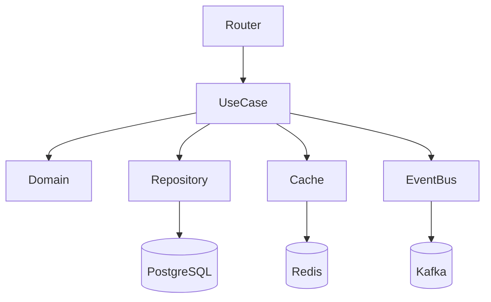

# 06 — Documentation / Swagger / Postman Block

> 4 ระบบ: README · OpenAPI · Swagger metadata · Postman collection

---

## 📄 `docs/README_{module}.md`

```markdown
# Module: {module}

> Layer: {layer} · Prefix: `{prefix}` · Version: 1.0.0

## Purpose

[อธิบายวัตถุประสงค์ของ module ใน 2-3 บรรทัด]

## Architecture



## Dependencies

| Module | Version | เหตุผล |
|---|---|---|
| tenant | ≥ 1.0 | multi-tenant |
| user | ≥ 1.0 | auth context |
| audit | ≥ 1.0 | event log |

## Database Schema

```sql
CREATE TABLE tenant_{prefix}.{module}s (
    id UUID PRIMARY KEY,
    tenant_id UUID NOT NULL,
    code VARCHAR(50) NOT NULL,
    ...
);
```

## API Endpoints

| Method | Path | Description | Auth |
|---|---|---|---|
| POST | `/api/v1/{module}/` | สร้างใหม่ | ✅ |
| GET | `/api/v1/{module}/` | list | ✅ |
| GET | `/api/v1/{module}/{id}` | ดูตาม id | ✅ |
| PATCH | `/api/v1/{module}/{id}` | แก้ไข | ✅ |
| DELETE | `/api/v1/{module}/{id}` | soft delete | ✅ |

## Permissions

| Role | Create | Read | Update | Delete |
|---|---|---|---|---|
| admin | ✅ | ✅ | ✅ | ✅ |
| manager | ✅ | ✅ | ✅ | ❌ |
| staff | ✅ | ✅ | ❌ | ❌ |
| viewer | ❌ | ✅ | ❌ | ❌ |

## Domain Events

| Event | Trigger | Payload |
|---|---|---|
| `{Module}Created` | after create | id, code, tenant_id |
| `{Module}Updated` | after update | id, changes |
| `{Module}Deleted` | after soft delete | id, deleted_at |

## Environment Variables

```bash
DATABASE_URL=postgresql+asyncpg://...
REDIS_URL=redis://...
KAFKA_BOOTSTRAP=localhost:9092
```

## Setup

```bash
# migrate
alembic upgrade head

# run
uvicorn app.main:app --reload
```

## Testing

```bash
pytest tests/unit/test_{module}.py -v
pytest tests/integration/test_{module}_repository.py -v
pytest --cov=app.modules.{module} --cov-fail-under=85
```

## Usage Example

```bash
# create
curl -X POST http://localhost:8000/api/v1/{module}/ \
  -H "Authorization: Bearer $TOKEN" \
  -H "Idempotency-Key: $(uuidgen)" \
  -H "Content-Type: application/json" \
  -d '{"code":"X-001","name":"Sample","amount":"100.00"}'

# response
{
  "id": "01H...",
  "code": "X-001",
  "name": "Sample",
  "amount": "100.00",
  "status": "ACTIVE",
  "version": 1,
  "created_at": "2025-01-15T10:00:00Z"
}
```

## Known Limitations

- ไม่รองรับ bulk > 1000 records ต่อ request
- Cache TTL = 300s
- ไม่มี WebSocket

## Changelog

| Version | Date | Changes |
|---|---|---|
| 1.0.0 | 2025-01-15 | initial release |
```

---

## 📄 `docs/API_{module}.md`

```markdown
# API Reference — {Module}

Base URL: `{BASE_URL}/api/v1/{module}`

## Authentication

ทุก request ต้องมี:
```
Authorization: Bearer <JWT>
Idempotency-Key: <uuid>   # เฉพาะ POST/PATCH/DELETE
```

## Endpoints

### POST / — สร้างใหม่

**Request:**
```json
{
  "code": "X-001",
  "name": "Sample",
  "amount": "100.00",
  "metadata": {}
}
```

**Response 201:**
```json
{
  "id": "01H...",
  "code": "X-001",
  ...
}
```

**Errors:**

| Status | Code | Description |
|---|---|---|
| 400 | `DOMAIN_ERROR` | amount < 0 |
| 409 | `DUPLICATE_CODE` | code ซ้ำใน tenant |
| 422 | `VALIDATION_ERROR` | schema ไม่ถูก |
| 422 | `IDEMPOTENCY_MISMATCH` | key เดิม payload ต่าง |

### GET / — List

**Query params:**

| Param | Type | Default | Description |
|---|---|---|---|
| status | string | — | `ACTIVE` / `INACTIVE` / `ARCHIVED` |
| q | string | — | search code/name |
| limit | int | 20 | max 100 |
| offset | int | 0 | — |

**Response 200:**
```json
{
  "items": [...],
  "total": 42,
  "limit": 20,
  "offset": 0
}
```

### GET /{id} — Get by ID

**Response 404** ถ้าไม่พบ (หรือ tenant อื่น)

### PATCH /{id} — Update

**Request:** (partial)
```json
{
  "name": "New Name",
  "amount": "200.00"
}
```

**Optimistic lock:**
```json
{
  "version": 1,
  "name": "New Name"
}
```
ถ้า version ไม่ตรง → `409 VERSION_CONFLICT`

### DELETE /{id} — Soft Delete

**Response 204** — ตั้ง `deleted_at`

---

## Rate Limits

| Endpoint | Limit |
|---|---|
| POST | 100 / min / tenant |
| GET | 1000 / min / tenant |
| DELETE | 50 / min / tenant |

## Error Format

```json
{
  "detail": "message",
  "code": "ERROR_CODE",
  "trace_id": "abc123..."
}
```
```

---

## 📄 `presentation/docs.py`

```python
"""
app/modules/{module}/presentation/docs.py
TH: OpenAPI response metadata
EN: OpenAPI response metadata
"""
RESPONSE_CREATE_201 = {
    "description": "สร้างสำเร็จ",
    "content": {
        "application/json": {
            "example": {
                "id": "01HXYZ...",
                "code": "X-001",
                "name": "Sample",
                "amount": "100.00",
                "status": "ACTIVE",
                "version": 1,
                "created_at": "2025-01-15T10:00:00Z",
            }
        }
    },
}

RESPONSE_ERROR_400 = {
    "description": "Domain error",
    "content": {
        "application/json": {
            "example": {"detail": "amount must be >= 0", "code": "DOMAIN_ERROR"}
        }
    },
}

RESPONSE_ERROR_404 = {
    "description": "ไม่พบ entity",
    "content": {
        "application/json": {
            "example": {"detail": "entity not found", "code": "NOT_FOUND"}
        }
    },
}

RESPONSE_ERROR_409 = {
    "description": "Conflict (duplicate / version)",
    "content": {
        "application/json": {
            "example": {"detail": "code X-001 already exists", "code": "DUPLICATE_CODE"}
        }
    },
}

RESPONSE_ERROR_422 = {
    "description": "Validation error",
    "content": {
        "application/json": {
            "example": {
                "detail": [
                    {"loc": ["body", "amount"], "msg": "invalid", "type": "value_error"}
                ]
            }
        }
    },
}
```

---

## 📄 Swagger Metadata — Router

ดูตัวอย่างเต็มใน [`05-routing.md`](05-routing.md#-presentationrouterspy)

จุดสำคัญ:
- `operation_id` ไม่ซ้ำ
- `summary` ภาษาไทย
- `tags` PascalCase
- `responses` ระบุ 4xx ครบ
- `response_model` ชัดเจน

---

## 📄 Postman Collection

```json
{
  "info": {
    "name": "ERPIoT — {Module}",
    "_postman_id": "00000000-0000-0000-0000-{module}00000000",
    "schema": "https://schema.getpostman.com/json/collection/v2.1.0/collection.json"
  },
  "variable": [
    { "key": "base_url", "value": "http://localhost:8000" },
    { "key": "token", "value": "" },
    { "key": "tenant_id", "value": "00000000-0000-0000-0000-000000000001" }
  ],
  "auth": {
    "type": "bearer",
    "bearer": [{ "key": "token", "value": "{{token}}", "type": "string" }]
  },
  "item": [
    {
      "name": "Auth",
      "item": [
        {
          "name": "Login",
          "request": {
            "method": "POST",
            "url": "{{base_url}}/api/v1/auth/login",
            "body": {
              "mode": "raw",
              "raw": "{\"email\":\"admin@example.com\",\"password\":\"***\"}"
            }
          }
        }
      ]
    },
    {
      "name": "{Module} — Create",
      "request": {
        "method": "POST",
        "header": [
          { "key": "Idempotency-Key", "value": "{{$guid}}" },
          { "key": "Content-Type", "value": "application/json" }
        ],
        "url": "{{base_url}}/api/v1/{module}/",
        "body": {
          "mode": "raw",
          "raw": "{\"code\":\"X-001\",\"name\":\"Sample\",\"amount\":\"100.00\"}"
        }
      }
    },
    {
      "name": "{Module} — List",
      "request": {
        "method": "GET",
        "url": "{{base_url}}/api/v1/{module}/?limit=20&offset=0"
      }
    },
    {
      "name": "{Module} — Get",
      "request": {
        "method": "GET",
        "url": "{{base_url}}/api/v1/{module}/{{entity_id}}"
      }
    },
    {
      "name": "{Module} — Update",
      "request": {
        "method": "PATCH",
        "header": [
          { "key": "Idempotency-Key", "value": "{{$guid}}" }
        ],
        "url": "{{base_url}}/api/v1/{module}/{{entity_id}}",
        "body": {
          "mode": "raw",
          "raw": "{\"name\":\"Updated\"}"
        }
      }
    },
    {
      "name": "{Module} — Delete",
      "request": {
        "method": "DELETE",
        "header": [
          { "key": "Idempotency-Key", "value": "{{$guid}}" }
        ],
        "url": "{{base_url}}/api/v1/{module}/{{entity_id}}"
      }
    },
    {
      "name": "Health",
      "request": {
        "method": "GET",
        "url": "{{base_url}}/health"
      }
    }
  ]
}
```

---

## ✅ Docs Checklist

```markdown
- [ ] README_{module}.md ครบ 13 หัวข้อ
- [ ] API_{module}.md มี request/response ตัวอย่าง
- [ ] Swagger metadata ครบ (operation_id, responses)
- [ ] Postman collection import ได้ ไม่มี error
- [ ] /docs แสดง tag + endpoint
- [ ] /openapi.json valid (ตรวจผ่าน swagger editor)
- [ ] ทุก error code มี description
```
```

---
