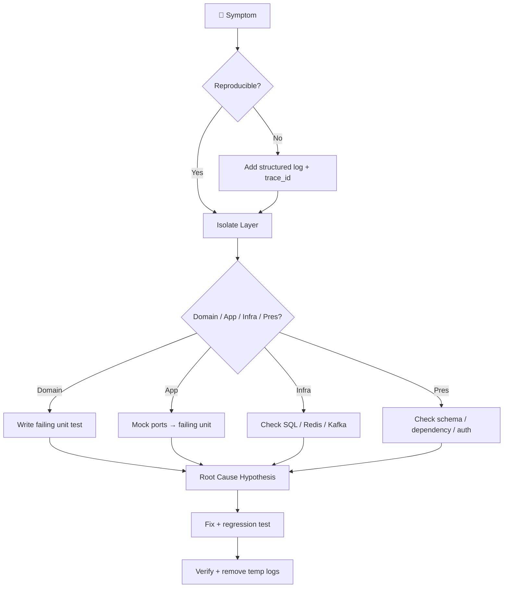

# 10 — Debug Block

> Workflow · Rules · structlog · Middleware · Recipes · Tools · Common Issues

---

## 10.1 Debug Workflow



---

## 10.2 Debug Rules

```markdown
❌ ห้าม print() / pprint() ใน Production code
❌ ห้าม log PII (email, phone, เลขบัตร, token)
❌ ห้าม log secret / password / authorization header
❌ ห้าม commit debug code (breakpoint, TODO, pdb)
❌ ห้ามปิด error handler ชั่วคราวใน commit
✅ ใช้ structlog เท่านั้น
✅ log ด้วย trace_id + request_id + tenant_id
✅ ใช้ pdb/ipdb เฉพาะในเครื่อง dev
✅ ลบ breakpoint ก่อน push
```

---

## 10.3 Structured Logging Setup

```python
"""
app/core/logging.py
TH: ตั้งค่า structlog กลาง + PII masking
EN: Central structlog config + PII masking
"""
from __future__ import annotations

import logging
import re
import sys
from typing import Any

import structlog
from structlog.types import EventDict, Processor

PII_PATTERNS = [
    (re.compile(r"[\w.+-]+@[\w-]+\.[\w.-]+"), "***@***"),
    (re.compile(r"\b0\d{8,9}\b"), "***PHONE***"),
    (re.compile(r"\b\d{13}\b"), "***ID***"),
    (re.compile(r"(Bearer\s+)[\w\-._~+/]+=*", re.I), r"\1***"),
    (re.compile(r"(password[\"']?\s*[:=]\s*[\"']?)[^\"'\s,}]+", re.I), r"\1***"),
]


def mask_pii(_logger: Any, _name: str, event: EventDict) -> EventDict:
    for k, v in list(event.items()):
        if isinstance(v, str):
            for pat, repl in PII_PATTERNS:
                v = pat.sub(repl, v)
            event[k] = v
    return event


def configure_logging(level: str = "INFO", json: bool = False) -> None:
    logging.basicConfig(
        format="%(message)s",
        stream=sys.stdout,
        level=getattr(logging, level.upper(), logging.INFO),
    )
    processors: list[Processor] = [
        structlog.contextvars.merge_contextvars,
        structlog.processors.add_log_level,
        structlog.processors.TimeStamper(fmt="iso", utc=True),
        mask_pii,
        structlog.processors.StackInfoRenderer(),
        structlog.processors.format_exc_info,
    ]
    processors.append(
        structlog.processors.JSONRenderer() if json
        else structlog.dev.ConsoleRenderer(colors=True)
    )
    structlog.configure(
        processors=processors,
        wrapper_class=structlog.make_filtering_bound_logger(
            getattr(logging, level.upper(), logging.INFO)
        ),
        logger_factory=structlog.PrintLoggerFactory(),
        cache_logger_on_first_use=True,
    )


log = structlog.get_logger()
```

---

## 10.4 Request Context Middleware

```python
"""
app/core/middleware.py
TH: ผูก trace_id / request_id / tenant_id เข้า contextvar
EN: Bind trace context into contextvars per request
"""
from __future__ import annotations

import time
import uuid
from collections.abc import Awaitable, Callable

import structlog
from fastapi import Request, Response
from starlette.middleware.base import BaseHTTPMiddleware

log = structlog.get_logger()


class RequestContextMiddleware(BaseHTTPMiddleware):
    async def dispatch(
        self,
        request: Request,
        call_next: Callable[[Request], Awaitable[Response]],
    ) -> Response:
        trace_id = request.headers.get("x-trace-id") or uuid.uuid4().hex
        request_id = request.headers.get("x-request-id") or uuid.uuid4().hex

        structlog.contextvars.clear_contextvars()
        structlog.contextvars.bind_contextvars(
            trace_id=trace_id,
            request_id=request_id,
            method=request.method,
            path=request.url.path,
        )
        started = time.perf_counter()
        try:
            resp = await call_next(request)
        except Exception:
            log.exception("request.failed")
            raise
        finally:
            dur_ms = (time.perf_counter() - started) * 1000
            log.info("request.done", dur_ms=round(dur_ms, 2))

        resp.headers["x-trace-id"] = trace_id
        resp.headers["x-request-id"] = request_id
        return resp
```

---

## 10.5 Recipes — แยกตาม Layer

### 🟦 Domain Layer

```python
# TH: ตรวจ invariant ด้วย assert + message
# EN: assert invariants with explicit message
from decimal import Decimal

def create(cls, *, amount: Decimal, **kw):
    if amount < 0:
        raise InvalidAmountError(f"amount must be >= 0, got {amount!r}")
    ...
```

**Checklist:**
- [ ] `@dataclass(frozen=True)` → ลอง `e.code = "X"` ต้อง `FrozenInstanceError`
- [ ] ตรวจ `__eq__` / `__hash__` ของ VO
- [ ] ใช้ `repr()` ดู state ทั้งก้อน

### 🟩 Application Layer

```python
import structlog
log = structlog.get_logger()

class Create{Module}UseCase:
    async def execute(self, *, code: str, ..., idempotency_key: str):
        log.info("usecase.start", code=code, key=idempotency_key)
        try:
            ...
        except StandardException:
            log.warning("usecase.standard_error", code=code)
            raise
        except DomainError as e:
            log.warning("usecase.domain_error", code=code, err=str(e))
            raise
        except Exception:
            log.exception("usecase.unexpected", code=code)
            raise
```

**Checklist:**
- [ ] Mock ports (repo/cache/bus) แล้วเรียก `uc.execute()` ตรง ๆ
- [ ] ตรวจ args ที่ส่งให้ repo ด้วย `repo.save.await_args`
- [ ] ตรวจ event ที่ publish: `bus.publish.await_args.args[0]`

### 🟨 Infrastructure Layer

```python
import os
from sqlalchemy.ext.asyncio import create_async_engine

engine = create_async_engine(
    url,
    echo=os.getenv("SQL_ECHO", "0") == "1",
    pool_pre_ping=True,
)
```

**Checklist:**
- [ ] `SET app.current_tenant = '...'` ก่อน query (RLS)
- [ ] `EXPLAIN (ANALYZE, BUFFERS) SELECT ...` ดู seq scan
- [ ] Redis: `redis-cli -p 6380 monitor` ดู key จริง
- [ ] Kafka: `kafka-console-consumer --topic {module}.created`
- [ ] ตรวจ `flush()` ไม่มี `commit()` ใน repo

**SQL debug queries:**

```sql
-- ดู RLS policy ปัจจุบัน
SELECT * FROM pg_policies WHERE tablename = '{module}s';

-- ตรวจว่า RLS เปิดจริง
SELECT relname, relrowsecurity, relforcerowsecurity
FROM pg_class WHERE relname = '{module}s';

-- ดู tenant ปัจจุบัน
SHOW app.current_tenant;

-- ดู index ที่ใช้
EXPLAIN (ANALYZE, BUFFERS, FORMAT JSON)
SELECT * FROM tenant_{prefix}.{module}s
WHERE tenant_id = '...'::uuid AND status = 'ACTIVE';
```

### 🟥 Presentation Layer

```python
import structlog
log = structlog.get_logger()

@router.post("/", status_code=201)
async def create_{module}(
    payload: {Module}CreateRequest,
    idem_key: str = Header(..., alias="Idempotency-Key"),
    uc: Create{Module}UseCase = Depends(get_create_uc),
):
    log.info("http.create.start", code=payload.code, idem=idem_key[:8])
    try:
        result = await uc.execute(**payload.model_dump(), idempotency_key=idem_key)
    except DomainError as e:
        log.warning("http.create.domain_error", err=str(e))
        raise HTTPException(400, detail=str(e)) from e
    return {Module}Response.model_validate(result, from_attributes=True)
```

**Checklist:**
- [ ] `curl -v` ดู header/status
- [ ] เปิด `/docs` ดู schema ตรงไหม
- [ ] `x-trace-id` propagate ครบไหม
- [ ] ตรวจ pydantic validation error detail

---

## 10.6 Debug Tools Cheatsheet

| เครื่องมือ | คำสั่ง | ใช้เมื่อ |
|---|---|---|
| **pdb** | `breakpoint()` | debug ทั่วไป |
| **ipdb** | `import ipdb; ipdb.set_trace()` | tab-complete |
| **pytest --pdb** | `pytest --pdb` | drop เข้า pdb ตอน fail |
| **pytest --trace** | `pytest --trace` | step ตั้งแต่ต้น |
| **rich** | `from rich import inspect; inspect(obj, methods=True)` | ดู object |
| **icecream** | `from icecream import ic; ic(x)` | แทน print debug |
| **structlog** | `log.info("k", v=...)` | log โครงสร้าง |
| **sqlalchemy echo** | `SQL_ECHO=1` | ดู SQL ที่ออก |
| **asyncpg debug** | `logging.getLogger("asyncpg").setLevel(DEBUG)` | ดู query |
| **redis monitor** | `redis-cli -p 6380 monitor` | ดูคำสั่ง Redis |
| **kafka consumer** | `kafka-console-consumer ...` | ดู event |
| **py-spy** | `py-spy top --pid $PID` | profiler |
| **scalene** | `scalene app.py` | CPU + memory |
| **memray** | `memray run -o out.bin app.py` | memory leak |
| **asyncio debug** | `PYTHONASYNCIODEBUG=1` | task ค้าง |
| **faulthandler** | `python -X faulthandler` | dump stack ตอน hang |

---

## 10.7 Common Issues & Fixes

| อาการ | สาเหตุ | วิธีแก้ |
|---|---|---|
| `MissingGreenlet` | lazy load ใน async | ใช้ `selectinload` / `joinedload` |
| `InterfaceError: another operation in progress` | ใช้ session พร้อมกัน | 1 session ต่อ 1 request |
| `TimeoutError` pool exhausted | pool_size น้อย | เพิ่ม `pool_size`, `max_overflow` |
| RLS คืน 0 rows | ไม่ set `app.current_tenant` | `set_config(..., true)` ก่อน query |
| `InvalidRequestError: greenlet_spawn` | sync code ใน async | `await session.run_sync(...)` |
| Pydantic validation ช้า | model ซับซ้อน | `model_config = ConfigDict(strict=True)` |
| `DuplicateCode` บ่อย | race condition | unique index + `ON CONFLICT` |
| Event ไม่ถึง consumer | Kafka offset / partition | ตรวจ consumer group + lag |
| Cache stale | invalidate ไม่ครบ | `invalidate` ใน use case |
| `Decimal` precision เพี้ยน | ปนกับ float | ห้าม float, ใช้ `Decimal(str(x))` |
| Test hang | async fixture ไม่ปิด | `pytest-asyncio` + `AsyncIterator` |
| `RuntimeError: Event loop is closed` | engine ข้าม loop | scope fixture ให้ถูก |

---

## 10.8 Debug Checklist (ก่อนปิดงาน)

```markdown
- [ ] Reproducible test เขียนแล้ว (RED)
- [ ] Root cause ระบุ file:line
- [ ] Fix minimal + ไม่แตะ layer อื่น
- [ ] Regression test ผ่าน (GREEN)
- [ ] Coverage ไม่ลด
- [ ] ไม่มี print/pdb ค้างในโค้ด
- [ ] log ใหม่ไม่มี PII
- [ ] trace_id ปรากฏใน log ทุก layer
- [ ] อัปเดต CHANGELOG / RUNBOOK ถ้าจำเป็น
```

---

## 10.9 ENV สำหรับ Debug

```bash
# .env.debug
LOG_LEVEL=DEBUG
LOG_JSON=false
SQL_ECHO=1
PYTHONASYNCIODEBUG=1
PYTHONFAULTHANDLER=1
PYTHONUNBUFFERED=1
UVICORN_LOG_LEVEL=debug
REDIS_LOG_LEVEL=debug
```

```bash
# รัน debug mode
LOG_LEVEL=DEBUG SQL_ECHO=1 uvicorn app.main:app --reload --log-level debug

# debug pytest
pytest -vv --tb=long --log-cli-level=DEBUG -k "{module}"

# profile async
PYTHONASYNCIODEBUG=1 pytest tests/integration -k "{module}"
```
```

--- 
