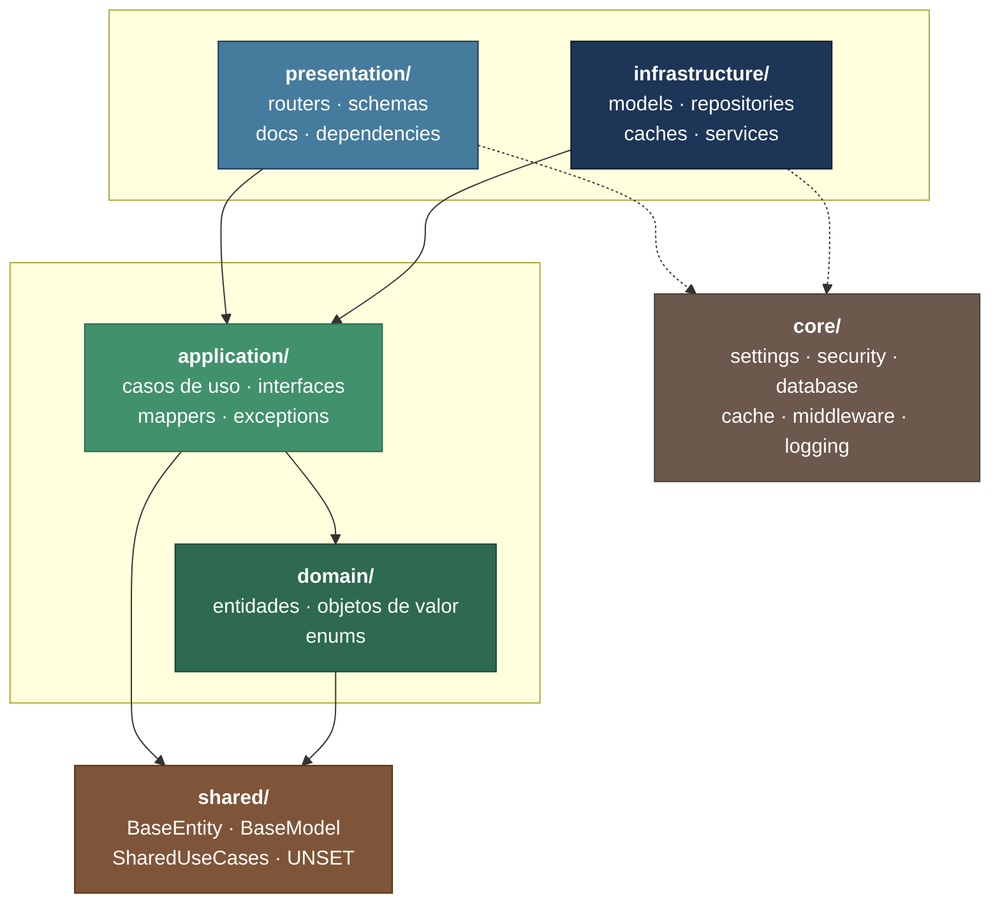
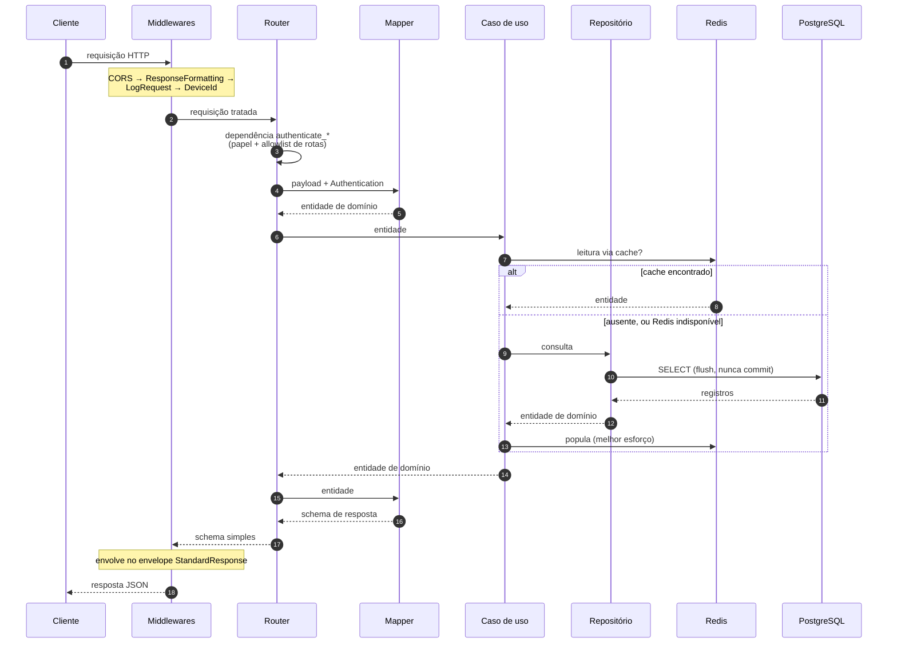
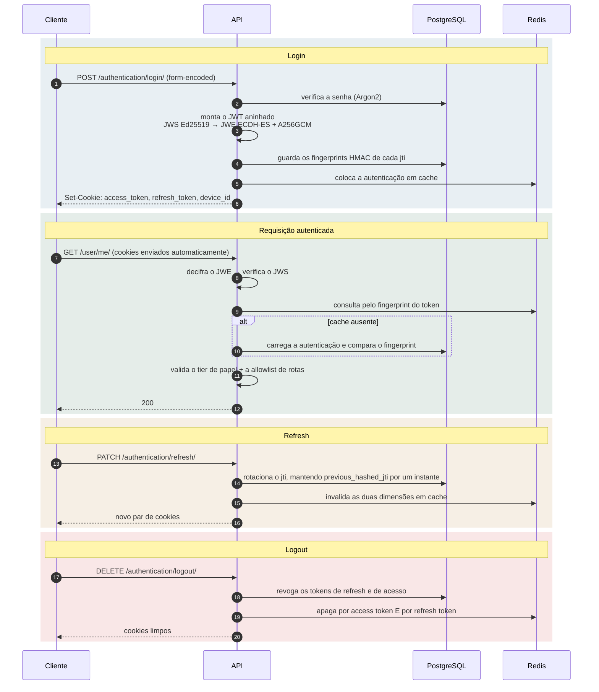
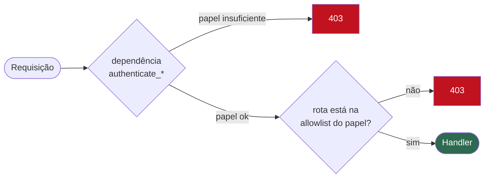
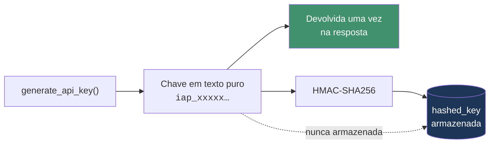
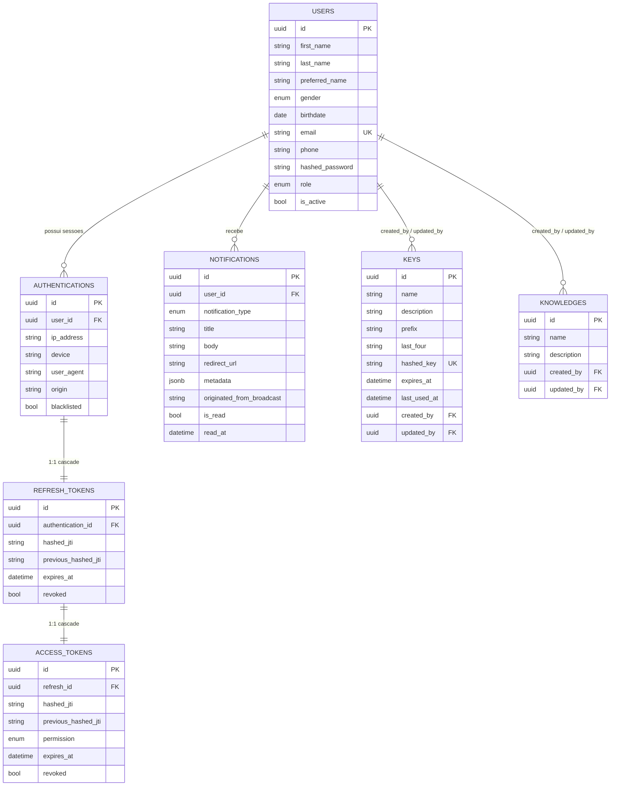
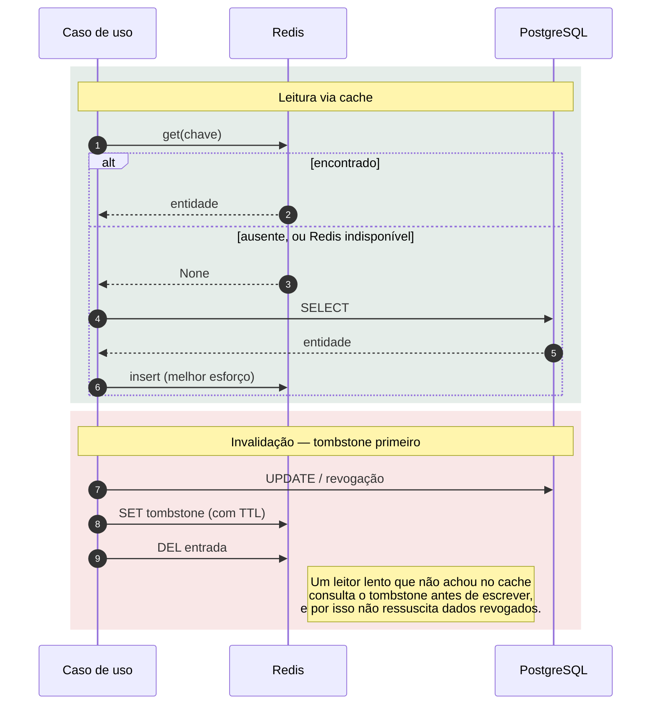

<div align="center">

# ERPIoT

**Um template de backend Python pronto para produção — Clean Architecture, Domain-Driven Design e tudo já integrado.**

[](https://www.python.org/)
[](https://fastapi.tiangolo.com/)
[](https://docs.pydantic.dev/)
[](https://www.sqlalchemy.org/)
[](https://www.postgresql.org/)
[](https://redis.io/)
[](https://www.docker.com/)
[](https://docs.astral.sh/uv/)
[](https://docs.astral.sh/ruff/)
[](LICENSE)

[](https://github.com/kongnakornna/fastapi-clean-architecture-ddd-erp-iot/fastapi-clean-architecture-ddd-template/stargazers)
[](https://github.com/kongnakornna/fastapi-clean-architecture-ddd-erp-iot/fastapi-clean-architecture-ddd-template/network/members)
[](https://github.com/kongnakornna/fastapi-clean-architecture-ddd-erp-iot/fastapi-clean-architecture-ddd-template/issues)
[](https://github.com/kongnakornna/fastapi-clean-architecture-ddd-erp-iot/fastapi-clean-architecture-ddd-template/commits)

[English](README.md) · **Português**

</div>

---

A maioria dos templates de "clean architecture" entrega pastas vazias e um diagrama. Este entrega
uma **aplicação funcionando**: autenticação por cookies com JWTs aninhados, gestão de chaves de API
com rotação, controle de acesso por papel validado duas vezes, cache-aside no Redis com
invalidação por tombstone, entrega em tempo real via WebSocket, notificações com fan-out por papel
e uma stack Docker que aplica as próprias migrações ao subir.

Nove módulos, vinte e três rotas, sete tabelas — todos seguindo um único conjunto de padrões que
você pode copiar para o décimo módulo.

## Sumário

- [Por que este template](#por-que-este-template)
- [Começando](#começando)
- [Arquitetura](#arquitetura)
- [Módulos](#módulos)
- [Referência da API](#referência-da-api)
- [Segurança](#segurança)
- [Dados](#dados)
- [Cache](#cache)
- [Desenvolvimento](#desenvolvimento)
- [Configuração](#configuração)
- [Limitações conhecidas](#limitações-conhecidas)
- [Contribuindo](#contribuindo)
- [Licença](#licença)

---

## Por que este template

| | Recurso | O que você realmente recebe |
|---|---|---|
| 🏛️ | **Clean Architecture + DDD** | Quatro camadas por módulo com direção de dependência garantida. `domain/` nunca importa framework. |
| 🔐 | **Autenticação bem feita** | JWT aninhado (JWS assinado com Ed25519, envolvido em um JWE cifrado com ECDH-ES + A256GCM), entregue em cookies HTTP-only, com fingerprints HMAC guardados no servidor para que os tokens sejam revogáveis. |
| 🔑 | **Chaves de API** | Ciclo completo — criar, listar, rotacionar, revogar. A chave em texto puro é devolvida uma única vez e nunca é armazenada. |
| 👥 | **Acesso por papel** | `admin` / `manager` / `user`, validado pela dependência **e** por uma allowlist de rotas. Dois portões independentes. |
| ⚡ | **Cache-aside no Redis** | Chaves versionadas e com namespace, com invalidação por tombstone que fecha a corrida de credencial revogada. Caches nunca lançam exceção — uma queda do Redis degrada para o banco. |
| 🔔 | **Notificações** | Fan-out individual e em cascata por papel, despachado por WebSocket em melhor esforço depois que a escrita é confirmada. |
| 🔌 | **WebSockets** | Canal autenticado com validação de `Origin`, já que o CORS não cobre o handshake. |
| 📦 | **Stack automigratória** | `docker compose up` sobe Postgres, Redis, pgAdmin e RedisInsight; a aplicação executa o Alembic até a head na inicialização. |
| 📖 | **OpenAPI que significa algo** | Todo endpoint documenta o contrato completo de erros, não só o caminho feliz. |

---

## Começando

### Pré-requisitos

| Ferramenta | Versão | Para quê |
|---|---|---|
| [Python](https://www.python.org/) | 3.14+ | Fixado em `.python-version` |
| [uv](https://docs.astral.sh/uv/) | atual | Gestão de dependências e do ambiente virtual |
| [Docker](https://www.docker.com/) + Compose | atual | Postgres, Redis e as interfaces administrativas |

### Cinco comandos

```bash
# 1. Clone
git clone fastapi-clean-architecture-ddd-erp-iot
cd fastapi-clean-architecture-ddd-template

# 2. Configure — toda chave do .env.example precisa de um valor
cp .env.example .env

# 3. Instale as dependências
uv sync

# 4. Suba Postgres, Redis e as interfaces administrativas
make dependencies-up-silent

# 5. Rode a API (as migrações são aplicadas automaticamente na inicialização)
make dev
```

> [!IMPORTANT]
> O passo 2 não é opcional. `Settings` declara a maioria dos campos como **obrigatórios**, então a
> aplicação lança um `ValidationError` na inicialização se alguma chave ficar vazia. Veja
> [Configuração](#configuração) para todas as chaves e um valor adequado para cada uma.

### O que você obtém

| Serviço | URL | Observações |
|---|---|---|
| **API** | http://localhost:8000 | `APPLICATION_PORT` |
| **Swagger UI** | http://localhost:8000/docs | Desabilitado em `production` |
| **ReDoc** | http://localhost:8000/redoc | Desabilitado em `production` |
| **OpenAPI JSON** | http://localhost:8000/openapi.json | Desabilitado em `production` |
| **Health check** | http://localhost:8000/health/ | Público |
| **pgAdmin** | http://localhost:8080 | `PGADMIN_EMAIL` / `PGADMIN_PASSWORD` |
| **RedisInsight** | http://localhost:8081 | Já apontado para o serviço `cache` |
| **Ferramentas de dev** | http://localhost:8000/devtools/ | Somente em `development` — cliente WebSocket de teste, documentação AsyncAPI |

### Primeira requisição

Um usuário administrador é criado a partir de `SECURITY_ADMIN_EMAIL` / `SECURITY_ADMIN_PASSWORD`.
Faça login — repare que este endpoint recebe dados **form-encoded**, não JSON:

```bash
curl -X POST http://localhost:8000/api/v1/authentication/login/ \
  -H "Content-Type: application/x-www-form-urlencoded" \
  -d "username=$SECURITY_ADMIN_EMAIL&password=$SECURITY_ADMIN_PASSWORD" \
  -c cookies.txt

curl http://localhost:8000/api/v1/user/me/ -b cookies.txt
```

> [!TIP]
> Uma coleção do Postman cobrindo todos os endpoints está em [`docs/`](docs/). Importe-a e depois
> preencha as variáveis de coleção `admin_email` e `admin_password`.

---

## Arquitetura

Cada módulo é dividido em quatro camadas. As dependências apontam **apenas para dentro** — o
domínio não conhece nada além de si mesmo.



| Camada | Diretório | Contém | Pode importar |
|---|---|---|---|
| **Domínio** | `domain/` | `entities.py`, `value_objects.py`, `enums.py` | Apenas `shared`. **Nada** de FastAPI, SQLAlchemy ou Pydantic. |
| **Aplicação** | `application/` | `use_cases.py`, `interfaces.py`, `mappers.py`, `exceptions.py`, `utils.py` | `domain`, `shared` |
| **Infraestrutura** | `infrastructure/` | `models.py`, `repositories.py`, `caches.py`, `services.py` | `domain`, `application`, `core` |
| **Apresentação** | `presentation/` | `routers.py`, `schemas.py`, `docs.py`, `dependencies.py` | tudo abaixo dela |

A camada de aplicação depende de contratos `typing.Protocol`, nunca de classes concretas. É isso
que torna um caso de uso testável com um fake em memória e permite trocar o Postgres por qualquer
outra coisa sem tocar na lógica de negócio.

<details>
<summary><b>Os três formatos de tratamento de erro</b> — um por tipo de camada</summary>

<br/>

Errar aqui é o equívoco de maior impacto no código, então vale enunciar com precisão.

**3 ramos** — casos de uso e handlers de rota:

```python
except StandardException:
    raise
except DomainError as e:
    raise DomainException(e)
except Exception as e:
    logger.opt(exception=e).error("An error occurred in the create key endpoint.")
    raise KeyException()
```

**2 ramos** — repositórios e serviços. Sem ramo `DomainError`: essas camadas nunca avaliam regras
de domínio.

```python
except StandardException:
    raise
except Exception as e:
    logger.opt(exception=e).error("An error occurred in the create key repository.")
    raise KeyException()
```

**Nunca lança** — caches. Todo método captura, registra e devolve `None`.

```python
except Exception as e:
    logger.opt(exception=e).error(
        "An error occurred in the get key by hashed key cache. Falling back to the database."
    )
    return None
```

> [!WARNING]
> `except StandardException` **precisa vir primeiro**. `StandardException` estende
> `HTTPException`, então qualquer outra ordem transforma todo 404 e 409 intencional em um 500.

Uma falha de cache degrada para o banco e jamais pode derrubar uma requisição — por isso o formato
de cache não tem nenhum ramo de re-lançamento.

</details>

<details>
<summary><b>Anatomia de um módulo</b> — cada arquivo e o que pertence a ele</summary>

<br/>

```text
app/modules/{module}/
├── domain/
│   ├── entities.py          Dataclasses que estendem BaseEntity; validação em __post_init__
│   ├── value_objects.py     Classes simples: _normalize → _validate → __str__ → __eq__
│   └── enums.py             Enums do módulo, sempre (str, Enum)
├── application/
│   ├── interfaces.py        Contratos Protocol: I{Entity}Repository / Cache / Service
│   ├── use_cases.py         Uma classe {Module}UseCases; as regras de negócio vivem aqui
│   ├── mappers.py           # ENTITY / DTOS · # ENTITY / MODELS · # ENTITY / CACHE
│   ├── exceptions.py        {Module}Exception genérica + uma por regra de negócio
│   └── utils.py             Auxiliares locais do módulo
├── infrastructure/
│   ├── models.py            Modelos SQLAlchemy que estendem BaseModel
│   ├── repositories.py      Postgres{Entity}Repository — flush(), nunca commit()
│   ├── caches.py            Redis{Entity}Cache — com namespace, tombstone e sem exceções
│   └── services.py          Sistemas externos ou com estado, atrás de um Protocol
└── presentation/
    ├── routers.py           Handlers: payload → mapper → caso de uso → mapper → retorno
    ├── schemas.py           Pydantic v2 com Field + ConfigDict completos
    ├── docs.py              router_docs + um {action}_docs por endpoint
    └── dependencies.py      Fábricas Depends, retornando o tipo Protocol
```

Arquivos vazios são normais. Um módulo mantém o esqueleto completo mesmo quando um arquivo de
camada não é usado — um `caches.py` vazio significa "este módulo não usa cache", não "alguém
esqueceu um arquivo".

`scripts/create_module.py` gera exatamente essa árvore.

</details>

### Ciclo de vida de uma requisição



Handlers nunca montam o envelope de resposta — quem faz isso é o `ResponseFormattingMiddleware`.
Handlers nunca contêm lógica de negócio — quem faz isso é o caso de uso. O corpo de todo handler é
exatamente `payload → mapper → caso de uso → mapper → retorno`.

---

## Módulos

```text
app/modules/
├── shared/           Tipos base usados por todos os módulos — sem rotas
├── authentication/   Login, refresh, logout; emissão de JWT aninhado
├── user/             Contas internas e papéis
├── key/              Chaves de API — o módulo mais completo
├── knowledge/        CRUD + referência de notificação em broadcast
├── notification/     Fan-out individual e por papel
├── websocket/        Entrega em tempo real
├── health/           Liveness e versão do Alembic
└── example/          Módulo de referência mínimo, sem persistência
```

| Módulo | Rotas | Persistência | Cache | Serviço | Papel |
|---|---|---|---|---|---|
| `authentication` | 3 | ✅ | ✅ | `ITokenService` | Ciclo de sessão, rotação de tokens |
| `key` | 6 | ✅ | ✅ | `IKeyService` | **Referência canônica** — copie este |
| `user` | 2 | ✅ | — | — | Contas, papéis, `/me` |
| `knowledge` | 4 | ✅ | parcial | — | CRUD + notificações em broadcast |
| `notification` | 2 | ✅ | — | — | Fan-out individual + cascata por papel |
| `websocket` | 1 + WS | — | — | `IConnectionManagerService` | Em memória, processo único |
| `health` | 3 | `alembic_version` | — | — | Liveness, redirecionamento da doc, estado das migrações |
| `example` | 1 | — | — | — | Demonstração mínima; sem repositório e sem modelo |
| `shared` | — | tipos base | — | — | `BaseEntity`, `BaseModel`, `SharedUseCases` |

> [!TIP]
> Quando um padrão parecer ambíguo, leia **`key`**. É o único módulo que exercita todas as
> camadas: cache com tombstone, um serviço, CRUD completo com rotação, projeção de atores e
> tratamento de segredo transitório.

<details>
<summary><b>O que vive em <code>shared</code></b></summary>

<br/>

| Arquivo | Exporta |
|---|---|
| `domain/entities.py` | `BaseEntity`, `DomainError`, `DomainErrors`, `Pagination`, `PaginatedList` |
| `domain/value_objects.py` | `UNSET`, `RESOURCE_NAME_PATTERN`, `Email`, `Name`, `Phone` |
| `domain/enums.py` | `ApplicationEnvironment`, `CookieSameSite`, `ResponseMessages`, `Role`, `SortOrder` |
| `infrastructure/models.py` | `Base`, `BaseModel` |
| `application/exceptions.py` | `StandardException`, `DomainException`, `CoreException`, `OriginNotAllowedException` |
| `application/use_cases.py` | `SharedUseCases` — notificações e busca de usuários |
| `application/utils.py` | `BRASILIA_TZ`, `current_timestamp()`, `resolve_client_ip()` |
| `presentation/schemas.py` | `StandardResponse`, `PaginationParams`, `PaginationMeta`, `CreateResponse`, `UpdateResponse`, `DeleteResponse` |
| `presentation/dependencies.py` | Fábricas de repositórios, caches e `SharedUseCases` entre módulos |

**Campos herdados — nunca redeclare estes.**

`BaseModel` (ORM) fornece `id` (UUID, `gen_random_uuid()`), `is_active` (marcador de exclusão
lógica), `created_at` e `updated_at` (fuso de Brasília, gerenciados pelo banco).

`BaseEntity` (domínio) fornece os mesmos quatro mais `deactivate()`.

**O sentinela `UNSET`.** Atualizações parciais precisam distinguir "campo omitido" de "campo
explicitamente definido como nulo". `UNSET` é essa distinção, e ela atravessa três pontos:

1. A entidade define o campo como `UNSET` por padrão.
2. O mapper de atualização preenche a partir de `payload.model_fields_set`.
3. O caso de uso mantém o valor armazenado onde o valor recebido `is UNSET`.

Sempre compare com `is` / `is not`, nunca com `==`.

</details>

---

## Referência da API

**22 rotas HTTP + 1 canal WebSocket.** Toda rota é registrada duas vezes — com e sem barra final —
então ambas as formas funcionam; apenas a forma com barra aparece no OpenAPI.

### Autenticação

| Método | Rota | Acesso | Descrição |
|---|---|---|---|
| `POST` | `/api/v1/authentication/login/` | 🌐 Público | Emite o par de cookies. **Form-encoded**, não JSON. |
| `PATCH` | `/api/v1/authentication/refresh/` | 👤 Usuário | Rotaciona o refresh token e emite um novo access token. |
| `DELETE` | `/api/v1/authentication/logout/` | 🌐 Público¹ | Revoga a sessão e limpa os cookies. |

### Usuário

| Método | Rota | Acesso | Descrição |
|---|---|---|---|
| `POST` | `/api/v1/user/` | 🌐 Público | Registra uma conta. O e-mail precisa estar em `SECURITY_EMAIL_ALLOWED_DOMAINS`. |
| `GET` | `/api/v1/user/me/` | 👤 Usuário | Perfil do usuário autenticado. |

### Chaves de API

| Método | Rota | Acesso | Descrição |
|---|---|---|---|
| `POST` | `/api/v1/key/` | 🔴 Admin | Cria uma chave. **Devolve o segredo uma única vez.** |
| `GET` | `/api/v1/key/` | 🔴 Admin | Listagem paginada. |
| `GET` | `/api/v1/key/{id}/` | 🔴 Admin | Uma chave com seu criador e atualizador. |
| `PATCH` | `/api/v1/key/{id}/` | 🔴 Admin | Renomeia ou redescreve. Parcial. |
| `PATCH` | `/api/v1/key/{id}/rotate/` | 🔴 Admin | Novo segredo, mesmo registro. **Devolve o segredo uma única vez.** |
| `DELETE` | `/api/v1/key/{id}/` | 🔴 Admin | Revoga (exclusão lógica) e invalida o cache. |

### Knowledge

| Método | Rota | Acesso | Descrição |
|---|---|---|---|
| `POST` | `/api/v1/knowledge/` | 🟠 Manager | Cria e envia uma notificação em broadcast para os managers. |
| `GET` | `/api/v1/knowledge/` | 🟠 Manager | Listagem paginada. |
| `PATCH` | `/api/v1/knowledge/{id}/` | 🟠 Manager | Atualização parcial. |
| `DELETE` | `/api/v1/knowledge/{id}/` | 🟠 Manager | Exclusão lógica. |

### Notificação

| Método | Rota | Acesso | Descrição |
|---|---|---|---|
| `GET` | `/api/v1/notification/` | 👤 Usuário | Notificações do chamador, paginadas. |
| `PATCH` | `/api/v1/notification/{id}/` | 👤 Usuário | Marca como lida. |

### Health, WebSocket e Example

| Método | Rota | Acesso | Descrição |
|---|---|---|---|
| `GET` | `/health/` | 🌐 Público | Sonda de liveness. |
| `GET` | `/` | ⚠️ | Deveria redirecionar para `/docs` — veja [Limitações conhecidas](#limitações-conhecidas). |
| `GET` | `/api/v1/alembic-version/` | 🔴 Admin | A revisão de migração aplicada. |
| `GET` | `/api/v1/websocket/connect/` | 🌐 Público | Rota-isca só para documentação; lança exceção imediatamente. |
| `WS` | `/api/v1/websocket/connect/` | 👤 Usuário | O canal real. Com validação de `Origin`. |
| `POST` | `/api/v1/example/` | 🌐 Público | Endpoint de referência mínimo. |

¹ O `logout` está no tier público da allowlist, mas ainda executa `authenticate_logout`, que
tolera estado parcialmente expirado para que uma sessão obsoleta sempre possa ser limpa.

<details>
<summary><b>Envelope de resposta</b> — toda resposta tem o mesmo formato</summary>

<br/>

O `ResponseFormattingMiddleware` envolve toda resposta JSON. Handlers devolvem um schema simples e
nunca constroem este envelope.

```json
{
  "code": 200,
  "method": "GET",
  "path": "/api/v1/key/",
  "timestamp": "2026-07-31T12:34:56Z",
  "details": {
    "message": "Resource retrieved successfully",
    "data": { }
  }
}
```

| Campo | Significado |
|---|---|
| `code` | Código de status HTTP |
| `method` | Método HTTP da requisição |
| `path` | Rota da requisição |
| `timestamp` | ISO 8601, em UTC |
| `details.message` | Uma constante de `ResponseMessages` — nunca um texto improvisado |
| `details.data` | O payload do endpoint, ou `{"errors": ...}` em caso de falha |

Respostas do Swagger, do ReDoc e do tipo `text/event-stream` não passam pelo envelope.

</details>

<details>
<summary><b>Paginação</b> — parâmetros e metadados</summary>

<br/>

| Parâmetro | Tipo | Padrão | Restrição |
|---|---|---|---|
| `page` | int | `1` | ≥ 1 |
| `limit` | int | `20` | 1–100 |
| `sort_order` | enum | `desc` | `asc` \| `desc` |
| `sort_by` | enum | por módulo | Precisa ser uma coluna real |

```bash
curl "http://localhost:8000/api/v1/key/?page=1&limit=10&sort_by=updated_at&sort_order=desc" -b cookies.txt
```

Toda resposta de listagem traz um bloco `pagination`:

```json
{
  "total": 87,
  "page": 2,
  "limit": 20,
  "total_pages": 5,
  "has_next": true,
  "has_prev": true
}
```

O total é calculado na **mesma consulta** da página, usando uma window function
(`func.count(...).over()`) — nunca há um segundo `COUNT(*)`.

> A camada HTTP fala `limit`; a camada de domínio fala `per_page`. Os mappers traduzem na
> fronteira.

</details>

<details>
<summary><b>Catálogo de erros</b> — códigos de status e quando ocorrem</summary>

<br/>

| Status | `ResponseMessages` | Quando |
|---|---|---|
| `400` | `VALIDATION_ERROR` | Uma regra de domínio falhou — lançada como `DomainException` |
| `400` | `BAD_REQUEST` | Uma atualização não trouxe nenhuma mudança efetiva |
| `401` | `UNAUTHORIZED_ERROR` | Credencial ausente, inválida, revogada ou expirada |
| `403` | `AUTHORIZATION_ERROR` | Autenticado mas sem permissão, ou rota fora do tier do chamador |
| `404` | `RESOURCE_NOT_FOUND` | Registro inexistente ou excluído logicamente |
| `405` | `METHOD_NOT_ALLOWED` | Método não suportado naquela rota |
| `409` | `CONFLICT` | Colisão de chave natural, por exemplo um nome duplicado |
| `422` | `VALIDATION_ERROR` | O Pydantic rejeitou o payload antes do handler rodar |
| `500` | `INTERNAL_ERROR` | Falha inesperada — a exceção genérica do módulo |
| `502` | `BAD_GATEWAY` | Uma dependência externa falhou |
| `504` | `GATEWAY_TIMEOUT` | Uma dependência externa estourou o tempo limite |

`400` e `422` são realmente diferentes: `422` é o FastAPI rejeitando o formato da requisição antes
do seu código rodar; `400` é uma regra de negócio falhando dentro dele.

Todo corpo de erro carrega `details.data.errors` — um texto para uma falha, ou uma lista quando
várias foram coletadas de uma vez (uma entidade reporta **todas** as suas falhas de validação em
uma única resposta, não apenas a primeira).

</details>

<details>
<summary><b>Canal WebSocket</b> — conexão e formato das mensagens</summary>

<br/>

**Endpoint:** `ws://localhost:8000/api/v1/websocket/connect/`

A autenticação usa os mesmos cookies HTTP-only da API REST — o navegador os envia automaticamente
no upgrade. O cabeçalho `Origin` é validado contra `SECURITY_ALLOW_ORIGINS`, porque o
`CORSMiddleware` **não** cobre o handshake do WebSocket.

As mensagens fluem apenas **servidor → cliente**. Frames do cliente são aceitos e descartados, o
que os torna úteis como keepalive.

```json
{
  "message_type": "notification",
  "body": {
    "id": "550e8400-e29b-41d4-a716-446655440000",
    "created_at": "2026-01-15T10:30:00Z",
    "notification_type": "knowledge_created",
    "title": "Knowledge base created",
    "body": "The knowledge base 'ML Fundamentals' was created successfully.",
    "redirect_url": "https://app.example.com,mycompany.com,gmail.com/knowledge/550e8400"
  }
}
```

Broadcasts aplicam uma cascata por papel: `ADMIN` alcança admins, `MANAGER` alcança managers e
admins, `USER` alcança todos.

Um cliente de teste em navegador e a especificação AsyncAPI completa são servidos em `/devtools/`
em desenvolvimento — veja `scripts/websocket_test.html` e `scripts/asyncapi.yaml`.

</details>

---

## Segurança

### Fluxo de autenticação



### Por que JWTs aninhados

Um JWT apenas assinado é legível por qualquer um que o possua. Este template assina **e** cifra:

| Camada | Algoritmo | Finalidade |
|---|---|---|
| **JWS** interno | Ed25519 | Prova autenticidade e integridade |
| **JWE** externo | ECDH-ES + A256GCM | Mantém as claims opacas para o cliente |

Os tokens trafegam em **cookies HTTP-only**, não em cabeçalhos `Authorization`, então o JavaScript
não consegue lê-los. Um fingerprint HMAC-SHA256 do `jti` de cada token é guardado no banco — o
token em si nunca é — o que torna os tokens revogáveis e permite detectar adulteração.

Os pares de chaves são carregados de arquivos PEM em `secrets/keys/` e gerados na primeira
inicialização quando `JWT_AUTO_GENERATE_KEYS` é verdadeiro.

> [!CAUTION]
> `secrets/keys/*.pem` está no `.gitignore` por um motivo. Gere chaves novas para cada ambiente e
> nunca as versione. Rotacionar uma chave exige reiniciar o processo — elas são carregadas em
> cache na inicialização.

### Papéis e os dois portões



Os dois portões precisam concordar. Isso é intencional: é fácil esquecer a dependência em um
handler novo, e é fácil esquecer a allowlist em uma rota nova. Exigir os dois faz com que um
descuido falhe fechado.

| Tier | Configuração | Alcança |
|---|---|---|
| 🌐 Público | `SECURITY_NO_AUTH_PATHS` | Todos, inclusive anônimos |
| 👤 Usuário | `SECURITY_USER_ALLOWED_PATHS` | Público + usuário |
| 🟠 Manager | `SECURITY_MANAGER_ALLOWED_PATHS` | Usuário + manager |
| 🔴 Admin | `SECURITY_ADMIN_ALLOWED_PATHS` | Manager + admin |
| 🔑 Chave de API | `SECURITY_API_KEY_ALLOWED_PATHS` | Tier independente — atualmente vazio |

Os tiers são cumulativos, então cada rota é declarada **uma vez**, no tier mais baixo que deve
alcançá-la. As duas formas de barra precisam ser registradas:

```python
(_path_rule("/api/v1/key/", "POST"),)
(_path_rule("/api/v1/key", "POST"),)
```

> [!WARNING]
> Esquecer a segunda forma é a causa mais comum de "funciona no Swagger, dá 403 no cliente".

### Chaves de API

Totalmente implementadas — o mecanismo funciona, mas `SECURITY_API_KEY_ALLOWED_PATHS` está vazio,
então nenhum endpoint aceita autenticação por chave hoje. Adicione rotas ali para habilitá-la.



O registro guarda um `prefix` e um `last_four` não secretos para exibição, além do hash para
verificação (comparado com `hmac.compare_digest`, em tempo constante). A chave em texto puro é
devolvida **uma vez**, na criação e na rotação, e não pode ser recuperada depois.

---

## Dados

### Relacionamentos entre entidades



Excluir um usuário faz **cascata** para suas autenticações e notificações, mas é **restrito** por
qualquer chave ou base de conhecimento que ele tenha criado — trilhas de auditoria não podem
perder seu autor.

Os nomes das tabelas recebem o prefixo de `APPLICATION_TABLE_PREFIX`, então com o valor padrão a
tabela de usuários é `erp_users`.

### Convenções

| Conceito | Regra | Exemplo |
|---|---|---|
| Nome da tabela | `{prefix}_{plural_snake}` | `..._keys` |
| Tipo enum | `{snake}_enum` | `role_enum` |
| Restrição de unicidade | `uq_{plural}_{cols}` | `uq_keys_hashed_key` |
| Índice | `ix_{plural}_{cols}` | `ix_keys_prefix` |
| Restrição de verificação | `ck_{plural}_{rule}` | `ck_keys_single_owner` |
| Exclusão lógica | `is_active = false` | nunca um `DELETE` físico |

> [!NOTE]
> O PostgreSQL guarda os **nomes dos membros** dos enums em maiúsculas (`ADMIN`,
> `KNOWLEDGE_CREATED`), e não os valores Python em minúsculas. Isso importa sempre que você
> escrever SQL bruto ou uma migração de dados.

### Migrações

`migrations/versions/` vem **vazio** — a sua primeira migração cria todo o schema do seu projeto.
A aplicação executa `alembic upgrade head` na inicialização, então uma stack nova se migra
sozinha.

```bash
make migration m="create_my_entity_model"   # autogeração
make migrate                                 # aplicação
```

> [!IMPORTANT]
> Um modelo novo precisa ser importado em `migrations/env.py` e adicionado à lista `_ = [...]`. A
> autogeração só enxerga modelos registrados — e pior, ela emite um `drop_table` para uma tabela
> ativa cujo modelo ela não consegue ver.

---

## Cache

O Postgres é a fonte da verdade. O Redis é um acelerador que você precisa poder perder a qualquer
momento.



### A corrida que o tombstone fecha

Sem ele, esta intercalação ressuscita dados revogados silenciosamente:

```text
leitor:  cache ausente ──► lê do banco ────────────► grava o snapshot no cache
escritor:                    └─► revoga no banco ──► apaga a chave do cache
```

A escrita do leitor chega *depois* da exclusão do escritor, e uma credencial revogada continua
autenticando até seu TTL expirar. O protocolo fecha isso em três passos: o `delete` grava o
tombstone **antes** de remover a entrada, o `insert` verifica o tombstone **antes** de escrever, e
os tombstones duram mais que a maior janela plausível entre leitura e escrita.

### Namespace e versionamento

```python
REDIS_NAMESPACE = f"{REDIS_KEY_PREFIX}:v{REDIS_CACHE_VERSION}"
```

Toda chave pende desse namespace. **Incremente `REDIS_CACHE_VERSION` sempre que mudar o que é
serializado** — a geração anterior fica inalcançável e expira sozinha por TTL. Essa é a resposta
correta para uma mudança de formato do payload, não limpar o cache nem adicionar lógica de
migração ao desserializador.

| Configuração | Padrão | Finalidade |
|---|---|---|
| `REDIS_KEY_PREFIX` | slug do projeto | Raiz do namespace |
| `REDIS_CACHE_VERSION` | `1` | Contador de geração |
| `REDIS_DEFAULT_TTL_SECONDS` | `3600` | TTL padrão |
| `REDIS_SESSION_TTL_SECONDS` | `1800` | Entradas de autenticação |
| `REDIS_TOMBSTONE_TTL_SECONDS` | `30` | Por quanto tempo a repopulação fica suprimida |
| `REDIS_FLUSH_ON_STARTUP` | `True` | Limpa o namespace na inicialização |
| `REDIS_MAX_CONNECTIONS` | `50` | Tamanho do pool |

**O caso de uso decide a política; a classe de cache apenas executa.** Quando ler via cache, quando
invalidar e qual TTL usar são decisões de negócio, então vivem em um único lugar revisável.

---

## Desenvolvimento

### Alvos do Make

| Comando | O que faz |
|---|---|
| `make dev` | `uvicorn app.app:app --reload` |
| `make start` | Stack Docker completa, com build e acompanhando os logs |
| `make start-silent` | Stack Docker completa, em segundo plano |
| `make stop` | Para a stack |
| `make delete` | Para e **remove os volumes** — destrói os dados |
| `make dependencies-up` | Só Postgres, Redis e as interfaces administrativas, acompanhando os logs |
| `make dependencies-up-silent` | O mesmo, em segundo plano |
| `make dependencies-down` | Para esses serviços |
| `make logs` | Acompanha os logs do Compose |
| `make view-processes` | `docker ps -a` |
| `make migrate` | `alembic upgrade head` |
| `make migration m="..."` | `alembic revision --autogenerate` |
| `make lint` | `ruff check .` |
| `make format` | `ruff format .` |
| `make help` | Lista todos os alvos |

### Serviços Docker

| Serviço | Imagem | Porta no host | Porta no contêiner |
|---|---|---|---|
| `api` | construída pelo `Dockerfile` | `${APPLICATION_PORT}` (8000) | 8000 |
| `database` | `postgres:17-alpine` | `${POSTGRESQL_PORT}` (5432) | 5432 |
| `database-admin` | `dpage/pgadmin4:9.2` | `${PGADMIN_PORT}` (8080) | 80 |
| `cache` | `redis:8.6-alpine` | `${REDIS_PORT}` (6379) | 6379 |
| `cache-admin` | `redis/redisinsight:3.4.2` | `${REDISINSIGHT_PORT}` (8081) | 5540 |

O `api` espera os healthchecks de `database` e `cache` antes de iniciar. O Redis roda com
persistência AOF e política de despejo LRU.

### Scripts

| Script | Finalidade |
|---|---|
| `scripts/create_module.py` | Gerador interativo do esqueleto de módulo em quatro camadas |
| `scripts/generate_secret.py` | Um segredo hexadecimal de 32 bytes para as configurações de fingerprint HMAC |
| `scripts/generate_fernet.py` | Uma chave Fernet |
| `scripts/directory_tree.py` | Escreve a árvore do projeto em `scripts/directory_tree.txt` |
| `scripts/websocket_test.html` | Cliente WebSocket em navegador — servido em `/devtools/` em dev |
| `scripts/asyncapi.yaml` | Especificação AsyncAPI 2.6 do canal WebSocket |

### Logging

JSON estruturado no **stderr** via loguru, serializado com `orjson`. Em desenvolvimento a saída é
indentada e colorida; o `stackprinter` renderiza tracebacks detalhados.

```json
{
  "timestamp": "2026-07-31T12:34:56.789012+00:00",
  "level": "INFO",
  "message": "Creating api key 'CI pipeline' in database.",
  "source": "repositories.py:create:31"
}
```

| Nível | Usado para |
|---|---|
| `DEBUG` | Entrada e saída de casos de uso; acertos e ausências de cache |
| `INFO` | Chamadas de repositório, decisões de negócio e todo lançamento de exceção de regra |
| `WARNING` | Operações de melhor esforço que falharam sem consequência, como um despacho WebSocket |
| `ERROR` | Falhas inesperadas, sempre via `logger.opt(exception=e).error(...)` |
| `CRITICAL` | Reservado |

O `LogRequestMiddleware` anexa um id de requisição (de tamanho `LOGS_REQUEST_ID_LENGTH`) e
cabeçalhos de tempo a cada requisição.

> [!NOTE]
> `LOGS_PATH` está atualmente sem uso — nenhum destino em arquivo é registrado. Os logs vão só para
> o stderr, que é o padrão correto para contêineres. Adicione um `logger.add(...)` em
> `app/core/logging.py` se quiser arquivos.

### Testes

`test/` espelha `app/modules/`, com um pacote por módulo. A política é **unitária primeiro**:
conduza os casos de uso por fakes em memória dos seus Protocols, construa entidades diretamente e
não toque em banco, Redis ou rede reais.

```text
test/
├── core/
└── modules/
    ├── authentication/  example/  health/  key/
    ├── knowledge/  notifications/  shared/  user/  websocket/
```

> [!NOTE]
> O pytest **ainda não é uma dependência** e os pacotes de teste são esqueletos vazios. Instale-o
> com `uv add --dev pytest pytest-asyncio` e depois adicione `[tool.pytest.ini_options]` com
> `asyncio_mode = "auto"` e `testpaths = ["test"]` ao `pyproject.toml`.

---

## Configuração

Cada configuração é um campo tipado de `Settings` em `app/core/settings.py`, carregado do `.env`
pelo pydantic-settings. Acesse pelo singleton `settings` — nunca por `os.environ`.

> [!IMPORTANT]
> A maioria dos campos é **obrigatória**. Um valor vazio no `.env` gera um `ValidationError`
> nomeando a chave na inicialização, e isso é proposital: um valor padrão silencioso que difere
> entre ambientes é bem mais difícil de depurar do que uma falha na subida.

<details>
<summary><b>Referência completa de configuração</b> — todas as 83 chaves</summary>

<br/>

#### Aplicação

| Chave | Exemplo                                       | Descrição |
|---|-----------------------------------------------|---|
| `APPLICATION_TITLE` | `ERPIoT` | Título no OpenAPI |
| `APPLICATION_SUMMARY` | *(texto)*                                     | Resumo no OpenAPI |
| `APPLICATION_DESCRIPTION` | *(markdown)*                                  | Descrição no OpenAPI |
| `APPLICATION_VERSION` | `3.0.0`                                       | Versão no OpenAPI |
| `APPLICATION_CONTACT_NAME` | `Bruno Tanabe`                                | Contato no OpenAPI |
| `APPLICATION_CONTACT_URL` | *(url)*                                       | Contato no OpenAPI |
| `APPLICATION_CONTACT_EMAIL` | *(e-mail)*                                    | Contato no OpenAPI |
| `APPLICATION_CONTACT_PHONE` | *(telefone)*                                  | Contato no OpenAPI |
| `APPLICATION_PORT` | `8000`                                        | Porta no host |
| `APPLICATION_ENVIRONMENT` | `development`                                 | `development` \| `homolog` \| `production` |
| `APPLICATION_CONNECT_TIMEOUT_SECONDS` | `30`                                          | Tempo limite de conexão |
| `APPLICATION_URL` | `http://localhost:8000`                       | URL base pública |
| `APPLICATION_TABLE_PREFIX` | slug do projeto                               | Prefixo em todo nome de tabela |

#### Chave de API

| Chave | Exemplo | Descrição |
|---|---|---|
| `API_KEY_PREFIX` | `iap` | Prefixo visível nas chaves geradas |
| `API_KEY_HASH_FINGERPRINT` | *(hex de 32 bytes)* | Segredo HMAC — `scripts/generate_secret.py` |
| `API_KEY_ENTROPY_BYTES` | `32` | Aleatoriedade por chave gerada |

#### Esquemas de autenticação

| Chave | Exemplo | Descrição |
|---|---|---|
| `AUTH_BEARER_TOKEN_SCHEME_NAME` | `BearerAuth` | Nome do esquema de segurança no OpenAPI |
| `AUTH_BEARER_TOKEN_SCHEME_DESCRIPTION` | *(texto)* | Descrição no OpenAPI |
| `AUTH_API_KEY_NAME` | `X-API-Key` | Cabeçalho que carrega a chave de API |
| `AUTH_API_KEY_SCHEME_NAME` | `ApiKeyAuth` | Nome do esquema de segurança no OpenAPI |
| `AUTH_API_KEY_DESCRIPTION` | *(texto)* | Descrição no OpenAPI |

#### Cookies

| Chave | Exemplo | Descrição |
|---|---|---|
| `COOKIES_MAX_AGE_SECONDS` | `7776000` | Tempo de vida do cookie (90 dias) |
| `COOKIES_TOKEN_TYPE_KEY` | `token_type` | Nome do cookie de tipo de token |
| `COOKIES_ACCESS_TOKEN_KEY` | `access_token` | Nome do cookie de access token |
| `COOKIES_ACCESS_TOKEN_PATH` | `/api/v1/` | Escopo do cookie de access token |
| `COOKIES_REFRESH_TOKEN_KEY` | `refresh_token` | Nome do cookie de refresh token |
| `COOKIES_REFRESH_TOKEN_PATH` | `/api/v1/authentication/refresh/` | Escopo do cookie de refresh — enviado só para o endpoint de refresh |
| `COOKIES_DEVICE_KEY` | `device_id` | Nome do cookie de dispositivo |
| `COOKIES_DOMAIN` | `localhost` | Domínio do cookie |
| `COOKIES_SAME_SITE` | `none` | `lax` \| `strict` \| `none` |

#### JWT

| Chave | Exemplo | Descrição |
|---|---|---|
| `JWT_ISSUER` | `http://localhost:8000` | Claim `iss` |
| `JWT_AUDIENCE` | `api://…` | Claim `aud` |
| `JWT_SIGNING_KEY_PASSWORD` | *(segredo)* | Senha da chave privada de assinatura |
| `JWT_ENCRYPTION_KEY_PASSWORD` | *(segredo)* | Senha da chave privada de cifragem |
| `JWT_SIGNING_PRIVATE_KEY_PATH` | `secrets/keys/signing-private.pem` | Chave privada Ed25519 |
| `JWT_SIGNING_PUBLIC_KEY_PATH` | `secrets/keys/signing-public.pem` | Chave pública Ed25519 |
| `JWT_ENCRYPTION_PRIVATE_KEY_PATH` | `secrets/keys/encryption-private.pem` | Chave privada X25519 |
| `JWT_ENCRYPTION_PUBLIC_KEY_PATH` | `secrets/keys/encryption-public.pem` | Chave pública X25519 |
| `JWT_ACCESS_TOKEN_EXPIRE_MINUTES` | `30` | Vida útil do access token |
| `JWT_REFRESH_TOKEN_EXPIRE_DAYS` | `90` | Vida útil do refresh token |
| `JWT_HASH_FINGERPRINT` | *(hex de 32 bytes)* | Segredo HMAC para os fingerprints de `jti` |
| `JWT_AUTO_GENERATE_KEYS` | `True` | Gera pares de chaves ausentes na primeira inicialização |
| `JWT_KEYS_DIR` | `secrets/keys` | Onde ficam os pares de chaves |

#### Logs

| Chave | Exemplo | Descrição |
|---|---|---|
| `LOGS_NAME` | slug do projeto | Nome do logger |
| `LOGS_PATH` | `logs` | Reservado — nenhum destino em arquivo é registrado ainda |
| `LOGS_LEVEL` | `INFO` | Nível mínimo |
| `LOGS_REQUEST_ID_LENGTH` | `8` | Tamanho do id de requisição |
| `LOGS_PYGMENTS_STYLE` | `monokai` | Tema de destaque em desenvolvimento |

#### PostgreSQL

| Chave | Exemplo | Descrição |
|---|---|---|
| `POSTGRESQL_DATABASE` | slug do projeto | Nome do banco |
| `POSTGRESQL_USERNAME` | *(usuário)* | Usuário do banco |
| `POSTGRESQL_PASSWORD` | *(segredo)* | Senha do banco |
| `POSTGRESQL_HOST` | `localhost` | Use `database` de dentro do Compose |
| `POSTGRESQL_PORT` | `5432` | Porta do banco |

#### pgAdmin *(somente Compose)*

| Chave | Exemplo | Descrição |
|---|---|---|
| `PGADMIN_EMAIL` | *(e-mail)* | Login do pgAdmin |
| `PGADMIN_PASSWORD` | *(segredo)* | Senha do pgAdmin |
| `PGADMIN_PORT` | `8080` | Porta no host |

#### Redis

| Chave | Exemplo | Descrição |
|---|---|---|
| `REDIS_HOST` | `localhost` | Use `cache` de dentro do Compose |
| `REDIS_PORT` | `6379` | Porta do Redis |
| `REDIS_PASSWORD` | *(segredo)* | Senha do Redis |
| `REDIS_DB` | `0` | Índice do banco |
| `REDIS_USERNAME` | `default` | Usuário da ACL |
| `REDIS_SSL` | `False` | Usa `rediss://` quando verdadeiro |
| `REDIS_CONNECTION_TIMEOUT_SECONDS` | `10` | Tempo limite de conexão |
| `REDIS_SOCKET_TIMEOUT_SECONDS` | `5` | Tempo limite de socket |
| `REDIS_DEFAULT_TTL_SECONDS` | `3600` | TTL padrão das entradas |
| `REDIS_SESSION_TTL_SECONDS` | `1800` | TTL das entradas de autenticação |
| `REDIS_TOMBSTONE_TTL_SECONDS` | `30` | Tempo de vida do tombstone |
| `REDIS_KEY_PREFIX` | slug do projeto | Raiz do namespace |
| `REDIS_CACHE_VERSION` | `1` | Incremente ao mudar o formato do payload |
| `REDIS_FLUSH_ON_STARTUP` | `True` | Limpa o namespace na inicialização |
| `REDIS_MAX_CONNECTIONS` | `50` | Tamanho do pool |
| `REDIS_DATABASES` | `16` | *(somente Compose)* |
| `REDIS_MAX_MEMORY` | `256mb` | *(somente Compose)* |
| `REDIS_MAX_MEMORY_POLICY` | `allkeys-lru` | *(somente Compose)* |

#### RedisInsight *(somente Compose)*

| Chave | Exemplo | Descrição |
|---|---|---|
| `REDISINSIGHT_PORT` | `8081` | Porta no host |
| `REDISINSIGHT_REDIS_ALIAS` | *(nome)* | Apelido da conexão |

#### ngrok

| Chave | Exemplo | Descrição |
|---|---|---|
| `NGROK_AUTH_TOKEN` | *(token)* | Opcional — sobe um túnel em `development` |

#### Segurança

| Chave | Exemplo | Descrição |
|---|---|---|
| `SECURITY_ALLOW_ORIGINS` | `["http://localhost:8000"]` | Allowlist de origem para CORS **e** WebSocket |
| `SECURITY_ALLOW_HEADERS` | `["Accept","Authorization",…]` | Cabeçalhos do CORS |
| `SECURITY_ALLOW_METHODS` | `["GET","POST",…]` | Métodos do CORS |
| `SECURITY_EMAIL_ALLOWED_DOMAINS` | `["admin.com"]` | Allowlist de domínios no cadastro; `[]` desativa |
| `SECURITY_ADMIN_EMAIL` | *(e-mail)* | Conta de admin criada automaticamente |
| `SECURITY_ADMIN_PASSWORD` | *(segredo)* | Senha do admin criado automaticamente |

</details>

<details>
<summary><b>Configurações calculadas</b> — derivadas, não configuradas</summary>

<br/>

Dezesseis valores são calculados a partir das chaves acima e não devem ser definidos diretamente:

| Propriedade | Derivada de |
|---|---|
| `APPLICATION_ENVIRONMENT_DEBUG` | `APPLICATION_ENVIRONMENT != production` |
| `COOKIES_ACCESS_TOKEN_MAX_AGE` | `JWT_ACCESS_TOKEN_EXPIRE_MINUTES × 60` |
| `COOKIES_REFRESH_TOKEN_MAX_AGE` | `JWT_REFRESH_TOKEN_EXPIRE_DAYS × 86400` |
| `POSTGRESQL_DATABASE_URL` / `_ASYNC_DATABASE_URL` | O grupo `POSTGRESQL_*` |
| `REDIS_URL` | O grupo de conexão `REDIS_*` |
| `REDIS_NAMESPACE` | `REDIS_KEY_PREFIX` + `REDIS_CACHE_VERSION` |
| `JWT_SIGNING_*_KEY`, `JWT_ENCRYPTION_*_KEY` | Os arquivos PEM em disco |
| `SECURITY_*_ALLOWED_PATHS` | As regras de rota de cada tier |

Defina a expiração do JWT, não a idade do cookie — a idade do cookie acompanha.

</details>

---

## Limitações conhecidas

Documentadas de propósito. São compromissos conscientes ou trabalho em andamento — não defeitos a
serem "limpos".

| Área | Estado atual | Impacto |
|---|---|---|
| **Fan-out do WebSocket** | O `ConnectionManager` guarda as conexões em um dicionário em memória no `app.state` | A entrega funciona apenas dentro de um processo. Implantações multi-worker precisam de pub/sub no Redis. |
| **Cache do `knowledge`** | `IKnowledgeCache` declara apenas `insert`, e o caso de uso nunca o chama | A estrutura existe, mas está inativa. Siga o `key` para completá-la. |
| **Tier de chave de API** | `SECURITY_API_KEY_ALLOWED_PATHS` é uma tupla vazia | A autenticação por chave está implementada, mas nenhum endpoint a aceita ainda. |
| **Testes** | Os pacotes existem, o pytest não é dependência | Rode `uv add --dev pytest pytest-asyncio` para começar. |
| **Log em arquivo** | `LOGS_PATH` está configurado, mas nenhum destino em arquivo é registrado | Os logs vão só para o stderr — correto para contêineres, surpreendente se você espera arquivos. |
| **`GET /`** | Usa `no_authentication`, mas `/` não está em `SECURITY_NO_AUTH_PATHS` | O redirecionamento da documentação retorna **403**. Adicione `_path_rule("/", "GET")` a esse tier para habilitá-lo. |

---

## Contribuindo

1. Faça um fork e crie um branch a partir de `development`.
2. Siga as convenções — [Arquitetura](#arquitetura) documenta todos os padrões de camada, os três
   formatos de tratamento de erro e as regras de nomenclatura.
3. Rode `make lint && make format` antes de commitar.
4. Use [Conventional Commits](https://www.conventionalcommits.org/):
   `feat(key): add rotation endpoint`.
5. Abra um pull request descrevendo o que mudou e por quê.

É novo no código? Leia `app/modules/key/` do início ao fim. Ele exercita todas as camadas e todos
os padrões em um único módulo.

---

## Licença

Distribuído sob a [Licença MIT](LICENSE). © 2025 Bruno Tanabe.

<div align="center">

**Feito por [Bruno Tanabe](https://github.com/kongnakornna/fastapi-clean-architecture-ddd-erp-iot)**

Se este template te economizou tempo, considere deixar uma ⭐

</div>
