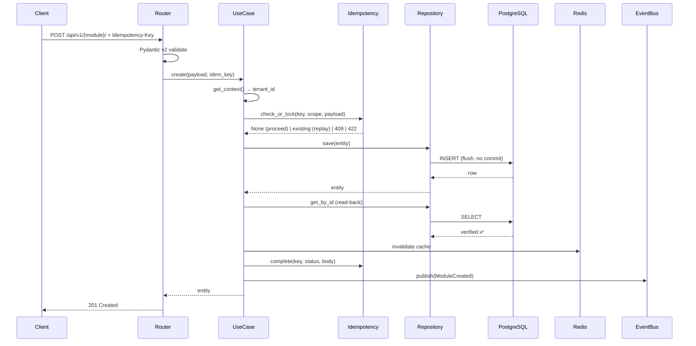
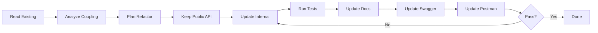
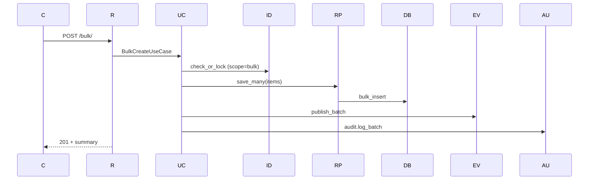
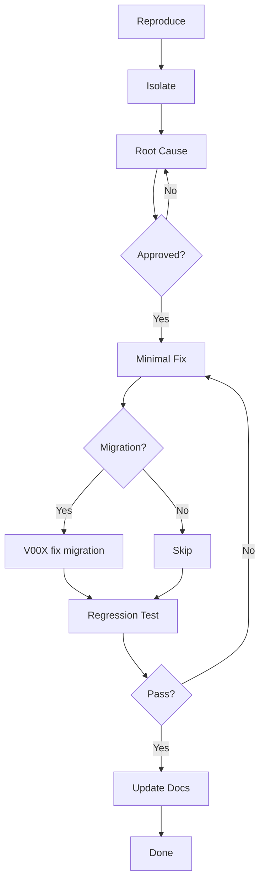
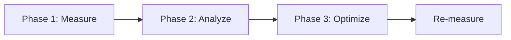

# 🎯 MASTER PROMPT TEMPLATE v5.0 — ฉบับสมบูรณ์ 100%

> **Stack:** Python 3.14+ · FastAPI · Pydantic v2 · SQLAlchemy 2.0 · PostgreSQL 17 · Redis 8 · Kafka
> **ขอบเขต:** ERP + CRM + IoT (Multi-company, 65 modules / 8 layers)
> **อัปเดต v5.0:** เพิ่ม **SQL/Migration/Routing/Docs/Swagger/Postman** ครบทุกงาน

---

# 📋 สารบัญ

| # | ส่วน | คำอธิบาย |
|---|---|---|
| **0** | [Global Constraints](#0-global-constraints) | กฎบังคับทุก prompt |
| **1** | [Master Structure](#1-master-structure--23-ส่วนบังคับ) | 23 ส่วนบังคับ |
| **2** | [Task Templates A–G](#2-task-templates-ag) | 7 ประเภทงาน × 23 ส่วน |
| **3** | [SQL & Migration Block](#3-sql--migration-block) | SQL, Migration, Rollback |
| **4** | [Routing Block](#4-routing-block) | Router registration |
| **5** | [Docs / Swagger / Postman Block](#5-docs--swagger--postman-block) | เอกสาร 3 ระบบ |
| **6** | [Report Templates](#6-report-templates) | 4 รูปแบบรายงาน |
| **7** | [Checklists](#7-checklists) | DoD + TDD + Security + SQL |
| **8** | [Cheatsheet](#8-quick-command-cheatsheet) | คำสั่งด่วน |

---

# 0. Global Constraints

```markdown
[GLOBAL CONSTRAINTS]
- ห้ามทักทาย / ห้ามสรุปสิ่งที่สั่ง / ห้ามอธิบายซ้ำ
- ตอบเฉพาะไฟล์ใน "Output Scope" เท่านั้น
- โค้ดเต็ม Production-ready ห้าม `# ...` หรือ `// ... code here`
- ห้ามแตะไฟล์นอก Scope (ถ้าจำเป็น → ประกาศ SIDE-EFFECT WARNING ก่อน)
- คอมเมนต์ 2 ภาษา (ไทย + English) สั้น กระชับ
- Error handling:
  • Use Case   → 3-branch (StandardException → DomainError → Exception)
  • Repository → 2-branch (StandardException → Exception)
  • Cache      → never-raise (log + return None/False)
- Type hints ครบ / Pydantic v2 / SQLAlchemy 2.0 async
- ใช้ `Decimal` เท่านั้น (ห้าม float กับเงิน/สต็อก)
- ใช้ `flush()` ห้าม `commit()` ใน Repository
- SQL ต้องมี: V001 create + V002 seed + V003 rollback + RLS policy
- Routing ต้อง register ที่: `app/routes.py` + `presentation/routers.py`
- Docs ต้องส่ง: README + OpenAPI/Swagger + Postman + AsyncAPI (ถ้ามี WS)
- ข้อมูลไม่พอ → ถาม 1 คำถาม ห้ามเดา
- Path: `app/modules/{module}/{layer}/{file}.py`
```

---

# 1. Master Structure — 23 ส่วนบังคับ

> ทุก Prompt ต้องมี 23 ส่วนนี้เรียงตามลำดับ (ส่วนไหน N/A → เขียน "N/A" ไม่ต้องลบ)

```markdown
## 01. รายละเอียด (Details)
## 02. หลักการทำงาน (Concept / Behavior Spec)
## 03. ข้อกำหนด (Requirements)
## 04. เป้าหมาย (Target)
## 05. ขอบเขต (Scope)
## 06. โครงสร้าง Folder + ไฟล์
## 07. Workflow การทำงาน
## 08. Affected Areas
## 09. รายการกระบวนการทำงาน
## 10. Performance Considerations
## 11. TDD Plan
## 12. ข้อห้าม (Prohibitions)
## 13. ข้อควรระวัง (Cautions)
## 14. ข้อดี (Pros)
## 15. ข้อเสีย (Cons)
## 16. Checklist การทดสอบ
## 17. SQL & Migration Plan        ← 🆕
## 18. Routing Registration         ← 🆕
## 19. Documentation Package        ← 🆕
## 20. Swagger / OpenAPI Spec       ← 🆕
## 21. Postman Collection           ← 🆕
## 22. สรุป (Summary)
## 23. รายงานสรุปผลการดำเนินการ
```

---

# 2. Task Templates A–G

---

## 🎯 TEMPLATE A: สร้างใหม่ (CREATE NEW)

### 🧭 01. รายละเอียด

| หัวข้อ | ค่า |
|---|---|
| **Task Type** | `CREATE_NEW` |
| **Module** | `[inventory]` |
| **Layer** | `[0-Core / 1-Foundation / 2-Money / 3-Goods / 4-Ops / 5-Intel / 6-Monitor / 7-Template]` |
| **Stack** | `[FastAPI / Django / Both]` |
| **Priority** | `🔴 / 🟠 / 🟡` |
| **Phase** | `[1-6]` |
| **Prefix** | `[3 chars]` |
| **Dependencies** | `[module list]` |
| **Tables** | `tenant_{tid}.[table]` |
| **Endpoints** | `/api/v1/[module]/` |
| **Events** | `[ModuleCreated, ModuleUpdated, ...]` |
| **Migration Files** | `V001__create_{module}.sql`, `V002__seed`, `V003__rollback` |

### 🧠 02. หลักการทำงาน

```markdown
### Domain Concept
- Entity: [name + invariants]
- Value Objects: [list]
- Enums: [list]
- Domain Events: [list]

### Behavior
- [Flow หลัก 3-5 ข้อ]
- [Business rules]

### State Machine
DRAFT → CONFIRMED → FULFILLED → INVOICED → CANCELLED
```

### 📋 03. ข้อกำหนด (Requirements)

```markdown
### Functional
- [ ] feature 1
- [ ] feature 2

### Non-Functional
- [ ] p95 < 200ms
- [ ] Idempotent
- [ ] Audit log
- [ ] Multi-tenant (schema + RLS)
- [ ] Read-back verification

### SQL Requirements
- [ ] V001 create tables + indexes + RLS
- [ ] V002 seed system roles / default data
- [ ] V003 rollback (DROP ทุกอย่าง)
- [ ] Trigger updated_at
- [ ] Constraint (CHECK, UNIQUE, FK)
- [ ] Sequence (ถ้าต้องการ running number)

### Routing Requirements
- [ ] ลงทะเบียน router ใน `app/routes.py`
- [ ] ลงทะเบียน model ใน `migrations/env.py`
- [ ] ตรวจสอบ prefix `/api/v1/{module}`

### Docs Requirements
- [ ] README_{module}.md
- [ ] OpenAPI metadata (summary, description, tags, examples)
- [ ] Postman collection สมบูรณ์
- [ ] AsyncAPI (ถ้ามี WS)
```

### 🎯 04. เป้าหมาย

```markdown
- ✅ Domain บริสุทธิ์ (ไม่ import framework)
- ✅ Error handling 3/2/never
- ✅ Tests ครบ 4 ประเภท
- ✅ SQL ครบ 3 ไฟล์ + RLS
- ✅ Routing ลงทะเบียนครบ
- ✅ Docs + Swagger + Postman
- ✅ พร้อมรัน
```

### 🔲 05. ขอบเขต

```markdown
### In-Scope
- Domain / Application / Infrastructure / Presentation
- SQL Migrations (V001/V002/V003)
- Tests (unit/integration/property/manual)
- Docs (README + Swagger + Postman)
- Routing registration

### Out-of-Scope
- [UI, notification, ...]
```

### 📁 06. โครงสร้าง Folder + ไฟล์ (23 ไฟล์)

```
app/modules/{module}/
├── domain/                (6 ไฟล์)
│   ├── __init__.py
│   ├── entities.py
│   ├── value_objects.py
│   ├── enums.py
│   ├── events.py
│   └── exceptions.py
├── application/           (6 ไฟล์)
│   ├── __init__.py
│   ├── interfaces.py
│   ├── use_cases.py
│   ├── mappers.py
│   ├── exceptions.py
│   └── utils.py
├── infrastructure/        (5 ไฟล์)
│   ├── __init__.py
│   ├── models.py
│   ├── repositories.py
│   ├── caches.py
│   └── services.py
└── presentation/          (5 ไฟล์)
    ├── __init__.py
    ├── routers.py
    ├── schemas.py
    ├── docs.py
    └── dependencies.py

db/migrations/             (3 ไฟล์)
├── V001__create_{module}.sql
├── V002__seed_{module}.sql
└── V003__rollback_{module}.sql

tests/                     (4 ไฟล์)
├── unit/test_{module}.py
├── integration/test_{module}_repository.py
├── property/test_{module}_invariants.py
└── manual/manual_test_{module}.md

docs/                      (4 ไฟล์) 🆕
├── README_{module}.md
├── API_{module}.md
├── postman/{module}.postman_collection.json
└── asyncapi_{module}.yaml (ถ้ามี WS)

app/routes.py              (แก้ 1 บรรทัด) 🆕
migrations/env.py          (แก้ 1 import) 🆕

═══ รวม 40 ไฟล์ ═══
```

### 🔄 07. Workflow



### 🌐 08. Affected Areas

| ส่วน | ไฟล์ | ผลกระทบ | Action |
|---|---|---|---|
| Router | `app/routes.py` | +1 บรรทัด | `include_router(module.router)` |
| Migration env | `migrations/env.py` | +1 import | `from app.modules.{module}.infrastructure.models import *` |
| Shared | `app/modules/shared/` | reuse | ใช้ BaseEntity, StandardException |
| Audit | `audit` module | เรียกใช้ | `audit.log(action, resource_id)` |
| Events | `events` module | เรียกใช้ | `events.publish(name, payload)` |
| Idempotency | `idempotency` module | เรียกใช้ | `check_or_lock()` / `complete()` |

### 📝 09. รายการกระบวนการทำงาน

```markdown
1. Client → POST + Idempotency-Key
2. Router → Pydantic v2 validate
3. UseCase → get_context() → tenant_id
4. Idempotency → check_or_lock()
   ├─ existing + COMPLETED + hash ตรง → replay (return)
   ├─ existing + COMPLETED + hash ต่าง → 422
   ├─ existing + IN_PROGRESS → 409
   └─ new → lock + proceed
5. UseCase → Domain entity (validate)
6. Repository → save() → flush
7. UseCase → read-back verify
8. Cache → invalidate
9. Idempotency → complete(key, status, body)
10. Audit → log()
11. EventBus → publish()
12. Router → 201 + response
```

### ⚡ 10. Performance Considerations

| จุด | มาตรการ | Target |
|---|---|---|
| DB Query | `selectinload()` แทน lazy | ≤ 5 queries/req |
| Index | composite ตาม query pattern | p95 < 200ms |
| Cache | cache-aside TTL 300s | hit rate > 80% |
| Pool | pool_size=20, overflow=10 | wait < 50ms |
| Serialize | orjson | 2x เร็วกว่า json |
| Concurrency | async ทุก layer | 100+ rps |

### 🧪 11. TDD Plan

```python
# ─── STEP 1: RED ─────────────────────────
def test_create_valid():          ...
def test_create_duplicate_raises(): ...
def test_invariant_total():        ...
def test_property_non_negative(): ...

# ─── STEP 2: GREEN ──────────────────────
# ─── STEP 3: REFACTOR ───────────────────
```

| ประเภท | ไฟล์ | เครื่องมือ |
|---|---|---|
| Unit | `test_{module}.py` | pytest |
| Integration | `test_{module}_repository.py` | testcontainers |
| Property | `test_{module}_invariants.py` | hypothesis |
| Manual | `manual_test_{module}.md` | checklist |

### 🚫 12. ข้อห้าม

```markdown
❌ ห้าม import framework ใน domain/
❌ ห้าม commit() ใน Repository (ใช้ flush())
❌ ห้าม raise ใน Cache
❌ ห้าม float กับเงิน/สต็อก
❌ ห้าม hardcode secret
❌ ห้าม UPDATE/DELETE ใน audit/event store
❌ ห้าม query ข้าม tenant
❌ ห้ามลบ migration V001-V003 ที่ commit แล้ว
❌ ห้ามใช้ CREATE TABLE IF NOT EXISTS ใน migration หลัก
```

### ⚠️ 13. ข้อควรระวัง

```markdown
⚠️ Concurrency → lock key ก่อน execute
⚠️ Idempotency → hash payload ต้องตรง
⚠️ Multi-tenant → schema switch atomic
⚠️ Migration → backward-compatible
⚠️ Timezone → UTC ทุกที่
⚠️ N+1 → ตรวจสอบด้วย SQLAlchemy events
⚠️ RLS policy → ต้อง enable + create policy
⚠️ Routing → ต้องลงทะเบียนก่อนรัน
```

### ✅ 14. ข้อดี / ❌ 15. ข้อเสีย

| ✅ Pros | ❌ Cons |
|---|---|
| Domain บริสุทธิ์ | ไฟล์เยอะ (40 ไฟล์/module) |
| Layer แยกชัด | Learning curve สูง |
| Idempotent | Latency +20ms จาก read-back |
| Audit + Event | Memory สูงจาก cache |
| Multi-tenant ปลอดภัย | Setup เยอะ (SQL + Routing + Docs) |

### ✔️ 16. Checklist การทดสอบ

```markdown
### Pre-flight
- [ ] อ่าน spec ครบ
- [ ] ตรวจ shared/ ที่ reuse
- [ ] ตรวจ dependency

### Domain
- [ ] Entity ผ่าน invariants
- [ ] VO validate __post_init__
- [ ] ไม่ import framework

### Application
- [ ] 3-branch error
- [ ] Idempotency ครบ
- [ ] Read-back verify

### Infrastructure
- [ ] 2-branch repo
- [ ] never-raise cache

### SQL
- [ ] V001 create + index + RLS
- [ ] V002 seed
- [ ] V003 rollback
- [ ] Test migration ผ่าน

### Routing
- [ ] register `app/routes.py`
- [ ] import `migrations/env.py`

### Docs
- [ ] README
- [ ] Swagger metadata
- [ ] Postman collection

### Tests
- [ ] Unit ≥ 8
- [ ] Integration ผ่าน
- [ ] Property 100 iter
- [ ] Manual 8 scenarios
```

---

### 🗄️ 17. SQL & Migration Plan

> **บังคับ 3 ไฟล์ + RLS + Trigger + Index**

#### 📄 `db/migrations/V001__create_{module}.sql`

```sql
-- ═══════════════════════════════════════════════════════════════
-- V001__create_{module}.sql
-- Module: {module} | Prefix: {prefix} | Layer: {layer}
-- Description: สร้างตาราง + index + RLS policy + trigger
-- ═══════════════════════════════════════════════════════════════

BEGIN;

-- ─── 1. Sequence (ถ้าต้องการ running number) ──────────────
CREATE SEQUENCE IF NOT EXISTS {prefix}_number_seq START 1;

-- ─── 2. Main Table ────────────────────────────────────────
CREATE TABLE tenant_{prefix}.{module}s (
    id              UUID PRIMARY KEY DEFAULT gen_random_uuid(),
    tenant_id       UUID NOT NULL,
    code            VARCHAR(50) NOT NULL,
    name            VARCHAR(200) NOT NULL,
    status          VARCHAR(20) NOT NULL DEFAULT 'ACTIVE',
    amount          NUMERIC(15,2) NOT NULL DEFAULT 0,
    metadata        JSONB NOT NULL DEFAULT '{}'::jsonb,
    version         INTEGER NOT NULL DEFAULT 1,
    created_at      TIMESTAMPTZ NOT NULL DEFAULT NOW(),
    updated_at      TIMESTAMPTZ NOT NULL DEFAULT NOW(),
    deleted_at      TIMESTAMPTZ,
    
    CONSTRAINT uq_{module}_code UNIQUE (tenant_id, code),
    CONSTRAINT ck_{module}_amount CHECK (amount >= 0),
    CONSTRAINT ck_{module}_status CHECK (status IN ('ACTIVE','INACTIVE','ARCHIVED'))
);

-- ─── 3. Index ─────────────────────────────────────────────
CREATE INDEX ix_{module}_tenant_status 
    ON tenant_{prefix}.{module}s(tenant_id, status) 
    WHERE deleted_at IS NULL;
CREATE INDEX ix_{module}_code 
    ON tenant_{prefix}.{module}s(code);
CREATE INDEX ix_{module}_created 
    ON tenant_{prefix}.{module}s(created_at DESC);

-- ─── 4. Trigger updated_at ────────────────────────────────
CREATE OR REPLACE FUNCTION public.set_updated_at()
RETURNS TRIGGER AS $$
BEGIN
    NEW.updated_at = NOW();
    RETURN NEW;
END;
$$ LANGUAGE plpgsql;

CREATE TRIGGER trg_{module}_updated_at
    BEFORE UPDATE ON tenant_{prefix}.{module}s
    FOR EACH ROW EXECUTE FUNCTION public.set_updated_at();

-- ─── 5. RLS (Row-Level Security) ──────────────────────────
ALTER TABLE tenant_{prefix}.{module}s ENABLE ROW LEVEL SECURITY;

CREATE POLICY p_{module}_tenant ON tenant_{prefix}.{module}s
    USING (tenant_id = current_setting('app.current_tenant', true)::uuid);

-- ─── 6. Sub Tables (ถ้ามี) ────────────────────────────────
-- CREATE TABLE tenant_{prefix}.{module}_lines (...)

COMMIT;
```

#### 📄 `db/migrations/V002__seed_{module}.sql`

```sql
-- ═══════════════════════════════════════════════════════════════
-- V002__seed_{module}.sql
-- Description: seed ข้อมูลเริ่มต้น (system roles, defaults)
-- ═══════════════════════════════════════════════════════════════

BEGIN;

-- ─── Seed system config (ถ้ามี) ───────────────────────────
INSERT INTO tenant_{prefix}.{module}s 
    (tenant_id, code, name, status, amount)
VALUES
    ('00000000-0000-0000-0000-000000000001', 'SYS-DEFAULT', 'System Default', 'ACTIVE', 0)
ON CONFLICT (tenant_id, code) DO NOTHING;

-- ─── Seed related tables (roles, types, ...) ──────────────
-- INSERT INTO tenant_{prefix}.{module}_types ...

COMMIT;
```

#### 📄 `db/migrations/V003__rollback_{module}.sql`

```sql
-- ═══════════════════════════════════════════════════════════════
-- V003__rollback_{module}.sql
-- Description: ย้อนกลับทุกอย่าง (DROP)
-- ⚠️ ใช้ในกรณี rollback เท่านั้น
-- ═══════════════════════════════════════════════════════════════

BEGIN;

-- ─── Drop triggers ────────────────────────────────────────
DROP TRIGGER IF EXISTS trg_{module}_updated_at ON tenant_{prefix}.{module}s;

-- ─── Drop policies ────────────────────────────────────────
DROP POLICY IF EXISTS p_{module}_tenant ON tenant_{prefix}.{module}s;

-- ─── Drop tables (CASCADE) ────────────────────────────────
DROP TABLE IF EXISTS tenant_{prefix}.{module}_lines CASCADE;
DROP TABLE IF EXISTS tenant_{prefix}.{module}s CASCADE;

-- ─── Drop sequence ────────────────────────────────────────
DROP SEQUENCE IF EXISTS {prefix}_number_seq;

COMMIT;
```

#### 📄 Update `migrations/env.py`

```python
# ═══════════════════════════════════════════════════════════════
# migrations/env.py — Alembic target_metadata
# ⚠️ ต้อง import ทุก model ก่อน autogenerate
# ═══════════════════════════════════════════════════════════════

from app.modules.{module}.infrastructure.models import (
    {Module}Model,
    # {Module}LineModel,
)
```

#### 📄 Update `scripts/apply_migrations.sh` (ถ้ามี)

```bash
#!/usr/bin/env bash
# Apply migrations in order
psql "$DATABASE_URL" -f db/migrations/V001__create_{module}.sql
psql "$DATABASE_URL" -f db/migrations/V002__seed_{module}.sql
# rollback only if needed: V003
```

---

### 🌐 18. Routing Registration

#### 📄 Update `app/routes.py`

```python
# ═══════════════════════════════════════════════════════════════
# app/routes.py — Central router registration
# ═══════════════════════════════════════════════════════════════

from fastapi import APIRouter

from app.modules.{module}.presentation.routers import router as {module}_router
# ... other modules

api_router = APIRouter(prefix="/api/v1")

# ─── Layer 0: Core ────────────────────────────────────────
api_router.include_router(events_router)
api_router.include_router(audit_router)

# ─── Layer N: {Layer Name} ────────────────────────────────
api_router.include_router({module}_router)  # ← 🆕 เพิ่มบรรทัดนี้

# ─── Root ─────────────────────────────────────────────────
router = APIRouter()
router.include_router(api_router)
router.include_router(health_router)
```

#### 📄 `presentation/routers.py` (ตรวจสอบ prefix)

```python
router = APIRouter(
    prefix="/{module}",         # ← ต้องตรงกับ /api/v1/{module}
    tags=["{Module}"],
)
```

#### ✅ Routing Checklist

```markdown
- [ ] import router ใน `app/routes.py`
- [ ] `include_router({module}_router)` อยู่ layer ถูก
- [ ] prefix ไม่ซ้ำกับ module อื่น
- [ ] tags ถูกต้อง (แสดงใน Swagger)
- [ ] เปิด `http://localhost:8000/docs` → เห็น endpoint ใหม่
- [ ] เปิด `http://localhost:8000/openapi.json` → เห็น schema
```

---

### 📚 19. Documentation Package

#### 📄 `docs/README_{module}.md`

```markdown
# Module: {module}

> **Layer:** {layer} · **Prefix:** {prefix} · **Version:** 1.0.0

## 🎯 Purpose
[อธิบายวัตถุประสงค์ 2-3 บรรทัด]

## 🏗️ Architecture

\`\`\`mermaid
flowchart LR
    C[Client] --> R[Router]
    R --> UC[UseCase]
    UC --> RP[Repository]
    UC --> CX[Cache]
    UC --> EV[EventBus]
    RP --> DB[(PostgreSQL)]
    CX --> RD[(Redis)]
\`\`\`

## 📦 Dependencies
| Module | Reason |
|---|---|
| tenant_context | Multi-tenant |
| audit | ทุก action |
| idempotency | ทุก mutating |
| events | Domain events |

## 🗄️ Database Schema
| Table | Columns | Indexes |
|---|---|---|
| `tenant_{prefix}.{module}s` | id, tenant_id, code, name, ... | uq_code, ix_status |

## 🔌 API Endpoints
| Method | Path | Auth | Description |
|---|---|---|---|
| POST | `/api/v1/{module}/` | user | Create |
| GET | `/api/v1/{module}/` | user | List |
| GET | `/api/v1/{module}/{id}/` | user | Get |
| PATCH | `/api/v1/{module}/{id}/` | user | Update |
| DELETE | `/api/v1/{module}/{id}/` | admin | Soft delete |

## 🔐 Permissions
| Role | Permissions |
|---|---|
| admin | `{module}:*` |
| manager | `{module}:read`, `{module}:create` |
| staff | `{module}:read` |

## 📊 Domain Events
| Event | Trigger | Payload |
|---|---|---|
| `{Module}Created` | สร้างสำเร็จ | {id, code, ...} |
| `{Module}Updated` | แก้ไข | {id, changes} |
| `{Module}Deleted` | ลบ | {id} |

## ⚙️ Environment Variables
| Key | Default | Description |
|---|---|---|
| `{MODULE}_TTL_SECONDS` | 3600 | Cache TTL |
| `{MODULE}_MAX_RETRY` | 3 | Retry count |

## 🚀 Setup
\`\`\`bash
# 1. Apply migration
psql $DATABASE_URL -f db/migrations/V001__create_{module}.sql

# 2. Run
uvicorn app.app:app --reload

# 3. Test
pytest tests/unit/test_{module}.py -v
\`\`\`

## 🧪 Testing
\`\`\`bash
pytest tests/unit/test_{module}.py -v
pytest tests/integration/test_{module}_repository.py -v
pytest tests/property/test_{module}_invariants.py -v
\`\`\`

## 📖 Usage Example
\`\`\`bash
curl -X POST http://localhost:8000/api/v1/{module}/ \\
  -H "Content-Type: application/json" \\
  -H "Idempotency-Key: $(uuidgen)" \\
  -b cookies.txt \\
  -d '{"code": "TEST-001", "name": "Test"}'
\`\`\`

## ⚠️ Known Limitations
- Cache TTL 300s → อาจ stale
- Cross-worker WS ไม่รองรับ

## 🔄 Changelog
- **1.0.0** (YYYY-MM-DD) — Initial release
```

#### 📄 `docs/API_{module}.md`

```markdown
# API Reference — {module}

## POST /api/v1/{module}/

**Create {module}**

### Request Headers
| Header | Required | Description |
|---|---|---|
| Content-Type | ✅ | `application/json` |
| Idempotency-Key | ✅ | UUID v4 |
| Cookie | ✅ | `access_token` |

### Request Body
\`\`\`json
{
  "code": "TEST-001",
  "name": "Test {Module}",
  "amount": "100.00",
  "metadata": {}
}
\`\`\`

### Response 201
\`\`\`json
{
  "success": true,
  "details": {
    "data": {
      "id": "550e8400-...",
      "code": "TEST-001",
      "name": "Test {Module}",
      "created_at": "2025-01-15T10:30:00Z"
    }
  }
}
\`\`\`

### Error Codes
| Code | Meaning |
|---|---|
| 400 | Validation error |
| 401 | Unauthorized |
| 409 | Conflict (duplicate code) |
| 422 | Idempotency mismatch |

## GET /api/v1/{module}/ ...

(ทำซ้ำสำหรับทุก endpoint)
```

---

### 🔷 20. Swagger / OpenAPI Spec

#### 📄 `presentation/docs.py`

```python
"""OpenAPI metadata — ข้อมูล OpenAPI"""

from app.modules.{module}.presentation.schemas import (
    {Module}Create,
    {Module}Response,
    {Module}Query,
)

# ─── Tags ─────────────────────────────────────────────────
router_tags = [
    {
        "name": "{Module}",
        "description": "จัดการ {module} ทั้งหมด (CRUD + search)",
        "externalDocs": {
            "description": "README",
            "url": "https://docs.example.com/{module}",
        },
    }
]

# ─── Response Examples ────────────────────────────────────
RESPONSE_CREATE_201 = {
    "description": "สร้างสำเร็จ",
    "content": {
        "application/json": {
            "example": {
                "success": True,
                "details": {
                    "data": {
                        "id": "550e8400-e29b-41d4-a716-446655440000",
                        "code": "TEST-001",
                        "name": "Test",
                        "status": "ACTIVE",
                        "created_at": "2025-01-15T10:30:00Z",
                    }
                },
            }
        }
    },
}

RESPONSE_ERROR_400 = {
    "description": "Validation error",
    "content": {
        "application/json": {
            "example": {
                "success": False,
                "error": {
                    "code": "VALIDATION_ERROR",
                    "message": "Field 'code' is required",
                },
            }
        }
    },
}
```

#### 📄 `presentation/routers.py` (ปรับแต่ง OpenAPI)

```python
from fastapi import APIRouter, Depends, Header, status

from app.modules.{module}.presentation.docs import (
    RESPONSE_CREATE_201,
    RESPONSE_ERROR_400,
)

router = APIRouter(prefix="/{module}", tags=["{Module}"])


@router.post(
    "/",
    status_code=status.HTTP_201_CREATED,
    summary="สร้าง {module}",
    description="สร้าง {module} ใหม่ พร้อม idempotency protection",
    response_description="ข้อมูล {module} ที่สร้างสำเร็จ",
    responses={
        201: RESPONSE_CREATE_201,
        400: RESPONSE_ERROR_400,
        409: {"description": "Conflict — code ซ้ำ"},
        422: {"description": "Idempotency mismatch"},
    },
    operation_id="create_{module}",
)
async def create_{module}(
    payload: {Module}Create,
    idem_key: str = Header(..., alias="Idempotency-Key", description="UUID v4"),
    use_cases = Depends(get_{module}_use_cases),
):
    """สร้าง {module} — Create."""
    ...


@router.get(
    "/",
    summary="แสดงรายการ {module}",
    description="รายการ paginated พร้อม filter/sort",
    operation_id="list_{module}",
)
async def list_{module}s(...): ...


@router.get(
    "/{id}/",
    summary="ดูรายละเอียด {module}",
    operation_id="get_{module}",
)
async def get_{module}(...): ...


@router.patch(
    "/{id}/",
    summary="แก้ไข {module}",
    operation_id="update_{module}",
)
async def update_{module}(...): ...


@router.delete(
    "/{id}/",
    summary="ลบ {module} (soft delete)",
    operation_id="delete_{module}",
)
async def delete_{module}(...): ...
```

#### ✅ Swagger Checklist

```markdown
- [ ] Summary + description ทุก endpoint
- [ ] operation_id ไม่ซ้ำ
- [ ] responses ระบุ 400/401/404/409/422
- [ ] Request/Response example
- [ ] Tag ตรงกับ module name
- [ ] เปิด /docs → เห็นครบ
- [ ] เปิด /redoc → render ถูก
- [ ] /openapi.json → schema ถูกต้อง
```

---

### 📮 21. Postman Collection

#### 📄 `docs/postman/{module}.postman_collection.json`

```json
{
  "info": {
    "_postman_id": "{{$guid}}",
    "name": "ERPIoT — {Module}",
    "description": "Collection สำหรับ module {module}",
    "schema": "https://schema.getpostman.com/json/collection/v2.1.0/collection.json"
  },
  "variable": [
    { "key": "base_url", "value": "http://localhost:8000" },
    { "key": "admin_email", "value": "", "type": "secret" },
    { "key": "admin_password", "value": "", "type": "secret" },
    { "key": "{module}_id", "value": "" }
  ],
  "item": [
    {
      "name": "Auth",
      "item": [
        {
          "name": "Login",
          "event": [{
            "listen": "test",
            "script": {
              "type": "text/javascript",
              "exec": [
                "pm.test('200 OK', () => pm.response.to.have.status(200));",
                "pm.test('Cookies set', () => {",
                "  pm.expect(pm.cookies.has('access_token')).to.be.true;",
                "  pm.expect(pm.cookies.has('refresh_token')).to.be.true;",
                "});"
              ]
            }
          }],
          "request": {
            "method": "POST",
            "header": [
              { "key": "Content-Type", "value": "application/x-www-form-urlencoded" }
            ],
            "body": {
              "mode": "urlencoded",
              "urlencoded": [
                { "key": "grant_type", "value": "password" },
                { "key": "username", "value": "{{admin_email}}" },
                { "key": "password", "value": "{{admin_password}}" }
              ]
            },
            "url": {
              "raw": "{{base_url}}/api/v1/authentication/login/",
              "host": ["{{base_url}}"],
              "path": ["api", "v1", "authentication", "login", ""]
            }
          }
        }
      ]
    },
    {
      "name": "{Module}",
      "item": [
        {
          "name": "Create {Module}",
          "event": [{
            "listen": "test",
            "script": {
              "type": "text/javascript",
              "exec": [
                "pm.test('201 Created', () => pm.response.to.have.status(201));",
                "const data = pm.response.json()?.details?.data;",
                "if (data?.id) {",
                "  pm.collectionVariables.set('{module}_id', data.id);",
                "  console.log('{module}_id =', data.id);",
                "}"
              ]
            }
          }],
          "request": {
            "method": "POST",
            "header": [
              { "key": "Content-Type", "value": "application/json" },
              { "key": "Idempotency-Key", "value": "{{$guid}}" }
            ],
            "body": {
              "mode": "raw",
              "raw": "{\n  \"code\": \"TEST-001\",\n  \"name\": \"Test {Module}\",\n  \"amount\": \"100.00\"\n}",
              "options": { "raw": { "language": "json" } }
            },
            "url": {
              "raw": "{{base_url}}/api/v1/{module}/",
              "host": ["{{base_url}}"],
              "path": ["api", "v1", "{module}", ""]
            }
          }
        },
        {
          "name": "List {Module}s",
          "event": [{
            "listen": "test",
            "script": {
              "type": "text/javascript",
              "exec": [
                "pm.test('200 OK', () => pm.response.to.have.status(200));",
                "const items = pm.response.json()?.details?.data?.items ?? [];",
                "if (items.length > 0 && !pm.collectionVariables.get('{module}_id')) {",
                "  pm.collectionVariables.set('{module}_id', items[0].id);",
                "}"
              ]
            }
          }],
          "request": {
            "method": "GET",
            "url": {
              "raw": "{{base_url}}/api/v1/{module}/?page=1&limit=10&sort_by=created_at&sort_order=desc",
              "host": ["{{base_url}}"],
              "path": ["api", "v1", "{module}", ""],
              "query": [
                { "key": "page", "value": "1" },
                { "key": "limit", "value": "10" },
                { "key": "sort_by", "value": "created_at" },
                { "key": "sort_order", "value": "desc" }
              ]
            }
          }
        },
        {
          "name": "Get {Module} by ID",
          "request": {
            "method": "GET",
            "url": "{{base_url}}/api/v1/{module}/{{module_id}}/"
          }
        },
        {
          "name": "Update {Module}",
          "request": {
            "method": "PATCH",
            "header": [{ "key": "Content-Type", "value": "application/json" }],
            "body": {
              "mode": "raw",
              "raw": "{\n  \"name\": \"Updated name\"\n}",
              "options": { "raw": { "language": "json" } }
            },
            "url": "{{base_url}}/api/v1/{module}/{{module_id}}/"
          }
        },
        {
          "name": "Delete {Module}",
          "request": {
            "method": "DELETE",
            "url": "{{base_url}}/api/v1/{module}/{{module_id}}/"
          }
        }
      ]
    },
    {
      "name": "Health",
      "item": [
        {
          "name": "Liveness",
          "request": { "method": "GET", "url": "{{base_url}}/health/" }
        },
        {
          "name": "Readiness",
          "request": { "method": "GET", "url": "{{base_url}}/health/ready/" }
        }
      ]
    }
  ]
}
```

#### ✅ Postman Checklist

```markdown
- [ ] Login endpoint ทำงาน (cookies ถูกเก็บ)
- [ ] Create → auto-save id ไป collection variables
- [ ] List → pagination ครบ
- [ ] Get → ใช้ {{module_id}}
- [ ] Update → PATCH
- [ ] Delete → soft delete
- [ ] Test scripts ทุก request
- [ ] Health check
- [ ] รัน Collection Runner → ผ่านทั้งหมด
```

---

### 📊 22. สรุป (Summary)

```markdown
### สรุป Module {module}
| รายการ | จำนวน |
|---|---|
| ไฟล์ Python | 22 |
| ไฟล์ SQL | 3 |
| ไฟล์ Test | 4 |
| ไฟล์ Docs | 4 |
| ไฟล์ Routing (แก้) | 2 |
| **รวม** | **35** |
| Endpoints | 5 |
| Tables | 1 (+ sub) |
| Events | 3 |
| Dependencies | {n} |
```

### 📈 23. รายงานสรุปผลการดำเนินการ

```markdown
# 📋 Report — CREATE_NEW / {module}

**วันที่:** YYYY-MM-DD HH:MM
**Commit:** {hash}

## ✅ สรุปผล
| รายการ | สถานะ | หมายเหตุ |
|---|---|---|
| Domain | ✅ | 6 ไฟล์ |
| Application | ✅ | 6 ไฟล์ |
| Infrastructure | ✅ | 5 ไฟล์ |
| Presentation | ✅ | 5 ไฟล์ |
| **SQL Migrations** | ✅ | V001/V002/V003 |
| **Routing** | ✅ | routes.py + env.py |
| **Docs** | ✅ | README + API |
| **Swagger** | ✅ | /docs + /redoc |
| **Postman** | ✅ | collection สมบูรณ์ |
| Tests | ✅ | 4 ประเภท |

## 📈 Metrics
| Metric | ค่า | Target | ผ่าน? |
|---|---|---|---|
| LOC | 1,234 | — | — |
| Coverage | 92% | ≥ 80% | ✅ |
| Queries/req | 4 | ≤ 5 | ✅ |
| p95 | 145ms | < 200ms | ✅ |
| Migration test | ✅ | ผ่าน | ✅ |
| Postman run | 12/12 | 100% | ✅ |

## 🧪 Tests
- Unit: 24 passed
- Integration: 12 passed
- Property: 100 iter ✅
- Manual: 8/8 ✅
- Postman: 12/12 ✅

## 🔗 Links
- Swagger: http://localhost:8000/docs
- Redoc: http://localhost:8000/redoc
- Postman: {collection_url}
- README: docs/README_{module}.md
```

---

## 🎯 TEMPLATE B: แก้ไขของเดิม (REFACTOR)

### 01. รายละเอียด

| หัวข้อ | ค่า |
|---|---|
| **Task Type** | `REFACTOR` |
| **Target Files** | `[list]` |
| **Reason** | `[refactor / rename / restructure]` |
| **Breaking Change** | `Yes / No` |
| **Migration Impact** | `None / New migration needed` |
| **Docs Impact** | `Update README / Swagger / Postman` |

### 07. Workflow



### 12. ข้อห้าม

```markdown
❌ ห้ามเปลี่ยน public signature
❌ ห้ามแตะ layer อื่น
❌ ห้าม refactor นอกจุดที่ระบุ
❌ ห้ามเพิ่ม feature ใหม่
❌ ห้ามลบ tests เดิม
❌ ห้ามแก้ migration V001-V003 ที่ commit แล้ว (สร้างใหม่ถ้าจำเป็น)
❌ ห้ามลบ Postman request เดิม
```

### 17. SQL & Migration (ถ้ามี)

```markdown
### ถ้าต้องเปลี่ยน Schema
- สร้าง `V00X__alter_{module}_{purpose}.sql`
- ต้อง backward-compatible
- มี rollback script
- Test migration ก่อน merge

### ถ้าไม่ต้องเปลี่ยน
- N/A
```

### 18. Routing (ถ้ามี)

```markdown
- ถ้าเปลี่ยน prefix → update `app/routes.py`
- ถ้าเปลี่ยน tags → update Swagger tags
- ถ้าเพิ่ม endpoint → เพิ่ม router ปกติ
```

### 19-21. Docs/Swagger/Postman

```markdown
- [ ] อัปเดต README (breaking changes)
- [ ] อัปเดต Swagger summary/description
- [ ] อัปเดต Postman (ถ้า request/response เปลี่ยน)
```

### 16. Checklist

```markdown
- [ ] Public interface เดิมยังใช้ได้
- [ ] Tests เดิมผ่าน 100%
- [ ] Coverage ไม่ลด
- [ ] Migration test ผ่าน (ถ้ามี)
- [ ] Postman Collection Runner ผ่าน
- [ ] Swagger render ถูก
- [ ] Performance ไม่ลด
```

---

## 🎯 TEMPLATE C: เพิ่ม/แก้ไขจากเดิม (EXTEND)

### 01. รายละเอียด

| หัวข้อ | ค่า |
|---|---|
| **Task Type** | `EXTEND` |
| **Module** | `[module]` |
| **Feature** | `[feature ใหม่]` |
| **Touch Points** | `[layer list]` |
| **New Endpoints** | `[list]` |
| **New Tables** | `[Yes / No]` |
| **New Migration** | `V00X__{action}.sql` |

### 06. Diff Plan

| ไฟล์ | Action | รายละเอียด |
|---|---|---|
| `domain/entities.py` | `+method` | `bulk_create()` |
| `application/use_cases.py` | `+class` | `BulkCreateUseCase` |
| `presentation/routers.py` | `+endpoint` | `POST /bulk/` |
| `presentation/schemas.py` | `+schema` | `BulkCreateRequest` |
| `presentation/dependencies.py` | `+factory` | `get_bulk_use_case` |
| `presentation/docs.py` | `+response` | `RESPONSE_BULK_201` |
| **`db/migrations/V004__add_bulk.sql`** | **`new`** | **index + column** |
| **`docs/API_{module}.md`** | **`+section`** | **Bulk endpoint** |
| **`docs/postman/{module}.json`** | **`+item`** | **Bulk request** |
| **`app/routes.py`** | **`unchanged`** | **prefix เดิม** |

### 07. Workflow



### 12. ข้อห้าม

```markdown
❌ ห้ามแก้ signature เดิม
❌ ห้ามแก้ UseCase เดิม (เพิ่ม class ใหม่)
❌ ห้ามแก้ V001-V003 (สร้าง V00X ใหม่)
❌ ห้ามรวม test ใหม่กับเดิม
❌ ห้ามแก้ Postman request เดิม
```

### 17. SQL & Migration (Extend)

#### 📄 `db/migrations/V004__add_bulk_{module}.sql`

```sql
BEGIN;

-- เพิ่ม column ใหม่ (backward-compatible)
ALTER TABLE tenant_{prefix}.{module}s
    ADD COLUMN IF NOT EXISTS bulk_group_id UUID;

-- เพิ่ม index
CREATE INDEX IF NOT EXISTS ix_{module}_bulk_group
    ON tenant_{prefix}.{module}s(bulk_group_id)
    WHERE bulk_group_id IS NOT NULL;

COMMIT;
```

#### 📄 `db/migrations/V005__rollback_bulk.sql`

```sql
BEGIN;
DROP INDEX IF EXISTS ix_{module}_bulk_group;
ALTER TABLE tenant_{prefix}.{module}s
    DROP COLUMN IF EXISTS bulk_group_id;
COMMIT;
```

### 18. Routing (Extend)

```python
# app/routes.py — ไม่ต้องแก้ (ใช้ router เดิม)

# presentation/routers.py
@router.post("/bulk/", status_code=201)
async def bulk_create(...): ...
```

### 19-21. Docs Update

```markdown
### README
- เพิ่ม section "Bulk Operations"
- ระบุ limit (เช่น ≤ 100 items)

### Swagger
- เพิ่ม response `RESPONSE_BULK_201`
- ระบุ `operation_id="bulk_create_{module}"`

### Postman
- เพิ่ม item "Bulk Create"
- Test script: expect 201 + array length
```

---

## 🎯 TEMPLATE D: แก้ Bug (BUGFIX)

### 01. รายละเอียด

| หัวข้อ | ค่า |
|---|---|
| **Task Type** | `BUGFIX` |
| **Severity** | `🔴 / 🟡 / 🟢` |
| **Env** | `dev / staging / prod` |
| **Migration Impact** | `None / New migration` |

### 02. Bug Report

```markdown
Symptom: [อาการ]
Steps: 1. ... 2. ...
Expected: [สิ่งที่ควรเกิด]
Actual: [สิ่งที่เกิด]
Stacktrace: [paste]
Related commit: [hash]
```

### 03. Hypothesis (STEP 1 — รออนุมัติ)

```markdown
1. Root Cause: [ไฟล์:บรรทัด + คำอธิบาย]
2. Contributing Factors: [...]
3. Fix Strategy: hotfix / proper fix / refactor
4. Migration needed? Yes/No
```

### 07. Workflow



### 12. ข้อห้าม

```markdown
❌ ห้าม refactor นอกจุด bug
❌ ห้ามเปลี่ยน behavior ที่ไม่ใช่ bug
❌ ห้ามแตะ > 3 ไฟล์โดยไม่ถาม
❌ ห้าม commit ก่อน regression test ผ่าน
❌ ห้ามลบข้อมูล production (ถ้าต้อง fix data → migration V00X)
```

### 17. SQL (ถ้าต้อง fix data)

```sql
-- V00X__fix_{module}_{bug_id}.sql
BEGIN;
-- Fix corrupted data
UPDATE tenant_{prefix}.{module}s
SET status = 'ACTIVE'
WHERE status IS NULL;
COMMIT;
```

### 22-23. Report — Report B (Bug Fix Report)

---

## 🎯 TEMPLATE E: ตรวจสอบความปลอดภัย (SECURITY AUDIT)

### 01. รายละเอียด

| หัวข้อ | ค่า |
|---|---|
| **Task Type** | `SECURITY_AUDIT` |
| **Target** | `[module / ทั้งระบบ]` |
| **Standard** | `OWASP Top 10 / ASVS L2` |
| **Mode** | `Read-only / Audit+Fix` |
| **Scope Includes** | `Code + SQL + Routing + Docs + Postman` 🆕 |

### 16. Output — ตารางเท่านั้น

| # | Risk | Layer | File:Line | Severity | CWE | แนะนำแก้ | Auto-fix |
|---|---|---|---|---|---|---|---|
| 1 | ... | ... | ... | 🔴 | CWE-XXX | ... | ✅ |

### Security Checklist (เพิ่ม SQL + Routing + Docs)

```markdown
#### A. Authentication & Authorization
- [ ] Nested JWT (JWS + JWE)
- [ ] Refresh token rotation
- [ ] RBAC ทุก endpoint
- [ ] Device ID binding

#### B. Input Validation
- [ ] Pydantic v2 strict
- [ ] SQL injection (ORM parameterized)
- [ ] Path traversal
- [ ] Mass assignment

#### C. Data Protection
- [ ] Encryption at rest (Fernet)
- [ ] TLS in transit
- [ ] PII masking ใน logs
- [ ] Secrets ใน vault

#### D. Multi-tenancy
- [ ] tenant_id ทุก query
- [ ] **RLS policy ทุกตาราง** 🆕
- [ ] Cross-tenant leakage test
- [ ] `current_setting('app.current_tenant')` ถูก set ทุก request

#### E. API Security
- [ ] Rate limiting
- [ ] CORS policy
- [ ] CSRF (BFF)
- [ ] Idempotency key
- [ ] **Request size limit** 🆕

#### F. Error Handling
- [ ] ไม่ leak stacktrace
- [ ] ไม่ log secret
- [ ] 404 vs 403

#### G. Dependencies
- [ ] pip-audit / safety
- [ ] Pinned versions
- [ ] Lockfile

#### H. SQL Security 🆕
- [ ] RLS enabled + forced
- [ ] FK ON DELETE ถูกต้อง
- [ ] ไม่ใช้ `SECURITY DEFINER` โดยไม่จำเป็น
- [ ] Search_path ปลอดภัย
- [ ] ไม่ grant สิทธิ์เกินจำเป็น

#### I. Documentation Security 🆕
- [ ] Swagger ปิดใน production
- [ ] Postman ไม่มี secret hardcode
- [ ] README ไม่มี internal IP

#### J. Routing Security 🆕
- [ ] ทุก mutating endpoint ต้อง auth
- [ ] Public endpoint อยู่ใน allowlist
- [ ] ไม่มี debug endpoint เปิด
```

### Security Report — Report C

---

## 🎯 TEMPLATE F: ทดสอบประสิทธิภาพ (PERFORMANCE)

### 01. รายละเอียด

| หัวข้อ | ค่า |
|---|---|
| **Task Type** | `PERF_TEST` |
| **Target** | `[endpoint / query]` |
| **SLO** | `p95 < X ms, > Y rps` |
| **Tool** | `locust / k6 / pytest-benchmark` |
| **SQL Analysis** | `EXPLAIN ANALYZE` 🆕 |

### 07. Workflow — 3 Phases



### 16. Metrics

| Metric | Tool | Target | Before | After |
|---|---|---|---|---|
| p50 | pytest-benchmark | < 50ms | ? | ? |
| p95 | locust | < 200ms | ? | ? |
| p99 | locust | < 500ms | ? | ? |
| RPS | locust | > 100 | ? | ? |
| DB queries/req | SQLAlchemy events | < 5 | ? | ? |
| **Seq scans** 🆕 | `EXPLAIN` | 0 | ? | ? |
| Cache hit | Redis INFO | > 80% | ? | ? |
| Memory/req | tracemalloc | < 10 MB | ? | ? |

### 17. SQL Optimization (ถ้าจำเป็น)

```sql
-- V00X__add_perf_index_{module}.sql
BEGIN;

-- Composite index สำหรับ query pattern
CREATE INDEX CONCURRENTLY IF NOT EXISTS ix_{module}_perf 
    ON tenant_{prefix}.{module}s(tenant_id, status, created_at DESC)
    WHERE deleted_at IS NULL;

COMMIT;
```

**ตรวจสอบด้วย `EXPLAIN ANALYZE`:**
```sql
EXPLAIN (ANALYZE, BUFFERS) 
SELECT * FROM tenant_{prefix}.{module}s
WHERE tenant_id = '...' AND status = 'ACTIVE'
ORDER BY created_at DESC LIMIT 10;
```

### 12. ข้อห้าม

```markdown
❌ ห้าม optimize ก่อน measure
❌ ห้าม premature optimization
❌ ห้าม merge โดยไม่มี before/after
❌ ถ้า SLO ผ่านแล้ว → หยุด
❌ ห้าม DROP index ใน production โดยไม่ตรวจ impact
❌ ห้ามใช้ `CREATE INDEX` (blocking) ใน production → ใช้ `CONCURRENTLY`
```

---

## 🎯 TEMPLATE G: ทำคู่มือ (DOCUMENTATION)

### 01. รายละเอียด

| หัวข้อ | ค่า |
|---|---|
| **Task Type** | `DOCUMENTATION` |
| **Doc Type** | `README / API / ARCH / RUNBOOK / ONBOARDING / ADR` |
| **Audience** | `Dev / DevOps / PM / End-user` |
| **Lang** | `TH / EN / TH+EN` |

### 06. Doc Structure (Update)

```
docs/
├── README_{module}.md          ← Module overview
├── API_{module}.md             ← API reference
├── ARCH_{module}.md            ← Architecture + Mermaid
├── RUNBOOK_{module}.md         ← Ops runbook
├── ONBOARDING_{module}.md      ← New dev guide
├── postman/
│   └── {module}.postman_collection.json
├── openapi/
│   └── {module}.openapi.yaml
├── asyncapi/
│   └── {module}.asyncapi.yaml  ← ถ้ามี WS
└── adr/
    └── ADR-{nnn}-{title}.md
```

### 17. SQL Documentation

```markdown
### Migration Guide
| Version | Purpose | Rollback |
|---|---|---|
| V001 | Create tables | V003 |
| V002 | Seed data | V003 |
| V003 | Rollback | — |

### RLS Policy
ตาราง `{module}s` ใช้ RLS ตาม `app.current_tenant`
```

### 18. Routing Documentation

```markdown
### Registered Routers
| Prefix | Tags | Layer | Auth |
|---|---|---|---|
| `/api/v1/{module}` | {Module} | Layer {n} | user |

### How to Add New Endpoint
1. เพิ่มใน `presentation/routers.py`
2. ระบุ summary + operation_id ใน Swagger
3. อัปเดต Postman collection
```

### 19. Docs Diagrams บังคับ

1. **Component diagram** — module อยู่ตรงไหน
2. **Sequence diagram** — request flow
3. **ER diagram** — tables + RLS
4. **State diagram** — entity lifecycle

### 20. Swagger Documentation

```markdown
### Published Specs
- Swagger UI: `/docs`
- ReDoc: `/redoc`
- OpenAPI JSON: `/openapi.json`

### Metadata Standards
- ทุก endpoint มี summary + description
- response examples ครบ
- tags ตรงกับ module
```

### 21. Postman Documentation

```markdown
### Collection Usage
1. Import `{module}.postman_collection.json`
2. Set variables: `base_url`, `admin_email`, `admin_password`
3. รัน "Login" ก่อน
4. รัน Collection Runner
```

---

# 3. SQL & Migration Block (Standalone Reference)

> ใช้บล็อกนี้เมื่อต้องการ SQL โดยเฉพาะ

```markdown
## 🗄️ SQL & MIGRATION GENERATOR

### Input
- Module: {module}
- Tables: {list}
- Columns per table: {schema}
- Indexes: {list}
- RLS required: Yes/No
- Seed data: Yes/No

### Output (3–5 ไฟล์)

#### File 1: `db/migrations/V001__create_{module}.sql`
- CREATE SEQUENCE (ถ้ามี running number)
- CREATE TABLE (ทุกตาราง + FK + CHECK + UNIQUE)
- CREATE INDEX (composite ตาม query)
- CREATE TRIGGER updated_at
- ENABLE ROW LEVEL SECURITY
- CREATE POLICY
- COMMENT ON TABLE (documentation)

#### File 2: `db/migrations/V002__seed_{module}.sql`
- Seed system data (roles, types)
- ON CONFLICT DO NOTHING

#### File 3: `db/migrations/V003__rollback_{module}.sql`
- DROP TRIGGER
- DROP POLICY
- DROP TABLE CASCADE
- DROP SEQUENCE

#### File 4: `migrations/env.py` (update)
- import models

#### File 5: `scripts/verify_migration.sql` (optional)
- SELECT count(*) FROM information_schema.tables ...
- ตรวจ RLS enabled

### Constraints
- ห้าม `CREATE TABLE IF NOT EXISTS` ใน V001
- ทุกตารางต้องมี: id, tenant_id, created_at, updated_at, deleted_at, version
- ทุกตารางต้องมี RLS policy
- FK ต้องระบุ ON DELETE
- Index ต้องมี WHERE clause (partial index ถ้าเหมาะสม)
```

---

# 4. Routing Block (Standalone Reference)

```markdown
## 🌐 ROUTING REGISTRATION

### Input
- Module: {module}
- Router file: `app/modules/{module}/presentation/routers.py`
- Prefix: `/api/v1/{module}`
- Tags: `{Module}`

### Output

#### 1. `app/routes.py` (update)
```python
from app.modules.{module}.presentation.routers import router as {module}_router

# ใน Layer ที่ถูกต้อง
api_router.include_router({module}_router)
```

#### 2. `presentation/routers.py` (verify)
```python
router = APIRouter(prefix="/{module}", tags=["{Module}"])
```

#### 3. `migrations/env.py` (update)
```python
from app.modules.{module}.infrastructure.models import *  # noqa
```

#### 4. Verify
```bash
# เปิด /docs → ต้องเห็น tag {Module}
curl http://localhost:8000/openapi.json | jq '.paths | keys[]' | grep {module}
```

### Constraints
- ตรวจ prefix ไม่ซ้ำ
- ตรวจ tags ไม่ซ้ำ
- ตรวจ layer order (Core → Foundation → Money → Goods → Ops → Intel → Monitor → Template)
- Public endpoints อยู่ใน allowlist middleware
```

---

# 5. Docs / Swagger / Postman Block (Standalone Reference)

```markdown
## 📚 DOCUMENTATION PACKAGE

### Input
- Module: {module}
- Endpoints: {list}
- Auth: {required}
- Events: {list}

### Output (4 ไฟล์)

#### 1. `docs/README_{module}.md`
- Purpose, Architecture (Mermaid), Dependencies
- Database schema, API endpoints
- Permissions, Events, Env vars
- Setup, Testing, Usage examples
- Known limitations, Changelog

#### 2. `docs/API_{module}.md`
- Request/Response สำหรับทุก endpoint
- Error codes table
- Rate limit, Auth requirements
- curl + Python examples

#### 3. `docs/openapi/{module}.openapi.yaml` 🆕
```yaml
openapi: 3.1.0
info:
  title: ERPIoT — {Module}
  version: 1.0.0
paths:
  /api/v1/{module}/:
    post:
      summary: Create {module}
      operationId: create_{module}
      tags: [{Module}]
      requestBody: {...}
      responses: {...}
components:
  schemas: {...}
  securitySchemes: {...}
```

#### 4. `docs/postman/{module}.postman_collection.json`
- Login, Create, List, Get, Update, Delete
- Test scripts ทุก request
- Auto-save id ไป variables

#### 5. `docs/asyncapi/{module}.asyncapi.yaml` (ถ้ามี WS)
```yaml
asyncapi: "2.6.0"
info:
  title: ERPIoT — {Module} WebSocket
channels:
  /api/v1/ws/{module}/:
    subscribe:
      message: {...}
```

### Constraints
- Swagger: ทุก endpoint มี summary + operation_id + responses
- Postman: test script ตรวจ status + save id
- README: ทุก section ห้ามว่าง
- Diagram ต้อง valid Mermaid
- Version + Date ทุกไฟล์
```

---

# 6. Report Templates

## 📊 Report A: Task Completion

```markdown
# 📋 Task Report — {TaskType} / {Module}

**วันที่:** YYYY-MM-DD
**Commit:** {hash}

## ✅ สรุปผล
| รายการ | สถานะ | หมายเหตุ |
|---|---|---|
| Domain | ✅ | 6 ไฟล์ |
| Application | ✅ | 6 ไฟล์ |
| Infrastructure | ✅ | 5 ไฟล์ |
| Presentation | ✅ | 5 ไฟล์ |
| SQL Migrations | ✅ | 3 ไฟล์ |
| Routing | ✅ | routes.py + env.py |
| Docs | ✅ | README + API + OpenAPI |
| Swagger | ✅ | /docs + /redoc |
| Postman | ✅ | collection |
| Tests | ✅ | 4 ประเภท |

## 📈 Metrics
| Metric | ค่า | Target | ผ่าน? |
|---|---|---|---|
| Coverage | 92% | ≥ 80% | ✅ |
| p95 | 145ms | < 200ms | ✅ |
| Queries | 4 | ≤ 5 | ✅ |
| Postman run | 12/12 | 100% | ✅ |
| Migration test | ✅ | ผ่าน | ✅ |

## 🔗 Links
- Swagger: http://localhost:8000/docs
- Postman: {url}
- README: docs/README_{module}.md
```

## 📊 Report B: Bug Fix

```markdown
# 🐛 Bug Fix Report — {bug_id}

**Severity:** 🔴
**Module:** {module}

## 🔍 Root Cause
- File: `{path}:{line}`
- สาเหตุ: ...

## 🛠️ Fix
- ไฟล์ที่แก้: [list]
- Migration (ถ้ามี): V00X
- วิธีแก้: ...

## 🧪 Regression Test
- เพิ่ม test: `test_{name}`
- ผล: ✅

## 📊 Impact
- Users affected: {n}
- Downtime: {นาที}

## ✅ Verification
- [ ] Repro bug เดิม → ไม่เกิด
- [ ] Regression test ผ่าน
- [ ] Postman ผ่าน
- [ ] ไม่มี side-effect
```

## 📊 Report C: Security Audit

```markdown
# 🔐 Security Audit Report — {target}

**Standard:** OWASP Top 10

## 📋 Findings
| # | Risk | Severity | CWE | Location | Fix |
|---|---|---|---|---|---|
| 1 | ... | 🔴 | CWE-XXX | file:line | ... |

## 📊 Summary
- Critical: {n}
- Major: {n}
- Minor: {n}

## ✅ Remediation
| # | Finding | Fix | Verified |
|---|---|---|---|
| 1 | ... | ... | ✅ |
```

## 📊 Report D: Performance

```markdown
# ⚡ Performance Report — {endpoint}

## 📊 Before / After

| Metric | Before | After | Δ | Target | ผ่าน? |
|---|---|---|---|---|---|
| p50 | 120ms | 45ms | -63% | < 50ms | ✅ |
| p95 | 450ms | 145ms | -68% | < 200ms | ✅ |
| RPS | 45 | 220 | +389% | > 100 | ✅ |
| Queries | 45 | 4 | -91% | < 5 | ✅ |

## 🔍 Bottlenecks
| # | Issue | Fix |
|---|---|---|
| 1 | N+1 | selectinload() |
| 2 | Seq scan | composite index |

## 🗄️ SQL Changes
- V00X: `CREATE INDEX CONCURRENTLY ix_{module}_perf`
```

---

# 7. Checklists

## ✅ Checklist A: Definition of Done

```markdown
### Code
- [ ] Domain ไม่ import framework
- [ ] ใช้ Decimal
- [ ] flush() ไม่ commit()
- [ ] Cache never-raise
- [ ] Error handling 3/2/never
- [ ] Type hints ครบ
- [ ] Comment 2 ภาษา

### Security
- [ ] tenant_id ทุก query
- [ ] RBAC ทุก endpoint
- [ ] Idempotency-Key ครบ
- [ ] RLS policy ครบ
- [ ] ไม่ hardcode secret
- [ ] PII masked

### SQL 🆕
- [ ] V001 create + index + RLS + trigger
- [ ] V002 seed (ถ้ามี)
- [ ] V003 rollback
- [ ] Migration test ผ่าน
- [ ] env.py import models

### Routing 🆕
- [ ] register app/routes.py
- [ ] /docs เห็น tag ใหม่
- [ ] /openapi.json มี endpoint
- [ ] prefix ไม่ซ้ำ

### Tests
- [ ] Unit ≥ 8
- [ ] Integration ผ่าน
- [ ] Property 100 iter
- [ ] Manual 8 scenarios

### Docs 🆕
- [ ] README อัปเดต
- [ ] API.md อัปเดต
- [ ] Swagger metadata ครบ
- [ ] Postman collection อัปเดต
- [ ] Postman run ผ่าน 100%

### Infra
- [ ] Migration V001-V003
- [ ] RLS policy
- [ ] Index ครบ
- [ ] Rollback script ใช้ได้
```

## ✅ Checklist B: TDD Flow

```markdown
### Step 1: RED
- [ ] test fail ก่อน
- [ ] happy path
- [ ] edge cases
- [ ] error cases

### Step 2: GREEN
- [ ] minimal code
- [ ] test ผ่าน

### Step 3: REFACTOR
- [ ] behavior คงเดิม
- [ ] test ผ่าน
- [ ] Coverage ไม่ลด
```

## ✅ Checklist C: Pre-Flight

```markdown
- [ ] ใส่ Global Constraints
- [ ] Task Type (A-G)
- [ ] Module + Layer + Stack
- [ ] Output Scope (files)
- [ ] SQL needed? Yes/No
- [ ] Routing update? Yes/No
- [ ] Docs needed? Yes/No
- [ ] Postman needed? Yes/No
- [ ] Bug → stacktrace
- [ ] Security → Mode
- [ ] Perf → SLO
```

## ✅ Checklist D: SQL Migration 🆕

```markdown
### Structure
- [ ] V001 create (ไม่ IF NOT EXISTS)
- [ ] V002 seed (ON CONFLICT DO NOTHING)
- [ ] V003 rollback (CASCADE)
- [ ] BEGIN/COMMIT ครบ

### Schema
- [ ] id UUID PK
- [ ] tenant_id UUID NOT NULL
- [ ] version INTEGER
- [ ] created_at/updated_at/deleted_at TIMESTAMPTZ
- [ ] CONSTRAINT (CHECK, UNIQUE, FK)

### Index
- [ ] Partial index (WHERE deleted_at IS NULL)
- [ ] Composite ตาม query pattern

### Security
- [ ] ENABLE ROW LEVEL SECURITY
- [ ] CREATE POLICY ใช้ current_setting
- [ ] FORCE ROW LEVEL SECURITY (ถ้าเหมาะสม)

### Trigger
- [ ] set_updated_at function
- [ ] BEFORE UPDATE trigger

### Test
- [ ] Apply → OK
- [ ] Rollback → OK
- [ ] Query ผ่าน RLS
```

## ✅ Checklist E: Docs/Swagger/Postman 🆕

```markdown
### README
- [ ] Purpose + Architecture
- [ ] Mermaid valid
- [ ] Endpoints + Schema
- [ ] Env vars + Setup
- [ ] Usage examples

### Swagger
- [ ] /docs render
- [ ] /redoc render
- [ ] /openapi.json valid
- [ ] operation_id ทุก endpoint
- [ ] Responses 400/401/404/409/422
- [ ] Examples ครบ

### Postman
- [ ] Login ทำงาน
- [ ] Create auto-save id
- [ ] Collection Runner ผ่าน 100%
- [ ] No hardcoded secret
- [ ] Test scripts ทุก request

### AsyncAPI (ถ้ามี WS)
- [ ] valid schema
- [ ] render ที่ /asyncapi
```

---

# 8. Quick Command Cheatsheet

```bash
# ─── A: สร้างใหม่ (Full 40 ไฟล์) ──────────────────────
opencode -c "TEMPLATE A + module=inventory + layer=3-goods
ตอบ 40 ไฟล์: 22 py + 3 sql + 4 test + 4 docs + routing
+ Swagger + Postman + Report A"

# ─── B: Refactor ─────────────────────────────────────
opencode -c "TEMPLATE B + target=repositories.py
รักษา public API + update docs + update Postman"

# ─── C: Extend ───────────────────────────────────────
opencode -c "TEMPLATE C + module=key + feature=bulk-revoke
Diff Plan + V004 migration + new endpoint + Postman item"

# ─── D: Bugfix ───────────────────────────────────────
opencode -c "TEMPLATE D + stacktrace=[paste]
STEP 1: Root cause + migration? + regression test"

# ─── E: Security ─────────────────────────────────────
opencode -c "TEMPLATE E + target=authentication + Mode=Read-only
ตาราง + CWE + RLS check + Swagger check"

# ─── F: Performance ──────────────────────────────────
opencode -c "TEMPLATE F + target=knowledge/list + SLO p95<200ms
Phase 1: Measure + EXPLAIN ANALYZE"

# ─── G: Docs ─────────────────────────────────────────
opencode -c "TEMPLATE G + Doc Type=README + module=events
README + API + OpenAPI + Postman + AsyncAPI"

# ─── SQL Only ────────────────────────────────────────
opencode -c "SQL BLOCK + module=invoice + tables=[invoices, invoice_lines]
V001 + V002 + V003 + env.py + RLS"

# ─── Routing Only ────────────────────────────────────
opencode -c "ROUTING BLOCK + module=invoice + prefix=/api/v1/invoice
update app/routes.py + migrations/env.py"

# ─── Docs Only ───────────────────────────────────────
opencode -c "DOCS BLOCK + module=invoice + endpoints=5
README + API + OpenAPI + Postman + AsyncAPI"

# ─── Full Package ────────────────────────────────────
opencode -c "TEMPLATE A + [module] + FULL OUTPUT
23 ส่วน + SQL + Routing + Docs + Swagger + Postman + Report"
```

---

# 📌 Universal Header (ก๊อปวางบนสุดทุกครั้ง)

```markdown
# ═══════════════════════════════════════════════════════════════
# 🎯 OPENCODE PROMPT — [Module] / [Task A-G]
# ═══════════════════════════════════════════════════════════════

[GLOBAL CONSTRAINTS]
- ห้ามทักทาย / ห้ามสรุป / ห้ามอธิบายซ้ำ
- ตอบเฉพาะไฟล์ใน Output Scope
- โค้ดเต็ม Production-ready ห้าม `...`
- คอมเมนต์ 2 ภาษา (TH+EN)
- 3-branch / 2-branch / never-raise
- Decimal เท่านั้น / flush() ห้าม commit()
- SQL: V001 + V002 + V003 + RLS
- Routing: app/routes.py + migrations/env.py
- Docs: README + Swagger + Postman
- ข้อมูลไม่พอ → ถาม 1 คำถาม

### Metadata
- Task: [A-G]
- Module: [xxx]
- Layer: [0-7]
- Stack: [FastAPI / Django / Both]
- Dependencies: [...]

### Output Scope (23 ส่วน)
01-06: Details, Concept, Req, Target, Scope, Structure
07-11: Workflow, Affected, Process, Performance, TDD
12-16: Prohibitions, Cautions, Pros, Cons, Checklist
17: SQL & Migration (V001+V002+V003+RLS) ← บังคับ
18: Routing (routes.py + env.py) ← บังคับ
19: Documentation (README + API) ← บังคับ
20: Swagger (OpenAPI metadata) ← บังคับ
21: Postman Collection ← บังคับ
22-23: Summary + Report

### Files to Create/Update
- app/modules/{module}/... (22 py)
- db/migrations/V001-V003 (3 sql)
- tests/ (4 test)
- docs/ (README + API + openapi + postman)
- app/routes.py (+1)
- migrations/env.py (+1)

### Expected Files Count
40 ไฟล์ (22 py + 3 sql + 4 test + 4 docs + 2 routing + 5 misc)

### Report Format
[Report A / B / C / D]

# ═══════════════════════════════════════════════════════════════
```

---

# ✅ สรุปความสมบูรณ์ของ Template v5.0

| ส่วน | สถานะ |
|---|---|
| Global Constraints | ✅ |
| 23 ส่วนบังคับ | ✅ |
| 7 Task Templates (A-G) | ✅ |
| SQL & Migration Block | ✅ V001 + V002 + V003 + RLS |
| Routing Block | ✅ routes.py + env.py |
| Docs / Swagger / Postman Block | ✅ 4 ระบบ |
| 4 Report Templates | ✅ A/B/C/D |
| 5 Checklists | ✅ DoD + TDD + Pre-flight + SQL + Docs |
| Cheatsheet | ✅ 10 คำสั่ง |
| Universal Header | ✅ |

**พร้อมใช้ 100% — ก๊อปปี้ไปใช้ได้ทันที**

ต้องการให้ผม:
- 🅰️ **Generate ตัวอย่างจริง** ของ Module `invoice` หรือ `inventory` ตาม Template v5.0 (Full 40 ไฟล์ + 23 ส่วน)?
- 🅱️ **สร้าง Python Script** (`generate_prompt_v5.py`) สำหรับ generate prompt อัตโนมัติ?
- 🅲 **ทำ Version EN** ของทั้งชุด?
- 🅳 **แตก Prompt ของ 65 modules** พร้อมใช้?

พิมพ์ **A / B / C / D** ครับ
