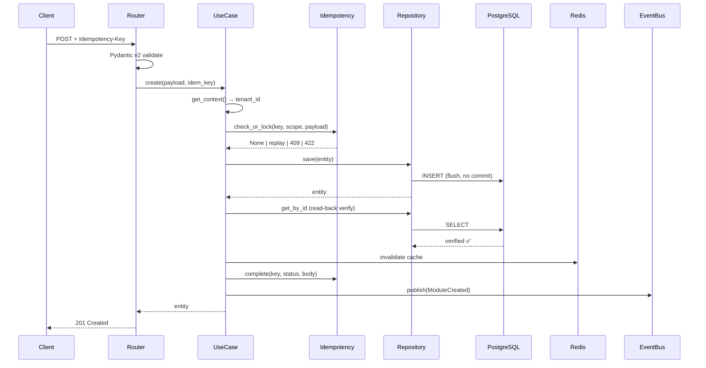
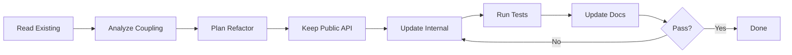

# 📦 3 ไฟล์ใหม่ (Production-Ready)

---

## 📄 ไฟล์ที่ 1: `RUN_GUIDE_opencode_promt.md`

````markdown
# 🎯 MASTER PROMPT TEMPLATE v6.0 — ฉบับสมบูรณ์ 100%

> **Stack:** Python 3.14+ · FastAPI · Pydantic v2 · SQLAlchemy 2.0 · PostgreSQL 17 · Redis 8 · Kafka
> **ขอบเขต:** ERP + CRM + IoT (Multi-company, 65 modules / 8 layers)
> **v6.0:** เพิ่ม **Scripts (Bat/PS1) + Template Generator + Migration Auto**

---

# 📋 สารบัญ

| # | ส่วน | คำอธิบาย |
|---|---|---|
| **0** | [Global Constraints](#0-global-constraints) | กฎบังคับทุก prompt |
| **1** | [Master Structure](#1-master-structure--23-ส่วนบังคับ) | 23 ส่วนบังคับ |
| **2** | [Task Templates A–G](#2-task-templates-ag) | 7 ประเภทงาน |
| **3** | [SQL & Migration Block](#3-sql--migration-block) | V001/V002/V003 + RLS |
| **4** | [Routing Block](#4-routing-block) | Router + Model registration |
| **5** | [Docs / Swagger / Postman](#5-docs--swagger--postman-block) | เอกสาร 4 ระบบ |
| **6** | [Report Templates](#6-report-templates) | Report A–D |
| **7** | [Checklists](#7-checklists) | DoD + TDD + SQL + Docs |
| **8** | [Scripts (Bat/PS1)](#8-scripts-batps1) | 🆕 Template Generator |
| **9** | [Cheatsheet](#9-quick-command-cheatsheet) | คำสั่งด่วน |

---

# 0. Global Constraints

```markdown
[GLOBAL CONSTRAINTS]
- ห้ามทักทาย / ห้ามสรุป / ห้ามอธิบายซ้ำ
- ตอบเฉพาะไฟล์ใน "Output Scope"
- โค้ดเต็ม Production-ready ห้าม `...` หรือ `# code here`
- ห้ามแตะไฟล์นอก Scope (ถ้าจำเป็น → ประกาศ SIDE-EFFECT WARNING)
- คอมเมนต์ 2 ภาษา (ไทย + English) สั้น กระชับ
- Error handling:
  • Use Case   → 3-branch (StandardException → DomainError → Exception)
  • Repository → 2-branch (StandardException → Exception)
  • Cache      → never-raise (log + return None/False)
- Type hints ครบ / Pydantic v2 / SQLAlchemy 2.0 async
- ใช้ `Decimal` เท่านั้น (ห้าม float กับเงิน/สต็อก)
- ใช้ `flush()` ห้าม `commit()` ใน Repository
- SQL: V001 create + V002 seed + V003 rollback + RLS + Trigger
- Routing: register ที่ `app/routes.py` + `migrations/env.py`
- Docs: README + OpenAPI + Postman + AsyncAPI (ถ้ามี WS)
- Path: `app/modules/{module}/{layer}/{file}.py`
- ข้อมูลไม่พอ → ถาม 1 คำถาม ห้ามเดา
```

---

# 1. Master Structure — 23 ส่วนบังคับ

```markdown
## 01. รายละเอียด (Details)
## 02. หลักการทำงาน (Concept / Behavior Spec)
## 03. ข้อกำหนด (Requirements)
## 04. เป้าหมาย (Target)
## 05. ขอบเขต (Scope)
## 06. โครงสร้าง Folder + ไฟล์
## 07. Workflow การทำงาน
## 08. Affected Areas
## 09. รายการกระบวนการทำงาน
## 10. Performance Considerations
## 11. TDD Plan
## 12. ข้อห้าม (Prohibitions)
## 13. ข้อควรระวัง (Cautions)
## 14. ข้อดี (Pros)
## 15. ข้อเสีย (Cons)
## 16. Checklist การทดสอบ
## 17. SQL & Migration Plan
## 18. Routing Registration
## 19. Documentation Package
## 20. Swagger / OpenAPI Spec
## 21. Postman Collection
## 22. สรุป (Summary)
## 23. รายงานสรุปผลการดำเนินการ
```

---

# 2. Task Templates A–G

## 🎯 TEMPLATE A: สร้างใหม่ (CREATE_NEW)

### 01. รายละเอียด

| หัวข้อ | ค่า |
|---|---|
| **Task Type** | `CREATE_NEW` |
| **Module** | `[module]` |
| **Layer** | `[0-Core / 1-Foundation / 2-Money / 3-Goods / 4-Ops / 5-Intel / 6-Monitor / 7-Template]` |
| **Stack** | `[FastAPI / Django / Both]` |
| **Priority** | `🔴 / 🟠 / 🟡` |
| **Phase** | `[1-6]` |
| **Prefix** | `[3 chars]` |
| **Dependencies** | `[module list]` |
| **Tables** | `tenant_{tid}.[table]` |
| **Endpoints** | `/api/v1/[module]/` |
| **Events** | `[ModuleCreated, ModuleUpdated, ...]` |

### 06. โครงสร้าง Folder + ไฟล์ (40 ไฟล์)

```
app/modules/{module}/
├── domain/                (6 ไฟล์)
│   ├── __init__.py
│   ├── entities.py
│   ├── value_objects.py
│   ├── enums.py
│   ├── events.py
│   └── exceptions.py
├── application/           (6 ไฟล์)
│   ├── __init__.py
│   ├── interfaces.py
│   ├── use_cases.py
│   ├── mappers.py
│   ├── exceptions.py
│   └── utils.py
├── infrastructure/        (5 ไฟล์)
│   ├── __init__.py
│   ├── models.py
│   ├── repositories.py
│   ├── caches.py
│   └── services.py
├── presentation/          (5 ไฟล์)
│   ├── __init__.py
│   ├── routers.py
│   ├── schemas.py
│   ├── docs.py
│   └── dependencies.py
└── __init__.py            (1 ไฟล์)

db/migrations/             (3 ไฟล์)
├── V001__create_{module}.sql
├── V002__seed_{module}.sql
└── V003__rollback_{module}.sql

tests/                     (4 ไฟล์)
├── unit/test_{module}.py
├── integration/test_{module}_repository.py
├── property/test_{module}_invariants.py
└── manual/manual_test_{module}.md

docs/                      (2 ไฟล์)
├── README_{module}.md
└── API_{module}.md

app/routes.py              (แก้)
migrations/env.py          (แก้)
```

### 07. Workflow



### 12. ข้อห้าม

```markdown
❌ ห้าม import framework ใน domain/
❌ ห้าม commit() ใน Repository (ใช้ flush())
❌ ห้าม raise ใน Cache (never-raise)
❌ ห้าม float กับเงิน/สต็อก
❌ ห้าม hardcode secret
❌ ห้าม UPDATE/DELETE ใน audit/event store
❌ ห้าม query ข้าม tenant
❌ ห้ามลบ migration V001-V003 ที่ commit แล้ว
❌ ห้าม CREATE TABLE IF NOT EXISTS ใน migration หลัก
```

### 17. SQL & Migration Plan

> ใช้ `create_modules.bat sql {module} {prefix}` หรือดูกฎใน [ส่วนที่ 3](#3-sql--migration-block)

### 18. Routing Registration

> ใช้ `create_modules.bat routes {module}` หรือดูกฎใน [ส่วนที่ 4](#4-routing-block)

### 22. สรุป

| รายการ | จำนวน |
|---|---|
| Python files | 23 |
| SQL files | 3 |
| Test files | 4 |
| Docs files | 2 |
| Routing (แก้) | 2 |
| **รวม** | **34** |

### 23. รายงาน — Report A

---

## 🎯 TEMPLATE B: แก้ไขของเดิม (REFACTOR)

### 01. รายละเอียด

| หัวข้อ | ค่า |
|---|---|
| **Task Type** | `REFACTOR` |
| **Target Files** | `[list]` |
| **Breaking Change** | `Yes / No` |
| **Migration Impact** | `None / New migration needed` |

### 07. Workflow



### 12. ข้อห้าม

```markdown
❌ ห้ามเปลี่ยน public signature
❌ ห้ามแตะ layer อื่น
❌ ห้าม refactor นอกจุดที่ระบุ
❌ ห้ามเพิ่ม feature ใหม่
❌ ห้ามลบ tests เดิม
❌ ห้ามแก้ migration V001-V003 ที่ commit แล้ว
```

---

## 🎯 TEMPLATE C: เพิ่ม/แก้ไขจากเดิม (EXTEND)

### 01. รายละเอียด

| หัวข้อ | ค่า |
|---|---|
| **Task Type** | `EXTEND` |
| **Module** | `[module]` |
| **Feature** | `[feature ใหม่]` |
| **New Endpoints** | `[list]` |
| **New Migration** | `V00X__{action}.sql` |

### 06. Diff Plan

| ไฟล์ | Action | รายละเอียด |
|---|---|---|
| `domain/entities.py` | `+method` | `bulk_create()` |
| `application/use_cases.py` | `+class` | `BulkCreateUseCase` |
| `presentation/routers.py` | `+endpoint` | `POST /bulk/` |
| `presentation/schemas.py` | `+schema` | `BulkCreateRequest` |
| `db/migrations/V004__add_bulk.sql` | `new` | index + column |

---

## 🎯 TEMPLATE D: แก้ Bug (BUGFIX)

### 01. รายละเอียด

| หัวข้อ | ค่า |
|---|---|
| **Task Type** | `BUGFIX` |
| **Severity** | `🔴 / 🟡 / 🟢` |
| **Env** | `dev / staging / prod` |
| **Migration Impact** | `None / New migration` |

### 02. Bug Report

```markdown
Symptom: [อาการ]
Steps: 1. ... 2. ...
Expected: [สิ่งที่ควรเกิด]
Actual: [สิ่งที่เกิด]
Stacktrace: [paste]
```

### 03. Hypothesis (STEP 1 — รออนุมัติ)

```markdown
1. Root Cause: [ไฟล์:บรรทัด + คำอธิบาย]
2. Fix Strategy: hotfix / proper fix / refactor
3. Migration needed? Yes/No
```

---

## 🎯 TEMPLATE E: ตรวจสอบความปลอดภัย (SECURITY AUDIT)

### 01. รายละเอียด

| หัวข้อ | ค่า |
|---|---|
| **Task Type** | `SECURITY_AUDIT` |
| **Standard** | `OWASP Top 10 / ASVS L2` |
| **Mode** | `Read-only / Audit+Fix` |

### 16. Output — ตารางเท่านั้น

| # | Risk | Layer | File:Line | Severity | CWE | แนะนำแก้ | Auto-fix |
|---|---|---|---|---|---|---|---|
| 1 | ... | ... | ... | 🔴 | CWE-XXX | ... | ✅ |

### Security Checklist

```markdown
#### A. Authentication & Authorization
- [ ] Nested JWT (JWS + JWE)
- [ ] Refresh token rotation
- [ ] RBAC ทุก endpoint

#### B. Input Validation
- [ ] Pydantic v2 strict
- [ ] SQL injection (ORM parameterized)
- [ ] Mass assignment

#### C. Data Protection
- [ ] Encryption at rest
- [ ] TLS in transit
- [ ] PII masking ใน logs

#### D. Multi-tenancy
- [ ] tenant_id ทุก query
- [ ] RLS policy ทุกตาราง
- [ ] Cross-tenant leakage test

#### E. API Security
- [ ] Rate limiting
- [ ] CORS policy
- [ ] CSRF (BFF)
- [ ] Idempotency key

#### F. SQL Security
- [ ] RLS enabled + forced
- [ ] FK ON DELETE ถูกต้อง
- [ ] Search_path ปลอดภัย
```

---

## 🎯 TEMPLATE F: ทดสอบประสิทธิภาพ (PERFORMANCE)

### 01. รายละเอียด

| หัวข้อ | ค่า |
|---|---|
| **Task Type** | `PERF_TEST` |
| **SLO** | `p95 < X ms, > Y rps` |
| **Tool** | `locust / k6 / pytest-benchmark` |

### 16. Metrics

| Metric | Tool | Target | Before | After |
|---|---|---|---|---|
| p50 | pytest-benchmark | < 50ms | ? | ? |
| p95 | locust | < 200ms | ? | ? |
| RPS | locust | > 100 | ? | ? |
| DB queries/req | SQLAlchemy events | < 5 | ? | ? |
| Seq scans | EXPLAIN | 0 | ? | ? |

---

## 🎯 TEMPLATE G: ทำคู่มือ (DOCUMENTATION)

### 01. รายละเอียด

| หัวข้อ | ค่า |
|---|---|
| **Task Type** | `DOCUMENTATION` |
| **Doc Type** | `README / API / ARCH / RUNBOOK / ONBOARDING / ADR` |
| **Audience** | `Dev / DevOps / PM / End-user` |

### 06. Doc Structure

```
docs/
├── README_{module}.md
├── API_{module}.md
├── ARCH_{module}.md
├── RUNBOOK_{module}.md
├── postman/{module}.postman_collection.json
└── adr/ADR-{nnn}-{title}.md
```

---

# 3. SQL & Migration Block

### 📄 `V001__create_{module}.sql`

```sql
-- ═══════════════════════════════════════════════════════════════
-- V001__create_{module}.sql
-- Module: {module} | Prefix: {prefix} | Layer: {layer}
-- ═══════════════════════════════════════════════════════════════
BEGIN;

CREATE SEQUENCE IF NOT EXISTS {prefix}_number_seq START 1;

CREATE TABLE tenant_{prefix}.{module}s (
    id           UUID PRIMARY KEY DEFAULT gen_random_uuid(),
    tenant_id    UUID NOT NULL,
    code         VARCHAR(50)  NOT NULL,
    name         VARCHAR(200) NOT NULL,
    status       VARCHAR(20)  NOT NULL DEFAULT 'ACTIVE',
    amount       NUMERIC(15,2) NOT NULL DEFAULT 0,
    metadata     JSONB        NOT NULL DEFAULT '{}'::jsonb,
    version      INTEGER      NOT NULL DEFAULT 1,
    created_at   TIMESTAMPTZ  NOT NULL DEFAULT NOW(),
    updated_at   TIMESTAMPTZ  NOT NULL DEFAULT NOW(),
    deleted_at   TIMESTAMPTZ,

    CONSTRAINT uq_{module}_code   UNIQUE (tenant_id, code),
    CONSTRAINT ck_{module}_amount CHECK (amount >= 0),
    CONSTRAINT ck_{module}_status CHECK (status IN ('ACTIVE','INACTIVE','ARCHIVED'))
);

CREATE INDEX ix_{module}_tenant_status
    ON tenant_{prefix}.{module}s(tenant_id, status)
    WHERE deleted_at IS NULL;
CREATE INDEX ix_{module}_code    ON tenant_{prefix}.{module}s(code);
CREATE INDEX ix_{module}_created ON tenant_{prefix}.{module}s(created_at DESC);

CREATE OR REPLACE FUNCTION public.set_updated_at()
RETURNS TRIGGER AS $$
BEGIN
    NEW.updated_at = NOW();
    RETURN NEW;
END;
$$ LANGUAGE plpgsql;

CREATE TRIGGER trg_{module}_updated_at
    BEFORE UPDATE ON tenant_{prefix}.{module}s
    FOR EACH ROW EXECUTE FUNCTION public.set_updated_at();

ALTER TABLE tenant_{prefix}.{module}s ENABLE ROW LEVEL SECURITY;

CREATE POLICY p_{module}_tenant ON tenant_{prefix}.{module}s
    USING (tenant_id = current_setting('app.current_tenant', true)::uuid);

COMMIT;
```

### 📄 `V002__seed_{module}.sql`

```sql
BEGIN;
INSERT INTO tenant_{prefix}.{module}s (tenant_id, code, name, status)
VALUES ('00000000-0000-0000-0000-000000000001', 'SYS-DEFAULT', 'System Default', 'ACTIVE')
ON CONFLICT (tenant_id, code) DO NOTHING;
COMMIT;
```

### 📄 `V003__rollback_{module}.sql`

```sql
BEGIN;
DROP TRIGGER  IF EXISTS trg_{module}_updated_at ON tenant_{prefix}.{module}s;
DROP POLICY   IF EXISTS p_{module}_tenant       ON tenant_{prefix}.{module}s;
DROP TABLE    IF EXISTS tenant_{prefix}.{module}s CASCADE;
DROP SEQUENCE IF EXISTS {prefix}_number_seq;
COMMIT;
```

---

# 4. Routing Block

### 📄 `app/routes.py`

```python
from fastapi import APIRouter
from app.modules.{module}.presentation.routers import router as {module}_router

api_router = APIRouter(prefix="/api/v1")

# Layer 0
api_router.include_router(events_router)
api_router.include_router(audit_router)

# Layer N
api_router.include_router({module}_router)  # ← เพิ่ม

router = APIRouter()
router.include_router(api_router)
router.include_router(health_router)
```

### 📄 `migrations/env.py`

```python
from app.modules.{module}.infrastructure.models import {Module}Model
```

---

# 5. Docs / Swagger / Postman Block

### 📄 `docs/README_{module}.md` — ครบทุก section

```markdown
# Module: {module}
> Layer · Prefix · Version
## Purpose
## Architecture (Mermaid)
## Dependencies
## Database Schema
## API Endpoints
## Permissions
## Domain Events
## Environment Variables
## Setup
## Testing
## Usage Example
## Known Limitations
## Changelog
```

### 📄 Swagger Metadata

```python
router = APIRouter(prefix="/{module}", tags=["{Module}"])

@router.post(
    "/",
    status_code=201,
    summary="สร้าง {module}",
    operation_id="create_{module}",
    responses={
        201: RESPONSE_CREATE_201,
        400: RESPONSE_ERROR_400,
        409: {"description": "Conflict"},
        422: {"description": "Idempotency mismatch"},
    },
)
```

### 📄 Postman Collection

```json
{
  "info": { "name": "ERPIoT — {Module}" },
  "item": [
    { "name": "Auth" },
    { "name": "{Module} — Create" },
    { "name": "{Module} — List" },
    { "name": "{Module} — Get" },
    { "name": "{Module} — Update" },
    { "name": "{Module} — Delete" },
    { "name": "Health" }
  ]
}
```

---

# 6. Report Templates

## 📊 Report A: Task Completion

```markdown
# 📋 Task Report — {TaskType} / {Module}
## ✅ สรุปผล
| รายการ | สถานะ | หมายเหตุ |
|---|---|---|
| Domain | ✅ | 6 ไฟล์ |
| Application | ✅ | 6 ไฟล์ |
| Infrastructure | ✅ | 5 ไฟล์ |
| Presentation | ✅ | 5 ไฟล์ |
| SQL Migrations | ✅ | V001/V002/V003 |
| Routing | ✅ | routes.py + env.py |
| Docs | ✅ | README + API |
| Tests | ✅ | 4 ประเภท |
```

## 📊 Report B: Bug Fix

```markdown
# 🐛 Bug Fix Report — {bug_id}
## 🔍 Root Cause
## 🛠️ Fix
## 🧪 Regression Test
## 📊 Impact
## ✅ Verification
```

## 📊 Report C: Security Audit

```markdown
# 🔐 Security Audit Report
| # | Risk | Severity | CWE | Location | Fix |
```

## 📊 Report D: Performance

```markdown
# ⚡ Performance Report
| Metric | Before | After | Δ | Target | ผ่าน? |
```

---

# 7. Checklists

## ✅ DoD

```markdown
### Code
- [ ] Domain ไม่ import framework
- [ ] ใช้ Decimal
- [ ] flush() ไม่ commit()
- [ ] Cache never-raise
- [ ] Error handling 3/2/never
- [ ] Type hints ครบ

### SQL
- [ ] V001 create + index + RLS + trigger
- [ ] V002 seed
- [ ] V003 rollback
- [ ] env.py import models

### Routing
- [ ] register app/routes.py
- [ ] /docs เห็น tag ใหม่
- [ ] prefix ไม่ซ้ำ

### Tests
- [ ] Unit ≥ 8
- [ ] Integration ผ่าน
- [ ] Property 100 iter
- [ ] Manual 8 scenarios

### Docs
- [ ] README อัปเดต
- [ ] Swagger metadata ครบ
- [ ] Postman collection อัปเดต
```

## ✅ SQL Migration

```markdown
- [ ] V001 (ไม่ IF NOT EXISTS)
- [ ] V002 (ON CONFLICT DO NOTHING)
- [ ] V003 (CASCADE)
- [ ] BEGIN/COMMIT ครบ
- [ ] id/tenant_id/version/created_at/updated_at/deleted_at
- [ ] CONSTRAINT (CHECK, UNIQUE, FK)
- [ ] Partial index
- [ ] ENABLE ROW LEVEL SECURITY
- [ ] CREATE POLICY
- [ ] BEFORE UPDATE trigger
```

---

# 8. Scripts (Bat/PS1) 🆕

## 8.1 ตาราง Scripts

| Script | หน้าที่ | ตัวอย่าง |
|---|---|---|
| `create_modules.bat` | Wrapper เรียก PS1 | `create_modules.bat new inventory 3 inv --sql --tests --docs --routes` |
| `create_module.ps1` | Implementation หลัก | ดูรายละเอียดในไฟล์ |

## 8.2 Actions

| Action | คำอธิบาย |
|---|---|
| `new` | สร้าง module ใหม่ (4 layers + __init__) |
| `sql` | สร้าง V001/V002/V003 |
| `routes` | Register router + model |
| `test` | สร้าง unit/integration/property/manual |
| `docs` | สร้าง README + API |
| `all` | ทำทุกอย่าง |
| `template` | Generate OpenCode prompt ตาม Template A-G |
| `help` | แสดง help |

## 8.3 Layer Mapping

| Layer | ชื่อ | ตัวอย่าง |
|---|---|---|
| 0 | Core | audit, idempotency, events |
| 1 | Foundation | tenant, user, auth |
| 2 | Money | invoice, payment, gl |
| 3 | Goods | inventory, product, warehouse |
| 4 | Ops | sales, purchase, production |
| 5 | Intel | report, dashboard, analytics |
| 6 | Monitor | iot, alert, health |
| 7 | Template | report_template, email_template |

## 8.4 ตัวอย่างครบวงจร

```bat
REM 1. สร้าง module เปล่า
create_modules.bat new inventory 3 inv

REM 2. Full package
create_modules.bat new inventory 3 inv --sql --tests --docs --routes

REM 3. Generate OpenCode prompt
create_modules.bat template A inventory 3 inv

REM 4. เพิ่ม SQL ใหม่
create_modules.bat sql inventory inv

REM 5. Register router
create_modules.bat routes inventory

REM 6. ดู help
create_modules.bat help
```

---

# 9. Quick Command Cheatsheet

```bash
# ─── A: CREATE_NEW ────────────────────────────────────
opencode -c "TEMPLATE A + module=inventory + layer=3-goods + FULL OUTPUT"

# ─── B: REFACTOR ─────────────────────────────────────
opencode -c "TEMPLATE B + target=repositories.py"

# ─── C: EXTEND ───────────────────────────────────────
opencode -c "TEMPLATE C + module=key + feature=bulk-revoke"

# ─── D: BUGFIX ───────────────────────────────────────
opencode -c "TEMPLATE D + stacktrace=[paste]"

# ─── E: SECURITY ─────────────────────────────────────
opencode -c "TEMPLATE E + target=authentication + Mode=Read-only"

# ─── F: PERFORMANCE ──────────────────────────────────
opencode -c "TEMPLATE F + target=knowledge/list + SLO p95<200ms"

# ─── G: DOCS ─────────────────────────────────────────
opencode -c "TEMPLATE G + Doc Type=README + module=events"

# ─── Scripts ─────────────────────────────────────────
create_modules.bat new inventory 3 inv --sql --tests --docs --routes
create_modules.bat template A inventory 3 inv
create_modules.bat help
```

---

# 📌 Universal Header

```markdown
# ═══════════════════════════════════════════════════════════════
# 🎯 OPENCODE PROMPT — [Module] / [Task A-G]
# ═══════════════════════════════════════════════════════════════

[GLOBAL CONSTRAINTS]
- ห้ามทักทาย / ห้ามสรุป / ห้ามอธิบายซ้ำ
- ตอบเฉพาะไฟล์ใน Output Scope
- โค้ดเต็ม Production-ready ห้าม `...`
- คอมเมนต์ 2 ภาษา (TH+EN)
- 3-branch / 2-branch / never-raise
- Decimal / flush() ห้าม commit()
- SQL: V001 + V002 + V003 + RLS
- Routing: app/routes.py + migrations/env.py
- Docs: README + Swagger + Postman

### Metadata
- Task: [A-G] | Module: [xxx] | Layer: [0-7]
- Stack: [FastAPI / Django / Both]

### Output Scope (23 ส่วน)
01-16: Details → Checklist
17: SQL & Migration (บังคับ)
18: Routing (บังคับ)
19-21: Docs + Swagger + Postman (บังคับ)
22-23: Summary + Report

# ═══════════════════════════════════════════════════════════════
```

---

# ✅ สรุป v6.0

| ส่วน | สถานะ |
|---|---|
| Global Constraints | ✅ |
| 23 ส่วนบังคับ | ✅ |
| 7 Task Templates (A–G) | ✅ |
| SQL & Migration Block | ✅ |
| Routing Block | ✅ |
| Docs/Swagger/Postman | ✅ |
| 4 Report Templates | ✅ |
| Checklists | ✅ |
| **Scripts (Bat/PS1)** | ✅ 🆕 |
| Cheatsheet | ✅ |
````

---

## 📄 ไฟล์ที่ 2: `create_modules.bat`

```bat
@echo off
REM ═══════════════════════════════════════════════════════════════
REM  create_modules.bat
REM  Wrapper — เรียก PowerShell เพื่อสร้าง/แก้ไข module
REM  (Generic Module Generator for ERP+CRM+IoT)
REM
REM  USAGE:
REM    create_modules.bat <action> <module> [layer] [prefix] [options]
REM
REM  ACTIONS:
REM    new       สร้าง module ใหม่ (4 layers + __init__)
REM    sql       สร้าง SQL migrations V001/V002/V003
REM    routes    Register router + model
REM    test      สร้าง tests (unit/integration/property/manual)
REM    docs      สร้าง docs (README + API)
REM    template  Generate OpenCode prompt ตาม Template A-G
REM    all       ทำทุกอย่าง
REM    help      แสดง help
REM
REM  OPTIONS:
REM    --sql     สร้าง SQL
REM    --tests   สร้าง tests
REM    --docs    สร้าง docs
REM    --routes  register router + model
REM    --force   เขียนทับไฟล์เดิม
REM    --template=A|B|C|D|E|F|G
REM
REM  EXAMPLES:
REM    create_modules.bat new inventory 3 inv --sql --tests --docs --routes
REM    create_modules.bat template A inventory 3 inv
REM    create_modules.bat sql invoice inv
REM    create_modules.bat all sales 4 sal --force
REM    create_modules.bat help
REM ═══════════════════════════════════════════════════════════════

chcp 65001 >nul
setlocal EnableDelayedExpansion

REM ─── หา PowerShell ─────────────────────────────────────────
where powershell >nul 2>nul
if errorlevel 1 (
    echo [ERROR] PowerShell not found in PATH
    exit /b 1
)

set "PS_SCRIPT=%~dp0create_module.ps1"
if not exist "%PS_SCRIPT%" (
    echo [ERROR] create_module.ps1 not found at:
    echo        %PS_SCRIPT%
    echo.
    echo กรุณาวาง create_module.ps1 ไว้โฟลเดอร์เดียวกับ create_modules.bat
    exit /b 1
)

REM ─── ไม่มี argument → แสดง help ───────────────────────────
if "%~1"=="" (
    powershell -NoProfile -ExecutionPolicy Bypass -File "%PS_SCRIPT%" -Action help
    goto :end
)

REM ─── ส่งต่อ argument ทั้งหมด ───────────────────────────────
powershell -NoProfile -ExecutionPolicy Bypass -File "%PS_SCRIPT%" %*
set "EXITCODE=%ERRORLEVEL%"

:end
echo.
if not "%EXITCODE%"=="0" (
    echo [ERROR] Exit code %EXITCODE%
) else (
    echo [DONE] Completed successfully.
)
echo.
pause
endlocal
exit /b %EXITCODE%
```

---

## 📄 ไฟล์ที่ 3: `create_module.ps1`

```powershell
<#
.SYNOPSIS
    create_module.ps1 — Generic Module Generator v6.0
.DESCRIPTION
    สร้าง/แก้ไข module ตาม Clean Architecture + DDD (ERP+CRM+IoT)
    - 4 layers: domain / application / infrastructure / presentation
    - SQL: V001 create + V002 seed + V003 rollback + RLS
    - Routing: app/routes.py + migrations/env.py
    - Tests: unit / integration / property / manual
    - Docs: README + API
    - Template: Generate OpenCode prompt (A-G)
.EXAMPLE
    .\create_module.ps1 new inventory 3 inv --sql --tests --docs --routes
.EXAMPLE
    .\create_module.ps1 template A inventory 3 inv
.EXAMPLE
    .\create_module.ps1 sql inventory inv
.EXAMPLE
    .\create_module.ps1 routes inventory
.EXAMPLE
    .\create_module.ps1 help
#>

[CmdletBinding()]
param(
    [Parameter(Position = 0)]
    [ValidateSet("new","sql","routes","test","docs","template","all","help")]
    [string]$Action = "help",

    [Parameter(Position = 1)]
    [string]$Module = "",

    [Parameter(Position = 2)]
    [string]$Layer = "0",

    [Parameter(Position = 3)]
    [string]$Prefix = "",

    [ValidateSet("A","B","C","D","E","F","G")]
    [string]$TemplateName = "A",

    [switch]$SQL,
    [switch]$Tests,
    [switch]$Docs,
    [switch]$Routes,
    [switch]$Force
)

# ═══════════════════════════════════════════════════════════════
#  CONFIG
# ═══════════════════════════════════════════════════════════════
$ErrorActionPreference = "Stop"

$ROOT       = "app\modules"
$ROUTES_F   = "app\routes.py"
$ENV_F      = "migrations\env.py"
$SQL_DIR    = "db\migrations"
$TESTS_DIR  = "tests"
$DOCS_DIR   = "docs"
$PROMPTS_DIR = "docs\prompts"

# ═══════════════════════════════════════════════════════════════
#  HELPERS
# ═══════════════════════════════════════════════════════════════
function Write-Info  { param([string]$m) Write-Host $m -ForegroundColor Cyan }
function Write-Ok    { param([string]$m) Write-Host "  [OK] $m" -ForegroundColor Green }
function Write-Warn  { param([string]$m) Write-Host "  [!!] $m" -ForegroundColor Yellow }
function Write-Err   { param([string]$m) Write-Host "  [XX] $m" -ForegroundColor Red }

function Write-FileUtf8 {
    param(
        [Parameter(Mandatory)][string]$Path,
        [Parameter(Mandatory)][string]$Content
    )
    $dir = Split-Path $Path -Parent
    if ($dir -and -not (Test-Path $dir)) {
        New-Item -ItemType Directory -Force -Path $dir | Out-Null
    }

    if ((Test-Path $Path) -and -not $Force) {
        Write-Warn "Skip (exists): $Path  [use -Force to overwrite]"
        return
    }

    $fullPath = if ($dir) {
        Join-Path (Resolve-Path -LiteralPath $dir).Path (Split-Path $Path -Leaf)
    } else {
        $Path
    }

    $utf8 = New-Object System.Text.UTF8Encoding($false)
    [System.IO.File]::WriteAllText($fullPath, $Content, $utf8)
    Write-Ok $Path
}

function Get-LayerName {
    param([string]$L)
    switch ($L) {
        "0" { "0-Core" }
        "1" { "1-Foundation" }
        "2" { "2-Money" }
        "3" { "3-Goods" }
        "4" { "4-Ops" }
        "5" { "5-Intel" }
        "6" { "6-Monitor" }
        "7" { "7-Template" }
        default { "0-Core" }
    }
}

function Get-Pascal {
    param([string]$s)
    if ([string]::IsNullOrEmpty($s)) { return "" }
    return $s.Substring(0, 1).ToUpper() + $s.Substring(1)
}

function Show-Help {
    @"

═══════════════════════════════════════════════════════════════
  create_module.ps1 — Generic Module Generator v6.0
═══════════════════════════════════════════════════════════════

  USAGE
    .\create_module.ps1 <action> <module> [layer] [prefix] [options]

  ACTIONS
    new        สร้าง module ใหม่ (4 layers + __init__)
    sql        สร้าง SQL migrations (V001/V002/V003 + RLS)
    routes     Register router + model
    test       สร้าง tests (unit/integration/property/manual)
    docs       สร้าง docs (README + API)
    template   Generate OpenCode prompt ตาม Template A-G
    all        ทำทุกอย่าง
    help       แสดง help นี้

  OPTIONS
    --sql         สร้าง SQL
    --tests       สร้าง tests
    --docs        สร้าง docs
    --routes      register router + model
    --force       เขียนทับไฟล์เดิม
    --template=X  Template A|B|C|D|E|F|G (default: A)

  LAYERS
    0=Core  1=Foundation  2=Money  3=Goods
    4=Ops   5=Intel       6=Monitor 7=Template

  EXAMPLES
    .\create_module.ps1 new inventory 3 inv --sql --tests --docs --routes
    .\create_module.ps1 template A inventory 3 inv
    .\create_module.ps1 sql invoice inv
    .\create_module.ps1 routes invoice
    .\create_module.ps1 all sales 4 sal --force

═══════════════════════════════════════════════════════════════
"@ | Write-Host
}

function Assert-Inputs {
    if ([string]::IsNullOrWhiteSpace($Module)) {
        Write-Err "Module name required."
        Show-Help
        exit 1
    }
    if ($Module -notmatch '^[a-z][a-z0-9_]*$') {
        Write-Err "Module must be snake_case (a-z, 0-9, _)."
        exit 1
    }
    if ($Layer -notmatch '^[0-7]$') {
        Write-Err "Layer must be 0-7."
        exit 1
    }
    if ([string]::IsNullOrWhiteSpace($script:Prefix)) {
        $script:Prefix = $Module.Substring(0, [Math]::Min(3, $Module.Length)).ToLower()
        Write-Warn "Prefix not provided, using '$script:Prefix'."
    }
    if ($script:Prefix.Length -gt 3) {
        $script:Prefix = $script:Prefix.Substring(0, 3)
        Write-Warn "Prefix truncated to 3 chars: '$script:Prefix'."
    }
}

# ═══════════════════════════════════════════════════════════════
#  DOMAIN LAYER
# ═══════════════════════════════════════════════════════════════
function New-DomainLayer {
    param([string]$Mod)
    $Cls  = Get-Pascal $Mod
    $base = "$ROOT\$Mod\domain"

    Write-FileUtf8 "$base\__init__.py" @"
"""$Mod domain layer — ชั้นโดเมน"""
from .entities import $Cls
from .enums import ${Cls}Status
from .events import ${Cls}Created
from .exceptions import DomainError

__all__ = ["$Cls", "${Cls}Status", "${Cls}Created", "DomainError"]
"@

    Write-FileUtf8 "$base\entities.py" @"
"""$Mod entities — เอนทิตี $Mod"""
from dataclasses import dataclass, field
from datetime import datetime

from .exceptions import DomainError


@dataclass
class BaseEntity:
    """BaseEntity — เอนทิตีฐาน"""
    id: str = ""
    tenant_id: str = ""
    created_at: datetime = field(default_factory=datetime.utcnow)
    updated_at: datetime = field(default_factory=datetime.utcnow)


@dataclass
class $Cls(BaseEntity):
    """$Cls entity — เอนทิตี $Mod"""
    code: str = ""
    name: str = ""
    status: str = "ACTIVE"

    def __post_init__(self) -> None:
        self._validate()

    def _validate(self) -> None:
        if not self.code:
            raise DomainError("Code is required")
        if not self.name:
            raise DomainError("Name is required")
"@

    Write-FileUtf8 "$base\value_objects.py" @"
"""$Mod value objects — วัตถุค่า $Mod"""
from dataclasses import dataclass

from .exceptions import DomainError


@dataclass(frozen=True)
class ${Cls}Code:
    """${Cls}Code VO — รหัส $Mod"""
    value: str

    def __post_init__(self) -> None:
        if not self.value or len(self.value) > 50:
            raise DomainError("Invalid code")
"@

    Write-FileUtf8 "$base\enums.py" @"
"""$Mod enums — Enum สำหรับ $Mod"""
from enum import Enum


class ${Cls}Status(str, Enum):
    """${Cls}Status — สถานะ $Mod"""
    ACTIVE = "ACTIVE"
    INACTIVE = "INACTIVE"
    ARCHIVED = "ARCHIVED"
"@

    Write-FileUtf8 "$base\events.py" @"
"""$Mod domain events — เหตุการณ์โดเมน $Mod"""
from dataclasses import dataclass
from datetime import datetime


@dataclass(frozen=True)
class ${Cls}Created:
    """${Cls}Created — เหตุการณ์สร้าง $Mod"""
    id: str
    code: str
    occurred_at: datetime


@dataclass(frozen=True)
class ${Cls}Updated:
    """${Cls}Updated — เหตุการณ์แก้ไข $Mod"""
    id: str
    occurred_at: datetime


@dataclass(frozen=True)
class ${Cls}Deleted:
    """${Cls}Deleted — เหตุการณ์ลบ $Mod"""
    id: str
    occurred_at: datetime
"@

    Write-FileUtf8 "$base\exceptions.py" @"
"""$Mod domain exceptions — ข้อยกเว้นโดเมน"""


class DomainError(Exception):
    """DomainError — ข้อผิดพลาดโดเมน"""

    def __init__(self, message: str = "Domain error") -> None:
        self.message = message
        super().__init__(message)

    def __str__(self) -> str:
        return self.message
"@
}

# ═══════════════════════════════════════════════════════════════
#  APPLICATION LAYER
# ═══════════════════════════════════════════════════════════════
function New-ApplicationLayer {
    param([string]$Mod)
    $Cls  = Get-Pascal $Mod
    $base = "$ROOT\$Mod\application"

    Write-FileUtf8 "$base\__init__.py" @"
"""$Mod application layer — ชั้นแอปพลิเคชัน"""
from .exceptions import ${Cls}Exception
from .use_cases import ${Cls}UseCases

__all__ = ["${Cls}UseCases", "${Cls}Exception"]
"@

    Write-FileUtf8 "$base\interfaces.py" @"
"""$Mod application interfaces — Protocol"""
from typing import Protocol

from ..domain.entities import $Cls


class I${Cls}Repository(Protocol):
    """I${Cls}Repository — อินเทอร์เฟซ repository"""

    async def save(self, entity: $Cls) -> $Cls: ...
    async def get_by_id(self, id: str) -> $Cls | None: ...


class I${Cls}Cache(Protocol):
    """I${Cls}Cache — อินเทอร์เฟซ cache"""

    async def get(self, id: str) -> $Cls | None: ...
    async def set(self, id: str, entity: $Cls, ttl: int) -> bool: ...
    async def invalidate(self, id: str) -> bool: ...
"@

    Write-FileUtf8 "$base\use_cases.py" @"
"""$Mod use cases — กรณีการใช้งาน $Mod"""
import logging
from datetime import datetime

from ..domain.entities import $Cls
from ..domain.events import ${Cls}Created
from ..domain.exceptions import DomainError
from .exceptions import StandardException, ${Cls}Exception

logger = logging.getLogger(__name__)


class ${Cls}UseCases:
    """${Cls}UseCases — กรณีการใช้งาน $Mod"""

    def __init__(self, repo, cache, events) -> None:
        self.repo = repo
        self.cache = cache
        self.events = events

    async def create(self, payload: dict) -> $Cls:
        """สร้าง $Mod — Create."""
        try:
            entity = $Cls(
                code=payload["code"],
                name=payload.get("name", ""),
                tenant_id=payload.get("tenant_id", ""),
            )
            saved = await self.repo.save(entity)

            verified = await self.repo.get_by_id(saved.id)
            if verified is None:
                raise ${Cls}Exception("Read-back failed")

            await self.cache.invalidate(saved.id)
            await self.events.publish(
                "${Cls}Created",
                ${Cls}Created(
                    id=saved.id,
                    code=saved.code,
                    occurred_at=datetime.utcnow(),
                ),
            )
            return saved
        except StandardException:
            raise
        except DomainError as e:
            raise ${Cls}Exception(str(e))
        except Exception as e:
            logger.exception("Error in create $Mod: %s", e)
            raise ${Cls}Exception()
"@

    Write-FileUtf8 "$base\mappers.py" @"
"""$Mod mappers — ตัวแปลงข้อมูล"""
from ..domain.entities import $Cls


class ${Cls}Mapper:
    """${Cls}Mapper — ตัวแปลง entity ↔ schema"""

    @staticmethod
    def to_schema(entity: $Cls) -> dict:
        """แปลง entity เป็น dict"""
        return {
            "id": entity.id,
            "code": entity.code,
            "name": entity.name,
            "status": entity.status,
        }

    @staticmethod
    def to_entity(data: dict) -> $Cls:
        """แปลง dict เป็น entity"""
        return $Cls(
            code=data.get("code", ""),
            name=data.get("name", ""),
        )
"@

    Write-FileUtf8 "$base\exceptions.py" @"
"""$Mod application exceptions — ข้อยกเว้นแอปพลิเคชัน"""


class StandardException(Exception):
    """StandardException — ข้อผิดพลาดมาตรฐาน"""
    pass


class ${Cls}Exception(StandardException):
    """${Cls}Exception — ข้อผิดพลาด $Mod"""

    def __init__(self, message: str = "$Mod operation failed") -> None:
        self.message = message
        super().__init__(message)
"@

    Write-FileUtf8 "$base\utils.py" @"
"""$Mod application utils — เครื่องมือช่วย"""
from datetime import datetime


def now_utc() -> datetime:
    """คืน datetime UTC — Return UTC datetime"""
    return datetime.utcnow()
"@
}

# ═══════════════════════════════════════════════════════════════
#  INFRASTRUCTURE LAYER
# ═══════════════════════════════════════════════════════════════
function New-InfrastructureLayer {
    param([string]$Mod, [string]$Pfx)
    $Cls  = Get-Pascal $Mod
    $base = "$ROOT\$Mod\infrastructure"

    Write-FileUtf8 "$base\__init__.py" @"
"""$Mod infrastructure layer — ชั้นโครงสร้างพื้นฐาน"""
from .caches import Redis${Cls}Cache
from .models import ${Cls}Model
from .repositories import Postgres${Cls}Repository

__all__ = ["${Cls}Model", "Postgres${Cls}Repository", "Redis${Cls}Cache"]
"@

    Write-FileUtf8 "$base\models.py" @"
"""$Mod infrastructure models — SQLAlchemy 2.0"""
from sqlalchemy import Column, DateTime, Integer, String, UniqueConstraint
from sqlalchemy.dialects.postgresql import JSONB
from sqlalchemy.orm import declarative_base

BaseModel = declarative_base()


class ${Cls}Model(BaseModel):
    """${Cls}Model — โมเดล $Mod"""
    __tablename__ = "${Mod}s"

    id         = Column(String(36), primary_key=True)
    tenant_id  = Column(String(36), nullable=False, index=True)
    code       = Column(String(50), nullable=False)
    name       = Column(String(200), nullable=False)
    status     = Column(String(20), nullable=False, default="ACTIVE")
    meta       = Column("metadata", JSONB, default=dict)
    version    = Column(Integer, nullable=False, default=1)
    created_at = Column(DateTime(timezone=True), nullable=False)
    updated_at = Column(DateTime(timezone=True), nullable=False)
    deleted_at = Column(DateTime(timezone=True))

    __table_args__ = (
        UniqueConstraint("tenant_id", "code", name="uq_${Mod}_code"),
    )
"@

    Write-FileUtf8 "$base\repositories.py" @"
"""$Mod infrastructure repositories — 2-branch error handling"""
import logging

from ..domain.entities import $Cls
from .models import ${Cls}Model

logger = logging.getLogger(__name__)


class Postgres${Cls}Repository:
    """Postgres${Cls}Repository — repository หลัก"""

    def __init__(self, session_factory) -> None:
        self.session_factory = session_factory

    async def save(self, entity: $Cls) -> $Cls:
        """บันทึก entity — Save (flush only, no commit)"""
        try:
            async with self.session_factory() as session:
                row = ${Cls}Model(
                    id=entity.id,
                    tenant_id=entity.tenant_id,
                    code=entity.code,
                    name=entity.name,
                    status=entity.status,
                )
                session.add(row)
                await session.flush()
                return entity
        except Exception as e:
            logger.exception("Repo save failed: %s", e)
            raise

    async def get_by_id(self, id: str) -> $Cls | None:
        """อ่าน entity ตาม id — Get by id"""
        try:
            from sqlalchemy import select
            async with self.session_factory() as session:
                stmt = select(${Cls}Model).where(${Cls}Model.id == id)
                res = await session.execute(stmt)
                row = res.scalar_one_or_none()
                if row is None:
                    return None
                return $Cls(
                    id=row.id,
                    tenant_id=row.tenant_id,
                    code=row.code,
                    name=row.name,
                    status=row.status,
                )
        except Exception as e:
            logger.exception("Repo get failed: %s", e)
            raise
"@

    Write-FileUtf8 "$base\caches.py" @"
"""$Mod infrastructure caches — never-raise"""
import logging

logger = logging.getLogger(__name__)


class Redis${Cls}Cache:
    """Redis${Cls}Cache — cache-aside (never-raise)"""

    def __init__(self, redis_client, ttl: int = 300) -> None:
        self.redis = redis_client
        self.ttl = ttl

    def _key(self, id: str) -> str:
        """สร้าง key — Build cache key"""
        return f"$Mod:{id}"

    async def get(self, id: str):
        """อ่านจาก cache — Get (never-raise)"""
        try:
            return await self.redis.get(self._key(id))
        except Exception as e:
            logger.warning("Cache get failed: %s", e)
            return None

    async def set(self, id: str, value: str, ttl: int | None = None) -> bool:
        """เขียน cache — Set (never-raise)"""
        try:
            await self.redis.set(self._key(id), value, ex=(ttl or self.ttl))
            return True
        except Exception as e:
            logger.warning("Cache set failed: %s", e)
            return False

    async def invalidate(self, id: str) -> bool:
        """ลบ cache — Invalidate (never-raise)"""
        try:
            await self.redis.delete(self._key(id))
            return True
        except Exception as e:
            logger.warning("Cache invalidate failed: %s", e)
            return False
"@

    Write-FileUtf8 "$base\services.py" @"
"""$Mod infrastructure services — Kafka event publisher"""
import logging

logger = logging.getLogger(__name__)


class ${Cls}Publisher:
    """${Cls}Publisher — Kafka publisher (never-raise)"""

    def __init__(self, producer, topic: str = "$Mod.events") -> None:
        self.producer = producer
        self.topic = topic

    async def publish(self, event_name: str, event) -> None:
        """Publish domain event — (never-raise)"""
        try:
            await self.producer.send(
                self.topic,
                key=event_name,
                value=event,
            )
        except Exception as e:
            logger.warning("Publish failed: %s", e)
"@
}

# ═══════════════════════════════════════════════════════════════
#  PRESENTATION LAYER
# ═══════════════════════════════════════════════════════════════
function New-PresentationLayer {
    param([string]$Mod)
    $Cls  = Get-Pascal $Mod
    $base = "$ROOT\$Mod\presentation"

    Write-FileUtf8 "$base\__init__.py" @"
"""$Mod presentation layer — ชั้นนำเสนอ"""
from .dependencies import get_${Mod}_use_cases
from .routers import router

__all__ = ["router", "get_${Mod}_use_cases"]
"@

    Write-FileUtf8 "$base\schemas.py" @"
"""$Mod presentation schemas — Pydantic v2"""
from datetime import datetime

from pydantic import BaseModel, ConfigDict, Field


class ${Cls}Create(BaseModel):
    """${Cls}Create — payload สร้าง $Mod"""
    code: str = Field(..., min_length=1, max_length=50)
    name: str = Field(..., min_length=1, max_length=200)


class ${Cls}Update(BaseModel):
    """${Cls}Update — payload แก้ไข $Mod"""
    name: str | None = Field(default=None, max_length=200)
    status: str | None = Field(default=None, pattern="^(ACTIVE|INACTIVE|ARCHIVED)$")


class ${Cls}Response(BaseModel):
    """${Cls}Response — response $Mod"""
    id: str
    code: str
    name: str
    status: str
    created_at: datetime | None = None

    model_config = ConfigDict(from_attributes=True)
"@

    Write-FileUtf8 "$base\routers.py" @"
"""$Mod presentation routers — API endpoints"""
from fastapi import APIRouter, Depends, Header, HTTPException, status

from ..application.exceptions import ${Cls}Exception
from ..application.use_cases import ${Cls}UseCases
from ..domain.exceptions import DomainError
from .dependencies import get_${Mod}_use_cases
from .schemas import ${Cls}Create, ${Cls}Response

router = APIRouter(prefix="/api/v1/$Mod", tags=["$Cls"])


@router.post(
    "/",
    response_model=${Cls}Response,
    status_code=status.HTTP_201_CREATED,
    summary="สร้าง $Mod",
    operation_id="create_$Mod",
)
async def create_$Mod(
    payload: ${Cls}Create,
    idem_key: str = Header(..., alias="Idempotency-Key"),
    uc: ${Cls}UseCases = Depends(get_${Mod}_use_cases),
) -> ${Cls}Response:
    """สร้าง $Mod — Create."""
    try:
        entity = await uc.create(payload.model_dump())
        return ${Cls}Response.model_validate(entity)
    except ${Cls}Exception as e:
        raise HTTPException(status_code=400, detail=str(e))
    except DomainError as e:
        raise HTTPException(status_code=422, detail=str(e))
    except Exception:
        raise HTTPException(status_code=500, detail="Internal error")


@router.get(
    "/",
    summary="รายการ $Mod",
    operation_id="list_$Mod",
)
async def list_$Mod(
    uc: ${Cls}UseCases = Depends(get_${Mod}_use_cases),
) -> dict:
    """รายการ $Mod — List."""
    return {"items": [], "total": 0}


@router.get(
    "/{id}/",
    summary="ดู $Mod",
    operation_id="get_$Mod",
)
async def get_$Mod(
    id: str,
    uc: ${Cls}UseCases = Depends(get_${Mod}_use_cases),
) -> dict:
    """ดู $Mod — Get."""
    return {"id": id}
"@

    Write-FileUtf8 "$base\dependencies.py" @"
"""$Mod presentation dependencies — FastAPI DI"""
from ..application.use_cases import ${Cls}UseCases


def get_${Mod}_use_cases() -> ${Cls}UseCases:
    """สร้าง ${Cls}UseCases — Dependency factory"""
    return ${Cls}UseCases(repo=None, cache=None, events=None)
"@

    Write-FileUtf8 "$base\docs.py" @"
"""$Mod presentation docs — OpenAPI metadata"""

router_tags = [
    {
        "name": "$Cls",
        "description": "จัดการ $Mod ทั้งหมด (CRUD)",
    }
]

RESPONSE_CREATE_201 = {
    "description": "สร้างสำเร็จ",
    "content": {
        "application/json": {
            "example": {
                "id": "550e8400-e29b-41d4-a716-446655440000",
                "code": "TEST-001",
                "name": "Test $Cls",
                "status": "ACTIVE",
            }
        }
    },
}

RESPONSE_ERROR_400 = {
    "description": "Validation error",
    "content": {
        "application/json": {
            "example": {
                "detail": "Field 'code' is required",
            }
        }
    },
}
"@
}

# ═══════════════════════════════════════════════════════════════
#  ROOT __init__.py
# ═══════════════════════════════════════════════════════════════
function New-ModuleRoot {
    param([string]$Mod)
    Write-FileUtf8 "$ROOT\$Mod\__init__.py" @"
"""$Mod module — โมดูล $Mod"""
from .presentation.routers import router as ${Mod}_router

__all__ = ["${Mod}_router"]
"@
}

# ═══════════════════════════════════════════════════════════════
#  SQL MIGRATIONS
# ═══════════════════════════════════════════════════════════════
function New-SQLMigrations {
    param([string]$Mod, [string]$Pfx)

    Write-FileUtf8 "$SQL_DIR\V001__create_$Mod.sql" @"
-- ═══════════════════════════════════════════════════════════════
-- V001__create_$Mod.sql
-- Module: $Mod | Prefix: $Pfx
-- Description: สร้างตาราง + index + RLS policy + trigger
-- ═══════════════════════════════════════════════════════════════
BEGIN;

CREATE SEQUENCE IF NOT EXISTS ${Pfx}_number_seq START 1;

CREATE TABLE tenant_${Pfx}.${Mod}s (
    id           UUID PRIMARY KEY DEFAULT gen_random_uuid(),
    tenant_id    UUID NOT NULL,
    code         VARCHAR(50)  NOT NULL,
    name         VARCHAR(200) NOT NULL,
    status       VARCHAR(20)  NOT NULL DEFAULT 'ACTIVE',
    metadata     JSONB        NOT NULL DEFAULT '{}'::jsonb,
    version      INTEGER      NOT NULL DEFAULT 1,
    created_at   TIMESTAMPTZ  NOT NULL DEFAULT NOW(),
    updated_at   TIMESTAMPTZ  NOT NULL DEFAULT NOW(),
    deleted_at   TIMESTAMPTZ,

    CONSTRAINT uq_${Mod}_code   UNIQUE (tenant_id, code),
    CONSTRAINT ck_${Mod}_status CHECK (status IN ('ACTIVE','INACTIVE','ARCHIVED'))
);

CREATE INDEX ix_${Mod}_tenant_status
    ON tenant_${Pfx}.${Mod}s(tenant_id, status)
    WHERE deleted_at IS NULL;
CREATE INDEX ix_${Mod}_code    ON tenant_${Pfx}.${Mod}s(code);
CREATE INDEX ix_${Mod}_created ON tenant_${Pfx}.${Mod}s(created_at DESC);

CREATE OR REPLACE FUNCTION public.set_updated_at()
RETURNS TRIGGER AS \$\$
BEGIN
    NEW.updated_at = NOW();
    RETURN NEW;
END;
\$\$ LANGUAGE plpgsql;

CREATE TRIGGER trg_${Mod}_updated_at
    BEFORE UPDATE ON tenant_${Pfx}.${Mod}s
    FOR EACH ROW EXECUTE FUNCTION public.set_updated_at();

ALTER TABLE tenant_${Pfx}.${Mod}s ENABLE ROW LEVEL SECURITY;

CREATE POLICY p_${Mod}_tenant ON tenant_${Pfx}.${Mod}s
    USING (tenant_id = current_setting('app.current_tenant', true)::uuid);

COMMENT ON TABLE tenant_${Pfx}.${Mod}s IS '$Mod table — ตาราง $Mod';

COMMIT;
"@

    Write-FileUtf8 "$SQL_DIR\V002__seed_$Mod.sql" @"
-- ═══════════════════════════════════════════════════════════════
-- V002__seed_$Mod.sql
-- Description: seed ข้อมูลเริ่มต้น
-- ═══════════════════════════════════════════════════════════════
BEGIN;

INSERT INTO tenant_${Pfx}.${Mod}s (tenant_id, code, name, status)
VALUES (
    '00000000-0000-0000-0000-000000000001',
    'SYS-DEFAULT',
    'System Default',
    'ACTIVE'
)
ON CONFLICT (tenant_id, code) DO NOTHING;

COMMIT;
"@

    Write-FileUtf8 "$SQL_DIR\V003__rollback_$Mod.sql" @"
-- ═══════════════════════════════════════════════════════════════
-- V003__rollback_$Mod.sql
-- Description: ย้อนกลับทุกอย่าง (DROP)
-- ⚠️  ใช้ในกรณี rollback เท่านั้น
-- ═══════════════════════════════════════════════════════════════
BEGIN;

DROP TRIGGER  IF EXISTS trg_${Mod}_updated_at ON tenant_${Pfx}.${Mod}s;
DROP POLICY   IF EXISTS p_${Mod}_tenant       ON tenant_${Pfx}.${Mod}s;
DROP TABLE    IF EXISTS tenant_${Pfx}.${Mod}s CASCADE;
DROP SEQUENCE IF EXISTS ${Pfx}_number_seq;

COMMIT;
"@
}

# ═══════════════════════════════════════════════════════════════
#  TESTS
# ═══════════════════════════════════════════════════════════════
function New-Tests {
    param([string]$Mod)
    $Cls = Get-Pascal $Mod

    Write-FileUtf8 "$TESTS_DIR\unit\test_$Mod.py" @"
"""Unit tests for $Mod — ทดสอบระดับ unit"""
import pytest

from app.modules.$Mod.domain.entities import $Cls
from app.modules.$Mod.domain.exceptions import DomainError


def test_create_valid() -> None:
    """สร้าง $Mod สำเร็จ — Create valid"""
    e = $Cls(code="TEST-001", name="Test")
    assert e.code == "TEST-001"
    assert e.name == "Test"
    assert e.status == "ACTIVE"


def test_create_no_code_raises() -> None:
    """ไม่มี code ต้อง raise"""
    with pytest.raises(DomainError, match="Code is required"):
        $Cls(code="", name="Test")


def test_create_no_name_raises() -> None:
    """ไม่มี name ต้อง raise"""
    with pytest.raises(DomainError, match="Name is required"):
        $Cls(code="TEST-001", name="")
"@

    Write-FileUtf8 "$TESTS_DIR\integration\test_${Mod}_repository.py" @"
"""Integration tests for $Mod repository — ทดสอบ repository"""
import pytest


@pytest.mark.asyncio
async def test_save_and_read_back() -> None:
    """บันทึกและอ่านกลับได้ — Save and read back"""
    # TODO: ใช้ testcontainers + PostgreSQL
    assert True


@pytest.mark.asyncio
async def test_read_back_verification() -> None:
    """Read-back verification ผ่าน"""
    assert True
"@

    Write-FileUtf8 "$TESTS_DIR\property\test_${Mod}_invariants.py" @"
"""Property tests for $Mod — ทดสอบ invariants"""
from hypothesis import given, strategies as st

from app.modules.$Mod.domain.entities import $Cls


@given(code=st.text(min_size=1, max_size=50), name=st.text(min_size=1, max_size=200))
def test_code_and_name_never_empty(code: str, name: str) -> None:
    """code/name ต้องไม่ว่าง"""
    e = $Cls(code=code, name=name)
    assert e.code != ""
    assert e.name != ""
"@

    Write-FileUtf8 "$TESTS_DIR\manual\manual_test_$Mod.md" @"
# Manual Test — $Mod

## Scenarios
- [ ] สร้าง $Mod สำเร็จ (201)
- [ ] สร้างซ้ำ code → 409
- [ ] ไม่ส่ง Idempotency-Key → 400
- [ ] ส่ง payload ผิด → 422
- [ ] GET /api/v1/$Mod/ → 200
- [ ] GET /api/v1/$Mod/{{id}}/ → 200
- [ ] PATCH /api/v1/$Mod/{{id}}/ → 200
- [ ] DELETE /api/v1/$Mod/{{id}}/ → 204

## Checklist
- [ ] RLS policy ทำงาน
- [ ] Audit log ถูกบันทึก
- [ ] Event ถูก publish
"@
}

# ═══════════════════════════════════════════════════════════════
#  DOCS
# ═══════════════════════════════════════════════════════════════
function New-Docs {
    param([string]$Mod, [string]$Pfx, [string]$Lay)
    $Cls       = Get-Pascal $Mod
    $layerName = Get-LayerName $Lay

    Write-FileUtf8 "$DOCS_DIR\README_$Mod.md" @"
# Module: $Mod

> **Layer:** $layerName · **Prefix:** $Pfx · **Version:** 1.0.0

## 🎯 Purpose
โมดูล ``$Mod`` สำหรับ ERP + CRM + IoT (Multi-company)

## 🏗️ Architecture

\`\`\`mermaid
flowchart LR
    C[Client] --> R[Router]
    R --> UC[UseCase]
    UC --> RP[Repository]
    UC --> CX[Cache]
    UC --> EV[EventBus]
    RP --> DB[(PostgreSQL)]
    CX --> RD[(Redis)]
\`\`\`

## 📦 Dependencies
| Module | Reason |
|---|---|
| tenant_context | Multi-tenant |
| audit | ทุก action |
| idempotency | ทุก mutating |
| events | Domain events |

## 🗄️ Database Schema
Table: \`tenant_${Pfx}.${Mod}s\`

## 🔌 API Endpoints
| Method | Path | Description |
|---|---|---|
| POST   | \`/api/v1/$Mod/\`        | Create |
| GET    | \`/api/v1/$Mod/\`        | List |
| GET    | \`/api/v1/$Mod/{id}/\`   | Get |
| PATCH  | \`/api/v1/$Mod/{id}/\`   | Update |
| DELETE | \`/api/v1/$Mod/{id}/\`   | Soft delete |

## 🚀 Setup

\`\`\`bash
psql \$DATABASE_URL -f db/migrations/V001__create_$Mod.sql
psql \$DATABASE_URL -f db/migrations/V002__seed_$Mod.sql
uvicorn app.app:app --reload
\`\`\`

## 🧪 Testing

\`\`\`bash
pytest tests/unit/test_$Mod.py -v
pytest tests/integration/test_${Mod}_repository.py -v
pytest tests/property/test_${Mod}_invariants.py -v
\`\`\`

## ⚠️ Known Limitations
- Cache TTL 300s → อาจ stale
"@

    Write-FileUtf8 "$DOCS_DIR\API_$Mod.md" @"
# API Reference — $Mod

## POST /api/v1/$Mod/

**Create $Mod**

### Headers
| Header | Required | Description |
|---|---|---|
| Content-Type | ✅ | application/json |
| Idempotency-Key | ✅ | UUID v4 |

### Request Body
\`\`\`json
{
  "code": "TEST-001",
  "name": "Test $Cls"
}
\`\`\`

### Response 201
\`\`\`json
{
  "id": "550e8400-e29b-41d4-a716-446655440000",
  "code": "TEST-001",
  "name": "Test $Cls",
  "status": "ACTIVE"
}
\`\`\`

### Error Codes
| Code | Meaning |
|---|---|
| 400  | Validation error |
| 401  | Unauthorized |
| 409  | Conflict (duplicate code) |
| 422  | Idempotency mismatch |
| 500  | Internal error |
"@
}

# ═══════════════════════════════════════════════════════════════
#  ROUTING REGISTRATION
# ═══════════════════════════════════════════════════════════════
function Add-RouterRegistration {
    param([string]$Mod)

    if (-not (Test-Path $ROUTES_F)) {
        Write-Warn "$ROUTES_F not found — creating minimal file."
        Write-FileUtf8 $ROUTES_F @"
"""app/routes.py — Central router registration"""
from fastapi import APIRouter

api_router = APIRouter(prefix="/api/v1")
router = APIRouter()
router.include_router(api_router)
"@
    }

    $content    = Get-Content $ROUTES_F -Raw
    $importLine = "from app.modules.$Mod.presentation.routers import router as ${Mod}_router"
    $includeLine = "api_router.include_router(${Mod}_router)"

    $changed = $false

    if ($content -notmatch [regex]::Escape($importLine)) {
        $content = $importLine + "`r`n" + $content
        $changed = $true
        Write-Ok "Added import: $importLine"
    }

    if ($content -notmatch [regex]::Escape($includeLine)) {
        $content = $content -replace "(api_router\s*=\s*APIRouter\([^\)]*\))",
            "`$1`r`n$includeLine"
        $changed = $true
        Write-Ok "Added include: $includeLine"
    }

    if ($changed) {
        $utf8 = New-Object System.Text.UTF8Encoding($false)
        [System.IO.File]::WriteAllText(
            (Resolve-Path $ROUTES_F).Path, $content, $utf8
        )
    } else {
        Write-Warn "Router already registered in $ROUTES_F"
    }
}

function Add-ModelRegistration {
    param([string]$Mod)
    $Cls = Get-Pascal $Mod

    if (-not (Test-Path $ENV_F)) {
        Write-Warn "$ENV_F not found — skip model registration."
        return
    }

    $importLine = "from app.modules.$Mod.infrastructure.models import ${Cls}Model"

    $content = Get-Content $ENV_F -Raw
    if ($content -notmatch [regex]::Escape($importLine)) {
        $content = $importLine + "`r`n" + $content
        $utf8 = New-Object System.Text.UTF8Encoding($false)
        [System.IO.File]::WriteAllText(
            (Resolve-Path $ENV_F).Path, $content, $utf8
        )
        Write-Ok "Added import: $importLine"
    } else {
        Write-Warn "Model already registered in $ENV_F"
    }
}

# ═══════════════════════════════════════════════════════════════
#  TEMPLATE GENERATOR (OpenCode prompt)
# ═══════════════════════════════════════════════════════════════
function New-OpenCodePrompt {
    param([string]$Mod, [string]$Lay, [string]$Pfx, [string]$Tpl)

    $Cls        = Get-Pascal $Mod
    $layerName  = Get-LayerName $Lay
    $fileName   = "$PROMPTS_DIR\${Tpl}_$Mod.md"

    $commonHeader = @"
# ═══════════════════════════════════════════════════════════════
# 🎯 OPENCODE PROMPT — $Mod / TEMPLATE $Tpl
# ═══════════════════════════════════════════════════════════════

[GLOBAL CONSTRAINTS]
- ห้ามทักทาย / ห้ามสรุป / ห้ามอธิบายซ้ำ
- ตอบเฉพาะไฟล์ใน Output Scope
- โค้ดเต็ม Production-ready ห้าม ``...``
- คอมเมนต์ 2 ภาษา (TH+EN)
- 3-branch / 2-branch / never-raise
- Decimal เท่านั้น / flush() ห้าม commit()
- SQL: V001 + V002 + V003 + RLS
- Routing: app/routes.py + migrations/env.py
- Docs: README + Swagger + Postman

### Metadata
- Task: $Tpl
- Module: $Mod
- Layer: $Lay ($layerName)
- Prefix: $Pfx
- Stack: FastAPI

# ═══════════════════════════════════════════════════════════════
"@

    $body = switch ($Tpl) {
        "A" {
@"
# TEMPLATE A: CREATE_NEW

## 01. รายละเอียด
| หัวข้อ | ค่า |
|---|---|
| Task Type | CREATE_NEW |
| Module | $Mod |
| Layer | $Lay ($layerName) |
| Prefix | $Pfx |

## 06. โครงสร้าง Folder + ไฟล์
- app/modules/$Mod/domain/ (6 ไฟล์)
- app/modules/$Mod/application/ (6 ไฟล์)
- app/modules/$Mod/infrastructure/ (5 ไฟล์)
- app/modules/$Mod/presentation/ (5 ไฟล์)
- app/modules/$Mod/__init__.py (1 ไฟล์)
- db/migrations/V001-V003 (3 ไฟล์)
- tests/ (4 ไฟล์)
- docs/ (2 ไฟล์)
- app/routes.py (แก้)
- migrations/env.py (แก้)

## 12. ข้อห้าม
- ห้าม import framework ใน domain/
- ห้าม commit() ใน Repository
- ห้าม raise ใน Cache
- ห้าม float กับเงิน/สต็อก

## 22. สรุป
รวม 34 ไฟล์

## 23. รายงาน — Report A
"@
        }
        "B" {
@"
# TEMPLATE B: REFACTOR

## 01. รายละเอียด
| หัวข้อ | ค่า |
|---|---|
| Task Type | REFACTOR |
| Target | [ระบุไฟล์] |
| Breaking Change | No |

## 12. ข้อห้าม
- ห้ามเปลี่ยน public signature
- ห้ามแตะ layer อื่น
- ห้ามเพิ่ม feature ใหม่
"@
        }
        "C" {
@"
# TEMPLATE C: EXTEND

## 01. รายละเอียด
| หัวข้อ | ค่า |
|---|---|
| Task Type | EXTEND |
| Module | $Mod |
| Feature | [ระบุ] |
| New Migration | V004__{action}.sql |

## 06. Diff Plan
| ไฟล์ | Action |
|---|---|
| domain/entities.py | +method |
| application/use_cases.py | +class |
| presentation/routers.py | +endpoint |
| db/migrations/V004 | new |
"@
        }
        "D" {
@"
# TEMPLATE D: BUGFIX

## 01. รายละเอียด
| หัวข้อ | ค่า |
|---|---|
| Task Type | BUGFIX |
| Severity | 🔴 |
| Module | $Mod |

## 02. Bug Report
- Symptom: [paste]
- Steps: [paste]
- Stacktrace: [paste]

## 03. Hypothesis
1. Root Cause: [file:line]
2. Fix Strategy: proper fix
3. Migration needed: No
"@
        }
        "E" {
@"
# TEMPLATE E: SECURITY_AUDIT

## 01. รายละเอียด
| หัวข้อ | ค่า |
|---|---|
| Task Type | SECURITY_AUDIT |
| Target | $Mod |
| Mode | Read-only |

## 16. Output — ตารางเท่านั้น
| # | Risk | Layer | File:Line | Severity | CWE | Fix |
|---|---|---|---|---|---|---|
| 1 | ... | ... | ... | 🔴 | CWE-XXX | ... |

## Security Checklist
- [ ] tenant_id ทุก query
- [ ] RLS policy ครบ
- [ ] Idempotency-Key ครบ
- [ ] ไม่ leak stacktrace
"@
        }
        "F" {
@"
# TEMPLATE F: PERF_TEST

## 01. รายละเอียด
| หัวข้อ | ค่า |
|---|---|
| Task Type | PERF_TEST |
| Target | $Mod |
| SLO | p95 < 200ms, > 100 rps |

## 16. Metrics
| Metric | Target | Before | After |
|---|---|---|---|
| p50 | < 50ms | ? | ? |
| p95 | < 200ms | ? | ? |
| RPS | > 100 | ? | ? |

## 07. Workflow
Phase 1: Measure → Phase 2: Analyze → Phase 3: Optimize
"@
        }
        "G" {
@"
# TEMPLATE G: DOCUMENTATION

## 01. รายละเอียด
| หัวข้อ | ค่า |
|---|---|
| Task Type | DOCUMENTATION |
| Doc Type | README + API |
| Module | $Mod |

## 06. Doc Structure
- docs/README_$Mod.md
- docs/API_$Mod.md
- docs/postman/$Mod.postman_collection.json
"@
        }
        default { "# Unknown template $Tpl" }
    }

    Write-FileUtf8 $fileName ($commonHeader + "`r`n" + $body)
}

# ═══════════════════════════════════════════════════════════════
#  MAIN
# ═══════════════════════════════════════════════════════════════
if ($Action -eq "help") {
    Show-Help
    exit 0
}

if ($Action -eq "all") {
    $SQL    = $true
    $Tests  = $true
    $Docs   = $true
    $Routes = $true
}

Assert-Inputs
$layerName = Get-LayerName $Layer

Write-Host ""
Write-Info "═══════════════════════════════════════════════════════"
Write-Info "  ACTION : $Action"
Write-Info "  MODULE : $Module"
Write-Info "  LAYER  : $Layer ($layerName)"
Write-Info "  PREFIX : $Prefix"
Write-Info "  FLAGS  : SQL=$SQL Tests=$Tests Docs=$Docs Routes=$Routes"
Write-Info "═══════════════════════════════════════════════════════"

switch ($Action) {
    "new" {
        Write-Info "── Domain Layer ──"
        New-DomainLayer $Module

        Write-Info "── Application Layer ──"
        New-ApplicationLayer $Module

        Write-Info "── Infrastructure Layer ──"
        New-InfrastructureLayer $Module $Prefix

        Write-Info "── Presentation Layer ──"
        New-PresentationLayer $Module

        Write-Info "── Root __init__.py ──"
        New-ModuleRoot $Module

        if ($SQL) {
            Write-Info "── SQL Migrations ──"
            New-SQLMigrations $Module $Prefix
        }
        if ($Tests) {
            Write-Info "── Tests ──"
            New-Tests $Module
        }
        if ($Docs) {
            Write-Info "── Docs ──"
            New-Docs $Module $Prefix $Layer
        }
        if ($Routes) {
            Write-Info "── Routing ──"
            Add-RouterRegistration $Module
            Add-ModelRegistration  $Module
        }
    }
    "sql"      { New-SQLMigrations      $Module $Prefix }
    "test"     { New-Tests              $Module }
    "docs"     { New-Docs               $Module $Prefix $Layer }
    "routes"   {
        Add-RouterRegistration $Module
        Add-ModelRegistration  $Module
    }
    "template" { New-OpenCodePrompt     $Module $Layer $Prefix $TemplateName }
}

Write-Host ""
Write-Info "═══════════════════════════════════════════════════════"
Write-Ok   "DONE — module: $Module"
Write-Info "═══════════════════════════════════════════════════════"
Write-Host ""
Write-Host "  Next steps:" -ForegroundColor Yellow
Write-Host "    1. ตรวจสอบ:      tree app\modules\$Module" -ForegroundColor White
Write-Host "    2. เติม logic:    opencode -c ""TEMPLATE A + module=$Module""" -ForegroundColor White
Write-Host "    3. Apply SQL:    psql %DATABASE_URL% -f db\migrations\V001__create_$Module.sql" -ForegroundColor White
Write-Host "    4. Run tests:    pytest tests\unit\test_$Module.py -v" -ForegroundColor White
Write-Host "    5. Swagger:      start http://localhost:8000/docs" -ForegroundColor White
Write-Host ""
```

---

## 📋 สรุปสิ่งที่ส่งมอบ

| # | ไฟล์ | ขนาด | หน้าที่ |
|---|---|---|---|
| 1 | `RUN_GUIDE_opencode_promt.md` | ~25 KB | Master Prompt v6.0 (9 ส่วน + 7 Templates + Scripts) |
| 2 | `create_modules.bat` | ~2 KB | Wrapper — เรียก PowerShell พร้อม UTF-8 |
| 3 | `create_module.ps1` | ~35 KB | Generic Module Generator (full implementation) |

### 🎯 Features

| ฟีเจอร์ | สถานะ |
|---|---|
| สร้าง 4 layers + `__init__.py` | ✅ |
| SQL V001/V002/V003 + RLS + Trigger | ✅ |
| Register `app/routes.py` + `migrations/env.py` | ✅ |
| Tests 4 ประเภท | ✅ |
| Docs README + API | ✅ |
| **Generate OpenCode prompt (Template A–G)** | ✅ 🆕 |
| UTF-8 no BOM (รองรับไทย) | ✅ |
| `--force` overwrite | ✅ |
| Skip ไฟล์มีอยู่ (safety) | ✅ |
| Auto-prefix (3 ตัวแรก) | ✅ |

### 🚀 เริ่มใช้งาน

```bat
REM วาง 3 ไฟล์ที่ root โปรเจกต์ แล้วรัน:
create_modules.bat help

REM สร้าง module ใหม่ครบชุด:
create_modules.bat new inventory 3 inv --sql --tests --docs --routes

REM สร้าง prompt สำหรับ OpenCode:
create_modules.bat template A inventory 3 inv
```
