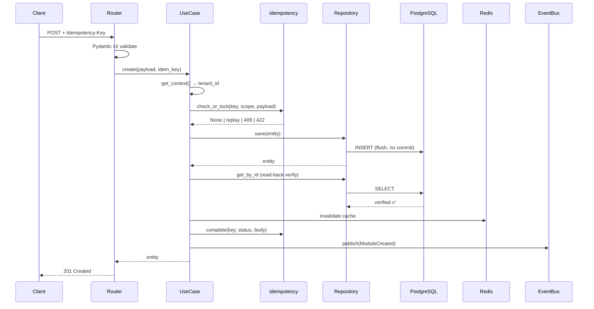
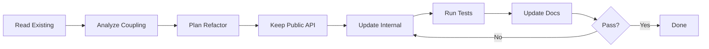

### ไฟล์เดียวจบสำหรับ OpenCode + Python DDD + Clean Architecture**
# opencode_promt_python_ddd.md

> **Consolidated Master Prompt for Python DDD / Clean Architecture**
> รวมข้อมูลจาก `create_module.ps1`, `create_modules.bat`, `opencode_promt.md`, `readme_promt.md`, `RUN_GUIDE_opencode_promt.md`
> **Stack:** Python 3.14+ · FastAPI · Pydantic v2 · SQLAlchemy 2.0 · PostgreSQL 17 · Redis 8 · Kafka
> **ขอบเขต:** ERP + CRM + IoT (Multi-company, 65 modules / 8 layers)

---

# 📋 สารบัญ

| # | ส่วน | คำอธิบาย |
|---|---|---|
| **0** | Global Constraints | กฎบังคับทุก prompt |
| **1** | Master Structure | 23 ส่วนบังคับ |
| **2** | Task Templates A–G | 7 ประเภทงาน |
| **3** | SQL & Migration Block | V001 / V002 / V003 + RLS |
| **4** | Routing Block | Router + Model registration |
| **5** | Docs / Swagger / Postman | เอกสาร 4 ระบบ |
| **6** | Report Templates | Report A–D |
| **7** | Checklists | DoD + TDD + SQL + Docs |
| **8** | Scripts (Bat/PS1) | Template Generator |
| **9** | Quick Command Cheatsheet | คำสั่งด่วน |
| **10** | Universal Header | Header กลางสำหรับทุก prompt |

---

# 0. Global Constraints

```markdown
[GLOBAL CONSTRAINTS]
- ห้ามทักทาย / ห้ามสรุป / ห้ามอธิบายซ้ำ
- ตอบเฉพาะไฟล์ใน "Output Scope"
- โค้ดเต็ม Production-ready ห้าม `...` หรือ `# code here`
- ห้ามแตะไฟล์นอก Scope (ถ้าจำเป็น → ประกาศ SIDE-EFFECT WARNING)
- คอมเมนต์ 2 ภาษา (ไทย + English) สั้น กระชับ
- Error handling:
  • Use Case   → 3-branch (StandardException → DomainError → Exception)
  • Repository → 2-branch (StandardException → Exception)
  • Cache      → never-raise (log + return None/False)
- Type hints ครบ / Pydantic v2 / SQLAlchemy 2.0 async
- ใช้ `Decimal` เท่านั้น (ห้าม float กับเงิน/สต็อก)
- ใช้ `flush()` ห้าม `commit()` ใน Repository
- SQL: V001 create + V002 seed + V003 rollback + RLS + Trigger
- Routing: register ที่ `app/routes.py` + `migrations/env.py`
- Docs: README + OpenAPI + Postman + AsyncAPI (ถ้ามี WS)
- Path: `app/modules/{module}/{layer}/{file}.py`
- ข้อมูลไม่พอ → ถาม 1 คำถาม ห้ามเดา
```

---

# 1. Master Structure — 23 ส่วนบังคับ

```markdown
## 01. รายละเอียด (Details)
## 02. หลักการทำงาน (Concept / Behavior Spec)
## 03. ข้อกำหนด (Requirements)
## 04. เป้าหมาย (Target)
## 05. ขอบเขต (Scope)
## 06. โครงสร้าง Folder + ไฟล์
## 07. Workflow การทำงาน
## 08. Affected Areas
## 09. รายการกระบวนการทำงาน
## 10. Performance Considerations
## 11. TDD Plan
## 12. ข้อห้าม (Prohibitions)
## 13. ข้อควรระวัง (Cautions)
## 14. ข้อดี (Pros)
## 15. ข้อเสีย (Cons)
## 16. Checklist การทดสอบ
## 17. SQL & Migration Plan
## 18. Routing Registration
## 19. Documentation Package
## 20. Swagger / OpenAPI Spec
## 21. Postman Collection
## 22. สรุป (Summary)
## 23. รายงานสรุปผลการดำเนินการ
```

---

# 2. Task Templates A–G

## 🎯 TEMPLATE A: สร้างใหม่ (CREATE_NEW)

### 01. รายละเอียด

| หัวข้อ | ค่า |
|---|---|
| **Task Type** | `CREATE_NEW` |
| **Module** | `[module]` |
| **Layer** | `[0-Core / 1-Foundation / 2-Money / 3-Goods / 4-Ops / 5-Intel / 6-Monitor / 7-Template]` |
| **Stack** | `[FastAPI / Django / Both]` |
| **Priority** | `🔴 / 🟠 / 🟡` |
| **Phase** | `[1-6]` |
| **Prefix** | `[3 chars]` |
| **Dependencies** | `[module list]` |
| **Tables** | `tenant_{tid}.[table]` |
| **Endpoints** | `/api/v1/[module]/` |
| **Events** | `[ModuleCreated, ModuleUpdated, ...]` |

### 06. โครงสร้าง Folder + ไฟล์ (40 ไฟล์)

```
app/modules/{module}/
├── domain/                (6 ไฟล์)
│   ├── __init__.py
│   ├── entities.py
│   ├── value_objects.py
│   ├── enums.py
│   ├── events.py
│   └── exceptions.py
├── application/           (6 ไฟล์)
│   ├── __init__.py
│   ├── interfaces.py
│   ├── use_cases.py
│   ├── mappers.py
│   ├── exceptions.py
│   └── utils.py
├── infrastructure/        (5 ไฟล์)
│   ├── __init__.py
│   ├── models.py
│   ├── repositories.py
│   ├── caches.py
│   └── services.py
├── presentation/          (5 ไฟล์)
│   ├── __init__.py
│   ├── routers.py
│   ├── schemas.py
│   ├── docs.py
│   └── dependencies.py
└── __init__.py            (1 ไฟล์)

db/migrations/             (3 ไฟล์)
├── V001__create_{module}.sql
├── V002__seed_{module}.sql
└── V003__rollback_{module}.sql

tests/                     (4 ไฟล์)
├── unit/test_{module}.py
├── integration/test_{module}_repository.py
├── property/test_{module}_invariants.py
└── manual/manual_test_{module}.md

docs/                      (2 ไฟล์)
├── README_{module}.md
└── API_{module}.md

app/routes.py              (แก้)
migrations/env.py          (แก้)
```

### 07. Workflow



### 12. ข้อห้าม

```markdown
❌ ห้าม import framework ใน domain/
❌ ห้าม commit() ใน Repository (ใช้ flush())
❌ ห้าม raise ใน Cache (never-raise)
❌ ห้าม float กับเงิน/สต็อก
❌ ห้าม hardcode secret
❌ ห้าม UPDATE/DELETE ใน audit/event store
❌ ห้าม query ข้าม tenant
❌ ห้ามลบ migration V001-V003 ที่ commit แล้ว
❌ ห้าม CREATE TABLE IF NOT EXISTS ใน migration หลัก
```

### 17. SQL & Migration Plan

> ใช้ `create_modules.bat sql {module} {prefix}` หรือดูกฎใน [ส่วนที่ 3](#3-sql--migration-block)

### 18. Routing Registration

> ใช้ `create_modules.bat routes {module}` หรือดูกฎใน [ส่วนที่ 4](#4-routing-block)

### 22. สรุป

| รายการ | จำนวน |
|---|---|
| Python files | 23 |
| SQL files | 3 |
| Test files | 4 |
| Docs files | 2 |
| Routing (แก้) | 2 |
| **รวม** | **34** |

### 23. รายงาน — Report A

---

## 🎯 TEMPLATE B: แก้ไขของเดิม (REFACTOR)

| หัวข้อ | ค่า |
|---|---|
| **Task Type** | `REFACTOR` |
| **Target Files** | `[list]` |
| **Breaking Change** | `Yes / No` |
| **Migration Impact** | `None / New migration needed` |



**ข้อห้าม:**
```markdown
❌ ห้ามเปลี่ยน public signature
❌ ห้ามแตะ layer อื่น
❌ ห้าม refactor นอกจุดที่ระบุ
❌ ห้ามเพิ่ม feature ใหม่
❌ ห้ามลบ tests เดิม
❌ ห้ามแก้ migration V001-V003 ที่ commit แล้ว
```

---

## 🎯 TEMPLATE C: เพิ่ม/แก้ไขจากเดิม (EXTEND)

| หัวข้อ | ค่า |
|---|---|
| **Task Type** | `EXTEND` |
| **Module** | `[module]` |
| **Feature** | `[feature ใหม่]` |
| **New Endpoints** | `[list]` |
| **New Migration** | `V00X__{action}.sql` |

**Diff Plan:**

| ไฟล์ | Action | รายละเอียด |
|---|---|---|
| `domain/entities.py` | `+method` | `bulk_create()` |
| `application/use_cases.py` | `+class` | `BulkCreateUseCase` |
| `presentation/routers.py` | `+endpoint` | `POST /bulk/` |
| `presentation/schemas.py` | `+schema` | `BulkCreateRequest` |
| `db/migrations/V004__add_bulk.sql` | `new` | index + column |

---

## 🎯 TEMPLATE D: แก้ Bug (BUGFIX)

| หัวข้อ | ค่า |
|---|---|
| **Task Type** | `BUGFIX` |
| **Severity** | `🔴 / 🟡 / 🟢` |
| **Env** | `dev / staging / prod` |
| **Migration Impact** | `None / New migration` |

**Bug Report:**
```markdown
Symptom: [อาการ]
Steps: 1. ... 2. ...
Expected: [สิ่งที่ควรเกิด]
Actual: [สิ่งที่เกิด]
Stacktrace: [paste]
```

**Hypothesis (STEP 1 — รออนุมัติ):**
```markdown
1. Root Cause: [ไฟล์:บรรทัด + คำอธิบาย]
2. Fix Strategy: hotfix / proper fix / refactor
3. Migration needed? Yes/No
```

---

## 🎯 TEMPLATE E: ตรวจสอบความปลอดภัย (SECURITY AUDIT)

| หัวข้อ | ค่า |
|---|---|
| **Task Type** | `SECURITY_AUDIT` |
| **Standard** | `OWASP Top 10 / ASVS L2` |
| **Mode** | `Read-only / Audit+Fix` |

**Output — ตารางเท่านั้น:**

| # | Risk | Layer | File:Line | Severity | CWE | แนะนำแก้ | Auto-fix |
|---|---|---|---|---|---|---|---|
| 1 | ... | ... | ... | 🔴 | CWE-XXX | ... | ✅ |

**Security Checklist:**
```markdown
#### A. Authentication & Authorization
- [ ] Nested JWT (JWS + JWE)
- [ ] Refresh token rotation
- [ ] RBAC ทุก endpoint

#### B. Input Validation
- [ ] Pydantic v2 strict
- [ ] SQL injection (ORM parameterized)
- [ ] Mass assignment

#### C. Data Protection
- [ ] Encryption at rest
- [ ] TLS in transit
- [ ] PII masking ใน logs

#### D. Multi-tenancy
- [ ] tenant_id ทุก query
- [ ] RLS policy ทุกตาราง
- [ ] Cross-tenant leakage test

#### E. API Security
- [ ] Rate limiting
- [ ] CORS policy
- [ ] CSRF (BFF)
- [ ] Idempotency key

#### F. SQL Security
- [ ] RLS enabled + forced
- [ ] FK ON DELETE ถูกต้อง
- [ ] Search_path ปลอดภัย
```

---

## 🎯 TEMPLATE F: ทดสอบประสิทธิภาพ (PERFORMANCE)

| หัวข้อ | ค่า |
|---|---|
| **Task Type** | `PERF_TEST` |
| **SLO** | `p95 < X ms, > Y rps` |
| **Tool** | `locust / k6 / pytest-benchmark` |

**Metrics:**

| Metric | Tool | Target | Before | After |
|---|---|---|---|---|
| p50 | pytest-benchmark | < 50ms | ? | ? |
| p95 | locust | < 200ms | ? | ? |
| RPS | locust | > 100 | ? | ? |
| DB queries/req | SQLAlchemy events | < 5 | ? | ? |
| Seq scans | EXPLAIN | 0 | ? | ? |

---

## 🎯 TEMPLATE G: ทำคู่มือ (DOCUMENTATION)

| หัวข้อ | ค่า |
|---|---|
| **Task Type** | `DOCUMENTATION` |
| **Doc Type** | `README / API / ARCH / RUNBOOK / ONBOARDING / ADR` |
| **Audience** | `Dev / DevOps / PM / End-user` |

**Doc Structure:**
```
docs/
├── README_{module}.md
├── API_{module}.md
├── ARCH_{module}.md
├── RUNBOOK_{module}.md
├── postman/{module}.postman_collection.json
└── adr/ADR-{nnn}-{title}.md
```

---

# 3. SQL & Migration Block

### 📄 `V001__create_{module}.sql`

```sql
-- ═══════════════════════════════════════════════════════════════
-- V001__create_{module}.sql
-- Module: {module} | Prefix: {prefix} | Layer: {layer}
-- Description: สร้างตาราง + index + RLS policy + trigger
-- ═══════════════════════════════════════════════════════════════
BEGIN;

CREATE SEQUENCE IF NOT EXISTS {prefix}_number_seq START 1;

CREATE TABLE tenant_{prefix}.{module}s (
    id           UUID PRIMARY KEY DEFAULT gen_random_uuid(),
    tenant_id    UUID NOT NULL,
    code         VARCHAR(50)  NOT NULL,
    name         VARCHAR(200) NOT NULL,
    status       VARCHAR(20)  NOT NULL DEFAULT 'ACTIVE',
    amount       NUMERIC(15,2) NOT NULL DEFAULT 0,
    metadata     JSONB        NOT NULL DEFAULT '{}'::jsonb,
    version      INTEGER      NOT NULL DEFAULT 1,
    created_at   TIMESTAMPTZ  NOT NULL DEFAULT NOW(),
    updated_at   TIMESTAMPTZ  NOT NULL DEFAULT NOW(),
    deleted_at   TIMESTAMPTZ,

    CONSTRAINT uq_{module}_code   UNIQUE (tenant_id, code),
    CONSTRAINT ck_{module}_amount CHECK (amount >= 0),
    CONSTRAINT ck_{module}_status CHECK (status IN ('ACTIVE','INACTIVE','ARCHIVED'))
);

CREATE INDEX ix_{module}_tenant_status
    ON tenant_{prefix}.{module}s(tenant_id, status)
    WHERE deleted_at IS NULL;
CREATE INDEX ix_{module}_code    ON tenant_{prefix}.{module}s(code);
CREATE INDEX ix_{module}_created ON tenant_{prefix}.{module}s(created_at DESC);

CREATE OR REPLACE FUNCTION public.set_updated_at()
RETURNS TRIGGER AS $$
BEGIN
    NEW.updated_at = NOW();
    RETURN NEW;
END;
$$ LANGUAGE plpgsql;

CREATE TRIGGER trg_{module}_updated_at
    BEFORE UPDATE ON tenant_{prefix}.{module}s
    FOR EACH ROW EXECUTE FUNCTION public.set_updated_at();

ALTER TABLE tenant_{prefix}.{module}s ENABLE ROW LEVEL SECURITY;

CREATE POLICY p_{module}_tenant ON tenant_{prefix}.{module}s
    USING (tenant_id = current_setting('app.current_tenant', true)::uuid);

COMMIT;
```

### 📄 `V002__seed_{module}.sql`

```sql
BEGIN;
INSERT INTO tenant_{prefix}.{module}s (tenant_id, code, name, status)
VALUES ('00000000-0000-0000-0000-000000000001', 'SYS-DEFAULT', 'System Default', 'ACTIVE')
ON CONFLICT (tenant_id, code) DO NOTHING;
COMMIT;
```

### 📄 `V003__rollback_{module}.sql`

```sql
BEGIN;
DROP TRIGGER  IF EXISTS trg_{module}_updated_at ON tenant_{prefix}.{module}s;
DROP POLICY   IF EXISTS p_{module}_tenant       ON tenant_{prefix}.{module}s;
DROP TABLE    IF EXISTS tenant_{prefix}.{module}s CASCADE;
DROP SEQUENCE IF EXISTS {prefix}_number_seq;
COMMIT;
```

### 📄 Update `migrations/env.py`

```python
from app.modules.{module}.infrastructure.models import {Module}Model
```

---

# 4. Routing Block

### 📄 `app/routes.py`

```python
from fastapi import APIRouter
from app.modules.{module}.presentation.routers import router as {module}_router

api_router = APIRouter(prefix="/api/v1")

# Layer 0
api_router.include_router(events_router)
api_router.include_router(audit_router)

# Layer N
api_router.include_router({module}_router)  # ← เพิ่ม

router = APIRouter()
router.include_router(api_router)
router.include_router(health_router)
```

### 📄 `presentation/routers.py`

```python
router = APIRouter(prefix="/{module}", tags=["{Module}"])
```

### ✅ Routing Checklist

```markdown
- [ ] import router ใน `app/routes.py`
- [ ] `include_router({module}_router)` อยู่ layer ถูก
- [ ] prefix ไม่ซ้ำกับ module อื่น
- [ ] tags ถูกต้อง (แสดงใน Swagger)
- [ ] เปิด `http://localhost:8000/docs` → เห็น endpoint ใหม่
- [ ] เปิด `http://localhost:8000/openapi.json` → เห็น schema
```

---

# 5. Docs / Swagger / Postman Block

### 📄 `docs/README_{module}.md`

```markdown
# Module: {module}
> Layer · Prefix · Version

## Purpose
## Architecture (Mermaid)
## Dependencies
## Database Schema
## API Endpoints
## Permissions
## Domain Events
## Environment Variables
## Setup
## Testing
## Usage Example
## Known Limitations
## Changelog
```

### 📄 Swagger Metadata

```python
router = APIRouter(prefix="/{module}", tags=["{Module}"])

@router.post(
    "/",
    status_code=201,
    summary="สร้าง {module}",
    operation_id="create_{module}",
    responses={
        201: RESPONSE_CREATE_201,
        400: RESPONSE_ERROR_400,
        409: {"description": "Conflict"},
        422: {"description": "Idempotency mismatch"},
    },
)
```

### 📄 Postman Collection

```json
{
  "info": { "name": "ERPIoT — {Module}" },
  "item": [
    { "name": "Auth" },
    { "name": "{Module} — Create" },
    { "name": "{Module} — List" },
    { "name": "{Module} — Get" },
    { "name": "{Module} — Update" },
    { "name": "{Module} — Delete" },
    { "name": "Health" }
  ]
}
```

---

# 6. Report Templates

## 📊 Report A: Task Completion

```markdown
# 📋 Task Report — {TaskType} / {Module}
## ✅ สรุปผล
| รายการ | สถานะ | หมายเหตุ |
|---|---|---|
| Domain | ✅ | 6 ไฟล์ |
| Application | ✅ | 6 ไฟล์ |
| Infrastructure | ✅ | 5 ไฟล์ |
| Presentation | ✅ | 5 ไฟล์ |
| SQL Migrations | ✅ | V001/V002/V003 |
| Routing | ✅ | routes.py + env.py |
| Docs | ✅ | README + API |
| Tests | ✅ | 4 ประเภท |
```

## 📊 Report B: Bug Fix

```markdown
# 🐛 Bug Fix Report — {bug_id}
## 🔍 Root Cause
## 🛠️ Fix
## 🧪 Regression Test
## 📊 Impact
## ✅ Verification
```

## 📊 Report C: Security Audit

```markdown
# 🔐 Security Audit Report
| # | Risk | Severity | CWE | Location | Fix |
```

## 📊 Report D: Performance

```markdown
# ⚡ Performance Report
| Metric | Before | After | Δ | Target | ผ่าน? |
```

---

# 7. Checklists

## ✅ DoD

```markdown
### Code
- [ ] Domain ไม่ import framework
- [ ] ใช้ Decimal
- [ ] flush() ไม่ commit()
- [ ] Cache never-raise
- [ ] Error handling 3/2/never
- [ ] Type hints ครบ

### SQL
- [ ] V001 create + index + RLS + trigger
- [ ] V002 seed
- [ ] V003 rollback
- [ ] env.py import models

### Routing
- [ ] register app/routes.py
- [ ] /docs เห็น tag ใหม่
- [ ] prefix ไม่ซ้ำ

### Tests
- [ ] Unit ≥ 8
- [ ] Integration ผ่าน
- [ ] Property 100 iter
- [ ] Manual 8 scenarios

### Docs
- [ ] README อัปเดต
- [ ] Swagger metadata ครบ
- [ ] Postman collection อัปเดต
```

## ✅ SQL Migration

```markdown
- [ ] V001 (ไม่ IF NOT EXISTS)
- [ ] V002 (ON CONFLICT DO NOTHING)
- [ ] V003 (CASCADE)
- [ ] BEGIN/COMMIT ครบ
- [ ] id/tenant_id/version/created_at/updated_at/deleted_at
- [ ] CONSTRAINT (CHECK, UNIQUE, FK)
- [ ] Partial index
- [ ] ENABLE ROW LEVEL SECURITY
- [ ] CREATE POLICY
- [ ] BEFORE UPDATE trigger
```

## ✅ TDD Flow

```markdown
### Step 1: RED
- [ ] test fail ก่อน
- [ ] happy path
- [ ] edge cases
- [ ] error cases

### Step 2: GREEN
- [ ] minimal code
- [ ] test ผ่าน

### Step 3: REFACTOR
- [ ] behavior คงเดิม
- [ ] test ผ่าน
- [ ] Coverage ไม่ลด
```

## ✅ Pre-Flight

```markdown
- [ ] ใส่ Global Constraints
- [ ] Task Type (A-G)
- [ ] Module + Layer + Stack
- [ ] Output Scope (files)
- [ ] SQL needed? Yes/No
- [ ] Routing update? Yes/No
- [ ] Docs needed? Yes/No
- [ ] Postman needed? Yes/No
- [ ] Bug → stacktrace
- [ ] Security → Mode
- [ ] Perf → SLO
```

---

# 8. Scripts (Bat/PS1)

## 8.1 ตาราง Scripts

| Script | หน้าที่ | ตัวอย่าง |
|---|---|---|
| `create_modules.bat` | Wrapper เรียก PS1 | `create_modules.bat new inventory 3 inv --sql --tests --docs --routes` |
| `create_module.ps1` | Implementation หลัก | ดูรายละเอียดด้านล่าง |

## 8.2 Actions

| Action | คำอธิบาย |
|---|---|
| `new` | สร้าง module ใหม่ (4 layers + __init__) |
| `sql` | สร้าง V001/V002/V003 |
| `routes` | Register router + model |
| `test` | สร้าง unit/integration/property/manual |
| `docs` | สร้าง README + API |
| `all` | ทำทุกอย่าง |
| `template` | Generate OpenCode prompt ตาม Template A-G |
| `help` | แสดง help |

## 8.3 Layer Mapping

| Layer | ชื่อ | ตัวอย่าง |
|---|---|---|
| 0 | Core | audit, idempotency, events |
| 1 | Foundation | tenant, user, auth |
| 2 | Money | invoice, payment, gl |
| 3 | Goods | inventory, product, warehouse |
| 4 | Ops | sales, purchase, production |
| 5 | Intel | report, dashboard, analytics |
| 6 | Monitor | iot, alert, health |
| 7 | Template | report_template, email_template |

## 8.4 `create_modules.bat` — Full Code

```bat
@echo off
REM ═══════════════════════════════════════════════════════════════
REM  create_modules.bat
REM  Wrapper — เรียก PowerShell เพื่อสร้าง/แก้ไข module
REM  (Generic Module Generator for ERP+CRM+IoT)
REM
REM  USAGE:
REM    create_modules.bat <action> <module> [layer] [prefix] [options]
REM
REM  ACTIONS:
REM    new       สร้าง module ใหม่ (4 layers + __init__)
REM    sql       สร้าง SQL migrations V001/V002/V003
REM    routes    Register router + model
REM    test      สร้าง tests (unit/integration/property/manual)
REM    docs      สร้าง docs (README + API)
REM    template  Generate OpenCode prompt ตาม Template A-G
REM    all       ทำทุกอย่าง
REM    help      แสดง help
REM
REM  OPTIONS:
REM    --sql     สร้าง SQL
REM    --tests   สร้าง tests
REM    --docs    สร้าง docs
REM    --routes  register router + model
REM    --force   เขียนทับไฟล์เดิม
REM    --template=A|B|C|D|E|F|G
REM
REM  EXAMPLES:
REM    create_modules.bat new inventory 3 inv --sql --tests --docs --routes
REM    create_modules.bat template A inventory 3 inv
REM    create_modules.bat sql invoice inv
REM    create_modules.bat all sales 4 sal --force
REM    create_modules.bat help
REM ═══════════════════════════════════════════════════════════════

chcp 65001 >nul
setlocal EnableDelayedExpansion

REM ─── หา PowerShell ─────────────────────────────────────────
where powershell >nul 2>nul
if errorlevel 1 (
    echo [ERROR] PowerShell not found in PATH
    exit /b 1
)

set "PS_SCRIPT=%~dp0create_module.ps1"
if not exist "%PS_SCRIPT%" (
    echo [ERROR] create_module.ps1 not found at:
    echo        %PS_SCRIPT%
    echo.
    echo กรุณาวาง create_module.ps1 ไว้โฟลเดอร์เดียวกับ create_modules.bat
    exit /b 1
)

REM ─── ไม่มี argument → แสดง help ───────────────────────────
if "%~1"=="" (
    powershell -NoProfile -ExecutionPolicy Bypass -File "%PS_SCRIPT%" -Action help
    goto :end
)

REM ─── ส่งต่อ argument ทั้งหมด ───────────────────────────────
powershell -NoProfile -ExecutionPolicy Bypass -File "%PS_SCRIPT%" %*
set "EXITCODE=%ERRORLEVEL%"

:end
echo.
if not "%EXITCODE%"=="0" (
    echo [ERROR] Exit code %EXITCODE%
) else (
    echo [DONE] Completed successfully.
)
echo.
pause
endlocal
exit /b %EXITCODE%
```

## 8.5 `create_module.ps1` — Usage & Core Spec

```powershell
<#
.SYNOPSIS
    create_module.ps1 — Generic Module Generator v6.0
.DESCRIPTION
    สร้าง/แก้ไข module ตาม Clean Architecture + DDD (ERP+CRM+IoT)
    - 4 layers: domain / application / infrastructure / presentation
    - SQL: V001 create + V002 seed + V003 rollback + RLS
    - Routing: app/routes.py + migrations/env.py
    - Tests: unit / integration / property / manual
    - Docs: README + API
    - Template: Generate OpenCode prompt (A-G)
.EXAMPLE
    .\create_module.ps1 new inventory 3 inv --sql --tests --docs --routes
.EXAMPLE
    .\create_module.ps1 template A inventory 3 inv
.EXAMPLE
    .\create_module.ps1 sql inventory inv
.EXAMPLE
    .\create_module.ps1 routes inventory
.EXAMPLE
    .\create_module.ps1 help
#>

[CmdletBinding()]
param(
    [Parameter(Position = 0)]
    [ValidateSet("new","sql","routes","test","docs","template","all","help")]
    [string]$Action = "help",

    [Parameter(Position = 1)]
    [string]$Module = "",

    [Parameter(Position = 2)]
    [string]$Layer = "0",

    [Parameter(Position = 3)]
    [string]$Prefix = "",

    [ValidateSet("A","B","C","D","E","F","G")]
    [string]$TemplateName = "A",

    [switch]$SQL,
    [switch]$Tests,
    [switch]$Docs,
    [switch]$Routes,
    [switch]$Force
)

# CONFIG
$ROOT       = "app\modules"
$ROUTES_F   = "app\routes.py"
$ENV_F      = "migrations\env.py"
$SQL_DIR    = "db\migrations"
$TESTS_DIR  = "tests"
$DOCS_DIR   = "docs"
$PROMPTS_DIR = "docs\prompts"
```

**Functions หลัก:**
- `Write-FileUtf8` — เขียนไฟล์ UTF-8 no BOM
- `Get-LayerName` — map layer 0-7
- `Get-Pascal` — แปลง snake_case → PascalCase
- `New-DomainLayer` — 6 ไฟล์
- `New-ApplicationLayer` — 6 ไฟล์
- `New-InfrastructureLayer` — 5 ไฟล์
- `New-PresentationLayer` — 5 ไฟล์
- `New-ModuleRoot` — `__init__.py`
- `New-SQLMigrations` — V001/V002/V003
- `New-Tests` — 4 ไฟล์
- `New-Docs` — README + API
- `Add-RouterRegistration` — แก้ `app/routes.py`
- `Add-ModelRegistration` — แก้ `migrations/env.py`
- `New-OpenCodePrompt` — สร้าง prompt Template A-G

## 8.6 ตัวอย่างครบวงจร

```bat
REM 1. สร้าง module เปล่า
create_modules.bat new inventory 3 inv

REM 2. Full package
create_modules.bat new inventory 3 inv --sql --tests --docs --routes

REM 3. Generate OpenCode prompt
create_modules.bat template A inventory 3 inv

REM 4. เพิ่ม SQL ใหม่
create_modules.bat sql inventory inv

REM 5. Register router
create_modules.bat routes inventory

REM 6. ดู help
create_modules.bat help
```

---

# 9. Quick Command Cheatsheet

```bash
# ─── A: CREATE_NEW ────────────────────────────────────
opencode -c "TEMPLATE A + module=inventory + layer=3-goods + FULL OUTPUT"

# ─── B: REFACTOR ─────────────────────────────────────
opencode -c "TEMPLATE B + target=repositories.py"

# ─── C: EXTEND ───────────────────────────────────────
opencode -c "TEMPLATE C + module=key + feature=bulk-revoke"

# ─── D: BUGFIX ───────────────────────────────────────
opencode -c "TEMPLATE D + stacktrace=[paste]"

# ─── E: SECURITY ─────────────────────────────────────
opencode -c "TEMPLATE E + target=authentication + Mode=Read-only"

# ─── F: PERFORMANCE ──────────────────────────────────
opencode -c "TEMPLATE F + target=knowledge/list + SLO p95<200ms"

# ─── G: DOCS ─────────────────────────────────────────
opencode -c "TEMPLATE G + Doc Type=README + module=events"

# ─── Scripts ─────────────────────────────────────────
create_modules.bat new inventory 3 inv --sql --tests --docs --routes
create_modules.bat template A inventory 3 inv
create_modules.bat help
```

---

# 10. Universal Header

```markdown
# ═══════════════════════════════════════════════════════════════
# 🎯 OPENCODE PROMPT — [Module] / [Task A-G]
# ═══════════════════════════════════════════════════════════════

[GLOBAL CONSTRAINTS]
- ห้ามทักทาย / ห้ามสรุป / ห้ามอธิบายซ้ำ
- ตอบเฉพาะไฟล์ใน Output Scope
- โค้ดเต็ม Production-ready ห้าม `...`
- คอมเมนต์ 2 ภาษา (TH+EN)
- 3-branch / 2-branch / never-raise
- Decimal / flush() ห้าม commit()
- SQL: V001 + V002 + V003 + RLS
- Routing: app/routes.py + migrations/env.py
- Docs: README + Swagger + Postman

### Metadata
- Task: [A-G] | Module: [xxx] | Layer: [0-7]
- Stack: [FastAPI / Django / Both]

### Output Scope (23 ส่วน)
01-16: Details → Checklist
17: SQL & Migration (บังคับ)
18: Routing (บังคับ)
19-21: Docs + Swagger + Postman (บังคับ)
22-23: Summary + Report

# ═══════════════════════════════════════════════════════════════
```

---

# ✅ สรุปความสมบูรณ์

| ส่วน | สถานะ |
|---|---|
| Global Constraints | ✅ |
| 23 ส่วนบังคับ | ✅ |
| 7 Task Templates (A–G) | ✅ |
| SQL & Migration Block | ✅ V001 + V002 + V003 + RLS |
| Routing Block | ✅ routes.py + env.py |
| Docs / Swagger / Postman | ✅ 4 ระบบ |
| 4 Report Templates | ✅ A/B/C/D |
| Checklists | ✅ DoD + TDD + Pre-flight + SQL + Docs |
| Scripts (Bat/PS1) | ✅ |
| Cheatsheet | ✅ |
| Universal Header | ✅ |

