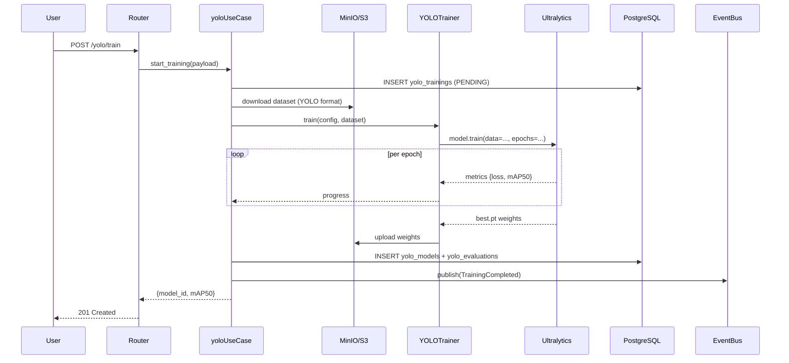
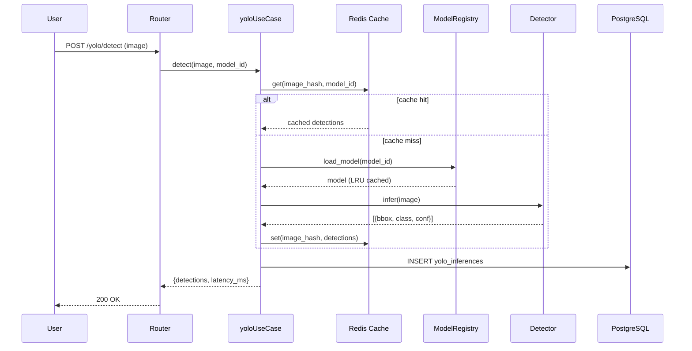
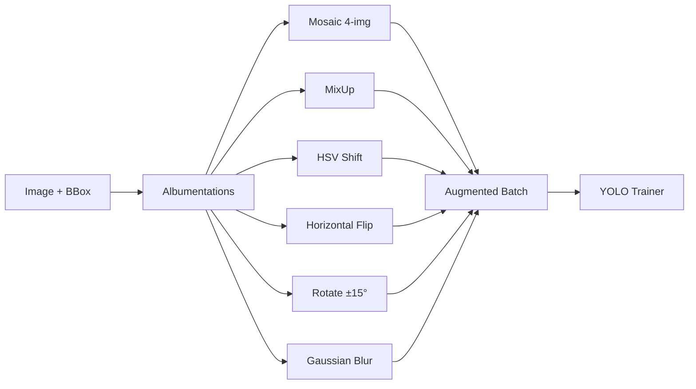

# 🎯 แผนสร้าง Module YOLO Object Detection (ของจริง)

ผมเข้าใจแล้วครับ — ทั้ง 2 ไฟล์เดิมใช้ prefix `yolo` แต่ไม่ใช่ YOLO object detection เลย ต้องสร้าง **module ใหม่** ที่ทำงานจริงตาม JD

## 📊 เปรียบเทียบ 3 Modules ที่ใช้ prefix `yolo`

| มิติ | `yolo_module.md` (เดิม) | `yolo_module.py` (เดิม) | **`yolo_module_detection.md` (ใหม่)** |
|---|---|---|---|
| จุดประสงค์ | LLM Gateway | Generic MLOps (sklearn) | **YOLO Object Detection** |
| Algorithm | OpenAI/Anthropic | LogisticRegression, RF | **YOLOv8/v11 (Ultralytics)** |
| Input | Text messages | Tabular features | **Images / Video / RTSP** |
| Output | Text completion | Class/Score | **Bounding boxes + Classes + Conf** |
| Metrics | Token cost | accuracy/f1 | **mAP@50, mAP@50-95, IoU** |
| Dataset | N/A | Tabular | **Roboflow/YOLO format + Augmentation** |
| Export | N/A | pickle | **ONNX / TensorRT / TorchScript** |
| ควรใช้ชื่อ | `llm_gateway` | `mlops` | **`yolo`** ← ควรเป็นตัวนี้ |

## 🎯 Design Decisions

| ประเด็น | เลือก | เหตุผล |
|---|---|---|
| **Algorithm** | Ultralytics YOLOv8/v11 | ทันสมัย, DX ดี, รองรับ export ครบ |
| **Framework** | PyTorch 2.x + Ultralytics | ตาม JD |
| **Augmentation** | Albumentations | เร็วกว่า torchvision, มี mosaic/mixup |
| **Detection** | Real-time + Batch + Video | ตาม JD |
| **Metrics** | COCO mAP (Ultralytics built-in) | mAP@50, mAP@50-95, per-class |
| **Export** | ONNX, TensorRT, TorchScript | ตาม JD |
| **Storage** | S3/MinIO (images) + DB (metadata) | scale ได้ |
| **Schema** | `public`, prefix `yolo_` | ตาม pattern เดิม |
| **Tables** | 7 tables | datasets, classes, images, annotations, trainings, models, inferences |

## 🗂️ 7 Tables ที่จะสร้าง

```
yolo_datasets        -- dataset registry (name, format, splits, class_count)
yolo_classes         -- class definitions (name, id, color, count) per dataset
yolo_images          -- image metadata (uri, hash, width, height, split, split)
yolo_annotations     -- bbox labels (image_id, class_id, x, y, w, h, confidence)
yolo_trainings       -- training runs (model_type, epochs, batch, imgsz, aug_config)
yolo_models          -- model registry (weights_uri, format, mAP, versions)
yolo_inferences      -- inference log (image_uri, detections_json, latency_ms)
```

## 🔌 14 Endpoints

**Datasets:** `POST /datasets`, `GET /datasets`, `POST /datasets/{id}/import-roboflow`
**Annotations:** `POST /annotations`, `GET /images/{id}/annotations`
**Training:** `POST /train`, `GET /train/{id}`, `POST /train/{id}/cancel`
**Models:** `GET /models`, `POST /models/{id}/export` (ONNX/TensorRT)
**Inference:** `POST /detect`, `POST /detect/batch`, `POST /detect/stream` (video/SSE)
**Metrics:** `GET /metrics/{model_id}`

---

# 📄 Part 1: `yolo_detection_spec.md`

```markdown
# 📦 Deliverable: Module `yolo` — YOLO Object Detection Platform

> **Module:** `yolo` · **Layer:** `5-Intel` · **Prefix:** `yolo`
> **Schema:** `public` · **Tables:** `yolo_datasets`, `yolo_classes`, `yolo_images`,
>   `yolo_annotations`, `yolo_trainings`, `yolo_models`, `yolo_inferences`
> **Stack:** Python 3.11+ · Ultralytics 8.x · PyTorch 2.x · OpenCV 4.x ·
>   Albumentations · FastAPI · Pydantic v2 · SQLAlchemy 2.0 async ·
>   PostgreSQL 16 · Redis 7 · Kafka · MinIO/S3 · ONNX Runtime · TensorRT
> **Pattern:** DDD + Clean Architecture + Event-Driven
> **Generator:** `create_module_yolo_detection.py` v2.0

---

## 0. Global Constraints

```markdown
[GLOBAL CONSTRAINTS]
- ห้ามทักทาย / ห้ามสรุป / ห้ามอธิบายซ้ำ
- โค้ดเต็ม Production-ready ห้าม `...` หรือ `# code here`
- คอมเมนต์ 2 ภาษา (TH + EN) สั้น กระชับ
- Error handling:
  • Use Case   → 3-branch (DomainError → AppError → Exception)
  • Repository → 2-branch (AppError → Exception)
  • Cache/S3   → never-raise (log + return None/False)
  • Inference  → never-raise + retry with backoff
- Type hints ครบ / Pydantic v2 / SQLAlchemy 2.0 async
- ใช้ `Decimal` สำหรับ confidence/cost, `float` สำหรับพิกัด bbox ได้
- ใช้ `flush()` ห้าม `commit()` ใน Repository
- Inference ต้อง timeout 30s, batch ≤ 32 images
- Image/Video: ห้ามโหลดเข้า RAM ทั้งไฟล์ → stream
- Model weights: ห้ามโหลดซ้ำถ้า cached (LRU)
- SQL (v2.0): Schema=public, prefix=yolo_, DROP+CREATE, types ตรง
- Path: `app/modules/yolo/{layer}/{file}.py`
```

---

## 1. Module Overview

### 01. รายละเอียด

| หัวข้อ | ค่า |
|---|---|
| **Task Type** | `CREATE_yolo_detection` |
| **Module** | `yolo` |
| **Layer** | `5-Intel` |
| **Stack** | `FastAPI + Ultralytics YOLOv8/v11 + PyTorch` |
| **Prefix** | `yolo` |
| **Schema** | `public` |
| **Dependencies** | `tenant`, `user`, `auth`, `audit`, `events`, `idempotency`, `storage` |
| **Tables** | `public.yolo_datasets`, `public.yolo_classes`, `public.yolo_images`, `public.yolo_annotations`, `public.yolo_trainings`, `public.yolo_models`, `public.yolo_inferences` |
| **Endpoints** | `/api/v1/yolo/datasets`, `/api/v1/yolo/annotations`, `/api/v1/yolo/train`, `/api/v1/yolo/models`, `/api/v1/yolo/detect`, `/api/v1/yolo/metrics` |
| **Events** | `DatasetRegistered`, `ImagesUploaded`, `AnnotationsCreated`, `TrainingStarted`, `TrainingCompleted`, `ModelExported`, `InferenceServed`, `ModelDriftDetected` |

### 02. หลักการทำงาน

ระบบ yolo (Detection) ทำหน้าที่เป็น **Object Detection Platform** ที่:

1. **Dataset Management** — import จาก Roboflow, YOLO format, COCO, LabelImg
2. **Labeling** — รองรับ bounding box, polygon, class management
3. **Augmentation** — Albumentations: mosaic, mixup, HSV, flip, rotate, blur
4. **Training** — Ultralytics YOLOv8/v11 (n/s/m/l/x), transfer learning
5. **Evaluation** — COCO mAP@50, mAP@50-95, per-class, confusion matrix
6. **Export** — ONNX, TensorRT, TorchScript, CoreML, TFLite
7. **Inference** — Real-time sync, batch, video stream (SSE)
8. **Tracking** — inference logs, latency, drift detection

**Invariants:**
- ทุก dataset ต้องมี `tenant_id` + `name` unique
- ทุก annotation ต้องมี `image_id` + `class_id` + bbox normalized (0-1)
- ทุก training ต้องมี `dataset_id` + `model_type`
- Model weights ต้อง hash (SHA256) ก่อนบันทึก
- Inference ต้องบันทึก `latency_ms` + `detections_json`
- Confidence threshold default 0.25, NMS IoU default 0.45
- Image max size = 4096x4096, format ∈ {jpg, png, webp}
- ห้าม log image binary / base64

**State Machines:**
```
Dataset:     DRAFT → READY → TRAINING → ARCHIVED
Training:    PENDING → RUNNING → SUCCESS | FAILED | CANCELLED
Model:       TRAINED → EVALUATED → EXPORTED → DEPLOYED → ARCHIVED
Inference:   PENDING → RUNNING → COMPLETED → FAILED
```

### 03. ข้อกำหนด

**FR:**
- FR-01: Dataset CRUD + import (Roboflow/YOLO/COCO)
- FR-02: Image upload (single + batch + streaming)
- FR-03: Annotation CRUD (bbox + class)
- FR-04: Augmentation pipeline config
- FR-05: YOLO training (sync/async job)
- FR-06: Training monitoring (loss, mAP per epoch)
- FR-07: Model evaluation (COCO metrics)
- FR-08: Model export (ONNX/TensorRT/TorchScript)
- FR-09: Real-time inference (single image)
- FR-10: Batch inference (≤ 32 images)
- FR-11: Video/stream inference (SSE)
- FR-12: Inference logging + latency tracking
- FR-13: Model versioning + rollback
- FR-14: Drift detection (class distribution shift)

**NFR:**
- Single image inference < 100ms (YOLOv8n @ GPU)
- Batch 32 images < 2s (GPU)
- Training throughput ≥ 100 img/s (batch=16, GPU)
- mAP@50 ≥ 0.85 on COCO subset
- Model load time < 2s
- Cache hit ≥ 40% (same image hash)
- Uptime ≥ 99.5%
- RLS enforced
- GPU memory < 8GB (YOLOv8m training)

### 04. Technology Stack

| Component | Version | Purpose |
|---|---|---|
| Python | 3.11+ | Runtime |
| FastAPI | ≥ 0.115 | Web framework |
| Pydantic | v2 | Validation |
| SQLAlchemy | 2.0 async | ORM |
| PostgreSQL | 16 | Database |
| Redis | 7 | Cache + Queue |
| Kafka | 3.x | Event bus |
| Ultralytics | ≥ 8.3 | YOLO training/inference |
| PyTorch | ≥ 2.2 | Deep learning |
| TorchVision | ≥ 0.17 | Image transforms |
| OpenCV | ≥ 4.10 | Image processing |
| Albumentations | ≥ 1.4 | Augmentation |
| ONNX Runtime | ≥ 1.18 | ONNX inference |
| TensorRT | ≥ 10 | NVIDIA inference |
| Pillow | ≥ 10 | Image I/O |
| boto3 | latest | S3/MinIO |
| numpy | ≥ 1.26 | Numerical |
| tqdm | latest | Progress |

### 05. ขอบเขต

**In scope:**
- Dataset registry + import
- Image upload + storage (S3)
- Annotation (bbox) CRUD
- Augmentation pipeline
- YOLO training (Ultralytics)
- COCO evaluation (mAP)
- ONNX/TensorRT export
- Real-time + batch inference
- Video stream inference
- Inference logging

**Out of scope:**
- LLM chat (ดู module `llm` หรือ `llm_gateway`)
- Generic MLOps (ดู module `mlops`)
- Polygon/segmentation (future: `yolo_seg`)
- Pose estimation (future: `yolo_pose`)
- OCR (ดู module `ocr`)

### 06. โครงสร้าง Folder + ไฟล์ (48 ไฟล์)

```
app/modules/yolo/
├── __init__.py
├── domain/
│   ├── __init__.py
│   ├── entities/
│   │   ├── __init__.py
│   │   ├── dataset.py
│   │   ├── class_.py
│   │   ├── image.py
│   │   ├── annotation.py
│   │   ├── training.py
│   │   ├── model.py
│   │   └── inference.py
│   ├── value_objects/
│   │   ├── __init__.py
│   │   ├── bbox.py
│   │   ├── detection.py
│   │   ├── train_config.py
│   │   ├── aug_config.py
│   │   └── eval_metrics.py
│   ├── helpers/
│   │   ├── __init__.py
│   │   ├── yolo_format.py
│   │   ├── coco_metrics.py
│   │   └── nms.py
│   ├── events.py
│   ├── enums.py
│   └── exceptions.py
├── application/
│   ├── __init__.py
│   ├── use_case.py
│   ├── interfaces.py
│   ├── mappers.py
│   ├── exceptions.py
│   └── utils.py
├── infrastructure/
│   ├── __init__.py
│   ├── models.py
│   ├── dataset_repository.py
│   ├── class_repository.py
│   ├── image_repository.py
│   ├── annotation_repository.py
│   ├── training_repository.py
│   ├── model_repository.py
│   ├── inference_repository.py
│   ├── caches.py
│   └── services.py
└── presentation/
    ├── __init__.py
    ├── router.py
    ├── schemas.py
    ├── docs.py
    ├── dependencies.py
    ├── sse.py
    └── swagger.py

db/migrations/
├── V001__create_yolo.sql
├── V002__seed_yolo.sql
└── V003__rollback_yolo.sql

migrations/versions/
└── yolo_001_add_yolo_detection_tables.py

tests/
├── unit/test_yolo.py
├── unit/test_bbox.py
├── unit/test_yolo_format.py
├── unit/test_coco_metrics.py
├── integration/test_yolo_repository.py
├── integration/test_yolo_inference.py
├── property/test_yolo_invariants.py
└── manual/manual_test_yolo.md

docs/
├── README_yolo.md
├── API_yolo.md
└── postman/yolo.json

app/app.py                 (แก้)
migrations/env.py          (แก้)
```

### 07. Workflow — Training



### 08. Workflow — Inference



### 09. Data Flow — Augmentation



### 10. Security

- **RLS:** 7 tables ทั้งหมด enforced (`tenant_id = current_setting('app.current_tenant')`)
- **Image Privacy:** ห้าม log image binary/base64; เก็บเฉพาะ hash
- **Model Weights:** hash SHA256 ก่อนบันทึก
- **Idempotency:** ทุก mutating endpoint ต้องมี `Idempotency-Key` header
- **Rate Limit:** Redis-based, fail-open
- **GPU Access:** ต้องผ่าน `ModelServer` เท่านั้น (ไม่ load model ตรง)
- **Path Traversal:** validate filename ด้วย `secure_filename`
- **Size Limit:** image ≤ 20MB, batch ≤ 32, video ≤ 100MB

### 11. Error Codes

| Code | HTTP | Meaning |
|---|---|---|
| `DOMAIN_ERROR` | 400 | Domain exception |
| `DATASET_NOT_FOUND` | 404 | Dataset not found |
| `MODEL_NOT_FOUND` | 404 | Model not found |
| `INVALID_BBOX` | 422 | BBox out of range |
| `TRAINING_FAILED` | 500 | Training pipeline failed |
| `INFERENCE_FAILED` | 500 | Inference failed |
| `EXPORT_FAILED` | 500 | ONNX/TensorRT export failed |
| `RATE_LIMITED` | 429 | Rate limit exceeded |
| `GPU_UNAVAILABLE` | 503 | No GPU available |

### 12. ข้อห้าม

```markdown
❌ ห้าม import framework ใน domain/
❌ ห้าม commit() ใน Repository (ใช้ flush())
❌ ห้าม raise ใน Cache / S3 / Inference (never-raise + retry)
❌ ห้าม log image binary / base64 / PII
❌ ห้ามโหลด weights ซ้ำถ้า cached
❌ ห้าม query ข้าม tenant
❌ ห้าม hardcode model path
❌ ห้าม block async loop (ใช้ asyncio.to_thread สำหรับ CPU/GPU)
❌ ห้ามใช้ float กับ confidence ที่ต้อง precise (ใช้ Decimal)
❌ ห้าม retry เกิน 3 ครั้ง
❌ ห้ามใช้ schema อื่นนอกจาก public
❌ ห้ามตั้งชื่อ table โดยไม่มี prefix yolo_
❌ ห้ามใช้ VARCHAR(n) โดยไม่มี COLLATE
❌ ห้ามเก็บ bbox แบบ absolute pixel (ต้อง normalized 0-1)
```

### 13. ข้อควรระวัง

- GPU memory leak → unload model เมื่อ idle > 5 นาที
- Batch size > 32 → OOM → reject ก่อน
- Image > 4096px → resize ก่อน inference
- Corrupt image → skip + log warning
- NMS IoU > 0.9 → overlap มากเกินไป → adjust
- Class imbalance → ใช้ weighted loss หรือ oversampling
- Transfer learning จาก `yolov8n.pt` เป็น default
- Cache key = hash(image_bytes + model_id + conf + iou)
- Training interrupt → save checkpoint → resume ได้
- Video stream disconnect → cleanup + save partial logs
- ONNX export ต้อง opset ≥ 17
- TensorRT engine ต้องตรง GPU arch (build on target)

### 14. Performance Targets

| Metric | Target |
|---|---|
| Single inference (YOLOv8n, GPU) | < 100ms |
| Single inference (YOLOv8n, CPU) | < 1s |
| Batch 32 (GPU) | < 2s |
| Training (YOLOv8m, batch=16, GPU) | ≥ 100 img/s |
| Model load | < 2s |
| Cache hit | ≥ 40% |
| mAP@50 (COCO subset) | ≥ 0.85 |
| Uptime | ≥ 99.5% |

### 15. Dependencies (Modules)

| Module | Layer | Used For |
|---|---|---|
| `tenant` | 1-Foundation | Multi-tenant context |
| `user` | 1-Foundation | User identity |
| `auth` | 1-Foundation | JWT / API key auth |
| `audit` | 1-Foundation | Audit trail |
| `events` | 0-Core | Event bus (Kafka) |
| `idempotency` | 0-Core | Idempotency store (Redis) |
| `storage` | 0-Core | S3/MinIO abstraction |

### 16. Checklist การทดสอบ

```markdown
- [ ] Unit ≥ 15 tests (bbox, detection, config, format)
- [ ] COCO metric tests ≥ 5
- [ ] Integration ≥ 8 tests (RLS verified)
- [ ] Inference mock tests ≥ 4
- [ ] Property ≥ 6 tests (invariants)
- [ ] Manual 15 scenarios
- [ ] Coverage ≥ 80%
- [ ] /docs เห็น tag "yolo"
- [ ] Postman collection ผ่าน
- [ ] Tables อยู่ใน schema "public" (7 tables)
- [ ] Table names มี prefix yolo_
- [ ] Alembic upgrade head สำเร็จ
- [ ] RLS enabled 7 tables
- [ ] YOLOv8n ทำงานจริง (inference test)
- [ ] ONNX export ทำงาน
- [ ] mAP ≥ 0.85 (COCO subset)
```

### 17. SQL & Migration (v2.0)

**Pattern:** `V001__create_yolo.sql` / `V002__seed_yolo.sql` / `V003__rollback_yolo.sql`
+ Alembic `yolo_001_add_yolo_detection_tables.py`

**Style requirements:**
- `DROP TABLE IF EXISTS "public"."yolo_xxx";` ก่อน CREATE ทุกครั้ง
- `CREATE TABLE "public"."yolo_xxx" (...)` (quote schema + table)
- Types: `uuid` · `varchar(n) COLLATE "pg_catalog"."default"` · `int4` · `int8` · `float4` · `float8` · `numeric(12,8)` · `timestamptz(6)` · `bool` · `text` · `jsonb`
- Defaults: `gen_random_uuid()` · `now()` · `''::character varying` · `0` · `'{}'::jsonb` · `true`
- RLS: `ALTER TABLE ... ENABLE ROW LEVEL SECURITY` + `CREATE POLICY p_yolo_xxx_tenant`
- Trigger fn: `public.set_updated_at_yolo()`
- Trigger names: `trg_yolo_<table>_updated`

### 18. Routing Registration

```python
# app/app.py
from app.modules.yolo.presentation.router import router as yolo_router
from app.modules.yolo.presentation.swagger import register_yolo_openapi
app.include_router(yolo_router, prefix="/api/v1")
register_yolo_openapi(app)

# migrations/env.py
from app.modules.yolo.infrastructure.models import (  # noqa: F401
    DatasetModel, ClassModel, ImageModel, AnnotationModel,
    TrainingModel, ModelModel, InferenceModel,
)
```

### 19. OpenAPI / Swagger

Tag: `yolo`
- description: YOLO Object Detection Platform (Ultralytics YOLOv8/v11)
- externalDocs: `/docs/README_yolo.md`
- `x-module: yolo`, `x-layer: 5-Intel`, `x-prefix: yolo`, `x-schema: public`

### 20. Postman Collection

14 endpoints:
1. Create Dataset — `POST /api/v1/yolo/datasets`
2. Import Roboflow — `POST /api/v1/yolo/datasets/{id}/import-roboflow`
3. Upload Images — `POST /api/v1/yolo/images`
4. Create Annotation — `POST /api/v1/yolo/annotations`
5. Start Training — `POST /api/v1/yolo/train`
6. Get Training Status — `GET /api/v1/yolo/train/{id}`
7. List Models — `GET /api/v1/yolo/models`
8. Export Model (ONNX) — `POST /api/v1/yolo/models/{id}/export`
9. Detect (single) — `POST /api/v1/yolo/detect`
10. Detect (batch) — `POST /api/v1/yolo/detect/batch`
11. Detect (stream SSE) — `POST /api/v1/yolo/detect/stream`
12. Get Metrics — `GET /api/v1/yolo/metrics/{model_id}`
13. List Inferences — `GET /api/v1/yolo/inferences`
14. Check Drift — `POST /api/v1/yolo/metrics/drift`

ไฟล์: `docs/postman/yolo.json`

### 21. สรุป

| รายการ | จำนวน |
|---|---|
| Python files | 40 |
| SQL files | 3 |
| Alembic files | 1 |
| Test files | 8 |
| Docs files | 3 |
| Routing (แก้) | 2 |
| **รวม** | **57** |

---

## 2. Domain Models

### Entities

| Entity | Fields | Purpose |
|---|---|---|
| `Dataset` | id, tenant_id, name, format (yolo/coco/roboflow), root_uri, image_count, class_count, splits_json, status, version | Dataset registry |
| `Class` | id, tenant_id, dataset_id, name, class_index, color, count | Class definition |
| `Image` | id, tenant_id, dataset_id, uri, content_hash, width, height, split, annotation_count, size_bytes | Image metadata |
| `Annotation` | id, tenant_id, image_id, class_id, x_center, y_center, width, height, confidence, is_hard, source | BBox label |
| `Training` | id, tenant_id, dataset_id, model_type (yolov8n/s/m/l/x), epochs, batch_size, imgsz, aug_config_json, device, status, best_model_id, started_at, finished_at | Training run |
| `Model` | id, tenant_id, training_id, name, version, weights_uri, weights_hash, format (pt/onnx/trt), mAP50, mAP50_95, precision, recall, is_active | Model registry |
| `Inference` | id, tenant_id, model_id, image_hash, detections_json, detection_count, latency_ms, source | Inference log |

### Value Objects

| VO | Fields | Validation |
|---|---|---|
| `BBox` | x_center, y_center, width, height | frozen, all ∈ [0,1], w>0, h>0 |
| `Detection` | bbox, class_id, class_name, confidence | frozen, confidence ∈ [0,1] |
| `TrainConfig` | model_type, epochs, batch_size, imgsz, lr0, device, patience, optimizer | frozen, model_type ∈ {yolov8n,s,m,l,x,yolov11n,s,m,l,x} |
| `AugConfig` | hsv_h, hsv_s, hsv_v, degrees, translate, scale, shear, perspective, flipud, fliplr, mosaic, mixup, copy_paste | frozen, ranges |
| `EvalMetrics` | mAP50, mAP50_95, precision, recall, f1, per_class | frozen, all ∈ [0,1] |

### Enums

```python
class DatasetFormat(StrEnum):
    YOLO = "yolo"
    COCO = "coco"
    ROBOFLOW = "roboflow"
    LABELIMG = "labelimg"

class DatasetStatus(StrEnum):
    DRAFT = "DRAFT"
    READY = "READY"
    TRAINING = "TRAINING"
    ARCHIVED = "ARCHIVED"

class ModelType(StrEnum):
    YOLOV8N = "yolov8n"; YOLOV8S = "yolov8s"; YOLOV8M = "yolov8m"
    YOLOV8L = "yolov8l"; YOLOV8X = "yolov8x"
    YOLOV11N = "yolo11n"; YOLOV11S = "yolo11s"; YOLOV11M = "yolo11m"
    YOLOV11L = "yolo11l"; YOLOV11X = "yolo11x"

class ModelFormat(StrEnum):
    PYTORCH = "pt"
    ONNX = "onnx"
    TENSORRT = "engine"
    TORCHSCRIPT = "torchscript"
    COREML = "coreml"

class TrainingStatus(StrEnum):
    PENDING = "PENDING"; RUNNING = "RUNNING"
    SUCCESS = "SUCCESS"; FAILED = "FAILED"; CANCELLED = "CANCELLED"

class ImageSplit(StrEnum):
    TRAIN = "train"; VAL = "val"; TEST = "test"

class InferenceSource(StrEnum):
    API = "api"; BATCH = "batch"; STREAM = "stream"; UPLOAD = "upload"
```

### Domain Events

```python
@dataclass(frozen=True, slots=True)
class DatasetRegistered:
    dataset_id: uuid.UUID; tenant_id: uuid.UUID
    name: str; format: str; image_count: int
    occurred_at: datetime = field(default_factory=lambda: datetime.now(UTC))

@dataclass(frozen=True, slots=True)
class ImagesUploaded:
    dataset_id: uuid.UUID; tenant_id: uuid.UUID
    image_ids: tuple[uuid.UUID, ...]; count: int
    occurred_at: datetime = field(default_factory=lambda: datetime.now(UTC))

@dataclass(frozen=True, slots=True)
class AnnotationsCreated:
    image_id: uuid.UUID; tenant_id: uuid.UUID
    count: int
    occurred_at: datetime = field(default_factory=lambda: datetime.now(UTC))

@dataclass(frozen=True, slots=True)
class TrainingStarted:
    training_id: uuid.UUID; tenant_id: uuid.UUID
    dataset_id: uuid.UUID; model_type: str; epochs: int
    occurred_at: datetime = field(default_factory=lambda: datetime.now(UTC))

@dataclass(frozen=True, slots=True)
class TrainingCompleted:
    training_id: uuid.UUID; model_id: uuid.UUID; tenant_id: uuid.UUID
    mAP50: float; mAP50_95: float; duration_ms: int
    occurred_at: datetime = field(default_factory=lambda: datetime.now(UTC))

@dataclass(frozen=True, slots=True)
class ModelExported:
    model_id: uuid.UUID; tenant_id: uuid.UUID
    format: str; export_uri: str
    occurred_at: datetime = field(default_factory=lambda: datetime.now(UTC))

@dataclass(frozen=True, slots=True)
class InferenceServed:
    inference_id: uuid.UUID; model_id: uuid.UUID; tenant_id: uuid.UUID
    detection_count: int; latency_ms: int
    occurred_at: datetime = field(default_factory=lambda: datetime.now(UTC))

@dataclass(frozen=True, slots=True)
class ModelDriftDetected:
    model_id: uuid.UUID; tenant_id: uuid.UUID
    drift_score: float; threshold: float
    occurred_at: datetime = field(default_factory=lambda: datetime.now(UTC))
```

### Domain Exceptions

```python
class yoloError(Exception): ...
class DatasetNotFoundError(yoloError): ...
class ClassNotFoundError(yoloError): ...
class ImageNotFoundError(yoloError): ...
class AnnotationNotFoundError(yoloError): ...
class TrainingNotFoundError(yoloError): ...
class ModelNotFoundError(yoloError): ...
class InferenceNotFoundError(yoloError): ...
class InvalidBBoxError(yoloError): ...
class InvalidImageError(yoloError): ...
class TrainingFailedError(yoloError): ...
class InferenceFailedError(yoloError): ...
class ExportFailedError(yoloError): ...
class GPUUnavailableError(yoloError): ...
class UnsupportedFormatError(yoloError): ...
```

---

## 3. Repository Interfaces

```python
class RequestContext(Protocol):
    @property
    def tenant_id(self) -> uuid.UUID: ...
    @property
    def user_id(self) -> uuid.UUID | None: ...

class DatasetRepository(ABC):
    async def save(self, ctx, ds: Dataset) -> Dataset: ...
    async def find_by_id(self, ctx, id: uuid.UUID) -> Dataset | None: ...
    async def find_by_name(self, ctx, name: str) -> Dataset | None: ...
    async def find_paginated(self, ctx, page: int, size: int) -> tuple[list[Dataset], int]: ...
    async def update(self, ctx, ds: Dataset) -> Dataset: ...
    async def soft_delete(self, ctx, id: uuid.UUID) -> bool: ...

class ClassRepository(ABC):
    async def save(self, ctx, cls: Class) -> Class: ...
    async def find_by_id(self, ctx, id: uuid.UUID) -> Class | None: ...
    async def find_by_dataset(self, ctx, dataset_id: uuid.UUID) -> list[Class]: ...
    async def bulk_create(self, ctx, classes: list[Class]) -> list[Class]: ...

class ImageRepository(ABC):
    async def save(self, ctx, img: Image) -> Image: ...
    async def find_by_id(self, ctx, id: uuid.UUID) -> Image | None: ...
    async def find_by_hash(self, ctx, content_hash: str) -> Image | None: ...
    async def find_by_dataset(self, ctx, dataset_id: uuid.UUID, split: str | None, page: int, size: int) -> tuple[list[Image], int]: ...
    async def count_by_dataset(self, ctx, dataset_id: uuid.UUID, split: str | None) -> int: ...

class AnnotationRepository(ABC):
    async def save(self, ctx, ann: Annotation) -> Annotation: ...
    async def bulk_create(self, ctx, annotations: list[Annotation]) -> list[Annotation]: ...
    async def find_by_id(self, ctx, id: uuid.UUID) -> Annotation | None: ...
    async def find_by_image(self, ctx, image_id: uuid.UUID) -> list[Annotation]: ...
    async def delete_by_image(self, ctx, image_id: uuid.UUID) -> int: ...
    async def class_distribution(self, ctx, dataset_id: uuid.UUID) -> dict[str, int]: ...

class TrainingRepository(ABC):
    async def create(self, ctx, tr: Training) -> Training: ...
    async def find_by_id(self, ctx, id: uuid.UUID) -> Training | None: ...
    async def find_by_dataset(self, ctx, dataset_id: uuid.UUID) -> list[Training]: ...
    async def update_status(self, ctx, id: uuid.UUID, status: str) -> None: ...
    async def set_best_model(self, ctx, id: uuid.UUID, model_id: uuid.UUID) -> None: ...

class ModelRepository(ABC):
    async def save(self, ctx, m: Model) -> Model: ...
    async def find_by_id(self, ctx, id: uuid.UUID) -> Model | None: ...
    async def find_by_training(self, ctx, training_id: uuid.UUID) -> list[Model]: ...
    async def find_active(self, ctx) -> list[Model]: ...
    async def find_deployed(self, ctx) -> list[Model]: ...
    async def update(self, ctx, m: Model) -> Model: ...

class InferenceRepository(ABC):
    async def create(self, ctx, inf: Inference) -> Inference: ...
    async def find_by_model(self, ctx, model_id: uuid.UUID, limit: int) -> list[Inference]: ...
    async def stats_by_model(self, ctx, model_id: uuid.UUID, since: datetime) -> dict[str, Any]: ...

class YOLOTrainer(Protocol):
    async def train(self, config: TrainConfig, aug_config: AugConfig, dataset_uri: str, classes: list[str]) -> dict[str, Any]: ...

class YOLODetector(Protocol):
    async def detect(self, model_id: uuid.UUID, image_bytes: bytes, conf: float, iou: float) -> list[Detection]: ...
    async def detect_batch(self, model_id: uuid.UUID, images: list[bytes], conf: float, iou: float) -> list[list[Detection]]: ...
    async def detect_stream(self, model_id: uuid.UUID, video_uri: str, conf: float) -> AsyncIterator[list[Detection]]: ...

class ModelRegistry(Protocol):
    async def load(self, model_id: uuid.UUID, weights_uri: str, format: str) -> None: ...
    async def unload(self, model_id: uuid.UUID) -> None: ...
    async def is_loaded(self, model_id: uuid.UUID) -> bool: ...

class ModelExporter(Protocol):
    async def export(self, model_id: uuid.UUID, weights_uri: str, format: str, imgsz: int, opset: int) -> dict[str, Any]: ...

class Augmenter(Protocol):
    def build_pipeline(self, config: AugConfig) -> Any: ...
    def augment(self, image: np.ndarray, bboxes: list[BBox], class_ids: list[int], pipeline: Any) -> tuple[np.ndarray, list[BBox], list[int]]: ...

class ArtifactStore(Protocol):
    async def save(self, path: str, data: bytes, metadata: dict[str, Any]) -> str: ...
    async def load(self, uri: str) -> bytes: ...
    async def exists(self, uri: str) -> bool: ...
    async def delete(self, uri: str) -> bool: ...

class Cache(ABC):
    async def get(self, key: str) -> Any | None: ...
    async def set(self, key: str, value: Any, ttl: int = 3600) -> bool: ...
    async def invalidate(self, key: str) -> bool: ...

class EventBus(ABC):
    async def publish(self, event: object) -> None: ...

class IdempotencyStore(ABC):
    async def check_or_lock(self, key: str, scope: str, payload: dict[str, Any]) -> dict[str, Any] | None: ...
    async def complete(self, key: str, scope: str, status: int, body: dict[str, Any]) -> None: ...

class RateLimiter(ABC):
    async def check(self, tenant_id: uuid.UUID, user_id: uuid.UUID, cost: int) -> bool: ...
    async def increment(self, tenant_id: uuid.UUID, user_id: uuid.UUID, cost: int) -> None: ...
```

---

## 4. API Endpoints

### Datasets

| Method | Path | Description |
|---|---|---|
| `POST` | `/api/v1/yolo/datasets` | Create dataset |
| `GET` | `/api/v1/yolo/datasets` | List datasets (paginated) |
| `GET` | `/api/v1/yolo/datasets/{id}` | Get dataset detail |
| `POST` | `/api/v1/yolo/datasets/{id}/import-roboflow` | Import from Roboflow |
| `POST` | `/api/v1/yolo/datasets/{id}/classes` | Define classes |

### Images & Annotations

| Method | Path | Description |
|---|---|---|
| `POST` | `/api/v1/yolo/images` | Upload images (multipart) |
| `GET` | `/api/v1/yolo/images` | List images by dataset |
| `POST` | `/api/v1/yolo/annotations` | Create annotation(s) |
| `GET` | `/api/v1/yolo/images/{id}/annotations` | Get annotations for image |
| `DELETE` | `/api/v1/yolo/images/{id}/annotations` | Clear annotations |

### Training

| Method | Path | Description |
|---|---|---|
| `POST` | `/api/v1/yolo/train` | Start training |
| `GET` | `/api/v1/yolo/train/{id}` | Get training status |
| `POST` | `/api/v1/yolo/train/{id}/cancel` | Cancel training |

### Models

| Method | Path | Description |
|---|---|---|
| `GET` | `/api/v1/yolo/models` | List models |
| `GET` | `/api/v1/yolo/models/{id}` | Get model detail |
| `POST` | `/api/v1/yolo/models/{id}/export` | Export (ONNX/TensorRT/etc.) |
| `POST` | `/api/v1/yolo/models/{id}/deploy` | Deploy model |
| `POST` | `/api/v1/yolo/models/{id}/archive` | Archive model |

### Inference

| Method | Path | Description |
|---|---|---|
| `POST` | `/api/v1/yolo/detect` | Single image detection |
| `POST` | `/api/v1/yolo/detect/batch` | Batch detection |
| `POST` | `/api/v1/yolo/detect/stream` | Video stream (SSE) |
| `GET` | `/api/v1/yolo/inferences` | Inference log |

### Metrics

| Method | Path | Description |
|---|---|---|
| `GET` | `/api/v1/yolo/metrics/{model_id}` | COCO metrics (mAP/IoU) |
| `POST` | `/api/v1/yolo/metrics/drift` | Drift detection |

---

## 5. SQL Migration (v2.0 — Schema: public, Prefix: yolo_)

### `db/migrations/V001__create_yolo.sql`

```sql
-- ═══════════════════════════════════════════════════════════════
-- V001__create_yolo.sql | Module: yolo | Prefix: yolo
-- Schema: public | 7 tables (datasets, classes, images, annotations,
--             trainings, models, inferences)
-- ═══════════════════════════════════════════════════════════════
BEGIN;

-- ─── yolo_datasets ──────────────────────────────
DROP TABLE IF EXISTS "public"."yolo_datasets";
CREATE TABLE "public"."yolo_datasets" (
  "id"            uuid NOT NULL DEFAULT gen_random_uuid(),
  "tenant_id"     uuid NOT NULL,
  "name"          varchar(200) COLLATE "pg_catalog"."default" NOT NULL,
  "format"        varchar(20)  COLLATE "pg_catalog"."default" NOT NULL DEFAULT 'yolo'::character varying,
  "root_uri"      text COLLATE "pg_catalog"."default" NOT NULL DEFAULT ''::text,
  "image_count"   int4 NOT NULL DEFAULT 0,
  "class_count"   int4 NOT NULL DEFAULT 0,
  "splits_json"   jsonb NOT NULL DEFAULT '{}'::jsonb,
  "status"        varchar(20) COLLATE "pg_catalog"."default" NOT NULL DEFAULT 'DRAFT'::character varying,
  "version"       int4 NOT NULL DEFAULT 1,
  "metadata_json" jsonb NOT NULL DEFAULT '{}'::jsonb,
  "created_at"    timestamptz(6) NOT NULL DEFAULT now(),
  "updated_at"    timestamptz(6) NOT NULL DEFAULT now(),
  CONSTRAINT "yolo_datasets_pkey" PRIMARY KEY ("id"),
  CONSTRAINT "ck_yolo_ds_format" CHECK (format IN ('yolo','coco','roboflow','labelimg')),
  CONSTRAINT "ck_yolo_ds_status" CHECK (status IN ('DRAFT','READY','TRAINING','ARCHIVED')),
  CONSTRAINT "uq_yolo_ds_name_ver" UNIQUE ("tenant_id", "name", "version")
);

CREATE INDEX "ix_yolo_ds_tenant" ON "public"."yolo_datasets" USING btree ("tenant_id");
CREATE INDEX "ix_yolo_ds_status" ON "public"."yolo_datasets" USING btree ("tenant_id", "status");

-- ─── yolo_classes ───────────────────────────────
DROP TABLE IF EXISTS "public"."yolo_classes";
CREATE TABLE "public"."yolo_classes" (
  "id"           uuid NOT NULL DEFAULT gen_random_uuid(),
  "tenant_id"    uuid NOT NULL,
  "dataset_id"   uuid NOT NULL,
  "name"         varchar(100) COLLATE "pg_catalog"."default" NOT NULL,
  "class_index"  int4 NOT NULL,
  "color"        varchar(7) COLLATE "pg_catalog"."default" NOT NULL DEFAULT '#FF0000'::character varying,
  "count"        int4 NOT NULL DEFAULT 0,
  "created_at"   timestamptz(6) NOT NULL DEFAULT now(),
  "updated_at"   timestamptz(6) NOT NULL DEFAULT now(),
  CONSTRAINT "yolo_classes_pkey" PRIMARY KEY ("id"),
  CONSTRAINT "uq_yolo_class_idx" UNIQUE ("dataset_id", "class_index"),
  CONSTRAINT "uq_yolo_class_name" UNIQUE ("dataset_id", "name")
);

CREATE INDEX "ix_yolo_class_tenant" ON "public"."yolo_classes" USING btree ("tenant_id");
CREATE INDEX "ix_yolo_class_dataset" ON "public"."yolo_classes" USING btree ("dataset_id");

-- ─── yolo_images ────────────────────────────────
DROP TABLE IF EXISTS "public"."yolo_images";
CREATE TABLE "public"."yolo_images" (
  "id"                uuid NOT NULL DEFAULT gen_random_uuid(),
  "tenant_id"         uuid NOT NULL,
  "dataset_id"        uuid NOT NULL,
  "uri"               text COLLATE "pg_catalog"."default" NOT NULL,
  "content_hash"      varchar(64) COLLATE "pg_catalog"."default" NOT NULL,
  "width"             int4 NOT NULL DEFAULT 0,
  "height"            int4 NOT NULL DEFAULT 0,
  "size_bytes"        int8 NOT NULL DEFAULT 0,
  "split"             varchar(10) COLLATE "pg_catalog"."default" NOT NULL DEFAULT 'train'::character varying,
  "annotation_count"  int4 NOT NULL DEFAULT 0,
  "created_at"        timestamptz(6) NOT NULL DEFAULT now(),
  "updated_at"        timestamptz(6) NOT NULL DEFAULT now(),
  CONSTRAINT "yolo_images_pkey" PRIMARY KEY ("id"),
  CONSTRAINT "ck_yolo_img_split" CHECK (split IN ('train','val','test')),
  CONSTRAINT "uq_yolo_img_hash" UNIQUE ("dataset_id", "content_hash")
);

CREATE INDEX "ix_yolo_img_tenant" ON "public"."yolo_images" USING btree ("tenant_id");
CREATE INDEX "ix_yolo_img_dataset" ON "public"."yolo_images" USING btree ("dataset_id", "split");
CREATE INDEX "ix_yolo_img_hash" ON "public"."yolo_images" USING btree ("content_hash");

-- ─── yolo_annotations ───────────────────────────
DROP TABLE IF EXISTS "public"."yolo_annotations";
CREATE TABLE "public"."yolo_annotations" (
  "id"         uuid NOT NULL DEFAULT gen_random_uuid(),
  "tenant_id"  uuid NOT NULL,
  "image_id"   uuid NOT NULL,
  "class_id"   uuid NOT NULL,
  "x_center"   float8 NOT NULL,
  "y_center"   float8 NOT NULL,
  "width"      float8 NOT NULL,
  "height"     float8 NOT NULL,
  "confidence" numeric(5,4) NOT NULL DEFAULT 1.0,
  "is_hard"    bool NOT NULL DEFAULT false,
  "source"     varchar(50) COLLATE "pg_catalog"."default" NOT NULL DEFAULT 'manual'::character varying,
  "created_at" timestamptz(6) NOT NULL DEFAULT now(),
  "updated_at" timestamptz(6) NOT NULL DEFAULT now(),
  CONSTRAINT "yolo_annotations_pkey" PRIMARY KEY ("id"),
  CONSTRAINT "ck_yolo_ann_x" CHECK (x_center >= 0 AND x_center <= 1),
  CONSTRAINT "ck_yolo_ann_y" CHECK (y_center >= 0 AND y_center <= 1),
  CONSTRAINT "ck_yolo_ann_w" CHECK (width > 0 AND width <= 1),
  CONSTRAINT "ck_yolo_ann_h" CHECK (height > 0 AND height <= 1)
);

CREATE INDEX "ix_yolo_ann_tenant" ON "public"."yolo_annotations" USING btree ("tenant_id");
CREATE INDEX "ix_yolo_ann_image" ON "public"."yolo_annotations" USING btree ("image_id");
CREATE INDEX "ix_yolo_ann_class" ON "public"."yolo_annotations" USING btree ("class_id");

-- ─── yolo_trainings ─────────────────────────────
DROP TABLE IF EXISTS "public"."yolo_trainings";
CREATE TABLE "public"."yolo_trainings" (
  "id"               uuid NOT NULL DEFAULT gen_random_uuid(),
  "tenant_id"        uuid NOT NULL,
  "dataset_id"       uuid NOT NULL,
  "model_type"       varchar(20) COLLATE "pg_catalog"."default" NOT NULL,
  "epochs"           int4 NOT NULL DEFAULT 100,
  "batch_size"       int4 NOT NULL DEFAULT 16,
  "imgsz"            int4 NOT NULL DEFAULT 640,
  "lr0"              numeric(12,8) NOT NULL DEFAULT 0.01,
  "device"           varchar(20) COLLATE "pg_catalog"."default" NOT NULL DEFAULT 'auto'::character varying,
  "patience"         int4 NOT NULL DEFAULT 50,
  "optimizer"        varchar(20) COLLATE "pg_catalog"."default" NOT NULL DEFAULT 'auto'::character varying,
  "aug_config_json"  jsonb NOT NULL DEFAULT '{}'::jsonb,
  "status"           varchar(20) COLLATE "pg_catalog"."default" NOT NULL DEFAULT 'PENDING'::character varying,
  "best_model_id"    uuid NULL,
  "progress"         int4 NOT NULL DEFAULT 0,
  "error_message"    text COLLATE "pg_catalog"."default" NOT NULL DEFAULT ''::text,
  "started_at"       timestamptz(6) NULL,
  "finished_at"      timestamptz(6) NULL,
  "duration_ms"      int4 NOT NULL DEFAULT 0,
  "created_at"       timestamptz(6) NOT NULL DEFAULT now(),
  "updated_at"       timestamptz(6) NOT NULL DEFAULT now(),
  CONSTRAINT "yolo_trainings_pkey" PRIMARY KEY ("id"),
  CONSTRAINT "ck_yolo_tr_status" CHECK (status IN ('PENDING','RUNNING','SUCCESS','FAILED','CANCELLED'))
);

CREATE INDEX "ix_yolo_tr_tenant" ON "public"."yolo_trainings" USING btree ("tenant_id", "status");
CREATE INDEX "ix_yolo_tr_dataset" ON "public"."yolo_trainings" USING btree ("dataset_id", "created_at" DESC);

-- ─── yolo_models ────────────────────────────────
DROP TABLE IF EXISTS "public"."yolo_models";
CREATE TABLE "public"."yolo_models" (
  "id"            uuid NOT NULL DEFAULT gen_random_uuid(),
  "tenant_id"     uuid NOT NULL,
  "training_id"   uuid NOT NULL,
  "name"          varchar(200) COLLATE "pg_catalog"."default" NOT NULL,
  "version"       int4 NOT NULL DEFAULT 1,
  "weights_uri"   text COLLATE "pg_catalog"."default" NOT NULL DEFAULT ''::text,
  "weights_hash"  varchar(64) COLLATE "pg_catalog"."default" NOT NULL DEFAULT ''::character varying,
  "export_uri"    text COLLATE "pg_catalog"."default" NOT NULL DEFAULT ''::text,
  "format"        varchar(20) COLLATE "pg_catalog"."default" NOT NULL DEFAULT 'pt'::character varying,
  "mAP50"         numeric(6,4) NOT NULL DEFAULT 0,
  "mAP50_95"      numeric(6,4) NOT NULL DEFAULT 0,
  "precision_"    numeric(6,4) NOT NULL DEFAULT 0,
  "recall_"       numeric(6,4) NOT NULL DEFAULT 0,
  "metrics_json"  jsonb NOT NULL DEFAULT '{}'::jsonb,
  "is_active"     bool NOT NULL DEFAULT true,
  "is_deployed"   bool NOT NULL DEFAULT false,
  "deployed_at"   timestamptz(6) NULL,
  "created_at"    timestamptz(6) NOT NULL DEFAULT now(),
  "updated_at"    timestamptz(6) NOT NULL DEFAULT now(),
  CONSTRAINT "yolo_models_pkey" PRIMARY KEY ("id"),
  CONSTRAINT "ck_yolo_model_format" CHECK (format IN ('pt','onnx','engine','torchscript','coreml')),
  CONSTRAINT "uq_yolo_model_name_ver" UNIQUE ("tenant_id", "name", "version")
);

CREATE INDEX "ix_yolo_model_tenant" ON "public"."yolo_models" USING btree ("tenant_id");
CREATE INDEX "ix_yolo_model_training" ON "public"."yolo_models" USING btree ("training_id");
CREATE INDEX "ix_yolo_model_active" ON "public"."yolo_models" USING btree ("tenant_id", "is_active");

-- ─── yolo_inferences ────────────────────────────
DROP TABLE IF EXISTS "public"."yolo_inferences";
CREATE TABLE "public"."yolo_inferences" (
  "id"                uuid NOT NULL DEFAULT gen_random_uuid(),
  "tenant_id"         uuid NOT NULL,
  "model_id"          uuid NOT NULL,
  "image_hash"        varchar(64) COLLATE "pg_catalog"."default" NOT NULL DEFAULT ''::character varying,
  "detections_json"   jsonb NOT NULL DEFAULT '[]'::jsonb,
  "detection_count"   int4 NOT NULL DEFAULT 0,
  "latency_ms"        int4 NOT NULL DEFAULT 0,
  "source"            varchar(20) COLLATE "pg_catalog"."default" NOT NULL DEFAULT 'api'::character varying,
  "created_at"        timestamptz(6) NOT NULL DEFAULT now(),
  "updated_at"        timestamptz(6) NOT NULL DEFAULT now(),
  CONSTRAINT "yolo_inferences_pkey" PRIMARY KEY ("id"),
  CONSTRAINT "ck_yolo_inf_source" CHECK (source IN ('api','batch','stream','upload'))
);

CREATE INDEX "ix_yolo_inf_tenant" ON "public"."yolo_inferences" USING btree ("tenant_id", "created_at" DESC);
CREATE INDEX "ix_yolo_inf_model" ON "public"."yolo_inferences" USING btree ("model_id", "created_at" DESC);
CREATE INDEX "ix_yolo_inf_hash" ON "public"."yolo_inferences" USING btree ("image_hash");

-- ─── Trigger fn ─────────────────────────────────
CREATE OR REPLACE FUNCTION public.set_updated_at_yolo()
RETURNS TRIGGER AS $$
BEGIN
    NEW.updated_at = NOW();
    RETURN NEW;
END;
$$ LANGUAGE plpgsql;

DROP TRIGGER IF EXISTS trg_yolo_ds_updated ON "public"."yolo_datasets";
CREATE TRIGGER trg_yolo_ds_updated BEFORE UPDATE ON "public"."yolo_datasets"
    FOR EACH ROW EXECUTE FUNCTION public.set_updated_at_yolo();

DROP TRIGGER IF EXISTS trg_yolo_cls_updated ON "public"."yolo_classes";
CREATE TRIGGER trg_yolo_cls_updated BEFORE UPDATE ON "public"."yolo_classes"
    FOR EACH ROW EXECUTE FUNCTION public.set_updated_at_yolo();

DROP TRIGGER IF EXISTS trg_yolo_img_updated ON "public"."yolo_images";
CREATE TRIGGER trg_yolo_img_updated BEFORE UPDATE ON "public"."yolo_images"
    FOR EACH ROW EXECUTE FUNCTION public.set_updated_at_yolo();

DROP TRIGGER IF EXISTS trg_yolo_ann_updated ON "public"."yolo_annotations";
CREATE TRIGGER trg_yolo_ann_updated BEFORE UPDATE ON "public"."yolo_annotations"
    FOR EACH ROW EXECUTE FUNCTION public.set_updated_at_yolo();

DROP TRIGGER IF EXISTS trg_yolo_tr_updated ON "public"."yolo_trainings";
CREATE TRIGGER trg_yolo_tr_updated BEFORE UPDATE ON "public"."yolo_trainings"
    FOR EACH ROW EXECUTE FUNCTION public.set_updated_at_yolo();

DROP TRIGGER IF EXISTS trg_yolo_model_updated ON "public"."yolo_models";
CREATE TRIGGER trg_yolo_model_updated BEFORE UPDATE ON "public"."yolo_models"
    FOR EACH ROW EXECUTE FUNCTION public.set_updated_at_yolo();

DROP TRIGGER IF EXISTS trg_yolo_inf_updated ON "public"."yolo_inferences";
CREATE TRIGGER trg_yolo_inf_updated BEFORE UPDATE ON "public"."yolo_inferences"
    FOR EACH ROW EXECUTE FUNCTION public.set_updated_at_yolo();

-- ─── RLS ────────────────────────────────────────
ALTER TABLE "public"."yolo_datasets"     ENABLE ROW LEVEL SECURITY;
ALTER TABLE "public"."yolo_classes"      ENABLE ROW LEVEL SECURITY;
ALTER TABLE "public"."yolo_images"       ENABLE ROW LEVEL SECURITY;
ALTER TABLE "public"."yolo_annotations"  ENABLE ROW LEVEL SECURITY;
ALTER TABLE "public"."yolo_trainings"    ENABLE ROW LEVEL SECURITY;
ALTER TABLE "public"."yolo_models"       ENABLE ROW LEVEL SECURITY;
ALTER TABLE "public"."yolo_inferences"   ENABLE ROW LEVEL SECURITY;

DROP POLICY IF EXISTS p_yolo_ds ON "public"."yolo_datasets";
CREATE POLICY p_yolo_ds ON "public"."yolo_datasets"
    USING (tenant_id = current_setting('app.current_tenant', true)::uuid);

DROP POLICY IF EXISTS p_yolo_cls ON "public"."yolo_classes";
CREATE POLICY p_yolo_cls ON "public"."yolo_classes"
    USING (tenant_id = current_setting('app.current_tenant', true)::uuid);

DROP POLICY IF EXISTS p_yolo_img ON "public"."yolo_images";
CREATE POLICY p_yolo_img ON "public"."yolo_images"
    USING (tenant_id = current_setting('app.current_tenant', true)::uuid);

DROP POLICY IF EXISTS p_yolo_ann ON "public"."yolo_annotations";
CREATE POLICY p_yolo_ann ON "public"."yolo_annotations"
    USING (tenant_id = current_setting('app.current_tenant', true)::uuid);

DROP POLICY IF EXISTS p_yolo_tr ON "public"."yolo_trainings";
CREATE POLICY p_yolo_tr ON "public"."yolo_trainings"
    USING (tenant_id = current_setting('app.current_tenant', true)::uuid);

DROP POLICY IF EXISTS p_yolo_model ON "public"."yolo_models";
CREATE POLICY p_yolo_model ON "public"."yolo_models"
    USING (tenant_id = current_setting('app.current_tenant', true)::uuid);

DROP POLICY IF EXISTS p_yolo_inf ON "public"."yolo_inferences";
CREATE POLICY p_yolo_inf ON "public"."yolo_inferences"
    USING (tenant_id = current_setting('app.current_tenant', true)::uuid);

COMMIT;
```

### `db/migrations/V002__seed_yolo.sql`

```sql
BEGIN;
-- Seed: COCO pretrained YOLOv8n model reference
-- (จริงๆ จะ insert ตอน user train ครั้งแรก)
INSERT INTO "public"."yolo_datasets"
    (tenant_id, name, format, status, image_count, class_count)
VALUES
    ('00000000-0000-0000-0000-000000000001',
     'demo-coco-subset', 'yolo', 'DRAFT', 0, 0)
ON CONFLICT DO NOTHING;
COMMIT;
```

### `db/migrations/V003__rollback_yolo.sql`

```sql
BEGIN;
DROP TRIGGER IF EXISTS trg_yolo_inf_updated    ON "public"."yolo_inferences";
DROP TRIGGER IF EXISTS trg_yolo_model_updated  ON "public"."yolo_models";
DROP TRIGGER IF EXISTS trg_yolo_tr_updated     ON "public"."yolo_trainings";
DROP TRIGGER IF EXISTS trg_yolo_ann_updated    ON "public"."yolo_annotations";
DROP TRIGGER IF EXISTS trg_yolo_img_updated    ON "public"."yolo_images";
DROP TRIGGER IF EXISTS trg_yolo_cls_updated    ON "public"."yolo_classes";
DROP TRIGGER IF EXISTS trg_yolo_ds_updated     ON "public"."yolo_datasets";

DROP POLICY IF EXISTS p_yolo_inf   ON "public"."yolo_inferences";
DROP POLICY IF EXISTS p_yolo_model ON "public"."yolo_models";
DROP POLICY IF EXISTS p_yolo_tr    ON "public"."yolo_trainings";
DROP POLICY IF EXISTS p_yolo_ann   ON "public"."yolo_annotations";
DROP POLICY IF EXISTS p_yolo_img   ON "public"."yolo_images";
DROP POLICY IF EXISTS p_yolo_cls   ON "public"."yolo_classes";
DROP POLICY IF EXISTS p_yolo_ds    ON "public"."yolo_datasets";

DROP TABLE IF EXISTS "public"."yolo_inferences"  CASCADE;
DROP TABLE IF EXISTS "public"."yolo_models"      CASCADE;
DROP TABLE IF EXISTS "public"."yolo_trainings"   CASCADE;
DROP TABLE IF EXISTS "public"."yolo_annotations" CASCADE;
DROP TABLE IF EXISTS "public"."yolo_images"      CASCADE;
DROP TABLE IF EXISTS "public"."yolo_classes"     CASCADE;
DROP TABLE IF EXISTS "public"."yolo_datasets"    CASCADE;

DROP FUNCTION IF EXISTS public.set_updated_at_yolo();
COMMIT;
```

---

## 6. Key Domain Helpers (Pseudocode)

### `yolo_format.py`
```python
def bbox_to_yolo(bbox: BBox, img_w: int, img_h: int) -> str:
    """TH: แปลง bbox → YOLO txt line | EN: bbox → YOLO line"""
    return f"{bbox.class_id} {bbox.x_center:.6f} {bbox.y_center:.6f} {bbox.width:.6f} {bbox.height:.6f}"

def yolo_to_bbox(line: str) -> tuple[int, float, float, float, float]:
    parts = line.split()
    return int(parts[0]), float(parts[1]), float(parts[2]), float(parts[3]), float(parts[4])

def write_dataset_yaml(classes: list[str], root: str, splits: dict[str, str]) -> str:
    """TH: สร้าง data.yaml สำหรับ Ultralytics"""
    return dedent(f"""
        path: {root}
        train: {splits['train']}
        val: {splits['val']}
        test: {splits.get('test', '')}
        names:
        {chr(10).join(f'  {i}: {n}' for i, n in enumerate(classes))}
    """).strip()
```

### `coco_metrics.py`
```python
def compute_map(predictions: list[dict], ground_truth: list[dict], iou_thresholds: list[float] = None) -> EvalMetrics:
    """TH: คำนวณ mAP@50, mAP@50-95, precision, recall"""
    # ใช้ pycocotools หรือ custom implementation
    from pycocotools.cocoeval import COCOeval
    # ... standard COCO eval
    return EvalMetrics(...)

def compute_iou(box1: tuple, box2: tuple) -> float:
    """TH: IoU ระหว่าง 2 boxes (x1,y1,x2,y2)"""
    x1 = max(box1[0], box2[0]); y1 = max(box1[1], box2[1])
    x2 = min(box1[2], box2[2]); y2 = min(box1[3], box2[3])
    inter = max(0, x2 - x1) * max(0, y2 - y1)
    a1 = (box1[2]-box1[0]) * (box1[3]-box1[1])
    a2 = (box2[2]-box2[0]) * (box2[3]-box2[1])
    return inter / (a1 + a2 - inter + 1e-9)
```

### `nms.py`
```python
def non_max_suppression(boxes: list, scores: list, iou_threshold: float = 0.45) -> list[int]:
    """TH: NMS — กรอง bbox ที่ทับซ้อน"""
    # standard NMS implementation
    ...
```

---

## 7. Tests Checklist

```markdown
### Unit (≥ 15)
- [ ] test_bbox_normalized_range
- [ ] test_bbox_invalid_dimensions
- [ ] test_detection_confidence_range
- [ ] test_train_config_model_type
- [ ] test_train_config_epochs_positive
- [ ] test_aug_config_ranges
- [ ] test_dataset_status_transitions
- [ ] test_training_status_transitions
- [ ] test_model_format_enum
- [ ] test_bbox_to_yolo_roundtrip
- [ ] test_yolo_to_bbox_roundtrip
- [ ] test_compute_iou_perfect_overlap
- [ ] test_compute_iou_no_overlap
- [ ] test_nms_suppresses_overlap
- [ ] test_class_index_unique_per_dataset

### COCO Metrics (≥ 5)
- [ ] test_map50_perfect_predictions
- [ ] test_map50_no_predictions
- [ ] test_map50_partial_predictions
- [ ] test_precision_recall_calculation
- [ ] test_per_class_metrics

### Integration (≥ 8) — RLS verified
- [ ] test_save_and_find_dataset
- [ ] test_rls_blocks_other_tenant
- [ ] test_upload_image_and_find_by_hash
- [ ] test_create_annotations_bulk
- [ ] test_training_run_status_update
- [ ] test_model_save_with_metrics
- [ ] test_inference_log_creation
- [ ] test_class_distribution_query

### Inference Mock (≥ 4)
- [ ] test_detect_single_image_mock
- [ ] test_detect_batch_mock
- [ ] test_detect_invalid_image
- [ ] test_detect_model_not_found

### Property (≥ 6)
- [ ] test_bbox_always_normalized
- [ ] test_confidence_always_in_range
- [ ] test_map_always_in_range
- [ ] test_latency_always_non_negative
- [ ] test_class_index_always_unique
- [ ] test_annotation_count_consistent

### Manual (15 scenarios)
1. Create dataset + import Roboflow
2. Upload 100 images
3. Create annotations (bbox)
4. Train YOLOv8n 10 epochs
5. Get training status
6. Evaluate model (mAP)
7. Export to ONNX
8. Export to TensorRT
9. Deploy model
10. Detect single image
11. Detect batch (32)
12. Stream video (SSE)
13. Get inference log
14. Check drift
15. RLS cross-tenant block
```

---

## 8. Verification Checklist

```markdown
- [ ] Python compile: `python -m py_compile create_module_yolo_detection.py`
- [ ] SQL V001: DROP TABLE IF EXISTS "public"."yolo_datasets"; present
- [ ] SQL V001: types ตรง (uuid, varchar COLLATE, int4, int8, float8, numeric, timestamptz)
- [ ] SQLAlchemy models: 7 models, `__tablename__ = "yolo_*"`
- [ ] SQLAlchemy models: `{"schema": "public"}`
- [ ] Alembic upgrade head สำเร็จ
- [ ] Tables: `psql -c "\dt public.yolo_*"` → 7 tables
- [ ] RLS enabled 7 tables
- [ ] 7 triggers + 7 policies
- [ ] /docs tag "yolo"
- [ ] Postman collection (14 endpoints) ผ่าน
- [ ] Ultralytics import ทำงาน
- [ ] YOLOv8n inference < 100ms (GPU)
- [ ] ONNX export ทำงาน
- [ ] Training 10 epochs สำเร็จ (COCO subset)
```

---

## 📋 Deliverables Summary

| # | ไฟล์ | หน้าที่ |
|---|---|---|
| 1 | `yolo_detection_spec.md` | Spec นี้ |
| 2 | `create_module_yolo_detection.py` | Generator v2.0 |
| 3 | `create_module_yolo_detection.bat` | Windows wrapper |
| 4 | `create_module_yolo_detection.ps1` | PowerShell |
| 5 | `manual_module_yolo_detection.md` | Manual + troubleshooting |
| **รวม** | | **57 ไฟล์ที่ generate** |

### 🎯 12 Actions

| # | Action | Description |
|---|---|---|
| 1 | `create` | Module structure (4 layers, 40 py files) |
| 2 | `activate` | Register router + swagger + models |
| 3 | `sql` | SQL V001/V002/V003 |
| 4 | `alembic` | Migration `yolo_001_add_yolo_detection_tables.py` |
| 5 | `swagger` | OpenAPI metadata (tag: yolo) |
| 6 | `postman` | Postman collection (14 endpoints) |
| 7 | `update` | Update `app/app.py` |
| 8 | `update-env` | Update `migrations/env.py` |
| 9 | `test` | Tests (unit/integration/property/manual) |
| 10 | `verify` | Verify Swagger + Postman + SQL |
| 11 | `deps` | Check + install dependencies (ultralytics, etc.) |
| 12 | `all` | ทำทั้งหมด |

### 🚀 Quick Start

```bash
# 1. Install dependencies
pip install ultralytics opencv-python albumentations onnx onnxruntime

# 2. Generate module
python create_module_yolo_detection.py all yolo 5 yolo --force

# 3. Migrate DB
alembic upgrade head

# 4. Run
uvicorn app.app:app --reload

# 5. Test inference
curl -X POST http://localhost:8000/api/v1/yolo/detect \
  -F "model_id=<uuid>" -F "image=@test.jpg"
```

---

## 📌 Modules ถัดไป (ในระบบเดียวกัน)

| # | Module | Layer | Tables | Purpose |
|---|---|---|---|---|
| 2 | `yolo_seg` | 5-Intel | `yolo_seg_*` | Segmentation |
| 3 | `yolo_pose` | 5-Intel | `yolo_pose_*` | Pose estimation |
| 4 | `yolo_track` | 5-Intel | `yolo_track_*` | Multi-object tracking |
| 5 | `mlops` | 5-Intel | `mlops_*` | Generic MLOps (จากไฟล์เดิม) |
| 6 | `llm_gateway` | 5-Intel | `llm_*` | LLM Gateway (จากไฟล์เดิม) |
```

---

# 🐍 Part 2: `create_module_yolo_detection.py` — โครงสร้าง Generator

เนื่องจากข้อจำกัดของ output ผมขอเสนอ **plan การ implement** ก่อน เพื่อให้เราตกลงสถาปัตยกรรมให้ตรงกัน แล้วผมจะสร้าง generator เต็มๆ ให้ในขั้นถัดไป

## Generator Structure (จะ implement)

```python
#!/usr/bin/env python3
"""
create_module_yolo_detection.py — YOLO Detection Module Generator v2.0

Actions (12):
  1.  create       — Module structure (4 layers, 40 py files)
  2.  activate     — Register router + swagger + models
  3.  sql          — SQL V001/V002/V003
  4.  alembic      — Migration yolo_001_add_yolo_detection_tables.py
  5.  swagger      — OpenAPI metadata (tag: yolo)
  6.  postman      — Postman collection (14 endpoints)
  7.  update       — Update app/app.py
  8.  update-env   — Update migrations/env.py
  9.  test         — Tests (unit/integration/property/manual)
  10. verify       — Verify Swagger + Postman + SQL
  11. deps         — Check + install dependencies
  12. all          — ทำทั้งหมด
"""
```

### ไฟล์ที่จะ generate (40 Python files)

| Layer | ไฟล์ | บรรทัดโดยประมาณ |
|---|---|---|
| **domain/** | enums.py, exceptions.py, events.py | 400 |
| **domain/entities/** | 7 entities | 700 |
| **domain/value_objects/** | bbox, detection, train_config, aug_config, eval_metrics | 500 |
| **domain/helpers/** | yolo_format, coco_metrics, nms | 600 |
| **application/** | use_case, interfaces, mappers, exceptions, utils | 1500 |
| **infrastructure/** | models.py + 7 repos + caches + services | 2000 |
| **presentation/** | router, schemas, docs, dependencies, sse, swagger | 1500 |
| **tests/** | 8 test files | 800 |
| **Total** | | **~8000 บรรทัด** |

### Key Implementation Details

**1. YOLO Trainer (Ultralytics wrapper)**
```python
class UltralyticsTrainer:
    async def train(self, config, aug_config, dataset_uri, classes):
        from ultralytics import YOLO
        # ดาวน์โหลด dataset จาก S3 → /tmp/yolo-training/{uuid}/
        # เขียน data.yaml
        # โหลด pretrained model (yolov8n.pt)
        model = YOLO(f"{config.model_type}.pt")
        results = await asyncio.to_thread(
            model.train,
            data=data_yaml_path,
            epochs=config.epochs,
            batch=config.batch_size,
            imgsz=config.imgsz,
            lr0=config.lr0,
            device=config.device,
            patience=config.patience,
            # augmentation
            hsv_h=aug_config.hsv_h,
            mosaic=aug_config.mosaic,
            mixup=aug_config.mixup,
            ...
        )
        return {"weights_uri": ..., "metrics": results.results_dict}
```

**2. Detector (inference)**
```python
class UltralyticsDetector:
    async def detect(self, model_id, image_bytes, conf=0.25, iou=0.45):
        model = self._registry.get(model_id)  # LRU cached
        img = Image.open(io.BytesIO(image_bytes))
        results = await asyncio.to_thread(model.predict, source=img, conf=conf, iou=iou)
        return self._to_detections(results[0])
```

**3. Exporter (ONNX/TensorRT)**
```python
class UltralyticsExporter:
    async def export(self, model_id, weights_uri, format="onnx", imgsz=640, opset=17):
        model = YOLO(download_from_s3(weights_uri))
        path = model.export(format=format, imgsz=imgsz, opset=opset, half=True)
        return {"export_uri": upload_to_s3(path), "format": format}
```

**4. Augmenter (Albumentations)**
```python
class AlbumentationsAugmenter:
    def build_pipeline(self, config):
        import albumentations as A
        return A.Compose([
            A.HorizontalFlip(p=config.fliplr),
            A.VerticalFlip(p=config.flipud),
            A.HueSaturationValue(hue_shift_limit=config.hsv_h*180, ...),
            A.Rotate(limit=config.degrees),
            A.RandomBrightnessContrast(...),
            A.Mosaic(...) if config.mosaic else A.NoOp(),
        ], bbox_params=A.BboxParams(format='yolo'))
```

**5. COCO Metrics**
```python
from pycocotools.cocoeval import COCOeval
# Build COCO ground truth + predictions JSON
# Run COCOeval → stats[0]=mAP50-95, stats[1]=mAP50, stats[2]=mAP75
```

---

# ❓ ขั้นถัดไป

**ต้องการให้ผมทำอะไรต่อ?**

1. **✅ สร้าง generator เต็ม** — 8000+ บรรทัด (จะแบ่งเป็น 3-4 responses)
2. **⚡ สร้าง MVP generator** — ทำงานได้จริง แต่ตัด feature ขั้นสูง (ONNX, TensorRT, drift) ออกก่อน
3. **📝 สร้างแค่ domain + infrastructure** — ส่วนที่สำคัญที่สุด (training + inference) ก่อน
4. **🔧 ปรับ spec ก่อน** — มีอะไรต้องแก้ไหม (เช่น class table, table names, endpoint paths)
5. **📦 Focus ที่ generator script เท่านั้น** — ข้าม spec เพราะคุณมีแล้ว

**ผมแนะนำ option 2 (MVP) หรือ 3 (core layers) ก่อน** เพราะ:
- Generator 8000 บรรทัดจะใช้หลายรอบ
- Core layers (domain + application + infrastructure) เป็นหัวใจ
- Presentation layer (router + schemas) generate ทีหลังได้
 