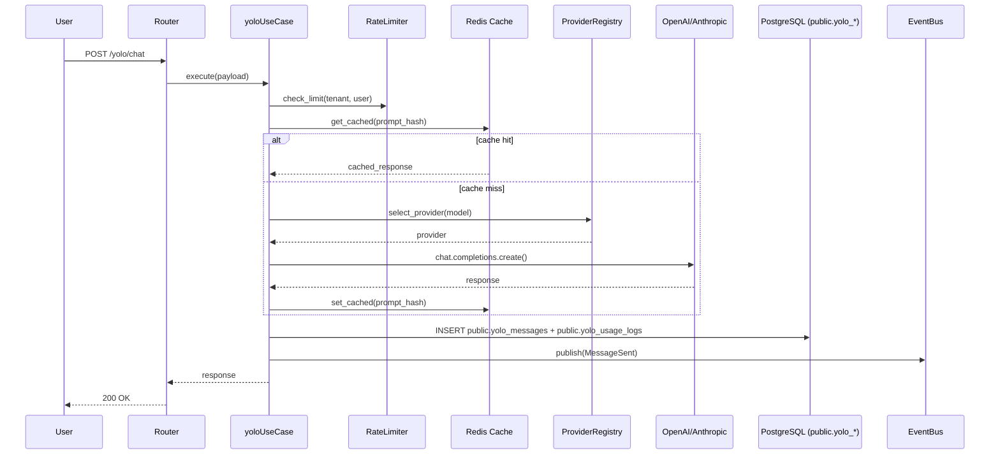
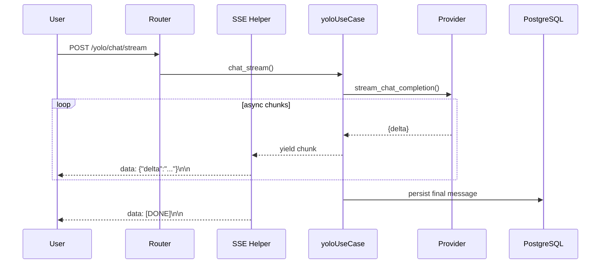

สร้าง โมเดลตรวจจับวัตถุด้วย YOLO + ML techniques
Python, PyTorch/Ultralytics, OpenCV, LabelImg/Roboflow, mAP/IoU metrics, ONNX/TensorRT, FastAPI/Flask 

```markdown
# 📦 Deliverable: Module `yolo` 

> **Module:** `yolo` · **Layer:** `5-Intel` · **Prefix:** `yolo`
> **Schema:** `public` · **Tables:** `yolo_providers`, `yolo_models`, `yolo_conversations`, `yolo_messages`, `yolo_usage_logs`
> **Stack:** Python 3.11+ · FastAPI · Pydantic v2 · SQLAlchemy 2.0 async · PostgreSQL 16 · Redis 7 · Kafka · OpenAI · Anthropic
> **Pattern:** DDD + Clean Architecture + Event-Driven
> **Generator:** `create_module_yolo.py` v1.2

---

# 🎯 OPENCODE MASTER PROMPT — MODULE `yolo` (AI/yolo Foundation) v1.2

---

## 0. Global Constraints

```markdown
[GLOBAL CONSTRAINTS]
- ห้ามทักทาย / ห้ามสรุป / ห้ามอธิบายซ้ำ
- ตอบเฉพาะไฟล์ใน Output Scope
- โค้ดเต็ม Production-ready ห้าม `...` หรือ `# code here`
- ห้ามแตะไฟล์นอก Scope (ถ้าจำเป็น → ประกาศ SIDE-EFFECT WARNING)
- คอมเมนต์ 2 ภาษา (TH + EN) สั้น กระชับ
- Error handling:
  • Use Case   → 3-branch (DomainError → AppError → Exception)
  • Repository → 2-branch (AppError → Exception)
  • Cache      → never-raise (log + return None/False)
  • yolo Call   → never-raise + retry with backoff
- Type hints ครบ / Pydantic v2 / SQLAlchemy 2.0 async
- ใช้ `Decimal` เท่านั้นสำหรับตัวเลขเงิน (token cost)
- ใช้ `flush()` ห้าม `commit()` ใน Repository
- SQL style (v1.2):
  • Schema: public
  • Table prefix: yolo_
  • DROP TABLE IF EXISTS ก่อน CREATE
  • Types ตรง: uuid, varchar(n) COLLATE "pg_catalog"."default",
    int4, timestamptz(6), numeric(12,8), bool
- Routing: register ที่ `app/app.py` + `migrations/env.py`
- Docs: README + OpenAPI + Postman
- Path: `app/modules/yolo/{layer}/{file}.py`
- ข้อมูลไม่พอ → ถาม 1 คำถาม ห้ามเดา
- ห้าม log API keys / PII / prompt content
- Streaming ใช้ SSE / chunked response
- Token counting ต้องแม่นยำ (tiktoken สำหรับ OpenAI)
```

---

## 1. Module Overview

### 01. รายละเอียด

| หัวข้อ | ค่า |
|---|---|
| **Task Type** | `CREATE_yolo` |
| **Module** | `yolo` |
| **Layer** | `5-Intel` |
| **Stack** | `FastAPI + OpenAI + Anthropic` |
| **Priority** | 🔴 |
| **Phase** | `5` |
| **Prefix** | `yolo` |
| **Schema** | `public` |
| **Dependencies** | `tenant`, `user`, `auth`, `audit`, `events`, `idempotency` |
| **Tables** | `public.yolo_providers`, `public.yolo_models`, `public.yolo_conversations`, `public.yolo_messages`, `public.yolo_usage_logs` |
| **Endpoints** | `/api/v1/yolo/chat`, `/api/v1/yolo/chat/stream`, `/api/v1/yolo/completions`, `/api/v1/yolo/conversations`, `/api/v1/yolo/providers`, `/api/v1/yolo/models`, `/api/v1/yolo/usage` |
| **Events** | `ConversationCreated`, `MessageSent`, `CompletionGenerated`, `ProviderRegistered`, `TokenLimitExceeded` |

### 02. หลักการทำงาน

ระบบ yolo ทำหน้าที่เป็น **Unified yolo Gateway** ที่:

1. **Multi-Provider** — รองรับ OpenAI, Anthropic, Local (Ollama/vyolo)
2. **Conversation Management** — จัดเก็บ history + context
3. **Streaming** — SSE streaming response
4. **Token Tracking** — นับ token + ค่าใช้จ่าย (Decimal)
5. **Rate Limiting** — จำกัดตาม tenant/user
6. **Fallback** — provider หลักล่ม → สลับ provider สำรอง
7. **Caching** — cache completion (deterministic)
8. **Retry** — exponential backoff

**Invariants:**
- ทุก conversation ต้องมี `tenant_id`, `user_id`
- ทุก message ต้องมี `role` ∈ {system, user, assistant, tool}
- Token count ต้องบันทึกทุกครั้ง
- API key ต้อง encrypt at rest
- ห้ามเก็บ plaintext prompt ใน log
- Streaming ต้อง timeout 60s
- Retry ≤ 3 ครั้ง, backoff 1s/2s/4s

**State Machines:**

```
Conversation: ACTIVE → ARCHIVED → DELETED
Provider:     ACTIVE → DEGRADED → OFFLINE → ACTIVE
Message:      PENDING → STREAMING → COMPLETED → FAILED
```

### 03. ข้อกำหนด

**FR:**
- FR-01: Chat completion (sync)
- FR-02: Chat completion (streaming SSE)
- FR-03: Conversation CRUD
- FR-04: Multi-provider routing
- FR-05: Token counting + cost tracking
- FR-06: Rate limiting per tenant/user
- FR-07: Provider failover
- FR-08: Completion caching
- FR-09: Usage analytics
- FR-10: Tool/function calling support

**NFR:**
- First token latency < 500ms
- p95 API < 3s (non-streaming)
- Streaming throughput ≥ 20 tokens/s
- Cache hit ≥ 30% (deterministic prompts)
- Uptime ≥ 99.9%
- Token accounting accuracy = 100%
- RLS enforced
- Idempotency ทุก mutating endpoint

### 04. Technology Stack

| Component | Version | Purpose |
|---|---|---|
| Python | 3.11+ | Runtime |
| FastAPI | ≥ 0.115 | Web framework |
| Pydantic | v2 | Validation |
| SQLAlchemy | 2.0 async | ORM |
| PostgreSQL | 16 | Database (schema: public) |
| Redis | 7 | Cache + Rate limit |
| Kafka | 3.x | Event bus |
| OpenAI SDK | latest | OpenAI provider |
| Anthropic SDK | latest | Anthropic provider |
| tiktoken | latest | Token counting |
| structlog | latest | Structured logging |
| loguru | latest | Repository logging |

### 05. ขอบเขต

**In scope:**
- Multi-provider yolo gateway
- Chat completion (sync + streaming)
- Conversation management
- Token tracking
- Rate limiting
- Provider failover
- Completion caching
- Usage analytics

**Out of scope:**
- Fine-tuning
- Model training
- Vector search (ดู module `rag`)
- Agent orchestration (ดู module `agent`)
- Tool execution (ดู module `tools`)

### 06. โครงสร้าง Folder + ไฟล์ (42 ไฟล์)

```
app/modules/yolo/
├── __init__.py
├── domain/
│   ├── __init__.py
│   ├── entities/
│   │   ├── __init__.py
│   │   ├── provider.py
│   │   ├── model.py
│   │   ├── conversation.py
│   │   ├── message.py
│   │   └── usage_log.py
│   ├── value_objects/
│   │   ├── __init__.py
│   │   ├── token_usage.py
│   │   ├── chat_options.py
│   │   └── provider_config.py
│   ├── helpers/
│   │   ├── __init__.py
│   │   └── token_counter.py
│   ├── events.py
│   ├── enums.py
│   └── exceptions.py
├── application/
│   ├── __init__.py
│   ├── use_case.py
│   ├── interfaces.py
│   ├── mappers.py
│   ├── exceptions.py
│   └── utils.py
├── infrastructure/
│   ├── __init__.py
│   ├── models.py
│   ├── provider_repository.py
│   ├── model_repository.py
│   ├── conversation_repository.py
│   ├── message_repository.py
│   ├── usage_log_repository.py
│   ├── caches.py
│   └── services.py
└── presentation/
    ├── __init__.py
    ├── router.py
    ├── schemas.py
    ├── docs.py
    ├── dependencies.py
    ├── sse.py
    └── swagger.py              (created by swagger action)

db/migrations/
├── V001__create_yolo.sql
├── V002__seed_yolo.sql
└── V003__rollback_yolo.sql

migrations/versions/
└── yolo_001_add_yolo_tables.py

tests/
├── unit/test_yolo.py
├── unit/test_yolo_use_cases.py
├── unit/test_token_counter.py
├── integration/test_yolo_repository.py
├── integration/test_yolo_providers.py
├── property/test_yolo_invariants.py
└── manual/manual_test_yolo.md

docs/
├── README_yolo.md
├── API_yolo.md
└── postman/yolo.json

app/app.py                 (แก้)
migrations/env.py          (แก้)
```

### 07. Workflow



### 08. Sequence — Streaming



### 09. Data Flow — Cost Tracking

```mermaid
flowchart LR
    Chat[yolo Response] --> Usage[Extract usage]
    Usage --> Cost[Compute cost<br/>Decimal]
    Cost --> Log[Insert yolo_usage_logs]
    Log --> Agg[sum_by_tenant<br/>sum_by_user]
    Agg --> API[/yolo/usage]
```

### 10. Security

- **RLS:** 5 tables ทั้งหมด enforced (`tenant_id = current_setting('app.current_tenant')`)
- **API Key:** เก็บ encrypted (`api_key_encrypted` column) — decrypt เฉพาะใน ProviderRegistry
- **Idempotency:** ทุก mutating endpoint ต้องมี `Idempotency-Key` header
- **Rate Limit:** Redis-based, fail-open (never block)
- **Prompt Privacy:** ห้าม log content / PII / API keys

### 11. Error Codes

| Code | HTTP | Meaning |
|---|---|---|
| `DOMAIN_ERROR` | 400 | Domain exception |
| `LIMIT_EXCEEDED` | 402 | Token limit exceeded |
| `NOT_FOUND` | 404 | Model/Conversation not found |
| `RATE_LIMITED` | 429 | Rate limit exceeded |
| `PROVIDER_ERROR` | 502 | Upstream provider failed |
| `VALIDATION_ERROR` | 422 | Pydantic validation |

### 12. ข้อห้าม

```markdown
❌ ห้าม import framework ใน domain/
❌ ห้าม commit() ใน Repository (ใช้ flush())
❌ ห้าม raise ใน Cache / yolo Call (never-raise + retry)
❌ ห้าม float กับค่าใช้จ่าย (ใช้ Decimal)
❌ ห้าม hardcode API keys
❌ ห้าม query ข้าม tenant
❌ ห้าม log prompt content / API keys / PII
❌ ห้าม return stacktrace ให้ client
❌ ห้าม block streaming loop
❌ ห้ามลบ migration ที่ commit แล้ว
❌ ห้าม retry เกิน 3 ครั้ง
❌ ห้ามสร้าง schema ใหม่ (v1.2 ใช้ public เท่านั้น)
❌ ห้ามตั้งชื่อ table โดยไม่มี prefix yolo_
❌ ห้ามใช้ VARCHAR(n) โดยไม่มี COLLATE (v1.2)
```

### 13. ข้อควรระวัง

- Provider rate limit → queue + backoff
- Token limit exceeded → reject ก่อน call
- Streaming disconnect → cleanup + save partial
- Cache key ต้อง hash prompt + model + params
- Timezone: เก็บ UTC (`timestamptz(6)`)
- Anthropic ใช้ `system` param แยกจาก messages
- OpenAI ใช้ `messages[0].role = "system"`
- Local yolo ไม่รองรับ streaming → fallback
- Concurrent requests → connection pool
- Cost tracking ต้อง atomic
- RLS ต้อง set `app.current_tenant` ก่อน query

### 14. Performance Targets

| Metric | Target |
|---|---|
| First token latency | < 500ms |
| p95 non-streaming | < 3s |
| Streaming throughput | ≥ 20 tokens/s |
| Cache hit ratio | ≥ 30% |
| Uptime | ≥ 99.9% |
| Token accuracy | 100% |

### 15. Dependencies (Modules)

| Module | Layer | Used For |
|---|---|---|
| `tenant` | 1-Foundation | Multi-tenant context |
| `user` | 1-Foundation | User identity |
| `auth` | 1-Foundation | JWT / API key auth |
| `audit` | 1-Foundation | Audit trail |
| `events` | 0-Core | Event bus (Kafka) |
| `idempotency` | 0-Core | Idempotency store (Redis) |

### 16. Checklist การทดสอบ

```markdown
- [ ] Unit ≥ 12 tests
- [ ] Token counter ≥ 6 tests
- [ ] Integration ≥ 6 tests (RLS verified)
- [ ] Provider mock ≥ 4 tests
- [ ] Property ≥ 4 tests
- [ ] Manual 12 scenarios
- [ ] Coverage ≥ 85%
- [ ] /docs เห็น tag "yolo"
- [ ] Streaming works
- [ ] Postman collection ผ่าน
- [ ] Tables อยู่ใน schema "public" (5 tables)
- [ ] Table names มี prefix yolo_
- [ ] Alembic upgrade head สำเร็จ
- [ ] RLS enabled 5 tables
```

### 17. SQL & Migration (v1.2)

**Pattern:** `V001__create_yolo.sql` / `V002__seed_yolo.sql` / `V003__rollback_yolo.sql`
+ Alembic `yolo_001_add_yolo_tables.py`

**Style requirements:**
- `DROP TABLE IF EXISTS "public"."yolo_xxx";` ก่อน CREATE ทุกครั้ง
- `CREATE TABLE "public"."yolo_xxx" (...)` (quote schema + table)
- Types ตรง:
  - `uuid` (PK + FK + tenant_id + user_id)
  - `varchar(n) COLLATE "pg_catalog"."default"` (ทุก varchar)
  - `int4` (int columns)
  - `timestamptz(6)` (timestamps)
  - `numeric(12,8)` (cost columns)
  - `bool` (boolean)
- Defaults:
  - `gen_random_uuid()` (id)
  - `now()` (timestamps)
  - `''::character varying` (varchar default empty)
  - `''::text` (text default empty)
  - `'{}'::text` (json default)
  - `0` (numeric default)
- RLS: `ALTER TABLE ... ENABLE ROW LEVEL SECURITY`
  + `CREATE POLICY p_yolo_xxx_tenant`
- Trigger fn: `public.set_updated_at_yolo()`
- Trigger names: `trg_yolo_<table>_updated`

### 18. Routing Registration

```python
# app/app.py
from app.modules.yolo.presentation.router import router as yolo_router
app.include_router(yolo_router, prefix="/api/v1")

# migrations/env.py
from app.modules.yolo.infrastructure.models import (  # noqa: F401
    ProviderModel, ModelModel, ConversationModel,
    MessageModel, UsageLogModel,
)
```

### 19. README

ดู section ที่ 5 ใน `docs/README_yolo.md`

### 20. OpenAPI / Swagger

Tag: `yolo`
- description: Unified yolo Gateway (OpenAI / Anthropic / Local)
- externalDocs: `/docs/README_yolo.md`
- `x-module: yolo`, `x-layer: 5-Intel`, `x-prefix: yolo`, `x-schema: public`

### 21. Postman Collection

5 endpoints:
1. Chat (sync) — `POST /api/v1/yolo/chat`
2. Chat (SSE) — `POST /api/v1/yolo/chat/stream`
3. List Conversations — `GET /api/v1/yolo/conversations`
4. Create Conversation — `POST /api/v1/yolo/conversations`
5. Usage — `GET /api/v1/yolo/usage?days=30`

ไฟล์: `docs/postman/yolo.json`

### 22. สรุป

| รายการ | จำนวน |
|---|---|
| Python files | 33 |
| SQL files | 3 |
| Alembic files | 1 |
| Test files | 7 |
| Docs files | 3 |
| Routing (แก้) | 2 |
| **รวม** | **49** |

---

## 2. Domain Models

### Entities

| Entity | Fields | Purpose |
|---|---|---|
| `Provider` | id, tenant_id, name, provider_type, api_key_encrypted, base_url, is_active, priority | yolo provider |
| `Model` | id, tenant_id, provider_id, name, display_name, context_window, max_output, cost_per_1k_input, cost_per_1k_output, supports_streaming, supports_tools | Model registry |
| `Conversation` | id, tenant_id, user_id, title, model_id, system_prompt, metadata_json, status, message_count, total_tokens, created_at | Chat conversation |
| `Message` | id, tenant_id, conversation_id, role, content, tool_calls_json, tool_call_id, tokens_input, tokens_output, finish_reason, latency_ms | Chat message |
| `UsageLog` | id, tenant_id, user_id, model_id, conversation_id, tokens_input, tokens_output, cost_usd, source | Usage tracking |

### Value Objects

| VO | Fields | Validation |
|---|---|---|
| `TokenUsage` | input_tokens, output_tokens, total_tokens, cost_usd | frozen, Decimal, non-negative |
| `ChatOptions` | temperature, top_p, max_tokens, stop, tools, tool_choice | frozen, ranges |
| `ProviderConfig` | name, provider_type, api_key, base_url, timeout | frozen |

### Enums

```python
class ProviderType(StrEnum):
    """TH: ประเภทผู้ให้บริการ | EN: Provider type"""
    OPENAI = "openai"
    ANTHROPIC = "anthropic"
    LOCAL = "local"
    AZURE = "azure"


class MessageRole(StrEnum):
    """TH: บทบาทข้อความ | EN: Message role"""
    SYSTEM = "system"
    USER = "user"
    ASSISTANT = "assistant"
    TOOL = "tool"


class ConversationStatus(StrEnum):
    """TH: สถานะ conversation | EN: Conversation status"""
    ACTIVE = "ACTIVE"
    ARCHIVED = "ARCHIVED"
    DELETED = "DELETED"


class FinishReason(StrEnum):
    """TH: เหตุผลที่จบ | EN: Finish reason"""
    STOP = "stop"
    LENGTH = "length"
    TOOL_CALLS = "tool_calls"
    CONTENT_FILTER = "content_filter"
    ERROR = "error"
```

### Domain Events

```python
@dataclass(frozen=True, slots=True)
class ConversationCreated:
    conversation_id: uuid.UUID
    tenant_id: uuid.UUID
    user_id: uuid.UUID
    model_id: uuid.UUID
    occurred_at: datetime = field(default_factory=lambda: datetime.now(UTC))


@dataclass(frozen=True, slots=True)
class MessageSent:
    message_id: uuid.UUID
    conversation_id: uuid.UUID
    tenant_id: uuid.UUID
    role: str
    tokens_input: int
    tokens_output: int
    occurred_at: datetime = field(default_factory=lambda: datetime.now(UTC))


@dataclass(frozen=True, slots=True)
class CompletionGenerated:
    message_id: uuid.UUID
    tenant_id: uuid.UUID
    model_name: str
    finish_reason: str
    latency_ms: int
    occurred_at: datetime = field(default_factory=lambda: datetime.now(UTC))


@dataclass(frozen=True, slots=True)
class ProviderRegistered:
    provider_id: uuid.UUID
    tenant_id: uuid.UUID
    provider_type: str
    occurred_at: datetime = field(default_factory=lambda: datetime.now(UTC))


@dataclass(frozen=True, slots=True)
class TokenLimitExceeded:
    tenant_id: uuid.UUID
    user_id: uuid.UUID
    current_usage: int
    limit: int
    occurred_at: datetime = field(default_factory=lambda: datetime.now(UTC))
```

### Domain Exceptions

```python
class yoloError(Exception): ...
class ProviderNotFoundError(yoloError): ...
class ModelNotFoundError(yoloError): ...
class ConversationNotFoundError(yoloError): ...
class ProviderError(yoloError): ...
class RateLimitExceededError(yoloError): ...
class TokenLimitExceededError(yoloError): ...
class InvalidMessageRoleError(yoloError): ...
class StreamingError(yoloError): ...
class ProviderAuthError(yoloError): ...
```

---

## 3. Repository Interfaces

```python
class RequestContext(Protocol):
    @property
    def tenant_id(self) -> uuid.UUID: ...
    @property
    def user_id(self) -> uuid.UUID | None: ...


class ProviderRepository(ABC):
    async def save(self, ctx: RequestContext, provider: Provider) -> Provider: ...
    async def find_by_id(self, ctx: RequestContext, id: uuid.UUID) -> Provider | None: ...
    async def find_all_active(self, ctx: RequestContext) -> list[Provider]: ...
    async def find_by_type(self, ctx: RequestContext, provider_type: str) -> list[Provider]: ...


class ModelRepository(ABC):
    async def save(self, ctx: RequestContext, model: Model) -> Model: ...
    async def find_by_id(self, ctx: RequestContext, id: uuid.UUID) -> Model | None: ...
    async def find_by_name(self, ctx: RequestContext, name: str) -> Model | None: ...
    async def find_all_active(self, ctx: RequestContext) -> list[Model]: ...
    async def find_by_provider(self, ctx: RequestContext, provider_id: uuid.UUID) -> list[Model]: ...


class ConversationRepository(ABC):
    async def save(self, ctx: RequestContext, conv: Conversation) -> Conversation: ...
    async def find_by_id(self, ctx: RequestContext, id: uuid.UUID) -> Conversation | None: ...
    async def find_by_user(self, ctx: RequestContext, user_id: uuid.UUID, limit: int) -> list[Conversation]: ...
    async def update(self, ctx: RequestContext, conv: Conversation) -> Conversation: ...
    async def delete(self, ctx: RequestContext, id: uuid.UUID) -> bool: ...


class MessageRepository(ABC):
    async def create(self, ctx: RequestContext, msg: Message) -> Message: ...
    async def find_by_conversation(self, ctx: RequestContext, conv_id: uuid.UUID, limit: int) -> list[Message]: ...
    async def count_by_conversation(self, ctx: RequestContext, conv_id: uuid.UUID) -> int: ...


class UsageLogRepository(ABC):
    async def create(self, ctx: RequestContext, log: UsageLog) -> UsageLog: ...
    async def sum_by_tenant(self, ctx: RequestContext, since: datetime) -> dict[str, Any]: ...
    async def sum_by_user(self, ctx: RequestContext, user_id: uuid.UUID, since: datetime) -> dict[str, Any]: ...


class yoloClient(Protocol):
    """Port for yolo API calls"""
    async def chat_completion(
        self, messages: list[dict[str, Any]], model: str, options: ChatOptions,
    ) -> dict[str, Any]: ...
    def stream_chat_completion(
        self, messages: list[dict[str, Any]], model: str, options: ChatOptions,
    ) -> AsyncIterator[dict[str, Any]]: ...


class ProviderRegistry(Protocol):
    def get_client(self, provider: Provider) -> yoloClient: ...
    def select_provider(self, model_name: str, providers: list[Provider]) -> Provider: ...


class RateLimiter(ABC):
    async def check(self, tenant_id: uuid.UUID, user_id: uuid.UUID, cost: int) -> bool: ...
    async def increment(self, tenant_id: uuid.UUID, user_id: uuid.UUID, cost: int) -> None: ...


class yoloCache(ABC):
    async def get(self, key: str) -> Any | None: ...
    async def set(self, key: str, value: Any, ttl: int = 3600) -> bool: ...
    async def invalidate(self, key: str) -> bool: ...


class EventBus(ABC):
    async def publish(self, event: object) -> None: ...


class IdempotencyStore(ABC):
    async def check_or_lock(self, key: str, scope: str, payload: dict[str, Any]) -> dict[str, Any] | None: ...
    async def complete(self, key: str, scope: str, status: int, body: dict[str, Any]) -> None: ...
```

---

## 4. API Endpoints

### Chat

| Method | Path | Description |
|---|---|---|
| `POST` | `/api/v1/yolo/chat` | Chat completion (sync) |
| `POST` | `/api/v1/yolo/chat/stream` | Chat completion (SSE stream) |
| `POST` | `/api/v1/yolo/completions` | Raw completion |

### Conversations

| Method | Path | Description |
|---|---|---|
| `GET` | `/api/v1/yolo/conversations` | List conversations |
| `POST` | `/api/v1/yolo/conversations` | Create conversation |
| `GET` | `/api/v1/yolo/conversations/{id}` | Get conversation + messages |

### Providers & Models

| Method | Path | Description |
|---|---|---|
| `GET` | `/api/v1/yolo/providers` | List providers |
| `GET` | `/api/v1/yolo/models` | List models |

### Usage

| Method | Path | Description |
|---|---|---|
| `GET` | `/api/v1/yolo/usage` | Usage stats (tenant + user) |
| `GET` | `/api/v1/yolo/usage/me` | Usage stats (user only) |

---

## 5. SQL Migration (v1.2 — Schema: public, Prefix: yolo_)

### `db/migrations/V001__create_yolo.sql`

```sql
-- ═══════════════════════════════════════════════════════════════
-- V001__create_yolo.sql | Module: yolo | Prefix: yolo
-- Schema: public | Tables: yolo_providers, yolo_models, yolo_conversations,
--                          yolo_messages, yolo_usage_logs
-- ═══════════════════════════════════════════════════════════════
BEGIN;

-- ─── yolo_providers ──────────────────────────────
DROP TABLE IF EXISTS "public"."yolo_providers";
CREATE TABLE "public"."yolo_providers" (
  "id"                 uuid NOT NULL DEFAULT gen_random_uuid(),
  "tenant_id"          uuid NOT NULL,
  "name"               varchar(100) COLLATE "pg_catalog"."default" NOT NULL,
  "provider_type"      varchar(50)  COLLATE "pg_catalog"."default" NOT NULL,
  "api_key_encrypted"  text COLLATE "pg_catalog"."default" NOT NULL DEFAULT ''::text,
  "base_url"           varchar(500) COLLATE "pg_catalog"."default" NOT NULL DEFAULT ''::character varying,
  "timeout_seconds"    int4 NOT NULL DEFAULT 60,
  "priority"           int4 NOT NULL DEFAULT 100,
  "is_active"          bool NOT NULL DEFAULT true,
  "config_json"        text COLLATE "pg_catalog"."default" NOT NULL DEFAULT '{}'::text,
  "created_at"         timestamptz(6) NOT NULL DEFAULT now(),
  "updated_at"         timestamptz(6) NOT NULL DEFAULT now(),
  CONSTRAINT "yolo_providers_pkey" PRIMARY KEY ("id"),
  CONSTRAINT "ck_yolo_provider_type" CHECK (
    provider_type IN ('openai','anthropic','local','azure')
  ),
  CONSTRAINT "uq_yolo_provider_name" UNIQUE ("tenant_id", "name")
);

CREATE INDEX "ix_yolo_provider_tenant"
    ON "public"."yolo_providers" USING btree ("tenant_id");
CREATE INDEX "ix_yolo_provider_type"
    ON "public"."yolo_providers" USING btree ("provider_type", "is_active");

-- ─── yolo_models ─────────────────────────────────
DROP TABLE IF EXISTS "public"."yolo_models";
CREATE TABLE "public"."yolo_models" (
  "id"                   uuid NOT NULL DEFAULT gen_random_uuid(),
  "tenant_id"            uuid NOT NULL,
  "provider_id"          uuid NOT NULL,
  "name"                 varchar(100) COLLATE "pg_catalog"."default" NOT NULL,
  "display_name"         varchar(200) COLLATE "pg_catalog"."default" NOT NULL DEFAULT ''::character varying,
  "context_window"       int4 NOT NULL DEFAULT 4096,
  "max_output_tokens"    int4 NOT NULL DEFAULT 4096,
  "cost_per_1k_input"    numeric(12,8) NOT NULL DEFAULT 0,
  "cost_per_1k_output"   numeric(12,8) NOT NULL DEFAULT 0,
  "supports_streaming"   bool NOT NULL DEFAULT true,
  "supports_tools"       bool NOT NULL DEFAULT false,
  "is_active"            bool NOT NULL DEFAULT true,
  "created_at"           timestamptz(6) NOT NULL DEFAULT now(),
  "updated_at"           timestamptz(6) NOT NULL DEFAULT now(),
  CONSTRAINT "yolo_models_pkey" PRIMARY KEY ("id"),
  CONSTRAINT "uq_yolo_model_name" UNIQUE ("tenant_id", "name")
);

CREATE INDEX "ix_yolo_model_tenant"
    ON "public"."yolo_models" USING btree ("tenant_id");
CREATE INDEX "ix_yolo_model_provider"
    ON "public"."yolo_models" USING btree ("provider_id", "is_active");

-- ─── yolo_conversations ──────────────────────────
DROP TABLE IF EXISTS "public"."yolo_conversations";
CREATE TABLE "public"."yolo_conversations" (
  "id"             uuid NOT NULL DEFAULT gen_random_uuid(),
  "tenant_id"      uuid NOT NULL,
  "user_id"        uuid NOT NULL,
  "title"          varchar(500) COLLATE "pg_catalog"."default" NOT NULL DEFAULT ''::character varying,
  "model_id"       uuid NOT NULL,
  "system_prompt"  text COLLATE "pg_catalog"."default" NOT NULL DEFAULT ''::text,
  "metadata_json"  text COLLATE "pg_catalog"."default" NOT NULL DEFAULT '{}'::text,
  "status"         varchar(20) COLLATE "pg_catalog"."default" NOT NULL DEFAULT 'ACTIVE'::character varying,
  "message_count"  int4 NOT NULL DEFAULT 0,
  "total_tokens"   int4 NOT NULL DEFAULT 0,
  "created_at"     timestamptz(6) NOT NULL DEFAULT now(),
  "updated_at"     timestamptz(6) NOT NULL DEFAULT now(),
  CONSTRAINT "yolo_conversations_pkey" PRIMARY KEY ("id"),
  CONSTRAINT "ck_yolo_conv_status" CHECK (
    status IN ('ACTIVE','ARCHIVED','DELETED')
  )
);

CREATE INDEX "ix_yolo_conv_tenant"
    ON "public"."yolo_conversations" USING btree ("tenant_id");
CREATE INDEX "ix_yolo_conv_user"
    ON "public"."yolo_conversations" USING btree ("user_id", "created_at" DESC);

-- ─── yolo_messages ───────────────────────────────
DROP TABLE IF EXISTS "public"."yolo_messages";
CREATE TABLE "public"."yolo_messages" (
  "id"               uuid NOT NULL DEFAULT gen_random_uuid(),
  "tenant_id"        uuid NOT NULL,
  "conversation_id"  uuid NOT NULL,
  "role"             varchar(20) COLLATE "pg_catalog"."default" NOT NULL,
  "content"          text COLLATE "pg_catalog"."default" NOT NULL DEFAULT ''::text,
  "tool_calls_json"  text COLLATE "pg_catalog"."default" NOT NULL DEFAULT '[]'::text,
  "tool_call_id"     varchar(100) COLLATE "pg_catalog"."default" NOT NULL DEFAULT ''::character varying,
  "tokens_input"     int4 NOT NULL DEFAULT 0,
  "tokens_output"    int4 NOT NULL DEFAULT 0,
  "finish_reason"    varchar(30) COLLATE "pg_catalog"."default" NOT NULL DEFAULT ''::character varying,
  "latency_ms"       int4 NOT NULL DEFAULT 0,
  "created_at"       timestamptz(6) NOT NULL DEFAULT now(),
  "updated_at"       timestamptz(6) NOT NULL DEFAULT now(),
  CONSTRAINT "yolo_messages_pkey" PRIMARY KEY ("id"),
  CONSTRAINT "ck_yolo_msg_role" CHECK (
    role IN ('system','user','assistant','tool')
  )
);

CREATE INDEX "ix_yolo_msg_conv"
    ON "public"."yolo_messages" USING btree ("conversation_id", "created_at");

-- ─── yolo_usage_logs ─────────────────────────────
DROP TABLE IF EXISTS "public"."yolo_usage_logs";
CREATE TABLE "public"."yolo_usage_logs" (
  "id"               uuid NOT NULL DEFAULT gen_random_uuid(),
  "tenant_id"        uuid NOT NULL,
  "user_id"          uuid NOT NULL,
  "model_id"         uuid NOT NULL,
  "conversation_id"  uuid NULL,
  "tokens_input"     int4 NOT NULL DEFAULT 0,
  "tokens_output"    int4 NOT NULL DEFAULT 0,
  "cost_usd"         numeric(12,8) NOT NULL DEFAULT 0,
  "source"           varchar(50) COLLATE "pg_catalog"."default" NOT NULL DEFAULT 'chat'::character varying,
  "created_at"       timestamptz(6) NOT NULL DEFAULT now(),
  "updated_at"       timestamptz(6) NOT NULL DEFAULT now(),
  CONSTRAINT "yolo_usage_logs_pkey" PRIMARY KEY ("id")
);

CREATE INDEX "ix_yolo_usage_tenant"
    ON "public"."yolo_usage_logs" USING btree ("tenant_id", "created_at" DESC);
CREATE INDEX "ix_yolo_usage_user"
    ON "public"."yolo_usage_logs" USING btree ("user_id", "created_at" DESC);

-- ─── Trigger fn ─────────────────────────────────
CREATE OR REPLACE FUNCTION public.set_updated_at_yolo()
RETURNS TRIGGER AS $$
BEGIN
    NEW.updated_at = NOW();
    RETURN NEW;
END;
$$ LANGUAGE plpgsql;

DROP TRIGGER IF EXISTS trg_yolo_provider_updated ON "public"."yolo_providers";
CREATE TRIGGER trg_yolo_provider_updated BEFORE UPDATE
    ON "public"."yolo_providers"
    FOR EACH ROW EXECUTE FUNCTION public.set_updated_at_yolo();

DROP TRIGGER IF EXISTS trg_yolo_model_updated ON "public"."yolo_models";
CREATE TRIGGER trg_yolo_model_updated BEFORE UPDATE
    ON "public"."yolo_models"
    FOR EACH ROW EXECUTE FUNCTION public.set_updated_at_yolo();

DROP TRIGGER IF EXISTS trg_yolo_conv_updated ON "public"."yolo_conversations";
CREATE TRIGGER trg_yolo_conv_updated BEFORE UPDATE
    ON "public"."yolo_conversations"
    FOR EACH ROW EXECUTE FUNCTION public.set_updated_at_yolo();

DROP TRIGGER IF EXISTS trg_yolo_msg_updated ON "public"."yolo_messages";
CREATE TRIGGER trg_yolo_msg_updated BEFORE UPDATE
    ON "public"."yolo_messages"
    FOR EACH ROW EXECUTE FUNCTION public.set_updated_at_yolo();

DROP TRIGGER IF EXISTS trg_yolo_usage_updated ON "public"."yolo_usage_logs";
CREATE TRIGGER trg_yolo_usage_updated BEFORE UPDATE
    ON "public"."yolo_usage_logs"
    FOR EACH ROW EXECUTE FUNCTION public.set_updated_at_yolo();

-- ─── RLS ────────────────────────────────────────
ALTER TABLE "public"."yolo_providers"     ENABLE ROW LEVEL SECURITY;
ALTER TABLE "public"."yolo_models"        ENABLE ROW LEVEL SECURITY;
ALTER TABLE "public"."yolo_conversations" ENABLE ROW LEVEL SECURITY;
ALTER TABLE "public"."yolo_messages"      ENABLE ROW LEVEL SECURITY;
ALTER TABLE "public"."yolo_usage_logs"    ENABLE ROW LEVEL SECURITY;

DROP POLICY IF EXISTS p_yolo_provider ON "public"."yolo_providers";
CREATE POLICY p_yolo_provider ON "public"."yolo_providers"
    USING (tenant_id = current_setting('app.current_tenant', true)::uuid);

DROP POLICY IF EXISTS p_yolo_model ON "public"."yolo_models";
CREATE POLICY p_yolo_model ON "public"."yolo_models"
    USING (tenant_id = current_setting('app.current_tenant', true)::uuid);

DROP POLICY IF EXISTS p_yolo_conv ON "public"."yolo_conversations";
CREATE POLICY p_yolo_conv ON "public"."yolo_conversations"
    USING (tenant_id = current_setting('app.current_tenant', true)::uuid);

DROP POLICY IF EXISTS p_yolo_msg ON "public"."yolo_messages";
CREATE POLICY p_yolo_msg ON "public"."yolo_messages"
    USING (tenant_id = current_setting('app.current_tenant', true)::uuid);

DROP POLICY IF EXISTS p_yolo_usage ON "public"."yolo_usage_logs";
CREATE POLICY p_yolo_usage ON "public"."yolo_usage_logs"
    USING (tenant_id = current_setting('app.current_tenant', true)::uuid);

COMMIT;
```

### `db/migrations/V002__seed_yolo.sql`

```sql
-- ═══════════════════════════════════════════════════════════════
-- V002__seed_yolo.sql | Schema: public
-- ═══════════════════════════════════════════════════════════════
BEGIN;

INSERT INTO "public"."yolo_providers"
    (tenant_id, name, provider_type, base_url, priority)
VALUES
    ('00000000-0000-0000-0000-000000000001', 'openai-default', 'openai',
     'https://api.openai.com/v1', 10),
    ('00000000-0000-0000-0000-000000000001', 'anthropic-default', 'anthropic',
     'https://api.anthropic.com/v1', 20)
ON CONFLICT DO NOTHING;

INSERT INTO "public"."yolo_models"
    (tenant_id, provider_id, name, display_name, context_window,
     max_output_tokens, cost_per_1k_input, cost_per_1k_output,
     supports_streaming, supports_tools)
SELECT
    '00000000-0000-0000-0000-000000000001',
    p.id, 'gpt-4o-mini', 'GPT-4o Mini', 128000, 16384,
    0.00015, 0.0006, TRUE, TRUE
FROM "public"."yolo_providers" p
WHERE p.name = 'openai-default'
ON CONFLICT DO NOTHING;

INSERT INTO "public"."yolo_models"
    (tenant_id, provider_id, name, display_name, context_window,
     max_output_tokens, cost_per_1k_input, cost_per_1k_output,
     supports_streaming, supports_tools)
SELECT
    '00000000-0000-0000-0000-000000000001',
    p.id, 'claude-3-5-sonnet-20241022', 'Claude 3.5 Sonnet',
    200000, 8192, 0.003, 0.015, TRUE, TRUE
FROM "public"."yolo_providers" p
WHERE p.name = 'anthropic-default'
ON CONFLICT DO NOTHING;

COMMIT;
```

### `db/migrations/V003__rollback_yolo.sql`

```sql
-- ═══════════════════════════════════════════════════════════════
-- V003__rollback_yolo.sql | Schema: public
-- ═══════════════════════════════════════════════════════════════
BEGIN;

DROP TRIGGER IF EXISTS trg_yolo_usage_updated    ON "public"."yolo_usage_logs";
DROP TRIGGER IF EXISTS trg_yolo_msg_updated      ON "public"."yolo_messages";
DROP TRIGGER IF EXISTS trg_yolo_conv_updated     ON "public"."yolo_conversations";
DROP TRIGGER IF EXISTS trg_yolo_model_updated    ON "public"."yolo_models";
DROP TRIGGER IF EXISTS trg_yolo_provider_updated ON "public"."yolo_providers";

DROP POLICY IF EXISTS p_yolo_usage    ON "public"."yolo_usage_logs";
DROP POLICY IF EXISTS p_yolo_msg      ON "public"."yolo_messages";
DROP POLICY IF EXISTS p_yolo_conv     ON "public"."yolo_conversations";
DROP POLICY IF EXISTS p_yolo_model    ON "public"."yolo_models";
DROP POLICY IF EXISTS p_yolo_provider ON "public"."yolo_providers";

DROP TABLE IF EXISTS "public"."yolo_usage_logs"    CASCADE;
DROP TABLE IF EXISTS "public"."yolo_messages"      CASCADE;
DROP TABLE IF EXISTS "public"."yolo_conversations" CASCADE;
DROP TABLE IF EXISTS "public"."yolo_models"        CASCADE;
DROP TABLE IF EXISTS "public"."yolo_providers"     CASCADE;

DROP FUNCTION IF EXISTS public.set_updated_at_yolo();

COMMIT;
```

---

## 6. Alembic Migration (v1.2 — Schema: public)

### `migrations/versions/yolo_001_add_yolo_tables.py`

```python
"""add yolo tables

Revision ID: yolo_001
Revises: <prev>
Create Date: 2025-XX-XX

TH: สร้างตาราง yolo 5 ตาราง (schema: public, prefix: yolo_)
    (providers, models, conversations, messages, usage_logs)
    + indexes + triggers + RLS
EN: create 5 yolo tables (public schema, yolo_ prefix)
    + indexes + triggers + RLS
"""
from __future__ import annotations

from typing import Sequence, Union

import sqlalchemy as sa
from alembic import op
from sqlalchemy.dialects import postgresql


revision: str = "yolo_001"
down_revision: Union[str, None] = "<prev>"
branch_labels: Union[str, Sequence[str], None] = None
depends_on: Union[str, Sequence[str], None] = None

SCHEMA = "public"


def upgrade() -> None:
    """TH: สร้างตาราง yolo | EN: create yolo tables"""

    # ─── yolo_providers ───────────────────────────
    op.create_table(
        "yolo_providers",
        sa.Column("id", postgresql.UUID(as_uuid=True),
                  primary_key=True,
                  server_default=sa.text("gen_random_uuid()")),
        sa.Column("tenant_id", postgresql.UUID(as_uuid=True), nullable=False),
        sa.Column("name", sa.String(100), nullable=False),
        sa.Column("provider_type", sa.String(50), nullable=False),
        sa.Column("api_key_encrypted", sa.Text, nullable=False,
                  server_default=""),
        sa.Column("base_url", sa.String(500), nullable=False,
                  server_default=""),
        sa.Column("timeout_seconds", sa.Integer, nullable=False,
                  server_default="60"),
        sa.Column("priority", sa.Integer, nullable=False, server_default="100"),
        sa.Column("is_active", sa.Boolean, nullable=False,
                  server_default=sa.text("true")),
        sa.Column("config_json", sa.Text, nullable=False, server_default="{}"),
        sa.Column("created_at", sa.DateTime(timezone=True), nullable=False,
                  server_default=sa.func.now()),
        sa.Column("updated_at", sa.DateTime(timezone=True), nullable=False,
                  server_default=sa.func.now()),
        sa.CheckConstraint(
            "provider_type IN ('openai','anthropic','local','azure')",
            name="ck_yolo_provider_type",
        ),
        sa.UniqueConstraint("tenant_id", "name", name="uq_yolo_provider_name"),
        schema=SCHEMA,
    )
    op.create_index("ix_yolo_provider_tenant", "yolo_providers",
                    ["tenant_id"], schema=SCHEMA)
    op.create_index("ix_yolo_provider_type", "yolo_providers",
                    ["provider_type", "is_active"], schema=SCHEMA)

    # ─── yolo_models ──────────────────────────────
    op.create_table(
        "yolo_models",
        sa.Column("id", postgresql.UUID(as_uuid=True),
                  primary_key=True,
                  server_default=sa.text("gen_random_uuid()")),
        sa.Column("tenant_id", postgresql.UUID(as_uuid=True), nullable=False),
        sa.Column("provider_id", postgresql.UUID(as_uuid=True), nullable=False),
        sa.Column("name", sa.String(100), nullable=False),
        sa.Column("display_name", sa.String(200), nullable=False,
                  server_default=""),
        sa.Column("context_window", sa.Integer, nullable=False,
                  server_default="4096"),
        sa.Column("max_output_tokens", sa.Integer, nullable=False,
                  server_default="4096"),
        sa.Column("cost_per_1k_input", sa.Numeric(12, 8), nullable=False,
                  server_default="0"),
        sa.Column("cost_per_1k_output", sa.Numeric(12, 8), nullable=False,
                  server_default="0"),
        sa.Column("supports_streaming", sa.Boolean, nullable=False,
                  server_default=sa.text("true")),
        sa.Column("supports_tools", sa.Boolean, nullable=False,
                  server_default=sa.text("false")),
        sa.Column("is_active", sa.Boolean, nullable=False,
                  server_default=sa.text("true")),
        sa.Column("created_at", sa.DateTime(timezone=True), nullable=False,
                  server_default=sa.func.now()),
        sa.Column("updated_at", sa.DateTime(timezone=True), nullable=False,
                  server_default=sa.func.now()),
        sa.UniqueConstraint("tenant_id", "name", name="uq_yolo_model_name"),
        schema=SCHEMA,
    )
    op.create_index("ix_yolo_model_tenant", "yolo_models",
                    ["tenant_id"], schema=SCHEMA)
    op.create_index("ix_yolo_model_provider", "yolo_models",
                    ["provider_id", "is_active"], schema=SCHEMA)

    # ─── yolo_conversations ───────────────────────
    op.create_table(
        "yolo_conversations",
        sa.Column("id", postgresql.UUID(as_uuid=True),
                  primary_key=True,
                  server_default=sa.text("gen_random_uuid()")),
        sa.Column("tenant_id", postgresql.UUID(as_uuid=True), nullable=False),
        sa.Column("user_id", postgresql.UUID(as_uuid=True), nullable=False),
        sa.Column("title", sa.String(500), nullable=False,
                  server_default=""),
        sa.Column("model_id", postgresql.UUID(as_uuid=True), nullable=False),
        sa.Column("system_prompt", sa.Text, nullable=False,
                  server_default=""),
        sa.Column("metadata_json", sa.Text, nullable=False,
                  server_default="{}"),
        sa.Column("status", sa.String(20), nullable=False,
                  server_default="ACTIVE"),
        sa.Column("message_count", sa.Integer, nullable=False,
                  server_default="0"),
        sa.Column("total_tokens", sa.Integer, nullable=False,
                  server_default="0"),
        sa.Column("created_at", sa.DateTime(timezone=True), nullable=False,
                  server_default=sa.func.now()),
        sa.Column("updated_at", sa.DateTime(timezone=True), nullable=False,
                  server_default=sa.func.now()),
        sa.CheckConstraint(
            "status IN ('ACTIVE','ARCHIVED','DELETED')",
            name="ck_yolo_conv_status",
        ),
        schema=SCHEMA,
    )
    op.create_index("ix_yolo_conv_tenant", "yolo_conversations",
                    ["tenant_id"], schema=SCHEMA)
    op.create_index("ix_yolo_conv_user", "yolo_conversations",
                    ["user_id", "created_at"], schema=SCHEMA)

    # ─── yolo_messages ────────────────────────────
    op.create_table(
        "yolo_messages",
        sa.Column("id", postgresql.UUID(as_uuid=True),
                  primary_key=True,
                  server_default=sa.text("gen_random_uuid()")),
        sa.Column("tenant_id", postgresql.UUID(as_uuid=True), nullable=False),
        sa.Column("conversation_id", postgresql.UUID(as_uuid=True),
                  nullable=False),
        sa.Column("role", sa.String(20), nullable=False),
        sa.Column("content", sa.Text, nullable=False, server_default=""),
        sa.Column("tool_calls_json", sa.Text, nullable=False,
                  server_default="[]"),
        sa.Column("tool_call_id", sa.String(100), nullable=False,
                  server_default=""),
        sa.Column("tokens_input", sa.Integer, nullable=False,
                  server_default="0"),
        sa.Column("tokens_output", sa.Integer, nullable=False,
                  server_default="0"),
        sa.Column("finish_reason", sa.String(30), nullable=False,
                  server_default=""),
        sa.Column("latency_ms", sa.Integer, nullable=False,
                  server_default="0"),
        sa.Column("created_at", sa.DateTime(timezone=True), nullable=False,
                  server_default=sa.func.now()),
        sa.Column("updated_at", sa.DateTime(timezone=True), nullable=False,
                  server_default=sa.func.now()),
        sa.CheckConstraint(
            "role IN ('system','user','assistant','tool')",
            name="ck_yolo_msg_role",
        ),
        schema=SCHEMA,
    )
    op.create_index("ix_yolo_msg_conv", "yolo_messages",
                    ["conversation_id", "created_at"], schema=SCHEMA)

    # ─── yolo_usage_logs ──────────────────────────
    op.create_table(
        "yolo_usage_logs",
        sa.Column("id", postgresql.UUID(as_uuid=True),
                  primary_key=True,
                  server_default=sa.text("gen_random_uuid()")),
        sa.Column("tenant_id", postgresql.UUID(as_uuid=True), nullable=False),
        sa.Column("user_id", postgresql.UUID(as_uuid=True), nullable=False),
        sa.Column("model_id", postgresql.UUID(as_uuid=True), nullable=False),
        sa.Column("conversation_id", postgresql.UUID(as_uuid=True),
                  nullable=True),
        sa.Column("tokens_input", sa.Integer, nullable=False,
                  server_default="0"),
        sa.Column("tokens_output", sa.Integer, nullable=False,
                  server_default="0"),
        sa.Column("cost_usd", sa.Numeric(12, 8), nullable=False,
                  server_default="0"),
        sa.Column("source", sa.String(50), nullable=False,
                  server_default="chat"),
        sa.Column("created_at", sa.DateTime(timezone=True), nullable=False,
                  server_default=sa.func.now()),
        sa.Column("updated_at", sa.DateTime(timezone=True), nullable=False,
                  server_default=sa.func.now()),
        schema=SCHEMA,
    )
    op.create_index("ix_yolo_usage_tenant", "yolo_usage_logs",
                    ["tenant_id", "created_at"], schema=SCHEMA)
    op.create_index("ix_yolo_usage_user", "yolo_usage_logs",
                    ["user_id", "created_at"], schema=SCHEMA)

    # ─── Trigger fn ──────────────────────────────
    op.execute("""
        CREATE OR REPLACE FUNCTION public.set_updated_at_yolo()
        RETURNS TRIGGER AS $$
        BEGIN
            NEW.updated_at = NOW();
            RETURN NEW;
        END;
        $$ LANGUAGE plpgsql;
    """)

    for tbl in (
        "yolo_providers", "yolo_models", "yolo_conversations",
        "yolo_messages", "yolo_usage_logs",
    ):
        op.execute(f"""
            DROP TRIGGER IF EXISTS trg_{tbl}_updated
                ON {SCHEMA}.{tbl};
            CREATE TRIGGER trg_{tbl}_updated
                BEFORE UPDATE ON {SCHEMA}.{tbl}
                FOR EACH ROW EXECUTE FUNCTION public.set_updated_at_yolo();
        """)

    # ─── RLS ─────────────────────────────────────
    for tbl in (
        "yolo_providers", "yolo_models", "yolo_conversations",
        "yolo_messages", "yolo_usage_logs",
    ):
        op.execute(
            f"ALTER TABLE {SCHEMA}.{tbl} ENABLE ROW LEVEL SECURITY;"
        )
        op.execute(f"""
            CREATE POLICY p_{tbl}_tenant ON {SCHEMA}.{tbl}
                USING (
                    tenant_id = current_setting(
                        'app.current_tenant', true
                    )::uuid
                );
        """)


def downgrade() -> None:
    """TH: ลบตาราง yolo | EN: drop yolo tables"""

    for tbl in (
        "yolo_usage_logs", "yolo_messages", "yolo_conversations",
        "yolo_models", "yolo_providers",
    ):
        op.execute(
            f"DROP POLICY IF EXISTS p_{tbl}_tenant ON {SCHEMA}.{tbl};"
        )
        op.execute(
            f"DROP TRIGGER IF EXISTS trg_{tbl}_updated ON {SCHEMA}.{tbl};"
        )
        op.execute(
            f'DROP TABLE IF EXISTS "{SCHEMA}"."{tbl}" CASCADE;'
        )

    op.execute("DROP FUNCTION IF EXISTS public.set_updated_at_yolo();")
```

---

## 7. Tests

### Unit Tests (≥ 12) — `tests/unit/test_yolo.py`

- `test_provider_create_defaults`
- `test_provider_type_validation`
- `test_model_cost_calculation`
- `test_conversation_create`
- `test_conversation_archive`
- `test_conversation_soft_delete`
- `test_message_role_validation`
- `test_message_token_tracking`
- `test_usage_log_create`
- `test_usage_sum_by_tenant`
- `test_token_usage_decimal_precision`
- `test_chat_options_validation`

### Token Counter Tests (≥ 6) — `tests/unit/test_token_counter.py`

- `test_count_tokens_openai`
- `test_count_tokens_anthropic`
- `test_count_tokens_fallback`
- `test_count_message_tokens`
- `test_count_tokens_empty_string`
- `test_count_tokens_unicode`

### Integration Tests (≥ 6) — `tests/integration/test_yolo_repository.py`

- `test_save_and_find_provider`
- `test_rls_blocks_other_tenant`
- `test_unique_provider_name_constraint`
- `test_conversation_with_messages`
- `test_usage_log_aggregation`
- `test_model_cost_upsert`

### Provider Tests (≥ 4) — `tests/integration/test_yolo_providers.py`

- `test_openai_chat_completion_mock`
- `test_anthropic_chat_completion_mock`
- `test_streaming_response_mock`
- `test_provider_failover`

### Property Tests (≥ 4) — `tests/property/test_yolo_invariants.py`

- `test_token_count_always_non_negative`
- `test_cost_always_decimal`
- `test_message_role_always_valid`
- `test_conversation_status_always_valid`

### Manual Test — `tests/manual/manual_test_yolo.md`

12 scenarios + checklist:

1. Chat sync (happy path)
2. Chat sync (cache hit)
3. Chat sync (invalid model)
4. Chat streaming (SSE)
5. Chat streaming (disconnect mid-stream)
6. Create conversation
7. List conversations
8. Get conversation + messages
9. List providers
10. List models
11. Usage (tenant + user)
12. RLS cross-tenant block

---

## 8. Universal Header

```markdown
# ═══════════════════════════════════════════════════════════════
# 🎯 OPENCODE PROMPT — yolo / TEMPLATE A / v1.2
# ═══════════════════════════════════════════════════════════════

[GLOBAL CONSTRAINTS]
- ห้ามทักทาย / ห้ามสรุป / ห้ามอธิบายซ้ำ
- ตอบเฉพาะไฟล์ใน Output Scope
- โค้ดเต็ม Production-ready ห้าม ...
- คอมเมนต์ 2 ภาษา (TH+EN)
- 3-branch / 2-branch / never-raise
- Decimal เท่านั้น / flush() ห้าม commit()
- yolo Call → retry + backoff (never-raise)
- Cache → never-raise
- SQL (v1.2): Schema=public, prefix=yolo_, DROP+CREATE, types ตรง
- Alembic: yolo_001 (schema=public)
- Routing: app/app.py + migrations/env.py
- Docs: README + Swagger + Postman

### Metadata
- Task: A (CREATE_yolo)
- Module: yolo
- Layer: 5 (Intel)
- Prefix: yolo
- Schema: public
- Stack: FastAPI + OpenAI + Anthropic

### Output Scope (49 ไฟล์)
01-16: Details → Checklist
17: SQL & Migration (v1.2 style)
18: Routing
19-21: Docs + Swagger + Postman
22-23: Summary + Report
+ Tests Block (unit/integration/property/manual)
+ yolo Block (providers, streaming, token counting)
+ SSE Block (server-sent events)

# ═══════════════════════════════════════════════════════════════
```

---

## 9. Quick Command

```bash
# OpenCode
opencode -c "$(cat yolo_opencode_promt.md)"

# หรือใช้ Generator
python create_module_yolo.py all yolo 5 yolo
```

---

## 10. Verification Checklist

```markdown
- [ ] Python compile: `python -m py_compile create_module_yolo.py`
- [ ] SQL V001: `DROP TABLE IF EXISTS "public"."yolo_conversations";` present
- [ ] SQL V001: types ตรง (uuid, varchar COLLATE, int4, timestamptz(6), numeric)
- [ ] SQLAlchemy models: `__tablename__ = "yolo_*"` (5 models)
- [ ] SQLAlchemy models: `{"schema": "public"}` (5 models)
- [ ] Alembic: `SCHEMA = "public"`
- [ ] Alembic: table names มี prefix yolo_
- [ ] Alembic upgrade head สำเร็จ
- [ ] Tables อยู่ใน public: `psql -c "\dt public.yolo_*"` → 5 tables
- [ ] RLS enabled: `psql -c "\d+ public.yolo_conversations"` → Row security: enabled
- [ ] Trigger created: 5 triggers
- [ ] RLS policy: 5 policies
- [ ] /docs แสดง tag "yolo"
- [ ] Postman collection ผ่าน
- [ ] Streaming works (SSE)
- [ ] Cost tracking (Decimal) ทำงาน
```

---

## 📋 Deliverables Summary

| # | ไฟล์ | หน้าที่ | จำนวน |
|---|---|---|---|
| 1 | `yolo_opencode_promt.md` | OpenCode prompt | 1 |
| 2 | `create_module_yolo.bat` | Windows wrapper | 1 |
| 3 | `create_module_yolo.py` | Generator v1.2 | 1 |
| 4 | `create_module_yolo.ps1` | PowerShell | 1 |
| 5 | `manual_module_yolo.md` | Manual + troubleshooting | 1 |
| **Total** | | | **5** |

### 🎯 9 Actions ที่ครอบคลุม

| # | Action | Description |
|---|---|---|
| 1 | `create` | สร้าง module structure (4 layers, 33 py files) |
| 2 | `activate` | Register router + models (app.py + env.py) |
| 3 | `sql` | SQL V001/V002/V003 (public schema) |
| 4 | `alembic` | Migration `yolo_001_add_yolo_tables.py` |
| 5 | `swagger` | OpenAPI metadata (tag: yolo) |
| 6 | `postman` | Postman collection (5 endpoints) |
| 7 | `update` | Update `app/app.py` only |
| 8 | `update-env` | Update `migrations/env.py` only |
| 9 | `all` | ทำทั้งหมด |

### 🚀 Quick Start

```bash
# Full pipeline
python create_module_yolo.py all yolo 5 yolo

# หรือทีละขั้น
python create_module_yolo.py create   yolo 5 yolo --force
python create_module_yolo.py sql      yolo yolo     --force
python create_module_yolo.py alembic  yolo yolo     --force
python create_module_yolo.py swagger  yolo         --force
python create_module_yolo.py postman  yolo         --force
python create_module_yolo.py activate yolo
alembic upgrade head
```

### 📌 Modules ถัดไป

| # | Module | Layer | Schema | Tables |
|---|---|---|---|---|
| 2 | `rag` | 5-Intel | public | `rag_*` |
| 3 | `tools` | 4-Ops | public | `tools_*` |
| 4 | `agent` | 5-Intel | public | `agent_*` |
| 5 | `automation` | 4-Ops | public | `automation_*` |
```

---

## ✅ สรุปไฟล์ `yolo_opencode_promt.md` v1.2

ไฟล์นี้เป็น **full version** ที่ประกอบด้วย:

| Section | เนื้อหา |
|---|---|
| **0. Global Constraints** | กฎเหล็กทั้งหมด (never-raise, Decimal, flush, v1.2 SQL style) |
| **1. Module Overview** | รายละเอียด, หลักการ, FR/NFR, Stack, ขอบเขต, โครงสร้าง 42 ไฟล์, workflow, security, error codes, ข้อห้าม, ข้อควรระวัง, performance, dependencies, checklist |
| **2. Domain Models** | Entities + VOs + Enums + Events + Exceptions |
| **3. Repository Interfaces** | 5 repos + yoloClient + Registry + RateLimiter + Cache + EventBus + Idempotency |
| **4. API Endpoints** | 10 endpoints แบ่ง 4 กลุ่ม |
| **5. SQL Migration** | V001/V002/V003 — **schema public + prefix yolo_** ครบ |
| **6. Alembic Migration** | Full `yolo_001_add_yolo_tables.py` — `SCHEMA = "public"` |
| **7. Tests** | Unit (12) + Token (6) + Integration (6) + Provider (4) + Property (4) + Manual (12) |
| **8. Universal Header** | Header template พร้อมใช้ |
| **9. Quick Command** | คำสั่งรวบรัด |
| **10. Verification** | Checklist ตรวจสอบ |

### 🔑 จุดสำคัญ v1.2

- ✅ Schema = `public` (ไม่ใช้ `tenant_yolo` อีกต่อไป)
- ✅ Table names มี prefix `yolo_*` ทุกตัว
- ✅ `DROP TABLE IF EXISTS "public"."yolo_xxx"` ก่อน CREATE
- ✅ Types ตรง: `uuid` · `varchar(n) COLLATE "pg_catalog"."default"` · `int4` · `timestamptz(6)` · `numeric(12,8)` · `bool`
- ✅ Defaults: `gen_random_uuid()` · `now()` · `''::character varying` · `''::text` · `'{}'::text` · `0`
- ✅ RLS 5 tables + 5 policies (`p_yolo_*`)
- ✅ Triggers 5 ตัว (`trg_yolo_*`) + function `public.set_updated_at_yolo()`
- ✅ Alembic `SCHEMA = "public"` + `schema=SCHEMA` ในทุก `op.create_table`